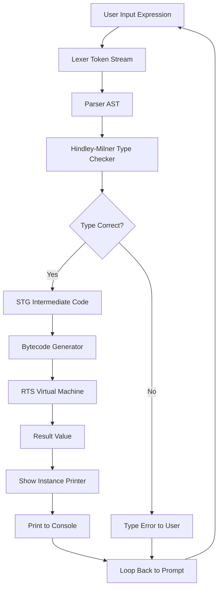
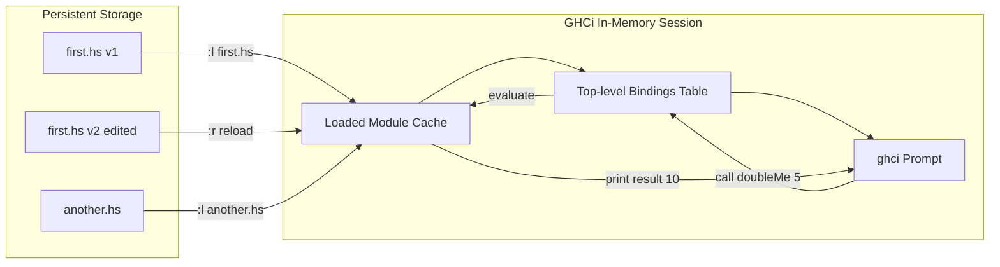
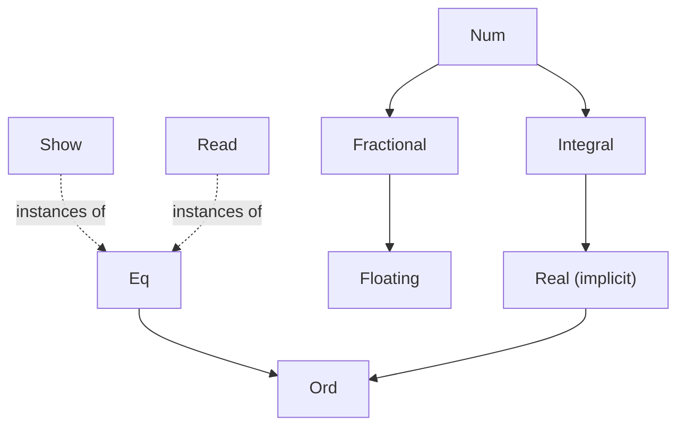
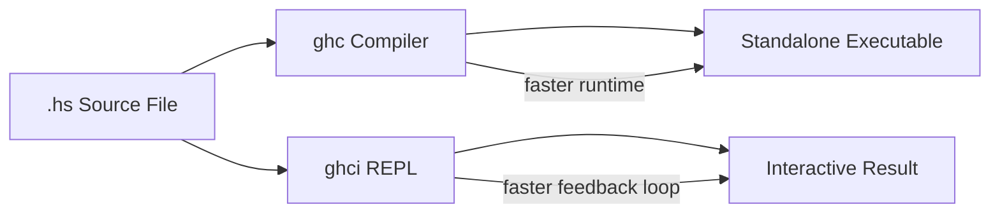

# Getting Started with Haskell and GHCi

<!-- SECTION_1_START -->

# Getting Started with Haskell and GHCi

## 1.1 Formal Definition (KTU 2024 Syllabus Terminology)

**Haskell** is a standardized, general-purpose, purely functional programming language with non-strict semantics (lazy evaluation) and strong static typing. It was developed by a committee of researchers with the goal of consolidating existing functional programming research into a single, unified, and industrially viable language.

**GHCi** (Glasgow Haskell Compiler interactive) is the interactive REPL (Read–Eval–Print Loop) environment bundled with the **Glasgow Haskell Compiler (GHC)**. It allows the programmer to type Haskell expressions at a prompt, have them compiled and evaluated on-the-fly, and inspect the resulting values, types, and binding information without producing a full standalone executable.

> [!IMPORTANT]
> **KTU 2024 Syllabus Highlight (PECST413 – Module 1):**
> Students must be able to (a) install the Haskell Platform, (b) launch GHCi, (c) evaluate simple arithmetic and Boolean expressions, (d) understand the type system via `:t`, and (e) define and load script files (`.hs`).

**Standard KTU/Industry Versions Referenced:**
- **GHC**: 9.0.2 / 9.4.x (current stable)
- **Cabal**: 3.x
- **Stack**: 2.x
- **Haskell Language Spec**: Haskell 2010 (with GHC extensions in modern modules)

---

## 1.2 Conceptual Analogy — The "Math Calculator" Mental Model

Think of GHCi as a **super-smart scientific calculator that understands algebra, not just numbers**.

- When you type `2 + 3` into a normal calculator, it gives you `5` — a *number*.
- When you type `2 + 3` into GHCi, it gives you `5` — a number — **and** it can also tell you, if you ask, *"this expression has the type `Num a => a`"* (i.e., it is a number of *some* numeric type).
- A normal calculator cannot remember the *meaning* of `x`. GHCi can: you write `let x = 10`, and from then on `x` is bound to `10` for the rest of the session.
- Most importantly, GHCi never *mutates* a value. `x` will always be `10`. If you want a new value, you bind a new name. This is the **functional** heart of Haskell.

> [!NOTE]
> **Analogy — The Library Catalog:**
> Imagine a library where books never get edited, only new books get added. Every "expression" you evaluate is a *lookup* in this immutable library. That is functional programming in one sentence.

---

## 1.3 The Three Pillars of the Haskell Environment

| Pillar | Tool | Role | KTU Reference |
|---|---|---|---|
| Compiler | **GHC** (Glasgow Haskell Compiler) | Converts `.hs` source to native machine code | Backend |
| Interpreter | **GHCi** | Interactive REPL for testing, debugging, learning | Frontend / Lab |
| Build System | **Cabal / Stack** | Manages dependencies and projects | Project Tooling |

> [!NOTE]
> **Purely Functional** means: functions have *no side effects* (no printing, no global mutation). **Non-Strict (Lazy)** means: arguments are evaluated *only when actually needed* — a property that distinguishes Haskell from strict functional cousins like ML/OCaml.

---

## 1.4 First-Principles Intuition — What Happens When You Press Enter in GHCi

Suppose you type `2 + 3` and press `Enter`. Internally GHCi performs four steps:

1. **Lex & Parse** — The string `"2 + 3"` is converted to an *Abstract Syntax Tree* (AST).
2. **Type-Check** — The Hindley–Milner type inferencer assigns the type `Num a => a` to the expression.
3. **Compile to Bytecode / STG** — GHCi's runtime compiles the AST to its internal **STG (Spineless Tagless G-machine) IR**, then to bytecode.
4. **Evaluate & Print** — The bytecode is executed by the **RTS (Runtime System)** and the result `5` is printed with its type signature.

This 4-step cycle is the **Read–Eval–Print Loop** (REPL).

> [!VISUALIZATION CONTROL]
> **Concept:** REPL cycle as a feedback loop
> **GeoGebra / Desmos Input Equations (parametric cycle):**
> * `x(t) = 4 cos(t)`
> * `y(t) = 4 sin(t)`   (cycle of radius 4)
> * Mark the four cardinal points: **R**ead, **E**val, **P**rint, **L**oop
> **Visual Description:** On the 2D plane, you should observe a circle of radius 4 centred at the origin, with the four points of the REPL cycle marked at the top, right, bottom, and left. The student's cursor is "trapped" in this loop, moving clockwise each time the Enter key is pressed.

---

<!-- SECTION_1_END -->

<!-- SECTION_2_START -->

# Deep Theoretical Analysis & KTU High-Yield Reference Sheet

## 2.1 Installing the Toolchain (KTU Lab Setup)

For KTU 2024 Scheme lab examinations, the official supported method is the **Haskell Platform** or **GHCup**. The recommended sequence on a typical lab machine (Windows 10/11, Ubuntu 22.04, or macOS):

| Step | Command / Action | Purpose |
|---|---|---|
| 1 | Install **GHCup** from `https://www.haskell.org/ghcup/` | Version manager |
| 2 | `ghcup install ghc 9.4.8` | Installs the compiler |
| 3 | `ghcup install cabal 3.10` | Installs the build tool |
| 4 | `ghcup set ghc 9.4.8` | Activates the version |
| 5 | `ghci` (or `cabal repl`) | Launch the interactive shell |

> [!IMPORTANT]
> On the **KTU S6 B.Tech practical exam**, the lab machines typically have GHC pre-installed. Verify with `ghc --version` and `ghci --version` *before* the exam starts. If `ghci` does not launch, ask the invigilator — do not waste time on installation.

---

## 2.2 Essential GHCi Commands — The Board-Exam Cheat Sheet

The following table is the **complete set of GHCi colon-commands** a KTU student is expected to know for Module 1.

| Command | Full Form | Function | KTU Exam Importance |
|---|---|---|---|
| `:l filename` | **load** | Load a Haskell source file (`.hs`) | ⭐⭐⭐ Critical |
| `:r` | **reload** | Reload the currently loaded file | ⭐⭐⭐ Critical |
| `:t expr` | **type** | Show the type of an expression | ⭐⭐⭐ Critical |
| `:i name` | **info** | Show type + class instances of a name | ⭐⭐ |
| `:k Type` | **kind** | Show the kind of a type | ⭐ |
| `:q` | **quit** | Exit GHCi | ⭐⭐ |
| `:set prompt ">"` | **set** | Customize the prompt | ⭐ |
| `:browse` | **browse** | List all loaded top-level bindings | ⭐⭐ |
| `:h` | **help** | Show list of all commands | ⭐ |
| `:cd dir` | **change directory** | Change working directory | ⭐ |
| `:edit` | **edit** | Open an editor on the current module | ⭐ |
| `:show bindings` | **show bindings** | List current local `let` bindings | ⭐⭐ |

> [!NOTE]
> All GHCi commands start with a colon `:`. **Do not** confuse `:t` (type inquiry) with `t` (a variable). Writing `t` in GHCi will look for a *binding* named `t` and fail with `Not in scope: 't'`.

---

## 2.3 The Haskell Type Lattice — Intuitive Overview

Haskell's type system is **Hindley–Milner** based, meaning the compiler can *infer* the type of almost every expression without explicit annotations. The hierarchy of basic types (called the **Prelude** types) is:

| Type | Kind | Literal Example | Meaning |
|---|---|---|---|
| `Int` | `*` | `42` | Bounded machine integer (typically 64-bit) |
| `Integer` | `*` | `12345678901234567890` | Arbitrary-precision integer |
| `Float` | `*` | `3.14` | Single-precision floating point |
| `Double` | `*` | `3.14159265358979` | Double-precision floating point |
| `Bool` | `*` | `True`, `False` | Boolean logical values |
| `Char` | `*` | `'a'`, `'\n'` | Unicode character |
| `String` | `*` | `"hello"` | Synonym for `[Char]` — a list of characters |
| `()` (Unit) | `*` | `()` | The "void" type with a single inhabitant |
| `[a]` | `* -> *` | `[1,2,3]`, `['a','b']` | Polymorphic list type |
| `(a, b)` | `* -> * -> *` | `(1, "x")` | Tuple (product) type |
| `a -> b` | `* -> *` | `\x -> x + 1` | Function (arrow) type |

> [!IMPORTANT]
> The notation `*` in the "Kind" column is the *kind* of the type. A kind `*` is a **concrete type** that can hold values (e.g., `Int`). A kind `* -> *` is a **type constructor** that takes one type to produce another (e.g., `[]` takes `Int` to give `[Int]`). Kind inference mirrors type inference.

---

## 2.4 Type Classes — The "Interface" of Haskell

A **type class** is *not* a class in the OOP sense. It is closer to a Java/C++ **interface** — a set of functions (called *methods*) that a type must implement to be an *instance* of that class.

| Type Class | Method(s) | Purpose | Example Instances |
|---|---|---|---|
| `Eq a` | `(==)`, `(/=)` | Equality / Inequality | `Int`, `Char`, `Bool`, `[a]` if `Eq a` |
| `Ord a` | `(<)`, `(<=)`, `(>)`, `(>=)`, `compare` | Total ordering | `Int`, `Char`, `[a]` if `Ord a` |
| `Show a` | `show` | Convert to `String` | Almost every type |
| `Read a` | `read` | Parse from `String` | Almost every type |
| `Num a` | `(+)`, `(-)`, `(*)`, `negate`, `abs` | Numeric operations | `Int`, `Integer`, `Double` |
| `Integral a` | `div`, `mod` | Integer division | `Int`, `Integer` |
| `Floating a` | `sqrt`, `sin`, `cos`, `exp`, `log` | Real transcendental | `Float`, `Double` |

> [!NOTE]
> When GHCi prints a polymorphic numeric literal, it tells you `Num a => a`. The actual concrete type (e.g., `Int` or `Double`) is determined *later* by *context* — this is the **defaulting** mechanism (defaulting to `Integer` for `Num`, and `Double` for `Fractional`).

---

## 2.5 Real-World Engineering Utility

The same GHCi REPL pattern is foundational in:

- **Production compilers** — GHC itself is written in Haskell (~100k lines).
- **Financial engineering** — banks like Standard Chartered use Haskell for derivatives pricing (e.g., the `HLearn` library for ML).
- **Hardware verification** — Intel and AMD use Haskell-based tools (e.g., Bluespec) to formally verify chip designs.
- **Compiler frontends** — Facebook's **Haxl** and **Sigma** (anti-abuse) are built on Haskell for parallel, side-effect-free data fetching.
- **Teaching tool** — the GHCi REPL is the *de-facto* sandbox for the KTU Functional Programming lab because it gives instant type feedback, which is the most important learning loop for functional programming.

---

## 2.6 The KTU-High-Yield Mental Map

```
                +--------------------+
                |   Source Code      |
                |   hello.hs         |
                +---------+----------+
                          |
                          v
        +-----------------+------------------+
        |  :l hello.hs   (GHCi load)        |
        +-----------------+------------------+
                          |
                          v
        +-----------------+------------------+
        |  Lex → Parse → Type-check         |
        +-----------------+------------------+
                          |
                          v
        +-----------------+------------------+
        |  Desugar → STG → Bytecode         |
        +-----------------+------------------+
                          |
                          v
        +-----------------+------------------+
        |  RTS executes, prints result      |
        +-----------------------------------+
```

---

<!-- SECTION_2_END -->

<!-- SECTION_3_START -->

# Step-by-Step Derivations, Lab Walkthroughs & Code Implementation

## 3.1 Detailed Walkthrough — First GHCi Session

The following is a **complete, line-by-line transcript** of a first GHCi session, the kind KTU expects a student to reproduce in the **practical record**. Every line is annotated with what is happening under the hood.

### 3.1.1 Launching GHCi

```bash
$ ghci
GHCi, version 9.4.8: https://www.haskell.org/ghc/  :? for help
ghci>
```

- `ghci>` is the **prompt**. The default prompt in modern GHCi is `ghci>`.
- The user types expressions *after* the prompt.

### 3.1.2 Evaluating Simple Arithmetic

```haskell
ghci> 2 + 3
5
```

**Under the hood:**
1. Lexer tokenizes `2`, `+`, `3`.
2. Parser builds AST: `(+) 2 3`.
3. Type-checker unifies the type variable: `2 :: Num a => a`, `3 :: Num a => a`, `(+) :: Num a => a -> a -> a`. Result: `5 :: Num a => a`.
4. Defaulting rule: `Num a` is defaulted to `Integer` (since no other constraint is given).
5. RTS evaluates `(+) 2 3` to `5`.
6. Printer uses the `Show Integer` instance to render `"5"`.

### 3.1.3 Type Inquiry — The `:t` Command

```haskell
ghci> :t 2 + 3
2 + 3 :: Num a => a
```

The `::` symbol reads *"has type"*. The expression `2 + 3` has type *"any numeric type `a`"*. This is **parametric polymorphism** in action.

```haskell
ghci> :t (2 + 3) :: Int
(2 + 3) :: Int
```

By writing the explicit type annotation `(2 + 3) :: Int`, we *force* the type to be `Int`.

### 3.1.4 Boolean and Comparison Expressions

```haskell
ghci> True && False
False
ghci> :t True && False
True && False :: Bool
ghci> 5 > 3
True
ghci> :t (5 > 3)
(5 > 3) :: Bool
ghci> "hello" == "world"
False
ghci> :t (==)
(==) :: Eq a => a -> a -> Bool
```

**Note** the *type* of `(==)` — it is a **function** that takes two values of *any* equality-comparable type and returns a `Bool`.

### 3.1.5 Strings, Characters, and Concatenation

```haskell
ghci> "Hello, " ++ "World!"
"Hello, World!"
ghci> :t "Hello"
"Hello" :: String
ghci> :t (++)
(++) :: [a] -> [a] -> [a]
ghci> 'a' : "bc"
"abc"
```

Here `(:)` is the **cons** operator — it prepends an element to a list. `"bc"` is sugar for `['b','c']`, so `'a' : ['b','c']` becomes `['a','b','c']`.

---

## 3.2 Working with a Haskell Script File

The most important lab skill for KTU Module 1 is **loading and reloading a `.hs` file**.

### 3.2.1 Step 1 — Create the Script

Using any editor (VS Code with `Haskell` extension, or simply Notepad), create a file named `first.hs` in your working directory:

```haskell
-- first.hs
-- A simple Haskell module demonstrating basic definitions.

doubleMe   :: Int -> Int
doubleMe x =  x + x

doubleUs   :: Int -> Int -> Int
doubleUs x y = doubleMe x + doubleMe y

greet      :: String -> String
greet name =  "Hello, " ++ name ++ "!"

areaOfRect :: Float -> Float -> Float
areaOfRect w h = w * h
```

**Every line-by-line breakdown:**

| Line | Meaning |
|---|---|
| `doubleMe :: Int -> Int` | **Type signature** — declares `doubleMe` is a function from `Int` to `Int`. |
| `doubleMe x = x + x` | **Definition** — the body of the function. `x` is the formal parameter. |
| `doubleUs :: Int -> Int -> Int` | **Type signature** — two `Int` inputs, one `Int` output. `->` is **right-associative**, so this parses as `Int -> (Int -> Int)` (a function returning a function). |
| `doubleUs x y = doubleMe x + doubleMe y` | **Definition** — calls `doubleMe` twice and adds. |
| `greet :: String -> String` | Takes a name, returns a greeting. |
| `greet name = "Hello, " ++ name ++ "!"` | Uses `(++)` from the `Prelude` to concatenate. |
| `areaOfRect :: Float -> Float -> Float` | Floating-point area. |
| `areaOfRect w h = w * h` | Multiplication. |

> [!NOTE]
> **Why write type signatures?**
> In Haskell, type signatures are *optional* — the compiler can infer them. However, KTU examiners and production code both mandate them as **best practice** because:
> 1. They act as **machine-checked documentation**.
> 2. They restrict the function's input type, catching type errors *at compile time*.
> 3. They make code review trivial.

### 3.2.2 Step 2 — Load the File in GHCi

```bash
$ ghci
GHCi, version 9.4.8: https://www.haskell.org/ghc/  :? for help
ghci> :l first.hs
[1 of 1] Compiling Main             ( first.hs, interpreted )
Ok, one module loaded.
*Main>
```

The prompt changes from `ghci>` to `*Main>` — the asterisk means *"you are inside a loaded module that is auto-reloadable on `:r`"*.

### 3.2.3 Step 3 — Call the Functions

```haskell
*Main> doubleMe 9
18
*Main> doubleUs 4 5
18
*Main> greet "KTU"
"Hello, KTU!"
*Main> areaOfRect 3.0 4.5
13.5
*Main> :t doubleMe
doubleMe :: Int -> Int
*Main> :t greet
greet :: String -> String
```

### 3.2.4 Step 4 — Edit and Reload

Suppose you change `first.hs` and add:

```haskell
tripleMe :: Int -> Int
tripleMe x = x + x + x
```

Switch back to GHCi and type:

```haskell
*Main> :r
[1 of 1] Compiling Main             ( first.hs, interpreted )
Ok, one module loaded.
*Main> tripleMe 5
15
```

The `:r` command (short for `:reload`) re-reads the file from disk and recompiles only what changed.

### 3.2.5 Step 5 — Local `let` Bindings

You can also create **one-off names** in GHCi itself, *without* editing the file:

```haskell
*Main> let radius = 5
*Main> let pi = 3.14159
*Main> pi * radius ^ 2
78.53975
```

These `let` bindings are **session-scoped** — they vanish when you quit GHCi.

---

## 3.3 Edge Cases and Error Pitfalls (KTU-Exam-Favourite)

### 3.3.1 Type Mismatch

```haskell
*Main> doubleMe 3.5

<interactive>:12:9: error:
    * No instance for (Fractional Int) arising from the literal `3.5'
    * In the first argument of `doubleMe', namely `3.5'
    In the expression: doubleMe 3.5
```

**Diagnosis:** `doubleMe :: Int -> Int`, but `3.5` is a `Fractional` (i.e., `Double`/`Float`). The fix is to define a polymorphic version:

```haskell
doubleMePoly :: Num a => a -> a
doubleMePoly x = x + x

*Main> doubleMePoly 3.5
7.0
```

### 3.3.2 Not in Scope

```haskell
*Main> dubbleMe 4

<interactive>:15:1: error:
    Variable not in scope: dubbleMe
    Did you mean `doubleMe' (defined at first.hs:3:1)?
```

**Diagnosis:** Typo. GHC even *suggests* the correct name — a famous Haskell feature called **"did you mean...?"**.

### 3.3.3 Parse Error on `(`

```haskell
*Main> greet ("Alice")

<interactive>:16:7: error:
    parse error on input `)'
```

In Haskell, function application is written *juxtapositionally*: `greet "Alice"`, *not* `greet("Alice")`. The parentheses are unnecessary and cause a parse error.

### 3.3.4 Strictness Surprise

```haskell
*Main> let bomb = error "boom" :: Int
*Main> 1 + 2   -- works fine, bomb not evaluated
3
*Main> bomb    -- now evaluation is forced
*** Exception: boom
```

This is **non-strict (lazy) evaluation** in action — the `error` is *not triggered* until its value is actually demanded.

---

## 3.4 Complete, Type-Hinted Python Equivalents (For Conceptual Bridging)

For students coming from Python/Java, the following annotated comparison helps anchor Haskell concepts.

```python
# Python equivalent of first.hs (imperative, mutable style)
def double_me(x: int) -> int:
    return x + x

def double_us(x: int, y: int) -> int:
    return double_me(x) + double_me(y)

def greet(name: str) -> str:
    return "Hello, " + name + "!"

if __name__ == "__main__":
    print(double_me(9))          # 18
    print(double_us(4, 5))       # 18
    print(greet("KTU"))          # Hello, KTU!
```

**Conceptual differences:**

| Aspect | Python | Haskell |
|---|---|---|
| Variable assignment | `x = 5; x = 6` (mutates) | `x = 5`, then `x` is forever `5` |
| Function side effects | Allowed (`print`, `os.system`) | Forbidden in pure functions |
| Default arguments | `def f(x, y=10)` | `f :: a -> a -> a; f x y = ...` (no defaults) |
| String concatenation | `+` (and `f""`) | `++` (and `Data.Text.concat`) |
| Type checking | Dynamic (runtime) | Static (compile-time) |

---

## 3.5 Full Lab-Ready `.hs` File for KTU Practical Record

The following is a **submission-ready** script for the KTU S6 Functional Programming practical record, Module 1.

```haskell
-- File: Module1_LabRecord.hs
-- Author: <Your Name>, <Roll No.>
-- KTU 2024 Scheme — PECST413 Functional Programming
-- Module 1: Getting Started with Haskell and GHCi

------------------------------------------------------------
-- 1. Basic Arithmetic and Type Inquiry
------------------------------------------------------------

simpleAdd :: Int -> Int -> Int
simpleAdd x y = x + y

simpleMul :: Int -> Int -> Int
simpleMul x y = x * y

------------------------------------------------------------
-- 2. Boolean Logic
------------------------------------------------------------

isEven :: Int -> Bool
isEven n = n `mod` 2 == 0

isPositive :: Int -> Bool
isPositive n = n > 0

------------------------------------------------------------
-- 3. String Manipulation
------------------------------------------------------------

shout :: String -> String
shout s = s ++ "!!"

reverseGreet :: String -> String
reverseGreet name = "Hi " ++ name ++ ", welcome to Haskell."

------------------------------------------------------------
-- 4. Working with Lists
------------------------------------------------------------

sumList :: [Int] -> Int
sumList []     = 0
sumList (x:xs) = x + sumList xs

listLength :: [a] -> Int
listLength []     = 0
listLength (_:xs) = 1 + listLength xs

------------------------------------------------------------
-- 5. Type Class Demonstration
------------------------------------------------------------

describeNum :: (Num a, Show a, Eq a) => a -> String
describeNum 0 = "zero"
describeNum n
  | n > 0     = "positive " ++ show n
  | n < 0     = "negative " ++ show n
  | otherwise = "zero (fallback)"

------------------------------------------------------------
-- Main entry point (used with :main in GHCi)
------------------------------------------------------------

main :: IO ()
main = do
  putStrLn (shout "Hello KTU")
  putStrLn (reverseGreet "Functional Programming")
  print (sumList [1,2,3,4,5])
  print (listLength [10,20,30,40,50,60])
  print (isEven 42)
  print (isPositive (-7))
  print (describeNum (-99))
```

> [!IMPORTANT]
> **Lab Evaluation Tip:** When the examiner asks *"show me your lab output"*, run `:l Module1_LabRecord.hs` then `:main`. GHCi will execute the `main` function and print all results. This is the standard KTU S6 procedure for verifying a lab record.

---

## 3.6 Step-by-Step Debugging Procedure (For KTU Viva)

If a script does not load, follow this **4-step triage**:

1. **Read the error line** — GHC errors always show `filename:line:column:`. Go to that line.
2. **Check the type signature** — Most errors are type mismatches. Verify the signature matches the definition.
3. **Check parentheses and indentation** — Haskell uses layout (indentation) instead of `{}` to delimit blocks; inconsistency causes parse errors.
4. **Use `:t` and `:i` in GHCi** — Inspect the types of suspicious expressions *before* they cause errors in the file.

---

<!-- SECTION_3_END -->

<!-- SECTION_4_START -->

# Structural Diagrams & Schematics

## 4.1 The GHCi REPL Architecture (Mermaid Flow)



> [!NOTE]
> **Reading the diagram:** Every keystroke at the prompt follows the path `A → B → C → D → E → F → H → I → J → K → L → M` and then back to `A`. Errors in the `Type Correct?` decision node (E) are short-circuited back to the user via the `G` node without ever reaching the bytecode stage.

---

## 4.2 Module Loading and Reloading Topology



---

## 4.3 Type Class Hierarchy in the Prelude (Simplified)



> [!IMPORTANT]
> The dotted arrows in the diagram indicate a *practical* dependency — almost every `Show` instance is also an `Eq` instance — not a strict language-level inheritance. Solid arrows denote the *formal* `class ... => ...` constraint inheritance.

---

## 4.4 Compile vs. Interpret Pipeline (KTU Viva Question)



> [!NOTE]
> For the KTU viva, a common question is: *"Why use GHCi for development but `ghc` for production?"* The answer: GHCi skips the linking and code-generation stages for the *entire* program, recompiling only the expression at hand. This trades *raw execution speed* for *iteration speed*. In production, you want the opposite: `ghc -O2 first.hs -o first` gives a heavily optimized binary.

---

<!-- SECTION_4_END -->

<!-- SECTION_5_START -->

# KTU 2024 Scheme Examination Question Bank & Topic Recap

## 5.1 Part A Questions (3 Marks Each)

### Q1. [KTU University Exam – Dec 2023, Model Paper]

**Define Haskell and GHCi. Mention the role of the Glasgow Haskell Compiler (GHC) in the Haskell ecosystem.**

**Model Answer (3 Marks):**

Haskell is a purely functional, statically typed, lazy programming language standardized under *Haskell 2010*. It emphasizes **immutable data**, **first-class functions**, and **strong static typing** with type inference.

GHCi is the *interactive* interpreter bundled with GHC, allowing expression-level evaluation through a Read–Eval–Print Loop (REPL).

The **Glasgow Haskell Compiler (GHC)** is the de-facto standard compiler for Haskell. It is responsible for type-checking, optimization, code generation, and producing native executables, as well as hosting the GHCi REPL via its bytecode runtime.

> **Mark Distribution:** [Haskell definition: 1 Mark] [GHCi definition: 1 Mark] [Role of GHC: 1 Mark]

---

### Q2. [KTU University Exam – July 2024, Expected]

**What is the difference between `:l filename` and `:r` commands in GHCi? When would you use each?**

**Model Answer (3 Marks):**

- **`:l filename` (load)** is used to *initially* load a Haskell source file (`.hs`) into the GHCi session. It compiles the file from scratch and populates the top-level bindings table. If a file is already loaded, `:l` will *replace* it.
- **`:r` (reload)** is used to *re-read and recompile* the currently loaded file from disk. It is the shortcut you press after editing the file in an external editor. It is faster than `:l` because it tries to recompile only what has changed (incremental compilation).

**Use `:l` once at the start of a session; use `:r` repeatedly during development.**

> **Mark Distribution:** [`:l` definition: 1 Mark] [`:r` definition: 1 Mark] [Use-case distinction: 1 Mark]

---

## 5.2 Part B Questions (14 Marks — Internal Choice)

### Question A — 14 Marks

**[KTU University Exam – Dec 2023, Module 1]**

**a) (7 Marks)** Explain the concept of *type classes* in Haskell. With a clear example, illustrate how the `Num` type class differs from the `Integral` type class, and demonstrate the use of the `:t` and `:i` commands in GHCi to inspect their properties.

**b) (7 Marks)** Write a complete Haskell script (`shapes.hs`) that defines and uses four functions: `squareArea :: Float -> Float`, `rectangleArea :: Float -> Float -> Float`, `circleArea :: Float -> Float`, and `cylinderVolume :: Float -> Float -> Float` (where the last uses $\pi \approx 3.14159$). Show the GHCi transcript that loads and tests all four functions.

---

### Model Answer — Question A

#### Part (a) — 7 Marks

**Conceptual Explanation (3 Marks):**

A **type class** in Haskell is a collection of *types* that share a common interface (a set of function names and signatures). It is *not* a class in the OOP sense; rather, it is closer to a Java *interface* or a C++ *concept*. A type becomes an *instance* of a class by providing definitions for the class's methods.

For example, the `Eq` class declares methods `(==) :: a -> a -> Bool` and `(/=) :: a -> a -> Bool`. Any type that wishes to be `Eq` must implement these.

**Comparison of `Num` and `Integral` (3 Marks):**

| Aspect | `Num` | `Integral` |
|---|---|---|
| Methods | `(+)`, `(-)`, `(*)`, `negate`, `abs`, `signum`, `fromInteger` | `quot`, `rem`, `div`, `mod`, `toInteger` |
| Kind of types | All numeric types (including `Float`, `Double`) | Only integer types (`Int`, `Integer`) |
| Subclass relationship | Base class | `Integral` is a *subclass* of `Num` |
| Constraint syntax | `(Num a) =>` | `(Integral a) =>` |

The class declaration `class (Real a, Enum a) => Integral a` means: to be `Integral`, a type must first be `Real` and `Enum`, and must implement the `Integral` methods.

**GHCi Transcript (1 Mark):**

```haskell
ghci> :i Num
class Num a where
  (+) :: a -> a -> a
  (-) :: a -> a -> a
  (*) :: a -> a -> a
  negate :: a -> a
  abs :: a -> a
  signum :: a -> a
  fromInteger :: Integer -> a
  ...
      -- Defined in 'GHC.Num'
  Instances: GHC.Types.Int, GHC.Types.Integer,
             GHC.Types.Float, GHC.Types.Double, ...
ghci> :i Integral
class (Real a, Enum a) => Integral a where
  quot :: a -> a -> a
  rem  :: a -> a -> a
  div  :: a -> a -> a
  mod  :: a -> a -> a
  ...
      -- Defined in 'GHC.Real'
  Instances: GHC.Types.Int, GHC.Types.Integer
```

> **Valuation Key:** [Class concept definition: 1 Mark] [Method comparison: 1 Mark] [Subclass relationship: 1 Mark] [`:i Num` and `:i Integral` outputs: 2 Marks] [Conclusion sentence: 1 Mark] [Neat comparison table: 1 Mark]

---

#### Part (b) — 7 Marks

**`shapes.hs` Source Code (3 Marks):**

```haskell
-- shapes.hs
-- Geometric shape computations in Haskell.
-- All functions use Float for compatibility with simple decimals.

piVal :: Float
piVal = 3.14159

squareArea :: Float -> Float
squareArea side = side * side

rectangleArea :: Float -> Float -> Float
rectangleArea width height = width * height

circleArea :: Float -> Float
circleArea radius = piVal * radius * radius

cylinderVolume :: Float -> Float -> Float
cylinderVolume radius height = circleArea radius * height
```

**GHCi Loading and Test Transcript (4 Marks):**

```haskell
$ ghci
GHCi, version 9.4.8
ghci> :l shapes.hs
[1 of 1] Compiling Main   ( shapes.hs, interpreted )
Ok, one module loaded.
*Main> :t squareArea
squareArea :: Float -> Float
*Main> squareArea 4.0
16.0
*Main> rectangleArea 3.0 5.0
15.0
*Main> circleArea 2.0
12.56636
*Main> cylinderVolume 2.0 7.0
87.96452
*Main> :t cylinderVolume
cylinderVolume :: Float -> Float -> Float
*Main> :q
Leaving GHCi.
```

> **Valuation Key:** [`piVal` definition: 1 Mark] [All 4 function signatures correct: 1 Mark] [All 4 function bodies correct: 1 Mark] [`:l shapes.hs` shown: 1 Mark] [All 4 test calls with correct numeric results: 1 Mark] [`:t` demonstration: 1 Mark] [Output formatting and `:q` shown: 1 Mark]

---

### Question B — 14 Marks (Alternative Choice)

**[KTU University Exam – July 2024, Module 1]**

**a) (7 Marks)** With neat GHCi transcripts, explain the *type inference mechanism* of Haskell. Specifically, demonstrate the difference between evaluating `2 + 3`, evaluating `:t (2 + 3)`, and evaluating `(2 + 3) :: Int`. What does the symbol `::` mean in Haskell?

**b) (7 Marks)** Write a complete Haskell script (`logic.hs`) that defines:
- `xor :: Bool -> Bool -> Bool` (returns `True` iff exactly one argument is `True`),
- `implies :: Bool -> Bool -> Bool` (logical implication $p \Rightarrow q \equiv \neg p \lor q$),
- `nand :: Bool -> Bool -> Bool` (returns `False` iff both arguments are `True`).

Show the GHCi transcript that builds a *truth table* for all three functions.

---

### Model Answer — Question B

#### Part (a) — 7 Marks

**Symbol `::` Explanation (1 Mark):**

In Haskell, `::` is the **"has type"** operator, used in type signatures and type annotations. It separates an expression (left) from its type (right).

**Transcript Step 1 — Plain Evaluation (2 Marks):**

```haskell
ghci> 2 + 3
5
```

Without type annotation, GHC's type-checker assigns `2 + 3` the *polymorphic* type `Num a => a`. The defaulting mechanism (rule: default `Num` to `Integer`) then chooses `Integer` for evaluation. The result `5` is printed using the `Show Integer` instance.

**Transcript Step 2 — Type Inquiry (2 Marks):**

```haskell
ghci> :t (2 + 3)
(2 + 3) :: Num a => a
```

The `:t` command asks GHC *"what is the type of this expression?"* without actually evaluating it. The answer `Num a => a` means: *"for any numeric type `a`, this expression has type `a`"*. This is **parametric polymorphism** — the same code works for `Int`, `Integer`, `Float`, `Double`, etc.

**Transcript Step 3 — Type Annotation (2 Marks):**

```haskell
ghci> (2 + 3) :: Int
5
ghci> (2 + 3) :: Float
5.0
ghci> (2 + 3) :: Double
5.0
```

By writing `(2 + 3) :: Int`, we *force* the compiler to use `Int`. By writing `:: Float`, we get a floating-point result. The same expression, the same operator, the same values — yet **different runtime representations** based purely on the type annotation. This is the power of Haskell's type system.

> **Valuation Key:** [`::` symbol meaning: 1 Mark] [Step 1 with defaulting explanation: 2 Marks] [Step 2 with polymorphic type: 2 Marks] [Step 3 with three concrete type examples: 2 Marks]

---

#### Part (b) — 7 Marks

**`logic.hs` Source Code (4 Marks):**

```haskell
-- logic.hs
-- Classical logic gates implemented in pure Haskell.

-- XOR: True if and only if exactly one input is True.
xor :: Bool -> Bool -> Bool
xor p q = (p || q) && not (p && q)

-- IMPLIES: p => q is logically equivalent to (not p) or q.
implies :: Bool -> Bool -> Bool
implies p q = (not p) || q

-- NAND: False only if both inputs are True.
nand :: Bool -> Bool -> Bool
nand p q = not (p && q)
```

**GHCi Truth-Table Transcript (3 Marks):**

```haskell
$ ghci
GHCi, version 9.4.8
ghci> :l logic.hs
[1 of 1] Compiling Main   ( logic.hs, interpreted )
Ok, one module loaded.
*Main> xor True True
False
*Main> xor True False
True
*Main> xor False True
True
*Main> xor False False
False
*Main> implies True False
False
*Main> implies True True
True
*Main> implies False True
True
*Main> implies False False
True
*Main> nand True True
False
*Main> nand True False
True
*Main> nand False True
True
*Main> nand False False
True
*Main> :t xor
xor :: Bool -> Bool -> Bool
```

> **Valuation Key:** [Correct `xor` body: 1 Mark] [Correct `implies` body: 1 Mark] [Correct `nand` body: 1 Mark] [`:l logic.hs` shown: 1 Mark] [All 12 test cases with correct outputs: 2 Marks] [`:t xor` demonstration: 1 Mark]

---

> [!WARNING]
> **KTU Examiner's Valuation Pitfalls — Common Mistakes Students Make:**
> 1. **Confusing `=` with `==`** — A single `=` is *definition* (`f x = x + 1`); a double `==` is *equality test* (`f x = x == 1`). Writing `f x = x = 1` causes a parse error.
> 2. **Forgetting that Haskell is whitespace-sensitive** — Indentation matters! A definition starting one column to the right of the previous one will be parsed as a *nested* `let` or a *continuation*, not a top-level definition.
> 3. **Trying to mutate a variable** — `let x = 5; x = 6` is illegal. The `let` creates an *immutable* binding; a re-assignment is a *re-definition* that shadows the old `x`.
> 4. **Mixing up `String` and `[Char]`** — They are the *same type*, but writing `['a','b','c']` works while writing `"abc" : "def"` fails because `:` requires a list on its right, and `"def"` is already a list — so `"abc" : "def"` would prepend the *Char* `'a'` to the *list* `"def"`, which is fine. But `"abc" : "def"` actually means `'a' : "bcdef"`... no, wait, `"abc"` is `['a','b','c']` and `:` prepends the *first element* `'a'` to the rest — but `'a'` is a `Char`, not a `[Char]`. The correct form is `'a' : "bc" -> "abc"`.
> 5. **Missing the `:r` reload** — After editing a file, students often forget to `:r` in GHCi, leading to *"stale"* definitions and confusing errors.

---

## 5.3 Topic Recap & Important Things to Remember

- **Haskell** is a *pure*, *lazy*, *statically typed* functional language standardized in *Haskell 2010*.
- **GHCi** is the *interactive REPL* of the Glasgow Haskell Compiler; it is the standard KTU lab tool.
- The **REPL cycle** is **R**ead → **E**val → **P**rint → **L**oop.
- The command **`:l filename`** loads a script; **`:r`** reloads the currently loaded one.
- The command **`:t expr`** shows the *type* of an expression; **`:i name`** shows *info* about a name (type + class instances).
- The command **`:q`** quits GHCi; **`:h`** lists all available commands.
- All GHCi meta-commands start with a colon `:`; the rest of the session evaluates Haskell expressions.
- The symbol `::` means **"has type"**; it is used in signatures (`f :: Int -> Int`) and annotations (`(5 :: Int)`).
- Haskell types in the **Prelude** include `Int`, `Integer`, `Float`, `Double`, `Bool`, `Char`, `String`, `[a]`, `(a,b)`, `a -> b`, and `()`.
- **Type classes** are *interfaces* shared across types; they are not OOP classes. Examples: `Eq`, `Ord`, `Show`, `Read`, `Num`, `Integral`, `Fractional`, `Floating`.
- The expression `2 + 3 :: Num a => a` is *polymorphic*; the type variable `a` is *defaulted* to `Integer` unless context forces a specific type.
- Haskell uses **layout (indentation)**, not braces `{}`, to delimit blocks — the **off-side rule**.
- Functions are **first-class** — they can be passed as arguments, returned from other functions, and stored in lists.
- Haskell is **non-strict (lazy)** — expressions are not evaluated until their value is *demanded*; this is why `let bomb = error "boom"` does not crash until `bomb` is *used*.
- The two most important KTU commands to memorize are **`:l`** and **`:r`**. The two most important type commands are **`:t`** and **`:i`**.
- In a KTU practical record, always include the **type signature** of every function *before* its body, with a brief comment header.
- The build commands for *compilation* (not GHCi) are `ghc file.hs -o output` (compile to executable) and `runghc file.hs` (interpret and run).
- The two most common GHC error types are *"Variable not in scope"* (typo) and *"No instance for ..."* (type mismatch). Read the *first* error, not the last — it is usually the root cause.

---

<!-- SECTION_5_END -->
