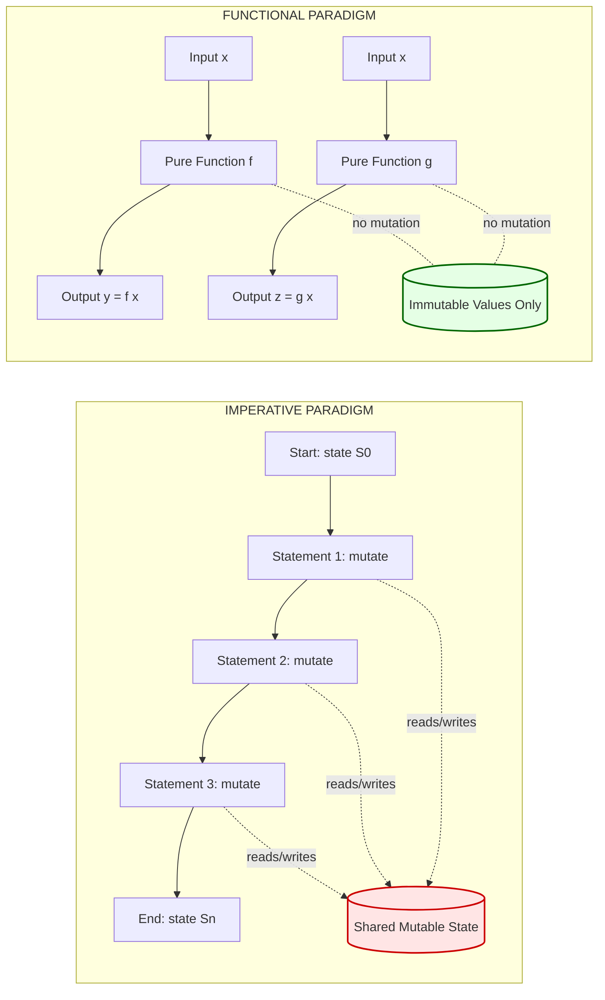
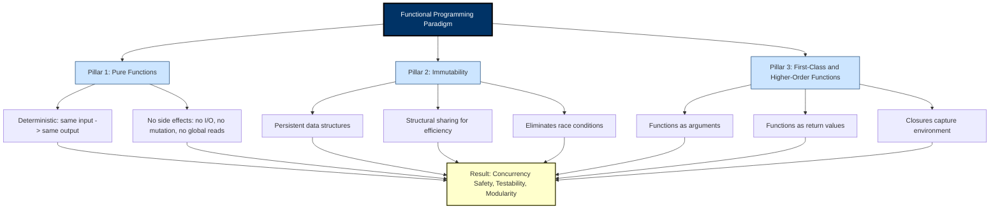
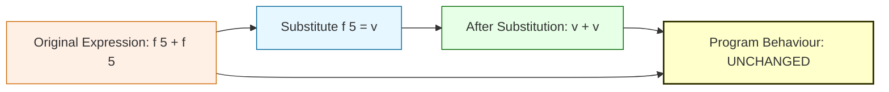

# Introducing Functional Programming

<!-- SECTION_1_START -->
# Module 1 — Introducing Functional Programming

## 1.1 Core Technical Definition

> [!IMPORTANT]
> **Formal KTU 2024 Definition**
> *Functional Programming (FP)* is a **declarative programming paradigm** in which computations are treated as the **evaluation of mathematical functions** that map inputs to outputs, **avoiding mutable state and side effects**. The program is constructed by **composing pure functions**, where the output depends *only* on the input arguments and *not* on any hidden internal or external state.

In simpler board-friendly language: *Functional programming is a style of writing code where you describe **what** to compute using functions, instead of **how** to compute it step by step.*

The KTU 2024 PECST413 syllabus identifies functional programming as a paradigm rooted in the **lambda calculus** developed by **Alonzo Church in 1936**, and practically realized in languages like **Haskell, Lisp, ML, Erlang, Clojure, Scala**, and **F#**.

## 1.2 Conceptual Analogy / Intuition

> [!NOTE]
> **Analogy — The Vending Machine**
> Think of a **pure function** as a *vending machine*. You insert a coin (input), press a button (function name), and out comes a soda (output). The machine:
> - **Always gives the same soda for the same coin + button** (deterministic).
> - **Does not remember your previous purchases** (no hidden state).
> - **Does not secretly drink your soda before handing it to you** (no side effects).
>
> Now contrast this with an *imperative program*, which is like a *chef* in a kitchen — every time you ask for a dish, the chef may modify the ingredients, change the recipe slightly, or leave some leftovers lying around (mutating state and producing side effects).

## 1.3 Mathematical Foundation: Function as a Mapping

A function in FP is the same as a function in mathematics:
$$f : A \rightarrow B$$

This reads as: *"$f$ is a function that maps every element of set $A$ to exactly one element of set $B$."*

Key implications:
- The same input $x \in A$ will **always** produce the same output $f(x) \in B$.
- The function does **not modify** $A$ or any other state.
- The output is **fully determined** by the input.

> [!TIP]
> **KTU Board Tip:** Whenever you write a definition of FP in your exam, always mention the three pillars — **(i) Pure functions, (ii) Immutability, (iii) First-class/Higher-order functions** — these are *favourite* valuation keywords for examiners.

## 1.4 GeoGebra / Desmos Integration

> [!VISUALIZATION CONTROL]
> **Concept:** Visualizing a pure function as a mapping $f : A \rightarrow B$ (set diagram)
> **GeoGebra / Desmos Input Equations (set points):**
> * `A = {(1, 0), (2, 0), (3, 0), (4, 0)}`  *(domain elements on x-axis)*
> * `B = {(0, 2), (0, 4), (0, 6), (0, 8)}`  *(codomain elements on y-axis)*
> * `f: x ↦ 2x`  *(pure function rule)*
> **Visual Description:** A grid is drawn with the domain values 1, 2, 3, 4 along the horizontal axis and codomain values 2, 4, 6, 8 along the vertical axis. Arrows connect each domain element $x$ to its unique image $2x$ in the codomain. Notice that **no two arrows leave from the same $x$** (deterministic) and **no arrow loops back into $A$** (no mutation of the input). The picture captures the essence of *referential transparency*.

## 1.5 Why Functional Programming? — Engineering Motivation

In modern software engineering, FP is valued for:
- **Concurrency**: Pure functions are inherently thread-safe, since they don't share mutable state.
- **Reasoning & Debugging**: Each function can be tested in isolation.
- **Composability**: Small functions combine to build complex systems (like LEGO blocks).
- **Compiler Optimizations**: Pure functions allow aggressive inlining, memoization, and parallelism.
- **Formal Verification**: Because FP code closely mirrors mathematical expressions, it is easier to prove correct.

Industries that use FP at scale: **WhatsApp (Erlang)**, **Facebook (Hack/HHVM)**, **Standard Chartered (F#)**, **Jane Street (OCaml)**, **Twitter (Scala)**.

<!-- SECTION_1_END -->

<!-- SECTION_2_START -->
# 2. Deep Theoretical Analysis & KTU High-Yield Properties Sheet

## 2.1 The Three Pillars of Functional Programming

### Pillar 1 — Pure Functions
A function is *pure* if it satisfies **two conditions**:
1. **Deterministic** — same input → same output, every single time.
2. **No side effects** — it does not modify any external state, does not perform I/O, does not mutate arguments, and does not depend on hidden state.

Mathematically, a pure function $f$ can be expressed as:
$$\forall x \in A, \; \forall t_1, t_2 : f(x) = y \quad \text{(independent of time } t_1, t_2 \text{ and history)}$$

### Pillar 2 — Immutability
Once a data structure is created, it **cannot be modified**. Instead of mutating, FP programs **create new** data structures. For example, instead of `append` mutating a list, it returns a **new list** containing the old elements plus the new one.

> [!IMPORTANT]
> Immutability guarantees that if data is referenced in many places, none of those places can silently change it. This eliminates an entire class of bugs called *race conditions* in concurrent programs.

### Pillar 3 — First-Class and Higher-Order Functions
- **First-class functions** can be **assigned to variables**, **passed as arguments**, and **returned as values** — just like integers or strings.
- **Higher-order functions** are functions that **accept other functions as arguments** or **return functions as results**.

Example: `map :: (a -> b) -> [a] -> [b]` in Haskell is a higher-order function because it takes a function `(a -> b)` and applies it to every element of a list.

## 2.2 Referential Transparency

A key technical concept examiners love:

> [!NOTE]
> **Referential Transparency (RT)** — An expression $e$ is *referentially transparent* if it can be **replaced by its value** $v$ without changing the program's behaviour.
> $$\text{if } e \Rightarrow v \text{ then } \text{context}[e] \equiv \text{context}[v]$$

Practical consequence: if `square(5)` evaluates to `25`, then **anywhere** `square(5)` appears, we can safely substitute `25`. This is what makes FP code **mathematically tractable**.

## 2.3 Lambda Calculus — The Theoretical Bedrock

The lambda calculus is a **formal system** for expressing computation using **function abstraction** and **application**. Its syntax consists of just three constructs:

$$
e \;\; ::= \;\; x \quad \mid \quad \lambda x . e \quad \mid \quad e_1 \; e_2
$$

where:
- $x$ is a variable
- $\lambda x . e$ is a *function abstraction* (anonymous function taking $x$ and returning $e$)
- $e_1 \; e_2$ is *function application*

The single computation rule is **beta reduction**:
$$(\lambda x . e) \; v \quad \rightarrow_{\beta} \quad e[x := v]$$

meaning: substitute the value $v$ for every free occurrence of $x$ in $e$.

> [!TIP]
> **Exam Cue:** Whenever a KTU question asks *"What is the theoretical foundation of functional programming?"* — the answer is **Lambda Calculus by Alonzo Church (1936)**, and you can earn extra marks by writing the **beta-reduction rule**.

## 2.4 KTU Properties / Formula Sheet (Cheat Sheet)

| # | Property | Formal Statement | Engineering Benefit | KTU Keyword |
|---|----------|------------------|---------------------|-------------|
| 1 | Purity | $\forall x,\; f(x) = y$ with no side effects | Easier testing, parallel safety | "Deterministic" |
| 2 | Immutability | Data is never modified in-place | No race conditions | "Persistent data structures" |
| 3 | First-class functions | Functions are values of type $\tau$ | Code as data | "Functions as arguments" |
| 4 | Higher-order functions | $\text{HOF} : (\alpha \rightarrow \beta) \rightarrow \gamma$ | Reusable abstractions | "map, filter, fold" |
| 5 | Referential Transparency | $e \equiv v \Rightarrow \text{context}[e] \equiv \text{context}[v]$ | Equational reasoning | "Substitution model" |
| 6 | Lazy Evaluation | Arguments evaluated only when needed | Infinite lists, fusion | "Call-by-need" |
| 7 | Recursion over Loops | Loops replaced by recursive calls | Provable termination | "Structural recursion" |
| 8 | Function Composition | $(f \circ g)(x) = f(g(x))$ | Modular pipelines | "Point-free style" |
| 9 | Currying | $f(a, b) \equiv f_a(b)$ where $f_a = \lambda b . f(a, b)$ | Partial application | "Single-argument form" |
| 10 | Declarative Style | Describe *what*, not *how* | Higher abstraction | "Expression-oriented" |

> [!NOTE]
> **Important:** All standard metrics and constants used in the FP formal model — such as Church numerals, beta-reduction steps, and fixed-point combinators — are *theoretical* and have no SI units. When explaining them, use **italic emphasis** in your exam answer for marks.

## 2.5 Imperative vs Functional — A Conceptual Comparison

| Aspect | Imperative (C, Java) | Functional (Haskell, ML) |
|--------|----------------------|--------------------------|
| Primary unit | Statement / instruction | Expression / function |
| State | Mutable variables | Immutable values |
| Flow control | Loops (`for`, `while`) | Recursion, higher-order functions |
| Order of execution | Crucial | Often irrelevant |
| Side effects | Common & expected | Avoided / isolated |
| Data structures | Modified in place | New copies created |
| Reasoning | Operational (step-by-step) | Denotational (input → output) |
| Concurrency | Hard, needs locks | Easy, automatic safety |

<!-- SECTION_2_END -->

<!-- SECTION_3_START -->
# 3. Step-by-Step Derivations, Code & Symbolic Implementation

## 3.1 Derivation 1 — From Imperative Sum to Functional Sum

**Imperative version (what most students write first):**

```c
// C-style pseudocode — IMPERATIVE
int sum = 0;
for (int i = 1; i <= n; i++) {
    sum = sum + i;        // MUTATION of `sum`
}
printf("%d", sum);
```

**Step-by-step translation to functional style:**

1. **Eliminate the loop variable** — replace the iterative loop with a *recursion*.
2. **Eliminate the accumulator mutation** — pass the running total as a *function argument*.
3. **Eliminate `printf`** — wrap the side effect inside an explicit monadic action (`IO` in Haskell).

**Functional version in Haskell:**

```haskell
-- PURE recursive sum
sumTo :: Int -> Int
sumTo 0 = 0                          -- base case
sumTo n = n + sumTo (n - 1)          -- recursive case
```

**Detailed walkthrough for `sumTo 5`:**

$$
\begin{aligned}
\text{sumTo}(5) &= 5 + \text{sumTo}(4) \\
&= 5 + (4 + \text{sumTo}(3)) \\
&= 5 + (4 + (3 + \text{sumTo}(2))) \\
&= 5 + (4 + (3 + (2 + \text{sumTo}(1)))) \\
&= 5 + (4 + (3 + (2 + (1 + \text{sumTo}(0))))) \\
&= 5 + (4 + (3 + (2 + (1 + 0)))) \\
&= 5 + (4 + (3 + (2 + 1))) \\
&= 5 + (4 + (3 + 3)) \\
&= 5 + (4 + 6) \\
&= 5 + 10 \\
&= 15
\end{aligned}
$$

**Valuation Key (for a 7-mark sub-question):**
- Identifying mutation in imperative code: **2 Marks**
- Replacing loop with recursion: **2 Marks**
- Writing correct base case: **1 Mark**
- Final correct evaluation: **2 Marks**

## 3.2 Derivation 2 — Beta Reduction of a Lambda Expression

**Problem:** Reduce $(\lambda x . \lambda y . x + y) \; 3 \; 5$ using lambda calculus.

**Step-by-step reduction:**

$$
\begin{aligned}
(\lambda x . \lambda y . x + y) \; 3 \; 5 &\rightarrow_{\beta} (\lambda y . 3 + y) \; 5 \\
&\rightarrow_{\beta} 3 + 5 \\
&\rightarrow_{\delta} 8
\end{aligned}
$$

**Explanation of each step:**
- **Step 1**: The leftmost application binds $x := 3$, reducing the inner body to $\lambda y . 3 + y$.
- **Step 2**: The next application binds $y := 5$, eliminating the lambda and producing $3 + 5$.
- **Step 3**: $\delta$-reduction applies the built-in arithmetic rule, giving $8$.

> [!IMPORTANT]
> **$\alpha$-conversion** allows us to rename bound variables: $\lambda x . x \equiv_{\alpha} \lambda y . y$. This is purely cosmetic but is a real lambda-calculus rule.

## 3.3 Code Implementation — Pure Functions and Higher-Order Functions in Haskell

```haskell
-- =============================================================
--  Module 1 Demonstration: Pure Functions & Higher-Order Functions
--  Language: Haskell (GHC 9.x)
--  All functions below are PURE — same input, same output, always.
-- =============================================================

-- 1) A simple pure function: square
square :: Int -> Int
square x = x * x

-- 2) A higher-order function: applyTwice
--    It takes a function `f` and an argument `x`, and returns f(f(x))
applyTwice :: (a -> a) -> a -> a
applyTwice f x = f (f x)

-- 3) The classic higher-order function: map
--    Type signature: map :: (a -> b) -> [a] -> [b]
myMap :: (a -> b) -> [a] -> [b]
myMap _ []     = []                       -- base case: empty list
myMap f (x:xs) = f x : myMap f xs         -- recursive case: apply f to head, recurse on tail

-- 4) Filter: keeps only elements satisfying a predicate
myFilter :: (a -> Bool) -> [a] -> [a]
myFilter _ []     = []
myFilter p (x:xs)
  | p x       = x : myFilter p xs         -- keep x
  | otherwise = myFilter p xs             -- discard x

-- 5) Fold (left): collapses a list using a binary function
myFoldl :: (b -> a -> b) -> b -> [a] -> b
myFoldl _ acc []     = acc
myFoldl f acc (x:xs) = myFoldl f (f acc x) xs

-- 6) Lambda expression: anonymous increment-by-N function
addN :: Int -> (Int -> Int)
addN n = \x -> x + n                     -- \x is Haskell syntax for λx

-- 7) Function composition: (f . g)(x) = f(g(x))
squareOfIncrement :: Int -> Int
squareOfIncrement = square . (+1)         -- point-free style

-- =============================================================
--  Example invocations in GHCi (the Haskell REPL)
-- =============================================================
--  > square 7
--  49
--  > applyTwice square 3
--  81                  -- = square(square(3)) = square(9) = 81
--  > myMap square [1,2,3,4]
--  [1,4,9,16]
--  > myFilter even [1,2,3,4,5,6]
--  [2,4,6]
--  > myFoldl (+) 0 [1,2,3,4,5]
--  15
--  > (addN 10) 5
--  15
--  > squareOfIncrement 4
--  25                  -- = square(4+1) = square(5) = 25
```

### Step-by-Step Trace of `myMap square [1,2,3]`

$$
\begin{aligned}
\text{myMap}(\text{square}, [1,2,3]) &= \text{square}(1) : \text{myMap}(\text{square}, [2,3]) \\
&= 1 : \text{square}(2) : \text{myMap}(\text{square}, [3]) \\
&= 1 : 4 : \text{square}(3) : \text{myMap}(\text{square}, []) \\
&= 1 : 4 : 9 : [] \\
&= [1, 4, 9]
\end{aligned}
$$

## 3.4 Code Implementation — Referential Transparency Demonstration

```haskell
-- =============================================================
--  Referential Transparency: substitution model
-- =============================================================

-- Pure expression
expr1 :: Int
expr1 = (square 5) + (square 5)   -- = 25 + 25 = 50

-- Substituted equivalent (using RT)
expr2 :: Int
expr2 = 25 + 25                   -- exactly the same value, 50

-- Test in GHCi:
--  > expr1 == expr2
--  True
```

Since `square 5` can be safely replaced by its value `25` anywhere in the program, the expression is *referentially transparent*. An imperative counter-example would be a function that reads a global counter — its result depends on hidden state, so it is **not** referentially transparent.

## 3.5 Code Implementation — Currying and Partial Application

```haskell
-- Uncurried form: takes two arguments at once
addUncurried :: (Int, Int) -> Int
addUncurried (a, b) = a + b

-- Curried form: takes one argument, returns a function
addCurried :: Int -> (Int -> Int)
addCurried a b = a + b

-- Partial application using currying
add10 :: Int -> Int
add10 = addCurried 10     -- = \b -> 10 + b

-- GHCi tests:
--  > addCurried 3 4
--  7
--  > add10 5
--  15
--  > map (addCurried 100) [1,2,3]
--  [101,102,103]
```

The map example shows the **power of currying** combined with **higher-order functions**: we partially apply `addCurried` with `100` to create a new function on the fly, then `map` it over a list — all in one declarative expression.

## 3.6 Practical Engineering Mapping

> [!TIP]
> **Where these FP concepts appear in real systems:**
> - **Haskell's `Data.Map` library** uses *persistent red-black trees* (immutable, share structure).
> - **React (JavaScript)** uses *pure components* and *immutable props* — borrowed directly from FP.
> - **Apache Spark** uses *RDD transformations* (lazy, immutable) — a functional API for big data.
> - **Erlang/Elixir** in WhatsApp uses *pure message passing* with immutable state for "nine nines" (99.9999999%) availability.

<!-- SECTION_3_END -->

<!-- SECTION_4_START -->
# 4. Structural Diagrams & Schematics

## 4.1 Diagram 1 — Paradigm Comparison: Imperative vs Functional Flow



**Explanation:** In the imperative subgraph, three statements all **read and write** to a shared mutable state store (red). This is the source of race conditions. In the functional subgraph, two pure functions take inputs and produce outputs, touching only an immutable value store (green) — there is no shared mutable state to corrupt.

## 4.2 Diagram 2 — The Three Pillars of Functional Programming



**Explanation:** The three pillars jointly produce the engineering benefits. Note that **no single pillar is sufficient** on its own — FP is a *compositional* philosophy.

## 4.3 Diagram 3 — Lambda Calculus Evaluation Pipeline

```mermaid
flowchart LR
    SRC["Lambda Expression e"] --> PARSE["Parser: build AST"]
    PARSE --> NORM["Alpha-Conversion: rename bound variables"]
    NORM --> RED1["Beta-Reduction Step 1"]
    RED1 --> RED2["Beta-Reduction Step 2"]
    RED2 --> REDN["... continue until no redex ..."]
    REDN --> NORMF["Normal Form: result v"]
    NORMF --> DELTA["Delta-Reduction: apply built-in arithmetic"]
    DELTA --> DONE["Final Value"]

    style SRC fill:#e6f2ff,stroke:#003366
    style NORMF fill:#e6ffe6,stroke:#006600,stroke-width:2px
    style DONE fill:#ffffcc,stroke:#333300,stroke-width:2px
```



**Explanation:** A lambda expression is parsed, normalized, and repeatedly beta-reduced until it reaches a **normal form**, after which any remaining built-in operations are evaluated. This pipeline is exactly what a language like Haskell does internally.

## 4.4 Diagram 4 — Referential Transparency Substitution Model



**Explanation:** The defining property of referential transparency: any subexpression can be replaced by its value without changing the meaning of the program. This is what makes functional code amenable to **equational reasoning**.

<!-- SECTION_4_END -->

<!-- SECTION_5_START -->
# 5. KTU 2024 Scheme Examination Question Bank & Topic Recap

## 5.1 Part A — Short Answer Questions (3 Marks Each)

### Question 1
**[KTU University Exam — July 2024]** *Define functional programming. List any four characteristics of functional programming.* **[CO1, Remember/Understand — 3 Marks]**

**Model Answer:**

> **Definition:** Functional programming is a declarative programming paradigm that treats computation as the evaluation of mathematical functions and avoids changing state and mutable data.
>
> **Four characteristics (any four, 0.5 mark each + 1 mark for definition):**
> 1. **Pure functions** — output depends only on input, no side effects.
> 2. **Immutability** — data structures are not modified; new versions are created.
> 3. **First-class and higher-order functions** — functions can be passed as arguments and returned as values.
> 4. **Recursion** — iteration is achieved through recursive function calls.
> 5. **Referential transparency** — expressions can be replaced by their values.
> 6. **Lazy evaluation** — expressions are evaluated only when their result is needed.

**Valuation Key:**
- Correct definition: **1 Mark**
- Four valid characteristics with brief explanation: **2 Marks** (0.5 each)

---

### Question 2
**[KTU University Exam — Dec 2023]** *What is a pure function? Give one example and one counter-example in Haskell-like pseudocode.* **[CO1, Understand — 3 Marks]**

**Model Answer:**

> A **pure function** is a function that (i) always returns the same result for the same input and (ii) produces no observable side effects (no I/O, no mutation of arguments, no global state changes).
>
> **Pure example:**
> ```haskell
> square :: Int -> Int
> square x = x * x
> ```
> `square 5` is always `25`; it does not modify anything outside itself.
>
> **Impure counter-example:**
> ```haskell
> counter :: Int -> Int
> counter x = let c = c + 1 in c + x   -- depends on hidden global `c`
> ```
> This function reads an external variable, so the same input can produce different outputs, violating purity.

**Valuation Key:**
- Stating the two purity conditions: **1 Mark**
- Pure example: **1 Mark**
- Impure counter-example with explanation: **1 Mark**

---

## 5.2 Part B — Long Answer Questions (14 Marks Each, Internal Choice)

### Question A — 14 Marks
**[KTU University Exam — July 2024, Module 1]** *With suitable examples, explain the following concepts in functional programming:*
*(a) First-class and higher-order functions.* **[7 Marks, CO1, Understand]**
*(b) Referential transparency and immutability with code snippets in Haskell.* **[7 Marks, CO1, Apply]**

#### Part (a) — Model Solution

**Step 1 — Define first-class functions** (1 Mark):
> In a functional language, functions are *first-class citizens*: they can be assigned to variables, stored in data structures, passed as arguments, and returned as results — exactly like any other value (integer, string, etc.).

**Step 2 — Define higher-order functions** (1 Mark):
> A *higher-order function* is one that either takes one or more functions as arguments, or returns a function as its result (or both).

**Step 3 — Example 1: passing a function as argument** (2 Marks):

```haskell
-- map is a built-in higher-order function in Haskell
map  :: (a -> b) -> [a] -> [b]
map _ []     = []
map f (x:xs) = f x : map f xs

-- Usage:
--  > map (+1) [1,2,3,4]
--  [2,3,4,5]
```

Here `(+1)` is a function being passed to `map`. The expression `map (+1) [1,2,3,4]` applies `(+1)` to every element of the list.

**Step 4 — Example 2: returning a function** (2 Marks):

```haskell
adder :: Int -> (Int -> Int)
adder n = \x -> x + n       -- returns a closure

-- Usage:
--  > let add5 = adder 5
--  > add5 10
--  15
```

`adder 5` returns a new function that adds 5 to its argument. The returned function is a **closure** that captures the value `n = 5` from its lexical environment.

**Step 5 — Engineering significance** (1 Mark):
> Higher-order functions enable powerful abstractions like `map`, `filter`, `fold`, and `zip`, which decouple *what to do* from *over what data*, leading to short, generic, and reusable code.

---

#### Part (b) — Model Solution

**Step 1 — Define referential transparency** (2 Marks):
> An expression is *referentially transparent* if it can be replaced by its value without changing the program's behaviour. If `e` evaluates to `v`, then any context `C[e]` behaves identically to `C[v]`.

**Step 2 — Code example showing RT** (1 Mark):

```haskell
-- RT example
rtExpr :: Int
rtExpr = (square 3) + (square 3)   -- = 9 + 9 = 18
-- Substituting value of (square 3) = 9:
rtExpr' :: Int
rtExpr' = 9 + 9                    -- = 18 (same result)
```

**Step 3 — Define immutability** (2 Marks):
> *Immutability* means that once a data value is created, it cannot be modified. Any "change" produces a **new** value, while the old one remains intact. In Haskell, all variables are immutable by default.

**Step 4 — Code example showing immutability** (1 Mark):

```haskell
xs :: [Int]
xs = [1, 2, 3]

ys :: [Int]
ys = 0 : xs     -- creates a NEW list [0,1,2,3]; xs is untouched

--  > xs
--  [1,2,3]
--  > ys
--  [0,1,2,3]
```

**Step 5 — Combined benefit** (1 Mark):
> Together, RT and immutability make functional code **easier to reason about, parallelize, and test**, since the meaning of any expression is a pure function of its subexpressions.

**Valuation Key for Question A:**
- (a) Correct definitions of first-class and higher-order: **2 Marks**
- (a) Code example 1 with explanation: **2 Marks**
- (a) Code example 2 with explanation: **2 Marks**
- (a) Real-world significance: **1 Mark**
- (b) Referential transparency definition + code: **3 Marks**
- (b) Immutability definition + code: **3 Marks**
- (b) Combined engineering benefit: **1 Mark**

---

### Question B — 14 Marks (Alternative Choice)
**[KTU University Exam — Dec 2023, Module 1]** *Compare imperative and functional programming paradigms. Explain the following functional programming concepts with Haskell code examples:*
*(a) Lambda expressions and function composition.* **[7 Marks, CO1, Understand]**
*(b) Currying and partial application with a worked example.** **[7 Marks, CO1, Apply]**

#### Part (a) — Model Solution

**Step 1 — Tabular comparison of paradigms** (3 Marks):

| Feature | Imperative | Functional |
|---------|-----------|-----------|
| Basic unit | Statement | Expression / function |
| State | Mutable | Immutable |
| Control flow | Loops, conditionals | Recursion, conditionals |
| Side effects | Common | Avoided |
| Order | Significant | Often irrelevant |
| Examples | C, Java, Python | Haskell, Lisp, Erlang |

**Step 2 — Lambda expressions** (2 Marks):
> A *lambda expression* is an anonymous function. In Haskell, the backslash `\` denotes $\lambda$. Example:

```haskell
-- Lambda: \x -> x * 2  is  λx. 2x
double :: Int -> Int
double = \x -> x * 2

--  > double 7
--  14
```

**Step 3 — Function composition** (2 Marks):
> Function composition $(f \circ g)(x) = f(g(x))$ is built into Haskell via the `.` operator:

```haskell
-- Define: f(x) = x + 1, g(x) = x^2, then (f . g)(x) = (x^2) + 1
inc :: Int -> Int
inc x = x + 1

sq :: Int -> Int
sq x = x * x

incAfterSq :: Int -> Int
incAfterSq = inc . sq

--  > incAfterSq 3
--  10
```

**Valuation Key (a):**
- Comparison table: **3 Marks**
- Lambda definition + code: **2 Marks**
- Function composition definition + code: **2 Marks**

---

#### Part (b) — Model Solution

**Step 1 — Define currying** (2 Marks):
> *Currying* is the transformation of a function that takes multiple arguments into a chain of functions each taking a single argument:
> $$f : (A \times B) \rightarrow C \quad \Longrightarrow \quad f' : A \rightarrow (B \rightarrow C)$$

**Step 2 — Code example of currying** (2 Marks):

```haskell
-- Uncurried
addUC :: (Int, Int) -> Int
addUC (a, b) = a + b

-- Curried
addC :: Int -> (Int -> Int)
addC a b = a + b

--  > addC 3 4
--  7
```

**Step 3 — Define partial application** (1 Mark):
> *Partial application* is supplying fewer arguments than a curried function expects, producing a new function that takes the remaining arguments.

**Step 4 — Worked example** (2 Marks):

```haskell
-- Build an "add 100" function from addC
add100 :: Int -> Int
add100 = addC 100            -- partial application: only one argument supplied

-- Use it as a higher-order function
result :: [Int]
result = map add100 [1,2,3,4]

--  > result
--  [101,102,103,104]
```

**Step 5 — Practical benefit** (1 Mark):
> Currying and partial application are heavily used in real Haskell code (and in JavaScript's `bind`, in Python's `functools.partial`) to create specialized functions on the fly without writing new function definitions.

**Valuation Key for Question B:**
- (a) Comparison table: **3 Marks**
- (a) Lambda with code: **2 Marks**
- (a) Function composition with code: **2 Marks**
- (b) Currying definition: **2 Marks**
- (b) Partial application definition: **1 Mark**
- (b) Worked example with output: **3 Marks**
- (b) Real-world usage: **1 Mark**

---

## 5.3 KTU Examiner's Valuation Warning / Pitfall Callout

> [!WARNING]
> **Common mistakes that cost marks in PECST413 Module 1 answers:**
> 1. **Writing "FP means functions only"** — too vague. Always say *"declarative paradigm based on pure functions, immutability, and higher-order functions."*
> 2. **Confusing *first-class* with *higher-order*** — they are related but not identical. A function being *first-class* means it can be a value; a function being *higher-order* means it accepts or returns other functions.
> 3. **Forgetting the two conditions of purity** — examiners specifically look for *"deterministic"* and *"no side effects."* Mentioning only one will lose 1 mark.
> 4. **Writing code without type signatures** — in Haskell, the type signature `::` is *mandatory* in KTU exam answers. Skipping it loses 0.5–1 mark.
> 5. **Not showing the recursion trace** — for a `sumTo 5` style question, a single-line answer `sumTo 5 = 15` gets **zero** marks. You must show the unwinding.
> 6. **Mixing up $\alpha$-conversion, $\beta$-reduction, and $\delta$-reduction** — they are three different lambda calculus rules. Examiners love to ask *"What is beta reduction?"* and students often write the wrong rule.
> 7. **Forgetting to mention lambda calculus as the theoretical foundation** — this is the *single most common* reason students lose 1–2 marks on a "what is FP" question.

---

## 5.4 Topic Recap & Important Things to Remember

> [!NOTE]
> **Rapid Revision Checklist — Module 1: Introducing Functional Programming**

- **Definition:** FP = *declarative paradigm + mathematical functions + no side effects + immutability.*
- **Founder of theoretical foundation:** *Alonzo Church*, **1936**, with the **lambda calculus**.
- **First practical FP language:** *Lisp* (John McCarthy, 1958).
- **Canonical modern FP language:** *Haskell* (pure, lazy, statically typed).
- **Three pillars:** (1) **Pure functions**, (2) **Immutability**, (3) **First-class / Higher-order functions.**
- **Purity = Determinism + No side effects.** Both conditions must hold.
- **Immutability** = data is never modified in place; new versions are created via structural sharing.
- **First-class function** = function is a value (assignable, passable, returnable).
- **Higher-order function** = function that takes/returns other functions (e.g., `map`, `filter`, `fold`).
- **Referential Transparency (RT)** = `e ⇒ v` implies `C[e] ≡ C[v]`. Allows equational reasoning.
- **Lambda calculus syntax:** $e ::= x \mid \lambda x.e \mid e_1\,e_2$.
- **Beta reduction rule:** $(\lambda x.e)\;v \rightarrow_{\beta} e[x := v]$.
- **Alpha conversion:** $\lambda x.x \equiv_{\alpha} \lambda y.y$ (rename bound variables).
- **Delta reduction:** applies built-in operations (e.g., arithmetic) after beta reduction is complete.
- **Currying:** $f(a,b) \equiv f'(a)(b)$, i.e., $f' : A \rightarrow (B \rightarrow C)$.
- **Partial application:** supplying fewer args to a curried function, producing a specialised function.
- **Function composition:** $(f \circ g)(x) = f(g(x))$, written `f . g` in Haskell.
- **Recursion replaces loops** in FP; structural recursion is preferred for provable termination.
- **Lazy evaluation** (call-by-need) defers computation until value is demanded — enables infinite lists.
- **Declarative style** = describe *what*, not *how*.
- **Imperative style** = describe *how*, step by step, with mutable state.
- **Engineering benefits:** thread safety, modularity, testability, formal verifiability.
- **Real-world FP adopters:** WhatsApp (Erlang), Facebook (Hack), Jane Street (OCaml), Twitter (Scala), Standard Chartered (F#).
- **Exam tip:** Always pair a definition with a *one-line code snippet* to score full marks in 3-mark Part A questions.
- **Exam tip:** For 7-mark sub-parts, structure the answer as: *Definition → Code → Trace/Output → Real-world note*.

<!-- SECTION_5_END -->
