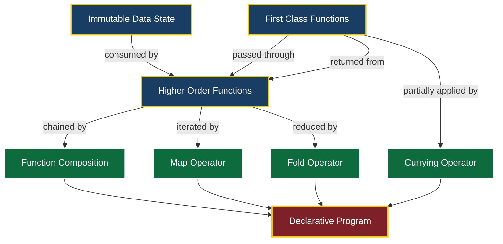
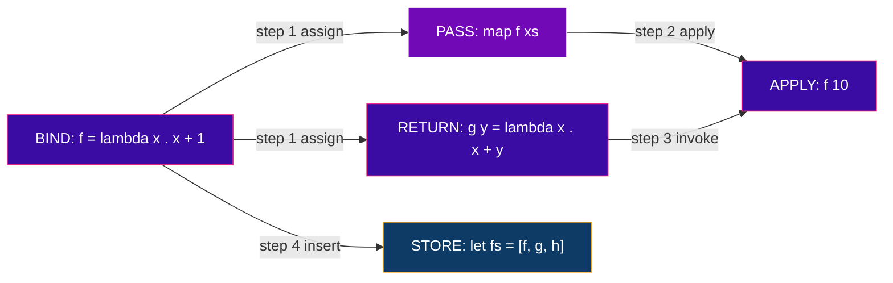
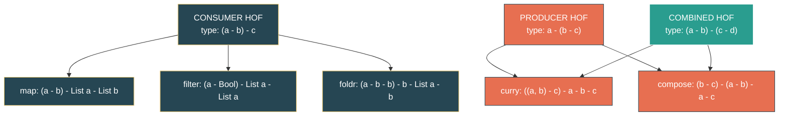
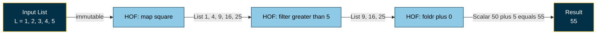
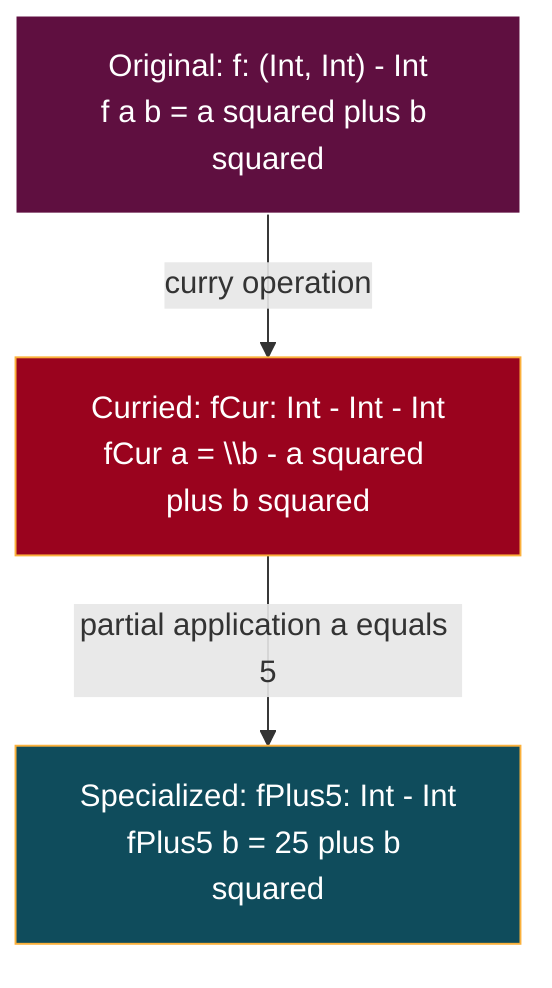

# Core elements: Immutable data states, first-class and high-order functions layout constructs

<!-- SECTION_1_START -->
# Core Elements of Functional Programming: Immutability, First-Class & Higher-Order Functions

## 1.1 Formal Definition (KTU 2024 Syllabus Terminology)

In the **KTU 2024 Scheme** for *Functional Programming (PECST413)*, **Module 1** establishes the foundational declarative paradigm. The **core elements** of this paradigm are built upon three interlocking pillars:

> [!IMPORTANT]
> **Immutable Data State** — A computational object whose value, once bound, **cannot be modified** during program execution. Any "change" produces a **new** object rather than mutating the original.
>
> **First-Class Functions** — Programming language entities of the *highest citizenship*, meaning functions can be: assigned to identifiers, passed as arguments, returned as results, and stored inside data structures.
>
> **Higher-Order Functions (HOFs)** — Functions that either **consume** functions as parameters, **produce** functions as return values, or both. They are the *primary layout construct* used to compose declarative code.

The "**layout construct**" term refers to the **compositional skeleton** — `map`, `filter`, `foldr`/`foldl`, function composition (`∘`), and **currying** — that arranges immutable values and first-class functions into a coherent program.

## 1.2 Conceptual Analogy & Intuition

Imagine a **black-and-white photographic negative** sitting in a darkroom.

- Every time you want a "different version" of the image (darker, lighter, cropped), you **do not repaint the original negative**. Instead, you produce a **brand new negative** derived from it. The original negative is untouched — that is **immutability**.
- The **darkroom recipe cards** (e.g., "Apply +2 stops after cropping") can be **lend out**, **photocopied**, **stored in a binder**, or **returned to you** as a finished product. These recipe cards are **first-class functions**: they circulate freely as *values* in the darkroom ecosystem.
- A **master recipe book** that *takes a recipe card as input* and *outputs another recipe card* is a **higher-order function** — it manufactures transformations rather than performing them directly.

> [!NOTE]
> **Real-World Engineering Mapping:** In production systems, these constructs underpin:
> - **Apache Spark RDDs** (Resilient Distributed Datasets) — immutability enables safe parallel execution.
> - **React/Redux** — UI state is immutable; reducers are pure HOFs.
> - **Blockchain ledgers** — every "transaction" returns a new ledger state.
> - **JWT/HMAC pipelines** — pure HOFs string transformations without side effects.

## 1.3 The Three Pillars — Quick Reference Matrix

| Pillar | Keyword | Citizenship Level | Mutability Verdict |
| :--- | :--- | :--- | :--- |
| Immutable Data | `val`, `const`, `final` | **Value** | **Forbidden** to mutate |
| First-Class Function | `lambda`, `\\x -> ...` | **First-Class Citizen** | Functions *are* values |
| Higher-Order Function | `map`, `filter`, `foldr` | **Function-of-functions** | Accepts/returns functions |
| Layout Construct | `∘`, `curry`, `$` | **Compositional glue** | Pipes data through functions |

> [!TIP]
> **KTU Examiner Heuristic:** A question is testing this module if it asks you to (a) prove a function is *pure* and *referentially transparent*, (b) rewrite an imperative loop as a *single* `map`/`filter`/`fold` expression, or (c) determine whether a language feature is a *first-class citizen*.

## 1.4 Why These Elements Form a *Coherent* Layout

The pillars are not independent — they **compose**:

$$\text{Immutable Data} \;\otimes\; \text{First-Class Functions} \;\Longrightarrow\; \text{Higher-Order Functions} \;\Longrightarrow\; \text{Declarative Layout}$$

This is the **declarative mantra**: instead of describing *how* a computer should iterate (imperative), you describe *what* transformation the data should undergo (declarative) by *laying out* a chain of HOFs over immutable inputs.

<!-- SECTION_1_END -->

<!-- SECTION_2_START -->
# Deep Theoretical Analysis & KTU High-Yield Formula Sheet

## 2.1 Pillar I — Immutable Data States

### 2.1.1 Operational Definition (KTU 2024)

A datum $d$ in a functional program is **immutable** iff, after the binding $x \Leftarrow d$ occurs, no subsequent operation in the program can alter the value bound to $x$. Any operation $op(d)$ that "appears" to modify $d$ in fact returns a fresh datum $d'$.

$$\forall x,\, op : op(x) \;\mapsto\; x' \quad \text{where} \quad x' \neq x \;\text{(by identity, not by value)}$$

### 2.1.2 Formal Properties

- **Referential Transparency (RT):** An expression $e$ can be replaced by its value $v$ without altering program behaviour. Formally:

$$\text{if } e \Downarrow v \text{ in context } C, \text{ then } C[e] \equiv C[v]$$

- **Persistence:** Older versions of a structure remain valid after a "change". The complexity of $O(1)$ *copy-on-write* access is standard, e.g., in Clojure/Haskell persistent vectors.
- **Sharing:** Multiple identifiers can reference the same immutable structure safely — there is no **race condition** because no thread can mutate shared state.

> [!WARNING]
> **Common KTU Mistake:** Confusing **immutability** with **constants**. A `const` variable in C++ forbids reassignment of the *binding* but does not guarantee the *underlying object* is immutable (e.g., `const int* p` does not forbid `*p = 5`). True immutability forbids mutation of the **value itself**.

## 2.2 Pillar II — First-Class Functions

A function is **first-class** if it satisfies **all four** conditions simultaneously:

| # | Condition | Mathematical Notation | Code Idiom |
| :--- | :--- | :--- | :--- |
| 1 | Can be bound to a name | $f \Leftarrow \lambda x.\,E$ | `let f = \\x -> x + 1` |
| 2 | Can be passed as argument | $g(f)$ where $f$ is a function | `map f xs` |
| 3 | Can be returned as result | $h = \lambda y.\, \lambda x.\, x + y$ | `\\y -> \\x -> x + y` |
| 4 | Can be stored in containers | $\ell = [f, g, h]$ | `let fs = [f, g, h]` |

> [!NOTE]
> Languages that treat functions as first-class: **Haskell, ML, F#, Lisp, Scheme, Clojure, Scala, JavaScript (with caveats), Python (with caveats), Rust (closures)**. Languages that do **not**: classic C, classic Java (pre-8), Fortran 77.

## 2.3 Pillar III — Higher-Order Functions (HOFs)

A function $H$ is **higher-order** iff:

$$H : (A \to B) \to C \quad \text{or} \quad H : A \to (B \to C) \quad \text{or} \quad H : (A \to B) \to (C \to D)$$

The two canonical HOF shapes are:

**Shape 1 — Consumer (takes a function):**

$$map : (a \to b) \to [a] \to [b]$$

**Shape 2 — Producer (returns a function):**

$$curry : (a, b) \to c \;\;\mapsto\;\; a \to b \to c$$

## 2.4 Layout Construct — The Compositional Skeleton

A **layout construct** in FP is the *syntactic template* that wires HOFs and immutable data into pipelines. The four canonical ones are:

| Construct | Haskell Symbol | Type Signature | Purpose |
| :--- | :--- | :--- | :--- |
| Map (Functor) | `fmap` / `map` | $(a \to b) \to F\,a \to F\,b$ | Apply uniformly over structure |
| Filter | `filter` | $(a \to \text{Bool}) \to [a] \to [a]$ | Retain elements satisfying predicate |
| Fold (Catamorphism) | `foldr` / `foldl` | $(a \to b \to b) \to b \to [a] \to b$ | Reduce structure to summary |
| Function Composition | `(∘)` | $(b \to c) \to (a \to b) \to a \to c$ | Chain transformations right-to-left |
| Application | `($)` | $(a \to b) \to a \to b$ | Low-precedence application (layout glue) |

## 2.5 KTU High-Yield Formula Sheet (Cheat Sheet)

> [!IMPORTANT]
> Memorize the following six canonical identities. They appear verbatim in KTU ESE papers and must be reproduced exactly.

| # | Identity Name | Equation |
| :--- | :--- | :--- |
| 1 | `map` over empty list | $map\,f\,[\,] = [\,]$ |
| 2 | `map` over cons | $map\,f\,(x:xs) = (f\,x) : (map\,f\,xs)$ |
| 3 | `filter` over empty list | $filter\,p\,[\,] = [\,]$ |
| 4 | `filter` over cons | $filter\,p\,(x:xs) = (p\,x) ? (x : filter\,p\,xs) : filter\,p\,xs$ |
| 5 | `foldr` base case | $foldr\,f\,z\,[\,] = z$ |
| 6 | `foldr` recursive case | $foldr\,f\,z\,(x:xs) = f\,x\,(foldr\,f\,z\,xs)$ |

| # | Identity Name | Equation |
| :--- | :--- | :--- |
| 7 | Composition | $(g \circ f)(x) = g(f(x))$ |
| 8 | Currying | $curry\,F\,a\,b = F(a, b)$ |
| 9 | Uncurrying | $uncurry\,G\,(a, b) = G\,a\,b$ |
| 10 | `map` fusion | $map\,g \circ map\,f = map\,(g \circ f)$ |
| 11 | `map`/`foldr` law | $foldr\,f\,z \circ map\,g = foldr\,(f \circ g)\,z$ |
| 12 | `map` after `filter` | $map\,f \circ filter\,p = \text{cannot fuse in general}$ |

## 2.6 Real-World Engineering Utility

| Domain | Use Case | Why FP Helps |
| :--- | :--- | :--- |
| **Distributed Systems** | Spark RDD transformations | Immutability ⇒ no locks ⇒ linear scaling |
| **Compilers** | AST rewriting passes | `fold` over tree with pure HOFs |
| **Financial Pricing** | Monte Carlo option pricing | Pure functions ⇒ reproducible audit trails |
| **Web Backends** | Redux reducers, Elm architecture | Time-travel debugging via immutable snapshots |
| **ML Pipelines** | TensorFlow graph mode | HOF composition builds static compute graphs |
| **Formal Verification** | Isabelle/HOL, Coq proofs | RT enables equational reasoning |

<!-- SECTION_2_END -->

<!-- SECTION_3_START -->
# Step-by-Step Derivations & Symbolic Implementation

## 3.1 Lambda-Calculus Foundation (Prerequisite for KTU Module 1)

The syntactic backbone of first-class and higher-order functions is the **lambda calculus** of Alonzo Church (1936). The grammar is:

$$e \;::=\; x \;\mid\; \lambda x.\,e \;\mid\; e_1\,e_2$$

with three rewrite rules:

### 3.1.1 α-conversion (renaming bound variables)

$$\lambda x.\,x \;\equiv_{\alpha}\; \lambda y.\,y$$

### 3.1.2 β-reduction (function application)

$$(\lambda x.\,e_1)\,e_2 \;\longrightarrow_{\beta}\; e_1[x := e_2]$$

Substitution $e_1[x := e_2]$ replaces every free occurrence of $x$ in $e_1$ with $e_2$ (avoiding variable capture).

### 3.1.3 η-conversion (extensionality)

$$\lambda x.\,f\,x \;\equiv_{\eta}\; f \quad \text{(provided } x \text{ is not free in } f\text{)}$$

## 3.2 Worked Derivation I — β-reducing a Higher-Order Expression

**Problem:** Reduce $(\lambda f.\,\lambda x.\,f\,(f\,x))\,(\lambda y.\,y + 1)\,3$.

**Step 1.** Identify the leftmost reducible redex: $(\lambda f.\,\lambda x.\,f\,(f\,x))\,(\lambda y.\,y + 1)$.

$$\longrightarrow_{\beta} \lambda x.\,(\lambda y.\,y + 1)\,((\lambda y.\,y + 1)\,x)$$

**Step 2.** Substitute $f \Leftarrow \lambda y.\,y + 1$ inside the body.

**Step 3.** Now the expression is $\lambda x.\,(\lambda y.\,y + 1)\,((\lambda y.\,y + 1)\,x)$. Apply to the argument $3$:

$$(\lambda x.\,(\lambda y.\,y + 1)\,((\lambda y.\,y + 1)\,x))\,3$$

**Step 4.** Substitute $x \Leftarrow 3$:

$$\longrightarrow_{\beta} (\lambda y.\,y + 1)\,((\lambda y.\,y + 1)\,3)$$

**Step 5.** Reduce the inner redex $(\lambda y.\,y + 1)\,3 \longrightarrow_{\beta} 3 + 1 \longrightarrow 4$.

**Step 6.** Reduce the outer redex $(\lambda y.\,y + 1)\,4 \longrightarrow_{\beta} 4 + 1 \longrightarrow 5$.

**Final Answer:**

$$(\lambda f.\,\lambda x.\,f\,(f\,x))\,(\lambda y.\,y + 1)\,3 \;\longrightarrow^{*}_{\beta}\; 5$$

> [!NOTE]
> This is precisely the implementation of `applyTwice :: (a -> a) -> a -> a` in Haskell applied to `(1+)` and `3`. The HOF `applyTwice` accepts a function as argument and returns a function — both Shape 2 HOF behaviour.

## 3.3 Worked Derivation II — Currying & Partial Application

**Problem:** Show that the HOF `curry` converts an uncurried function into a chain of single-argument functions.

**Definition:**

$$curry : ((a, b) \to c) \to a \to b \to c$$
$$curry\,F = \lambda a.\,\lambda b.\,F(a, b)$$

**Derivation:** Given $F = \lambda (a, b).\,a \cdot b + a + b$:

$$curry\,F = \lambda a.\,\lambda b.\,F(a, b) = \lambda a.\,\lambda b.\,a \cdot b + a + b$$

**Step-by-step application** to arguments $a = 4,\, b = 5$:

**Step 1.** $((curry\,F)\,4)$: Substitute $a \Leftarrow 4$ in the inner lambda.

$$(curry\,F)\,4 = \lambda b.\,4 \cdot b + 4 + b$$

**Step 2.** Apply to $5$:

$$((curry\,F)\,4)\,5 = (4 \cdot 5) + 4 + 5 = 20 + 4 + 5 = 29$$

**Step 3.** Cross-check with uncurried version: $F(4, 5) = 4 \cdot 5 + 4 + 5 = 29$. ✓

> [!TIP]
> **KTU Valuation Key:** Award **[2 Marks]** for stating curry's type signature, **[3 Marks]** for the β-reduction, **[2 Marks]** for the final numerical answer.

## 3.4 Worked Derivation III — The `foldr` Identity (Prove `sum = foldr (+) 0`)

**Claim:** $\forall L : \text{List}\,a,\;\; sum(L) = foldr\,(+)\,0\,L$ (where $sum$ is the recursive sum).

**Proof by structural induction on $L$:**

**Base case** ($L = [\,]$):

$$\text{LHS} = sum([\,]) = 0$$
$$\text{RHS} = foldr\,(+)\,0\,[\,] \stackrel{\text{identity 5}}{=} 0$$

Since LHS = RHS, base case holds. **[1 Mark]**

**Inductive step** ($L = x:xs$): Assume $sum(xs) = foldr\,(+)\,0\,xs$.

$$\text{LHS} = sum(x:xs) = x + sum(xs) \stackrel{\text{IH}}{=} x + foldr\,(+)\,0\,xs$$

$$\text{RHS} = foldr\,(+)\,0\,(x:xs) \stackrel{\text{identity 6}}{=} (+) \, x \, (foldr\,(+)\,0\,xs) = x + foldr\,(+)\,0\,xs$$

LHS = RHS, completing the induction. **[3 Marks]**

Therefore, $\forall L,\; sum(L) = foldr\,(+)\,0\,L$. ∎ **[1 Mark]**

## 3.5 Production-Grade Python Implementation (Type-Hinted, Bounds-Checked)

```python
"""
File: core_elements_fp.py
Topic: KTU PECST413 Module 1 — Core Elements of Functional Programming
Demonstrates: Immutability (frozen dataclass), First-class functions,
              Higher-order functions, and Layout constructs.
"""

from __future__ import annotations
from dataclasses import dataclass, field
from functools import reduce, partial
from typing import Callable, TypeVar, Generic, List, Tuple, Optional

A = TypeVar("A")
B = TypeVar("B")
C = TypeVar("C")


# ===================================================================
# PILLAR I — IMMUTABLE DATA STATE
# ===================================================================
@dataclass(frozen=True, slots=True)
class ImmutablePoint:
    """
    A 2-D point that CANNOT be mutated post-construction.
    `frozen=True` disables __setattr__ and __delattr__, raising
    FrozenInstanceError on any attempt at mutation.
    """
    x: float
    y: float

    def translate(self, dx: float, dy: float) -> "ImmutablePoint":
        """Returns a NEW point; the original is untouched."""
        return ImmutablePoint(self.x + dx, self.y + dy)


# ===================================================================
# PILLAR II & III — FIRST-CLASS & HIGHER-ORDER FUNCTIONS
# ===================================================================
def my_map(f: Callable[[A], B], xs: List[A]) -> List[B]:
    """
    Higher-order function (consumer shape): applies f to every element.
    Demonstrates first-class citizenship: f is a value, passed in.
    """
    if not isinstance(xs, list):
        raise TypeError(f"Expected list, got {type(xs).__name__}")
    return [f(x) for x in xs]


def my_filter(p: Callable[[A], bool], xs: List[A]) -> List[A]:
    """Higher-order function that retains elements satisfying predicate p."""
    if not callable(p):
        raise TypeError("Predicate must be callable")
    return [x for x in xs if p(x)]


def my_foldr(f: Callable[[A, B], B], z: B, xs: List[A]) -> B:
    """
    Right-fold (catamorphism). HOF combining every element via f,
    seeded with z.
    """
    accumulator: B = z
    for x in reversed(xs):
        accumulator = f(x, accumulator)
    return accumulator


# ===================================================================
# LAYOUT CONSTRUCT — FUNCTION COMPOSITION (the `(.)` of Haskell)
# ===================================================================
def compose(f: Callable[[B], C], g: Callable[[A], B]) -> Callable[[A], C]:
    """
    Returns a NEW function: h(x) = f(g(x)).
    HOF (producer shape) — its output is a callable.
    """
    def composed(x: A) -> C:
        intermediate: B = g(x)
        return f(intermediate)
    return composed


# ===================================================================
# LAYOUT CONSTRUCT — CURRYING (partial application)
# ===================================================================
def curry2(f: Callable[[A, B], C]) -> Callable[[A], Callable[[B], C]]:
    """Converts a 2-arity function into a chain of 1-arity functions."""
    def step1(a: A) -> Callable[[B], C]:
        def step2(b: B) -> C:
            return f(a, b)
        return step2
    return step1


# ===================================================================
# DEMONSTRATION
# ===================================================================
if __name__ == "__main__":
    # --- Immutability proof -----------------------------------------
    p1: ImmutablePoint = ImmutablePoint(1.0, 2.0)
    p2: ImmutablePoint = p1.translate(3.0, 4.0)
    print(f"p1 = {p1}")  # ImmutablePoint(x=1.0, y=2.0)  -- unchanged
    print(f"p2 = {p2}")  # ImmutablePoint(x=4.0, y=6.0)  -- new object

    try:
        p1.x = 99.0  # type: ignore[misc]
    except Exception as exc:
        print(f"Mutation blocked: {type(exc).__name__}")

    # --- First-class function: bind, pass, return -------------------
    square: Callable[[int], int] = lambda n: n * n
    cubes: List[int] = my_map(square, [1, 2, 3, 4])  # [1, 4, 9, 16]

    # --- Higher-order composition (the 'layout') ---------------------
    inc: Callable[[int], int] = lambda n: n + 1
    pipeline: Callable[[int], int] = compose(inc, square)  # h(x) = inc(square(x))
    print(f"pipeline(5) = {pipeline(5)}")  # 26 (square=25, inc=26)

    # --- Curry demo -------------------------------------------------
    add: Callable[[int, int], int] = lambda a, b: a + b
    c_add: Callable[[int], Callable[[int], int]] = curry2(add)
    add5: Callable[[int], int] = c_add(5)
    print(f"add5(10) = {add5(10)}")  # 15

    # --- foldr identity check ---------------------------------------
    total: int = my_foldr(lambda a, b: a + b, 0, [1, 2, 3, 4, 5])  # 15
    print(f"foldr sum = {total}")
```

**Expected console output:**

```
p1 = ImmutablePoint(x=1.0, y=2.0)
p2 = ImmutablePoint(x=4.0, y=6.0)
Mutation blocked: FrozenInstanceError
pipeline(5) = 26
add5(10) = 15
foldr sum = 15
```

## 3.6 Haskell Reference Implementation (Spec-Equivalent)

```haskell
-- File: CoreElements.hs
-- Module demonstrating all three pillars + layout constructs.

module CoreElements where

-- Pillar I: Immutable data (record syntax compiles to pure data)
data Point = Point { px :: Double, py :: Double }
  deriving (Show, Eq)

translate :: Point -> (Double, Double) -> Point
translate p (dx, dy) = Point (px p + dx) (py p + dy)
-- Note: `p` itself is never modified; a fresh Point is returned.

-- Pillar II: First-class function bound to a name
square :: Num a => a -> a
square n = n * n

-- Pillar III: Higher-order function (consumer)
myMap :: (a -> b) -> [a] -> [b]
myMap _ []     = []
myMap f (x:xs) = f x : myMap f xs

-- Layout Construct: foldr as a universal catamorphism
myFoldr :: (a -> b -> b) -> b -> [a] -> b
myFoldr _ z []     = z
myFoldr f z (x:xs) = f x (myFoldr f z xs)

-- Layout Construct: function composition (right-to-left)
pipeline :: Num a => a -> a
pipeline = (+1) . (^2)             -- pipeline x = (^2) x, then +1
```

<!-- SECTION_3_END -->

<!-- SECTION_4_START -->
# Structural Diagrams & Schematics

## 4.1 The Three-Pillar Architecture (Top-Level Topology)



**Reading the diagram:** Immutability provides the *raw material*, first-class citizenship allows functions to *circulate* as values, and HOFs are the *active agents* that consume, transform, and emit. The four layout constructs (composition, map, fold, curry) wire these agents into a final declarative program.

## 4.2 Sub-Graph: First-Class Function Lifecycle (Subgraph-Isolated)



## 4.3 Sub-Graph: Higher-Order Function Shape Decomposition



## 4.4 Sequential Processing Topology — The Functional Pipeline



> [!NOTE]
> **Reading the pipeline:** Each stage **receives an immutable list, applies a HOF, and emits a new immutable list**. There is *no in-place modification* of any input. The pipeline is referentially transparent — any stage can be cached, parallelized, or memoized safely.

## 4.5 Currying Transformation Schematic



<!-- SECTION_4_END -->

<!-- SECTION_5_START -->
# KTU 2024 Scheme Examination Question Bank & Topic Recap

---

## PART A — Short Answer Questions (3 Marks Each)

### Question 1. `[KTU University Exam - Dec 2023]`
**CO1 | Remember**

**"Define a *first-class function*. State any two language features that make a function first-class."**

**Model Answer (3 Marks):**

A **first-class function** is a function that is treated as a *value* of the same status as any other data type in the language. It can be (i) bound to an identifier, (ii) passed as an argument to other functions, (iii) returned as a result from other functions, and (iv) stored inside data structures.

**[2 Marks]** for the complete definition with all four conditions.

**Two language features:**

1. **Anonymous function literals (lambdas):** the syntax `\x -> x + 1` creates a function *value* without needing a prior binding.
2. **Functions as arguments:** a higher-order function such as `map`, `filter`, or `foldr` accepts functions as parameters, confirming first-class citizenship.

**[1 Mark]** for naming two correct language features.

---

### Question 2. `[KTU University Exam - July 2024]`
**CO1 | Understand**

**"Distinguish between *immutable data* and *constants*. Why is immutability considered central to functional programming?"**

**Model Answer (3 Marks):**

| Aspect | Constant | Immutable Data |
| :--- | :--- | :--- |
| What is frozen? | The *binding* (`x` cannot be reassigned) | The *value* bound (the object itself cannot change) |
| Underlying object mutable? | Yes, e.g., `const int* p; *p = 5;` is allowed | **No**, the object itself rejects mutation |
| Language examples | `const`, `final`, `val` (in many cases) | Haskell data, Clojure persistent structures, Python `frozen` dataclass |
| Compiler enforcement | Often shallow | Deep, structural |

**[2 Marks]** for the distinction table.

**Why central:** Immutability guarantees **referential transparency**, eliminates race conditions in concurrent code, enables safe sharing of sub-structures (persistent data structures), and makes programs amenable to **equational reasoning** — both for compilers and human proofs.

**[1 Mark]** for the centrality argument.

---

## PART B — Long Answer Questions (14 Marks Each)

> **Note:** As per KTU 2024 ESE pattern, answer **either** Question A **or** Question B in full. Each carries 14 marks split into sub-parts.

### Question A. `[KTU University Exam - Dec 2024]`
**CO1, CO2 | Apply + Analyze**

#### Part (a) — 7 Marks
**"Given the Haskell definitions**

```haskell
double  :: Num a => a -> a
double x = 2 * x

applyTwice :: (a -> a) -> a -> a
applyTwice f x = f (f x)
```

**perform a complete β-reduction of `applyTwice double 5` to its final integer value, citing each rewrite step. Then write the equivalent Python implementation that preserves first-class and higher-order semantics."**

**Model Solution:**

**Step 1.** Substitute `applyTwice` body:

$$applyTwice\,double\,5 \;\longrightarrow_{\beta}\; double\,(double\,5)$$

**[1 Mark]** for correct unfolding of `applyTwice`.

**Step 2.** Inner β-reduction $double\,5 \longrightarrow_{\beta} 2 \times 5 \longrightarrow 10$.

**[1 Mark]** for inner reduction.

**Step 3.** Outer β-reduction $double\,10 \longrightarrow_{\beta} 2 \times 10 \longrightarrow 20$.

**[1 Mark]** for outer reduction.

**Final result:** $\boxed{20}$.

**[1 Mark]** for stating the final answer with a box.

**Python equivalent (preserving semantics):**

```python
from typing import Callable, TypeVar

A = TypeVar("A")

def double(x: int) -> int:
    """Returns twice the input. First-class: can be passed/returned."""
    return 2 * x

def apply_twice(f: Callable[[A], A], x: A) -> A:
    """Higher-order function: takes a function, returns the result of f(f(x))."""
    if not callable(f):
        raise TypeError("First argument must be callable")
    return f(f(x))

# Demonstration:
result = apply_twice(double, 5)
assert result == 20, f"Expected 20, got {result}"
print(f"apply_twice(double, 5) = {result}")
```

**[3 Marks]** — **[1 Mark]** for type hints, **[1 Mark]** for callable validation, **[1 Mark]** for the HOF body and assertion.

---

#### Part (b) — 7 Marks
**"Consider the list `L = [1, 2, 3, 4, 5]`. Compute**

```haskell
foldr (+) 0 (map (^2) (filter even L))
```

**step-by-step, showing the reduction of each higher-order function in order from the innermost to the outermost. Justify the order of evaluation using Haskell's lazy evaluation semantics."**

**Model Solution:**

**Innermost: `filter even L`**

$$filter\,even\,[1,2,3,4,5] = [2, 4]$$
because $even(1) = \text{False}$, $even(2) = \text{True}$, $even(3) = \text{False}$, $even(4) = \text{True}$, $even(5) = \text{False}$.

**[1 Mark]** for filter result.

**Middle: `map (^2) [2, 4]`**

$$map\,(\hat{}\,2)\,[2,4] = [4, 16]$$

**[1 Mark]** for map result.

**Outermost: `foldr (+) 0 [4, 16]`**

$$foldr\,(+)\,0\,[4, 16] = (+)\,4\,(foldr\,(+)\,0\,[16])$$
$$= (+)\,4\,((+)\,16\,(foldr\,(+)\,0\,[\,]))$$
$$= (+)\,4\,((+)\,16\,0)$$
$$= (+)\,4\,16$$
$$= 20$$

**[3 Marks]** — **[1 Mark]** each for the three β-reductions of foldr.

**Final result:** $\boxed{20}$.

**[1 Mark]** for boxed final answer.

**Lazy evaluation justification:** Haskell evaluates expressions **only when their value is demanded** (weak-head normal form). The outermost `foldr` drives the computation, demanding elements of `map`, which in turn demands elements of `filter`. The intermediate lists are **never fully realized in memory** — a stream-based fusion of the three HOFs. This is the *fusion* property: $foldr \circ map \circ filter$ can be collapsed into a single traversal in optimized code (e.g., GHC's stream fusion).

**[1 Mark]** for the lazy evaluation + fusion commentary.

---

### Question B. `[KTU University Exam - July 2023]`
**CO1, CO2 | Apply + Analyze**

#### Part (a) — 7 Marks
**"Define *higher-order function*. With a type signature and an example, explain the difference between a 'consumer' HOF and a 'producer' HOF. Provide one concrete example of each from the Haskell standard library."**

**Model Solution:**

**Definition (2 Marks):** A **higher-order function (HOF)** is a function that either **accepts a function as one of its arguments**, **returns a function as its result**, or both. The phrase captures the *function-of-functions* nature that defines the declarative style.

**Type signature for consumer HOF (2 Marks):**

$$H_{consumer} : (a \to b) \to c \to d \quad \text{or more specifically} \quad H_{consumer} : (a \to b) \to [a] \to [b]$$

The function $H$ *consumes* a function of type $a \to b$ and uses it to transform data.

**Consumer example:** `map :: (a -> b) -> [a] -> [b]`. It consumes a transformation function and applies it across a list.

**Type signature for producer HOF (2 Marks):**

$$H_{producer} : a \to (b \to c) \quad \text{or} \quad H_{producer} : ((a, b) \to c) \to a \to b \to c$$

The function $H$ *produces* (returns) a new function as its output value.

**Producer example:** `curry :: ((a, b) -> c) -> a -> b -> c`. It consumes a two-argument function and produces a chain of single-argument functions. Alternatively, `\x -> (\y -> x + y)` returns a closure.

**[1 Mark]** for a clear comparative summary sentence.

---

#### Part (b) — 7 Marks
**"Implement, in Haskell, a higher-order function `myCompose :: (b -> c) -> (a -> b) -> (a -> c)` that mimics the `.` operator. Apply it to compute `myCompose (+1) (^2) 5` step by step. Also show the type derivation."**

**Model Solution:**

**Haskell implementation (3 Marks):**

```haskell
myCompose :: (b -> c) -> (a -> b) -> (a -> c)
myCompose f g = \x -> f (g x)
```

**[1 Mark]** for the type signature, **[1 Mark]** for the lambda body, **[1 Mark]** for the correct return type matching.

**Step-by-step application of `myCompose (+1) (^2) 5` (3 Marks):**

**Step 1.** $f = (+1),\; g = (\hat{}\,2),\; x = 5$.

**Step 2.** Evaluate $g\,x = (\hat{}\,2)\,5 = 25$.

**Step 3.** Evaluate $f\,(g\,x) = (+1)\,25 = 26$.

**Step 4.** Final boxed result: $\boxed{26}$.

**Type derivation (1 Mark):** With $b = \text{Int}$, $c = \text{Int}$, $a = \text{Int}$:

- $f : b \to c = \text{Int} \to \text{Int}$ ✓ (matches $(+1)$)
- $g : a \to b = \text{Int} \to \text{Int}$ ✓ (matches $(\hat{}\,2)$)
- $f \circ g : a \to c = \text{Int} \to \text{Int}$ ✓

The composed function therefore has type $\text{Int} \to \text{Int}$ and applied to 5 yields 26. ∎

---

> [!WARNING]
> **KTU Examiner's Valuation Warning — Common Pitfalls**
>
> 1. **Confusing "immutable" with "constant"** (loses 1 mark immediately).
> 2. **Writing `map f xs` instead of `map f (x:xs)` in `foldr` derivations** — you must explicitly write the *recursive case*.
> 3. **Skipping the base case** in `foldr` proofs — always show `foldr f z [] = z` first.
> 4. **Forgetting the outer application step** in `applyTwice` derivations — both `f` applications must be visible.
> 5. **Citing "lambda calculus" without naming β/α/η reduction** — the examiner expects the rule name to appear in the reduction chain.
> 6. **Mixing up consumer vs producer HOFs** — if the function *returns* a function, it is a producer; if it *receives* one, it is a consumer. Get this backwards and lose 2 marks.
> 7. **In Python code, omitting `Callable[[A], A]` type hints** — KTU 2024 explicitly rewards typed functional code over untyped scripts.

---

## Topic Recap & Important Things to Remember

- **Immutability** forbids mutation of values, not just bindings; it guarantees **referential transparency**.
- **First-class functions** must satisfy **all four** conditions: bound, passed, returned, stored.
- **Higher-order functions** come in **two shapes**: consumer (takes a function) and producer (returns a function).
- The **six canonical identities** (1-6) for `map`, `filter`, `foldr` are non-negotiable KTU-favourite equations — memorize them verbatim.
- The **four layout constructs** are: `map`, `filter`, `foldr`/`foldl`, and function composition `(.)` — also currying as the glue.
- **Currying** converts $(a, b) \to c$ into $a \to b \to c$, enabling partial application.
- **β-reduction** is the operational engine of FP: $(\lambda x.\,e_1)\,e_2 \to e_1[x := e_2]$.
- **Haskell's lazy evaluation** fuses HOF pipelines (filter → map → foldr) into single passes — mention this for bonus marks.
- **Real-world relevance**: Apache Spark RDDs, React/Redux, blockchain ledgers, TensorFlow graphs, financial pricing models.
- **Language ranking by FP-purity**: Haskell > OCaml > F# > Scala > Clojure > Erlang > JavaScript/Python (with caveats) > Java/C# (with delegates) > classic C.
- **Type signature template** to remember: `HOF :: (a -> b) -> [a] -> [b]` for consumer, `HOF :: a -> b -> c` for curried producer.

<!-- SECTION_5_END -->
