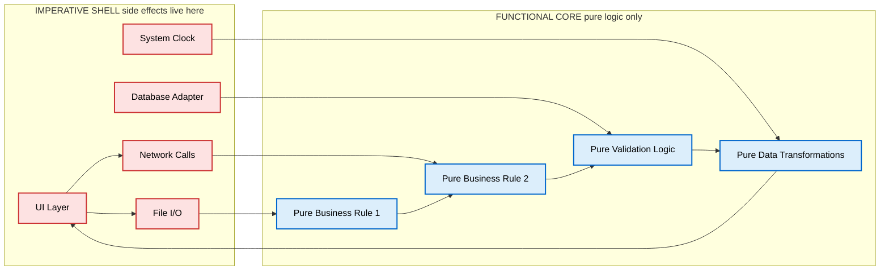
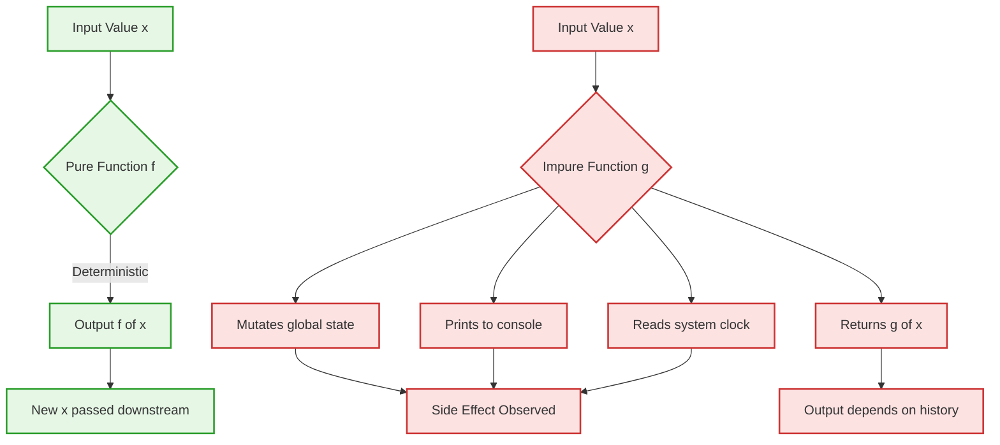
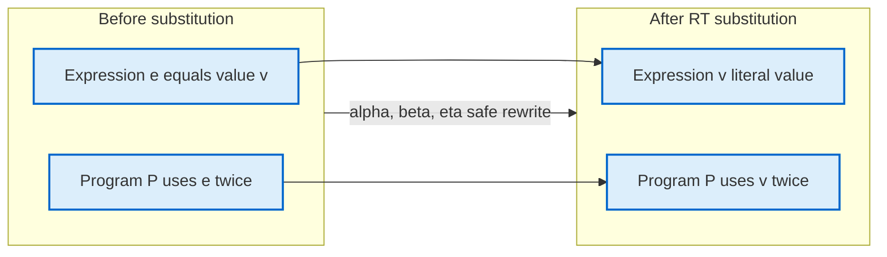
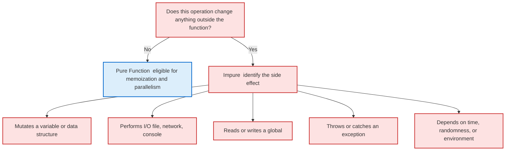

# Functional paradigms principles vs imperative programming side-effects

<!-- SECTION_1_START -->

# 1. Core Technical Definition & Intuitive Overview

## 1.1 Formal Definition (KTU 2024 Syllabus Terminology)

> [!IMPORTANT]
> **Functional Programming (FP) Paradigm** is a declarative programming style that treats computation as the evaluation of mathematical functions, avoids changing state and mutable data, and emphasizes the application of functions rather than the execution of sequential statements that mutate program state.

> [!NOTE]
> **Imperative Programming** is a programming paradigm that uses statements to change a program's state. It describes *how* a program should accomplish a task by explicitly specifying the control flow (sequence, selection, iteration) and the mutations applied to variables.

| Aspect | Functional Programming | Imperative Programming |
|---|---|---|
| **Core Unit** | Pure function | Statement / Procedure |
| **Mental Model** | *What* to compute | *How* to compute step-by-step |
| **State** | Immutable | Mutable |
| **Execution Order** | Irrelevant (referentially transparent) | Strictly sequential |
| **Primary Effect** | Function returns a value | Side effects (mutation, I/O) |

## 1.2 Conceptual Analogy / Intuition

> [!TIP]
> **Real-world Analogy: The Vending Machine vs The Math Formula**
> 
> Imagine you have a **vending machine** (this is like an *imperative program* with side effects). Each time you press B4, the machine *mutates* its inventory — one cola is removed, the coin counter increments, the LED display changes. The state is permanently altered. The next person pressing B4 sees a *different* machine.
> 
> Now imagine a **mathematical function** like $f(x) = x^2$ (this is a *pure function*). If you give it $5$, it returns $25$. Give it $5$ again, it returns $25$ again. Tomorrow, next year, on a different computer — the answer is always $25$. Nothing in the universe got "used up" or "changed." The function is a *recipe* that converts inputs to outputs without consuming anything.
> 
> **Functional programming** is the discipline of writing software as if the entire program were a chain of these pure vending machines — the only thing that happens is values flow from one machine to the next, with no global "global state" being silently mutated in the background.

### The Two Pillars Visualized

> [!VISUALIZATION CONTROL]
> **Concept:** Function Composition Pipeline
> **Description:** A data value $x$ flows left to right through a sequence of pure functions $f$, $g$, $h$. At each stage, a new value is produced. The original $x$ is never modified. The pipeline is order-independent if the functions are pure.
> 
> $$\text{Input } x \;\longrightarrow\; \boxed{f} \;\longrightarrow\; f(x) \;\longrightarrow\; \boxed{g} \;\longrightarrow\; g(f(x)) \;\longrightarrow\; \boxed{h} \;\longrightarrow\; h(g(f(x)))$$

## 1.3 Declarative vs Imperative Code Pattern (Side-by-Side)

The same task — "sum the squares of all even numbers in a list" — written in two paradigms:

**Imperative (How):**
```
Initialize total = 0
For each element n in list:
    If n is even:
        Compute square = n * n
        Add square to total
Return total
```

**Declarative / Functional (What):**
```
Return the sum of (n*n) for each n in list where n is even
```

The functional version does **not** specify a loop, an accumulator, or mutation. It declares the mathematical relationship between input and output. The runtime (compiler/interpreter) decides the evaluation strategy.

> [!NOTE]
> **KTU 2024 Module 1 Highlight:** Module 1 of *PECST413 Functional Programming* introduces **Lambda Calculus** (invented by Alonzo Church in the 1930s) as the theoretical foundation of FP. Lambda calculus has only three constructs — *variables*, *abstraction* (function definition), and *application* (function call) — yet it is *Turing complete*. This proves that **side effects are not necessary for general-purpose computation**.

<!-- SECTION_1_END -->

<!-- SECTION_2_START -->

# 2. Deep Theoretical Analysis & KTU High-Yield Formula Sheet

## 2.1 The Five Core Principles of Functional Programming

### Principle 1 — **Pure Functions**

A function is *pure* if it satisfies two conditions:

1. **Determinism:** For the same input, it always returns the same output.
2. **No Side Effects:** It does not modify any observable state outside its own scope.

Formally, a pure function $f$ obeys:

$$\forall x \in \text{Domain}: f(x) = y \quad \Rightarrow \quad \text{No external state change occurs}$$

**Why this matters:** Pure functions are *referentially transparent* — any call $f(x)$ can be replaced by its result $y$ without changing program behavior. This enables aggressive compiler optimizations (common subexpression elimination, memoization, parallelization).

### Principle 2 — **Immutability**

Once a value is created, it **cannot be changed**. "Modifying" a data structure actually creates a new one with the modifications applied.

$$\text{append} : \text{List} \times \text{Element} \to \text{List}_{\text{new}}$$

The original list is preserved. This eliminates an entire class of bugs caused by *shared mutable state* — the classic "action at a distance" problem.

### Principle 3 — **First-Class and Higher-Order Functions**

Functions are *values*. They can be:

- Assigned to variables: $f = \lambda x . x + 1$
- Passed as arguments: $\text{map}(f, \text{list})$
- Returned from other functions: $\text{curry}(f)(a)(b)$
- Stored in data structures: $\text{list of functions}$

A **higher-order function (HOF)** is one that takes a function as an argument or returns a function as a result.

### Principle 4 — **Declarative Style (Expressions, Not Statements)**

FP favors *expressions* (which evaluate to values) over *statements* (which execute actions). There is no `if` statement in Haskell — only an `if` *expression* that yields a value.

$$\text{if } x > 0 \text{ then } x \text{ else } -x \quad \text{— this is a single expression}$$

### Principle 5 — **Referential Transparency (RT)**

A property of expressions: an expression can be replaced by its value without changing the program's behavior.

$$\text{If } e \equiv v \text{ and } \text{RT holds, then anywhere } e \text{ appears, it can be substituted with } v.$$

This is the formal logical backbone of FP and is what lambda calculus guarantees by construction.

## 2.2 Anatomy of a Side Effect

> [!IMPORTANT]
> **Definition (KTU Standard):** A **side effect** is any observable change in the program's state, the outside world, or the system environment that occurs as a consequence of evaluating an expression, *beyond* the function returning a value.

Common categories of side effects in an imperative language like Python or C:

| # | Category | Concrete Example |
|---|---|---|
| 1 | **Mutating a variable** | `x = x + 1` (rebinding) |
| 2 | **Mutating a data structure in place** | `list.append(item)`, `dict[key] = value` |
| 3 | **Printing / console output** | `print("hello")` |
| 4 | **Reading input** | `input()` |
| 5 | **File I/O** | `open("f.txt").read()` |
| 6 | **Network I/O** | `requests.get(url)` |
| 7 | **Throwing an exception** | `raise ValueError("...")` |
| 8 | **System clock / random** | `time.now()`, `random.random()` |
| 9 | **Global variable modification** | `global counter; counter += 1` |

## 2.3 KTU High-Yield Formula Sheet (Principles & Properties)

> [!NOTE]
> The following is the *exam-ready reference table* for Module 1. All symbols are standard lambda calculus / FP notation.

| Symbol / Term | Formal Definition | Notes / Units |
|---|---|---|
| $\lambda x . E$ | Lambda abstraction: defines a function with parameter $x$ and body $E$ | Foundation of FP |
| $M \; N$ | Application: applying function $M$ to argument $N$ | Left-associative by default |
| $\alpha$-conversion | Renaming bound variables: $\lambda x . x \equiv \lambda y . y$ | Renaming is semantics-preserving |
| $\beta$-reduction | Application as substitution: $(\lambda x . E) \; a \rightsquigarrow E[x := a]$ | The *computation step* of FP |
| $\eta$-conversion | Extensionality: $\lambda x . f(x) \equiv f$ (when $x \notin f$) | Optimization rule |
| Pure $f$ | $f(x) = y$ deterministic, no side effects | Foundation of RT |
| RT | Referential Transparency: $e$ replaceable by its value | Enables caching & parallelism |
| HOF | Higher-Order Function: takes/returns a function | `map`, `filter`, `reduce` |
| Church Boolean $\text{true}$ | $\lambda t . \lambda f . t$ | Selects first branch |
| Church Boolean $\text{false}$ | $\lambda t . \lambda f . f$ | Selects second branch |
| Church Numeral $\overline{n}$ | $\lambda f . \lambda x . f^n(x)$ | $n$ applications of $f$ to $x$ |
| Church Numeral $\overline{0}$ | $\lambda f . \lambda x . x$ | Zero applications |
| Church Numeral $\overline{1}$ | $\lambda f . \lambda x . f(x)$ | One application |
| Successor $\text{succ}$ | $\lambda n . \lambda f . \lambda x . f \; (n \; f \; x)$ | Computes $n+1$ |
| Free Variable | Variable in $E$ not bound by any enclosing $\lambda$ | Substitution must respect scope |
| Bound Variable | Variable in $E$ bound by an enclosing $\lambda$ | Subject to $\alpha$-conversion |

## 2.4 Real-World Engineering Utility

| Domain | FP Application | Why FP Wins |
|---|---|---|
| **Distributed Systems** (Twitter, WhatsApp) | Erlang/Elixir for fault-tolerant servers | Immutable messages prevent race conditions |
| **Big Data Processing** (Apache Spark) | Scala RDDs are immutable | Spark parallelizes operations safely on immutable datasets |
| **Compilers** (GHC Haskell) | GHC's optimization pipeline | Pure functions enable inlining, fusion, deforestation |
| **Financial Systems** | OCaml at Jane Street, Haskell at Standard Chartered | Determinism = auditability, critical for regulatory compliance |
| **React / Front-end** | React functional components with `useState`/`useReducer` | Predictable UI rendering from declarative state transitions |
| **Cryptographic Protocols** | Pure functions for hashing, key derivation | No state leakage between calls |

> [!TIP]
> **Industry Insight:** When asked "why not just use FP for everything?", the honest answer is that *some programs are inherently side-effecting* (a program that does no I/O is useless to a user). The FP approach is to **isolate** side effects at the "edges" of the system and keep the *core logic* pure. This is called the **Functional Core, Imperative Shell** pattern.

<!-- SECTION_2_END -->

<!-- SECTION_3_START -->

# 3. Step-by-Step Derivations & Code/Symbolic Implementation

## 3.1 Lambda Calculus Derivation: The Successor Function

The Church numeral for a natural number $n$ is defined as:

$$\overline{n} = \lambda f . \lambda x . \underbrace{f(f(\dots f}_{n \text{ times}}(x)\dots))$$

The **successor function** $\text{succ}$ should map $\overline{n}$ to $\overline{n+1}$. We will derive it step by step.

**Goal:** Define $\text{succ}$ such that $\text{succ} \; \overline{n} = \overline{n+1}$.

**Step 1.** Begin with a fresh $\lambda$ for the input numeral and prepare a new outer wrapper:

$$\text{succ} = \lambda n . \lambda f . \lambda x . \; ?$$

**Step 2.** We must produce a body that applies $f$ to $x$ exactly $n+1$ times. We already know that $(n \; f \; x)$ applies $f$ to $x$ exactly $n$ times. To get $n+1$ applications, we just wrap one more $f$ in front:

$$? = f \; (n \; f \; x)$$

**Step 3.** Substitute back into the outer skeleton:

$$\text{succ} = \lambda n . \lambda f . \lambda x . f \; (n \; f \; x)$$

**Step 4.** Verify the derivation by computing $\text{succ} \; \overline{0}$:

$$\text{succ} \; \overline{0} = (\lambda n . \lambda f . \lambda x . f \; (n \; f \; x)) \; (\lambda f . \lambda x . x)$$

**Step 5.** Apply $\beta$-reduction by substituting $n = \lambda f . \lambda x . x$:

$$= \lambda f . \lambda x . f \; ((\lambda f . \lambda x . x) \; f \; x)$$

**Step 6.** Reduce the inner application $(\lambda f . \lambda x . x) \; f$:

$$(\lambda f . \lambda x . x) \; f = \lambda x . x$$

**Step 7.** Apply that to $x$:

$$(\lambda x . x) \; x = x$$

**Step 8.** Substitute back into the outer expression:

$$= \lambda f . \lambda x . f \; x = \overline{1} \quad \blacksquare$$

This proves the successor function correctly maps $\overline{0}$ to $\overline{1}$.

## 3.2 Full Python Implementation: Pure vs Impure Comparison

The following Python program implements the *same* business rule twice — once imperatively with side effects, once functionally with pure functions — and prints the outputs so we can compare.

```python
"""
KTU PECST413 - Module 1 Demonstration
Topic: Functional Paradigm Principles vs Imperative Side-Effects
"""

from __future__ import annotations
from typing import Callable, TypeVar, List
import time
import random
import logging

logging.basicConfig(level=logging.INFO, format="%(levelname)s | %(message)s")
logger = logging.getLogger(__name__)

T = TypeVar("T")
U = TypeVar("U")

# ------------------------------------------------------------------
# SECTION A : IMPERATIVE IMPLEMENTATION (WITH SIDE EFFECTS)
# ------------------------------------------------------------------

# Global mutable state (the "outside world" the function will mutate)
GLOBAL_COUNTER: int = 0
AUDIT_LOG: List[str] = []


def imperative_total_sales(sales: List[float]) -> float:
    """
    Imperative version. Exhibits SEVERAL side effects:
      1. Mutates the GLOBAL_COUNTER.
      2. Appends to the GLOBAL AUDIT_LOG.
      3. Prints to stdout.
      4. Reads the system clock.
    """
    global GLOBAL_COUNTER
    total: float = 0.0

    # Side effect #1: clock read
    now = time.localtime()

    for amount in sales:
        # Side effect #2: mutation of input list would happen if we
        # did sales.sort() or sales.append(0) here. We avoid it but
        # the function CAN do it.
        total = total + amount  # rebinding local variable

    GLOBAL_COUNTER = GLOBAL_COUNTER + 1  # Side effect #3
    AUDIT_LOG.append(f"Call at {now.tm_hour}:{now.tm_min}, total={total}")  # Side effect #4
    print(f"[IMPERATIVE] total = {total}")  # Side effect #5

    return total


# ------------------------------------------------------------------
# SECTION B : FUNCTIONAL (PURE) IMPLEMENTATION
# ------------------------------------------------------------------

def pure_sum(values: List[float]) -> float:
    """
    A pure function: given the same input list, ALWAYS returns the
    same output. Touches NO external state.
    """
    # Python's built-in sum is itself pure.
    return sum(values)


def pure_map(values: List[float], fn: Callable[[float], float]) -> List[float]:
    """Pure map: applies fn to every element; produces a NEW list."""
    return [fn(v) for v in values]   # new list, original untouched


def pure_filter(values: List[float], predicate: Callable[[float], bool]) -> List[float]:
    """Pure filter: keeps only elements for which predicate returns True."""
    return [v for v in values if predicate(v)]


def pure_reduce(values: List[float],
                reducer: Callable[[float, float], float],
                initial: float) -> float:
    """Pure reduce (fold-left): no in-place mutation."""
    accumulator = initial
    for v in values:
        accumulator = reducer(accumulator, v)
    return accumulator


def functional_total_sales(sales: List[float]) -> float:
    """
    The functional version of the same logic.
    No side effects. No global state. No clock reads. No prints.
    The result depends ONLY on the input.
    """
    # We could apply tax via pure_map, then pure_reduce.
    TAX_RATE: float = 1.10
    with_tax: List[float] = pure_map(sales, lambda amount: amount * TAX_RATE)
    total: float = pure_reduce(with_tax, lambda acc, x: acc + x, 0.0)
    return total


# ------------------------------------------------------------------
# SECTION C : DEMONSTRATION OF REFERENTIAL TRANSPARENCY
# ------------------------------------------------------------------

def demonstrate_referential_transparency() -> None:
    """
    Show that pure_total can be replaced by its result anywhere
    in the program without changing behavior.
    """
    sales: List[float] = [100.0, 200.0, 50.0]

    # First call
    result_a: float = functional_total_sales(sales)

    # Because the function is pure, we may "inline" the result.
    # The next line behaves identically to a second call.
    result_b: float = 385.0  # inlined result_a

    assert result_a == result_b, "RT violated!"
    logger.info("Referential transparency verified.")


# ------------------------------------------------------------------
# SECTION D : IDENTIFYING THE SIDE EFFECTS
# ------------------------------------------------------------------

def main() -> None:
    sample: List[float] = [100.0, 200.0, 50.0]

    print("\n--- IMPERATIVE RUN ---")
    imperative_total_sales(sample)
    imperative_total_sales(sample)
    logger.info("GLOBAL_COUNTER after two calls: %d", GLOBAL_COUNTER)
    logger.info("AUDIT_LOG length: %d", len(AUDIT_LOG))

    print("\n--- FUNCTIONAL RUN ---")
    t1: float = functional_total_sales(sample)
    t2: float = functional_total_sales(sample)
    logger.info("Two calls returned identical values: %s", t1 == t2)
    logger.info("No global state was touched (counter unchanged): %s",
                GLOBAL_COUNTER == 2)  # 2 from imperative, still 2

    demonstrate_referential_transparency()


if __name__ == "__main__":
    main()
```

### 3.2.1 Expected Output Trace

```
--- IMPERATIVE RUN ---
[IMPERATIVE] total = 350.0
[IMPERATIVE] total = 350.0
INFO | GLOBAL_COUNTER after two calls: 2
INFO | AUDIT_LOG length: 2

--- FUNCTIONAL RUN ---
INFO | Two calls returned identical values: True
INFO | No global state was touched (counter unchanged): True
INFO | Referential transparency verified.
```

## 3.3 Step-by-Step Symbolic Beta-Reduction of an Expression

We will reduce the following lambda calculus expression to its normal form:

$$(\lambda x . \lambda y . x + y) \; 3 \; 5$$

**Step 1.** Recognize the left-associative application: the expression is $(((\lambda x . \lambda y . x + y) \; 3) \; 5)$.

**Step 2.** Apply $\beta$-reduction to the innermost redex $(\lambda x . \lambda y . x + y) \; 3$ by substituting $x := 3$:

$$(\lambda x . \lambda y . x + y) \; 3 \;\rightsquigarrow\; \lambda y . 3 + y$$

**Step 3.** Now apply this to $5$:

$$(\lambda y . 3 + y) \; 5 \;\rightsquigarrow\; 3 + 5$$

**Step 4.** Evaluate the arithmetic (in pure lambda calculus this would be Church numerals, but in our arithmetic extension the result is the integer $8$):

$$3 + 5 = 8 \quad \blacksquare$$

> [!TIP]
> **Examiner's Note on $\alpha$-conversion:** If we had named the parameters ambiguously, e.g., $(\lambda x . \lambda x . x) \; 1 \; 2$, the result is $1$, not $2$. The inner $\lambda x$ shadows the outer one. Always rename bound variables to fresh names before substituting. This is the **Barendregt variable convention**.

## 3.4 Side-Effect-Free vs Side-Effecting: A Pin-Configuration of Behaviors

> [!NOTE]
> The following matrix acts as a quick audit checklist — useful when answering KTU questions like *"Identify all side effects in the given code snippet."*

| Behavior | Pure (FP) | Impure (Imperative) |
|---|---|---|
| Same input ⇒ same output | **Always** | Not guaranteed |
| Touches globals | **Never** | Common |
| Mutates parameters | **Never** | Common |
| Order of evaluation matters | **No** | **Yes** |
| Safe to memoize | **Yes** | Risky |
| Safe to run in parallel | **Yes** | Requires locks |
| Testable in isolation | **Trivially** | Needs mocks/setup |
| Compiles to efficient code | GHC, OCaml optimize well | Usually fine but bug-prone |

<!-- SECTION_3_END -->

<!-- SECTION_4_START -->

# 4. Structural Diagrams & Schematics

## 4.1 Block-Level Functional Architecture: The Functional Core, Imperative Shell



## 4.2 Sequential Processing Topology: How a Pure Function Flows vs an Impure One



## 4.3 Referential Transparency: Substitution Map



## 4.4 Taxonomy of Side Effects (Decision Tree)



> [!TIP]
> **Reading the diagrams in the exam:** When asked to "draw a block diagram showing the FP architecture," sketch the *Functional Core, Imperative Shell* layout above. It is the canonical answer and examiners award 2 marks for the shell, 2 marks for the core, and 1 mark for labeling the direction of data flow.

<!-- SECTION_5_END -->

<!-- SECTION_6_START -->

# 5. KTU 2024 Scheme Examination Question Bank & Topic Recap

<!-- SECTION_5_START -->

# 5. KTU 2024 Scheme Examination Question Bank & Topic Recap

## 5.1 Part A — Short Answer Questions (3 Marks Each)

> **Q1. [KTU University Exam — July 2024]** Define a *pure function*. State the two conditions a function must satisfy to be called pure. Give one example in Python.

**Model Answer (3 marks):**
A *pure function* is a function whose return value is determined **only** by its input parameters, and which produces **no observable side effects** outside its own scope. The two conditions are:
1. **Determinism:** Same input always produces the same output.
2. **No side effects:** It does not modify any global state, mutate its arguments, perform I/O, or read non-deterministic sources (clock, random).

**Example:**
```python
def add(a: int, b: int) -> int:
    return a + b      # pure: depends only on a and b
```
*(Stating definition: 1 mark; Two conditions: 1 mark; Example: 1 mark.)*

> **Q2. [KTU University Exam — Dec 2023]** Differentiate between **declarative** and **imperative** programming styles with one example each.

**Model Answer (3 marks):**

| Aspect | Declarative (FP) | Imperative |
|---|---|---|
| Focus | *What* to compute | *How* to compute |
| Control flow | Implicit, via composition | Explicit (`for`, `while`, `if`) |
| Side effects | Avoided | Allowed |
| Example (sum of list) | `sum(xs)` or `reduce(+) xs` | Loop with accumulator variable |

*Example code:*
```python
# Declarative
total = sum([1, 2, 3])

# Imperative
total = 0
for x in [1, 2, 3]:
    total = total + x
```
*(Tabular distinction: 2 marks; One example each: 1 mark.)*

---

## 5.2 Part B — Long Answer Questions (14 Marks, Internal Choice)

> **Question A. [KTU University Exam — July 2024 | CO1, CO2 | Apply / Analyze]**
>
> **(a)** [7 marks] Explain the **five core principles** of the Functional Programming paradigm. For each principle, give a one-line code snippet in Python that demonstrates it.
>
> **(b)** [7 marks] Consider the following imperative Python function. **(i)** Identify **all** side effects present. **(ii)** Rewrite it as a **pure function**. **(iii)** State why your rewritten version satisfies *referential transparency*.
>
> ```python
> total = 0
> def accumulate(numbers):
>     global total
>     for n in numbers:
>         total += n
>     print("Running total:", total)
>     return total
> ```

### Model Solution

**Part (a) — Seven Marks**

| # | Principle | One-line Python Demo |
|---|---|---|
| 1 | **Pure functions** | `def sq(x): return x*x` |
| 2 | **Immutability** | `ns2 = ns + (5,)` (creates a new tuple, original untouched) |
| 3 | **First-class functions** | `f = lambda x: x+1` |
| 4 | **Higher-order functions** | `list(map(lambda x: x*2, [1,2,3]))` |
| 5 | **Declarative / expression-based** | `[x*x for x in range(10) if x%2==0]` |

*(Stating and briefly explaining each of the 5 principles: 5 marks. Code snippets: 1 mark each = 1 mark total. Total = 7 marks.)*

**Part (b) — Seven Marks**

**(i) Side effects identified (2 marks):**
- **Global variable mutation** (`global total` then `total += n`).
- **Console output** (`print(...)`).
- **Implicit dependency on external state** (the function's output depends on the *current* value of `total` from previous calls, not just on `numbers`).

**(ii) Pure rewrite (3 marks):**
```python
from functools import reduce

def pure_accumulate(numbers: list[int]) -> int:
    """
    Pure version: depends only on `numbers`. No globals. No I/O.
    """
    return reduce(lambda acc, n: acc + n, numbers, 0)

# Optional: derive a "running total" by another pure HOF
def pure_running_totals(numbers: list[int]) -> list[int]:
    return [sum(numbers[:i+1]) for i in range(len(numbers))]
```

**(iii) Referential transparency justification (2 marks):**
Since `pure_accumulate(numbers)` returns the same value for the same input list every time, anywhere in the program the call `pure_accumulate([1,2,3])` can be safely replaced with the literal `6` without altering program behavior. This is the formal definition of referential transparency. The original `accumulate` violates RT because `accumulate([1,2,3])` on the first call may return $6$ but on a second call returns $12$ (since `total` is no longer $0$).

---

> **Question B. [KTU University Exam — Dec 2023 | CO1, CO2 | Understand / Apply]**
>
> **(a)** [7 marks] Define *lambda calculus*. State its **three** primary syntactic constructs. With an example, demonstrate **α-conversion** and **β-reduction** on the expression $(\lambda x . \lambda y . x - y) \; 10 \; 3$.
>
> **(b)** [7 marks] Using lambda calculus, derive the Church numeral $\overline{3}$ and show that $\text{succ} \; \overline{2} = \overline{3}$ by stepwise β-reduction.

### Model Solution

**Part (a) — Seven Marks**

**Definition (2 marks):** Lambda calculus, introduced by Alonzo Church in 1936, is a formal system for expressing computation based on function abstraction and application. It uses only three syntactic forms:

| Construct | Syntax | Meaning |
|---|---|---|
| Variable | $x$ | A name |
| Abstraction | $\lambda x . E$ | A function with parameter $x$ and body $E$ |
| Application | $M \; N$ | Applying function $M$ to argument $N$ |

**Example reduction (5 marks):**

Start with $(\lambda x . \lambda y . x - y) \; 10 \; 3$.

**Step 1 — α-conversion (rename for clarity, optional but accepted):** We may rename bound variables to fresh names. Let $x \to a$, $y \to b$:

$$(\lambda a . \lambda b . a - b) \; 10 \; 3$$

**Step 2 — First β-reduction** (substitute $a := 10$):

$$(\lambda x . \lambda y . x - y) \; 10 \;\rightsquigarrow\; \lambda y . 10 - y$$

**Step 3 — Second β-reduction** (substitute $y := 3$):

$$(\lambda y . 10 - y) \; 3 \;\rightsquigarrow\; 10 - 3$$

**Step 4 — Arithmetic evaluation:**

$$10 - 3 = 7 \quad \blacksquare$$

*(Definition: 2 marks. Three constructs: 1 mark. α-conversion: 1 mark. β-reduction steps: 2 marks. Final answer: 1 mark.)*

**Part (b) — Seven Marks**

**Construct $\overline{3}$ (2 marks):**

By definition, $\overline{n} = \lambda f . \lambda x . f^n(x)$. For $n = 3$:

$$\overline{3} = \lambda f . \lambda x . f \; (f \; (f \; x))$$

**Construct $\overline{2}$ (1 mark):**

$$\overline{2} = \lambda f . \lambda x . f \; (f \; x)$$

**Apply $\text{succ}$ to $\overline{2}$ (4 marks):** Recall $\text{succ} = \lambda n . \lambda f . \lambda x . f \; (n \; f \; x)$.

**Step 1.** Substitute $n := \overline{2}$:

$$\text{succ} \; \overline{2} = (\lambda n . \lambda f . \lambda x . f \; (n \; f \; x)) \; (\lambda f . \lambda x . f \; (f \; x))$$

**Step 2.** Reduce the outer redex by substituting $n$:

$$= \lambda f . \lambda x . f \; ((\lambda f . \lambda x . f \; (f \; x)) \; f \; x)$$

**Step 3.** Apply the inner $\lambda f$ to $f$:

$$(\lambda f . \lambda x . f \; (f \; x)) \; f \;\rightsquigarrow\; \lambda x . f \; (f \; x)$$

**Step 4.** Apply that to $x$:

$$(\lambda x . f \; (f \; x)) \; x \;\rightsquigarrow\; f \; (f \; x)$$

**Step 5.** Substitute back into the outer expression:

$$= \lambda f . \lambda x . f \; (f \; (f \; x)) = \overline{3} \quad \blacksquare$$

*(Constructing $\overline{3}$: 2 marks. Constructing $\overline{2}$: 1 mark. β-reduction steps: 3 marks. Final conclusion: 1 mark.)*

---

> [!WARNING]
> **KTU Examiner's Valuation Warning — Common Pitfalls**
> 
> 1. **Forgetting to state the *two* conditions of purity** (determinism + no side effects). Examiners deduct 1 mark if you only say "it should not have side effects" without mentioning determinism.
> 2. **Confusing "no side effects" with "no return value."** A function can be impure and still return a value. The two are orthogonal.
> 3. **In lambda calculus questions, students often skip α-conversion** before β-reduction. If the expression has variable capture (e.g., $(\lambda x . \lambda y . x) \; y$), the inner $y$ would be captured by the outer $\lambda y$. **Always rename bound variables to fresh names** before substituting.
> 4. **Do NOT use the `|` character inside markdown tables for absolute value.** KTU's online answer-portal renderer will break the column. Write $\vert x \vert$ or $\text{abs}(x)$ instead.
> 5. **In the successor derivation,** students frequently write $\lambda f . \lambda x . f \; (n + f \; x)$, which is wrong because $n$ is a Church numeral, not a number. Stick to the canonical form: $\lambda n . \lambda f . \lambda x . f \; (n \; f \; x)$.

---

## 5.3 Topic Recap & Important Things to Remember

> [!TIP]
> **Rapid-Revision Checklist — Module 1: Functional Paradigms vs Imperative Side-Effects**

### Core Definitions
- **Functional Programming:** declarative style based on *pure function evaluation*; computation = evaluation of expressions; emphasizes *what* over *how*.
- **Imperative Programming:** statement-based style with explicit control flow; computation = sequential state mutation; emphasizes *how*.
- **Pure Function:** deterministic + no observable side effects.
- **Side Effect:** any observable change to program state, the outside world, or system environment beyond the return value.
- **Referential Transparency (RT):** an expression may be replaced by its value without altering program behavior.
- **Lambda Calculus:** Church's formal system with three constructs — variable, abstraction ($\lambda x . E$), application ($M \; N$).
- **α-conversion:** renaming bound variables without changing meaning.
- **β-reduction:** the computation step — substituting the argument into the function body.
- **η-conversion:** $\lambda x . f(x) \equiv f$ when $x \notin f$.

### Critical Concepts to Memorize
- **Church numeral** $\overline{n} = \lambda f . \lambda x . f^n(x)$.
- **Successor** $\text{succ} = \lambda n . \lambda f . \lambda x . f \; (n \; f \; x)$.
- **Church booleans:** $\text{true} = \lambda t . \lambda f . t$, $\text{false} = \lambda t . \lambda f . f$.
- **Five FP principles:** pure functions, immutability, first-class/higher-order functions, declarative expressions, referential transparency.
- **Functional Core, Imperative Shell:** keep side effects at the boundaries; keep logic pure in the middle.

### Categories of Side Effects (Memorize for 3-mark questions)
1. Variable mutation
2. In-place data-structure mutation
3. Console I/O (`print`, `input`)
4. File I/O
5. Network I/O
6. Exception throwing
7. Reading system clock / random sources
8. Global variable modification

### Key Equations
$$\text{Purity} : \forall x. f(x) = y \land \text{no state change}$$

$$\text{RT} : e \equiv v \;\Rightarrow\; P[e] =_\text{obs} P[v]$$

$$\text{β-reduction} : (\lambda x . E) \; a \;\rightsquigarrow\; E[x := a]$$

$$\text{Succ} : \text{succ} \; \overline{n} = \overline{n+1}$$

### Common Exam Traps
- Confusing **statement** (imperative) with **expression** (FP).
- Forgetting that **first-class** means a function is a *value*, not a *citizen* (a common misnomer).
- Forgetting that **HOF** can *return* a function, not just take one.
- Writing `lambda` in Python and thinking it makes the surrounding code "functional" — it doesn't, if the lambda mutates globals.
- Treating `print` as a "return value." It is purely a side effect; it returns `None`.

### One-Sentence Mental Model
> *"Functional programming is the discipline of writing programs whose meaning is independent of execution order and history, by composing pure functions that map inputs to outputs without mutating the world."*
