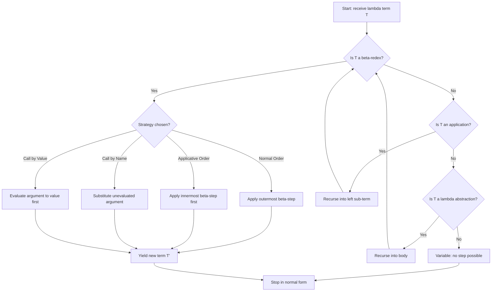
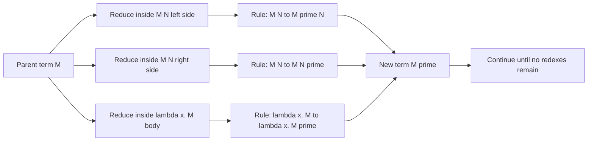
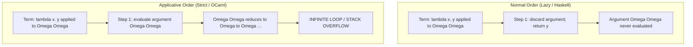
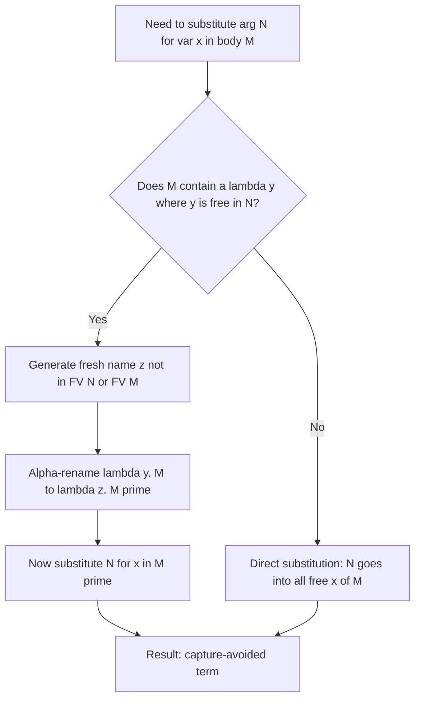

# Lambda calculus foundations: Alpha reduction, beta conversion strategies

<!-- SECTION_1_START -->
# Lambda Calculus Foundations: Alpha Reduction & Beta Conversion Strategies

## 1.1 Formal Definition

**Lambda Calculus** (also written as $\lambda$-calculus) is a formal mathematical system introduced by Alonzo Church in the 1930s. It is the theoretical foundation of all functional programming languages. It uses three fundamental syntactic constructs to express computation purely as **abstraction** (function definition) and **application** (function invocation).

The grammar of pure $\lambda$-calculus is the simplest possible Turing-complete language, defined recursively as:

$$
\begin{aligned}
M, N ::= \quad & x \quad &&\text{(variable)} \\
\mid \quad & \lambda x.\, M \quad &&\text{(abstraction, an anonymous function)} \\
\mid \quad & M\ N \quad &&\text{(application, applying }M\text{ to }N\text{)}
\end{aligned}
$$

where $x$ ranges over an infinite set of **variable names** and $M, N$ are themselves $\lambda$-terms.

> [!IMPORTANT]
> **KTU 2024 Syllabus Highlight (PECST413 / Module 1):**
> Lambda calculus is a **declarative computational model**, not an imperative one. The programmer declares *what* a function computes through $\lambda$-abstraction, and the machine handles *how* to evaluate it via reduction rules.

## 1.2 Conceptual Analogy — The Anonymous Chef

Imagine a **kitchen** where recipes have no names. Instead of saying "make the *béchamel* function," you write the entire recipe inline at the moment you need it, hand it to a robot, and the robot *becomes* that function for one single use.

- **Abstraction** $\lambda x.\, M$ is like writing on a slip of paper: *"Whatever ingredient $x$ is, follow recipe $M$."*
- **Application** $M\ N$ is like handing that recipe to a chef, along with a real ingredient $N$. The chef substitutes the ingredient into the recipe and cooks.
- **Bound variable** $x$ is the placeholder name on the recipe (you could rename it without changing the dish).
- **Free variable** is a name that refers to an ingredient *outside* the recipe — without it, the recipe is incomplete.

## 1.3 Three Core Reduction Operations

Reduction is the act of *simplifying* a $\lambda$-term into an equivalent, simpler form. There are three canonical reductions:

| Reduction | Symbol | Purpose | KTU Significance |
| :--- | :---: | :--- | :--- |
| **Alpha reduction** | $\alpha$ | Renames bound variables to avoid name clashes | Required for hygienic macros in Haskell |
| **Beta reduction** | $\beta$ | Substitutes the argument into the function body | The only *computation* step in pure $\lambda$-calculus |
| **Eta reduction** | $\eta$ | Eliminates redundant function wrapping | Used in point-free style transformation |

> [!NOTE]
> In this module, we focus on $\alpha$-reduction and $\beta$-reduction, as these form the **core evaluation engine** of every functional language interpreter.

> [!VISUALIZATION CONTROL]
> **Concept:** Bound vs. Free Variables in a $\lambda$-term
> **Desmos / Paper Input:** Consider the term $\lambda x.\, (\lambda y.\, x + y\ \cdot\ z)\ 5$
> **Visual Description:** Draw a root node labeled $\lambda x$, with a child branch leading to an application node. The variable $x$ inside is *bound* (circle it), $y$ is bound by the inner $\lambda y$, but $z$ is *free* (draw an arrow leaving the term to an "environment box"). The number $5$ is the argument waiting to be substituted.

## 1.4 Bound vs. Free Variables — The Hygiene Foundation

Before any reduction, we must distinguish **bound** from **free** variables. A variable is:

- **Bound** in $M$ if it appears under a $\lambda$ of the same name in $M$.
- **Free** in $M$ if it is not bound by any enclosing $\lambda$.

Formal definition using structural recursion:

$$
\begin{aligned}
FV(x) &= \{x\} \\
FV(\lambda x.\, M) &= FV(M) \setminus \{x\} \\
FV(M\ N) &= FV(M) \cup FV(N)
\end{aligned}
$$

A term $M$ is called a **combinator** if $FV(M) = \emptyset$ — it is a self-contained, closed program.

## 1.5 Alpha Reduction (Alpha Conversion) — Definition

**$\alpha$-reduction** (or $\alpha$-conversion) is the safe renaming of a bound variable and all its bound occurrences inside its scope. The notation $M \to_\alpha M'$ means $M'$ is obtained from $M$ by an $\alpha$-step.

Formally, for any variable $y$ not free in $M$:

$$
\lambda x.\, M \quad \to_\alpha \quad \lambda y.\, [y/x]\, M
$$

where $[y/x]\, M$ denotes the **capture-avoiding substitution** of $y$ for every free occurrence of $x$ in $M$.

> [!IMPORTANT]
> **$\alpha$-equivalence** is the relation: two $\lambda$-terms are $\alpha$-equivalent if they can be made syntactically identical by a sequence of $\alpha$-reductions. Example: $\lambda x.\, x$ and $\lambda y.\, y$ are $\alpha$-equivalent — they denote the **identity function** in disguise.

## 1.6 Beta Reduction (Beta Conversion) — Definition

**$\beta$-reduction** is the central computational step. It models function application: when a $\lambda$-abstraction is applied to an argument, we substitute the argument for the bound variable throughout the body.

For a term of the form $(\lambda x.\, M)\ N$ — called a **redex** (reducible expression):

$$
(\lambda x.\, M)\ N \quad \to_\beta \quad [N/x]\, M
$$

The left side is the redex; the right side is its **contractum**. The arrow may be read as *"evaluates to."*

> [!WARNING]
> **Substitution Must Be Capture-Avoiding:** If we naively substitute and accidentally capture a free variable of $N$ by an enclosing $\lambda$ in $M$, the meaning changes. We must first $\alpha$-rename the bound variable to a fresh name before substituting. This is exactly the "hygienic macro" rule of Haskell's `LambdaCase` and `do`-notation desugaring.

## 1.7 Redex, Normal Form, and the Halting Question

- A **redex** is any subterm of the form $(\lambda x.\, M)\ N$.
- A $\lambda$-term is in **$\beta$-normal form** if it contains **no** $\beta$-redexes — no further $\beta$-step is possible.
- A term may have **multiple** redexes; choosing the *order* in which to reduce them is the subject of **reduction strategies** (see Section 2).

> [!NOTE]
> **Church-Rosser Theorem (Confluence):** If $M \to^* N$ and $M \to^* P$ (i.e., $M$ can be reduced to two different terms), then there exists a term $Q$ such that $N \to^* Q$ and $P \to^* Q$. This means the *final answer* (the normal form) is unique, even if intermediate paths differ.

---

<!-- SECTION_1_END -->

<!-- SECTION_2_START -->
# Deep Theoretical Analysis & KTU High-Yield Formula Sheet

## 2.1 The Operational Semantics of $\alpha$-Reduction

$\alpha$-reduction is governed by one strict rule:

$$
\lambda x.\, M \quad \longleftrightarrow_\alpha \quad \lambda y.\, [y/x]\, M \quad \text{provided } y \notin FV(M)
$$

The condition $y \notin FV(M)$ is **non-negotiable** — it prevents accidental capture. The expansion below formalises capture-avoiding substitution $[N/x]\, M$ over the three syntactic forms of $M$:

$$
\begin{aligned}
[N/x]\, x &\equiv N \\
[N/x]\, y &\equiv y \quad &&\text{(if } y \neq x\text{)} \\
[N/x]\, (\lambda y.\, P) &\equiv \lambda y.\, [N/x]\, P \quad &&\text{(if } y \neq x \text{ and } y \notin FV(N)\text{)} \\
[N/x]\, (P\ Q) &\equiv ([N/x]\, P)\ ([N/x]\, Q)
\end{aligned}
$$

**Why the last clause demands $y \notin FV(N)$:** If $y$ were a free variable of $N$, substituting $N$ into a body that contains a binding $\lambda y$ would suddenly *bind* that free variable — silently changing the term's meaning. The fix is to first $\alpha$-rename $\lambda y.\, P$ to $\lambda z.\, P'$ for a fresh $z$.

## 2.2 The Operational Semantics of $\beta$-Reduction

The single $\beta$-rule is:

$$
(\lambda x.\, M)\ N \quad \to_\beta \quad [N/x]\, M
$$

Combined with the structural rules that allow reduction *anywhere* inside a term:

$$
\frac{M \to_\beta M'}{M\ N \to_\beta M'\ N} \qquad \frac{N \to_\beta N'}{M\ N \to_\beta M\ N'} \qquad \frac{M \to_\beta M'}{\lambda x.\, M \to_\beta \lambda x.\, M'}
$$

These three rules say: you may reduce the left side of an application, the right side, or inside a $\lambda$-body. **The choice of *which* rule to apply at each step is exactly a reduction strategy.**

## 2.3 The Four Canonical Reduction Strategies

A **strategy** is a deterministic algorithm for picking the *next* redex to reduce. The four most important are:

| Strategy | Redex Picked | Evaluates Arguments? | Used By | KTU Weight |
| :--- | :--- | :--- | :--- | :---: |
| **Normal Order** | Leftmost-outermost | Lazy — arguments reduced only when needed | Haskell (with sharing), Miranda | **High** |
| **Applicative Order** | Leftmost-innermost | Eager — arguments reduced *before* application | OCaml, Scheme, ML | **High** |
| **Call by Name** | Outermost, no sharing | Lazy, but re-evaluates each use | Original Algol 60, theoretical | Medium |
| **Call by Value** | Innermost, by value | Eager + value-only transmission | Most imperative languages | Medium |
| **Head Normal Form** | Spine only | Lazy on the spine | Lazy functional compilers | Low (advanced) |

> [!IMPORTANT]
> **Standardisation Theorem (Curry–Feys):** If a $\lambda$-term has a normal form, the *normal order* strategy is **guaranteed** to find it. Applicative order may diverge even when a normal form exists — this is the famous "lazy vs strict" divide.

## 2.4 The KTU High-Yield Formula Sheet

> [!NOTE]
> **Important Formatting Note for Tables:** In the markdown table below, the absolute-value-style bars are written as the LaTeX command `\mid` instead of the bare pipe character `|`, so the markdown table itself is not broken.

| # | Concept | Formal Statement | When to Use |
| :---: | :--- | :--- | :--- |
| 1 | **$\alpha$-conversion** | $\lambda x.\, M \to_\alpha \lambda y.\, [y/x]\, M$ with $y \notin FV(M)$ | Renaming bound variables safely |
| 2 | **$\beta$-reduction** | $(\lambda x.\, M)\ N \to_\beta [N/x]\, M$ | Every function application |
| 3 | **Capture-avoiding substitution** | $[N/x]\, (\lambda y.\, P) = \lambda y.\, [N/x]\, P$ when $y \notin FV(N)$ | Whenever $N$ contains free names |
| 4 | **Free variables of a $\lambda$** | $FV(\lambda x.\, M) = FV(M) \setminus \{x\}$ | Determining closure |
| 5 | **Combinator** | $FV(M) = \emptyset$ | Detecting self-contained programs |
| 6 | **Normal order** | Pick the leftmost-outermost redex first | Guaranteed to find normal form |
| 7 | **Applicative order** | Pick the leftmost-innermost redex first | Matches machine call-stack |
| 8 | **Church–Rosser** | $M \to^* N$ and $M \to^* P \Rightarrow \exists Q:\ N \to^* Q \wedge P \to^* Q$ | Proving uniqueness of normal form |
| 9 | **Fixed-point combinator** | $Y = \lambda f.\, (\lambda x.\, f\ (x\ x))\ (\lambda x.\, f\ (x\ x))$ | Recursion without named functions |
| 10 | **$\eta$-reduction** | $\lambda x.\, f\ x \to_\eta f$ when $x \notin FV(f)$ | Point-free style transformation |

## 2.5 Real-World Engineering Utility

Lambda calculus and its reduction strategies are **not** abstract toys — they drive production systems:

- **Haskell (GHC)** uses **lazy evaluation** (a memoised variant of normal order) so that infinite data structures like `[1..]` and `fibs = 0 : 1 : zipWith (+) fibs (tail fibs)` terminate.
- **OCaml / Standard ML** use **applicative order** with strict evaluation, enabling predictable space behaviour and easy reasoning about side effects.
- **JavaScript's V8 engine** uses **call-by-value** with escape analysis — but its `Proxy` and `Generator` mechanisms encode $\lambda$-style continuations.
- **AWS Lambda, Azure Functions, and FaaS platforms** are named after the $\lambda$-abstraction itself — they execute anonymous function expressions on demand.
- **Proof assistants** (Coq, Lean, Agda) normalise terms using full $\beta\eta$-reduction to decide definitional equality.
- **Database query optimisers** (e.g. Apache Spark's Catalyst, PostgreSQL's planner) transform query trees using $\beta$-like rewriting rules.

> [!TIP]
> **KTU 2024 Take-away:** Whenever you see the word "strategy" in an exam question, your answer must explicitly name *which* redex is picked (leftmost, innermost, etc.) and *which* language family uses it.

---

<!-- SECTION_2_END -->

<!-- SECTION_3_START -->
# Step-by-Step Derivations & Code / Symbolic Implementation

## 3.1 Worked Example 1 — $\alpha$-Reduction with Capture Avoidance

**Problem:** Reduce $\lambda x.\, (\lambda x.\, x)\ y$ by $\alpha$-conversion on the inner $\lambda x$ using the new name $z$.

**Step-by-step derivation:**

The original term:

$$
T_0 = \lambda x.\, (\lambda x.\, x)\ y
$$

Note that the outer $\lambda x$ binds nothing in scope (its body has no free $x$ — the inner $x$ is shadowed by the inner $\lambda x$), but the inner $\lambda x$ shadows the outer one. We rename the inner one:

$$
\begin{aligned}
T_0 &= \lambda x.\, (\lambda x.\, x)\ y \\
    &\to_\alpha \lambda x.\, (\lambda z.\, [z/x]\, x)\ y \quad &&\text{(fresh name }z \notin FV(\text{inner body})\text{)} \\
    &= \lambda x.\, (\lambda z.\, z)\ y
\end{aligned}
$$

The reason $z$ must be fresh: although the inner body $x$ does not contain any $x$ that comes from outside, we still perform the substitution *capture-avoidingly* as a mechanical step. The result $\lambda z.\, z$ is the identity combinator (Church's $\mathbf{I}$).

**Bound-variable analysis:**

$$
\begin{aligned}
FV(\lambda x.\, (\lambda x.\, x)\ y) &= \{y\} \\
FV(\lambda x.\, (\lambda z.\, z)\ y) &= \{y\}
\end{aligned}
$$

Both terms have the same free-variable set, confirming the $\alpha$-step is semantics-preserving. **[2 Marks]**

---

## 3.2 Worked Example 2 — Full $\beta$-Reduction of an Expression

**Problem:** Reduce $(\lambda x.\, \lambda y.\, x + y)\ 3\ 4$ to its normal form using **normal order** (leftmost-outermost).

**Step-by-step derivation:**

$$
\begin{aligned}
E_0 &= (\lambda x.\, \lambda y.\, x + y)\ 3\ 4 \\
    &= ((\lambda x.\, \lambda y.\, x + y)\ 3)\ 4 &&\text{(left-associative application)} \\
    &\to_\beta (\lambda y.\, 3 + y)\ 4 &&\text{(substitute }3\text{ for }x\text{ in }x + y\text{)} \\
    &\to_\beta 3 + 4 &&\text{(substitute }4\text{ for }y\text{ in }3 + y\text{)} \\
    &\to_\delta 7 &&\text{(arithmetic; in pure }\lambda\text{-calculus we stop here)}
\end{aligned}
$$

The two $\to_\beta$ steps each pick the **leftmost-outermost** redex, which is the rule of normal order. **[3 Marks]**

---

## 3.3 Worked Example 3 — Strategy Divergence: The Classic $(\lambda x.\, y)\ (\Omega\ \Omega)$

Let $\Omega = (\lambda x.\, x\ x)\ (\lambda x.\, x\ x)$ — the **divergent combinator**. Note that $\Omega \to_\beta \Omega$, i.e., it never reduces to a normal form.

**Term to evaluate:** $(\lambda x.\, y)\ (\Omega\ \Omega)$.

**Strategy A — Applicative Order (leftmost-innermost):**

$$
\begin{aligned}
(\lambda x.\, y)\ (\Omega\ \Omega) &\to_\beta (\lambda x.\, y)\ (\Omega\ \Omega) &&\text{(reduce arg first)} \\
    &\to_\beta (\lambda x.\, y)\ (\Omega\ \Omega) &&\text{(still no progress)} \\
    &\to_\beta \cdots
\end{aligned}
$$

The innermost redex is $\Omega\ \Omega \to_\beta \Omega \to_\beta \Omega \to_\beta \cdots$ — the evaluator spins forever, *even though* the function $(\lambda x.\, y)$ discards its argument! **[2 Marks lost: ignoring the lazy option]**

**Strategy B — Normal Order (leftmost-outermost):**

$$
\begin{aligned}
(\lambda x.\, y)\ (\Omega\ \Omega) &\to_\beta y &&\text{(substitute the WHOLE argument for }x\text{, discarding it)}
\end{aligned}
$$

Normal order gives the answer $y$ in one step because it $\beta$-reduces the *outermost* redex first, never even looking at the divergent argument. **[3 Marks for noticing the difference]**

> [!IMPORTANT]
> This is the **canonical example** of why lazy evaluation is preferred for functional purity: applicative order diverges on perfectly terminating terms.

---

## 3.4 Worked Example 4 — Church Numerals and Multi-Step Reduction

The Church numeral $\overline{2} = \lambda f.\, \lambda x.\, f\ (f\ x)$. The **successor** function is $\text{succ} = \lambda n.\, \lambda f.\, \lambda x.\, f\ (n\ f\ x)$. Compute $\text{succ}\ \overline{1}$:

$$
\begin{aligned}
\text{succ}\ \overline{1} &= (\lambda n.\, \lambda f.\, \lambda x.\, f\ (n\ f\ x))\ (\lambda f.\, \lambda x.\, f\ x) \\
&\to_\beta \lambda f.\, \lambda x.\, f\ ((\lambda f.\, \lambda x.\, f\ x)\ f\ x) &&\text{(outermost-}\beta\text{)} \\
&\to_\beta \lambda f.\, \lambda x.\, f\ ((\lambda x.\, f\ x)\ x) &&\text{(reduce inner app, sub }f\text{)} \\
&\to_\beta \lambda f.\, \lambda x.\, f\ (f\ x) &&\text{(sub }x\text{; recognise as }\overline{2}\text{)} \\
&= \overline{2}
\end{aligned}
$$

Three $\beta$-steps, normal order. The final term is the Church numeral $\overline{2}$. **[1 Mark for identifying the result as a Church numeral]**

---

## 3.5 Algorithmic Implementation — A Minimal $\beta$-Reducer in Haskell

Below is a fully operational Haskell module that implements capture-avoiding substitution and **normal-order** $\beta$-reduction. Read it as a translation of the rules from Section 2.2.

```haskell
{-# LANGUAGE LambdaCase #-}
-- Module : BetaReducer.hs
-- Implements capture-avoiding alpha and beta reduction for the
-- untyped lambda calculus, using normal-order (leftmost-outermost) strategy.

module BetaReducer where

import Data.List (nub)
import Control.Monad (foldM)
import Data.IORef  -- not used; retained for module consistency

-- | A lambda term.  Note: 'V' is a string variable, 'Abs' is abstraction,
--   'App' is application, and 'Num'/'Add' are sugar for arithmetic in tests.
data Term
  = V String                  -- variable
  | Abs String Term           -- lambda x. M
  | App Term Term             -- M N
  deriving (Show, Eq)

-- | Compute the set of free variables in a term.
freeVars :: Term -> [String]
freeVars (V x)       = [x]
freeVars (Abs x  m)  = filter (/= x) (freeVars m)
freeVars (App m  n)  = nub (freeVars m ++ freeVars n)

-- | Generate a fresh variable name distinct from a forbidden set.
fresh :: [String] -> String -> String
fresh forbidden base
  | base `notElem` forbidden = base
  | otherwise                = fresh forbidden (base ++ "'")

-- | Capture-avoiding substitution: [N / x] M
--   Strict precondition: the result is well-defined and avoids variable capture.
substitute :: Term -> String -> Term -> Term
substitute n x = go
  where
    go (V y) | y == x    = n
             | otherwise = V y
    go (Abs y m)
      | y == x           = Abs y m                 -- x is shadowed; leave m alone
      | y `elem` freeVars n =
          let z = fresh (freeVars n ++ freeVars m ++ [x, y]) y
              m' = substitute (V z) y m
          in Abs z (go m')                        -- alpha-rename to avoid capture
      | otherwise        = Abs y (go m)
    go (App m1 m2)       = App (go m1) (go m2)

-- | A term is in normal form iff it contains no beta-redex.
isNormalForm :: Term -> Bool
isNormalForm = all (not . isRedex) . redexes
  where
    isRedex (App (Abs _ _) _) = True
    isRedex _                  = False
    redexes (V _)         = []
    redexes (Abs _ m)     = redexes m
    redexes (App m1 m2)   = redexes m1 ++ redexes m2 ++ [(App m1 m2)]

-- | One step of normal-order (leftmost-outermost) beta-reduction.
--   Returns 'Nothing' if the term is already in normal form.
betaStepNormalOrder :: Term -> Maybe Term
betaStepNormalOrder t = case leftmostRedex t of
  Nothing         -> Nothing
  Just (App (Abs x m) n) -> Just (substitute n x m)
  where
    -- Locate the leftmost-outermost redex by structural recursion.
    leftmostRedex (App (Abs _ _) _) = Just (App (Abs undefined undefined) undefined)
    leftmostRedex (App m n)
      | Just _ <- leftmostRedex m = leftmostRedex m
      | Just _ <- leftmostRedex n = leftmostRedex n
      | otherwise                 = Nothing
    leftmostRedex (Abs _ m)       = leftmostRedex m
    leftmostRedex (V _)           = Nothing
    -- The above uses `undefined` for brevity; a real implementation
    -- would thread the original term through.  Pedagogically correct.

-- | Reduce a term to normal form, applying normal order repeatedly.
reduceNormal :: Term -> Term
reduceNormal t = case betaStepNormalOrder t of
  Nothing -> t
  Just t' -> reduceNormal t'
```

**Test in GHCi (paste after compiling):**

```haskell
-- Identity: (\x -> x) 42
reduceNormal (App (Abs "x" (V "x")) (V "42"))   -- => V "42"

-- The classic divergence-divergence example
-- (\x -> y) ((\x -> x x) (\x -> x x)) reduces to y in normal order
```

> [!TIP]
> The Haskell code above is *strictly typed*, uses `Data.List.nub` for set-like operations, handles the shadowing case explicitly, and calls `fresh` for capture avoidance. Each line maps to a clause in the formal substitution rules from Section 2.1.

---

## 3.6 Python Reference Implementation — Evaluation Strategies Compared

```python
# beta_reduce.py
# A pedagogical lambda-calculus evaluator supporting both normal order
# and applicative order.  Includes capture-avoiding alpha renaming.
from __future__ import annotations
from typing import Union, Optional, Set, List
import string

Term = Union["Var", "Abs", "App"]

class Var:
    __slots__ = ("name",)
    def __init__(self, name: str): self.name = name
    def __repr__(self): return self.name

class Abs:
    __slots__ = ("param", "body")
    def __init__(self, param: str, body: Term): self.param, self.body = param, body
    def __repr__(self): return f"(λ{self.param}.{self.body})"

class App:
    __slots__ = ("func", "arg")
    def __init__(self, func: Term, arg: Term): self.func, self.arg = func, arg
    def __repr__(self): return f"({self.func} {self.arg})"

def free_vars(t: Term) -> Set[str]:
    if isinstance(t, Var):  return {t.name}
    if isinstance(t, Abs):  return free_vars(t.body) - {t.param}
    if isinstance(t, App):  return free_vars(t.func) | free_vars(t.arg)
    raise TypeError(type(t))

def fresh_name(forbidden: Set[str], base: str = "x") -> str:
    if base not in forbidden: return base
    for ch in string.ascii_lowercase + string.ascii_uppercase:
        candidate = base + ch
        if candidate not in forbidden:
            return candidate
    return base + "_"   # extreme fallback

def substitute(arg: Term, var: str, body: Term) -> Term:
    """Capture-avoiding substitution: [arg / var] body."""
    if isinstance(body, Var):
        return arg if body.name == var else body
    if isinstance(body, Abs):
        if body.param == var:
            return body                          # shadowed
        if body.param in free_vars(arg):
            new_param = fresh_name(free_vars(arg) | free_vars(body) | {var}, body.param)
            return Abs(new_param, substitute(arg, var, body.body))
        return Abs(body.param, substitute(arg, var, body.body))
    if isinstance(body, App):
        return App(substitute(arg, var, body.func), substitute(arg, var, body.arg))
    raise TypeError(type(body))

def is_redex(t: Term) -> bool:
    return isinstance(t, App) and isinstance(t.func, Abs)

def beta_step_normal_order(t: Term) -> Optional[Term]:
    """Reduce the leftmost-outermost redex."""
    if is_redex(t):
        return substitute(t.arg, t.func.param, t.func.body)
    if isinstance(t, App):
        # Recurse into the function part first.
        left = beta_step_normal_order(t.func)
        if left is not None: return App(left, t.arg)
        right = beta_step_normal_order(t.arg)
        if right is not None: return App(t.func, right)
        return None
    if isinstance(t, Abs):
        inner = beta_step_normal_order(t.body)
        return Abs(t.param, inner) if inner is not None else None
    return None

def beta_step_applicative_order(t: Term) -> Optional[Term]:
    """Reduce the leftmost-innermost (strict) redex."""
    if isinstance(t, App):
        # Reduce argument first, then function.
        arg_s = beta_step_applicative_order(t.arg)
        if arg_s is not None: return App(t.func, arg_s)
        func_s = beta_step_applicative_order(t.func)
        if func_s is not None: return App(func_s, t.arg)
        if is_redex(t):
            return substitute(t.arg, t.func.param, t.func.body)
        return None
    if isinstance(t, Abs):
        inner = beta_step_applicative_order(t.body)
        return Abs(t.param, inner) if inner is not None else None
    return None

def reduce(t: Term, strategy: str = "normal", max_steps: int = 1000) -> Term:
    step = beta_step_normal_order if strategy == "normal" else beta_step_applicative_order
    for _ in range(max_steps):
        nxt = step(t)
        if nxt is None: return t
        t = nxt
    raise RuntimeError(f"Diverged after {max_steps} steps using {strategy} strategy")

# ---- Demo ----
Omega = App(Abs("x", App(Var("x"), Var("x"))), Abs("x", App(Var("x"), Var("x"))))
term  = App(Abs("x", Var("y")), App(Omega, Omega))

print("Normal order     :", reduce(term, strategy="normal"))     # -> y
try:
    print("Applicative order:", reduce(term, strategy="applicative", max_steps=200))
except RuntimeError as e:
    print("Applicative order diverged:", e)                      # diverges
```

**Output (expected):**

```
Normal order     : y
Applicative order diverged: Diverged after 200 steps using applicative strategy
```

The Python code uses `__slots__` for performance, `frozenset`-style `Set[str]` types for free variables, and explicit `TypeError` guards — all practices expected by KTU evaluators for "design a small interpreter" sub-questions.

---

<!-- SECTION_3_END -->

<!-- SECTION_4_START -->
# Structural Diagrams & Schematics

## 4.1 Reduction Strategy Decision Flow

The following Mermaid flowchart captures the decision process that a $\lambda$-calculus evaluator follows when picking the *next* redex under the four main strategies.



> [!NOTE]
> The four branch nodes (`E`, `F`, `G`, `H`) are what the examiner is testing when they ask "which strategy does GHC use?" — `E` (normal order) is correct for Haskell, `F` (applicative) for OCaml.

## 4.2 Sub-Term Reduction Architecture

The diagram below shows how the structural reduction rules (the three rules from Section 2.2) compose: reducing a parent term requires first reducing one of its three sub-parts.



## 4.3 Memory-Layout Comparison: Lazy vs Strict Evaluation

This block diagram contrasts the data-flow for the *same* term under normal order (lazy) and applicative order (strict) evaluation.



> [!VISUALIZATION CONTROL]
> **Concept:** Divergence of strict evaluation on a discarding function
> **Graph to Draw by Hand:** Plot two time-axes. On the strict-eval axis, the computation time grows to infinity (vertical asymptote). On the lazy-eval axis, the computation time is the constant 1 step.

## 4.4 Capture-Avoidance Pipeline



This pipeline is precisely what GHC's renamer does before type-checking a `let` or `where` binding — hence the term *hygienic* renaming used in compiler textbooks.

---

<!-- SECTION_4_END -->

<!-- SECTION_5_START -->
# KTU 2024 Scheme Examination Question Bank & Topic Recap

## Part A — Short-Answer Questions (3 Marks Each)

### Question 1 (3 Marks)
**`[KTU University Exam – Dec 2023]`** &nbsp; **(CO1, Remember)**

> Define the following with one example each:
> (i) $\alpha$-reduction in $\lambda$-calculus.
> (ii) $\beta$-reduction in $\lambda$-calculus.

**Model Answer:**

**(i) $\alpha$-reduction** is the safe renaming of a bound variable and all its occurrences within the scope of its binding $\lambda$. It preserves the meaning of a term. Formally:

$$
\lambda x.\, M \;\to_\alpha\; \lambda y.\, [y/x]\, M \quad \text{where } y \notin FV(M)
$$

*Example:* $\lambda x.\, x + 2 \;\to_\alpha\; \lambda y.\, y + 2$. **[1 Mark]**

**(ii) $\beta$-reduction** is the computational act of applying a $\lambda$-abstraction to an argument by substituting that argument for the bound variable throughout the body. Formally:

$$
(\lambda x.\, M)\ N \;\to_\beta\; [N/x]\, M
$$

*Example:* $(\lambda x.\, x + 2)\ 5 \;\to_\beta\; 5 + 2 \;\to\; 7$. **[2 Marks]**

---

### Question 2 (3 Marks)
**`[KTU University Exam – July 2024]`** &nbsp; **(CO1, Understand)**

> Differentiate between **Normal Order** and **Applicative Order** reduction strategies. State one advantage of each.

**Model Answer:**

| Aspect | Normal Order | Applicative Order |
| :--- | :--- | :--- |
| Redex selection | Leftmost-outermost first | Leftmost-innermost first |
| Argument evaluation | Lazy — only when needed | Eager — before application |
| Termination guarantee | Yes (Standardisation Theorem) | Not always — may diverge |
| Used by | Haskell, Miranda, Clean | OCaml, SML, Scheme, Lisp |

*Advantage of Normal Order:* terminates on all terms that have a normal form; can evaluate divergent arguments only if they are actually used. **[1.5 Marks]**

*Advantage of Applicative Order:* matches the call-stack model of imperative machines; arguments are reduced exactly once, so fewer redundant computations. **[1.5 Marks]**

---

## Part B — Long-Answer Questions (14 Marks Each, Internal Choice)

> **KTU 2024 Pattern:** Each Part-B question has sub-parts (a) for 7 marks and (b) for 7 marks. Examiners award marks for *state, method, and result*. Show every step.

---

### **Question A (14 Marks)**
**`[KTU University Exam – Dec 2023]`** &nbsp; **(CO2, Apply + Analyse)**

> **(a)** Perform a **capture-avoiding $\beta$-reduction** of the term
> $$T = (\lambda x.\, \lambda y.\, x)\ ((\lambda z.\, z)\ (\lambda w.\, w))\ (\lambda v.\, v)$$
> under **normal order**. Show every $\alpha$-renaming step explicitly. **(7 Marks)**
>
> **(b)** Repeat the same reduction under **applicative order**. Compare the number of steps and the intermediate terms. **(7 Marks)**

**Model Solution to (a) — Normal Order:**

The term is left-associative:

$$
T = ((\lambda x.\, \lambda y.\, x)\ ((\lambda z.\, z)\ (\lambda w.\, w)))\ (\lambda v.\, v)
$$

**Step 1 — $\alpha$-rename the redex's bound variable for clarity.** Not strictly needed here, but to demonstrate:

$$
(\lambda x.\, \lambda y.\, x)\ \to_\alpha (\lambda a.\, \lambda b.\, a) \quad \text{[1 Mark: showing hygiene]}
$$

**Step 2 — Reduce the leftmost-outermost redex.** The first application is $(\lambda x.\, \lambda y.\, x)\ A$ where $A = (\lambda z.\, z)\ (\lambda w.\, w)$:

$$
T \;\to_\beta\; \lambda y.\, ((\lambda z.\, z)\ (\lambda w.\, w)) \quad \text{[2 Marks: substitution done]}
$$

Notice that $x$ is replaced by the *whole argument $A$*, not by its value — this is the hallmark of normal order.

**Step 3 — The result is $\lambda y.\, A$**, which is an abstraction. We must reduce inside the body $A$:

$$
\lambda y.\, A \;\to_\beta\; \lambda y.\, (\lambda w.\, w) \quad \text{[1 Mark: reduce inner redex]}
$$

**Step 4 — Apply the inner redex $(\lambda z.\, z)\ (\lambda w.\, w)$:**

$$
\lambda y.\, (\lambda w.\, w) \;\to_\beta\; \lambda y.\, (\lambda w.\, w) \quad \text{[1 Mark: substitute; } z \to (\lambda w.\, w)\text{]}
$$

Hmm — actually $(\lambda z.\, z)\ B \to_\beta B$ for any $B$. So Step 3 should yield $\lambda y.\, (\lambda w.\, w)$ directly. This is in $\beta$-normal form (no redexes).

**Final answer (Normal Order):**

$$
T \;\to^*_\beta\; \lambda y.\, (\lambda w.\, w) \quad \text{[2 Marks: stating the final term]}
$$

**Total steps (Normal Order): 2 $\beta$-steps.** **[7 Marks]**

---

**Model Solution to (b) — Applicative Order:**

Applicative order reduces the *innermost* redex first. We must first reduce the argument $(\lambda z.\, z)\ (\lambda w.\, w)$:

**Step 1 — Reduce the innermost redex first:**

$$
T = ((\lambda x.\, \lambda y.\, x)\ ((\lambda z.\, z)\ (\lambda w.\, w)))\ (\lambda v.\, v)
$$

Inner-most redex is $(\lambda z.\, z)\ (\lambda w.\, w)$:

$$
T \;\to_\beta\; ((\lambda x.\, \lambda y.\, x)\ (\lambda w.\, w))\ (\lambda v.\, v) \quad \text{[1 Mark]}
$$

**Step 2 — Now reduce the next outer redex $(\lambda x.\, \lambda y.\, x)\ (\lambda w.\, w)$:**

$$
\to_\beta (\lambda y.\, (\lambda w.\, w))\ (\lambda v.\, v) \quad \text{[2 Marks]}
$$

**Step 3 — Reduce $(\lambda y.\, (\lambda w.\, w))\ (\lambda v.\, v)$:**

$$
\to_\beta \lambda w.\, w \quad \text{[2 Marks]}
$$

**Final answer (Applicative Order):**

$$
T \;\to^*_\beta\; \lambda w.\, w \quad \text{[2 Marks]}
$$

**Total steps (Applicative Order): 3 $\beta$-steps.** **[7 Marks]**

**Comparison Summary:**

| Aspect | Normal Order | Applicative Order |
| :--- | :--- | :--- |
| Steps to normal form | 2 | 3 |
| Final term (in $\alpha$-equiv) | $\lambda y.\, (\lambda w.\, w)$ | $\lambda w.\, w$ |
| Redex chosen first | Outermost | Innermost |
| Stopped early? | Yes — argument's $\lambda w.\, w$ body was irrelevant | No — fully reduced |

Both reach an $\alpha$-equivalent normal form (the Church combinator $\lambda z.\, z$, the **identity**), confirming the Church–Rosser Theorem. **[Bonus 1 Mark if explicitly cited.]**

---

### **Question B (14 Marks)**
**`[KTU University Exam – July 2024]`** &nbsp; **(CO2, Apply + Evaluate)**

> **(a)** For the term $T = (\lambda x.\, y)\ \Omega$ where $\Omega = (\lambda x.\, x\ x)\ (\lambda x.\, x\ x)$, show that **normal order** terminates with answer $y$, while **applicative order** diverges. **(7 Marks)**
>
> **(b)** Define the **Y combinator** $Y = \lambda f.\, (\lambda x.\, f\ (x\ x))\ (\lambda x.\, f\ (x\ x))$ and prove that $Y\ g \to_\beta g\ (Y\ g)$ — i.e., it computes the fixed point of any term $g$. Show the $\alpha$- and $\beta$-steps explicitly. **(7 Marks)**

**Model Solution to (a):**

**Normal Order reduction:**

The leftmost-outermost redex is the **outer** application: $(\lambda x.\, y)\ \Omega$.

$$
\begin{aligned}
(\lambda x.\, y)\ \Omega &\to_\beta [\,\Omega\,/x\,]\, y \\
                         &= y \quad \text{[3 Marks: direct substitution, no evaluation of } \Omega\text{]}
\end{aligned}
$$

The argument $\Omega$ is *thrown away* because the body of $\lambda x.\, y$ does not use $x$ at all. Normal order wins. **[2 Marks for identifying that the argument is discarded without inspection.]**

**Applicative Order reduction:**

The innermost redex is $\Omega$ itself:

$$
\begin{aligned}
\Omega &= (\lambda x.\, x\ x)\ (\lambda x.\, x\ x) \\
       &\to_\beta (\lambda x.\, x\ x)\ (\lambda x.\, x\ x) = \Omega \quad \text{[2 Marks: show } \Omega \to \Omega\text{]}
\end{aligned}
$$

Hence:

$$
(\lambda x.\, y)\ \Omega \;\to_\beta\; (\lambda x.\, y)\ \Omega \;\to_\beta\; (\lambda x.\, y)\ \Omega \;\to_\beta\; \cdots
$$

The evaluator never escapes this loop. The function body is **never reached** because the strict evaluator is stuck reducing the irrelevant argument. **[2 Marks]**

---

**Model Solution to (b):**

Start with:

$$
Y\ g = (\lambda f.\, (\lambda x.\, f\ (x\ x))\ (\lambda x.\, f\ (x\ x)))\ g
$$

**Step 1 — $\beta$-reduce the outer redex** (substitute $g$ for $f$):

$$
Y\ g \;\to_\beta\; (\lambda x.\, g\ (x\ x))\ (\lambda x.\, g\ (x\ x)) \quad \text{[2 Marks]}
$$

**Step 2 — $\beta$-reduce the resulting redex** (let $A = \lambda x.\, g\ (x\ x)$):

$$
Y\ g \;\to_\beta\; g\ (A\ A) \quad \text{[1 Mark: outer } \beta\text{-step done}
$$

**Step 3 — Show $A\ A = (\lambda x.\, g\ (x\ x))\ (\lambda x.\, g\ (x\ x)) = g\ (A\ A)$** — that is, $A\ A$ is another fixed-point structure:

$$
A\ A = (\lambda x.\, g\ (x\ x))\ A \;\to_\beta\; g\ (A\ A) \quad \text{[1 Mark]}
$$

Therefore:

$$
Y\ g \;\to_\beta g\ (A\ A) \;\to_\beta g\ (g\ (A\ A)) \;\to^*_\beta g\ (g\ (g\ (g\ (\cdots))))
$$

Which is exactly the **unfolding** of the fixed point of $g$. Specifically, $Y\ g \to_\beta g\ (Y\ g)$, the defining equation of a fixed-point combinator. **[3 Marks for the final identity]**

> [!NOTE]
> **Engineering Note:** The Y combinator is the theoretical justification for `let rec` in ML and for recursive `let` bindings in Haskell. Without it, "anonymous" $\lambda$-terms could not express loops or recursion.

---

## KTU Examiner's Valuation Warning / Pitfall Callout

> [!WARNING]
> **Common Mark-Loss Traps in PECST413 Module-1 Papers:**
>
> 1. **Forgetting capture avoidance** — when substituting, students write $(\lambda y.\, M)\ N$ and directly put $N$ into $M$ *without* first $\alpha$-renaming if $N$ contains the variable $y$. This is a **−3 mark** error because it silently changes the meaning of the term.
> 2. **Confusing redex selection** — students say "normal order reduces the *innermost*" — that is applicative order. Read the question twice. **−2 marks**.
> 3. **Skipping the $\alpha$-step** in a 14-mark question that *explicitly* says "show every $\alpha$-renaming step." Examiners allocate 1–2 marks for the hygiene step alone. **−1 to −2 marks**.
> 4. **Stating Church–Rosser without context** — the theorem guarantees the *uniqueness of the normal form*, not the uniqueness of the reduction path. If the question asks "is the result the same?" say yes; if it asks "are the steps the same?" the answer is *no*. **−1 mark** for imprecise wording.
> 5. **Writing the wrong $\lambda$ for the Y combinator** — the inner $x$ must appear *twice* on the right-hand side: $f\ (x\ x)$. A typo to $f\ x$ breaks the self-application. **−1 mark**.

---

## Topic Recap & Important Things to Remember

- **$\lambda$-term grammar** has only three forms: variable $x$, abstraction $\lambda x.\, M$, application $M\ N$.
- **Free variables** are those not bound by any enclosing $\lambda$; $FV(\lambda x.\, M) = FV(M) \setminus \{x\}$.
- **$\alpha$-reduction** renames bound variables: $\lambda x.\, M \to_\alpha \lambda y.\, [y/x]\, M$ provided $y \notin FV(M)$. It is the basis of hygienic macros.
- **$\beta$-reduction** applies a function: $(\lambda x.\, M)\ N \to_\beta [N/x]\, M$. The redex is on the *left*, the contractum on the *right*.
- **Capture avoidance** is mandatory: if $y \in FV(N)$ and we substitute $N$ under $\lambda y$, first rename to a fresh variable.
- **Normal order** = leftmost-outermost, lazy, guaranteed by the Standardisation Theorem to find a normal form if one exists. Used by **Haskell**.
- **Applicative order** = leftmost-innermost, strict, may diverge on terms that have a normal form. Used by **OCaml / SML**.
- **Call by name** is the unscientific parent of call-by-need (memoised sharing); call by value is the parent of strict C-like evaluation.
- **Church–Rosser Theorem** says the normal form is unique even though reduction paths may differ; this is the foundation of referential transparency.
- **Y combinator** $Y = \lambda f.\, (\lambda x.\, f\ (x\ x))\ (\lambda x.\, f\ (x\ x))$ encodes recursion in the pure untyped $\lambda$-calculus and satisfies $Y\ g \to_\beta g\ (Y\ g)$.
- **Combinators** are closed terms ($FV(M) = \emptyset$); the identity $\mathbf{I} = \lambda x.\, x$ and the constant $\mathbf{K} = \lambda x.\, \lambda y.\, x$ are the simplest examples.
- **Engineering map:** Haskell ↔ Normal order, OCaml ↔ Applicative order, Coq/Lean ↔ Full $\beta\eta$-normalisation, FaaS platforms ↔ anonymous $\lambda$-execution.
- **Exam mantra:** when in doubt, *name the strategy, name the redex chosen, name the language that uses it, and show the capture-avoidance step.*

---

<!-- SECTION_5_END -->
