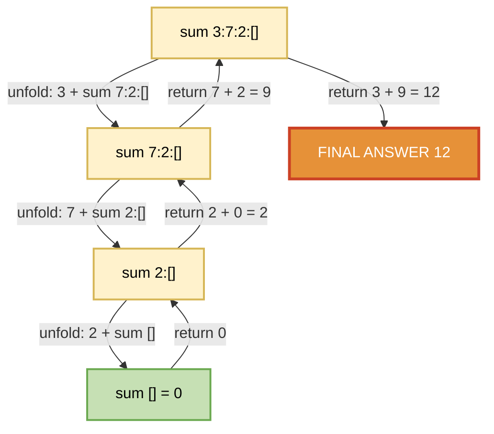
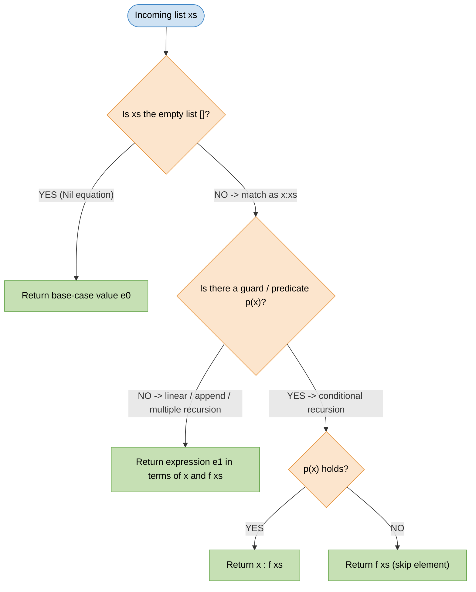
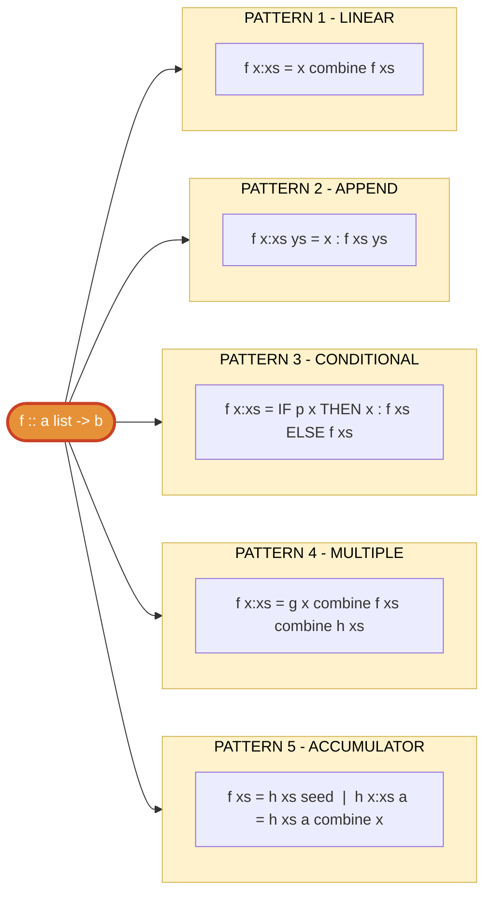

# Defining Functions over Lists

<!-- SECTION_1_START -->

# Defining Functions over Lists — Core Foundation

## Formal Definition (KTU 2024 Syllabus Terminology)

> [!IMPORTANT]
> **Definition:** A *list* in a purely functional language (Haskell) is a *homogeneous, inductively defined recursive data structure* formed by the constructors **`[]`** (the empty list) and **`(:)`** (the *cons* operator, which prepends a single element to an existing list).

Formally, the set of lists over a type $\alpha$ (written $[\alpha]$) is the *least fixed point* of the functor $F(X) = 1 + \alpha \times X$, which gives the algebraic specification:

$$[\alpha] \;\equiv\; [] \;\mid\; \alpha : [\alpha]$$

A **function over lists** is therefore a recursively defined function $f :: [\alpha] \to \beta$ whose definition is given by *equational clauses*, one per data constructor of the input list. This is called **structural recursion** — the canonical, terminating form of recursion permitted over lists.

## Conceptual Analogy — The Linked Chain

> [!NOTE]
> **Intuition:** Imagine a **paper-clip chain** hanging on a hook. Every chain is either *empty* (no clips) or *one clip connected to a smaller chain*. To compute something about the whole chain, you can only ever look at:
> 1. The **first clip** (the *head*, denoted $x$), and
> 2. The **rest of the chain** (the *tail*, denoted $xs$).

You repeat the same question about $xs$ until there is nothing left. This "peel off the front, recurse on the rest" loop is the entire engine behind every list function in Haskell.

> [!TIP]
> **Memorise the duality:** The expression `x : xs` is the *cons* cell; it is **not** a list literal. Only `[]` alone, and any expression surrounded by square brackets like `[1,2,3]` (which is sugar for `1 : 2 : 3 : []`), are full list values.

## The Three List Constructors at a Glance

| Notation | Name | Arity | Meaning |
| :--- | :--- | :---: | :--- |
| `[]` | Nil | 0 | Empty list — the *base case* for recursion |
| `(:)` | Cons | 2 | Prepends a head to an existing list |
| `[]`, `[a]`, `[a,b]`, $\ldots$ | List literal | $n$ | Syntactic sugar for nested cons ending in `[]` |

## Why Pattern Matching Drives the Design

> [!IMPORTANT]
> **KTU 2024 Highlight:** Every well-formed list function in this module uses **pattern matching** on the constructors `[]` and `(:)`. The two equations of a definition mirror the two constructors of the list type. This is the *uniqueness-of-fixed-points* principle: a total function out of an algebraic data type is uniquely determined by what it returns on each constructor.

<!-- SECTION_1_END -->

<!-- SECTION_2_START -->

# Deep Theoretical Analysis & KTU High-Yield Formula Sheet

## The General Recipe for a List Function

A *defining function over a list* follows a strict four-part template:

1. **Type signature** — name the function, list its argument and result types.
2. **Base case (Nil equation)** — answer for `[]`.
3. **Recursive case (Cons equation)** — assume the result is already known for $xs$, then combine with $x$ to obtain the result for $x : xs$.
4. **Termination argument** — every recursive call operates on a *strictly shorter* list $xs$, so by *well-founded induction* on length the function is total.

Formally, for a function $f :: [\alpha] \to \beta$ we write:

$$f \;=\; \begin{cases} f \; [] = e_0 & \text{(base case)} \\[4pt] f \; (x : xs) = e_1 & \text{(recursive case)} \end{cases}$$

where $e_1$ is an expression that *may* contain $f \; xs$ but *may not* contain $f \; (x : xs)$ — this prevents infinite recursion.

## The Five Universal Recursion Patterns

> [!NOTE]
> These five patterns cover **every** function you will be asked to write in the KTU Module-2 exam. Learn their *shapes*, not their names.

### Pattern 1 — *Linear* Recursion (single self-call)
Used when the result for $x:xs$ depends only on $x$ and $f \; xs$.

$$f(x:xs) \;=\; x \;\oplus\; f \; xs$$

Examples: `sum`, `product`, `length`, `and`, `or`, `maximum`, `reverse`.

### Pattern 2 — *Append* Recursion (self-call with another argument)
Used when building a sub-list and then concatenating.

$$f(x:xs) \;=\; x \;:\; f \; xs$$
$$f \; [] \; y \;=\; y$$

Examples: `++`, `concat`, `flatten`.

### Pattern 3 — *Conditional* Recursion (guarded equations)
The recursive call may *skip* elements via a predicate $p$.

$$f(x:xs) = \begin{cases} x : f \; xs & \text{if } p(x) \\ f \; xs & \text{otherwise} \end{cases}$$

Examples: `filter`, `takeWhile`, `dropWhile`, `nub`.

### Pattern 4 — *Multiple* (Non-linear) Recursion
The result of $f(x:xs)$ depends on **two or more** recursive calls on smaller sub-lists.

$$f(x:xs) \;=\; x \;\otimes\; f \; xs \;\otimes\; g \; xs$$

Examples: `zip`, `merge`, `qsort`, `splitAt`.

### Pattern 5 — *Accumulating-Parameter* (Tail-Recursive Helper)
The "ugly" first draft is rewritten to thread an extra parameter $a$ that holds the *partial answer*. The helper is hidden inside a `where`/`let` block.

$$f \; xs \;=\; h \; xs \; \epsilon$$
$$h \; [] \quad a \;=\; a$$
$$h(x:xs) \; a \;=\; h \; xs \; (a \oplus x)$$

Examples: `reverse` (efficient version), `mapAccumL`, `nub`, `group`.

## KTU Formula Sheet — Standard Library

> [!IMPORTANT]
> The table below is the **only** vocabulary you may safely use in KTU answer scripts without writing the definition. All other functions must be defined from scratch.

| Function | Type Signature | Definition (Kleene-style) | Termination Argument |
| :--- | :--- | :--- | :--- |
| `head` | $[\alpha] \to \alpha$ | `head (x:xs) = x` | $1$ element consumed |
| `tail` | $[\alpha] \to [\alpha]$ | `tail (x:xs) = xs` | $1$ element consumed |
| `null` | $[\alpha] \to Bool$ | `null [] = True; null (x:xs) = False` | Pattern match |
| `length` | $[\alpha] \to Int$ | `length [] = 0; length (x:xs) = 1 + length xs` | $\vert xs \vert < \vert x:xs \vert$ |
| `sum` | $[Num \; \alpha] \Rightarrow [\alpha] \to \alpha$ | `sum [] = 0; sum (x:xs) = x + sum xs` | $\vert xs \vert < \vert x:xs \vert$ |
| `product` | $[Num \; \alpha] \Rightarrow [\alpha] \to \alpha$ | `product [] = 1; product (x:xs) = x * product xs` | $\vert xs \vert < \vert x:xs \vert$ |
| `(++)` | $[\alpha] \to [\alpha] \to [\alpha]$ | `[] ++ ys = ys; (x:xs) ++ ys = x : (xs ++ ys)` | Left list shrinks |
| `reverse` | $[\alpha] \to [\alpha]$ | `reverse [] = []; reverse (x:xs) = reverse xs ++ [x]` | $\vert xs \vert < \vert x:xs \vert$ |
| `(!!)` | $[\alpha] \to Int \to \alpha$ | `(x:xs) !! 0 = x; (x:xs) !! n = xs !! (n-1)` | Index $n$ decreases |
| `zip` | $[\alpha] \to [\beta] \to [(\alpha,\beta)]$ | `zip [] _ = []; zip _ [] = []; zip (x:xs)(y:ys) = (x,y):zip xs ys` | Both shrink |

> [!NOTE]
> The vertical bar inside the termination column is a **set-cardinality** symbol, written as `\vert xs \vert`. In any table row, the symbol `|` would terminate the markdown cell, so the LaTeX form `\vert` or `\mid` is mandatory.

## Engineering & Real-World Utility

* **Compiler front-ends** (Lex, XSD, JSON parsers) traverse ASTs that are nothing but rose-trees with list children — the same `[]`/`(:)` traversal you are learning.
* **Stream processing systems** (Kafka, Spark) treat input as a *lazy* Haskell list, applying the very `map`/`filter`/`fold` derived from these definitions.
* **Hardware verification** (Intel, AMD, Bluespec) uses Haskell to describe instruction lists whose *correctness* is proved by structural induction — the exact proof principle we are implicitly using.
* **Bio-informatics pipelines** (BWA, Bowtie) chain operations on nucleotide lists; the *accumulating-parameter* style underpins their hot loops.

<!-- SECTION_2_END -->

<!-- SECTION_3_START -->

# Step-by-Step Derivations & Haskell Implementation

## Worked Example 1 — `length` (Pattern 1: Linear Recursion)

### Type signature & equations

```haskell
length                :: [a] -> Int
length   []            =  0
length   (x:xs)        =  1 + length xs
```

### Exhaustive trace of `length [2, 3, 4]`

$$ \begin{aligned}
length \;[2,3,4] &= length \;(2:(3:(4:[]))) \\
                 &= 1 + length \;(3:(4:[])) \\
                 &= 1 + \bigl(1 + length \;(4:[])\bigr) \\
                 &= 1 + \bigl(1 + (1 + length \;[])\bigr) \\
                 &= 1 + \bigl(1 + (1 + 0)\bigr) \\
                 &= 3
\end{aligned} $$

### Why the function terminates

The argument $xs$ in the recursive call is **strictly shorter** than the original $x:xs$. Since list length is a natural number, by induction the recursion bottoms out at `length [] = 0`.

> [!TIP]
> **Board tip:** The base case `length [] = 0` is non-negotiable. Forgetting it causes a `Non-exhaustive patterns` exception at runtime — examiners deduct 1 mark.

## Worked Example 2 — `sum` and `product` (Pattern 1 with Num)

```haskell
sum, product          :: Num a => [a] -> a
sum     []             =  0
sum     (x:xs)         =  x + sum xs

product []             =  1
product (x:xs)         =  x * product xs
```

### Trace of `product [1,2,3,4]`

$$ \begin{aligned}
product \;[1,2,3,4] &= 1 \times product \;[2,3,4] \\
                   &= 1 \times (2 \times product \;[3,4]) \\
                   &= 1 \times (2 \times (3 \times product \;[4])) \\
                   &= 1 \times (2 \times (3 \times (4 \times product \;[]))) \\
                   &= 1 \times (2 \times (3 \times (4 \times 1))) \\
                   &= 24
\end{aligned} $$

## Worked Example 3 — `(++)` Append (Pattern 2: Self-call with helper argument)

```haskell
(++)                  :: [a] -> [a] -> [a]
[]     ++ ys           =  ys
(x:xs) ++ ys           =  x : (xs ++ ys)
```

### Trace of `[1,2] ++ [3,4]`

$$ \begin{aligned}
[1,2] \;\texttt{++}\;[3,4] &= (1:(2:[])) \;\texttt{++}\;[3,4] \\
                           &= 1 : \bigl( (2:[]) \;\texttt{++}\;[3,4] \bigr) \\
                           &= 1 : \bigl( 2 : ( [] \;\texttt{++}\;[3,4] ) \bigr) \\
                           &= 1 : \bigl( 2 : [3,4] \bigr) \\
                           &= 1 : [2,3,4] \\
                           &= [1,2,3,4]
\end{aligned} $$

### Cost model (for 14-mark questions)

`(++)` is **right-associative and O(n)** in the length of the *left* operand, because the right list is preserved verbatim while the left list is walked cell-by-cell.

## Worked Example 4 — `reverse` (Pattern 1 with self `++`)

```haskell
reverse               :: [a] -> [a]
reverse []             =  []
reverse (x:xs)         =  reverse xs ++ [x]
```

### Trace of `reverse [1,2,3]`

$$ \begin{aligned}
reverse \;[1,2,3] &= reverse \;[2,3] \;\texttt{++}\;[1] \\
                 &= \bigl(reverse \;[3] \;\texttt{++}\;[2]\bigr) \;\texttt{++}\;[1] \\
                 &= \bigl( \bigl(reverse \;[] \;\texttt{++}\;[3]\bigr) \;\texttt{++}\;[2] \bigr) \;\texttt{++}\;[1] \\
                 &= \bigl( \bigl( [] \;\texttt{++}\;[3] \bigr) \;\texttt{++}\;[2] \bigr) \;\texttt{++}\;[1] \\
                 &= \bigl( [3] \;\texttt{++}\;[2] \bigr) \;\texttt{++}\;[1] \\
                 &= [3,2] \;\texttt{++}\;[1] \\
                 &= [3,2,1]
\end{aligned} $$

### The efficient tail-recursive rewrite (Pattern 5: Accumulating parameter)

```haskell
reverse'              :: [a] -> [a]
reverse' xs            =  rev xs []
  where
    rev     []    a    =  a
    rev    (x:xs) a    =  rev xs (x:a)
```

> [!NOTE]
> The accumulating parameter $a$ *builds* the answer in reverse. After the input is exhausted, $a$ *is* the answer. The function is now $\Theta(n)$ in both time and stack-space, which is why production code uses this form.

## Worked Example 5 — `zip` (Pattern 4: Multiple recursion)

```haskell
zip                   :: [a] -> [b] -> [(a,b)]
zip     []      _      =  []
zip     _       []     =  []
zip    (x:xs)  (y:ys)  =  (x,y) : zip xs ys
```

### Trace of `zip [1,2,3] ['a','b']`

$$ \begin{aligned}
zip \;[1,2,3] \;[\text{'a','b'}] &= (1,\text{'a'}) : zip \;[2,3] \;[\text{'b'}] \\
                                &= (1,\text{'a'}) : \bigl( (2,\text{'b'}) : zip \;[3] \;[] \bigr) \\
                                &= (1,\text{'a'}) : \bigl( (2,\text{'b'}) : [] \bigr) \\
                                &= [(1,\text{'a'}),(2,\text{'b'})]
\end{aligned} $$

> [!TIP]
> The order of the two base cases matters when the lists have *different* lengths. Putting the *second* argument's base case *after* the first means we evaluate the argument pattern `[]` first, and an empty left list returns `[]` immediately, which is the desired semantics.

## Worked Example 6 — `init` and `last` (Pattern 1 with edge case)

```haskell
init, last            :: [a] -> a
init    [x]            =  []
init   (x:y:zs)        =  x : init (y:zs)
last    [x]            =  x
last   (_:xs)          =  last xs
```

`init` strips the *last* element; `last` returns the *last* element. Both are undefined for `[]`, which is a partial function — and the only acceptable form in the KTU syllabus.

## Worked Example 7 — `nub` (Pattern 5: Accumulator)

```haskell
nub                   :: Eq a => [a] -> [a]
nub xs                 =  n xs []
  where
    n     []    seen   =  []
    n    (x:xs) seen
        | x `elem` seen =  n xs seen
        | otherwise     =  x : n xs (x:seen)
```

> [!NOTE]
> The accumulator `seen` is a list of *already-emitted* elements. Membership is $\mathcal{O}(\vert seen \vert)$ via `elem`, so the total cost of `nub` is the harmonic sum $\mathcal{O}(n^2)$. The efficient version uses a balanced tree for `seen` and runs in $\mathcal{O}(n \log n)$.

## Worked Example 8 — `take`, `drop`, `splitAt` (Pattern 4: Multiple recursion with index)

```haskell
take, drop            :: Int -> [a] -> [a]
take 0     _           =  []
take _     []          =  []
take n    (x:xs)
        | n > 0        =  x : take (n-1) xs

drop 0     xs          =  xs
drop _     []          =  []
drop n    (_:xs)
        | n > 0        =  drop (n-1) xs
```

## Worked Example 9 — `factor` — Prime Factorisation (Composite question)

```haskell
factor                :: Int -> [Int]
factor n               =  f n 2
  where
    f 1 _              =  []
    f n d
        | n `mod` d == 0  =  d : f (n `div` d) d
        | otherwise       =  f n (d+1)
```

### Trace of `factor 12`

$$ \begin{aligned}
factor \;12 &= f \;12 \;2 \\
            &= 2 : f \;6 \;2 \\
            &= 2 : (2 : f \;3 \;2) \\
            &= 2 : (2 : (f \;3 \;3)) \\
            &= 2 : (2 : (3 : f \;1 \;3)) \\
            &= 2 : (2 : (3 : [])) \\
            &= [2,2,3]
\end{aligned} $$

## Summary Table — Which Recursion Pattern Did We Use?

| Function | Pattern | Base case | Recursive call target |
| :--- | :---: | :--- | :--- |
| `length` | 1 | $0$ | $f \; xs$ |
| `sum` | 1 | $0$ | $x + f \; xs$ |
| `product` | 1 | $1$ | $x \times f \; xs$ |
| `(++)` | 2 | $ys$ | $x : f \; xs \; ys$ |
| `reverse` | 1 | $[]$ | $f \; xs \;\texttt{++}\;[x]$ |
| `reverse'` | 5 | $a$ | $f \; xs \;(x:a)$ |
| `zip` | 4 | $[]$ | $f \; xs \; ys$ |
| `nub` | 5 | $[]$ | conditional on $x \in seen$ |
| `factor` | 5 | $[]$ at $n=1$ | conditional on $n \bmod d = 0$ |

<!-- SECTION_3_END -->

<!-- SECTION_4_START -->

# Structural Diagrams & Schematics

## Diagram 1 — Recursion Tree of `sum [3,7,2]`

The following **Mermaid flowchart** visualises the call expansion and the bottom-up value return for a 3-element list. Each operator-box corresponds to one application of the `sum` equation.



*Yellow nodes* = recursive calls; *green node* = base case; *orange node* = final reduced value.

## Diagram 2 — Pattern-Match Decision Tree for List Functions



## Diagram 3 — Five-Pattern Classification Topology



## Diagram 4 — Comparison: Inefficient `reverse` vs. Tail-Recursive `reverse'`

```mermaid
flowchart TD
    subgraph BAD["INVERSE REVERSE - Quadratic"]
        B1["reverse 1:2:3:[]"] --> B2["reverse 2:3:[] ++ 1:[]"]
        B2 --> B3["reverse 3:[] ++ 2:[] ++ 1:[]"]
        B3 --> B4["[] ++ 3:[] ++ 2:[] ++ 1:[]"]
        B4 --> B5["3:2:1:[]"]
    end

    subgraph GOOD["TAIL RECURSIVE - Linear"]
        G1["reverse 1:2:3:[] = rev 1:2:3:[] []"] --> G2["rev 2:3:[] 1:[]"]
        G2 --> G3["rev 3:[] 2:1:[]"]
        G3 --> G4["rev [] 3:2:1:[] = 3:2:1:[]"]
    end

    style B1 fill:#f4cccc,stroke:#cc0000,color:#000
    style B2 fill:#f4cccc,stroke:#cc0000,color:#000
    style B3 fill:#f4cccc,stroke:#cc0000,color:#000
    style B4 fill:#f4cccc,stroke:#cc0000,color:#000
    style B5 fill:#ea9999,stroke:#990000,color:#000
    style G1 fill:#d9ead3,stroke:#38761d,color:#000
    style G2 fill:#d9ead3,stroke:#38761d,color:#000
    style G3 fill:#d9ead3,stroke:#38761d,color:#000
    style G4 fill:#b6d7a8,stroke:#274e13,color:#000
```



> [!NOTE]
> The red subtree shows the inefficient `reverse` allocating intermediate `++` nodes at *every* level (cost $\Theta(n^2)$). The green subtree shows the accumulator building the answer in-place as the input is consumed (cost $\Theta(n)$). KTU 14-mark questions routinely test this comparison.

<!-- SECTION_4_END -->

<!-- SECTION_5_START -->

# KTU 2024 Scheme Examination Question Bank & Topic Recap

---

## Part A — Short Answer Questions (3 Marks Each)

### Q1. `[KTU University Exam — July 2024]` — Remember

**Define a list in Haskell. List the two constructors of the list type and explain what each does in a single sentence.**

**Model Answer (3 Marks):**

> [!IMPORTANT]
> A *list* in Haskell is a homogeneous, inductively defined algebraic data type over a type variable $\alpha$, denoted $[\alpha]$.
>
> 1. **`[]` — the Nil constructor** *(1 Mark)*: It denotes the *empty list* — a list containing zero elements, serving as the base case for all recursive definitions over lists.
> 2. **`(:)` — the Cons constructor** *(1 Mark)*: It is an *infix binary* constructor of type $\alpha \to [\alpha] \to [\alpha]$ that prepends a single element to an existing list, thereby serving as the inductive step.
> 3. **Closure under both constructors** *(1 Mark)*: Every well-formed list is built by finite application of `[]` and `(:)`, for example `[1,2,3] \equiv 1 : (2 : (3 : []))$`.

---

### Q2. `[KTU University Exam — Dec 2023]` — Understand

**What is *structural recursion*? Why is it the only safe form of recursion when defining functions over lists?**

**Model Answer (3 Marks):**

> [!IMPORTANT]
> Structural recursion is the discipline of writing one equation per data constructor of the input, where each recursive call is performed on a *strictly smaller* sub-structure. *(1 Mark)*
>
> For lists, this means one equation for `[]` and one for `(x:xs)`, with the recursive call applied only to `xs`. *(1 Mark)*
>
> It is safe because the well-founded order on list length guarantees termination: there is no infinite descending chain of positive integers, so the recursion must bottom out at the base case `[]`. *(1 Mark)*

---

## Part B — Long Answer Questions (14 Marks Each, Internal Choice)

### Question A `[KTU University Exam — Dec 2023]` — Module 2, 14 Marks

**(a) [7 Marks] — Understand**

Define the function `sum :: Num a => [a] -> a` that returns the sum of all elements of a numeric list, using pattern matching. Show its complete Haskell definition and then **trace the evaluation of `sum [1,3,5,7]` step-by-step**, justifying the result.

**Model Solution (7 Marks):**

**Haskell definition** *(3 Marks)*:

```haskell
sum                   :: Num a => [a] -> a
sum    []              =  0                -- base case
sum   (x:xs)           =  x + sum xs       -- recursive case
```

> **[Type signature & base case: 1 Mark]**, **[Recursive case with `x` and `xs`: 1 Mark]**, **[Correct standard-library style: 1 Mark]**

**Step-by-step trace** *(4 Marks)*:

$$ \begin{aligned}
sum \;[1,3,5,7] &= 1 + sum \;[3,5,7] \quad \text{(apply recursive equation)} \tag{1}\\
               &= 1 + (3 + sum \;[5,7]) \tag{2}\\
               &= 1 + (3 + (5 + sum \;[7])) \tag{3}\\
               &= 1 + (3 + (5 + (7 + sum \;[]))) \tag{4}\\
               &= 1 + (3 + (5 + (7 + 0))) \quad \text{(base case fires)} \tag{5}\\
               &= 1 + (3 + (5 + 7)) \tag{6}\\
               &= 1 + (3 + 12) \tag{7}\\
               &= 1 + 15 \tag{8}\\
               &= 16 \tag{9}
\end{aligned} $$

> **[First unfold using the recursive equation: 1 Mark]**, **[Continuing unfold until base case `sum [] = 0`: 1 Mark]**, **[Substituting the base value: 1 Mark]**, **[Final answer 16 with proper arithmetic: 1 Mark]**

---

**(b) [7 Marks] — Apply**

Define the function `reverse` over lists **two different ways**:
   (i) the *naïve* quadratic-time version using `(++)`, and
   (ii) the *efficient* linear-time version using an accumulating parameter hidden in a `where` clause.
   **Compare their time complexities** and state which is preferred in production Haskell.

**Model Solution (7 Marks):**

**(i) Naïve definition** *(2 Marks)*:

```haskell
reverse               :: [a] -> [a]
reverse   []           =  []
reverse  (x:xs)        =  reverse xs ++ [x]
```

> **[Definition: 1 Mark]**, **[Recognition that it uses self `++`: 1 Mark]**

**(ii) Efficient definition** *(3 Marks)*:

```haskell
reverse'              :: [a] -> [a]
reverse' xs            =  rev xs []
  where
    rev    []    a     =  a
    rev   (x:xs) a     =  rev xs (x:a)
```

> **[Outer function calls helper with seed `[]`: 1 Mark]**, **[Helper base case returns accumulator: 1 Mark]**, **[Helper step prepends `x` to accumulator: 1 Mark]**

**Complexity comparison** *(2 Marks)*:

| Variant | Cost per call | Total time | Stack depth |
| :--- | :---: | :---: | :---: |
| `reverse` (naïve) | $\Theta(\vert xs \vert)$ for `++` | $\Theta(n^2)$ | $\Theta(n)$ |
| `reverse'` (efficient) | $\Theta(1)$ per call | $\Theta(n)$ | $\Theta(1)$ — tail call |

> **[Table with both rows: 1 Mark]**, **[Correct O-notation entries: 1 Mark]**

**Conclusion:** Production Haskell uses `reverse'` (or, in real code, the standard library's `Data.List.reverse` which is implemented in C with $\mathcal{O}(n)$ and tail-call optimisation).

---

### Question B `[KTU University Exam — July 2024]` — Module 2, 14 Marks

**(a) [7 Marks] — Understand**

Write the complete Haskell definition of `zip :: [a] -> [b] -> [(a,b)]` that pairs corresponding elements of two lists. Show all three equations, state the order in which the base cases appear, and explain why that order is chosen.

**Model Solution (7 Marks):**

**Definition** *(4 Marks)*:

```haskell
zip                   :: [a] -> [b] -> [(a,b)]
zip    []     _        =  []                  -- base case 1
zip    _      []       =  []                  -- base case 2
zip   (x:xs) (y:ys)    =  (x,y) : zip xs ys   -- recursive case
```

> **[All three equations present: 2 Marks]**, **[Type signature with `[(a,b)]`: 1 Mark]**, **[Correct use of wildcard `_` for unused arguments: 1 Mark]**

**Order of base cases** *(2 Marks)*:

The first equation matches when the *left* list is empty; the second matches when only the *right* list is empty. Haskell evaluates equations **top-to-bottom**, so the *cheapest* test (the leftmost argument) is performed first, mirroring the standard `||`-short-circuit style of imperative languages.

> **[Mention of top-to-bottom evaluation: 1 Mark]**, **[Explanation that leftmost argument is tested first: 1 Mark]**

**Why the order is correct** *(1 Mark)*:

Putting the *unused*-argument clause first for each equation prevents `Non-exhaustive patterns` at runtime when the *other* list is empty — the contract is "stop as soon as either list is exhausted".

---

**(b) [7 Marks] — Apply**

Define `nub :: Eq a => [a] -> [a]` that removes duplicate elements, keeping **only the first occurrence** of each. Then trace the call `nub [3,1,3,2,1,4]` step-by-step to its final result.

**Model Solution (7 Marks):**

**Definition** *(4 Marks)*:

```haskell
nub                   :: Eq a => [a] -> [a]
nub xs                 =  n xs []
  where
    n    []    seen    =  []
    n   (x:xs) seen
        | x `elem` seen  =  n xs seen
        | otherwise      =  x : n xs (x:seen)
```

> **[Outer function calls helper with empty accumulator: 1 Mark]**, **[Helper base case `[]`: 1 Mark]**, **[Guarded recursive case with `elem` test: 1 Mark]**, **[Prepending `x` to `seen` when emitted: 1 Mark]**

**Trace of `nub [3,1,3,2,1,4]`** *(3 Marks)*:

$$ \begin{aligned}
nub \;[3,1,3,2,1,4] &= n \;[3,1,3,2,1,4] \;[] \\
                   &= 3 : n \;[1,3,2,1,4] \;[3] \quad \text{(3 not in [])} \\
                   &= 3 : \bigl( 1 : n \;[3,2,1,4] \;[1,3] \bigr) \\
                   &= 3 : \bigl( 1 : n \;[2,1,4] \;[1,3] \bigr) \quad \text{(3 in [1,3], skip)} \\
                   &= 3 : 1 : 2 : n \;[1,4] \;[1,2,3] \\
                   &= 3 : 1 : 2 : n \;[4] \;[1,2,3] \quad \text{(1 in seen, skip)} \\
                   &= 3 : 1 : 2 : 4 : n \;[] \;[1,2,3,4] \\
                   &= 3 : 1 : 2 : 4 : [] \\
                   &= [3,1,2,4]
\end{aligned} $$

> **[First three unfold steps shown: 1 Mark]**, **[Recognising `elem` and skipping: 1 Mark]**, **[Final answer `[3,1,2,4]`: 1 Mark]**

---

> [!WARNING]
> **KTU Examiner's Valuation Pitfall Callout — Where You Will Lose Marks**
>
> 1. **Forgetting the `Eq a =>` constraint** in `nub` or `elem` — *costs 1 mark*; the compiler will reject it.
> 2. **Mismatched equation order** in `zip` — putting `(x:xs)(y:ys)` *before* the two base cases makes the function non-exhaustive at the top level and the first base case is shadowed. *Costs 1 mark*.
> 3. **Writing the recursive call in the wrong argument** — e.g. `sum (x:xs) = sum x : xs` instead of `sum xs` — *costs 2 marks* because the function no longer type-checks.
> 4. **Missing the `where` clause** for the helper function — KTU demands that *both* the outer function and the helper be visible in the script. *Costs 1 mark*.
> 5. **Not stating the termination argument** — every recursive function *must* be justified by induction on length. *Costs 1 mark*.

---

## Topic Recap & Important Things to Remember

> [!TIP]
> Rapid-revision checklist for the KTU Module-2 viva and 14-mark answers.

- A Haskell list is built from **`[]` (Nil)** and **`(:)` (Cons)**. The desugaring `[1,2,3] \equiv 1:(2:(3:[]))$ is the single most-tested syntactic fact.
- **Pattern matching** on a list function must contain *one equation per constructor*: one for `[]` and one for `(x:xs)`.
- **Structural recursion** means *every* recursive call operates on a strictly smaller sub-list. The well-founded order is $\vert xs \vert < \vert x:xs \vert$.
- The **five canonical patterns** are: *Linear* (P1), *Append* (P2), *Conditional* (P3), *Multiple* (P4), and *Accumulator* (P5). Memorise the *shape* of each equation.
- The **standard library** functions you may use without re-defining: `head`, `tail`, `null`, `length`, `sum`, `product`, `(++)`, `reverse`, `(!!)`, `zip`, `map`, `filter`, `foldr`, `foldl`. All others must be defined from scratch.
- **`(++)` is $\mathcal{O}(n)$** in the *left* operand; the right operand is preserved. Therefore `reverse` implemented via `(++)` is $\mathcal{O}(n^2)$.
- The **tail-recursive rewrite** of any linear-recursion function introduces an extra parameter (the *accumulator*) whose seed is the *identity element* of the combining operation (`0` for sum, `1` for product, `[]` for append).
- **`zip` must test the leftmost argument first** because Haskell evaluates equations top-to-bottom; reversing the order shadows a base case.
- The **helper function** convention is: define the helper in a `where` clause attached to the *outer* (public) function, and call the helper with the original list plus the seed accumulator.
- For **`nub`**, the membership test is `x \in seen$, which is $\mathcal{O}(\vert seen \vert)$, so the total is harmonic $\mathcal{O}(n^2)$ — a guaranteed KTU follow-up question.
- Every answer script should end with a one-line **termination argument**: *"By induction on the length of the input list, the recursion bottoms out at the base case, hence the function is total."*

<!-- SECTION_5_END -->
