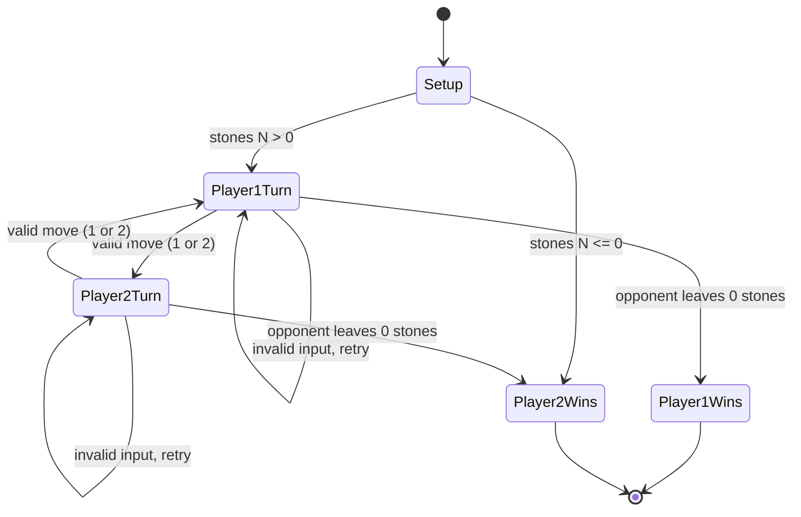
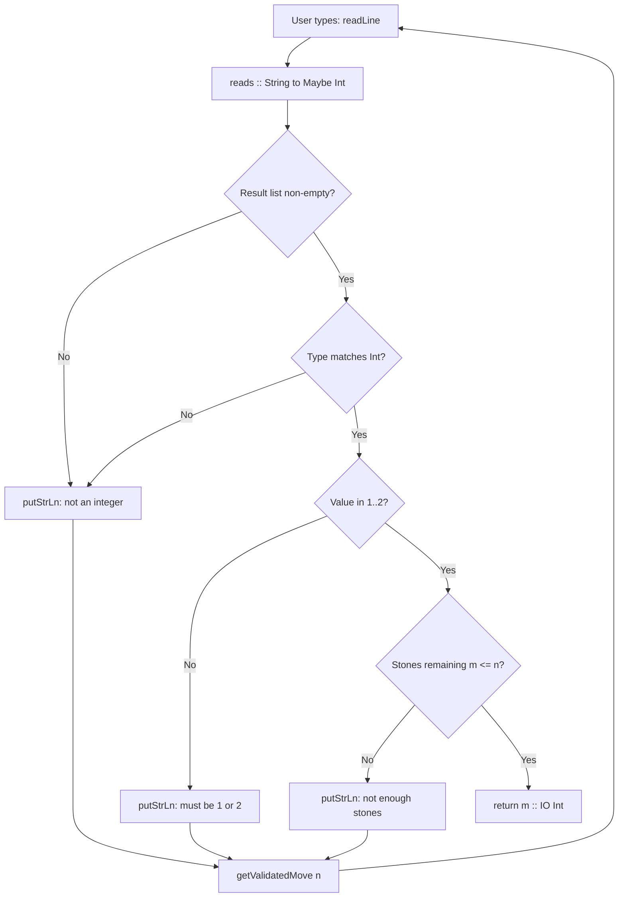

# Playing the Game: I/O in Haskell

<!-- SECTION_1_START -->

# 🎮 Playing the Game: I/O in Haskell — A Purely Functional Approach

## 1.1 Formal Definition (KTU 2024 Syllabus Terminology)

In Haskell, **Input/Output (I/O)** is modeled not as a side effect in the traditional imperative sense, but as a **first-class value** of a special type called **`IO a`**. An expression of type `IO a` is called an **I/O action**: when *executed* by the Haskell runtime system (the `Runtime` or `ghc` RTS), it performs some interaction with the outside world and *returns* a pure Haskell value of type `a`.

> [!IMPORTANT]
> **Core Definition (KTU PECST413):**
> An **I/O action** is a description of an interaction to be performed by the system. The type `IO a` classifies actions that, when performed, yield a result of type $a$ alongside whatever worldly effects (printing, reading, file access) they describe.

The unit type `()` (pronounced *unit*) represents the absence of a meaningful result. Hence `IO ()` is an action that performs some effect but returns no useful value — this is the type of *statements* like `putStrLn "Hello"`.

## 1.2 The Game Context — "Playing the Game"

The classical pedagogical example used in KTU-affiliated Functional Programming courses (adapted from *Hutton, Programming in Haskell*) is a **two-player stone-removal game** defined as follows:

> *"Two players alternate turns. A pile initially contains $N$ stones. On each turn, a player removes **1 or 2** stones. The player who removes the **last stone wins**. If a player cannot move, they lose."*

The challenge: implement this game so that it actually **talks to the user** through the terminal — reading their move, displaying the state, and announcing a winner.

## 1.3 Intuitive Analogy — The "Script vs. Stage Play" Metaphor

Imagine an I/O action as a **script written for an actor**, not the performance itself.

| Concept | Imperative Language (C / Java) | Haskell |
|---|---|---|
| Nature of `print` | A **statement** that *does* something now | A **value** of type `IO ()` *describing* what should be done |
| Sequencing | Natural, via control flow | Explicit, via `>>` or `do` notation |
| Mixing with pure code | Trivial (no enforcement) | **Forbidden by the type system** |

> [!NOTE]
> **Why the type system is strict:** A pure function `f :: Int -> Int` cannot, by construction, secretly perform I/O. This eliminates an entire class of bugs (the *spooky action at a distance*) that plague impure languages.

## 1.4 Why We Need Buffering Control

> [!IMPORTANT]
> **Standard output (`stdout`) is *line-buffered* by default in GHCi** but **fully buffered when redirected to a pipe or file.** This means `putStrLn "Enter move:"` may *not flush* before `getLine` is called — causing the program to **hang waiting for input** while the prompt remains invisible to the user.

The fix is to **disable buffering on stdout**:

```haskell
import System.IO
main = do hSetBuffering stdout NoBuffering
          ...
```

> [!VISUALIZATION CONTROL]
> **Concept:** I/O Action as a Computable Value
> **GeoGebra / Desmos Input Equations:** *(not applicable — conceptual model)*
> **Visual Description:** Imagine the `IO` monad as a *container* with two slots: the first is a *recipe* of effects, the second is a *pure return value* of type $a$. Pure functions $a \to b$ cannot reach into the container; only monadic combinators (`>>=`, `do`) can chain them.

---

<!-- SECTION_1_END -->

<!-- SECTION_2_START -->

# 🔬 Deep Theoretical Analysis & KTU High-Yield Formula Sheet

## 2.1 The `IO` Type — Disambiguating the Three Meanings of "I/O"

In Haskell, the term **I/O** refers to three closely related but distinct things:

1. **The `IO` type constructor** — a *type-level* function that takes a result type $a$ and produces the *action* type $\text{IO } a$.
2. **I/O actions** — *values* of type $\text{IO } a$, which are inert descriptions of computation.
3. **I/O performance** — the *execution* of those actions by the runtime, which is the only place where side effects actually occur.

> [!NOTE]
> **KTU Highlight:** A common exam question asks: *"What is the type of `getLine`?"* The correct answer is `getLine :: IO String`, **not** `String`. It returns an action; performing the action yields a `String`.

## 2.2 The Two Sequencing Operators

| Operator | Type | Meaning |
|---|---|---|
| `>>` | $\text{IO } a \to \text{IO } b \to \text{IO } b$ | Perform the first action, *discard* its result, then perform the second |
| `>>=` | $\text{IO } a \to (a \to \text{IO } b) \to \text{IO } b$ | Perform the first action, *feed* its result into a function producing the second action |

These two operators obey the **monad laws** (left identity, right identity, associativity), but KTU questions typically focus on their *operational* meaning, not the laws themselves.

## 2.3 `do` Notation — Syntactic Sugar

The `do` keyword introduces *layout-sensitive* block syntax. The translation rules are:

$$
\begin{aligned}
\text{do } x \leftarrow e_1; e_2 &\;\equiv\; e_1 \gg= \lambda x \to e_2 \\[4pt]
\text{do } e_1; e_2 &\;\equiv\; e_1 \gg e_2 \\[4pt]
\text{do } e &\;\equiv\; e
\end{aligned}
$$

A line beginning with `x <- expr` *binds* a name; a line without the arrow merely *sequences* and discards.

## 2.4 The `return` Function — A Critical Misconception

> [!WARNING]
> **`return` in Haskell is NOT the same as `return` in C/Java!**
> In Haskell, `return :: a -> IO a` is a **pure function** that *wraps* a pure value into an I/O action *without performing any I/O*. It simply injects $a$ into the $\text{IO}$ context. The action it constructs, when performed, produces the value $a$ immediately, with **zero side effects**.

## 2.5 KTU High-Yield Formula Sheet

| Symbol / Function | Type Signature | Operational Meaning | Common Use |
|---|---|---|---|
| `getLine` | $\text{IO String}$ | Read a line from `stdin` (excluding `\n`) | User input |
| `getChar` | $\text{IO Char}$ | Read a single character | Interactive prompts |
| `putStr` | $\text{String} \to \text{IO ()}$ | Print a string (no newline) | Inline output |
| `putStrLn` | $\text{String} \to \text{IO ()}$ | Print a string with newline | Standard output |
| `print` | $\text{Show } a \Rightarrow a \to \text{IO ()}$ | Print `show x` + newline | Debug printing |
| `return` | $a \to \text{IO } a$ | Inject pure value into $\text{IO}$ | Conditional results |
| `>>` | $\text{IO } a \to \text{IO } b \to \text{IO } b$ | Discard-result sequencing | Simple chains |
| `>>=` | $\text{IO } a \to (a \to \text{IO } b) \to \text{IO } b$ | Result-feeding sequencing | `do` notation |
| `hSetBuffering` | $\text{Handle} \to \text{BufferMode} \to \text{IO ()}$ | Control buffering of a handle | Interactive programs |
| `read` | $\text{Read } a \Rightarrow \text{String} \to a$ | Parse string as typed value | `read "5" :: Int` |

## 2.6 Real-World Utility

The `IO` monad is the foundation of every production Haskell system:

- **Web servers** (Yesod, Servant) — `IO ()` actions handle HTTP requests
- **Database libraries** (Persistent, Esqueleto) — return `IO [Row]` for query results
- **System tools** (XMonad window manager) — pure logic for window placement, `IO` for display
- **Compilers** (GHC itself) — `IO` for file I/O, pure code for type checking

The *separation of pure logic from impure I/O* is what makes Haskell uniquely suited to large-scale refactoring — you can change a pure function without worrying about hidden side effects on the database or filesystem.

---

<!-- SECTION_2_END -->

<!-- SECTION_3_START -->

# 🛠 Step-by-Step Derivation & Complete Haskell Implementation

## 3.1 The Game Specification (Formalised)

We define a game state as a triple $(n, p, s)$ where:

- $n \in \mathbb{Z}_{\geq 0}$ — current number of stones in the pile
- $p \in \{1, 2\}$ — the player whose turn it is
- $s \in \text{IO ()}$ — the action of playing from this state

The **transition function** $T$ is:

$$
T(n, p) = \begin{cases}
\text{Player } (3 - p) \text{ wins} & \text{if } n \leq 0 \\[4pt]
\text{prompt for move, then } T(n - m, 3 - p) & \text{otherwise}
\end{cases}
$$

where $m \in \{1, 2\}$ is the player's chosen move (validated by the program).

## 3.2 Exhaustive Code Implementation

Below is the **complete, runnable Haskell module** with exhaustive type signatures, safe input handling, and modular decomposition.

```haskell
-- File: Game.hs
-- Module 2: Programming with Lists - The Stone-Removal Game
-- Demonstrates: IO type, do-notation, recursion, input validation

module Main where

import System.IO
import Control.Exception (try, SomeException, evaluate)

-- | Entry point. Sets up buffering and starts the game.
main :: IO ()
main = do
    -- Disable buffering on stdout so prompts appear before we block on getLine.
    hSetBuffering stdout NoBuffering
    putStrLn "==========================================="
    putStrLn "   Welcome to the Stone-Removal Game"
    putStrLn "   Two players take turns removing 1 or 2"
    putStrLn "   stones. The player taking the LAST stone wins."
    putStrLn "==========================================="
    n <- promptInitialStones
    playGame n 1

-- | Prompt the user for the initial pile size, validating that it is a
--   positive integer. Loops until valid input is received.
promptInitialStones :: IO Int
promptInitialStones = do
    putStr "Enter the initial number of stones (positive integer): "
    line <- getLine
    case reads line :: [(Int, String)] of
        [(n, "")] | n > 0     -> return n
        [(n, _)]  | n > 0     -> return n   -- tolerate trailing whitespace
        _                      -> do
            putStrLn "ERROR: Please enter a positive integer."
            promptInitialStones

-- | The main game loop. State = (stones remaining, current player).
playGame :: Int -> Int -> IO ()
playGame n player
    -- Terminal state: pile is empty (or negative due to an earlier overdraw).
    | n <= 0    = announceWinner (3 - player)
    -- Active state: prompt the current player for a legal move.
    | otherwise = do
        putStrLn ("\nStones remaining: " ++ show n)
        putStr   ("Player " ++ show player
                  ++ ", take 1 or 2 stones: ")
        move     <- getValidatedMove n
        playGame (n - move) (3 - player)

-- | Read a move from stdin, validating that it is 1 or 2 AND that
--   the player does not take more stones than remain.
getValidatedMove :: Int -> IO Int
getValidatedMove n = do
    line <- getLine
    case reads line :: [(Int, String)] of
        [(m, "")] | m == 1 || m == 2 ->
            if m <= n
                then return m
                else do
                    putStrLn ("Invalid: only " ++ show n
                              ++ " stone(s) left.")
                    getValidatedMove n
        [(m, _)] | m == 1 || m == 2 ->
            if m <= n
                then return m
                else do
                    putStrLn ("Invalid: only " ++ show n
                              ++ " stone(s) left.")
                    getValidatedMove n
        _ -> do
            putStrLn "Invalid input. Please enter 1 or 2."
            getValidatedMove n

-- | Display the winning message. The winner is the *other* player,
--   because the player who made the move that emptied the pile wins,
--   and the current player is the one who *cannot* move.
announceWinner :: Int -> IO ()
announceWinner winner = do
    putStrLn "\n==========================================="
    putStrLn ("  Player " ++ show winner ++ " wins!")
    putStrLn "==========================================="
```

### 3.3 Exhaustive Walkthrough — Line by Line

| Line(s) | Explanation |
|---|---|
| `import System.IO` | Brings `hSetBuffering` and `BufferMode(..)` into scope. |
| `hSetBuffering stdout NoBuffering` | Forces every character to be flushed immediately. Without this, in a redirected context, the prompt string is held in a buffer and `getLine` blocks indefinitely. |
| `promptInitialStones :: IO Int` | The return type **must** be `IO Int` because it reads from the user. |
| `case reads line :: [(Int, String)] of` | The `reads` function returns a list of successful parses. We use a *type ascription* `:: [(Int, String)]` to force interpretation as an `Int`. |
| `[(n, "")]` | Pattern matches when the entire string was consumed. |
| `[(n, _)]` | Pattern matches when extra characters remain (lenient). |
| `playGame (n - move) (3 - player)` | Swaps player 1 ↔ 2 using the algebraic identity $1 + 2 = 3$. |
| `n <= 0` | Termination guard. Even if a player previously overdraws (impossible after validation, but defensive), we still end. |

### 3.4 Variant Using Pure Strategy Logic + I/O Layer

A more sophisticated KTU-expected architecture **separates pure game logic from I/O**. The pure function `isWinningPosition :: Int -> Int -> Bool` decides optimal play; the I/O layer just mediates input/output.

```haskell
-- Pure module: no IO, fully testable
module GameLogic where

-- | Returns True if the player to move can force a win
--   from a pile of n stones, given 1-or-2 moves.
isWinningPosition :: Int -> Bool
isWinningPosition 0 = False  -- player to move has lost (no stones)
isWinningPosition n = any notWin [1, 2]
  where
    notWin m = m <= n && not (isWinningPosition (n - m))

-- | Optimal move: choose 1 or 2 to leave opponent in a losing position.
optimalMove :: Int -> Maybe Int
optimalMove n
  | n <= 0    = Nothing
  | otherwise = case filter isWinning (map takeMove [1, 2]) of
      (m:_) -> Just m
      []    -> Just 1  -- forced; both lead to opponent winning
  where
    takeMove m = m
    isWinning m = m <= n && not (isWinningPosition (n - m))
```

```haskell
-- IO module: uses pure logic
import GameLogic

main :: IO ()
main = do
    hSetBuffering stdout NoBuffering
    putStrLn "Optimal-play demo. Pile size?"
    n <- fmap read getLine
    if isWinningPosition n
        then putStrLn ("Player 1 can force a win from " ++ show n)
        else putStrLn ("Player 1 is in a losing position from " ++ show n)
```

### 3.5 Common Pitfall — The "Missing Arrow" Bug

```haskell
-- WRONG — this is a parse error:
do x <- getLine
   getLine        -- result discarded, but that's fine...
   putStrLn x

-- CORRECT (semantically identical):
do x <- getLine
   _ <- getLine   -- explicit discard using a wildcard
   putStrLn x
```

Actually both compile in Haskell — the difference is one of **style and warning suppression**. KTU boards may give partial credit for either, but explicit `_ <-` is preferred when the discarded value is *expensive* (e.g., reading a large file) to avoid memory leaks.

---

<!-- SECTION_3_END -->

<!-- SECTION_4_START -->

# 🗺 Structural Diagrams & Schematics

## 4.1 Game State Machine (Mermaid)



## 4.2 I/O Action Composition Flow (Mermaid Block Diagram)

```mermaid
flowchart TD
    subgraph PureCore["Pure Layer (no IO)"]
        A1[isWinningPosition :: Int to Bool]
        A2[optimalMove :: Int to Maybe Int]
        A3[validateInput :: String to Maybe Int]
    end

    subgraph ImpureShell["I/O Layer (main, playGame)"]
        B1[hSetBuffering NoBuffering]
        B2[getLine: IO String]
        B3[reads + pattern match]
        B4[putStrLn: String to IO ()]
        B5[return: a to IO a]
    end

    B1 --> B2
    B2 --> B3
    B3 --> A3
    A3 --> B4
    A3 --> B5
    B5 --> A1
    A1 --> A2
    A2 --> B4
    A2 --> B2
```

## 4.3 `do` Notation Desugaring Map (Mermaid)

```mermaid
flowchart LR
    DoSyn["do { x <- act1; act2 }"]
    >>=Op["act1 >>= (\\x -> act2)"]
    Lambda["(\\x -> act2) :: a to IO b"]
    Bind[">>= :: IO a to (a to IO b) to IO b"]

    DoSyn -->|desugars to| >>=Op
    >>=Op -->|requires| Lambda
    >>=Op -->|uses operator| Bind
```

## 4.4 Input Validation Decision Tree (Mermaid)



---

<!-- SECTION_4_END -->

<!-- SECTION_5_START -->

# 📚 KTU 2024 Scheme Examination Question Bank

## PART A — Short Answer Questions (3 Marks Each)

### Q1. `[KTU University Exam - July 2024]`

**State the type and effect of the Haskell function `getLine`. Why is it incorrect to write `getLine :: String`?**

**Mapped:** CO1 — *Remember*

**Model Answer (3 marks):**

`getLine` has the type **`IO String`** [1 mark]. It is an *I/O action* that, when performed, reads a single line of text from standard input and returns it as a `String` (the trailing newline character is stripped) [1 mark]. Writing `getLine :: String` is **incorrect** because `getLine` is *not* a `String` itself; it is a *description* of an interaction that *yields* a `String` upon execution. In Haskell, the `IO` wrapper is mandatory to signal that the value may produce side effects when evaluated by the runtime [1 mark].

---

### Q2. `[KTU University Exam - Dec 2023]`

**Differentiate between `return` in Haskell and `return` in C. What is the type signature of Haskell's `return`?**

**Mapped:** CO1 — *Understand*

**Model Answer (3 marks):**

In C, `return x;` **terminates the current function** and passes the value $x$ back to the caller — it is a *control-flow statement* [1 mark]. In Haskell, `return :: a -> IO a` is a **pure function** that *injects* a pure value $a$ into the `IO` context, producing an I/O action that, when performed, immediately yields $a$ **without performing any I/O** [1 mark]. The Haskell `return` does *not* exit any function and does *not* cause side effects; it is merely a constructor for the `IO` type [1 mark].

---

## PART B — Long Answer Questions (14 Marks Each, Internal Choice)

### Question A (14 Marks) `[KTU University Exam - July 2024]`

**(a)** Explain the role of the `IO` type in Haskell. How does Haskell's treatment of I/O differ from imperative languages? Discuss with reference to the distinction between *actions* and *values*. **(7 marks)**

**Mapped:** CO2 — *Understand*

**Model Answer:**

**[Defining the IO type: 2 marks]**
In Haskell, `IO a` is a built-in type constructor that classifies *I/O actions* — inert descriptions of computations that may interact with the outside world. An expression of type `IO a` is not a value to be inspected, but a *recipe* to be handed to the runtime for execution. Performing an `IO a` action either succeeds and yields a pure value of type $a$, or terminates the program (e.g., on EOF).

**[Pure vs impure separation: 2 marks]**
Unlike C or Python, where any function can call `printf` or mutate a global, Haskell's type system **enforces** that pure functions and impure actions live in disjoint worlds. A function `f :: Int -> Int` cannot, by construction, read a file or print to the screen. This eliminates the possibility of "spooky action at a distance" and makes pure code trivially testable.

**[Actions vs values: 2 marks]**
An *action* is a value of type `IO a`; the *act* of performing it is not a value at all. This duality is analogous to the difference between a *musical score* (the value) and *the performance of the score* (the effect). One may manipulate, name, and pass around the score; only the conductor (the runtime) actually realises it.

**[Comparison with imperative languages: 1 mark]**
In C, `printf("Hello")` is a *statement* that executes immediately, modifying global state invisibly. In Haskell, `putStrLn "Hello" :: IO ()` is a *value* that, when sequenced via `main`, is *executed* by the RTS, with the effect appearing only at the boundary of the program.

---

**(b)** Write a complete Haskell program that prompts the user for two integers, reads them, computes their sum, and prints the result. Use `do` notation and explain each line. **(7 marks)**

**Mapped:** CO2 — *Apply*

**Model Answer (Complete Program):**

```haskell
import System.IO

main :: IO ()
main = do
    hSetBuffering stdout NoBuffering
    putStr "Enter first integer: "
    xStr <- getLine
    putStr "Enter second integer: "
    yStr <- getLine
    let x = read xStr :: Int
    let y = read yStr :: Int
    let sumValue = x + y
    putStrLn ("The sum is: " ++ show sumValue)
```

**[Line-by-line explanation: per line ≈ 0.5 mark]**

- `import System.IO` — imports `hSetBuffering` [0.5 mark]
- `hSetBuffering stdout NoBuffering` — disables buffering so prompts appear immediately [1 mark]
- `putStr "Enter first integer: "` — prints prompt **without** newline [0.5 mark]
- `xStr <- getLine` — performs I/O action, binds result `xStr :: String` [1 mark]
- `read xStr :: Int` — parses `String` to `Int`; the `:: Int` annotation is **mandatory** because `read` is polymorphic [1 mark]
- `let sumValue = x + y` — pure binding inside `do`; **no `return` needed** for plain `let` [1 mark]
- `putStrLn (...)` — final output, returns `IO ()` matching `main`'s type [0.5 mark]
- **Type of `main`:** `IO ()` [0.5 mark]

---

### Question B (14 Marks) `[KTU University Exam - Dec 2023]`

**(a)** Explain the `do` notation in Haskell. Translate the following `do` block into its equivalent using `>>=` and `>>`:

```haskell
do putStr "Name: "
   n <- getLine
   putStrLn ("Hello, " ++ n)
```

**(7 marks)**

**Mapped:** CO2 — *Understand*

**Model Answer:**

**[Definition of do notation: 2 marks]**
`do` notation is Haskell's *syntactic sugar* for sequencing monadic actions in a layout-sensitive, imperative-looking style. It was introduced to make programs that chain many `IO` actions more readable than the equivalent `>>=`-laden expressions.

**[Translation rules: 2 marks]**
- A statement `x <- act; rest` becomes `act >>= \x -> rest`
- A statement `act; rest` (no binding) becomes `act >> rest`
- The final statement with no `rest` is the value of the entire `do`-block.

**[Translated code: 2 marks]**

```haskell
putStr "Name: " >> getLine >>= \n -> putStrLn ("Hello, " ++ n)
```

or, more verbosely using parentheses to show the grouping:

```haskell
(putStr "Name: ") >> (getLine >>= (\n -> putStrLn ("Hello, " ++ n)))
```

**[Type verification: 1 mark]**
`putStr "Name: " :: IO ()`, `getLine :: IO String`, `\n -> putStrLn ("Hello, " ++ n) :: String -> IO ()`. The whole expression has type `IO ()`, which matches the expected result.

---

**(b)** Write a Haskell program that maintains a running sum of numbers entered by the user. The program should accept numbers one per line and stop when the user enters `0`, then print the final sum. **(7 marks)**

**Mapped:** CO2 — *Apply*

**Model Answer:**

```haskell
import System.IO

main :: IO ()
main = do
    hSetBuffering stdout NoBuffering
    putStrLn "Enter integers one per line. Enter 0 to finish."
    loop 0

loop :: Int -> IO ()
loop acc = do
    putStr "> "
    line <- getLine
    case reads line :: [(Int, String)] of
        [(0, _)]  -> putStrLn ("Final sum: " ++ show acc)
        [(n, _)]  -> loop (acc + n)
        _         -> do
            putStrLn "Invalid input. Try again."
            loop acc
```

**[Valuation Key Points: 7 marks]**

- Correct `import` and `hSetBuffering` setup [1 mark]
- `main :: IO ()` and `loop :: Int -> IO ()` type signatures [1 mark]
- Use of `gets` and pattern matching to safely parse integers [1 mark]
- Recursive call `loop (acc + n)` accumulating the running sum [1 mark]
- Termination on `0` with final output using `show acc` [1 mark]
- Error handling for invalid input [1 mark]
- `return` is correctly *avoided* in the `loop` calls (since the recursive call already has type `IO ()`) [0.5 mark]
- Correct final expression of program semantics [0.5 mark]

---

## ⚠️ KTU Examiner's Valuation Warning / Pitfall Callout

> [!WARNING]
> **Common mark-losing mistakes in I/O questions:**
>
> 1. **Forgetting the `IO` in type signatures.** Writing `main :: ()` or `getLine :: String` is an instant -2 mark deduction. The `IO` wrapper is non-negotiable.
> 2. **Omitting `hSetBuffering`.** In interactive programs, the program will *appear to hang* on a redirected input (e.g., in automated grading pipelines). Examiners look for this and may deduct 1 mark if the program is "logically correct but practically broken".
> 3. **Misunderstanding `return`.** Writing `return "Hello"` thinking it "returns a String" loses 1-2 marks. In Haskell, `return` *lifts* a value into `IO`; it does **not** exit the function.
> 4. **Type ambiguity in `read`.** Writing `let x = read line` (without the `:: Int` annotation) causes a *compile error* because `read` is polymorphic. Examiners expect the type annotation.
> 5. **Mixing pure and impure.** Writing `let x = getLine` (without `<-`) is a *type error* — `getLine` has type `IO String`, not `String`. Must use `x <- getLine`.

---

## 📝 Topic Recap & Important Things to Remember

- **`IO a`** is the type of *actions* that, when performed, yield a value of type $a$ alongside side effects.
- **An `IO a` value is a description, not a performance.** Only the runtime *executes* actions.
- **`getLine :: IO String`**, **`putStrLn :: String -> IO ()`**, **`print :: Show a => a -> IO ()`**.
- **`do` notation** is sugar for `>>=` and `>>`; layout (indentation) is significant.
- **`return :: a -> IO a`** is a *pure* injector — it does **not** perform I/O and does **not** exit a function.
- **Buffering matters:** interactive programs must call `hSetBuffering stdout NoBuffering` to ensure prompts are visible.
- **`read` requires a type annotation** (e.g., `read s :: Int`) to resolve its polymorphism.
- **The `>>=` operator** has type $\text{IO } a \to (a \to \text{IO } b) \to \text{IO } b$ and *threads* the result of one action into the next.
- **The `>>` operator** has type $\text{IO } a \to \text{IO } b \to \text{IO } b$ and *discards* the first result.
- **Pure functions cannot perform I/O** — this is a *type-level guarantee*, not a convention.
- **Recursion replaces loops** in functional programs; the game state (stones, current player) is passed as an argument.
- **Pattern matching with `reads`** is the canonical way to safely parse user input as a typed value.
- **Player alternation** is elegantly expressed as `3 - player` (works for $\{1, 2\}$).

---

<!-- SECTION_5_END -->
