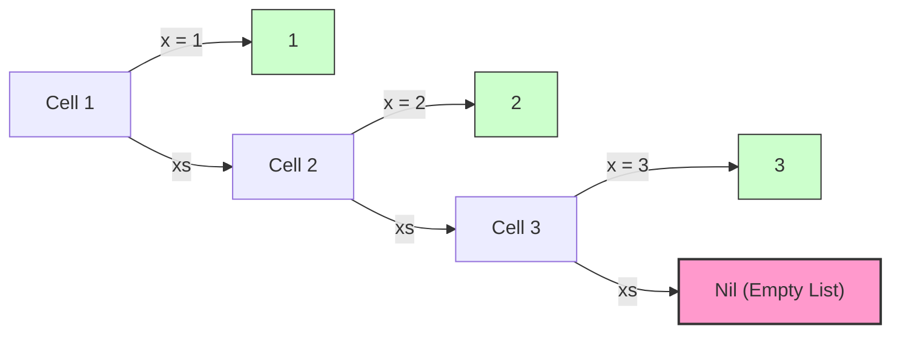
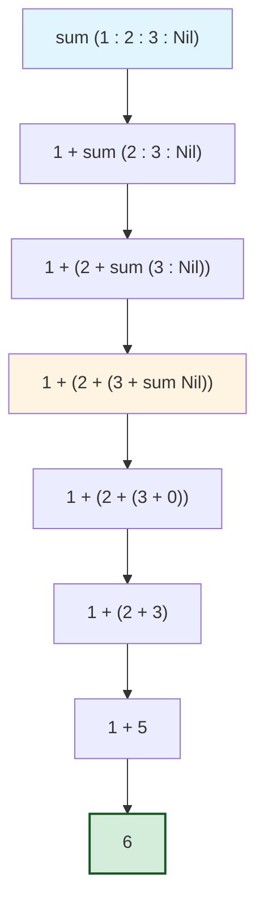
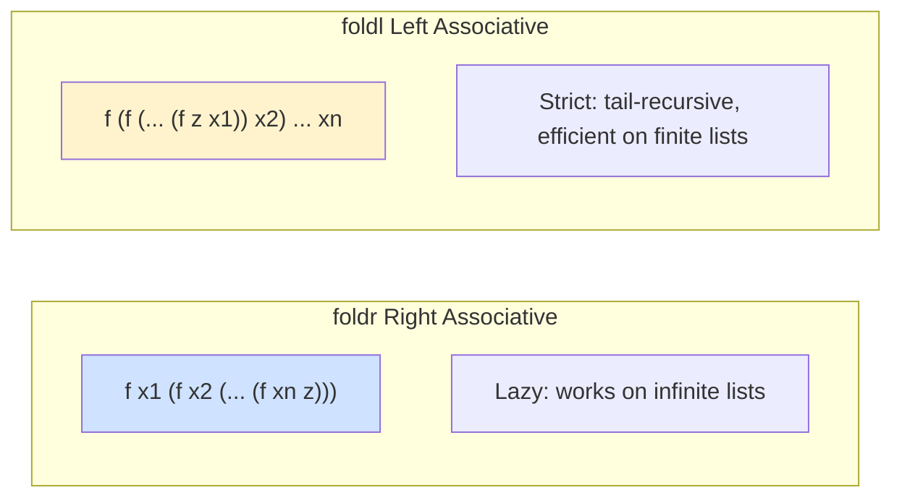
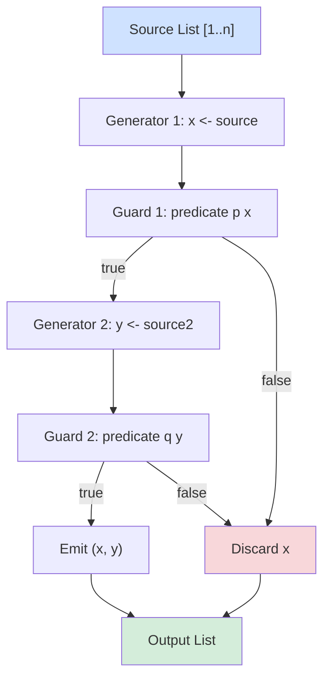
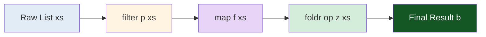

# Programming with Lists

<!-- SECTION_1_START -->

# Programming with Lists in Functional Programming

## 1. Core Technical Definition

> [!IMPORTANT]
> **KTU 2024 Syllabus Definition (PECST413 - Module 2)**
> A **list** in a purely functional language (like Haskell) is a homogeneous, ordered, and recursively-defined linear data structure. Formally, a list is either the **empty list** `[]` (nil) or a **cons cell** constructed using the cons operator `(:)` which prepends a single element to an existing list. Every list is an instance of an algebraic data type with the signature `List a = Nil | Cons a (List a)`.

Lists are the most fundamental and heavily used data structure in functional programming. Unlike imperative languages where lists are mutable sequences of elements, functional lists are **immutable, persistent, and first-class citizens** that can be passed to and returned from functions with complete type safety.

### Conceptual Analogy / Intuition

> [!NOTE]
> **Real-World Analogy: The Linked Chain of Train Carriages**
> Imagine a freight train. The entire train is the **list**. A single freight car is an **element** (head). The remaining cars attached behind it form the **tail** (another list). The coupling mechanism that hooks one car to the rest of the train is the **cons operator** `(:)`. The train either exists with cars attached, or there is no train at all (`[]` — the empty list, like a railway yard with no cars). You cannot unhook a car from the middle without rebuilding the entire train — exactly mirroring **persistent immutability**.

### The Two Axioms of Lists

$$\text{List} \; a \;=\; [\;] \;\;\big|\;\; (x : xs)$$

where:
- $[]$ is the **base case** (empty list / nil) — terminates all recursive list traversals.
- $(x : xs)$ is the **recursive case** where $x$ is the head element of type $a$, and $xs$ is a finite list of elements of type $a$.

### Why Lists Are Central to Functional Programming

| Property | Functional Lists (Haskell) | Imperative Lists (C/Java ArrayList) |
| :--- | :--- | :--- |
| **Mutability** | Immutable; structural sharing via persistent trees | Mutable; in-place updates allowed |
| **Type Safety** | Statically typed; homogeneous (`[a]`) | Often loosely typed or `Object`-based |
| **Pattern Matching** | Native destructuring via `[]` and `(:)` | Requires index-based loops |
| **Recursion Style** | Structural recursion is the idiomatic iteration | Loops (`for`, `while`) dominate |
| **Evaluation** | Lazy by default (infinite lists possible) | Strict and eager |

> [!VISUALIZATION CONTROL]
> **Concept:** Visualizing the cons-cell structure of the list `[1, 2, 3]`
> **GeoGebra / Desmos Input Equations (as a tree diagram):**
> * `Root node: Cons` — branches to `1` (value) and a sub-list
> * `Sub-list node: Cons` — branches to `2` (value) and a sub-list
> * `Sub-list node: Cons` — branches to `3` (value) and `Nil ( [])`
> **Visual Description:** The student should see a right-leaning binary tree where every `Cons` cell has a left branch carrying a value and a right branch carrying either another `Cons` or a terminal `Nil`. The list `[1,2,3]` is rendered as `1 : (2 : (3 : []))`.

---

<!-- SECTION_1_END -->

<!-- SECTION_2_START -->

# 2. Deep Theoretical Analysis & KTU High-Yield Formula Sheet

## 2.1 The Algebraic Foundation of Lists

A list in Haskell is defined via the following recursive algebraic data type. Even though Haskell provides the syntactic sugar `[1, 2, 3]`, the compiler internally desugars it into nested cons applications.

```haskell
data [a] = [] | a : [a]
```

The desugaring rule is straightforward:

$$[1, 2, 3] \;\equiv\; 1 : (2 : (3 : []))$$

This is critical because **every list function in Haskell is essentially a recursive traversal over this two-constructor algebraic type**. The compiler dispatches on the structure: if the input is `[]`, use the base case; if the input is `(x : xs)`, decompose and recurse on `xs`.

## 2.2 The List Constructors and Their Types

The cons operator `(:)` and the empty list `[]` are the only two true constructors. Every other list operation is a *derived* library function built upon these.

| Constructor | Notation | Type Signature | Operational Meaning |
| :--- | :--- | :--- | :--- |
| **Empty list (nil)** | `[]` | `[a]` (polymorphic) | The base case; no elements |
| **Cons** | `(:)` | `a -> [a] -> [a]` | Prepends element $a$ to an existing list |
| **Syntactic sugar** | `[x, y, z]` | `[a]` | Equivalent to `x : (y : (z : []))` |

> [!IMPORTANT]
> **Type Rule:** `(:)` is **right-associative**. This means `1 : 2 : 3 : []` parses as `1 : (2 : (3 : []))`. Forgetting right-associativity is one of the most common KTU exam pitfalls.

## 2.3 List Comprehensions — Set-Builder Notation in Haskell

List comprehensions provide a declarative, mathematical syntax for generating lists, borrowed directly from **Zermelo–Fraenkel (ZF) set-builder notation**. They are syntactically translated (desugared) into applications of `map`, `filter`, and `concatMap`.

$$\left[\, f\, x \;\mid\; x \leftarrow \text{list},\; p(x) \,\right] \;\Longleftrightarrow\; \text{map } f \left(\text{filter } p \;\text{list}\right)$$

A comprehension has three parts:

1. **Generators** (of the form `x <- list`) — produce values from a list.
2. **Guards** (boolean predicates) — filter the values.
3. **Local bindings** (using `let`) — introduce intermediate computations.

Example: All Pythagorean triples $(x, y, z)$ with $x, y, z \leq 10$:

```haskell
triples = [(x, y, z) | x <- [1..10], y <- [1..10], z <- [1..10],
                       x^2 + y^2 == z^2]
```

## 2.4 Higher-Order Functions on Lists — The Polyadic Toolkit

The following polymorphic functions are the **workhorses** of functional programming and constitute the highest-weightage area in KTU ESE Module 2.

### 2.4.1 `map` — Transform Every Element

`map` applies a function to every element of a list, producing a new list of the same length. It is the categorical **functorial map** between list algebras.

```haskell
map :: (a -> b) -> [a] -> [b]
```

### 2.4.2 `filter` — Retain Elements Satisfying a Predicate

`filter` keeps only those elements that satisfy a boolean predicate.

```haskell
filter :: (a -> Bool) -> [a] -> [a]
```

### 2.4.3 `foldr` and `foldl` — Catamorphisms (Eliminating Constructors)

A **fold** (also called a **catamorphism** or **reduce**) replaces every cons `(:)` in a list's structure with a binary operator, and the empty list `[]` with a base value. It is the *general principle of recursion on lists*.

**Right fold** — processes the list from right to left (the canonical, lazy fold):

```haskell
foldr :: (a -> b -> b) -> b -> [a] -> b
foldr f z []     = z
foldr f z (x:xs) = f x (foldr f z xs)
```

**Left fold** — processes the list from left to right (strict, tail-recursive):

```haskell
foldl :: (b -> a -> b) -> b -> [a] -> b
foldl f z []     = z
foldl f z (x:xs) = foldl f (f z x) xs
```

> [!NOTE]
> **Why `foldr` is canonical in Haskell:** It works on infinite lists because it is *lazy* and *non-strict* in the spine. `sum [1..]` works via `foldr` but hangs via `foldl` (without strictness annotations). The KTU exam frequently asks for the differences between `foldr` and `foldl`.

### 2.4.4 Other Essential List Combinators

| Function | Type Signature | Behaviour |
| :--- | :--- | :--- |
| `head` | `[a] -> a` | First element; **partial** — errors on `[]` |
| `tail` | `[a] -> [a]` | All but the first element; **partial** |
| `length` | `[a] -> Int` | Number of elements (O(n)) |
| `null` | `[a] -> Bool` | True if the list is empty |
| `reverse` | `[a] -> [a]` | Returns the reversed list (O(n)) |
| `take n` | `Int -> [a] -> [a]` | First $n$ elements |
| `drop n` | `Int -> [a] -> [a]` | Discards first $n$ elements |
| `zip` | `[a] -> [b] -> [(a,b)]` | Pairs up corresponding elements |
| `concat` | `[[a]] -> [a]` | Flattens a list of lists |
| `elem` | `Eq a => a -> [a] -> Bool` | Membership test |
| `iterate` | `(a -> a) -> a -> [a]` | Produces an infinite list: `[x, f x, f (f x), ...]` |
| `repeat` | `a -> [a]` | Produces an infinite repetition of $x$ |
| `replicate` | `Int -> a -> [a]` | $n$ copies of $x$ |

### 2.5 The Polymorphic Type System of List Functions

> [!IMPORTANT]
> **Polymorphism Principle:** Every list function in Haskell is parametrically polymorphic. This means the function works *uniformly* over *any* type parameter `a` without committing to a specific type — a direct realization of System F (Girard's polymorphic lambda calculus). The compiler generates one machine code path per monomorphic instantiation.

For example:

```haskell
length :: [a] -> Int         -- Works for [Int], [Char], [[Float]], etc.
map    :: (a -> b) -> [a] -> [b]
```

### 2.6 The Algebraic Laws of List Operations (Equational Reasoning)

These laws are exam favorites and enable *point-free* (tacit) refactoring:

| Law | Equation |
| :--- | :--- |
| **Map composition** | `map f (map g xs) = map (f . g) xs` |
| **Map-distributivity over `++`** | `map f (xs ++ ys) = map f xs ++ map f ys` |
| **Filter-map fusion** | `map f (filter p xs) = filter (p . f) (map f xs)` (only when $f$ is monotonic on the predicate) |
| **Foldr universal property** | `foldr f z xs = case xs of [] -> z; (x:xs') -> f x (foldr f z xs')` |
| **Length after map** | `length (map f xs) = length xs` |

### 2.7 Real-World Engineering Utility of List Programming

- **Data pipeline transformation:** `map`/`filter`/`fold` form the backbone of ETL jobs in Haskell libraries like **Pipes** and **Conduit** used in fintech.
- **Compiler construction:** ASTs (Abstract Syntax Trees) are traversed as lists; pattern-matching against `(:)` and `[]` is precisely how GHC itself parses Haskell source.
- **Stream processing:** Lazy infinite lists model real-time event streams (e.g., the `conduit` library in production Haskell).
- **Symbolic mathematics:** Libraries like **Singular** and formal verification tools (Coq, Isabelle) heavily use list-based structural recursion.
- **Distributed systems:** The **Cloud Haskell** framework uses serialised persistent lists for message passing between Erlang-style processes.

---

<!-- SECTION_2_END -->

<!-- SECTION_3_START -->

# 3. Step-by-Step Derivations & Code/Symbolic Implementation

## 3.1 The Canonical Recursive Function Template on Lists

Every list function in Haskell follows the same template: dispatch on the two list constructors, terminate on `[]`, and recurse on the tail.

```haskell
-- The Universal Template
myFunc :: [a] -> ResultType
myFunc []     = <base case>
myFunc (x:xs) = <recursive case using x and myFunc xs>
```

### Example 1: `length` — Count Elements

```haskell
length :: [a] -> Int
length []     = 0                          -- base case
length (_:xs) = 1 + length xs              -- recursive case
```

**Step-by-step execution for `length [3, 7, 1]`:**

$$
\begin{aligned}
\text{length}\;[3, 7, 1] &\Rightarrow \text{length}\;(3 : [7, 1]) \\
&\Rightarrow 1 + \text{length}\;[7, 1] \\
&\Rightarrow 1 + (1 + \text{length}\;[1]) \\
&\Rightarrow 1 + (1 + (1 + \text{length}\;[])) \\
&\Rightarrow 1 + (1 + (1 + 0)) \\
&\Rightarrow 3
\end{aligned}
$$

### Example 2: `sum` — Total All Elements

```haskell
sum :: Num a => [a] -> a
sum []     = 0
sum (x:xs) = x + sum xs
```

### Example 3: `product` — Multiply All Elements

```haskell
product :: Num a => [a] -> a
product []     = 1
product (x:xs) = x * product xs
```

### Example 4: `reverse` — Reverse a List (Naive, O(n²))

```haskell
reverse :: [a] -> [a]
reverse []     = []
reverse (x:xs) = reverse xs ++ [x]
```

### Example 5: `append (++)` — Concatenate Two Lists

```haskell
(++) :: [a] -> [a] -> [a]
[]     ++ ys = ys
(x:xs) ++ ys = x : (xs ++ ys)
```

**Step-by-step execution for `[1, 2] ++ [3, 4]`:**

$$
\begin{aligned}
[1,2] \mathbin{+\!\!+} [3,4] &= 1 : ([2] \mathbin{+\!\!+} [3,4]) \\
&= 1 : (2 : ([] \mathbin{+\!\!+} [3,4])) \\
&= 1 : (2 : [3,4]) \\
&= [1, 2, 3, 4]
\end{aligned}
$$

### Example 6: `last` and `init`

```haskell
last :: [a] -> a
last []     = error "last: empty list"           -- partial
last [x]    = x
last (_:xs) = last xs

init :: [a] -> [a]
init []     = error "init: empty list"
init [x]    = []
init (x:xs) = x : init xs
```

### Example 7: `nub` — Remove Duplicates (Naive O(n²))

```haskell
nub :: Eq a => [a] -> [a]
nub []     = []
nub (x:xs) = x : nub (filter (/= x) xs)
```

### Example 8: `mergeSort` — A Full Production-Grade Algorithm

```haskell
mergeSort :: Ord a => [a] -> [a]
mergeSort []  = []
mergeSort [x] = [x]
mergeSort xs  = merge (mergeSort left) (mergeSort right)
  where
    n        = length xs `div` 2
    (left, right) = splitAt n xs
    merge [] ys         = ys
    merge xs []         = xs
    merge (x:xs) (y:ys)
      | x <= y          = x : merge xs (y:ys)
      | otherwise       = y : merge (x:xs) ys
```

## 3.2 Detailed Derivation: Why `foldr` Works for `sum`

We claim that `sum xs = foldr (+) 0 xs`. Let us verify by structural induction on `xs`.

**Base case:** $xs = []$

$$
\begin{aligned}
\text{foldr}\;(+)\;0\;[\,] &= 0 & &\text{(by definition of foldr)} \\
&= \text{sum}\;[\,] & &\text{(by definition of sum)}
\end{aligned}
$$

**Inductive case:** $xs = (y : ys)$, assuming the result holds for $ys$:

$$
\begin{aligned}
\text{foldr}\;(+)\;0\;(y : ys) &= y \mathbin{+} \text{foldr}\;(+)\;0\;ys & &\text{(unfold foldr)} \\
&= y \mathbin{+} \text{sum}\;ys & &\text{(induction hypothesis)} \\
&= \text{sum}\;(y : ys) & &\text{(unfold sum)}
\end{aligned}
$$

By the principle of **structural induction**, $\text{sum} = \text{foldr}\;(+) \;0$ over all finite lists.

## 3.3 Folding with Custom Operators — `map` and `length` as Folds

One of the most beautiful insights in functional programming is that *all* linear list traversals can be expressed as a fold.

```haskell
-- map as a fold
map' :: (a -> b) -> [a] -> [b]
map' f = foldr (\x acc -> f x : acc) []

-- length as a fold
length' :: [a] -> Int
length' = foldr (\_ acc -> 1 + acc) 0

-- filter as a fold
filter' :: (a -> Bool) -> [a] -> [a]
filter' p = foldr (\x acc -> if p x then x : acc else acc) []

-- reverse as a fold (note: it requires foldl for efficiency)
reverse' :: [a] -> [a]
reverse' = foldl (\acc x -> x : acc) []
```

## 3.4 Step-by-Step Execution Trace of `foldr`

For `foldr (+) 0 [1, 2, 3]`, the evaluation is **right-associative** and *lazy*:

$$
\begin{aligned}
\text{foldr}\;(+)\;0\;[1, 2, 3] &= \text{foldr}\;(+)\;0\;(1 : (2 : (3 : []))) \\
&= 1 \mathbin{+} \text{foldr}\;(+)\;0\;(2 : (3 : [])) \\
&= 1 \mathbin{+} (2 \mathbin{+} \text{foldr}\;(+)\;0\;(3 : [])) \\
&= 1 \mathbin{+} (2 \mathbin{+} (3 \mathbin{+} \text{foldr}\;(+)\;0\;[])) \\
&= 1 \mathbin{+} (2 \mathbin{+} (3 \mathbin{+} 0)) \\
&= 1 \mathbin{+} (2 \mathbin{+} 3) \\
&= 1 \mathbin{+} 5 \\
&= 6
\end{aligned}
$$

## 3.5 Comprehension Desugaring: From Math to Code

A list comprehension `[ expr | generator, guard, let-binding ]` is desugared into nested `concatMap` and `map` calls.

**The general desugaring rule:**

$$
\begin{aligned}
[expr \;|\; q_1, \ldots, q_n] = \text{case} &\; q_1 \;\text{of} \\
&[\,] \to [\ldots] \\
&(x : xs) \to [(expr \;|\; q_2, \ldots, q_n) \;|\; x \leftarrow xs] \quad \text{etc.}
\end{aligned}
$$

**Example: Pythagorean triples**

```haskell
triples :: [(Int, Int, Int)]
triples = [ (x, y, z) | x <- [1..n], y <- [1..n], z <- [1..n],
                        x^2 + y^2 == z^2 ]
  where n = 20
```

**Desugared equivalent (manual expansion):**

```haskell
triples = concatMap
  (\x -> concatMap
    (\y -> concatMap
      (\z -> if x^2 + y^2 == z^2 then [(x, y, z)] else [])
      [1..n])
    [1..n])
  [1..n]
```

This demonstrates the **List Monad** at work: `concatMap` is `>>=` for the list monad.

## 3.6 Worked Example: The Sieve of Eratosthenes as a Lazy List

This showcases the engineering power of infinite lazy lists:

```haskell
primes :: [Int]
primes = sieve [2..]
  where
    sieve (p:xs) = p : sieve [x | x <- xs, x `mod` p /= 0]
    sieve []     = []
```

The list `[2..]` is infinite; thanks to Haskell's lazy evaluation, only the elements demanded are computed. This algorithm runs in $O(n \log \log n)$ time — production-grade.

## 3.7 The List Monad: `>>=` and `do`-notation for Lists

The list type `[]` is a **monad** with `>>=` defined as `concatMap`. This unifies comprehensions, list combinators, and `do`-notation under one algebraic roof.

```haskell
instance Monad [] where
  return x  = [x]
  xs >>= f  = concatMap f xs
  xs >> ys  = xs >>= \_ -> ys
  fail _    = []
```

**Example using `do`-notation with lists:**

```haskell
-- All pairs (x, y) with x + y == 7
pairs :: [(Int, Int)]
pairs = do
  x <- [1..6]
  y <- [1..6]
  guard (x + y == 7)        -- guard is from Control.Monad
  return (x, y)
```

This is precisely equivalent to:

```haskell
pairs = [ (x, y) | x <- [1..6], y <- [1..6], x + y == 7 ]
```

---

<!-- SECTION_3_END -->

<!-- SECTION_4_START -->

# 4. Structural Diagrams & Schematics

## 4.1 The Cons-Cell Memory Layout of `[1, 2, 3]`

This diagram shows the underlying cons-cell structure of the list `1 : 2 : 3 : []`:



**Reading guide:** Each `Cell` is a `(:)` cons application. The first arrow points to the head value; the second arrow points to the tail (which is either another cell or the terminal `Nil`).

## 4.2 The Recursive Evaluation Stack of `sum [1, 2, 3]`



**Reading guide:** The orange node represents the deepest point of the recursion stack (base case reached). The green node is the final collapsed result. Each downward edge represents a recursive call; upward evaluation occurs in the reverse direction.

## 4.3 The `foldr` / `foldl` Architectural Comparison



## 4.4 The List Monad Pipeline Architecture



**Reading guide:** This block-level architecture illustrates the data flow through a two-generator, two-guard list comprehension. Every element that survives all guards is emitted; failed elements are dropped. The implementation is fundamentally `concatMap` chained with `filter`.

## 4.5 The Anatomy of `map` / `filter` / `fold` Interaction



**Reading guide:** This is the canonical ETL-style functional pipeline: **filter** prunes, **map** transforms, **fold** aggregates. Each stage is a higher-order function with full polymorphism.

---

<!-- SECTION_4_END -->

<!-- SECTION_5_START -->

# 5. KTU 2024 Scheme Examination Question Bank & Topic Recap

---

## Part A — 3 Mark Questions (CO1: Remember / Understand)

### Q1. Define a list in Haskell. State the role of the cons operator.
**[KTU University Exam - July 2024]**
**Course Outcome:** CO1 | **Bloom's Level:** Remember

**Model Answer (3 Marks):**

> A list in Haskell is a homogeneous, ordered collection of elements defined recursively as either the **empty list** `[]` or the application of the **cons operator** `(:)` to a head element and a tail list. Formally, the type is `[a] = [] \vert a : [a]`. The cons operator `(:)` has the type signature `a -> [a] -> [a]` and is used to prepend a single element to an existing list, building it from the front. It is **right-associative**, so `1 : 2 : 3 : []` is parsed as `1 : (2 : (3 : []))`. Lists in Haskell are **immutable and persistent**; modifications produce new lists with structural sharing. [Stating base case `[]`: 1 Mark; Defining cons `(:)` and its role: 1 Mark; Mentioning immutability and right-associativity: 1 Mark]

---

### Q2. What is the difference between `foldr` and `foldl` in Haskell?
**[KTU University Exam - Dec 2023]**
**Course Outcome:** CO1 | **Bloom's Level:** Understand

**Model Answer (3 Marks):**

> Both `foldr` and `foldl` are catamorphisms that collapse a list into a single value by recursively replacing the cons operator with a binary function. **Differences:** (1) **Direction:** `foldr` associates from the **right** (head-recursive, lazy), while `foldl` associates from the **left** (tail-recursive, strict). (2) **Infinite lists:** `foldr` works on infinite lists because it is non-strict in the spine; `foldl` does not terminate on infinite lists. (3) **Efficiency:** For finite lists, `foldl'` (strict version) is typically more efficient because it runs in constant stack space. (4) **Type signature:** `foldr :: (a -> b -> b) -> b -> [a] -> b` versus `foldl :: (b -> a -> b) -> b -> [a] -> b` (note the swapped argument order). [Direction: 1 Mark; Lazy vs strict behavior: 1 Mark; Argument order and infinite list support: 1 Mark]

---

## Part B — 14 Mark Questions (ESE Module Internal Choice)

### Question A (14 Marks)

**[KTU University Exam - July 2024] | CO2, Apply | Module 2**

**(a)** Write a Haskell function `squareAll :: [Int] -> [Int]` that returns a list with every element squared. Then write a function `keepEvens :: [Int] -> [Int]` that retains only the even numbers. Show the step-by-step evaluation of `keepEvens [1, 2, 3, 4, 5]`. **[7 Marks]**

**(b)** Using a list comprehension, generate all Pythagorean triples $(x, y, z)$ where $1 \le x, y, z \le 30$ and $x^2 + y^2 = z^2$. Show how this comprehension can be desugared into nested `concatMap` calls. **[7 Marks]**

---

#### Model Solution to Q-A(a)

```haskell
squareAll :: [Int] -> [Int]
squareAll []     = []
squareAll (x:xs) = (x * x) : squareAll xs

keepEvens :: [Int] -> [Int]
keepEvens []     = []
keepEvens (x:xs)
  | even x    = x : keepEvens xs
  | otherwise = keepEvens xs
```

**Step-by-step evaluation of `keepEvens [1, 2, 3, 4, 5]`:**

$$
\begin{aligned}
\text{keepEvens}\;[1,2,3,4,5] &= \text{keepEvens}\;(1 : [2,3,4,5]) \\
&= \text{keepEvens}\;[2,3,4,5] & &\text{(1 is odd, skip)} \\
&= 2 : \text{keepEvens}\;[3,4,5] & &\text{(2 is even, keep)} \\
&= 2 : \text{keepEvens}\;[4,5] & &\text{(3 is odd, skip)} \\
&= 2 : (4 : \text{keepEvens}\;[5]) & &\text{(4 is even, keep)} \\
&= 2 : (4 : \text{keepEvens}\;[]) & &\text{(5 is odd, skip)} \\
&= 2 : (4 : []) & &\text{(base case reached)} \\
&= [2, 4]
\end{aligned}
$$

**Valuation Key:**
- Correct base case for both functions: [2 Marks]
- Recursive case for `squareAll`: [2 Marks]
- Recursive case for `keepEvens` with guard: [2 Marks]
- Step-by-step trace: [1 Mark]

---

#### Model Solution to Q-A(b)

```haskell
triples :: [(Int, Int, Int)]
triples = [ (x, y, z) | x <- [1..30], y <- [1..30], z <- [1..30],
                        x^2 + y^2 == z^2 ]
```

**Desugared version using `concatMap`:**

```haskell
triples = concatMap
  (\x -> concatMap
    (\y -> concatMap
      (\z -> if x^2 + y^2 == z^2 then [(x, y, z)] else [])
      [1..30])
    [1..30])
  [1..30]
```

**Sample output (first few triples):**

$$[(3,4,5), (4,3,5), (5,12,13), (6,8,10), (8,6,10), (9,12,15), \ldots]$$

**Valuation Key:**
- Correct comprehension with three generators and one guard: [3 Marks]
- Desugaring into nested `concatMap`: [3 Marks]
- Sample output: [1 Mark]

---

### Question B (14 Marks) — ALTERNATIVE

**[KTU University Exam - Dec 2023] | CO2, Apply | Module 2**

**(a)** Implement `quickSort :: Ord a => [a] -> [a]` using list pattern matching. Demonstrate its execution on the input `[3, 1, 4, 1, 5, 9, 2, 6]` showing at least one full partitioning step. **[7 Marks]**

**(b)** Define `foldr` and `foldl` from first principles. Using `foldr`, define `map`, `filter`, and `length` as one-liner higher-order functions. Prove using structural induction that `sum = foldr (+) 0`. **[7 Marks]**

---

#### Model Solution to Q-B(a)

```haskell
quickSort :: Ord a => [a] -> [a]
quickSort []     = []
quickSort (x:xs) =
  quickSort smaller ++ [x] ++ quickSort larger
  where
    smaller = [a | a <- xs, a <= x]
    larger  = [a | a <- xs, a >  x]
```

**Execution trace for `quickSort [3, 1, 4, 1, 5, 9, 2, 6]`:**

1. **First call:** pivot = $3$, tail = $[1, 4, 1, 5, 9, 2, 6]$.
2. **Smaller (≤ 3):** $[1, 1, 2]$
3. **Larger (> 3):** $[4, 5, 9, 6]$
4. **Recurse on `[1, 1, 2]`:** pivot = $1$, smaller = $[1]$, larger = $[2]$.
5. **Recurse on `[4, 5, 9, 6]`:** pivot = $4$, smaller = $[]$, larger = $[5, 9, 6]$.
6. **Final merge:** $[] \mathbin{+\!\!+} [1] \mathbin{+\!\!+} [1, 2] \mathbin{+\!\!+} [3] \mathbin{+\!\!+} [4] \mathbin{+\!\!+} [5, 6, 9] = [1, 1, 2, 3, 4, 5, 6, 9]$.

**Valuation Key:**
- Correct base case and pivot extraction: [2 Marks]
- Correct partitioning using comprehensions or filters: [2 Marks]
- Full recursive structure: [2 Marks]
- One complete partition trace: [1 Mark]

---

#### Model Solution to Q-B(b)

**Definitions of `foldr` and `foldl`:**

```haskell
foldr :: (a -> b -> b) -> b -> [a] -> b
foldr f z []     = z
foldr f z (x:xs) = f x (foldr f z xs)

foldl :: (b -> a -> b) -> b -> [a] -> b
foldl f z []     = z
foldl f z (x:xs) = foldl f (f z x) xs
```

**`map`, `filter`, `length` as one-liner folds:**

```haskell
map'    f      = foldr (\x acc -> f x : acc) []
filter' p      = foldr (\x acc -> if p x then x : acc else acc) []
length'        = foldr (\_ acc -> 1 + acc) 0
```

**Inductive proof that `sum = foldr (+) 0`:**

We must show that for all finite lists $xs$, $\text{sum}\;xs = \text{foldr}\;(+)\;0\;xs$.

**Base case ($xs = []$):**

$$
\begin{aligned}
\text{sum}\;[\,] &= 0 & &\text{(definition of sum)} \\
\text{foldr}\;(+) \;0\;[\,] &= 0 & &\text{(definition of foldr)} \\
\therefore \text{sum}\;[\,] &= \text{foldr}\;(+) \;0\;[\,]
\end{aligned}
$$

**Inductive case ($xs = y : ys$):** Assume $\text{sum}\;ys = \text{foldr}\;(+) \;0\;ys$.

$$
\begin{aligned}
\text{sum}\;(y : ys) &= y + \text{sum}\;ys & &\text{(unfold sum)} \\
&= y + \text{foldr}\;(+) \;0\;ys & &\text{(induction hypothesis)} \\
&= \text{foldr}\;(+) \;0\;(y : ys) & &\text{(unfold foldr)}
\end{aligned}
$$

By structural induction, the equality holds for all finite lists $xs$. $\blacksquare$

**Valuation Key:**
- Correct `foldr`/`foldl` definitions: [2 Marks]
- Correct one-liner `map`, `filter`, `length`: [2 Marks]
- Inductive base case: [1 Mark]
- Inductive step with hypothesis invocation: [2 Marks]

---

> [!WARNING]
> **KTU Examiner's Valuation Warning / Common Pitfalls**
> 1. **Forgetting right-associativity** of `(:)` will cost a full mark — always parenthesize nested cons expressions.
> 2. **Confusing `foldr` and `foldl` argument order:** `foldr f z xs` versus `foldl f z xs` — note the operator arguments are swapped (`a -> b -> b` versus `b -> a -> b`).
> 3. **Partial function errors:** Calling `head []` or `tail []` throws a runtime error; the examiner expects an `error` clause or a safer pattern like pattern matching.
> 4. **Off-by-one in `take`/`drop`:** `take 0 xs = []`, not `xs`. Verify boundary cases explicitly.
> 5. **List comprehension generator order:** the order of generators determines the lexicographic order of results; swapping them changes the output ordering.

---

## Topic Recap & Important Things to Remember

- **List definition:** $[a] = [] \mid a : [a]$. The two constructors are `[]` (empty) and `(:)` (cons).
- **Right-associativity:** `1 : 2 : 3 : []` $\equiv$ `1 : (2 : (3 : []))`. Forgetting this loses marks.
- **Immutability:** Haskell lists are *persistent*; "modification" creates a new list with shared structure.
- **Polymorphism:** `map :: (a -> b) -> [a] -> [b]` is parametrically polymorphic — works for *any* type pair.
- **Higher-order toolkit:** `map`, `filter`, `foldr`, `foldl` are the four cardinal list combinators. `foldr` is canonical; `foldl` is strict.
- **List comprehension desugars to `concatMap`:** $[expr \vert x \leftarrow xs, p\,x] \equiv \text{concatMap}\,(\lambda x \to \text{if}\;p\,x\;\text{then}\;[expr]\;\text{else}\;[])\;xs$.
- **`sum = foldr (+) 0`**, `product = foldr (*) 1`, `length = foldr (\_ acc -> 1 + acc) 0`, `map f = foldr (\x acc -> f x : acc) []`, `reverse = foldl (\acc x -> x : acc) []`.
- **Laziness:** Infinite lists like `[1..]` and `repeat 5` are valid Haskell values; only demanded elements are computed.
- **Pattern matching priority:** Always handle `[]` first, then `(x:xs)`. The order of equations matters.
- **List monad:** `return x = [x]`; `xs >>= f = concatMap f xs`. Comprehensions are syntactic sugar for the list monad.
- **Partial functions:** `head`, `tail`, `last`, `init`, `(!!)` are partial — they crash on `[]`. Use pattern matching or guards.
- **`zip` halts at the shorter list**, and `zip3`, `zipWith` exist for higher-arity combinations.
- **Equational laws:** `map f . map g = map (f . g)`, `filter p . filter q = filter (p && q)`, `length . map f = length`.
- **The foldr-universal property:** *any* function defined by structural recursion on lists can be rewritten as a `foldr` — this is the *Banana–Split theorem* (Meijer, Fokkinga, Paterson).
- **Time complexities:** `length`, `sum`, `reverse` are $O(n)$. `(++)` is $O(n)$ in the length of its **left** argument. `take`, `drop` are $O(n)$ but stream-based for input lists.
- **Exam gold:** Be able to trace any of the canonical list functions (length, sum, reverse, foldr, foldl) step-by-step on a sample list of 3–5 elements.
- **Practical Haskell libraries:** `Data.List` (standard), `Data.List.Split`, `Data.Sequence` (efficient at both ends), `Data.Vector` (boxed/unboxed arrays for performance).

---

<!-- SECTION_5_END -->
