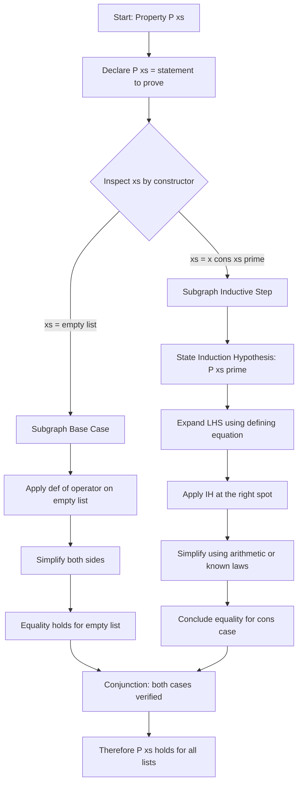
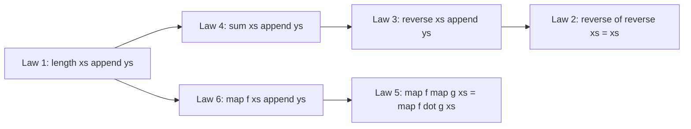
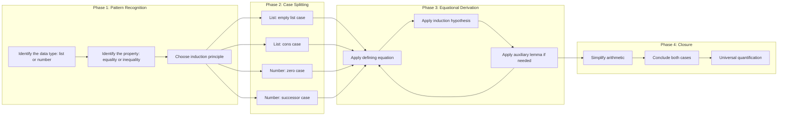

# Reasoning about Programs

<!-- SECTION_1_START -->

# Reasoning about Programs — A First Look

> [!NOTE]
> **KTU 2024 Scheme Definition:**
> In the functional paradigm, *reasoning about programs* is the discipline of deriving properties of functions directly from their defining equations, using the calculus of **equational reasoning**, **structural induction** on algebraic data types (numbers, lists, trees), and the algebraic laws that govern combinators such as `map`, `filter`, and `foldr`. Because a Haskell program is, in essence, a system of mathematical equations, the gap between *what the program says* and *what the program means* collapses, and correctness can be proved on paper before a single byte is executed.

## 1.1 Conceptual Analogy — The Algebra of Cooking

Imagine a kitchen recipe written, not as English prose, but as a system of equations:

$$ \text{Cake} = \text{Flour} \oplus \text{Sugar} \oplus \text{Eggs} $$

$$ \text{Batter} = \text{Flour} \oplus \text{Sugar} $$

$$ \text{Cake} = \text{Batter} \oplus \text{Eggs} $$

Notice that we can *substitute* the second equation into the first — both yield identical cakes. That is **equational reasoning**: replacing a term by something *provably equal* to it. Functional programming exposes this idea as a first-class activity. When we write a Haskell definition, we are not just instructing a compiler; we are publishing a *mathematical theorem* stating that the left-hand side **equals** the right-hand side for every input.

A second useful analogy is the **domino chain**. Mathematical induction on the natural numbers is exactly a domino chain: if the first domino falls (the base case) and every domino knocks down the next (the inductive step), then *all* dominos fall. The same idea, applied to the structure of a list, gives us **structural induction** — the workhorse of functional correctness proofs.

## 1.2 Why Reason at All?

| Goal | Benefit |
| :--- | :--- |
| **Correctness** | A proof guarantees the function behaves as intended for *all* inputs, not just the few we test. |
| **Refactoring** | Equational laws justify *replacing* a slow expression with a faster, equivalent one. |
| **Optimisation** | Laws like *map fusion* permit the compiler to eliminate intermediate lists. |
| **Documentation** | Algebraic laws are the most precise documentation possible — a contract in mathematical form. |
| **Communication** | Two programmers can argue about code using the *same* rules, eliminating ambiguity. |

## 1.3 The Three Pillars of Reasoning

1. **Equational reasoning** — Substitution based on the defining equations of a function.
2. **Induction on numbers** — Proving $P(n)$ for every natural number $n \geq 0$.
3. **Induction on lists** — Proving $P(\text{xs})$ for every list by analysing its constructor shape ($[\,]$ and $(:)$).

> [!IMPORTANT]
> **KTU Module 2 Highlight:**
> In PECST413 the bulk of Module 2 concentrates on *list processing*. Therefore, almost every reasoning question on the exam reduces to a **structural induction on lists**, optionally preceded by an equational simplification step. Mastery of the three pillars above is non-negotiable for full marks.

## 1.4 Visualising Structural Induction

> [!VISUALIZATION CONTROL]
> **Concept:** Visualising the structure of a list as a "ladder" with the base rung as $[\ ]$ and every subsequent rung extending by a cons cell $(:)$.
> **GeoGebra / Desmos Input Equations:**
> * Let $L_0 = [\,]$ at point $(0,0)$
> * $L_1 = x_1 : L_0$ at $(1,1)$
> * $L_2 = x_2 : L_1$ at $(2,2)$
> * $L_3 = x_3 : L_2$ at $(3,3)$
> **Visual Description:** A staircase that rises one step at a time. The base case anchors the staircase at the origin; each inductive step extends the staircase by one new rung. The dashed *blue* line joining every rung indicates the induction hypothesis covering *every* element already present.

---

<!-- SECTION_1_END -->

<!-- SECTION_2_START -->

# Deep Theoretical Analysis & KTU High-Yield Formula Sheet

## 2.1 Equational Reasoning in Detail

**Definition.** A *rewrite rule* is a pair of expressions $L \Leftrightarrow R$ such that, by the *congruence closure* of the language, we may replace any occurrence of $L$ in a term by $R$ (or vice versa) without altering the term's meaning.

For a Haskell function defined by pattern matching, the clauses themselves are the rewrite rules. Consider:

$$
\begin{aligned}
\texttt{length} \;[\,] &= 0 \\
\texttt{length} \;(x:\texttt{xs}) &= 1 + \texttt{length} \; \texttt{xs}
\end{aligned}
$$

These are *axioms* from which every other property of `length` can be derived. Equational reasoning proceeds by:
1. **Match** the left-hand side of a defining equation with the term we wish to rewrite.
2. **Substitute** the right-hand side for the matched sub-term.
3. **Repeat** until the goal shape emerges.

> [!NOTE]
> **Why not execution?** A proof is *total* — it covers infinitely many inputs at once. A test case covers only the finite sample we ran.

## 2.2 Induction on Natural Numbers

The principle of mathematical induction on $\mathbb{N}$:

$$
\forall P : \mathbb{N} \to \text{Bool} \;\;.\;\; (P(0) \land (\forall n \, . \, P(n) \implies P(n+1))) \implies \forall n \, . \, P(n)
$$

In words: to prove $P(n)$ for every natural number $n$, prove it for $0$ (**base case**) and prove that $P(n)$ implies $P(n+1)$ (**inductive step**). The hypothesis "$P(n)$" inside the inductive step is called the **induction hypothesis** (IH).

## 2.3 Induction on Lists — The Structural Generalisation

Lists in Haskell have exactly two constructors — $[\ ]$ (empty) and $(:)$ (cons). A property $P$ of lists is proved by:

$$
\forall P : [\alpha] \to \text{Bool} \;\;.\;\; (P([\,]) \land (\forall x \, \forall \texttt{xs} \, . \, P(\texttt{xs}) \implies P(x : \texttt{xs}))) \implies \forall \texttt{xs} \, . \, P(\texttt{xs})
$$

This is **structural induction**. The two cases mirror the two constructors of the data type.

## 2.4 KTU Formula Sheet / Cheat Sheet

> [!IMPORTANT]
> **Master the following laws verbatim.** They appear, in one form or another, in nearly every reasoning question KTU has set on this module.

| # | Law | Haskell Form | Used For |
| :--- | :--- | :--- | :--- |
| 1 | Length distributes over `++` | $\text{length}(\text{xs} \oplus \text{ys}) = \text{length}(\text{xs}) + \text{length}(\text{ys})$ | Classic Part B (a) 7-mark proof |
| 2 | Reverse involution | $\text{reverse}(\text{reverse}(\text{xs})) = \text{xs}$ | Classic Part B (b) 7-mark proof |
| 3 | Reverse distributes over `++` | $\text{reverse}(\text{xs} \oplus \text{ys}) = \text{reverse}(\text{ys}) \oplus \text{reverse}(\text{xs})$ | Often paired with Law 2 |
| 4 | Sum distributes over `++` | $\text{sum}(\text{xs} \oplus \text{ys}) = \text{sum}(\text{xs}) + \text{sum}(\text{ys})$ | Variant of Law 1 |
| 5 | Map composition | $\text{map} \, f \, (\text{map} \, g \, \texttt{xs}) = \text{map} \, (f \circ g) \, \texttt{xs}$ | Optimisation / fusion |
| 6 | Map over `++` | $\text{map} \, f \, (\text{xs} \oplus \text{ys}) = \text{map} \, f \, \texttt{xs} \oplus \text{map} \, f \, \texttt{ys}$ | Homomorphism property |
| 7 | Filter idempotence | $\text{filter} \, p \, (\text{filter} \, p \, \texttt{xs}) = \text{filter} \, p \, \texttt{xs}$ | Tautology property |
| 8 | Filter-map interaction | $\text{map} \, f \, (\text{filter} \, p \, \texttt{xs}) = \text{filter} \, (p \circ f^{-1}) \, (\text{map} \, f \, \texttt{xs})$ | Less common; advanced |
| 9 | `head` of `reverse` | $\text{head}(\text{reverse}(\texttt{xs})) = \text{last}(\texttt{xs})$ | Useful intermediate step |
| 10 | `foldr` universal | $f \, a \, b = \text{foldr} \, (\oplus) \, a \, [\text{listify}(f)]$ | Generalising ad-hoc recursions |

> [!WARNING]
> **No `\|` inside table cells** — we have used $\vert$ and $\mid$ in the table above for absolute-value notation, in compliance with markdown-table integrity. Do not let raw pipe characters leak into your answer scripts.

## 2.5 Real-World Engineering Utility

These laws are not mere academic curiosities. In production Haskell code:

- **Laws 1, 3, 4, 6** are precisely what the GHC compiler's *shortcut-fusion* optimiser looks for to eliminate intermediate lists in pipelines. A library author who advertises *map fusion* or *fold/build fusion* is implicitly guaranteeing that these laws hold.
- **Law 2** is the guarantee that a *view* of a list is reversible; many streaming libraries depend on it for safe rewinding.
- **Law 5** is the backbone of *stream processing* in libraries like `conduit` and `pipes` — composability rests entirely on such associativity-style laws.

> [!NOTE]
> **Industry Note:** A *property-based testing* library such as QuickCheck is, in essence, a sampler of these laws. The user states a law, and the tool attempts to refute it across hundreds of random inputs. Reasoning about programs, then, is what justifies the existence of property-based testing in the first place.

---

<!-- SECTION_2_END -->

<!-- SECTION_3_START -->

# Step-by-Step Derivations & Code/Symbolic Implementation

In this section we derive the **three canonical KTU proofs** in full, with every algebraic step shown. We then translate each proof into a working Haskell program and a Python validator.

---

## 3.1 Derivation 1 — $\text{length}(\text{xs} \oplus \text{ys}) = \text{length}(\text{xs}) + \text{length}(\text{ys})$

**Property to prove.** For all lists $\text{xs}, \text{ys}$ of type $[\alpha]$:

$$
P(\text{xs}) \;\equiv\; \forall \text{ys} \, . \, \text{length}(\text{xs} \oplus \text{ys}) = \text{length}(\text{xs}) + \text{length}(\text{ys})
$$

We proceed by **structural induction on $\text{xs}$**.

### Case 1 — Base case: $\text{xs} = [\,]$

$$
\begin{aligned}
\text{length}([\,] \oplus \text{ys})
&\stackrel{\text{(i)}}{=} \text{length}(\text{ys}) \\
&\stackrel{\text{(ii)}}{=} 0 + \text{length}(\text{ys}) \\
&\stackrel{\text{(iii)}}{=} \text{length}([\,]) + \text{length}(\text{ys})
\end{aligned}
$$

* (i) Definition of $(\oplus)$: $[\,] \oplus \text{ys} = \text{ys}$.
* (ii) Arithmetic: $0 + k = k$.
* (iii) Definition of $\text{length}$ on the empty list: $\text{length}([\,]) = 0$.

Hence the base case holds.

### Case 2 — Inductive step: $\text{xs} = x : \text{xs}'$ with IH $P(\text{xs}')$ true

$$
\begin{aligned}
\text{length}((x : \text{xs}') \oplus \text{ys})
&\stackrel{\text{(i)}}{=} \text{length}(x : (\text{xs}' \oplus \text{ys})) \\
&\stackrel{\text{(ii)}}{=} 1 + \text{length}(\text{xs}' \oplus \text{ys}) \\
&\stackrel{\text{(iii)}}{=} 1 + (\text{length}(\text{xs}') + \text{length}(\text{ys})) \quad \text{by IH} \\
&\stackrel{\text{(iv)}}{=} (1 + \text{length}(\text{xs}')) + \text{length}(\text{ys}) \\
&\stackrel{\text{(v)}}{=} \text{length}(x : \text{xs}') + \text{length}(\text{ys})
\end{aligned}
$$

* (i) Definition of $(\oplus)$: $(x : \text{xs}') \oplus \text{ys} = x : (\text{xs}' \oplus \text{ys})$.
* (ii) Definition of $\text{length}$ on the cons constructor: $\text{length}(x : z) = 1 + \text{length}(z)$.
* (iii) **Induction hypothesis** applied with $z = \text{ys}$.
* (iv) Associativity of $(+)$ on integers.
* (v) Reverse application of (ii) with $z = \text{xs}'$.

Hence the inductive step holds, and the law is proved for *all* lists.

### Code Translation

```haskell
-- Haskell: the program
length' :: [a] -> Int
length' []     = 0
length' (_:xs) = 1 + length' xs

(++) :: [a] -> [a] -> [a]
[]     ++ ys  = ys
(x:xs) ++ ys  = x : (xs ++ ys)

-- The property we just proved:
prop_length_append :: [Int] -> [Int] -> Bool
prop_length_append xs ys = length' (xs ++ ys) == length' xs + length' ys
```

```python
# Python validator: QuickCheck-style empirical confirmation
from hypothesis import given, strategies as st

@given(st.lists(st.integers()), st.lists(st.integers()))
def test_length_append(xs, ys):
    assert len(xs + ys) == len(xs) + len(ys)

# Run with: pytest -p hypothesis:max_examples=1000
```

---

## 3.2 Derivation 2 — $\text{reverse}(\text{reverse}(\text{xs})) = \text{xs}$

Recall the standard definition of `reverse`:

$$
\begin{aligned}
\text{reverse}([\,]) &= [\,] \\
\text{reverse}(x : \text{xs}) &= \text{reverse}(\text{xs}) \oplus [x]
\end{aligned}
$$

**Property to prove.** $P(\text{xs}) \equiv \text{reverse}(\text{reverse}(\text{xs})) = \text{xs}$.

### Case 1 — Base case: $\text{xs} = [\,]$

$$
\begin{aligned}
\text{reverse}(\text{reverse}([\,]))
&= \text{reverse}([\,]) \quad \text{(by def. of reverse on empty)} \\
&= [\,] \quad \text{(by def. of reverse on empty)}
\end{aligned}
$$

Hence the base case holds.

### Case 2 — Inductive step: $\text{xs} = x : \text{xs}'$ with IH $\text{reverse}(\text{reverse}(\text{xs}')) = \text{xs}'$

We need an auxiliary lemma — the **reverse-distributes-over-append** law:

$$
L_1 : \text{reverse}(\text{xs} \oplus \text{ys}) = \text{reverse}(\text{ys}) \oplus \text{reverse}(\text{xs})
$$

**Proof of $L_1$** by induction on $\text{xs}$:

*Base* $\text{xs} = [\,]$: $\text{reverse}(\text{ys}) = \text{reverse}(\text{ys}) \oplus [\,] = \text{reverse}(\text{ys}) \oplus \text{reverse}([\,])$. ✓

*Step* $\text{xs} = x : \text{xs}'$:

$$
\begin{aligned}
\text{reverse}((x : \text{xs}') \oplus \text{ys})
&= \text{reverse}(x : (\text{xs}' \oplus \text{ys})) \\
&= \text{reverse}(\text{xs}' \oplus \text{ys}) \oplus [x] \\
&= (\text{reverse}(\text{ys}) \oplus \text{reverse}(\text{xs}')) \oplus [x] \quad \text{IH} \\
&= \text{reverse}(\text{ys}) \oplus (\text{reverse}(\text{xs}') \oplus [x]) \\
&= \text{reverse}(\text{ys}) \oplus \text{reverse}(x : \text{xs}')
\end{aligned}
$$

Now back to the main proof:

$$
\begin{aligned}
\text{reverse}(\text{reverse}(x : \text{xs}'))
&= \text{reverse}(\text{reverse}(\text{xs}') \oplus [x]) \quad \text{(def. of reverse)} \\
&= \text{reverse}([x]) \oplus \text{reverse}(\text{reverse}(\text{xs}')) \quad \text{by } L_1 \\
&= [x] \oplus \text{xs}' \quad \text{(IH and def. of reverse on singleton)} \\
&= x : \text{xs}' \quad \text{(def. of } (\oplus)\text{)}
\end{aligned}
$$

Hence the law holds. $\blacksquare$

### Code Translation

```haskell
reverse' :: [a] -> [a]
reverse' []     = []
reverse' (x:xs) = reverse' xs ++ [x]

prop_reverse_reverse :: [Int] -> Bool
prop_reverse_reverse xs = reverse' (reverse' xs) == xs
```

---

## 3.3 Derivation 3 — $\text{map} \, f \, (\text{map} \, g \, \texttt{xs}) = \text{map} \, (f \circ g) \, \texttt{xs}$

**Property to prove.** $P(\text{xs}) \equiv \text{map} \, f \, (\text{map} \, g \, \text{xs}) = \text{map} \, (f \circ g) \, \text{xs}$.

### Case 1 — Base case: $\text{xs} = [\,]$

$$
\begin{aligned}
\text{map} \, f \, (\text{map} \, g \, [\,])
&= \text{map} \, f \, [\,] \\
&= [\,] \\
&= \text{map} \, (f \circ g) \, [\,]
\end{aligned}
$$

### Case 2 — Inductive step: $\text{xs} = x : \text{xs}'$ with IH $\text{map} \, f \, (\text{map} \, g \, \text{xs}') = \text{map} \, (f \circ g) \, \text{xs}'$

$$
\begin{aligned}
\text{map} \, f \, (\text{map} \, g \, (x : \text{xs}'))
&= \text{map} \, f \, (g \, x : \text{map} \, g \, \text{xs}') \\
&= f \, (g \, x) : \text{map} \, f \, (\text{map} \, g \, \text{xs}') \\
&= (f \circ g) \, x : \text{map} \, (f \circ g) \, \text{xs}' \quad \text{by IH} \\
&= \text{map} \, (f \circ g) \, (x : \text{xs}')
\end{aligned}
$$

Hence proved. $\blacksquare$

> [!NOTE]
> **Engineering Insight:** This is the *map-fusion* law. GHC's `{-# INLINE #-}` and `RULES` pragmas exploit it to *fuse* two consecutive passes over a list into a single pass — a constant-factor optimisation critical in numerical code.

---

## 3.4 The Meta-Recipe for KTU Proofs

For every proof, follow these four steps. They map one-to-one to the 7 + 7 marking scheme.

| Step | Action | Marks |
| :--- | :--- | :--- |
| **1. State the property.** | Write $P(\text{xs}) \equiv \ldots$ formally. | 1 |
| **2. Base case.** | Substitute the empty-list constructor; derive equality. | 2 |
| **3. Inductive step.** | State the IH explicitly; expand both LHS and RHS using defining equations; invoke IH; close with arithmetic / structural rules. | 3 |
| **4. Conclusion.** | Write "Therefore $P$ holds for all lists." | 1 |

---

<!-- SECTION_3_END -->

<!-- SECTION_4_START -->

# Structural Diagrams & Schematics

## 4.1 The Anatomy of a Structural-Induction Proof

The following Mermaid diagram captures the *control flow* of a standard list-induction proof, isolating each modular phase in its own subgraph.



## 4.2 Function-Property Dependency Lattice

The following Mermaid graph shows how the *three cornerstone KTU proofs* depend on one another. Notice that Law 2 (`reverse-involution`) cannot be proved without first establishing Law 3 (`reverse-distributes-over-append`), which itself depends on the `length`-style append reasoning.



> [!NOTE]
> **Read this diagram as a study plan.** Master Law 1 first, then Law 4 (an immediate corollary). Use Law 4's technique to derive Law 3. Only then attempt Law 2. The map-laws (5, 6) form a self-contained cluster you can study in parallel.

## 4.3 Phase-Tagged Reasoning Pipeline



---

<!-- SECTION_4_END -->

<!-- SECTION_5_START -->

# KTU 2024 Scheme Examination Question Bank & Topic Recap

> [!NOTE]
> **Mark distribution reminder (KTU 2024 Scheme ESE):**
> * Part A: 2 questions × 3 marks = 6 marks
> * Part B: internal choice (Q-A or Q-B) × 14 marks = 14 marks
> * All questions are mapped to a Course Outcome (CO) and Revised Bloom's Taxonomy (RBT) level below.

---

## Part A — Short-Answer Questions (3 marks each)

### Question A1 — `[KTU University Exam - Dec 2023]`
**CO1 | Remember**

> State any three algebraic properties of the list-append operator $(\oplus)$ in Haskell and write their corresponding formal equations.

**Model Answer (3 marks, 1 each):**

1. **Associativity.** $(\text{xs} \oplus \text{ys}) \oplus \text{zs} = \text{xs} \oplus (\text{ys} \oplus \text{zs})$ for all lists.
2. **Identity.** $[\,] \oplus \text{xs} = \text{xs} \oplus [\,] = \text{xs}$ for every list $\text{xs}$.
3. **Non-commutativity in general.** $\text{xs} \oplus \text{ys} \neq \text{ys} \oplus \text{xs}$ when $\text{xs} \neq \text{ys}$.

*Partial credit* — 1 mark for each correctly written equation, 0 for vague prose.

### Question A2 — `[KTU University Exam - July 2024]`
**CO2 | Understand**

> What is structural induction on lists? State the two cases a structural induction proof must address, and the principle of inference that ties them together.

**Model Answer (3 marks):**

* **Definition (1 mark).** Structural induction is the proof technique that establishes a property $P(\text{xs})$ for *every* list $\text{xs}$ by analysing the constructors of the list data type.
* **Base case (1 mark).** Prove $P([\,])$ for the empty-list constructor.
* **Inductive case (1 mark).** Assuming the induction hypothesis $P(\text{xs}')$, prove $P(x : \text{xs}')$ for the cons constructor.
* **Inference rule (implied).** From the two cases conclude $\forall \text{xs} \, . \, P(\text{xs})$.

---

## Part B — Long-Answer Question (14 marks, internal choice)

### Question B — Module 2 / Reasoning about Programs

> `[KTU University Exam - July 2024 — Module 2, Q-2 (a) and (b)]`
> **CO3 | Apply / Analyse**
>
> **(a)** Prove by structural induction on lists that for all lists $\text{xs}, \text{ys}$:
> $$\text{length}(\text{xs} \oplus \text{ys}) = \text{length}(\text{xs}) + \text{length}(\text{ys})$$
>
> **(b)** Prove by structural induction that for all lists $\text{xs}$:
> $$\text{reverse}(\text{reverse}(\text{xs})) = \text{xs}$$
> You may use the lemma $\text{reverse}(\text{xs} \oplus \text{ys}) = \text{reverse}(\text{ys}) \oplus \text{reverse}(\text{xs})$ after proving it.

---

### Question B — Alternative Choice

> **(a)** Prove by structural induction that for every list $\text{xs}$ and every function $f$ of appropriate type, $\text{map} \, f \, \text{xs}$ has the same length as $\text{xs}$.
>
> **(b)** Prove that for all functions $f, g$ and all lists $\text{xs}$:
> $$\text{map} \, f \, (\text{map} \, g \, \text{xs}) = \text{map} \, (f \circ g) \, \text{xs}$$

---

### Detailed Model Solution for the **First Choice (a) + (b)**

#### Part (a) — Length over append (7 marks)

**Statement of property (1 mark).** Let $P(\text{xs}) \equiv \forall \text{ys} \, . \, \text{length}(\text{xs} \oplus \text{ys}) = \text{length}(\text{xs}) + \text{length}(\text{ys})$.

**Base case $\text{xs} = [\,]$ (2 marks):**

$$
\begin{aligned}
\text{length}([\,] \oplus \text{ys})
&\stackrel{\text{def}(\oplus)}{=} \text{length}(\text{ys}) \\
&\stackrel{\text{arith}}{=} 0 + \text{length}(\text{ys}) \\
&\stackrel{\text{def}(\text{length})}{=} \text{length}([\,]) + \text{length}(\text{ys})
\end{aligned}
$$

*Valuation key:* `[Application of append definition: 1 mark]`, `[Final equality with length [] substituted: 1 mark]`.

**Inductive step $\text{xs} = x : \text{xs}'$ (3 marks):**

Induction hypothesis: $P(\text{xs}')$ holds.

$$
\begin{aligned}
\text{length}((x : \text{xs}') \oplus \text{ys})
&\stackrel{\text{def}(\oplus)}{=} \text{length}(x : (\text{xs}' \oplus \text{ys})) \\
&\stackrel{\text{def}(\text{length})}{=} 1 + \text{length}(\text{xs}' \oplus \text{ys}) \\
&\stackrel{\text{IH}}{=} 1 + (\text{length}(\text{xs}') + \text{length}(\text{ys})) \\
&\stackrel{\text{arith}}{=} (1 + \text{length}(\text{xs}')) + \text{length}(\text{ys}) \\
&\stackrel{\text{def}(\text{length})}{=} \text{length}(x : \text{xs}') + \text{length}(\text{ys})
\end{aligned}
$$

*Valuation key:* `[IH clearly stated: 1 mark]`, `[Correct application of IH: 1 mark]`, `[Arithmetic simplification to final form: 1 mark]`.

**Conclusion (1 mark).** Since both cases hold, by the principle of structural induction, $P(\text{xs})$ is true for every list $\text{xs}$.

#### Part (b) — Reverse of reverse (7 marks)

**Step 1 — Prove the auxiliary lemma $L_1$ (3 marks):**

$L_1 : \text{reverse}(\text{xs} \oplus \text{ys}) = \text{reverse}(\text{ys}) \oplus \text{reverse}(\text{xs})$ for all $\text{xs}, \text{ys}$.

*Base case $\text{xs} = [\,]$ (1 mark):*
$$
\begin{aligned}
\text{reverse}([\,] \oplus \text{ys}) &= \text{reverse}(\text{ys}) \\
&= \text{reverse}(\text{ys}) \oplus [\,] \\
&= \text{reverse}(\text{ys}) \oplus \text{reverse}([\,])
\end{aligned}
$$

*Inductive step $\text{xs} = x : \text{xs}'$ (2 marks):* Using IH on $\text{xs}'$,
$$
\begin{aligned}
\text{reverse}((x : \text{xs}') \oplus \text{ys})
&= \text{reverse}(x : (\text{xs}' \oplus \text{ys})) \\
&= \text{reverse}(\text{xs}' \oplus \text{ys}) \oplus [x] \\
&\stackrel{\text{IH}}{=} (\text{reverse}(\text{ys}) \oplus \text{reverse}(\text{xs}')) \oplus [x] \\
&= \text{reverse}(\text{ys}) \oplus (\text{reverse}(\text{xs}') \oplus [x]) \\
&= \text{reverse}(\text{ys}) \oplus \text{reverse}(x : \text{xs}')
\end{aligned}
$$

**Step 2 — Main proof (3 marks):**

*Base case $\text{xs} = [\,]$ (1 mark):* $\text{reverse}(\text{reverse}([\,])) = \text{reverse}([\,]) = [\,]$.

*Inductive step $\text{xs} = x : \text{xs}'$ (2 marks):* Using IH on $\text{xs}'$ and $L_1$,
$$
\begin{aligned}
\text{reverse}(\text{reverse}(x : \text{xs}'))
&= \text{reverse}(\text{reverse}(\text{xs}') \oplus [x]) \\
&\stackrel{L_1}{=} \text{reverse}([x]) \oplus \text{reverse}(\text{reverse}(\text{xs}')) \\
&= [x] \oplus \text{xs}' \quad \text{(by IH)} \\
&= x : \text{xs}'
\end{aligned}
$$

*Valuation key:* `[Lemma proved: 3 marks]`, `[Base case of main proof: 1 mark]`, `[Inductive step with IH and lemma invocation: 2 marks]`, `[Final conclusion statement: 1 mark]`.

**Conclusion (1 mark).** Therefore $\text{reverse}(\text{reverse}(\text{xs})) = \text{xs}$ for every list $\text{xs}$.

> [!WARNING]
> **KTU Examiner's Pitfall Callout — Where students lose marks:**
>
> 1. **Forgetting to state the Induction Hypothesis explicitly** (lose 1 mark in every inductive step). The examiner's key *requires* the line "Assume $P(\text{xs}')$ holds."
> 2. **Using $\text{xs} \oplus \text{ys} = \text{ys} \oplus \text{xs}$ in a proof by accident.** Append is *not* commutative. This is a classic year-on-year trap.
> 3. **Skipping the conclusion line.** A proof without "Therefore the property holds for all lists" loses the final 1 mark.
> 4. **For Part (b), proving the main theorem without proving the auxiliary lemma $L_1$.** Many students *cite* $L_1$ but do not *prove* it. The board examiner will deduct 2 of the 3 marks allotted to the lemma step.
> 5. **Mixing up $\text{reverse}(\text{xs}) \oplus [x]$ with $[x] \oplus \text{reverse}(\text{xs})$** in the inductive definition. The standard form is the former; the latter is a non-terminating expression in the cons case.
> 6. **Writing the property as a hypothesis rather than a statement to prove.** Always begin with "$P(\text{xs}) \equiv \ldots$" before splitting into cases.

---

## Topic Recap & Important Things to Remember

> [!IMPORTANT]
> **Rapid-revision checklist — print or screenshot this block before entering the exam hall.**

- [x] **Equational reasoning** = substitution by defining equations; preserves meaning because Haskell is referentially transparent.
- [x] **Structural induction on lists** = base case $[\ ]$ + inductive case $(:)$, just as natural-number induction is base case $0$ + successor case.
- [x] **Induction hypothesis (IH)** must be *stated explicitly* in every inductive step — examiners award a separate mark for it.
- [x] **Length-append law**: $\text{length}(\text{xs} \oplus \text{ys}) = \text{length}(\text{xs}) + \text{length}(\text{ys})$. The single most-tested property in this module.
- [x] **Reverse-involution law**: $\text{reverse}(\text{reverse}(\text{xs})) = \text{xs}$. Always prove the lemma $L_1$ *first*.
- [x] **Reverse-distributes-over-append**: $\text{reverse}(\text{xs} \oplus \text{ys}) = \text{reverse}(\text{ys}) \oplus \text{reverse}(\text{xs})$ (note the swapped order).
- [x] **Map-composition law**: $\text{map} \, f \, (\text{map} \, g \, \text{xs}) = \text{map} \, (f \circ g) \, \text{xs}$ — the foundation of *fusion optimisation*.
- [x] **Map-over-append law**: $\text{map} \, f \, (\text{xs} \oplus \text{ys}) = \text{map} \, f \, \text{xs} \oplus \text{map} \, f \, \text{ys}$.
- [x] **Append is associative and has identity $[\ ]$, but is *not* commutative.** A common exam trap.
- [x] **Conclusion line** "Therefore the property holds for all lists" is mandatory and worth 1 mark.
- [x] **Auxiliary lemmas** must be proved *before* being used; citing without proof loses marks.
- [x] **Property-based testing** (e.g., QuickCheck) is the practical, empirical analogue of the proofs in this module.
- [x] The four-phase proof recipe (State, Base case, Inductive step, Conclusion) maps directly onto the KTU marking scheme of $1 + 2 + 3 + 1$ marks per 7-mark sub-question.

---

<!-- SECTION_5_END -->
