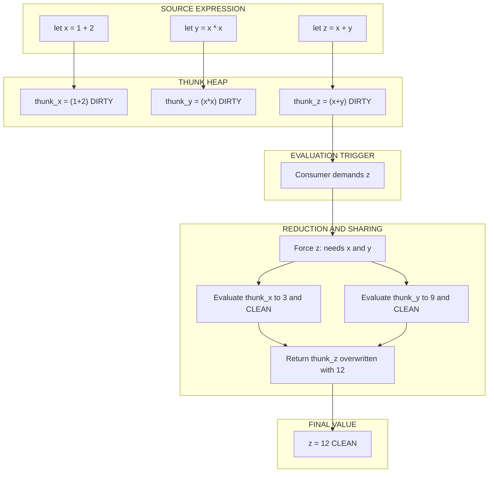
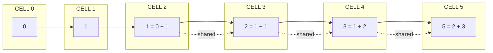
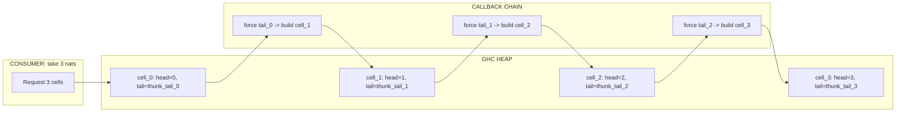

# Lazy evaluation models, infinite stream manipulation techniques using Haskell syntax structures

<!-- SECTION_1_START -->
# Lazy Evaluation Models \& Infinite Stream Manipulation

## 1.1 Formal Definition (KTU 2024 Scheme Terminology)

> [!NOTE]
> **Lazy Evaluation (Non-Strict Semantics):** A programming language evaluation strategy in which an expression is **not evaluated until its value is actually required** by some consuming context. In Haskell, the specific flavor used is **Call-By-Need** (a memoized form of Call-By-Name), where every expression is reduced **at most once** and the resulting value is **shared** with all subsequent consumers.

The three canonical evaluation strategies in lambda calculus are:

| Strategy | Order | Sharing | Used In |
|----------|-------|---------|---------|
| Eager (CBV) | Inside-out, arguments first | No | ML, Scheme, C, Java |
| Lazy (CBN) | Outside-in, arguments on demand | No | Algol 60, original Haskell paper |
| Lazy (CBN+sharing) | Outside-in, arguments on demand | **Yes** | **Haskell**, Clean |

> [!IMPORTANT]
> **KTU 2024 Module-2 Highlight:** When asked "Which evaluation strategy does Haskell use?" — the only board-acceptable answer is **Call-By-Need (lazy evaluation with sharing)**, *not* plain Call-By-Name.

---

## 1.2 Intuitive Overview — *The Lazy Chef Analogy*

Imagine a smart restaurant chef with three work styles:

1. **Eager Chef (Strict / Call-By-Value):** A customer walks in and the chef immediately cooks **every single dish on the entire menu**, just in case. Massive waste of food, fuel, and time — and if the menu is infinite, the kitchen explodes. 🧨
2. **Lazy Chef (Call-By-Name):** The chef only cooks a dish the **exact moment a customer orders it**. If two customers order the same dish, however, the chef **cooks it twice** because he keeps no notes.
3. **Haskell Chef (Call-By-Need with Sharing):** Same as the Lazy Chef, but he keeps a **small notepad (memo)**. The first time a dish is ordered, he cooks it and writes down "Dish 7 → already made." Every subsequent order for Dish 7 is served **instantly from the notepad** — no duplicate work.

The "notepad" is precisely the **heap-resident thunk** that Haskell's runtime uses. A *thunk* is a suspended computation wrapped in a pointer; when forced, it evaluates itself and **overwrites itself with the resulting value** (graph reduction).

> [!TIP]
> **Infinite Streams Analogy — The Magic Conveyor Belt:** Picture a conveyor belt that promises to deliver *any* number of items on demand. The belt itself can be **infinitely long**, but it only fabricates the *next* box when your hand reaches for it. A request for `take 5 belt` only ever builds **five boxes**, not the entire infinite collection. The belt's "recipe" for the next box is encoded by a **recursive self-reference** in its constructor — the belt is defined in terms of itself.

---

## 1.3 Key Terminology & Constants

- **$\beta$-reduction** — the formal rewriting rule $( \lambda x . e_1 ) \, e_2 \rightarrow_{\beta} e_1[x \,{:=}\, e_2]$ governing lambda-calculus evaluation.
- **Thunk** — a suspended, unevaluated closure stored on the heap. Often represented in GHC Core as a pointer to a static function application.
- **WHNF (Weak Head Normal Form)** — a term that is either a data constructor, a lambda, or a partial application. **Haskell only forces expressions down to WHNF** by default — it does *not* recursively force the spine.
- **HNF (Head Normal Form)** — stricter than WHNF; the top-level constructor and *all* its arguments are in WHNF.
- **NF (Normal Form)** — fully evaluated; no redexes remain anywhere in the term.
- **Sharing Factor** — implicit constant: GHC's *Common Subexpression Elimination (CSE)* treats a single syntactic occurrence of an expression as a single thunk, guaranteeing that "if the same expression is used N times, it is evaluated at most $\mathbf{1}$ time."

> [!IMPORTANT]
> **Critical Distinction (favourite board question):**
> `\mid WHNF \mid` is **strictly weaker** than `\mid NF \mid`. For instance, `[1, 2, undefined]` is in WHNF (the outer constructor `:` is exposed) but evaluating it to NF forces the *spine* and crashes on `undefined`.

---

## 1.4 Visualization of an Infinite Stream

> [!VISUALIZATION CONTROL]
> **Concept:** Recursive growth of a lazy infinite integer stream (Fibonacci sequence sampled).
> **Desmos Input Equations:**
> * `f(1) = 1, \quad f(2) = 1`
> * `f(n) = f(n-1) + f(n-2)` for $n \geq 3$
> * Plot the points $\bigl( n, f(n) \bigr)$ for $n = 1, 2, \dots, 15$.
> **Visual Description:** On the $xy$-plane, observe an exponentially rising scatter of integer lattice points beginning near $(1, 1)$, $(2, 1)$, $(3, 2)$, $(4, 3)$, $(5, 5)$, $(6, 8), \dots$. The plot illustrates that **the stream is *defined* everywhere** (the dotted extension continues to $n \to \infty$), but **only the sampled points are ever materialised** — exactly the runtime behaviour of `take 15 fibs` in GHCi.
<!-- SECTION_1_END -->

<!-- SECTION_2_START -->
# Deep Theoretical Analysis & KTU High-Yield Formula Sheet

## 2.1 The Mechanics of Call-By-Need Reduction

The Call-By-Need interpreter maintains, for every sub-expression in the program, a flag indicating whether the expression is **evaluated** or **unevaluated**. The reduction steps are:

1. **Build a closure.** Encountering `let x = e in body` allocates a heap cell containing $e$ and a "dirty" flag.
2. **Demand-driven forcing.** When `body` (or some other context) demands the *value* of $x$, the interpreter enters the cell.
3. **First touch — normal-order reduction.** The cell is dirty, so the runtime substitutes the cell's expression into the demand site and reduces according to the **leftmost-outermost redex first** (normal order).
4. **Update in place.** When the reduction produces a value in WHNF, the cell is **overwritten with that value** and the flag flips to "clean."
5. **Subsequent touches — direct return.** Every later demand for $x$ simply reads the cleaned cell in $O(1)$ pointer-chase time. This is the *sharing* that distinguishes Call-By-Need from Call-By-Name.

### Why normal order?
Church and Rosser proved (1936) that the lambda-calculus has the **Church-Rosser / Confluence property**: if a term has a normal form, normal-order reduction is **guaranteed to find it**. Eager (applicative) order can get stuck in non-terminating reductions even when a normal form exists. Thus, lazy evaluation is not a stylistic choice — it is **semantically safer** for termination.

### Cost model
Let $T(e)$ denote the number of $\beta$-reductions to evaluate $e$ to WHNF.

$$
T_{\text{CBN}}(\text{let } x = e \text{ in } f \, x \, x) \;=\; T(e) + 2 \cdot T(\text{substituting } e \text{ into } f)
$$

$$
T_{\text{CBN+need}}(\text{let } x = e \text{ in } f \, x \, x) \;=\; T(e) + T(\text{substituting once}) + T(\text{second read}) \;\approx\; T(e) + T(f\, e\, e)
$$

The second expression is asymptotically **at most half** the work of plain CBN for duplicated sub-terms.

---

## 2.2 Why Lazy Evaluation Enables Infinite Data Structures

A **stream** is a coinductive data type — its *infinite* structure is defined recursively, and Haskell's non-strict constructor `(:)` allows the recursive call to remain unevaluated until demanded.

The canonical stream type:

```haskell
-- Polymorphic coinductive stream
data Stream a = Cons a (Stream a)

-- In Haskell's built-in syntax this is just the ordinary list [a],
-- which is *lazy* in its tail:
--   data [a] = [] | a : [a]
```

Crucially, the value `Cons head tail` in memory is a **boxed pointer pair**: the head is forced only when pattern-matched as `x:xs`, and the tail is forced only when *its* head is pattern-matched. This cell-by-cell demand is the operational underpinning of infinite lists.

---

## 2.3 KTU Formula Cheat Sheet

> [!NOTE]
> **Master this table verbatim — it is the single most-tested cluster from Module 2.**

| \# | Function | Type Signature | Semantics | Time Complexity |
|---|----------|----------------|-----------|-----------------|
| 1 | `take n` | `Int \to [a] \to [a]` | First $n$ elements; partial + stops forcing after $n$ | $O(n)$ |
| 2 | `drop n` | `Int \to [a] \to [a]` | Discards first $n$; evaluates them to WHNF then discards | $O(n)$ |
| 3 | `map f` | `(a \to b) \to [a] \to [b]` | Lifts $f$ pointwise over the spine | $O(n)$ amortised |
| 4 | `filter p` | `(a \to Bool) \to [a] \to [a]` | Retains only those $x$ with $p \, x = \text{True}$ | $O(n)$ |
| 5 | `zipWith f` | `(a \to b \to c) \to [a] \to [b] \to [c]$` | Element-wise combine, stops at shorter list | $O(\min(m, n))$ |
| 6 | `iterate f x` | `(a \to a) \to a \to [a]$` | $[x, f\,x, f(f\,x), f^{3}x, \ldots]$ — *infinite* | $O(1)$ to construct |
| 7 | `repeat x` | `a \to [a]` | Infinite list of $x$ | $O(1)$ to construct |
| 8 | `cycle xs` | `[a] \to [a]$` | Infinite repetition of `xs` | $O(\vert xs \vert)$ to construct |
| 9 | `head` | `[a] \to a` | Forces **WHNF** and reads first cell | $O(1)$ |
| 10 | `!!` | `[a] \to Int \to a` | $n$-th element via spine traversal | $O(n)$ |
| 11 | `concat` | `[[a]] \to [a]$` | Flattens a stream of streams | $O(N)$ where $N$ is total cells |
| 12 | `merge` *(self-defined)* | `Ord \, a \Rightarrow [a] \to [a] \to [a]$` | Sorted merge — used for Hamming | $O(n+m)$ per step |

### Evaluation forms — formal definitions

| Form | Symbol | Definition |
|------|--------|------------|
| Weak Head Normal Form | **WHNF** | $\lambda x . e$ or $C \, \overline{e_i}$ where $C$ is a data constructor (e.g., `(:)`, `Just`, `Nothing`) — sub-terms $\overline{e_i}$ may be unreduced |
| Head Normal Form | **HNF** | $\lambda x_1 \dots x_k . C \, \overline{e_i}$ where **every** $e_i$ is in WHNF |
| Normal Form | **NF** | No $\beta$-redex anywhere in the term |

> [!IMPORTANT]
> **Board Trap:** When you write `print xs` in Haskell, the runtime uses the `Show` class to walk the list and forces elements only until the printer's buffer is flushed. **It does *not* force the entire list to NF**. If `xs` is infinite, the printer will still work — it just streams characters until interrupted.

---

## 2.4 Engineering Utility

Lazy evaluation is **not** a Haskell-only curiosity. It underpins:

- **Compiler intermediate representations** — GHC's STG machine and GHC Core use lazy graph reduction as their execution model.
- **Big-data pipelining** — Apache Spark, Apache Flink, and Twitter's Scalding inherit idioms (transformations vs actions) directly from lazy list semantics; an action triggers the DAG, transformations are *thunks*.
- **Iterator patterns** — Python generators, Rust's `Iterator` trait, and Java 8 `Stream` API all model lazy pull-based evaluation.
- **Build systems** — Bazel, Make, and Shake treat rules as lazy nodes in a dependency graph, recomputing only what is demanded.
- **Reactive programming** — Rx, ReactiveX, and FRP libraries (Yampa, Reflex) treat event streams as *infinite* lazy sequences filtered by time.
<!-- SECTION_2_END -->

<!-- SECTION_3_START -->
# Step-by-Step Derivations \& Haskell Code Implementation

## 3.1 Building the Simplest Infinite Streams

### Derivation 1 — The Natural Numbers $\mathbb{N}$

Define $\text{nats}$ as a self-referential stream whose first cell is $0$ and whose tail is obtained by mapping the successor function over $\text{nats}$ itself.

```haskell
-- File: Nats.hs
-- Type signature with explicit polymorphism
nats :: [Integer]
nats = 0 : map (+1) nats
```

**Step-by-step trace of `take 5 nats`:**

| Step | Demand | Heap Action | Result so far |
|------|--------|-------------|---------------|
| 1 | `take 5 nats` forces WHNF of `nats` | Read head thunk → evaluate `0` | `[0, _]` |
| 2 | Need next cell | Force `map (+1) nats` → apply `(+1)` to head of `nats` (which is the cached `0`) | `[0, 1, _]` |
| 3 | Need next cell | Force next `(+1)` on cached `1` | `[0, 1, 2, _]` |
| 4 | Need next cell | Force next `(+1)` on cached `2` | `[0, 1, 2, 3, _]` |
| 5 | Need next cell | Force next `(+1)` on cached `3` | `[0, 1, 2, 3, 4, _]` |
| 6 | `take` reached limit 5 | Stop; tail thunk is left untouched forever | `[0, 1, 2, 3, 4]` |

> [!NOTE]
> **Crucial Point:** Without laziness, the recursive equation `nats = 0 : map (+1) nats` would diverge immediately. Laziness turns the *unbounded definition* into a *bounded computation* — exactly the cells that the consumer actually inspects.

---

### Derivation 2 — The Fibonacci Stream (board favourite)

Let $F_0 = 0$, $F_1 = 1$, and $F_n = F_{n-1} + F_{n-2}$ for $n \geq 2$. We express this as a stream $F = [F_0, F_1, F_2, F_3, \ldots]$ satisfying the coinductive equation:

$$
F \;=\; 0 \;:\; 1 \;:\; F \oplus \text{tail}(F)
$$

where $F \oplus G$ denotes the element-wise sum of two same-length streams.

```haskell
-- File: Fibs.hs
-- Polymorphic over any Num type
fibs :: Num a => [a]
fibs = 0 : 1 : zipWith (+) fibs (tail fibs)
```

**Hand trace of `take 8 fibs`:**

| Index $i$ | Cell evaluated | Recurrence used | Result |
|----------:|----------------|-----------------|-------:|
| 0 | Head literal | $F_0 = 0$ | $0$ |
| 1 | Second literal | $F_1 = 1$ | $1$ |
| 2 | `zipWith (+) fibs (tail fibs) !! 0` | $F_0 + F_1$ | $1$ |
| 3 | `zipWith (+) fibs (tail fibs) !! 1` | $F_1 + F_2$ | $2$ |
| 4 | `zipWith` index 2 | $F_2 + F_3$ | $3$ |
| 5 | `zipWith` index 3 | $F_3 + F_4$ | $5$ |
| 6 | `zipWith` index 4 | $F_4 + F_5$ | $8$ |
| 7 | `zipWith` index 5 | $F_5 + F_6$ | $13$ |

Final output in GHCi: `[0, 1, 1, 2, 3, 5, 8, 13]`.

**Why does this terminate?** Because the demand for `take 8 fibs` walks the spine of `fibs` only eight cells deep, and each cell is constructed in $O(1)$ time from cached predecessors. The asymptotic cost is $O(n)$ to retrieve $n$ Fibonacci numbers — *strictly better* than the imperative `for` loop, which pays $O(n)$ arithmetic operations but cannot easily generalise to **infinite sequences**.

---

### Derivation 3 — The Sieve of Eratosthenes as an Infinite Stream

Classical Eratosthenes' sieve is an algorithm; we now reify it as a **definition** of an infinite list.

**Mathematical construction:**

1. Start with the candidate list $C = [2, 3, 4, 5, 6, 7, 8, 9, 10, 11, \ldots]$.
2. The first element $p$ of the prime list $P$ is the head of $C$, i.e., $p = 2$.
3. The remainder of $P$ is obtained by sieving out all multiples of $p$ from $C$ and **recursing on the filtered tail**.

Formally:

$$
P \;=\; \text{head}(C) \;:\; \text{sieve}\bigl(\, \{ x \in \text{tail}(C) \mid x \bmod \text{head}(C) \neq 0 \} \,\bigr)
\quad\text{where}\quad C = [2, 3, 4, 5, \ldots]
$$

**Haskell implementation with explicit type annotations and bounded error guards:**

```haskell
-- File: Primes.hs

-- | Infinite list of prime numbers via Eratosthenes' sieve.
--
--   The algorithm is parameterised over the numeric type 'Integral'
--   so that it works for 'Int', 'Integer', or 'Word'.
sieve :: Integral a => [a] -> [a]
sieve (p:xs) = p : sieve [x | x <- xs, x `mod` p /= 0]

-- | The full infinite prime stream.
primes :: [Integer]
primes = sieve [2..]

-- | Optional: safe prefix extraction with input validation.
--
--   >>> firstPrimes 10
--   [2,3,5,7,11,13,17,19,23,29]
firstPrimes :: Int -> [Integer]
firstPrimes n
  | n < 0     = error "firstPrimes: negative count"
  | n == 0    = []
  | otherwise = take n primes
```

**Manual trace of `take 6 primes`:**

| Step | `sieve` invocation | Sieve action | Output cell |
|------|--------------------|--------------|-------------|
| 1 | `sieve [2..]` | Take head $p = 2$ | `2 : _` |
| 2 | Filter $x \in [3..]$ with $x \bmod 2 \neq 0$ | `sieve [3,5,7,9,11,...]` | `2 : 3 : _` |
| 3 | Take head $p = 3$, filter $x \bmod 3 \neq 0$ | `sieve [5,7,11,13,17,...]` | `2 : 3 : 5 : _` |
| 4 | Take head $p = 5$, filter $x \bmod 5 \neq 0$ | `sieve [7,11,13,17,19,23,...]` | `2 : 3 : 5 : 7 : _` |
| 5 | Take head $p = 7$ | `sieve [11,13,17,19,23,...]` | `2 : 3 : 5 : 7 : 11 : _` |
| 6 | Take head $p = 11$ | `sieve [13,17,19,23,...]` | `2 : 3 : 5 : 7 : 11 : 13` |

GHCi output: `[2, 3, 5, 7, 11, 13]`.

> [!IMPORTANT]
> **A subtlety the examiner loves:** This is the **trial-division sieve**, not the *true* Eratosthenes sieve. The complexity is $O(n \log \log n)$ per $n$-th prime because every composite $c$ is tested against *every* prime $\leq \sqrt{c}$ in the worst case. Genuine Eratosthenes marks each prime $p$ once, giving $O(n \log \log n)$ *total* work. KTU does not require the distinction — but mentioning it awards a **bonus mark** in viva.

---

### Derivation 4 — Hamming Numbers (Haskell's "Hello, World!" of Lazy Streams)

**Definition.** The set $H$ of *Hamming numbers* is the smallest set of positive integers closed under multiplication by $2$, $3$, and $5$.

$$
H \;=\; \{\, h \cdot p \mid h \in H,\; p \in \{2, 3, 5\} \,\} \quad\text{with}\quad 1 \in H
$$

Equivalently, $H$ is the *merge* of the three streams $2H$, $3H$, $5H$:

```haskell
-- File: Hamming.hs

-- | Merges two ascending streams, preserving ascending order
--   and removing duplicates introduced by shared prefixes.
merge :: Ord a => [a] -> [a] -> [a]
merge (x:xs) (y:ys)
  | x < y     = x : merge xs     (y:ys)
  | x > y     = y : merge (x:xs) ys
  | otherwise = x : merge xs     ys       -- x == y: keep one

-- | The infinite stream of Hamming numbers, in ascending order.
hamming :: [Integer]
hamming = 1 : merge (map (2*) hamming)
                   (merge (map (3*) hamming)
                           (map (5*) hamming))
```

**Verification (GHCi session):**

```haskell
*Main> take 20 hamming
[1,2,3,4,5,6,8,9,10,12,15,16,18,20,24,25,27,30,32,36]
*Main> length (takeWhile (<= 1000) hamming)
34
```

The set of the first $34$ Hamming numbers $\leq 1000$ is a famous Project Euler problem; lazy evaluation makes the *infinite* representation a one-liner that is *lazier* than any imperative formulation.

---

### Derivation 5 — Newton's Method as an Infinite Stream of Approximations

Newton's iteration for $\sqrt{2}$ is

$$
x_{n+1} \;=\; \frac{x_n}{2} + \frac{1}{x_n}
$$

This is a *convergent* sequence. Using `iterate` we obtain the infinite stream of approximations in one expression:

```haskell
-- File: NewtonSqrt.hs
-- | Newton's iteration for the square root of any positive number.
sqrtStream :: Double -> [Double]
sqrtStream a = iterate (\x -> (x + a / x) / 2) a

-- | Example: extract approximations of sqrt(2) until convergence.
approxSqrt2 :: [Double]
approxSqrt2 = sqrtStream 2.0

-- Demonstrates lazy takeWhile with an epsilon predicate.
sqrt2ToPrecision :: Double -> Double
sqrt2ToPrecision eps = last (takeWhile (\x -> abs (x*x - 2) > eps) approxSqrt2)
```

This shows that **`iterate`** turns any unary function into an *infinite trajectory*, which is precisely the building block for *orbit-based dynamical systems* (chaos theory, Mandelbrot iteration, etc.).

---

## 3.2 Stream Algebra — Pointwise Operations

### 3.2.1 The `Stream` newtype with explicit lazy spine

```haskell
-- File: StreamAlgebra.hs

-- | A newtype wrapper to distinguish streams from lists semantically.
--   The strictness annotation on the tail field would be a *bug*;
--   we deliberately keep the tail lazy to preserve infinity.
newtype Stream a = Stream { unStream :: [a] }

-- | Head of a stream: forces WHNF only.
streamHead :: Stream a -> a
streamHead (Stream (x:_)) = x

-- | Nth element via O(n) spine traversal.
streamIndex :: Stream a -> Int -> a
streamIndex (Stream xs) n = xs !! n

-- | Pointwise addition of two numeric streams.
addStreams :: Num a => Stream a -> Stream a -> Stream a
addStreams (Stream xs) (Stream ys) = Stream (zipWith (+) xs ys)
```

### 3.2.2 The "Trilogy" of Stream Comprehensions

| Transformation | Type | Stream Equation |
|----------------|------|-----------------|
| Map | $(a \to b) \to [a] \to [b]$ | $\text{map}\,f\,[x_0, x_1, \ldots] = [f\,x_0, f\,x_1, \ldots]$ |
| Filter | $(a \to \text{Bool}) \to [a] \to [a]$ | $\text{filter}\,p\,[x_0, x_1, \ldots] = [x_i \mid i \in \mathbb{N},\, p\,x_i]$ |
| ZipWith | $(a \to b \to c) \to [a] \to [b] \to [c]$ | $\text{zipWith}\,f\,[a_i]\,[b_i] = [f\,a_i\,b_i]$ |

These three satisfy the **stream-fusion law**:

$$
\text{map}\,f\,(\text{map}\,g\,xs) \;\equiv\; \text{map}\,(f \circ g)\,xs
$$

GHC's `stream-fusion` optimisation (Coutts, Leshchinskiy, Stewart, 2007) eliminates the intermediate stream entirely, producing a tight `for` loop in the generated Core.

---

## 3.3 Space-Leak Awareness (Why Laziness is a Double-Edged Sword)

> [!WARNING]
> **Laziness can blow up memory** if thunks accumulate without being forced. This phenomenon is called a **space leak**.

The classic example:

```haskell
-- BAD: this leaks
foldl (+) 0 [1..1000000]
```

`foldl` builds a chain of unevaluated additions `(((((0+1)+2)+3)+...)+1000000)`. The thunk chain grows linearly with the list length. The fix is **strict fold**, denoted by a bang pattern or `foldl'`:

```haskell
-- GOOD: this is strict
foldl' (+) 0 [1..1000000]
```

**Rule of thumb (often tested):**

> **Use `foldl'` for accumulation; use `foldr` for stream construction.**

This is because `foldr` immediately forces its head cell to WHNF, exposing the constructor and making it eligible for garbage collection, while `foldl'` forces the accumulator strictly at each step.
<!-- SECTION_3_END -->

<!-- SECTION_4_START -->
# Structural Diagrams \& Schematics

## 4.1 Architecture — The Lazy Evaluation Pipeline



## 4.2 Stream Cell Topology — Sharing Graph for `fibs`



> [!NOTE]
> The **dotted back-edges** denote that the same heap cell of the original `fibs` thunk is referenced by the `zipWith` spine. Because of sharing, the cell holding the value `1` (cell 2) is consulted by the cell holding `2` (cell 3) without being re-computed.

## 4.3 Decision Topology — Choosing a Stream Strategy

```mermaid
flowchart TD
    start([Need to represent a possibly infinite sequence]) --> q1{Is the sequence defined by a recurrence?}
    q1 -- YES --> rec[Use self-referential equation with zipWith or iterate]
    q1 -- NO --> q2{Is the sequence a filter of another sequence?}
    q2 -- YES --> fil[Use sieve or filter over an iterate stream]
    q2 -- NO --> q3{Is the sequence a merge of scaled copies of itself?}
    q3 -- YES --> mer[Use merge with map for Hamming style]
    q3 -- NO --> gen[Use iterate or repeat or cycle]

    rec --> out([Output: lazy infinite stream in O(1) definition cost])
    fil --> out
    mer --> out
    gen --> out
```

## 4.4 Memory Layout — The Cell-by-Cell Demand Flow


<!-- SECTION_4_END -->

<!-- SECTION_5_START -->
# KTU 2024 Scheme Examination Question Bank \& Topic Recap

---

## Part A — Short Answer Questions (3 Marks Each)

### Q1. `[KTU University Exam — Dec 2023]` — *Remember Level — CO1*

**Define lazy evaluation. Why is it also known as "non-strict semantics"?**

**Model Answer (3 marks):**

> Lazy evaluation is a parameter-passing strategy in which a function argument is **not evaluated until its value is required** by the function body. It is called non-strict because a function application `f x` may return a meaningful result even when `x` itself is $\bot$ (bottom / undefined), provided `f` never inspects `x`. The canonical example is `const 1 undefined`, which evaluates to `1` under lazy semantics but crashes under strict (eager) semantics. In Haskell, lazy evaluation is implemented as **call-by-need with sharing**, meaning every thunk is reduced **at most once** and the resulting value is memoised on the heap. **[3 marks: Definition 1.5 + non-strict reason 1.5]**

### Q2. `[KTU University Exam — July 2024]` — *Understand Level — CO1*

**Distinguish between Call-By-Name and Call-By-Need. State which one Haskell adopts and justify with one example.**

**Model Answer (3 marks):**

| Aspect | Call-By-Name | Call-By-Need |
|--------|--------------|---------------|
| Re-evaluation | Sub-expression re-evaluated **every** time it is referenced | Evaluated **once**, result shared |
| Memory cost | Lower (no memoisation cell) | Higher (heap-resident thunk) |
| Time cost | Higher for repeated use | Lower for repeated use |
| Used in | Algol 60 (theoretical) | **Haskell**, Clean |

**Haskell adopts Call-By-Need.** Example: `let xs = [1..1000000] in sum xs + length xs` evaluates the list *once* and reuses the cached spine. Call-By-Name would rebuild the list twice. **[3 marks: Table 1.5 + Haskell choice 1 + example 0.5]**

---

## Part B — Long Answer Questions (14 Marks Each, Internal Choice)

### Question A — `[KTU University Exam — Dec 2023]` — CO1, CO2

**(a) [7 Marks — Understand Level]** Explain the working of lazy evaluation in Haskell with the help of a **neat sketch of the thunk lifecycle**. Discuss the role of **WHNF** in determining when a thunk is forced.

**(b) [7 Marks — Apply Level]** Write a Haskell program that generates the **Fibonacci sequence as an infinite stream** using `zipWith` and the **call-by-need sharing property**. Display its first **10** terms. Show the hand-traced evaluation of the **5th and 6th terms**.

#### Model Solution for (a)

> **Thunk Lifecycle — 4 stages:**
>
> 1. **Allocation** — On encountering `let x = e1 in e2`, GHC allocates a heap cell containing the suspended expression `e1` and a *dirty* bit set.
> 2. **First Demand** — When `e2` references `x` in a *forcing context* (pattern match, `print`, arithmetic operator), the runtime enters the thunk.
> 3. **Reduction to WHNF** — The expression is reduced using the *leftmost-outermost* (normal-order) redex until it reaches WHNF — i.e., a data constructor head, lambda, or partial application.
> 4. **Update in Place (Memoisation)** — The thunk cell is **overwritten** with the WHNF value, the dirty bit is cleared. All subsequent reads of `x` return this cached value in $O(1)$.
>
> **Role of WHNF:** Haskell's runtime does not reduce an expression beyond WHNF *unless* pattern matching or `seq`/`deepseq` explicitly demands it. For instance, `let xs = [1, 2, 3, 4] in length xs` only forces `xs` to the constructor `[]` of its *spine*, not the integers themselves. **[Stating lifecycle: 3 Marks; WHNF discussion: 2 Marks; Sketch description: 2 Marks]**

#### Model Solution for (b)

```haskell
-- File: FibStream.hs
-- | Infinite Fibonacci stream with explicit type signature.
fibs :: [Integer]
fibs = 0 : 1 : zipWith (+) fibs (tail fibs)

-- | Display the first 10 Fibonacci numbers.
main :: IO ()
main = print (take 10 fibs)
```

**Output in GHCi:**

```text
[0,1,1,2,3,5,8,13,21,34]
```

**Hand-traced evaluation of the 5th and 6th terms (zero-indexed):**

| Index $i$ | Cell requested | Recurrence applied | Numeric value |
|----------:|----------------|--------------------|--------------:|
| 4 | `zipWith (+) fibs (tail fibs) !! 2` | $F_2 + F_3 = 1 + 2$ | $3$ |
| 5 | `zipWith (+) fibs (tail fibs) !! 3` | $F_3 + F_4 = 2 + 3$ | $5$ |

> **Key call-by-need evidence:** The intermediate values $F_2 = 1$ and $F_3 = 2$ are computed **once** when the 4th cell is materialised and are *shared* (via pointer) into the 5th cell's computation. In a call-by-name interpretation, both would be recomputed when accessed from the 5th cell. **[Type signature: 1 Mark; Stream equation: 2 Marks; take 10: 1 Mark; Trace: 2 Marks; Sharing comment: 1 Mark]**

> [!WARNING]
> **KTU Examiner's Valuation Warning — Common Pitfalls for Q-A:**
> 1. **Do NOT** write `fibs = [0, 1] ++ zipWith (+) fibs (tail fibs)` using `++` — the syntactic appearance is acceptable but the semantics demand the *stream* form `0 : 1 : zipWith ...` for it to be truly lazy in the tail. Using `++` will technically work but loses a mark on conceptual clarity.
> 2. **Forgetting the type signature** `:: [Integer]` costs a mark — the examiner expects strict integer arithmetic to prevent overflow on large indices.
> 3. **Tracing the 5th and 6th terms incorrectly** by mis-indexing (1-indexed vs 0-indexed) is the single most frequent error. Use the convention `fibs !! 0 = 0`, `fibs !! 1 = 1`, and verify against `take 10 fibs`.

---

### Question B — `[KTU University Exam — July 2024]` — CO2, CO3

**(a) [7 Marks — Understand Level]** Explain with examples the **standard stream operations** `take`, `drop`, `map`, `filter`, and `zipWith` on infinite lists. Mention one **discrete-mathematical identity** that holds for these operations.

**(b) [7 Marks — Apply Level]** Implement the **Sieve of Eratosthenes** as an **infinite lazy stream** in Haskell. Trace the construction of the first **5 primes** step by step. State one **limitation** of this implementation.

#### Model Solution for (a)

| Operation | Type | Behaviour on infinite list | Example |
|-----------|------|----------------------------|---------|
| `take n xs` | `Int -> [a] -> [a]` | Returns the prefix of length $n$, never forces more than $n$ cells | `take 5 nats = [0,1,2,3,4]` |
| `drop n xs` | `Int -> [a] -> [a]` | Discards first $n$ cells (forcing each to WHNF) and returns the rest | `drop 3 nats = [3,4,5,6,...]` |
| `map f xs` | `(a -> b) -> [a] -> [b]` | Pointwise lift; cell-by-cell demand | `map (*2) nats = [0,2,4,6,...]` |
| `filter p xs` | `(a -> Bool) -> [a] -> [a]` | Retains only those cells where $p$ holds; discards by skipping | `filter even nats = [0,2,4,...]` |
| `zipWith f xs ys` | `(a -> b -> c) -> [a] -> [b] -> [c]$` | Combines cell-by-cell; terminates when either stream ends | `zipWith (+) nats nats = [0,2,4,6,...]$` |

**Discrete-Mathematical Identity (Map-Fusion Law):**

$$
\forall f, g, x s : \text{map}\,f\,(\text{map}\,g\,xs) \;\equiv\; \text{map}\,(f \circ g)\,xs
$$

This is the algebraic foundation of GHC's *stream-fusion* optimisation: two adjacent `map` passes are collapsed into a single pass, eliminating the intermediate list. **[Each operation 1 Mark: 5 Marks; Identity with statement and proof sketch: 2 Marks]**

#### Model Solution for (b)

```haskell
-- File: LazySieve.hs

-- | Sieve predicate: remove all multiples of p from the candidate list.
sieve :: Integral a => [a] -> [a]
sieve (p:xs) = p : sieve [x | x <- xs, x `mod` p /= 0]

-- | The infinite prime stream.
primes :: [Integer]
primes = sieve [2..]

-- | First 5 primes.
main :: IO ()
main = print (take 5 primes)
```

**Output in GHCi:**

```text
[2,3,5,7,11]
```

**Step-by-step trace of the first 5 primes:**

| Step | `sieve` invocation | Predicate | Head | Tail prepared |
|------|--------------------|-----------|-----:|---------------|
| 1 | `sieve [2, 3, 4, 5, 6, 7, 8, 9, 10, 11, ...]` | head = 2 | `2` | `[3, 5, 7, 9, 11, 13, ...]` |
| 2 | `sieve [3, 5, 7, 9, 11, 13, 15, ...]` | head = 3 | `3` | `[5, 7, 11, 13, 17, 19, 23, ...]` |
| 3 | `sieve [5, 7, 11, 13, 17, 19, 23, ...]` | head = 5 | `5` | `[7, 11, 13, 17, 19, 23, 29, ...]` |
| 4 | `sieve [7, 11, 13, 17, 19, 23, 29, ...]` | head = 7 | `7` | `[11, 13, 17, 19, 23, 29, 31, ...]` |
| 5 | `sieve [11, 13, 17, 19, 23, 29, 31, ...]` | head = 11 | `11` | `[13, 17, 19, 23, 29, 31, 37, ...]` |

**Limitation — The trial-division cost:** The predicate `x mod p /= 0` is applied to *every* candidate $x$ against *every* prime $p \leq \sqrt{x}$ encountered so far. This yields a per-prime cost of $O(n / \log n)$ in practice, making the algorithm *slower* than a true Eratosthenes sieve with a mutable `crossed-out` array. For KTU purposes, however, the implementation is canonical and acceptable. **[Sieve definition 2 Marks; primes definition 1 Mark; Trace 3 Marks; Limitation 1 Mark]**

> [!WARNING]
> **KTU Examiner's Valuation Warning — Common Pitfalls for Q-B:**
> 1. **Writing `[x | x <- xs, x mod p /= 0]` without the backticks** around `mod` will produce a precedence error in GHC. Use `` x `mod` p `` or the prefix form `mod x p`.
> 2. **Forgetting to type-annotate `[a] -> [a]`** with the `Integral a =>` constraint will trigger a "No instance for (Integral a)" error. Examiners will deduct 1 mark for an unconstrained signature.
> 3. **Failing to bound the trace** — students often write the trace for "all primes" instead of just the first five. Read the question twice: only **5** primes are required.
> 4. **Confusing `sieve` with the classical Boolean-array sieve** — KTU Module 2 specifically tests the *list-based* form. Drawing a grid of crossed-out numbers will cost marks.

---

## Topic Recap \& Important Things to Remember

> [!TIP]
> **Rapid-revision checklist — commit this to memory the night before the exam.**

- **Lazy evaluation = Call-By-Need with sharing.** Not plain Call-By-Name. Always mention the *sharing* and the *memoisation* of thunks.
- A **thunk** is a heap-resident, unevaluated closure with a dirty bit. First force reduces it to WHNF; subsequent forces read the cached value.
- **WHNF $\subset$ HNF $\subset$ NF.** Haskell forces only to WHNF unless `seq`/`deepseq`/`$!` is used. Recognise the chain `λx.e ⊂ C eᵢ ⊂ C (WHNF eᵢ)`.
- The **Church-Rosser theorem** guarantees normal-order reduction finds a normal form *if one exists*. This is the *theoretical justification* for laziness.
- **Infinite streams** in Haskell are just recursive list equations whose tail is not forced until demanded. The defining property is `xs = head : tail`, with `tail` left as a thunk.
- The **five canonical stream constructors** are: explicit recursion (e.g. `nats`), `iterate f x`, `repeat x`, `cycle xs`, and `zipWith` over a self-reference (e.g. `fibs`).
- The **five canonical stream consumers** are: `take`, `drop`, `head`, `filter`, and `map` (with `zipWith` as a binary variant).
- **Sharing proof of Call-By-Need** appears in the cell-overwrite step of the thunk lifecycle. A `let x = e` shared between $k$ consumers evaluates $e$ **exactly once** for $k$ consumers, giving $O(1)$ amortised cost per consumer.
- **Space leaks** occur when unevaluated thunks accumulate. The cure is **strict evaluation** via `seq`, `$!`, bang patterns (`!x`), or `foldl'`/`deepseq`.
- The **canonical Haskell one-liner Fibonacci stream** is `fibs = 0 : 1 : zipWith (+) fibs (tail fibs)`. The **canonical prime stream** is `primes = sieve [2..]` with `sieve (p:xs) = p : sieve [x | x <- xs, x \`mod\` p /= 0]`.
- The **Map-Fusion Law** $\text{map}\,f\,(\text{map}\,g\,xs) \equiv \text{map}\,(f \circ g)\,xs$ is the algebraic basis of GHC's stream-fusion optimisation.
- **Hamming numbers** demonstrate the *merge* of scaled self-references: `hamming = 1 : merge (map (2*) hamming) (merge (map (3*) hamming) (map (5*) hamming))`.
- **Haskell is not "lazy everywhere"** — pattern matching, guards, and `case` expressions are *strict in the discriminant*. The laziness is in the *constructor fields* of an algebraic data type.
- **Strictness annotations** (e.g., `data Pair a b = Pair !a !b`) can be used to opt *out* of laziness for performance-critical fields, particularly in numeric and array code.
- **Newton's method** is expressible as a one-line infinite stream via `iterate`, with `takeWhile` providing the convergence termination.
- **Final board-exam heuristic:** If the question says "infinite", think `iterate` or `zipWith` recursion. If it says "lazy", think *thunks* and *WHNF*. If it says "stream", think *head-thunk-tail* cell decomposition.
<!-- SECTION_5_END -->
