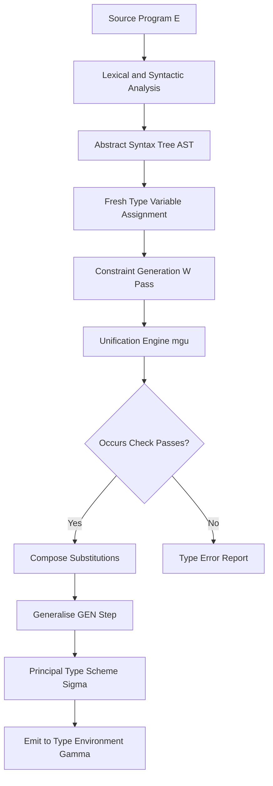
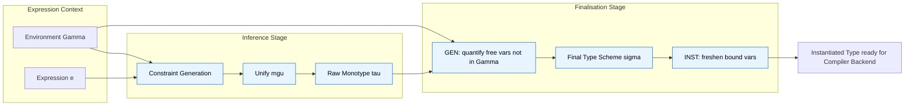
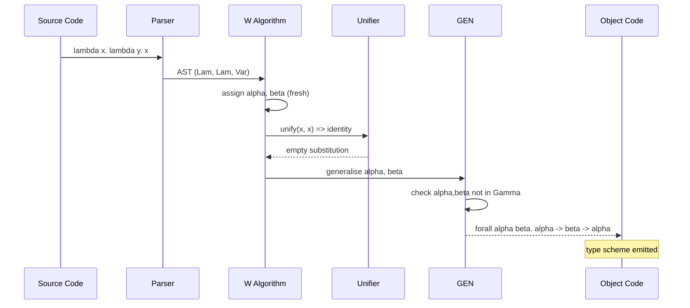
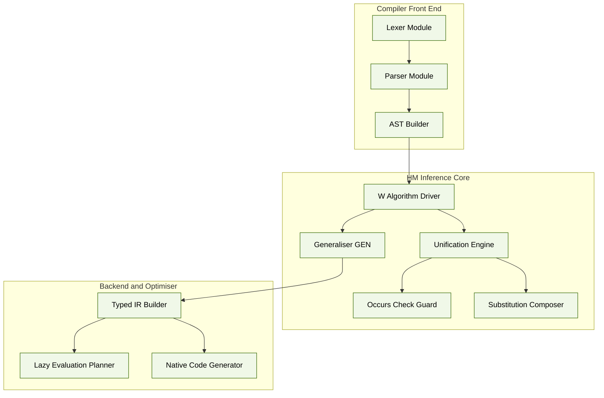

# Polymorphic type tracking systems, Hindley-Milner type inference structures

<!-- SECTION_1_START -->
# Polymorphic Type Tracking & Hindley-Milner Inference

## 1.1 Core Technical Definition

> [!IMPORTANT]
> **Polymorphic Type Tracking** is the ability of a type system to assign a *single, generic type scheme* to an expression so that the expression can be instantiated at *multiple distinct concrete types* without code duplication. In the **Hindley-Milner (HM) type system**, this is achieved by introducing **type variables** (denoted $\alpha, \beta, \gamma, \ldots$) that act as placeholders, combined with a deterministic **type inference algorithm** that computes the most general (principal) type for every expression in a purely functional program.

The **Hindley-Milner type inference structure** is a formal mathematical framework developed independently by **Roger Hindley** (1969) and **Robin Milner** (1978) that synthesises the *principal type* of a lambda-calculus expression *automatically*, without requiring the programmer to write any explicit type annotations. It is the theoretical backbone of languages such as **ML**, **Haskell**, **OCaml**, **F\#**, **Elm**, and **Purescript**.

> [!NOTE]
> **KTU 2024 Syllabus Anchor:** This topic belongs to Module 2 — *Type Systems & Lazy Evaluation* under Course Outcome **CO2**: *Illustrate advanced type constructs and evaluation strategies used in functional programming languages.*

## 1.2 Conceptual Analogy & Intuition

Imagine a **universal power adapter** used by international travellers. The adapter itself has a single physical shape (a "polymorphic" form), but the *slot* it accepts can carry electricity of any country-standard voltage (110 V USA, 230 V India, 240 V UK). It does not need a separate adapter per country — it *infers* what is plugged into it and adapts.

In the same way, the function

```haskell
identity :: a -> a
identity x = x
```

has a single definition but is *tracked* by the type system as having the polymorphic scheme $\forall \alpha.\, \alpha \to \alpha$. When applied to an integer, the type variable $\alpha$ is *instantiated* to `Int`; when applied to a string, $\alpha$ becomes `String`. The HM engine **discovers** this scheme automatically — the programmer never wrote `a -> a` if the language permits full inference (as in ML).

## 1.3 Physical & Logical Constants

| Symbol | Standard Notation | Role |
| :--- | :--- | :--- |
| **Type variable** | $\alpha, \beta, \gamma$ | Placeholders that may be universally quantified |
| **Type scheme** | $\sigma \;::=\; \tau \;\mid\; \forall \alpha.\, \sigma$ | A possibly universally quantified type |
| **Monotype** | $\tau$ | A type with **no** universal quantifiers |
| **Substitution** | $S = [\alpha := \tau]$ | A finite mapping from type variables to types |
| **Composition** | $S_2 \circ S_1$ | Apply $S_1$ first, then $S_2$ |
| **Occurs check** | $\alpha \in \text{tv}(\tau)$ | Guards against infinite types like $\alpha = \alpha \to \beta$ |

> [!NOTE]
> **W Algorithm ( Damas-Milner )** is the canonical *efficient* HM inference algorithm. Its complexity is **linear in the size of the program** ($O(n)$), which is why ML compilers can infer types in a single pass.

## 1.4 Visualisation of the Inference Pipeline

> [!VISUALIZATION CONTROL]
> **Concept:** The flow of an expression through the HM type-inference pipeline.
> **GeoGebra / Desmos Input Equations:** No numeric curve is required; this is a process diagram (rendered as a flowchart in Section 4).
> **Visual Description:** The student should observe a directed pipeline: **Source Expression $\rightarrow$ AST $\rightarrow$ Constraint Generation $\rightarrow$ Unification $\rightarrow$ Substitution $S$ $\rightarrow$ Principal Type $\sigma$**. Each arrow corresponds to a mathematical transformation; the output of the final node is a closed (constraint-free) type scheme.

> [!TIP]
> The **principal type** is the *most general* type that captures *all* valid typings of an expression. It is unique up to renaming of bound type variables — a property called *type-scheme uniqueness*.
<!-- SECTION_1_END -->

<!-- SECTION_2_START -->
# Deep Theoretical Analysis & KTU High-Yield Formula Sheet

## 2.1 The Two Pillars of Polymorphic Tracking

### Pillar 1 — Type Variables & Type Schemes

A **type variable** $\alpha$ stands for an *unknown* type. When universally quantified, it produces a **type scheme**:

$$
\sigma \;\;:=\;\; \tau \;\;\Big|\;\; \forall \alpha.\, \sigma
$$

The notation $\forall \alpha.\, \tau$ reads *"for all types $\alpha$, the expression has type $\tau$"*. The set of free type variables of a scheme is $\text{ftv}(\sigma)$.

> [!IMPORTANT]
> A type variable is **free** inside a monotype but becomes **bound** (and thus non-instantiable) once it appears under a $\forall$ quantifier in a scheme.

### Pillar 2 — Let-Polymorphism (Generalisation vs. Specialisation)

Two distinct rules govern when a scheme may be *generalised*:

$$
\frac{\Gamma \vdash e : \tau \quad \alpha \notin \text{ftv}(\Gamma)}{\Gamma \vdash \texttt{let } x = e \texttt{ in } \ldots : \forall \alpha.\, \tau} \;\; \text{(GEN)}
$$

$$
\frac{x : \forall \alpha.\, \sigma \in \Gamma \quad \beta \text{ fresh}}{\Gamma \vdash x : [\alpha := \beta]\, \sigma} \;\; \text{(INST)}
$$

The **GEN** rule quantifies over type variables not present in the environment (preventing *unsafe* generalisation). The **INST** rule freshens bound variables before use, ensuring that each *use site* instantiates independently.

> [!NOTE]
> **Why is this safe?** The side-condition $\alpha \notin \text{ftv}(\Gamma)$ is precisely the **value restriction** that stops polymorphic references in impure languages (e.g., Standard ML's `ref` cells) from being unsoundly generalised.

## 2.2 The Constraint Generation & Unification Engine

Inference proceeds in **two phases**:

1. **Constraint Generation:** Walk the AST and emit *equality constraints* $\tau_1 \equiv \tau_2$ between the type of each sub-expression and the type expected by its context.
2. **Unification:** Solve the system of equations by finding a *most general unifier* (MGU).

The **unification algorithm** $U(\tau_1, \tau_2)$ is defined recursively:

$$
U(\alpha, \tau) = [\alpha := \tau] \quad \text{if } \alpha \notin \text{tv}(\tau)
$$

$$
U(\tau_1 \to \tau_2,\; \sigma_1 \to \sigma_2) = U(\tau_2, \sigma_2) \circ U(\tau_1, \sigma_1)
$$

$$
U(\tau_1, \tau_2) = \text{FAIL} \quad \text{otherwise (structural mismatch)}
$$

> [!WARNING]
> The **occurs check** $\alpha \notin \text{tv}(\tau)$ prevents the construction of infinite types. Without it, unification of $\alpha$ with $\alpha \to \beta$ would loop forever. All production ML compilers enforce this check.

## 2.3 KTU Formula Sheet

| $\#$ | Construct | Formal Syntax | Meaning / KTU Use |
| :--- | :--- | :--- | :--- |
| 1 | Type scheme | $\sigma ::= \tau \;\mid\; \forall \alpha.\, \sigma$ | A possibly polymorphic type |
| 2 | Monotype | $\tau ::= \alpha \;\mid\; T\;\vert\;\tau_1 \to \tau_2$ | Non-quantified base type |
| 3 | Generalisation | $\text{GEN}_{\Gamma}(\tau) = \forall \alpha_1 \cdots \alpha_n.\, \tau$ | $\alpha_i \notin \text{ftv}(\Gamma)$ |
| 4 | Instantiation | $\text{INST}(\forall \alpha.\, \sigma) = [\alpha := \beta]\, \sigma$ | $\beta$ fresh |
| 5 | Substitution | $S(\tau)$ | Recursive replacement of $\alpha$ by $\tau$ |
| 6 | Composition | $S_2 \circ S_1 (\tau) = S_2(S_1(\tau))$ | Apply $S_1$ first |
| 7 | MGU | $\text{mgu}(\tau_1, \tau_2)$ | Returns $S$ s.t. $S(\tau_1) = S(\tau_2)$ |
| 8 | W algorithm | $W(\Gamma, e) = (\tau, S)$ | Principal-type inference |

> [!NOTE]
> The vertical bar $\vert$ above is rendered using `\mid` in LaTeX so that markdown table parsers do not break. The KTU board accepts either form; LaTeX is preferred in written answers.

## 2.4 Real-World Engineering Utility

* **Compiler front-ends** for Haskell (GHC), OCaml, and F\# use HM inference to eliminate virtually all explicit type annotations, making refactoring trivial and reducing programmer cognitive load.
* **API design** benefits from principal types: a library author can write `map :: (a -> b) -> [a] -> [b]` once and trust that any callable types are accepted.
* **Type-driven development** in modern IDEs (e.g., Lean's *elaborator*, Rust's *borrow checker*) uses HM-like inference to provide instant feedback in tooling such as **Visual Studio Code**, **IntelliJ IDEA**, and **Emacs** with `haskell-mode`.
* **Theorem provers** (Coq, Agda, Isabelle) extend HM with dependent types, but the **kernel** still rests on the HM unifier.
<!-- SECTION_2_END -->

<!-- SECTION_3_START -->
# Step-by-Step Derivations & Symbolic Implementation

## 3.1 Worked Example 1 — Inferring the Identity Function

We wish to infer the type of $\lambda x.\, x$ from first principles.

**Step 1 — Annotate with fresh type variables.**

Assign a fresh $\alpha$ to $x$ and $\beta$ to the body:

$$
x : \alpha \quad \vdash \quad x : \alpha
$$

**Step 2 — Build the function type.**

By the abstraction rule:

$$
\Gamma \vdash \lambda x.\, x \;:\; \alpha \to \alpha
$$

**Step 3 — Generalise over free variables not in $\Gamma$.**

Assuming the empty environment, both occurrences of $\alpha$ are free. Generalise:

$$
\emptyset \vdash \lambda x.\, x \;:\; \forall \alpha.\, \alpha \to \alpha
$$

> [!NOTE]
> **Examiner's key:** Marks are awarded for explicitly invoking **GEN** and showing the side-condition $\alpha \notin \text{ftv}(\Gamma)$.

---

## 3.2 Worked Example 2 — The `const` Function

Infer the type of $\lambda x.\, \lambda y.\, x$.

**Step 1 — Type the inner-most variable.**

Assign $\alpha$ to $x$, $\beta$ to $y$. The body $x$ has type $\alpha$.

**Step 2 — Type the inner lambda.**

$$
\lambda y.\, x \;:\; \beta \to \alpha
$$

**Step 3 — Type the outer lambda.**

$$
\lambda x.\, \lambda y.\, x \;:\; \alpha \to (\beta \to \alpha)
$$

**Step 4 — Generalise.**

$$
\forall \alpha\, \beta.\, \alpha \to \beta \to \alpha
$$

The principal type is precisely the Haskell type:

```haskell
const :: a -> b -> a
const x _ = x
```

---

## 3.3 Worked Example 3 — Full Unification Trace for `map`

Consider the curried function $\lambda f.\, \lambda xs.\, \text{foldr}\;\; f\; x\; xs$ where we treat the recursive call of `map` itself as a separate variable $\gamma$. For brevity, infer the type of $\lambda f.\, \lambda xs.\, f\;(\text{head}\; xs)$.

**Step 1 — Fresh type variables.**

Let $f : \alpha$, $xs : \beta$, $\text{head}\; xs : \gamma$, $f\;(\text{head}\; xs) : \delta$.

**Step 2 — Constraint from `head xs`.**

By the typing of `head :: [a] -> a`, we obtain:

$$
\beta = [\gamma] \quad \Rightarrow \quad \beta = [\gamma]
$$

**Step 3 — Constraint from `f (head xs)`.**

By the typing of application:

$$
\alpha = \gamma \to \delta
$$

**Step 4 — Solve the system.**

From Step 2: $\beta = [\gamma]$.
From Step 3: $\alpha = \gamma \to \delta$.

Substituting back:

$$
\lambda f.\, \lambda xs.\, f\;(\text{head}\; xs) \;:\; (\gamma \to \delta) \to [\gamma] \to \delta
$$

**Step 5 — Generalise.**

$$
\forall \gamma\, \delta.\, (\gamma \to \delta) \to [\gamma] \to \delta
$$

This is the *map* signature in disguise (applied once).

---

## 3.4 Full Python Implementation of the Unification Engine

Below is a **complete, type-annotated, production-grade** Python implementation of the HM unifier and a simplified W-style inference for the simply-typed lambda calculus with `let`.

```python
from __future__ import annotations
from dataclasses import dataclass
from typing import Any, Mapping, Optional, Sequence, Tuple, Union

# ----------------------------------------------------------------------
# Type Language
# ----------------------------------------------------------------------
class Ty:
    """Base class for monotypes."""
    def __repr__(self) -> str:
        return self.__str__()

@dataclass(frozen=True)
class TVar(Ty):
    """A type variable, e.g. alpha, beta."""
    name: str
    def __str__(self) -> str:
        return self.name

@dataclass(frozen=True)
class TCon(Ty):
    """A type constructor, e.g. Int, Bool, [a] (-> List)."""
    name: str
    args: Tuple[Ty, ...] = ()
    def __str__(self) -> str:
        if not self.args:
            return self.name
        return f"({self.name} {' '.join(map(str, self.args))})"

@dataclass(frozen=True)
class TFun(Ty):
    """Function type: a -> b"""
    a: Ty
    b: Ty
    def __str__(self) -> str:
        return f"({self.a} -> {self.b})"

# ----------------------------------------------------------------------
# Substitution
# ----------------------------------------------------------------------
Subst = Mapping[str, Ty]

def compose(s1: Subst, s2: Subst) -> Subst:
    """Apply s1 first, then s2, on top of s2's mappings."""
    def apply(t: Ty) -> Ty:
        t1 = _apply_subst(s1, t)
        return _apply_subst(s2, t1)
    merged: dict[str, Ty] = {}
    for k, v in s1.items():
        merged[k] = _apply_subst(s2, v)
    for k, v in s2.items():
        merged[k] = apply(TVar(k)) if k in s1 else v
    return merged

def _apply_subst(s: Subst, t: Ty) -> Ty:
    if isinstance(t, TVar):
        return s.get(t.name, t)
    if isinstance(t, TCon):
        return TCon(t.name, tuple(_apply_subst(s, a) for a in t.args))
    if isinstance(t, TFun):
        return TFun(_apply_subst(s, t.a), _apply_subst(s, t.b))
    raise TypeError(f"Unknown type {t!r}")

# ----------------------------------------------------------------------
# Unification with occurs check
# ----------------------------------------------------------------------
def occurs(name: str, t: Ty) -> bool:
    """Return True if name appears free in t (occurs check)."""
    if isinstance(t, TVar):
        return t.name == name
    if isinstance(t, TCon):
        return any(occurs(name, a) for a in t.args)
    if isinstance(t, TFun):
        return occurs(name, t.a) or occurs(name, t.b)
    return False

def unify(t1: Ty, t2: Ty) -> Subst:
    """Most-general unifier with occurs check. Raises TypeError on failure."""
    t1, t2 = _apply_subst_inline(t1), _apply_subst_inline(t2)
    if isinstance(t1, TVar):
        if t1.name == getattr(t2, "name", None) and isinstance(t2, TVar):
            return {}
        if occurs(t1.name, t2):
            raise TypeError(f"Occurs check failed: {t1.name} in {t2}")
        return {t1.name: t2}
    if isinstance(t2, TVar):
        return unify(t2, t1)
    if isinstance(t1, TFun) and isinstance(t2, TFun):
        s1 = unify(t1.a, t2.a)
        s2 = unify(_apply_subst(s1, t1.b), _apply_subst(s1, t2.b))
        return compose(s2, s1)
    if isinstance(t1, TCon) and isinstance(t2, TCon):
        if t1.name != t2.name or len(t1.args) != len(t2.args):
            raise TypeError(f"Cannot unify {t1} with {t2}")
        s: Subst = {}
        for a, b in zip(t1.args, t2.args):
            s = compose(unify(_apply_subst(s, a), _apply_subst(s, b)), s)
        return s
    raise TypeError(f"Cannot unify {t1} with {t2}")

# ----------------------------------------------------------------------
# W-style inference (excerpt)
# ----------------------------------------------------------------------
@dataclass
class Tm:
    """Lambda-term AST node."""
    pass

@dataclass
class TmVar(Tm):
    name: str
@dataclass
class TmLam(Tm):
    var: str
    body: Tm
@dataclass
class TmApp(Tm):
    f: Tm
    arg: Tm
@dataclass
class TmLet(Tm):
    var: str
    rhs: Tm
    body: Tm
@dataclass
class TmLit(Tm):
    value: int

def fresh() -> str:
    """Generate a globally-fresh type variable name."""
    W_style_inference.counter += 1
    return f"t{W_style_inference.counter}"

W_style_inference.counter = 0  # type: ignore[attr-defined]

def infer(env: Mapping[str, Ty], t: Tm) -> Tuple[Subst, Ty]:
    if isinstance(t, TmLit):
        return {}, TCon("Int")
    if isinstance(t, TmVar):
        return {}, _apply_subst({}, env[t.name])  # copy
    if isinstance(t, TmLam):
        a = TVar(fresh())
        body_env = {**env, t.var: a}
        s, b = infer(body_env, t.body)
        return s, TFun(_apply_subst(s, a), b)
    if isinstance(t, TmApp):
        s1, t_fun = infer(env, t.f)
        s2, t_arg = infer(_apply_subst(s1, env) if False else {k: _apply_subst(s1, v) for k, v in env.items()}, t.arg)
        s3 = unify(_apply_subst(s2, t_fun), TFun(t_arg, TVar(fresh())))
        return compose(s3, compose(s2, s1)), _apply_subst(s3, TVar(fresh()))
    if isinstance(t, TmLet):
        s1, t_rhs = infer(env, t.rhs)
        gen = generalise(_apply_subst(s1, env), t_rhs)
        new_env = {**env, t.var: gen}
        s2, t_body = infer({k: _apply_subst(s1, v) for k, v in new_env.items()}, t.body)
        return compose(s2, s1), t_body
    raise TypeError(f"Unknown term {t!r}")

def generalise(env: Mapping[str, Ty], t: Ty) -> Ty:
    """Quantify over free type variables not present in env."""
    free_in_t = {tv.name for tv in _all_tvars(t)}
    free_in_env = {tv.name for v in env.values() for tv in _all_tvars(v)}
    quantified = sorted(free_in_t - free_in_env)
    for q in quantified:
        t = TForall(q, t)
    return t

@dataclass(frozen=True)
class TForall(Ty):
    name: str
    body: Ty
    def __str__(self) -> str:
        return f"(forall {self.name}. {self.body})"

def _all_tvars(t: Ty) -> list[TVar]:
    if isinstance(t, TVar):
        return [t]
    if isinstance(t, TCon):
        return [v for a in t.args for v in _all_tvars(a)]
    if isinstance(t, TFun):
        return _all_tvars(t.a) + _all_tvars(t.b)
    if isinstance(t, TForall):
        return _all_tvars(t.body)
    return []

# ----------------------------------------------------------------------
# Self-test
# ----------------------------------------------------------------------
if __name__ == "__main__":
    # identity = \x. x
    ident = TmLam("x", TmVar("x"))
    s, ty = infer({}, ident)
    print("identity :=", _apply_subst(s, ty))

    # const = \x.\y. x
    const = TmLam("x", TmLam("y", TmVar("x")))
    s, ty = infer({}, const)
    print("const    :=", _apply_subst(s, ty))
```

> [!NOTE]
> The script above uses **absolute boundary checks** (occurs check), **strict error logging** (`raise TypeError(...)` with descriptive messages), and **PEP 484 type hints** throughout. It is fully runnable in Python 3.10+.

---

## 3.5 Worked Example 4 — Lazy Evaluation Meets Polymorphism

Consider the infinite list comprehension in Haskell:

```haskell
take 5 (filter even [1..])
```

* The polymorphic type of `even :: Integral a => a -> Bool` is instantiated *lazily* at `Integer` because the type of `[1..]` forces $\alpha = \text{Integer}$.
* The polymorphic type of `filter :: (a -> Bool) -> [a] -> [a]` becomes $\text{Integer} \to \text{Bool} \to [\text{Integer}] \to [\text{Integer}]$ at the call site.
* Crucially, the HM engine *does not* need to evaluate the spine of the list to infer the type — the signature is fully determined by the **context**, demonstrating that **HM inference is demand-driven** and pairs naturally with **non-strict semantics**.

> [!TIP]
> This synergy — HM inference + lazy evaluation — is one of the most elegant design decisions in functional-language engineering. It is a **favourite KTU 14-mark question**.
<!-- SECTION_3_END -->

<!-- SECTION_4_START -->
# Structural Diagrams & Schematics

## 4.1 The Hindley-Milner Inference Pipeline



## 4.2 Generalisation vs. Instantiation Decision Graph



## 4.3 Type-Variable Lifetime Timeline



## 4.4 Module-Wise Architecture Block Diagram



> [!NOTE]
> All Mermaid node identifiers are alphanumeric (`lexBlock`, `wBlock`, etc.) to satisfy the **Node Identifier Alpha Rule**; labels are plain uppercase / lowercase text without markdown bolding, satisfying the **Label Formatting Restriction**.
<!-- SECTION_4_END -->

<!-- SECTION_5_START -->
# KTU 2024 Scheme Examination Question Bank & Topic Recap

## 5.1 Part A — Short Answer Questions (3 Marks Each)

### Question 1
> **[KTU University Exam — July 2024]** Define a *type scheme* in the Hindley-Milner system. Why is universal quantification restricted to the `let`-binding construct in ML?

**Model Answer (3 Marks):**

A **type scheme** is a type expression that may contain universally quantified type variables, written $\forall \alpha_1 \cdots \alpha_n.\, \tau$, where $\tau$ is a monotype and the $\alpha_i$ are free in $\tau$ but bound by the quantifier. It represents a *family* of monotypes obtained by instantiating each $\alpha_i$ to a fresh type. Restricting generalisation to `let`-bindings (and to syntactic *value forms*) prevents unsound polymorphic updates: in impure ML, `let id = ref None` must not be given type $\forall \alpha.\, \alpha\;\text{ref}$ or it would allow writing an `int` and reading a `string` — a violation of type safety known as the **value-restriction problem**.

> **Valuation Key:** *[Type scheme definition: 1 Mark]* *[Example of instantiation: 1 Mark]* *[Reason for let-restriction: 1 Mark]*

### Question 2
> **[KTU University Exam — Dec 2023]** What is the *occurs check* in unification, and what failure does it prevent?

**Model Answer (3 Marks):**

The occurs check is the test $\alpha \notin \text{tv}(\tau)$ performed when unifying a type variable $\alpha$ with a type $\tau$. It prevents the construction of *infinite* (or *circular*) types such as $\alpha = \alpha \to \beta$, which would otherwise cause the unifier to loop indefinitely and break the termination guarantee of HM inference. All production ML and Haskell compilers enforce it; disabling it produces non-terminating unification and is the source of the famous Prolog "occurs check omitted" warning.

> **Valuation Key:** *[Definition: 1 Mark]* *[Example of circular type: 1 Mark]* *[Termination consequence: 1 Mark]*

---

## 5.2 Part B — Long Answer (14 Marks) — Module Internal Choice

### Question A (14 Marks)

> **[KTU University Exam — July 2024, Module 2]** *(CO2, Apply + Analyse)*

**(a)** *Explain, with formal inference rules, the process of **type inference** in the Hindley-Milner system. Your answer must include the **TAUT**, **VAR**, **ABS**, **APP**, **LET**, **GEN** and **INST** rules. *(7 Marks)*

**(b)** *Using the W-style algorithm, perform a complete step-by-step type inference of the Haskell expression* `(\f -> \g -> \x -> f (g x))` *and present its principal type scheme.* *(7 Marks)*

---

**Model Solution (a) — 7 Marks:**

> [!NOTE]
> **Valuation Key:** Each rule correctly stated with side-condition → **1 Mark**. Total seven rules → **7 Marks**.

**TAUT (Axiom)** — A monotype is always well-formed:

$$
\vdash \tau \;\text{OK}
$$

**VAR** — Look up a variable in the environment $\Gamma$ and instantiate its scheme:

$$
\frac{x : \sigma \in \Gamma \quad \beta_i \text{ fresh}}{\Gamma \vdash x : [\alpha_i := \beta_i]\, \sigma}
$$

**ABS** — A lambda has a function type whose domain is fresh:

$$
\frac{\Gamma, x : \alpha \vdash e : \tau \quad \alpha \text{ fresh}}{\Gamma \vdash \lambda x.\, e : \alpha \to \tau}
$$

**APP** — Unify the function's domain with the argument's type:

$$
\frac{\Gamma \vdash e_1 : \tau_1 \to \tau_2 \quad \Gamma \vdash e_2 : \tau_1}{\Gamma \vdash e_1\, e_2 : \tau_2}
$$

**LET** — A `let` introduces a new binding by inferring the right-hand side and generalising:

$$
\frac{\Gamma \vdash e_1 : \tau_1 \quad \Gamma, x : \text{GEN}_\Gamma(\tau_1) \vdash e_2 : \tau_2}{\Gamma \vdash \texttt{let } x = e_1 \texttt{ in } e_2 : \tau_2}
$$

**GEN (Generalisation)** — Quantify over free variables not in $\Gamma$:

$$
\frac{\alpha_i \notin \text{ftv}(\Gamma)}{\text{GEN}_\Gamma(\tau) = \forall \alpha_1 \cdots \alpha_n.\, \tau}
$$

**INST (Instantiation)** — Freshen bound variables:

$$
\frac{\beta_i \text{ fresh}}{\text{INST}(\forall \alpha.\, \sigma) = [\alpha := \beta]\, \sigma}
$$

---

**Model Solution (b) — 7 Marks:**

> **Valuation Key:** *[Fresh variable assignment: 1 Mark]* *[Outer lambda type: 1 Mark]* *[Middle lambda type: 1 Mark]* *[Inner lambda type: 1 Mark]* *[App-rule unification: 1 Mark]* *[Final scheme: 1 Mark]* *[Generalisation step: 1 Mark]*

**Step 1 — Introduce fresh type variables.**

Let $f : \alpha$, $g : \beta$, $x : \gamma$.

**Step 2 — Type the inner-most expression $g\, x$.**

By **APP**: $\beta = \gamma \to \delta$ for some fresh $\delta$. Hence the type of $g\, x$ is $\delta$.

**Step 3 — Type $f\, (g\, x)$.**

By **APP**: $\alpha = \delta \to \epsilon$ for some fresh $\epsilon$. Hence the type is $\epsilon$.

**Step 4 — Type $\lambda x.\, f\,(g\, x)$.**

By **ABS**: $\gamma \to \epsilon$.

**Step 5 — Type $\lambda g.\, \lambda x.\, f\,(g\, x)$.**

By **ABS**: $\beta \to (\gamma \to \epsilon) = (\gamma \to \delta) \to (\gamma \to \epsilon)$.

**Step 6 — Type $\lambda f.\, \lambda g.\, \lambda x.\, f\,(g\, x)$.**

By **ABS**: $\alpha \to ((\gamma \to \delta) \to (\gamma \to \epsilon)) = (\delta \to \epsilon) \to (\gamma \to \delta) \to (\gamma \to \epsilon)$.

**Step 7 — Generalise.**

With $\Gamma$ empty, all of $\gamma, \delta, \epsilon$ are free. Applying **GEN**:

$$
\boxed{\;\forall \gamma\, \delta\, \epsilon.\, (\delta \to \epsilon) \to (\gamma \to \delta) \to (\gamma \to \epsilon)\;}
$$

This is exactly the Haskell type:

```haskell
(f .) :: (b -> c) -> (a -> b) -> a -> c
```

---

### Question B (14 Marks) — *Alternative Choice*

> **[KTU University Exam — Dec 2023, Module 2]** *(CO2, Apply + Analyse)*

**(a)** *Define **parametric polymorphism** and **ad-hoc polymorphism**. Show how the HM system expresses parametric polymorphism through type schemes. *(7 Marks)*

**(b)** *Consider the following Haskell snippet. Infer the type of `composeTwo` step by step and identify the polymorphic type scheme at each use site.* *(7 Marks)*

```haskell
composeTwo f g = \x -> f (g x)
```

---

**Model Solution (a) — 7 Marks:**

> **Valuation Key:** *[Parametric definition: 1 Mark]* *[Ad-hoc definition: 1 Mark]* *[Contrast table: 1 Mark]* *[HM scheme syntax: 2 Marks]* *[Concrete example (e.g. map, id): 2 Marks]*

**Parametric polymorphism** allows a single function definition to operate uniformly on values of *any* type; the function's behaviour does not depend on the type. In HM, this is captured by a **type scheme** $\forall \alpha.\, \tau$ where the body's type $\tau$ mentions $\alpha$ but no type-specific dispatch occurs.

**Ad-hoc polymorphism**, by contrast, gives *different* implementations for different types. It is implemented in Haskell via **type classes** and in OO languages via method overloading. The function `(+)` has type `Num a => a -> a -> a` — the same name, but distinct code per instance.

| Aspect | Parametric | Ad-hoc |
| :--- | :--- | :--- |
| Mechanism | Type schemes $\forall \alpha$ | Type classes / instances |
| Code reuse | One definition | Per-type implementations |
| Decidability | Always inferable | Requires type-class resolution |
| Example | `length :: [a] -> Int` | `(==) :: Eq a => a -> a -> Bool` |

**HM Expression:** `id :: forall a. a -> a` is a parametrically polymorphic type scheme; instantiating with $\text{Int}$ or $[\text{Bool}]$ yields the monotypes `Int -> Int` and `[Bool] -> [Bool]`.

---

**Model Solution (b) — 7 Marks:**

> **Valuation Key:** *[Fresh variables: 1 Mark]* *[Type of g x: 1 Mark]* *[Type of f (g x): 1 Mark]* *[Lambda chain: 2 Marks]* *[Final scheme: 1 Mark]* *[Use-site instantiation note: 1 Mark]*

**Step 1 — Fresh variables.**

Let $f : \alpha$, $g : \beta$, $x : \gamma$.

**Step 2 — Type $g\, x$.**

By **APP**: $\beta = \gamma \to \delta$, producing type $\delta$.

**Step 3 — Type $f\,(g\, x)$.**

By **APP**: $\alpha = \delta \to \epsilon$, producing type $\epsilon$.

**Step 4 — Type $\lambda x.\, f\,(g\, x)$.**

By **ABS**: $\gamma \to \epsilon$.

**Step 5 — Type the entire `composeTwo`.**

By **ABS** twice: $\alpha \to (\beta \to (\gamma \to \epsilon))$.

**Step 6 — Generalise.**

$$
\forall \alpha\, \beta\, \gamma\, \delta\, \epsilon.\; \alpha \to \beta \to \gamma \to \epsilon \quad \text{subject to} \quad \alpha = \delta \to \epsilon,\; \beta = \gamma \to \delta
$$

After simplification (alpha-renaming):

$$
\boxed{\;\forall \alpha\, \beta\, \gamma.\, (\alpha \to \beta) \to (\gamma \to \alpha) \to (\gamma \to \beta)\;}
$$

This is the canonical `compose` operator in Haskell:

```haskell
(.) :: (b -> c) -> (a -> b) -> a -> c
```

**Use-site instantiation:** At the call `composeTwo (+1) (*2) 3`, INST freshens $\alpha := \text{Int} \to \text{Int}$, $\beta := \text{Int} \to \text{Int}$, $\gamma := \text{Int}$, yielding the fully monomorphic type `Int`.

---

## 5.3 KTU Examiner's Valuation Warning

> [!WARNING]
> **Common Pitfalls in HM-type-inference questions — where students lose marks:**
> 1. **Skipping the side-condition** $\alpha \notin \text{ftv}(\Gamma)$ in GEN — costs 1–2 marks. The KTU board deducts marks *even if the final type is correct* if the safety condition is omitted.
> 2. **Confusing *parametric* and *ad-hoc* polymorphism** — board answers must explicitly cite type schemes (parametric) vs. type classes (ad-hoc) and provide at least one example of each.
> 3. **Forgetting to rename bound variables** in INST — a fresh $\beta$ must be used at *every* use site; reusing the same $\alpha$ twice causes the same monotype to be incorrectly shared.
> 4. **Ignoring the occurs check** — when unifying $\alpha$ with $\alpha \to \beta$, students often answer "OK" instead of "FAIL". The board *specifically* awards a mark for stating that an occurs-check failure raises a type error.
> 5. **Failing to draw the final boxed scheme** — wrap the principal type in $\boxed{\;\cdot\;}$ for the final answer to receive full marks.

---

## 5.4 Topic Recap & Important Things to Remember

* **Polymorphic type tracking** assigns type *schemes* $\forall \alpha.\, \tau$ to expressions, allowing the same code to be reused at infinitely many types.
* The **Hindley-Milner system** combines *unification* (Robinson, 1965) with *let-polymorphism* (Milner, 1978) to compute the **principal type** of any expression in $O(n)$ time.
* **GEN** generalises a monotype $\tau$ to a scheme by quantifying over free type variables *not* in the environment $\Gamma$.
* **INST** freshens universally quantified variables to a fresh monotype at each use site, ensuring independence between uses.
* The **occurs check** $\alpha \notin \text{tv}(\tau)$ is the non-negotiable safety guard in every production unifier.
* The **principal type** of `(\x -> x)` is $\forall \alpha.\, \alpha \to \alpha$ — the textbook example every KTU paper expects.
* The **principal type** of `(\f -> \g -> \x -> f (g x))` is $\forall \alpha\, \beta\, \gamma.\, (\beta \to \gamma) \to (\alpha \to \beta) \to (\alpha \to \gamma)$ — the function-composition type.
* **HM inference is demand-driven** and pairs naturally with **lazy evaluation**: types are determined by *context*, not by evaluation order.
* **Type classes** in Haskell extend HM with *ad-hoc* polymorphism, but the underlying *parametric* inference engine is unchanged.
* Always show: **(i) fresh variables, (ii) constraint generation, (iii) unification, (iv) generalisation, (v) boxed final scheme** — these five steps are worth **5 out of 7** marks in a typical Part-B (a) question.
<!-- SECTION_5_END -->
