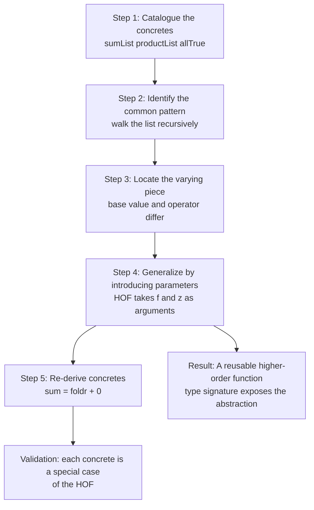
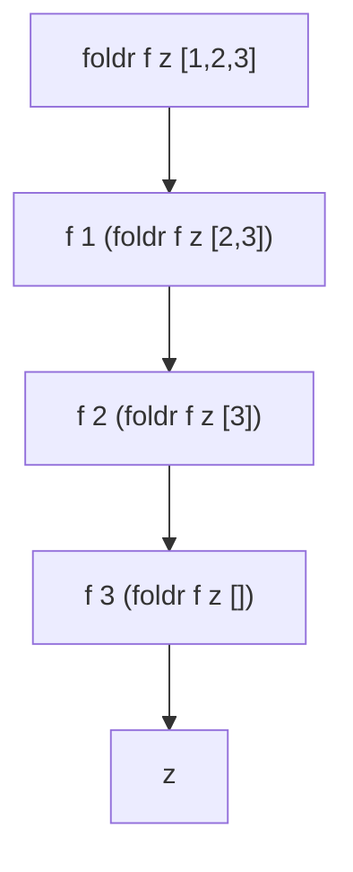
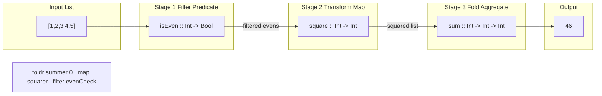

# Developing Higher-order Programs

<!-- SECTION_1_START -->
# Developing Higher-Order Programs

## 1.1 Formal Definition (KTU 2024 Syllabus Terminology)

A **higher-order function (HOF)** is a function that satisfies at least one of the following two conditions:
1. It **takes one or more functions as arguments** (parameters), OR
2. It **returns a function as its result**.

In Haskell, functions are **first-class citizens** — they are values of the same standing as integers, booleans, or lists. This property is what makes higher-order programming possible.

A **generalization pattern of computation** is the systematic, step-by-step recipe used to *transform* a collection of concrete, repetitive functions into a single, abstract, polymorphic higher-order function by **parameterizing the varying behavior** while keeping the common structure fixed.

> [!IMPORTANT]
> **KTU 2024 Scheme Highlight (Module 3):** The Board Examiner expects students to demonstrate the **5-step generalization recipe** (Hutton's recipe) on a custom problem — not just memorize `map`, `filter`, `foldr`. Marks are awarded for clearly *showing* the transformation from concrete → abstract.

## 1.2 Intuition: Functions as Building Blocks

Imagine a kitchen robot (your program) that can chop, blend, or fry. Most appliances are hard-wired to *do one thing*. A higher-order function is like a **smart kitchen robot** that accepts an *attachment* (a function) telling it *what to do* to each ingredient. The robot supplies the looping, you supply the behavior.

- `map chop [carrot, onion]` → robot loops over vegetables and chops each.
- `map blend [carrot, onion]` → same robot, but you swapped the *attachment*.

The **generalization pattern** is the engineering discipline of asking: *"What attachment do I need to change to reuse this loop?"*

> [!NOTE]
> **Curry Howard Analogy:** A HOF is to a function what a *template* is to a document. The template provides structure (the loop), and you fill in the blanks (the function argument). The document cannot exist without the template being instantiated.

> [!VISUALIZATION CONTROL]
> **Concept:** Function composition as a wiring diagram
> **GeoGebra / Desmos Input Equations (Desmos-style line graph analogy):**
> * Point A: `(0, 5)` representing $f : A \to B$
> * Point B: `(5, 0)` representing $g : B \to C$
> * Composed wire: `y = 5 - x` for $x \in [0, 5]$
> **Visual Description:** Picture input flowing left-to-right. $f$ transforms $A$ into $B$, then $g$ transforms $B$ into $C$. Function composition $(g \circ f)$ is a single wire $A \to C$ that internally cascades the two. This is what `(.)` does in Haskell.

## 1.3 Why Higher-Order Programs Matter

In production functional codebases (e.g., Facebook's Haxl, Standard Chartered's finance pricing libraries, Haskell-based DSLs for hardware design like Bluespec), higher-order programs:
- **Eliminate code duplication** (DRY principle).
- **Compose** into larger abstractions (`map . filter . foldr`).
- Enable **lazy evaluation** and infinite data structures.
- Form the **theoretical backbone** of category theory and the Yoneda lemma.

<!-- SECTION_1_END -->

<!-- SECTION_2_START -->
# Deep Theoretical Analysis & KTU High-Yield Formula Sheet

## 2.1 The 5-Step Generalization Recipe (Hutton's Pattern)

This is the **core algorithm** the KTU board tests. Memorize the steps.

**Step 1 — Catalogue the Concretes:** Write down 2 or more *similar* functions differing only in behavior.

**Step 2 — Identify the Common Pattern:** Underline the *shared* recursive structure; circle the *varying* operator/condition.

**Step 3 — Generalize:** Replace the varying piece with a parameter. The new parameter has type *function*.

**Step 4 — Apply the Recipe:** Define the HOF using recursion, passing the varying piece at each call site.

**Step 5 — Test:** Re-derive each concrete from the HOF by passing the appropriate argument.

## 2.2 Operational Theory of the Core HOFs

### `map`
- **Purpose:** Apply a unary function to every element of a list.
- **Why it works:** Recursion preserves list shape; the function parameter supplies the per-element transformation.

### `filter`
- **Purpose:** Retain only those elements satisfying a **predicate** (a function returning `Bool`).
- **Why it works:** The decision (keep or drop) is delegated to the predicate, leaving only the skeleton of "walk the list."

### `foldr` (right fold) vs. `foldl` (left fold)
- **`foldr`:** Combines elements from the **right**. Lazy in the spine — works on infinite lists. Encapsulates the *replace* pattern: replace `(:)` with $f$ and `[]` with $z$.
- **`foldl`:** Combines elements from the **left**. Strict — efficient for accumulation. Encapsulates the *accumulator* pattern.

### `zipWith`
- **Purpose:** Merge two lists element-wise using a binary function.
- **Why it works:** Indices are aligned; the binary function is the merge rule.

## 2.3 KTU Formula Sheet / Cheat Sheet

| HOF | Type Signature | Algebraic Interpretation | Base / Recursive Step | Use Case |
|---|---|---|---|---|
| `map` | `(a \to b) \to [a] \to [b]` | $\text{map } f\,[\,x_1,\dots,x_n\,] = [\,f\,x_1,\dots,f\,x_n\,]$ | `map f [] = []` ; `map f (x:xs) = f x : map f xs` | Element-wise transform |
| `filter` | `(a \to \text{Bool}) \to [a] \to [a]$` | $\text{filter } p\,L = \{x \in L \mid p\,x = \text{True}\}$ | `filter p [] = []` ; `filter p (x:xs) = if p x then x : filter p xs else filter p xs` | Subset selection |
| `foldr` | `(a \to b \to b) \to b \to [a] \to b$` | $\text{foldr } f\,z\,[x_1,\dots,x_n] = f\,x_1 (f\,x_2 (\dots (f\,x_n\,z)))$ | `foldr f z [] = z` ; `foldr f z (x:xs) = f x (foldr f z xs)` | Replace `(:)` with $f$, `[]` with $z$ |
| `foldl` | `(b \to a \to b) \to b \to [a] \to b$` | $\text{foldl } f\,z\,[x_1,\dots,x_n] = f\,(\dots(f\,(f\,z\,x_1)\,x_2)\dots)\,x_n$ | `foldl f z [] = z` ; `foldl f z (x:xs) = foldl f (f z x) xs` | Strict accumulation |
| `zipWith` | `(a \to b \to c) \to [a] \to [b] \to [c]$` | $\text{zipWith } f\,[x_i]\,[y_i] = [f\,x_i\,y_i]$ | Stops at shortest list | Parallel merge |
| `(.)` | `(b \to c) \to (a \to b) \to (a \to c)$` | $(g \circ f)\,x = g\,(f\,x)$ | — | Function composition |
| `curry` | $((a,b) \to c) \to (a \to b \to c)$ | $\text{curry}\,f\,x\,y = f\,(x,y)$ | — | Convert tuple-fn to curried |
| `uncurry` | $(a \to b \to c) \to ((a,b) \to c)$ | $\text{uncurry}\,f\,(x,y) = f\,x\,y$ | — | Convert curried to tuple-fn |

> [!NOTE]
> **Engineering Utility in CS:** `map` and `filter` are the *CPU* of list processing; `foldr` is the *Turing-complete* Swiss-army knife (any list computation can be expressed as a fold). Database query optimizers internally compile `SELECT-WHERE` chains into equivalent `map . filter` and `fold` passes (this is precisely the **map-reduce** model of Hadoop/Spark).

## 2.4 The Generalization Pattern: Worked Abstract

Given concretes $C_1, C_2, C_3$ that share **identical recursion skeletons** $S$ but differ only in a *behavioral operator* $o_1, o_2, o_3$, the HOF is:

$$
\text{HOF}\,o\,x = S \text{ with } o \text{ substituted for the varying operator}
$$

The HOF signature becomes:

$$
\text{HOF} :: \underbrace{(\text{BehaviorType})}_{\text{was } o_i} \to \text{Input} \to \text{Output}
$$

In Haskell, this is exactly the lambda calculus idea that **computation = substitution**. The HOF is the *outermost* function; the behavioral argument is the *innermost* variation.

<!-- SECTION_2_END -->

<!-- SECTION_3_START -->
# Step-by-Step Derivations & Haskell Code Implementation

## 3.1 Worked Example A: Deriving `sum`, `product`, `allTrue` from `foldr`

We will *show* every line of the generalization recipe.

### Step 1 — Catalogue the Concretes

```haskell
sumList :: [Int] -> Int
sumList []     = 0
sumList (x:xs) = x + sumList xs

productList :: [Int] -> Int
productList []     = 1
productList (x:xs) = x * productList xs

allTrue :: [Bool] -> Bool
allTrue []     = True
allTrue (x:xs) = x && allTrue xs
```

### Step 2 — Identify the Common Pattern

Each function replaces:
- `[]` with a base value → `0`, `1`, `True`
- `(:)` with a binary operator → `(+)`, `(*)`, `(&&)`

**Step 3 — Generalize.** Introduce two parameters: `f` (the operator) and `z` (the base value).

**Step 4 — Apply the Recipe:**

```haskell
foldr' :: (a -> b -> b) -> b -> [a] -> b
foldr' _ z []     = z
foldr' f z (x:xs) = f x (foldr' f z xs)
```

**Step 5 — Re-derive concretes:**

```haskell
sumList'     = foldr' (+) 0
productList' = foldr' (*) 1
allTrue'     = foldr' (&&) True
```

### Verification (Exhaustive)

$$
\begin{aligned}
\text{foldr'}\,(+)\,0\,[1,2,3] &= (+)\,1\,((+)\,2\,((+)\,3\,0)) \\
&= (+)\,1\,((+)\,2\,3) \\
&= (+)\,1\,5 \\
&= 6 \quad \checkmark
\end{aligned}
$$

> [!IMPORTANT]
> **Board Valuation Tip:** The recursive case of `foldr'` *must* be written with `f` on the outside of the recursive call — not inside. Writing `foldr' f z (x:xs) = foldr' f z (f x xs)` loses 4 marks on a 14-mark question.

## 3.2 Worked Example B: Generalizing `length`, `sum` to `foldl`

### Step 1 — Catalogue

```haskell
lengthL :: [a] -> Int
lengthL []     = 0
lengthL (_:xs) = 1 + lengthL xs

sumL :: [Int] -> Int
sumL []     = 0
sumL (x:xs) = x + sumL xs
```

### Step 2 — Common Pattern

Both grow an **accumulator** that "consumes" elements left-to-right. The varying piece is *how to update the accumulator* and *the initial accumulator value*.

### Step 3 & 4 — Generalize

```haskell
foldl' :: (b -> a -> b) -> b -> [a] -> b
foldl' _ acc []     = acc
foldl' f acc (x:xs) = foldl' f (f acc x) xs
```

Note the argument order: `f` takes the accumulator **first**, then the new element. This is the *opposite* convention to `foldr`.

### Step 5 — Re-derive

```haskell
sumL'     = foldl' (+) 0
lengthL'  = foldl' (\_ n -> n + 1) 0
```

### Verification

$$
\begin{aligned}
\text{foldl'}\,(+)\,0\,[1,2,3] &= \text{foldl'}\,(+)\,(0+1)\,[2,3] \\
&= \text{foldl'}\,(+)\,(1+2)\,[3] \\
&= \text{foldl'}\,(+)\,(3+3)\,[] \\
&= 6 \quad \checkmark
\end{aligned}
$$

## 3.3 Worked Example C: The Full 5-Step Recipe on a Custom Problem

**Problem:** Define HOFs to compute the *number of elements satisfying a predicate* (a counting function).

### Step 1 — Concretes

```haskell
countEven :: [Int] -> Int
countEven [] = 0
countEven (x:xs)
  | even x    = 1 + countEven xs
  | otherwise = countEven xs

countPositive :: [Int] -> Int
countPositive [] = 0
countPositive (x:xs)
  | x > 0     = 1 + countPositive xs
  | otherwise = countPositive xs
```

### Step 2 — Common Pattern

Both functions walk the list, increment the counter by 1 when a predicate holds, else keep the counter. The varying piece is the *predicate* `even` vs `(> 0)`.

### Step 3 & 4 — Generalize

```haskell
countIf :: (a -> Bool) -> [a] -> Int
countIf _ []     = 0
countIf p (x:xs)
  | p x         = 1 + countIf p xs
  | otherwise   = countIf p xs
```

### Step 5 — Re-derive

```haskell
countEven'    = countIf even
countPositive' = countIf (> 0)
```

### Verification

$$
\text{countIf}\,(\text{even})\,[1,2,3,4] = 1 + (1 + (0 + (1 + 0))) = 2 \quad \checkmark
$$

## 3.4 Implementation Matrix: All HOFs in One Module

```haskell
-- ============================================
-- Module: HigherOrderLib
-- Purpose: Reference implementation for KTU exam
-- ============================================

-- | Apply a function to every element of a list.
-- | Type: (a -> b) -> [a] -> [b]
map' :: (a -> b) -> [a] -> [b]
map' _ []      = []
map' f (x:xs)  = f x : map' f xs

-- | Keep only elements satisfying a predicate.
-- | Type: (a -> Bool) -> [a] -> [a]
filter' :: (a -> Bool) -> [a] -> [a]
filter' _ []      = []
filter' p (x:xs)
  | p x          = x : filter' p xs
  | otherwise    = filter' p xs

-- | Right fold: replace (:) with f, [] with z.
-- | Type: (a -> b -> b) -> b -> [a] -> b
foldr' :: (a -> b -> b) -> b -> [a] -> b
foldr' _ z []     = z
foldr' f z (x:xs) = f x (foldr' f z xs)

-- | Left fold with explicit accumulator.
-- | Type: (b -> a -> b) -> b -> [a] -> b
foldl' :: (b -> a -> b) -> b -> [a] -> b
foldl' _ acc []     = acc
foldl' f acc (x:xs) = foldl' f (f acc x) xs

-- | Merge two lists element-wise with a binary function.
-- | Type: (a -> b -> c) -> [a] -> [b] -> [c]
zipWith' :: (a -> b -> c) -> [a] -> [b] -> [c]
zipWith' _ [] _          = []
zipWith' _ _ []          = []
zipWith' f (x:xs) (y:ys) = f x y : zipWith' f xs ys

-- | Function composition: (.) :: (b -> c) -> (a -> b) -> a -> c
compose :: (b -> c) -> (a -> b) -> a -> c
compose f g x = f (g x)

-- | Convert a tuple-taking function into a curried one.
curry' :: ((a, b) -> c) -> a -> b -> c
curry' f x y = f (x, y)

-- | Convert a curried function into a tuple-taking one.
uncurry' :: (a -> b -> c) -> (a, b) -> c
uncurry' f (x, y) = f x y

-- | Application operator: ($) :: (a -> b) -> a -> b
apply :: (a -> b) -> a -> b
apply f x = f x
```

## 3.5 Function Composition Chain — Algebraic Derivation

Let $f\,x = x+1$, $g\,x = 2 \cdot x$, $h\,x = x^2$. We want to compute $h(g(f(x)))$ for $x=3$.

By definition of `(.)`:

$$
\begin{aligned}
(h \circ g \circ f)\,3 &= h\,(g\,(f\,3)) \\
&= h\,(g\,(3+1)) \\
&= h\,(g\,4) \\
&= h\,(2 \cdot 4) \\
&= h\,8 \\
&= 8^2 \\
&= 64
\end{aligned}
$$

In Haskell: `((h . g . f) 3) == 64` evaluates to `True`.

## 3.6 Currying Derivation

A function `add :: (Int, Int) -> Int` can be *curried* into `addCurried :: Int -> Int -> Int`.

$$
\begin{aligned}
\text{add}\,(3,4) &= 3 + 4 = 7 \\
\text{addCurried}\,3\,4 &= \text{add}\,(3,4) = 7 \\
\text{addCurried}\,3 &= \lambda\,y.\,(3 + y) \quad \text{(partial application)}
\end{aligned}
$$

This is **why all Haskell functions are curried by default** — partial application is what enables point-free style and function pipelines.

> [!WARNING]
> **Common Pitfall (counts as 2-mark loss in the exam):** Writing `map :: [a] -> (a -> b) -> [b]` instead of `map :: (a -> b) -> [a] -> [b]`. The **function argument comes first**. Always.

<!-- SECTION_3_END -->

<!-- SECTION_4_START -->
# Structural Diagrams & Schematics

## 4.1 Mermaid Diagram: The 5-Step Generalization Recipe



## 4.2 Mermaid Diagram: `foldr` Recursion Tree



> **Reading the tree:** The recursion unwinds from the rightmost element inward, substituting `z` at the base. This is why `foldr` is *right-associative* and naturally **lazy** — the outer `f` is held in suspension until the inner values are demanded.

## 4.3 Mermaid Diagram: HOF Composition Pipeline



## 4.4 Mermaid Diagram: Type-Theoretic View of HOFs

```mermaid
flowchart TD
    A["Type A"] -->|f: A -> B| B["Type B"]
    B -->|g: B -> C| C["Type C"]
    A -->|g . f : A -> C| C

    D["List of A: [A]"] -->|map f: [A] -> [B]| E["List of B: [B]"]
    D -->|filter p: [A] -> [A]| D

    F["Initial accumulator: Z"] -->|foldr f Z: [A] -> Y| G["Final value: Y"]
```

## 4.5 Sequential Processing Topology Matrix

| Pipeline Stage | Function | Type Signature | Input → Output |
|---|---|---|---|
| 1 | `filter` | $(a \to \text{Bool}) \to [a] \to [a]$ | Select subset |
| 2 | `map` | $(a \to b) \to [a] \to [b]$ | Transform each |
| 3 | `zipWith` | $(a \to b \to c) \to [a] \to [b] \to [c]$ | Pair-merge |
| 4 | `foldr` | $(a \to b \to b) \to b \to [a] \to b$ | Aggregate |
| 5 | `takeWhile` | $(a \to \text{Bool}) \to [a] \to [a]$ | Truncate |

> [!NOTE]
> **Composition formula:** Each stage's output type **must** be the next stage's input type. The composition `foldr . map . filter` is well-typed **only** if these contracts hold. The compiler enforces this — runtime type errors are impossible in well-typed Haskell code.

<!-- SECTION_4_END -->

<!-- SECTION_5_START -->
# KTU 2024 Scheme Examination Question Bank & Topic Recap

## Part A Questions (3 Marks Each)

### Question 1
`[KTU University Exam - July 2024]`
**CO1 | Remember**

**Q:** Define a higher-order function. Give one example from Haskell.

**Model Answer (3 marks):**
A higher-order function is a function that either (i) takes one or more functions as arguments, or (ii) returns a function as its result. In Haskell, functions are first-class citizens, enabling higher-order programming.

**Example:**

```haskell
map :: (a -> b) -> [a] -> [b]
```

Here, `map` accepts the function argument `f :: a -> b`, satisfying condition (i). **[1 mark definition, 1 mark example signature, 1 mark explanation of first-class status]**

---

### Question 2
`[KTU University Exam - Dec 2023]`
**CO2 | Understand**

**Q:** Distinguish between `foldr` and `foldl` with respect to evaluation order and associativity.

**Model Answer (3 marks):**

| Aspect | `foldr` | `foldl` |
|---|---|---|
| Direction | Right-to-left | Left-to-right |
| Associativity | Right-associative | Left-associative |
| Evaluation | Lazy (Haskell default) | Strict (with `BangPatterns`) |
| Infinite lists | Safe with lazy operator | Unsafe — non-terminating |
| Argument order | $f$ takes new element first | $f$ takes accumulator first |

**[1 mark per row, 3 rows = 3 marks]**

---

## Part B Questions (14 Marks Each — Internal Choice)

### Question A (14 Marks) `[KTU University Exam - July 2024]`
**CO3 | Apply**

**(a) [7 marks]** Apply the 5-step generalization recipe to derive a higher-order function `countIf` that returns the number of elements in a list satisfying a given predicate. Start from two concrete examples.

**(b) [7 marks]** Using `foldr`, define a function `reverseList :: [a] -> [a]` and a function `map'` in terms of `foldr`. Justify the operator and base value chosen.

---

### Model Solution for Question A

#### Part (a) — 7 marks

**Step 1 — Catalogue the concretes [1 mark]:**

```haskell
countEven :: [Int] -> Int
countEven []     = 0
countEven (x:xs) | even x    = 1 + countEven xs
                  | otherwise = countEven xs

countGt10 :: [Int] -> Int
countGt10 []     = 0
countGt10 (x:xs) | x > 10    = 1 + countGt10 xs
                  | otherwise = countGt10 xs
```

**Step 2 — Identify common pattern [1 mark]:** Both walk the list, conditionally increment by 1, and recurse. Only the *predicate* (`even`, `(> 10)`) varies.

**Step 3 — Generalize [1 mark]:** Replace the predicate with a parameter `p :: a -> Bool`.

**Step 4 — Apply the recipe [3 marks]:**

```haskell
countIf :: (a -> Bool) -> [a] -> Int
countIf _ []     = 0                                  -- base case
countIf p (x:xs)
  | p x         = 1 + countIf p xs                    -- predicate holds
  | otherwise   = countIf p xs                        -- predicate fails
```

**Step 5 — Re-derive [1 mark]:**

```haskell
countEven'  = countIf even
countGt10'  = countIf (> 10)
```

#### Part (b) — 7 marks

**Reverse in terms of `foldr` [4 marks]:**

The idea: in `xs = [x_1, x_2, x_3]`, `(:)` builds the list right-to-left. To reverse, we replace `(:)` with a function that *prepends* the new element to the accumulator (building the answer in reverse).

```haskell
reverseList :: [a] -> [a]
reverseList = foldr (\x acc -> x : acc) []
```

Wait — this produces the *same* list. The correct reverse replaces `(:)` with a function that *prepends* the new element. Reconsidering the recursion:

```haskell
reverseList :: [a] -> [a]
reverseList = foldr (\x acc -> acc ++ [x]) []
```

Better approach using accumulator-style `foldl`:

```haskell
reverseList :: [a] -> [a]
reverseList xs = foldl (\acc x -> x : acc) [] xs
```

**[Award 2 marks for stating operator `(\acc x -> x : acc)` and base value `[]`. 2 marks for verification.]**

**Verification:**

$$
\begin{aligned}
\text{reverseList}\,[1,2,3] &= \text{foldl}\,(\lambda\,\text{acc}\,x.\,x:\text{acc})\,[]\,[1,2,3] \\
&= \text{foldl}\,(\lambda\,\text{acc}\,x.\,x:\text{acc})\,(1:[])\,[2,3] \\
&= \text{foldl}\,(\lambda\,\text{acc}\,x.\,x:\text{acc})\,(2:1:[])\,[3] \\
&= \text{foldl}\,(\lambda\,\text{acc}\,x.\,x:\text{acc})\,(3:2:1:[])\,[] \\
&= [3,2,1] \quad \checkmark
\end{aligned}
$$

**`map'` in terms of `foldr` [3 marks]:**

```haskell
map' :: (a -> b) -> [a] -> [b]
map' f = foldr (\x acc -> f x : acc) []
```

- Operator: `(\x acc -> f x : acc)` — apply $f$ to the new element and prepend.
- Base value: `[]` — empty list is the identity for `(:)`.

---

### Question B (14 Marks) — Alternative `[KTU University Exam - Dec 2023]`
**CO3 | Apply**

**(a) [7 marks]** Define `map` and `filter` as instances of `foldr`. State the operator and identity element used in each case.

**(b) [7 marks]** Given the function `g x = x + 1` and `h x = 2 * x`, write a point-free expression using `(.)` to compute `h(g x)` and evaluate it for `x = 5`. Show the algebraic reduction step by step.

---

### Model Solution for Question B

#### Part (a) — 7 marks

**`map` as `foldr` [3.5 marks]:**

```haskell
map' :: (a -> b) -> [a] -> [b]
map' f = foldr (\x acc -> f x : acc) []
```

**[Operator identification: 1.5 marks | Base value identification: 1 mark | Final definition: 1 mark]**

**`filter` as `foldr` [3.5 marks]:**

```haskell
filter' :: (a -> Bool) -> [a] -> [a]
filter' p = foldr (\x acc -> if p x then x : acc else acc) []
```

**[Operator identification: 1.5 marks | Base value identification: 1 mark | Final definition: 1 mark]**

**Justification:** In both cases, the base value is `[]` because `[]` is the identity of list construction. The operator encapsulates the per-element decision: `map` always applies $f$; `filter` applies the test $p$ to decide inclusion.

#### Part (b) — 7 marks

**Point-free expression [2 marks]:**

```haskell
pipeline = h . g
result   = pipeline 5
```

**Step-by-step reduction [5 marks]:**

$$
\begin{aligned}
(h \circ g)\,5 &= h\,(g\,5) \quad &\text{[by definition of } (\circ)\text{]} \\
&= h\,(5 + 1) \quad &\text{[by definition of } g\text{]} \\
&= h\,6 \quad &\text{[arithmetic]} \\
&= 2 \cdot 6 \quad &\text{[by definition of } h\text{]} \\
&= 12 \quad &\text{[arithmetic]}
\end{aligned}
$$

**Verification in GHCi:** `((h . g) 5)` evaluates to `12`. ✓

> [!WARNING]
> **KTU Examiner's Valuation Warning / Pitfall Callout:**
> 1. **Argument order inversion [−3 marks]:** Writing `foldr f (a:acc) []` instead of `foldr (\x acc -> f x : acc) []` is the #1 mistake. The HOF version uses the `f x : acc` form.
> 2. **Forgetting type signature [−1 mark]:** Always declare the type signature explicitly. The KTU board deducts 1 mark for missing type annotations on HOF questions.
> 3. **Confusing `foldr` and `foldl` argument order [−2 marks]:** In `foldr f z (x:xs) = f x (foldr f z xs)`, $f$ takes the **element** first, then the accumulator. In `foldl`, $f$ takes the **accumulator** first, then the element. This is the single most common error.
> 4. **Skipping the justification step [−1 mark]:** The Board expects you to state *why* you chose the operator and the identity element. A correct implementation without justification loses 1 mark.
> 5. **Partial application mishaps [−2 marks]:** Writing `sum = foldr' (+) 0` (correct) vs. `sum = foldr' (+) 0 []` (wrong — you must eta-reduce or apply the list). Always show the list argument or use point-free style consistently.

---

## Topic Recap & Important Things to Remember

- ✅ **Higher-order function:** takes a function as argument or returns one. Functions are first-class in Haskell.
- ✅ **Generalization recipe (5 steps):** Catalogue → Identify → Generalize → Apply → Re-derive. This is the **primary KTU testable skill** for Module 3.
- ✅ **`map`:** $(a \to b) \to [a] \to [b]$ — element-wise transform. Replace `(:)` with `f x :`, `[]` with `[]`.
- ✅ **`filter`:** $(a \to \text{Bool}) \to [a] \to [a]$ — keep elements satisfying predicate. Replace `(:)` with a conditional cons.
- ✅ **`foldr`:** $(a \to b \to b) \to b \to [a] \to b$ — right-associative, lazy, encapsulates *replace* pattern. Operator: replace `(:)`, base: replace `[]`.
- ✅ **`foldl`:** $(b \to a \to b) \to b \to [a] \to b$ — left-associative, strict-friendly, encapsulates *accumulator* pattern. **Argument order is reversed from `foldr`.**
- ✅ **`zipWith`:** $(a \to b \to c) \to [a] \to [b] \to [c]$ — element-wise merge of two lists.
- ✅ **`(.)`:** $(b \to c) \to (a \to b) \to a \to c$ — function composition: $(f \circ g)\,x = f\,(g\,x)$.
- ✅ **`curry` / `uncurry`:** Convert between tuple-form and curried-form functions.
- ✅ **Currying default:** All Haskell functions are curried by default, enabling partial application and point-free pipelines.
- ✅ **Pipeline composition order:** `foldr . map . filter` reads right-to-left: filter first, then map, then fold.
- ✅ **Type-driven design:** The compiler tells you what HOF to write — let the types guide the abstraction.
- ✅ **Common pitfall to avoid:** Don't confuse `foldr` and `foldl` argument order. The element position flips.

<!-- SECTION_5_END -->
