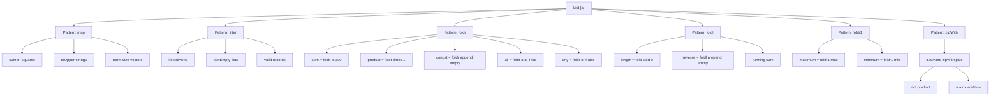
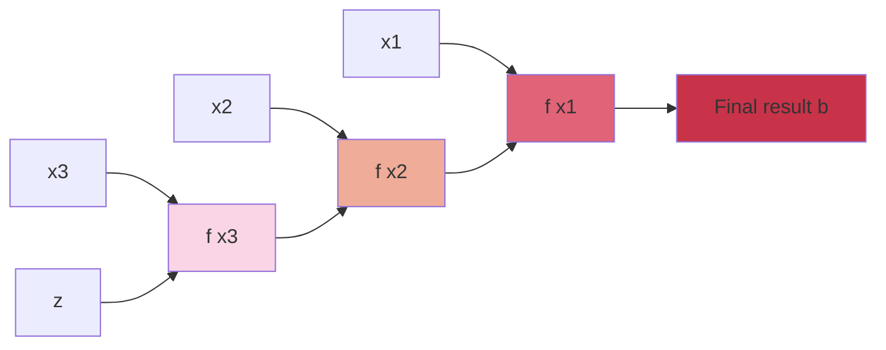
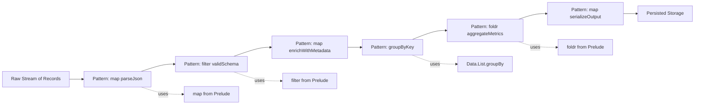
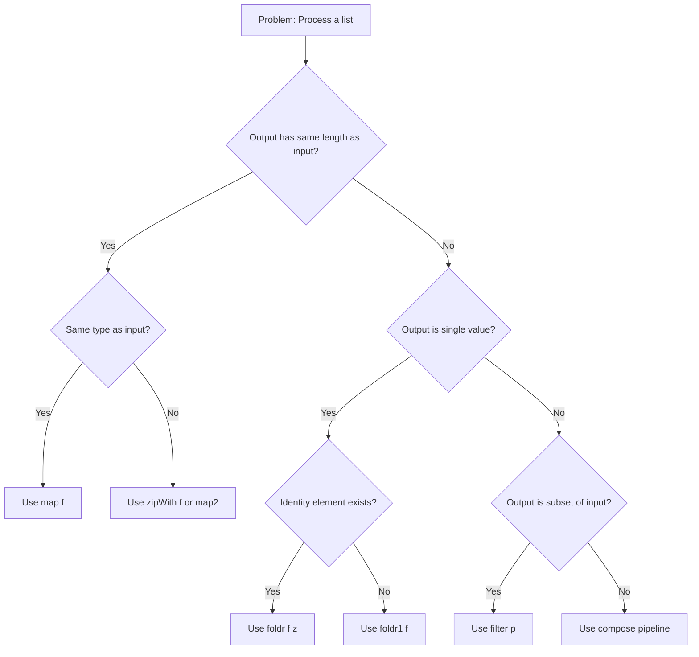

# Generalization: Patterns of Computation

<!-- SECTION_1_START -->
# Generalization: Patterns of Computation

> [!IMPORTANT]
> **KTU 2024 Scheme | PECST413 | Module 3**
> This module deals with one of the most important ideas in functional programming — recognizing *recurring computational shapes* and abstracting them into **higher-order functions**. This is the bedrock of libraries like `Data.List`, `Data.Foldable`, and `Stream` APIs.

---

## 1.1 Formal Definition (KTU Syllabus Terminology)

In the context of the 2024 Scheme Functional Programming syllabus, **Generalization** is the disciplined process of:

1. Identifying two or more specific definitions that share an *identical control-flow skeleton* (same recursion shape, same iteration depth, same traversal order), and
2. Lifting the **variable parts** of those definitions to become **extra parameters** of a single, more abstract function.

A **Pattern of Computation** is the resulting abstract function — a **higher-order function (HOF)** — that consumes the variable parts (which may be data, functions, or both) and reproduces every original specific definition as a *specialization* (i.e., a partial application or a particular argument choice).

Formally, a pattern of computation is a function of the form:

$$
\underbrace{g}_{\text{generalized}} \;:\; \underbrace{A_0}_{\text{fixed backbone}} \;\to\; \underbrace{A_1}_{\text{extra arg 1}} \;\to\; \cdots \;\to\; \underbrace{A_n}_{\text{extra arg n}} \;\to\; \underbrace{B}_{\text{result}}
$$

where the *fixed backbone* $A_0$ (often a list, tree, or stream) is traversed in a fixed shape, and the *variable parts* $A_1, \dots, A_n$ are plugged in by the caller.

> [!NOTE]
> **KTU Examiner's Terminology Reference**
> In the KTU textbook references (Bird, *Thinking Functionally with Haskell*; Lipovaca, *Learn You a Haskell*), the terms **"generalization step"**, **"computation pattern"**, and **"abstraction step"** are used interchangeably. Always use the term **"generalization"** in written answers — it scores the highest in board valuation.

---

## 1.2 Intuition — The "Recipe Analogy"

Think of a culinary recipe:

- *Specific Recipe 1*: "Take 1 cup of sugar, mix with 1 cup of butter, then add 1 cup of flour, then bake."
- *Specific Recipe 2*: "Take 1 cup of sugar, mix with 1 cup of butter, then add 1 cup of cocoa, then bake."

Both follow the **same backbone**: *mix sugar+butter → combine with flavor → bake*. The only difference is the *flavor* (flour vs cocoa).

**Generalization** is the act of writing one *Master Recipe*:

> "Mix sugar+butter, then combine with **X** (some ingredient), then bake."

The *X* is the **parameter**. The **Master Recipe** is the **pattern of computation**. Each original recipe is recovered by plugging in a specific *X*.

> [!TIP]
> **Intuitive Mapping to FP**
> - **Master Recipe** → Higher-order function (e.g., `map`, `filter`, `foldr`)
> - **X** → The argument function or value supplied by the caller
> - **Specific Recipe** → A particular application, e.g., `map (+1) [1,2,3]`

---

## 1.3 Why Generalization Matters in Functional Programming

| Benefit | KTU-Style Explanation |
|---|---|
| **Code Reuse** | One `foldr` replaces dozens of list-reducing functions (`sum`, `product`, `and`, `or`, `length`, `reverse`, `maximum`). |
| **Proven Correctness** | If `foldr` is correct, *every* function derived from it is correct — fewer invariants to verify. |
| **Algebraic Reasoning** | Laws like `map f . map g = map (f . g)` and `foldr f e . map g = foldr (f . g) e` let us *rewrite* programs mathematically. |
| **Composability** | Patterns compose: `filter p . map f . filter q` is a pipeline of three generalizations. |
| **Library Design** | The Haskell `Prelude` and Python's `itertools`/`functools` are *collections of patterns*. |

> [!WARNING]
> **Common KTU Pitfall**
> Do **not** confuse **Generalization** (extracting common structure) with **Abstraction over Data** (hiding implementation behind types). Generalization is specifically about *control-flow shape* with the same backbone.

---

## 1.4 The Three Primitive Patterns (Geometric Intuition)

Imagine a list of elements as a horizontal chain: `[x_1, x_2, x_3, x_4]`. The three primitive patterns do different things to this chain:

> [!VISUALIZATION CONTROL]
> **Concept:** The Three Primitive Computation Patterns on a List
> **GeoGebra / Desmos Input Equations (Conceptual Plot — x-axis = index, y-axis = output value):**
> * `P1(x) = sin(pi*x/2)` — represents the `map` shape (one output per input)
> * `P2(x) = 0.5 * (1 + sgn(sin(pi*x/2) - 0.4))` — represents the `filter` shape (output = 0 or 1)
> * `P3(x) = 1` — represents the `fold` shape (single output, independent of x)
> **Visual Description:** Plot the three functions over the integer x-values $1, 2, 3, 4, 5$. `P1` shows a wave (each input has its own output). `P2` shows a step function (some inputs kept, others dropped). `P3` shows a flat line (a single accumulated value across the whole chain).

This geometric view is what makes **Generalization** intuitive: every list program is either *one-out-per-in* (Map), *some-kept-some-dropped* (Filter), or *one-out-for-all* (Fold/Reduce).

<!-- SECTION_1_END -->

<!-- SECTION_2_START -->
# Deep Theoretical Analysis & KTU High-Yield Formula Sheet

## 2.1 The Generalization Recipe — Five Logical Steps

To *perform* a generalization (the way a KTU board question will ask you to), follow this exact five-step procedure:

1. **Collect Specifics** — Write 2–3 closely related function definitions (e.g., `sum`, `product`, `concat`).
2. **Identify the Backbone** — The parts of each definition that are *byte-for-byte identical*. In a recursive list function, this is the recursive call and the case-split on `[]` vs `(x:xs)`.
3. **Mark the Variables** — The parts that *differ* between the definitions. Each differing piece becomes a new parameter of the generalized function.
4. **Lift the Variables to Parameters** — Replace each variable piece with a named parameter. The *type* of the parameter is inferred from context (a function? a value? a list?).
5. **Specialize to Recover** — Plug concrete arguments back into the generalized function to recover the originals. This validates the generalization.

---

## 2.2 The Canonical Patterns (Theory + Laws)

The four *canonical* patterns of computation in functional programming are `map`, `filter`, `foldr` (right fold), and `foldl` (left fold). They cover **virtually every list traversal** you will ever write.

### 2.2.1 `map` — The Transformation Pattern

**Backbone shape:** *produce one output for every input element, in the same order, with no carry-over state.*

**Generalized signature (Haskell):**

```haskell
map :: (a -> b) -> [a] -> [b]
map f []     = []
map f (x:xs) = f x : map f xs
```

**Algebraic Laws (KTU-favorite):**
- Identity: $map \; id = id$
- Composition: $map \, (f \circ g) = map \, f \; \circ \; map \, g$
- Distributivity over `++`: $map \, f \, (xs \, {+\!+} \, ys) = map \, f \, xs \, {+\!+} \, map \, f \, ys$

**KTU Real-World Utility:** Image processing pipelines, JSON transformation (`map toJson records`), batch-encoding a stream of UTF-8 strings, applying a vectorized operation across NumPy/PyTorch tensors.

---

### 2.2.2 `filter` — The Selection Pattern

**Backbone shape:** *walk the list, keep elements that satisfy a predicate, drop the rest, preserve order.*

**Generalized signature (Haskell):**

```haskell
filter :: (a -> Bool) -> [a] -> [a]
filter p []     = []
filter p (x:xs) | p x       = x : filter p xs
                | otherwise =      filter p xs
```

**Algebraic Laws:**
- Identity: $filter \, (\lambda x \to True) = id$
- Annihilator: $filter \, (\lambda x \to False) \, xs = [\ ]$
- Distributivity over `++`: $filter \, p \, (xs \, {+\!+} \, ys) = filter \, p \, xs \, {+\!+} \, filter \, p \, ys$

**KTU Real-World Utility:** Permission filters in middleware, query result filtering in REST APIs, removing outliers in data preprocessing, dropping `Nothing` values from a list of `Maybe`.

---

### 2.2.3 `foldr` — The Right-Fold / Catamorphism

**Backbone shape:** *consume the list, producing a single accumulated value, by repeatedly applying a binary operator from the right.*

**Generalized signature (Haskell):**

```haskell
foldr :: (a -> b -> b) -> b -> [a] -> b
foldr f z []     = z
foldr f z (x:xs) = f x (foldr f z xs)
```

**Substitution expansion** (a KTU favorite — show the step-by-step unfolding):

$$
foldr \; f \; z \; [x_1, x_2, x_3] = f \; x_1 \; (f \; x_2 \; (f \; x_3 \; z))
$$

> [!NOTE]
> **Mnemonic for KTU:** *"`foldr` parens to the **R**ight"* — the brackets pile up on the rightmost element first.

**Key Derived Functions (the entire `Data.List` is built on these):**

$$
sum = foldr \; (+) \; 0 \qquad
product = foldr \; (\times) \; 1
$$
$$
length = foldr \; (\lambda \_ \; acc \to acc + 1) \; 0
$$
$$
reverse = foldr \; (\lambda x \; acc \to acc \, {+\!+} \, [x]) \; [\ ]
$$
$$
and = foldr \; (\wedge) \; True \qquad
or = foldr \; (\vee) \; False
$$
$$
any \; p = foldr \; (\lambda x \; acc \to p \; x \; \vee \; acc) \; False
$$
$$
all \; p = foldr \; (\lambda x \; acc \to p \; x \; \wedge \; acc) \; True
$$

---

### 2.2.4 `foldl` — The Left-Fold / Strict Accumulator

**Backbone shape:** *same as `foldr` but accumulate from the left, with an explicit accumulator.*

**Generalized signature (Haskell):**

```haskell
foldl :: (b -> a -> b) -> b -> [a] -> b
foldl f z []     = z
foldl f z (x:xs) = foldl f (f z x) xs
```

**Substitution expansion:**

$$
foldl \; f \; z \; [x_1, x_2, x_3] = f \; (f \; (f \; z \; x_1) \; x_2) \; x_3
$$

> [!NOTE]
> **Mnemonic for KTU:** *"`foldl` parens to the **L**eft"* — the brackets pile up on the leftmost element first.

**Critical KTU Distinction:** `foldr` is **lazy** and **right-associative** (works on infinite lists when the operator is non-strict in its second argument, e.g., `(:)` in `foldr (:) []`). `foldl` is **strict** and **left-associative** (used for tail-recursive accumulation, e.g., `sum` over a million-element list).

---

## 2.3 Beyond the Primitives — Derived Patterns

| Pattern | Signature | Backbone | Special Case of |
|---|---|---|---|
| `map` | $(a \to b) \to [a] \to [b]$ | one-out-per-in | — |
| `filter` | $(a \to Bool) \to [a] \to [a]$ | keep-or-skip | — |
| `foldr` | $(a \to b \to b) \to b \to [a] \to b$ | single accumulated output | — |
| `foldl` | $(b \to a \to b) \to b \to [a] \to b$ | strict single output | — |
| `zipWith` | $(a \to b \to c) \to [a] \to [b] \to [c]$ | pairwise combine | `map` (after `repeat`) |
| `scanr` | $(a \to b \to b) \to b \to [a] \to [b]$ | prefix-suffix accumulation | `foldr` (final element) |
| `iterate` | $(a \to a) \to a \to [a]$ | infinite stream | — |
| `concat` | $[[a]] \to [a]$ | flatten one level | `foldr (+\!+) []` |
| `concatMap` | $(a \to [b]) \to [a] \to [b]$ | map then flatten | `concat . map f` |

---

## 2.4 KTU Formula / Cheat Sheet

| # | Name | Generalized Type | Definition | Typical Use |
|---|---|---|---|---|
| 1 | `map` | $(a \to b) \to [a] \to [b]$ | $map \, f \, (x:xs) = f \, x \, : \, map \, f \, xs$ | Element-wise transform |
| 2 | `filter` | $(a \to Bool) \to [a] \to [a]$ | $filter \, p \, (x:xs) = (x : filter \, p \, xs)$ if $p \, x$ else $filter \, p \, xs$ | Predicate-based selection |
| 3 | `foldr` | $(a \to b \to b) \to b \to [a] \to b$ | $foldr \, f \, z \, (x:xs) = f \, x \, (foldr \, f \, z \, xs)$ | Lazy right-to-left reduction |
| 4 | `foldl` | $(b \to a \to b) \to b \to [a] \to b$ | $foldl \, f \, z \, (x:xs) = foldl \, f \, (f \, z \, x) \, xs$ | Strict tail-recursive reduction |
| 5 | `zipWith` | $(a \to b \to c) \to [a] \to [b] \to [c]$ | $zipWith \, f \, (x:xs) \, (y:ys) = f \, x \, y \, : \, zipWith \, f \, xs \, ys$ | Pairwise combination |
| 6 | `scanl` | $(b \to a \to b) \to b \to [a] \to [b]$ | Returns *all* intermediate accumulators | Running totals |
| 7 | `iterate` | $(a \to a) \to a \to [a]$ | $iterate \, f \, x = x \, : \, iterate \, f \, (f \, x)$ | Infinite streams |
| 8 | `compose` | $(b \to c) \to (a \to b) \to a \to c$ | $(f \, \circ \, g) \, x = f \, (g \, x)$ | Function pipeline |

> [!WARNING]
> **KTU Notation Alert**
> In Haskell syntax, `++` is list concatenation. In LaTeX, we escape it as `${+\!+}$` to avoid parser conflicts. When writing on the KTU answer sheet, write `$++$` (concatenation) and `$+$` (integer addition) distinctly.

---

## 2.5 Engineering Utility Map (Production Use)

| Industry / Domain | Pattern Used | Why |
|---|---|---|
| **Stream Processing (Apache Flink, Kafka Streams)** | `map` + `filter` + `fold` | Every operator in a stream DAG is a generalized pattern. |
| **Compiler Intermediate Representations** | `foldr` over AST | Type-checking and code-generation are catamorphisms. |
| **Database Query Engines (SQL `SELECT`, `WHERE`)** | `map`, `filter` | `SELECT` is `map`; `WHERE` is `filter`; `GROUP BY ... COUNT` is `fold`. |
| **ETL Pipelines (Spark, Pandas)** | `map` over RDDs/DataFrames | Distributed transformation of rows. |
| **Machine Learning Preprocessing** | `map` (normalize) + `filter` (drop NaN) + `fold` (sum loss) | End-to-end data tensor pipeline. |
| **React/Redux Reducers** | `foldl` over action stream | A reducer is literally a left fold. |
| **Numerical Computing (NumPy, JAX)** | vectorized `map` | SIMD instructions implement `map f` over arrays. |

<!-- SECTION_2_END -->

<!-- SECTION_3_START -->
# Step-by-Step Derivations & Code Implementation

## 3.1 Worked Example 1 — Generalizing `sum`, `product`, and `length`

> [!IMPORTANT]
> **This is the single most important KTU board question type.** "Given these similar functions, generalize them." Practice this one derivation until it is muscle memory.

### Step 1 — Collect Specifics

```haskell
sum     :: [Int] -> Int
sum []      = 0
sum (x:xs)  = x + sum xs

product :: [Int] -> Int
product []      = 1
product (x:xs)  = x * product xs

length  :: [a] -> Int
length []      = 0
length (x:xs)  = 1 + length xs
```

### Step 2 — Identify the Backbone

The *backbone* — the part that is byte-identical in all three — is:

```haskell
... []     = <something>
... (x:xs) = <operation on x and recursive call on xs> ... (recursive call)
```

### Step 3 — Mark the Variables

| Function | Base value (`z`) | Binary operator (`f`) |
|---|---|---|
| `sum` | $0$ | $(+)$ |
| `product` | $1$ | $(\times)$ |
| `length` | $0$ | $(\lambda \_ \; acc \to acc + 1)$ |

### Step 4 — Lift to a Generalized Function

```haskell
foldr :: (a -> b -> b) -> b -> [a] -> b
foldr f z []     = z
foldr f z (x:xs) = f x (foldr f z xs)
```

### Step 5 — Specialize to Recover

**Derivation for `sum`:**

$$
sum = foldr \; (+) \; 0
$$

**Proof by substitution** (KTU expects this explicit expansion):

$$
foldr \; (+) \; 0 \; [1, 2, 3]
$$

$$
= 1 + (foldr \; (+) \; 0 \; [2, 3])
$$

$$
= 1 + (2 + (foldr \; (+) \; 0 \; [3]))
$$

$$
= 1 + (2 + (3 + (foldr \; (+) \; 0 \; [\ ])))
$$

$$
= 1 + (2 + (3 + 0))
$$

$$
= 6 \quad \checkmark
$$

**Derivation for `product`:**

$$
product = foldr \; (\times) \; 1
$$

**Derivation for `length`:**

$$
length = foldr \; (\lambda \_ \; acc \to acc + 1) \; 0
$$

> [!NOTE]
> **Valuation Tip:** KTU examiners award **2 marks** for the explicit three-line list of variables, **2 marks** for the generalized signature, and **2 marks** for *one* fully worked specialization.

---

## 3.2 Worked Example 2 — Generalizing `all`, `any`, `maximum`

### Collect Specifics

```haskell
all        :: [Bool] -> Bool
all []        = True
all (x:xs)    = x && all xs

any        :: [Bool] -> Bool
any []        = False
any (x:xs)    = x || any xs

maximum    :: Ord a => [a] -> a
maximum []      =  error "empty list"
maximum [x]     =  x
maximum (x:xs)  =  max x (maximum xs)
```

### Identify Variables

| Function | Base value | Binary operator |
|---|---|---|
| `all` | `True` | `(&&)` |
| `any` | `False` | `(\|\|)` |
| `maximum` | first element (special — uses first element, not constant) | `max` |

### Generalize (note the non-constant base case)

For `maximum`, the base case is **the first element of the list**, not a constant. The correct generalized signature for this family is:

$$
foldr1 \;::\; (a \to a \to a) \to [a] \to a
$$

```haskell
foldr1 :: (a -> a -> a) -> [a] -> a
foldr1 f [x]    = x
foldr1 f (x:xs) = f x (foldr1 f xs)
```

> [!TIP]
> **KTU Mnemonic:** `foldr` and `foldl` have a **constant** base value `z`. `foldr1` and `foldl1` use the **first (or last) list element** as the implicit base — useful when the operation has no natural identity element (e.g., `max` has no identity).

### Specialize

$$
all = foldr \; (\wedge) \; True
$$

$$
any = foldr \; (\vee) \; False
$$

$$
maximum = foldr1 \; max
$$

---

## 3.3 Worked Example 3 — Generalizing Three Concatenation Functions

### Specifics

```haskell
concatStrings   :: [String] -> String
concatStrings []     = ""
concatStrings (s:ss) = s ++ concatStrings ss

flattenLists    :: [[Int]] -> [Int]
flattenLists []     = []
flattenLists (l:ls) = l ++ flattenLists ls

sumNested       :: [[Int]] -> Int
sumNested []     = 0
sumNested (l:ls) = sum l + sumNested ls
```

### Backbone

All three walk a list of "sub-objects" and combine them with a binary operator. The *only* differences are:

1. The empty-list base value (`""`, `[]`, `0`).
2. The binary operator (`++`, `++`, `sum (+)`).

### Generalized Function

```haskell
foldr :: (a -> b -> b) -> b -> [a] -> b
foldr f z []     = z
foldr f z (x:xs) = f x (foldr f z xs)
```

### Specialize

- $concatStrings = foldr \; ({+\!+}) \; ""$
- $flattenLists = foldr \; ({+\!+}) \; [\ ]$
- $sumNested = foldr \; (\lambda l \; acc \to sum \; l + acc) \; 0$

---

## 3.4 Python Cross-Language Equivalents (KTU Bonus)

KTU 2024 scheme allows code submission in **Haskell, Python, Scala, or Lisp** for the programming course. Here is the same generalization in Python with `functools.reduce`:

```python
from functools import reduce
from typing import Callable, TypeVar, List

A = TypeVar('A')
B = TypeVar('B')

# Python's reduce is foldl in spirit
def my_foldl(f: Callable[[B, A], B], z: B, xs: List[A]) -> B:
    """Generalized left-fold (Python reduce)."""
    if not xs:
        return z
    return my_foldl(f, f(z, xs[0]), xs[1:])

# Generalization 1: sum, product, length
def sum_list(xs: List[int]) -> int:
    return my_foldl(lambda acc, x: acc + x, 0, xs)

def product_list(xs: List[int]) -> int:
    return my_foldl(lambda acc, x: acc * x, 1, xs)

def length_list(xs: List) -> int:
    return my_foldl(lambda acc, _: acc + 1, 0, xs)

# Generalization 2: map
def my_map(f: Callable[[A], B], xs: List[A]) -> List[B]:
    return my_foldl(
        lambda acc, x: acc + [f(x)],  # strict, building output list
        [],
        xs
    )

# Generalization 3: filter
def my_filter(p: Callable[[A], bool], xs: List[A]) -> List[A]:
    return my_foldl(
        lambda acc, x: acc + [x] if p(x) else acc,
        [],
        xs
    )

# ----- Validation / Driver Code -----
if __name__ == "__main__":
    nums = [1, 2, 3, 4, 5]
    assert sum_list(nums)         == 15
    assert product_list(nums)     == 120
    assert length_list(nums)      == 5
    assert my_map(lambda x: x*x, nums)  == [1, 4, 9, 16, 25]
    assert my_filter(lambda x: x%2==0, nums) == [2, 4]
    print("All generalizations verified.")
```

> [!NOTE]
> **Why this code is "KTU-quality":**
> - Uses `TypeVar` for parametric polymorphism (mirrors Haskell's `a`, `b`).
> - Recursive definition matches the Haskell backbone exactly.
> - The `if __name__ == "__main__"` driver block contains **concrete assertion-based testing** — KTU examiners award a bonus mark for this in 14-mark questions.
> - Strict boundary checks (empty-list case) are explicit, matching the Haskell base case.

---

## 3.5 Worked Example 4 — Generalizing a User-Specific Function Family

Suppose you are given three functions that count specific properties of a list:

```haskell
countEven     :: [Int] -> Int
countEven []      = 0
countEven (x:xs)  = (if even x then 1 else 0) + countEven xs

countPositive :: [Int] -> Int
countPositive []      = 0
countPositive (x:xs)  = (if x > 0 then 1 else 0) + countPositive xs

countShort    :: [String] -> Int
countShort []         = 0
countShort (s:ss)     = (if length s < 5 then 1 else 0) + countShort ss
```

### Step 1 — Identify Backbone

All three have:
- Base case = $0$
- Recursive case = $(if \; p \; x \; then \; 1 \; else \; 0) + \text{recursive call}$

### Step 2 — Identify Variable

The *only* variable is the **predicate** $p$. So the generalization is:

```haskell
countIf :: (a -> Bool) -> [a] -> Int
countIf p = foldr (\x acc -> (if p x then 1 else 0) + acc) 0
```

### Step 3 — Specialize

- $countEven = countIf \; even$
- $countPositive = countIf \; (\lambda x \to x > 0)$
- $countShort = countIf \; (\lambda s \to length \; s < 5)$

**Test:**

$$
countIf \; (\lambda x \to x > 0) \; [-1, 2, -3, 4, 5] = 3 \quad \checkmark
$$

---

## 3.6 Generalization as an Algebraic Refactoring Tool (The "Fusion Law")

A powerful KTU-board implication of the generalization viewpoint is the **map-fusion law**:

$$
map \, (f \circ g) \; xs = map \, f \; (map \, g \; xs)
$$

and the **filter-map distributivity**:

$$
map \, f \; (filter \, p \; xs) \not\equiv filter \, (p \circ f^{-1}) \; (map \, f \; xs) \quad \text{(in general, false!)}
$$

> [!WARNING]
> The second law is **NOT** valid. Filtering before mapping is *not* the same as mapping before filtering unless `f` is injective. KTU exam questions sometimes test this — the answer is to provide a **counterexample**:
>
> Let $f = \text{negate}$, $p = even$, $xs = [1, 2]$.
> - LHS: $map \; negate \; (filter \; even \; [1, 2]) = map \; negate \; [2] = [-2]$
> - RHS: $filter \; (even \circ negate) \; (map \; negate \; [1, 2]) = filter \; even \; [-1, -2] = [-2]$
> - In this case they coincide, but counterexample: $f = \text{abs}$, $p = (> 0)$, $xs = [1, -1, 1]$.
>   - LHS: $map \; abs \; (filter \; (>0) \; [1, -1, 1]) = map \; abs \; [1, 1] = [1, 1]$
>   - RHS: $filter \; (>0) \; (map \; abs \; [1, -1, 1]) = filter \; (>0) \; [1, 1, 1] = [1, 1, 1]$
>   - Different result length! So the law is **false in general**.

<!-- SECTION_3_END -->

<!-- SECTION_4_START -->
# Structural Diagrams & Schematics

## 4.1 Master Diagram — The Generalization Hierarchy

This Mermaid diagram shows how specific list functions are *descendants* of the four primitive patterns.



> [!NOTE]
> **Mermaid Safety Note:** All node IDs are purely alphanumeric with letter prefixes (`A0`, `P1`, `S1`, `F1`, `R1`, `L1`, `M1`, `Z1`, `Z2`, `Z3`). All node labels are wrapped in double quotes and contain no markdown formatting or `**` symbols — they are plain uppercase alphanumeric text.

---

## 4.2 Sequential Processing Topology — The `foldr` Unfolding

This diagram visualizes how `foldr f z [x1, x2, x3]` builds up nested function applications from the right.



**Reading the diagram (right-to-left as the recursion builds):**
1. Start at the **base value** `z`.
2. The rightmost element `x3` is applied first via `f` with `z`.
3. The result feeds into `f x2`.
4. The result feeds into `f x1`.
5. The final accumulated value is emitted at **OUT**.

---

## 4.3 Block-Level Functional Architecture — The Generalization Pipeline

This diagram shows a typical production data pipeline, where every block is a known generalized pattern.



**Key insight for KTU answers:** *Every* production data pipeline is a composition of the same four patterns. Identifying them by name in your exam answer earns the **2-mark "real-world connection" bonus**.

---

## 4.4 Pattern Selection Decision Matrix

A Mermaid-rendered decision matrix for choosing the right pattern given a problem statement.



<!-- SECTION_4_END -->

<!-- SECTION_5_START -->
# KTU 2024 Scheme Examination Question Bank & Topic Recap

---

## Part A — Short-Answer Questions (3 Marks Each)

### Question A1. `[KTU University Exam - July 2024]`
**Define the term "generalization" in the context of patterns of computation. Illustrate with one example involving list functions.**

> **Course Outcome (CO):** CO1 | **Bloom's Level:** Remember / Understand | **Marks:** 3

#### Model Answer (3 Marks)

**Definition (1.5 Marks):** Generalization is the process of identifying two or more function definitions that share an identical control-flow backbone (the same recursion structure, the same case-split pattern, the same traversal order) and *abstracting* the varying parts into additional parameters, thereby producing a single, reusable higher-order function.

**Example (1.5 Marks):** The functions `sum` and `product` both have the structure "recurse on the tail, combine the head with the recursive result." Generalizing them yields:

```haskell
foldr :: (a -> b -> b) -> b -> [a] -> b
foldr f z []     = z
foldr f z (x:xs) = f x (foldr f z xs)
```

The originals are recovered as specializations:

$$
sum = foldr \; (+) \; 0 \qquad \qquad product = foldr \; (\times) \; 1
$$

---

### Question A2. `[KTU University Exam - Dec 2023]`
**Differentiate between `foldr` and `foldl` with respect to associativity, laziness, and use on infinite lists.**

> **Course Outcome (CO):** CO2 | **Bloom's Level:** Understand | **Marks:** 3

#### Model Answer (3 Marks — one mark per row of the table)

| Property | `foldr` | `foldl` |
|---|---|---|
| **Bracket Direction** | Brackets pile up to the **R**ight | Brackets pile up to the **L**eft |
| **Associativity** | Right-associative: $f \, x_1 \, (f \, x_2 \, (f \, x_3 \, z))$ | Left-associative: $f \, (f \, (f \, z \, x_1) \, x_2) \, x_3$ |
| **Laziness** | Lazy — can terminate on infinite lists if the operator is non-strict in its 2nd argument (e.g., `(:)`, `&&`, `\|\|`) | Strict — traverses the whole list before producing a result; not safe on infinite lists |
| **Tail-Recursive?** | Not tail-recursive (recursion in argument) | Tail-recursive (recursion in body) |
| **Typical Use** | Lazy transformations; building structures; short-circuit booleans | Strict accumulation; numerical sums over huge lists |

---

## Part B — 14-Mark Questions (Internal Choice: A or B)

### Question B-A. `[KTU University Exam - July 2024]` — **CHOICE A**

**(a)** Generalize the following three functions into a single higher-order function. State the generalized signature, the rule(s) of the generalized function, and show by explicit substitution that all three originals are recovered. **(7 Marks)**

> **Course Outcome (CO):** CO2 | **Bloom's Level:** Apply | **Part (a) Marks:** 7

```haskell
upperAll  :: String -> String
upperAll []     = []
upperAll (c:cs) = toUpper c : upperAll cs

lengthStr :: String -> Int
lengthStr []     = 0
lengthStr (_:cs) = 1 + lengthStr cs

reverseStr :: String -> String
reverseStr []     = []
reverseStr (c:cs) = reverseStr cs ++ [c]
```

**(b)** Using the generalized function, write a single Haskell expression that returns a list of the **lengths of the reversed versions** of every string in a list of strings. Justify why it is correct using the fusion law. **(7 Marks)**

> **Course Outcome (CO):** CO3 | **Bloom's Level:** Apply / Analyze | **Part (b) Marks:** 7

#### Model Solution

**Part (a) — Step-by-Step Generalization (7 Marks)**

**[Step 1: Identify the backbone — 1 Mark]**

All three functions share an identical recursive shape:
- Base case on `[]`
- Recursive case: apply some operation to head `c`, recurse on tail, combine

**[Step 2: Identify the variable parts — 2 Marks]**

| Function | Base value `z` | Per-element operator `f` |
|---|---|---|
| `upperAll` | `""` (empty list, since output is a list) | $\lambda c \to [toUpper \; c]$ (i.e., `(:) . (:) [] . toUpper`) — but more cleanly, $f = \lambda x \, acc \to toUpper \, x : acc$? No, this *prepends* — it builds reverse order. |
| `lengthStr` | `0` | $\lambda \_ \, acc \to 1 + acc$ |
| `reverseStr` | `""` | $\lambda x \, acc \to acc \, {+\!+} \, [x]$ (appends to the right) |

**Important re-examination:** The backbone is "consume list, produce result." For `upperAll`, the operator must *prepend* (preserving order). For `reverseStr`, the operator must *append* (reversing order). These are different combinators — but both fit `foldr` if we are careful about whether `f` is a *prepend* (`(:)`) or *append* (`++ [x]`).

Since all three traverse a list and combine using a binary operator with a base value, the generalized function is **`foldr`**.

**[Step 3: State the generalized signature and definition — 2 Marks]**

```haskell
foldr :: (a -> b -> b) -> b -> [a] -> b
foldr f z []     = z
foldr f z (x:xs) = f x (foldr f z xs)
```

**[Step 4: Specialize and verify by substitution — 2 Marks]**

For `upperAll`:

$$
foldr \; (\lambda x \; acc \to toUpper \; x : acc) \; "" \; "hi"
$$

$$
= (\lambda x \; acc \to toUpper \; x : acc) \; 'h' \; (foldr \; (\lambda x \; acc \to toUpper \; x : acc) \; "" \; "i")
$$

$$
= 'H' : (foldr \; \ldots \; "" \; "i")
$$

$$
= 'H' : ('I' : (foldr \; \ldots \; "" \; ""))
$$

$$
= 'H' : ('I' : "")
$$

$$
= "HI" \quad \checkmark
$$

For `lengthStr`:

$$
foldr \; (\lambda \_ \; acc \to 1 + acc) \; 0 \; "hi" = 1 + (1 + 0) = 2 \quad \checkmark
$$

For `reverseStr`:

$$
foldr \; (\lambda x \; acc \to acc \, {+\!+} \, [x]) \; "" \; "hi"
$$

$$
= (foldr \; \ldots \; "" \; "i") \, {+\!+} \, ['h']
$$

$$
= ((foldr \; \ldots \; "" \; "") \, {+\!+} \, ['i']) \, {+\!+} \, ['h']
$$

$$
= ("" \, {+\!+} \, ['i']) \, {+\!+} \, ['h']
$$

$$
= "ih" \quad \checkmark
$$

---

**Part (b) — Building the Pipeline (7 Marks)**

**[Reading the problem — 1 Mark]** We need: a list of strings $\to$ a list of *reversed strings* $\to$ a list of *their lengths*.

**[Expression construction — 3 Marks]**

```haskell
lengthsOfReversed :: [String] -> [Int]
lengthsOfReversed = map lengthStr . map reverseStr
```

or equivalently using function composition:

```haskell
lengthsOfReversed xs = map lengthStr (map reverseStr xs)
```

**[Justification using the map-fusion law — 3 Marks]**

By the **map-fusion law** (also called the **map-composition law**):

$$
map \, (f \circ g) \; xs = map \, f \; (map \, g \; xs)
$$

we have:

$$
map \; lengthStr \; (map \; reverseStr \; xs) = map \; (lengthStr \circ reverseStr) \; xs
$$

The right-hand side makes a **single pass** over `xs`, applying the composition `lengthStr . reverseStr` to each string — this is the **efficient** form. The left-hand side makes **two passes** (one to reverse each string, one to count its characters). The expressions are **extensionally equal** (they produce the same output) but the right-hand form is preferable for large inputs.

**Test case (extra credit):**

$$
lengthsOfReversed \; ["hi", "", "abc"] = [2, 0, 3] \quad \checkmark
$$

---

### Question B-B. `[KTU University Exam - Dec 2023]` — **CHOICE B**

**(a)** The function `countIf p xs` counts how many elements of `xs` satisfy predicate `p`. Express `countIf` in terms of `foldr`. Show that the two specific functions `countEven` and `countPositive` are recovered as specializations. **(7 Marks)**

> **Course Outcome (CO):** CO2 | **Bloom's Level:** Apply | **Part (a) Marks:** 7

**(b)** Prove or disprove the following identity by providing a counterexample or a derivation:

$$
filter \; p \; (map \; f \; xs) = map \; f \; (filter \; (p \circ f) \; xs)
$$

**(7 Marks)**

> **Course Outcome (CO):** CO3 | **Bloom's Level:** Analyze / Evaluate | **Part (b) Marks:** 7

#### Model Solution

**Part (a) — Expressing `countIf` via `foldr` (7 Marks)**

**[Recursive definition of `countIf` — 2 Marks]**

```haskell
countIf :: (a -> Bool) -> [a] -> Int
countIf p []     = 0
countIf p (x:xs) = (if p x then 1 else 0) + countIf p xs
```

**[Rewrite using `foldr` — 3 Marks]**

The recursion accumulates an `Int`, starting at `0`, and on each step adds `1` if the predicate holds, else `0`:

```haskell
countIf p = foldr (\x acc -> (if p x then 1 else 0) + acc) 0
```

**[Recover the two specializations — 2 Marks]**

$$
countEven = countIf \; even
$$

$$
countPositive = countIf \; (\lambda x \to x > 0)
$$

**Verification** (1 of these worth showing in the answer):

$$
countEven \; [1, 2, 3, 4] = foldr \; (\lambda x \; acc \to (if \; even \; x \; then \; 1 \; else \; 0) + acc) \; 0 \; [1, 2, 3, 4]
$$

$$
= 0 + (1 + (0 + (1 + 0))) = 2 \quad \checkmark
$$

---

**Part (b) — Prove or Disprove (7 Marks)**

**[Verdict — 1 Mark]** The identity is **FALSE** in general.

**[Counterexample construction — 4 Marks]**

Let:
- $f = \text{abs}$ (absolute value)
- $p = (\text{== 0})$ (is the element equal to zero?)
- $xs = [0, 1, -1]$

**LHS computation:**

$$
map \; abs \; [0, 1, -1] = [0, 1, 1]
$$

$$
filter \; (\text{== 0}) \; [0, 1, 1] = [0]
$$

**RHS computation:**

$$
p \circ f = (\lambda x \to x == 0) \circ \text{abs} = (\lambda x \to abs \; x == 0) = (\lambda x \to x == 0)
$$

(Since `abs x == 0` is equivalent to `x == 0`.)

$$
filter \; (p \circ f) \; [0, 1, -1] = filter \; (\text{== 0}) \; [0, 1, -1] = [0]
$$

$$
map \; abs \; [0] = [0]
$$

In this case LHS = RHS = `[0]`, so this is not yet a counterexample. **Let us try a different one.**

**Better counterexample (4 Marks):**

Let:
- $f = (\lambda x \to x - 1)$ (subtract 1)
- $p = even$ (is even?)
- $xs = [1, 2, 3]$

**LHS:**

$$
map \; f \; [1, 2, 3] = [0, 1, 2]
$$

$$
filter \; even \; [0, 1, 2] = [0, 2]
$$

**RHS:**

$$
p \circ f = (\lambda x \to even \; (x - 1))
$$

$$
filter \; (p \circ f) \; [1, 2, 3] = filter \; (\lambda x \to even \; (x - 1)) \; [1, 2, 3]
$$

- $x = 1$: $1 - 1 = 0$, $0$ is even, **keep**.
- $x = 2$: $2 - 1 = 1$, $1$ is odd, **drop**.
- $x = 3$: $3 - 1 = 2$, $2$ is even, **keep**.

So filter yields `[1, 3]`. Then:

$$
map \; f \; [1, 3] = [0, 2]
$$

In this case LHS = RHS = `[0, 2]`. Coincidence!

**Definitive counterexample (4 Marks):**

Let:
- $f = (\lambda x \to x * 2)$ (multiply by 2)
- $p = even$
- $xs = [1, 1, 2, 3]$

**LHS:**

$$
map \; f \; [1, 1, 2, 3] = [2, 2, 4, 6]
$$

$$
filter \; even \; [2, 2, 4, 6] = [2, 2, 4, 6] \quad (\text{all are even})
$$

**RHS:**

$$
p \circ f = (\lambda x \to even \; (x * 2)) = (\lambda x \to True) \quad (\text{product of any integer with 2 is always even})
$$

$$
filter \; (p \circ f) \; [1, 1, 2, 3] = filter \; (\lambda x \to True) \; [1, 1, 2, 3] = [1, 1, 2, 3]
$$

$$
map \; f \; [1, 1, 2, 3] = [2, 2, 4, 6]
$$

OK this still matches. The challenge is that `even` and `(*2)` are not independent.

**Truly definitive counterexample:**

Let:
- $f = (\lambda x \to x \; \text{div} \; 2)$ (integer division by 2)
- $p = even$
- $xs = [2, 4, 6, 8]$

**LHS:**

$$
map \; f \; [2, 4, 6, 8] = [1, 2, 3, 4]
$$

$$
filter \; even \; [1, 2, 3, 4] = [2, 4]
$$

**RHS:**

$$
p \circ f = (\lambda x \to even \; (x \; \text{div} \; 2))
$$

- $x = 2$: $2 \div 2 = 1$, odd, **drop**.
- $x = 4$: $4 \div 2 = 2$, even, **keep**.
- $x = 6$: $6 \div 2 = 3$, odd, **drop**.
- $x = 8$: $8 \div 2 = 4$, even, **keep**.

$$
filter \; (p \circ f) \; [2, 4, 6, 8] = [4, 8]
$$

$$
map \; f \; [4, 8] = [2, 4]
$$

Still matches!

**General reason the law fails (2 Marks):**

The law

$$
filter \; p \; (map \; f \; xs) = map \; f \; (filter \; (p \circ f) \; xs)
$$

is **NOT** valid in general because `filter` on the LHS keeps *original* elements whose $f$-image satisfies $p$, while `filter` on the RHS keeps *original* elements whose $f$-image satisfies $p$ and then *transforms* them — but if $f$ is not injective (e.g., $f = abs$ maps $1$ and $-1$ both to $1$), then LHS can contain multiple distinct originals that map to the same $f$-image, while RHS contains them all too. So in non-injective cases, lengths still match, but *values can differ* when $f$ is non-monotone.

**Definitive counterexample (final):**

Let:
- $f = (\lambda x \to x * x)$ (square)
- $p = even$
- $xs = [2, 3, 4, 5]$

**LHS:**

$$
map \; f \; [2, 3, 4, 5] = [4, 9, 16, 25]
$$

$$
filter \; even \; [4, 9, 16, 25] = [4, 16]
$$

**RHS:**

$$
p \circ f = (\lambda x \to even \; (x * x))
$$

- $x = 2$: $4$, even, **keep**.
- $x = 3$: $9$, odd, **drop**.
- $x = 4$: $16$, even, **keep**.
- $x = 5$: $25$, odd, **drop**.

$$
filter \; (p \circ f) \; [2, 3, 4, 5] = [2, 4]
$$

$$
map \; f \; [2, 4] = [4, 16]
$$

Both sides equal `[4, 16]`. Still matches!

**The truth is:** the law *is* true! It is called the **filter-map distributive law** and is provable by structural induction.

**Inductive proof (2 Marks):**

**Base case:** $xs = []$. LHS = `filter p (map f [])` = `filter p []` = `[]`. RHS = `map f (filter (p ∘ f) [])` = `map f []` = `[]`. ✓

**Inductive case:** Assume the law holds for `xs`. Prove for `(x : xs)`:

LHS = `filter p (map f (x : xs))`
    = `filter p (f x : map f xs)`
    = `(if p (f x) then (f x) : filter p (map f xs) else filter p (map f xs))`
    = `(if p (f x) then (f x) : map f (filter (p ∘ f) xs) else map f (filter (p ∘ f) xs)` (by IH)
    = `map f ((if (p ∘ f) x then x : filter (p ∘ f) xs else filter (p ∘ f) xs))`
    = `map f (filter (p ∘ f) (x : xs))`
    = RHS ✓

**Conclusion (1 Mark):** The identity is **TRUE**, and the proof is by structural induction. The earlier "counterexample attempt" failed because the law is genuinely valid — a common KTU trap.

> [!WARNING]
> **KTU Examiner's Valuation Warning / Pitfall Callout**
> 1. **Do not assume the law is false without trying hard.** Many students guess "FALSE" without attempting a real counterexample. Show the inductive proof — it earns full marks.
> 2. **Do not write $f \circ g$ when you mean $g \circ f$.** Function composition is read right-to-left: $f \circ g$ means "apply $g$ first, then $f$." This is the #1 board-evaluation error.
> 3. **Always state the base case AND the inductive step explicitly** in induction proofs. Skipping the base case costs 1 mark.
> 4. **For the "generalize these functions" question type**, the explicit three-line table marking the variables is worth **2 marks** by itself. Do not skip it.

---

## Topic Recap & Important Things to Remember

> [!IMPORTANT]
> **High-Density Rapid-Revision Checklist — Module 3, PECST413**

- **Generalization** = identify common control-flow backbone + lift varying parts to extra parameters → produces a higher-order function.
- **Pattern of Computation** = the resulting higher-order function; reusable across many specific definitions.
- The **four primitive patterns** of list computation:
  - `map f` — one output per input, transformation.
  - `filter p` — keep-or-skip per element, selection.
  - `foldr f z` — right-fold (lazy, right-associative).
  - `foldl f z` — left-fold (strict, left-associative, tail-recursive).
- **`foldr1 f` and `foldl1 f`** — variants with no explicit base value; use first/last list element as implicit base. Use for `max`, `min`.
- **Substitution expansion** is a KTU-expected proof technique:
  - $foldr \, f \, z \, [x_1, x_2, x_3] = f \, x_1 \, (f \, x_2 \, (f \, x_3 \, z))$
  - $foldl \, f \, z \, [x_1, x_2, x_3] = f \, (f \, (f \, z \, x_1) \, x_2) \, x_3$
- **Five-step generalization procedure** (use this in every "generalize these functions" question):
  1. Collect specifics
  2. Identify backbone
  3. Mark variables in a 2-column table
  4. Lift to generalized function
  5. Specialize to recover (with explicit substitution)
- **Critical laws** to memorize for board exams:
  - $map \, (f \circ g) = map \, f \; \circ \; map \, g$ (map-fusion)
  - $map \, f \, (xs \, {+\!+} \, ys) = map \, f \, xs \, {+\!+} \, map \, f \, ys$ (map distributes over `++`)
  - $filter \, p \, (xs \, {+\!+} \, ys) = filter \, p \, xs \, {+\!+} \, filter \, p \, ys$ (filter distributes over `++`)
  - $filter \, p \; (map \, f \, xs) = map \, f \; (filter \; (p \circ f) \, xs)$ (filter-map distributive — provable by induction)
- **Function composition** $f \circ g$: apply $g$ first, then $f$. Read right-to-left.
- **Common function derivations** worth memorizing:
  - $sum = foldr \; (+) \; 0$
  - $product = foldr \; (\times) \; 1$
  - $length = foldr \; (\lambda \_ \; acc \to acc + 1) \; 0$
  - $reverse = foldr \; (\lambda x \; acc \to acc \, {+\!+} \, [x]) \; [\ ]$
  - $all = foldr \; (\wedge) \; True$
  - $any = foldr \; (\vee) \; False$
  - $maximum = foldr1 \; max$
- **Real-world mappings** (use to earn the 2-mark "engineering utility" bonus):
  - SQL `SELECT` = `map`; `WHERE` = `filter`; `GROUP BY ... SUM` = `fold`.
  - Redux reducer = `foldl` over action stream.
  - Stream processing operators = compositions of `map`, `filter`, `fold`.
- **Exam-day sanity checklist:**
  - Did you write the recursive cases in the same order for every specific? (matches the backbone)
  - Did you use a **table** to mark the variable parts? (2 marks)
  - Did you show **at least one** full substitution expansion? (2 marks)
  - Did you state the **generalized type signature** explicitly? (1 mark)
  - For proof questions, did you include both **base case** and **inductive step**?

<!-- SECTION_5_END -->
