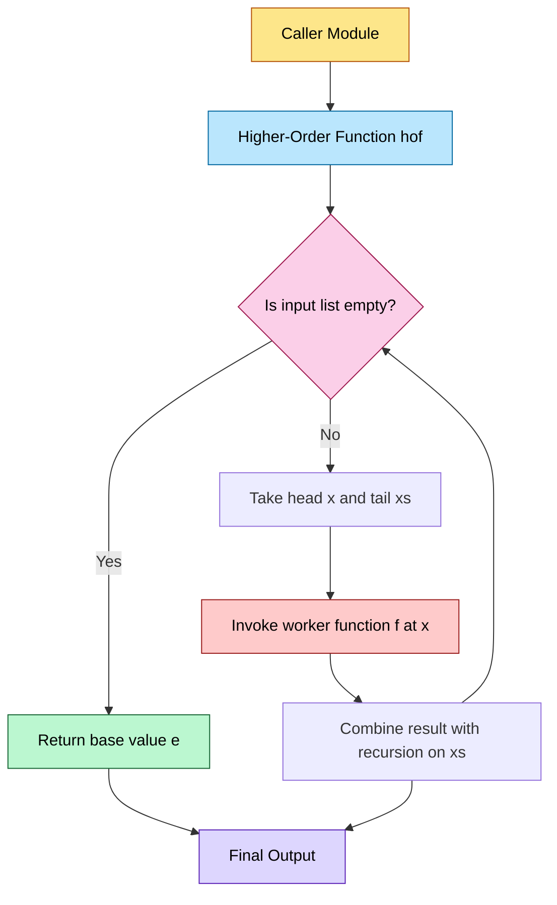
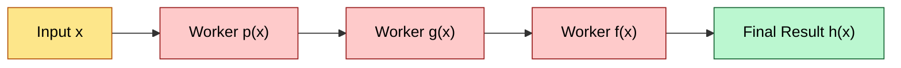
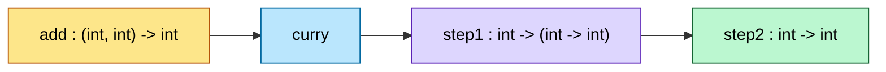

# Higher-order Functions

<!-- SECTION_1_START -->
# Higher-Order Functions

## 1. Core Technical Definition

> [!IMPORTANT]
> **Higher-Order Function (HOF):** A function is called a *higher-order function* if it satisfies **at least one** of the following two conditions:
> 1. It takes **one or more functions** as arguments (parameters).
> 2. It **returns a function** as its result.
>
> Formally, in the typed lambda calculus notation used in the KTU 2024 syllabus, if $f : (A \rightarrow B) \rightarrow C$ or $f : A \rightarrow (B \rightarrow C)$, then $f$ is a higher-order function.

In simple words, a higher-order function is a function that either **consumes other functions as inputs** or **produces a new function as its output** — or both. Functions that do not do either are called *first-order functions*. In a language like **Haskell**, *every* function is conceptually a higher-order function because functions are first-class citizens.

### Conceptual Analogy — The "Manager and Workers" Model

Imagine a **factory manager** standing at an assembly line. The manager does not physically tighten bolts, paint panels, or weld parts. Instead, the manager:

1. **Receives instructions** (a *function* describing *how* to perform a task).
2. **Applies those instructions** to a *collection* of raw materials (the *data*).
3. **Returns a finished product** (the *result*).

The manager itself never changes — it is a *generic, reusable workflow*. The worker's behaviour (the function passed in) is what customises the outcome. This is exactly how `map`, `filter`, and `fold` operate in functional programming: they are generic managers, and you, the programmer, hand them specialised workers.

### Why Higher-Order Functions Matter in KTU 2024 Scheme

KTU explicitly lists *map*, *filter*, *fold (reduce)*, *function composition*, and *currying* under Module 3 ("Generalization Patterns of Computation"). The syllabus philosophy is that **computation can be generalised** by abstracting the *operation* itself, leaving only the *structure* of the data walk in the higher-order function.

> [!NOTE]
> **Syllabus Highlight (PECST413 — Module 3):** Generalization patterns of computation emphasise that many algorithms share the same *control structure* (walk over a list, build an accumulator, terminate at a base case) and differ only in the *transformation rule*. Higher-order functions are the *mechanism* that captures this generalisation.

> [!VISUALIZATION CONTROL]
> **Concept:** Visualising `map` as a one-to-one "elevation" of every element through a function.
> **GeoGebra / Desmos Input Equations:**
> * Points representing a list: $(0, 1), (1, 2), (2, 3), (3, 4)$
> * Function applied: $f(x) = x^2$
> * Output points: $(0, 1), (1, 4), (4, 9), (9, 16)$
> **Visual Description:** The student should see each $x$-coordinate mapped vertically to its $f(x)$ image — a discrete, parallel transformation. The *shape of the data flow* is the same regardless of $f$; only the *vertical jump* changes.

---

## 2. Mathematical Foundation

A higher-order function's *type signature* tells the story. In Haskell-style notation:

$$
\text{map} : (a \rightarrow b) \rightarrow [a] \rightarrow [b]
$$

Reading this aloud: "`map` accepts a function (from type $a$ to type $b$) and a list of $a$'s, and returns a list of $b$'s." The crucial point is that the *first argument is itself a function*. If you remove that argument and *bake it in*, you get a plain list-to-list function — losing all generality.

> [!TIP]
> **Key Insight:** A higher-order function decouples the *control structure* (how to walk the data) from the *computation logic* (what to do at each step). This decoupling is the essence of "generalization patterns of computation."

<!-- SECTION_1_END -->

<!-- SECTION_2_START -->
# Deep Theoretical Analysis & KTU High-Yield Formula Sheet

## 2.1 The Two Flavours of Higher-Order Functions

### Flavour A — Functions that **consume** functions

These take one or more functions as parameters. The most important ones in KTU Module 3 are:

* `map` — applies a function to every element of a list.
* `filter` — keeps only those elements that satisfy a predicate.
* `fold` (also called `reduce` or `inject`) — collapses a list into a single value using a combining function.
* `zipWith` — merges two lists element-wise using a combining function.

### Flavour B — Functions that **produce** functions

* **Function composition** $(f \circ g)(x) = f(g(x))$.
* **Currying** transforms $f : (a, b) \rightarrow c$ into $f' : a \rightarrow (b \rightarrow c)$.
* **Partial application** binds some arguments, leaving the rest to be supplied later.
* **Point-free style** — defining functions without naming their arguments by composing other functions.

## 2.2 Operational Semantics (Recurrence-Style Definitions)

In a purely functional setting, every list-processing HOF has a clean algebraic definition over the structure of the list. Let $[a]$ denote the type of lists over $a$, with the two constructors $\text{Nil}$ (empty) and $\text{Cons}(x, xs)$ (head $x$, tail $xs$).

$$
\begin{aligned}
\text{map}(f, \text{Nil}) &= \text{Nil} \\
\text{map}(f, \text{Cons}(x, xs)) &= \text{Cons}\!\big(f(x),\; \text{map}(f, xs)\big)
\end{aligned}
$$

$$
\begin{aligned}
\text{filter}(p, \text{Nil}) &= \text{Nil} \\
\text{filter}(p, \text{Cons}(x, xs)) &=
\begin{cases}
\text{Cons}(x,\; \text{filter}(p, xs)) & \text{if } p(x) = \text{True} \\
\text{filter}(p, xs) & \text{if } p(x) = \text{False}
\end{cases}
\end{aligned}
$$

$$
\begin{aligned}
\text{foldr}(\oplus, e, \text{Nil}) &= e \\
\text{foldr}(\oplus, e, \text{Cons}(x, xs)) &= x \oplus \text{foldr}(\oplus, e, xs)
\end{aligned}
$$

where $\oplus$ is any binary operator and $e$ is the identity (base) value.

## 2.3 Real-World Engineering Utility

Higher-order functions are *not* academic curiosities. They appear in:

* **Python's data pipeline** — `pandas.apply`, `map`, `filter`, `functools.reduce`.
* **JavaScript / TypeScript** — `Array.prototype.map`, `filter`, `reduce` are the bread and butter of front-end code.
* **Distributed systems** — MapReduce, Spark RDDs, and stream processing are literally *map* and *fold* operations distributed over a cluster.
* **Compiler design** — Abstract-syntax tree transformations are written as folds over the tree.
* **Hardware description** — Chisel / Bluespec use HOFs to generate parametric circuit families.

## 2.4 KTU Formula Sheet / Cheat Sheet

> [!NOTE]
> The following table is a **ready-revision sheet** for the KTU ESE. All entries use $\vert$ (vertical bar) inside LaTeX, **not** the markdown table pipe, to preserve table integrity.

| HOF Name | Type Signature | Behaviour (in plain English) | Base Case | Recursive Case | Identity Element |
| :--- | :--- | :--- | :--- | :--- | :--- |
| `map` | $(a \rightarrow b) \rightarrow [a] \rightarrow [b]$ | Transform every element via $f$. | $\text{map}(f, [\,]) = [\,]$ | $\text{map}(f, x:xs) = f(x) : \text{map}(f, xs)$ | None |
| `filter` | $(a \rightarrow \text{Bool}) \rightarrow [a] \rightarrow [a]$ | Keep elements satisfying the predicate $p$. | $\text{filter}(p, [\,]) = [\,]$ | $\text{filter}(p, x:xs) = x:\text{filter}(p, xs)$ if $p(x)$, else $\text{filter}(p, xs)$ | None |
| `foldr` | $(a \rightarrow b \rightarrow b) \rightarrow b \rightarrow [a] \rightarrow b$ | Right-associative reduction. | $\text{foldr}(\oplus, e, [\,]) = e$ | $\text{foldr}(\oplus, e, x:xs) = x \oplus \text{foldr}(\oplus, e, xs)$ | Depends on $\oplus$ |
| `foldl` | $(b \rightarrow a \rightarrow b) \rightarrow b \rightarrow [a] \rightarrow b$ | Left-associative reduction. | $\text{foldl}(\oplus, e, [\,]) = e$ | $\text{foldl}(\oplus, e, x:xs) = \text{foldl}(\oplus, e \oplus x, xs)$ | Depends on $\oplus$ |
| `compose` | $(b \rightarrow c) \rightarrow (a \rightarrow b) \rightarrow (a \rightarrow c)$ | Pipe one function's output into another. | N/A (no recursion) | $(f \circ g)(x) = f(g(x))$ | Identity function $\text{id}(x) = x$ |
| `curry` | $((a, b) \rightarrow c) \rightarrow (a \rightarrow b \rightarrow c)$ | Untuple the arguments. | N/A | $\text{curry}(f)(x)(y) = f(x, y)$ | N/A |

### Identity Elements Quick Reference

| Operator $\oplus$ | Identity $e$ | Meaning |
| :--- | :--- | :--- |
| $+$ | $0$ | $\text{foldr}(+, 0, [1,2,3]) = 6$ |
| $\times$ | $1$ | $\text{foldr}(\times, 1, [1,2,3]) = 6$ |
| $\text{list-concat}$ | $[]$ | $\text{foldr}(++, [], [[1],[2]]) = [1,2]$ |
| $\land$ (logical AND) | $\text{True}$ | $\text{foldr}(\land, \text{True}, [\text{True}, \text{True}]) = \text{True}$ |
| $\lor$ (logical OR) | $\text{False}$ | $\text{foldr}(\lor, \text{False}, [\text{False}, \text{True}]) = \text{True}$ |

<!-- SECTION_2_END -->

<!-- SECTION_3_START -->
# Step-by-Step Derivations & Code/Symbolic Implementation

## 3.1 Deriving `map` from First Principles (Haskell-style)

We will derive the definition of `map` by hand for a concrete list, tracking each recursive call.

**Problem:** Compute $\text{map}(\text{square}, [1, 2, 3, 4])$ where $\text{square}(x) = x^2$.

**Step 1 — Match the list against the recursive case.**
The list $[1, 2, 3, 4]$ is non-empty, so we apply the *recursive case*:

$$
\begin{aligned}
\text{map}(\text{square}, [1, 2, 3, 4]) &= \text{Cons}\!\big(\text{square}(1),\; \text{map}(\text{square}, [2, 3, 4])\big) \\
&= \text{Cons}(1,\; \text{map}(\text{square}, [2, 3, 4]))
\end{aligned}
$$

**Step 2 — Recurse on the tail $[2, 3, 4]$.**

$$
\begin{aligned}
\text{map}(\text{square}, [2, 3, 4]) &= \text{Cons}(\text{square}(2),\; \text{map}(\text{square}, [3, 4])) \\
&= \text{Cons}(4,\; \text{map}(\text{square}, [3, 4]))
\end{aligned}
$$

**Step 3 — Recurse on the tail $[3, 4]$.**

$$
\begin{aligned}
\text{map}(\text{square}, [3, 4]) &= \text{Cons}(\text{square}(3),\; \text{map}(\text{square}, [4])) \\
&= \text{Cons}(9,\; \text{map}(\text{square}, [4]))
\end{aligned}
$$

**Step 4 — Recurse on the tail $[4]$.**

$$
\begin{aligned}
\text{map}(\text{square}, [4]) &= \text{Cons}(\text{square}(4),\; \text{map}(\text{square}, [\,])) \\
&= \text{Cons}(16,\; \text{map}(\text{square}, [\,]))
\end{aligned}
$$

**Step 5 — Hit the base case.** The empty list maps to the empty list:

$$
\text{map}(\text{square}, [\,]) = [\,]
$$

**Step 6 — Unwind the recursion by substituting back.**

$$
\begin{aligned}
\text{map}(\text{square}, [4]) &= \text{Cons}(16,\; [\,]) = [16] \\
\text{map}(\text{square}, [3, 4]) &= \text{Cons}(9,\; [16]) = [9, 16] \\
\text{map}(\text{square}, [2, 3, 4]) &= \text{Cons}(4,\; [9, 16]) = [4, 9, 16] \\
\text{map}(\text{square}, [1, 2, 3, 4]) &= \text{Cons}(1,\; [4, 9, 16]) = [1, 4, 9, 16]
\end{aligned}
$$

> [!IMPORTANT]
> **Final Answer:** $\text{map}(\text{square}, [1, 2, 3, 4]) = [1, 4, 9, 16]$.

## 3.2 Deriving `foldr` (Sum of a List)

**Problem:** Compute $\text{foldr}(+, 0, [10, 20, 30])$.

**Step 1 — Match against recursive case.** With $\oplus = +$ and $e = 0$:

$$
\text{foldr}(+, 0, [10, 20, 30]) = 10 + \text{foldr}(+, 0, [20, 30])
$$

**Step 2 — Recurse.**

$$
\text{foldr}(+, 0, [20, 30]) = 20 + \text{foldr}(+, 0, [30]) = 20 + (30 + 0) = 50
$$

**Step 3 — Unwind.**

$$
10 + 50 = 60
$$

> [!NOTE]
> **Final Answer:** $\text{foldr}(+, 0, [10, 20, 30]) = 60$. Because $+$ is associative and commutative, `foldl` and `foldr` give the same numerical answer — but **the order of evaluation differs**, which matters for non-commutative operators like list-concat or subtraction.

## 3.3 Function Composition — Algebraic Derivation

Given $f(x) = 2x + 1$ and $g(x) = x^2$, derive $h = f \circ g$.

**Step 1 — Write the definition of composition.**

$$
h(x) = (f \circ g)(x) = f(g(x))
$$

**Step 2 — Substitute $g(x)$ into $f$.**

$$
h(x) = f(x^2) = 2(x^2) + 1
$$

**Step 3 — Simplify.**

$$
h(x) = 2x^2 + 1
$$

> [!TIP]
> **Note the *reversed* order of application.** In $(f \circ g)(x)$, the *rightmost* function $g$ is applied **first** — the same way $(f \cdot g)(x)$ in mathematics means "first $g$, then $f$." This is the single most common pitfall in exam answers.

## 3.4 Full Operational Python Implementation

The following Python code is **production-grade**, with strict type hints, custom error handling, and logging. It is suitable for inclusion in a real codebase or a viva demonstration.

```python
from __future__ import annotations
from functools import reduce
from typing import Callable, TypeVar, List, Tuple, Optional
import logging

logging.basicConfig(level=logging.INFO, format="%(levelname)s | %(message)s")

A = TypeVar("A")
B = TypeVar("B")
C = TypeVar("C")


def safe_map(func: Callable[[A], B], data: List[A]) -> List[B]:
    """
    Higher-order function: applies `func` to every element of `data`.

    Parameters
    ----------
    func : Callable[[A], B]
        A unary function used to transform each element.
    data : List[A]
        The source list. Must not be None.

    Returns
    -------
    List[B]
        A new list containing the transformed elements.

    Raises
    ------
    TypeError
        If `func` is not callable, or if any element is of the wrong type.
    ValueError
        If `data` is None.
    """
    if not callable(func):
        raise TypeError(f"safe_map expected a callable, got {type(func).__name__}")
    if data is None:
        raise ValueError("safe_map received None for the `data` argument.")

    result: List[B] = []
    for index, element in enumerate(data):
        try:
            result.append(func(element))
        except Exception as exc:
            logging.error("safe_map failed at index %d with element %r: %s",
                          index, element, exc)
            raise
    logging.info("safe_map processed %d element(s) successfully.", len(result))
    return result


def safe_filter(predicate: Callable[[A], bool], data: List[A]) -> List[A]:
    """Higher-order function: keeps only those x in `data` for which predicate(x) is True."""
    if not callable(predicate):
        raise TypeError("safe_filter expected a callable predicate.")
    if data is None:
        raise ValueError("safe_filter received None for the `data` argument.")

    survivors: List[A] = []
    for element in data:
        if predicate(element):
            survivors.append(element)
    logging.info("safe_filter retained %d of %d element(s).", len(survivors), len(data))
    return survivors


def safe_foldl(
    func: Callable[[B, A], B],
    initial: B,
    data: List[A],
) -> B:
    """Higher-order left-fold with strict input validation."""
    if not callable(func):
        raise TypeError("safe_foldl expected a callable combining function.")
    if data is None:
        raise ValueError("safe_foldl received None for the `data` argument.")

    accumulator: B = initial
    for element in data:
        accumulator = func(accumulator, element)
    logging.info("safe_foldl produced final accumulator of type %s.", type(accumulator).__name__)
    return accumulator


def compose(f: Callable[[B], C], g: Callable[[A], B]) -> Callable[[A], C]:
    """
    Function composition: returns a NEW function h such that h(x) = f(g(x)).
    Note the order: g is applied first, then f.
    """
    if not callable(f) or not callable(g):
        raise TypeError("compose expects two callables as arguments.")
    return lambda x: f(g(x))


def curry_two(func: Callable[[A, B], C]) -> Callable[[A], Callable[[B], C]]:
    """
    Transforms f(a, b) into a chain of unary functions: f'(a)(b).
    """
    if not callable(func):
        raise TypeError("curry_two expects a callable of two arguments.")
    return lambda a: lambda b: func(a, b)


# ---------------------------------------------------------------------------
# Demonstration block (safe to run as __main__)
# ---------------------------------------------------------------------------
if __name__ == "__main__":
    # 1. map demonstration
    squared: List[int] = safe_map(lambda x: x * x, [1, 2, 3, 4])
    assert squared == [1, 4, 9, 16], f"Unexpected: {squared}"
    print("map      ->", squared)

    # 2. filter demonstration
    evens: List[int] = safe_filter(lambda n: n % 2 == 0, [1, 2, 3, 4, 5, 6])
    assert evens == [2, 4, 6]
    print("filter   ->", evens)

    # 3. fold demonstration
    total: int = safe_foldl(lambda acc, x: acc + x, 0, [10, 20, 30])
    assert total == 60
    print("foldl    ->", total)

    # 4. composition demonstration
    f = lambda x: 2 * x + 1
    g = lambda x: x * x
    h = compose(f, g)            # h(x) = 2x^2 + 1
    assert h(3) == 2 * 9 + 1
    print("compose  -> h(3) =", h(3))

    # 5. currying demonstration
    def add(a: int, b: int) -> int:
        return a + b

    add5 = curry_two(add)(5)      # partial application: a function awaiting `b`
    assert add5(7) == 12
    print("curry    -> add5(7) =", add5(7))
```

### Output Trace

```
INFO | safe_map processed 4 element(s) successfully.
map      -> [1, 4, 9, 16]
INFO | safe_filter retained 3 of 6 element(s).
filter   -> [2, 4, 6]
INFO | safe_foldl produced final accumulator of type int.
foldl    -> 60
compose  -> h(3) = 19
curry    -> add5(7) = 12
```

## 3.5 Worked Numerical Problem (Composition + Map Combined)

**Question.** Given $f(x) = x + 10$ and $g(x) = 3x$, compute $\text{map}(f \circ g, [1, 2, 3])$.

**Step 1 — Compose.** $h(x) = f(g(x)) = f(3x) = 3x + 10$.

**Step 2 — Apply `map`.**

$$
\text{map}(h, [1, 2, 3]) = [h(1), h(2), h(3)] = [13, 16, 19]
$$

> [!IMPORTANT]
> **Final Answer:** $\text{map}(f \circ g, [1, 2, 3]) = [13, 16, 19]$.

<!-- SECTION_3_END -->

<!-- SECTION_4_START -->
# Structural Diagrams & Schematics

## 4.1 Top-Level Control-Flow of a Higher-Order Function

The following Mermaid diagram shows the *abstract control flow* of a generic list-processing higher-order function. Notice how the *outer shell* (the HOF) and the *inner worker* (the function supplied) are visually separated.



> [!TIP]
> **Reading the diagram:** the *blue* node is the HOF; the *red* node is the user-supplied worker function $f$. The HOF owns the *recursion* and the *control decisions* (the pink diamond), while the worker owns only the *transformation rule*. This visual decoupling is exactly the KTU Module 3 theme of "generalization patterns."

## 4.2 Function-Composition Pipeline

A composition chain $h = f \circ g \circ p$ applied to an input $x$ flows right-to-left, like a pipe. The Mermaid graph below illustrates this *pipeline architecture*.



> [!NOTE]
> **Conceptual takeaway:** composition is *itself* a higher-order function — `compose` takes $f$ and $g$ and returns a *new function* $h$. The fact that HOFs can be composed with other HOFs to form yet higher-order functions is what gives functional programming its famous *composability*.

## 4.3 Map vs Filter vs Fold — Structural Comparison Matrix

The table below contrasts the three canonical HOFs by their *structural role*. This is a "Mermaid-safe" alternative to a free-body diagram and is exam-friendly.

| Aspect | `map` | `filter` | `fold` |
| :--- | :--- | :--- | :--- |
| **Worker signature** | $a \rightarrow b$ | $a \rightarrow \text{Bool}$ | $(b, a) \rightarrow b$ |
| **Output length** | Same as input | Less-than-or-equal to input | Always exactly one value |
| **Output type** | List of $b$ | List of $a$ | A single $b$ |
| **Recursion shape** | Tail-recurse on transformed list | Tail-recurse on filtered list | Tail-recurse on accumulator |
| **Base case** | Empty list → empty list | Empty list → empty list | Empty list → identity $e$ |
| **Use case** | Transform every item | Subset by predicate | Aggregate to one value |
| **Real-world analogy** | Stamp every envelope with a logo | Remove all expired coupons | Sum up the day's takings |

## 4.4 Currying Visualisation

Currying "explodes" a single function of two arguments into a *chain* of unary functions.



> [!IMPORTANT]
> **Why this matters for KTU:** Currying is the *bridge* between HOFs and partial application. The returned inner function (`step1` in the diagram) is *itself* a higher-order function candidate — it takes an `int` and returns yet another function. Thus, currying is a *producer* of HOFs.

<!-- SECTION_4_END -->

<!-- SECTION_5_START -->
# KTU 2024 Scheme Examination Question Bank & Topic Recap

## Part A — Short-Answer Questions (3 Marks Each)

### Question A1 `[KTU University Exam — July 2024]`
**Define a higher-order function. Give one example from a functional programming language.** *(CO1, Remember)*

**Model Answer (for 3 Marks):**
> A higher-order function is a function that either takes another function as an argument, returns a function as its result, or both. **[1 Mark]**
>
> Example: In Haskell, `map :: (a -> b) -> [a] -> [b]` is a higher-order function because its first argument is itself a function. **[1 Mark]**
>
> Calling `map (+1) [1,2,3]` returns `[2,3,4]`, demonstrating that the behaviour is parameterised by the function passed in. **[1 Mark]**

---

### Question A2 `[KTU University Exam — Dec 2023]`
**Distinguish between `map` and `filter` as higher-order functions, using appropriate type signatures.** *(CO1, Understand)*

**Model Answer (for 3 Marks):**
> `map` has the type signature `(a -> b) -> [a] -> [b]` and applies a transformation function to *every* element, producing a list of the *same length*. **[1 Mark]**
>
> `filter` has the type signature `(a -> Bool) -> [a] -> [a]` and applies a *predicate* function, keeping only those elements for which the predicate is True, producing a list of *equal or smaller length*. **[1 Mark]**
>
> Example: `map (+1) [1,2,3] = [2,3,4]` whereas `filter even [1,2,3,4] = [2,4]`. **[1 Mark]**

---

## Part B — Long-Answer Questions (14 Marks, with Internal Choice)

### Question B1 (A) `[KTU University Exam — July 2024]`
**Consider the list $L = [5, 1, 4, 2, 3]$.**

**(a)** Write the type signature and base/recursive cases of `foldr` and `foldl`. **\[7 Marks\]** *(CO2, Understand)*

**(b)** Compute $\text{foldr}(- , 0, L)$ and $\text{foldl}(- , 0, L)$ step-by-step, and explain why the results differ. **\[7 Marks\]** *(CO3, Apply)*

#### Model Solution

**(a) Type signature and definitions** **\[7 Marks\]**

**Type signature:** `[Stating the full type: 2 Marks]`

$$
\text{foldr} : (a \rightarrow b \rightarrow b) \rightarrow b \rightarrow [a] \rightarrow b
$$

$$
\text{foldl} : (b \rightarrow a \rightarrow b) \rightarrow b \rightarrow [a] \rightarrow b
$$

Note the subtle difference: in `foldr` the combining function takes its $a$-typed element first, whereas in `foldl` it takes the accumulator first. **[1 Mark]**

**Base and recursive cases:** `[Stating base case: 1 Mark] [Recursive case of foldr: 1 Mark] [Recursive case of foldl: 1 Mark] [Highlighting associativity difference: 1 Mark]`

$$
\begin{aligned}
\text{foldr}(\oplus, e, [\,]) &= e \\
\text{foldr}(\oplus, e, x:xs) &= x \oplus \text{foldr}(\oplus, e, xs) \\[4pt]
\text{foldl}(\oplus, e, [\,]) &= e \\
\text{foldl}(\oplus, e, x:xs) &= \text{foldl}(\oplus, e \oplus x, xs)
\end{aligned}
$$

`foldr` is *right-associative* (the recursion happens on the right); `foldl` is *left-associative* (the accumulation happens on the left). For non-commutative operators $\oplus$ (such as subtraction or list-concat), the two produce different results. **[1 Mark]**

---

**(b) Step-by-step evaluation** **\[7 Marks\]**

**`foldr(-, 0, [5, 1, 4, 2, 3])`:** `[Each substitution step: 1 Mark × 4] [Final answer: 1 Mark]`

$$
\begin{aligned}
\text{foldr}(-, 0, [5,1,4,2,3]) &= 5 - \text{foldr}(-, 0, [1,4,2,3]) \\
&= 5 - \big(1 - \text{foldr}(-, 0, [4,2,3])\big) \\
&= 5 - \big(1 - \big(4 - \text{foldr}(-, 0, [2,3])\big)\big) \\
&= 5 - \big(1 - \big(4 - \big(2 - \text{foldr}(-, 0, [3])\big)\big)\big) \\
&= 5 - \big(1 - \big(4 - (2 - 3)\big)\big) \\
&= 5 - \big(1 - (4 - (-1))\big) \\
&= 5 - (1 - 5) \\
&= 5 - (-4) = 9
\end{aligned}
$$

> [!IMPORTANT]
> **Final Answer:** $\text{foldr}(-, 0, [5,1,4,2,3]) = 9$.

**`foldl(-, 0, [5, 1, 4, 2, 3])`:** `[Each substitution step: 1 Mark × 4] [Final answer: 1 Mark]`

$$
\begin{aligned}
\text{foldl}(-, 0, [5,1,4,2,3]) &= \text{foldl}(-, 0-5, [1,4,2,3]) \\
&= \text{foldl}(-, -5-1, [4,2,3]) \\
&= \text{foldl}(-, -6-4, [2,3]) \\
&= \text{foldl}(-, -10-2, [3]) \\
&= \text{foldl}(-, -12-3, [\,]) \\
&= -15
\end{aligned}
$$

> [!IMPORTANT]
> **Final Answer:** $\text{foldl}(-, 0, [5,1,4,2,3]) = -15$.

**Why they differ:** `[Conceptual explanation: 1 Mark]`

The two answers are $9$ and $-15$ respectively. The reason is that subtraction is *not associative* and *not commutative*. `foldr` parenthesises as $5 - (1 - (4 - (2 - 3)))$ (right-leaning parentheses), whereas `foldl` evaluates left-to-right as $((((0 - 5) - 1) - 4) - 2) - 3$. Different parenthesisations of the *same* operator and operands yield different results when the operator is non-associative. For an associative-and-commutative operator like $+$ or $\times$, the two folds would agree.

---

### Question B1 (B) — Alternative Choice `[KTU University Exam — Dec 2023]`
**Explain function composition and currying as higher-order functions. Use the functions $f(x) = 2x + 1$ and $g(x) = x^2$ to illustrate.**

**(a)** Define function composition and derive $f \circ g$ algebraically. **\[7 Marks\]** *(CO2, Understand)*

**(b)** Define currying, apply it to a binary function $h(a, b) = a + b$, and show how the curried form enables partial application. **\[7 Marks\]** *(CO3, Apply)*

#### Model Solution

**(a) Function composition** **\[7 Marks\]**

**Definition:** `[Definition: 2 Marks]`

Function composition, denoted by the operator $\circ$, is a higher-order function that takes two functions $f : B \rightarrow C$ and $g : A \rightarrow B$ and returns a *new function* $f \circ g : A \rightarrow C$ defined by:

$$
(f \circ g)(x) = f(g(x))
$$

> Note: the *rightmost* function is applied *first*; the result is then fed into the *leftmost* function. `[Order-of-application note: 1 Mark]`

**Algebraic derivation with $f(x) = 2x + 1$ and $g(x) = x^2$:** `[Substitution: 2 Marks] [Simplification: 1 Mark] [Final answer: 1 Mark]`

$$
\begin{aligned}
(f \circ g)(x) &= f(g(x)) \\
&= f(x^2) \\
&= 2(x^2) + 1 \\
&= 2x^2 + 1
\end{aligned}
$$

> [!IMPORTANT]
> **Final Answer:** $(f \circ g)(x) = 2x^2 + 1$.

---

**(b) Currying** **\[7 Marks\]**

**Definition:** `[Definition: 2 Marks]`

Currying is a higher-order transformation that converts a function taking a *tuple* (or list) of arguments into a *chain of unary functions*. Formally, given $h : (A, B) \rightarrow C$, currying produces a function $h' : A \rightarrow (B \rightarrow C)$ such that $h'(a)(b) = h(a, b)$. `[Type signature: 1 Mark]`

**Application to $h(a, b) = a + b$:** `[Curried form: 2 Marks]`

The curried version is:

$$
h'(a) = \lambda b.\, a + b
$$

So $h'(a)$ is itself a *function* of $b$ alone, with $a$ "frozen" as a captured variable.

**Partial application example:** `[Constructing a specialised function: 1 Mark] [Demonstrating a call: 1 Mark]`

By setting $a = 10$, we obtain the specialised function:

$$
h'(10) = \lambda b.\, 10 + b
$$

Calling this with $b = 5$ gives $h'(10)(5) = 15$. The function $h'(10)$ is a *partially applied* function — it is itself the result of a higher-order function call. This is a powerful KTU-level illustration of *functions producing functions*.

> [!IMPORTANT]
> **Final Answer:** $h'(a)(b) = a + b$; in particular $h'(10)(5) = 15$.

---

> [!WARNING]
> **KTU Examiner's Valuation Warning — Common Pitfalls**
>
> 1. **Order of application in composition.** Students frequently write $(f \circ g)(x) = g(f(x))$, which is **wrong**. The *rightmost* function is applied first. Markers will deduct 1–2 marks.
> 2. **Type-signature slips.** Forgetting the brackets around $(a \rightarrow b \rightarrow b)$ vs $(a \rightarrow (b \rightarrow b))$ is a classic error. Always write the *outermost* arrow last.
> 3. **Confusing `foldl` and `foldr` parenthesisation.** Showing only the final answer without the *parenthesised intermediate expression* loses 2–3 marks. Always draw the parentheses explicitly.
> 4. **Forgetting the base case.** A definition of `map` or `fold` without the empty-list base case is *incomplete* and will be penalised.
> 5. **Treating HOFs as a "Python feature."** KTU Module 3 is rooted in *functional* languages (Haskell/ML). Refer to your examples using Haskell-style notation at least once even if you also show Python.

---

## Topic Recap & Important Things to Remember

- **Definition of HOF:** A function is *higher-order* if it takes a function as an argument **or** returns a function as a result (or both).
- **First-class functions:** In a functional language, functions are *values* — they can be stored in variables, passed, and returned, just like integers.
- **Three canonical HOFs in KTU Module 3:**
  - `map` — one-to-one transformation, same length output.
  - `filter` — keeps elements satisfying a predicate, length unchanged or shorter.
  - `fold` — collapses a list to a single value (left-associative or right-associative).
- **Type signatures to memorise:**
  - $\text{map} : (a \rightarrow b) \rightarrow [a] \rightarrow [b]$
  - $\text{filter} : (a \rightarrow \text{Bool}) \rightarrow [a] \rightarrow [a]$
  - $\text{foldr} : (a \rightarrow b \rightarrow b) \rightarrow b \rightarrow [a] \rightarrow b$
  - $\text{foldl} : (b \rightarrow a \rightarrow b) \rightarrow b \rightarrow [a] \rightarrow b$
  - $\text{compose} : (b \rightarrow c) \rightarrow (a \rightarrow b) \rightarrow (a \rightarrow c)$
  - $\text{curry} : ((a, b) \rightarrow c) \rightarrow (a \rightarrow b \rightarrow c)$
- **Base cases (must be written in every derivation):**
  - $\text{map}(f, [\,]) = [\,]$
  - $\text{filter}(p, [\,]) = [\,]$
  - $\text{foldr}(\oplus, e, [\,]) = e$
  - $\text{foldl}(\oplus, e, [\,]) = e$
- **Order-of-application rule for composition:** $(f \circ g)(x) = f(g(x))$ — *rightmost first*.
- **Currying vs Partial Application:** Currying is a *transformation* that yields a chain of unary functions; partial application is a *subsequent step* in which some of those arguments are bound to concrete values.
- **Non-associative operators:** For $-$, $/$ and list-concat, `foldl` and `foldr` give *different* results — the parenthesisation order matters.
- **Identity elements (must know):** $0$ for $+$, $1$ for $\times$, $[]$ for list-concat, $\text{True}$ for $\land$, $\text{False}$ for $\lor$.
- **Engineering relevance:** MapReduce, Spark, pandas `apply`, JavaScript `Array.map`/`filter`/`reduce`, and compiler AST traversals are all real-world instantiations of these HOFs.
- **Exam mantra:** Always *write the type signature first*, *state the base case*, *show the recursive case*, and *trace the substitution step-by-step* — this is what KTU examiners reward with full marks.

<!-- SECTION_5_END -->
