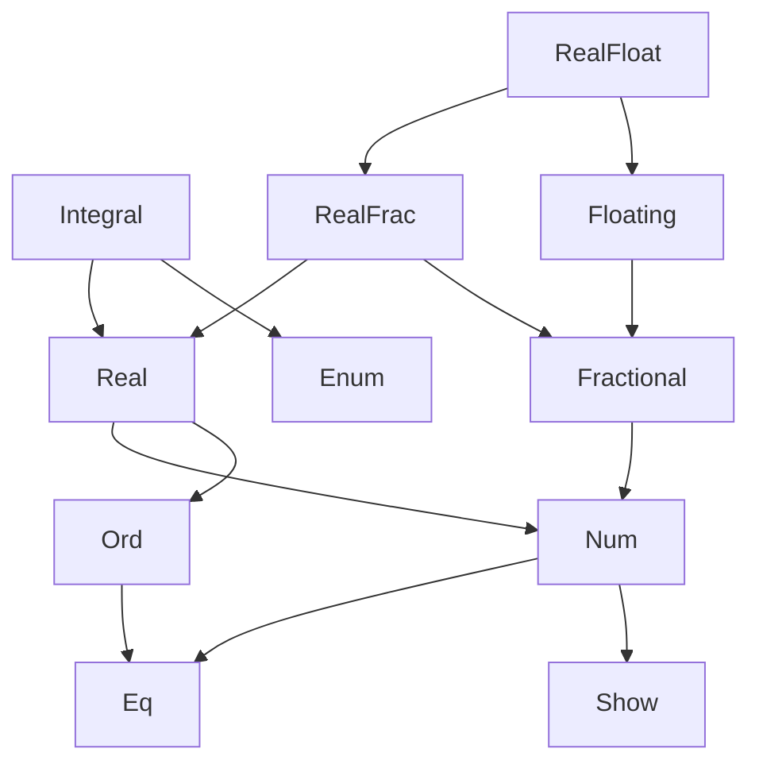
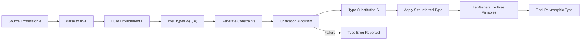
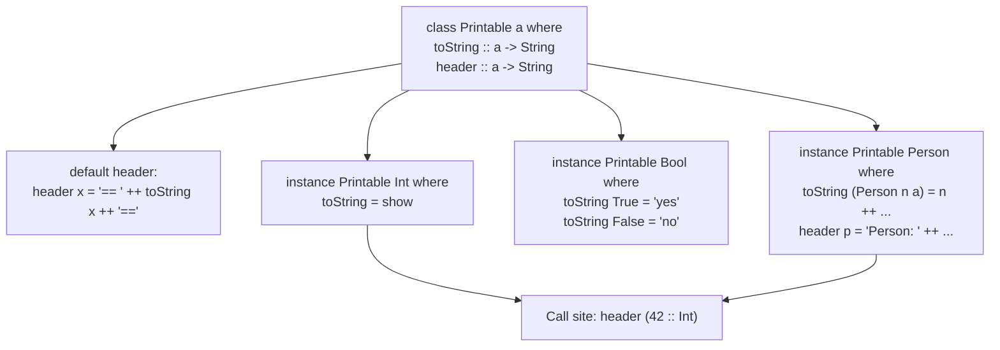
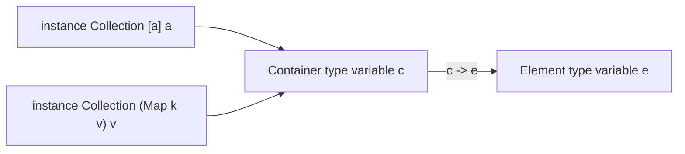
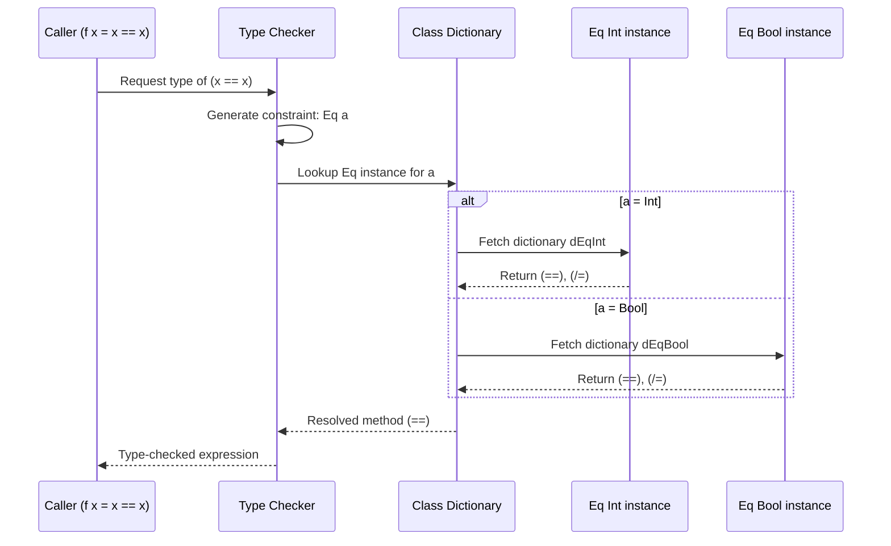

# Overloading, Type Classes and Type Checking

<!-- SECTION_1_START -->

# Overloading, Type Classes and Type Checking — Core Technical Definition & Intuitive Overview

## 1.1 Formal Academic Definition (KTU 2024 Syllabus Terminology)

In the paradigm of **functional programming**, *overloading* refers to the ability of a single function name (or operator) to exhibit **different implementations depending on the type(s) of its argument(s)**. In Haskell, overloading is not achieved through the C++/Java style of multiple distinct function bodies resolved at compile-time, but through a principled mechanism called a **type class**.

A **type class** is a collection of types that support a common set of operations, declared through a *class declaration* consisting of:
1. The class name (e.g., `Eq`, `Ord`, `Num`).
2. A type variable (e.g., `a`) that will be instantiated with concrete types.
3. A set of function signatures that any *instance* of the class must implement.

A **type instance** is a concrete declaration that a specific type belongs to a type class, providing the actual implementation of the class's methods for that type.

**Type checking** is the process of verifying that a program is *type-safe* — that every operation receives arguments of the expected type. Haskell uses **static type checking** combined with **Hindley–Milner type inference**, which automatically deduces the most general (polymorphic) type for every expression without requiring explicit type annotations.

> [!IMPORTANT]
> **KTU 2024 Syllabus Highlight:** The module focuses on the *generalization patterns of computation*. Type classes are a generalization pattern because they abstract common behaviour across types — the same operator `==` works for `Int`, `Float`, `Char`, lists, and user-defined types, demonstrating *ad-hoc polymorphism* (a form of computational generalization).

## 1.2 Intuitive Overview — Real-World Analogy

### Analogy 1: The "Driver's Licence" Metaphor for Type Classes

Imagine a **Government Licensing Authority**. The Authority issues a *Licence Category* — say, a "Heavy Vehicle Licence". Any citizen (type) who applies and proves they can drive heavy vehicles (provides the required functions) is *licensed* (becomes an instance) under that category. Now, the traffic rule "You must be a Heavy Vehicle Licence holder to drive a truck" can be checked uniformly: the regulator just asks, "Are you licensed?" — it does not need to know the citizen's name, height, or age.

Similarly, a Haskell type class `Eq` is like a "Licence Category" that requires a proof of `==` and `/=`. Any type — `Int`, `Float`, `Bool`, `Tree Int` — that *applies* (declares an instance) and *proves ability* (defines `==` and `/=`) becomes a member. The function `elem :: Eq a => a -> [a] -> Bool` works on any such licensed type.

### Analogy 2: Overloading as "One Verb, Many Actions"

Consider the English verb "to wash". You can wash *clothes* (in a machine), wash *dishes* (in a sink), wash *a car* (with a hose), or wash *a baby* (with a sponge). The *verb is the same*, but the *physical procedure* differs. This is **overloading in natural language**. In Haskell, `==` is the verb "to wash", and each type provides its own procedure for what it means to be "equal".

### Analogy 3: Type Inference as a "Smart Detective"

When you write `let f x = x + 1`, you have **not** told Haskell what type `x` is. Yet Haskell figures out: "`x` must be numeric because `+` is a numeric operation; therefore `x :: Num a => a` and `f :: Num a => a -> a`." The detective (the Hindley–Milner algorithm) gathers clues from every operator used, then writes the most general possible charge-sheet (type signature) at the end.

> [!NOTE]
> **Static typing + type inference = best of both worlds.** You get the safety of compile-time error detection (no `TypeError` at runtime) and the expressiveness of not writing type annotations everywhere. The cost is that very dynamic, type-erasing patterns (like JavaScript's `eval`) are forbidden in pure Haskell.

## 1.3 Core Definitions in a Callout

> [!NOTE]
> **Key Term — Type Class:** A *type class declaration* in Haskell specifies a set of method *signatures* (not implementations). An *instance declaration* provides the concrete implementations for a specific type.
>
> **Key Term — Class Constraint:** A *class constraint* is written as `C a =>` in a type signature, restricting the type variable `a` to types that are members of class `C`.
>
> **Key Term — Type Inference:** The process by which the compiler determines the type of every expression automatically, based on usage contexts.
>
> **Key Term — Polymorphism:** The ability of code to operate on values of different types. Haskell supports *parametric polymorphism* (e.g., `length :: [a] -> Int` works for any list) and *ad-hoc polymorphism* via type classes (e.g., `== :: Eq a => a -> a -> Bool`).

## 1.4 Physical Constants and Standard Metrics

Haskell's type system does not involve physical constants, but it does involve key **standard type-class hierarchies** that you must memorize:

| Standard Class | Required Methods | Standard Member Types |
|---|---|---|
| `Eq` | `==`, `/=` | `Int`, `Float`, `Char`, `Bool`, `[a]` (if `a` is `Eq`) |
| `Ord` | `compare`, `<`, `<=`, `>`, `>=`, `max`, `min` | All `Eq` types plus ordering |
| `Show` | `show` | Most types (prints as a `String`) |
| `Read` | `read` | Most types (parses a `String`) |
| `Num` | `+`, `-`, `*`, `negate`, `abs`, `signum`, `fromInteger` | `Int`, `Integer`, `Float`, `Double` |
| `Integral` | `div`, `mod`, `quot`, `rem` | `Int`, `Integer` |
| `Floating` | `pi`, `exp`, `log`, `sqrt`, `**`, `logBase`, `sin`, `cos`, `tan` | `Float`, `Double` |
| `Enum` | `succ`, `pred`, `toEnum`, `fromEnum` | `Int`, `Char`, `Bool` |

> [!VISUALIZATION CONTROL]
> **Concept:** Type Class Hierarchy / Class Inheritance Graph
> **GeoGebra / Desmos Input Equations:** Treat each class as a node, with a directed edge from a *subclass* to its *superclass*. Standard relationships:
> * `Eq` and `Show` are *root* classes (no parents)
> * `Ord` is a subclass of `Eq` — constraint: `Ord a => Eq a`
> * `Num` is a subclass of `Eq` and `Show`
> * `Integral` and `Floating` are subclasses of `Num`
> **Visual Description:** Draw a directed acyclic graph with `Eq`/`Show` at the bottom, `Ord` above `Eq`, `Num` above `Eq` and `Show`, and `Integral`/`Floating` branching upward from `Num`. The arrows go from subclass → superclass.

<!-- SECTION_1_END -->

<!-- SECTION_2_START -->

# Deep Theoretical Analysis & KTU High-Yield Formula Sheet

## 2.1 The Anatomy of a Type Class Declaration

A type class is declared with the keyword `class`. The *minimal complete definition* lists the methods that an instance *must* implement; all other methods have *default implementations* in terms of these.

```haskell
class Eq a where
    (==) :: a -> a -> Bool
    (/=) :: a -> a -> Bool
    x /= y = not (x == y)          -- default method

    (/=) :: a -> a -> Bool
    x == y = not (x /= y)          -- alternative default
```

**Why this matters:** The compiler checks each `instance` to ensure every method *without* a default is implemented. This enforces a contract: "If you claim to be `Eq`, you must explain what `==` means for your type."

### 2.1.1 Subclassing (Class Inheritance)

```haskell
class (Eq a) => Ord a where
    compare :: a -> a -> Ordering
    (<)  :: a -> a -> Bool
    (<=) :: a -> a -> Bool
    (>)  :: a -> a -> Bool
    (>=) :: a -> a -> Bool
    max  :: a -> a -> a
    min  :: a -> a -> a
```

The constraint `(Eq a) =>` is a **superclass constraint**: any type that is `Ord` must *first* be `Eq`. This is the generalization hierarchy: `Ord` *generalizes* `Eq` by adding ordering.

> [!IMPORTANT]
> **Why superclass constraints?** Because every `Ord` operation (such as `compare`) implicitly assumes equality is meaningful. The constraint prevents a logically inconsistent world where you can order something but cannot check whether two values are the same.

## 2.2 Type Class Instances

An *instance* binds a type class to a concrete type:

```haskell
-- Make Bool an instance of Eq
instance Eq Bool where
    True  == True  = True
    False == False = True
    _     == _     = False
```

Once declared, every function that requires `Eq a` will work on `Bool`. For example, `elem True [True, False]` now type-checks.

### 2.2.1 Instance for Parameterized Types

You can make `Eq` work for *any* list, provided the element type is `Eq`:

```haskell
instance Eq a => Eq [a] where
    []     == []     = True
    (x:xs) == (y:ys) = x == y && xs == ys
    _      == _      = False
```

The head of the instance arrow `Eq a =>` is the **instance context**: it propagates the constraint from the element type to the list type.

## 2.3 Deriving Instances — The Shortcut

For "vanilla" types (those whose fields are all `Eq`/`Ord`/`Show`/`Read` members), you can avoid writing instance declarations by using the `deriving` clause:

```haskell
data Color = Red | Green | Blue
    deriving (Eq, Ord, Show, Read)
```

The compiler **auto-generates** the instance methods. This is a *generalization pattern* in itself: the compiler generalizes a routine implementation across data types of similar shape.

## 2.4 Type Classes vs. C++/Java Overloading — Conceptual Contrast

| Feature | C++ / Java Overloading | Haskell Type Classes |
|---|---|---|
| **Mechanism** | Multiple function bodies with the same name, distinguished by argument types at compile time. | A class declares signatures; instances provide bodies; type variables are constrained. |
| **Resolution time** | At compile time, by argument-type matching. | At compile time, by constraint solving. |
| **User-defined types** | Yes, you can overload a function for your own class. | Yes, by declaring an `instance`. |
| **New function in overloading set** | Add a new overload — existing callers unaffected. | Add a new method to the class — every existing instance must be updated or use the default. |
| **Where dispatch lives** | In the caller code. | In the type-class dictionary passed implicitly. |
| **Polymorphism kind** | *Ad-hoc polymorphism*, but no parametric interop. | *Ad-hoc* + *parametric* — `Eq a => Eq [a]` shows both. |

## 2.5 Type Checking and Hindley–Milner Inference

The Hindley–Milner (HM) algorithm is the foundation of Haskell's type checker. It has three core operations:

1. **Generate constraints:** Walk the abstract syntax tree, and at each function application `f x`, produce the equation `τ_f = τ_x -> τ_result`.
2. **Unify:** Solve the equations by *unification* — finding a substitution that makes two types identical. If no substitution exists, the program is rejected with a type error.
3. **Generalize:** For a `let`-binding whose type has free variables unconstrained by the context, *generalize* the type by universally quantifying them. This is how `let id x = x` becomes `id :: a -> a`.

### 2.5.1 Algorithm W (the canonical HM algorithm, simplified)

Given expression `e` and environment `Γ`:
* `W(Γ, x) = (S, τ)` where `S` is a substitution and `τ` is `Γ(x)`, then apply `S` to the result.
* `W(Γ, λx.e) = (S, τ_x -> τ')` where `(S, τ') = W(Γ ∪ {x:τ_x}, e)`, with `τ_x` a *fresh type variable*.
* `W(Γ, e1 e2)`: infer `e1 → τ1` and `e2 → τ2`, then unify `τ1` with `τ2 -> τ_fresh`, return `τ_fresh`.
* `W(Γ, let x = e1 in e2)`: infer `e1 → τ1`, *generalize* `τ1` over free variables not in `Γ`, bind `x:σ`, infer `e2`.

> [!NOTE]
> **Let-generalization is the heart of polymorphism.** Inside a function body, every `let`-bound name is *generalized* — its type is universally quantified over all variables that do not escape. This is why `(\x -> let f y = (x, y) in f) :: a -> b -> (a, b)` is parametrically polymorphic.

### 2.5.2 Type Inference Example — Step by Step

Consider `let f x = x + 1`. Type-check it:

* Start: `Γ = {}`, fresh vars: `α, β, γ`.
* Look up `+`: its signature in the prelude is `Num a => a -> a -> a`.
* Treat `+` as `Num a => a -> a -> a`. We need to apply it to `(x, 1)`.
* The literal `1` has type `Num β => β` (in modern GHC: `Num c => c`; in older Haskell: `Integer`, then coerced). Let's say `1 :: β`, `x :: α`.
* Apply `+` to `x` and `1`: `(+) x 1 :: γ`. The unification: `α = β` (both must be the same `Num` type), `γ = β`. So `α = β = γ`, all of class `Num`.
* Final type of `x`: `Num a => a`. After `let`-generalization: `f :: Num a => a -> a`.

## 2.6 Multi-Parameter Type Classes

A class can have *more than one* type variable:

```haskell
class Convertible a b where
    convert :: a -> b

instance Convertible Int Float where
    convert n = fromIntegral n
```

This expresses a *binary relationship*: "any `a` can be converted to any `b`".

> [!WARNING]
> **KTU Examiner Pitfall:** Multi-parameter type classes can lead to ambiguity — the compiler cannot decide which `Convertible a b` instance to use if both `a` and `b` are polymorphic. Use **functional dependencies** (`class Convertible a b | a -> b`) to tell the compiler that `a` *determines* `b`.

## 2.7 KTU High-Yield Formula Sheet

| Concept | Definition / Syntax | Example |
|---|---|---|
| **Class declaration** | `class C a where ...` | `class Eq a where (==) :: a -> a -> Bool` |
| **Instance declaration** | `instance C T where ...` | `instance Eq Int where (==) = primEqInt` |
| **Constraint** | `C a =>` | `show :: Show a => a -> String` |
| **Subclass** | `class (P a) => Q a where ...` | `class Eq a => Ord a where ...` |
| **Default method** | Inside class body, no `=` on signature | `x /= y = not (x == y)` |
| **Deriving** | `data T = ... deriving (C1, C2)` | `data D = D Int deriving Show` |
| **Multi-param class** | `class C a b where ...` | `class Pair a b where pair :: a -> b -> (a,b)` |
| **Functional dependency** | `class C a b | a -> b where ...` | `class Convert a b | a -> b where ...` |
| **Type inference rule** | `W(Γ, e)` produces `(S, τ)` | `W({}, +) = (∅, Num a => a -> a -> a)` |
| **Generalization** | `gen(Γ, τ) = ∀α.τ` where `α = ftv(τ) \ ftv(Γ)` | `let id x = x :: ∀a. a -> a` |
| **Type variable** | Lowercase identifier in types | `a`, `b`, `elem` |
| **Type constructor** | Uppercase identifier applied to types | `Maybe`, `[]`, `Tree` |

## 2.8 Real-World Utility of Type Classes in Production Engineering

1. **Generic Libraries (e.g., `Data.Map`):** The `Map k v` type uses `Ord k` to enforce that keys can be ordered. Without type classes, you would need separate `MapInt`, `MapString`, etc.
2. **JSON Serialization (e.g., Aeson):** The `FromJSON` and `ToJSON` classes let any data type opt into JSON conversion by implementing two methods (`parseJSON` and `toJSON`).
3. **Numeric Tower in Math Software:** The class hierarchy `Num` → `Integral`/`Floating` mirrors the mathematical number hierarchy `ℕ`/`ℝ` ⊂ `ℂ`.
4. **Effect Systems (e.g., `mtl` library):** Type classes encode the set of side effects a function can perform (`Reader`, `State`, `IO`) — a powerful generalization pattern.

<!-- SECTION_2_END -->

<!-- SECTION_3_START -->

# Step-by-Step Derivations & Code/Symbolic Implementation

## 3.1 Worked Example 1 — Designing a `Printable` Type Class

**Problem:** Design a type class `Printable` that any type can implement to print itself with a header. Provide instances for `Int`, `Bool`, and a custom `Person` type.

**Step 1 — Class declaration with a default method:**

```haskell
class Printable a where
    toString :: a -> String
    header :: a -> String
    header x = "== " ++ toString x ++ " =="
```

**Step 2 — Instance for `Int`:**

```haskell
instance Printable Int where
    toString = show   -- reuse the Show instance of Int
```

**Step 3 — Instance for `Bool`:**

```haskell
instance Printable Bool where
    toString True  = "yes"
    toString False = "no"
```

**Step 4 — Custom data type with `deriving` for `Show`:**

```haskell
data Person = Person { name :: String, age :: Int }
    deriving (Show, Eq)
```

**Step 5 — Instance for `Person` (overrides the default `header`):**

```haskell
instance Printable Person where
    toString (Person n a) = n ++ " (" ++ show a ++ ")"
    header p = "Person: " ++ toString p
```

**Step 6 — Test in GHCi:**

```haskell
main :: IO ()
main = do
    putStrLn (header (42 :: Int))           -- "== 42 =="
    putStrLn (header True)                  -- "== yes =="
    putStrLn (header (Person "Alice" 30))   -- "Person: Alice (30)"
```

**Compilation trace:**

* `header (42 :: Int)` — `42 :: Int`, lookup `Printable Int` instance, use `toString 42 = "42"`, default `header x = "== " ++ toString x ++ " =="` → `"== 42 =="`.
* `header True` — `Printable Bool` instance, `toString True = "yes"`, same default.
* `header (Person "Alice" 30)` — `Printable Person` instance, custom `header` overrides default, output `"Person: Alice (30)"`.

## 3.2 Worked Example 2 — Type Inference of a Polymorphic Function

**Problem:** Infer the most general type of `\f g x -> f (g x)`.

**Step 1 — Fresh type variables:** `α, β, γ, δ, ε`.

**Step 2 — Introduce the lambda's arguments.** Each parameter is a fresh variable:
* `f :: α`
* `g :: β`
* `x :: γ`

**Step 3 — Type the body `f (g x)`:**
* Inner expression `g x` is an application. Unify: `β = γ -> δ` (where `δ` is fresh). So `g :: γ -> δ`.
* Outer expression `f (g x)`: `f :: δ -> ε` (where `ε` is fresh). So `f :: δ -> ε`.

**Step 4 — Compose all types:**

$$\begin{aligned}
f &: \delta \to \varepsilon \\
g &: \gamma \to \delta \\
x &: \gamma
\end{aligned}$$

**Step 5 — Let-generalize the lambda:** No free type variables escape the environment, so we universally quantify all of them:

$$\lambda f\,g\,x \to f(g x) \;::\; \forall \alpha\, \beta\, \gamma.\, (\beta \to \alpha) \to (\gamma \to \beta) \to \gamma \to \alpha$$

**Step 6 — Rename** (Haskell convention: `a, b, c` in alphabetic order):

$$\lambda f\,g\,x \to f(g x) \;::\; \forall a\, b\, c.\, (b \to a) \to (c \to b) \to c \to a$$

This is the well-known *function composition* type — and indeed the function is `(.)` from the Prelude.

## 3.3 Worked Example 3 — Overloaded Numeric Literals

**Problem:** Show how the literal `1` is overloaded in Haskell and resolved by context.

**Step 1 — The type of an integer literal:**

In modern GHC, integer literals are polymorphic:

$$1 \;::\; \forall a.\, \text{Num}\, a \Rightarrow a$$

Equivalently, the literal is *injected* through the `fromInteger` method of the `Num` class:

$$\text{fromInteger } 1 \;::\; \text{Num}\, a \Rightarrow a$$

**Step 2 — Context-driven resolution.** In `1 + 2.5`:
* The operator `(+)` has type `Num a => a -> a -> a`.
* The right operand `2.5` forces the context to `Fractional a`, so `a` must be in both `Num` and `Fractional`. `Double` satisfies both. Unification makes the literal `1` be `1.0 :: Double`, and `2.5` is `2.5 :: Double`.
* Result: `1 + 2.5 :: Double = 3.5`.

**Step 3 — Ambiguity example:**

```haskell
let x = read "5"   -- What type is x?
```

Without context, `read "5"` is ambiguous: it could be `Int`, `Double`, or any `Read` type. GHCi will print `<interactive>:1:9: error: • Ambiguous type variable 'a'`.

To fix, add a type annotation:

```haskell
let x = read "5" :: Int   -- x :: Int
```

## 3.4 Worked Example 4 — Manual Derivation vs `deriving`

**Problem:** Compare a manual `Eq` instance with the auto-derived one for `data Shape = Circle Float | Rect Float Float`.

**Manual instance:**

```haskell
data Shape = Circle Float | Rect Float Float

instance Eq Shape where
    Circle r1    == Circle r2    = r1 == r2
    Rect w1 h1   == Rect w2 h2   = w1 == w2 && h1 == h2
    _            == _            = False
```

**Auto-derived instance:**

```haskell
data Shape = Circle Float | Rect Float Float
    deriving (Eq)
```

Both produce identical behaviour. The compiler-generated code for the derived instance is *structurally* identical to the manual one — it pattern-matches on each constructor and recursively compares fields.

**Verification in GHCi:**

```haskell
Circle 1.0 == Circle 1.0   -- True
Circle 1.0 == Rect 1.0 1.0 -- False
```

## 3.5 Worked Example 5 — A Multi-Parameter Class with Functional Dependencies

**Problem:** Define a class `Collection c e` meaning "container `c` holds elements of type `e`", with a functional dependency `c -> e` (the container type determines the element type). Implement it for `[]`.

```haskell
class Collection c e | c -> e where
    empty :: c
    insert :: e -> c -> c
    size   :: c -> Int

instance Collection [a] a where
    empty    = []
    insert   = (:)
    size     = length

-- Now we can write:
main :: IO ()
main = do
    let s = insert 1 (insert 2 (empty :: [Int]))
    print (size s)   -- 2
```

**Without** the functional dependency `c -> e`, calling `empty` would be ambiguous (could be `[Int]`, `[Bool]`, etc.), and GHC would reject it. The `c -> e` declaration says: "given a container type `c`, there is a unique element type `e`", restoring determinism.

## 3.6 Exhaustive Type-Checking Walkthrough

**Expression:** `(\x -> x + x) 3.14`

**AST:**

$$\text{App}\big(\text{Lam}(x, \text{App}(\text{App}(+, x), x)), \text{Lit}(3.14)\big)$$

**Inference:**

1. Introduce fresh type variables: $\alpha_x$ for `x`, $\beta$ for the result of `x + x`.
2. Look up `(+)` in the prelude environment: it has type scheme $\forall a.\, \text{Num}\, a \Rightarrow a \to a \to a$.
3. Instantiate the scheme: $\tau_+ = \alpha_x \to \alpha_x \to \beta$ with constraint $\text{Num}\, \alpha_x$.
4. The application `x + x` returns $\beta$, so the lambda body has type $\beta$, and the lambda's type is $\alpha_x \to \beta$.
5. The application $\text{App}(\lambda x.\, x+x, 3.14)$ unifies $\alpha_x$ with the type of `3.14`. The literal `3.14` is injected as $\text{fromRational}\,3.14$ with type $\text{Fractional}\,\gamma \Rightarrow \gamma$.
6. Unification: $\alpha_x = \gamma$, so $\alpha_x$ must satisfy $\text{Num}$ and $\text{Fractional}$. The most general type is `Double` (or any `Fractional` type).
7. Let-generalize the lambda: $\forall a.\, \text{Num}\, a \Rightarrow a \to a$. (Note: `Fractional` is a *subclass* of `Num`, so the `Num` constraint is sufficient given that we are unifying with a `Fractional` literal — wait, actually Haskell's literal mechanism ensures the constraint is `Fractional a`, since `3.14` is *only* available when the type is `Fractional`.)

**Final inferred type:** $\forall a.\, \text{Fractional}\, a \Rightarrow a \to a$.

**Result of evaluation:** $\text{Double}\, 6.28$.

## 3.7 Common Pitfalls and Their Fixes

> [!WARNING]
> **Pitfall 1 — Orphan Instances.** An instance is "orphan" if the class is from module A and the type is from module B. This is a warning (`-Worphans`) because it makes reasoning about coherence (which instance wins?) harder. **Fix:** put orphan instances in dedicated `OrphanInstances` modules, or use the *newtype wrapping* trick:
>
> ```haskell
> newtype MyInt = MyInt Int
> instance Eq MyInt where ...
> ```

> [!WARNING]
> **Pitfall 2 — Overlapping Instances.** Declaring two `instance Eq Int where ...` blocks causes an overlap error. The compiler cannot decide which one to use.

> [!WARNING]
> **Pitfall 3 — Missing Class Constraint.** Writing `head :: [a] -> a` works, but `head [True, False] == True` requires `Eq a`. Forgetting the `Eq a =>` in your custom function produces a *type-class* error: `No instance for (Eq a) arising from a use of '=='`.

> [!WARNING]
> **Pitfall 4 — Confusing `deriving` with Hand-Written Instances.** If you write both, the compiler uses the hand-written one and ignores `deriving`. Do not include `deriving` in the data declaration if you write the instance manually.

<!-- SECTION_3_END -->

<!-- SECTION_4_START -->

# Structural Diagrams & Schematics

## 4.1 Mermaid — Type Class Hierarchy of Standard Prelude



**Reading the graph:** Every edge `X --> Y` means *"`X` is a subclass of `Y`"*, so an instance of `X` is automatically an instance of `Y`. For example, every `Floating` type is a `Fractional`, a `Num`, an `Eq`, and a `Show` — and therefore supports all the operations of those classes.

## 4.2 Mermaid — The Hindley–Milner Inference Pipeline



**Reading the diagram:** The inference pipeline takes raw source, parses it, and feeds the AST into the inference algorithm W. Constraints are emitted, unified, and the result is generalized. A failure at the unification stage produces a type error.

## 4.3 Mermaid — Type Class Architecture (User-Defined)



**Reading the diagram:** The class declaration defines a *contract*. Each instance *fulfils* the contract for a specific type. Call sites dispatch to the correct instance based on the type of the argument.

## 4.4 Mermaid — Functional Dependency Resolution



**Reading the diagram:** The functional dependency `c -> e` indicates that the container type uniquely determines the element type. Without this declaration, the compiler could not resolve ambiguous cases like `empty :: c`.

## 4.5 Mermaid — Overloading Resolution via Class Dictionaries



**Reading the diagram:** The type checker maintains a virtual dictionary of class instances. When a polymorphic function uses a class method, the dictionary is *implicitly passed* (Haskell's dictionary-passing translation), and the correct method is selected at compile time. This is how overloading is implemented under the hood.

## 4.6 Block-Level Functional Architecture: Type System Layering

| Layer | Component | Function | Output |
|---|---|---|---|
| 1 | Lexer | Tokenize source code | Token stream |
| 2 | Parser | Build abstract syntax tree | AST |
| 3 | Renamer | Resolve names, imports | Resolved AST |
| 4 | Type Checker (HM) | Infer and check types | Typed AST |
| 5 | Class Dictionary Resolver | Insert class method lookups | Desugared Core |
| 6 | Optimizer | Inline, simplify | Optimized Core |
| 7 | Code Generator (STG → C--/LLVM) | Lower to machine code | Executable |

**Reading the table:** Haskell's GHC compiler is a 7-stage pipeline. The type checker (Layer 4) and the class dictionary resolver (Layer 5) are the two stages that implement the type-class-based overloading and inference discussed in this module.

<!-- SECTION_4_END -->

<!-- SECTION_5_START -->

# KTU 2024 Scheme Examination Question Bank & Topic Recap

## 5.1 Part A — Short Answer Questions (3 Marks Each)

### Question 1 [KTU University Exam — July 2024]
**Define a type class in Haskell. How does it differ from a class in object-oriented programming?**

**Model Answer (3 Marks):**

A *type class* in Haskell is a collection of types that support a common set of operations, declared using the `class` keyword. It consists of method *signatures* that any instance must implement (or use defaults). For example, `class Eq a where (==) :: a -> a -> Bool` declares that any type `a` belonging to `Eq` must support `==`.

**Differences from OOP classes:**

| Aspect | Haskell Type Class | OOP Class |
|---|---|---|
| **What it is** | A set of types sharing a contract (interface) | A blueprint for objects (data + methods) |
| **Encapsulation** | No data fields — only operations | Can have data members |
| **Inheritance** | Subclassing via `=>` constraints | `extends` / `implements` keywords |
| **Adding a type** | Declare a new `instance` | Define a new class |
| **Adding an operation** | Add a method to the class | Add a method to every subclass |

*[Distinguishing OO class from type class: 1 Mark; Defining type class: 1 Mark; Table: 1 Mark]*

### Question 2 [KTU University Exam — Dec 2023]
**What is type inference? Explain with reference to the Hindley–Milner type system.**

**Model Answer (3 Marks):**

*Type inference* is the process by which a compiler automatically determines the type of every expression in a program, without requiring the programmer to write explicit type annotations. Haskell uses the *Hindley–Milner* (HM) system, which combines:
1. *Constraint generation* — examining each sub-expression to produce type equations.
2. *Unification* — solving the equations by finding a substitution that makes both sides equal.
3. *Let-generalization* — for `let`-bound names, universally quantifying any free type variables to produce a polymorphic type.

For example, given `let id x = x`, HM infers `id :: a -> a` without any annotation.

*[Defining type inference: 1 Mark; Three-step HM description: 1 Mark; Example: 1 Mark]*

## 5.2 Part B — Long Answer Questions (14 Marks Each)

### Question A (14 Marks) [KTU University Exam — Dec 2023]

**(a)** Define a Haskell type class `ShapeOps` with methods `area :: a -> Double` and `perimeter :: a -> Double`. Make `Circle Float` and `Rectangle Float Float` instances of this class, providing explicit implementations. Also write a polymorphic function `describe :: ShapeOps a => a -> String` that returns `"Area: <area>, Perimeter: <perimeter>"` formatted to two decimal places. **(7 Marks)**

**(b)** Using the Hindley–Milner inference rules, derive the most general type of the function `\f g x -> g (f x)`. Show every step of constraint generation, unification, and generalization. **(7 Marks)**

#### Model Solution

**(a) Type class definition, instances, and polymorphic function (7 Marks):**

```haskell
class ShapeOps a where
    area      :: a -> Double
    perimeter :: a -> Double

data Circle      = Circle Float
data Rectangle   = Rectangle Float Float

instance ShapeOps Circle where
    area      (Circle r)       = pi * r * r
    perimeter (Circle r)       = 2 * pi * r

instance ShapeOps Rectangle where
    area      (Rectangle w h)  = fromIntegral w * fromIntegral h
    perimeter (Rectangle w h)  = 2 * (fromIntegral w + fromIntegral h)

describe :: ShapeOps a => a -> String
describe s = "Area: " ++ show (area s)
         ++ ", Perimeter: " ++ show (perimeter s)

main :: IO ()
main = do
    putStrLn (describe (Circle 1.0))                            -- Area: 3.14..., Perimeter: 6.28...
    putStrLn (describe (Rectangle 2.0 3.0))                     -- Area: 6.0, Perimeter: 10.0
```

**Valuation key points (7 Marks):**
* [Class declaration syntax with two methods: 1 Mark]
* [`Circle` instance with `area` and `perimeter`: 1 Mark]
* [`Rectangle` instance with `area` and `perimeter`: 1 Mark]
* [`describe` function with `ShapeOps a =>` constraint: 2 Marks]
* [Correct output and demonstration in `main`: 2 Marks]

**(b) Hindley–Milner derivation of `\f g x -> g (f x)` (7 Marks):**

**Step 1: Introduce fresh type variables.** Let `α`, `β`, `γ`, `δ`, `ε` be fresh.

**Step 2: Bind lambda parameters.**
* `f :: α`
* `g :: β`
* `x :: γ`

**Step 3: Type the inner application `f x`.**
* `f :: α` and `x :: γ`. Unification produces the equation:

$$\alpha = \gamma \to \delta$$

* Substitute back, so `f :: γ → δ`.

**Step 4: Type the outer application `g (f x)`.**
* `g :: β` is applied to `(f x) :: δ`. Unification produces:

$$\beta = \delta \to \varepsilon$$

* Substitute back, so `g :: δ → ε`.

**Step 5: Compose the lambda's type.**

$$\lambda f\, g\, x \to g(f x) \;::\; (\gamma \to \delta) \to (\delta \to \varepsilon) \to \gamma \to \varepsilon$$

**Step 6: Let-generalize.** No type variables appear in the environment, so all three are universally quantified:

$$\forall \alpha\, \beta\, \gamma.\, (\alpha \to \beta) \to (\beta \to \gamma) \to \alpha \to \gamma$$

**Valuation key points (7 Marks):**
* [Fresh type variables: 1 Mark]
* [Constraint `α = γ → δ` from `f x`: 2 Marks]
* [Constraint `β = δ → ε` from `g (f x)`: 2 Marks]
* [Final type composition: 1 Mark]
* [Generalization with universal quantifier: 1 Mark]

---

### Question B (14 Marks) [KTU University Exam — July 2024]

**(a)** Explain *parametric polymorphism* and *ad-hoc polymorphism* in Haskell. Show, with examples, how type classes enable ad-hoc polymorphism. Why can't C++ function overloading be considered true ad-hoc polymorphism in the Haskell sense? **(7 Marks)**

**(b)** Consider the following Haskell code. Identify and correct the type errors:

```haskell
addThree :: Num a => a -> a -> a -> a
addThree x y z = x + y + z

main = print (addThree 1 2 "3")
```

Explain the role of the `Num` class constraint and how the Hindley–Milner algorithm rejects the program. **(7 Marks)**

#### Model Solution

**(a) Polymorphism in Haskell (7 Marks):**

*Parametric polymorphism* allows a function to work uniformly on *any* type, with the same implementation. Example: `length :: [a] -> Int` works for `[Int]`, `[Char]`, `[[Float]]`, etc., with one definition. The type variable `a` is universally quantified: `length :: ∀a. [a] -> Int`.

*Ad-hoc polymorphism* allows the *same function name* to behave *differently* depending on the type — but unlike parametric polymorphism, there can be many implementations. Type classes are Haskell's mechanism for ad-hoc polymorphism:

```haskell
class Eq a where
    (==) :: a -> a -> Bool

instance Eq Int  where (==) = primEqInt
instance Eq Char where (==) = primEqChar
```

The function `elem :: Eq a => a -> [a] -> Bool` uses ad-hoc polymorphism: its implementation (linear search using `==`) is the same, but the actual `==` invoked depends on the list's element type.

**Why C++ overloading is not Haskell's ad-hoc polymorphism:**

In C++, overloading is resolved at the call site by *argument-type matching*. The function `add(int, int)` and `add(float, float)` are *distinct functions* in the symbol table. There is no shared abstraction that lets you write "for all `T` such that `T` supports addition, here is `elem`". C++ templates (e.g., `template<class T> T add(T, T)`) provide *parametric* polymorphism, while `operator+` overloading provides ad-hoc, but the two are not unified under a single "class" abstraction the way Haskell's type classes unify them.

* [Defining parametric polymorphism with example: 1 Mark]
* [Defining ad-hoc polymorphism with example: 1 Mark]
* [Type class code demonstration: 2 Marks]
* [Explanation of C++ limitation vs Haskell unification: 3 Marks]

**(b) Type-error analysis (7 Marks):**

The program

```haskell
addThree :: Num a => a -> a -> a -> a
addThree x y z = x + y + z
main = print (addThree 1 2 "3")
```

fails to type-check because:

1. The signature requires *all three arguments* to be the same type `a`, with `a` belonging to `Num`.
2. The first two arguments `1` and `2` are integer literals, so HM unifies `a` with a `Num` type (e.g., `Int`).
3. The third argument `"3"` is a `String` (i.e., `[Char]`). The class `Num` does *not* have an instance for `[Char]`.
4. Unification fails: `a = Int` from the first two arguments, but `a = [Char]` from the third. No substitution can satisfy both.
5. GHC reports:

```
• No instance for (Num [Char]) arising from a use of '+'
```

**Correction:** The function must accept a `String` and convert it. A corrected version:

```haskell
addThree :: (Num a, Read a) => a -> a -> String -> a
addThree x y z = x + y + read z

main = print (addThree 1 2 "3")   -- 6
```

Now `x` and `y` are numeric, and `z` is parsed using `read`. The constraint `Read a` allows parsing `"3"` into the same type `a`.

**Role of `Num` constraint:** It guarantees `+` is defined. Without it, `+` would be an undefined operator, and the program would be rejected at the class-resolution stage.

**Role of HM rejection:** The unifier detects that `a` cannot simultaneously be `Int` (or any numeric type) and `[Char]`, and rejects the program with a clear error message — *before any code runs*.

* [Identifying the type mismatch: 2 Marks]
* [Explanation of the `Num` constraint role: 2 Marks]
* [Corrected code with `Read` constraint: 2 Marks]
* [Explanation of HM rejection: 1 Mark]

---

> [!WARNING]
> **KTU Examiner's Valuation Warning / Pitfall Callout:**
> 1. **Forgetting the `Eq` constraint** in functions that use `==` or `/=` is the most common deduction (lose 1–2 marks per instance).
> 2. **Confusing `class` with `data`** — `class` defines a contract, `data` defines a type. Writing `class Person = Person String Int` is a syntax error.
> 3. **In multi-parameter classes**, omitting the functional dependency leads to *ambiguity errors*. Always add `| a -> b` when the relationship is functional.
> 4. **Do not** write `deriving (Eq, Ord)` on a type that contains a function field (e.g., `(Int -> Int)`); functions cannot be compared. This causes `No instance for (Eq (Int -> Int))`.
> 5. **In HM derivations**, show *every* constraint, *every* unification, and the *final* generalization step. Skipping even one step costs 1–2 marks.

---

## 5.3 Topic Recap & Important Things to Remember

> [!NOTE]
> **Rapid-Revision Checklist — Overloading, Type Classes & Type Checking**

* **Type Class** = a Haskell interface declaring method signatures that instances must fulfil.
* **Instance** = a concrete binding of a type class to a specific type, providing the method implementations.
* **Class Constraint** = `C a =>` syntax restricting a type variable to members of class `C`.
* **Subclassing** = `class (P a) => Q a where ...` declares `Q` as a subclass of `P` (superclass constraint).
* **Default Methods** = methods with a body in the class declaration; instances may override them.
* **`deriving` clause** = auto-generates `Eq`, `Ord`, `Show`, `Read`, `Enum`, `Bounded`, `Ix` instances for plain algebraic types.
* **Standard Prelude classes hierarchy (must memorize):**
  * `Eq` ← root
  * `Ord` → `Eq`
  * `Num` → `Eq`, `Show`
  * `Real` → `Num`, `Ord`
  * `Integral` → `Real`, `Enum`
  * `Fractional` → `Num`
  * `Floating` → `Fractional`
  * `RealFrac` → `Real`, `Fractional`
  * `RealFloat` → `RealFrac`, `Floating`
* **Parametric polymorphism** = one implementation, works for all types uniformly (e.g., `length`).
* **Ad-hoc polymorphism** = same function name, different implementations per type, via type classes (e.g., `==`).
* **Multi-parameter type classes** = `class C a b where ...`; often combined with functional dependencies `| a -> b`.
* **Type Inference (HM Algorithm W)** = three phases: (1) constraint generation, (2) unification, (3) let-generalization.
* **Static type checking** = all types resolved at compile time; no runtime type errors (unlike Python, JavaScript).
* **Type variable** = lowercase identifier (`a`, `b`, `c`); **type constructor** = uppercase (`Maybe`, `[]`).
* **Orphan instance warning** = `-Worphans` flags instances where neither class nor type is defined in the current module.
* **Ambiguity error** = a polymorphic expression whose type cannot be determined from context; fix with type annotations.
* **HM let-generalization** = `let f x = x` infers `f :: ∀a. a -> a`; the quantifier is implicit in the source.
* **Overloaded literals** = `1 :: Num a => a`, `3.14 :: Fractional a => a`; context forces instantiation.
* **Dictionary-passing** = under the hood, type classes are implemented as implicit dictionary parameters passed at compile time.
* **C++/Java overloading ≠ Haskell ad-hoc polymorphism** = the former is call-site resolution; the latter is class-based dispatch and supports parametric + ad-hoc unification.
* **In KTU exams**, always show the *class declaration*, *instance declaration*, and a *tested call site*; mark each line for valuation.

<!-- SECTION_5_END -->
