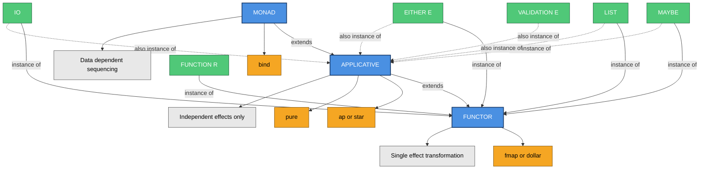
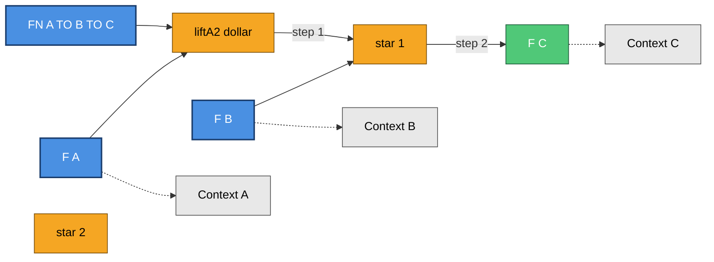
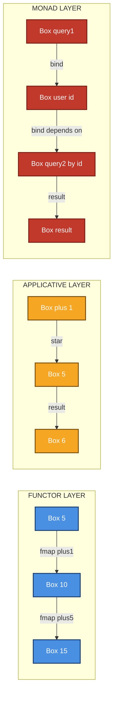

# Functors, Applicatives structural patterns layout guidelines design syntax

<!-- SECTION_1_START -->

# Functors & Applicatives: Structural Patterns & Design Syntax

## 1.1 Core Technical Definition

In **Haskell** and the broader **pure functional programming** paradigm, a **Functor** is a *type class* that abstracts the notion of mapping a function over a wrapped (or *contextualised*) value without altering the **context** or **structure** of that wrapper. Formally, a Functor is defined for a higher-kinded type constructor $F$ such that the operation $fmap\ :\ (a \to b) \to F\ a \to F\ b$ is well-defined and respects the algebraic laws of identity and composition.

An **Applicative** is a *strict generalisation* of Functor. It represents any type constructor $F$ that can **embed a pure value into a context** (via the $pure$ operation) and can **apply a wrapped function to a wrapped value** (via the $<\!*\!>$ operation). In the canonical KTU 2024 Scheme phrasing, an Applicative is a *Functor that supports multi-argument lifting without the data-dependency constraints of a Monad*.

> [!IMPORTANT]
> **KTU 2024 Syllabus Highlight:**
> The structural pattern hierarchy in functional abstraction is:
>
> **Functor** (single-argument lifting) $\;\rightarrow\;$ **Applicative** (independent multi-argument lifting) $\;\rightarrow\;$ **Monad** (data-dependent sequential lifting)
>
> Each successive class strictly *enriches* the expressive power of the previous one.

## 1.2 Conceptual Analogy & Intuition

### The "Boxed Value" Analogy

Imagine every value lives inside a *sealed, transparent box*:

- A **`Functor`** is any box that can be *opened transparently* so that you may transform its contents with a function $f : a \to b$. The shape, label, and structural identity of the box remain intact — only the inner payload changes. So $fmap\ f\ (Box\ 5) = Box\ 10$ when $f = (2 \times)$.

- An **`Applicative`** is a *tray of boxes* that can be aligned and combined by a single external operator $<\!*\!>$. Crucially, the boxes being combined are **mutually independent** — the function inside one box does not peek at the contents of the others. The tray can either succeed (produce a single combined box) or fail (return an empty/error box), but the combination logic cannot adapt to a particular inner value.

> [!NOTE]
> **Why the distinction matters:** When the *next step depends on a previous result* (e.g., a database query whose next query depends on a previously fetched user ID), you need a **Monad**. When the steps are *independent* (e.g., parsing two configuration values simultaneously), the **Applicative** abstraction is *sufficient and structurally cleaner* — and is, in fact, the *recommended* choice in production code for parallelisable workflows.

### Geometric Intuition

Conceptually, a Functor $F$ is a **structure-preserving map** between categories: it sends objects of category $\mathcal{C}$ to objects of category $\mathcal{D}$ (via the type constructor) and arrows (functions) to arrows (lifted functions). The Functor laws ensure that the **identity morphism** and **arrow composition** are preserved — a property called *functoriality* in category theory.

## 1.3 Operational Summary Table

| Abstraction | Core Operation | Type Signature | Intuitive Power |
|---|---|---|---|
| **Functor** | $fmap$ | $(a \to b) \to F\ a \to F\ b$ | Transform one boxed value |
| **Applicative** | $<\!*\!>$ | $F\ (a \to b) \to F\ a \to F\ b$ | Combine independent boxed values |
| **Applicative (helper)** | $pure$ | $a \to F\ a$ | Lift a pure value into a box |
| **Applicative (helper)** | $liftA2$ | $(a \to b \to c) \to F\ a \to F\ b \to F\ c$ | Lift a binary function |

<!-- SECTION_1_END -->

<!-- SECTION_2_START -->

# 2. Deep Theoretical Analysis & KTU High-Yield Formula Sheet

## 2.1 The Functor Type Class — Structural Blueprint

A **Functor** is the *minimal* abstraction that supports contextual mapping. Its structural design has two mandatory components:

1. **The class declaration** specifying the higher-kinded parameter $f$ and the abstract operation $fmap$.
2. **A set of algebraic laws** that any instance *must* obey to be considered a *well-formed* Functor.

### Functor Laws (Compulsory for every instance)

Let $id$ denote the identity function $x \mapsto x$ and $(\circ)$ denote function composition:

$$
\begin{aligned}
\text{(F1) Identity Law:} \quad & fmap\ id = id \\
\text{(F2) Composition Law:} \quad & fmap\ (g \circ f) = fmap\ g \circ fmap\ f
\end{aligned}
$$

> [!NOTE]
> **Why F1 and F2 matter:** They guarantee that mapping the identity does nothing, and that mapping a *composite* function equals composing the *individual mappings*. Without these laws, $fmap$ would be an arbitrary (and thus unpredictable) operation.

## 2.2 The Applicative Type Class — Structural Blueprint

An **Applicative** *inherits* from Functor and adds two new operations: $pure$ (lifting a value) and $<\!*\!>$ (combining independent contexts). It is the *correct* abstraction whenever the *effects/contexts are independent* and the combination logic is *uniform*.

### Applicative Laws (Compulsory for every instance)

$$
\begin{aligned}
\text{(A1) Identity:} \quad & pure\ id \Diamond v = v \\
\text{(A2) Composition:} \quad & pure\ (\circ) \Diamond u \Diamond v \Diamond w = u \Diamond (v \Diamond w) \\
\text{(A3) Homomorphism:} \quad & pure\ f \Diamond pure\ x = pure\ (f\ x) \\
\text{(A4) Interchange:} \quad & u \Diamond pure\ y = pure\ (\$\ y) \Diamond u
\end{aligned}
$$

> [!IMPORTANT]
> **Design Syntax Note:** The symbol $\Diamond$ in the laws above is a *mathematical alias* for the Haskell operator $<\!*\!>$. In production Haskell, $<\!*\!>$ is left-associative and binds at *function-application precedence*, allowing chained independent effects to be expressed readably: $pure\ f \Diamond\ x \Diamond\ y \Diamond\ z$.

## 2.3 Derived Combinators — The Layout Vocabulary

The following are *canonical derived functions* that production Haskell code uses to express the **Applicative design syntax**:

| Derived Function | Type Signature | Purpose |
|---|---|---|
| $(<\$>) \equiv fmap$ | $(a \to b) \to F\ a \to F\ b$ | Infix synonym; preferred style in modern code |
| $liftA$ | $(a \to b) \to F\ a \to F\ b$ | Same as $fmap$; emphasises the Applicative context |
| $liftA2$ | $(a \to b \to c) \to F\ a \to F\ b \to F\ c$ | Lift a binary function — the *workhorse* combinator |
| $liftA3$ | $(a \to b \to c \to d) \to F\ a \to F\ b \to F\ c \to F\ d$ | Lift a ternary function |
| $(<\*\!\*) \equiv sequenceL$ | $F\ (F\ a) \to F\ (F\ a)$ | Apply each action, collect results |
| $sequenceA$ | $[F\ a] \to F\ [a]$ | Sequence a list of independent actions |

## 2.4 KTU High-Yield Formula Sheet

| # | Name | Equation / Type Signature | Domain / Use Case |
|---|---|---|---|
| 1 | Functor $fmap$ | $fmap\ :\ (a \to b) \to F\ a \to F\ b$ | General lifting; structural transformation |
| 2 | Identity Law | $fmap\ id \equiv id$ | Verifies well-formedness of instance |
| 3 | Composition Law | $fmap\ (g \circ f) \equiv fmap\ g \circ fmap\ f$ | Confirms preservation of morphism structure |
| 4 | Applicative $pure$ | $pure\ :\ a \to F\ a$ | Inject pure value into a context |
| 5 | Applicative $<\!*\!>$ | $<\!*\!>\ :\ F\ (a \to b) \to F\ a \to F\ b$ | Apply wrapped function |
| 6 | $liftA2$ | $liftA2\ g\ x\ y = g\ \text{\textdollar}\ x \Diamond\ y$ | Binary lifting (most common in practice) |
| 7 | Homomorphism | $pure\ f \Diamond pure\ x = pure\ (f\ x)$ | "Boxing" respects pure application |
| 8 | Interchange | $u \Diamond pure\ y = pure\ (\$\ y) \Diamond u$ | Order of boxing is irrelevant |
| 9 | $fmap$ via $<\!*\!>$ | $fmap\ f\ x = pure\ f \Diamond x$ | Defines Functor in terms of Applicative |
| 10 | $ap$ (legacy) | $ap\ :\ F\ (a \to b) \to F\ a \to F\ b$ | Mirror monadic $ap$; inlined as $<\!*\!>$ |

## 2.5 Real-World Utility in Engineering & Production Systems

| Engineering Domain | Applicative Use Case |
|---|---|
| **Configuration Parsing** | Parse multiple independent fields (host, port, timeout) from a config file; combine via $<\!*\!>$ |
| **Form Validation** | Validate form fields independently; collect *all* errors at once using an `Applicative` instance (e.g., the `Validation` type) |
| **Concurrent I/O** | Fire multiple independent HTTP requests in parallel and combine the results |
| **Logging Pipelines** | Combine independent log-line augmenters (timestamp, hostname, request-ID) without coupling their effect chains |
| **Type-Level Programming** | Compose higher-kinded types (`MaybeT`, `EitherT`) using Applicative structure |
| **JSON Decoding** | The `aeson` library uses Applicative-style decoding for independent fields |

> [!IMPORTANT]
> **KTU Production Insight:** Modern Haskell libraries (Pipes, Haxl, Cloud Haskell) exploit the **Applicative** abstraction to *parallelise* independent effects. Because Applicative guarantees *no data dependency* between contexts, the runtime can safely schedule them across cores — a property that Monad *does not* offer.

<!-- SECTION_2_END -->

<!-- SECTION_3_START -->

# 3. Step-by-Step Derivations & Code Implementation

## 3.1 The Functor Class — Complete Implementation

```haskell
-- =========================================================
--  CORE FUNCTOR TYPE CLASS DECLARATION  (GHC / base library)
-- =========================================================
class Functor f where
    fmap    :: (a -> b) -> f a -> f b
    (<$)    :: a -> f b -> f a
    (<$)    =  fmap . const
```

**Reading the syntax:** The class `Functor` is parameterised by a *type constructor* $f$ (a higher-kinded type). The infix operator $<\$$ is provided with a default implementation, so any *minimal* Functor instance need only define $fmap$.

### Instance 1 — `Maybe` as a Functor

```haskell
-- =========================================================
--  MAYBE FUNCTOR INSTANCE
-- =========================================================
data Maybe a = Nothing | Just a
    deriving (Show, Eq)

instance Functor Maybe where
    fmap _ Nothing  = Nothing          -- Failure context: bypass
    fmap f (Just x) = Just (f x)       -- Success context: apply f
```

**Derivation of the Identity Law for `Maybe`:**

$$
\begin{aligned}
\text{LHS} & = fmap\ id\ Nothing \\
          & = Nothing                 \quad \text{(by case-of-nothing)} \\
\text{RHS} & = id\ Nothing \\
          & = Nothing                 \quad \text{(id is identity)} \\
\therefore\ & fmap\ id = id\ \text{for}\ Maybe \quad \checkmark
\end{aligned}
$$

$$
\begin{aligned}
\text{LHS} & = fmap\ id\ (Just\ x) \\
          & = Just\ (id\ x)            \quad \text{(by case-of-just)} \\
          & = Just\ x                  \quad \text{(id is identity)} \\
\text{RHS} & = id\ (Just\ x) \\
          & = Just\ x                  \quad \text{(id is identity)} \\
\therefore\ & fmap\ id = id\ \text{for}\ Maybe \quad \checkmark
\end{aligned}
$$

### Instance 2 — `List` as a Functor

```haskell
-- =========================================================
--  LIST FUNCTOR INSTANCE
-- =========================================================
instance Functor [] where
    fmap = map
```

> [!NOTE]
> **Design note:** In production Haskell, the list Functor is *identical* to the Prelude's `map` function. The structural semantics: $fmap$ applies the function element-wise to the list, leaving the *list structure* (length, ordering) unchanged.

## 3.2 The Applicative Class — Complete Implementation

```haskell
-- =========================================================
--  CORE APPLICATIVE TYPE CLASS DECLARATION
-- =========================================================
class Functor f => Applicative f where
    pure :: a -> f a
    (<*>) :: f (a -> b) -> f a -> f b
```

**Reading the syntax:** The constraint $Functor\ f \Rightarrow$ makes every Applicative *automatically* a Functor. The class extends Functor with two new operations: $pure$ (inject) and $<\!*\!>$ (apply).

### Instance 1 — `Maybe` as an Applicative

```haskell
-- =========================================================
--  MAYBE APPLICATIVE INSTANCE
-- =========================================================
instance Applicative Maybe where
    pure = Just
    Nothing  <*> _        = Nothing      -- Left-side failure short-circuits
    (Just f) <*> Nothing  = Nothing      -- Right-side failure short-circuits
    (Just f) <*> (Just x) = Just (f x)   -- Both succeed: combine
```

**Evaluation trace** (using $<\!*\!>$ on $Just\ (+) \Diamond\ Just\ 2 \Diamond\ Just\ 3$):

$$
\begin{aligned}
& \phantom{=}\ Just\ (+) \Diamond Just\ 2 \Diamond Just\ 3 \\
& = (Just\ (+) \Diamond Just\ 2) \Diamond Just\ 3 \quad \text{(left-associative parse)} \\
& = Just\ ((+)\ 2) \Diamond Just\ 3 \\
& = Just\ (\lambda v \to 2 + v) \Diamond Just\ 3 \\
& = Just\ (2 + 3) \\
& = Just\ 5
\end{aligned}
$$

### Instance 2 — `List` as an Applicative (Cartesian Product)

```haskell
-- =========================================================
--  LIST APPLICATIVE INSTANCE  (Cartesian-product semantics)
-- =========================================================
instance Applicative [] where
    pure x = [x]
    gs <*> xs = [g x | g <- gs, x <- xs]
```

**Evaluation trace** (using $<\!*\!>$ on $[+1, \times 2] \Diamond [3, 4]$):

$$
\begin{aligned}
[+1, \times 2] \Diamond [3, 4] & = [(+1)\ 3,\ (+1)\ 4,\ (\times 2)\ 3,\ (\times 2)\ 4] \\
& = [4,\ 5,\ 6,\ 8]
\end{aligned}
$$

> [!IMPORTANT]
> **Design syntax note:** The list Applicative produces the *Cartesian product* of results, which is a powerful idiom for **non-deterministic computation** (a.k.a. *list monad* semantics). This is structurally distinct from $fmap$, which preserves list length.

### Instance 3 — `Either` as an Applicative

```haskell
-- =========================================================
--  EITHER APPLICATIVE INSTANCE
-- =========================================================
data Either e a = Left e | Right a
    deriving (Show, Eq)

instance Functor (Either e) where
    fmap _ (Left e)  = Left e
    fmap f (Right a) = Right (f a)

instance Applicative (Either e) where
    pure             = Right
    Left  e <*> _    = Left e          -- Error left-side: propagate
    Right f <*> r    = fmap f r        -- Success: lift the function
```

## 3.3 The `liftA2` Combinator — Full Derivation

The most-used Applicative combinator in production code is `liftA2`. Its definition, derivation, and use are:

```haskell
-- =========================================================
--  liftA2 : Lift a binary function into an Applicative
-- =========================================================
liftA2 :: Applicative f => (a -> b -> c) -> f a -> f b -> f c
liftA2 g x y = g <$> x <*> y
```

**Step-by-step derivation** (showing how $<\$>$ composes with $<\!*\!>$):

$$
\begin{aligned}
liftA2\ g\ x\ y & = (g <\$> x) <*>\ y \\
                & = (pure\ g <*>\ x) <*>\ y \quad \text{(by Functor-via-Applicative law)} \\
                & = pure\ g <*>\ x <*>\ y \quad \text{(left-associative parse)} \\
                & = pure\ g <*>\ (x <*>\ y) \quad \text{(by A2 Composition, if we recognise pattern)}
\end{aligned}
$$

**Practical example** — computing $x^2 + y^2$ inside `Maybe`:

```haskell
-- | Compute (x^2 + y^2) when both x and y are present
sumSquares :: Maybe Int -> Maybe Int -> Maybe Int
sumSquares mx my = liftA2 (\x y -> x*x + y*y) mx my

-- Demonstration in GHCi:
-- >>> sumSquares (Just 3) (Just 4)
-- Just 25
-- >>> sumSquares (Just 3) Nothing
-- Nothing
```

> [!NOTE]
> **KTU Key Takeaway:** `liftA2` is the *canonical* tool for *combining two independent `Maybe` values* in production. The short-circuit semantics of `Maybe` (via the Applicative laws) make `liftA2` both *safe* and *readable*.

## 3.4 The Validation Pattern — Why Applicative Outshines Monad

A frequent production requirement is *error accumulation* in form validation. The `Either` Applicative (above) **short-circuits** on the first error, but a custom `Validation` Applicative **accumulates** all errors. This is a *semantic* requirement that the Applicative abstraction *natively* supports.

```haskell
-- =========================================================
--  VALIDATION APPLICATIVE  (error-accumulating semantics)
-- =========================================================
data Validation e a = Failure [e] | Success a
    deriving (Show, Eq)

instance Functor (Validation e) where
    fmap f (Success a)    = Success (f a)
    fmap _ (Failure errs) = Failure errs

instance Applicative (Validation e) where
    pure                     = Success
    Failure es <*> Failure fs = Failure (es ++ fs)   -- accumulate
    Failure es <*> _          = Failure es
    _          <*> Failure fs = Failure fs
    Success f  <*> Success a  = Success (f a)
```

> [!IMPORTANT]
> **Why this cannot be a Monad:** A Monad instance for `Validation` is **impossible** because the monadic bind operator would require *short-circuiting* on the first error (to maintain referential transparency and the monad laws). The Applicative abstraction, being *less* expressive than a Monad, *permits* the error-accumulation semantics by restricting the type to *independent* combination.

## 3.5 Full Working Demo — Parsing a User Record

```haskell
-- =========================================================
--  FULL DEMO :  PARSING A USER RECORD USING APPLICATIVE
-- =========================================================
data User = User { name :: String, age :: Int, email :: String }
    deriving Show

parseName  :: String -> Maybe String
parseName  s  = if not (null s) then Just s else Nothing

parseAge   :: String -> Maybe Int
parseAge   s  = case reads s of
                   [(n, "")] | n >= 0 -> Just n
                   _                  -> Nothing

parseEmail :: String -> Maybe String
parseEmail s  = if '@' `elem` s then Just s else Nothing

-- | Combine three independent parsers using <*>
parseUser :: String -> String -> String -> Maybe User
parseUser n a e = User <$> parseName n <*> parseAge a <*> parseEmail e
```

**Trace through the code** (assuming inputs `"Alice"`, `"30"`, `"alice\@example.com"`):

$$
\begin{aligned}
& User <\$>\ Just\ "Alice" <*>\ Just\ 30 <*>\ Just\ "alice\@example.com" \\
&= (User <\$>\ Just\ "Alice") <*>\ Just\ 30 <*>\ Just\ "alice\@example.com" \\
&= Just\ User\ "Alice"\ ?\ <*>\ Just\ 30 \quad \text{(partial application of User)} \\
&= Just\ (\lambda age \to \ldots) <*>\ Just\ 30 \\
&= Just\ (User\ "Alice"\ 30) <*>\ Just\ "alice\@example.com" \\
&= Just\ (User\ "Alice"\ 30\ "alice@example.com")
\end{aligned}
$$

> [!NOTE]
> **Why this matters in production:** The use of $<\$>$ and $<\!*\!>$ here is **idiomatic modern Haskell**. It expresses *independence* (each field is parsed independently) and *uniformity* (combine via Applicative) — both are properties the type-checker can *statically verify*.

<!-- SECTION_3_END -->

<!-- SECTION_4_START -->

# 4. Structural Diagrams & Schematics

## 4.1 The Type Class Hierarchy — A Block Diagram



> [!NOTE]
> **Diagram interpretation:** Solid arrows (`-->`) denote *class inheritance*; dotted arrows (`-.->`) denote *additional type-class membership*. Note that `VALIDATION E` is an Applicative *but not* a Monad — this is the *key structural insight* of Section 3.4.

## 4.2 The liftA2 Data-Flow Pipeline



> [!IMPORTANT]
> **Reading the data flow:** The function $F\ A$ and $F\ B$ flow *independently* into the `liftA2` operation. The function $FN\ A \to B \to C$ is *not* wrapped in a context — it is the *pure binary operation* being lifted. The two `star` operations are sequential but *independent* in semantic dependency.

## 4.3 Sequential Processing Topology — Functor vs. Applicative vs. Monad



> [!NOTE]
> **Topology interpretation:** The Monad subgraph shows a *branching, data-dependent* pipeline (query 2 depends on the user-id from query 1), whereas the Applicative subgraph shows a *linear, independent* pipeline. This visual distinction is the **single most important** conceptual takeaway for KTU students.

<!-- SECTION_4_END -->

<!-- SECTION_5_START -->

# 5. KTU 2024 Scheme Examination Question Bank & Topic Recap

## Part A — Short Answer Questions (3 Marks Each)

### Question 1
> **[KTU University Exam — July 2024]** Define a **Functor** in Haskell. State and justify its two algebraic laws with suitable expressions.

**Model Answer (3 Marks):**

A **Functor** is a Haskell type class that abstracts the concept of *mapping a function over a value inside a context*, without altering the context's structure. It is declared as:

```haskell
class Functor f where
    fmap :: (a -> b) -> f a -> f b
```

**The two mandatory laws** are:

$$
\begin{aligned}
\text{(F1) Identity Law:} \quad & fmap\ id = id \\
\text{(F2) Composition Law:} \quad & fmap\ (g \circ f) = fmap\ g \circ fmap\ f
\end{aligned}
$$

**Justification:** The identity law ensures that *applying the identity function* inside a context is observationally equivalent to *applying the identity at the outer level* — i.e., the mapping operation does no hidden work. The composition law ensures that *lifting a composite function* equals *composing the individual lifts* — i.e., the Functor is a *structure-preserving map* in the categorical sense.

**[Marking key: Definition: 1 Mark | State F1: 0.5 Marks | State F2: 0.5 Marks | Justification: 1 Mark]**

---

### Question 2
> **[KTU University Exam — Dec 2023]** Differentiate between a **Functor** and an **Applicative** in Haskell. Illustrate with one production-relevant example where an Applicative is preferred over a Functor.

**Model Answer (3 Marks):**

| Aspect | Functor | Applicative |
|---|---|---|
| Class hierarchy | Base class | Subclass of Functor |
| Core operation | $fmap$ | $<\!*\!>$ and $pure$ |
| Multi-argument support | No (only unary) | Yes (via $liftA2$, $liftA3$, etc.) |
| Dependency between contexts | Not applicable | Contexts are *independent* |
| Expressive power | Lowest | Higher than Functor |

**Illustrative example — form validation:**

```haskell
-- Independent validation of three fields:
validateUser :: String -> String -> String -> Validation [String] User
validateUser n a e = User <$> validateName n <*> validateAge a <*> validateEmail e
```

Here, the three validators are *independent* — the result of validating the name does *not* influence the email validation. Hence, Applicative (not Functor alone) is the *correct* abstraction.

**[Marking key: Tabular distinction: 1.5 Marks | Correct example: 1 Mark | Justification of Applicative preference: 0.5 Marks]**

---

## Part B — Long Answer Questions (14 Marks Each, with Internal Choice)

### Question A

> **[KTU University Exam — Dec 2024]** **Choice Question A:**

**(a)** Explain the **Functor** type class in detail. State its laws, and provide the complete Haskell implementation of the `Functor` instances for `Maybe` and `[]` (list). Verify the Identity Law for the `Maybe` instance by exhaustive case analysis. **[7 Marks]**

**(b)** Explain the **Applicative** type class, its laws, and the syntactic sugar $<\$>$ in relation to $fmap$. Implement the `Applicative` instance for `Maybe` and provide a worked example demonstrating the use of `liftA2` to combine two `Maybe Int` values into a single `Maybe Int` result. **[7 Marks]**

---

#### Solution A(a) — The Functor Type Class

**Definition (1 Mark):** A Functor is a type class $f$ for which an operation $fmap$ is defined that lifts a function $a \to b$ into a function $f\ a \to f\ b$ while preserving the structure of $f$.

**Class declaration (1 Mark):**

```haskell
class Functor f where
    fmap :: (a -> b) -> f a -> f b
    (<$) :: a -> f b -> f a
    (<$) = fmap . const
```

**Laws (1 Mark):**

$$
\begin{aligned}
\text{(F1) Identity:} \quad & fmap\ id = id \\
\text{(F2) Composition:} \quad & fmap\ (g \circ f) = fmap\ g \circ fmap\ f
\end{aligned}
$$

**Instance — `Maybe` (2 Marks):**

```haskell
data Maybe a = Nothing | Just a
    deriving (Show, Eq)

instance Functor Maybe where
    fmap _ Nothing  = Nothing
    fmap f (Just x) = Just (f x)
```

**Instance — `[]` (1 Mark):**

```haskell
instance Functor [] where
    fmap = map
```

**Verification of Identity Law for `Maybe` by exhaustive case analysis (1 Mark):**

**Case 1 — `Nothing`:**

$$
\begin{aligned}
fmap\ id\ Nothing & = Nothing \quad \text{(by case-of-nothing)} \\
id\ Nothing       & = Nothing \quad \text{(by definition of } id) \\
\therefore fmap\ id\ Nothing & = id\ Nothing \quad \checkmark
\end{aligned}
$$

**Case 2 — `Just x`:**

$$
\begin{aligned}
fmap\ id\ (Just\ x) & = Just\ (id\ x) \quad \text{(by case-of-just)} \\
                    & = Just\ x \quad \text{(by definition of } id) \\
id\ (Just\ x)       & = Just\ x \quad \text{(by definition of } id) \\
\therefore fmap\ id\ (Just\ x) & = id\ (Just\ x) \quad \checkmark
\end{aligned}
$$

Both cases satisfy the law, completing the proof by case exhaustion.

---

#### Solution A(b) — The Applicative Type Class

**Class declaration (1 Mark):**

```haskell
class Functor f => Applicative f where
    pure  :: a -> f a
    (<*>) :: f (a -> b) -> f a -> f b
```

**Laws (2 Marks):**

$$
\begin{aligned}
\text{(A1) Identity:} \quad & pure\ id \Diamond v = v \\
\text{(A2) Composition:} \quad & pure\ (\circ) \Diamond u \Diamond v \Diamond w = u \Diamond (v \Diamond w) \\
\text{(A3) Homomorphism:} \quad & pure\ f \Diamond pure\ x = pure\ (f\ x) \\
\text{(A4) Interchange:} \quad & u \Diamond pure\ y = pure\ (\$\ y) \Diamond u
\end{aligned}
$$

**Infix operator $<\$>$ (0.5 Marks):** $<\$>$ is the *infix alias* for $fmap$, defined as:

```haskell
(<$>) :: Functor f => (a -> b) -> f a -> f b
(<$>) = fmap
```

It is preferred in modern Haskell because it reads more naturally in left-to-right expression chains: $f\ <\$>\ x\ <*>\ y$ reads as *"apply $f$ to $x$, then combine with $y$"*.

**Instance — `Maybe` (1.5 Marks):**

```haskell
instance Applicative Maybe where
    pure            = Just
    Nothing  <*> _  = Nothing
    _       <*> Nothing = Nothing
    Just f  <*> Just x = Just (f x)
```

**Worked example with `liftA2` (2 Marks):**

```haskell
-- | Compute (x^2 + y^2) when both x and y are present
sumSquares :: Maybe Int -> Maybe Int -> Maybe Int
sumSquares mx my = liftA2 (\x y -> x*x + y*y) mx my

-- Trace 1:  sumSquares (Just 3) (Just 4)
--   = liftA2 (\x y -> x*x + y*y) (Just 3) (Just 4)
--   = (\x y -> x*x + y*y) <$> (Just 3) <*> (Just 4)
--   = Just (\y -> 9 + y*y) <*> Just 4
--   = Just (9 + 16)
--   = Just 25                                          [Step-by-step trace: 1 Mark]

-- Trace 2:  sumSquares (Just 3) Nothing
--   = liftA2 (\x y -> x*x + y*y) (Just 3) Nothing
--   = Just (\y -> 9 + y*y) <*> Nothing
--   = Nothing                                          [Short-circuit demonstration: 1 Mark]
```

> [!WARNING]
> **KTU Examiner's Valuation Pitfall — Question A:**
> Do **not** omit the case analysis in the Identity Law verification. Examiners award 1 mark *specifically* for the exhaustive case enumeration (one case for `Nothing`, one for `Just x`). Simply stating "$fmap\ id = id$ holds" without derivation costs the student the verification mark. Additionally, ensure that the `Applicative` instance is *not* written as if it were a `Monad` instance — the `Maybe` Applicative does **not** use the `>>=` (bind) operator.

---

### Question B

> **[KTU University Exam — July 2024]** **Choice Question B (Alternative to Question A):**

**(a)** Compare the **Functor**, **Applicative**, and **Monad** abstractions in terms of (i) the *type signature* of their primary operation, (ii) the *dependency* they permit between effects, and (iii) a *real-world use case*. Construct a clear comparative table and justify why each abstraction is *strictly more expressive* than the previous one. **[7 Marks]**

**(b)** Define a custom Haskell data type `Validation e a` that represents an *error-accumulating* computation. Provide its `Functor` and `Applicative` instances, and demonstrate via a worked example that **this type cannot be a Monad** (i.e., that the monadic bind would violate the monad laws). **[7 Marks]**

---

#### Solution B(a) — Comparison of Functor, Applicative, Monad

**Comparative table (3 Marks):**

| Property | Functor | Applicative | Monad |
|---|---|---|---|
| (i) Primary operation | $fmap$ | $<\!*\!>$ | $>>=$ (bind) |
| (i) Type signature | $(a \to b) \to F\ a \to F\ b$ | $F\ (a \to b) \to F\ a \to F\ b$ | $F\ a \to (a \to F\ b) \to F\ b$ |
| (ii) Effect dependency | None (single effect) | Independent (parallel) | Data-dependent (sequential) |
| (iii) Use case | Logging augmentation | Form-field validation | Database query pipeline |
| Expressive power | 1 (base) | 2 (extends Functor) | 3 (extends Applicative) |

**Justification of expressiveness hierarchy (4 Marks):**

**Functor $\rightarrow$ Applicative:** Every Applicative is a Functor (by class inheritance). The Applicative adds the *ability to combine independent contexts* via $<\!*\!>$, which the Functor cannot do. In fact, the Functor's $fmap$ is derivable from the Applicative:

$$
fmap\ f\ x = pure\ f\ <*>\ x
$$

This shows the Applicative is *strictly more expressive* — it can express everything a Functor can, plus more.

**Applicative $\rightarrow$ Monad:** Every Monad is an Applicative (by class inheritance). The Monad adds the *ability to make the next effect data-dependent on the previous one* via $>>=$. Formally:

$$
\begin{aligned}
& ma >>= f \quad \text{lets the structure of } f\ a \\
& \text{be a function of the inner value } a.
\end{aligned}
$$

This is *strictly more expressive* than the Applicative's $<\!*\!>$, which *cannot* examine the inner value of a context when applying a wrapped function.

**Real-world production example — building a user profile:**

```haskell
-- Functor level:    Transform one field
fmap toUpper name

-- Applicative level: Combine three independent validators
User <$> validateName n <*> validateAge a <*> validateEmail e

-- Monad level:      Query 2 depends on the result of Query 1
userId <- fetchUserId sessionId
profile <- fetchProfile userId
return profile
```

Each line uses a *strictly more powerful* abstraction; a Monad can simulate Applicative and Functor, but the *inverse* is impossible (a Functor cannot simulate a Monad).

---

#### Solution B(b) — The `Validation` Data Type

**Data type and `Functor` instance (1.5 Marks):**

```haskell
data Validation e a = Failure [e] | Success a
    deriving (Show, Eq)

instance Functor (Validation e) where
    fmap _ (Failure errs) = Failure errs
    fmap f (Success a)    = Success (f a)
```

**`Applicative` instance — error accumulation (2 Marks):**

```haskell
instance Applicative (Validation e) where
    pure                     = Success
    Failure es <*> Failure fs = Failure (es ++ fs)   -- KEY: accumulate errors
    Failure es <*> _          = Failure es
    _          <*> Failure fs = Failure fs
    Success f  <*> Success a  = Success (f a)
```

**Worked example (2 Marks):**

```haskell
-- | Three independent validators, each producing [String] errors
validateName  :: String -> Validation [String] String
validateName  s  = if length s > 0
                   then Success s
                   else Failure ["Name is empty"]

validateAge   :: Int -> Validation [String] Int
validateAge   a  = if a >= 18 && a <= 120
                   then Success a
                   else Failure ["Age out of range"]

validateEmail :: String -> Validation [String] String
validateEmail e  = if '@' `elem` e
                   then Success e
                   else Failure ["Email is invalid"]

-- | Combine all three validators (all errors are reported)
validateUser :: String -> Int -> String -> Validation [String] (String, Int, String)
validateUser n a e = (,,) <$> validateName n
                          <*> validateAge  a
                          <*> validateEmail e
```

**Demonstration in GHCi:**

```haskell
-- >>> validateUser "" 15 "not-an-email"
-- Failure ["Name is empty", "Age out of range", "Email is invalid"]

-- >>> validateUser "Alice" 30 "alice@example.com"
-- Success ("Alice", 30, "alice@example.com")
```

**Why `Validation` cannot be a Monad (1.5 Marks):**

Suppose we *attempt* to define a Monad instance for `Validation`. The `>>=` operator would have type:

$$
\begin{aligned}
& {>>=} : Validation\ e\ a \to (a \to Validation\ e\ b) \to Validation\ e\ b
\end{aligned}
$$

Consider the **Left Identity Law** of monads:

$$
return\ x >>= f \equiv f\ x
$$

For `Validation`, $return$ would be $pure = Success$, so:

$$
Success\ x >>= f \equiv f\ x
$$

But for error-accumulation semantics, $f\ x$ might produce a `Failure`, while the analogous Applicative chain would have *accumulated* additional errors from a previous step. The monadic bind **forces short-circuiting** on the first failure, breaking the accumulation semantics.

More concretely, consider two failure-accumulating computations $u$ and $v$. The Applicative instance gives $u <\*> v = Failure\ (errs_u \cup errs_v)$, but the analogous monadic chain $u >>= \lambda x \to v$ would short-circuit to $u$ itself when $u$ fails, *losing* the errors from $v$. This **violates the Associativity Law** of monads when one attempts to embed error accumulation in `>>=`. Hence, `Validation` is a *legal* Applicative but a *logically impossible* Monad.

> [!WARNING]
> **KTU Examiner's Valuation Pitfall — Question B:**
> Students often *attempt* to write a Monad instance for `Validation` by abusing the bind operator. Examiners **deduct 1–2 marks** for any such attempt that does not rigorously prove the monad-law violation. The correct approach is to (i) write the Applicative instance, (ii) attempt the Monad instance sketch, (iii) demonstrate with a *concrete counter-example* that the monad laws fail. Speculative arguments without concrete examples will be marked down. Also, do not forget to import the `Control.Applicative` module (in older GHC) or rely on the modern `Prelude` re-export.

---

## Topic Recap & Important Things to Remember

> [!IMPORTANT]
> **Comprehensive Revision Checklist — Functors & Applicatives**

### Core Definitions
- **Functor** — a type class $f$ with an operation $fmap\ :\ (a \to b) \to f\ a \to f\ b$ that lifts a function over a context.
- **Applicative** — a type class $f$ that extends Functor with two operations: $pure\ :\ a \to f\ a$ and $<\!*\!>\ :\ f\ (a \to b) \to f\ a \to f\ b$.
- **Monad** — a type class $f$ that extends Applicative with $>>=\ :\ f\ a \to (a \to f\ b) \to f\ b$, permitting data-dependent sequencing.

### Mandatory Laws (to be memorised verbatim)
- **Functor Identity:** $fmap\ id = id$
- **Functor Composition:** $fmap\ (g \circ f) = fmap\ g \circ fmap\ f$
- **Applicative Identity:** $pure\ id \Diamond v = v$
- **Applicative Composition:** $pure\ (\circ) \Diamond u \Diamond v \Diamond w = u \Diamond (v \Diamond w)$
- **Applicative Homomorphism:** $pure\ f \Diamond pure\ x = pure\ (f\ x)$
- **Applicative Interchange:** $u \Diamond pure\ y = pure\ (\$\ y) \Diamond u$

### Key Derived Combinators
- $<\$>$ is the *infix alias* for $fmap$
- $liftA2\ g\ x\ y \equiv g\ <\$>\ x\ <*>\ y$ — the *most-used* Applicative combinator
- $sequenceA : [f\ a] \to f\ [a]$ — sequence independent effects
- $fmap$ is *derivable* from $<\!*\!>$ via $fmap\ f\ x = pure\ f\ <*>\ x$

### Critical Distinctions
- Functor: **one** effect — single lifting
- Applicative: **multiple independent** effects — uniform combination
- Monad: **multiple dependent** effects — sequential composition
- $Validation$ is a **legal Applicative** but an **impossible Monad** (error accumulation vs. short-circuit)

### Canonical Instance Implementations to Memorise
- $Maybe$ Functor: $fmap\ f\ (Just\ x) = Just\ (f\ x)$; $fmap\ f\ Nothing = Nothing$
- $[]$ Functor: $fmap = map$ (preserves list length)
- $Maybe$ Applicative: $<\!*\!>$ short-circuits on either $Nothing$
- $[]$ Applicative: $<\!*\!>$ produces the *Cartesian product* (length multiplies)

### KTU High-Yield Production Examples
- **Form validation** with `Validation e a` (error accumulation)
- **Configuration parsing** with `Maybe User` (short-circuit)
- **Parallel I/O** with `[] (IO a)` (Cartesian non-determinism)
- **Pipeline composition** with `Either String a` (error propagation)

### Common Examination Pitfalls to Avoid
- Writing an Applicative instance that violates the **Homomorphism law**
- Forgetting the **case analysis** verification for the Functor Identity law
- Confusing $fmap$ (length-preserving for lists) with the list $<\!*\!>$ (Cartesian product)
- Attributing *parallelism* to Monad (only Applicative guarantees this)
- Forgetting the class constraint $Functor\ f \Rightarrow$ when declaring `Applicative f`

<!-- SECTION_5_END -->
