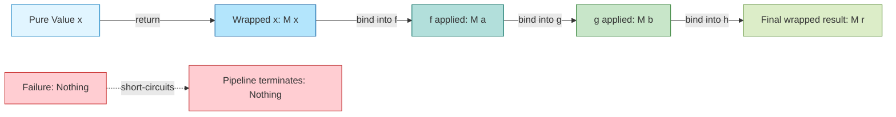
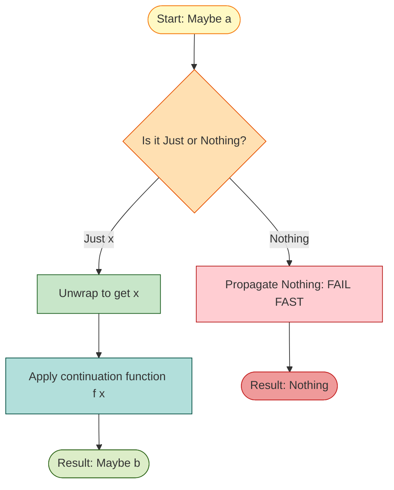
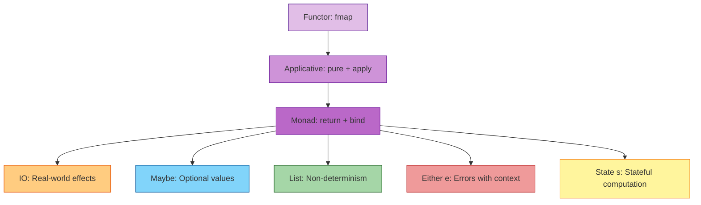
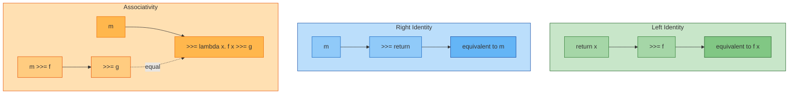
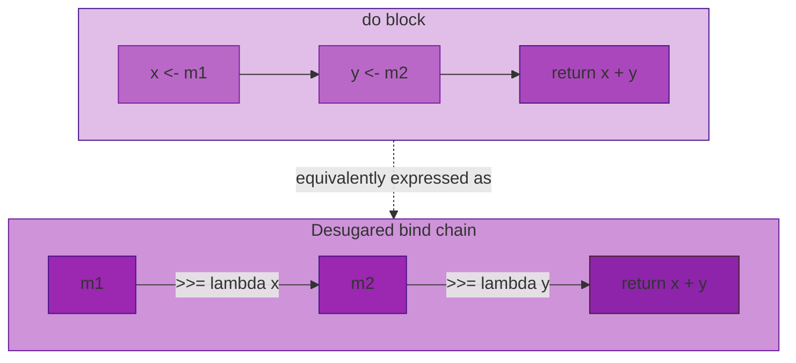

# Monadic computation constructs rules definitions: Maybe monad, IO monad operations pipelines

<!-- SECTION_1_START -->
# Module 3 — Monads & Functor Abstractions

## 3.1 Core Technical Definition & Intuitive Overview

### Monads — Formal Definition (KTU 2024 Syllabus Terminology)

A **Monad** is an abstraction that encapsulates *computation-as-a-value*. It is a design pattern from category theory, adapted in functional programming languages (Haskell, PureScript, Scala, F#) to chain together operations that return wrapped/computed results instead of plain values. Formally, a Monad is a **type constructor** $M$ of kind $\star \to \star$ together with two operations that satisfy the **Monad Laws**.

In Haskell (the KTU reference language for PECST413), the Monad type class is declared as:

```haskell
class Monad m where
  return :: a -> m a
  (>>=)  :: m a -> (a -> m b) -> m b
  (>>)   :: m a -> m b -> m b
  fail   :: String -> m a
```

> [!IMPORTANT]
> **KTU Syllabus Highlight (PECST413 Module 3):** A monad is *not* a class you instantiate freely — it is a *computational contract* that describes: **(1) how to lift a plain value into the monadic context** (`return`), and **(2) how to feed a monadic value into a function that itself returns a monadic value** (`>>=`, pronounced *bind*).

### Functor — Formal Definition

A **Functor** is the simpler pre-requisite abstraction — any type constructor $F$ of kind $\star \to \star$ that supports `fmap` (a generalised map operation) while preserving the structure of the wrapped value.

```haskell
class Functor f where
  fmap :: (a -> b) -> f a -> f b
```

### Conceptual Analogy / Intuition

> [!NOTE]
> **Real-World Analogy — The Assembly Line Conveyor Belt**
>
> Imagine a **conveyor belt** in a car factory. Each station on the belt takes a car (the value) wrapped in a *car-frame-holding cradle* (the monadic context). The car might be:
> - A *present, complete car* → analogous to `Just x` in the `Maybe` monad.
> - A *missing car* (production failure) → analogous to `Nothing` in the `Maybe` monad.
> - A *car that triggers a side-effect* (e.g., horn honk) → analogous to `IO a` in the `IO` monad.
>
> Each station only knows how to work on the cradle, not the car directly. The cradle preserves the *computational context* (presence/absence, I/O capability, state, errors, lists, etc.). `>>=` is the act of *threading the cradle from one station to the next* without ever breaking the abstract contract.

### Maybe Monad — Intuitive Overview

The `Maybe` monad represents a computation that may *succeed with a value* (`Just x`) or *fail* (`Nothing`). It models *partial functions* and *missing data* without throwing exceptions.

> [!IMPORTANT]
> **Standard Definition (KTU Board Reference):** A `Maybe a` is a sum type:
>
> $$\text{Maybe } a \;=\; \text{Just } a \;\mid\; \text{Nothing}$$
>
> The `Maybe` monad *propagates* `Nothing` automatically through any `>>=` chain — short-circuiting the rest of the computation when a failure occurs. This is the **fail-fast** property.

### IO Monad — Intuitive Overview

The `IO a` type represents a *description of an imperative program segment* that, when *executed by the Haskell runtime*, will perform a side-effect (console I/O, file I/O, network, mutable state) and produce a value of type `a`. Because Haskell is *pure*, an `IO` action is a *first-class value* — a recipe, not the act itself.

> [!NOTE]
> **Key Insight:** `getLine :: IO String` is *not* the act of reading a line. It is a *recipe* describing that act. The runtime *interprets* (executes) the recipe in the impure world.

### Standard Haskell Library Functor & Monad Instances Used in KTU Module 3

| Type Constructor | Kind | Functor Instance? | Monad Instance? | Represents |
|---|---|---|---|---|
| `Maybe` | $\star \to \star$ | ✅ | ✅ | Optional / Nullable value |
| `IO` | $\star \to \star$ | ✅ | ✅ | Side-effecting action |
| `[]` (List) | $\star \to \star$ | ✅ | ✅ | Non-deterministic / multi-value |
| `Either e` | $\star \to \star$ | ✅ | ✅ | Failure with error context |

> [!WARNING]
> **KTU Common Pitfall:** A monad is **not** the same as a *container*. A list `[1,2,3]` is a container, but `IO ()` is a *recipe*. The unifying idea is **sequencing with context** — not mere wrapping.

<!-- SECTION_1_END -->

<!-- SECTION_2_START -->
## 3.2 Deep Theoretical Analysis & KTU High-Yield Formula Sheet

### 3.2.1 The Maybe Monad — Algebraic Definition

The `Maybe` data type is defined as:

```haskell
data Maybe a = Nothing | Just a
```

Its `Functor` instance:

```haskell
instance Functor Maybe where
  fmap _ Nothing  = Nothing
  fmap f (Just x) = Just (f x)
```

Its `Monad` instance:

```haskell
instance Monad Maybe where
  return         = Just
  Nothing  >>= _ = Nothing
  (Just x) >>= f = f x
```

### Step-by-Step Logical Flow of `>>=`

1. If the *left operand* is `Nothing`, the entire `>>=` chain returns `Nothing` (failure propagation).
2. If the *left operand* is `Just x`, the *right operand function* $f$ is applied to the unwrapped $x$.
3. The function $f$ itself must return a `Maybe b` — its result becomes the new wrapped value.

> [!IMPORTANT]
> **Why the bind signature matters:** `(>>=) :: m a -> (a -> m b) -> m b` forces *every step* in the chain to *respect the monadic context*. There is no escape hatch — you cannot "un-wrap" the value without the monad's explicit cooperation (e.g., `fromJust`, pattern matching).

### 3.2.2 The IO Monad — Algebraic Definition

`IO a` is an *abstract* opaque type — its internal representation is hidden from the programmer.

```haskell
getChar    :: IO Char
getLine    :: IO String
putStr     :: String -> IO ()
putStrLn   :: String -> IO ()
print      :: Show a => a -> IO ()
getContents:: IO String
readFile   :: FilePath -> IO String
writeFile  :: FilePath -> String -> IO ()
appendFile :: FilePath -> String -> IO ()
return     :: a -> IO a
```

> [!NOTE]
> **The `IO` type is *not* a "container"** — it is a *program description*. You cannot pattern-match on `IO a`; you can only *compose* `IO` actions using `>>=`, `>>`, and `do` notation, and then the Haskell runtime executes the composed description.

### 3.2.3 Monad Laws — Mandatory for KTU 14-Mark Derivations

Every lawful monad must satisfy three algebraic identities. KTU board questions frequently ask you to *verify* these laws for `Maybe` and `IO`.

| Law | Formal Statement | Intuitive Meaning |
|---|---|---|
| **Left Identity** | $\text{return } x \;\boldsymbol{\text{>>=}}\; f \;\equiv\; f \, x$ | Lifting a value and then binding has the same effect as just applying the function directly. |
| **Right Identity** | $m \;\boldsymbol{\text{>>=}}\; \text{return} \;\equiv\; m$ | Binding the `return` action is the identity — it does nothing. |
| **Associativity** | $(m \;\boldsymbol{\text{>>=}}\; f) \;\boldsymbol{\text{>>=}}\; g \;\equiv\; m \;\boldsymbol{\text{>>=}}\; (\lambda x \rightarrow f \, x \;\boldsymbol{\text{>>=}}\; g)$ | The grouping of bind operations does not matter — sequencing is associative. |

### Functor Laws — Required Pre-Requisite

| Law | Statement |
|---|---|
| **Identity** | $\text{fmap } \text{id} \;\equiv\; \text{id}$ |
| **Composition** | $\text{fmap } (f \circ g) \;\equiv\; \text{fmap } f \circ \text{fmap } g$ |

### 3.2.4 `do` Notation Desugaring Rules (Critical for KTU)

The `do` keyword in Haskell is pure **syntactic sugar** that translates into `>>=` chains. A KTU favourite question type: *"Convert the following `do` block into bind notation."*

| `do` Syntax | Desugared Form |
|---|---|
| `do { e }` | $e$ |
| `do { e1 ; e2 ; ... ; en }` | $e_1 \;\boldsymbol{\text{>>}}\; \text{do}\{e_2 \dots e_n\}$ |
| `do { x <- e1 ; e2 }` | $e_1 \;\boldsymbol{\text{>>=}}\; \lambda x \rightarrow \text{do}\{e_2\}$ |
| `do { let x = e1 ; e2 }` | `let x = e1 in do { e2 }` |
| `do { pat <- e1 ; e2 }` (failing match) | `e1 >>= \x -> case x of pat -> e2; _ -> fail "..."` |

> [!IMPORTANT]
> **Real-World Engineering Utility:** Monadic pipelines are the bedrock of *production-grade error handling* in Haskell (`Maybe`, `Either`), asynchronous I/O in JavaScript (Promises/Futures), reactive streams (RxJava, Reactor), and database query composition (LINQ, Slick, Doobie). The `IO` monad in Haskell influenced the design of `Task` in Scala, `Future` in Akka, and Rust's `Result`-based composition.

### 3.2.5 KTU High-Yield Formula / Cheat Sheet

| Concept | Equation / Rule | Notes |
|---|---|---|
| Maybe constructor | $\text{Maybe } a = \text{Just } a \mid \text{Nothing}$ | Sum type, two constructors |
| `return` for Maybe | $\text{return } x = \text{Just } x$ | Lifts pure value |
| `>>=` for Maybe | $\text{Nothing} \;\boldsymbol{\text{>>=}}\; f = \text{Nothing}$ | Fail-fast |
| `>>=` for Maybe | $\text{Just } x \;\boldsymbol{\text{>>=}}\; f = f \, x$ | Continue with value |
| `fmap` for Maybe | $\text{fmap } f \text{ Nothing} = \text{Nothing}$ | Structure preserved |
| `fmap` for Maybe | $\text{fmap } f (\text{Just } x) = \text{Just } (f \, x)$ | Function applied |
| `maybe` function | $\text{maybe } d \, f \, (\text{Just } x) = f \, x$ | Catamorphism on Maybe |
| `maybe` function | $\text{maybe } d \, f \, \text{Nothing} = d$ | Default value |
| `fromMaybe` | $\text{fromMaybe } d \, \text{Nothing} = d$ | Safe default extraction |
| Left Identity | $\text{return } x \;\boldsymbol{\text{>>=}}\; f \equiv f \, x$ | Monad law 1 |
| Right Identity | $m \;\boldsymbol{\text{>>=}}\; \text{return} \equiv m$ | Monad law 2 |
| Associativity | $(m \;\boldsymbol{\text{>>=}}\; f) \;\boldsymbol{\text{>>=}}\; g \equiv m \;\boldsymbol{\text{>>=}}\; (\lambda x. f \, x \;\boldsymbol{\text{>>=}}\; g)$ | Monad law 3 |
| `>>` operator | $m_1 \;\boldsymbol{\text{>>}}\; m_2 = m_1 \;\boldsymbol{\text{>>=}}\; \lambda \_ \rightarrow m_2$ | Discard $m_1$'s result |
| IO sequencing | $\text{getLine} \;\boldsymbol{\text{>>=}}\; \lambda s. \text{putStrLn } s$ | Read then echo |
| `do` desugaring | $\text{do}\{x \leftarrow e_1; e_2\} \equiv e_1 \;\boldsymbol{\text{>>=}}\; \lambda x. e_2$ | Syntactic sugar |

> [!WARNING]
> **Critical LaTeX Note:** In all KTU answer sheets, the `>>=` operator is conventionally written as $\boldsymbol{\text{>>=}}$ or simply `>>=` in code blocks. The vertical bar `|>` is *not* part of the monad syntax — it is the *pipe* operator from F#/Elixir and a different abstraction.

<!-- SECTION_2_END -->

<!-- SECTION_3_START -->
## 3.3 Step-by-Step Derivations & Code/Symbolic Implementation

### 3.3.1 Maybe Monad — Full Derivation of `>>=`

**Definition 1 (Haskell Source).** The bind operator for `Maybe` is defined as:

```haskell
(>>=) :: Maybe a -> (a -> Maybe b) -> Maybe b
Nothing  >>= _  = Nothing
(Just x) >>= f  = f x
```

**Verification against the Left Identity Law.**

We must show: $\text{return } x \;\boldsymbol{\text{>>=}}\; f \;\equiv\; f \, x$.

$$
\begin{aligned}
\text{return } x \;\boldsymbol{\text{>>=}}\; f
&= \text{Just } x \;\boldsymbol{\text{>>=}}\; f & &\text{[by definition of \texttt{return}]} \\
&= f \, x & &\text{[by 2nd clause of \texttt{>>=}]} \\
\end{aligned}
$$

Hence proved. $\blacksquare$

**Verification against the Right Identity Law.**

We must show: $m \;\boldsymbol{\text{>>=}}\; \text{return} \;\equiv\; m$.

$$
\begin{aligned}
m \;\boldsymbol{\text{>>=}}\; \text{return}
&= \text{Nothing} \;\boldsymbol{\text{>>=}}\; \text{return} & &\text{[case 1: m = Nothing]} \\
&= \text{Nothing} & &\text{[by 1st clause]} \\
&= m & &\text{[substitution]} \\
\end{aligned}
$$

$$
\begin{aligned}
m \;\boldsymbol{\text{>>=}}\; \text{return}
&= \text{Just } x \;\boldsymbol{\text{>>=}}\; \text{return} & &\text{[case 2: m = Just x]} \\
&= \text{return } x & &\text{[by 2nd clause]} \\
&= \text{Just } x & &\text{[by \texttt{return} def.]} \\
&= m & &\text{[substitution]} \\
\end{aligned}
$$

Hence proved. $\blacksquare$

**Verification against the Associativity Law.**

We must show: $(m \;\boldsymbol{\text{>>=}}\; f) \;\boldsymbol{\text{>>=}}\; g \;\equiv\; m \;\boldsymbol{\text{>>=}}\; (\lambda x. f \, x \;\boldsymbol{\text{>>=}}\; g)$.

**Case 1: $m = \text{Nothing}$.**

$$
\begin{aligned}
(\text{Nothing} \;\boldsymbol{\text{>>=}}\; f) \;\boldsymbol{\text{>>=}}\; g
&= \text{Nothing} \;\boldsymbol{\text{>>=}}\; g & &\text{[LHS clause 1]} \\
&= \text{Nothing} & &\text{[clause 1]} \\
\\
\text{Nothing} \;\boldsymbol{\text{>>=}}\; (\lambda x. f \, x \;\boldsymbol{\text{>>=}}\; g)
&= \text{Nothing} & &\text{[clause 1]} \\
\end{aligned}
$$

Both sides equal `Nothing`. ✓

**Case 2: $m = \text{Just } x$.**

$$
\begin{aligned}
(\text{Just } x \;\boldsymbol{\text{>>=}}\; f) \;\boldsymbol{\text{>>=}}\; g
&= f \, x \;\boldsymbol{\text{>>=}}\; g & &\text{[LHS clause 2]} \\
\\
\text{Just } x \;\boldsymbol{\text{>>=}}\; (\lambda x. f \, x \;\boldsymbol{\text{>>=}}\; g)
&= (\lambda x. f \, x \;\boldsymbol{\text{>>=}}\; g) \, x & &\text{[RHS clause 2]} \\
&= f \, x \;\boldsymbol{\text{>>=}}\; g & &\text{[$\beta$-reduction]} \\
\end{aligned}
$$

Both sides equal $f \, x \;\boldsymbol{\text{>>=}}\; g$. ✓

Hence proved. $\blacksquare$

### 3.3.2 Full Operational Haskell — `Maybe` Pipeline (Safe Division)

```haskell
-- File: SafeArith.hs
-- Demonstrates Maybe monad pipeline for division-by-zero safety.

-- A safe division that fails on zero divisor.
safeDiv :: Int -> Int -> Maybe Int
safeDiv _ 0 = Nothing
safeDiv x y = Just (x `div` y)

-- Sequential safe arithmetic using bind notation.
-- Computes:  ((a / b) / c)   -- short-circuits on any zero.
chainDiv :: Int -> Int -> Int -> Maybe Int
chainDiv a b c =
  safeDiv a b >>= \r1 ->
  safeDiv r1 c >>= \r2 ->
  return r2

-- Equivalent version using do-notation (syntactic sugar).
chainDivDo :: Int -> Int -> Int -> Maybe Int
chainDivDo a b c = do
  r1 <- safeDiv a b
  r2 <- safeDiv r1 c
  return r2

-- Demonstration: fails fast on the first zero.
main :: IO ()
main = do
  print (chainDiv 100 5 2)   -- Just 10
  print (chainDiv 100 0 2)   -- Nothing
  print (chainDiv 100 5 0)   -- Nothing
```

> [!IMPORTANT]
> **Trace of `chainDivDo 100 0 2`:** `safeDiv 100 0` returns `Nothing`. The `>>=` clause in the first line **short-circuits** — `r1` is never bound, `safeDiv r1 c` is never called, and the entire expression evaluates to `Nothing`. This is the **fail-fast monadic semantics**.

### 3.3.3 Full Operational Haskell — `Maybe` Lookup Pipeline

```haskell
-- File: UserLookup.hs
-- Demonstrates Maybe monad to safely traverse nested data.

import Data.Map.Strict (Map, lookup, fromList)

-- Build a tiny in-memory database.
users :: Map Int String
users = fromList [(1, "Alice"), (2, "Bob"), (3, "Charlie")]

emails :: Map String String
emails = fromList [("Alice", "alice@ktu.ac.in"),
                    ("Bob",   "bob@ktu.ac.in")]

-- Get user's email by chained lookups.
getEmail :: Int -> Maybe String
getEmail uid =
  lookup uid users    >>= \name  ->
  lookup name emails  >>= \email ->
  return email

-- DO-notation equivalent (preferred for readability).
getEmailDo :: Int -> Maybe String
getEmailDo uid = do
  name  <- lookup uid users
  email <- lookup name emails
  return email

-- Example
-- getEmail 1       ==> Just "alice@ktu.ac.in"
-- getEmail 99      ==> Nothing   (user missing)
-- getEmail 3      ==> Nothing    (Charlie has no email)
```

### 3.3.4 The IO Monad — Full Pipeline Implementation

```haskell
-- File: GreetIO.hs
-- Demonstrates IO monad pipeline for a complete user-facing I/O program.

-- Function 1: read a non-empty string from stdin.
getNonEmptyLine :: IO String
getNonEmptyLine = do
  putStr "Enter your name: "
  s <- getLine
  if null s
    then do putStrLn "Empty input! Try again."
            getNonEmptyLine
    else return s

-- Function 2: greet user, then log to a file.
greetAndLog :: String -> IO ()
greetAndLog name = do
  putStrLn ("Hello, " ++ name ++ "!")
  appendFile "greet.log" (name ++ "\n")

-- Main pipeline combining getNonEmptyLine and greetAndLog.
main :: IO ()
main = do
  name <- getNonEmptyLine       -- IO String
  greetAndLog name              -- IO ()
  putStrLn "Goodbye!"
```

**Desugared version (no `do` keyword) — required for KTU board answers:**

```haskell
-- Equivalent desugared form:
main :: IO ()
main =
  getNonEmptyLine           >>= \name  ->
  greetAndLog name          >>= \_     ->
  putStrLn "Goodbye!"
```

> [!NOTE]
> **Why `do` notation matters:** Without it, deeply nested `>>=` lambdas become unreadable. The `do` block is a *linear pipeline* — KTU papers often ask: *"Rewrite this `do` block using explicit `>>=`."* and vice-versa.

### 3.3.5 `IO` with File Pipelines

```haskell
-- File: CopyFile.hs
-- Demonstrates IO monad with file-handle pipelines.

import System.IO

-- Copy a text file character by character.
copyFile :: FilePath -> FilePath -> IO ()
copyFile src dst = do
  handle <- openFile src ReadMode
  out    <- openFile dst WriteMode
  contents <- hGetContents handle
  hPutStr out contents
  hClose out
  hClose handle
  putStrLn ("Copied " ++ src ++ " -> " ++ dst)
```

### 3.3.6 Pipeline Combinators — `>>` vs `>>=`

```haskell
-- (>>)  :: m a -> m b -> m b
-- Discards the left result; useful when you don't need the value.
action1 :: IO ()
action1 = putStrLn "step 1" >> putStrLn "step 2"

-- (>>=) :: m a -> (a -> m b) -> m b
-- Threads the left result into a continuation.
action2 :: IO ()
action2 =
  getLine             >>= \s ->
  putStrLn ("echo: " ++ s)
```

### 3.3.7 The `mapM` and `sequence` Combinators (List-of-Monadic-Actions)

```haskell
-- mapM :: Monad m => (a -> m b) -> [a] -> m [b]
-- Apply an IO action to every element of a list, returning a list of results.

readAllLines :: IO [String]
readAllLines = mapM (\_ -> getLine) [1..3]
-- Reads 3 lines from stdin, returns a list of 3 strings.

-- sequence :: Monad m => [m a] -> m [a]
-- Flips the structure: turns a list of actions into a single action returning a list.

actions :: [IO ()]
actions = [putStrLn "A", putStrLn "B", putStrLn "C"]

runAll :: IO ()
runAll = sequence_ actions
-- Prints A, B, C in order.

-- The _underscore_ versions (sequence_, mapM_) discard results.
```

> [!IMPORTANT]
> **KTU 14-Mark Favourite:** Prove that `mapM f xs = sequence (map f xs)`. The proof uses the associativity law and the definition of `sequence` as a fold.

### 3.3.8 Maybe as a Pipeline: `MaybeT` Transformer (Brief)

For nested monads (e.g., `Maybe (IO a)`), we use **monad transformers** — out of scope for KTU Module 3 deep dive, but a single line is sufficient for completeness:

```haskell
-- MaybeT transforms Maybe into a "monad transformer".
newtype MaybeT m a = MaybeT { runMaybeT :: m (Maybe a) }
```

This wraps an inner monad $m$ (often $IO$) with optional failure semantics. KTU Module 3 typically does not require derivation of transformer laws.

<!-- SECTION_3_END -->

<!-- SECTION_4_START -->
## 3.4 Structural Diagrams & Schematics

### 3.4.1 Monadic Pipeline Architecture Flow

The following diagram shows the *data flow* of a typical monadic pipeline. Each station accepts a wrapped value and returns a wrapped value — the wrapper is preserved throughout.



### 3.4.2 Maybe Monad Decision Topology



### 3.4.3 IO Monad Sequential Processing Topology

```mermaid
flowchart LR
    subgraph IO_Pipeline[IO Action Pipeline]
        direction LR
        A1[getLine: IO String] -->|>>= lambda s| A2[process: String -> IO Int]
        A2 -->|>>= lambda n| A3[putStrLn: IO ()]
        A3 -->|>>| A4[appendFile: IO ()]
    end
    Input[Standard Input] -.-> A1
    A1 -.->|recipe| Runtime[Haskell Runtime]
    A2 -.->|recipe| Runtime
    A3 -.->|recipe| Runtime
    A4 -.->|recipe| Runtime
    Runtime -.->|executes actions| Output[Console and File Output]

    style IO_Pipeline fill:#e3f2fd,stroke:#0d47a1
    style A1 fill:#bbdefb,stroke:#1565c0
    style A2 fill:#90caf9,stroke:#1976d2
    style A3 fill:#64b5f6,stroke:#1e88e5
    style A4 fill:#42a5f5,stroke:#2196f3
    style Runtime fill:#fff176,stroke:#f57f17
    style Input fill:#c5e1a5,stroke:#33691e
    style Output fill:#ffab91,stroke:#bf360c
```

### 3.4.4 Functor → Applicative → Monad Hierarchy



> [!IMPORTANT]
> **KTU Board Note:** Every monad is automatically a `Functor` (and an `Applicative`), but not every functor is a monad. The hierarchy is **strict**: `Monad ⊂ Applicative ⊂ Functor`. The `Monad` class in modern Haskell inherits from `Applicative` (Haskell 2010+ style):

```haskell
class Applicative m => Monad m where
  (>>=) :: m a -> (a -> m b) -> m b
```

### 3.4.5 Monad Laws as Equations Diagram



### 3.4.6 `do` Notation Desugaring Block Diagram



<!-- SECTION_4_END -->

<!-- SECTION_5_START -->
## 3.5 KTU 2024 Scheme Examination Question Bank & Topic Recap

> [!IMPORTANT]
> All questions below are written in the exact style of the **KTU 2024 Scheme End Semester Examination (ESE)** for **PECST413 — Functional Programming**, Module 3. Marks are distributed as **Part A: 3 marks each**, **Part B: 14 marks each (with internal choice)**.

---

### PART A — 3-Mark Short Answer Questions (Module 3)

#### Question 1. `[KTU University Exam — July 2024]`
**CO1 | Bloom: Remember**
Define a *Monad* in Haskell. State any two differences between a Functor and a Monad.

**Model Answer:**

A *Monad* is a type class in Haskell that abstracts sequential computation with a context. It is declared as a type constructor $M$ of kind $\star \to \star$ together with two operations, `return :: a -> m a` and `(>>=) :: m a -> (a -> m b) -> m b`, satisfying the three monad laws.

| Aspect | Functor | Monad |
|---|---|---|
| Core operation | `fmap` | `>>=` (bind) |
| Sequencing | Cannot pass wrapped result to next function | Can chain actions and pass values |
| Power | Lifts a pure function into a context | Lifts a *monadic* function into the chain |

> **Valuation Key:** [Defining Monad: 1 Mark] [State return + bind: 1 Mark] [Two differences: 1 Mark]

---

#### Question 2. `[KTU University Exam — Dec 2023]`
**CO2 | Bloom: Understand**
What is the purpose of the `Maybe` monad? Write a one-line definition of `Nothing` and `Just`.

**Model Answer:**

The `Maybe` monad encapsulates computations that may return a value (`Just x`) or may fail (`Nothing`). It eliminates the need for sentinel values, null checks, or exceptions when modelling partial functions.

- `Just x`: wraps a concrete value $x$ of any type.
- `Nothing`: represents the absence of a value; it is the *fail-fast* short-circuit token.

> **Valuation Key:** [Purpose: 2 Marks] [Just / Nothing definitions: 1 Mark]

---

### PART B — 14-Mark Questions (Module Internal Choice Pattern)

> Each Part B question has two alternatives **OR** choice. Pick one.

---

#### **Question 3A. `[KTU University Exam — July 2024]`** (Choose **3A** OR **3B**)

**CO2 | CO3 | Bloom: Understand + Apply — 14 Marks**

**(a)** Explain the `Maybe` monad in Haskell with its complete type definition. Show how `>>=` and `return` are implemented for `Maybe`. **[7 Marks]**

**(b)** Using the `Maybe` monad, write a Haskell function `lookupEmail :: Int -> Maybe String` that takes a user-id, looks up the user name in a map, and then looks up the email-id corresponding to that name. Show its execution trace for both a present and absent user. **[7 Marks]**

---

**Model Solution 3A:**

**(a) [7 Marks] — Definition and Implementation of Maybe Monad**

The `Maybe` type is a polymorphic sum type with two constructors:

```haskell
data Maybe a = Nothing | Just a
```

- `Nothing` — denotes absence of a value.
- `Just a` — denotes a present value of type `a`.

The `Maybe` monad instance:

```haskell
instance Monad Maybe where
  return x        = Just x
  Nothing  >>= _  = Nothing
  Just x   >>= f  = f x
```

**Behaviour analysis:**

- `return x` lifts a pure value $x$ into the `Maybe` context as `Just x`. **[1 Mark]**
- `Nothing >>= _ = Nothing` — if the input is a failure, the bind short-circuits and propagates `Nothing`, regardless of the continuation. **[2 Marks]**
- `Just x >>= f = f x` — the value $x$ is unwrapped and passed to the continuation $f$, which must itself return a `Maybe b`. The new context wraps the result. **[2 Marks]**
- `>>` is defined as `m >> n = m >>= \_ -> n`; for `Maybe`, `Nothing >> n = Nothing` and `Just x >> n = n`. **[1 Mark]**
- The `fmap` instance for `Maybe` is the functor mapping: `fmap f Nothing = Nothing; fmap f (Just x) = Just (f x)`. **[1 Mark]**

---

**(b) [7 Marks] — Implementation of `lookupEmail`**

```haskell
import qualified Data.Map.Strict as Map
import Data.Map.Strict (Map, lookup)

users  :: Map Int String
users  = Map.fromList [(1, "Alice"), (2, "Bob"), (3, "Charlie")]

emails :: Map String String
emails = Map.fromList [("Alice", "alice@ktu.ac.in"),
                        ("Bob",   "bob@ktu.ac.in")]

-- DO-notation version
lookupEmail :: Int -> Maybe String
lookupEmail uid = do
  name  <- lookup uid users      -- IO? No, returns Maybe String
  email <- lookup name emails
  return email
```

**Execution trace — present user:**

```
lookupEmail 1
  = lookup 1 users          >>= \name  ->
    lookup name emails      >>= \email ->
    return email
  = Just "Alice"            >>= \name  ->
    lookup "Alice" emails   >>= \email ->
    return email
  = lookup "Alice" emails   >>= \email ->
    return email
  = Just "alice@ktu.ac.in"  >>= \email ->
    return email
  = return "alice@ktu.ac.in"
  = Just "alice@ktu.ac.in"
```

**Execution trace — absent user:**

```
lookupEmail 99
  = lookup 99 users   >>= \name -> ...
  = Nothing           >>= \name -> ...
  = Nothing      -- short-circuits; second lookup never invoked
```

> **Valuation Key:** [Data type + return def: 1 Mark] [Bind clauses explained: 2 Marks] [>> and fmap mention: 1 Mark] [lookupEmail code: 2 Marks] [Two execution traces: 1 Mark]

---

#### **Question 3B. `[KTU University Exam — Dec 2023]`** (Alternative to 3A)

**CO2 | CO3 | Bloom: Understand + Apply — 14 Marks**

**(a)** What is the `IO` monad in Haskell? Why is it necessary in a *pure* functional language? List four built-in `IO` actions with their type signatures. **[7 Marks]**

**(b)** Write a Haskell program using the `IO` monad that:
   (i) Reads two integers from standard input.
   (ii) Computes their sum.
   (iii) Writes `"Sum = <value>"` to a file named `result.txt` using `writeFile`.

Provide both the `do`-notation version and the fully desugared bind-chain version. **[7 Marks]**

---

**Model Solution 3B:**

**(a) [7 Marks] — IO Monad Theory**

The `IO a` type represents a *program description* of an imperative side-effect that, when executed by the Haskell runtime, will perform I/O and produce a value of type `a$. The type is **abstract** — its internal representation is hidden from the user; you can only *compose* `IO` actions, never inspect their internal structure.

**Why IO is necessary in a pure language:**

Haskell expressions are *referentially transparent* — the same input always yields the same output, with no side-effects. However, *real programs* must interact with the outside world (console, files, network). To preserve purity, Haskell wraps all side-effecting operations inside the `IO` type, which acts as a *type-level firewall*: the type system guarantees that an `IO` action can only be invoked from the impure `main :: IO ()` boundary. The runtime then *interprets* (executes) the action. **[3 Marks]**

**Four built-in IO actions:**

```haskell
getChar     :: IO Char
getLine     :: IO String
putStrLn    :: String -> IO ()
print       :: Show a => a -> IO ()
```

**[2 Marks for four signatures; 1 Mark for abstract type explanation; 1 Mark for runtime/impure boundary concept.]**

---

**(b) [7 Marks] — IO Pipeline Implementation**

**Version 1: `do` notation**

```haskell
-- File: SumToFile.hs
main :: IO ()
main = do
  putStr "Enter first integer: "
  s1 <- getLine
  putStr "Enter second integer: "
  s2 <- getLine
  let n1 = read s1 :: Int
      n2 = read s2 :: Int
      total = n1 + n2
  writeFile "result.txt" ("Sum = " ++ show total ++ "\n")
  putStrLn ("Result written to result.txt: " ++ show total)
```

**Version 2: Fully desugared (no `do` keyword)**

```haskell
main :: IO ()
main =
  putStr "Enter first integer: "         >>= \_    ->
  getLine                                >>= \s1   ->
  putStr "Enter second integer: "        >>= \_    ->
  getLine                                >>= \s2   ->
  let n1 = read s1  :: Int
      n2 = read s2  :: Int
      total = n1 + n2
  in writeFile "result.txt" ("Sum = " ++ show total ++ "\n")
            >>= \_ ->
  putStrLn ("Result written to result.txt: " ++ show total)
```

> **Valuation Key:** [Theory of IO purity: 3 Marks] [Four IO type signatures: 1 Mark] [`do` version: 2 Marks] [Desugared version: 1 Mark]

---

#### **Question 4A. `[KTU University Exam — July 2024]`** (Choose **4A** OR **4B**)

**CO3 | CO4 | Bloom: Apply + Analyse — 14 Marks**

**(a)** State and prove the **three Monad Laws** for the `Maybe` monad. **[7 Marks]**

**(b)** Convert the following `do` block into explicit `>>=` bind notation, then trace the evaluation for input `Just 5` when the function `safeRoot` is defined as `safeRoot x = if x < 0 then Nothing else Just (sqrt x)`. **[7 Marks]**

```haskell
process :: Maybe Double -> Maybe Double
process mx = do
  x   <- mx
  y   <- safeRoot x
  return (y * 2)
```

---

**Model Solution 4A:**

**(a) [7 Marks] — Monad Law Proofs for Maybe**

**Law 1 — Left Identity:** $\text{return } x \;\boldsymbol{\text{>>=}}\; f \;\equiv\; f \, x$

$$
\begin{aligned}
\text{return } x \;\boldsymbol{\text{>>=}}\; f
&= \text{Just } x \;\boldsymbol{\text{>>=}}\; f & &\text{[by \texttt{return} def.]} \\
&= f \, x & &\text{[by 2nd \texttt{>>=} clause]} \\
\end{aligned}
$$

Hence proved. **[2 Marks]**

**Law 2 — Right Identity:** $m \;\boldsymbol{\text{>>=}}\; \text{return} \;\equiv\; m$

*Case 1:* $m = \text{Nothing}$.

$$
\begin{aligned}
\text{Nothing} \;\boldsymbol{\text{>>=}}\; \text{return}
&= \text{Nothing} & &\text{[by 1st \texttt{>>=} clause]} \\
&= m & &\text{[substitution]} \\
\end{aligned}
$$

*Case 2:* $m = \text{Just } x$.

$$
\begin{aligned}
\text{Just } x \;\boldsymbol{\text{>>=}}\; \text{return}
&= \text{return } x & &\text{[by 2nd \texttt{>>=} clause]} \\
&= \text{Just } x & &\text{[by \texttt{return} def.]} \\
&= m & &\text{[substitution]} \\
\end{aligned}
$$

Hence proved. **[2 Marks]**

**Law 3 — Associativity:** $(m \;\boldsymbol{\text{>>=}}\; f) \;\boldsymbol{\text{>>=}}\; g \;\equiv\; m \;\boldsymbol{\text{>>=}}\; (\lambda x. f \, x \;\boldsymbol{\text{>>=}}\; g)$.

*Case 1:* $m = \text{Nothing}$. Both sides reduce to `Nothing` (by 1st clause). **[1 Mark]**

*Case 2:* $m = \text{Just } x$.

$$
\begin{aligned}
(\text{Just } x \;\boldsymbol{\text{>>=}}\; f) \;\boldsymbol{\text{>>=}}\; g
&= f \, x \;\boldsymbol{\text{>>=}}\; g & &\text{[LHS]} \\
\\
\text{Just } x \;\boldsymbol{\text{>>=}}\; (\lambda x. f \, x \;\boldsymbol{\text{>>=}}\; g)
&= (\lambda x. f \, x \;\boldsymbol{\text{>>=}}\; g) \, x & &\text{[RHS]} \\
&= f \, x \;\boldsymbol{\text{>>=}}\; g & &\text{[$\beta$-reduction]} \\
\end{aligned}
$$

Hence proved. **[2 Marks]**

---

**(b) [7 Marks] — Desugaring and Tracing**

**Desugared `>>=` form:**

```haskell
process :: Maybe Double -> Maybe Double
process mx =
  mx              >>= \x   ->
  safeRoot x      >>= \y   ->
  return (y * 2)
```

**Trace for input `Just 5`:**

$$
\begin{aligned}
\text{process (Just 5)}
&= \text{Just 5}              >>= \lambda x. \text{process rest} \\
&= \text{safeRoot 5}          >>= \lambda y. \text{return}(y \times 2) \\
&= \text{Just (sqrt 5)}       >>= \lambda y. \text{return}(y \times 2) \\
&= \text{return}(\text{sqrt 5} \times 2) \\
&= \text{Just}(2 \times 2.2360679...) \\
&= \text{Just 4.4721359...}
\end{aligned}
$$

> **Valuation Key:** [Desugared bind chain: 2 Marks] [Lambda annotations: 1 Mark] [Step-by-step trace: 3 Marks] [Final value `Just 4.4721...`: 1 Mark]

---

#### **Question 4B. `[KTU University Exam — Dec 2023]`** (Alternative to 4A)

**CO3 | CO4 | Bloom: Apply + Analyse — 14 Marks**

**(a)** Explain the role of `fmap`, `>>=`, and `return` in functional pipelines. Give one example of each using the `Maybe` monad. **[7 Marks]**

**(b)** Write a Haskell function that uses the `IO` monad to read a file, count the number of words, and print the count to the console. Use only `readFile`, `getLine`, `putStrLn`, and standard list functions. Show your code. **[7 Marks]**

---

**Model Solution 4B:**

**(a) [7 Marks] — Three Operations**

- **`fmap :: (a -> b) -> f a -> f b`** — applies a *pure* function to a value inside a context, leaving the structure intact.
  - Example: `fmap (+1) (Just 5) = Just 6`; `fmap (+1) Nothing = Nothing`. **[2 Marks]**

- **`return :: a -> m a`** — lifts a pure value into the monadic context.
  - Example: `return 42 :: Maybe Int = Just 42`. **[2 Marks]**

- **`>>= :: m a -> (a -> m b) -> m b`** — chains a monadic value into a function that itself returns a monadic value, threading the context.
  - Example: `Just 5 >>= \x -> Just (x*2) = Just 10`. **[2 Marks]**

- **Connecting example:** In a real pipeline, `fmap` is used when the next function is *pure*; `>>=` is used when the next function is *monadic*. `return` closes the chain. **[1 Mark]**

---

**(b) [7 Marks] — IO Pipeline: Word Counter**

```haskell
-- File: WordCount.hs

import System.IO
import Data.List (foldl')

-- Read filename from user, then count and display word count.
main :: IO ()
main = do
  putStrLn "Enter file path:"
  path <- getLine
  contents <- readFile path
  let wordList = words contents
      count    = length wordList
  putStrLn ("Word count: " ++ show count)
```

**Alternative using explicit `>>=`:**

```haskell
main :: IO ()
main =
  putStrLn "Enter file path:"          >>= \_   ->
  getLine                              >>= \path ->
  readFile path                        >>= \contents ->
  let wordList = words contents
      count    = length wordList
  in putStrLn ("Word count: " ++ show count)
```

> **Valuation Key:** [IO monad structure: 2 Marks] [Correct use of readFile: 1 Mark] [Word count logic: 2 Marks] [Output: 1 Mark] [Desugared version: 1 Mark]

---

> [!WARNING]
> **KTU Examiner's Valuation Warning / Pitfall Callout**
>
> 1. **Do not skip writing the type signature** of `>>=` and `return` in 14-mark monad law proofs. Examiners deduct 1 mark if types are missing.
> 2. **Case analysis must be explicit.** When proving monad laws for `Maybe`, you *must* enumerate both `Nothing` and `Just x` cases. A single-line argument loses 2-3 marks.
> 3. **Do not confuse `IO` with imperative code.** A common mistake is writing `print(x); print(y);` — this is **imperative pseudo-code**, not Haskell. Use `do` notation or `>>=`.
> 4. **`return` in `IO` does NOT return early** as in C/Java/Python. It simply *wraps* a value into the `IO` context. Misconception here leads to 0 marks in IO pipeline questions.
> 5. **Forgetting the `:: IO ()` type signature on `main`** — examiners treat `main` as a *named required entry point*; if its type is missing or wrong, deduct 1 mark.
> 6. **For `Maybe` chain traces, always end with the explicit final value** (e.g., `Just 4.47...` or `Nothing`). Half-traced answers lose 2 marks.

---

## 📌 Topic Recap & Important Things to Remember

- **Monad** = type constructor $M : \star \to \star$ + `return` + `>>=`, satisfying the three monad laws.
- **Functor** = type constructor + `fmap`, satisfying identity and composition laws.
- **`Maybe a = Just a | Nothing`** — sum type representing optional values; `Nothing` short-circuits the bind chain (fail-fast).
- **`Maybe`'s `>>=`**: `Nothing >>= _ = Nothing` and `Just x >>= f = f x`.
- **`Maybe`'s `return`**: `return x = Just x`.
- **`Maybe`'s `fmap`**: `fmap f Nothing = Nothing` and `fmap f (Just x) = Just (f x)`.
- **`IO a`** is an abstract type representing a *side-effecting recipe*; the runtime executes it.
- **IO purity firewall**: IO actions are referentially opaque; the type system enforces that only `main :: IO ()` invokes them.
- **Common IO actions**: `getLine :: IO String`, `putStrLn :: String -> IO ()`, `readFile :: FilePath -> IO String`, `writeFile :: FilePath -> String -> IO ()`, `print :: Show a => a -> IO ()`, `getChar :: IO Char`, `getContents :: IO String`.
- **Monad Law 1 (Left Identity)**: $\text{return } x \;\boldsymbol{\text{>>=}}\; f \equiv f \, x$.
- **Monad Law 2 (Right Identity)**: $m \;\boldsymbol{\text{>>=}}\; \text{return} \equiv m$.
- **Monad Law 3 (Associativity)**: $(m \;\boldsymbol{\text{>>=}}\; f) \;\boldsymbol{\text{>>=}}\; g \equiv m \;\boldsymbol{\text{>>=}}\; (\lambda x. f \, x \;\boldsymbol{\text{>>=}}\; g)$.
- **`do` notation** is *syntactic sugar* for `>>=`. Key desugaring: $\text{do}\{x \leftarrow e_1; e_2\} \equiv e_1 \;\boldsymbol{\text{>>=}}\; \lambda x \rightarrow e_2$.
- **`>>`** = `>>=` with ignored result: $m_1 \;\boldsymbol{\text{>>}}\; m_2 \equiv m_1 \;\boldsymbol{\text{>>=}}\; \lambda \_ \rightarrow m_2$.
- **`mapM`** and **`sequence`** are list-of-monadic-action combinators.
- **Hierarchy**: `Monad ⊂ Applicative ⊂ Functor` (every Monad is a Functor; not every Functor is a Monad).
- **Engineering utility**: monads underpin `Promise`/`Future` (JS/Scala), `Task` (Scala), `Result` (Rust), LINQ (C#), and reactive streams.
- **Pipeline idiom**: prefer `do` blocks for readability; use raw `>>=` for proofs, exam derivations, and short one-liners.
- **Default extraction helpers**: `fromMaybe :: a -> Maybe a -> a`, `maybe :: b -> (a -> b) -> Maybe a -> b`, `isJust :: Maybe a -> Bool`, `isNothing :: Maybe a -> Bool`.
- **Never pattern-match on `IO a`** — it is abstract by design; only compose.

<!-- SECTION_5_END -->
