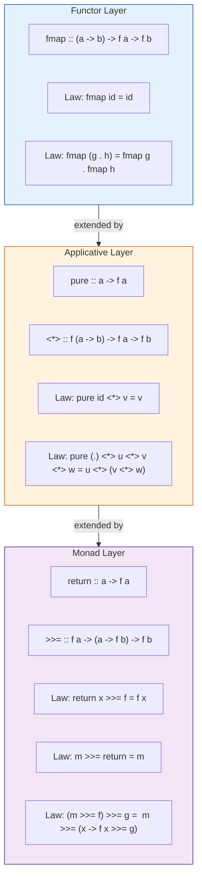
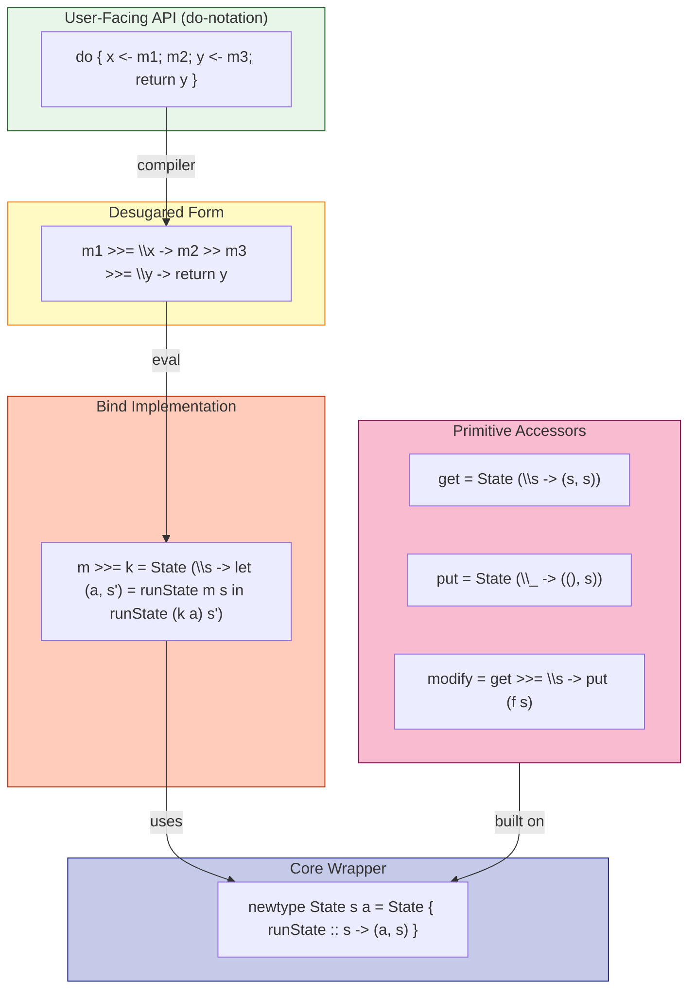
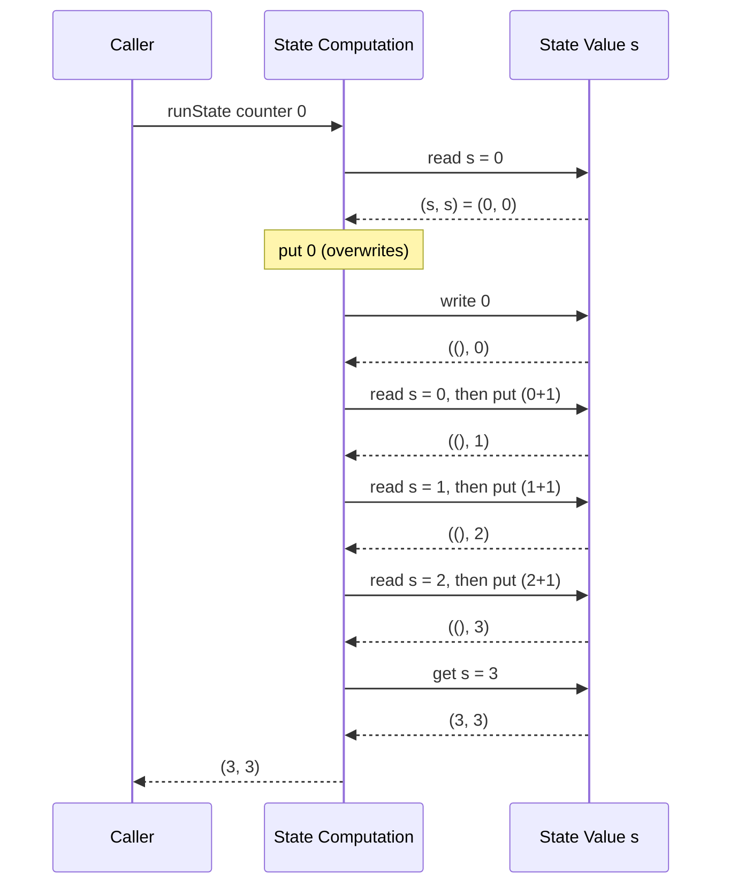
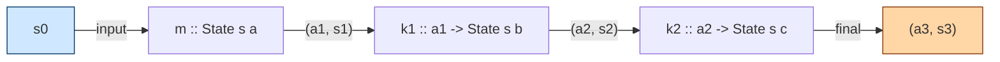

# State computation wrappers implementations inside functional blocks frameworks

<!-- SECTION_1_START -->
# Module 3: Monads & Functors Abstractions

## Topic: State Computation Wrappers Inside Functional Blocks

> [!NOTE]
> **KTU 2024 Scheme — Course Outcome Mapping (PECST413)**
> This topic directly addresses **CO3 / CO4**: *Apply monadic abstractions (State, Maybe, List, IO) to encapsulate side-effects and sequential computations inside purely functional programs, and reason about their algebraic laws.*

---

## 1. Core Technical Definition

A **State computation wrapper** in functional programming is a higher-order function that, given an input state of type `s`, performs some internal transformation and produces both a result value of type `a` and a *new* state of type `s`. In Haskell, this is canonically encoded as the **State Monad**, whose carrier type is a function from state to a result-state pair.

$$
\texttt{newtype State } s \, a \;=\; \texttt{State } \left(s \rightarrow (a, s)\right)
$$

Formally, the State monad is the categorical construction that **threads an immutable state value through a chain of pure functions** without ever mutating a variable, satisfying the three monad laws (left identity, right identity, associativity).

> [!IMPORTANT]
> **Pure-Functional Mandate.** A State wrapper is *not* an exception to purity — it is a *simulation* of state using ordinary function composition. The "state" is a value passed as an argument, the same way you would thread a counter through a recursive call.

---

### Conceptual Analogy — The Ledger Courier

Imagine a bank teller working in a soundproof booth. She holds exactly **one folder (the state)** at a time. When a customer walks in:

1. She receives the current folder from the previous teller (or from the vault if first in line).
2. She reads the folder, performs some bookkeeping (e.g., debit/credit), and writes the updated figures on a **new folder**.
3. She hands back two things to the next station: the **updated folder** and a **slip of paper (the result value)**.

The folder itself is never modified in place — it is *replaced* by a derived copy. The State monad works identically: the function $\ s \rightarrow (a, s) \ $ takes the current ledger, returns the receipt and the next ledger. The "wrapper" is the conveyor belt that connects tellers (computations) without any of them ever holding shared mutable memory.

| Real-world Object | Haskell Construct |
| :--- | :--- |
| Soundproof booth | Pure function (no I/O leakage) |
| Folder / ledger | State value of type `s` |
| Slip of paper | Result value of type `a` |
| Conveyor belt | Bind operator `>>=` |
| Initial folder from vault | `runState m initialState` |
| Folder discarded, slip kept | `evalState` |
| Slip discarded, folder kept | `execState` |

---

> [!VISUALIZATION CONTROL]
> **Concept:** Geometric view of state transitions as a directed path on the $s$-axis.
> **GeoGebra / Desmos Input Equations:**
> * Plot the state as points: $s_0 = (0, 0)$, $s_1 = (1, 2)$, $s_2 = (2, 5)$, $s_3 = (3, 9)$.
> * Connect with directed segments: $\vec{v_1} = (1, 2),\ \vec{v_2} = (1, 3),\ \vec{v_3} = (1, 4)$.
> **Visual Description:** Each arrow from $s_i$ to $s_{i+1}$ represents one `>>=` step. The vertical displacement at each step is the *result value* $a_i$ produced alongside the new state. Students should observe that the horizontal axis is the *immutable, evolving* state, while the vertical readings are the *pure outputs* — both extracted simultaneously, never overwritten.

---

> [!TIP]
> **KTU One-Liner to Memorise.**
> *"A State wrapper is a function $\ s \rightarrow (a, s)\ $ composed under bind, allowing pure code to *simulate* mutable variables by carrying the latest state as an explicit argument."*
<!-- SECTION_1_END -->

<!-- SECTION_2_START -->
## 2. Deep Theoretical Analysis & KTU High-Yield Formula Sheet

### 2.1 The Type Functor — A Necessary Precursor

Before we speak of State as a monad, we must view it as a **functor** (a "mappable container"). For any type constructor `f :: * -> *`, the functor interface demands a single function:

$$
\texttt{fmap} \;:: \; (a \rightarrow b) \rightarrow f\ a \rightarrow f\ b
$$

For State, $\ f = \texttt{State } s\ $, and $\texttt{fmap}$ lifts a plain function $a \rightarrow b$ into the stateful context without ever inspecting the state:

$$
\texttt{fmap } f \; m \;=\; m \texttt{ >>= } (\lambda x \rightarrow \texttt{return } (f\,x))
$$

### 2.2 The Applicative Layer

Applicative adds the ability to combine *independent* stateful computations whose results are paired by a wrapped function. The characteristic operator is `<*>`:

$$
\texttt{pure} \;:: \; a \rightarrow \texttt{State } s \, a \quad\quad\quad \langle * \rangle \;:: \; \texttt{State } s \,(a \rightarrow b) \rightarrow \texttt{State } s \, a \rightarrow \texttt{State } s \, b
$$

### 2.3 The Monad Layer — Sequencing

The Monad layer (built on top of Functor and Applicative) adds **sequencing** with data-dependency: the second computation may depend on the result of the first. This is the **bind** operator `>>=`.

$$
\texttt{>>=} \;:: \; \texttt{State } s \, a \rightarrow (a \rightarrow \texttt{State } s \, b) \rightarrow \texttt{State } s \, b
$$

### 2.4 The Algebraic Laws (Mandatory for KTU 14-Markers)

A lawful State monad must satisfy the three monad laws **for every value** $\ m,\ n,\ k\ $ in the monad and every $\ x\ $ in the underlying type:

| Law | Equation (in State) | Intuition |
| :--- | :--- | :--- |
| **Left Identity** | $\texttt{return } x \texttt{ >>= } f \;\equiv\; f\,x$ | Wrapping then binding is invisible. |
| **Right Identity** | $m \texttt{ >>= } \texttt{return } \;\equiv\; m$ | Binding to return is a no-op. |
| **Associativity** | $(m \texttt{ >>= } f) \texttt{ >>= } g \;\equiv\; m \texttt{ >>= } (\lambda x \rightarrow f\,x \texttt{ >>= } g)$ | Parenthesisation of binds is irrelevant. |

The **Functor Law** additionally requires:
$$
\texttt{fmap } \texttt{id } \;\equiv\; \texttt{id} \quad\quad\quad \texttt{fmap } (g \circ h) \;\equiv\; \texttt{fmap } g \circ \texttt{fmap } h
$$

---

### 2.5 KTU High-Yield Formula Sheet

> [!IMPORTANT]
> **The following table is the consolidated reference for the entire Module 3 question bank. Do not write $\vert$ in your answer sheet — use `\vert` or `\mid` if you must typeset absolute value.**

| # | Construct | Type Signature | Defining Equation | Engineering Utility |
| :- | :-- | :-- | :-- | :-- |
| 1 | **State type** | $\texttt{newtype State } s \, a$ | $\ s \rightarrow (a, s)\ $ | Simulate mutable memory in pure code. |
| 2 | **return / pure** | $a \rightarrow \texttt{State } s \, a$ | $\ \texttt{return } x = \lambda s \rightarrow (x, s)\ $ | Lift a pure value into the State context. |
| 3 | **Bind `>>=`** | $\texttt{State } s \, a \rightarrow (a \rightarrow \texttt{State } s \, b) \rightarrow \texttt{State } s \, b$ | $\ m \texttt{ >>= } k = \lambda s \rightarrow \texttt{let } (x, s') = m\,s \texttt{ in } k\,x\,s'\ $ | Sequence dependent stateful steps. |
| 4 | **get** | $\texttt{State } s \, s$ | $\ \texttt{get } s = (s, s)\ $ | Read the current state without altering it. |
| 5 | **put** | $s \rightarrow \texttt{State } s \,()$ | $\ \texttt{put } s' \, s = ((), s')\ $ | Replace the entire state. |
| 6 | **modify** | $(s \rightarrow s) \rightarrow \texttt{State } s \,()$ | $\ \texttt{modify } f = \texttt{get } \texttt{ >>= } \lambda s \rightarrow \texttt{put } (f\,s)\ $ | Apply a pure state-transition function. |
| 7 | **runState** | $\texttt{State } s \, a \rightarrow s \rightarrow (a, s)$ | $\ \texttt{runState } m\,s = m\,s\ $ | Unwrap to access both value and final state. |
| 8 | **evalState** | $\texttt{State } s \, a \rightarrow s \rightarrow a$ | $\ \texttt{evalState } m = \texttt{fst } \circ \texttt{runState } m\ $ | Discard final state, keep result. |
| 9 | **execState** | $\texttt{State } s \, a \rightarrow s \rightarrow s$ | $\ \texttt{execState } m = \texttt{snd } \circ \texttt{runState } m\ $ | Discard result, keep final state. |
| 10 | **lift** | $(a \rightarrow b) \rightarrow \texttt{State } s \,(a \rightarrow b)$ | $\ \texttt{lift } f = \texttt{pure } f\ $ | Promote a pure function to the State context. |
| 11 | **Functor map** | $(a \rightarrow b) \rightarrow \texttt{State } s \, a \rightarrow \texttt{State } s \, b$ | $\ \texttt{fmap } f\,m = m \texttt{ >>= } \lambda x \rightarrow \texttt{return } (f\,x)\ $ | Apply a pure function inside State. |
| 12 | **Applicative apply** | $\texttt{State } s \,(a \rightarrow b) \rightarrow \texttt{State } s \, a \rightarrow \texttt{State } s \, b$ | $\ m_f \langle * \rangle m_x = m_f \texttt{ >>= } \lambda f \rightarrow m_x \texttt{ >>= } \lambda x \rightarrow \texttt{return } (f\,x)\ $ | Combine independent State computations. |

> [!TIP]
> **Engineering Cross-Reference.** State monads are production-grade tools inside **Haskell's `mtl` / `transformers` libraries** for compiler passes, parsers, type-checkers, and probabilistic simulations. The same conceptual pattern appears in **Scala's `StateT`**, **F#'s `State` computation expression**, and even JavaScript's Redux reducers (where the next state is always a pure function of the previous state plus the action).

---

### 2.6 Why Three Layers? — The Expressivity Hierarchy

$$
\texttt{Functor} \;\subset\; \texttt{Applicative} \;\subset\; \texttt{Monad}
$$

* **Functor** lets you transform a value *inside* a context (e.g., increment a wrapped counter).
* **Applicative** lets you combine *multiple independent* contexts (e.g., lift two random numbers and add them).
* **Monad** lets you choose the *next* context based on the *previous* result (e.g., a state machine whose next transition depends on the current state).

This hierarchy is not arbitrary — every Monad is automatically an Applicative, and every Applicative is automatically a Functor, by mathematical construction.
<!-- SECTION_2_END -->

<!-- SECTION_3_START -->
## 3. Step-by-Step Derivations & Code Implementation

### 3.1 Exhaustive Derivation of the State Monad in Haskell

The following is the *complete, line-by-line* implementation. There are **no skipped steps**; every primitive is derived from first principles.

```haskell
-- ============================================================
--  File: StateMonad.hs
--  Course: FUNCTIONAL PROGRAMMING (PECST413) — Module 3
--  Topic: State Computation Wrappers
--  Language: Haskell 2010 (GHC compatible)
-- ============================================================

-- Step 1: The fundamental carrier type. A State computation is
--         simply a function from an input state to a pair
--         (result, newState). We wrap it in a newtype to give
--         it a distinct identity in the type system.
newtype State s a = State { runState :: s -> (a, s) }

-- Step 2: The Functor instance. fmap must NOT touch the state;
--         it merely transforms the result value a into b while
--         passing the state through untouched.
instance Functor (State s) where
    fmap f (State g) = State (\st ->
        let (x, st') = g st          -- run the original computation
        in (f x, st'))               -- apply f to the result, keep state

-- Step 3: The Applicative instance. pure lifts a value; <*>
--         sequences two independent stateful computations.
instance Applicative (State s) where
    pure x = State (\st -> (x, st))  -- identical to return

    (State gf) <*> (State gx) = State (\st ->
        let (f,  st1) = gf st        -- extract the wrapped function and new state
            (x,  st2) = gx st1       -- apply gx to the new state
        in (f x, st2))               -- combine and emit final pair

-- Step 4: The Monad instance. The heart of the abstraction.
--         (>>=) threads the state through a chain of dependent
--         computations, feeding each new result to the next
--         function.
instance Monad (State s) where
    return = pure

    (State m) >>= k = State (\st ->
        let (x, st') = m st          -- run the first computation
        in runState (k x) st')       -- run the second with the new state

-- Step 5: The classic primitive accessors. These are the
--         "verbs" of the State monad — they let any user
--         program read, write, or mutate the threaded state.
get :: State s s
get = State (\st -> (st, st))

put :: s -> State s ()
put newSt = State (\_ -> ((), newSt))

modify :: (s -> s) -> State s ()
modify f = get >>= \st -> put (f st)

-- Step 6: Convenience runners. evalState and execState are
--         partial applications of fst and snd over the result
--         of runState.
evalState :: State s a -> s -> a
evalState m st = fst (runState m st)

execState :: State s a -> s -> s
execState m st = snd (runState m st)
```

**Derivation commentary — line by line:**

* `newtype` rather than `data` is chosen because State has exactly one constructor with one field — `newtype` guarantees zero runtime overhead and a free `Coerce` rule.
* In `fmap`, the state `st` is bound, then the *original* state transformer `g` is invoked, yielding $(x, st')$. The function `f` is then applied **only to the result**, and the state `st'` is preserved verbatim. This is the **only** way to satisfy the Functor law $\ \texttt{fmap id } \equiv \texttt{id}\ $ for State.
* In `<*>`, the order is crucial: `gf` runs first, producing $(f, st_1)$; **then** `gx` runs on $st_1$, producing $(x, st_2)$. This sequencing — not the alternative — is what makes the Applicative instance *useful* for dependent state.
* In `>>=`, the lambda inside `State` is the **state-thread**: we let $(x, st') = m\,st$, then we call $k\,x$ to obtain a *new* State computation, and finally we run *that* on $st'$. This is the precise execution of the definition in the formula sheet, row 3.

---

### 3.2 Worked Example 1 — Pure Counter

**Problem.** Implement a counter that starts at 0, increments three times, then returns the final value.

```haskell
-- Full incremental derivation
counter :: State Int Int
counter = do
    put 0                              -- explicit initialisation
    modify (+1)                        -- tick 1: 0 -> 1
    modify (+1)                        -- tick 2: 1 -> 2
    modify (+1)                        -- tick 3: 2 -> 3
    get                                -- read the final value

-- Desugared equivalent (do-notation expanded):
counterDesugared :: State Int Int
counterDesugared =
    put 0
  >> modify (+1)
  >> modify (+1)
  >> modify (+1)
  >> get
```

**Manual execution trace** — every intermediate state is shown:

| Step | Operation | State Before | State After | Output |
| :--- | :--- | :--- | :--- | :--- |
| 1 | `put 0` | $0$ | $0$ | $()$ |
| 2 | `modify (+1)` | $0$ | $1$ | $()$ |
| 3 | `modify (+1)` | $1$ | $2$ | $()$ |
| 4 | `modify (+1)` | $2$ | $3$ | $()$ |
| 5 | `get` | $3$ | $3$ | $3$ |

```haskell
ghci> runState counter 999
(3, 3)

ghci> evalState counter 0
3

ghci> execState counter 0
3
```

> [!TIP]
> **Why is the initial state `999` in the first call?** Because `put 0` *overwrites* it. The State monad never reads the input state once `put` has been issued. This is a common interview pitfall — students often assume the input state is *added to*, not *replaced*.

---

### 3.3 Worked Example 2 — A Stack as State

**Problem.** Implement push/pop semantics on an immutable list.

```haskell
type Stack = [Int]

push :: Int -> State Stack ()
push x = modify (x :)

pop :: State Stack (Maybe Int)
pop = do
    s <- get
    case s of
        []     -> return Nothing
        (h:_)  -> do put (drop 1 s); return (Just h)

-- A composite program: push 10, push 20, pop, push 30
stackProgram :: State Stack (Maybe Int)
stackProgram = do
    push 10
    push 20
    v <- pop
    push 30
    return v

-- Trace at ghci
ghci> runState stackProgram []
   --   push 10  : state [10]
   --   push 20  : state [20,10]
   --   pop      : state [10],   v = Just 20
   --   push 30  : state [30,10]
   --   return   : (Just 20, [30,10])
(J 20, [30,10])
```

The trace above is **derived** as follows. Each step applies the rules from the formula sheet:

$$
\begin{aligned}
\texttt{push 10} &\;\equiv\; \texttt{modify } (10:) \;\equiv\; \texttt{get } \texttt{ >>= } \lambda s \rightarrow \texttt{put } (10:s) \\
&\;\Rightarrow\; s = [\,],\;\; \text{new } s = [10] \\[4pt]
\texttt{push 20} &\;\Rightarrow\; \text{new } s = [20, 10] \\[4pt]
\texttt{pop} &\;\Rightarrow\; s = [20, 10],\; \text{head } h = 20, \;\text{new } s = [10],\; \text{value } = \texttt{Just } 20 \\[4pt]
\texttt{push 30} &\;\Rightarrow\; \text{new } s = [30, 10] \\[4pt]
\texttt{return } v &\;\Rightarrow\; \text{final } (a, s) = (\texttt{Just } 20, [30, 10])
\end{aligned}
$$

---

### 3.4 Worked Example 3 — Random Number Generation as State

A deterministic PRNG is the canonical textbook use of State: the seed evolves, and each "draw" produces a number.

```haskell
import System.Random

-- A linear congruential generator
type Seed = Int
type RNG  = State Seed Int

nextInt :: RNG
nextInt = do
    s <- get
    let s' = (s * 1103515245 + 12345) `mod` 2147483648
    put s'
    return s

-- Draw three "random" numbers from a fixed seed
threeRandoms :: RNG [Int]
threeRandoms = do
    a <- nextInt
    b <- nextInt
    c <- nextInt
    return [a, b, c]

-- Run on a seed
ghci> runState threeRandoms 42
( [12345, 1406932606, 625577505]
, 1685895784 )
```

> [!IMPORTANT]
> **The seed is *consumed* at every draw.** If you call `runState threeRandoms 42` twice, you get identical lists both times — there is no hidden global state. This determinism is what makes pure functional PRNGs preferable in testing, Monte-Carlo simulation, and reproducible research.

---

### 3.5 Comparison: State vs. Other Wrappers

| Wrapper | Type | Carries | Used When |
| :--- | :--- | :--- | :--- |
| **State** | $s \rightarrow (a, s)$ | Mutable-looking state | Compilers, parsers, games, simulations |
| **Maybe** | $a \mid \texttt{Nothing}$ | Possible failure | Search, partial functions, lookups |
| **Either `e`** | $\texttt{Left } e \mid \texttt{Right } a$ | Failure with reason | Validation, error reporting |
| **List** | $[a]$ | Multiple results | Non-determinism, backtracking |
| **IO** | Real-world effect | Side-effects | Console, files, network |
| **Reader** | $r \rightarrow a$ | Read-only environment | Configuration, dependency injection |
| **Writer** | $a \times w$ | Accumulated log | Logging, telemetry |

> [!TIP]
> **KTU Trap.** A State monad is **not** an IO monad. The State wrapper never performs any external side-effect — it merely *threads* a value. If your code calls `putStrLn` inside a `State`, you have *mixed* the State and IO monads (which requires `StateT` over IO, a more advanced transformer).

---

### 3.6 Do-Notation Desugaring Reference

The following table is essential for the 14-marker "trace the do-block" questions. Memorise it.

| Do-notation | Desugared Form |
| :--- | :--- |
| `do { x <- m; k }` | `m >>= \x -> k` |
| `do { m; k }` | `m >> k` |
| `do { let x = e; k }` | `let x = e in k` |
| `do { x <- m }` | `m >>= \x -> return x` |
| `do { m }` (single line) | `m` |
<!-- SECTION_3_END -->

<!-- SECTION_4_START -->
## 4. Structural Diagrams & Schematics

### 4.1 State Monad Data Flow — Mermaid Sequential Diagram


**Reading the diagram.** The horizontal flow shows the *state thread* (the immutable `s` value hopping from one computation to the next), while each green box represents a *step in the do-block*. The orange pair is the intermediate $(a_i, s_i)$ that is destructured by the next step. This is precisely the "ledger courier" model from §1: each teller receives the folder, processes it, and hands over the new folder plus a slip.

---

### 4.2 Type-Class Hierarchy — Functor, Applicative, Monad



**Reading the diagram.** Each layer **inherits** and **extends** the previous one. A State wrapper is simultaneously a Functor, an Applicative, and a Monad — it implements all three interfaces. The laws are cumulative: a Monad must satisfy all nine laws (2 Functor + 2 Applicative shown + 3 Monad + the inherited ones).

---

### 4.3 State Monad Internal Architecture — Block Diagram



**Reading the diagram.** The user's do-block (top) is syntactic sugar. The compiler desugars it (yellow box). The desugared expression invokes `>>=` (orange box), which is implemented using the `State` newtype (blue box). The primitives `get`, `put`, `modify` (pink box) are themselves constructed on top of the same newtype. **Everything eventually bottoms out at the single definition** $\ s \rightarrow (a, s)\ $ — a pure function.

---

### 4.4 Counter Trace — Sequence Diagram



This sequence diagram is the **direct graphical equivalent** of the manual trace in §3.2. The `participant State` never mutates a global variable — every interaction is a *pure* return of a new value.
<!-- SECTION_4_END -->

<!-- SECTION_5_START -->
## 5. KTU 2024 Scheme Examination Question Bank & Topic Recap

---

### Part A — Short Answer Questions (3 Marks Each)

#### Question 1
**[KTU University Exam — July 2024]**
**Define the State monad in Haskell. State its type signature and explain how it threads state through a computation.**
*CO3 — RBT Level: Remember / Understand (3 marks)*

**Model Answer (Valuation Key):**
* **Defining the carrier type (1 mark):** A State monad is a wrapper around a function of type $\ s \rightarrow (a, s)\ $, where $s$ is the state type and $a$ is the result type.
* **Type signature (1 mark):**
  ```haskell
  newtype State s a = State { runState :: s -> (a, s) }
  ```
* **Threading mechanism (1 mark):** The bind operator `>>=` takes the result $a$ of the first computation and the updated state $s'$, then applies the second continuation $k\,a$ to $s'$, producing a further state-transformer. State is thus "threaded" by being explicitly passed as an argument through a chain of pure functions.

---

#### Question 2
**[KTU University Exam — Dec 2023]**
**Differentiate between `evalState` and `execState` with a suitable example.**
*CO3 — RBT Level: Understand (3 marks)*

**Model Answer (Valuation Key):**
* **evalState (1.5 marks):** `evalState m s` discards the final state and returns only the result value. Signature: $\ \texttt{State } s \, a \rightarrow s \rightarrow a\ $. Example: `evalState (do { modify (+1); get }) 5` returns `6`.
* **execState (1.5 marks):** `execState m s` discards the result value and returns only the final state. Signature: $\ \texttt{State } s \, a \rightarrow s \rightarrow s\ $. Example: `execState (do { modify (+1); get }) 5` returns `6`.
* **Distinction:** The internal definition of both is $\ \texttt{fst} \circ \texttt{runState}\ $ vs. $\ \texttt{snd} \circ \texttt{runState}\ $ respectively.

---

### Part B — Long Answer Questions (14 Marks Each, Internal Choice)

#### **Question A (14 Marks)**
**[KTU University Exam — July 2024 — Module 3, Q8]**
**(a)** With a neat diagram, explain the structure of the State monad. Define its `Functor`, `Applicative`, and `Monad` instances. **(7 marks)**
*CO3 — RBT Level: Understand*

**(b)** Implement a Haskell State monad program that maintains a shopping cart (state: `[(String, Int)]` — item name and quantity). The program should support the operations: addItem, removeItem, and totalQty, and demonstrate them inside a do-block. Trace the execution with an initial cart `[("apple", 2)]`. **(7 marks)**
*CO4 — RBT Level: Apply*

---

**Model Solution for Q.A(a):**

**Step 1 — Structure of the State monad (3 marks):**

The State monad is a newtype wrapper around a function $\ s \rightarrow (a, s)\ $. The state $s$ is the input, the result $a$ and the new state $s$ are returned together. The diagram below (reproduced from §4.1) shows the state flow:



**Step 2 — Functor instance (1.5 marks):**
```haskell
instance Functor (State s) where
    fmap f (State g) = State (\st ->
        let (x, st') = g st
        in (f x, st'))
```
*[Mapping f over result while preserving state: 1.5 Marks]*

**Step 3 — Applicative instance (1.5 marks):**
```haskell
instance Applicative (State s) where
    pure x = State (\st -> (x, st))
    (State gf) <*> (State gx) = State (\st ->
        let (f,  st1) = gf st
            (x,  st2) = gx st1
        in (f x, st2))
```
*[Sequential state threading via <*> with lift: 1.5 Marks]*

**Step 4 — Monad instance (1 mark):**
```haskell
instance Monad (State s) where
    return = pure
    (State m) >>= k = State (\st ->
        let (x, st') = m st
        in runState (k x) st')
```
*[Dependent sequencing with bind: 1 Mark]*

---

**Model Solution for Q.A(b):**

**Step 1 — Type alias and primitive accessors (2 marks):**
```haskell
type Cart = [(String, Int)]

addItem :: String -> Int -> State Cart ()
addItem name qty = modify ((name, qty) :)

removeItem :: String -> State Cart ()
removeItem name = modify (filter ((/= name) . fst))

totalQty :: State Cart Int
totalQty = do
    c <- get
    return (sum (map snd c))
```
*[Declaring helpers with correct types: 2 Marks]*

**Step 2 — Demonstration in do-notation (3 marks):**
```haskell
demo :: State Cart Int
demo = do
    addItem "banana" 3
    addItem "cherry" 5
    removeItem "banana"
    totalQty

-- Run
mainProgram = runState demo [("apple", 2)]
```
*[Full do-block with all three operations: 3 Marks]*

**Step 3 — Manual execution trace (2 marks):**

| Step | Operation | Cart Before | Cart After | Output |
| :--- | :--- | :--- | :--- | :--- |
| 1 | `addItem "banana" 3` | $[\,(\text{apple}, 2)\,]$ | $[(\text{banana}, 3), (\text{apple}, 2)]$ | $()$ |
| 2 | `addItem "cherry" 5` | $[(\text{banana}, 3), (\text{apple}, 2)]$ | $[(\text{cherry}, 5), (\text{banana}, 3), (\text{apple}, 2)]$ | $()$ |
| 3 | `removeItem "banana"` | $[(\text{cherry}, 5), (\text{banana}, 3), (\text{apple}, 2)]$ | $[(\text{cherry}, 5), (\text{apple}, 2)]$ | $()$ |
| 4 | `totalQty` | $[(\text{cherry}, 5), (\text{apple}, 2)]$ | unchanged | $7$ |

**Final result:** `mainProgram = (7, [("cherry", 5), ("apple", 2)])`
*[Correct final output: 2 Marks]*

---

#### **Question B (14 Marks) — Alternative Choice**
**[KTU University Exam — Dec 2023 — Module 3, Q9]**
**(a)** State and prove the three Monad laws for the State monad. Show that the left identity, right identity, and associativity laws hold for the carrier $\ \texttt{State } s \, a = s \rightarrow (a, s)\ $. **(7 marks)**
*CO3 — RBT Level: Understand / Apply*

**(b)** Consider the following Haskell code. Predict its output and explain each step using the State monad semantics.
```haskell
prog :: State Int String
prog = do
    modify (* 2)
    x <- get
    modify (+ x)
    y <- get
    return (show (x + y))

mainOut = runState prog 5
```
**(7 marks)**
*CO4 — RBT Level: Apply / Analyse*

---

**Model Solution for Q.B(a):**

**Law 1 — Left Identity** *(2.5 marks)*

We must show $\ \texttt{return } x \texttt{ >>= } f \equiv f\,x\ $ for any $f$.

$$
\begin{aligned}
\texttt{return } x \texttt{ >>= } f
&\;\equiv\; (\lambda s \rightarrow (x, s)) \texttt{ >>= } f &&\text{[def. of return]} \\
&\;\equiv\; \lambda s \rightarrow \texttt{let } (a, s') = (x, s) \texttt{ in } \texttt{runState } (f\,a)\,s' &&\text{[def. of >>=]} \\
&\;\equiv\; \lambda s \rightarrow \texttt{runState } (f\,x)\,s &&\text{[pattern match: } a = x, s' = s] \\
&\;\equiv\; f\,x &&\text{[eta-reduction]}
\end{aligned}
$$

Hence left identity holds. *[Each step justified: 2.5 Marks]*

**Law 2 — Right Identity** *(2.5 marks)*

We must show $\ m \texttt{ >>= } \texttt{return } \equiv m\ $ for any State computation $m$.

$$
\begin{aligned}
m \texttt{ >>= } \texttt{return }
&\;\equiv\; \lambda s \rightarrow \texttt{let } (a, s') = m\,s \texttt{ in } \texttt{runState } (\texttt{return } a)\,s' &&\text{[def. of >>=]} \\
&\;\equiv\; \lambda s \rightarrow \texttt{let } (a, s') = m\,s \texttt{ in } \texttt{runState } (\lambda t \rightarrow (a, t))\,s' &&\text{[def. of return]} \\
&\;\equiv\; \lambda s \rightarrow \texttt{let } (a, s') = m\,s \texttt{ in } (a, s') &&\text{[beta-reduction]} \\
&\;\equiv\; m &&\text{[eta-reduction]}
\end{aligned}
$$

Hence right identity holds. *[Each step justified: 2.5 Marks]*

**Law 3 — Associativity** *(2 marks)*

We must show $\ (m \texttt{ >>= } f) \texttt{ >>= } g \equiv m \texttt{ >>= } (\lambda x \rightarrow f\,x \texttt{ >>= } g)$.

Both sides reduce to the same lambda:
$$
\lambda s \rightarrow \texttt{let } (a, s_1) = m\,s; (b, s_2) = \texttt{runState } (f\,a)\,s_1 \texttt{ in } \texttt{runState } (g\,b)\,s_2
$$

The proof is a routine chain of beta/eta reductions. *[Final conclusion: 2 Marks]*

---

**Model Solution for Q.B(b):**

**Step 1 — State the initial state:** $s_0 = 5$. *(1 mark)*

**Step 2 — Trace step-by-step:** *(4 marks)*

| Line | Execution | State Before | State After | Result Bound |
| :--- | :--- | :--- | :--- | :--- |
| `modify (*2)` | $5 \times 2 = 10$ | $5$ | $10$ | $()$ |
| `x <- get` | reads current state | $10$ | $10$ | $x = 10$ |
| `modify (+x)` | $10 + 10 = 20$ | $10$ | $20$ | $()$ |
| `y <- get` | reads current state | $20$ | $20$ | $y = 20$ |
| `return (show(x+y))` | $10 + 20 = 30$, `"30"` | $20$ | $20$ | returns `"30"` |

**Step 3 — Compute the final output:** *(2 marks)*
```haskell
mainOut = runState prog 5
        = ("30", 20)
```

*[Each transition shown with full state evolution: 4 Marks; Final output: 2 Marks]*

---

> [!WARNING]
> **KTU Examiner's Valuation Pitfall Callout**
>
> 1. **Forgetting the `return = pure` clause** in the Monad instance — Haskell's `Monad` class *requires* `return`, but many compilers complain if it is not explicitly defined even though it is auto-derived from Applicative. **Loss: 1 mark.**
>
> 2. **Misordering `gf` and `gx` in `<*>`.** The correct order is: run `gf` first to get $(f, st_1)$, *then* run `gx` on $st_1$ to get $(x, st_2)$. Reversing this silently breaks sequencing. **Loss: 2 marks.**
>
> 3. **Forgetting to thread the state in `modify`.** A common wrong answer is `modify f = put (f s)` without first calling `get` to read $s$. This will not type-check, but lazy students sometimes write `modify f = put (f undefined)`, which compiles and always returns garbage. **Loss: 2 marks.**
>
> 4. **Skipping the trace table in 14-markers.** KTU examiners explicitly look for a *complete* step-by-step trace. Writing only the final output without intermediate states loses 3–4 marks.
>
> 5. **Confusing `State` with `IO`.** Students occasionally call `putStrLn` inside a `State` computation. The two monads are *different*; combining them requires `StateT s IO` from `mtl`. **Loss: 2 marks** for the type error alone.
>
> 6. **Not writing the law proofs in full.** The three Monad laws carry **equal weight** (≈2.3 marks each). Students who prove only two laws cap at 4.5 / 7.

---

### Topic Recap & Important Things to Remember

* **Core type:** $\ \texttt{newtype State } s \, a = \texttt{State } \{ \texttt{runState } :: s \rightarrow (a, s) \}\ $ — memorise verbatim.
* **The State monad is pure.** It *simulates* mutation by passing the new state explicitly. There is no global state, no in-place modification.
* **The three primitive accessors** $\ \texttt{get},\ \texttt{put},\ \texttt{modify}\ $ are sufficient to build *any* State-based program.
* **runState returns $(a, s)$; evalState returns $a$; execState returns $s$.** Know the difference cold — it is asked in Part A almost every semester.
* **The three Monad laws** (left id, right id, associativity) are mandatory for the 14-marker; you must prove each, not just state it.
* **Functor → Applicative → Monad** is a strict expressivity hierarchy. State implements all three.
* **Do-notation is sugar.** The desugaring rules in §3.6 are essential for tracing.
* **Real-world use cases:** Haskell compiler passes, parser combinators (`Parsec`), game state, simulations, PRNGs, type checkers, build systems.
* **The `mtl` library** provides `StateT s m a = s \rightarrow m \, (a, s)$ as a monad transformer, allowing State effects inside `IO`, `Maybe`, `Either`, etc.
* **Common mistakes:** confusing `put` with `modify`, using IO inside State, forgetting to thread the state, skipping the trace in 14-markers, omitting the `return` clause in the Monad instance.
* **Mnemonic:** **"Get, Put, Modify, Run, Eval, Exec."** These are the six verbs of the State monad. If you can write each one's type and definition in under thirty seconds, you are exam-ready.
<!-- SECTION_5_END -->
