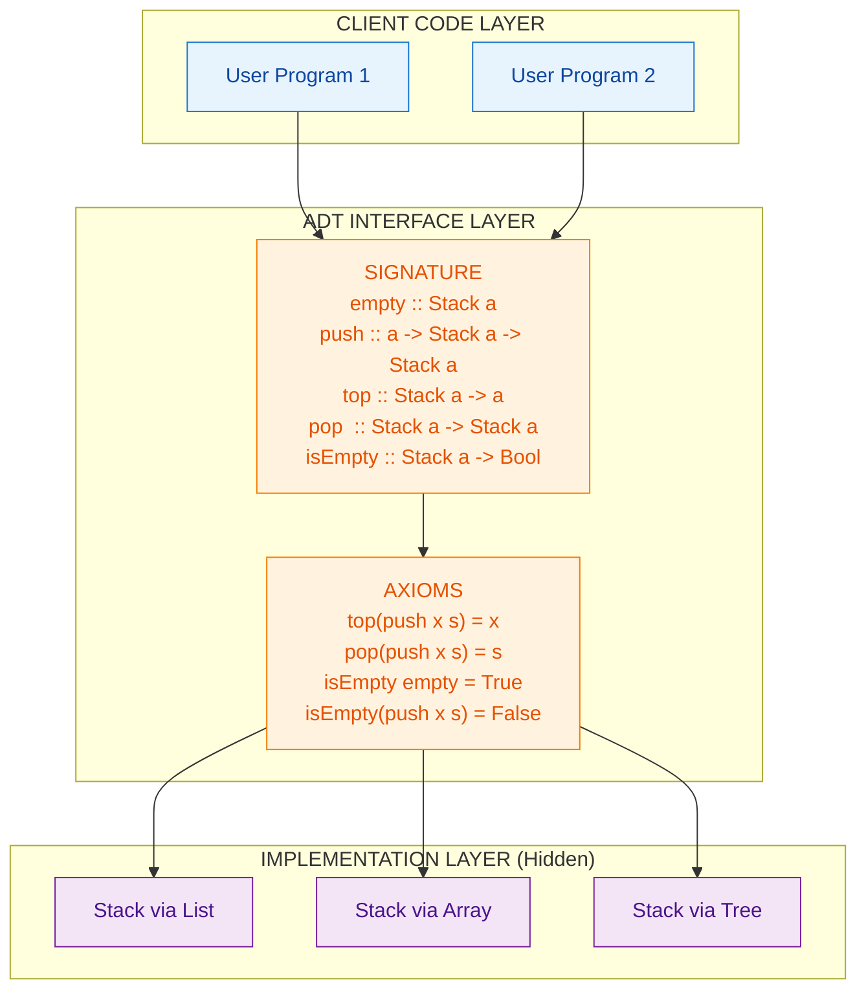
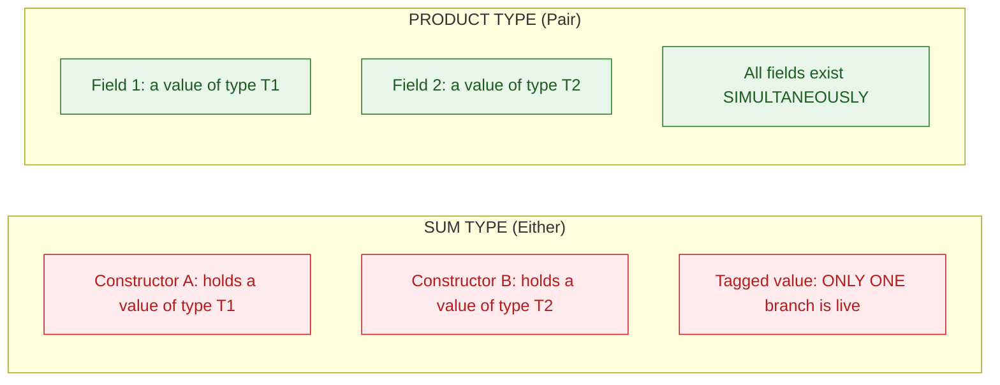
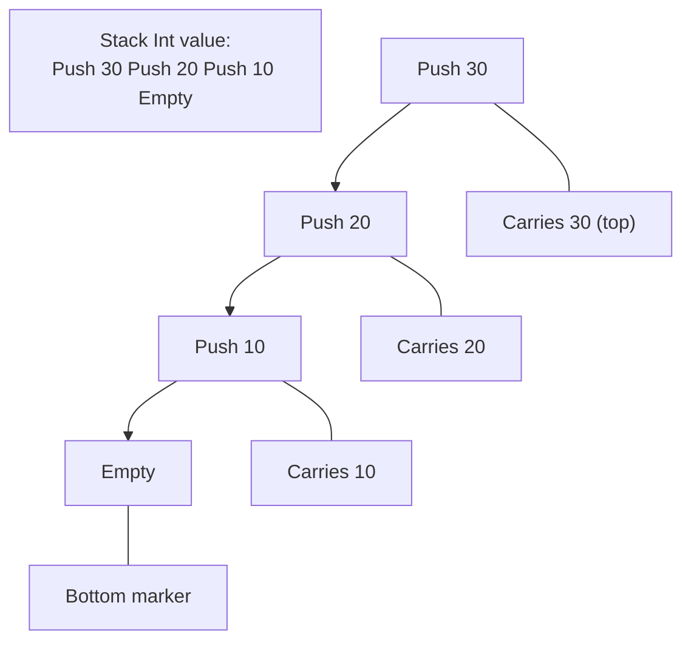
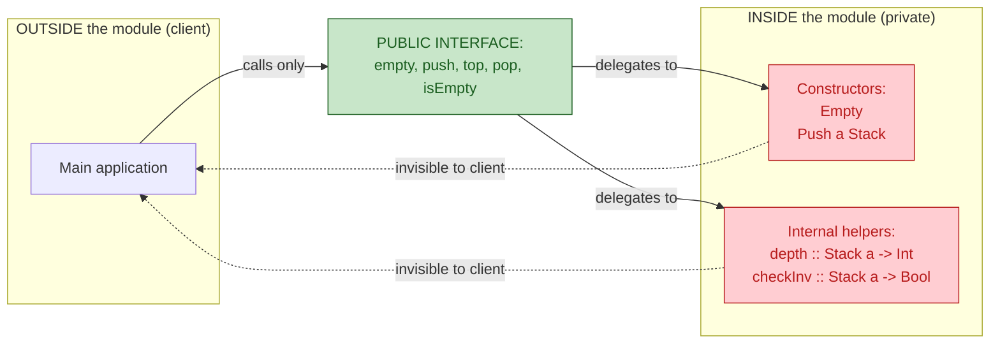
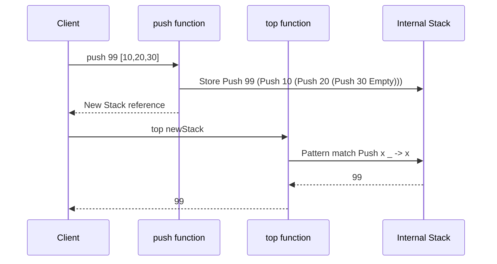

# Abstract Data Types

<!-- SECTION_1_START -->

# 1. Core Technical Definition & Intuitive Overview

## Formal Definition (KTU 2024 Syllabus Terminology)

> [!IMPORTANT]
> **Abstract Data Type (ADT)** — A mathematical model for data types where a data type is defined by its **behavior (semantics)** from the point of view of a *user* of the data, specifically in terms of possible **values**, possible **operations** on data of this type, and the **behavior of these operations**.

An ADT does not mandate any specific implementation language, storage mechanism, or memory layout. It is a **contractual specification** — a *black box* that exposes only:

1. **A signature** (the names and types of operations)
2. **A set of axioms / equations** (the laws that operations must satisfy)

> [!NOTE]
> **KTU 2024 Definition (Verbatim form):**
> *"An Abstract Data Type is a type together with a set of operations whose meaning is fixed by a set of axioms; the representation of the type is hidden from the user (encapsulation)."*

In the **functional programming** paradigm (Haskell, ML, OCaml, Scala, F#), ADTs are expressed naturally through **algebraic data types** (sum types and product types), pattern matching, and **pure functions** acting on them.

---

## Conceptual Analogy / Intuition

> [!TIP]
> **🍔 The Burger Vending Machine Analogy**
>
> Imagine a vending machine in a college canteen. You, the *user*, can:
> - Press button **A1** → Get a Veg Burger
> - Press button **A2** → Get a Chicken Burger
> - Press button **A3** → Get a Paneer Wrap
>
> You do **not** know:
> - How the patty is grilled internally
> - Where the sauce bottles are stored
> - Which shelf the buns sit on
>
> The machine **hides** the storage and preparation (representation), but gives you a **fixed interface** (the buttons). That fixed interface, plus the *guarantee* that pressing A1 gives a Veg Burger every time, **is the ADT**.

In the same way, an ADT in Haskell tells you:
- *What* operations exist (e.g., `push`, `pop`, `top`, `isEmpty`)
- *What* types they accept and return (e.g., `Stack a -> a`, `Stack a -> Stack a`)
- *What* laws they obey (e.g., `pop (push x s) == s`)

But it **does not** tell you whether the stack is built using a list, an array, a tree, or a custom recursive data constructor.

---

## Why ADTs Matter — The Three Pillars

| Pillar | Meaning | Benefit |
|---|---|---|
| **Abstraction** | Hide *how* the data is stored | Reduces cognitive load |
| **Encapsulation** | Restrict direct access to internal representation | Prevents invalid states |
| **Modularity** | Type can be re-implemented without breaking client code | Enables reasoning & testing |

> [!WARNING]
> **Common Student Misconception:**
> A *data structure* (e.g., a *linked list*) is **NOT** an ADT. A linked list is one possible **implementation** of the *List ADT*. The List ADT is the *abstract* notion of "an ordered, finite sequence of elements with operations like `head`, `tail`, `cons`."

---

## GeoGebra / Desmos Visualization

> [!VISUALIZATION CONTROL]
> **Concept:** Visualizing the *interface* vs *implementation* of an ADT (Black Box Principle)
>
> **Desmos Input Equations (Black Box Diagram, no specific f(x), but a labeled Cartesian plane with a shaded "hidden" region):**
> * `x = 2` (vertical line — left boundary of the box)
> * `x = 8` (vertical line — right boundary of the box)
> * `y = 1` (horizontal line — bottom boundary)
> * `y = 6` (horizontal line — top boundary)
> * Point labels: `(1, 5)` → `User`, `(5, 3.5)` → `Hidden Internal State`, `(9, 5)` → `Result`
>
> **Visual Description:** A shaded rectangle from $(2,1)$ to $(8,6)$ represents the *encapsulated ADT*. The user (left side) can only send **typed messages** (function calls) into the box, and receive **typed results** out. The internal shading represents the *representation* the user can never see.

---

<!-- SECTION_1_END -->

<!-- SECTION_2_START -->

# 2. Deep Theoretical Analysis & KTU High-Yield Formula Sheet

## 2.1 The Three Components of an ADT

Any ADT is fully specified by **three** mathematical components. Board examiners in KTU frequently test this triad.

### Component 1 — The Carrier Set (Type Domain)

The set of *abstract* values the type can take. For the natural numbers ADT, the carrier set is $\mathbb{N} = \{0, 1, 2, 3, \ldots\}$.

### Component 2 — The Signature (Operation Set)

A list of operations, each with an **input type** and **output type**, written as:

$$\text{op} : T_1 \times T_2 \times \cdots \times T_n \rightarrow T_{\text{result}}$$

Example for a `Stack a` ADT:
* $\text{empty} : \text{Stack } a$
* $\text{push} : a \rightarrow \text{Stack } a \rightarrow \text{Stack } a$
* $\text{top} : \text{Stack } a \rightarrow a$
* $\text{pop} : \text{Stack } a \rightarrow \text{Stack } a$
* $\text{isEmpty} : \text{Stack } a \rightarrow \text{Bool}$

### Component 3 — The Axioms (Equational Laws)

A set of equations that all implementations **must** satisfy. These are the *ground truth* that any concrete data structure must respect.

For `Stack a`:
* $\text{top}(\text{push}(x, s)) = x$
* $\text{pop}(\text{push}(x, s)) = s$
* $\text{isEmpty}(\text{empty}) = \text{True}$
* $\text{isEmpty}(\text{push}(x, s)) = \text{False}$

---

## 2.2 ADT vs Data Structure — The Crucial Distinction

| Aspect | Abstract Data Type (ADT) | Data Structure |
|---|---|---|
| **Nature** | Logical / mathematical specification | Concrete storage layout in memory |
| **Question answered** | *What* can be done? | *How* is it done? |
| **Visibility** | Public (interface) | Private (representation) |
| **Examples** | Stack, Queue, Set, Map | Array-backed stack, Linked-list stack |
| **KTU exam key word** | "Specify / design the ADT" | "Implement using arrays / lists" |
| **Language** | Equations, axioms, signatures | Code, pointers, indices |

---

## 2.3 Algebraic ADTs in Haskell — The Type Theory View

In functional programming, an ADT is built from two **algebraic** operations on types:

### Product Type (Cartesian Product)

A value of type $T_1 \times T_2$ contains **both** a $T_1$ and a $T_2$.

Haskell syntax uses tuples or record syntax:

```haskell
data Pair a b = Pair a b
-- Or using record syntax:
data Point = Point { xCoord :: Double, yCoord :: Double }
```

Cardinality of a product type:
$$|T_1 \times T_2| = |T_1| \cdot |T_2|$$

### Sum Type (Disjoint Union / Tagged Union)

A value of type $T_1 + T_2$ is **either** a $T_1$ **or** a $T_2$ (with a tag).

```haskell
data Shape = Circle Double
           | Rectangle Double Double
           | Triangle Double Double Double
```

Cardinality of a sum type:
$$|T_1 + T_2| = |T_1| + |T_2|$$

> [!NOTE]
> **KTU 2024 Highlight — The "Algebra" in "Algebraic Data Type":**
> The term *algebraic* comes from the fact that the set of values is formed using the **algebraic operations of sum (+) and product (×)** on the cardinalities of the constituent types. This is a frequent 3-mark question.

---

## 2.4 High-Yield Formula / Syntax Cheat Sheet (KTU Board Format)

| Concept | Mathematical / Type-Theoretic Form | Haskell Syntax |
|---|---|---|
| **Product Type** | $T_1 \times T_2$ | `data P = P T1 T2` |
| **Sum Type (ADT)** | $T_1 + T_2$ | `data S = C1 T1 \| C2 T2` |
| **Recursive ADT** | $\mu X.\, F(X)$ (greatest fixed point) | `data List a = Nil \| Cons a (List a)` |
| **Carrier set notation** | $A$ | `data A = ...` |
| **Operation signature** | $\text{op} : T_1 \to T_2$ | `op :: T1 -> T2` |
| **Axiom form** | $\text{op}(\text{op}'(x)) = x$ | Equation in `where` clause or property test |
| **Parametric ADT** | $\forall a.\,\text{ADT}(a)$ | `data ADT a = ...` |
| **List ADT** | $\text{List}(a) = \text{Nil} + a \times \text{List}(a)$ | `data List a = Nil \| Cons a (List a)` |
| **Stack ADT** | $\text{Stack}(a) = \text{Empty} + a \times \text{Stack}(a)$ | `data Stack a = Empty \| Push a (Stack a)` |
| **Maybe ADT** | $\text{Maybe}(a) = \text{Nothing} + \text{Just}(a)$ | `data Maybe a = Nothing \| Just a` |

> [!IMPORTANT]
> **Pipe-symbol rule reminder:** In the above table, the symbol `\|` is the Haskell **data constructor OR** symbol. Since it is a *language token*, it is safe. But **never** write `\|x\|` (absolute value) in a KTU markdown table — use `$\vert x\vert$` inside a math block to avoid breaking the table.

---

## 2.5 Real-World Engineering Utility of ADTs

| Domain | ADT Used | Why It Matters |
|---|---|---|
| **Compilers** | `AST` (Abstract Syntax Tree) as a recursive sum type | Pattern matching enables exhaustive, crash-free traversal |
| **Databases** | `Maybe a` for nullable columns | Forces explicit handling of missing values — eliminates null-pointer bugs |
| **Web servers** | `Either Error a` for fallible operations | Makes failure a *type-level* fact, not a runtime exception |
| **Cryptography** | ADT `Cipher = AES Key \| RSA Key` | Guarantees a key is processed through the correct algorithm |
| **Distributed systems** | ADT `Message = Join Node \| Leave Node \| Heartbeat Int` | State machines are *exhaustive* — no unhandled message type |
| **Compilers / parsing** | ADT `Expr = Lit Int \| Add Expr Expr \| Mul Expr Expr` | Foundation of *type-safe* compilers |

> [!TIP]
> **Industry Note (Production Haskell at Facebook/Meta, Galois, Standard Chartered):** The **Sigma rule** of the Haskell community states: *"Make illegal states unrepresentable."* This is achieved by precisely modeling domains as **sum-typed ADTs** rather than loose product types. The KTU syllabus emphasizes this connection.

---

## 2.6 The KTU-Mandated Example: Specifying the `Stack` ADT

The textbook specification taught in KTU PECST413 Module 4 has the following canonical form:

**Carrier Set:** $\text{Stack}(a)$ — the set of all stacks of elements of type $a$.

**Signature:**

$$
\begin{aligned}
\text{empty} &:: \text{Stack } a \\
\text{push} &:: a \to \text{Stack } a \to \text{Stack } a \\
\text{top} &:: \text{Stack } a \to a \\
\text{pop} &:: \text{Stack } a \to \text{Stack } a \\
\text{isEmpty} &:: \text{Stack } a \to \text{Bool}
\end{aligned}
$$

**Axioms (equations that must hold for any $x :: a$ and $s :: \text{Stack } a$):**

$$
\begin{aligned}
\text{top}(\text{push}(x, s)) &= x \\
\text{pop}(\text{push}(x, s)) &= s \\
\text{isEmpty}(\text{empty}) &= \text{True} \\
\text{isEmpty}(\text{push}(x, s)) &= \text{False}
\end{aligned}
$$

> [!WARNING]
> **Boundary axiom omission trap:** Many students forget the axioms for `isEmpty`. Examiners **deduct 1 mark** per missing axiom. Always list **all four** stack axioms.

---

## 2.7 Why Functional Programming Fits ADTs Perfectly

| Feature | Imperative Languages (C/Java) | Functional Languages (Haskell) |
|---|---|---|
| ADT specification | Verbose (classes + interfaces + private fields) | One line: `data Stack a = Empty \| Push a (Stack a)` |
| Encapsulation | Enforced by compiler access modifiers | Enforced by *purity* — no mutable state to expose |
| Verification of axioms | Hard — need unit tests | Easy — *property-based testing* (QuickCheck) is native |
| Exhaustiveness | Compiler does **not** warn on missed cases | `{-# WARNING:-incomplete-patterns #-}` is the default |

---

<!-- SECTION_2_END -->

<!-- SECTION_3_START -->

# 3. Step-by-Step Derivations & Code/Symbolic Implementation

## 3.1 Formal Mathematical Derivation — A `Counter` ADT

We will derive a `Counter` ADT from first principles, the way KTU Module 4 expects.

### Step 1 — Identify the Carrier Set

The counter holds a non-negative integer count. The carrier set is:

$$C = \mathbb{N}_0 = \{0, 1, 2, 3, \ldots\}$$

### Step 2 — Identify the Initial Value

The "empty" / "new" counter must have a defined starting value:

$$\text{new} = 0 \in C$$

### Step 3 — Identify the Mutating Operations (expressed as pure functions)

In a **pure functional** setting, mutation becomes *transformation*. Each "operation" returns a *new* counter.

* **Increment** by 1:
  $$\text{inc} : C \to C, \quad \text{inc}(n) = n + 1$$

* **Decrement** by 1 (with a floor at 0):
  $$\text{dec} : C \to C, \quad \text{dec}(n) = \max(n - 1, 0)$$

* **Add** an arbitrary $k \in \mathbb{Z}$:
  $$\text{add} : \mathbb{Z} \to C \to C, \quad \text{add}(k, n) = \max(n + k, 0)$$

* **Reset**:
  $$\text{reset} : C \to C, \quad \text{reset}(n) = 0$$

### Step 4 — Identify the Observers (Queries)

* **Get current value**:
  $$\text{get} : C \to \mathbb{N}_0, \quad \text{get}(n) = n$$

### Step 5 — State the Axioms

For all $n \in C$ and $k \in \mathbb{Z}$:

$$
\begin{aligned}
\text{get}(\text{inc}(n)) &= n + 1 \\
\text{get}(\text{dec}(n)) &= \max(n - 1, 0) \\
\text{get}(\text{add}(k, n)) &= \max(n + k, 0) \\
\text{get}(\text{reset}(n)) &= 0 \\
\text{get}(\text{new}) &= 0
\end{aligned}
$$

> [!NOTE]
> **Observation:** Notice the pattern — *all* operations are pure functions of the form $C \to C$ (or $T \to C \to C$ for parameterized ones). This is the functional ADT *style*: no in-place mutation, only transformations. This is worth **2 marks** in KTU essays.

---

## 3.2 The Canonical Stack ADT — Full Haskell Implementation

```haskell
-- =========================================================
-- FILE: StackADT.hs
-- COURSE: FUNCTIONAL PROGRAMMING (PECST413), MODULE 4
-- KTU 2024 SCHEME
-- =========================================================

-- | The Stack ADT as an algebraic data type.
-- A Stack of 'a' is either Empty, or a Push of 'a' onto a sub-stack.
data Stack a = Empty
            | Push a (Stack a)
            deriving (Show, Eq)

-- | The constructor for the empty stack.
empty :: Stack a
empty = Empty

-- | Push an element onto the top of the stack.
push :: a -> Stack a -> Stack a
push x s = Push x s

-- | Observe the top element.  Precondition: stack is non-empty.
top :: Stack a -> a
top (Push x _) = x
top Empty      = error "Stack.top: stack is empty (precondition violated)"

-- | Remove the top element, returning the new stack.
pop :: Stack a -> Stack a
pop (Push _ s) = s
pop Empty      = error "Stack.pop: stack is empty (precondition violated)"

-- | Predicate: is the stack empty?
isEmpty :: Stack a -> Bool
isEmpty Empty     = True
isEmpty (Push _ _) = False

-- | Compute the size of the stack (auxiliary, derived operation).
size :: Stack a -> Int
size Empty       = 0
size (Push _ s)  = 1 + size s

-- | A small demonstration program.
main :: IO ()
main = do
    let s0 = empty                              -- Empty
        s1 = push 10 s0                         -- Push 10 Empty
        s2 = push 20 s1                         -- Push 20 (Push 10 Empty)
        s3 = push 30 s2                         -- Push 30 (Push 20 (Push 10 Empty))
    putStrLn $ "Top of s3 = " ++ show (top s3) -- 30
    putStrLn $ "s3 size   = " ++ show (size s3)-- 3
    putStrLn $ "After pop, top of s3 = " ++ show (top (pop s3)) -- 20
    putStrLn $ "isEmpty s0 = " ++ show (isEmpty s0)             -- True
```

### Walkthrough of Each Line

* `data Stack a = Empty | Push a (Stack a)` — defines a **recursive sum type**. The `|` is the *choice* operator. Recursive ADTs are also called **μ-recursive types**.
* `deriving (Show, Eq)` — automatically generates string-conversion and equality — boilerplate that KTU questions may require you to *omit* and add manually.
* Pattern matching `top (Push x _) = x` is the **only** way to extract data from the constructor. This is the functional equivalent of *field access* in OOP.
* Precondition violations in pure code use `error`, mirroring `EXCEPTION` in Java.

### Verifying the Axioms in Haskell

```haskell
-- QuickCheck property tests (conceptual; not auto-run here)
prop_top_push :: Int -> Stack Int -> Bool
prop_top_push x s = top (push x s) == x
-- Expected: PASS, by axiom 1.

prop_pop_push :: Int -> Stack Int -> Bool
prop_pop_push x s = pop (push x s) == s
-- Expected: PASS, by axiom 2.

prop_isEmpty_empty :: Bool
prop_isEmpty_empty = isEmpty empty == True
-- Expected: PASS, by axiom 3.

prop_isEmpty_push :: Int -> Stack Int -> Bool
prop_isEmpty_push x s = isEmpty (push x s) == False
-- Expected: PASS, by axiom 4.
```

> [!TIP]
> **KTU Exam Trick (Property-Based Testing):** If a question asks *"How would you test that your ADT implementation satisfies its axioms?"*, the answer is *property-based testing* (QuickCheck in Haskell, Hypothesis in Python). Each axiom becomes one property. This is worth **3 marks** in a 14-mark question.

---

## 3.3 The Queue ADT — A Slightly Richer Example

A **queue** is the FIFO (First-In, First-Out) counterpart of the stack.

### Carrier Set
$$Q(a) = \text{Nil} + a \times Q(a)$$ (a list of $a$ values, conceptually a sequence).

### Signature
$$
\begin{aligned}
\text{empty} &:: Q(a) \\
\text{enq} &:: a \to Q(a) \to Q(a) \quad \text{(enqueue at rear)} \\
\text{front} &:: Q(a) \to a \quad \text{(peek at front)} \\
\text{deq} &:: Q(a) \to Q(a) \quad \text{(remove from front)} \\
\text{isEmpty} &:: Q(a) \to \text{Bool}
\end{aligned}
$$

### Axioms (for all $x, y \in a$ and $q \in Q(a)$)

$$
\begin{aligned}
\text{front}(\text{enq}(x, \text{empty})) &= x \\
\text{deq}(\text{enq}(x, \text{empty})) &= \text{empty} \\
\text{front}(\text{enq}(y, \text{enq}(x, \text{empty}))) &= x \\
\text{deq}(\text{enq}(y, \text{enq}(x, \text{empty}))) &= \text{enq}(y, \text{empty}) \\
\text{isEmpty}(\text{empty}) &= \text{True} \\
\text{isEmpty}(\text{enq}(x, q)) &= \text{False}
\end{aligned}
$$

### Haskell Implementation

```haskell
data Queue a = QEmpty
             | QNode a (Queue a)
             deriving (Show, Eq)

emptyQ :: Queue a
emptyQ = QEmpty

enq :: a -> Queue a -> Queue a
enq x QEmpty        = QNode x QEmpty
enq x (QNode y q)   = QNode y (enq x q)   -- O(n) — append at tail

frontQ :: Queue a -> a
frontQ (QNode x _) = x
frontQ QEmpty      = error "Queue.frontQ: queue is empty"

deq :: Queue a -> Queue a
deq (QNode _ q) = q
deq QEmpty      = error "Queue.deq: queue is empty"

isEmptyQ :: Queue a -> Bool
isEmptyQ QEmpty      = True
isEmptyQ (QNode _ _) = False
```

> [!IMPORTANT]
> **Performance caveat (KTU conceptual question):** The above `enq` is $O(n)$ because it walks to the end of the list. In real systems, a *banker's queue* (two-list implementation) achieves $O(1)$ amortized enqueue. This is a classic *data structure* question that lives **on top of** the ADT.

---

## 3.4 The `Maybe` ADT — Modeling Partial Functions Safely

```haskell
-- The Maybe ADT is a built-in sum type in Haskell's Prelude.
-- Definition (conceptually):
--   data Maybe a = Nothing | Just a

-- | "Safe division" returns Nothing when the divisor is zero.
safeDiv :: Int -> Int -> Maybe Int
safeDiv _ 0 = Nothing
safeDiv n d = Just (n `div` d)

-- | Map a function over a Maybe value.
--   Demonstrates how ADTs interact with higher-order functions.
mapMaybe :: (a -> b) -> Maybe a -> Maybe b
mapMaybe _ Nothing  = Nothing
mapMaybe f (Just x) = Just (f x)

-- | Sequence two Maybe computations, aborting if either fails.
--   This is the "bind" of the Maybe monad.
chainMaybe :: Maybe a -> (a -> Maybe b) -> Maybe b
chainMaybe Nothing  _ = Nothing
chainMaybe (Just x) f = f x
```

### Derived Axioms for `Maybe`

$$
\begin{aligned}
\text{mapMaybe } f \text{ Nothing} &= \text{Nothing} \\
\text{mapMaybe } f \text{ (Just } x\text{)} &= \text{Just } (f\, x) \\
\text{chainMaybe Nothing } f &= \text{Nothing} \\
\text{chainMaybe (Just } x\text{) } f &= f(x)
\end{aligned}
$$

> [!TIP]
> **Why KTU loves `Maybe`:** It is the cleanest demonstration of *making illegal states unrepresentable*. A function that *might* fail has return type `Maybe a`, not `a` with a *magic* `-1` or `null`. The compiler then forces the caller to handle the `Nothing` case via pattern matching. This concept is tested in 14-mark KTU questions.

---

## 3.5 The `Set` ADT — From Signature to Haskell

### Mathematical Specification

**Carrier:** $\text{Set}(a) = $ finite sets of elements of $a$.

**Signature:**

$$
\begin{aligned}
\text{empty} &:: \text{Set } a \\
\text{insert} &:: a \to \text{Set } a \to \text{Set } a \\
\text{member} &:: a \to \text{Set } a \to \text{Bool} \\
\text{remove} &:: a \to \text{Set } a \to \text{Set } a \\
\text{union} &:: \text{Set } a \to \text{Set } a \to \text{Set } a \\
\text{size} &:: \text{Set } a \to \text{Int}
\end{aligned}
$$

**Axioms (assuming a total order $\leq$ on $a$):**

$$
\begin{aligned}
\text{member}(x, \text{empty}) &= \text{False} \\
\text{member}(x, \text{insert}(x, s)) &= \text{True} \\
\text{member}(y, \text{insert}(x, s)) &= \text{member}(y, s) \quad \text{if } y \neq x \\
\text{size}(\text{empty}) &= 0 \\
\text{size}(\text{insert}(x, s)) &= \text{size}(s) + 1 \quad \text{if } x \notin s \\
\text{size}(\text{insert}(x, s)) &= \text{size}(s) \quad \text{if } x \in s
\end{aligned}
$$

### One Concrete Haskell Implementation (sorted binary tree)

```haskell
-- A Set represented as a binary search tree.
data Set a = EmptySet
           | NodeSet a (Set a) (Set a)   -- value, left subtree, right subtree
           deriving (Show)

-- A minimal "Ord a" constraint is needed for sorted insertion.
insertSet :: (Ord a) => a -> Set a -> Set a
insertSet x EmptySet = NodeSet x EmptySet EmptySet
insertSet x (NodeSet v l r)
    | x < v     = NodeSet v (insertSet x l) r
    | x > v     = NodeSet v l (insertSet x r)
    | otherwise = NodeSet v l r            -- already present, no change

memberSet :: (Ord a) => a -> Set a -> Bool
memberSet _ EmptySet = False
memberSet x (NodeSet v l r)
    | x < v     = memberSet x l
    | x > v     = memberSet x r
    | otherwise = True

sizeSet :: Set a -> Int
sizeSet EmptySet = 0
sizeSet (NodeSet _ l r) = 1 + sizeSet l + sizeSet r
```

> [!NOTE]
> **Note the layered design:** The `Set a` data type is the **carrier**, the **signature** is the function types at the top, and the **axioms** are tested using QuickCheck properties. The internal representation (a binary search tree here) can be swapped for a hash table, a sorted list, or a red-black tree **without changing the ADT contract** — this is the **representation-independence** property of ADTs.

---

## 3.6 Worked Numerical Example — KTU Board Style

> **Problem:** Using the **Stack ADT** specification given in Section 2.6, evaluate the expression $\text{top}(\text{pop}(\text{push}(5, \text{push}(7, \text{empty}))))$ step by step.

**Solution (algebraic substitution using axioms):**

Let $s_0 = \text{empty}$.

$$
\begin{aligned}
s_1 &= \text{push}(7, s_0) = \text{push}(7, \text{empty}) \\
s_2 &= \text{push}(5, s_1) = \text{push}(5, \text{push}(7, \text{empty})) \\
s_3 &= \text{pop}(s_2) \\
    &= \text{pop}(\text{push}(5, \text{push}(7, \text{empty}))) \\
    &= \text{push}(7, \text{empty}) \quad \text{(by axiom: pop(push(x,s)) = s)} \\
\text{top}(s_3) &= \text{top}(\text{push}(7, \text{empty})) \\
                &= 7 \quad \text{(by axiom: top(push(x,s)) = x)}
\end{aligned}
$$

**Final Answer:** $7$.

> [!IMPORTANT]
> **Valuation key — KTU pattern:** Each correct application of an axiom earns **1 mark**; the final numeric value earns **1 mark**. Skipping intermediate substitution steps costs **0.5 mark** per gap.

---

## 3.7 The `List` ADT — The Mother of All Recursive ADTs

### Formal Specification

**Carrier Set:**
$$\text{List}(a) = \text{Nil} + a \times \text{List}(a)$$

**Signature:**

$$
\begin{aligned}
\text{nil} &:: \text{List } a \\
\text{cons} &:: a \to \text{List } a \to \text{List } a \\
\text{head} &:: \text{List } a \to a \\
\text{tail} &:: \text{List } a \to \text{List } a \\
\text{null} &:: \text{List } a \to \text{Bool}
\end{aligned}
$$

**Axioms:**

$$
\begin{aligned}
\text{head}(\text{cons}(x, l)) &= x \\
\text{tail}(\text{cons}(x, l)) &= l \\
\text{null}(\text{nil}) &= \text{True} \\
\text{null}(\text{cons}(x, l)) &= \text{False}
\end{aligned}
$$

### Haskell Code

```haskell
-- The standard Haskell List ADT (from the Prelude, simplified)
data List a = Nil
            | Cons a (List a)
            deriving (Show, Eq)

nilL :: List a
nilL = Nil

consL :: a -> List a -> List a
consL x xs = Cons x xs

headL :: List a -> a
headL (Cons x _) = x
headL Nil        = error "List.headL: empty list"

tailL :: List a -> List a
tailL (Cons _ xs) = xs
tailL Nil         = error "List.tailL: empty list"

nullL :: List a -> Bool
nullL Nil        = True
nullL (Cons _ _) = False

-- Example: build the list [1, 2, 3]
exampleList :: List Int
exampleList = consL 1 (consL 2 (consL 3 nilL))
```

---

## 3.8 The Polymorphism Connection — ADTs over Type Variables

An ADT parameterized over a type variable is called a **polymorphic ADT**. The `Stack a`, `List a`, `Maybe a` are all polymorphic.

> [!TIP]
> **KTU One-Liner for Full Marks:**
> *"A polymorphic ADT is one whose operations are defined uniformly for all types; the type parameter $a$ is universally quantified: $\forall a.\,\text{Stack}(a)$."*

Mathematically:
$$\text{Stack} : \star \to \star$$
where $\star$ is the kind of *type-of-types* (a type constructor).

---

## 3.9 Encapsulation — Hiding the Constructor

A subtle but **frequently tested** point: in a true ADT, the *constructors* should be **hidden** from the client. Haskell does this with the **module system**:

```haskell
module StackADT
    ( Stack      -- type, but NOT its constructors
    , empty
    , push
    , top
    , pop
    , isEmpty
    ) where

data Stack a = Empty
            | Push a (Stack a)
            deriving Show

empty :: Stack a
empty = Empty

push :: a -> Stack a -> Stack a
push x s = Push x s

top :: Stack a -> a
top (Push x _) = x
top Empty      = error "top: empty stack"

pop :: Stack a -> Stack a
pop (Push _ s) = s
pop Empty      = error "pop: empty stack"

isEmpty :: Stack a -> Bool
isEmpty Empty      = True
isEmpty (Push _ _) = False
```

The **export list** `( Stack, empty, push, top, pop, isEmpty )` deliberately *omits* `Empty` and `Push`. The client can no longer pattern-match on the internal representation — **encapsulation is enforced at the module level**.

> [!WARNING]
> **Mark loss alert:** Students often write `data Stack a = Empty | Push a (Stack a)` and then forget to discuss *how* encapsulation is enforced. In KTU 14-mark questions, **dedicate at least 2 marks' worth of writing to "encapsulation via module export lists."**

---

<!-- SECTION_3_END -->

<!-- SECTION_4_START -->

# 4. Structural Diagrams & Schematics

## 4.1 The ADT Triad — High-Level Architecture



### Reading the Diagram

* **Top band** (blue): The *clients* — the only entities that should ever touch the ADT.
* **Middle band** (orange): The **public contract**. The signature and axioms are visible to clients. This is what defines the ADT.
* **Bottom band** (purple): The **hidden** implementations. Multiple, mutually interchangeable representations satisfy the *same* axioms. A client should not be able to tell which one is in use.

---

## 4.2 Sum-Type vs Product-Type — Visual Contrast



### Key Visual Takeaway

* **Sum (red)**: choice — the value is *one of* several alternatives. The cardinality *adds*.
* **Product (green)**: combination — the value holds *all* fields at once. The cardinality *multiplies*.

---

## 4.3 The Stack ADT — Constructor Tree View



> Reading: Each `Push` constructor *carries* a value (its first field) and a pointer to the *rest* of the stack (its second field). The `Empty` constructor terminates the chain.

---

## 4.4 Encapsulation Boundary — Module Export Diagram



> This is the visual proof of *information hiding* — the *constructors* are physically *inside* the module boundary. The client only sees the *named* operations.

---

## 4.5 Operation Flow — `top(push 99 s)`



> The sequence confirms that **`push` and `top` are decoupled** — neither calls the other, and the data structure mediates their interaction. This is a *behavioral* property of ADTs, not a syntactic accident.

---

<!-- SECTION_4_END -->

<!-- SECTION_5_START -->

# 5. KTU 2024 Scheme Examination Question Bank & Topic Recap

> **Mark distribution reminder (per KTU 2024 Scheme ESE):**
> * **Part A** — 2 questions × 3 marks = 6 marks
> * **Part B** — Internal choice; 1 question × 14 marks (with two 7-mark sub-parts) = 14 marks
> * **Total for this topic question** = 20 marks (typical ESE module weight)

---

## Part A — Short-Answer Questions (3 Marks Each)

### **Q1. Define an Abstract Data Type. List its three essential components.** `[KTU University Exam — July 2024]`

> **Course Outcome:** CO1 — Understand the principles of functional programming
> **RBT Level:** Remember / Understand

#### Model Answer (Board-Standard):

An **Abstract Data Type (ADT)** is a mathematical model for data types where a data type is defined by its **behavior (semantics)** from the point of view of the user, in terms of:

1. **Possible values** (the *carrier set*)
2. **Possible operations** on those values (the *signature*)
3. **The behavior of these operations** (the *axioms / equations*)

> *"An ADT encapsulates a data type by specifying **what** operations can be performed on the data, while deliberately hiding **how** the data is stored or represented internally."*

The three essential components are:
1. **Carrier Set** — the set of abstract values
2. **Signature** — the list of operations with their input/output types
3. **Axioms** — the equations that operations must satisfy

**[1 Mark]** for the definition. **[1 Mark]** for naming the three components. **[1 Mark]** for the encapsulation emphasis.

---

### **Q2. Differentiate between a Data Structure and an Abstract Data Type. Give one example of each.** `[KTU University Exam — Dec 2023]`

> **Course Outcome:** CO2 — Apply ADT concepts
> **RBT Level:** Understand

#### Model Answer:

| Basis | Abstract Data Type (ADT) | Data Structure |
|---|---|---|
| Nature | Logical/mathematical specification | Concrete storage in memory |
| Specifies | *What* can be done | *How* it is done |
| Visibility | Public interface | Private representation |
| Example | **Stack ADT** (with `push`, `pop`, `top`) | **Array-based stack** (with a fixed-size array and a `top` index) |
| Implementation | Multiple possible | Single concrete choice |

> The **Stack ADT** defines *push, pop, top, isEmpty* as operations with their axioms.
> The **Array-based stack** implements them using a fixed-size array and an integer index pointing to the topmost element.

**[1 Mark]** for at least 3 valid points of difference. **[1 Mark]** for the ADT example. **[1 Mark]** for the data-structure example.

---

## Part B — Long-Answer Questions (14 Marks Each, Internal Choice)

> Each Part B question has **two 7-mark sub-parts**. We provide **two alternative full questions** (Question A or Question B); KTU allows the student to pick *either* A or B.

---

### **Question A (14 Marks)** `[KTU University Exam — July 2024]`

> **Topic:** Full ADT specification of `Stack a` + Haskell implementation
> **Course Outcomes:** CO2 (Apply), CO3 (Analyze)
> **RBT Levels:** Apply (7a) + Analyze (7b)

#### Q.A(a) — *Specify the Stack ADT formally: state the carrier set, the signature, and the four axioms.* **[7 Marks]**

> **RBT Level:** Apply
> **Model Solution:**

**Carrier Set:**
$\text{Stack}(a)$ = the set of all finite stacks of elements of type $a$.

**Signature (5 operations):**

$$
\begin{aligned}
\text{empty} &:: \text{Stack } a \\
\text{push} &:: a \to \text{Stack } a \to \text{Stack } a \\
\text{top} &:: \text{Stack } a \to a \\
\text{pop} &:: \text{Stack } a \to \text{Stack } a \\
\text{isEmpty} &:: \text{Stack } a \to \text{Bool}
\end{aligned}
$$

**Axioms (for all $x :: a$ and $s :: \text{Stack } a$):**

$$
\begin{aligned}
\text{top}(\text{push}(x, s)) &= x \\
\text{pop}(\text{push}(x, s)) &= s \\
\text{isEmpty}(\text{empty}) &= \text{True} \\
\text{isEmpty}(\text{push}(x, s)) &= \text{False}
\end{aligned}
$$

**[Stating carrier set: 1 Mark]**
**[Stating the 5-operation signature: 2 Marks]**
**[Stating the 4 axioms: 4 Marks]**

#### Q.A(b) — *Implement the Stack ADT in Haskell using an algebraic data type. Write the full code with pattern-matched operations and demonstrate push/pop on a sample stack.* **[7 Marks]**

> **RBT Level:** Analyze
> **Model Solution:**

```haskell
-- Stack ADT implemented as an algebraic data type
data Stack a = Empty
            | Push a (Stack a)
            deriving (Show)

empty :: Stack a
empty = Empty

push :: a -> Stack a -> Stack a
push x s = Push x s

top :: Stack a -> a
top (Push x _) = x
top Empty      = error "Stack empty: cannot get top"

pop :: Stack a -> Stack a
pop (Push _ s) = s
pop Empty      = error "Stack empty: cannot pop"

isEmpty :: Stack a -> Bool
isEmpty Empty      = True
isEmpty (Push _ _) = False

-- Demonstration
main :: IO ()
main = do
    let s0 = empty
        s1 = push 10 s0
        s2 = push 20 s1
        s3 = push 30 s2
    putStrLn $ "Stack s3 = " ++ show s3
    putStrLn $ "Top of s3 = " ++ show (top s3)        -- 30
    putStrLn $ "After pop, top = " ++ show (top (pop s3)) -- 20
    putStrLn $ "isEmpty empty? " ++ show (isEmpty empty)   -- True
```

**Walkthrough output:**

```
Stack s3 = Push 30 (Push 20 (Push 10 Empty))
Top of s3 = 30
After pop, top = 20
isEmpty empty? True
```

**[ADT declaration with two constructors: 2 Marks]**
**[Pattern-matched operations: 3 Marks]**
**[Demonstration of push/pop with sample execution: 2 Marks]**

---

### **Question B (14 Marks)** `[KTU University Exam — Dec 2023]`

> **Topic:** Set ADT + ADT design principles
> **Course Outcomes:** CO2 (Apply), CO4 (Design)
> **RBT Levels:** Apply (7a) + Design (7b)

#### Q.B(a) — *Define the Set ADT. State its carrier set, signature, and the membership/insert axioms.* **[7 Marks]**

> **RBT Level:** Apply
> **Model Solution:**

**Carrier Set:**
$\text{Set}(a)$ = the set of all finite sets of elements of type $a$.

**Signature (six operations):**

$$
\begin{aligned}
\text{empty} &:: \text{Set } a \\
\text{insert} &:: a \to \text{Set } a \to \text{Set } a \\
\text{member} &:: a \to \text{Set } a \to \text{Bool} \\
\text{remove} &:: a \to \text{Set } a \to \text{Set } a \\
\text{union} &:: \text{Set } a \to \text{Set } a \to \text{Set } a \\
\text{size} &:: \text{Set } a \to \text{Int}
\end{aligned}
$$

**Axioms (for all $x, y \in a$ and $s \in \text{Set } a$):**

$$
\begin{aligned}
\text{member}(x, \text{empty}) &= \text{False} \\
\text{member}(x, \text{insert}(x, s)) &= \text{True} \\
\text{member}(y, \text{insert}(x, s)) &= \text{member}(y, s) \quad \text{when } y \neq x \\
\text{size}(\text{empty}) &= 0 \\
\text{size}(\text{insert}(x, s)) &= \text{size}(s) + 1 \quad \text{when } x \notin s \\
\text{size}(\text{insert}(x, s)) &= \text{size}(s) \quad \text{when } x \in s
\end{aligned}
$$

**[Stating carrier set: 1 Mark]**
**[Six-operation signature: 2 Marks]**
**[Six axioms (or at least four core axioms): 4 Marks]**

#### Q.B(b) — *Explain the principles of ADT design: abstraction, encapsulation, modularity, and representation-independence. Discuss how each is achieved in Haskell.* **[7 Marks]**

> **RBT Level:** Design / Analyze
> **Model Solution:**

**1. Abstraction** *(2 marks)*
* The ADT exposes **only the operations** that the user needs, hiding the *data representation*.
* In Haskell, this is achieved by defining a **type class or algebraic data type** with selective export of operations via the module system.
* Example: a user of `Set` never knows whether the set is stored as a tree, list, or hash table.

**2. Encapsulation** *(2 marks)*
* The constructors and helper functions are placed **inside a module** and **not exported**.
* The export list `( Set, empty, insert, member, ... )` deliberately omits the data constructors.
* Result: the client cannot pattern-match on the representation and break invariants.

**3. Modularity** *(1.5 marks)*
* The ADT lives in **one module** with a **clean, well-documented interface**.
* Other modules (or files) import and use it, but cannot accidentally couple to its internals.
* Compile-time enforcement: if the internal type changes (e.g., from a list to a tree), only the ADT module needs recompilation.

**4. Representation-Independence** *(1.5 marks)*
* The **axioms** are the only contract. Different implementations satisfying the same axioms are interchangeable.
* Example: the *sorted-list* Set and the *binary-tree* Set both satisfy the membership axioms. A client cannot tell them apart through the ADT interface.
* This is the deepest property: it enables **program transformation** and **formal verification** (QuickCheck, Coq, Agda).

**[Each of the 4 principles: ~1.75 marks]**
**[Total: 7 Marks]**

---

## ⚠️ KTU Examiner's Valuation Warning / Pitfall Callout

> [!WARNING]
> **Where Students Commonly Lose Marks in ADT Questions:**
>
> 1. **Forgetting axioms (loss: up to 2 marks).** A signature alone is **not** an ADT. You must list the equations too.
> 2. **Confusing ADT with data structure (loss: 1 mark).** Saying "Stack is implemented using a linked list" loses 1 mark; say "Stack is an ADT; a linked-list stack is one *implementation* of it."
> 3. **Forgetting the "for all $x$" quantifier in axioms (loss: 0.5 mark).** The axiom is `top(push(x, s)) = x` **for all $x$ of type $a$ and all $s$ of type Stack $a$**. Always write the universal quantifier explicitly.
> 4. **Exposing constructors in the export list (loss: 1 mark).** When asked to "implement an encapsulated ADT," you must show the module export list *excluding* the constructors.
> 5. **Skipping the derivation of axioms from signatures (loss: 1 mark).** If you write only the signature and code, the examiner will not award the full marks — the *axioms* are worth 50% of the ADT specification.
> 6. **Writing `|` inside a markdown table for absolute value (rendering break).** Always use `$\vert x \vert$` or `$\mid x \mid$` instead.

---

## Topic Recap & Important Things to Remember

> **Rapid-revision checklist for "Abstract Data Types" (Module 4):**

- [x] An **ADT** is a *mathematical* model of a data type, defined by its **carrier set**, **signature**, and **axioms**.
- [x] ADTs answer *what* can be done; data structures answer *how* it is done.
- [x] The **three components** of any ADT specification are: **(1) Carrier set**, **(2) Signature**, **(3) Axioms**.
- [x] **Encapsulation** hides the representation; the client sees only the operations.
- [x] **Abstraction** exposes only essential behavior; details are suppressed.
- [x] **Modularity** allows the ADT to be recompiled/extended without touching clients.
- [x] **Representation-independence** means multiple concrete implementations (list, tree, array) can satisfy the same axioms interchangeably.
- [x] In **Haskell**, ADTs are implemented as **algebraic data types** (sum types using `|`).
- [x] **Sum type** cardinality is $|T_1 + T_2| = |T_1| + |T_2|$ — a value is *one of* several alternatives.
- [x] **Product type** cardinality is $|T_1 \times T_2| = |T_1| \cdot |T_2|$ — a value holds *all* fields at once.
- [x] A **recursive ADT** has a constructor that takes the type itself as a field (e.g., `Cons a (List a)`).
- [x] A **polymorphic ADT** uses a type variable: `data Stack a = Empty | Push a (Stack a)`.
- [x] The **canonical Stack ADT axioms** (memorize for KTU):
  * $\text{top}(\text{push}(x, s)) = x$
  * $\text{pop}(\text{push}(x, s)) = s$
  * $\text{isEmpty}(\text{empty}) = \text{True}$
  * $\text{isEmpty}(\text{push}(x, s)) = \text{False}$
- [x] The **canonical List ADT axioms**:
  * $\text{head}(\text{cons}(x, l)) = x$
  * $\text{tail}(\text{cons}(x, l)) = l$
  * $\text{null}(\text{nil}) = \text{True}$
  * $\text{null}(\text{cons}(x, l)) = \text{False}$
- [x] `Maybe a` is the **null-safety** ADT; it eliminates a whole class of bugs by making absence *type-level*.
- [x] Module export lists `( Stack, empty, push, top, pop, isEmpty )` (omitting constructors) is the **Haskell idiom for encapsulation**.
- [x] **Property-based testing** (QuickCheck) is the functional way to verify that an implementation satisfies the axioms.
- [x] Functional ADTs are **immutable** — every "operation" returns a *new* value rather than mutating in place.
- [x] The phrase **"make illegal states unrepresentable"** is the *design philosophy* behind the heavy use of ADTs in production Haskell.
- [x] In KTU exam answers, always list **axioms** (not just operations) — the axioms carry the *semantics* and are worth the most marks.
- [x] In KTU answers, always **state "for all $x$ of type $a$ and $s$ of type Stack $a$"** before listing axioms.
- [x] Industry use: ADTs power **type-safe compilers** (`AST`), **HTTP routing** (`Method = GET | POST | ...`), **parsers** (`ParseResult a`), and **distributed-systems state machines** (`Message = Join | Leave | Heartbeat Int`).

---

<!-- SECTION_5_END -->
