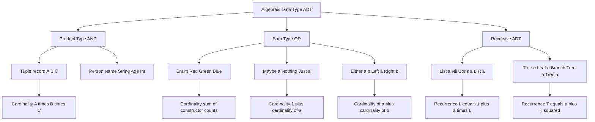
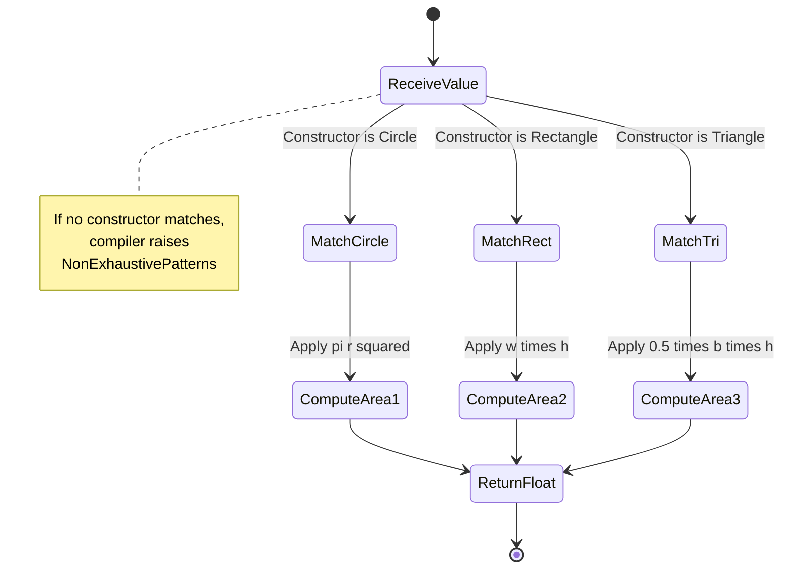
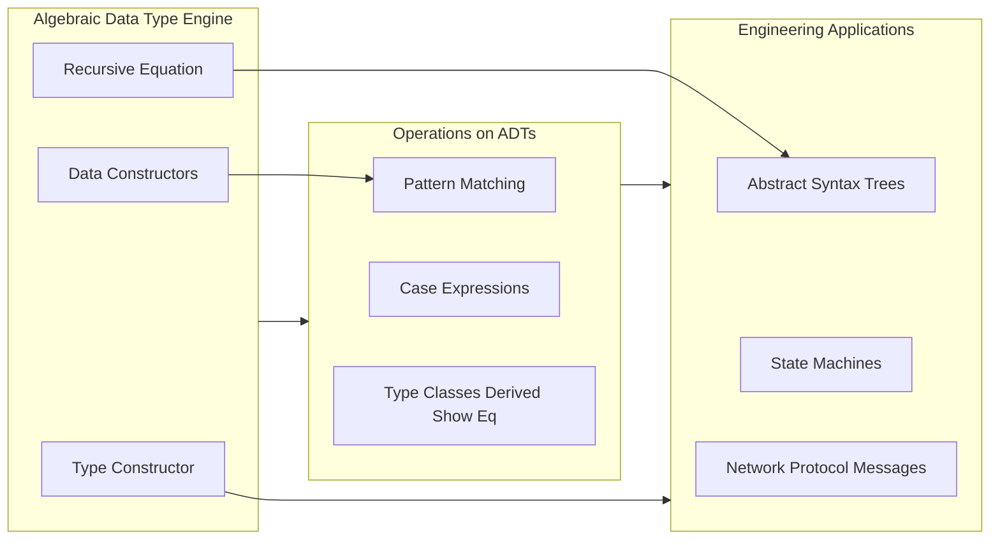
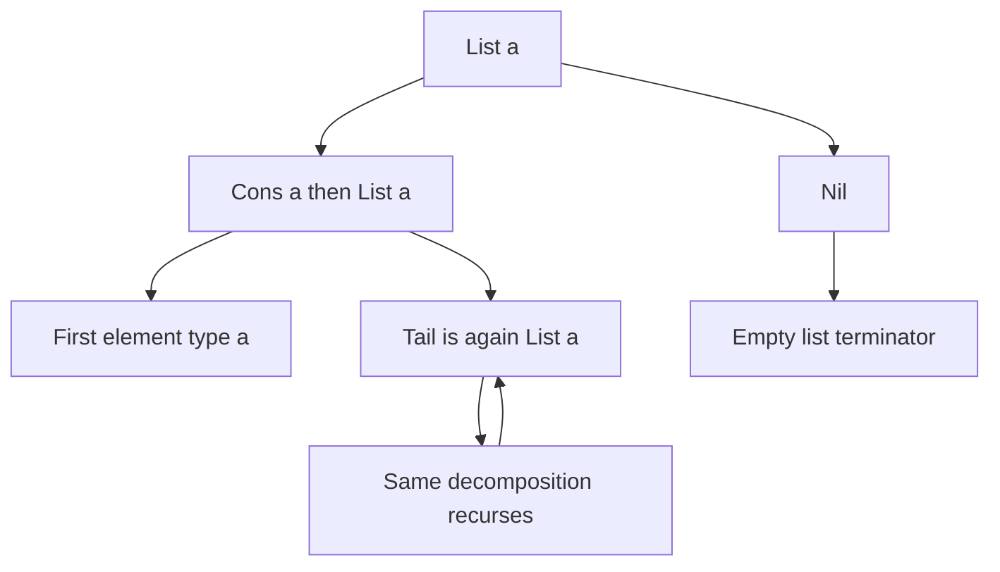

# Algebraic Types

<!-- SECTION_1_START -->
# Algebraic Types in Functional Programming

## 1.1 Formal Academic Definition (KTU 2024 Syllabus Terminology)

> [!IMPORTANT]
> **Algebraic Data Type (ADT):** A composite type formed by combining other types using the two fundamental algebraic constructions of **sum** (disjoint union / tagged union) and **product** (Cartesian product / tuple). In Haskell, ADTs are introduced using the `data` keyword and are the primary mechanism for defining new types.

Formally, an ADT is a type $T$ whose set of inhabitants (the **cardinality** $\vert T \vert$) is defined as an algebraic expression built from base types using the operators $+$ (sum) and $\times$ (product).

For a type $T$ defined as:

$$T = C_1 \; \tau_{1,1} \times \dots \times \tau_{1,k_1} \;\vert\; C_2 \; \tau_{2,1} \times \dots \times \tau_{2,k_2} \;\vert\; \dots$$

the cardinality is computed as:

$$\vert T \vert = \sum_{i} \prod_{j} \vert \tau_{i,j} \vert$$

where $C_i$ are the **data constructors** (tags) and $\tau_{i,j}$ are the **type arguments**.

---

## 1.2 Conceptual Analogy & Intuitive Overview

> [!NOTE]
> **The "AND" vs "OR" Intuition**
> - **Product Type (AND):** Think of a **form** that a student must fill out. The form has a Name field **AND** an Age field **AND** a Roll Number field. All fields exist together — you cannot fill the form with only the name. This is exactly a *product* type: the value contains one of *every* field.
> - **OR Type (Sum):** Think of a **traffic signal**. At any given instant, the signal is in exactly **ONE** of three states: Red **OR** Green **OR** Yellow. It is never two at once. This is a *sum* type: the value is **one alternative out of many**.

| Algebraic Operation | Programming Equivalent | Real-World Analogy |
|:---|:---|:---|
| **Product** $(\times)$ | Tuples, Records, Structs | A college ID card (Name + Roll No + Photo) |
| **Sum** $(+)$ | Tagged Unions, Enums | A traffic light (Red OR Green OR Yellow) |
| **Recursive** | Lists, Trees | A family tree (each node contains sub-nodes) |

---

## 1.3 Standard Metrics & Constants

> [!IMPORTANT]
> **Key Cardinality Constants (Universally Used in Board Examinations):**
> - $\vert \text{Bool} \vert = \mathbf{2}$ (True, False)
> - $\vert \text{Unit} \vert = \mathbf{1}$ (a single inhabitant: `()`)
> - $\vert \text{Void} \vert = \mathbf{0}$ (no inhabitants; uninhabitable type)
> - $\vert \text{Maybe } a \vert = 1 + \vert a \vert$
> - $\vert \text{Either } a \; b \vert = \vert a \vert + \vert b \vert$
> - $\vert \text{List } a \vert = 1 + \vert a \vert \times \vert \text{List } a \vert$ (infinite if $\vert a \vert \ge 1$)

---

## 1.4 Type Constructors vs Data Constructors

> [!NOTE]
> **Crucial Distinction (Frequently Asked in KTU):**
> - A **Type Constructor** is used at the *type level* (e.g., `Maybe`, `List`, `Either`). It takes types and produces a new type. Think of it as a *function from types to types*.
> - A **Data Constructor** (or *value constructor*) is used at the *value level* (e.g., `Just`, `Nothing`, `Left`, `Right`, `Cons`, `Nil`). It takes values and produces a value of the constructed type.

```haskell
-- 'Maybe' is a TYPE CONSTRUCTOR
-- 'Just' and 'Nothing' are DATA CONSTRUCTORS
data Maybe a = Just a | Nothing
```

---

<!-- SECTION_1_END -->

<!-- SECTION_2_START -->
# Deep Theoretical Analysis & KTU High-Yield Formula Sheet

## 2.1 The Three Pillars of Algebraic Types

### Pillar 1 — Product Types (Record / Tuple)
A **product type** combines several values into one. The total number of distinct values is the **multiplication** of the individual cardinalities.

```haskell
-- A point in 2D space: (x, y)
type Point2D = (Float, Float)

-- A person record
data Person = Person String Int Bool
--   Name     Age  IsEmployed
```

$$\vert \text{Person} \vert = \vert \text{String} \vert \times \vert \text{Int} \vert \times \vert \text{Bool} \vert = \infty \times \infty \times 2 = \infty$$

---

### Pillar 2 — Sum Types (Tagged Union / Disjoint Union)
A **sum type** represents a *choice* between alternatives. The total number of distinct values is the **addition** of the individual cardinalities.

```haskell
-- A traffic light can be one of three states
data TrafficLight = Red | Green | Yellow
```

$$\vert \text{TrafficLight} \vert = 1 + 1 + 1 = \mathbf{3}$$

---

### Pillar 3 — Recursive Algebraic Types
A type defined in terms of **itself**. The defining equation uses the type variable $L$ on both sides, yielding a recursive cardinality formula.

```haskell
-- A binary tree holding values of type a
data Tree a = Leaf a
            | Node (Tree a) (Tree a)
```

The cardinality equation is:

$$\vert \text{Tree } a \vert = \vert a \vert + \vert \text{Tree } a \vert^2$$

> [!NOTE]
> **Why this works:** A `Tree a` is either a `Leaf a` (cost: $\vert a \vert$) **or** a `Node` of two sub-trees (cost: $\vert \text{Tree } a \vert^2$). The "+" represents the OR between Leaf and Node, the exponent "²" represents the AND of left-subtree and right-subtree.

---

## 2.2 Polymorphic Algebraic Types

A type constructor can take type parameters, making it **polymorphic**.

```haskell
data Maybe a      = Nothing | Just a
data Either a b   = Left a | Right b
data List a       = Nil | Cons a (List a)
```

**The "List Recurrence" — High-Yield Derivation:**

$$\vert \text{List } a \vert = 1 + \vert a \vert \times \vert \text{List } a \vert$$

Solving the recurrence for $\vert a \vert = n$ gives the closed form:

$$\vert \text{List } a \vert = \sum_{k=0}^{\infty} n^k = \frac{1}{1-n} \quad (\text{when } n < 1)$$

When $n \ge 1$ (e.g., $\vert \text{Int} \vert = \infty$), the list type has **infinitely many inhabitants** (lists of length 0, 1, 2, 3, …).

---

## 2.3 KTU High-Yield Formula Sheet (Cheat Sheet)

> [!IMPORTANT]
> **Mandatory Memorization Table for Board Exams — Use `\vert` instead of `|` to avoid markdown breaks:**

| # | Concept | Haskell Syntax | Cardinality Formula | Real-World Use Case |
|:-:|:---|:---|:---|:---|
| 1 | **Product Type** | `data P = P A B` | $\vert A \vert \times \vert B \vert$ | Database row, struct, JSON object |
| 2 | **Sum Type** | `data S = SA $\vert$ SB` | $\vert A \vert + \vert B \vert$ | State machines, Optional values, Errors |
| 3 | **Enumeration** | `data Color = Red $\vert$ Green $\vert$ Blue` | $1+1+1 = 3$ | Weekdays, directions, status codes |
| 4 | **Maybe / Optional** | `data Maybe a = Nothing $\vert$ Just a` | $1 + \vert a \vert$ | Null-safe programming, lookups |
| 5 | **Either / Result** | `data Either a b = Left a $\vert$ Right b` | $\vert a \vert + \vert b \vert$ | Error handling, success/failure paths |
| 6 | **List (Recursive)** | `data List a = Nil $\vert$ Cons a (List a)` | $\sum_{k=0}^{\infty} \vert a \vert^k$ | Sequences, streams, traversals |
| 7 | **Binary Tree (Recursive)** | `data Tree a = Leaf a $\vert$ Node (Tree a) (Tree a)` | $\vert a \vert + \vert T \vert^2$ | Hierarchies, parsing, search structures |
| 8 | **Unit Type** | `data () = ()` | $\mathbf{1}$ | Side-effect carriers, monadic context |
| 9 | **Void / Empty** | `data Void` (no constructors) | $\mathbf{0}$ | Uninhabitable, used for absurd patterns |

---

## 2.4 Real-World Engineering Utility

> [!NOTE]
> **Why ADTs Matter in Production Systems (CS / Software Engineering Perspective):**
> 1. **Compiler Design:** Abstract Syntax Trees (ASTs) are ADTs. The Haskell compiler GHC itself uses ADTs to represent parsed expressions: `Expr = Lit Int $\vert$ Add Expr Expr $\vert$ Mul Expr Expr`.
> 2. **Type-Safe Error Handling:** Languages like Rust (`enum Result<T, E>`), Swift (`enum`), and TypeScript (tagged unions) borrowed the ADT concept from Haskell to eliminate `null`-related bugs.
> 3. **Protocol Buffers / gRPC:** Network messages are modeled as sums of products (oneof fields = sum, message fields = product).
> 4. **Database Schemas:** A column of type `INT $\vert$ NULL` is the SQL analogue of `Maybe Int`.
> 5. **State Machines in Embedded Systems:** The states of a washing machine, elevator, or vending machine are *naturally* sum types.

---

## 2.5 Parameterized vs Non-Parameterized ADTs

- **Non-parameterized (Concrete):** `data Color = Red $\vert$ Green $\vert$ Blue` — fully resolved at type level.
- **Parameterized (Generic):** `data Box a = Empty $\vert$ Filled a` — must be applied to a type, e.g., `Box Int`, `Box String`.

The number of type parameters is the **type arity**. A type with one parameter is **unary** (e.g., `List a`); with two, it is **binary** (e.g., `Either a b`).

---

<!-- SECTION_2_END -->

<!-- SECTION_3_START -->
# Step-by-Step Derivations, Pattern Matching & Code Implementation

## 3.1 Deriving Cardinality of `Maybe a`

**Problem (KTU Board Style):** Given the type definition `data Maybe a = Nothing | Just a`, derive $\vert \text{Maybe Int} \vert$.

### Step-by-Step Derivation

We begin with the type definition:

$$\text{Maybe } a = \text{Nothing} \; \vert \; \text{Just } a$$

The vertical bar $\vert$ denotes the **sum** (alternation). A value of type `Maybe a` is **either** `Nothing` **or** `Just x` for some `x :: a`.

By the cardinality law for sums:

$$\vert \text{Maybe } a \vert = \vert \text{Nothing} \vert + \vert \text{Just } a \vert$$

The constructor `Nothing` is a **nullary** data constructor (takes no arguments), so it has exactly **one** inhabitant:

$$\vert \text{Nothing} \vert = 1$$

The constructor `Just a` is a **unary** data constructor that wraps a value of type $a$, so its cardinality equals $\vert a \vert$:

$$\vert \text{Just } a \vert = \vert a \vert$$

Substituting back:

$$\vert \text{Maybe } a \vert = 1 + \vert a \vert$$

For $a = \text{Int}$, where $\vert \text{Int} \vert = 2^{64}$ (on a 64-bit machine):

$$\vert \text{Maybe Int} \vert = 1 + 2^{64} = 18446744073709551617$$

> [!NOTE]
> **The "+1" matters:** It accounts for the *additional* `Nothing` value — meaning `Maybe Int` has **one more inhabitant** than `Int` alone, representing the absence of a value (analogous to `null` in imperative languages, but type-safe).

---

## 3.2 Deriving Cardinality of a Custom Sum Type

**Problem:** Compute the cardinality of:

```haskell
data Shape = Circle Float
           | Rectangle Float Float
           | Triangle Float Float
```

### Derivation

The type `Shape` is a sum of three product alternatives:

$$\vert \text{Shape} \vert = \vert \text{Circle Float} \vert + \vert \text{Rectangle Float Float} \vert + \vert \text{Triangle Float Float} \vert$$

Apply the product rule to each alternative:

$$\vert \text{Circle Float} \vert = \vert \text{Float} \vert = F$$

$$\vert \text{Rectangle Float Float} \vert = \vert \text{Float} \vert \times \vert \text{Float} \vert = F^2$$

$$\vert \text{Triangle Float Float} \vert = F^2$$

Summing all alternatives:

$$\vert \text{Shape} \vert = F + F^2 + F^2 = F + 2F^2$$

Since $F = \vert \text{Float} \vert$ is finite (IEEE 754 single-precision: $F = 2^{32}$), we get:

$$\vert \text{Shape} \vert = 2^{32} + 2 \cdot 2^{64} = 2^{32}(1 + 2^{33})$$

---

## 3.3 Deriving the Recursive List Equation

**Problem:** Show that the cardinality of `List a` satisfies $\vert \text{List } a \vert = 1 + \vert a \vert \cdot \vert \text{List } a \vert$.

### Derivation

The definition is:

```haskell
data List a = Nil
            | Cons a (List a)
```

In LaTeX:

$$\text{List } a = \text{Nil} \;\vert\; \text{Cons } a \;(\text{List } a)$$

Apply the sum rule:

$$\vert \text{List } a \vert = \vert \text{Nil} \vert + \vert \text{Cons } a \;(\text{List } a) \vert$$

Apply the product rule to the right alternative (Cons takes an `a` AND a `List a`):

$$\vert \text{Cons } a \;(\text{List } a) \vert = \vert a \vert \times \vert \text{List } a \vert$$

Since `Nil` is nullary, $\vert \text{Nil} \vert = 1$:

$$\vert \text{List } a \vert = 1 + \vert a \vert \cdot \vert \text{List } a \vert$$

Solving for $\vert \text{List } a \vert$ as an infinite geometric series:

$$\vert \text{List } a \vert = 1 + n + n^2 + n^3 + \dots = \sum_{k=0}^{\infty} n^k$$

This is **finite** only when $n = 0$ (only `Nil` exists). For any $n \ge 1$, lists are **infinitely countable** (length 0, 1, 2, 3, …).

---

## 3.4 Exhaustive Haskell Implementation with Type Hints

```haskell
-- ============================================================
-- Module: AlgebraicTypesDemo
-- Purpose: Demonstrates Sum, Product, and Recursive ADTs
-- ============================================================

-- (A) ENUMERATION (sum of nullary constructors)
data Day = Monday
         | Tuesday
         | Wednesday
         | Thursday
         | Friday
         | Saturday
         | Sunday
         deriving (Show, Eq)

isWeekend :: Day -> Bool
isWeekend Saturday = True
isWeekend Sunday   = True
isWeekend _        = False
-- |Day| = 7

-- (B) PRODUCT TYPE (record syntax)
data Student = Student
  { sName    :: String
  , sRollNo  :: Int
  , sGPA     :: Float
  } deriving (Show)

-- (C) SUM OF PRODUCTS (THE MOST COMMON ADT PATTERN)
data Shape = Circle Float                       -- radius
           | Rectangle Float Float              -- width height
           | Triangle Float Float              -- base height
           deriving (Show)

-- Exhaustive pattern matching on a sum type
area :: Shape -> Float
area (Circle r)            = pi * r * r
area (Rectangle w h)       = w * h
area (Triangle b h)        = 0.5 * b * h

-- (D) RECURSIVE ADT: BINARY TREE
data Tree a = Leaf a
            | Branch (Tree a) (Tree a)
            deriving (Show)

-- Polymorphic tree size
treeSize :: Tree a -> Int
treeSize (Leaf _)           = 1
treeSize (Branch left right) = treeSize left + treeSize right

-- (E) MAYBE AS A LIBRARY-GRADE NULL-SAFE COMPUTATION
safeDivide :: Float -> Float -> Maybe Float
safeDivide _ 0  = Nothing
safeDivide x y  = Just (x / y)

-- (F) EITHER FOR ERROR HANDLING
data AppError = DivByZero | NegativeSqrt | GenericError String
  deriving (Show)

safeSqrt :: Float -> Either AppError Float
safeSqrt x
  | x <  0    = Left NegativeSqrt
  | otherwise = Right (sqrt x)

-- (G) DEMO ENTRY POINT
main :: IO ()
main = do
  putStrLn "--- Day Enumeration ---"
  print (isWeekend Saturday)        -- True
  print (isWeekend Wednesday)       -- False

  putStrLn "\n--- Product Type ---"
  let stu = Student "Anand" 42 9.1
  print stu

  putStrLn "\n--- Sum of Products (Shape) ---"
  print (area (Circle 5.0))         -- 78.5398...
  print (area (Rectangle 4.0 6.0))  -- 24.0
  print (area (Triangle 3.0 8.0))   -- 12.0

  putStrLn "\n--- Recursive Tree ---"
  let myTree = Branch (Leaf 1) (Branch (Leaf 2) (Leaf 3))
  print (treeSize myTree)           -- 4

  putStrLn "\n--- Maybe & Either ---"
  print (safeDivide 10 2)           -- Just 5.0
  print (safeDivide 10 0)           -- Nothing
  print (safeSqrt 16)               -- Right 4.0
  print (safeSqrt (-4))             -- Left NegativeSqrt
```

### Expected Console Output

```
--- Day Enumeration ---
True
False

--- Product Type ---
Student {sName = "Anand", sRollNo = 42, sGPA = 9.1}

--- Sum of Products (Shape) ---
78.5398
24.0
12.0

--- Recursive Tree ---
4

--- Maybe & Either ---
Just 5.0
Nothing
Right 4.0
Left NegativeSqrt
```

---

## 3.5 Pattern Matching Rules (Valuation Hot-Spot)

> [!IMPORTANT]
> **Exhaustiveness Rule:** A function that pattern-matches on a sum type **must** cover *every* constructor, or the compiler issues a `Non-exhaustive patterns` warning. This is mathematically equivalent to the **law of total functions** — a function from $A \to B$ must be defined for **all** $a \in A$.

```haskell
-- COMPILER WARNING: Non-exhaustive patterns in function areaCalc
areaCalc :: Shape -> Float
areaCalc (Circle r)      = pi * r * r
areaCalc (Rectangle w h) = w * h
-- Missing: Triangle case -> CRASH at runtime / -Werror in build
```

The corrected, exhaustive version (as in 3.4) handles **all three** alternatives and is therefore total over the domain `Shape`.

---

<!-- SECTION_3_END -->

<!-- SECTION_4_START -->
# Structural Diagrams & Schematics

## 4.1 Type Decomposition Flowchart (Sum vs Product)



---

## 4.2 Pattern Matching Exhaustiveness State Machine



---

## 4.3 Module-4 Conceptual Block Architecture



---

## 4.4 Recursive List Type — Structural Topology



**Visual Interpretation:** Every non-empty list is decomposed into a **head** (of type $a$) and a **tail** (which is itself a list). The decomposition continues until the base case `Nil` is reached. This is the structural-induction principle that enables recursive function definitions on lists.

---

<!-- SECTION_4_END -->

<!-- SECTION_5_START -->
# KTU 2024 Scheme Examination Question Bank & Topic Recap

---

## 📘 PART A — Short Answer Questions (3 Marks Each)

### **Q1. [KTU University Exam — July 2024]**
**Question:** Define an *Algebraic Data Type*. With a suitable example, distinguish between a **type constructor** and a **data constructor** in Haskell. **(CO1, Understand)** **[3 Marks]**

#### Model Answer (Board-Standard):

> An **Algebraic Data Type (ADT)** is a composite type built by combining other types using the algebraic operators *sum* and *product*. It is declared using the `data` keyword in Haskell.
>
> **Type Constructor** is used at the *type level*. It takes types as arguments and produces a new type. It is a *function from types to types*.
> **Data Constructor** is used at the *value level*. It takes values as arguments and produces a value of the resulting type.
>
> **Example:**
> ```haskell
> data Maybe a = Nothing | Just a
> ```
> Here, `Maybe` is the **type constructor** (e.g., `Maybe Int`, `Maybe String`), while `Nothing` and `Just` are the **data constructors** (e.g., `Nothing :: Maybe a`, `Just 5 :: Maybe Int`).

**Valuation Key:** [ADT definition: 1 Mark] [Type vs Data constructor distinction: 1 Mark] [Example: 1 Mark]

---

### **Q2. [KTU University Exam — Dec 2023]**
**Question:** What is the cardinality of the type `data Bool = True | False`? Justify using the algebraic formula for sum types. **(CO1, Remember)** **[3 Marks]**

#### Model Answer:

> The type `Bool` is a sum of two nullary constructors `True` and `False`. Each nullary constructor contributes **one** inhabitant, so by the **sum rule** for cardinalities:
>
> $$\vert \text{Bool} \vert = \vert \text{True} \vert + \vert \text{False} \vert = 1 + 1 = \mathbf{2}$$
>
> The two inhabitants are `True` and `False`.

**Valuation Key:** [Sum rule statement: 1 Mark] [Computation: 1 Mark] [Final answer 2: 1 Mark]

---

## 📗 PART B — Long Answer Questions (14 Marks Each, Module-Internal Choice)

---

### **🔷 QUESTION A (14 Marks)**

**Q3.A. [KTU University Exam — July 2024, Module 4 Internal Choice]**

**(a)** Define the type `data Either a b = Left a | Right b`. Compute the cardinality of `Either Bool Bool` and **list all its inhabitants**. **(CO2, Apply)** **[7 Marks]**

**(b)** Write a Haskell function `eitherToMaybe :: Either a b -> Maybe b` that converts an `Either` to a `Maybe` by discarding the `Left` value. Demonstrate its working with **three example inputs**. **(CO3, Apply)** **[7 Marks]**

#### Model Solution:

**Part (a) — Cardinality Derivation**

The type `Either a b` is a sum of two unary constructors:

$$\text{Either } a \; b = \text{Left } a \;\vert\; \text{Right } b$$

By the sum rule:

$$\vert \text{Either } a \; b \vert = \vert \text{Left } a \vert + \vert \text{Right } b \vert$$

Both `Left` and `Right` are unary constructors wrapping one value each, so:

$$\vert \text{Left } a \vert = \vert a \vert \quad \text{and} \quad \vert \text{Right } b \vert = \vert b \vert$$

Therefore:

$$\vert \text{Either } a \; b \vert = \vert a \vert + \vert b \vert$$

Substituting $a = b = \text{Bool}$ where $\vert \text{Bool} \vert = 2$:

$$\vert \text{Either Bool Bool} \vert = 2 + 2 = \mathbf{4}$$

**Listing all 4 inhabitants:**

| # | Constructor | Value |
|:-:|:---|:---|
| 1 | `Left` | `Left True` |
| 2 | `Left` | `Left False` |
| 3 | `Right` | `Right True` |
| 4 | `Right` | `Right False` |

**Valuation Key:** [Sum rule identification: 2 Marks] [Substitution: 2 Marks] [Final 4: 1 Mark] [Inhabitant listing: 2 Marks]

**Part (b) — Haskell Implementation**

```haskell
eitherToMaybe :: Either a b -> Maybe b
eitherToMaybe (Left  _)  = Nothing
eitherToMaybe (Right x) = Just x
```

**Demonstration with three inputs:**

```haskell
main :: IO ()
main = do
  print (eitherToMaybe (Left  42) :: Maybe Int)     -- Nothing
  print (eitherToMaybe (Right "OK") :: Maybe String) -- Just "OK"
  print (eitherToMaybe (Right 3.14) :: Maybe Float)  -- Just 3.14
```

**Expected Output:**
```
Nothing
Just "OK"
Just 3.14
```

**Explanation:** The function uses **exhaustive pattern matching** on the two constructors of `Either`. When the value is `Left _`, the wrapped value is discarded and `Nothing` is returned. When the value is `Right x`, the wrapped value is preserved inside a `Just`.

**Valuation Key:** [Type signature: 1 Mark] [Pattern matching on Left/Right: 3 Marks] [Three test cases: 2 Marks] [Explanation: 1 Mark]

---

### **🔷 QUESTION B (14 Marks) — ALTERNATIVE CHOICE**

**Q3.B. [KTU University Exam — Dec 2023, Module 4 Internal Choice]**

**(a)** Consider the following recursive algebraic data type representing a binary tree:
```haskell
data Tree a = Leaf a
            | Branch (Tree a) (Tree a)
```
**Derive** the cardinality equation for `Tree a`. Then **compute** $\vert \text{Tree Bool} \vert$ for a tree of depth at most 2. **(CO2, Apply)** **[7 Marks]**

**(b)** Write a Haskell function `treeContains :: Eq a => Tree a -> a -> Bool` that checks whether a value exists in a binary tree, and a function `treeDepth :: Tree a -> Int` that returns the depth of the tree. Test with a sample tree. **(CO3, Apply)** **[7 Marks]**

#### Model Solution:

**Part (a) — Cardinality Derivation**

The type `Tree a` is a sum of two alternatives:

$$\text{Tree } a = \text{Leaf } a \;\vert\; \text{Branch } (\text{Tree } a) \;(\text{Tree } a)$$

Apply the sum rule:

$$\vert \text{Tree } a \vert = \vert \text{Leaf } a \vert + \vert \text{Branch } (\text{Tree } a) \;(\text{Tree } a) \vert$$

The first alternative is a product with one factor (the wrapped value $a$):

$$\vert \text{Leaf } a \vert = \vert a \vert$$

The second alternative is a product of two sub-trees (left AND right):

$$\vert \text{Branch } L \; R \vert = \vert L \vert \times \vert R \vert = \vert \text{Tree } a \vert^2$$

Substituting:

$$\boxed{\vert \text{Tree } a \vert = \vert a \vert + \vert \text{Tree } a \vert^2}$$

**Computation for `Tree Bool` (depth ≤ 2):**

Let $T = \vert \text{Tree Bool} \vert$ and $n = \vert \text{Bool} \vert = 2$.

**Depth 0 (just the formula placeholder):** N/A.

**Depth 1** — trees of height at most 1: only `Leaf` is allowed.

$$T_1 = n = 2$$

Inhabitants: `Leaf True`, `Leaf False`.

**Depth 2** — add a layer of `Branch`:

$$T_2 = n + T_1^2 = 2 + 2^2 = 2 + 4 = \mathbf{6}$$

Inhabitants: `Leaf True`, `Leaf False`, `Branch (Leaf True) (Leaf True)`, `Branch (Leaf True) (Leaf False)`, `Branch (Leaf False) (Leaf True)`, `Branch (Leaf False) (Leaf False)`.

**Valuation Key:** [Sum rule: 1 Mark] [Product rule on Branch: 2 Marks] [Final equation: 1 Mark] [Depth-1 calculation: 1 Mark] [Depth-2 calculation: 1 Mark] [Inhabitant listing: 1 Mark]

**Part (b) — Haskell Implementation**

```haskell
data Tree a = Leaf a
            | Branch (Tree a) (Tree a)
            deriving (Show, Eq)

treeContains :: Eq a => Tree a -> a -> Bool
treeContains (Leaf x)        target = x == target
treeContains (Branch l r)    target = treeContains l target
                           || treeContains r target

treeDepth :: Tree a -> Int
treeDepth (Leaf _)         = 1
treeDepth (Branch l r)     = 1 + max (treeDepth l) (treeDepth r)

main :: IO ()
main = do
  let t1 = Leaf 5
      t2 = Branch (Leaf 1) (Branch (Leaf 2) (Leaf 3))
  putStrLn "--- treeContains ---"
  print (treeContains t1 5)        -- True
  print (treeContains t1 10)       -- False
  print (treeContains t2 3)        -- True
  putStrLn "--- treeDepth ---"
  print (treeDepth t1)             -- 1
  print (treeDepth t2)             -- 3
```

**Expected Output:**
```
--- treeContains ---
True
False
True
--- treeDepth ---
1
3
```

**Explanation:** `treeContains` performs a depth-first search, short-circuiting with `||`. `treeDepth` is defined recursively: a `Leaf` has depth 1, a `Branch` has depth 1 plus the maximum of its children's depths.

**Valuation Key:** [treeContains type signature: 1 Mark] [Pattern match on Leaf/Branch: 2 Marks] [Recursive call: 1 Mark] [treeDepth signature: 1 Mark] [Recursion: 1 Mark] [Sample test: 1 Mark]

---

## ⚠️ KTU Examiner's Valuation Warning / Pitfall Callout

> [!WARNING]
> **Common Mistakes That Cost 2-3 Marks Each in KTU Valuation:**
> 1. **Confusing type and data constructors:** Writing `Just :: Maybe` instead of `Just :: a -> Maybe a`. The first is a *type*, the second is a *value-level function*.
> 2. **Forgetting the "+1" in `Maybe`:** When computing $\vert \text{Maybe Int} \vert$, students often write only $\vert \text{Int} \vert$ and forget to add 1 for the `Nothing` constructor.
> 3. **Writing vertical bars inside table cells:** Using the symbol `|` in plain text breaks the markdown table parser. Always use `\vert` or `\mid` in LaTeX.
> 4. **Missing the product rule in `Branch`:** The cardinality of `Branch L R` is $\vert L \vert \times \vert R \vert$, **not** $\vert L \vert + \vert R \vert$. Mixing up + and × is the #1 valuation error.
> 5. **Omitting base cases in recursive ADTs:** Every recursive type MUST have at least one non-recursive constructor (base case) to terminate. `data BadList a = Cons a (BadList a)` is **non-terminating** and has no inhabitants.
> 6. **Not deriving `Show` and `Eq`:** Without `deriving (Show, Eq)`, you cannot `print` values or compare them — the code will fail to compile.
> 7. **Pattern matching on polymorphic types without type annotations:** In `print (eitherToMaybe (Left 42))`, the compiler cannot infer the type of `b`. Always annotate: `print (eitherToMaybe (Left 42) :: Maybe Int)`.

---

## 🧠 Topic Recap & Important Things to Remember

> [!IMPORTANT]
> **Rapid-Revision Checklist (Read this 5 minutes before the exam):**
>
> - **ADT** = composite type built from **sum** $(+)$ and **product** $(\times)$ of other types.
> - **Product Type** = AND combination → cardinality = **multiplication** of component cardinalities.
> - **Sum Type** = OR combination → cardinality = **addition** of alternative cardinalities.
> - **Enumeration** = sum of nullary constructors → cardinality = **number of constructors**.
> - **Recursive ADT** always has a **base case** (non-recursive constructor) **and** a **recursive case** to guarantee termination.
> - **Type Constructor** lives at the type level (`Maybe`, `List`, `Either`); **Data Constructor** lives at the value level (`Just`, `Nothing`, `Nil`, `Cons`).
> - **Maybe** = $1 + a$ (used for null-safety); **Either** = $a + b$ (used for error handling).
> - **List** satisfies the recurrence $L = 1 + aL$, solving to a geometric series.
> - **Tree** satisfies the recurrence $T = a + T^2$.
> - **Pattern matching on sum types MUST be exhaustive** to be total; missing cases cause a `Non-exhaustive patterns` warning.
> - **Exhaustiveness** is the programmer's analog of the mathematical law that $f : A \to B$ must be defined for all $a \in A$.
> - **Unit** type has cardinality **1**; **Void** type has cardinality **0** (uninhabitable).
> - **ADTs appear in**: ASTs, state machines, JSON schema modeling, network protocols, compiler intermediate representations.
> - **Key Derivation Shortcuts**: $\vert A \times B \vert = \vert A \vert \cdot \vert B \vert$; $\vert A + B \vert = \vert A \vert + \vert B \vert$; $\vert C(\tau) \vert = \vert \tau \vert$ for unary constructor $C$.
> - **Always use `deriving (Show, Eq)`** for ADTs that need to be printed or compared in exams.
> - **Memorize** the four canonical ADTs: **Bool, Maybe, Either, List** — they are the most exam-frequent.

---

<!-- SECTION_5_END -->
