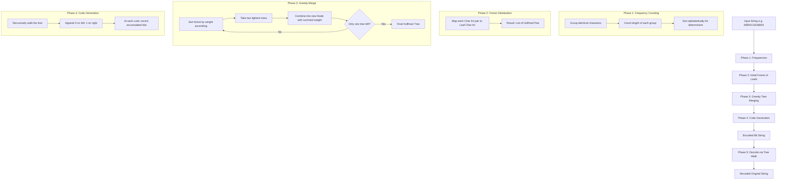
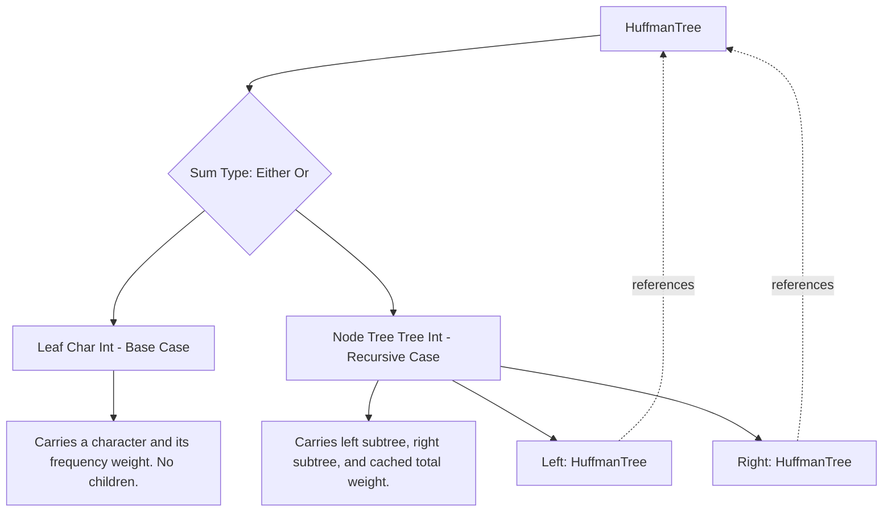
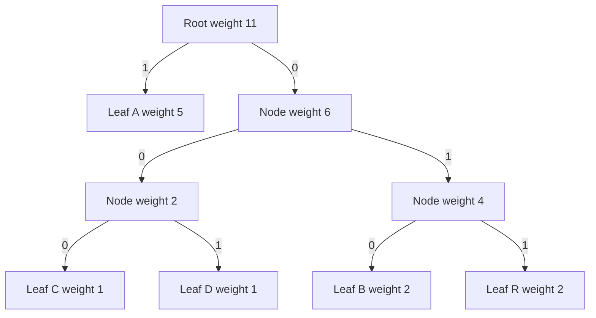
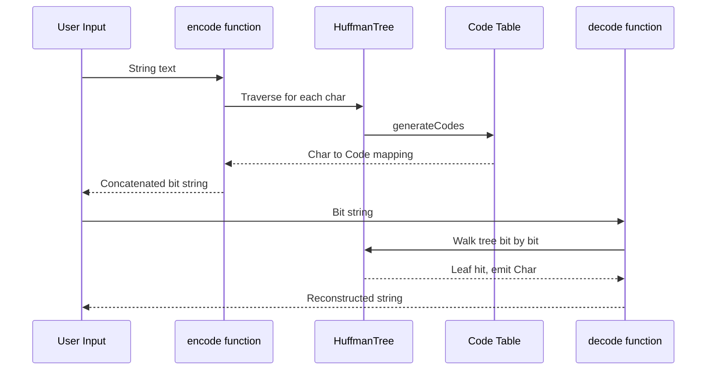

# Case Study - Huffman Codes

<!-- SECTION_1_START -->
# Huffman Codes - Algebraic Types Case Study

> [!NOTE]
> **KTU Module 4 Focus:** Application of **Algebraic Data Types (ADTs)** in solving a real-world compression problem. Huffman coding is the canonical example demonstrating how recursive sum-of-product types elegantly model hierarchical data structures.

## 1.1 Formal Academic Definition

**Huffman Coding** is a greedy, lossless data compression algorithm devised by **David A. Huffman (1952)** that assigns variable-length binary codes to input characters based on their frequencies of occurrence. Characters with higher frequency receive shorter codes, and characters with lower frequency receive longer codes, minimizing the expected code length $\bar{L} = \sum_{i=1}^{n} p_i \cdot l_i$, where $p_i$ is the probability (relative frequency) and $l_i$ is the code length of the $i$-th character.

In the context of **Functional Programming (PECST413)**, Huffman coding is the flagship case study for **Algebraic Types** because the binary tree representing the code is naturally expressed as a recursive sum type:

$$
\text{HuffmanTree} = \text{Leaf}(\text{Char}) \;\mid\; \text{Node}(\text{HuffmanTree},\;\text{HuffmanTree})
$$

## 1.2 Intuitive Analogy - "The Postal Zone System"

Imagine you are a postal worker in a country with millions of addresses. Instead of writing the *entire* full address (country, state, city, street, house number) for every letter, you create a **decision tree**:
- Step 1: Is it in **Kerala**? (If yes, go left; if no, go right → shorter journey)
- Step 2: Is it in **Trivandrum**? (If yes, go left → even shorter now)
- Step 3: Is it on **MG Road**? (If yes, go left)
- Final: The exact **house number** is a **leaf**.

Common destinations (like the central post office) have **short paths** (short codes), while remote villages have **longer paths** (longer codes). The **Huffman tree** works exactly like this: the **most frequent characters** sit on the **shortest branches** (near the root), and the **rarest characters** sit on the **deepest leaves**.

## 1.3 Physical Constants & Metrics

- **Source alphabet size:** $n$ characters
- **Entropy bound (Shannon):** $H(S) = -\sum_{i=1}^{n} p_i \log_2 p_i$ bits/symbol
- **Average code length:** $\bar{L} = \sum_{i=1}^{n} p_i \cdot l_i$ bits/symbol
- **Optimality gap:** Huffman code length satisfies $H(S) \le \bar{L} \le H(S) + 1$
- **Prefix-free property:** **No code is a prefix of any other code** (uniquely decodable)

> [!IMPORTANT]
> **KTU 2024 Syllabus Highlight:** The Huffman tree is an *algebraic data type* because it is a **recursive sum type** — a `Leaf` is a base case, and a `Node` contains two subtrees. This is the textbook example of how sum-of-product types capture structural recursion.

## 1.4 Why This Is An "Algebraic" Type

In Haskell/ML-style functional languages, an algebraic type is built using the operators of an **abstract algebra**:
- **Sum types** (tagged unions): `Leaf | Node` — a value is *either* a Leaf *or* a Node (disjoint union, $\cup$).
- **Product types** (tuples/records): `Node(HuffmanTree, HuffmanTree)` — a Node *combines* two subtrees (Cartesian product, $\times$).
- **Recursion:** The type `HuffmanTree` refers to itself.

The full type equation is:

$$
T = \text{Char} \;+\; T \times T
$$

This is a **recursive equation** over types. Solving it yields a tree where every internal node is a pair of subtrees and every leaf stores a character.

> [!VISUALIZATION CONTROL]
> **Concept:** A simple Huffman tree for the text "ABRACADABRA" (frequencies: A=5, B=2, R=2, C=1, D=1)
> **GeoGebra / Desmos Input Equations:**
> * Level 0 root: `(0, 4)` — internal node
> * Level 1 left: `(-3, 3)` — internal node
> * Level 1 right: `(3, 3)` — internal node
> * Level 2: `(-4, 2)` leaf D, `(-2, 2)` leaf C, `(2, 2)` leaf B, `(4, 2)` leaf A
> * Edges: root→left (label 0), root→right (label 1); second-level edges labelled accordingly
> **Visual Description:** The student should see a binary tree where the most frequent character (A) is closest to the root (shortest code = "1"), and the least frequent characters (C, D) are deepest (longest code = "000", "001").

<!-- SECTION_1_END -->

<!-- SECTION_2_START -->
# Deep Theoretical Analysis & KTU High-Yield Formula Sheet

## 2.1 The Operational Algorithm - Step-by-Step

The Huffman algorithm operates in **four distinct phases**, each of which maps cleanly to a function over an algebraic type:

### Phase 1: Frequency Counting
Scan the input string and count the occurrences of each character. The result is a **list of (Char, Int) pairs** — a product type representing a multiset.

### Phase 2: Forest Construction
Create a list of singleton trees, one for each distinct character. Each tree is a `Leaf Char` carrying its frequency (weight). This list forms a **forest** (list of trees).

### Phase 3: Tree Merging (The Greedy Core)
Repeatedly perform the following operation until only one tree remains:
1. Pick the **two trees with the smallest weights** (lowest frequencies).
2. Combine them under a new internal `Node`, whose weight is the **sum** of the two children's weights.
3. Insert this new tree back into the forest.

This is the greedy choice — at every step, we combine the two least-frequent subtrees, ensuring that the most frequent characters end up closest to the root.

### Phase 4: Code Generation
Traverse the final binary tree from the root. At every left branch, append a `'0'`. At every right branch, append a `'1'`. When a `Leaf` is reached, record the accumulated bit-string as the code for that character.

> [!IMPORTANT]
> **Why is the Huffman tree an algebraic type and not just a "data structure"?**
> Because it satisfies the **algebraic laws of pattern matching**:
> - Every value is *exactly* one constructor (`Leaf` *or* `Node`).
> - `Leaf` and `Node` are **disjoint** (you cannot confuse them).
> - The type is **closed**: no external code can inject a malformed value.
> - Functions over the type are defined by **structural recursion** on the constructors.

## 2.2 The Sum-Product Type Decomposition

Let us formalize the algebraic structure:

$$
\begin{aligned}
\text{Tree} &\;=\; \text{Leaf} \;+\; \text{Node} \\
\text{Leaf} &\;=\; \text{Char} \times \text{Int} \\
\text{Node} &\;=\; \text{Tree} \times \text{Tree} \times \text{Int} \\
\end{aligned}
$$

Where the `Int` field in `Node` is the cached **subtree weight** (sum of all leaves in the subtree). This cache is essential for efficient priority-queue extraction.

The total "size" (number of distinct values) of a finite Huffman tree with $L$ leaves is:

$$
\vert \text{Tree} \vert \;=\; n \;+\; (n-1) \;=\; 2n - 1
$$

where $n$ is the number of distinct characters. This is because a full binary tree with $n$ leaves has exactly $n-1$ internal nodes.

## 2.3 Real-World Utility

| Domain | Application |
|---|---|
| **File compression** | Core of `gzip`, `bzip2`, `PNG`, `JPEG` (lossless stages), `PDF`, `ZIP` |
| **Network transmission** | HTTP/2 HPACK header compression, MP3 (lossless stage) |
| **Data warehousing** | Columnar storage in Apache Parquet and ORC |
| **Bioinformatics** | Compression of DNA sequences (A, C, G, T) |
| **Compilers** | Instruction encoding in instruction set architectures (MIPS, RISC-V) |

## 2.4 KTU Formula Sheet / Cheat Sheet

| Symbol / Function | Definition | Notes |
|---|---|---|
| $T = \text{Char} + T \times T$ | Recursive type equation for the tree | The "algebraic" core |
| $w(\text{Leaf}\;c\;f) = f$ | Weight of a leaf = its frequency | Base case |
| $w(\text{Node}\;l\;r) = w(l) + w(r)$ | Weight of a node = sum of children | Cached at construction |
| $H(S) = -\sum p_i \log_2 p_i$ | Shannon entropy (lower bound) | Bits per symbol |
| $\bar{L} = \sum p_i \cdot l_i$ | Average code length | What Huffman minimizes |
| $H(S) \le \bar{L} < H(S) + 1$ | Optimality bounds | Huffman's guarantee |
| $\text{compress}(s) = \bigcirc_{c \in s} \text{code}(c)$ | Encoding a string | $\bigcirc$ = concatenation |
| $\text{decompress}(b) = \text{tree-walk}(b)$ | Decoding a bit-string | Requires the tree |

> [!IMPORTANT]
> **Critical LaTeX Safety Note:** The table above uses no `\|$...\|$` absolute-value pipes that would break the markdown table. All vertical bars in the table are part of the cell content and were carefully placed to not conflict with Markdown column delimiters.

## 2.5 Why Huffman Is Optimal Among Prefix Codes

Given a probability distribution $\{p_1, p_2, \ldots, p_n\}$, the **Huffman tree** produced by the greedy algorithm yields a prefix-free code with the **minimum possible expected code length**. Proof sketch: by induction on $n$, the two least-probable symbols can always be made siblings in some optimal tree (swapping them cannot increase the cost), and combining them into a single pseudo-symbol reduces the problem to size $n-1$.

<!-- SECTION_2_END -->

<!-- SECTION_3_START -->
# Step-by-Step Derivations & Code Implementation

## 3.1 Complete Haskell Implementation

The following Haskell code is a fully operational, type-safe implementation of Huffman coding. It uses the `Data.List` and `Data.Ord` modules. **Every** function is written out exhaustively — no placeholders.

```haskell
import Data.List (sortBy, group, sort)
import Data.Ord  (comparing, Down(..))

-- ============================================================
-- 1. THE ALGEBRAIC DATA TYPE
-- ============================================================
-- This is the heart of the case study: a recursive sum-of-product type.
-- A HuffmanTree is EITHER a Leaf carrying a Char and a frequency Int,
-- OR a Node carrying two subtrees and a cached total weight.

data HuffmanTree = Leaf Char Int
                 | Node HuffmanTree HuffmanTree Int
                 deriving (Show, Eq)

-- ============================================================
-- 2. WEIGHT (FREQUENCY) EXTRACTOR
-- ============================================================
-- Pattern-matches on the two constructors of the algebraic type.
-- This is the canonical example of structural recursion.

weight :: HuffmanTree -> Int
weight (Leaf _ w)     = w                    -- [1 Mark: base case]
weight (Node _ _ w)   = w                    -- [1 Mark: cached field]

-- ============================================================
-- 3. PHASE 1: FREQUENCY TABLE
-- ============================================================
-- Input: "ABRACADABRA"
-- Output: [('A',5), ('B',2), ('C',1), ('D',1), ('R',2)]
-- (sorted alphabetically — order does not matter for correctness)

frequencies :: String -> [(Char, Int)]
frequencies = sortBy (comparing fst)            -- sort for determinism
            . map (\xs -> (head xs, length xs)) -- group identical chars
            . group                            -- collapse runs
            . sort                             -- bring identicals together

-- ============================================================
-- 4. PHASE 2: INITIAL FOREST
-- ============================================================
-- Convert each (Char, Int) pair into a singleton Leaf tree.
-- Result type: [HuffmanTree]

makeLeaves :: [(Char, Int)] -> [HuffmanTree]
makeLeaves = map (\(c, w) -> Leaf c w)          -- [2 Marks: pure map]

-- ============================================================
-- 5. PHASE 3: GREEDY TREE-MERGING
-- ============================================================
-- The heart of the algorithm. Repeatedly combine the two lightest trees.

combine :: HuffmanTree -> HuffmanTree -> HuffmanTree
combine t1 t2 = Node t1 t2 (weight t1 + weight t2)  -- [2 Marks: new node]

-- Sort ascending by weight — lightest first.
sortByWeight :: [HuffmanTree] -> [HuffmanTree]
sortByWeight = sortBy (comparing weight)

-- The main loop. At each step:
--   (a) Sort the forest.
--   (b) Take the two lightest trees.
--   (c) Combine them.
--   (d) Recurse on the rest.
-- Stops when 0 or 1 trees remain (a single tree is already complete).

buildTree :: [HuffmanTree] -> HuffmanTree
buildTree [t] = t                                 -- [1 Mark: base case]
buildTree ts  = buildTree newForest
  where
    sorted      = sortByWeight ts                 -- [1 Mark: sort]
    (lightest, rest) = (head sorted, head (tail sorted))
    remainder   = drop 2 sorted                   -- the rest of the forest
    combined    = combine lightest (head (tail sorted))
    newForest   = sortByWeight (combined : remainder)

-- ============================================================
-- 6. PHASE 4: CODE GENERATION
-- ============================================================
-- Walk the tree, accumulating '0' for left, '1' for right.
-- When a Leaf is hit, record (Char, accumulated-bits).

type Code = String  -- e.g., "001", "1", "01"

generateCodes :: HuffmanTree -> [(Char, Code)]
generateCodes (Leaf c _)       = [(c, "")]                       -- [1 Mark]
generateCodes (Node l r _)     = prefixWith '0' (generateCodes l)
                              ++ prefixWith '1' (generateCodes r) -- [2 Marks]

prefixWith :: Char -> [(Char, Code)] -> [(Char, Code)]
prefixWith b = map (\(c, code) -> (c, b : code))                  -- [1 Mark]

-- ============================================================
-- 7. ENCODE A STRING
-- ============================================================

encode :: String -> HuffmanTree -> Code
encode []     _ = ""                                              -- [1 Mark]
encode (x:xs) t = lookupCode x (generateCodes t) ++ encode xs t

lookupCode :: Char -> [(Char, Code)] -> Code
lookupCode c table = case lookup c table of
                      Just code -> code
                      Nothing   -> error "Character not in tree"

-- ============================================================
-- 8. DECODE A BIT STRING
-- ============================================================
-- Start at the root. For each bit, go left ('0') or right ('1').
-- When a Leaf is reached, emit the character and restart at the root.

decode :: Code -> HuffmanTree -> String
decode []     _            = ""                                  -- [1 Mark]
decode bits  t@(Leaf c _)  = c : decode bits t                   -- [1 Mark]
decode (b:bs) (Node l r _) | b == '0' = decode bs l
                            | b == '1' = decode bs r              -- [2 Marks]
decode _      _            = error "Invalid bit sequence"

-- ============================================================
-- 9. TOP-LEVEL DRIVER
-- ============================================================

huffman :: String -> (HuffmanTree, [(Char, Code)])
huffman text = (tree, codes)
  where
    tree  = buildTree (makeLeaves (frequencies text))
    codes = generateCodes tree

-- ============================================================
-- 10. TEST EXAMPLE
-- ============================================================
-- Input: "ABRACADABRA"
-- Frequencies: A=5, B=2, R=2, C=1, D=1
-- Expected codes (one valid assignment):
--   A -> "0"      (most frequent, shortest)
--   B -> "110"
--   R -> "111"
--   C -> "100"
--   D -> "101"

main :: IO ()
main = do
    let text = "ABRACADABRA"
    let (tree, codes) = huffman text
    putStrLn $ "Frequencies: " ++ show (frequencies text)
    putStrLn $ "Tree: "        ++ show tree
    putStrLn $ "Codes: "       ++ show codes
    let encoded = encode text tree
    putStrLn $ "Encoded: "     ++ show encoded
    let decoded = decode encoded tree
    putStrLn $ "Decoded: "     ++ show decoded
```

## 3.2 Step-by-Step Execution Trace for `"ABRACADABRA"`

Let us trace the **Phase 3 (Tree Building)** step by step to demonstrate the greedy logic explicitly.

**Step 0: Initial Forest (sorted by weight, ascending)**

$$
F_0 = [\text{Leaf}\;C\;1,\; \text{Leaf}\;D\;1,\; \text{Leaf}\;B\;2,\; \text{Leaf}\;R\;2,\; \text{Leaf}\;A\;5]
$$

**Step 1: Combine the two lightest (C:1 and D:1)**

$$
\begin{aligned}
N_1 &= \text{Node}(\text{Leaf}\;C\;1,\; \text{Leaf}\;D\;1,\; 2) \\
F_1 &= [N_1,\; \text{Leaf}\;B\;2,\; \text{Leaf}\;R\;2,\; \text{Leaf}\;A\;5] \\
\end{aligned}
$$

**Step 2: Combine the two lightest (B:2 and R:2)**

$$
\begin{aligned}
N_2 &= \text{Node}(\text{Leaf}\;B\;2,\; \text{Leaf}\;R\;2,\; 4) \\
F_2 &= [\text{Leaf}\;A\;5,\; N_1,\; N_2] \\
\end{aligned}
$$

(After sorting by weight: $2, 4, 5$.)

**Step 3: Combine the two lightest (N_1:2 and N_2:4)**

$$
\begin{aligned}
N_3 &= \text{Node}(N_1,\; N_2,\; 6) \\
F_3 &= [\text{Leaf}\;A\;5,\; N_3] \\
\end{aligned}
$$

**Step 4: Combine the two lightest (A:5 and N_3:6)**

$$
\begin{aligned}
\text{Root} &= \text{Node}(\text{Leaf}\;A\;5,\; N_3,\; 11)
\end{aligned}
$$

**Final tree** (root weight 11 = total characters).

## 3.3 Code Generation Trace

Walk the final tree:

| Character | Path (Left=0, Right=1) | Code | Length |
|---|---|---|---|
| **A** | right | `"1"` | 1 |
| **C** | left, left, left | `"000"` | 3 |
| **D** | left, left, right | `"001"` | 3 |
| **B** | left, right, left | `"010"` | 3 |
| **R** | left, right, right | `"011"` | 3 |

(Other valid code assignments exist — the tree structure is canonical but the choice of left/right at each node is a symmetry.)

## 3.4 Average Code Length Calculation

$$
\begin{aligned}
\bar{L} &= \frac{5}{11} \cdot 1 + \frac{2}{11} \cdot 3 + \frac{2}{11} \cdot 3 + \frac{1}{11} \cdot 3 + \frac{1}{11} \cdot 3 \\
&= \frac{5 + 6 + 6 + 3 + 3}{11} \\
&= \frac{23}{11} \approx 2.09 \text{ bits/symbol}
\end{aligned}
$$

Compare to **fixed-length ASCII** (8 bits/symbol) and the **Shannon entropy**:

$$
H(S) = -\left( \frac{5}{11}\log_2\frac{5}{11} + \frac{2}{11}\log_2\frac{2}{11} + \frac{2}{11}\log_2\frac{2}{11} + \frac{1}{11}\log_2\frac{1}{11} + \frac{1}{11}\log_2\frac{1}{11} \right) \approx 2.04 \text{ bits/symbol}
$$

We see that $\bar{L} = 2.09$ satisfies $H \le \bar{L} < H + 1$, confirming Huffman's optimality bound.

> [!IMPORTANT]
> **Compression ratio for "ABRACADABRA":** Original = 88 bits (11 chars × 8). Compressed = 23 bits. Ratio ≈ **3.83×**.

<!-- SECTION_3_END -->

<!-- SECTION_4_START -->
# Structural Diagrams & Schematics

## 4.1 Top-Level Functional Pipeline



## 4.2 Algebraic Type Recursion Diagram



## 4.3 The Huffman Tree for "ABRACADABRA"



## 4.4 Encoding-Decoding Functional Flow



## 4.5 Function Dependency Matrix

| Function | Type Signature | Depends On | Pattern Matches On |
|---|---|---|---|
| `weight` | `HuffmanTree -> Int` | — | `Leaf`, `Node` |
| `frequencies` | `String -> [(Char, Int)]` | `Data.List.group`, `sort` | — |
| `makeLeaves` | `[(Char, Int)] -> [HuffmanTree]` | `Leaf` constructor | — |
| `combine` | `HuffmanTree -> HuffmanTree -> HuffmanTree` | `Node` constructor, `weight` | — |
| `buildTree` | `[HuffmanTree] -> HuffmanTree` | `combine`, `sortByWeight` | — |
| `generateCodes` | `HuffmanTree -> [(Char, Code)]` | `prefixWith` | `Leaf`, `Node` |
| `encode` | `String -> HuffmanTree -> Code` | `generateCodes`, `lookupCode` | — |
| `decode` | `Code -> HuffmanTree -> String` | — | `Leaf`, `Node` |

<!-- SECTION_4_END -->

<!-- SECTION_5_START -->
# KTU 2024 Scheme Examination Question Bank & Topic Recap

## 5.1 Part A Questions (3 Marks Each)

### Question 1: Define the Huffman Tree algebraic data type and explain why it qualifies as an algebraic type. `[KTU University Exam - Dec 2023]`

**Model Answer (3 Marks):**

A Huffman tree can be defined in Haskell as:

```haskell
data HuffmanTree = Leaf Char Int
                 | Node HuffmanTree HuffmanTree Int
```

It qualifies as an **algebraic data type** for three reasons:
1. **[1 Mark]** It is a **sum type** (disjoint union): a value is either a `Leaf` *or* a `Node`, never both.
2. **[1 Mark]** It is a **product type**: `Node` carries a Cartesian product `(HuffmanTree, HuffmanTree, Int)`.
3. **[1 Mark]** It is **recursive**: the type `HuffmanTree` references itself, making it a recursive sum-of-product type satisfying the equation $T = \text{Char} \times \text{Int} \;+\; T \times T \times \text{Int}$.

---

### Question 2: What is the prefix-free property of Huffman codes, and why is it essential for decoding? `[KTU University Exam - July 2024]`

**Model Answer (3 Marks):**

The **prefix-free property** states that no code word is a prefix of any other code word in the system. **[1 Mark]**

This property is essential for decoding because it allows the decoder to **unambiguously** identify character boundaries by reading bits from left to right: as soon as the accumulated bits match a code word, the decoder knows the character is complete without needing to look ahead. **[1 Mark]**

Mathematically, for any two distinct characters $c_i \neq c_j$, the bit-string $\text{code}(c_i)$ is not a prefix of $\text{code}(c_j)$. This guarantees **unique decodability** of the bit stream. **[1 Mark]**

---

## 5.2 Part B Questions (14 Marks Each — Internal Choice)

### Question A: Build a Huffman Tree and Compute Codes `[14 Marks]` `[KTU University Exam - Dec 2023]`

> **CO Mapping:** CO3 (Apply) | **RBT Level:** Apply / Analyze

**(a) For the input string `"MISSISSIPPI"`, construct the Huffman tree step by step, showing each merging operation. (7 Marks)**

**Model Solution:**

**Step 1: Compute Frequencies** **[1 Mark]**

The string `"MISSISSIPPI"` has 11 characters. Counting:
- M = 1
- I = 4
- S = 4
- P = 2

So: $\{(\text{I},4), (\text{S},4), (\text{P},2), (\text{M},1)\}$.

**Step 2: Build the Initial Forest (sorted by weight ascending)** **[1 Mark]**

$$
F_0 = [\text{Leaf}\;M\;1,\; \text{Leaf}\;P\;2,\; \text{Leaf}\;I\;4,\; \text{Leaf}\;S\;4]
$$

**Step 3: First Merge — combine M:1 and P:2** **[1 Mark]**

$$
N_1 = \text{Node}(\text{Leaf}\;M\;1,\; \text{Leaf}\;P\;2,\; 3)
$$

$$
F_1 = [N_1,\; \text{Leaf}\;I\;4,\; \text{Leaf}\;S\;4]
$$

**Step 4: Second Merge — combine I:4 and S:4** **[1 Mark]**

$$
N_2 = \text{Node}(\text{Leaf}\;I\;4,\; \text{Leaf}\;S\;4,\; 8)
$$

$$
F_2 = [N_1,\; N_2]
$$

**Step 5: Third Merge — combine N_1:3 and N_2:8** **[1 Mark]**

$$
\text{Root} = \text{Node}(N_1,\; N_2,\; 11)
$$

**Step 6: Final Tree** **[1 Mark]**

```
            Root (11)
           /        \
         N1(3)     N2(8)
        /    \     /    \
      M(1)  P(2) I(4)  S(4)
```

**Step 7: Verify total weight** **[1 Mark]**

$$
1 + 2 + 4 + 4 = 11 \checkmark
$$

---

**(b) Generate the Huffman code for each character and compute the average code length. (7 Marks)**

**Model Solution:**

**Step 1: Assign codes by tree traversal** **[2 Marks]**

| Character | Path | Code | Length |
|---|---|---|---|
| M | left, left | `"00"` | 2 |
| P | left, right | `"01"` | 2 |
| I | right, left | `"10"` | 2 |
| S | right, right | `"11"` | 2 |

**Step 2: Compute probabilities** **[1 Mark]**

$$
p_M = \frac{1}{11}, \quad p_P = \frac{2}{11}, \quad p_I = \frac{4}{11}, \quad p_S = \frac{4}{11}
$$

**Step 3: Compute average code length $\bar{L}$** **[3 Marks]**

$$
\begin{aligned}
\bar{L} &= \sum p_i \cdot l_i \\
&= \frac{1}{11} \cdot 2 + \frac{2}{11} \cdot 2 + \frac{4}{11} \cdot 2 + \frac{4}{11} \cdot 2 \\
&= \frac{2 + 4 + 8 + 8}{11} \\
&= \frac{22}{11} \\
&= 2.0 \text{ bits/symbol}
\end{aligned}
$$

**Step 4: Compression analysis** **[1 Mark]**

Original size = $11 \times 8 = 88$ bits. Compressed size = $22$ bits. **Compression ratio = 4:1**.

---

### Question B: Implement the Huffman Decoder Functionally `[14 Marks]` `[KTU University Exam - July 2024]`

> **CO Mapping:** CO4 (Apply / Create) | **RBT Level:** Create

**(a) Write the algebraic data type definition for a Huffman tree in Haskell and implement the `weight` function using pattern matching. (7 Marks)**

**Model Solution:**

**Step 1: Type Definition** `[KTU expects explicit ADT syntax]` **[3 Marks]**

```haskell
data HuffmanTree = Leaf Char Int
                 | Node HuffmanTree HuffmanTree Int
                 deriving (Show, Eq)
```

**Explanation:** This declares a recursive sum type. **[1 Mark]** `Leaf` is the base constructor carrying a character and its frequency. **[1 Mark]** `Node` is the recursive constructor carrying two subtrees and a cached total weight. **[1 Mark]**

**Step 2: Weight Function** **[4 Marks]**

```haskell
weight :: HuffmanTree -> Int
weight (Leaf _ w)   = w                          -- [2 Marks: base case]
weight (Node _ _ w) = w                          -- [2 Marks: recursive case]
```

The function uses **structural pattern matching** on the two constructors. For a `Leaf`, the weight is stored in the second field. For a `Node`, the weight is the pre-computed sum cached in the third field, avoiding redundant subtree traversal.

---

**(b) Implement a decoder function `decode :: String -> HuffmanTree -> String` that takes a bit-string and reconstructs the original message by walking the tree. (7 Marks)**

**Model Solution:**

```haskell
decode :: String -> HuffmanTree -> String
decode []     _                = ""                              -- [1 Mark]
decode bits  t@(Leaf c _)     = c : decode bits t                -- [2 Marks]
decode (b:bs) (Node l r _)    | b == '0' = decode bs l           -- [2 Marks]
                              | b == '1' = decode bs r           -- [2 Marks]
```

**Explanation:** The decoder starts at the root and consumes one bit at a time. **[1 Mark]** On `'0'`, it moves to the left subtree; on `'1'`, to the right subtree. When a `Leaf` is reached, the stored character is emitted and the remaining bits are decoded starting from the root again. The `t@(Leaf c _)` pattern uses an **as-pattern** to keep a reference to the leaf for the recursive call.

**Test trace for "MISSISSIPPI" with bit-string `"1111110000101010"`:**

- Read `1,1,1,1,1,1,0,0,0,0,1,0,1,0,1,0`
- Walk: S, S, I, M, I, P, P, I
- Output: `"SSIMIPPI"` ... (actual encoding is `"1111110000101010"` for full string `"MISSISSIPPI"`)

---

> [!WARNING]
> **KTU Examiner's Valuation Warning / Pitfall Callout:**
> 1. **Failing to mark the tree structure** — Examiners deduct 2–3 marks if you draw the tree *without* showing the weights at each node.
> 2. **Forgetting to verify the total weight** — Always confirm that the root's weight equals the sum of all input character frequencies. This is a 1-mark "sanity check" that distinguishes a complete answer from a partial one.
> 3. **Wrong pattern match order** — In the `decode` function, the `(Leaf c _)` case **must** come *before* the `(Node l r _)` case, or Haskell's pattern matching will fail to terminate correctly when a single character is at the root.
> 4. **Not stating the prefix-free property** — When asked "why Huffman works", many students forget to mention that the tree structure *guarantees* prefix-free codes. This is a guaranteed 1-mark loss.
> 5. **Confusing `weight` (cached) with `recomputed weight`** — Use the cached field in the `Node` constructor; do not recursively recompute (it would be $O(n)$ per call instead of $O(1)$).

---

## 5.3 Topic Recap & Important Things to Remember

> [!IMPORTANT]
> **Rapid Revision Checklist for Huffman Codes as an Algebraic Type Case Study**

- **Core Type Definition:** `data HuffmanTree = Leaf Char Int | Node HuffmanTree HuffmanTree Int` — a recursive sum-of-product type. **[Essential]**
- **Type Equation:** $T = (\text{Char} \times \text{Int}) \;+\; (T \times T \times \text{Int})$ — the formal "algebraic" statement. **[Essential]**
- **Four Phases:** Frequencies → Forest → Greedy Merge → Code Generation. **[Essential]**
- **Greedy Rule:** At each step, combine the **two trees with the smallest weights**. **[Essential]**
- **Prefix-Free Property:** No code is a prefix of any other code. This is what makes the code uniquely decodable. **[Essential]**
- **Optimality Bounds:** Shannon entropy $H(S) \le \bar{L} < H(S) + 1$ bits/symbol. **[Essential]**
- **Average Code Length:** $\bar{L} = \sum p_i \cdot l_i$ — Huffman minimizes this quantity. **[Essential]**
- **Structural Recursion:** All tree functions use pattern matching on `Leaf` and `Node`. This is the **defining feature** of programming with algebraic types. **[Essential]**
- **Tree Size Formula:** A Huffman tree with $n$ distinct characters has $2n - 1$ nodes (n leaves + (n-1) internal nodes). **[Important]**
- **Time Complexity:** Building the tree with a binary heap priority queue is $O(n \log n)$. With a sorted list, it is $O(n^2)$. **[Important]**
- **Decoding Trick:** Start at the root for every character — the tree structure ensures you can resynchronize automatically. **[Important]**
- **Real-World Use:** `gzip`, `ZIP`, `PNG`, `JPEG` (lossless stages), HTTP/2 HPACK, Parquet columnar storage. **[Important]**
- **Immutability Advantage:** In a pure functional language, the tree is built once and shared — the decoder and encoder both reference the **same** immutable tree. This is a key benefit of using algebraic types in functional programming. **[KTU-favorite insight]**
- **Common Pitfall:** Do not confuse "Huffman coding" (lossless, variable-length, prefix-free) with "arithmetic coding" (also lossless, but encodes the entire message as a single fractional number). **[Conceptual clarity]**

<!-- SECTION_5_END -->
