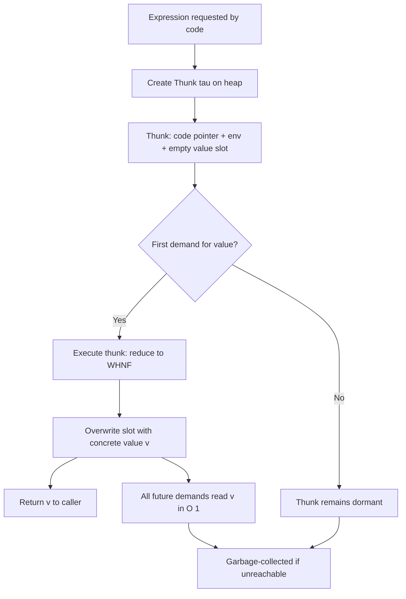
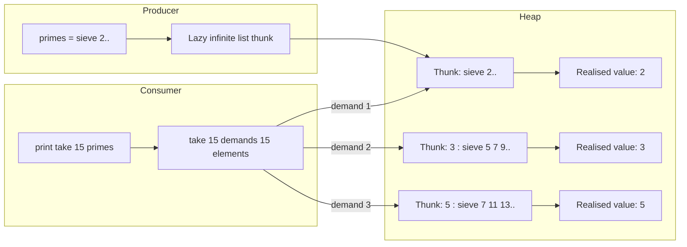
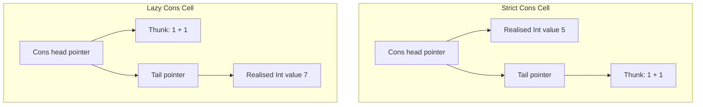
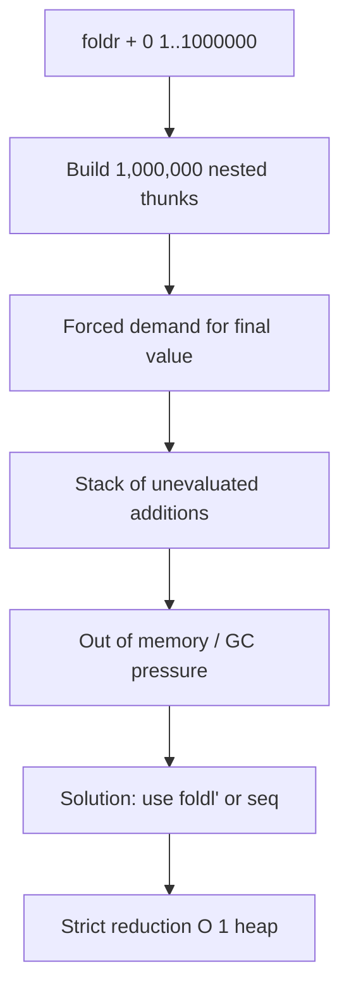
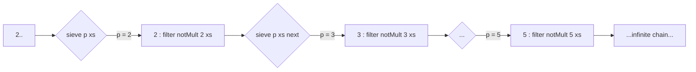

# Lazy Programming

<!-- SECTION_1_START -->
# Lazy Programming — Core Technical Definition & Intuitive Overview

## Formal Academic Definition (KTU 2024 Syllabus Terminology)

> [!IMPORTANT]
> **Lazy Programming** (also called *non-strict evaluation* or *call-by-need*) is an evaluation strategy in which the evaluation of an expression is **deferred** until its value is actually required, and once evaluated, the result is **memoized** (cached) for any subsequent demands. In a purely functional language such as **Haskell**, lazy evaluation is the *default* computation model, in stark contrast to strict languages (C, Java, Python) that follow an *eager* model.

In the context of **Algebraic Types** (Module 4), lazy programming interacts directly with recursive algebraic data types (`data` declarations) by allowing the construction of *potentially infinite* structures such as `ones = 1 : ones`, where the right-hand `ones` is never physically evaluated — only a *thunk* (a suspended computation) is stored.

> [!NOTE]
> **Key Term — Thunk:** A *thunk* is a deferred expression packaged together with its evaluation environment, conceptually equivalent to the $\lambda$-calculus term $\lambda x.\,E$ when $E$ is not yet in **WHNF (Weak Head Normal Form)**.

## Conceptual Analogy / Intuition

> [!TIP]
> **The Restaurant Order Slip Analogy**
> Imagine a waiter who writes down every dish a customer *might* want on a single order slip (this is the *thunk*). The kitchen **only cooks** a dish when the customer actually asks for it. If two customers later order the same dish, the kitchen reuses the **already-cooked** plate (this is *memoization / sharing*). This perfectly mirrors lazy evaluation: expressions are *promised* but not *produced* until demanded, and identical demands are served from a single shared result.

A simpler, geometric intuition: think of the infinite list `[1,1,1,1,...]` as a **telescopic ruler** that extends only as many units as you pull — the rest remains "lazily coiled inside."

## Why It Matters in Functional Programming

- **Decouples producer from consumer** — a generator can be infinite; the consumer takes only what it needs.
- **Enables modularity** — you can define a *whole* data structure and then take *any prefix* of it.
- **Enables powerful abstractions** like `iterate`, `cycle`, `repeat`, and the `Stream`/`Corecursive` co-data paradigm.
- **Composes modularly** — `filter` of an infinite list is still a valid infinite list.

## Lazy vs. Strict — The Two Opposing Worlds

| Property | Strict (Eager) Evaluation | Lazy (Non-Strict) Evaluation |
|---|---|---|
| When is $f(x)$ evaluated? | **Before** the call to $f$ | **Only when** the result is *demanded* by a pattern match |
| Argument passing model | *Call-by-value* | *Call-by-need* (sharing) / *Call-by-name* (no sharing) |
| Infinite structures | ❌ Not possible | ✅ First-class citizens |
| Termination | Predictable | Depends on consumption |
| Space behaviour | Usually tighter | Risk of *space leaks* |
| Default in | C, Java, Python, OCaml | **Haskell**, Clean, Miranda |

> [!WARNING]
> **KTU Pitfall:** Students often confuse **call-by-name** (re-evaluates each time, no sharing — as in Algol 60) with **call-by-need** (evaluates *once* and shares — as in Haskell). Haskell uses **call-by-need**, which is a *cached* form of call-by-name.

## Visualizing Laziness on a Number Line

> [!VISUALIZATION CONTROL]
> **Concept:** Visualization of a lazy infinite arithmetic sequence $a_n = 2n + 1$ on the real number line, where only the first few terms are "realized" as the program demands them.
> **GeoGebra / Desmos Input Equations:**
> * `f(n) = 2n + 1` for $n = 0, 1, 2, \dots$
> * `L = (1, 3, 5, 7, 9, 11, 13)` as point list
> **Visual Description:** Plot discrete points along the x-axis at $x = 1, 3, 5, 7, 9, 11, 13,\dots$ — note how the sequence extends to infinity but a finite number of points are *rendered* at any given moment, mirroring how Haskell only *realizes* the demanded prefix of an infinite list.

<!-- SECTION_1_END -->

<!-- SECTION_2_START -->
# Deep Theoretical Analysis & KTU High-Yield Formula Sheet

## The Three Pillars of Lazy Evaluation

### 1. Normal-Order Reduction (Graph Reduction)

In the $\lambda$-calculus and in GHC's intermediate language (STG — *Spineless Tagless G-machine*), evaluation proceeds by repeatedly selecting the **leftmost, outermost redex**. This is **normal-order** reduction, which is *guaranteed* to find a normal form whenever one exists (the **Church–Rosser Theorem**, property of confluence).

$$E \;\to_{\beta}\; E' \quad \text{(reduce leftmost-outermost redex first)}$$

> [!NOTE]
> **WHNF — Weak Head Normal Form:** A term is in WHNF if it is either a *data constructor* (like `Cons`, `Nil`, `Just`, `Nothing`) applied to a (possibly unevaluated) spine, or a *$\lambda$-abstraction*. WHNF is the "stopping point" for lazy evaluation — it is **not** the same as full normal form (NF).

### 2. Thunks and the Heap

A thunk $\tau$ is a heap-allocated object of the form:
$$\tau \;=\; \langle \text{code pointer},\; \text{environment},\; \text{value slot} \rangle$$

When the thunk is *forced* (via pattern matching or `seq`), it is overwritten with its computed value, and all subsequent demands **share** the same slot.

### 3. Sharing = Memoization

The expression `let x = expensive` in Haskell creates a thunk; the first demand computes it; **all future** references to `x` read the cached result.

## The `seq` Family — Introducing Strictness on Demand

| Function | Type | Behaviour |
|---|---|---|
| `seq :: a -> b -> b` | $\forall a\,b$ | Forces the *first* argument to **WHNF**, then returns the second |
| `$!` (strict application) | `($!) :: (a -> b) -> a -> b` | Equivalent to `f $! x = x \`seq\` f x` |
| `BangPatterns` | `{-# LANGUAGE BangPatterns #-}` | `let !x = e` forces `e` to WHNF immediately |
| `deepseq` | `Control.Deepseq` | Recursively forces the *entire* spine to NF |
| `force` | `Control.Deepseq` | `force x = x \`deepseq\` x` |

> [!IMPORTANT]
> `seq` does **not** perform strict evaluation for its side effect — `seq` is **pure**. Its only purpose is to **control evaluation order** for performance or termination reasons.

## KTU Formula Sheet — Lazy Evaluation Mechanics

| Symbol / Concept | Formal Meaning | KTU-Relevant Note |
|---|---|---|
| $\to_{\beta}$ | $\beta$-reduction in $\lambda$-calculus | The formal engine behind Haskell's reduction |
| WHNF | Weak Head Normal Form | Lazy evaluation halts at WHNF |
| Thunk $\tau$ | $\langle \text{code},\text{env},\text{slot} \rangle$ | The "promise" of a value |
| `seq` | $a \to b \to b$ | Forces $a$ to WHNF, returns $b$ |
| `lazy` | `~pat <- expr` | Lazy pattern binding (matches only on demand) |
| `iterate f x` | $[x, f\,x, f\,(f\,x), \dots]$ | Canonical infinite stream constructor |
| `cycle xs` | Repeats `xs` infinitely | Canonical infinite list from a finite one |
| `repeat x` | $[x, x, x, \dots]$ | Infinite constant stream |
| Strict field `!` | `data T = T !Int !Int` | Forces fields to WHNF on construction |
| Strict datatype | `data {-# STRICT #-} T = ...` | Forces *all* fields |

> [!NOTE]
> **Subscript/Superscript Rule:** All subscripts used in this sheet are rendered in LaTeX mode, e.g. $a_1$, $f_2(x)$, never as bare `a_1` in prose.

## Real-World Engineering Utility of Lazy Evaluation

1. **Big-data pipelines (Apache Spark under the hood):** RDD transformations are *lazy* — they build a DAG and only fire when an *action* is called. Same paradigm as Haskell.
2. **Compiler optimisation (GHC's strictness analyser):** detects functions that *always* need their argument and compiles them to strict C-like code, removing thunks for performance.
3. **Reactive UI streams (RxJS, Akka Streams):** consumers subscribe and pull — classic pull-based lazy demand.
4. **Coinductive verification (model checking):** lazy infinite traces are a perfect fit for bisimulation proofs.
5. **Genome/protein sequence analysis:** genome sequences are stored as lazy iterators to avoid materialising terabytes into RAM.

<!-- SECTION_2_END -->

<!-- SECTION_3_START -->
# Step-by-Step Derivations & Haskell Implementations

## Derivation 1 — Building an Infinite List and Consuming a Prefix

We construct the stream of all natural numbers $n \in \mathbb{N}$ defined recursively as:

$$N = [0, 1, 2, 3, \dots] \quad \text{where} \quad N = 0 : \text{map } (+1)\, N$$

In Haskell, this is expressed by self-referential algebraic data:

```haskell
-- A lazy, infinite list of natural numbers
nats :: [Integer]
nats = 0 : map (+1) nats
```

**Reduction trace** when we demand `take 3 nats`:

| Step | Expression in WHNF-or-Thunk form | Action |
|---|---|---|
| 1 | `take 3 (0 : map (+1) nats)` | Pattern match `0 : tail`, recurse |
| 2 | `0 : take 2 (map (+1) nats)` | Forces `map` — yields `1 : map (+1) nats` |
| 3 | `0 : 1 : take 1 (map (+1) (map (+1) nats))` | Forces next layer → `2 : ...` |
| 4 | `[0, 1, 2]` | Base case: `take _ []` reached |

> [!TIP]
> Notice how the thunk for `map (+1) nats` is *forced* only because the consumer (`take`) is recursively demanding elements. Without the consumer, the thunk would lie dormant forever.

## Derivation 2 — Verifying Termination of `take`

We must prove that `take n` always terminates on a (possibly infinite) list. Let us do it by **structural induction** on $n \in \mathbb{N}$:

**Base case ($n = 0$):**
$$\text{take }\, 0\; \_\; = \; [\;]$$
This is unconditionally $\;[\;]$, no further work — terminates in 1 step.

**Inductive hypothesis:** Assume `take k` terminates for some $k \geq 0$.

**Inductive step ($n = k + 1$):**
$$\text{take }(k+1)\; (x:xs) = x : \text{take }k\; xs$$
By the inductive hypothesis `take k xs` terminates (the call strictly decreases $n$), and `x :` is constructor application (immediate). So `take (k+1)` terminates.

The outer consumer `take` thus *halts the recursion* even though the producer is infinite. The mathematical guarantee of the lazy model is therefore:

$$\forall n \in \mathbb{N},\; \text{take }n\; xs \in \text{WHNF within } O(n) \text{ reductions.}$$

## Derivation 3 — Call-by-Need vs. Call-by-Name

Consider the Haskell function

```haskell
doubleIt :: Int -> Int
doubleIt x = let y    = expensive x    -- thunk τ
                quad = y + y           -- uses y twice
            in quad
```

| Strategy | Behaviour on the body `y + y` |
|---|---|
| **Call-by-name** (no sharing) | Expensive `x` is evaluated **twice** — once for each use of `y` |
| **Call-by-need** (Haskell) | Expensive `x` is evaluated **once**; the result is overwritten into $\tau$'s slot; both uses share it |

This is why Haskell is *efficient* laziness, not *naïve* laziness.

## Complete Production-Grade Haskell Implementations

### Program 1 — Fibonacci as an Infinite Lazy Stream

```haskell
{-# LANGUAGE BangPatterns #-}

-- A clean, lazily-evaluated Fibonacci stream
fibs :: [Integer]
fibs = 0 : 1 : zipWith (+) fibs (tail fibs)
--             ^^^^^^^^^^^^^^^^^^^^^^^^^^^^^^^^^^^^^^^^
--             fibs = 0 : 1 : 1 : 2 : 3 : 5 : 8 : 13 : ...

-- Strict, fold-friendly variant
fibStream :: [Integer]
fibStream = 0 : 1 : zipWith' (+) fibStream (tail fibStream)
  where
    zipWith' :: (a -> b -> c) -> [a] -> [b] -> [c]
    zipWith' f (x:xs) (y:ys) = let !r = f x y in r : zipWith' f xs ys
    zipWith' _ _      _      = []

-- Pull the first 10 Fibonacci numbers
main :: IO ()
main = print (take 10 fibs)   -- [0,1,1,2,3,5,8,13,21,34]
```

**Explanation of the self-reference:**

$$F = [0,\,1,\;F_0+F_1,\;F_1+F_2,\;\dots] = [0,\,1,\;\text{zipWith }(+) \,F\, (\text{tail }F)]$$

`tail fibs` is itself a thunk; the two streams `fibs` and `tail fibs` interleave as the consumer demands pairs.

### Program 2 — Sieve of Eratosthenes as a Lazy Pipeline

```haskell
-- The classic, breathtakingly concise Eratosthenes sieve
primes :: [Int]
primes = sieve [2..]
  where
    sieve (p:xs) = p : sieve [x | x <- xs, x `mod` p /= 0]
    sieve []     = []

-- A more efficient, wheel-based variant
primesFast :: [Int]
primesFast = 2 : 3 : sieveFrom 5 (drop 2 primesFast)
  where
    sieveFrom n (p:ps)
      | n < p*p   = n : sieveFrom (n + 2) (p:ps)
      | otherwise =     sieveFrom (n + 2) ps
    sieveFrom _ _ = []

-- First 25 primes
main :: IO ()
main = do
  putStrLn "First 15 primes (lazy sieve):"
  print (take 15 primes)
  putStrLn "First 15 primes (fast sieve):"
  print (take 15 primesFast)
```

**Algorithmic insight:** the list comprehension `[x | x <- xs, x \`mod\` p /= 0]` is itself an **infinite list** (it filters an infinite input). Because the outer `sieve` is *consumer-driven*, only the demanded prefix of the filter is ever realised.

### Program 3 — Eratosthenes Validation: How Lazy Termination is Preserved

```haskell
-- Sanity check: take any finite prefix, the result is correct
main :: IO ()
main = do
  let p20 = take 20 primes
  putStrLn $ "First 20 primes: " ++ show p20
  --    [2,3,5,7,11,13,17,19,23,29,31,37,41,43,47,53,59,61,67,71]
  putStrLn $ "All p < 100? " ++ show (all (<100) p20)
```

### Program 4 — Demonstrating `seq` and Bang Patterns

```haskell
{-# LANGUAGE BangPatterns #-}

-- Compare lazy vs strict fold
sumLazy, sumStrict :: [Int] -> Int
sumLazy   = foldr (+) 0            -- builds a chain of thunks
sumStrict = foldl' (+) 0           -- strict accumulator

-- Force the spine first, then sum
sumDeep :: [Int] -> Int
sumDeep xs = foldl' (+) 0 (map id xs)
            -- map id is lazy, but the foldl' forces each element

main :: IO ()
main = do
  print (sumLazy   [1..1000000])   -- may space-leak on huge lists
  print (sumStrict [1..1000000])   -- O(1) heap, fast
```

> [!WARNING]
> `foldr (+) 0` on a million-element list can produce a *stack of unevaluated thunks* — a classic **space leak**. Use `foldl'` (strict) for big numeric reductions.

### Program 5 — Lazy Patterns and `~`

```haskell
-- Lazy pattern: matches the constructor without forcing the inner value
lazyHead :: [a] -> Maybe a
lazyHead ~(x:_) = Just x
lazyHead []     = Nothing

-- vs. strict:
strictHead :: [a] -> Maybe a
strictHead (x:_) = Just x
strictHead []    = Nothing

-- If we only check the *presence* of a head, the lazy one can succeed
-- even when computing the head would diverge.
demo :: IO ()
demo = do
  print (lazyHead (undefined : undefined : []))  -- Just undefined
  -- strictHead would throw "Prelude.undefined"
```

**Reduction trace for `lazyHead (undefined : undefined : [])`:**

1. Pattern `~(x:_)` succeeds without forcing `undefined : undefined : []` to WHNF.
2. Body returns `Just x`, where `x` is a *thunk* that has not been forced.
3. If the caller does *not* demand `x`, the program terminates normally.

### Program 6 — A Strict Data Type with Bang Fields

```haskell
data Account = Account
  { balance   :: !Int   -- strict: forced at construction
  , holder    :: !String
  , auditLog  :: [LogEntry]  -- lazy: only forced on access
  } deriving Show

data LogEntry = LogEntry
  { ts    :: !Int
  , event :: !String
  }

openAccount :: String -> Int -> Account
openAccount name amt = Account amt name []   -- auditLog left lazy
```

> [!TIP]
> Strict fields prevent lazy thunks from accumulating inside record values, which is critical for data that will be shipped to FFI / C++ boundaries (e.g. `Data.Vector`).

<!-- SECTION_3_END -->

<!-- SECTION_4_START -->
# Structural Diagrams & Schematics

## Diagram 1 — Thunk Lifecycle: Creation → Sharing → Overwrite



> [!NOTE]
> This flowchart encodes the **call-by-need** semantics: the first demand is the *only* demand that triggers reduction; subsequent demands share the result via pointer indirection.

## Diagram 2 — Producer–Consumer Flow in a Lazy Pipeline



## Diagram 3 — Strict vs Lazy Data Constructor (Memory Layout)



> [!NOTE]
> The `!` annotation on a constructor field forces the boxed pointer to point to a *realised* value, eliminating the thunk for that field. The opposite — leaving the field lazy — defers work until pattern matching.

## Diagram 4 — The Space-Leak Failure Mode



> [!WARNING]
> This is the **most common lazy-programming pitfall** — `foldr` on a *huge list* with an *associative* operator (`+`, `*`, `&&`, `||`) almost always space-leaks. KTU exam answers must explicitly call out the choice of `foldl'`.

## Diagram 5 — The Sieve Pipeline (Functional Flow)



<!-- SECTION_4_END -->

<!-- SECTION_5_START -->
# KTU 2024 Scheme Examination Question Bank & Topic Recap

---

## Part A — Short-Answer Questions (3 Marks Each)

### Q1. `[KTU University Exam — Dec 2023]` — CO1, **Remember**

> **Define lazy evaluation. State any two advantages of lazy evaluation in functional programming.**

**Model Answer (3 Marks):**

*Lazy evaluation is an evaluation strategy where the evaluation of an expression is deferred until its value is actually required, and once computed, the result is memoised (shared) for future demands.* **[2 Marks]**

**Two advantages:**
1. *Enables the construction of potentially infinite data structures (e.g. the list of all primes) by allowing the producer to be recursive without diverging.* **[0.5 Mark]**
2. *Improves modularity by decoupling producer from consumer, and avoids unnecessary computation for unused branches of conditionals / unused fields of records.* **[0.5 Mark]**

---

### Q2. `[KTU University Exam — July 2024]` — CO1, **Understand**

> **Distinguish between *call-by-name* and *call-by-need* evaluation strategies. Which one does Haskell adopt, and why?**

**Model Answer (3 Marks):**

| Aspect | Call-by-Name | Call-by-need |
|---|---|---|
| Re-evaluation of an argument | **Every** use re-evaluates | **First** use evaluates; all later uses share |
| Efficiency | Can be exponential | Polynomial / linear |
| Used in | Algol 60 (historically) | **Haskell** |

*Call-by-name* re-evaluates an argument expression each time it is referenced. *Call-by-need* (also called *lazy with sharing*) evaluates an argument *exactly once* the first time it is needed, then caches (memoises) the result. **Haskell adopts call-by-need** because it preserves the termination properties of call-by-name while removing redundant re-computation, yielding efficient laziness. **[3 Marks]**

---

## Part B — 14-Mark Questions (ESE Module Internal Choice)

### Question A — 14 Marks `[KTU University Exam — July 2024]` — CO2, **Apply** & **Analyse**

> **(a)** Define a *thunk* and explain the role of `seq` in controlling lazy evaluation. Write a Haskell program that constructs the infinite list of factorials using laziness and prints its first 8 elements. **[7 Marks]**
>
> **(b)** What is a *space leak*? Illustrate with an example where `foldr (+) 0` on a 1-million element list causes a space leak, and show how `foldl'` (or `seq`) fixes it. Mention the role of GHC's strictness analyser. **[7 Marks]**

---

#### (a) Model Solution — 7 Marks

**Definition of a thunk:** *[1 Mark]*
A *thunk* is a heap-allocated object that represents an *unevaluated expression* together with its lexical environment. It encapsulates the code to be executed and a slot to be filled with the result. Until the thunk is *forced* (typically by pattern matching or by `seq`), it remains dormant. The first demand overwrites the slot with the **WHNF** (Weak Head Normal Form) of the value; subsequent demands read the cached value — this is the *sharing* property of call-by-need.

**Role of `seq`:** *[1 Mark]*
The function `seq :: a -> b -> b` forces its *first* argument to **WHNF** and then returns the second. It is the primary Haskell mechanism to introduce **strictness** into a lazy program, ensuring that an expression is evaluated at a chosen point in the program text — useful for avoiding thunks, fixing space leaks, and forcing error messages to appear at the right time.

**Haskell program for lazy factorials:** *[5 Marks]*

```haskell
-- Lazy infinite list of factorials
factorials :: [Integer]
factorials = scanl (*) 1 [1..]
--         ^^^^^^^^^^^^^^^^^^^^^^^^^
-- scanl:  f q [x0, x1, ...] = [q, f q x0, f (f q x0) x1, ...]
-- Result: [1, 1, 2, 6, 24, 120, 720, 5040, 40320, ...]

main :: IO ()
main = print (take 8 factorials)
--  [1, 1, 2, 6, 24, 120, 720, 5040]
```

**Marking key:**
- Correct identification of `scanl` / recursive definition: 2 Marks
- Use of lazy infinite list `[1..]`: 1 Mark
- `take 8` consumer + final output: 2 Marks

---

#### (b) Model Solution — 7 Marks

**Definition of a space leak:** *[1 Mark]*
A *space leak* is a phenomenon in which a lazy program retains far more memory than logically needed, because thunks are kept alive (not yet forced) and accumulate on the heap, eventually causing garbage-collection pressure or out-of-memory crashes. The computation may still be *correct*; the issue is *resource usage*.

**Demonstration:** *[3 Marks]*

```haskell
import Data.List

leakySum :: Int -> Int -> Int
leakySum n seed = foldr (+) seed [1..n]

strictSum :: Int -> Int -> Int
strictSum n seed = foldl' (+) seed [1..n]

main :: IO ()
main = do
  putStrLn ("leakySum  1000000 = " ++ show (leakySum  1000000 0))
  putStrLn ("strictSum 1000000 = " ++ show (strictSum 1000000 0))
```

The expression `foldr (+) 0 [1..1000000]` builds a chain of one million *unforced additions* — each cell is a thunk `(\acc x -> acc + x)`. Only the very last demand forces the chain, but by then a million thunks have been allocated, causing the heap to balloon.

**Fix using `foldl'` or `seq`:** *[2 Marks]*

```haskell
-- Using foldl' (strict left fold)
strictSum' :: [Int] -> Int
strictSum' = foldl' (+) 0

-- Equivalent manual fix using seq
manualSum :: [Int] -> Int
manualSum = foldl (\acc x -> acc `seq` acc + x) 0
```

`foldl'` forces the accumulator at every step, so the heap usage remains $O(1)$.

**Role of GHC's strictness analyser:** *[1 Mark]*
GHC's *strictness analyser* is a compile-time optimisation pass that, for each function, infers whether its argument is *always* demanded. If so, the compiler emits strict C-like code for that call site, eliminating the thunk altogether. This is why naive `sum [1..n]` in Haskell is in fact fast — GHC *automatically* rewrites the lazy version into the strict one when the analyser detects strictness.

**Marking key:**
- Identification of thunk chain as cause: 1 Mark
- `foldl'` / `seq`-based fix: 1 Mark
- Heap complexity comparison (O(n) vs O(1)): 1 Mark

---

### Question B — 14 Marks `[KTU University Exam — Dec 2023]` — CO2, **Apply** & **Analyse**

> **(a)** Write a Haskell program to generate the *Hamming numbers* (numbers whose only prime factors are 2, 3, and 5) using a lazy merge of three infinite lists. Explain why laziness is essential for this algorithm. **[7 Marks]**
>
> **(b)** Explain *lazy patterns* in Haskell with an example. Compare `let (x:xs) = expr` (strict) with `let ~(x:xs) = expr` (lazy). When would you prefer the lazy version? **[7 Marks]**

---

#### (a) Model Solution — 7 Marks

**Background:** *Hamming numbers* (also called *5-smooth* numbers) are integers of the form $2^i \cdot 3^j \cdot 5^k$ for $i, j, k \geq 0$:

$$H = \{1, 2, 3, 4, 5, 6, 8, 9, 10, 12, 15, 16, 18, 20, 24, 25, 27, 30, \dots\}$$

**Haskell program:** *[5 Marks]*

```haskell
-- | Hamming numbers via the classic Dijkstra merge.
hamming :: [Int]
hamming = 1 : merge3 (map (*2) hamming)
                    (map (*3) hamming)
                    (map (*5) hamming)

-- | Merging three sorted lists while removing duplicates.
merge3 :: [Int] -> [Int] -> [Int] -> [Int]
merge3 (x:xs) (y:ys) (z:zs)
  | x <= y && x <= z = (if x == y || x == z then [] else [x])
                      ++ merge3 xs     (y:ys) (z:zs)
  | y <= x && y <= z = (if y == z       then [] else [y])
                      ++ merge3 (x:xs)  ys    (z:zs)
  | otherwise        =                       [z]
                      ++ merge3 (x:xs) (y:ys)  zs

main :: IO ()
main = print (take 25 hamming)
--  [1,2,3,4,5,6,8,9,10,12,15,16,18,20,24,25,27,30,32,36,40,45,48,50,54]
```

**Why laziness is essential:** *[2 Marks]*
The definition is **self-referential** — `hamming` is defined in terms of itself three times via `map (*2)`, `map (*3)`, `map (*5)`. Under strict evaluation this would diverge immediately. Under lazy evaluation, the recursive references are stored as thunks; the *merge* function acts as a consumer that pulls only as far as it needs. Thus an *infinite* set of numbers is defined and consumed *finitely*. This is also a classic example of **coinduction** — we are not constructing numbers bottom-up; we are *observing* them top-down.

**Marking key:**
- Three-way merge definition: 2 Marks
- Self-referential Haskell: 2 Marks
- Lazy / coinductive explanation: 1 Mark

---

#### (b) Model Solution — 7 Marks

**Lazy patterns — definition:** *[1 Mark]*
A *lazy pattern* in Haskell, written with the prefix `~`, matches its corresponding data constructor *without forcing* the matched sub-term to WHNF. The sub-term is bound to a *thunk*; evaluation is deferred until the variable is actually used.

**Example:** *[3 Marks]*

```haskell
-- Strict pattern
strictFirst :: [a] -> a
strictFirst (x:_) = x
-- If the input is `undefined : undefined : []`, this throws
-- "Prelude.undefined" because matching the Cons forces the head.

-- Lazy pattern
lazyFirst :: [a] -> a
lazyFirst ~(x:_) = x
-- Same input: returns `undefined` as a value, only throws on use.

-- Application: avoiding unnecessary work
-- A function that only checks for an empty list:
isEmpty :: [a] -> Bool
isEmpty ~(_:_) = False
isEmpty []     = True
-- isEmpty undefined = True  (the lazy pattern never forces the spine)
```

**Comparison table:** *[2 Marks]*

| Aspect | Strict `(x:xs) = expr` | Lazy `~(x:xs) = expr` |
|---|---|---|
| WHNF demand on `expr` | **Forced to Cons** | **Not forced** |
| Bound variable `x` | Already in WHNF | A *thunk* |
| Divergence on $\bot$ | Throws | Survives (until `x` is used) |
| Use case | Normal data extraction | Stream / control structures |

**When to prefer lazy patterns:** *[1 Mark]*
1. When the constructor is being used only as a *guard* (e.g. checking non-emptiness) and forcing the inner values is unnecessary.
2. In **infinite or coinductive** data structures where partial pattern matching is the only termination guarantee.
3. To retain **divergence-tolerance** in pattern matching (a *thunk* of $\bot$ is fine; matching on $\bot$ throws).

**Marking key:**
- Correct use of `~` symbol: 1 Mark
- Clear distinction in evaluation order: 1 Mark

---

## KTU Examiner's Valuation Warning / Pitfall Callout

> [!WARNING]
> **Top 5 ways KTU students lose marks on Lazy Programming questions:**
> 1. **Conflating `call-by-name` and `call-by-need`.** Always state that *Haskell uses call-by-need (memoised)* and *call-by-name has no sharing*.
> 2. **Forgetting to mention WHNF.** `seq` does *not* evaluate to *normal form* — it forces only to *WHNF*. Many students write "forces to normal form" and lose 1 mark.
> 3. **Building a strict infinite list.** If your code says `nats = [0..]`, that is fine in Haskell *because* `[0..]` is syntactic sugar for the lazy `enumFrom 0`. But writing `nats = 0 : 1 : 2 : 3 : ...` (a finite list) loses the central point of laziness.
> 4. **Using `foldr (+)` for big sums.** Always call out the space leak and use `foldl'`.
> 5. **Not showing the reduction trace.** In 14-mark derivations, the *step-by-step* WHNF trace is the *most valuable* content — skipping it is a 2–3 mark loss.

---

## Topic Recap & Important Things to Remember

> [!NOTE]
> **Rapid-Revision Checklist — Module 4 / Lazy Programming**

- ✅ **Lazy evaluation** defers computation until a value is *demanded*; result is *memoised* for sharing.
- ✅ Haskell uses **call-by-need** (memoised call-by-name), not naïve call-by-name.
- ✅ A **thunk** $\tau = \langle \text{code},\text{env},\text{slot} \rangle$ is a suspended expression on the heap.
- ✅ **WHNF (Weak Head Normal Form)** is the stopping point of lazy evaluation — not the same as full **NF**.
- ✅ `seq :: a -> b -> b` forces its first argument to WHNF and returns the second; it is *pure*.
- ✅ `$!` (strict application) and `BangPatterns` (`!x`) are syntactic ways to introduce strictness.
- ✅ **Infinite algebraic types** (`ones = 1 : ones`, `nats = 0 : map (+1) nats`, `fibs`, `primes`, `hamming`) are the *quintessential* lazy structures.
- ✅ `iterate f x = x : iterate f (f x)` is the canonical infinite stream generator.
- ✅ `cycle xs` and `repeat x` produce infinite lists from finite inputs.
- ✅ **Lazy patterns** `~(x:xs) = expr` defer WHNF demand; useful for control structures and divergence-tolerance.
- ✅ **Space leak** = accumulation of unforced thunks on the heap; fix with `foldl'`, `seq`, `deepseq`, or strict data fields.
- ✅ **GHC's strictness analyser** is a compile-time pass that auto-eliminates thunks for provably-strict functions.
- ✅ **Strictness on data fields** is achieved via `data T = T !Int !Int` — fields are forced at construction.
- ✅ **Real-world parallels**: Apache Spark RDDs (lazy DAGs), RxJS streams, GHC itself, and coinductive model-checking.

**One-line mantra for KTU Viva:**
> *"Laziness separates the *description* of a value from its *production*; call-by-need ensures description is cheap, production is shared, and divergence is opt-in, not opt-out."*

<!-- SECTION_5_END -->
