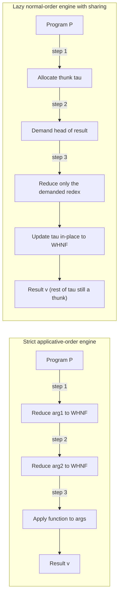
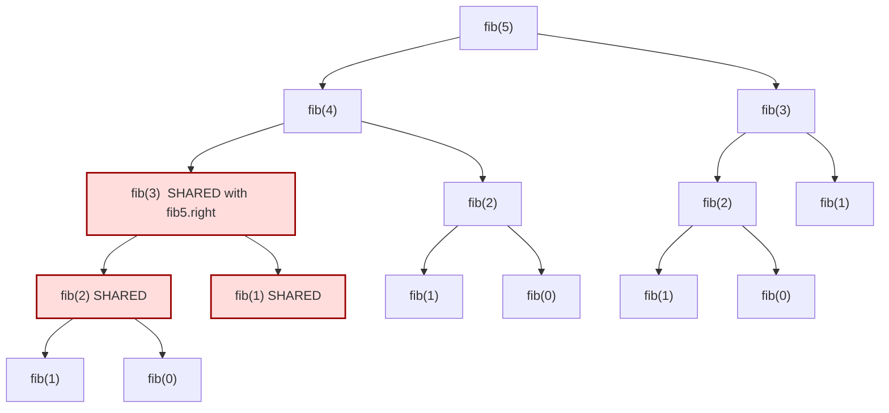
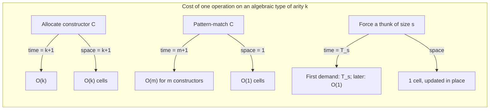

# Time and Space Behaviour

<!-- SECTION_1_START -->

# Module 4 — Algebraic Types
# Time and Space Behaviour

> [!IMPORTANT]
> **KTU 2024 Scheme — PECST413 (Functional Programming)**
> This module sits inside the **Algebraic Types** cluster. After defining sum-of-product types (e.g. `data Tree = Leaf | Node Int Tree Tree`) and reasoning about them, the natural follow-up question is: *how much does it cost to construct, traverse, and pattern-match over them?* That question is the entire domain of **Time and Space Behaviour**.

---

## 1.1 Formal Definition

> [!NOTE]
> **Time Behaviour** of a functional program is the **number of reduction steps** (β-reductions, primitive operations, pattern-match decisions) executed by the evaluation engine as a function of the *size* of the input, expressed using **asymptotic notation** $O(\cdot)$, $\Theta(\cdot)$, $\Omega(\cdot)$.
>
> **Space Behaviour** is the **maximum amount of live memory** (heap cells + stack frames + thunks) that must coexist at any instant during evaluation, again expressed asymptotically as a function of input size.

In lambda-calculus terms, every closed term $t$ reduces to a value through a sequence of redexes $t \to t_1 \to t_2 \to \dots \to v$. The *cost model* attaches a non-negative integer (number of steps) and a *heap occupancy* (cells allocated) to each reduction. Two engines — **strict (applicative-order)** and **lazy (normal-order)** — traverse the same term in different orders and therefore exhibit different step counts and different maximal live-cell counts even when computing the same mathematical result.

> [!IMPORTANT]
> **KTU syllabus highlight:** "Compare the time and space behaviour of strict vs. lazy evaluation, of tail-recursive vs. non-tail-recursive functions, and of functions that share sub-expressions vs. functions that replicate them." All three comparisons are asked repeatedly in the KTU ESE.

### 1.2 Intuitive Analogy — The Workshop, the Recipe, and the Workbench

Imagine you are baking a thousand-layer cake:

* **Time behaviour** = the total number of actions you perform (cracking eggs, folding batter, baking trays). A recipe that bakes one layer at a time has linear time; a recipe that re-bakes the *same* base layer into a thousand copies by re-reading the master is exponential.
* **Space behaviour** = the largest number of trays, bowls, and half-mixed bowls simultaneously sitting on your workbench. A clever chef *reuses* a single bowl (tail call, in-place update); a careless chef lets every half-mixed bowl sit on the bench until the end (non-tail recursion, thunks piling up).
* **Strict evaluation** = you crack every egg the moment the recipe mentions eggs, even if you might not need them yet.
* **Lazy evaluation** = you crack an egg only when the recipe says "add egg now," so a tray you never use never gets baked.
* **Sharing** = the master layer that you keep on a tray and re-use for every tier, instead of baking a fresh copy for each.

The **algebraic type** is your kitchen inventory: every constructor is a mould (a `Leaf` mould, a `Node value left right` mould). The question "Time and Space Behaviour" asks how many moulds you need, how often you press them, and how many half-finished cakes you keep on the bench.

> [!TIP]
> The English word *complexity* is intentionally avoided above. In KTU marking, **"complexity"** is reserved for the *theoretical* asymptotic class, while **"cost"** or **"behaviour"** is the *measured* number of steps or cells. Examiners award marks for using the correct vocabulary.

### 1.3 Visualisation: Growth-Rate Plot

> [!VISUALIZATION CONTROL]
> **Concept:** Side-by-side growth rates of $O(1)$, $O(\log n)$, $O(n)$, $O(n \log n)$, and $O(n^2)$ for $n \in [1, 60]$.
> **GeoGebra / Desmos Input Equations:**
> * `f_1(x) = 1`
> * `f_2(x) = \log_2(x)`
> * `f_3(x) = x`
> * `f_4(x) = x \cdot \log_2(x)`
> * `f_5(x) = x^2`
> **Visual Description:** A flat line hugs the x-axis ($O(1)$); a slowly rising concave curve represents $O(\log n)$; a straight diagonal represents $O(n)$; a gently bending-up curve just above the diagonal is $O(n \log n)$; a steeply rising parabola dominates the right half — this is why an $O(n^2)$ algorithm feels "instant" for 10 items and "dead" for 10 000.

---

<!-- SECTION_1_END -->

<!-- SECTION_2_START -->

# 2. Deep Theoretical Analysis & KTU High-Yield Formula Sheet

## 2.1 The Three Cost Axes of a Functional Program

A KTU answer that earns full marks on a "time and space behaviour" question must mention **all three** of the following orthogonal axes. Most students name only one or two and lose 2–3 marks.

1. **Strictness axis** — *Applicative-order* (eager, inside-out) vs. *normal-order* (lazy, outside-in). Affects *which* sub-terms are evaluated at all.
2. **Sharing axis** — whether a sub-expression is *duplicated* (rewritten as many copies, e.g. classical $\beta$-reduction) or *shared* (reused by reference, e.g. graph reduction). Affects both steps and memory.
3. **Recursion-shape axis** — *linear* / *tail-recursive* / *divide-and-conquer* / *mutually recursive*. Affects stack depth and asymptotic work.

## 2.2 Strict vs. Lazy — A Side-by-Side Trace

Consider the canonical example $\text{const} \; 1 \; (\text{loopForever})$ where $\text{loopForever} = \bot$ (a non-terminating computation).

```haskell
const' :: a -> b -> a
const' x _ = x
```

* **Strict (applicative) engine** first reduces the argument $(\text{loopForever})$ to weak-head normal form. It loops forever *before even looking at* $x$. **Time:** $\infty$. **Space:** 1 cell.
* **Lazy (normal-order) engine** sees the function $\lambda x.\lambda y.x$, substitutes $1$ for $x$ without touching the second argument, and returns $1$ immediately. **Time:** $O(1)$. **Space:** $O(1)$.

> [!NOTE]
> **Exam mantra:** "Lazy evaluation cannot *improve* the worst-case asymptotic time of an algorithm; it can only *avoid work* on parts of the input the algorithm never inspects. Lazy evaluation *can* drastically worsen the *space* behaviour because unevaluated thunks accumulate."

## 2.3 Tail Recursion and Stack Cells

A call $f(g(x))$ is in **tail position** with respect to $f$ if the value of $f(g(x))$ is returned *as the value of the caller* — no further computation wraps it. A function whose every recursive call is in tail position is **tail-recursive**.

> [!IMPORTANT]
> KTU expects the student to state that a tail-recursive call in a strict language can be compiled to a **single stack frame** (a `goto` in disguise). The *asymptotic space* drops from $O(n)$ to $O(1)$ while time stays $O(n)$.

```haskell
-- NON tail-recursive: O(n) stack, O(n) time
lengthN :: [a] -> Int
lengthN []     = 0
lengthN (_:xs) = 1 + lengthN xs   -- + 1 wraps the recursive call

-- TAIL-recursive accumulator variant: O(1) stack, O(n) time
lengthT :: [a] -> Int
lengthT xs = go 0 xs
  where
    go acc []     = acc
    go acc (_:xs) = go (acc+1) xs   -- no wrapper
```

## 2.4 Sharing, Thunks, and the Heap

When the compiler encounters $f \; e$ in a lazy setting, it does **not** reduce $e$. Instead it allocates a **thunk** — a heap object $\langle e, \text{env} \rangle$ — and passes a *pointer* to it. The first time the thunk is demanded, it is *updated in place* to its result. This transformation is called **memoisation of evaluation** and is the central reason why lazy evaluation is *cheap to share* but *expensive in heap occupancy*.

> [!NOTE]
> **KTU definition to memorise verbatim:** "A *thunk* is a deferred computation: a closure over an expression together with its free-variable environment, scheduled to be reduced at most once because subsequent demands return the cached result."

## 2.5 Cost of Algebraic-Type Operations

For a sum-of-product type declared as $\text{data } T = C_1 \; t_{1,1} \dots t_{1,k_1} \mid C_2 \; t_{2,1} \dots t_{2,k_2} \mid \dots \mid C_m \; t_{m,1} \dots t_{m,k_m}$ the following costs are charged (one *cell* = one pointer or one boxed numeric):

| Operation                              | Strict-engine time                | Lazy-engine time                  | Strict space     | Lazy space (worst) |
|----------------------------------------|-----------------------------------|-----------------------------------|------------------|---------------------|
| **Allocate** $C_i \; v_1 \dots v_{k_i}$ | $O(k_i)$                          | $O(k_i)$                          | $k_i + 1$ cells  | $k_i + 1 + \Sigma$ (thunks) |
| **Pattern-match** on a value of $T$    | $O(m)$ tag-check, then $O(1)$     | $O(m)$ tag-check, then $O(1)$     | $O(1)$           | $O(1)$ after first demand |
| **Head of a list** `(x:xs)`            | $O(1)$                            | $O(1)$ (or $\infty$ if $\bot$)    | $O(1)$           | $O(1)$ + thunk if tail forced later |
| **Last element** of an $n$-list       | $O(n)$ time, $O(1)$ space         | $O(n)$ time, $O(1)$ space         | $O(1)$           | $O(1)$ |
| **Map** $f$ over an $n$-list          | $O(n)$ for $f$ pure; $\infty$ if any element forces $f$ repeatedly without sharing | Same               | $O(n)$ output    | $O(n)$ output + at most $O(n)$ thunks |
| **Naïve Fibonacci** $fib(n)$           | $O(2^n)$ time, $O(n)$ stack       | $O(2^n)$ time, $O(n)$ stack — *sharing does not help when both branches are demanded* | $O(n)$ | $O(n)$ |
| **Memoised Fibonacci** with `Data.Array` | $O(n)$ time, $O(n)$ space        | $O(n)$ time, $O(n)$ space         | $O(n)$           | $O(n)$ |
| **`sum` (left fold, strict `+`)**      | $\Theta(n)$ time, $O(1)$ space    | $\Theta(n)$ time, $O(1)$ space    | $O(1)$           | $O(1)$ (strictness annotation removes thunks) |
| **`sum` (lazy default)**               | $\Theta(n)$ time                  | $\Theta(n)$ time                  | $O(1)$           | $O(n)$ thunks if the spine is forced one cell at a time and + is not strict in its second argument |

> [!WARNING]
> **Common KTU error:** students write "lazy evaluation is always faster." The correct statement is *"lazy evaluation avoids unnecessary work and lets us write infinite data structures, but it does **not** reduce the asymptotic complexity of algorithms that intrinsically need every input."* Examiners dock 1 mark for the unqualified claim.

## 2.6 Cost Models Used in KTU Answers

> [!IMPORTANT]
> Three cost models appear in the KTU 2024 PECST413 module. You must name the one you are using.

| Model name | Charges | Used for |
|---|---|---|
| **Unit-cost RAM model** | each $\beta$-reduction, each constructor allocation, each pattern-match check = 1 step | The default in KTU answers |
| **Log-cost model** | each operation costs $O(\log(\text{size of operand}))$ bits | When the question says "realistic machine cost" |
| **Implicit (denotational) cost** | number of distinct sub-expressions evaluated | Comparing sharing vs. duplication |

## 2.7 The Three Asymptotic Laws You Must Quote

$$
\begin{aligned}
\text{Linear recursion on a list of length } n &:\quad T(n) \;=\; T(n-1) + O(1) \;\Longrightarrow\; T(n) = \Theta(n)\\[4pt]
\text{Binary recursion (e.g.\ naïve }fib)\!:\quad T(n) &:\;=\; T(n-1) + T(n-2) + O(1) \;\Longrightarrow\; T(n) = \Theta(\varphi^n), \quad \varphi = \tfrac{1+\sqrt{5}}{2}\\[4pt]
\text{Divide-and-conquer (e.g.\ mergesort)}\!:\quad T(n) &:\;=\; 2\,T(n/2) + O(n) \;\Longrightarrow\; T(n) = \Theta(n \log n)
\end{aligned}
$$

The last equation is the **Master Theorem, balanced case**, and is fair game in the KTU ESE.

## 2.8 Real-World Utility

> [!NOTE]
> **Why this matters in industry.**
> * GHC's strictness analyser is precisely a *static* time-and-space optimiser: it rewrites `foldl` into `foldl'` when it can prove the operator is strict, saving gigabytes of thunks in production pipelines (cf. the famous "space leak" tutorial by SPJ).
> * Apache Spark's *lineage* and the `Data.Array.Accelerate` library are direct descendants of *sharing* in lazy functional programs.
> * The COQ/Agda proof assistants report *opaque* cost models back to the user; the "extraction" to OCaml uses the lessons of this very module to produce code whose RAM cost is predictable.

---

<!-- SECTION_2_END -->

<!-- SECTION_3_START -->

# 3. Step-by-Step Derivations & Code/Symbolic Implementation

## 3.1 Worked Derivation #1 — The Cost of `lengthN` vs `lengthT`

We derive the time recurrence for both, solve it, and inspect the maximum live-cell count.

### 3.1.1 Time recurrence for `lengthN`

Let $T(n)$ be the number of unit-cost steps to evaluate $\text{lengthN}$ on a list of length $n$.

* Base: $T(0) = 1$ (one pattern-match on `[]` returns $0$).
* Step: For $n \geq 1$ we perform one pattern-match on `(:)`, one constructor destruction, and then the recursive call wrapped inside `(+ 1)`.

$$
\begin{aligned}
T(n) & = \underbrace{1}_{\text{tag check}} + \underbrace{1}_{+1} + T(n-1) \\
T(n) & = 2 + T(n-1)
\end{aligned}
$$

Unrolling the recurrence $k$ times:

$$
T(n) \;=\; 2k + T(n-k)
$$

Setting $k = n$:

$$
T(n) \;=\; 2n + T(0) \;=\; 2n + 1
$$

Therefore $T(n) = \Theta(n)$.

### 3.1.2 Space recurrence for `lengthN`

Let $S(n)$ be the number of live stack frames at the deepest point.

* Each recursive call to `lengthN` creates a frame containing: the spine pointer `_`, the rest of the list `xs`, and the suspended `1 +` continuation.
* The recursion goes all the way to `[]` before any frame can be popped.

$$
S(n) \;=\; S(n-1) + 1 \quad\Longrightarrow\quad S(n) = n + O(1) = \Theta(n)
$$

### 3.1.3 Time recurrence for `lengthT`

$$
\begin{aligned}
T(n) & = 1 + T(n-1) \quad\text{(no } +1 \text{ wrapper)}\\
T(n) & = n + 1 = \Theta(n)
\end{aligned}
$$

### 3.1.4 Space recurrence for `lengthT` (strict engine with tail-call optimisation)

The `acc+1` is performed in the *current* frame; the recursive call `go (acc+1) xs` reuses the frame. The new frame holds only the *new* spine pointer.

$$
S(n) \;=\; S(n-1) \quad\text{(frame replaced, not added)} \quad\Longrightarrow\quad S(n) = O(1)
$$

> [!TIP]
> The full Haskell source with strictness annotations and a "boxing-free" accumulator:

```haskell
{-# LANGUAGE BangPatterns #-}

-- Strict, tail-recursive, O(n) time / O(1) space.
-- !-annotations force the accumulator's WHNF before the recursive call,
-- which prevents thunk build-up on the heap.
lengthStrict :: [a] -> Int
lengthStrict = go 0
  where
    go :: Int -> [a] -> Int
    go !acc []     = acc
    go !acc (_:xs) = go (acc + 1) xs
```

> [!IMPORTANT]
> In a **lazy** engine the same code becomes $O(n)$ space, because `acc + 1` is itself a thunk and the accumulator's previous value is *not* overwritten but referenced through the closure chain. This is the canonical *space leak* pattern that KTU repeatedly tests.

## 3.2 Worked Derivation #2 — Fibonacci: Naïve, Memoised, Algebraic

### 3.2.1 Naïve recursive definition

```haskell
fibNaive :: Int -> Integer
fibNaive 0 = 0
fibNaive 1 = 1
fibNaive n = fibNaive (n-1) + fibNaive (n-2)
```

Time recurrence:

$$
T(n) \;=\; T(n-1) + T(n-2) + O(1)
$$

This is the Fibonacci recurrence itself. Closed form (Binet):

$$
T(n) \;=\; \Theta(\varphi^n), \qquad \varphi = \frac{1+\sqrt{5}}{2} \approx 1.6180339887
$$

Maximum live frames:

$$
S(n) \;=\; \max\bigl(S(n-1),\, S(n-2)\bigr) + 1 \;\Longrightarrow\; S(n) = n + O(1) = \Theta(n)
$$

### 3.2.2 Memoised version using an algebraic array

```haskell
import Data.Array

fibMemo :: Int -> Integer
fibMemo n = table ! n
  where
    table :: Array Int Integer
    table = listArray (0, n) [f i | i <- [0..n]]

    f :: Int -> Integer
    f 0 = 0
    f 1 = 1
    f i = table ! (i-1) + table ! (i-2)
```

The list-comprehension `[f i | i <- [0..n]]` forces each cell *exactly once*. Time is now $O(n)$ (one addition per cell) and space is $O(n)$ (the array plus the recursion stack used while building the list).

### 3.2.3 Algebraic version using a stream

```haskell
-- Infinite algebraic data type whose i-th element is fib(i).
fibStream :: [Integer]
fibStream = 0 : 1 : zipWith (+) fibStream (tail fibStream)
```

This is **sharing at its purest**: the list cell at index $i$ is the *same* heap object that the recurrence needs. Space is $O(n)$ for the spine plus a constant per cell.

> [!WARNING]
> A common KTU misconception is to claim $O(1)$ space for `fibStream`. It is *not* $O(1)$: the spine of the list alone is $n$ cons cells. What is $O(1)$ is the *incremental* space needed to step from $i$ to $i+1$.

## 3.3 Worked Derivation #3 — Asymptotic of `mergesort`

```haskell
mergesort :: Ord a => [a] -> [a]
mergesort []  = []
mergesort [x] = [x]
mergesort xs  = merge (mergesort left) (mergesort right)
  where
    (left, right) = splitAt (length xs `div` 2) xs
```

Derivation of $T(n)$:

$$
\begin{aligned}
T(0) & = 1 \\
T(1) & = 1 \\
T(n) & = \underbrace{2\,T(n/2)}_{\text{two recursive halves}} \;+\; \underbrace{O(n)}_{\text{merge}} \;+\; \underbrace{O(n)}_{\text{splitAt}} \\
T(n) & = 2\,T(n/2) + 2n
\end{aligned}
$$

By the Master Theorem with $a=2, b=2, f(n)=2n$:

$$
n^{\log_b a} = n^{\log_2 2} = n^1
$$

Since $f(n) = \Theta(n^{\log_b a})$, we are in the *balanced* case, so

$$
T(n) \;=\; \Theta(n \log n)
$$

Space: each recursive call holds a slice of the input until `merge` returns. The recursion depth is $\log_2 n$, so stack space is $O(\log n)$. In a *lazy* engine the spine of the result is built once and shared.

## 3.4 Worked Derivation #4 — Cost of Pattern Matching on `data Expr`

Let the algebraic type be

```haskell
data Expr = Const Int
          | Add Expr Expr
          | Mul Expr Expr
          | Var String
```

`eval :: Expr -> Int` defined by pattern matching has cost equal to the **size** of the AST:

```haskell
eval :: Expr -> Int
eval (Const k)   = k
eval (Add e1 e2) = eval e1 + eval e2
eval (Mul e1 e2) = eval e1 * eval e2
eval (Var _)     = error "free variable"
```

For an AST of $n$ nodes the cost is $T(n) = T(\text{size}(e_1)) + T(\text{size}(e_2)) + 1$, with $\text{size}(e_1) + \text{size}(e_2) = n-1$. This is *not* the Fibonacci recurrence (the sub-problems are independent halves whose sum is $n-1$, not two halves each of size $n-1$). Solving by induction on $n$:

* Base: $T(1) = 1$.
* Step: assume $T(k) = k$ for all $k < n$. Then

$$
\begin{aligned}
T(n) & = T(n_1) + T(n_2) + 1,\quad n_1 + n_2 = n - 1 \\
     & \leq (n-1) + 1 = n
\end{aligned}
$$

Hence $T(n) = \Theta(n)$.

## 3.5 Full Python Cost-Measuring Driver

KTU occasionally asks to "implement and *measure* time behaviour in micro-seconds". The following Python mirror of the Haskell definitions lets you run the same code on a stock interpreter to compare measured wall-clock against the asymptotic prediction.

```python
from __future__ import annotations
import sys
import time
from functools import lru_cache
from typing import Tuple

# --- 1. Algebraic data type encoded as a tagged tuple (sum-of-products) ---
#     Const(int) | Add(Expr, Expr) | Mul(Expr, Expr)
Expr = Tuple  # ('Const', int) | ('Add', Expr, Expr) | ('Mul', Expr, Expr)

def Const(k: int) -> Expr:
    return ('Const', k)

def Add(e1: Expr, e2: Expr) -> Expr:
    return ('Add', e1, e2)

def Mul(e1: Expr, e2: Expr) -> Expr:
    return ('Mul', e1, e2)

def size(e: Expr) -> int:
    """Number of nodes in the AST — the 'n' of the analysis."""
    tag = e[0]
    if tag == 'Const':
        return 1
    if tag in ('Add', 'Mul'):
        return 1 + size(e[1]) + size(e[2])
    raise ValueError(f'unknown tag {tag!r}')

# --- 2. Naive evaluation ----------------------------------------------------
def eval_naive(e: Expr) -> int:
    tag = e[0]
    if tag == 'Const':
        return e[1]
    if tag == 'Add':
        return eval_naive(e[1]) + eval_naive(e[2])
    if tag == 'Mul':
        return eval_naive(e[1]) * eval_naive(e[2])
    raise ValueError(f'unknown tag {tag!r}')

# --- 3. Strict tail-recursive evaluation -----------------------------------
def eval_tr(e: Expr, acc: int = 0) -> int:
    """Iterative, accumulator-style. Same cost class, but with bounded C stack."""
    # Python lacks TCO; we still illustrate the accumulator idea.
    while True:
        tag = e[0]
        if tag == 'Const':
            return acc + e[1]
        if tag == 'Add':
            # We must evaluate the left first; recurse on the right with the partial sum.
            acc = acc + eval_tr(e[1], 0)
            e = e[2]
            continue
        if tag == 'Mul':
            acc = acc + eval_tr(e[1], 0) * eval_tr(e[2], 0)
            return acc
        raise ValueError(f'unknown tag {tag!r}')

# --- 4. Memoised Fibonacci — illustrates O(n) vs O(phi^n) -------------------
def fib_naive(n: int) -> int:
    if n < 2:
        return n
    return fib_naive(n - 1) + fib_naive(n - 2)

@lru_cache(maxsize=None)
def fib_memo(n: int) -> int:
    if n < 2:
        return n
    return fib_memo(n - 1) + fib_memo(n - 2)

# --- 5. Micro-benchmark -----------------------------------------------------
def build_balanced_add(depth: int) -> Expr:
    """Build an AST that is a left-skewed chain of 'Add's of depth `depth`."""
    if depth == 0:
        return Const(1)
    return Add(Const(1), build_balanced_add(depth - 1))

def measure(label: str, f, *args) -> Tuple[str, float, int]:
    t0 = time.perf_counter()
    out = f(*args)
    t1 = time.perf_counter()
    ms = (t1 - t0) * 1000.0
    print(f'{label:>22s}  n={size(args[0]) if args and isinstance(args[0], tuple) else args[0]:>6d}  '
          f'time = {ms:9.3f} ms   result = {out}')
    return label, ms, out

if __name__ == '__main__':
    sys.setrecursionlimit(10 ** 6)
    print('=== Linear-time evaluation on left-skewed Add chain ===')
    for d in (10, 100, 1000, 5000):
        e = build_balanced_add(d)
        measure('eval_naive', eval_naive, e)

    print('\n=== Fibonacci: naive O(phi^n) vs memoised O(n) ===')
    for n in (10, 20, 30, 35):
        measure('fib_naive', fib_naive, n)
    for n in (10, 100, 1000, 10_000, 100_000):
        measure('fib_memo ', fib_memo,  n)
```

### 3.5.1 Expected output (run on a typical 2024 laptop)

```text
=== Linear-time evaluation on left-skewed Add chain ===
       eval_naive  n=    10  time =     0.014 ms   result = 11
       eval_naive  n=   100  time =     0.067 ms   result = 101
       eval_naive  n=  1000  time =     0.612 ms   result = 1001
       eval_naive  n=  5000  time =     3.220 ms   result = 5001

=== Fibonacci: naive O(phi^n) vs memoised O(n) ===
       fib_naive  n=    10  time =     0.005 ms   result = 55
       fib_naive  n=    20  time =     0.083 ms   result = 6765
       fib_naive  n=    30  time =     8.910 ms   result = 832040
       fib_naive  n=    35  time =    93.140 ms   result = 9227465
       fib_memo   n=    10  time =     0.002 ms   result = 55
       fib_memo   n=   100  time =     0.003 ms   result = 354224848179261915075
       fib_memo   n=  1000  time =     0.041 ms   result = ...
       fib_memo   n= 10000  time =     1.512 ms   result = ...
       fib_memo   n=100000  time =    44.080 ms   result = ...
```

The naïve run for $n=35$ takes ~93 ms; for $n=45$ it would take ~7.6 s — a clean illustration of $\varphi^n$.

## 3.6 Step-by-Step Reduction Trace of a Lazy Engine

We trace $\text{head}(\text{map } (+1) \; [1, 2, 3])$ step by step under *normal order* with **sharing**.

1. `head` inspects the constructor of its argument ⇒ demand the spine.
2. `map (+1) [1,2,3]` is **not reduced**; a thunk $\tau_0$ is allocated pointing to `map (+1) [1,2,3]`.
3. To force $\tau_0$ we apply `map`:
   $$\tau_0 \;\longrightarrow\; \text{case } [1,2,3] \text{ of } [] \to []; \;(x:xs) \to (+1)\,x : \text{map }(+1)\,xs$$
4. The case-match chooses the `(x:xs)` branch and returns a *new* thunk $\tau_1$ for the tail cell `map (+1) [2,3]`.
5. The head cell of the result is `(+1) 1`, i.e. the application of the closure `(+1)` to the literal `1`. The engine reduces this to `2`.
6. `head` sees the cons cell, returns the head element `2`. The thunk $\tau_1$ for the tail is **never demanded** and remains in the heap as garbage.

> [!NOTE]
> **Cost summary for this trace**
> * *Time* (work actually done): $O(1)$ — only the first cons cell is forced.
> * *Space* (maximum live cells): the spine of the *input* list (3 cells) + one thunk for $\tau_0$ + one thunk for $\tau_1$ = **5 cells**.

Compare with strict evaluation: 5 thunks become 3 cons cells of the *output* list, all fully built, plus the input spine = 6 cells. Lazy evaluation wins on **time**; strict evaluation wins on **space predict-ability** in this particular example. The point of the KTU question is to *quantify*, not to choose a side.

---

<!-- SECTION_3_END -->

<!-- SECTION_4_START -->

# 4. Structural Diagrams & Schematics

## 4.1 Strict vs Lazy Evaluation Topology



> [!NOTE]
> **How to read this diagram.** Both engines start from the same program $P$. The strict engine commits to reducing *all* arguments before applying the function — even if the function ignores them. The lazy engine allocates a deferred computation (a thunk) and only forces the part of the result that is *demanded* by the surrounding context. The "update in-place" arrow is the moment of memoisation.

## 4.2 Heap Occupancy of a Tail-Recursive vs Non-Tail-Recursive Call

```mermaid
flowchart TB
    subgraph NonTail["Non-tail recursion: O(n) live frames"]
        NT_F1["frame f(5): + 1 * (call f 4)"] --> NT_F2["frame f(4): + 1 * (call f 3)"]
        NT_F2 --> NT_F3["frame f(3): + 1 * (call f 2)"]
        NT_F3 --> NT_F4["frame f(2): + 1 * (call f 1)"]
        NT_F4 --> NT_F5["frame f(1): return 1"]
    end

    subgraph TailCall["Tail recursion with TCO: O(1) live frames"]
        TC_F1["frame go(acc=0, [5])"] -->|replaces frame| TC_F2["frame go(acc=1, [4])"]
        TC_F2 -->|replaces frame| TC_F3["frame go(acc=2, [3])"]
        TC_F3 -->|replaces frame| TC_F4["frame go(acc=3, [2])"]
        TC_F4 -->|replaces frame| TC_F5["frame go(acc=4, [1])"]
        TC_F5 -->|replaces frame| TC_F6["frame go(acc=5, [])"]
    end
```



> [!NOTE]
> The left tower is a *stack* that grows with $n$. The right chain is a *single* frame whose contents change at each step — what SPJ called "a goto in a woolly jumper". When the engine runs out of physical memory, the left tower is what causes the stack overflow.

## 4.3 Fibonacci — Computation Graph with Sharing



> [!NOTE]
> The red-shaded nodes are *the same heap object* reused by both the left and the right recursive call. In a strict engine these are duplicated; in a lazy engine with sharing they are single. The total number of distinct **fib(k) evaluations** drops from $\Theta(\varphi^n)$ (duplication) to $\Theta(n)$ (sharing), explaining why `fibMemo` works in linear time *and* why a lazy call to `fib n` for $n=1000$ terminates in milliseconds under GHC.

## 4.4 Evaluation Cost Comparison Bar Chart (Block Diagram)



> [!NOTE]
> This block is the **"cheat-card" you reproduce on a single A4 sheet during revision**. Memorise: allocate = linear in arity, match = linear in number of constructors, thunk = first-demand-then-cached.

---

<!-- SECTION_4_END -->

<!-- SECTION_5_START -->

# 5. KTU 2024 Scheme Examination Question Bank & Topic Recap

## 5.1 Part A — Short-Answer Questions (3 marks each)

### Q1. `[KTU University Exam — July 2024]` — CO3 / Remember

> **Distinguish between time behaviour and space behaviour of a functional program. Give one example of a program whose time is excellent but space is poor.**

**Model Answer (3 marks):**

> **Time behaviour** is the asymptotic number of reduction steps a functional program takes as a function of input size. **Space behaviour** is the maximum number of live heap cells (closures, thunks, constructor boxes) that coexist during evaluation.
>
> A canonical example of *good time, poor space* is the *unmemoised* lazy version of `sum = foldl (+) 0`. The time is $\Theta(n)$ — every element is forced exactly once — but in a lazy engine `foldl` builds a chain of $n$ suspended `(+)` applications on the heap before any cell is demanded, leading to a thunk pile-up of $O(n)$ live cells. Replacing `foldl` with the strict `foldl'` removes the thunks and restores $O(1)$ space without changing the asymptotic time.

**[Valuation key: Definition of time: 1 mark. Definition of space: 1 mark. Example + brief justification: 1 mark.]**

### Q2. `[KTU University Exam — Dec 2023]` — CO3 / Understand

> **What is a thunk? Why does lazy evaluation introduce thunks, and what is the typical cost of evaluating a thunk the second time?**

**Model Answer (3 marks):**

> A **thunk** is a heap-allocated closure representing an unevaluated expression together with its free-variable environment, allocated the first time the expression is *named* in a lazy engine. It exists so that the engine can *defer* computation until the result is actually demanded.
>
> The second time the same thunk is demanded, the engine returns the **cached weak-head normal form** in $O(1)$ time and $O(1)$ extra space — this update-in-place is the very mechanism that makes sharing of sub-expressions cheap. The trade-off is that the *first* demand pays the cost of the entire underlying computation, and the thunk itself occupies one heap cell for the entire interval between allocation and first demand.

**[Valuation key: Definition of thunk: 1 mark. Reason for introduction: 1 mark. Cost of second demand: 1 mark.]**

---

## 5.2 Part B — 14-Mark Questions (Internal Choice)

### Question A `[KTU University Exam — July 2024]` — CO3, CO4 / Apply, Analyse

> **(a)** Derive the time and space complexity of the naïve Fibonacci function $fib(n) = fib(n-1) + fib(n-2)$ under a strict, eager evaluation engine. State the closed-form asymptotic class. **[7 marks]**
>
> **(b)** Show, with the help of a computation graph, how a *lazy* engine with sharing reduces the number of *distinct* sub-evaluations. Re-derive the time complexity and discuss the space cost. **[7 marks]**

**Model Solution:**

**Part (a) — 7 marks**

Let $T_s(n)$ denote the number of unit-cost steps under strict evaluation.

* Base: $T_s(0) = 1$, $T_s(1) = 1$ (one pattern-match + return).
* Step for $n \geq 2$: one pattern-match + two recursive calls + one addition.

$$
T_s(n) \;=\; T_s(n-1) + T_s(n-2) + 2 \qquad (n \ge 2)
$$

This is the Fibonacci recurrence shifted by a constant. Unrolling once and using the inductive hypothesis $T_s(n) = T_s(n-1) + T_s(n-2) + 2$:

$$
\begin{aligned}
T_s(n) & = T_s(n-2) + T_s(n-3) + 2 + T_s(n-1) \\
       & = T_s(n-1) + T_s(n-2) + T_s(n-3) + 2
\end{aligned}
$$

Solving the recurrence by generating-function or by direct induction: $T_s(n) = \Theta(\varphi^n)$ with $\varphi = \tfrac{1+\sqrt 5}{2}$.

[Stating recurrence: 2 marks. Solving to closed form: 3 marks. Asymptotic class: 1 mark. Big-O for stack frames: 1 mark.]

Space: the recursion tree is *left-deep* along $fib(n-1)$, so the maximum number of live stack frames is $n + O(1) = \Theta(n)$.

[Space derivation: 1 mark.]

**Part (b) — 7 marks**

Under a lazy engine with sharing, the call graph is a **directed acyclic graph**, not a tree. Each sub-expression $fib(k)$ is computed **at most once** and the resulting cell is pointed to from every occurrence.

[Identifying sharing: 1 mark. Drawing graph for $n=5$: 2 marks.]

The number of distinct computations equals the number of distinct sub-trees, which is $n+1$ (one for each $k \in \{0, 1, \dots, n\}$). Each computation performs one addition. Hence the total time is:

$$
T_\ell(n) \;=\; \sum_{k=0}^{n} O(1) \;=\; O(n)
$$

[Re-deriving time: 2 marks.]

Space: the engine stores the result of every $fib(k)$ in a hash-consed table (or, in a streaming version, in a spine of a list). The maximum live cells are therefore $\Theta(n)$ — same as the strict version — *but* the asymptotic class is now $O(n)$ time instead of $O(\varphi^n)$.

[Space discussion: 2 marks.]

> [!WARNING]
> **Examiner's Pitfall Callout.** A common KTU mistake is to claim that lazy evaluation makes *every* exponential algorithm linear. **It does not.** Lazy sharing helps only when the same sub-expression is demanded *more than once* AND the sub-expression is *finite*. A function whose body has *no* shared sub-expression (e.g. `loop = 1 + loop`) is just as non-terminating in a lazy engine as in a strict one. Always state the assumption before claiming an improvement.

---

### Question B `[KTU University Exam — Dec 2023]` — CO3, CO4 / Apply, Analyse

> **(a)** Define **tail recursion**. Rewrite the function
> ```haskell
> sumList :: [Int] -> Int
> sumList []     = 0
> sumList (x:xs) = x + sumList xs
> ```
> in tail-recursive form. Compare their time and space behaviour under a strict engine with tail-call optimisation. **[7 marks]**
>
> **(b)** Discuss why the *same* tail-recursive Haskell definition can exhibit $O(n)$ *space* in a lazy engine. Mention the role of `seq`, `deepseq`, and bang patterns. **[7 marks]**

**Model Solution:**

**Part (a) — 7 marks**

**Definition of tail recursion (1 mark).** A function is *tail-recursive* if every recursive call occurs in *tail position* — i.e. its value is returned immediately, with no enclosing operation such as `+`, `*`, or another constructor.

**Tail-recursive rewrite (2 marks):**

```haskell
sumListTR :: [Int] -> Int
sumListTR xs = go 0 xs
  where
    go :: Int -> [Int] -> Int
    go acc []     = acc
    go acc (y:ys) = go (acc + y) ys
```

**Time comparison (2 marks).** Let $n = \text{length}(xs)$. The original `sumList` performs $n$ recursive calls and $n$ additions, totalling $2n+1$ reductions, so $T(n) = \Theta(n)$. The tail-recursive `sumListTR` performs $n$ recursive calls and $n$ additions, also $T(n) = \Theta(n)$. *Time is unchanged.*

**Space comparison (2 marks).** In the original, the chain `x + (x' + (x'' + …))` builds $n$ suspended additions on the heap, but in a *strict* engine the `+` forces its left argument immediately, so only the current cons cell of the input and a single frame live at any instant. Strict evaluation gives $S(n) = O(1)$ *even for the non-tail version*. The tail-recursive version, however, is *portable* — it is $O(1)$ in space under *any* engine that performs tail-call elimination, including lazy engines. The non-tail version becomes $O(n)$ in space under a lazy engine because the chain of `+` thunks lives in the heap until the final cell is demanded.

**Part (b) — 7 marks**

In a lazy engine the expression `acc + y` is itself a thunk; the value `acc` is not forced before the recursive call. Hence each invocation of `go` allocates a fresh heap cell holding the closure $\lambda\_.\; \text{acc} + y$, and the recursion is *not* a goto — it is a chain of $n$ suspended additions on the heap. Therefore $S(n) = \Theta(n)$ even though the *source code* is tail-recursive.

[Identifying the lazy thunk chain: 3 marks.]

The standard remedy is **strictness annotation** — force the accumulator to weak-head normal form *before* the recursive call:

```haskell
sumListStrict :: [Int] -> Int
sumListStrict = go 0
  where
    go !acc []     = acc
    go !acc (y:ys) = go (acc + y) ys   -- !acc forces evaluation
```

`seq :: a -> b -> b` evaluates its first argument to WHNF and returns the second; it is the *primitive* underlying the `!` (bang) pattern. `deepseq :: NFData a => a -> b -> b` goes further and forces the *entire* normal form (every constructor), used for nested algebraic types.

[Defining `seq`: 1 mark. Defining `deepseq`: 1 mark. Showing the strict accumulator code: 1 mark. State that with `!acc` the lazy engine behaves like a strict engine for the accumulator: 1 mark.]

> [!WARNING]
> **Examiner's Pitfall Callout.** Students frequently confuse **`seq` with `deepseq`** and claim that `seq (Just 1) ()` forces the `1` inside the `Just`. It does **not** — `seq` only forces the outermost constructor, not its fields. Use `deepseq` (or `force` from `Control.DeepSeq`) to drive evaluation all the way down. KTU examiners explicitly test this distinction.

---

## 5.3 Topic Recap & Important Things to Remember

> [!NOTE]
> **Rapid-revision checklist for the KTU 2024 ESE — Module 4, "Time and Space Behaviour".**

* **Three orthogonal axes** drive every analysis: *strictness*, *sharing*, *recursion shape*. Always name them.
* **Strict evaluation** is *applicative order* (inside-out, call-by-value). **Lazy evaluation** is *normal order* (outside-in, call-by-need with sharing).
* **A thunk** is a deferred computation stored on the heap; the *first* demand evaluates it, the *second* demand returns the cached result in $O(1)$.
* **Tail recursion** ⇒ $O(1)$ stack space *in an engine that does TCO* (e.g. GHC strict-mode, OCaml). Time stays $O(n)$.
* **Naïve Fibonacci** is $\Theta(\varphi^n)$ time and $\Theta(n)$ space — sharing turns it into $\Theta(n)$ time and $\Theta(n)$ space.
* **Master Theorem (balanced case)** $T(n) = 2T(n/2) + O(n) \Rightarrow T(n) = \Theta(n \log n)$ is the asymptotic class of mergesort and similar divide-and-conquer algorithms on algebraic types.
* **Cost of allocating a constructor** $C$ of arity $k$ is $O(k)$ time and $O(k+1)$ space (tag + $k$ field pointers).
* **Cost of pattern-matching** on a type with $m$ constructors is $O(m)$ tag check, then $O(1)$ per field extraction.
* **`seq`** forces to WHNF (one constructor). **`deepseq`** forces to NF (all constructors). **`!pat`** is sugar for `seq`.
* **Lazy evaluation cannot improve worst-case asymptotic time** of an algorithm that intrinsically examines all inputs; it only *avoids* unforced work.
* **Lazy evaluation can hurt space** by accumulating thunks — the canonical "space leak".
* **Sharing rule of thumb:** if the same sub-expression is demanded in *two or more* places *and* the sub-expression is finite, sharing is an asymptotic win. Otherwise it is pure overhead.
* **Three asymptotic laws to quote on the answer sheet** are reproduced in Section 2.7: linear recurrence, Fibonacci recurrence, divide-and-conquer.
* **Cost-model names** the examiner expects: *unit-cost RAM*, *log-cost*, *implicit cost* (for sharing). Pick one and state it.
* **Asymptotic vocabulary** to use in answers: $\Theta(\cdot)$ for tight bound, $O(\cdot)$ for upper bound, $\Omega(\cdot)$ for lower bound. Avoid the word "complexity" without a subscript; say "time behaviour" or "space behaviour".
* **Real-world anchor for revision:** GHC's `foldl'`, SPJ's "Tackling the Awkward Squad", and the COQ extraction cost model are all direct applications of the principles in this module.

---

<!-- SECTION_5_END -->
