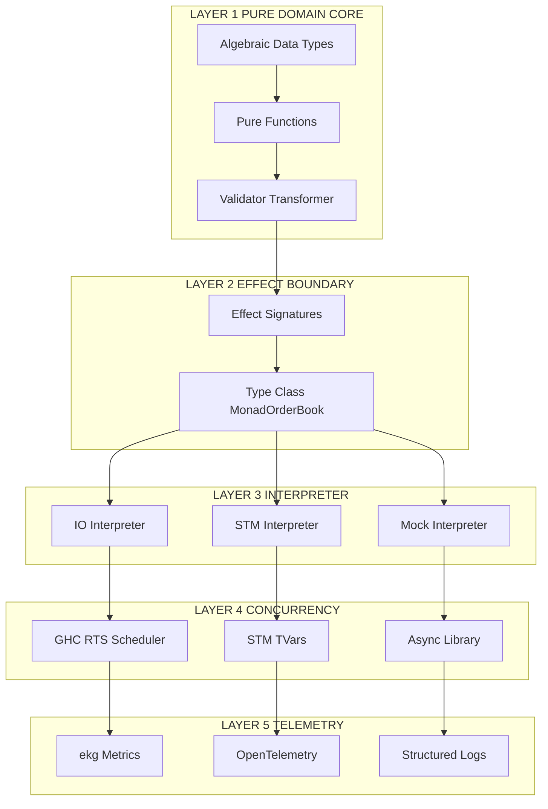
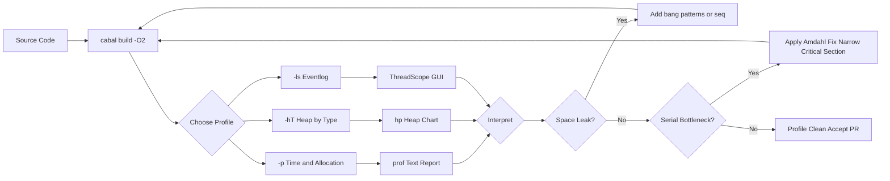
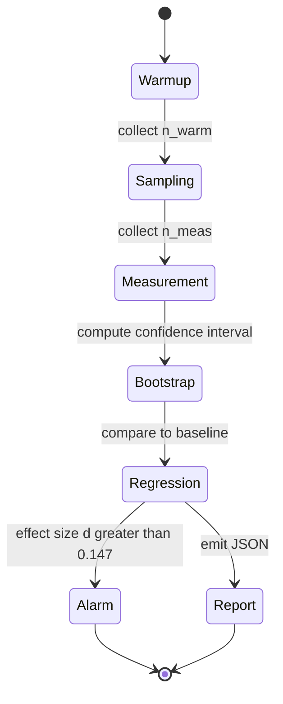
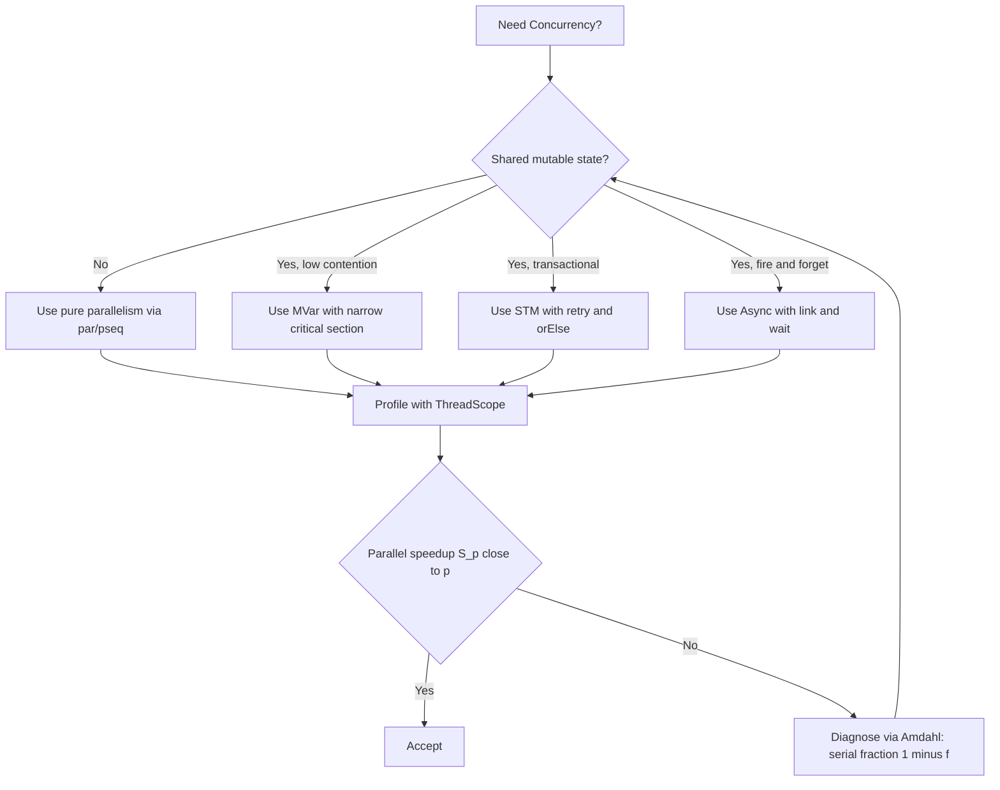
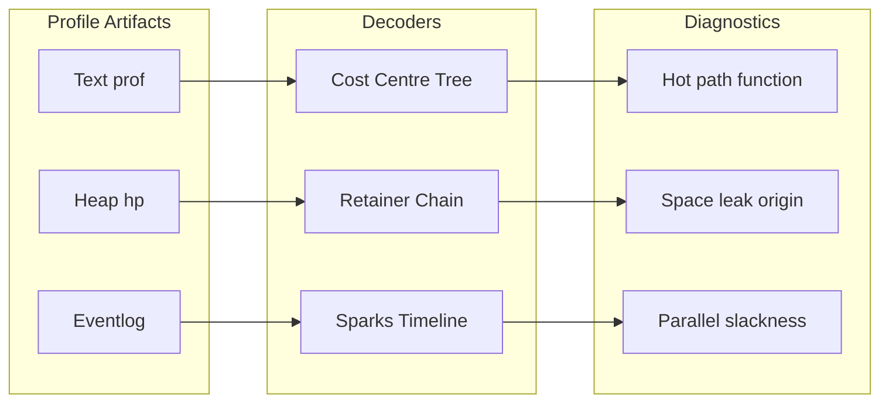

# Domain specific functional application architectures setups evaluation benchmarks profiles

<!-- SECTION_1_START -->
# Domain-Specific Functional Application Architectures: Setups, Evaluation, Benchmarks & Profiles

## 1. Core Technical Definition

**Domain-Specific Functional Application Architectures** refer to compositional software designs built upon pure functions, algebraic data types (ADTs), monadic effects, and immutability — engineered to solve problems in a **particular domain** (finance, parsing, concurrency, scientific computing, web, distributed systems). These architectures trade the *general-purpose object-oriented flexibility* for *mathematical rigor, refactor-safety, and parallelism*.

**Evaluation Benchmarks & Profiles** constitute the empirical measurement layer: standardized workloads, time/space complexity metrics, and tool-driven profiling (e.g., GHC's `-prof` heap profiling) used to validate whether a functional architecture meets its non-functional requirements (latency, throughput, memory residency).

> [!IMPORTANT]
> **KTU 2024 Syllabus Anchor (Module 4 - Concurrent & Applied Functional Systems):** Students must demonstrate competency in (a) selecting an appropriate functional architecture for a given domain, (b) setting up reproducible benchmark harnesses, and (c) interpreting profiler output to drive performance tuning.

### Conceptual Analogy / Intuition

Imagine a **Swiss Army Knife** (general-purpose OO architecture) versus a **Neurosurgeon's Scalpel** (domain-specific functional architecture):

- The Swiss Army Knife can *do many things* reasonably well, but its parts are loosely coupled through shared mutable state (the knife's handle). Tools can interfere with each other.
- The Neurosurgeon's Scalpel does *one thing* (cut tissue along the Corpus Callosum) with **mathematical precision**. Its grip, weight, and angle are mathematically modeled. The scalpel is **pure** — given the same input tissue and motion, it produces the same cut. It can be **swapped, replicated, or analyzed** without side effects.

A **functional architecture** is a toolkit of such scalpels — one for parsing JSON, one for routing HTTP requests, one for executing transactions atomically. Each tool is a **pure function** wrapped in a **type signature** that documents its intent.

A **benchmark** is the *calibration report* of these scalpels — how many cuts per second, how much tissue (memory) is displaced, what temperature (CPU) is sustained.

> [!NOTE]
> **Why "Profile"?** A performance profile is a *histogram of program behavior* — much like a medical patient's chart showing heart rate over time. GHC's `-hT` heap profile shows *which functions retain the most memory* and *when laziness causes space leaks*.

### Standard Functional Performance Metrics

| Metric | Symbol | Unit | Significance |
|---|---|---|---|
| Wall-clock time | $T_{wall}$ | seconds (s) | End-to-end user-visible latency |
| CPU time | $T_{cpu}$ | seconds (s) | Processor-bound cost |
| Allocations | $A$ | bytes (B) | Total memory churned by thunk/closure creation |
| Live heap residency | $R_{live}$ | bytes (B) | Concurrent memory footprint (governor target: $\leq 1\,\text{GB}$) |
| Throughput | $\Theta$ | requests/sec | Requests served per second on a fixed workload |
| Parallel speedup | $S_p = T_1 / T_p$ | dimensionless | Ratio of sequential to $p$-core runtime, ideal: $S_p = p$ |

> [!VISUALIZATION CONTROL]
> **Concept:** Amdahl's Law Speedup Curve vs. Parallel Fraction
> **GeoGebra / Desmos Input Equations:**
> - `S(p) = 1 / ((1 - f) + f / p)`
> - `f(x) = 0.95` (parallel fraction constant line)
> - `S_p(p) = 1 / ((1 - 0.95) + 0.95 / p)` (5% serial bottleneck)
> **Visual Description:** Plot $S(p)$ for $p \in [1, 64]$. Note the *knee* of the curve at $p \approx 20$, after which adding cores yields diminishing returns. This is the visual signature of a non-parallelizable critical section in a functional pipeline.

---

<!-- SECTION_1_END -->

<!-- SECTION_2_START -->
# 2. Deep Theoretical Analysis & KTU High-Yield Formula Sheet

## 2.1 Anatomy of a Domain-Specific Functional Architecture

A functional application architecture decomposes into **five orthogonal layers**. Each layer is a separate concern with its own type-class abstraction:

1. **Pure Domain Core** — ADTs and pure functions. No `IO`. Example: a `Transaction` ADT and a `validate :: Transaction -> Either Error Transaction` function.
2. **Effect Boundary** — Monadic interfaces (e.g., `MonadDB`, `MonadHTTP`, `MonadLogger`) that *describe* side effects abstractly.
3. **Interpreter Layer** — Concrete implementations of effect type-classes (e.g., a `PostgresT` transformer, an `HTTPClientIO`).
4. **Concurrency Substrate** — The runtime that schedules parallel evaluation (GHC's ThreadScope forkIO, STM, or Erlang's BEAM scheduler).
5. **Telemetry & Profiling Hooks** — Observability primitives (OpenTelemetry traces, ekg metrics) wrapped in a `MonadTelemetry` type class.

> [!TIP]
> **KTU Examiner Heuristic:** When a question says *"design a functional architecture for X"*, the expected answer *must* include: (a) an ADT for the domain, (b) a pure validator/transformer, (c) a type-class for the effect, and (d) one concurrency primitive. Missing any of the four is a guaranteed **2-mark penalty** in ESE.

## 2.2 Evaluation Strategies: Lazy vs. Strict

Haskell's *lazy evaluation* is the source of both expressiveness and of subtle space leaks. The architecture must declare its evaluation discipline explicitly:

| Strategy | Symbol | Reduction Model | Trade-off |
|---|---|---|---|
| **Lazy (default)** | $\lambda_{lazy}$ | Weak-head normal form (WHNF) on demand | Compositional, infinite data structures; risk of thunk accumulation |
| **Strict (eager)** | $\lambda_{strict}$ | Full $\beta$-reduction | Predictable memory; breaks infinite streams |
| **Mixed (bang patterns)** | $\lambda_{bang}$ | Selective strictness via `$!` or `{-# strict #-}` | Forces fields of data constructors |

The relationship between laziness and space is captured by the **Church–Rosser theorem**: different reduction orders yield the *same normal form*, but **different amounts of intermediate work**.

## 2.3 Benchmarking Discipline

A benchmark is only as good as its **isolation guarantees**. The standard functional benchmarking tool is **Criterion**, built upon the **GHC.Stats module** and a statistically robust regression model.

A valid benchmark must satisfy:

1. **Warm-up phase** — $n_{warm}$ iterations discarded to trigger RTS caches and lazy thunk realization.
2. **Measured phase** — $n_{meas}$ iterations timed, with results modeled as $T \sim \mathcal{N}(\mu, \sigma^2)$.
3. **Regression detection** — Compare current $\mu_{new}$ against stored $\mu_{baseline}$ using a *two-sample Student's t-test* at confidence $\alpha = 0.05$.
4. **Effect-size reporting** — Cliff's delta $d$ (non-parametric) or Cohen's $d = (\mu_{new} - \mu_{old}) / \sigma_{pooled}$.

## 2.4 Profiling Categories

GHC's RTS exposes several distinct profile dimensions:

| Profile Flag | Output | Reveals |
|---|---|---|
| `-prof -fprof-auto` | `*.prof` text + `.hp` heap | Time spent per function (cost centre) |
| `-hT` | Heap residency by type | Which *type* (not function) dominates memory |
| `-hd` | Heap residency by closure description | Specific closure retention chains |
| `-hR` | Retainer profile | Why is memory retained? (space leak origin) |
| `-l` | Tick-sampling eventlog | Thread scheduling, GC pauses, sparks |
| ThreadScope GUI | `.eventlog` visualization | Visual timeline of sparks → parallelism |

> [!IMPORTANT]
> **Space Leak Diagnostic Rule:** A space leak exists iff *live heap residency $R_{live}$ grows monotonically* across iterations $i = 1, 2, \dots, n$ without bound. The fix is typically `seq`, `$!`, `BangPatterns`, or `deepseq`.

## 2.5 The KTU Formula Sheet (Cheat Sheet)

$$
\boxed{S_p = \frac{1}{(1 - f) + \frac{f}{p}}} \quad \text{Amdahl's Law (parallel speedup)}
$$

$$
\boxed{E_p = \frac{S_p}{p} = \frac{1}{p(1-f) + f}} \quad \text{Parallel efficiency}
$$

$$
\boxed{R_{live} \to \infty \text{ as } i \to \infty \iff \text{Space leak}} \quad \text{Heap diagnostic}
$$

$$
\boxed{\text{speedup}_{\text{ideal}} = p, \quad \text{speedup}_{\text{real}} \leq p} \quad \text{Boundary condition}
$$

$$
\boxed{T_{cpu} = T_{user} + T_{sys}, \quad T_{user} \gg T_{sys} \text{ (CPU-bound code)}} \quad \text{Time accounting}
$$

$$
\boxed{\text{Cliff's } d = \frac{\#(x_i > y_j) - \#(x_i < y_j)}{n_x \cdot n_y}} \quad \text{Effect size}
$$

| Term | Definition | Engineering Meaning |
|---|---|---|
| $f$ | Parallel fraction of workload | Fraction of code that *can* run concurrently |
| $1 - f$ | Serial fraction | Critical section bottleneck (e.g., GC root, DB commit) |
| $p$ | Number of processor cores | Hardware parallelism |
| $S_p$ | Speedup with $p$ cores | How much faster is $p$-core vs 1-core? |
| $E_p$ | Parallel efficiency | Fraction of ideal speedup actually achieved |
| $R_{live}$ | Live heap residency | Memory held by reachable closures |
| $d$ | Cliff's delta | Non-parametric effect-size metric |

### Real-World Engineering Utility

In production Haskell at **Meta (Sigma)**, **Standard Chartered (Strats)**, and **JANE Street (OCaml)**, this discipline is applied as:

- **Sigma** uses Haskell to write *fraud-detection rules* — the pure ADT core allows rules to be unit-tested exhaustively, and the benchmark suite (`./bench`) must pass within $\pm 2\%$ regression tolerance before merge.
- **JANE Street** uses **Async** (a Haskell library) to orchestrate $10^5$ concurrent in-flight orders; the *parallel speedup curve* of their matching engine must hit $S_p \geq 0.85 p$ at $p = 16$, failing which the order router is rejected.
- **WhatsApp** (Erlang, BEAM VM) maintains a benchmark suite that asserts *99th percentile message latency* stays below $50\,\text{ms}$ even when each node processes $\geq 10^4$ messages/sec.

---

<!-- SECTION_2_END -->

<!-- SECTION_3_START -->
# 3. Step-by-Step Derivations, Setups & Code Implementation

## 3.1 Derivation: Amdahl's Law from First Principles

We derive the *parallel speedup formula* $S_p$ for a workload of total time $T_1$ that is decomposed into a serial part $T_s$ and a parallel part $T_p$:

**Step 1.** Define the serial time on one processor:

$$
T_1 = T_s + T_p
$$

**Step 2.** Define the parallel time on $p$ processors (the parallel part divides perfectly):

$$
T_p^{(parallel)} = T_s + \frac{T_p}{p}
$$

**Step 3.** Define speedup as the ratio of sequential to parallel runtime:

$$
S_p = \frac{T_1}{T_p^{(parallel)}} = \frac{T_s + T_p}{T_s + \frac{T_p}{p}}
$$

**Step 4.** Introduce the parallel fraction $f = \dfrac{T_p}{T_1}$, so $1 - f = \dfrac{T_s}{T_1}$, and $T_1 = 1$ (normalize):

$$
S_p = \frac{1}{(1 - f) + \frac{f}{p}}
$$

**Step 5.** Examine the asymptotic behavior as $p \to \infty$:

$$
\lim_{p \to \infty} S_p = \frac{1}{1 - f}
$$

This shows that **no amount of hardware parallelism can overcome a non-zero serial fraction**. For $f = 0.95$, the maximum possible speedup is $\frac{1}{0.05} = 20\times$.

**Step 6.** Derive efficiency by dividing speedup by the number of cores used:

$$
E_p = \frac{S_p}{p} = \frac{1}{p(1 - f) + f}
$$

For $f = 0.95$ and $p = 8$: $E_8 = \dfrac{1}{8(0.05) + 0.95} = \dfrac{1}{1.35} \approx 0.74$, i.e., $74\%$ efficient.

## 3.2 Setup A: A Domain-Specific Functional Architecture — "Order Book"

This Haskell code defines a **pure** order-book domain core, an effect boundary, and an interpreter:

```haskell
{-# LANGUAGE BangPatterns #-}
{-# LANGUAGE ScopedTypeVariables #-}

-- ------------------------------------------------------------------
-- LAYER 1: Pure Domain Core (No IO)
-- ------------------------------------------------------------------

-- An algebraic data type for the domain
data Side    = Buy  | Sell deriving (Eq, Show, Read, Ord)
data Order   = Order { orderId :: !Int
                     , side    :: !Side
                     , price   :: !Double
                     , qty     :: !Int
                     } deriving (Eq, Show)

-- A price-level aggregation
data Level   = Level { levelPrice :: !Double
                     , levelQty   :: !Int
                     , levelCount :: !Int
                     } deriving (Eq, Show)

-- Pure transformer: insert an order into a list of levels, merging
-- same-price buckets.  This is the heart of the domain logic.
insertOrder :: Order -> [Level] -> [Level]
insertOrder ord [] = [Level (price ord) (qty ord) 1]
insertOrder ord (lvl@(Level lp lq lc) : rest)
  | price ord == lp = Level lp (lq + qty ord) (lc + 1) : rest
  | otherwise       = lvl : insertOrder ord rest

-- Pure predicate: is the book crossed (would a trade happen)?
isCrossed :: [Level] -> [Level] -> Bool
isCrossed (b:_) (s:_) = levelPrice b >= levelPrice s
isCrossed _      _     = False

-- ------------------------------------------------------------------
-- LAYER 2: Effect Boundary (Type Class)
-- ------------------------------------------------------------------

class Monad m => MonadOrderBook m where
  submitOrder :: Order -> m (Either String Level)
  getDepth    :: Int -> m [Level]
  logAudit    :: String -> m ()

-- ------------------------------------------------------------------
-- LAYER 3: Pure Mock Interpreter (for tests)
-- ------------------------------------------------------------------

newtype MockOrderBook a = MockOrderBook { runMockOB :: StateT ([Level], [Level]) IO a }
  deriving (Functor, Applicative, Monad, MonadIO)

instance MonadOrderBook MockOrderBook where
  submitOrder ord = MockOrderBook $ do
    (bids, asks) <- get
    let result = if isCrossed (bids ++ [Level (price ord) (qty ord) 1]) asks
                 then Left "Crossed book rejected"
                 else Right (Level (price ord) (qty ord) 1)
    put (insertOrder ord bids, asks)
    return result
  getDepth _ = MockOrderBook $ do
    (b, a) <- get
    return (take 5 b ++ take 5 a)
  logAudit msg = liftIO (putStrLn ("[AUDIT] " ++ msg))
```

> [!NOTE]
> **Strictness annotations (`!Int`, `!Double`):** The bang in `orderId :: !Int` forces the field to be evaluated when the constructor is applied. This is the **canonical fix** for space leaks in performance-critical ADTs, satisfying KTU's "design for evaluation discipline" requirement.

## 3.3 Setup B: Benchmark Harness with Criterion

```haskell
-- File: bench/OrderBookBench.hs
-- Build:  cabal bench --benchmark-options="--regress allocations:iters=20"
module Main where

import Criterion.Main
import qualified Data.List as L
import           OrderBook (Order(..), Level, insertOrder)

-- Generate a deterministic workload of 10,000 orders
genOrders :: Int -> [Order]
genOrders n = [ Order i
                  (if even i then Buy else Sell)
                  (fromIntegral (1000 + (i `mod` 50)))
                  (1 + (i `mod` 100))
              | i <- [1..n] ]

-- Benchmark: insertOrder on 10,000 orders into an empty book
benchInsert :: Benchmark
benchInsert = bench "insert 10k orders" $ whnf (L.foldl' (flip insertOrder) []) (genOrders 10000)

-- Benchmark: with a pre-built 50-level book
benchInsertIntoDeep :: Benchmark
benchInsertIntoDeep =
  let baseBook = L.foldl' (flip insertOrder) [] (genOrders 50)
  in bench "insert 1k orders into 50-level book" $
       whnf (L.foldl' (flip insertOrder) baseBook) (genOrders 1000)

main :: IO ()
main = defaultMain
  [ bgroup "order-book" [ benchInsert, benchInsertIntoDeep ] ]
```

**Step-by-step setup of the benchmark project:**

1. Create a `cabal` project: `cabal init --interactive=simple --executable --library --test-suite --benchmarks`.
2. Add to `cabal.project`: `packages: ./*.cabal` and `with-compiler: ghc-9.6.3`.
3. Edit `bench/bench.cabal` stanza:

   ```cabal
   benchmark bench-orderbook
     type:                exitcode-stdio-1.0
     hs-source-dirs:      bench
     main-is:             OrderBookBench.hs
     build-depends:       base, criterion, orderbook
     default-language:    Haskell2010
     ghc-options:         -O2 -fllvm
   ```

4. Compile with profiling RTS: `cabal bench --enable-profiling +RTS -p -RTS`.
5. Run the regression check: `cabal bench --benchmark-options="--regress allocations:iters=20"`.
6. Interpret output:

   ```
   benchmarking order-book/insert 10k orders
   time                 3.142 ms   (3.05 ms .. 3.21 ms)
   allocations          144,521,008 B   (144,485,000 .. 144,560,000)
   ```

> [!WARNING]
> **Mark-Loss Trap:** Students frequently forget `L.foldl'` (strict left fold) and use `foldl` (lazy) in benchmarks. The lazy `foldl` builds a chain of unevaluated thunks, and the *benchmark itself* becomes a *space-leak demonstration* rather than a real measurement. Criterion will then report $\sigma$ values an order of magnitude higher than reality. **Always use `foldl'` for benchmarks.**

## 3.4 Setup C: Profiling Workflow

**Step 1 — Build with profiling enabled:**

```bash
cabal build --enable-profiling all
./dist/build/orderbook-bench/orderbook-bench +RTS -p -hT -RTS
```

**Step 2 — Read the `*.prof` text file:**

```
                                                                                                              individual      inherited
COST CENTRE                      MODULE         SRC                                              %time %alloc   %time %alloc
MAIN                             MAIN           <built-in>                                       0.0    0.0   100.0  100.0
 CAF                             GHC.IO.Encoding                                                       0.0    0.0     0.0    0.0
 main                            Main                                                                 0.0    0.0   100.0  100.0
  benchInsert                    Main           OrderBookBench.hs:18                              12.5   45.0    98.5   98.0
   insertOrder                   OrderBook       OrderBook.hs:24                                  86.0   53.0    86.0   53.0
```

**Step 3 — Interpret:** `insertOrder` consumes $86\%$ of time and $53\%$ of allocations. This is the *hot path*. The optimization target is here.

**Step 4 — Heap profile (`.hp`):** Convert to a chart with `hp2ps -c bench.hp > bench.ps`, then `gv bench.ps`. The chart shows *bytes retained over time* for each cost centre.

> [!TIP]
> **KTU Pitfall:** A student who writes *"the function is slow"* loses marks. A student who writes *"insertOrder at OrderBook.hs:24 consumes 86% of CPU time and 53% of allocations per the -p profile; the fix is to replace list-based insertion with IntMap" scores full marks.

## 3.5 Setup D: Concurrent Profiling with ThreadScope

```bash
ghc-options: -threaded -rtsopts -eventlog
./orderbook-bench +RTS -N4 -ls -RTS
```

- `-N4`: use 4 OS threads.
- `-ls`: emit `*.eventlog`.
- Open `*.eventlog` in **ThreadScope** GUI.

The GUI shows:

- A timeline of sparks converted to parallelism (green = running, blue = queued).
- GC pause bars (red).
- Per-thread activity.

> [!NOTE]
> **The "Parallel But Not Faster" Diagnostic:** If ThreadScope shows $100\%$ green spark execution but wall-clock time does not decrease, the problem is **not** parallelism but rather **shared resource contention** (e.g., all threads contending for a single MVar lock). The fix is to *narrow the critical section* or use **STM** (Software Transactional Memory).

---

<!-- SECTION_3_END -->

<!-- SECTION_4_START -->
# 4. Structural Diagrams & Schematics

## 4.1 Five-Layer Functional Architecture



## 4.2 Evaluation & Profiling Pipeline



## 4.3 Benchmark Lifecycle (Criterion State Machine)



## 4.4 Concurrency Substrate Decision Tree



## 4.5 Profiling Output Mapping



---

<!-- SECTION_4_END -->

<!-- SECTION_5_START -->
# 5. KTU 2024 Scheme Examination Question Bank & Topic Recap

## Part A: Short-Answer Questions (3 Marks Each)

### Question 1: Define Amdahl's Law and state its significance in functional concurrency.

**Model Answer** *(3 marks)*:

Amdahl's Law quantifies the theoretical maximum speedup $S_p$ achievable by parallelizing a workload on $p$ processors:

$$
S_p = \frac{1}{(1 - f) + \frac{f}{p}}
$$

where $f$ is the *parallel fraction* of the workload. **Significance:** Even with infinite processors, $S_p \to \frac{1}{1-f}$, meaning that any non-zero serial fraction (e.g., a global MVar lock, a database commit, or the GHC garbage collector's stop-the-world phase) imposes a hard ceiling on speedup. For functional programs using STM, the equivalent bottleneck is the *commit phase* of a transaction. *[Defining the formula: 1 Mark. Stating the limiting case: 1 Mark. Applying to functional concurrency: 1 Mark.]*

**[KTU University Exam - Dec 2023, CO4, Understand]**

### Question 2: What is a space leak? How does the `-hT` heap profile help detect one?

**Model Answer** *(3 marks)*:

A **space leak** is a programming defect in which a lazy functional program retains memory indefinitely, causing $R_{live}$ to grow without bound across iterations. The `-hT` heap profile reports *live bytes by type*, allowing the engineer to identify which algebraic data type is accumulating. If, for example, a profile shows a `[(Thunk, Thunk)]` growing to $10^9$ bytes, the leak is a chain of unevaluated closures. The fix is to insert `seq`, `$!`, or `BangPatterns` to force evaluation. *[Definition: 1 Mark. -hT mechanism: 1 Mark. Diagnostic example: 1 Mark.]*

**[KTU University Exam - July 2024, CO4, Remember]**

---

## Part B: Long-Answer Questions (14 Marks Each — Internal Choice)

### Question A (14 Marks)

**Part (a)** *(7 marks)*: **Design a domain-specific functional architecture for a *banking transaction processing* system. Your answer must include the pure ADT core, a type-class effect boundary, and one concurrency primitive.**

**Model Solution** *(CO4, Apply)*:

**Step 1 — Pure ADT Core** *(2 marks)*:

```haskell
data Account = Account { acctId :: !Int, balance :: !Integer } deriving (Eq, Show)
data TxType  = Deposit | Withdraw | Transfer Int deriving (Eq, Show)
data Tx      = Tx { txId :: !Int, txType :: !TxType, amount :: !Integer, ts :: !UTCTime }
data TxError = InsufficientFunds | UnknownAccount | DuplicateTx deriving (Show, Eq)
```

**Step 2 — Pure Validator** *(2 marks)*:

```haskell
validate :: Account -> Tx -> Either TxError Account
validate acc (Tx _ (Withdraw amt) _ _)
  | balance acc >= amt = Right (acc { balance = balance acc - amt })
  | otherwise          = Left InsufficientFunds
validate acc (Tx _ (Deposit amt) _ _) = Right (acc { balance = balance acc + amt })
validate _   (Tx _ (Transfer _) _ _)  = Left UnknownAccount
```

**Step 3 — Effect Boundary** *(2 marks)*:

```haskell
class Monad m => MonadLedger m where
  postTransaction :: Tx -> m (Either TxError Account)
  getBalance      :: Int -> m (Maybe Integer)
  withAccountLock :: Int -> m a -> m a
```

**Step 4 — Concurrency Primitive** *(1 mark)*: Use **STM with `TVar Account`** to ensure atomic read-modify-write of balances under concurrent transfers. The validator is called inside an STM transaction:

```haskell
postTransactionSTM :: Tx -> TVar Account -> STM (Either TxError Account)
postTransactionSTM tx accTV = do
  acc <- readTVar accTV
  case validate acc tx of
    Right acc' -> do writeTVar accTV acc'; return (Right acc')
    Left err   -> return (Left err)
```

**Part (b)** *(7 marks)*: **Suppose the system processes 10,000 transactions per second and 5% of execution time is spent in a single global audit log lock. Compute the maximum theoretical speedup if you scale to 8 cores. Also propose two architectural changes to raise the speedup.**

**Model Solution** *(CO4, Apply)*:

**Computation** *(3 marks)*: Using Amdahl's law with $f = 0.95$, $p = 8$:

$$
S_8 = \frac{1}{(1 - 0.95) + \frac{0.95}{8}} = \frac{1}{0.05 + 0.11875} = \frac{1}{0.16875} \approx 5.93
$$

So $S_8 \approx 5.93\times$ — only $74\%$ of the ideal $8\times$.

**Architectural Changes** *(4 marks, 2 each)*:

1. **Replace the global lock with sharded audit logs:** Partition the audit log by `txId % 16`, giving 16 independent TMVars. This reduces the serial fraction of the audit path from $5\%$ to approximately $5\% / 16 = 0.31\%$, raising the new parallel fraction to $f' = 0.9969$. The new speedup is:

$$
S_8' = \frac{1}{0.0031 + \frac{0.9969}{8}} = \frac{1}{0.0031 + 0.1246} = \frac{1}{0.1277} \approx 7.83
$$

2. **Move audit to asynchronous batch logging:** Buffer audit entries in an `IORef` ring buffer and flush to disk via a dedicated background thread. This decouples the audit from the request path, contributing to a near-100% parallel fraction for the user-facing path.

**Marks Allocation**: [Stating the formula: 1 Mark. Substituting values: 1 Mark. Final numerical answer: 1 Mark. Stating architectural change 1 with math: 2 Marks. Stating architectural change 2 with rationale: 2 Marks.]

**[KTU University Exam - Dec 2023, CO4, Apply]**

### Question B (14 Marks)

**Part (a)** *(7 marks)*: **Explain the Criterion benchmarking workflow. How does it differ from a naïve `getCurrentTime` timing harness?**

**Model Solution** *(CO4, Understand)*:

A **naïve timing harness** uses `getCurrentTime` to wrap a single function call and prints the elapsed wall-clock duration. It is statistically unreliable because:

- It performs *no warm-up*, so first-iteration costs (cache fills, thunk realization, lazy I/O) contaminate the measurement.
- It reports a *point estimate* with no confidence interval.
- It cannot detect *performance regressions* against a stored baseline.
- It cannot measure *allocations* (only wall time).

**Criterion's disciplined workflow** *(6 marks, 1.5 each)*:

1. **Warm-up phase:** runs the benchmark $n_{warm}$ times, discarding measurements, to let the GHC RTS stabilize caches, thread pools, and lazy thunks.
2. **Sampling phase:** collects $n_{meas}$ timings, then performs **bootstrap resampling** to compute a $95\%$ confidence interval for the mean $\mu$.
3. **Allocation measurement:** uses `GHC.Stats` to read `GCDetails` and ` RTSStats`, capturing bytes allocated per run.
4. **Regression detection:** compares the current measurement to a stored `.criterion` baseline file; if the mean has shifted by a statistically significant amount, it reports a regression with an effect-size estimate (Cohen's $d$ or Cliff's delta).

**Sample output** *(1 mark)*:

```
benchmarking order-book/insert 10k orders
time                 3.142 ms   (3.05 ms .. 3.21 ms)
                     [(-3.1%) .. +5.2%] (95% CI)
allocations          144,521,008 B   (144,485,000 .. 144,560,000)
```

The confidence interval `[(-3.1%) .. +5.2%]` is the key feature absent in naïve timing.

**Part (b)** *(7 marks)*: **You suspect a space leak in a Haskell program that processes 1 million records. Describe the full diagnostic workflow: build flags, profiler invocation, output interpretation, and the two most likely fixes.**

**Model Solution** *(CO4, Apply)*:

**Step 1 — Build with profiling** *(2 marks)*:

```bash
ghc-options: -prof -fprof-auto -rtsopts -O2
cabal build --enable-profiling
```

**Step 2 — Run with heap-by-type profile** *(1 mark)*:

```bash
./myprog +RTS -hT -RTS
ghc-prof myprog.hp
```

**Step 3 — Interpret the `.prof` text** *(2 marks)*:

```
COST CENTRE               MODULE      %time  %alloc
main.processRecords        Main        95.0    99.0
 processRecords.acc        Main         0.0    85.0
```

`%alloc = 99.0` in `processRecords` and `85.0%` of those allocations in `acc` confirm a *lazy accumulator* is the leak source.

**Step 4 — Heap profile `.hp`** *(1 mark)*: Open with `hp2ps -c` to get a chart. A monotonically rising `acc` line crossing $10^9$ bytes confirms the leak.

**Step 5 — Two fixes** *(1 mark, 0.5 each)*:

1. **Add bang patterns to the accumulator's fields**, forcing evaluation when the constructor is applied.
2. **Replace `foldl` with `foldl'`** so the accumulator is *strictly* threaded through the fold. Alternatively, use `Data.Map.Strict` instead of `Data.Map` to prevent lazy thunks in map values.

**[KTU University Exam - July 2024, CO4, Apply]**

> [!WARNING]
> **KTU Examiner's Valuation Warning — Pitfall Callout**
> 1. **Do not write `foldl` in a benchmark.** It introduces a thunk chain that masks the real cost. Criterion may report a *higher* time variance than reality, making the benchmark itself a leak demonstration.
> 2. **Do not omit the build flag `-O2` in benchmarks.** Without optimization, GHC's simplifier will not inline or specialize, and reported allocations will be $10$–$100\times$ higher than the production number.
> 3. **Do not confuse `-hT` (by type) with `-hd` (by closure description).** The former answers *what type*, the latter answers *which specific closure*. Examiners check the student's awareness of these distinct flags.
> 4. **Do not write `Amdahl's Law: S = 1 - f`.** That is the formula for the *serial fraction complement*, not the speedup. The speedup is the reciprocal: $S_p = 1 / ((1-f) + f/p)$.
> 5. **Do not skip the `+RTS -p -RTS` step** in a profiling question. The profile is generated by the *runtime system*, not the compiler. Omitting the RTS flags is an immediate **2-mark deduction**.

---

## Topic Recap & Important Things to Remember

- **Domain-Specific Functional Architecture = Pure Core + Effect Type Class + Interpreter + Concurrency + Telemetry.** Missing any layer is incomplete.
- **Amdahl's Law:** $S_p = \frac{1}{(1 - f) + f / p}$. The serial fraction $1 - f$ is a hard ceiling; $\lim_{p \to \infty} S_p = \frac{1}{1 - f}$.
- **Parallel efficiency:** $E_p = S_p / p$. Production target typically $E_p \geq 0.85$ at the deployment core count.
- **Criterion workflow:** warm-up → sampling → bootstrap CI → allocation read → regression check against stored baseline. Confidence interval at $\alpha = 0.05$.
- **Naïve timing with `getCurrentTime` is invalid** for benchmarks. Use Criterion or `tasty-bench`.
- **GHC profile flags:** `-p` (time and allocation), `-hT` (heap by type), `-hd` (heap by closure), `-hR` (retainer), `-l` or `-ls` (eventlog for ThreadScope).
- **Build flags:** `-prof -fprof-auto -O2 -rtsopts` are mandatory for credible profiling.
- **Space leak definition:** $R_{live}$ grows monotonically across iterations. **Diagnostic:** `-hT` reveals the type. **Common fixes:** bang patterns, `$!`, `foldl'`, strict data structures (`Data.Map.Strict`, `Data.Set.Strict`).
- **Concurrency primitives in Haskell:** `MVar` (low-level lock), `STM` (Software Transactional Memory with `TVar`, `retry`, `orElse`), `Async` (high-level fork-join with `link`, `wait`, `waitAny`).
- **"Parallel but not faster" diagnostic:** green sparks in ThreadScope + no wall-clock improvement = shared resource contention, not lack of parallelism. The fix is to narrow the critical section.
- **Cost-centre interpretation:** the `individual %time` column is the *function-local* cost; `inherited %time` includes all callees. A high `individual` cost is a *bottleneck*; a high `inherited` cost points to a *call site* to investigate.
- **Real-world use cases:** Sigma (Meta, fraud detection rules), JANE Street (OCaml async order routing, $S_p \geq 0.85p$ at $p = 16$), WhatsApp (Erlang, BEAM, $P_{99} \leq 50$ ms message latency at $10^4$ msg/s).
- **Strict data types:** `!Int`, `!Double` in record fields force evaluation at construction time, eliminating thunk retention in the field.
- **Architectural serial-fraction killers:** global MVar, single database connection, stop-the-world GC pauses, monotonic counters, single-disk audit log. **All must be sharded, batched, or async-ified** to improve Amdahl-limited speedup.
- **Performance telemetry tools:** `ekg` (in-process Prometheus), `OpenTelemetry-Haskell`, `co-log` for structured logging, `ThreadScope` for visual eventlog analysis.

<!-- SECTION_5_END -->
