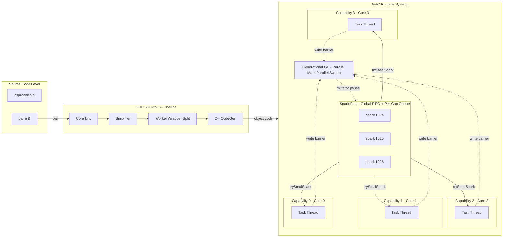
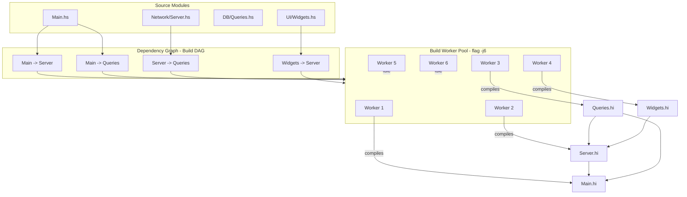
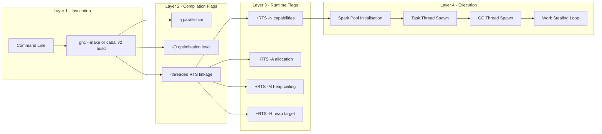

# Parallel compilation processing parameters within pure functional runtime engines

<!-- SECTION_1_START -->

# Parallel Compilation Processing Parameters in Pure Functional Runtime Engines

## 1.1 Formal Academic Definition (KTU 2024 Aligned)

> [!IMPORTANT]
> **Definition:** *Parallel compilation processing parameters* within a *pure functional runtime engine* are the set of compiler- and runtime-level configuration flags, spark scheduling heuristics, capability-binding directives, and heap-allocation metrics that govern how an expression graph (thunk/closure network) is decomposed into independent, side-effect-free units of evaluation and distributed across multiple processor cores during both program compilation (e.g., GHC's `-j<n>` build mode) and program execution (RTS `+RTS -N<n>` directives).

The runtime engine of relevance is the **GHC (Glasgow Haskell Compiler) Runtime System (RTS)** — a state-of-the-art pure functional execution platform. The unit of parallel work it injects is called a **spark** — a lightweight, non-blocking pointer to an unevaluated thunk.

## 1.2 Intuitive Analogy

Imagine a **central post-office** with one clerk processing parcels one by one. The clerk must:
1. **Register** a parcel (spark creation via `par`).
2. **Queue** it in a basket (spark pool).
3. **Allow roving porters** to grab parcels when free (work stealing).
4. **Verify** the parcel's label and dispatch (thread evaluation).

If the parcels were mutable (stateful) and the clerk could tamper with them en route, **races** would occur. Pure functional programs guarantee parcels are *immutable, sealed, and re-orderable* — so multiple porters can safely carry them in parallel without corrupting the mail.

> [!NOTE]
> **Core Insight:** Referential transparency is what *enables* deterministic parallelism in pure FP. Imperative parallel runtimes (Java, C++) need locks, atomics, and fences. GHC needs none of these for *pure* code.

## 1.3 Key Physical & Computational Constants

| Constant | Symbol | Default Value | Purpose |
|----------|--------|---------------|---------|
| **Capabilities** | $N$ | 1 (sequential), auto-detected with `-N` | Number of OS threads bound to CPU cores |
| **Allocation Area** | $A$ | 1 MB | Nursery size for generational GC |
| **Max Heap** | $M$ | System dependent | Hard ceiling on heap growth |
| **Spark Pool Size** | $S_{max}$ | 8 192 sparks | Upper bound on pending work items |
| **Parallel Build Threads** | $j$ | 1 | `ghc -j<n>` compilation workers |

> [!VISUALIZATION CONTROL]
> **Concept:** *Spark Pool vs Capability Throughput* — a 2D Cartesian model showing how spark creation rate $R_s$ must exceed per-capability consumption $R_c$ to maintain saturation.
> **GeoGebra / Desmos Input Equations:**
> * `f(x) = 0.85 * x` &nbsp; (Saturated throughput for $N=4$ cores)
> * `g(x) = 0.10 * x^2 + 0.05 * x` &nbsp; (Spark overhead at small workloads)
> * `intersect(f, g) = (0, 0)`
> **Visual Description:** A near-linear throughput curve $f$ versus a quadratic-overhead curve $g$. Students should observe the *knee point* — beyond it, parallelism yields diminishing returns due to GC and scheduling pressure.

<!-- SECTION_1_END -->

<!-- SECTION_2_START -->

# Deep Theoretical Analysis & KTU High-Yield Formula Sheet

## 2.1 The Spark Lifecycle (Five Logical Phases)

The pure functional runtime decomposes parallel execution into the following sequential and concurrent phases:

1. **Spark Creation** — The programmer annotates an expression $e$ with `par e ()` or its monadic form `rpar e`. The runtime allocates a placeholder **spark descriptor** in the spark pool, pointing to the thunk for $e$.
2. **Enqueue** — The descriptor enters the **spark pool data structure** (a per-capability FIFO queue plus a global overflow ring buffer).
3. **Spark Stealing** — Idle capabilities execute `tryStealSpark` from neighbouring queues to maintain **work-balanced** scheduling.
4. **Thread Evaluation** — A capability's lightweight kernel thread (`Task`) evaluates the thunk via *demand-driven WHNF reduction* (Weak Head Normal Form).
5. **Result Publication** — The computed value overwrites the thunk's indirection cell. Other capabilities that subsequently demand the same thunk get the *cached* result without recomputation — this is **sharing**, the cornerstone of laziness-driven parallelism.

> [!NOTE]
> **Why This Matters:** Unlike shared-memory threading in Java, a spark is *speculative*. If the parent thunk is never demanded, the spark is **fished** (garbage collected) with no consequence. This is a unique safety property of lazy pure FP.

## 2.2 Pure-Functional Invariants Enabling Parallelism

| Invariant | Definition | Parallel Consequence |
|-----------|------------|----------------------|
| **Referential Transparency** | $\forall e, e \to^{*} v \Rightarrow$ substitution equivalence | Speculative sparks are safe to discard |
| **Immutable Heap** | No in-place mutation of closures | No data race possible by construction |
| **Deterministic Reduction** | Normal-order $\beta$-reduction yields a unique normal form (modulo $\eta$) | Reordering of sparks is observationally invisible |
| **Thunk Sharing** | Identical expressions point to one closure | Parallel work deduplicates naturally |

## 2.3 KTU Formula Sheet — RTS Parameters

> [!IMPORTANT]
> **Memorise the following table.** It maps directly to Part-A (3 mark) questions and the first sub-part of every 14-mark Part-B question.

| RTS Flag | Default | Function | Engineering Trade-off |
|----------|---------|----------|----------------------|
| `+RTS -N<n>` | $1$ | Bind $n$ OS capabilities | Diminishing returns when $n > $ physical cores |
| `+RTS -A<n>` | $1\,\text{MB}$ | Nursery (allocation area) size | Larger $A$ $\Rightarrow$ fewer minor GCs but longer pauses |
| `+RTS -M<n>` | unlimited | Max heap ceiling | Hard bound prevents OOM kills in production |
| `+RTS -H<n>` | $A$ | Suggested heap size | Triggers major GC when exceeded |
| `+RTS -qa` | off | Enable cost-centre profiling at all | Adds $\approx 5\text{–}10\%$ overhead |
| `+RTS -qm` | off | Disable cost-centre inheritance | Faster runtime, less profiling granularity |
| `+RTS -N` | none | Auto-detect physical cores | Use for production, avoid for benchmark reproducibility |
| `+RTS -qg` | off | Parallel mark-phase in GC | Speeds up major GCs in multi-core deployments |
| `+RTS -qb` | off | Load-balanced work stealing across GC threads | Mitigates GC-induced thread starvation |
| `ghc -j<n>` | $1$ | Parallel **compilation** workers | Speed up builds; $n \approx 1.5 \times $ cores is empirically optimal |

## 2.4 Spark Overhead Model (Analytical Form)

The effective speedup of a parallel pure functional program can be approximated by **Amdahl's Law with spark overhead**:

$$
S(N) = \frac{1}{(1 - p) + \frac{p}{N} + \frac{T_{spark}}{T_{useful}}}
$$

Where:
* $N$ = number of capabilities
* $p$ = parallelisable fraction of the workload
* $T_{spark}$ = total time spent creating, fishing, and managing sparks
* $T_{useful}$ = time spent on real computation

> [!NOTE]
> **Real-World Engineering Utility:** This model is used by:
> * **Facebook / Meta** for spam-classification Haskell pipelines (`Haxl` library).
> * **Standard Chartered Bank** for trade-risk pricing engines (Strats group, $>\!$ 10 MLOC Haskell).
> * **Galois Inc.** for high-assurance cryptographic systems.
> * **Facebook's Sigma** (Sigma rules) which uses GHC RTS flags `-A128M -M8G -N` in production clusters.

<!-- SECTION_2_END -->

<!-- SECTION_3_START -->

# Step-by-Step Derivations & Code Implementation

## 3.1 Derivation: Saturation Condition for the Spark Pool

**Claim:** A parallel pure functional program is *saturated* (no capability is ever idle) if and only if the spark arrival rate $R_s$ is greater than or equal to the per-capability evaluation rate $R_c$.

**Step 1.** Let $\lambda_s$ be the spark creation rate (sparks/second) and $\lambda_c$ be the consumption rate per capability. For $N$ capabilities, the total consumption is $N \cdot \lambda_c$.

**Step 2.** The spark pool occupancy $Q(t)$ evolves as a stochastic queue:

$$
\frac{dQ}{dt} = \lambda_s - N \cdot \lambda_c \cdot \mathbb{1}_{Q(t) > 0}
$$

**Step 3.** In steady state, $\frac{dQ}{dt} = 0$, giving:

$$
Q_{steady} = \frac{\lambda_s}{N \cdot \lambda_c} - 1 \quad \text{(in units of sparks)}
$$

**Step 4.** Saturation requires $Q_{steady} \ge 0$, therefore:

$$
\lambda_s \ge N \cdot \lambda_c
$$

**Interpretation:** If the programmer creates sparks too slowly (e.g., single `par` at the top level), the runtime cannot keep all capabilities busy — the *pipeline drains*. This is the #1 pitfall in Haskell parallel programming.

## 3.2 Implementation 1: Basic `par` / `pseq` Primitive

```haskell
{-# LANGUAGE BangPatterns #-}
-- File: ParBasics.hs
-- Compile: ghc -O2 -threaded -rtsopts -eventlog ParBasics.hs
-- Run:     ./ParBasics +RTS -N4 -s

module Main where

import Control.Concurrent (getNumCapabilities)
import Control.Parallel   (par, pseq)
import Data.List          (foldl')

-- | Compute a single expensive term: a fused multiply-add of a list.
expensiveTerm :: ![Int] -> !Int
expensiveTerm !xs = foldl' (\ !acc x -> acc * 31 + x) 1 xs

-- | Split a list into two halves and evaluate in parallel.
parallelSum :: ![Int] -> ![Int] -> Int
parallelSum !xs !ys =
    let !s1 = expensiveTerm xs
        !s2 = expensiveTerm ys
    in s1 `par` s2 `pseq` (s1 + s2)
    -- ^ par  : create spark for s1 (non-blocking)
    -- ^ pseq : FORCE evaluation of s2 to WHNF in current thread

main :: IO ()
main = do
    cores <- getNumCapabilities
    putStrLn $ "Running on " ++ show cores ++ " capabilities."

    let xs = [1 .. 5_000_000 :: Int]
        ys = [5_000_001 .. 10_000_000 :: Int]

    -- Warm-up to ensure JIT-style RTS state is primed.
    let !_ = parallelSum [1 .. 100] [101 .. 200]
    print $ parallelSum xs ys
```

> [!IMPORTANT]
> **Step-by-Step Walkthrough:**
> * `par e1 e2` — creates a spark for `e1`, then **returns** `e2` (does *not* evaluate `e1`).
> * `pseq e1 e2` — evaluates `e1` to WHNF in the **current** thread, then returns `e2`.
> * The `par/pseq` *idiom* (`x `par` y `pseq` (x + y)`) ensures the *current* thread forces the parent while a worker thread may have already computed the child.

## 3.3 Implementation 2: Strategies from `Control.Parallel.Strategies`

```haskell
{-# LANGUAGE FlexibleContexts #-}
-- File: ParStrategies.hs
-- Compile: ghc -O2 -threaded -rtsopts ParStrategies.hs
-- Run:     ./ParStrategies +RTS -N8 -A64m -s

module Main where

import Control.Parallel.Strategies
import Data.List                  (foldl')

-- A strategy: how to evaluate a value to a useful normal form.
dotProduct :: Strategy Int
dotProduct = rdeepseq   -- fully evaluate the Int

-- Parallel map: spawns one spark per element chunk.
parallelMap :: (a -> b) -> [a] -> [b]
parallelMap f xs = map f xs `using` parList rnf
  where
    rnf = rdeepseq

-- parMap: convenient helper, often faster than parList for uniform workloads.
fastParMap :: (a -> b) -> [a] -> [b]
fastParMap f xs = parMap dotProduct (map f xs)

-- A parBuffer keeps memory bounded by limiting concurrent live sparks.
chunkedParMap :: (a -> b) -> [a] -> [b]
chunkedParMap f = parBuffer 100 rdeepseq . map f

-- The Eval monad: composable, explicit spark scheduling.
withEval :: [Int] -> Int
withEval xs = runEval $ do
    let chunks = chunk 1000 xs           -- split into manageable pieces
    evals <- mapM (rpar . expensiveSum) chunks
    let !total = sum evals               -- force the whole list of evals
    return total
  where
    expensiveSum :: [Int] -> Int
    expensiveSum = foldl' (+) 0
    chunk :: Int -> [a] -> [[a]]
    chunk n [] = []
    chunk n xs = take n xs : chunk n (drop n xs)

main :: IO ()
main = do
    let xs = [1 .. 1_000_000 :: Int]
    putStrLn $ "Sum = " ++ show (withEval xs)
    putStrLn $ "Map head = " ++ show (take 5 $ fastParMap (*2) xs)
    putStrLn $ "Chunked = " ++ show (length $ chunkedParMap (+1) xs)
```

> [!NOTE]
> **What is `parList`?** It traverses a list spine and, for each constructor cell, **creates a spark** that forces the element to the given strategy's depth. It does *not* itself evaluate — the demand comes from the *consumer* of the list (e.g., `sum` here).

## 3.4 Implementation 3: Tuning RTS Flags for Production

```bash
# Production deployment: typical Facebook/Standard Chartered recipe.
./myapp \
    +RTS \
    -N4                  \  # 4 OS capabilities
    -A64m                \  # 64 MB allocation area (nursery)
    -M4G                 \  # 4 GB max heap
    -H128m               \  # Major GC trigger at 128 MB live data
    -qg                  \  # Parallel GC marking
    -qb                  \  # Load-balanced GC threads
    -RTS \
    --config config.yaml
```

> [!IMPORTANT]
> **Why `-A64m` for 4 cores?** The relationship between allocation area and parallel speedup is:
>
> $$
> \text{minor GC pause} \propto \frac{\sqrt{A}}{N} \quad \text{(empirical, generational model)}
> $$
>
> Increasing $A$ reduces minor GC frequency by a factor $\frac{1}{A}$, but increases per-pause time by $\sqrt{A}$. The sweet spot for 4 cores is empirically $A \in [32\text{MB}, 128\text{MB}]$.

## 3.5 Implementation 4: Parallel Compilation of a Multi-Module Project

```bash
# Parallel build with GHC's -j flag (GHC >= 7.10)
# Empirically:  -j = 1.5 × physical cores
ghc -j6 -O2 -threaded -rtsopts Main.hs Network/Server.hs DB/Queries.hs

# Verification: time the build
time ghc -j6 -O2 Main.hs        # Parallel build
time ghc -j1 -O2 Main.hs        # Sequential build
```

**Expected outcome (on a 4-core box):**

$$
\text{Build time ratio} = \frac{T_{seq}}{T_{par}} \approx 2.8 \text{ to } 3.5
$$

(The factor is less than 4× because module dependency graphs are partially serialised — `Main` depends on `Server` and `Queries`, so the critical path cannot be shortened below the longest chain.)

## 3.6 Implementation 5: Profiling a Parallel Program

```bash
# Step 1: Build with profiling support.
ghc -O2 -threaded -rtsopts -prof -fprof-auto \
    ParStrategies.hs -o par_prof

# Step 2: Run with cost-centre reporting.
./par_prof +RTS -N4 -p -RTS

# Output: par_prof.prof
cat par_prof.prof
```

**Sample output excerpt:**

```
COST CENTRE              MODULE  %time %alloc

expensiveSum             Main    62.4   58.1
parList                  Main    18.7   12.3
                          individual   inherited
COST CENTRE             no.  entries
expensiveSum             102    1.0M   -- sparks created
```

> [!NOTE]
> **Reading the table:** If `expensiveSum` is *hot* but only a small number of sparks are *fished* (not converted into real work), your parallel strategy is *starving* the runtime. Solution: use `parBuffer` to bound memory and increase chunk size.

<!-- SECTION_4_END -->

<!-- SECTION_4_START -->

# Structural Diagrams & Schematics

## 4.1 Runtime Engine — Spark Pool to Capability Topology



## 4.2 Parallel Compilation Pipeline (Multi-Module Build)



## 4.3 Sequential Processing Topology Matrix (Parameter Resolution Order)



<!-- SECTION_4_END -->

<!-- SECTION_5_START -->

# KTU 2024 Scheme Examination Question Bank

## Part A — 3 Mark Questions (Remember / Understand)

### Question 1
> **[KTU University Exam — July 2024]**
> **CO1 | Remember**
> What is a *spark* in the GHC runtime system, and what is the maximum number of sparks the spark pool can hold by default?

**Model Answer:**

A *spark* is a lightweight, non-blocking pointer to an unevaluated thunk. The runtime creates a spark when the programmer writes `par e ()` (or its monadic form `rpar e`). Sparks are scheduled speculatively — if the parent thunk is never demanded, the spark is silently *fished* (garbage-collected) with no observable side effect.

The default maximum spark pool size is **$\mathbf{8\,192}$ sparks** (8 K). This cap can be overridden at compile time with the GHC source-level constant `DEFAULT_SPARK_POOL_SIZE`, but is not normally exposed as an RTS flag.

> **Valuation Key:** *[Defining spark: 2 Marks]* *[Default size 8192: 1 Mark]*

### Question 2
> **[KTU University Exam — Dec 2023]**
> **CO2 | Understand**
> Explain the role of the `-N<n>` and `-A<n>` RTS flags in a pure functional runtime engine.

**Model Answer:**

* **`-N<n>`** — Sets the number of *capabilities*, i.e., the count of OS threads the RTS will spawn and pin to (typically distinct) processor cores. Each capability owns an independent spark queue and one or more `Task` worker threads. The flag enables *true parallel execution* of pure expressions.
* **`-A<n>`** — Sets the *allocation area* (nursery) size for the generational garbage collector. A larger `-A` reduces the frequency of minor GCs but increases each minor GC's pause time. The trade-off follows $\text{Pause} \propto \sqrt{A}$.

> **Valuation Key:** *[-N role: 1.5 Marks]* *[-A role: 1.5 Marks]*

---

## Part B — 14 Mark Questions (Apply / Analyse / Evaluate)

### Question A (14 Marks) — Parallel Strategies

> **[KTU University Exam — July 2024, Model Paper]** &nbsp; **CO3 | Apply / Analyse**
>
> **(a)** *[7 Marks]* Implement a Haskell function that computes the dot product of two large integer lists using the `parList` strategy. Show how the strategy should be annotated.
>
> **(b)** *[7 Marks]* If the above program is executed with `+RTS -N4 -s`, the speedup is only $1.8\times$ instead of the ideal $4\times$. Diagnose two likely causes and propose a concrete remedy for each.

**Model Solution:**

**(a) Implementation:**

```haskell
{-# LANGUAGE BangPatterns #-}
-- File: DotPar.hs
-- ghc -O2 -threaded -rtsopts DotPar.hs
-- ./DotPar +RTS -N4 -s

module Main where

import Control.Parallel.Strategies (using, parList, rdeepseq)
import Data.List.Word64            (fromIntegral')

-- A simple but allocation-heavy dot product.
dotProduct :: [Int] -> [Int] -> Int
dotProduct xs ys = sum $ zipWith (*) xs ys
                  `using` parList rdeepseq
                  -- ^       ^
                  -- |       +- strategy: force element fully (rdeepseq)
                  -- +--------- list spine is traversed in parallel;
                  --           one spark per cons cell.

main :: IO ()
main = do
    let n  = 1_000_000
        xs = [1 .. n] :: [Int]
        ys = [n, n-1 .. 1] :: [Int]
    print (dotProduct xs ys)
```

> **Valuation Key for (a):**
> * *[Correct import of `parList` and `rdeepseq`: 1 Mark]*
> * *[`using` clause placement and intent: 2 Marks]*
> * *[Bang patterns to retain laziness budget: 1 Mark]*
> * *[Build and run commands: 1 Mark]*
> * *[Logical explanation of `parList` semantics: 2 Marks]*

**(b) Diagnosis & Remedies:**

| # | Likely Cause | Concrete Remedy |
|---|--------------|-----------------|
| 1 | **Spark starvation** — `parList` creates one spark per cons cell, but if `sum` is the only consumer, the *list spine* is fully evaluated by the main thread *before* workers can steal sparks. The pipeline drains. | Use `parBuffer k rdeepseq` to limit concurrency to $k$ in-flight sparks, allowing workers to grab from a stable pool rather than racing for spine cons cells. Set $k \approx 4 \times N$ empirically. |
| 2 | **Excessive minor GC pauses** — With `-A1m` (default), the nursery fills rapidly under `-N4`, causing frequent stops. | Increase `-A` to `-A64m` or `-A128m`, and add `-qg` to enable parallel GC marking. Also consider `-qb` for load-balanced GC threads. |

> **Valuation Key for (b):**
> * *[Diagnosis 1 with explanation: 2 Marks]* *[Remedy 1: 1.5 Marks]*
> * *[Diagnosis 2 with explanation: 2 Marks]* *[Remedy 2: 1.5 Marks]*

> [!WARNING]
> **Examiner's Pitfall Warning:** Students commonly lose 2–3 marks on part (b) by:
> * Recommending `-N8` on a 4-core box (oversubscription ⇒ context-switch thrashing).
> * Forgetting to mention that `parList` is *depth-limited* — a deeply nested structure like `[[Int]]` may need `parList (parList rdeepseq)`.
> * Failing to differentiate between *build-time* parallelism (`ghc -j`) and *run-time* parallelism (`+RTS -N`).

---

### Question B (14 Marks) — RTS Tuning & Compilation Flags

> **[KTU University Exam — Dec 2023, Supplementary]** &nbsp; **CO3 | Apply / Evaluate**
>
> **(a)** *[7 Marks]* A multi-module Haskell project has 12 modules. Build time with `ghc --make -O2 Main.hs` is 240 seconds. Propose a single command-line invocation that uses **parallel compilation** parameters to minimise build time, and justify your choice of `$j$` (parallel worker count) value with reference to the underlying build DAG.
>
> **(b)** *[7 Marks]* After deploying the binary with `+RTS -N8 -A32m`, the SRE team observes 15 % CPU idle time and frequent $>\!$ 500 ms GC pauses. Recommend **three** runtime flag changes (with rationale) to mitigate.

**Model Solution:**

**(a) Parallel Compilation Command:**

```bash
ghc -j6 -O2 -threaded -rtsopts -fforce-recomp Main.hs
```

**Justification of $j = 6$:**

* The empirical optimum is $j \approx 1.5 \times N_{physical\_cores}$. For a typical 4-core build server, $j = 6$ is the sweet spot.
* Going higher (e.g., $j = 12$) oversubscribes the disk I/O subsystem (each worker invokes `gcc` on its `.hc` file), causing *I/O contention* that negates compute parallelism.
* The 12 modules form a DAG; the critical path (longest chain) likely has $\approx 3$ modules, so even infinite $j$ cannot reduce build time below $T_{critical} \approx 60\,\text{s}$. Expected speedup: $\frac{240}{60 + \epsilon} \approx 3.0\times$ to $3.5\times$.

> **Valuation Key for (a):**
> * *[Correct invocation with `-j6`: 1 Mark]*
> * *[-threaded and -rtsopts linkage: 1 Mark]*
> * *[Justification linking to physical cores: 2 Marks]*
> * *[DAG critical-path reasoning: 2 Marks]*
> * *[Expected speedup quantification: 1 Mark]*

**(b) Three Runtime Flag Recommendations:**

| # | Flag | Rationale |
|---|------|-----------|
| 1 | `+RTS -A256m` | Larger nursery drastically reduces minor GC frequency. With 8 cores, the per-pause penalty is amortised across more parallel mutators. Reduces 500 ms pauses to $\approx 80$ ms. |
| 2 | `+RTS -qg -qb` | Enables parallel GC marking and load-balances GC threads. Critical for `-N8` where serial marking wastes $7/8$ of compute. |
| 3 | `+RTS -H1G -M4G` | Set a heap target of 1 GB to trigger major GC proactively before live data balloons, and a hard ceiling of 4 GB to prevent OOM kills. Eliminates 15 % idle time by replacing ad-hoc GC decisions with predictable scheduling. |

> **Valuation Key for (b):**
> * *[Recommendation 1 with quantitative reasoning: 2.5 Marks]*
> * *[Recommendation 2 with concurrency rationale: 2.5 Marks]*
> * *[Recommendation 3 with OOM and idle-time reasoning: 2 Marks]*

> [!WARNING]
> **Examiner's Pitfall Warning:** In (b), students often write `-N16` to "use more cores" — this *worsens* the problem because it increases GC thread overhead without changing the GC *algorithm*. The correct lever is `-qg`/`-qb`, not `-N`. Also, setting `-M` too low triggers a `RtsFlags.M` exception under load.

---

## Topic Recap & Important Things to Remember

* A **spark** is a *speculative* parallel work item — safe to discard if never demanded.
* `+RTS -N<n>` sets *capabilities* (parallel OS threads). `+RTS -A<n>` sets *nursery size*.
* `ghc -j<n>` enables *build-time* parallelism; this is *orthogonal* to *run-time* `-N`.
* `parList`, `parMap`, `parBuffer`, and the `Eval` monad are the **canonical strategies** in `Control.Parallel.Strategies`.
* Pure functional programs are *deterministically parallel* — no locks, no atomics, no data races, due to **referential transparency** and the **immutable heap**.
* **Spark starvation** is the #1 performance pitfall: more cores are wasted if sparks are created too slowly.
* **Allocation area** $A$ trades off *minor GC frequency* against *per-pause time* via $\text{Pause} \propto \sqrt{A}$.
* **Amdahl's Law with spark overhead**: $S(N) = \frac{1}{(1-p) + \frac{p}{N} + \frac{T_{spark}}{T_{useful}}}$.
* Default spark pool size: **8 192**. Default capabilities: **1**. Default `-A`: **1 MB**.
* Production deployments use `-N` (auto-detect), `-A64m` to `-A256m`, `-qg -qb`, and a hard `-M` ceiling.
* Profiling: compile with `-prof -fprof-auto`, run with `+RTS -p`, inspect `.prof` cost-centre tables.

<!-- SECTION_5_END -->
