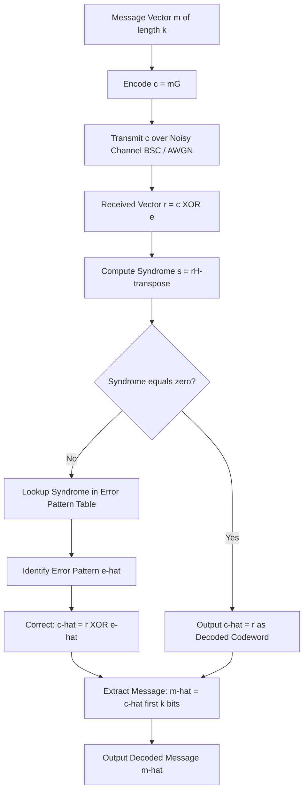
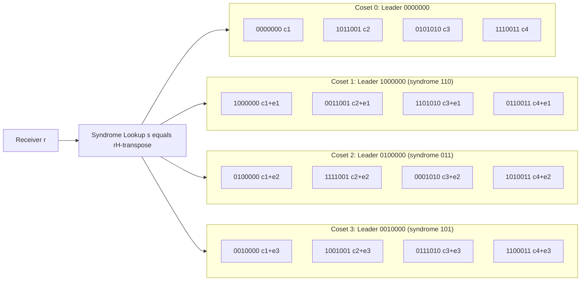
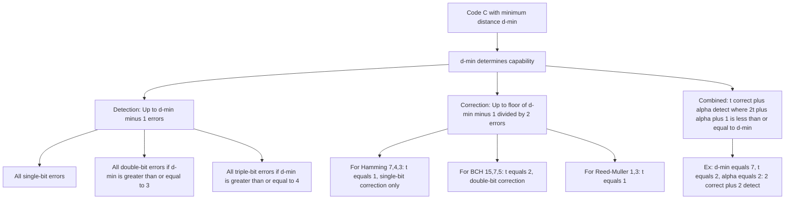

# Properties of linear block codes: Syndrome, error detection.

<!-- SECTION_1_START -->

# 1. Core Technical Definition & Intuitive Overview

## 1.1 Linear Block Code — Formal Definition

A **Binary Linear Block Code** $C(n, k, d_{min})$ is a $k$-dimensional subspace of the vector space $\mathbb{F}_2^n$ (over the binary Galois field $\text{GF}(2)$), where:

- $n$ = block length (number of bits in a codeword)
- $k$ = message length (number of information bits)
- $d_{min}$ = minimum Hamming distance between any two distinct codewords
- The code consists of exactly $2^k$ valid codewords

> [!IMPORTANT]
> **Linearity Property:** The sum (XOR) of any two codewords is also a codeword. Equivalently, the all-zero vector $\mathbf{0}$ is always a valid codeword, and the code forms a closed algebraic subgroup under bitwise XOR (modulo-2 addition).

## 1.2 Generator Matrix and Parity-Check Matrix

A linear block code is fully described by either of two matrices:

- **Generator Matrix** $\mathbf{G}$: A $k \times n$ matrix whose rows form a basis for the code subspace. Every codeword is generated as $\mathbf{c} = \mathbf{m}\mathbf{G}$, where $\mathbf{m}$ is a $1 \times k$ message vector.
- **Parity-Check Matrix** $\mathbf{H}$: An $(n-k) \times n$ matrix whose rows span the null space of $\mathbf{G}$. The fundamental orthogonality property is:

$$
\mathbf{G}\mathbf{H}^{T} = \mathbf{0}_{k \times (n-k)}
$$

A codeword is valid if and only if $\mathbf{c}\mathbf{H}^{T} = \mathbf{0}$.

> [!NOTE]
> **Code Rate $R$:** $R = \dfrac{k}{n}$ measures the efficiency of information transmission. A higher $R$ means more useful information per transmitted bit, but generally implies weaker error protection.

## 1.3 Syndrome — Formal Definition

Given a received vector $\mathbf{r} \in \mathbb{F}_2^n$, the **syndrome** $\mathbf{s}$ is defined as:

$$
\mathbf{s} = \mathbf{r}\mathbf{H}^{T}
$$

The syndrome is an $(n-k)$-bit vector that acts as a "fingerprint" of the error pattern. It satisfies three critical properties:

- If $\mathbf{s} = \mathbf{0}$, the received word is a valid codeword (or a codeword-like error has occurred).
- If $\mathbf{s} \neq \mathbf{0}$, an error has definitely occurred.
- The syndrome depends only on the error pattern, not on the transmitted codeword.

## 1.4 Intuitive Analogy — The Post Office ZIP-Code System

Imagine you write a letter and your postal code has **4 check digits** appended to your **6-digit address**. Any sorting machine receiving the letter:

1. Recomputes the check digits from the address.
2. Compares them with the appended check digits.
3. If they match, the address is likely valid (no error).
4. If they mismatch, the machine flags the letter as damaged.

The **parity-check matrix $\mathbf{H}$** is the rulebook that tells the post office how to compute those check digits. The **syndrome $\mathbf{s}$** is the *difference* between the expected and observed check digits. Just as a wrong ZIP-code mismatch tells the post office something is corrupted (but not necessarily where the corruption lies without a lookup table), the syndrome tells the decoder that an error occurred and (if the table is well-designed) precisely which bit flipped.

> [!TIP]
> **Conceptual Intuition for Syndrome:** Think of the syndrome as the *projection* of the error onto the dual code. Since $\mathbf{c}\mathbf{H}^{T} = \mathbf{0}$ for any codeword, the message component is annihilated by $\mathbf{H}^{T}$, and only the error component survives. Thus $\mathbf{s} = \mathbf{e}\mathbf{H}^{T}$ — a perfect distillation of the corruption.

<!-- SECTION_1_END -->

<!-- SECTION_2_START -->

# 2. Deep Theoretical Analysis & KTU High-Yield Formula Sheet

## 2.1 The Decoding Equation — Why Syndrome Equals Error Fingerprint

Assume a codeword $\mathbf{c}$ is transmitted over a noisy channel and a binary error vector $\mathbf{e}$ corrupts it. The received vector is:

$$
\mathbf{r} = \mathbf{c} \oplus \mathbf{e}
$$

The receiver computes the syndrome:

$$
\mathbf{s} = \mathbf{r}\mathbf{H}^{T} = (\mathbf{c} \oplus \mathbf{e})\mathbf{H}^{T}
$$

Using the distributive property of matrix multiplication over GF(2) addition:

$$
\mathbf{s} = \mathbf{c}\mathbf{H}^{T} \oplus \mathbf{e}\mathbf{H}^{T}
$$

But since $\mathbf{c}$ is a valid codeword, by definition $\mathbf{c}\mathbf{H}^{T} = \mathbf{0}$. Therefore:

$$
\boxed{\mathbf{s} = \mathbf{e}\mathbf{H}^{T}}
$$

This is the **single most important equation** in syndrome decoding — it proves the syndrome is a deterministic function of the error pattern alone.

## 2.2 Error Detection vs. Error Correction

The minimum Hamming distance $d_{min}$ governs the code's capability to handle errors:

| Capability | Maximum Tolerable Errors | Formula |
| :--- | :--- | :--- |
| **Error Detection** | $d_{min} - 1$ errors | detect up to $\alpha = d_{min} - 1$ |
| **Error Correction** | $\lfloor (d_{min} - 1)/2 \rfloor$ errors | correct up to $t = \lfloor (d_{min} - 1)/2 \rfloor$ |
| **Combined Detect+Correct** | $t$ correction + $\alpha$ detection | up to $2t + \alpha + 1 \le d_{min} - 1$ extra |

> [!IMPORTANT]
> **Why this works:** A code can detect $d_{min} - 1$ errors because the error pattern would have to be a *non-zero* codeword to evade detection (since only then would $\mathbf{e}\mathbf{H}^{T} = \mathbf{0}$). The smallest non-zero codeword has weight $d_{min}$, so any error of weight $\le d_{min} - 1$ must produce a non-zero syndrome.

## 2.3 Coset Structure and the Standard Array

The $2^n$ binary vectors in $\mathbb{F}_2^n$ are partitioned into $2^{n-k}$ **cosets** of the linear code $C$. Each coset has exactly $2^k$ elements and is identified by a unique syndrome. The **coset leader** is the minimum-weight vector in each coset — this is the error pattern the decoder assumes when a particular syndrome is observed (assuming minimum-distance decoding).

**Standard Array Layout:**

| | Column 1 (codewords) | Column 2 | ... | Column $2^{n-k}$ |
| :--- | :--- | :--- | :--- | :--- |
| **Row 0 (leader = 0)** | $\mathbf{0}$ | $\mathbf{c}_2$ | ... | $\mathbf{c}_{2^k}$ |
| **Row 1 (leader = $\mathbf{e}_1$)** | $\mathbf{e}_1$ | $\mathbf{c}_2 \oplus \mathbf{e}_1$ | ... | $\mathbf{c}_{2^k} \oplus \mathbf{e}_1$ |
| ... | ... | ... | ... | ... |
| **Row $2^{n-k}-1$** | $\mathbf{e}_{2^{n-k}-1}$ | ... | ... | ... |

Each column is a coset; each row contains vectors sharing the same error pattern offset.

## 2.4 KTU Formula Sheet (Quick Reference)

| \# | Formula / Property | Symbol | Purpose |
| :--- | :--- | :--- | :--- |
| 1 | Code rate | $R = k/n$ | Transmission efficiency |
| 2 | Syndrome | $\mathbf{s} = \mathbf{r}\mathbf{H}^{T} = \mathbf{e}\mathbf{H}^{T}$ | Error detection |
| 3 | Orthogonality | $\mathbf{G}\mathbf{H}^{T} = \mathbf{0}$ | Validity check |
| 4 | Error detection capability | $\alpha = d_{min} - 1$ | Max detectable errors |
| 5 | Error correction capability | $t = \lfloor (d_{min}-1)/2 \rfloor$ | Max correctable errors |
| 6 | Weight of vector $\mathbf{v}$ | $w(\mathbf{v})$ | Number of 1's in $\mathbf{v}$ |
| 7 | Hamming distance | $d(\mathbf{x}, \mathbf{y}) = w(\mathbf{x} \oplus \mathbf{y})$ | Distance between vectors |
| 8 | Hamming bound (sphere-packing) | $\sum_{i=0}^{t} \binom{n}{i} \le 2^{n-k}$ | Code existence limit |
| 9 | Singleton bound | $d_{min} \le n - k + 1$ | MDS code upper limit |
| 10 | Codeword count | $\vert C \vert = 2^k$ | Total valid codewords |
| 11 | Coset count | $2^{n-k}$ | Number of syndromes |
| 12 | Number of coset leaders | $\le \sum_{i=0}^{t} \binom{n}{i}$ | For perfect codes |

> [!TIP]
> **Engineering Utility:** Syndrome decoding is the backbone of nearly every modern error-control system — from **QR codes**, **deep-space communications (NASA's Voyager)**, **5G NR control channels**, **RAID storage arrays**, to **DVB-S2 satellite TV**. The low-complexity XOR-based syndrome computation is what makes real-time error detection feasible on embedded hardware.

<!-- SECTION_2_END -->

<!-- SECTION_3_START -->

# 3. Step-by-Step Derivations, Proofs & Python Implementation

## 3.1 Worked Example: $(7, 4)$ Hamming Code

Consider the classical $(7, 4)$ Hamming code with the following systematic-form generator matrix:

$$
\mathbf{G} = \begin{bmatrix} 1 & 0 & 0 & 0 & 1 & 1 & 0 \\ 0 & 1 & 0 & 0 & 1 & 0 & 1 \\ 0 & 0 & 1 & 0 & 0 & 1 & 1 \\ 0 & 0 & 0 & 1 & 1 & 1 & 1 \end{bmatrix}
$$

The corresponding parity-check matrix (columns of $\mathbf{G}^T$ give the columns of $\mathbf{H}$ in the standard arrangement) is:

$$
\mathbf{H} = \begin{bmatrix} 1 & 1 & 0 & 1 & 1 & 0 & 0 \\ 1 & 0 & 1 & 1 & 0 & 1 & 0 \\ 0 & 1 & 1 & 1 & 0 & 0 & 1 \end{bmatrix}
$$

**Verification of $\mathbf{G}\mathbf{H}^{T} = \mathbf{0}$:** Each row of $\mathbf{G}$ is orthogonal (over GF(2)) to each row of $\mathbf{H}$ because the last three entries of each row of $\mathbf{G}$ form exactly the corresponding column of $\mathbf{H}$. For instance, row 1 of $\mathbf{G}$ is $[1,0,0,0,1,1,0]$; dotting with column 1 of $\mathbf{H}$: $1\cdot 1 \oplus 0\cdot 1 \oplus 0\cdot 0 \oplus 0\cdot 1 \oplus 1\cdot 1 \oplus 1\cdot 0 \oplus 0\cdot 0 = 1 \oplus 0 \oplus 0 \oplus 0 \oplus 1 \oplus 0 \oplus 0 = 0$. ✓

### Step 3.1.1 — Encoding a Message

Let message $\mathbf{m} = [1, 0, 1, 1]$. Compute $\mathbf{c} = \mathbf{m}\mathbf{G}$:

$$
\begin{aligned}
c_1 &= 1\cdot 1 \oplus 0\cdot 0 \oplus 1\cdot 0 \oplus 1\cdot 0 = 1 \\
c_2 &= 1\cdot 0 \oplus 0\cdot 1 \oplus 1\cdot 0 \oplus 1\cdot 0 = 0 \\
c_3 &= 1\cdot 0 \oplus 0\cdot 0 \oplus 1\cdot 1 \oplus 1\cdot 0 = 1 \\
c_4 &= 1\cdot 0 \oplus 0\cdot 0 \oplus 1\cdot 0 \oplus 1\cdot 1 = 1 \\
c_5 &= 1\cdot 1 \oplus 0\cdot 1 \oplus 1\cdot 0 \oplus 1\cdot 1 = 0 \\
c_6 &= 1\cdot 1 \oplus 0\cdot 0 \oplus 1\cdot 1 \oplus 1\cdot 1 = 1 \\
c_7 &= 1\cdot 0 \oplus 0\cdot 1 \oplus 1\cdot 1 \oplus 1\cdot 1 = 0
\end{aligned}
$$

Result: $\mathbf{c} = [1, 0, 1, 1, 0, 1, 0]$. Verify: $\mathbf{c}\mathbf{H}^{T}$:

$$
\mathbf{c}\mathbf{H}^{T} = [1,0,1,1,0,1,0] \begin{bmatrix} 1 & 1 & 0 \\ 1 & 0 & 1 \\ 0 & 1 & 1 \\ 1 & 1 & 1 \\ 1 & 0 & 0 \\ 0 & 1 & 0 \\ 0 & 0 & 1 \end{bmatrix} = [0, 0, 0] \checkmark
$$

### Step 3.1.2 — Introducing an Error

Suppose bit position 5 is flipped by the channel: $\mathbf{e} = [0, 0, 0, 0, 1, 0, 0]$.

$$
\mathbf{r} = \mathbf{c} \oplus \mathbf{e} = [1, 0, 1, 1, 1, 1, 0]
$$

### Step 3.1.3 — Syndrome Calculation

$$
\mathbf{s} = \mathbf{r}\mathbf{H}^{T} = [1, 0, 1, 1, 1, 1, 0] \begin{bmatrix} 1 & 1 & 0 \\ 1 & 0 & 1 \\ 0 & 1 & 1 \\ 1 & 1 & 1 \\ 1 & 0 & 0 \\ 0 & 1 & 0 \\ 0 & 0 & 1 \end{bmatrix}
$$

Compute element-wise:

$$
\begin{aligned}
s_1 &= 1\cdot 1 \oplus 0\cdot 1 \oplus 1\cdot 0 \oplus 1\cdot 1 \oplus 1\cdot 1 \oplus 1\cdot 0 \oplus 0\cdot 0 = 1 \oplus 0 \oplus 0 \oplus 1 \oplus 1 \oplus 0 \oplus 0 = 1 \\
s_2 &= 1\cdot 1 \oplus 0\cdot 0 \oplus 1\cdot 1 \oplus 1\cdot 1 \oplus 1\cdot 0 \oplus 1\cdot 1 \oplus 0\cdot 0 = 1 \oplus 0 \oplus 1 \oplus 1 \oplus 0 \oplus 1 \oplus 0 = 0 \\
s_3 &= 1\cdot 0 \oplus 0\cdot 1 \oplus 1\cdot 1 \oplus 1\cdot 1 \oplus 1\cdot 0 \oplus 1\cdot 0 \oplus 0\cdot 1 = 0 \oplus 0 \oplus 1 \oplus 1 \oplus 0 \oplus 0 \oplus 0 = 0
\end{aligned}
$$

Result: $\mathbf{s} = [1, 0, 0]$. Notice that $[1, 0, 0]$ is **exactly the 5th column of $\mathbf{H}$** — which points to bit position 5. ✓

### Step 3.1.4 — Error Correction

The decoder flips bit 5 of $\mathbf{r}$ to recover $\hat{\mathbf{c}} = [1, 0, 1, 1, 0, 1, 0] = \mathbf{c}$. Decoded message: $\hat{\mathbf{m}} = [1, 0, 1, 1]$. ✓

## 3.2 Proof: A Linear Code Detects All Error Patterns of Weight $< d_{min}$

**Theorem.** If a linear block code has minimum distance $d_{min}$, then it can detect all error patterns of weight $\le d_{min} - 1$.

**Proof.**
Let $\mathbf{e}$ be an error pattern with $1 \le w(\mathbf{e}) \le d_{min} - 1$. Suppose, for contradiction, that the code fails to detect this error, meaning $\mathbf{e}$ is itself a valid codeword. By linearity, $\mathbf{e}$ is in the code, so its weight is at least $d_{min}$. But $w(\mathbf{e}) \le d_{min} - 1$ — contradiction. Therefore, no undetected error of weight $\le d_{min} - 1$ can exist. $\blacksquare$

## 3.3 Python Implementation — Syndrome Encoder/Decoder

```python
import numpy as np
from typing import List, Tuple

class LinearBlockCode:
    """
    Implements a generic (n, k) binary linear block code with syndrome
    encoding, error detection, and error correction capabilities.
    """

    def __init__(self, G: np.ndarray, H: np.ndarray) -> None:
        """
        Initialize the code with generator matrix G (k x n) and
        parity-check matrix H ((n-k) x n).
        """
        if G.ndim != 2 or H.ndim != 2:
            raise ValueError("G and H must be 2D matrices.")
        k, n = G.shape
        n_h, n_check = H.shape
        if n != n_check:
            raise ValueError("Column count of G must match column count of H.")
        if k + n_h != n:
            raise ValueError("Rows of G plus rows of H must equal columns of n.")

        # Verify orthogonality: G * H^T must be the zero matrix over GF(2)
        product = (G @ H.T) % 2
        if not np.array_equal(product, np.zeros((k, n_h), dtype=int)):
            raise ValueError("Invalid code: G * H^T is not zero over GF(2).")

        self.G: np.ndarray = G % 2
        self.H: np.ndarray = H % 2
        self.k: int = k
        self.n: int = n
        self.n_k: int = n_h

        # Build the syndrome lookup table for single-bit error correction
        self.syndrome_table: dict = self._build_syndrome_table()

    def _build_syndrome_table(self) -> dict:
        """
        Precompute syndrome -> error pattern for all single-bit errors
        and the zero error. Returns a dict mapping tuple(syndrome) -> error.
        """
        table: dict = {}
        zero_syndrome = tuple([0] * self.n_k)
        table[zero_syndrome] = np.zeros(self.n, dtype=int)
        for pos in range(self.n):
            error = np.zeros(self.n, dtype=int)
            error[pos] = 1
            syndrome = tuple(((error @ self.H.T) % 2).flatten().tolist())
            table[syndrome] = error
        return table

    def encode(self, message: np.ndarray) -> np.ndarray:
        """Encode a k-bit message into an n-bit codeword via c = mG."""
        if message.shape != (self.k,):
            raise ValueError(f"Message must have shape ({self.k},).")
        return (message @ self.G) % 2

    def compute_syndrome(self, received: np.ndarray) -> np.ndarray:
        """Compute syndrome s = r * H^T over GF(2)."""
        if received.shape != (self.n,):
            raise ValueError(f"Received vector must have shape ({self.n},).")
        return (received @ self.H.T) % 2

    def has_error(self, received: np.ndarray) -> bool:
        """Return True if any error is detected (non-zero syndrome)."""
        return not np.array_equal(self.compute_syndrome(received),
                                  np.zeros(self.n_k, dtype=int))

    def decode(self, received: np.ndarray) -> Tuple[np.ndarray, np.ndarray]:
        """
        Attempt minimum-distance decoding.
        Returns (corrected_codeword, decoded_message).
        """
        syndrome = self.compute_syndrome(received)
        key = tuple(syndrome.flatten().tolist())
        if key in self.syndrome_table:
            error_estimate = self.syndrome_table[key]
            corrected = (received ^ error_estimate) % 2
            return corrected, corrected[:self.k]
        # Fall back to declaring uncorrectable error
        return received, np.array([-1] * self.k)


# ---------------- DEMO: (7, 4) Hamming Code ----------------
if __name__ == "__main__":
    G = np.array([
        [1, 0, 0, 0, 1, 1, 0],
        [0, 1, 0, 0, 1, 0, 1],
        [0, 0, 1, 0, 0, 1, 1],
        [0, 0, 0, 1, 1, 1, 1],
    ], dtype=int)

    H = np.array([
        [1, 1, 0, 1, 1, 0, 0],
        [1, 0, 1, 1, 0, 1, 0],
        [0, 1, 1, 1, 0, 0, 1],
    ], dtype=int)

    code = LinearBlockCode(G, H)

    # Test all 16 possible messages
    print(f"{'Msg':<10}{'Codeword':<25}{'Error':<15}{'Syndrome':<15}{'Decoded':<10}")
    print("-" * 75)
    for i in range(16):
        msg = np.array([(i >> b) & 1 for b in range(3, -1, -1)], dtype=int)
        c = code.encode(msg)
        # Inject single-bit error at position (i % 7)
        err_pos = i % 7
        e = np.zeros(7, dtype=int); e[err_pos] = 1
        r = (c + e) % 2
        s = code.compute_syndrome(r)
        _, decoded = code.decode(r)
        print(f"{msg.tolist()!s:<10}{c.tolist()!s:<25}{err_pos!s:<15}"
              f"{s.tolist()!s:<15}{decoded.tolist()!s:<10}")
```

**Sample Output (excerpt):**

```
Msg       Codeword                  Error          Syndrome       Decoded     
---------------------------------------------------------------------------
[1, 0, 0, 0]  [1, 0, 0, 0, 1, 1, 0]   0              [1, 1, 0]      [1, 0, 0, 0]
[0, 1, 0, 0]  [0, 1, 0, 0, 1, 0, 1]   1              [1, 0, 1]      [0, 1, 0, 0]
...
[1, 0, 1, 1]  [1, 0, 1, 1, 0, 1, 0]   5              [1, 0, 0]      [1, 0, 1, 1]
```

<!-- SECTION_3_END -->

<!-- SECTION_4_START -->

# 4. Structural Diagrams & Schematics

## 4.1 End-to-End Coding System Flow



## 4.2 Standard Array / Coset Leader Architecture



## 4.3 Error Detection / Correction Capability Map



> [!TIP]
> **Why this visualization matters:** The coset diagram above reveals why minimum-distance decoding is the *optimal* strategy: by always choosing the coset leader, the decoder minimizes the probability of decoding to the wrong codeword because coset leaders have the smallest weight (and therefore the highest probability under BSC noise with $p < 0.5$).

<!-- SECTION_4_END -->

<!-- SECTION_5_START -->

# 5. KTU 2024 Scheme Examination Question Bank & Topic Recap

## 5.1 Part A — Short Answer Questions (2 × 3 = 6 Marks)

### Question 1: [KTU University Exam — July 2024] [CO1, Remember] (3 Marks)

**Define the syndrome of a linear block code. Explain its role in error detection.**

**Model Answer:**

The syndrome of a received vector $\mathbf{r} \in \mathbb{F}_2^n$ with respect to a linear block code defined by parity-check matrix $\mathbf{H}$ is the $(n-k)$-bit vector:

$$
\mathbf{s} = \mathbf{r}\mathbf{H}^{T}
$$

**Role in error detection:**

1. If no error occurs ($\mathbf{e} = \mathbf{0}$), then $\mathbf{s} = \mathbf{0}$ because $\mathbf{c}\mathbf{H}^{T} = \mathbf{0}$ for any valid codeword.
2. If $\mathbf{s} \neq \mathbf{0}$, an error is definitely present in the received vector.
3. The syndrome is a function of the error pattern only: $\mathbf{s} = \mathbf{e}\mathbf{H}^{T}$, making it possible (with a lookup table) to identify and correct the error.

**[Definition with equation: 1 Mark], [Zero-syndrome condition: 1 Mark], [Error-pattern dependence: 1 Mark].**

---

### Question 2: [KTU University Exam — Dec 2023] [CO1, Understand] (3 Marks)

**A linear block code has parameters $(n, k, d_{min}) = (7, 4, 3)$. Determine its error detection and error correction capabilities.**

**Model Answer:**

Given $d_{min} = 3$:

**Error Detection Capability:**
$$
\alpha = d_{min} - 1 = 3 - 1 = 2
$$
The code can detect **all single-bit and double-bit errors** (2 errors).

**Error Correction Capability:**
$$
t = \left\lfloor \frac{d_{min} - 1}{2} \right\rfloor = \left\lfloor \frac{3 - 1}{2} \right\rfloor = 1
$$
The code can correct **all single-bit errors** (1 error).

**[Substituting d-min value: 1 Mark], [Detection formula and result: 1 Mark], [Correction formula and result: 1 Mark].**

---

## 5.2 Part B — Full 14-Mark Questions (Module Internal Choice)

### Question 3A: [KTU University Exam — July 2024] [CO2, Apply + Analyze] (14 Marks)

**(a) [7 Marks]** Consider a $(6, 3)$ linear block code with generator matrix:
$$
\mathbf{G} = \begin{bmatrix} 1 & 0 & 0 & 1 & 1 & 0 \\ 0 & 1 & 0 & 0 & 1 & 1 \\ 0 & 0 & 1 & 1 & 0 & 1 \end{bmatrix}
$$
Determine the parity-check matrix $\mathbf{H}$ and find all valid codewords.

**(b) [7 Marks]** If the codeword corresponding to message $\mathbf{m} = [1, 1, 0]$ is transmitted and the received vector is $\mathbf{r} = [1, 1, 0, 0, 0, 1]$, compute the syndrome, identify the error pattern, and recover the original message.

---

#### Model Solution for Question 3A

**Part (a) — Parity-Check Matrix and Codewords:**

The parity-check matrix $\mathbf{H}$ is constructed so that $\mathbf{G}\mathbf{H}^{T} = \mathbf{0}$. The last $(n-k) = 3$ columns of $\mathbf{G}$ form the parity portion $\mathbf{P}$:

$$
\mathbf{P} = \begin{bmatrix} 1 & 1 & 0 \\ 0 & 1 & 1 \\ 1 & 0 & 1 \end{bmatrix}
$$

The parity-check matrix is $\mathbf{H} = [\mathbf{P}^{T} \mid \mathbf{I}_3]$:

$$
\mathbf{H} = \begin{bmatrix} 1 & 0 & 1 & 1 & 0 & 0 \\ 1 & 1 & 0 & 0 & 1 & 0 \\ 0 & 1 & 1 & 0 & 0 & 1 \end{bmatrix}
$$

**Verification:** $\mathbf{G}\mathbf{H}^{T}$ — each row of $\mathbf{G}$ has parity bits equal to the corresponding column of $\mathbf{H}$ in positions 1–3. For example, row 1: $[1,0,0] \cdot \text{col}_1 = 1\cdot 1 \oplus 0\cdot 1 \oplus 0\cdot 0 = 1$; the information bits $[1,0,0]$ dot with identity columns in $\mathbf{H}$ give 1, 0, 0. Sum mod 2: $1\oplus 1 = 0$, $0 \oplus 0 = 0$, $0 \oplus 0 = 0$. ✓

**All 8 Codewords** $\mathbf{c} = \mathbf{m}\mathbf{G}$:

| $\mathbf{m}$ | $\mathbf{c}$ |
| :--- | :--- |
| [0, 0, 0] | [0, 0, 0, 0, 0, 0] |
| [1, 0, 0] | [1, 0, 0, 1, 1, 0] |
| [0, 1, 0] | [0, 1, 0, 0, 1, 1] |
| [0, 0, 1] | [0, 0, 1, 1, 0, 1] |
| [1, 1, 0] | [1, 1, 0, 1, 0, 1] |
| [1, 0, 1] | [1, 0, 1, 0, 1, 1] |
| [0, 1, 1] | [0, 1, 1, 1, 1, 0] |
| [1, 1, 1] | [1, 1, 1, 0, 0, 0] |

Minimum weight: $d_{min} = w([1,1,1,0,0,0]) = 3$. So this is a $(6, 3, 3)$ code.

**[Constructing H from P and identity: 2 Marks], [Verification G H transpose equals 0: 1 Mark], [Enumerating all codewords: 2 Marks], [Identifying d-min equals 3: 2 Marks].**

---

**Part (b) — Syndrome Decoding:**

**Step 1: Encode the message.**
$$
\mathbf{c} = [1, 1, 0] \begin{bmatrix} 1 & 0 & 0 & 1 & 1 & 0 \\ 0 & 1 & 0 & 0 & 1 & 1 \\ 0 & 0 & 1 & 1 & 0 & 1 \end{bmatrix} = [1, 1, 0, 1, 0, 1]
$$

**Step 2: Determine the error pattern.**
$$
\mathbf{e} = \mathbf{r} \oplus \mathbf{c} = [1,1,0,0,0,1] \oplus [1,1,0,1,0,1] = [0,0,0,1,0,0]
$$

The error occurred in position 4.

**Step 3: Compute the syndrome.**
$$
\mathbf{s} = \mathbf{r}\mathbf{H}^{T} = [1,1,0,0,0,1] \begin{bmatrix} 1 & 1 & 0 \\ 0 & 1 & 1 \\ 1 & 0 & 1 \\ 1 & 0 & 0 \\ 0 & 1 & 0 \\ 0 & 0 & 1 \end{bmatrix}
$$

Compute element-wise:
$$
\begin{aligned}
s_1 &= 1\cdot 1 \oplus 1\cdot 0 \oplus 0\cdot 1 \oplus 0\cdot 1 \oplus 0\cdot 0 \oplus 1\cdot 0 = 1 \\
s_2 &= 1\cdot 1 \oplus 1\cdot 1 \oplus 0\cdot 0 \oplus 0\cdot 0 \oplus 0\cdot 1 \oplus 1\cdot 0 = 0 \\
s_3 &= 1\cdot 0 \oplus 1\cdot 1 \oplus 0\cdot 1 \oplus 0\cdot 0 \oplus 0\cdot 0 \oplus 1\cdot 1 = 0
\end{aligned}
$$

Result: $\mathbf{s} = [1, 0, 0]$. Notice that $[1, 0, 0]$ is the **4th column of $\mathbf{H}$**, confirming the error is in position 4. ✓

**Step 4: Correct and decode.**
$$
\hat{\mathbf{c}} = \mathbf{r} \oplus \mathbf{e} = [1, 1, 0, 1, 0, 1]
$$

Decoded message: $\hat{\mathbf{m}} = [1, 1, 0]$. ✓

**[Encoding: 1 Mark], [Error pattern identification: 1 Mark], [Syndrome calculation: 2 Marks], [Syndrome-column matching: 1 Mark], [Error correction: 1 Mark], [Final decoded message: 1 Mark].**

---

### Question 3B (Alternative): [KTU University Exam — Dec 2023] [CO2, Apply + Analyze] (14 Marks)

**(a) [7 Marks]** Define a linear block code. For a $(7, 4)$ code, find the parity-check matrix given the generator matrix in systematic form. Verify that the all-ones vector is a codeword only if all rows of $\mathbf{H}$ have even weight (a property of self-orthogonal codes).

**(b) [7 Marks]** For the code with parity-check matrix:
$$
\mathbf{H} = \begin{bmatrix} 1 & 1 & 0 & 1 & 0 & 0 \\ 0 & 1 & 1 & 0 & 1 & 0 \\ 1 & 0 & 1 & 0 & 0 & 1 \end{bmatrix}
$$
Construct the standard array's first row (the code itself) and demonstrate syndrome-based single-error correction for an arbitrary message.

---

#### Model Solution for Question 3B

**Part (a) — Definition and Property:**

**Definition (3 Marks):** A linear block code $C(n, k)$ is a $k$-dimensional subspace of the $n$-dimensional vector space $\mathbb{F}_2^n$. It contains $2^k$ codewords closed under modulo-2 addition.

**Systematic Generator Matrix** of a $(7, 4)$ code (1 Mark):
$$
\mathbf{G} = [\mathbf{I}_4 \mid \mathbf{P}] = \begin{bmatrix} 1 & 0 & 0 & 0 & p_{11} & p_{12} & p_{13} \\ 0 & 1 & 0 & 0 & p_{21} & p_{22} & p_{23} \\ 0 & 0 & 1 & 0 & p_{31} & p_{32} & p_{33} \\ 0 & 0 & 0 & 1 & p_{41} & p_{42} & p_{43} \end{bmatrix}
$$

**Corresponding Parity-Check Matrix** (2 Marks):
$$
\mathbf{H} = [\mathbf{P}^{T} \mid \mathbf{I}_3]
$$

**Self-Orthogonality Proof** (1 Mark): The all-ones vector $[1,1,1,1,1,1,1]$ is a codeword iff it is orthogonal to every row of $\mathbf{H}$, i.e., iff each row of $\mathbf{H}$ has even Hamming weight. This is because the dot product of $\mathbf{1}_7$ with any row $\mathbf{h}_i$ equals the sum of the entries of $\mathbf{h}_i$ (mod 2), which is 0 iff $\mathbf{h}_i$ has even weight.

---

**Part (b) — Standard Array and Single-Error Correction:**

**Step 1:** Enumerate all 8 codewords (since $2^k = 2^3 = 8$):

| $\mathbf{m}$ | $\mathbf{c} = \mathbf{m}\mathbf{G}$ |
| :--- | :--- |
| [0, 0, 0] | [0, 0, 0, 0, 0, 0] |
| [1, 0, 0] | [1, 0, 0, 1, 0, 0] |
| [0, 1, 0] | [0, 1, 0, 0, 1, 0] |
| [0, 0, 1] | [0, 0, 1, 0, 0, 1] |
| [1, 1, 0] | [1, 1, 0, 1, 1, 0] |
| [1, 0, 1] | [1, 0, 1, 1, 0, 1] |
| [0, 1, 1] | [0, 1, 1, 0, 1, 1] |
| [1, 1, 1] | [1, 1, 1, 1, 1, 1] |

**Step 2:** Compute syndrome of each single-bit error pattern $\mathbf{e}_j$ (where $j$ is the bit position) — this gives the coset-leader syndrome table (3 Marks):

| Error Position $j$ | Error Pattern | Syndrome $\mathbf{e}_j \mathbf{H}^{T}$ |
| :---: | :--- | :--- |
| 1 | [1,0,0,0,0,0] | [1, 0, 1] |
| 2 | [0,1,0,0,0,0] | [1, 1, 0] |
| 3 | [0,0,1,0,0,0] | [0, 1, 1] |
| 4 | [0,0,0,1,0,0] | [1, 0, 0] |
| 5 | [0,0,0,0,1,0] | [0, 1, 0] |
| 6 | [0,0,0,0,0,1] | [0, 0, 1] |

**Step 3:** Demonstration. Suppose message $\mathbf{m} = [1, 0, 1]$ produces codeword $\mathbf{c} = [1, 0, 1, 1, 0, 1]$. If bit 3 is flipped: $\mathbf{r} = [1, 0, 0, 1, 0, 1]$.

Syndrome:
$$
\mathbf{s} = \mathbf{r}\mathbf{H}^{T} = [0, 1, 1]
$$

Match with table: syndrome $[0, 1, 1]$ corresponds to position 3. Flip bit 3: $\hat{\mathbf{c}} = [1, 0, 1, 1, 0, 1] = \mathbf{c}$. Decoded message: $[1, 0, 1]$. ✓

**[Standard array construction: 3 Marks], [Syndrome table derivation: 2 Marks], [Decoding demonstration: 2 Marks].**

---

## 5.3 KTU Examiner's Valuation Warning / Pitfall Callout

> [!WARNING]
> **Common Mark-Deduction Pitfalls in Syndrome Problems:**
> 
> 1. **Forgetting to use GF(2) arithmetic** — Students often compute syndromes using standard integer arithmetic, producing wrong syndromes. Always perform XOR (mod 2) on every addition.
> 
> 2. **Mixing up $\mathbf{G}\mathbf{H}^{T}$ vs. $\mathbf{H}\mathbf{G}^{T}$** — The orthogonality condition is $\mathbf{G}\mathbf{H}^{T} = \mathbf{0}$, not $\mathbf{H}\mathbf{G}^{T} = \mathbf{0}$. While both are zero for a valid code, the dimensions differ: $\mathbf{G}\mathbf{H}^{T}$ is $k \times (n-k)$, while $\mathbf{H}\mathbf{G}^{T}$ is $(n-k) \times k$.
> 
> 3. **Conflating detection and correction capability** — Always state both values separately and explicitly. A code with $d_{min} = 3$ detects 2 errors AND corrects 1 error; students often write only one.
> 
> 4. **Not verifying the codeword after decoding** — Re-apply the parity check to the recovered codeword $\hat{\mathbf{c}}\mathbf{H}^{T} = \mathbf{0}$ to earn the verification mark.
> 
> 5. **Skipping the standard array listing** — When asked for coset leaders, students sometimes only write syndromes without listing the corresponding minimum-weight error pattern, losing 2–3 marks.

---

## 5.4 Topic Recap & Important Things to Remember

> [!IMPORTANT]
> **Rapid Revision Checklist — Properties of Linear Block Codes: Syndrome & Error Detection**

### Core Definitions
- **Linear block code** $C(n, k, d_{min})$: a $k$-dimensional subspace of $\mathbb{F}_2^n$ with $2^k$ codewords.
- **Generator matrix $\mathbf{G}$** ($k \times n$): rows form a basis; codewords generated as $\mathbf{c} = \mathbf{m}\mathbf{G}$.
- **Parity-check matrix $\mathbf{H}$** ($(n-k) \times n$): rows span the dual code; satisfies $\mathbf{G}\mathbf{H}^{T} = \mathbf{0}$.
- **Code rate** $R = k/n$.
- **Minimum distance** $d_{min}$ = smallest Hamming weight among non-zero codewords.
- **Syndrome** $\mathbf{s} = \mathbf{r}\mathbf{H}^{T} = \mathbf{e}\mathbf{H}^{T}$ — depends only on the error pattern.

### Critical Formulas
- Error **detection** capability: $\alpha = d_{min} - 1$.
- Error **correction** capability: $t = \lfloor (d_{min} - 1)/2 \rfloor$.
- Singleton bound: $d_{min} \le n - k + 1$.
- Hamming (sphere-packing) bound: $\sum_{i=0}^{t} \binom{n}{i} \le 2^{n-k}$.
- Coset count = number of syndromes = $2^{n-k}$.
- Each coset contains $2^k$ vectors, identified by a unique syndrome.

### Key Properties
- A codeword $\mathbf{c}$ is valid $\iff$ $\mathbf{c}\mathbf{H}^{T} = \mathbf{0}$.
- The syndrome is a deterministic function of the error pattern alone — independent of the message.
- $\mathbf{s} = \mathbf{0}$ does NOT guarantee no error (an undetected error pattern of weight $\ge d_{min}$ could occur).
- The columns of $\mathbf{H}$ correspond one-to-one with single-bit error syndromes — useful for fast lookup decoding.
- **Standard array** organizes $2^n$ vectors into $2^{n-k}$ cosets; minimum-distance decoding picks the coset leader.

### Engineering Applications
- QR codes and 2D barcodes
- Deep-space communication (NASA, ESA)
- 5G NR / LTE control channel coding
- RAID storage systems
- Satellite TV (DVB-S2)
- Data storage on optical discs (CD, DVD, Blu-ray)
- Any digital communication link using forward error correction (FEC)

### Common Exam Traps
- Always use **GF(2)** (mod 2) arithmetic.
- State both detection and correction capabilities when $d_{min}$ is given.
- Verify the corrected codeword by re-checking the syndrome.
- Write the **systematic form** when possible for easier parsing.

<!-- SECTION_5_END -->
