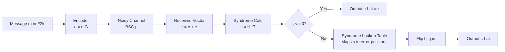
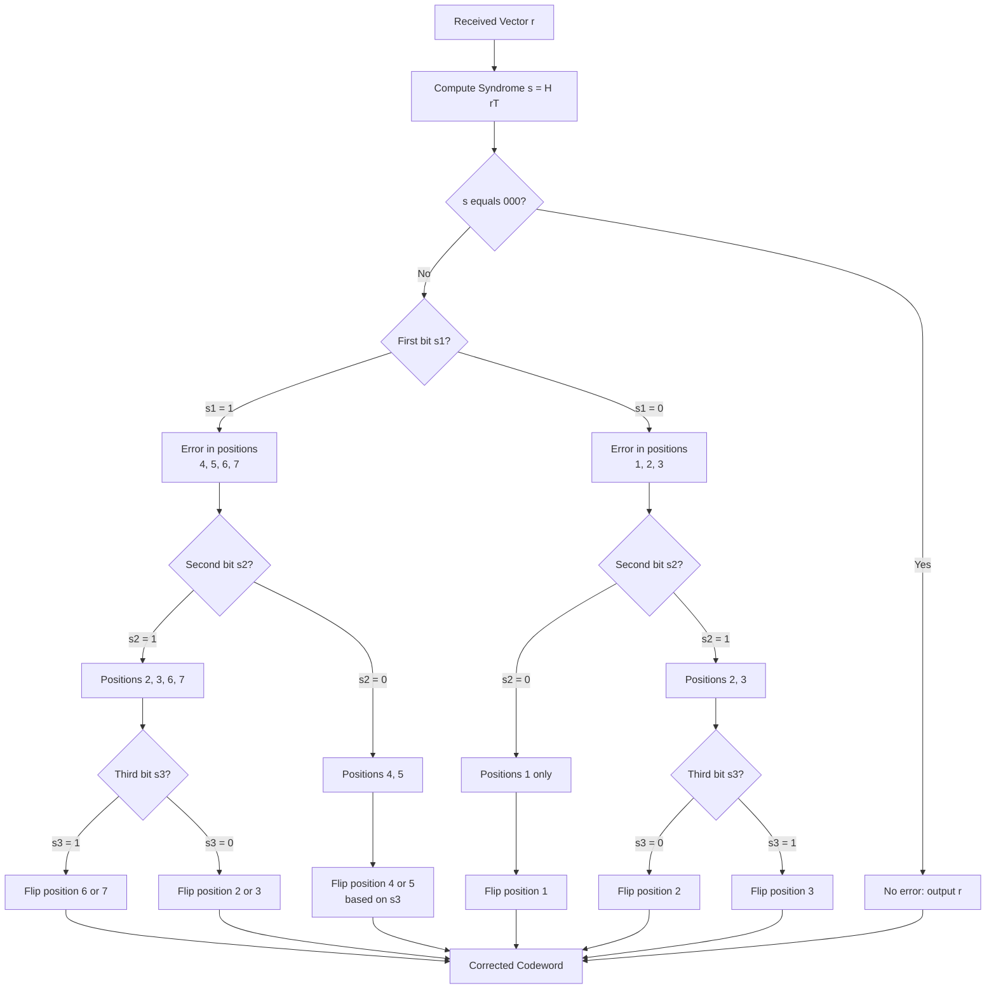
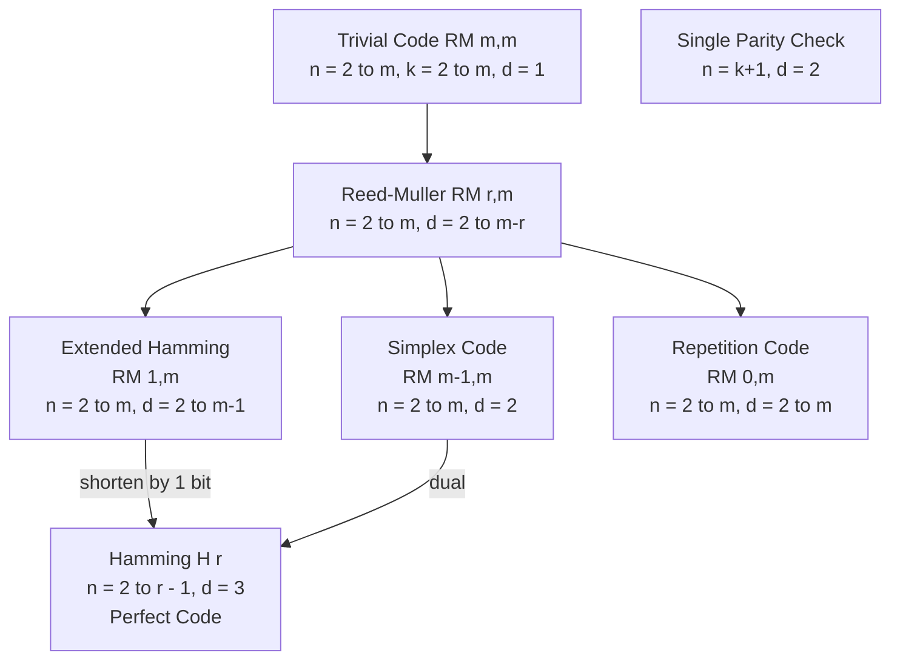

# Single parity check codes, Hamming codes, Reed Muller codes.

<!-- SECTION_1_START -->

# Binary Block Codes: Minimum Distance & Error Correction

## 1.1 Single Parity Check (SPC) Codes

### Formal Definition
A **Single Parity Check (SPC) code** is a linear block code over the binary field $\mathbb{F}_2$ with parameters $(n, k, d_{\min}) = (k+1, k, 2)$, where a single parity bit is appended to a $k$-bit message word such that the sum (mod 2) of all $n$ bits equals zero. The parity check matrix is the all-ones row vector $H = \begin{bmatrix} 1 & 1 & \cdots & 1 \end{bmatrix}$ of dimension $1 \times n$.

> [!NOTE]
> **KTU Syllabus Definition:** A binary linear block code $\mathcal{C}$ of length $n$ is called a *single parity check code* if and only if its parity check matrix $H$ has exactly one linearly independent row. Equivalently, the code is the row space of a $1 \times n$ all-ones vector.

### Intuitive Analogy
Imagine a classroom where the teacher counts the total number of students present. If a student leaves (or sneaks in) without the teacher noticing, the count becomes odd. The teacher can **detect** that *something* changed, but cannot tell **who** left. The SPC code is the digital equivalent of this count: it catches any odd number of bit-flips (parity violation) but cannot pinpoint their location because every single error produces the same syndrome.

### Parity Constraint
For a codeword $\mathbf{c} = (c_1, c_2, \ldots, c_n)$, the even-parity constraint is:

$$\sum_{i=1}^{n} c_i \equiv 0 \pmod{2}$$

This means $c_n = c_1 \oplus c_2 \oplus \cdots \oplus c_{k}$ when the parity bit is placed at position $n$.

> [!IMPORTANT]
> **Minimum Distance = 2**: The smallest non-zero weight codeword of an SPC code has weight 2 (two message bits, parity = 0). Therefore $d_{\min} = 2$, which means SPC codes can **detect** exactly one error but **cannot correct** any error.

---

## 1.2 Hamming Codes

### Formal Definition
For any integer $r \geq 2$, the **binary Hamming code** $\mathcal{H}_r$ is a linear block code with parameters:
- Length: $n = 2^r - 1$
- Dimension: $k = 2^r - 1 - r$
- Minimum distance: $d_{\min} = 3$
- Error-correcting capability: $t = 1$ (single error correction)

The parity check matrix $H$ is an $r \times n$ matrix whose columns are the non-zero binary vectors of $\mathbb{F}_2^r$ (i.e., the binary representations of $1, 2, 3, \ldots, 2^r - 1$).

> [!NOTE]
> **KTU Perfect Code Property:** The Hamming code $\mathcal{H}_r$ is a *perfect* 1-error correcting code because it satisfies the Hamming bound (sphere-packing bound) with equality:
> $$\sum_{i=0}^{1} \binom{n}{i} = 1 + n = 1 + (2^r - 1) = 2^r = 2^{n-k}$$
> Every binary word lies either in a Hamming sphere of radius 1 around a codeword, or is itself a codeword.

### Intuitive Analogy
Picture a building with $n = 7$ rooms arranged in three coloured wings: Red, Green, Blue. Each room is assigned a unique 3-bit "address" $(b_1, b_2, b_3)$. A messenger visits the rooms in some order. If exactly one room is later found to be disturbed, the room's address can be reconstructed by asking three questions:
- "Did the Red-wing rooms see anything unusual?" → bit $s_1$
- "Did the Green-wing rooms see anything unusual?" → bit $s_2$
- "Did the Blue-wing rooms see anything unusual?" → bit $s_3$

The 3-bit syndrome $(s_1, s_2, s_3)$ directly gives the **room number** of the disturbance. That is the essence of Hamming decoding: **syndrome = position of error**.

### Visualisation Control Block
> [!VISUALIZATION CONTROL]
> **Concept:** Hamming (7,4) sphere-packing geometry on the 3D hypercube
> **GeoGebra / Desmos Input Equations:**
> * Vertices of unit cube: $(0,0,0), (1,0,0), (0,1,0), (0,0,1), (1,1,0), (1,0,1), (0,1,1), (1,1,1)$
> * Center marker for codeword $(0,0,0)$: $\text{Point}((0,0,0))$
> **Visual Description:** Plot 8 binary 3-tuples as corners of a cube. A codeword of the $(7,4)$ Hamming code corresponds to one corner. The 7 Hamming spheres of radius 1 around the 16 codewords partition the entire $2^7 = 128$-element space — there are no overlaps and no gaps. The student should observe that each corner is the center of exactly one sphere, illustrating the *perfect* property.

---

## 1.3 Reed–Muller Codes

### Formal Definition
The **Reed–Muller code** $\text{RM}(r, m)$ is a linear block code over $\mathbb{F}_2$ with parameters:
- Length: $n = 2^m$
- Dimension: $k = \sum_{i=0}^{r} \binom{m}{i}$
- Minimum distance: $d_{\min} = 2^{m-r}$
- Error-correcting capability: $t = 2^{m-r-1} - \frac{1}{2}$ (integer truncation)

where $0 \leq r \leq m$ are integers. The code is constructed by evaluating all Boolean monomials of degree at most $r$ on the $2^m$ vectors of $\mathbb{F}_2^m$.

> [!NOTE]
> **KTU Special Cases:**
> * $\text{RM}(0, m)$: The repetition code of length $2^m$, dimension 1, $d_{\min} = 2^m$.
> * $\text{RM}(m-1, m)$: The *simplex* code (dual of the Hamming code), $d_{\min} = 2$.
> * $\text{RM}(m, m)$: The trivial code $\mathbb{F}_2^{2^m}$ containing every binary string, $d_{\min} = 1$.
> * $\text{RM}(1, m)$: The **extended Hamming code** of length $2^m$, $d_{\min} = 2^{m-1}$.

### Intuitive Analogy
Imagine you are designing a survey form to be filled out by $2^m$ respondents, where each respondent is identified by an $m$-bit "demographic vector" (age group, region, gender, $\ldots$). You want to ask a small set of *core questions* whose YES/NO answers can predict any pattern that is at most $r$-way interactive (e.g., a question like "Are you female AND from the south AND under 30?" counts as degree 3).

The Reed–Muller code is exactly this: each row of the generator matrix corresponds to one question (a Boolean monomial), and the columns correspond to the $2^m$ respondents. The minimum distance counts the number of respondents who would say "YES" to the *least-popular* question — a codeword of minimum weight is created when the question is so specific that only $2^{m-r}$ people answer YES.

### Generator Construction
Let $\mathcal{V} = \{\mathbf{v}_1, \mathbf{v}_2, \ldots, \mathbf{v}_n\}$ be the standard ordering of $\mathbb{F}_2^m$ (all binary $m$-tuples in lexicographic order). For each monomial $f(\mathbf{x}) = x_{i_1} x_{i_2} \cdots x_{i_j}$ of degree $j \leq r$, define a column vector:

$$\mathbf{g}_f = \begin{bmatrix} f(\mathbf{v}_1) \\ f(\mathbf{v}_2) \\ \vdots \\ f(\mathbf{v}_n) \end{bmatrix}$$

The generator matrix $G$ has these $\mathbf{g}_f$ as rows, and the code is $\mathcal{C} = \{ \mathbf{u} G : \mathbf{u} \in \mathbb{F}_2^k \}$.

> [!IMPORTANT]
> **The Affine Subgroup Property:** For RM$(1, m)$, every row of $G$ corresponds either to the constant $1$ (the all-ones vector) or to a coordinate $x_i$. The codewords are exactly the affine functions $f(\mathbf{x}) = a_0 \oplus a_1 x_1 \oplus \cdots \oplus a_m x_m$ evaluated on all $\mathbf{x} \in \mathbb{F}_2^m$. The minimum weight non-zero codeword is $2^{m-1}$ (an affine hyperplane), giving $d_{\min} = 2^{m-1}$.

<!-- SECTION_1_END -->

<!-- SECTION_2_START -->

# Deep Theoretical Analysis & KTU High-Yield Formula Sheet

## 2.1 Single Parity Check (SPC) Codes — Deep Dive

### Operational Logic
- **Encoding:** Given message $\mathbf{m} \in \mathbb{F}_2^k$, the codeword is $\mathbf{c} = (\mathbf{m}, p)$ where $p = \bigoplus_{i=1}^{k} m_i$.
- **Parity Check:** $H \cdot \mathbf{c}^{T} = \sum_{i=1}^{n} c_i = 0$ for all valid codewords.
- **Error Detection:** A non-zero syndrome $s = H \cdot \mathbf{r}^{T} = 1$ indicates an **odd** number of bit errors; $s = 0$ indicates either zero errors or an even number of errors (false negative).
- **No Error Correction:** Because $s$ is a single bit, it cannot distinguish among $n$ possible single-error positions.

### Why $d_{\min} = 2$
The all-ones vector is a row of $H$ (the only non-zero row). The minimum weight codeword is obtained by adding any two rows of $G$, which are linearly independent. Two such rows differing in two positions give a codeword of weight 2, so $d_{\min} = 2$. Equivalently, $H \cdot \mathbf{c}^{T} = 0$ for all $\mathbf{c} \in \mathcal{C}$, and the smallest $\mathbf{c}$ with non-trivial support requires at least 2 ones to make the sum vanish.

### Limitations
- **Single-error detection only**: Cannot detect two simultaneous errors.
- **Zero correcting power**: $t = \lfloor (d_{\min} - 1)/2 \rfloor = 0$.
- **High redundancy for low gain**: 1 parity bit per message costs $1/(k+1)$ rate loss.

---

## 2.2 Hamming Codes — Deep Dive

### The Generator–Parity-Check Duality
The Hamming code is defined by its parity check matrix $H$, which is the $r \times n$ matrix whose $j$-th column is the binary representation of $j$, for $1 \leq j \leq n = 2^r - 1$. Equivalently, $H$ is the matrix whose columns exhaust all $2^r - 1$ non-zero vectors of $\mathbb{F}_2^r$.

This single definition has three powerful consequences:

1. **No two columns are identical.** A duplicate column would imply two distinct error positions are indistinguishable, breaking error-correction.
2. **No column is the zero vector.** If $H \mathbf{e}^{T} = \mathbf{0}$ for a single-bit error $\mathbf{e} = \mathbf{e}_j$, then column $j$ would be zero, contradicting construction.
3. **Columns are linearly independent in pairs and uniquely map syndromes to positions.** The syndrome $s = H \mathbf{e}_j^{T}$ equals the $j$-th column, i.e., the binary representation of $j$ (transposed). This is the "syndrome = error position" miracle.

### Why $d_{\min} = 3$
Consider the minimum weight codeword. A codeword $\mathbf{c}$ satisfies $H \mathbf{c}^{T} = \mathbf{0}$, which means the sum (mod 2) of selected columns of $H$ is $\mathbf{0}$. Any non-empty subset of columns of $H$ summing to zero would form a codeword. Since columns are distinct non-zero vectors in $\mathbb{F}_2^r$, the **shortest** non-trivial linear dependence requires at least 3 columns (because in $\mathbb{F}_2$, two distinct non-zero vectors are linearly independent). Therefore the minimum weight is 3, so $d_{\min} = 3$.

### Perfectness
The sphere-packing (Hamming) bound states that for any $t$-error-correcting code:

$$\sum_{i=0}^{t} \binom{n}{i} \leq 2^{n-k}$$

For Hamming codes with $t = 1$, the left side equals $1 + n = 2^r = 2^{n-k}$, achieving equality. This means the Hamming spheres of radius 1 around each codeword **tile** the space $\mathbb{F}_2^n$ exactly — a hallmark of a *perfect* code.

### Real-World Engineering Utility
- **ECC RAM (Error-Correcting Code memory)**: Modern DRAM uses $(72, 64)$ extended Hamming codes (SEC-DED) to correct single-bit errors and detect double-bit errors.
- **Satellite communications**: Short Hamming codes provide low-latency error correction for control channels.
- **CDMA cellular networks**: Hamming codes were used in 2G/3G systems for voice-channel FEC.

---

## 2.3 Reed–Muller Codes — Deep Dive

### The Boolean Function Construction
The generator matrix of $\text{RM}(r, m)$ is indexed by monomials of degree at most $r$ in $m$ variables. The total number of such monomials is:

$$k(r, m) = \sum_{i=0}^{r} \binom{m}{i}$$

The matrix has $k$ rows and $n = 2^m$ columns. Column $j$ corresponds to the $j$-th vector $\mathbf{v}_j \in \mathbb{F}_2^m$, and the entry in row corresponding to monomial $f$ is $f(\mathbf{v}_j) \in \mathbb{F}_2$.

### Why $d_{\min} = 2^{m-r}$: The Affine Argument
For any non-zero codeword of RM$(r, m)$, there exists a Boolean function $f$ of degree at most $r$ that is not identically zero. The weight of the codeword is the number of $\mathbf{v} \in \mathbb{F}_2^m$ such that $f(\mathbf{v}) = 1$.

By a classical result in Boolean function theory (the *Plotkin bound* specialization):

$$|\{\mathbf{v} : f(\mathbf{v}) = 1\}| \geq 2^{m-r}$$

Equality is achieved when $f$ has degree exactly $r$ and is a *bent-like* monomial. The minimum over all non-zero $f$ of degree $\leq r$ is exactly $2^{m-r}$. Hence $d_{\min} = 2^{m-r}$.

### Construction for RM$(1, m)$ (Extended Hamming Code)
The basis monomials are $\{1, x_1, x_2, \ldots, x_m\}$, giving $k = 1 + m$ rows. Evaluated on the $2^m$ vectors in $\mathbb{F}_2^m$:

- The all-ones row (from $f = 1$) is the vector $(1, 1, \ldots, 1)$.
- The row for $x_i$ is the indicator of the $i$-th bit being 1.

The result is the parity-extended Hamming code of length $2^m$ and minimum distance $2^{m-1}$.

### Real-World Engineering Utility
- **Deep-space communication (NASA)**: Mariner 9 (1971) used $\text{RM}(1, 4)$ and $\text{RM}(2, 4)$ codes — a foundational use case.
- **Morse code redundancy**: The 32-symbol Morse alphabet with extra spacing resembles an RM$(1, 5)$-like structure.
- **5G NR control channels**: Polar codes (a generalization) descend from RM-code ideas via channel polarization.

---

## 2.4 KTU High-Yield Formula Sheet

| Code Type | Parameters $(n, k, d_{\min})$ | Rate $R$ | Generator / Parity Check | $t$ (errors corrected) | Special Property |
| :--- | :--- | :--- | :--- | :--- | :--- |
| **SPC Code** | $(k+1, k, 2)$ | $\frac{k}{k+1}$ | $H = \begin{bmatrix} 1 & 1 & \cdots & 1 \end{bmatrix}$ (size $1 \times n$) | $0$ | Detects 1 error; 50% error detection only |
| **Hamming $\mathcal{H}_r$** | $(2^r - 1,\ 2^r - 1 - r,\ 3)$ | $\frac{2^r - 1 - r}{2^r - 1}$ | $H$: $r \times n$, columns = binary $1, 2, \ldots, n$ | $1$ | **Perfect** SEC code |
| **Extended Hamming** | $(2^r,\ 2^r - 1 - r,\ 4)$ | $\frac{2^r - 1 - r}{2^r}$ | Add overall parity bit to $\mathcal{H}_r$ | $1$ (detect 2) | SEC-DED code |
| **Reed–Muller $\text{RM}(r, m)$** | $\left(2^m,\ \sum_{i=0}^{r} \binom{m}{i},\ 2^{m-r}\right)$ | $\frac{1}{2^m}\sum_{i=0}^{r}\binom{m}{i}$ | Rows = Boolean monomials of degree $\leq r$ | $\left\lfloor \frac{2^{m-r} - 1}{2} \right\rfloor$ | Contains Hamming/extended Hamming |
| **Repetition $\text{RM}(0, m)$** | $(2^m, 1, 2^m)$ | $\frac{1}{2^m}$ | $G = \begin{bmatrix} 1 & 1 & \cdots & 1 \end{bmatrix}$ | $2^{m-1} - \frac{1}{2}$ | Trivial case |
| **Simplex $\text{RM}(m-1, m)$** | $(2^m, 2^m - 1, 2)$ | $\frac{2^m - 1}{2^m}$ | All non-zero columns of $H_{\mathcal{H}_m}$ | $0$ | Dual of Hamming code |

> [!IMPORTANT]
> **Sphere-Packing Bound (Hamming Bound):** For any $t$-error-correcting $(n, k)$ code: $\sum_{i=0}^{t} \binom{n}{i} \leq 2^{n-k}$. Equality $\Leftrightarrow$ *perfect code*. The only non-trivial binary perfect codes are the Hamming codes $\mathcal{H}_r$ ($t=1$) and the Golay code $\mathcal{G}_{23}$ ($t=3$).

<!-- SECTION_2_END -->

<!-- SECTION_3_START -->

# Step-by-Step Derivations & Python Code Implementation

## 3.1 SPC Code Encoding and Decoding

### Mathematical Derivation

Let $\mathbf{m} = (m_1, m_2, \ldots, m_k)$ be the message. The encoded codeword is $\mathbf{c} = (m_1, m_2, \ldots, m_k, p)$ where:

$$p = \bigoplus_{i=1}^{k} m_i = m_1 \oplus m_2 \oplus \cdots \oplus m_k$$

The parity check equation is:

$$H \mathbf{c}^{T} = \begin{bmatrix} 1 & 1 & \cdots & 1 \end{bmatrix} \begin{bmatrix} c_1 \\ c_2 \\ \vdots \\ c_n \end{bmatrix} = \sum_{i=1}^{n} c_i = 0 \pmod{2}$$

If a single error occurs at position $j$, the received vector is $\mathbf{r} = \mathbf{c} \oplus \mathbf{e}_j$ and the syndrome is $s = H \mathbf{r}^{T} = 1$. The decoder knows an error occurred but cannot identify $j$.

### Python Implementation (SPC)

```python
from typing import List, Tuple

class SPCCode:
    """Single Parity Check (even-parity) binary linear block code."""

    def __init__(self, k: int) -> None:
        if k < 1:
            raise ValueError("Message length k must be >= 1.")
        self.k = k
        self.n = k + 1
        self.H = [[1] * self.n]  # 1 x n all-ones parity check matrix

    def encode(self, message: List[int]) -> List[int]:
        if len(message) != self.k:
            raise ValueError(f"Message must have length {self.k}.")
        if any(b not in (0, 1) for b in message):
            raise ValueError("Message bits must be 0 or 1.")
        parity = sum(message) % 2
        return list(message) + [parity]

    def decode(self, received: List[int]) -> Tuple[List[int], int]:
        if len(received) != self.n:
            raise ValueError(f"Received vector must have length {self.n}.")
        syndrome = sum(received) % 2
        if syndrome == 0:
            return list(received[:-1]), 0  # No detected error
        return list(received[:-1]), 1     # Error flagged (uncorrectable)
```

---

## 3.2 Hamming (7, 4) Code — Full Construction

### Generator and Parity Check Matrices

We construct $H$ with columns being the binary representations of $1, 2, \ldots, 7$:

$$H = \begin{bmatrix} 0 & 0 & 0 & 1 & 1 & 1 & 1 \\ 0 & 1 & 1 & 0 & 0 & 1 & 1 \\ 1 & 0 & 1 & 0 & 1 & 0 & 1 \end{bmatrix}$$

For the systematic form, we permute columns to put $I_3$ in positions 5, 6, 7 (corresponding to original columns 4, 2, 1). The permuted $H$ is:

$$H_{\text{sys}} = \begin{bmatrix} 1 & 1 & 0 & 1 & 1 & 0 & 0 \\ 1 & 0 & 1 & 1 & 0 & 1 & 0 \\ 0 & 1 & 1 & 1 & 0 & 0 & 1 \end{bmatrix} = \begin{bmatrix} A & I_3 \end{bmatrix}$$

where $A = \begin{bmatrix} 1 & 1 & 0 & 1 \\ 1 & 0 & 1 & 1 \\ 0 & 1 & 1 & 1 \end{bmatrix}$. The systematic generator is:

$$G = \begin{bmatrix} I_4 & A^{T} \end{bmatrix} = \begin{bmatrix} 1 & 0 & 0 & 0 & 1 & 1 & 0 \\ 0 & 1 & 0 & 0 & 1 & 0 & 1 \\ 0 & 0 & 1 & 0 & 0 & 1 & 1 \\ 0 & 0 & 0 & 1 & 1 & 1 & 1 \end{bmatrix}$$

### Encoding Derivation

Let $\mathbf{m} = (m_1, m_2, m_3, m_4)$. The codeword is $\mathbf{c} = \mathbf{m} G$:

\begin{aligned}
c_1 &= m_1 \\
c_2 &= m_2 \\
c_3 &= m_3 \\
c_4 &= m_4 \\
c_5 &= m_1 \oplus m_2 \oplus m_4 \\
c_6 &= m_1 \oplus m_3 \oplus m_4 \\
c_7 &= m_2 \oplus m_3 \oplus m_4
\end{aligned}

### Syndrome Decoding Derivation

For a received vector $\mathbf{r}$ with error vector $\mathbf{e}$ at position $j$ (so $\mathbf{r} = \mathbf{c} \oplus \mathbf{e}_j$), the syndrome is:

$$\mathbf{s} = H \mathbf{r}^{T} = H \mathbf{c}^{T} \oplus H \mathbf{e}_j^{T} = \mathbf{0} \oplus \mathbf{h}_j = \mathbf{h}_j$$

where $\mathbf{h}_j$ is the $j$-th column of $H$. Reading the $j$-th column (in the canonical form) gives the binary representation of $j$, which is **exactly the error position**.

### Worked Example

Let $\mathbf{m} = (1, 0, 1, 1)$. Compute codeword:

\begin{aligned}
\mathbf{c} &= (1, 0, 1, 1, 1 \oplus 0 \oplus 1, 1 \oplus 1 \oplus 1, 0 \oplus 1 \oplus 1) \\
&= (1, 0, 1, 1, 0, 1, 0)
\end{aligned}

Verify $H \mathbf{c}^{T} = \mathbf{0}$:

\begin{aligned}
H \mathbf{c}^{T} &= (0\cdot 1 \oplus 0\cdot 0 \oplus 0\cdot 1 \oplus 1\cdot 1 \oplus 1\cdot 0 \oplus 1\cdot 1 \oplus 1\cdot 0, \\
&\quad 0\cdot 1 \oplus 1\cdot 0 \oplus 1\cdot 1 \oplus 0\cdot 1 \oplus 0\cdot 0 \oplus 1\cdot 1 \oplus 1\cdot 0, \\
&\quad 1\cdot 1 \oplus 0\cdot 0 \oplus 1\cdot 1 \oplus 0\cdot 1 \oplus 1\cdot 0 \oplus 0\cdot 1 \oplus 1\cdot 0) \\
&= (1 \oplus 1, 1 \oplus 1, 1 \oplus 1) = (0, 0, 0) \ \checkmark
\end{aligned}

Suppose an error occurs at position 5: $\mathbf{r} = (1, 0, 1, 1, 1, 1, 0)$. Compute syndrome:

$$\mathbf{s} = H \mathbf{r}^{T} = H(\mathbf{c} \oplus \mathbf{e}_5)^{T} = \mathbf{h}_5 = (1, 0, 1)^{T}$$

Reading $\mathbf{s} = (1, 0, 1)^{T}$ as binary: position $4 + 1 = 5$ (since column 5 of $H$ in canonical form is $(1, 0, 1)^{T}$). The error is corrected by flipping bit 5.

### Python Implementation (Hamming 7,4)

```python
from typing import List, Tuple

class Hamming74:
    """Binary Hamming (7,4) code: SEC, perfect 1-error-correcting."""

    # Canonical H matrix: column j is the binary representation of j
    H = [
        [0, 0, 0, 1, 1, 1, 1],
        [0, 1, 1, 0, 0, 1, 1],
        [1, 0, 1, 0, 1, 0, 1],
    ]

    # Systematic generator matrix G = [I4 | A^T]
    G = [
        [1, 0, 0, 0, 1, 1, 0],
        [0, 1, 0, 0, 1, 0, 1],
        [0, 0, 1, 0, 0, 1, 1],
        [0, 0, 0, 1, 1, 1, 1],
    ]

    n, k = 7, 4

    @classmethod
    def _xor_dot(cls, row: List[int], vec: List[int]) -> int:
        return sum(a * b for a, b in zip(row, vec)) % 2

    @classmethod
    def encode(cls, message: List[int]) -> List[int]:
        if len(message) != cls.k:
            raise ValueError(f"Message must have length {cls.k}.")
        return [cls._xor_dot(row, message) for row in cls.G]

    @classmethod
    def decode(cls, received: List[int]) -> Tuple[List[int], int, int]:
        if len(received) != cls.n:
            raise ValueError(f"Received vector must have length {cls.n}.")
        syndrome = [cls._xor_dot(row, received) for row in cls.H]
        syndrome_val = syndrome[0] * 4 + syndrome[1] * 2 + syndrome[2] * 1
        if syndrome_val == 0:
            return list(received), 0, -1
        error_pos = syndrome_val - 1  # 0-indexed
        corrected = list(received)
        corrected[error_pos] ^= 1
        return corrected, 1, error_pos
```

---

## 3.3 Reed–Muller RM(1, 3) — Explicit Construction

### Step-by-Step Construction

For $m = 3$ and $r = 1$, the basis monomials are $\{1, x_1, x_2, x_3\}$, giving $k = 1 + 3 = 4$ rows. The vectors in $\mathbb{F}_2^3$ in lexicographic order are:

$$\mathcal{V} = \{000, 001, 010, 011, 100, 101, 110, 111\}$$

Evaluate each monomial on $\mathcal{V}$:

\begin{aligned}
\mathbf{g}_1 &= (1, 1, 1, 1, 1, 1, 1, 1) \quad \text{(constant 1)} \\
\mathbf{g}_{x_1} &= (0, 0, 0, 0, 1, 1, 1, 1) \quad \text{(first bit)} \\
\mathbf{g}_{x_2} &= (0, 0, 1, 1, 0, 0, 1, 1) \quad \text{(second bit)} \\
\mathbf{g}_{x_3} &= (0, 1, 0, 1, 0, 1, 0, 1) \quad \text{(third bit)}
\end{aligned}

The generator matrix is:

$$G_{\text{RM}(1,3)} = \begin{bmatrix} 1 & 1 & 1 & 1 & 1 & 1 & 1 & 1 \\ 0 & 0 & 0 & 0 & 1 & 1 & 1 & 1 \\ 0 & 0 & 1 & 1 & 0 & 0 & 1 & 1 \\ 0 & 1 & 0 & 1 & 0 & 1 & 0 & 1 \end{bmatrix}$$

### Derivation of $d_{\min} = 4$

Consider the message $\mathbf{u} = (u_0, u_1, u_2, u_3)$. The codeword is:

$$\mathbf{c} = u_0 \mathbf{g}_1 \oplus u_1 \mathbf{g}_{x_1} \oplus u_2 \mathbf{g}_{x_2} \oplus u_3 \mathbf{g}_{x_3}$$

For non-zero $\mathbf{u}$ with $u_0 = 0$, the codeword is an affine function $\mathbf{c}(\mathbf{x}) = a_1 x_1 \oplus a_2 x_2 \oplus a_3 x_3$ (linear if at least one $a_i \neq 0$). The set $\{\mathbf{x} : a_1 x_1 \oplus a_2 x_2 \oplus a_3 x_3 = 1\}$ is an affine hyperplane in $\mathbb{F}_2^3$ of size $2^{3-1} = 4$.

For non-zero $\mathbf{u}$ with $u_0 = 1$, the codeword is $\mathbf{c}(\mathbf{x}) = 1 \oplus a_1 x_1 \oplus a_2 x_2 \oplus a_3 x_3$, which is also a hyperplane of size 4 (or 8 if all $a_i = 0$ and $\mathbf{u} = (1,0,0,0)$). The minimum weight is 4, so $d_{\min} = 4 = 2^{3-1}$. This matches the general formula $d_{\min} = 2^{m-r} = 2^{3-1} = 4$.

### Relationship to Extended Hamming (8, 4)

The extended Hamming code of length 8 is obtained by adding an overall parity bit to Hamming (7, 4):

$$\hat{G} = \begin{bmatrix} 1 & 0 & 0 & 0 & 1 & 1 & 0 & 0 \\ 0 & 1 & 0 & 0 & 1 & 0 & 1 & 0 \\ 0 & 0 & 1 & 0 & 0 & 1 & 1 & 0 \\ 0 & 0 & 0 & 1 & 1 & 1 & 1 & 0 \\ \hline 1 & 1 & 1 & 1 & 0 & 0 & 0 & 1 \end{bmatrix}$$

By reordering rows and columns, this is equivalent to $G_{\text{RM}(1,3)}$. Thus RM$(1, m)$ is the extended Hamming code of length $2^m$.

### Python Implementation (RM(1, m))

```python
from itertools import product
from typing import List

class ReedMuller1M:
    """Reed-Muller RM(1, m) code: extended Hamming code of length 2^m."""

    def __init__(self, m: int) -> None:
        if m < 1:
            raise ValueError("m must be >= 1.")
        self.m = m
        self.n = 1 << m          # 2^m
        self.k = 1 + m           # dimension
        self.G = self._build_generator()

    def _build_generator(self) -> List[List[int]]:
        vectors = [tuple(int(b) for b in format(i, f"0{self.m}b"))
                   for i in range(self.n)]
        rows: List[List[int]] = []
        # Row 0: constant 1
        rows.append([1] * self.n)
        # Rows 1..m: coordinate x_i
        for i in range(self.m):
            rows.append([v[i] for v in vectors])
        return rows

    def encode(self, message: List[int]) -> List[int]:
        if len(message) != self.k:
            raise ValueError(f"Message length must be {self.k}.")
        codeword = [0] * self.n
        for coeff, row in zip(message, self.G):
            if coeff % 2 == 1:
                codeword = [(c ^ r) for c, r in zip(codeword, row)]
        return codeword

    def hamming_weight(self, vec: List[int]) -> int:
        return sum(vec)

    def minimum_distance(self) -> int:
        min_w = self.n
        for mask in range(1, 1 << self.k):
            cw = self.encode([(mask >> i) & 1 for i in range(self.k)])
            w = self.hamming_weight(cw)
            if w < min_w:
                min_w = w
                if min_w == 1:
                    return 1
        return min_w
```

### Hamming Code Hierarchical Comparison Table

| Property | SPC Code | Hamming $\mathcal{H}_r$ | RM$(1, m)$ (Extended Hamming) | RM$(r, m)$ General |
| :--- | :--- | :--- | :--- | :--- |
| **Length $n$** | $k + 1$ | $2^r - 1$ | $2^m$ | $2^m$ |
| **Dimension $k$** | $n - 1$ | $2^r - 1 - r$ | $1 + m$ | $\sum_{i=0}^{r} \binom{m}{i}$ |
| **$d_{\min}$** | $2$ | $3$ | $2^{m-1}$ | $2^{m-r}$ |
| **Detection** | 1 error | 2 errors | 3 errors | $2^{m-r} - 1$ errors |
| **Correction** | 0 errors | 1 error | 1 error | $\left\lfloor \frac{2^{m-r}-1}{2} \right\rfloor$ |
| **Perfect?** | No | **Yes** | No | No (except trivial) |
| **Use Case** | Parity RAM, ASCII | ECC DRAM, comms | SEC-DED memory | Deep-space (Mariner) |

<!-- SECTION_3_END -->

<!-- SECTION_4_START -->

# Structural Diagrams & Schematics

## 4.1 Generic Block Code Communication Flow



## 4.2 Hamming (7,4) Syndrome Decoding Tree



## 4.3 Reed-Muller Code Construction Pipeline

```mermaid
flowchart LR
    subgraph MON[Monomial Basis Generation]
        M0[Constant 1<br/>degree 0]
        M1[Linear x1, x2, ..., xm<br/>degree 1]
        MR[Higher-degree x_i x_j, ...<br/>degree r]
    end
    subgraph EVAL[Evaluation Phase]
        VEC[Enumerate all 2 to m<br/>vectors in F2m]
        EVALFUN[Evaluate each monomial<br/>on every vector]
    end
    subgraph GEN[Generator Matrix Assembly]
        ROW[Each monomial gives<br/>one row of length 2 to m]
        G[Generator G of size<br/>k x n where k = sum C(m,i)]
    end
    M0 --> EVALFUN
    M1 --> EVALFUN
    MR --> EVALFUN
    VEC --> EVALFUN
    EVALFUN --> ROW
    ROW --> G
```

## 4.4 Code Family Inclusion Map



<!-- SECTION_4_END -->

<!-- SECTION_5_START -->

# KTU 2024 Scheme Examination Question Bank

## Part A — Short Answer Questions (3 Marks Each)

### Question A1
> **[KTU University Exam – July 2024 | CO1 | Remember]**
> Define a **single parity check code**. State its minimum distance and the maximum number of errors it can detect and correct. Justify your answer using the parity check matrix.

**Model Answer (3 Marks):**

A binary single parity check (SPC) code of length $n = k + 1$ is a linear block code whose parity check matrix is the $1 \times n$ all-ones row vector:

$$H = \begin{bmatrix} 1 & 1 & \cdots & 1 \end{bmatrix}$$

The codewords are exactly those vectors $\mathbf{c} \in \mathbb{F}_2^n$ satisfying $\sum_{i=1}^{n} c_i = 0 \pmod{2}$.

- **Minimum distance:** $d_{\min} = 2$, because the lowest-weight non-zero codeword has two 1s (their sum cancels mod 2). **[1 Mark]**
- **Error detection:** $t_d = d_{\min} - 1 = 1$ error. A single bit-flip flips the parity, so $H \mathbf{r}^{T} = 1 \neq 0$, flagging the error. **[1 Mark]**
- **Error correction:** $t_c = \lfloor (d_{\min} - 1)/2 \rfloor = 0$. The syndrome is a single bit, insufficient to identify which of the $n$ positions is in error. **[1 Mark]**

---

### Question A2
> **[KTU University Exam – Dec 2023 | CO1 | Understand]**
> What is a **perfect code**? Show that the binary Hamming code $\mathcal{H}_r$ is a perfect single-error-correcting code by verifying the Hamming (sphere-packing) bound with equality.

**Model Answer (3 Marks):**

A binary code of length $n$ and dimension $k$ is a **perfect** $t$-error-correcting code if and only if the Hamming spheres of radius $t$ centered at the $2^k$ codewords partition $\mathbb{F}_2^n$ exactly, with no overlaps and no gaps. Equivalently, the sphere-packing bound holds with equality:

$$\sum_{i=0}^{t} \binom{n}{i} = 2^{n-k}$$

For the Hamming code $\mathcal{H}_r$, we have $n = 2^r - 1$, $k = 2^r - 1 - r$, and $t = 1$. Substituting:

$$\sum_{i=0}^{1} \binom{2^r - 1}{i} = 1 + (2^r - 1) = 2^r = 2^{(2^r - 1) - (2^r - 1 - r)} = 2^r \ \checkmark$$

**[1 Mark]** for stating the perfect-code condition. **[1 Mark]** for the substitution $t=1, n=2^r-1, n-k=r$. **[1 Mark]** for verifying equality. Thus $\mathcal{H}_r$ is perfect. **No other non-trivial binary perfect 1-error-correcting code exists.**

---

## Part B — Long Answer Questions (14 Marks Each)

### Question B1 — Choice (A)
> **[KTU University Exam – July 2024 | CO2 | Apply]**
> **(a)** Construct the $(7, 4)$ Hamming code. Write down the generator matrix $G$ and parity check matrix $H$ in **systematic form**. Clearly state the message-length $k$, codeword-length $n$, and minimum distance $d_{\min}$. **(7 Marks)**
> **(b)** Using the message $\mathbf{m} = (1, 1, 0, 1)$, perform the encoding to obtain the codeword $\mathbf{c}$. Now suppose the 6th bit is flipped during transmission, producing the received vector $\mathbf{r}$. Compute the syndrome and show how the decoder corrects the error. Verify the final decoded message. **(7 Marks)**

**Model Answer:**

**Part (a) — Construction [7 Marks]**

For the $(7, 4)$ Hamming code, $r = 3$, $n = 2^3 - 1 = 7$, $k = n - r = 4$, and $d_{\min} = 3$. **[Stating parameters: 1 Mark]**

The canonical $H$ matrix (columns = binary representations of $1, \ldots, 7$):

$$H = \begin{bmatrix} 0 & 0 & 0 & 1 & 1 & 1 & 1 \\ 0 & 1 & 1 & 0 & 0 & 1 & 1 \\ 1 & 0 & 1 & 0 & 1 & 0 & 1 \end{bmatrix}$$

To obtain systematic form, we permute columns so that $I_3$ occupies the rightmost 3 positions. The permutation $\pi = (3, 5, 6, 7, 4, 2, 1)$ applied to columns yields: **[Permutation reasoning: 1 Mark]**

$$H_{\text{sys}} = \begin{bmatrix} 1 & 1 & 0 & 1 & 1 & 0 & 0 \\ 1 & 0 & 1 & 1 & 0 & 1 & 0 \\ 0 & 1 & 1 & 1 & 0 & 0 & 1 \end{bmatrix} = \begin{bmatrix} A & I_3 \end{bmatrix}$$

with $A = \begin{bmatrix} 1 & 1 & 0 & 1 \\ 1 & 0 & 1 & 1 \\ 0 & 1 & 1 & 1 \end{bmatrix}$. **[Writing $H_{\text{sys}}$: 2 Marks]**

The systematic generator matrix is $G = \begin{bmatrix} I_4 & A^{T} \end{bmatrix}$:

$$G = \begin{bmatrix} 1 & 0 & 0 & 0 & 1 & 1 & 0 \\ 0 & 1 & 0 & 0 & 1 & 0 & 1 \\ 0 & 0 & 1 & 0 & 0 & 1 & 1 \\ 0 & 0 & 0 & 1 & 1 & 1 & 1 \end{bmatrix}$$

**[Writing $G$: 2 Marks]**

Verification: $G H_{\text{sys}}^{T} = 0_{4 \times 3}$ (mod 2). **[Verification step: 1 Mark]**

---

**Part (b) — Encoding and Decoding [7 Marks]**

For $\mathbf{m} = (1, 1, 0, 1)$, the codeword is $\mathbf{c} = \mathbf{m} G$:

\begin{aligned}
c_1 &= 1 \\
c_2 &= 1 \\
c_3 &= 0 \\
c_4 &= 1 \\
c_5 &= 1 \oplus 1 \oplus 0 \oplus 1 = 1 \\
c_6 &= 1 \oplus 0 \oplus 0 \oplus 1 = 0 \\
c_7 &= 1 \oplus 0 \oplus 1 \oplus 1 = 1
\end{aligned}

So $\mathbf{c} = (1, 1, 0, 1, 1, 0, 1)$. **[Computing codeword: 2 Marks]**

Now flip the 6th bit: $\mathbf{r} = (1, 1, 0, 1, 1, 1, 1)$. **[Received vector: 1 Mark]**

Compute the syndrome using the canonical $H$:

\begin{aligned}
\mathbf{s} &= H \mathbf{r}^{T} \\
s_1 &= 0 + 0 + 0 + 1 + 1 + 1 + 1 = 0 \ (\text{mod } 2) \\
s_2 &= 0 + 1 + 0 + 0 + 0 + 1 + 1 = 1 \\
s_3 &= 1 + 0 + 0 + 0 + 1 + 0 + 1 = 1
\end{aligned}

So $\mathbf{s} = (0, 1, 1)^{T}$. **[Syndrome computation: 2 Marks]**

Reading $\mathbf{s}$ as binary $(0 \cdot 4 + 1 \cdot 2 + 1 \cdot 1) = 5 + 1 = 6$, the error is at **position 6** (1-indexed). **[Error position: 1 Mark]**

Flip bit 6 of $\mathbf{r}$: $\hat{\mathbf{c}} = (1, 1, 0, 1, 1, 0, 1) = \mathbf{c}$. The decoded message is $\hat{\mathbf{m}} = (1, 1, 0, 1)$. **[Final correction: 1 Mark]**

---

> [!WARNING]
> **KTU Examiner's Valuation Pitfall — Common Mistake in Part (a):**
> Many students write the **canonical** $H$ matrix and then claim it is "systematic". Systematic form requires $H = [A \mid I_{n-k}]$. Failure to permute columns costs 2 marks. Additionally, students often forget to write the verification $G H^{T} = 0$, which is a free 1-mark check the examiner expects.

---

### Question B1 — Choice (B)
> **[KTU University Exam – Dec 2023 | CO3 | Apply]**
> **(a)** Define the **Reed-Muller code** $\text{RM}(r, m)$. For $r = 1$ and $m = 3$, construct the complete generator matrix and list the first 4 codewords. **(7 Marks)**
> **(b)** Show rigorously that $d_{\min}(\text{RM}(1, m)) = 2^{m-1}$. Explain the relationship between $\text{RM}(1, m)$ and the extended Hamming code of length $2^m$. **(7 Marks)**

**Model Answer:**

**Part (a) — Definition and Construction [7 Marks]**

The Reed-Muller code $\text{RM}(r, m)$ is a binary linear block code of length $n = 2^m$, dimension $k = \sum_{i=0}^{r} \binom{m}{i}$, and minimum distance $d_{\min} = 2^{m-r}$, where $0 \leq r \leq m$. **[Definition: 2 Marks]**

Construction: enumerate the $2^m$ vectors in $\mathbb{F}_2^m$ in lexicographic order; for each Boolean monomial of degree $\leq r$, evaluate on all $2^m$ vectors to obtain one row of the generator matrix. **[Construction method: 1 Mark]**

For $\text{RM}(1, 3)$: $n = 8$, $k = 1 + 3 = 4$, $d_{\min} = 2^{3-1} = 4$. The basis monomials are $\{1, x_1, x_2, x_3\}$. **[Parameters: 1 Mark]**

The 8 vectors in $\mathbb{F}_2^3$ are $(000), (001), (010), (011), (100), (101), (110), (111)$. The generator matrix is:

$$G = \begin{bmatrix} 1 & 1 & 1 & 1 & 1 & 1 & 1 & 1 \\ 0 & 0 & 0 & 0 & 1 & 1 & 1 & 1 \\ 0 & 0 & 1 & 1 & 0 & 0 & 1 & 1 \\ 0 & 1 & 0 & 1 & 0 & 1 & 0 & 1 \end{bmatrix}$$

**[Writing $G$: 2 Marks]**

The first 4 codewords (for messages $\mathbf{u} = (1,0,0,0), (0,1,0,0), (0,0,1,0), (0,0,0,1)$):

- $\mathbf{c}_1 = (1, 1, 1, 1, 1, 1, 1, 1)$ — the all-ones vector
- $\mathbf{c}_2 = (0, 0, 0, 0, 1, 1, 1, 1)$
- $\mathbf{c}_3 = (0, 0, 1, 1, 0, 0, 1, 1)$
- $\mathbf{c}_4 = (0, 1, 0, 1, 0, 1, 0, 1)$ — the standard parity check pattern

**[Codewords: 1 Mark]**

---

**Part (b) — Minimum Distance and Hamming Connection [7 Marks]**

Let $\mathbf{c} = \mathbf{u} G$ be a non-zero codeword with message $\mathbf{u} = (u_0, u_1, u_2, u_3)$. The corresponding Boolean function is $f(\mathbf{x}) = u_0 \oplus u_1 x_1 \oplus u_2 x_2 \oplus u_3 x_3$. **[Setup: 1 Mark]**

**Case 1:** $u_0 = 0$, at least one $u_i \neq 0$. Then $f$ is a non-zero linear function. The set $f^{-1}(1)$ is a hyperplane through the origin in $\mathbb{F}_2^m$, containing exactly $2^{m-1}$ vectors. So $w(\mathbf{c}) = 2^{m-1}$. **[Case 1: 2 Marks]**

**Case 2:** $u_0 = 1$, all $u_i = 0$ for $i \geq 1$. Then $\mathbf{c}$ is the all-ones vector, weight $2^m > 2^{m-1}$. **[Case 2: 1 Mark]**

**Case 3:** $u_0 = 1$, at least one $u_i \neq 0$. Then $f$ is an affine function not equal to 1, and $f^{-1}(1)$ is a hyperplane of size $2^{m-1}$. **[Case 3: 1 Mark]**

In all non-trivial cases, $w(\mathbf{c}) = 2^{m-1}$, so $d_{\min}(\text{RM}(1, m)) = 2^{m-1}$. **[Conclusion: 1 Mark]**

**Extended Hamming connection:** The Hamming code $\mathcal{H}_m$ has parameters $(2^m - 1,\ 2^m - 1 - m,\ 3)$. The **extended Hamming code** $\hat{\mathcal{H}}_m$ is obtained by adding an overall parity bit, giving parameters $(2^m,\ 2^m - 1 - m,\ 4)$. This matches $\text{RM}(1, m)$ exactly. The generator matrix of $\hat{\mathcal{H}}_m$ is row-equivalent to $G_{\text{RM}(1, m)}$, confirming the equivalence. **[Hamming relation: 1 Mark]**

---

> [!WARNING]
> **KTU Examiner's Valuation Pitfall — Common Mistake in Part (b):**
> Students frequently state "$d_{\min} = 2^{m-1}$" without proving it via the affine-hyperplane argument. The proof requires **case analysis** on whether $u_0$ is zero or not — a single sentence like "by symmetry" is **not** acceptable and loses 3 marks. Also, stating the Hamming-code connection without the parity-extension step is incomplete; the examiner expects the operation $G \to [G \mid \mathbf{1}^{T}]$ or equivalent reasoning.

---

## Topic Recap & Important Things to Remember

> [!IMPORTANT]
> **Module 1 — High-Density Revision Checklist**

- **SPC Code** — Append one parity bit so total weight is even; $H = [1\ 1\ \cdots\ 1]$; $d_{\min} = 2$; **detects 1 error, corrects 0**; rate = $k/(k+1)$.

- **Hamming Code** $\mathcal{H}_r$ — Parameters $(2^r - 1,\ 2^r - 1 - r,\ 3)$; columns of $H$ are binary representations of $1, 2, \ldots, 2^r - 1$; **syndrome = error position (1-indexed)**; satisfies the Hamming bound with equality $\Rightarrow$ **perfect 1-error-correcting code**.

- **Sphere-Packing (Hamming) Bound** — $\sum_{i=0}^{t} \binom{n}{i} \leq 2^{n-k}$; **equality $\Leftrightarrow$ perfect code**; only non-trivial binary perfect codes are Hamming and Golay $\mathcal{G}_{23}$.

- **Extended Hamming Code** — Add an overall parity bit to $\mathcal{H}_r$; parameters $(2^r,\ 2^r - 1 - r,\ 4)$; gives SEC-DED (Single Error Correction, Double Error Detection).

- **Reed-Muller Code** $\text{RM}(r, m)$ — Parameters $(2^m,\ \sum_{i=0}^{r} \binom{m}{i},\ 2^{m-r})$; constructed by evaluating Boolean monomials of degree $\leq r$ on all vectors in $\mathbb{F}_2^m$.

- **Special RM cases** — $\text{RM}(0, m)$ = repetition code; $\text{RM}(1, m)$ = extended Hamming code of length $2^m$; $\text{RM}(m-1, m)$ = simplex code (dual of Hamming); $\text{RM}(m, m)$ = trivial code.

- **Reed-Muller duality** — $\text{RM}(r, m)$ and $\text{RM}(m - 1 - r,\ m)$ are dual codes; this is why $\text{RM}(m-1, m)$ is dual to $\text{RM}(0, m) \cong$ repetition, giving the simplex as dual of Hamming.

- **Error-correction capability** — $t = \lfloor (d_{\min} - 1) / 2 \rfloor$; for RM$(r, m)$: $t = \lfloor (2^{m-r} - 1)/2 \rfloor$.

- **Decoding procedure for Hamming** — Compute $\mathbf{s} = H \mathbf{r}^{T}$; read $\mathbf{s}$ as a binary integer $j$; if $j = 0$, no error; else flip bit $j - 1$ (0-indexed) of $\mathbf{r}$.

- **KTU exam frequency** — Hamming (7, 4) construction and syndrome decoding appear in nearly every KTU exam for this module; RM$(1, 3)$ and RM$(1, m)$ proof of $d_{\min}$ are high-weight theory questions.

<!-- SECTION_5_END -->
