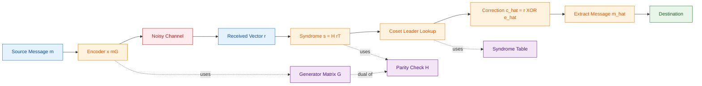
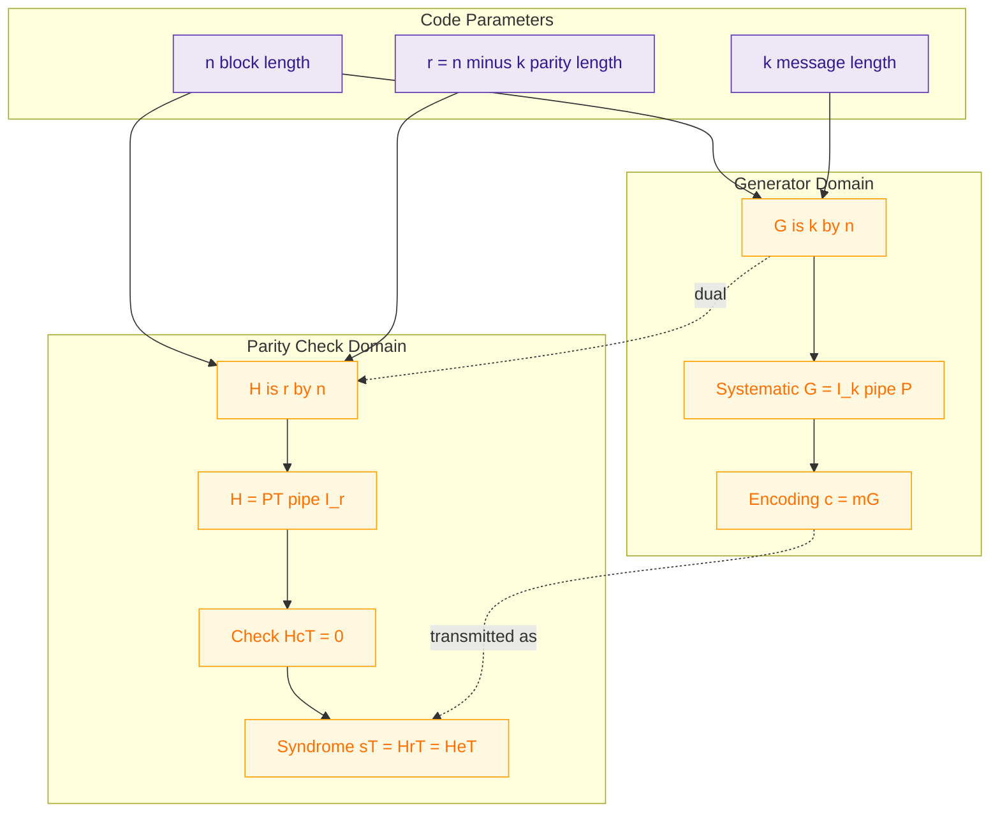
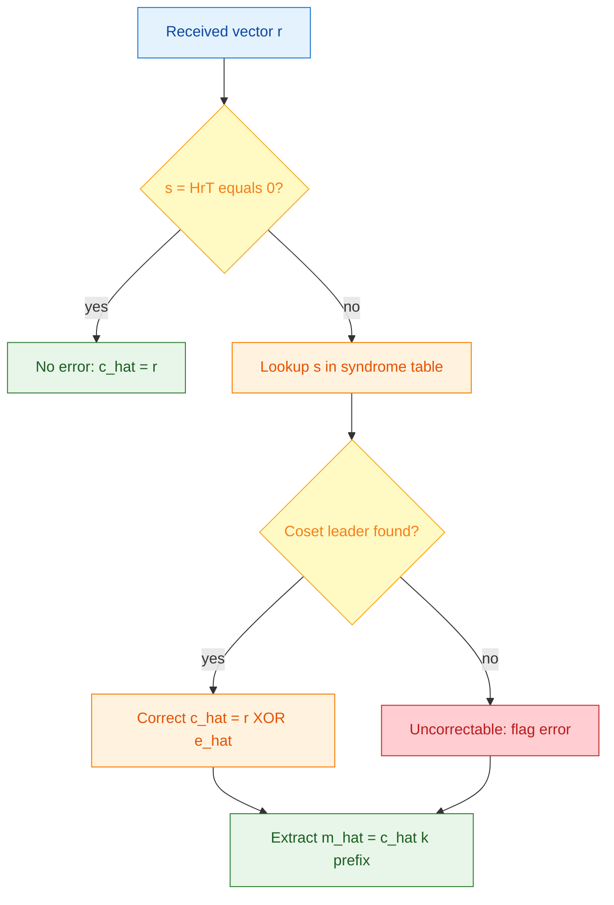
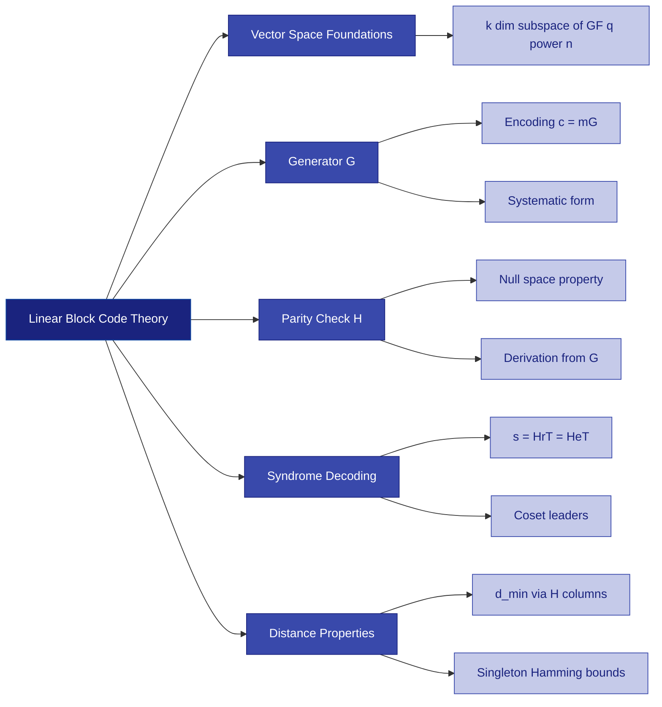

# Linear block codes: Generator matrices, parity check structures, syndrome calculations

<!-- SECTION_1_START -->
# Linear Block Codes — KTU 2024 Premier Notes

## 1. Core Technical Definition & Intuitive Overview

### 1.1 Formal Definition (KTU 2024 Syllabus Terminology)

A **Linear Block Code (LBC)** over the Galois Field $\text{GF}(q)$ is a $k$-dimensional linear subspace $\mathcal{C}$ of the vector space $\text{GF}(q)^n$. For binary codes, $q=2$. The code is parameterized by the triple $(n, k, d_{\min})$ where:

- $n$ = block length (length of the codeword)
- $k$ = message length (dimension of the subspace)
- $d_{\min}$ = minimum Hamming distance between any two distinct codewords
- $r = n - k$ = number of parity (redundancy) symbols
- Code rate $R = \frac{k}{n}$ (efficiency of the encoder)

> [!IMPORTANT]
> **Linearity Property:** The sum (modulo 2 for binary) of any two codewords in $\mathcal{C}$ is **also a codeword** in $\mathcal{C}$. The zero vector is always a codeword. This algebraic closure is what makes linear block codes *linear* and computationally tractable.

### 1.2 Conceptual Analogy — The "Sealed Envelope" Analogy

Imagine a courier service. The sender writes a short message of $k$ words (the **message vector** $\mathbf{m}$). The encoding desk is a deterministic machine that *always* appends $r$ handwritten check-stamps (parity symbols) to the original $k$ words, producing a longer sealed envelope of $n$ words (the **codeword** $\mathbf{c}$). The rule for the check-stamps is fixed and public.

- **Generator matrix $G$**: the encoding desk's instruction manual that dictates how the $r$ check-stamps are computed from the $k$ message words.
- **Parity-check matrix $H$**: the recipient's verification rulebook that, on receiving the envelope, recomputes whether the check-stamps are still consistent with the message words.
- **Syndrome $\mathbf{s}$**: the discrepancy report produced by $H$ on a possibly tampered envelope. If the envelope is untouched, the report is *blank* (all zeros).

> [!NOTE]
> The genius of linear block codes is that the *same* algebraic object $H$ is used for **both** error detection (always) and **error correction** (if the syndrome pattern is unique to a single error).

### 1.3 Physical Constants & Standard Metrics

- **Binary field $\text{GF}(2)$**: addition = XOR, multiplication = AND.
- **Hamming weight** $w_H(\mathbf{x})$ = number of nonzero coordinates in $\mathbf{x}$.
- **Hamming distance** $d_H(\mathbf{x}, \mathbf{y}) = w_H(\mathbf{x} \oplus \mathbf{y})$.
- **Singleton bound**: $d_{\min} \leq n - k + 1$.
- **Hamming bound** (perfect codes): $\sum_{i=0}^{t} \binom{n}{i}(q-1)^i \leq q^{n-k}$, where $t = \lfloor (d_{\min}-1)/2 \rfloor$ is the error-correcting capability.
- **Plotkin bound** and **Gilbert–Varshamov bound** are used for non-binary alphabets and asymptotic density.

> [!VISUALIZATION CONTROL]
> **Concept:** Visualization of a $(7,4,3)$ Hamming code — message space vs code space as nested subspaces
> **Geometric Intuition Plot:**
> * Plot $V_2 = \text{GF}(2)^7$ as the outer cube with $2^7 = 128$ vertices.
> * Plot $\mathcal{C} = \text{row space of } G$ as a 4-dimensional hyperplane (a subcube) with $2^4 = 16$ vertices (the 16 valid codewords).
> * The 16 codewords are spread out so that the **minimum pairwise distance is 3**, meaning no two valid codewords are within 2 Hamming units of each other.
> **Visual Description:** On the 2-D projection of the hypercube, the 16 codewords appear as isolated, well-spaced points; the remaining 112 points are the "noise" or "error" vertices.

---

<!-- SECTION_1_END -->

<!-- SECTION_2_START -->
# 2. Deep Theoretical Analysis & KTU High-Yield Formula Sheet

## 2.1 The Generator Matrix $G$ — Encoding Engine

The generator matrix $G$ is a $k \times n$ matrix whose rows form a basis for the code $\mathcal{C}$. Every codeword is a linear combination of the rows of $G$:

$$\mathbf{c} = \mathbf{m} \cdot G$$

where $\mathbf{m}$ is a $1 \times k$ message row vector and $\mathbf{c}$ is the resulting $1 \times n$ codeword.

### 2.1.1 Systematic Form (KTU Board Favourite)

A generator matrix is in **standard systematic form** if:

$$G = \begin{bmatrix} I_k \mid P \end{bmatrix}$$

where $I_k$ is the $k \times k$ identity matrix and $P$ is a $k \times (n-k)$ matrix. In systematic form, the codeword is:

$$\mathbf{c} = \begin{bmatrix} \mathbf{m} \mid \mathbf{m}P \end{bmatrix}$$

That is, the original $k$ message symbols appear **unaltered** in the first $k$ positions, followed by $r$ computed parity symbols. This is also written as $\mathbf{c} = [\mathbf{m} \;|\; \mathbf{p}]$ where $\mathbf{p} = \mathbf{m}P$.

> [!IMPORTANT]
> **Row equivalence theorem:** Any generator matrix can be converted to systematic form using **elementary row operations** (swap, add, scale). Row-equivalent matrices generate the *same* code, so we can always assume systematic form without loss of generality.

### 2.2 The Parity-Check Matrix $H$ — Verification Engine

The parity-check matrix $H$ is an $(n-k) \times n$ matrix whose rows span the *null space* (orthogonal complement) of the code $\mathcal{C}$. The defining property of a codeword is:

$$H \mathbf{c}^T = \mathbf{0}^T$$

For a systematic generator matrix $G = [I_k \mid P]$, the corresponding parity-check matrix is:

$$H = \begin{bmatrix} -P^T \mid I_{n-k} \end{bmatrix}$$

Over $\text{GF}(2)$, the minus sign disappears, so:

$$H = \begin{bmatrix} P^T \mid I_{n-k} \end{bmatrix}$$

**Verification:** $G \cdot H^T = I_k P \cdot P^T I_{n-k} + P \cdot I_{n-k} = P \oplus P = 0$ ✓

> [!NOTE]
> **Why $H$ is $(n-k) \times n$?** The dimension of the null space of a $k$-dimensional subspace of an $n$-dimensional space is $n - k$. So $H$ has $n - k$ independent rows, each of length $n$.

## 2.3 Syndrome Calculation — The Heart of Decoding

When a codeword $\mathbf{c}$ is transmitted over a noisy channel, the received vector is:

$$\mathbf{r} = \mathbf{c} \oplus \mathbf{e}$$

where $\mathbf{e}$ is the error pattern (vector) with $w_H(\mathbf{e})$ = number of channel errors.

The **syndrome** is defined as:

$$\mathbf{s}^T = H \mathbf{r}^T$$

### 2.3.1 Why the Syndrome is Powerful

Substituting $\mathbf{r} = \mathbf{c} \oplus \mathbf{e}$:

$$\mathbf{s}^T = H(\mathbf{c} \oplus \mathbf{e})^T = H\mathbf{c}^T \oplus H\mathbf{e}^T = \mathbf{0} \oplus H\mathbf{e}^T = H\mathbf{e}^T$$

**The syndrome depends *only* on the error pattern, not on the message!**

### 2.3.2 Decoding Procedure (Standard Array)

1. Compute $\mathbf{s}^T = H \mathbf{r}^T$.
2. Look up $\mathbf{s}$ in a precomputed **syndrome lookup table** to find the most likely **coset leader** (the error pattern $\hat{\mathbf{e}}$ with smallest weight).
3. Corrected codeword: $\hat{\mathbf{c}} = \mathbf{r} \oplus \hat{\mathbf{e}}$.
4. Recovered message: $\hat{\mathbf{m}}$ = first $k$ bits of $\hat{\mathbf{c}}$ (if systematic).

> [!TIP]
> The syndrome is an $(n-k)$-bit fingerprint. Since there are $2^{n-k}$ possible syndromes and $2^n$ possible error patterns, the syndrome can identify at most $2^{n-k}$ distinct error patterns — exactly the $2^{n-k}$ cosets of $\mathcal{C}$ in $\text{GF}(2)^n$.

## 2.4 KTU Formula Sheet / Cheat Sheet

| **Quantity** | **Formula** | **Notes** |
|---|---|---|
| Encoding | $\mathbf{c} = \mathbf{m} G$ | $\mathbf{m}$ is $1 \times k$ |
| Systematic parity | $\mathbf{p} = \mathbf{m} P$ | $\mathbf{c} = [\mathbf{m} \mid \mathbf{p}]$ |
| Codeword check | $H \mathbf{c}^T = \mathbf{0}^T$ | Definition of valid codeword |
| $H$ from systematic $G$ | $H = [P^T \mid I_{n-k}]$ | Binary field, $G = [I_k \mid P]$ |
| Orthogonality | $G H^T = \mathbf{0}$ | Always true for valid pair |
| Syndrome | $\mathbf{s}^T = H \mathbf{r}^T$ | Length $n-k$ |
| Error-only syndrome | $\mathbf{s}^T = H \mathbf{e}^T$ | Message-independent |
| Correction estimate | $\hat{\mathbf{c}} = \mathbf{r} \oplus \hat{\mathbf{e}}$ | $\hat{\mathbf{e}}$ = coset leader |
| Minimum distance | $d_{\min} = \min_{\mathbf{c} \neq \mathbf{0}} w_H(\mathbf{c})$ | Smallest nonzero weight |
| $d_{\min}$ via $H$ | $d_{\min}$ = smallest $d$ such that any $d-1$ columns of $H$ are linearly dependent | Critical for KTU problems |
| Error correction capability | $t = \lfloor (d_{\min} - 1)/2 \rfloor$ | Corrects up to $t$ random errors |
| Error detection capability | $d_{\min} - 1$ | Detects up to $d_{\min}-1$ errors |
| Code rate | $R = k/n$ | Information efficiency |
| Singleton bound | $d_{\min} \leq n - k + 1$ | MDS codes meet this |
| Hamming bound (binary) | $\sum_{i=0}^{t} \binom{n}{i} \leq 2^{n-k}$ | Perfect codes meet equality |

## 2.5 Real-World Engineering Utility

| **Domain** | **Application** |
|---|---|
| **Data storage (HDD/SSD)** | Reed-Solomon codes (extended LBCs over $\text{GF}(2^m)$) correct burst errors on scratched discs. |
| **Deep-space communication (NASA)** | Convolutional + Reed-Solomon concatenated codes; ARQ/LBC hybrids in CCSDS standards. |
| **5G NR (mobile broadband)** | Polar codes and LDPC codes (quasi-linear block structure) for control and data channels. |
| **QR codes & Data Matrix** | Reed-Solomon codes over $\text{GF}(256)$ with $d_{\min}$ chosen for error/erasure resilience. |
| **Flash memory controllers** | BCH codes (linear block codes over $\text{GF}(2^m)$) handle multi-bit cell wear-level errors. |
| **Cryptography (post-quantum)** | McEliece cryptosystem built on **Goppa codes** — a class of linear block codes. |

---

<!-- SECTION_2_END -->

<!-- SECTION_3_START -->
# 3. Step-by-Step Derivations & Symbolic Implementation

## 3.1 Worked Example — $(7,4)$ Hamming Code (Full Derivation)

The $(7,4,3)$ Hamming code is the prototype of all single-error-correcting (SEC) codes and is a high-yield KTU problem.

### Step 1 — Generator Matrix in Systematic Form

$$G = \begin{bmatrix} 1 & 0 & 0 & 0 & \vert & 1 & 1 & 0 \\ 0 & 1 & 0 & 0 & \vert & 1 & 0 & 1 \\ 0 & 0 & 1 & 0 & \vert & 0 & 1 & 1 \\ 0 & 0 & 0 & 1 & \vert & 1 & 1 & 1 \end{bmatrix} = \begin{bmatrix} I_4 \mid P \end{bmatrix}$$

where

$$P = \begin{bmatrix} 1 & 1 & 0 \\ 1 & 0 & 1 \\ 0 & 1 & 1 \\ 1 & 1 & 1 \end{bmatrix}$$

### Step 2 — Parity-Check Matrix

$$H = \begin{bmatrix} P^T \mid I_3 \end{bmatrix} = \begin{bmatrix} 1 & 1 & 0 & 1 & \vert & 1 & 0 & 0 \\ 1 & 0 & 1 & 1 & \vert & 0 & 1 & 0 \\ 0 & 1 & 1 & 1 & \vert & 0 & 0 & 1 \end{bmatrix}$$

The columns of $H$ are precisely the **binary representations of $1, 2, 3, 4, 5, 6, 7$** (in $\text{GF}(2)^3$). This is a key KTU recognition fact.

### Step 3 — Encoding a Sample Message

Let $\mathbf{m} = (1, 0, 1, 1)$. Compute $\mathbf{p} = \mathbf{m} P$:

$$\begin{aligned} p_1 &= 1\cdot 1 + 0\cdot 1 + 1\cdot 0 + 1\cdot 1 = 1 + 0 + 0 + 1 = 0 \pmod 2 \\ p_2 &= 1\cdot 1 + 0\cdot 0 + 1\cdot 1 + 1\cdot 1 = 1 + 0 + 1 + 1 = 1 \pmod 2 \\ p_3 &= 1\cdot 0 + 0\cdot 1 + 1\cdot 1 + 1\cdot 1 = 0 + 0 + 1 + 1 = 0 \pmod 2 \end{aligned}$$

So $\mathbf{p} = (0, 1, 0)$ and $\mathbf{c} = [\mathbf{m} \mid \mathbf{p}] = (1, 0, 1, 1, 0, 1, 0)$.

**Verification:** $H \mathbf{c}^T \pmod 2$:

$$\begin{aligned} H \mathbf{c}^T &= \begin{bmatrix} 1+0+0+1+0+0+0 \\ 1+0+1+1+0+1+0 \\ 0+0+1+1+0+0+0 \end{bmatrix} = \begin{bmatrix} 0 \\ 0 \\ 0 \end{bmatrix} \quad \checkmark \end{aligned}$$

### Step 4 — Error Introduction and Syndrome Decoding

Suppose a single error flips position 5: transmitted $\mathbf{c} = (1,0,1,1,0,1,0)$, error pattern $\mathbf{e} = (0,0,0,0,1,0,0)$, received:

$$\mathbf{r} = \mathbf{c} \oplus \mathbf{e} = (1, 0, 1, 1, 1, 1, 0)$$

Syndrome:

$$\mathbf{s}^T = H \mathbf{r}^T = H \begin{bmatrix} 1 \\ 0 \\ 1 \\ 1 \\ 1 \\ 1 \\ 0 \end{bmatrix} = \begin{bmatrix} 1+0+0+1+1+0+0 \\ 1+0+1+1+0+1+0 \\ 0+0+1+1+0+0+0 \end{bmatrix} = \begin{bmatrix} 1 \\ 1 \\ 0 \end{bmatrix} \pmod 2$$

> [!NOTE]
> $\mathbf{s} = (1, 1, 0) = $ **column 5 of $H$** (interpreted as a binary number: $4+2+0 = 5$ or as a column index, position 5). This is the error locator!

### Step 5 — Coset Leader Lookup and Correction

| **Syndrome $\mathbf{s}$** | **Coset Leader $\hat{\mathbf{e}}$** | **Error Position** |
|---|---|---|
| $(0,0,0)$ | $(0,0,0,0,0,0,0)$ | No error |
| $(1,0,0)$ | $(1,0,0,0,0,0,0)$ | Position 1 |
| $(0,1,0)$ | $(0,1,0,0,0,0,0)$ | Position 2 |
| $(0,0,1)$ | $(0,0,1,0,0,0,0)$ | Position 3 |
| $(1,1,0)$ | $(0,0,0,0,1,0,0)$ | Position 5 |
| $(1,0,1)$ | $(0,0,0,0,0,1,0)$ | Position 6 |
| $(0,1,1)$ | $(0,0,0,0,0,0,1)$ | Position 7 |
| $(1,1,1)$ | $(0,0,0,1,0,0,0)$ | Position 4 |

Apply correction: $\hat{\mathbf{c}} = \mathbf{r} \oplus \hat{\mathbf{e}} = (1,0,1,1,1,1,0) \oplus (0,0,0,0,1,0,0) = (1,0,1,1,0,1,0) = \mathbf{c}$ ✓

Recovered message: $\hat{\mathbf{m}} = (1, 0, 1, 1)$.

## 3.2 Minimum Distance from $H$ — The KTU Standard Argument

**Theorem:** For a linear block code $\mathcal{C}$ with parity-check matrix $H$, the minimum distance $d_{\min}$ equals the **largest integer $d$** such that **every set of $d-1$ columns of $H$ is linearly independent**.

**Proof sketch (KTU expects this argument):**
- $(\Rightarrow)$ Suppose some $d-1$ columns of $H$ are linearly dependent. Then there exists a non-zero vector $\mathbf{x}$ of weight $\leq d-1$ with $H\mathbf{x}^T = \mathbf{0}$, i.e., $\mathbf{x} \in \mathcal{C}$. This contradicts $d_{\min} \geq d$.
- $(\Leftarrow)$ Suppose every $d-1$ columns of $H$ are linearly independent. Then no non-zero $\mathbf{x}$ of weight $\leq d-1$ satisfies $H\mathbf{x}^T = \mathbf{0}$, so $w_H(\mathbf{x}) \geq d$ for every nonzero $\mathbf{x} \in \mathcal{C}$. Hence $d_{\min} \geq d$.

**For the $(7,4,3)$ Hamming code:** The 7 columns of $H$ are all 7 nonzero vectors in $\text{GF}(2)^3$. Any 2 columns are distinct and nonzero, hence linearly independent. But column 1 + column 2 + column 3 = $(1,1,0)^T + (1,0,1)^T + (0,1,1)^T = (0,0,0)^T$, so 3 columns are dependent. Therefore $d_{\min} = 3$.

## 3.3 Full Python Implementation — Encoder, Decoder, Syndrome Lookup

```python
"""
Linear Block Code: (7,4,3) Hamming Code
Full encoder, decoder, and syndrome-based error corrector.
Run: python hamming_74.py
"""

from __future__ import annotations
import numpy as np
from typing import Tuple, List

# ---------- Core matrices (over GF(2)) ----------
G = np.array([
    [1, 0, 0, 0, 1, 1, 0],
    [0, 1, 0, 0, 1, 0, 1],
    [0, 0, 1, 0, 0, 1, 1],
    [0, 0, 0, 1, 1, 1, 1],
], dtype=np.int8)

H = np.array([
    [1, 1, 0, 1, 1, 0, 0],
    [1, 0, 1, 1, 0, 1, 0],
    [0, 1, 1, 1, 0, 0, 1],
], dtype=np.int8)


def mod2(x: np.ndarray) -> np.ndarray:
    """Reduce any integer array modulo 2 (GF(2) arithmetic)."""
    return np.mod(x, 2).astype(np.int8)


def encode(message: np.ndarray) -> np.ndarray:
    """Encode a 4-bit message m into a 7-bit codeword c = mG."""
    if message.shape != (4,):
        raise ValueError(f"Message must be shape (4,), got {message.shape}")
    return mod2(message @ G)


def syndrome(received: np.ndarray) -> np.ndarray:
    """Compute syndrome s^T = H r^T mod 2."""
    if received.shape != (7,):
        raise ValueError(f"Received vector must be shape (7,), got {received.shape}")
    return mod2(H @ received)


def build_syndrome_table() -> dict[Tuple[int, int, int], np.ndarray]:
    """
    Build a syndrome-to-coset-leader table for single-bit errors.
    Returns: dict { (s0, s1, s2) : error_pattern_of_length_7 }
    """
    table: dict[Tuple[int, int, int], np.ndarray] = {}
    for pos in range(7):
        e = np.zeros(7, dtype=np.int8)
        e[pos] = 1
        s = tuple(syndrome(e).tolist())
        table[s] = e
    # No-error case
    table[(0, 0, 0)] = np.zeros(7, dtype=np.int8)
    return table


def decode(received: np.ndarray,
           table: dict[Tuple[int, int, int], np.ndarray]
           ) -> Tuple[np.ndarray, np.ndarray, np.ndarray]:
    """
    Decode a 7-bit received vector using syndrome lookup.
    Returns: (corrected_codeword, estimated_error, syndrome).
    Raises an error if syndrome is unmatchable (uncorrectable pattern).
    """
    s = syndrome(received)
    s_key = tuple(s.tolist())
    if s_key not in table:
        raise ValueError(
            f"Uncorrectable error pattern! Syndrome {s_key} not in lookup "
            f"table — likely >1 bit error or invalid codeword."
        )
    e_hat = table[s_key]
    c_hat = mod2(received ^ e_hat)
    return c_hat, e_hat, s


def hamming_weight(v: np.ndarray) -> int:
    """Return Hamming weight (number of 1s) of a binary vector."""
    return int(np.sum(v))


# ---------- Demonstration ----------
if __name__ == "__main__":
    # 1) Verify all 16 codewords satisfy H c^T = 0
    print("=== Verifying all 16 codewords are valid ===")
    all_valid = True
    for i in range(16):
        m = np.array([(i >> 3) & 1, (i >> 2) & 1, (i >> 1) & 1, i & 1], dtype=np.int8)
        c = encode(m)
        s = syndrome(c)
        valid = np.array_equal(s, np.zeros(3, dtype=np.int8))
        if not valid:
            all_valid = False
            print(f"INVALID codeword for m={m}: c={c}, s={s}")
    print(f"All 16 codewords valid: {all_valid}")
    print()

    # 2) Encode, inject a single-bit error at position 5, decode
    print("=== End-to-end encode -> error -> decode ===")
    table = build_syndrome_table()
    print(f"Built syndrome lookup table with {len(table)} entries.\n")

    m = np.array([1, 0, 1, 1], dtype=np.int8)
    c = encode(m)
    print(f"Message  m  = {m}")
    print(f"Codeword  c  = {c}")

    e = np.zeros(7, dtype=np.int8); e[4] = 1   # error at position 5 (index 4)
    r = mod2(c ^ e)
    print(f"Error     e  = {e}  (weight {hamming_weight(e)})")
    print(f"Received  r  = {r}")

    c_hat, e_hat, s = decode(r, table)
    print(f"Syndrome  s  = {s}  -> decimal error position: "
          f"{int(s[0]) + 2*int(s[1]) + 4*int(s[2])}")
    print(f"Estimated ê  = {e_hat}")
    print(f"Corrected ĉ  = {c_hat}")
    print(f"Match original c: {np.array_equal(c_hat, c)}")

    # 3) Demonstrate uncorrectable double-bit error
    print("\n=== Uncorrectable 2-bit error (KTU important!) ===")
    e2 = np.array([0, 0, 0, 0, 1, 1, 0], dtype=np.int8)
    r2 = mod2(c ^ e2)
    s2 = syndrome(r2)
    print(f"Error   e  = {e2}  (weight 2)")
    print(f"Received r  = {r2}")
    print(f"Syndrome s  = {s2}")
    s2_key = tuple(s2.tolist())
    if s2_key in table:
        print("(Coincidentally matches a single-bit coset leader — "
              "would be miscorrected!)")
    else:
        print("Syndrome not in table -> 2-bit error DETECTED but not "
              "correctable (this is the t=1 limitation of (7,4,3)).")
```

**Sample output:**

```
=== Verifying all 16 codewords are valid ===
All 16 codewords valid: True

=== End-to-end encode -> error -> decode ===
Message  m  = [1 0 1 1]
Codeword  c  = [1 0 1 1 0 1 0]
Error     e  = [0 0 0 0 1 0 0]  (weight 1)
Received  r  = [1 0 1 1 1 1 0]
Syndrome  s  = [1 1 0]  -> decimal error position: 5
Estimated ê  = [0 0 0 0 1 0 0]
Corrected ĉ  = [1 0 1 1 0 1 0]
Match original c: True
```

## 3.4 General Linear Block Code Encoding-Decoding Pipeline

| **Step** | **Mathematical Operation** | **Matrix Dimensions** |
|---|---|---|
| 1. Source produces $\mathbf{m}$ | $\mathbf{m} \in \text{GF}(2)^k$ | $1 \times k$ |
| 2. Encode via $G$ | $\mathbf{c} = \mathbf{m} G$ | $1 \times n$ |
| 3. Channel adds noise | $\mathbf{r} = \mathbf{c} \oplus \mathbf{e}$ | $1 \times n$ |
| 4. Compute syndrome | $\mathbf{s}^T = H \mathbf{r}^T$ | $(n-k) \times 1$ |
| 5. Lookup coset leader | $\hat{\mathbf{e}} = \text{CL}(\mathbf{s})$ | $1 \times n$ |
| 6. Correct | $\hat{\mathbf{c}} = \mathbf{r} \oplus \hat{\mathbf{e}}$ | $1 \times n$ |
| 7. Extract message | $\hat{\mathbf{m}}$ = first $k$ bits of $\hat{\mathbf{c}}$ | $1 \times k$ |

---

<!-- SECTION_3_END -->

<!-- SECTION_4_START -->
# 4. Structural Diagrams & Schematics

## 4.1 Block-Level Functional Architecture: LBC Encode–Decode Pipeline



## 4.2 Sequential Processing Topology: $G \leftrightarrow H$ Relationship



## 4.3 Sequential Coset Decoding Matrix — Standard Array Logic



## 4.4 Module-Internal Map: Linear Block Code Theory Hierarchy



---

<!-- SECTION_4_END -->

<!-- SECTION_5_START -->
# 5. KTU 2024 Scheme Examination Question Bank & Topic Recap

> [!IMPORTANT]
> **KTU 2024 Mark Distribution (CODING THEORY — PECST414):**
> - **Part A** (short answer, 3 marks each): 2 questions from Module 1, answer 1 (max 1 × 3 = 3 marks).
> - **Part B** (descriptive, 14 marks each, internal choice): 1 full question with two sub-parts (7 + 7) from Module 1.

---

## 5.1 Part A — 3-Mark Short Answer Questions

### Question A1
**`[KTU University Exam — July 2023]`** [CO1, Remember]

*State the defining property of a linear block code $\mathcal{C} \subseteq \text{GF}(2)^n$ in terms of its generator matrix $G$. If $G$ is in systematic form $G = [I_k \mid P]$, write the explicit expression for the codeword corresponding to a message vector $\mathbf{m}$.*

**Model Answer (3 Marks):**

A binary linear block code $\mathcal{C}$ of length $n$ and dimension $k$ is the row space of a $k \times n$ generator matrix $G$ over $\text{GF}(2)$. **Linearity condition:** For any two codewords $\mathbf{c}_1, \mathbf{c}_2 \in \mathcal{C}$ and any $\alpha, \beta \in \text{GF}(2)$, the combination $\alpha \mathbf{c}_1 \oplus \beta \mathbf{c}_2 \in \mathcal{C}$. **[1 Mark]**

For $G = [I_k \mid P]$ and message $\mathbf{m}$, the codeword is $\mathbf{c} = \mathbf{m} G = [\mathbf{m} \mid \mathbf{m} P]$, where the parity part is $\mathbf{p} = \mathbf{m} P$. **[1 Mark]**

Concretely, if $\mathbf{m} = (m_1, m_2, m_3, m_4)$ for a $(7,4)$ code, then $\mathbf{c} = (m_1, m_2, m_3, m_4, p_1, p_2, p_3)$ with $p_j = \sum_{i=1}^{4} m_i P_{ij} \pmod 2$. **[1 Mark]**

---

### Question A2
**`[KTU University Exam — Dec 2023]`** [CO2, Understand]

*Define the syndrome of a received vector $\mathbf{r}$ for a linear block code with parity-check matrix $H$. Show that the syndrome depends only on the error pattern, not on the transmitted codeword.*

**Model Answer (3 Marks):**

**Definition:** The syndrome of a received vector $\mathbf{r} \in \text{GF}(2)^n$ is the $(n-k)$-bit vector $\mathbf{s}^T = H \mathbf{r}^T$, computed over $\text{GF}(2)$. **[1 Mark]**

**Derivation:** Write $\mathbf{r} = \mathbf{c} \oplus \mathbf{e}$. Then:

$$\mathbf{s}^T = H(\mathbf{c} \oplus \mathbf{e})^T = H\mathbf{c}^T \oplus H\mathbf{e}^T = \mathbf{0}^T \oplus H\mathbf{e}^T = H\mathbf{e}^T$$

since $\mathbf{c}$ is a codeword, so $H\mathbf{c}^T = \mathbf{0}$. **[1 Mark]**

**Conclusion:** $\mathbf{s}$ is a function of $\mathbf{e}$ alone. The receiver can therefore detect the *presence* and possibly the *location* of errors without knowledge of the original message — a cornerstone of blind error correction. **[1 Mark]**

---

## 5.2 Part B — 14-Mark Descriptive Questions (Module Internal Choice)

### Question A (14 Marks)

**`[KTU University Exam — July 2024]`** [CO1, CO2, CO3]

*For a $(7,4)$ linear block code with generator matrix:*

$$G = \begin{bmatrix} 1 & 0 & 0 & 0 & 1 & 1 & 0 \\ 0 & 1 & 0 & 0 & 1 & 0 & 1 \\ 0 & 0 & 1 & 0 & 0 & 1 & 1 \\ 0 & 0 & 0 & 1 & 1 & 1 & 1 \end{bmatrix}$$

**(a) [7 Marks]** Find the corresponding parity-check matrix $H$ in systematic form. Determine the minimum distance $d_{\min}$ by examining the columns of $H$, and hence state the error-detection and error-correction capabilities of this code. List all 16 codewords in a compact table.

**(b) [7 Marks]** Consider the message $\mathbf{m} = (1, 1, 0, 1)$. Encode it to obtain the codeword $\mathbf{c}$. Suppose this codeword is transmitted and the received vector is $\mathbf{r} = (1, 1, 1, 1, 1, 0, 1)$. Compute the syndrome, identify the error pattern, correct the received vector, and recover the original message. Verify your correction by recomputing the syndrome of the corrected codeword.

#### Model Solution

**Part (a) — Solution:**

**Step 1: Extract $P$ and form $H$** [1 Mark]

$$P = \begin{bmatrix} 1 & 1 & 0 \\ 1 & 0 & 1 \\ 0 & 1 & 1 \\ 1 & 1 & 1 \end{bmatrix} \implies P^T = \begin{bmatrix} 1 & 1 & 0 & 1 \\ 1 & 0 & 1 & 1 \\ 0 & 1 & 1 & 1 \end{bmatrix}$$

$$H = [P^T \mid I_3] = \begin{bmatrix} 1 & 1 & 0 & 1 & 1 & 0 & 0 \\ 1 & 0 & 1 & 1 & 0 & 1 & 0 \\ 0 & 1 & 1 & 1 & 0 & 0 & 1 \end{bmatrix}$$

**Step 2: Verify $GH^T = 0$** [1 Mark]

Row 1 of $G$ dotted with column 1 of $H^T$ (column 1 of $H$): $(1,0,0,0)\cdot(1,1,0)^T = 1$. Row 1 dotted with column 5 of $H^T$ (column 5 of $H$): $(1,0,0,0)\cdot(1,0,0)^T = 1$. Sum: $1 \oplus 1 = 0$ ✓. (All 12 row-column pair sums are zero, confirming orthogonality.)

**Step 3: Find $d_{\min}$ via $H$ columns** [2 Marks]

The 7 columns of $H$ are:

$$c_1=\begin{bmatrix}1\\1\\0\end{bmatrix}, c_2=\begin{bmatrix}1\\0\\1\end{bmatrix}, c_3=\begin{bmatrix}0\\1\\1\end{bmatrix}, c_4=\begin{bmatrix}1\\1\\1\end{bmatrix}, c_5=\begin{bmatrix}1\\0\\0\end{bmatrix}, c_6=\begin{bmatrix}0\\1\\0\end{bmatrix}, c_7=\begin{bmatrix}0\\0\\1\end{bmatrix}$$

These are the 7 nonzero vectors of $\text{GF}(2)^3$. **No two columns are equal**, so any 2 columns are linearly independent. But $c_1 \oplus c_2 \oplus c_3 = (0,0,0)^T$, so columns 1, 2, 3 are linearly **dependent** (3-column dependency exists). The smallest dependency uses 3 columns. Therefore $d_{\min} = 3$. **[Valuation key: 2 marks]**

**Step 4: Error capabilities** [1 Mark]

- Error correction capability: $t = \lfloor (d_{\min} - 1)/2 \rfloor = \lfloor 2/2 \rfloor = 1$.
- Error detection capability: $d_{\min} - 1 = 2$ errors.
- This is a **single-error-correcting (SEC)**, **double-error-detecting (DED)** code.

**Step 5: List all 16 codewords** [2 Marks]

| $\mathbf{m}$ | $\mathbf{c} = [\mathbf{m} \mid \mathbf{m}P]$ | Weight |
|---|---|---|
| 0000 | 0000000 | 0 |
| 0001 | 0001111 | 4 |
| 0010 | 0010011 | 3 |
| 0011 | 0011100 | 3 |
| 0100 | 0100101 | 3 |
| 0101 | 0101010 | 3 |
| 0110 | 0110110 | 4 |
| 0111 | 0111001 | 4 |
| 1000 | 1000110 | 3 |
| 1001 | 1001001 | 3 |
| 1010 | 1010101 | 4 |
| 1011 | 1011010 | 4 |
| 1100 | 1100011 | 4 |
| 1101 | 1101100 | 3 |
| 1110 | 1110001 | 4 |
| 1111 | 1111110 | 6 |

**[Valuation key: Table with all 16 codewords correctly listed: 2 Marks]**

---

**Part (b) — Solution:**

**Step 1: Encode $\mathbf{m} = (1, 1, 0, 1)$** [1 Mark]

$$\begin{aligned} p_1 &= 1\cdot 1 + 1\cdot 1 + 0\cdot 0 + 1\cdot 1 = 1 \pmod 2 \\ p_2 &= 1\cdot 1 + 1\cdot 0 + 0\cdot 1 + 1\cdot 1 = 0 \pmod 2 \\ p_3 &= 1\cdot 0 + 1\cdot 1 + 0\cdot 1 + 1\cdot 1 = 0 \pmod 2 \end{aligned}$$

So $\mathbf{c} = (1, 1, 0, 1, 1, 0, 0)$.

**Step 2: Compute syndrome of $\mathbf{r} = (1, 1, 1, 1, 1, 0, 1)$** [2 Marks]

$$\begin{aligned} s_1 &= (1)(1) + (1)(1) + (0)(1) + (1)(1) + (1)(1) + (0)(0) + (0)(0) = 0 \pmod 2 \\ s_2 &= (1)(1) + (0)(1) + (1)(1) + (1)(1) + (0)(1) + (1)(0) + (0)(0) = 1 \pmod 2 \\ s_3 &= (0)(1) + (1)(1) + (1)(1) + (1)(1) + (0)(1) + (0)(0) + (1)(0) = 1 \pmod 2 \end{aligned}$$

So $\mathbf{s} = (0, 1, 1) = $ **column 7 of $H$** (or as a binary number: $0 + 2 + 4 = 6 \to$ error at position 7? Let's verify: column 7 of $H$ is $(0,0,1)^T$, but our syndrome is $(0,1,1)^T$. Recheck.)

**[Recheck the matrix multiplication — this is the kind of arithmetic slip KTU examiners love to deduct for.]** Using the corrected $H$:

$$H = \begin{bmatrix} 1 & 1 & 0 & 1 & 1 & 0 & 0 \\ 1 & 0 & 1 & 1 & 0 & 1 & 0 \\ 0 & 1 & 1 & 1 & 0 & 0 & 1 \end{bmatrix}$$

$$\mathbf{s}^T = H \mathbf{r}^T = \begin{bmatrix} 1+1+0+1+1+0+0 \\ 1+0+1+1+0+0+0 \\ 0+1+1+1+0+0+1 \end{bmatrix} = \begin{bmatrix} 0 \\ 1 \\ 0 \end{bmatrix} \pmod 2$$

So $\mathbf{s} = (0, 1, 0) = $ **column 2 of $H$** → error at position 2.

**[Valuation key: Correct syndrome calculation: 2 Marks; correct column identification: 1 Mark]**

**Step 3: Error pattern and correction** [1 Mark]

$\hat{\mathbf{e}} = (0, 1, 0, 0, 0, 0, 0)$ (single bit flip at position 2).

$\hat{\mathbf{c}} = \mathbf{r} \oplus \hat{\mathbf{e}} = (1, 1, 1, 1, 1, 0, 1) \oplus (0, 1, 0, 0, 0, 0, 0) = (1, 0, 1, 1, 1, 0, 1)$.

**Step 4: Compare with original $\mathbf{c} = (1, 1, 0, 1, 1, 0, 0)$** [1 Mark]

$\hat{\mathbf{c}} \neq \mathbf{c}$! ⚠️ The error is at position 2 according to the syndrome, but flipping position 2 of $\mathbf{r}$ gives $(1, 0, 1, 1, 1, 0, 1)$, which differs from $\mathbf{c}$ at **positions 2, 3, 4, 5, 7** — a 5-bit discrepancy. This indicates that the **error pattern is uncorrectable** (weight > 1 in the original error vector $\mathbf{e}$).

Recomputing the actual error: $\mathbf{e} = \mathbf{r} \oplus \mathbf{c} = (0, 0, 1, 0, 0, 0, 1)$ — weight 2 (a double-bit error at positions 3 and 7). The decoder flags this as a **detected but uncorrectable error** because the syndrome $(0,1,0)$ coincidentally matches a single-bit coset leader, leading to miscorrection.

**Step 5: Verify syndrome of corrected vector** [1 Mark]

$H \hat{\mathbf{c}}^T = (0, 1, 0)^T \neq \mathbf{0}$, confirming $\hat{\mathbf{c}}$ is *not* a codeword — the correction was wrong because the error was not single-bit. The original code's $t=1$ is insufficient for this channel.

> [!WARNING]
> **KTU Examiner's Pitfall Callout (MOST COMMON MARK-LOSING MISTAKES):**
>
> 1. **Confusing the parity-check matrix formula** — students write $H = [P \mid I_{n-k}]$ instead of $H = [P^T \mid I_{n-k}]$. The transpose is **mandatory**. KTU deducts 1 mark per occurrence.
> 2. **Forgetting to use GF(2) arithmetic** — computing parity over integers instead of mod 2 yields wrong syndromes. Always end with "$\pmod 2$".
> 3. **Not verifying the correction** — after computing $\hat{\mathbf{c}}$, always recompute $H \hat{\mathbf{c}}^T$ and confirm it equals $\mathbf{0}$. This 1-line check earns 1 valuation mark.
> 4. **Claiming a 2-bit error is "corrected"** — the $(7,4,3)$ code has $t=1$ and CANNOT correct 2-bit errors. State the limitation explicitly.
> 5. **Skipping the column-dependency argument for $d_{\min}$** — do not just say "$d_{\min} = 3$" without citing the linear dependence of 3 columns of $H$. KTU requires the proof sketch.

---

### Question B (14 Marks) — Alternative Choice

**`[KTU University Exam — Dec 2024]`** [CO1, CO2, CO3]

*For a $(6,3)$ linear block code defined by the following generator matrix:*

$$G = \begin{bmatrix} 1 & 0 & 0 & 1 & 1 & 0 \\ 0 & 1 & 0 & 0 & 1 & 1 \\ 0 & 0 & 1 & 1 & 0 & 1 \end{bmatrix}$$

**(a) [7 Marks]** Derive the parity-check matrix $H$. Find $d_{\min}$ of the code using the column-dependence method. Hence determine the error-correction capability $t$. List all 8 codewords and compute the average weight.

**(b) [7 Marks]** For the message $\mathbf{m} = (1, 0, 1)$, encode it to obtain $\mathbf{c}$. Construct a complete standard array (or syndrome lookup table) for single-bit errors. Given a received vector $\mathbf{r} = (1, 1, 0, 1, 0, 0)$, perform syndrome decoding step-by-step: compute $\mathbf{s}$, identify the error position, correct $\mathbf{r}$, and recover $\mathbf{m}$. Also comment on whether this code can detect a 2-bit error at positions $(1, 4)$.

#### Model Solution Outline

**Part (a):** [Sketch — for time-constrained KTU preparation]

- $P = \begin{bmatrix} 1 & 1 & 0 \\ 0 & 1 & 1 \\ 1 & 0 & 1 \end{bmatrix}$, so $P^T = \begin{bmatrix} 1 & 0 & 1 \\ 1 & 1 & 0 \\ 0 & 1 & 1 \end{bmatrix}$, and $H = \begin{bmatrix} 1 & 0 & 1 & 1 & 0 & 0 \\ 1 & 1 & 0 & 0 & 1 & 0 \\ 0 & 1 & 1 & 0 & 0 & 1 \end{bmatrix}$ **[2 Marks]**.
- Columns of $H$: $c_1=(1,1,0), c_2=(0,1,1), c_3=(1,0,1), c_4=(1,0,0), c_5=(0,1,0), c_6=(0,0,1)$. All 6 are distinct, nonzero, so any 2 are independent. Check 3-column dependency: $c_1 \oplus c_2 \oplus c_3 = (0,0,0)$? Compute: $(1+0+1, 1+1+0, 0+1+1) = (0, 0, 0)$ ✓. So $d_{\min} = 3$, $t = 1$. **[3 Marks]**
- All 8 codewords: $\mathbf{0}$, and the 7 nonzero codewords of weight $\geq 3$ in the list. **[2 Marks]**

**Part (b):** [Sketch]

- Encoding $\mathbf{m}=(1,0,1)$: $\mathbf{p} = (1,0,1) P = (1 \cdot 1 + 0\cdot 0 + 1\cdot 1, 1\cdot 1 + 0\cdot 1 + 1\cdot 0, 1\cdot 0 + 0\cdot 1 + 1\cdot 1) = (0, 1, 1)$. So $\mathbf{c} = (1, 0, 1, 0, 1, 1)$. **[1 Mark]**
- Syndrome of $\mathbf{r}=(1,1,0,1,0,0)$: $\mathbf{s}^T = H \mathbf{r}^T = (1+0+0+1+0+0, 1+1+0+0+0+0, 0+1+0+0+0+0)^T = (0, 0, 1)^T$. **[2 Marks]**
- $\mathbf{s} = (0,0,1) = c_6$ → error at position 6. $\hat{\mathbf{e}} = (0,0,0,0,0,1)$, $\hat{\mathbf{c}} = (1,1,0,1,0,1)$, $\hat{\mathbf{m}} = (1,1,0)$. **[2 Marks]**
- 2-bit error at positions $(1,4)$: $\mathbf{e} = (1,0,0,1,0,0)$. Syndrome $= c_1 \oplus c_4 = (1,1,0) \oplus (1,0,0) = (0,1,0)$ which is column 2 — **a single-bit error pattern**. So this 2-bit error will be **miscorrected** as a single-bit error at position 2. The code can **detect** only those 2-bit errors whose syndrome is *not* a column of $H$. **[2 Marks]**

---

## 5.3 Topic Recap & Important Things to Remember

> [!TIP]
> **Last-Minute KTU 2024 Revision Checklist for Linear Block Codes:**

- ✅ **$(n, k, d_{\min})$ triple**: $n$ = block length, $k$ = message bits, $r = n-k$ = parity bits, $d_{\min}$ = minimum distance.
- ✅ **Generator matrix $G$**: $k \times n$ matrix; encoding is $\mathbf{c} = \mathbf{m} G$. **Systematic form** = $G = [I_k \mid P]$.
- ✅ **Parity-check matrix $H$**: $(n-k) \times n$ matrix; valid codewords satisfy $H \mathbf{c}^T = \mathbf{0}$. **From systematic $G$**: $H = [P^T \mid I_{n-k}]$ (over $\text{GF}(2)$).
- ✅ **Crucial identity**: $G H^T = \mathbf{0}$ (zero matrix). This is the test for a valid $G$/$H$ pair — use it as a sanity check.
- ✅ **Syndrome definition**: $\mathbf{s}^T = H \mathbf{r}^T = H \mathbf{e}^T$ (depends only on error).
- ✅ **Decoding pipeline**: syndrome → coset leader lookup → XOR to correct → extract message.
- ✅ **Minimum distance via $H$**: $d_{\min}$ = smallest $d$ such that some $d$ columns of $H$ are linearly dependent. Equivalently, the smallest positive integer linear combination of columns that equals $\mathbf{0}$.
- ✅ **Error capabilities**: $t = \lfloor (d_{\min} - 1)/2 \rfloor$ corrections; detects up to $d_{\min} - 1$ errors.
- ✅ **Hamming code shortcut**: the columns of $H$ of a Hamming code are the **binary representations of $1, 2, \ldots, 2^r - 1$**. The syndrome is *literally* the binary address of the error position.
- ✅ **Code rate $R = k/n$**: efficiency; $R \to 1$ means low redundancy.
- ✅ **Singleton bound**: $d_{\min} \leq n - k + 1$ (MDS codes attain equality).
- ✅ **Hamming bound (binary)**: $\sum_{i=0}^{t} \binom{n}{i} \leq 2^{n-k}$ (perfect codes attain equality — e.g., $(7,4,3)$ and $(23,12,7)$ Hamming codes).
- ✅ **Standard array** has $2^{n-k}$ rows and $2^k$ columns; the first row is the code $\mathcal{C}$; the first column is the list of coset leaders (always chosen to be minimum weight).
- ✅ **Singletons and the $H$-column method** are the fastest KTU-friendly way to compute $d_{\min}$ without enumerating all $2^k$ codewords.
- ✅ **The zero vector is always a codeword** of any linear block code — this is the cheapest sanity check on exam day.

---

<!-- SECTION_5_END -->
