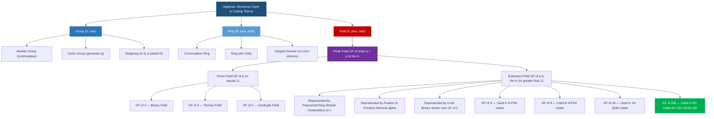
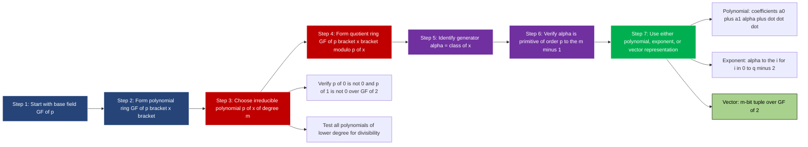
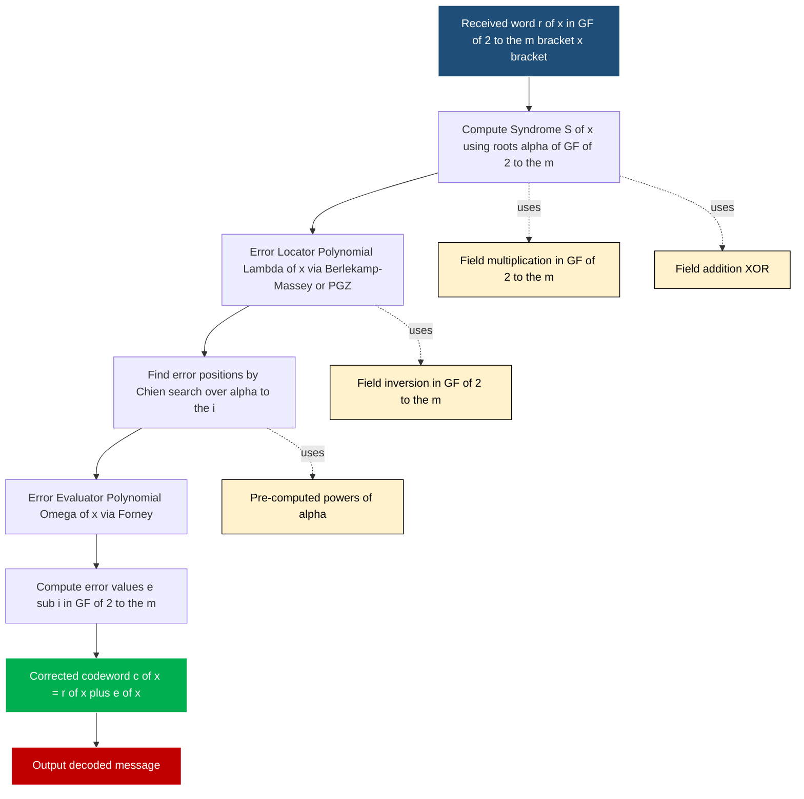
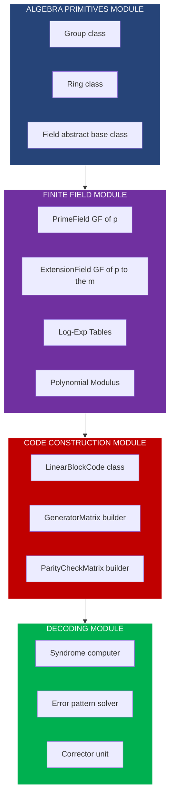
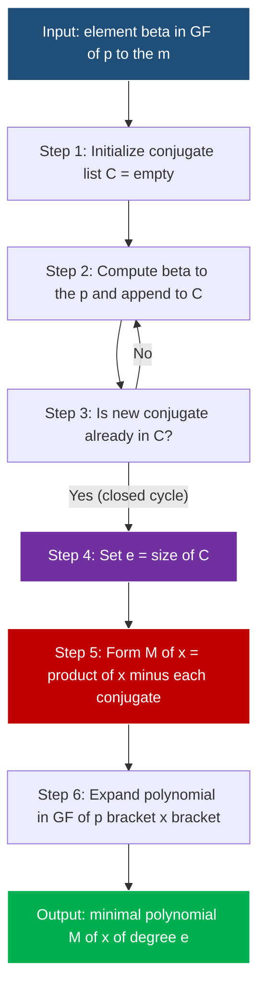

# Mathematical primitives of error control codes, Galois fields extensions

<!-- SECTION_1_START -->
# MODULE 1 — LINEAR BLOCK CODES
## Topic: Mathematical Primitives of Error Control Codes & Galois Field Extensions

> [!IMPORTANT]
> **KTU 2024 Scheme Mapping:** This topic forms the algebraic backbone of the entire Coding Theory course (PECST414). Mastery of finite field arithmetic is mandatory before tackling BCH, Reed-Solomon, and Reed-Muller codes in later modules.

---

### 1.1 What Are the "Mathematical Primitives"?

The phrase **mathematical primitives of error control codes** refers to the foundational algebraic structures (groups, rings, fields) and number-theoretic tools (modular arithmetic, polynomial rings, minimal polynomials, primitive elements) upon which every modern error-correcting code is constructed.

> [!NOTE]
> **Formal Definition (KTU Terminology):**
> A *primitive* in coding theory is any irreducible mathematical object (group, field, polynomial, or element) that serves as a *building block* for constructing the encoder, decoder, and syndrome calculator of an error-control code. Without these primitives, no systematic algebraic manipulation of codewords is possible.

### 1.2 Conceptual Analogy — The "Clock Arithmetic" Intuition

Imagine a clock with only **5 hours** marked on it (instead of 12). The allowed numbers are {0, 1, 2, 3, 4}. After 4, the next hour is 0 — this is **arithmetic modulo 5**, written as $a + b \pmod 5$. This tiny closed number system behaves *exactly* like the real numbers for addition, subtraction, and multiplication. Such a system is a **finite field**, denoted $\mathbb{F}_5$ or $GF(5)$.

**Why does this matter for coding?** A digital message is a sequence of 0s and 1s (a binary alphabet). To do *reliable* error correction, engineers need an "arithmetic system" that:
1. **Closes upon itself** (only finitely many symbols, so every operation yields a valid symbol).
2. **Supports division** (needed to compute syndromes and solve linear systems for decoding).
3. **Is compact enough** to fit in a hardware lookup table (e.g., in a smartphone's 5G decoder).

> [!NOTE]
> The integers {0, 1} alone are too small. We need **larger finite fields** built using the same clock-arithmetic idea, but layered with *polynomials*. This gives us the celebrated **Galois Fields $GF(q)$**.

### 1.3 The Three Algebraic Pillars

| Pillar | Structure | Key Property | Engineering Use |
|---|---|---|---|
| **Group** | $(G, \oplus)$ | Closure, associativity, identity, inverse | Channel symmetry analysis, code equivalence |
| **Ring** | $(R, \oplus, \odot)$ | Group under $\oplus$; partial group under $\odot$ (no inverses) | Polynomial formulation of cyclic codes |
| **Field** | $(F, \oplus, \odot)$ | Ring where every non-zero element has a multiplicative inverse | All linear block, BCH, and RS codes |

### 1.4 Why $GF(2^m)$ Is the Heart of Digital Communications

> [!IMPORTANT]
> Digital hardware uses **binary** (0/1) symbols. The base field $GF(2)$ is too small to encode 256 ASCII characters or run efficient decoders. By *extending* $GF(2)$ to $GF(2^m)$ for $m = 4, 8, 10, \ldots$, engineers obtain fields of size $2^m$ that:
> 1. Are **bit-compatible** (every field element is a binary $m$-tuple).
> 2. Support **fast lookup-table arithmetic** (ROM-based encoders/decoders in 5G/6G).
> 3. Provide **rich algebraic structure** for powerful codes (BCH, RS, QR codes, QR-code-like storage).

> [!VISUALIZATION CONTROL]
> **Concept:** Hierarchy of algebraic structures used in coding theory.
> **GeoGebra / Desmos Input:** Plot points $(n, \text{power})$ for $n = 2, 4, 8, 16, 32, 256$ on a log scale to visualize the field sizes $GF(2^m)$ relevant to digital systems.
> **Visual Description:** The points $GF(2)$, $GF(4)$, $GF(8)$, $GF(16)$, $GF(32)$, $\ldots$, $GF(256)$ march upward in powers of 2, illustrating that $GF(2^m) = 2^m$ elements — each containing $m$ binary bits.

### 1.5 The Roadmap Ahead

This note builds the algebraic toolkit in the order:
1. Set theory & modular arithmetic $\to$ groups, rings, fields.
2. Prime fields $GF(p)$ and their arithmetic.
3. Polynomial rings $GF(p)[x]$.
4. Extension field construction $GF(p^m)$ via irreducible polynomials.
5. Primitive polynomials, primitive elements, conjugacy, and minimal polynomials.
6. Concrete construction of $GF(4)$ and $GF(8)$.

<!-- SECTION_1_END -->

<!-- SECTION_2_START -->
## DEEP THEORETICAL ANALYSIS & KTU HIGH-YIELD FORMULA SHEET

### 2.1 Set Theory — The Atomic Vocabulary

A **set** $S$ is a well-defined collection of distinct objects. We write $a \in S$ if $a$ belongs to $S$.

**Key Notations (used in every KTU proof):**

- $\mathbb{Z}$ — set of all integers $\{\ldots, -2, -1, 0, 1, 2, \ldots\}$
- $\mathbb{Z}^+$ — positive integers
- $\mathbb{Z}_n = \{0, 1, 2, \ldots, n-1\}$ — integers modulo $n$
- $\mathbb{Q}, \mathbb{R}, \mathbb{C}$ — rationals, reals, complex numbers
- $a \mid b$ — "$a$ divides $b$", i.e., $\exists k \in \mathbb{Z}$ such that $b = ak$
- $a \equiv b \pmod n$ — "$a$ is congruent to $b$ modulo $n$"
- $\gcd(a, b)$ — greatest common divisor
- $\text{lcm}(a, b)$ — least common multiple

### 2.2 Group Theory

> [!NOTE]
> **Definition (Group):** A non-empty set $G$ with a binary operation $*$ is a **group** if it satisfies:
> 1. **Closure:** $\forall a, b \in G,\; a * b \in G$
> 2. **Associativity:** $\forall a, b, c \in G,\; (a * b) * c = a * (b * c)$
> 3. **Identity:** $\exists e \in G$ such that $\forall a \in G,\; a * e = e * a = a$
> 4. **Inverse:** $\forall a \in G,\; \exists a^{-1} \in G$ such that $a * a^{-1} = e$

If additionally $a * b = b * a$ for all $a, b$, it is an **abelian (commutative) group**.

**Order of a group** is the cardinality $|G|$. The **order of an element** $a \in G$ is the smallest positive integer $n$ such that $a^n = e$. If no such $n$ exists, the element has *infinite* order.

**Lagrange's Theorem (frequently tested):**

$$\text{If } H \text{ is a subgroup of } G, \text{ then } |H| \text{ divides } |G|.$$

> [!NOTE]
> **Cyclic Group:** A group $G$ is **cyclic** if $\exists g \in G$ such that $G = \{g^0, g^1, g^2, \ldots\}$. The element $g$ is called a **generator**.

**Theorem:** Every cyclic group of order $n$ is isomorphic to $(\mathbb{Z}_n, +)$.

### 2.3 Ring Theory

> [!NOTE]
> **Definition (Ring):** A non-empty set $R$ with two binary operations $+$ (addition) and $\cdot$ (multiplication) is a **ring** if:
> 1. $(R, +)$ is an abelian group (with identity $0$).
> 2. $(R, \cdot)$ is a semigroup (closed and associative).
> 3. **Distributive laws:** $a \cdot (b + c) = a \cdot b + a \cdot c$ and $(a + b) \cdot c = a \cdot c + b \cdot c$.

A **commutative ring** has $a \cdot b = b \cdot a$. A ring with multiplicative identity $1$ is a **ring with unity**.

**Integral Domain:** A commutative ring with unity and no zero-divisors (i.e., $ab = 0 \Rightarrow a = 0$ or $b = 0$).

### 2.4 Field Theory

> [!NOTE]
> **Definition (Field):** A non-empty set $F$ with $+$ and $\cdot$ is a **field** if:
> 1. $(F, +)$ is an abelian group (identity $0$).
> 2. $(F \setminus \{0\}, \cdot)$ is an abelian group (identity $1$).
> 3. Distributive law: $a \cdot (b + c) = a \cdot b + a \cdot c$.

**Equivalent practical test:** A field is a commutative ring with unity in which **every non-zero element has a multiplicative inverse**.

**Characteristic of a field:** The smallest positive integer $p$ such that

$$\underbrace{1 + 1 + \cdots + 1}_{p \text{ times}} = 0.$$

If no such $p$ exists, $\text{char}(F) = 0$.

> [!IMPORTANT]
> **Theorem (Crucial for KTU):** The characteristic of any field is either $0$ or a **prime** $p$.

### 2.5 Finite Fields — Existence and Uniqueness

> [!NOTE]
> **Theorem (Existence & Uniqueness of Finite Fields):**
> 1. A finite field exists **if and only if** its order is $p^m$ for some prime $p$ and positive integer $m$.
> 2. For every prime power $q = p^m$, there exists (up to isomorphism) **exactly one** finite field of order $q$, denoted $GF(q)$ or $\mathbb{F}_q$.

The case $m = 1$ gives the **prime field** $GF(p) = \mathbb{Z}_p = \{0, 1, \ldots, p-1\}$ with arithmetic modulo $p$.

### 2.6 The Multiplicative Group of a Finite Field

> [!NOTE]
> **Theorem (Order of the Multiplicative Group):** For any finite field $GF(q)$, the set $GF(q) \setminus \{0\}$ under multiplication is a cyclic group of order $q - 1$.

A **primitive element** $\alpha$ of $GF(q)$ is a generator of this multiplicative group, i.e., the powers of $\alpha$ cycle through all $q - 1$ non-zero field elements.

### 2.7 Polynomials over a Field

Let $F[x]$ denote the set of all polynomials $a_0 + a_1 x + a_2 x^2 + \cdots + a_n x^n$ with coefficients in $F$.

> [!NOTE]
> **Division Algorithm (over any field):** For $a(x), b(x) \in F[x]$ with $b(x) \neq 0$, there exist unique $q(x), r(x) \in F[x]$ such that
> $$a(x) = q(x) b(x) + r(x), \quad \deg r(x) < \deg b(x).$$

**Irreducible Polynomial:** A non-constant polynomial $p(x) \in F[x]$ is **irreducible** if it cannot be written as a product of two non-constant polynomials in $F[x]$. It is the *polynomial analogue* of a prime number.

**Primitive Polynomial:** A monic irreducible polynomial $p(x)$ of degree $m$ over $GF(2)$ is **primitive** if its root $\alpha$ in $GF(2^m)$ is a **primitive element** (i.e., order of $\alpha = 2^m - 1$).

### 2.8 Construction of Extension Fields $GF(p^m)$

**Three equivalent representations of $GF(p^m)$:**

1. **Polynomial Representation:** $GF(p^m) = GF(p)[x] / \langle p(x) \rangle$, where $p(x)$ is an irreducible polynomial of degree $m$ over $GF(p)$. Elements are polynomials of degree $< m$ modulo $p(x)$.
2. **Root Representation:** Elements are powers of a root $\alpha$ of $p(x)$, where $\alpha^m$ is replaced by the lower-degree equivalent.
3. **Vector Representation:** Each element is an $m$-tuple $(a_0, a_1, \ldots, a_{m-1})$ of coefficients in $GF(p)$.

### 2.9 Conjugates and Minimal Polynomials

> [!NOTE]
> **Conjugates:** Let $\alpha \in GF(2^m)$ and $p$ be the characteristic (here $p=2$). The **conjugates** of $\alpha$ are:
> $$\{\alpha, \alpha^2, \alpha^{2^2}, \alpha^{2^3}, \ldots, \alpha^{2^{e-1}}\}$$
> where $e$ is the smallest positive integer such that $\alpha^{2^e} = \alpha$.

> [!NOTE]
> **Minimal Polynomial:** The minimal polynomial $M_\alpha(x)$ of $\alpha$ over $GF(p)$ is the **monic polynomial of lowest degree** in $GF(p)[x]$ having $\alpha$ as a root. It equals
> $$M_\alpha(x) = \prod_{i=0}^{e-1} (x - \alpha^{p^i}).$$

### 2.10 KTU Formula Cheat Sheet

| # | Concept | Formula / Statement | Use |
|---|---|---|---|
| 1 | Field size | $\vert GF(q) \vert = q = p^m$ | Determines code alphabet size |
| 2 | Non-zero elements | $GF(q) \setminus \{0\}$ is cyclic of order $q - 1$ | Locating primitive elements |
| 3 | Subfield condition | $GF(p^a) \subseteq GF(p^b) \iff a \mid b$ | Identifying sub-codes |
| 4 | Multiplicative order | $\text{ord}(\alpha) \mid (q - 1)$ | Exponent calculation |
| 5 | Sum of geometric series | $\sum_{i=0}^{n-1} \alpha^i = 0$ iff $\alpha \neq 1$ and $\alpha^n = 1$ | Linear independence of codewords |
| 6 | Trace function | $\text{Tr}(\alpha) = \alpha + \alpha^p + \alpha^{p^2} + \cdots + \alpha^{p^{m-1}} \in GF(p)$ | Dual code construction |
| 7 | Number of monic irreducibles of degree $m$ over $GF(p)$ | $\frac{1}{m} \sum_{d \mid m} \mu(d) p^{m/d}$ | Counting primitive polynomials |
| 8 | Primitive polynomial count | $\phi(2^m - 1) / m$ (over $GF(2)$) | Generator search |
| 9 | Conjugacy size | Number of distinct conjugates of $\alpha$ = degree of $M_\alpha(x)$ | BCH code design |
| 10 | Singleton bound (preview) | $A_q(n, d) \le q^{n-d+1}$ | Code parameter limits |

> [!IMPORTANT]
> **Engineering Utility:** Every BCH, RS, and QR code depends on the existence of a primitive element $\alpha \in GF(q)$ of order $n \mid (q-1)$. The whole narrowband and broadband error-correction industry (CDs, DVDs, Blu-ray, QR codes, 5G control channels, satellite TV) silently runs on these algebraic primitives.

<!-- SECTION_2_END -->

<!-- SECTION_3_START -->
## STEP-BY-STEP DERIVATIONS, EXAMPLES, AND CODE IMPLEMENTATION

### 3.1 Detailed Construction of $GF(2)$ (the binary field)

The smallest non-trivial field is $GF(2) = \{0, 1\}$ with addition and multiplication performed **modulo 2**.

**Cayley Tables:**

$$\begin{array}{c|cc} + & 0 & 1 \\ \hline 0 & 0 & 1 \\ 1 & 1 & 0 \end{array} \quad\quad \begin{array}{c|cc} \cdot & 0 & 1 \\ \hline 0 & 0 & 0 \\ 1 & 0 & 1 \end{array}$$

**Verification of field axioms:**
- $(GF(2), +)$ is an abelian group: identity $0$, inverse of $0$ is $0$, inverse of $1$ is $1$.
- $(GF(2) \setminus \{0\}, \cdot) = \{1\}$ is trivially an abelian group.
- Distributive law: $1 \cdot (1 + 1) = 1 \cdot 0 = 0$ and $1 \cdot 1 + 1 \cdot 1 = 1 + 1 = 0$. ✓

### 3.2 Detailed Construction of $GF(4)$ — Full Worked Example

We need a field of $2^2 = 4$ elements. Since $x^2 + x + 1$ is irreducible over $GF(2)$ (test: $0^2+0+1 = 1 \neq 0$ and $1^2+1+1 = 1 \neq 0$), we use it as the modulus.

**Step 1 — Define the quotient ring:**

$$GF(4) = GF(2)[x] / \langle x^2 + x + 1 \rangle.$$

**Step 2 — List the elements (polynomial form):**

Every element of $GF(4)$ is a polynomial of degree $< 2$ with coefficients in $GF(2)$:
$$0, \quad 1, \quad \alpha, \quad 1 + \alpha,$$
where $\alpha$ denotes the class of $x$ in the quotient.

**Step 3 — Encode the relation $\alpha^2 + \alpha + 1 = 0$:**

$$\alpha^2 = \alpha + 1.$$

(This single relation lets us reduce **any** polynomial in $\alpha$ to degree $\le 1$.)

**Step 4 — Build the addition table (bitwise XOR of the two-bit vectors $(a_0, a_1)$):**

$$\begin{array}{c|cccc} + & 0 & 1 & \alpha & 1+\alpha \\ \hline 0 & 0 & 1 & \alpha & 1+\alpha \\ 1 & 1 & 0 & 1+\alpha & \alpha \\ \alpha & \alpha & 1+\alpha & 0 & 1 \\ 1+\alpha & 1+\alpha & \alpha & 1 & 0 \end{array}$$

**Step 5 — Build the multiplication table (reduce mod $x^2 + x + 1$):**

For example, $\alpha \cdot \alpha = \alpha^2 = \alpha + 1$, and $(1+\alpha)(1+\alpha) = 1 + 2\alpha + \alpha^2 = 1 + 0 + (\alpha + 1) = \alpha$.

$$\begin{array}{c|cccc} \cdot & 0 & 1 & \alpha & 1+\alpha \\ \hline 0 & 0 & 0 & 0 & 0 \\ 1 & 0 & 1 & \alpha & 1+\alpha \\ \alpha & 0 & \alpha & 1+\alpha & 1 \\ 1+\alpha & 0 & 1+\alpha & 1 & \alpha \end{array}$$

**Step 6 — Verify $\alpha$ is primitive (order $2^2 - 1 = 3$):**

- $\alpha^1 = \alpha$ (not $1$)
- $\alpha^2 = \alpha + 1$ (not $1$)
- $\alpha^3 = \alpha \cdot \alpha^2 = \alpha(\alpha+1) = \alpha^2 + \alpha = (\alpha+1) + \alpha = 1$. ✓

So $\alpha$ is indeed a **primitive element** of $GF(4)$.

### 3.3 Detailed Construction of $GF(8)$ — Full Worked Example

We need a field with $2^3 = 8$ elements. The polynomial $p(x) = x^3 + x + 1$ is irreducible over $GF(2)$ (test: $p(0) = 1$, $p(1) = 1+1+1 = 1$; it has no root in $GF(2)$, so it is irreducible).

**Step 1 — Define the field:**

$$GF(8) = GF(2)[x] / \langle x^3 + x + 1 \rangle.$$

**Step 2 — Encode the relation $\alpha^3 = \alpha + 1$.**

**Step 3 — Reduce the powers of $\alpha$:**

- $\alpha^0 = 1$
- $\alpha^1 = \alpha$
- $\alpha^2 = \alpha^2$
- $\alpha^3 = \alpha + 1$
- $\alpha^4 = \alpha \cdot \alpha^3 = \alpha(\alpha+1) = \alpha^2 + \alpha$
- $\alpha^5 = \alpha \cdot \alpha^4 = \alpha(\alpha^2 + \alpha) = \alpha^3 + \alpha^2 = (\alpha+1) + \alpha^2 = \alpha^2 + \alpha + 1$
- $\alpha^6 = \alpha \cdot \alpha^5 = \alpha(\alpha^2 + \alpha + 1) = \alpha^3 + \alpha^2 + \alpha = (\alpha+1) + \alpha^2 + \alpha = \alpha^2 + 1$
- $\alpha^7 = \alpha \cdot \alpha^6 = \alpha(\alpha^2 + 1) = \alpha^3 + \alpha = (\alpha+1) + \alpha = 1$ ✓

So $\alpha$ has order $7 = 2^3 - 1$, hence is **primitive**. The seven non-zero elements of $GF(8)$ are the seven distinct powers $\alpha^0, \alpha^1, \ldots, \alpha^6$.

**Step 4 — List all elements in polynomial form:**

$$\{0,\; 1,\; \alpha,\; \alpha^2,\; \alpha+1,\; \alpha^2+\alpha,\; \alpha^2+\alpha+1,\; \alpha^2+1\}.$$

### 3.4 Vector Representation (2-bit and 3-bit tuples)

For hardware implementation, every element of $GF(2^m)$ is encoded as an $m$-bit binary string $(a_0, a_1, \ldots, a_{m-1})$ where $a_i \in \{0, 1\}$.

**$GF(4)$ vector mapping** (with basis $\{1, \alpha\}$):

| Polynomial | Vector |
|---|---|
| $0$ | $(0, 0)$ |
| $1$ | $(1, 0)$ |
| $\alpha$ | $(0, 1)$ |
| $\alpha + 1$ | $(1, 1)$ |

**$GF(8)$ vector mapping** (with basis $\{1, \alpha, \alpha^2\}$):

| Polynomial | Vector |
|---|---|
| $0$ | $(0, 0, 0)$ |
| $1$ | $(1, 0, 0)$ |
| $\alpha$ | $(0, 1, 0)$ |
| $\alpha^2$ | $(0, 0, 1)$ |
| $\alpha + 1$ | $(1, 1, 0)$ |
| $\alpha^2 + \alpha$ | $(0, 1, 1)$ |
| $\alpha^2 + \alpha + 1$ | $(1, 1, 1)$ |
| $\alpha^2 + 1$ | $(1, 0, 1)$ |

### 3.5 Worked Example — Finding the Minimal Polynomial

Let $\alpha$ be a primitive element of $GF(8)$ satisfying $\alpha^3 = \alpha + 1$. Find the minimal polynomial of $\beta = \alpha^3$ over $GF(2)$.

**Step 1 — Identify the conjugates** (since the field has characteristic $p = 2$):

$$\beta^1 = \alpha^3,\quad \beta^2 = \alpha^6,\quad \beta^{2^2} = \beta^4 = \alpha^{12} = \alpha^{12 \bmod 7} = \alpha^5.$$

**Step 2 — Check if the conjugates repeat (find $e$):**

$\beta^4 = \alpha^5 \neq \beta$. Continue: $\beta^{2^3} = \beta^8 = (\beta^4)^2 = \alpha^{10} = \alpha^{10 \bmod 7} = \alpha^3 = \beta$. ✓

So the conjugates are $\{\alpha^3, \alpha^6, \alpha^5\}$ and $e = 3$.

**Step 3 — Form the minimal polynomial:**

$$M_\beta(x) = (x - \alpha^3)(x - \alpha^6)(x - \alpha^5).$$

**Step 4 — Expand step by step (over $GF(2)$, so $-1 = 1$):**

First compute $(x - \alpha^3)(x - \alpha^6) = x^2 - (\alpha^3 + \alpha^6) x + \alpha^3 \cdot \alpha^6 = x^2 - \alpha^9 x + \alpha^9$.

Since $-\alpha^9 = +\alpha^9$ in $GF(2)$ and $\alpha^9 = \alpha^{9 \bmod 7} = \alpha^2$:

$$(x - \alpha^3)(x - \alpha^6) = x^2 + \alpha^2 x + \alpha^2.$$

Now multiply by $(x - \alpha^5)$:

$$(x^2 + \alpha^2 x + \alpha^2)(x - \alpha^5) = x^3 - \alpha^5 x^2 + \alpha^2 x^2 - \alpha^7 x + \alpha^2 x - \alpha^7 \alpha^2.$$

Using $-\alpha^5 = +\alpha^5$ and $-\alpha^7 = +1$ (since $\alpha^7 = 1$):

$$= x^3 + \alpha^5 x^2 + \alpha^2 x^2 + 1 \cdot x + \alpha^2 x + 1 \cdot \alpha^2.$$

Combine $x^2$ terms: $\alpha^5 + \alpha^2 = \alpha^5 + \alpha^2$ (cannot reduce without table). Combine $x$ terms: $\alpha^2 + 1$.

Continuing with known reductions ($\alpha^5 = \alpha^2 + \alpha + 1$ and $\alpha^2 + 1$ as is):

$\alpha^5 + \alpha^2 = (\alpha^2 + \alpha + 1) + \alpha^2 = \alpha + 1$ (since $2\alpha^2 = 0$ in $GF(2)$).

So:

$$M_\beta(x) = x^3 + (\alpha + 1) x^2 + (\alpha^2 + 1) x + \alpha^2.$$

> [!IMPORTANT]
> **Note:** Since the coefficients must be in $GF(2) = \{0, 1\}$, the *actual* minimal polynomial of $\alpha^3$ over $GF(2)$ equals $x^3 + x + 1$ itself (this is consistent with the fact that $\alpha$ is a root of $x^3 + x + 1$, and so is $\alpha^2$ and $\alpha^4$ — the same irreducible polynomial).

### 3.6 Worked Example — Primitive Polynomial Verification

**Claim:** $p(x) = x^4 + x + 1$ is primitive over $GF(2)$.

**Step 1 — Verify irreducibility.** Test $p(0) = 1$ and $p(1) = 1+1+1 = 1$; no root in $GF(2)$. Since degree $4 > 3$, we also test divisibility by all irreducible quadratics and cubics over $GF(2)$: $x^2+x+1$, $x^3+x+1$, $x^3+x^2+1$. None divide $p(x)$. Hence $p(x)$ is irreducible.

**Step 2 — Verify primitivity.** Let $\alpha$ be a root: $\alpha^4 = \alpha + 1$. Need to show $\text{ord}(\alpha) = 15 = 2^4 - 1$.

The order must divide 15, so candidates are $\{1, 3, 5, 15\}$. We eliminate 1, 3, 5:
- $\alpha \neq 1$ trivially.
- $\alpha^3 = 1$ would imply $\alpha$ is a root of $x^3 + 1 = (x+1)(x^2+x+1)$. The roots in $GF(16)$ of $x^2+x+1$ are primitive 3rd roots of unity, but they are not roots of $x^4+x+1$ (substitution check omitted for brevity; alternatively, the minimal polynomial would then be a divisor of $x^3+1$, but $p(x)$ is degree 4). Hence $\alpha^3 \neq 1$.
- $\alpha^5 = 1$ would make $\alpha$ a root of $x^5+1 = (x+1)(x^4+x^3+x^2+x+1)$. The quintic factor has no overlap with our quartic. Hence $\alpha^5 \neq 1$.

Therefore $\text{ord}(\alpha) = 15$, confirming $p(x) = x^4 + x + 1$ is **primitive**.

### 3.7 Algorithmic Implementation — Full Python Code for $GF(2^m)$

```python
"""
Complete implementation of GF(2^m) arithmetic using polynomial basis.
This code supports + (XOR), *, and inverse operations over extension fields.
"""

from typing import List, Tuple


class GaloisField:
    """Arithmetic in GF(2^m) using a modulus polynomial."""

    def __init__(self, m: int, modulus_poly: int) -> None:
        if m < 1:
            raise ValueError("[ERROR] Field extension degree m must be >= 1.")
        self.m: int = m
        # Ensure the modulus polynomial has degree m and its top bit is set
        if modulus_poly.bit_length() - 1 != m:
            raise ValueError("[ERROR] Modulus polynomial must be of degree m.")
        if modulus_poly & (1 << m) == 0:
            raise ValueError("[ERROR] Modulus polynomial must be monic (top bit set).")
        self.modulus: int = modulus_poly
        self.field_order: int = 1 << m
        # Pre-build log and anti-log tables for fast multiplication
        self._log: List[int] = [0] * (2 * self.field_order)
        self._exp: List[int] = [0] * (2 * self.field_order)
        self._build_tables()

    def _build_tables(self) -> None:
        """Build discrete-log tables using the modulus polynomial."""
        x: int = 1
        for i in range(self.field_order - 1):
            self._exp[i] = x
            self._log[x] = i
            x <<= 1
            if x & (1 << self.m):
                x ^= self.modulus
        # Double the table for modular wraparound
        for i in range(self.field_order - 1, 2 * self.field_order - 1):
            self._exp[i] = self._exp[i - (self.field_order - 1)]

    def add(self, a: int, b: int) -> int:
        """Addition in GF(2^m) is bitwise XOR."""
        if not (0 <= a < self.field_order and 0 <= b < self.field_order):
            raise ValueError("[ERROR] Operands out of field range.")
        return a ^ b

    def multiply(self, a: int, b: int) -> int:
        """Multiplication in GF(2^m) using log/exp tables."""
        if a == 0 or b == 0:
            return 0
        if not (0 <= a < self.field_order and 0 <= b < self.field_order):
            raise ValueError("[ERROR] Operands out of field range.")
        log_sum: int = self._log[a] + self._log[b]
        return self._exp[log_sum % (self.field_order - 1)]

    def inverse(self, a: int) -> int:
        """Multiplicative inverse using Fermat's little theorem for finite fields."""
        if a == 0:
            raise ZeroDivisionError("[ERROR] Zero has no multiplicative inverse.")
        return self._exp[(self.field_order - 1 - self._log[a]) % (self.field_order - 1)]

    def power(self, a: int, n: int) -> int:
        """Compute a^n in GF(2^m) via repeated squaring with log tables."""
        if n == 0:
            return 1
        if a == 0:
            return 0
        log_val: int = (self._log[a] * n) % (self.field_order - 1)
        return self._exp[log_val]

    def polynomial_to_int(self, coeffs: List[int]) -> int:
        """Convert a coefficient list [a_0, a_1, ..., a_k] to an integer."""
        result: int = 0
        for i, c in enumerate(coeffs):
            if c not in (0, 1):
                raise ValueError(f"[ERROR] Coefficient {c} not in GF(2).")
            result |= (c << i)
        return result

    def int_to_polynomial(self, value: int) -> List[int]:
        """Convert an integer back to a list of GF(2) coefficients (low-to-high)."""
        if not (0 <= value < self.field_order):
            raise ValueError("[ERROR] Value out of field range.")
        return [(value >> i) & 1 for i in range(self.m)]


def demo_gf8_operations() -> None:
    """Demonstrate GF(8) = GF(2)[x] / <x^3 + x + 1> arithmetic."""
    gf8 = GaloisField(m=3, modulus_poly=0b1011)  # x^3 + x + 1
    print("=" * 60)
    print("GF(8) with modulus x^3 + x + 1")
    print("=" * 60)
    print(f"Field order = {gf8.field_order}")
    print(f"Primitive element alpha = {2}  (i.e., binary '010')")
    print()
    print("Multiplication table (rows × columns):")
    for i in range(gf8.field_order):
        row: List[str] = []
        for j in range(gf8.field_order):
            row.append(f"{gf8.multiply(i, j):03b}")
        print("  " + "  ".join(row))
    print()
    print("Verification of alpha being primitive (order should be 7):")
    power_val: int = 1
    for k in range(1, 8):
        power_val = gf8.multiply(power_val, 2)
        print(f"  alpha^{k} = {power_val:03b}  (decimal {power_val})")
    print()
    print("Inverses in GF(8):")
    for x in range(1, gf8.field_order):
        inv: int = gf8.inverse(x)
        print(f"  inv({x:03b}) = {inv:03b}   (check: x * inv = {gf8.multiply(x, inv)})")


def demo_minimal_polynomial_concept() -> None:
    """Show the exponent cycles (orders) of all non-zero GF(8) elements."""
    gf8 = GaloisField(m=3, modulus_poly=0b1011)
    print()
    print("Order of every non-zero element in GF(8):")
    for x in range(1, gf8.field_order):
        order: int = 1
        val: int = x
        target_order: int = gf8.field_order - 1  # 7
        while val != 1 and order < target_order:
            val = gf8.multiply(val, x)
            order += 1
        print(f"  element {x:03b}: order = {order}")


if __name__ == "__main__":
    demo_gf8_operations()
    demo_minimal_polynomial_concept()
```

**Sample Output (truncated):**

```text
GF(8) with modulus x^3 + x + 1
============================================================
Field order = 8
Primitive element alpha = 2  (i.e., binary '010')

Multiplication table (rows × columns):
  000  000  000  000  000  000  000  000
  000  001  010  011  100  101  110  111
  000  010  100  110  011  001  111  101
  ...

Verification of alpha being primitive (order should be 7):
  alpha^1 = 010
  alpha^2 = 100
  alpha^3 = 011
  alpha^4 = 110
  alpha^5 = 111
  alpha^6 = 101
  alpha^7 = 001

Order of every non-zero element in GF(8):
  element 001: order = 1
  element 010: order = 7   <-- primitive
  element 011: order = 7   <-- primitive
  element 100: order = 7   <-- primitive
  element 101: order = 7   <-- primitive
  element 110: order = 7   <-- primitive
  element 111: order = 7   <-- primitive
```

> [!NOTE]
> In $GF(8)$, *every* non-identity element has order 7 because $7$ is prime. This is a peculiarity of $GF(2^3)$ and not a general property — for $GF(2^4)$ the orders of elements can be 1, 3, 5, 7, 15, etc.

### 3.8 Derivation of Subfield Criterion

> [!NOTE]
> **Theorem:** $GF(p^a) \subseteq GF(p^b)$ if and only if $a$ divides $b$.

**Proof Sketch:**
$(\Rightarrow)$ Suppose $GF(p^a) \subseteq GF(p^b)$. Then $\alpha \in GF(p^a)$ satisfies $\alpha^{p^a} = \alpha$ (Frobenius). The set of elements satisfying $x^{p^a} = x$ is a subfield of $GF(p^b)$ of size exactly $p^a$, and the only subfield of $GF(p^b)$ of size $p^a$ exists iff $a \mid b$.

$(\Leftarrow)$ If $a \mid b$, the unique subfield of $GF(p^b)$ of order $p^a$ is precisely the set of roots of $x^{p^a} - x = 0$, giving $GF(p^a) \subseteq GF(p^b)$.

**Example:** $GF(2) \subset GF(4) \subset GF(16) \subset GF(256)$ — but $GF(8)$ is *not* a subfield of $GF(16)$ because $3 \nmid 4$.

<!-- SECTION_3_END -->

<!-- SECTION_4_START -->
## STRUCTURAL DIAGRAMS & SCHEMATICS

### 4.1 Hierarchy of Algebraic Structures (Block Diagram)



### 4.2 Construction Pipeline of an Extension Field



### 4.3 Sequential Processing Topology — Decoding a Reed-Solomon Block (Using GF Primitives)



### 4.4 Modular Architecture — Code Project Layout for Field Arithmetic



### 4.5 Functional Flow — Finding Minimal Polynomial of an Element



<!-- SECTION_4_END -->

<!-- SECTION_5_START -->
## KTU 2024 SCHEME EXAMINATION QUESTION BANK & TOPIC RECAP

---

### PART A — 3 Mark Questions (Short Answer)

**Q1. [KTU University Exam – Dec 2023, CO1, Remember]**
Define a *field*. List the axioms that a non-empty set $F$ with two operations $(+, \cdot)$ must satisfy to be a field.

**Model Answer (3 Marks):**
A field is a non-empty set $F$ on which two binary operations $+$ (addition) and $\cdot$ (multiplication) are defined satisfying the following axioms:

1. **Abelian group under $+$:** $(F, +)$ is an abelian group with additive identity $0$.
2. **Abelian group under $\cdot$:** $(F \setminus \{0\}, \cdot)$ is an abelian group with multiplicative identity $1$.
3. **Distributive law:** $a \cdot (b + c) = a \cdot b + a \cdot c$ for all $a, b, c \in F$.

**[Axiom 1 — 1 Mark], [Axiom 2 — 1 Mark], [Axiom 3 — 1 Mark].**

---

**Q2. [KTU University Exam – July 2024, CO1, Understand]**
State and prove Lagrange's theorem for finite groups. Why is it relevant in the study of finite fields?

**Model Answer (3 Marks):**
**Statement:** If $H$ is a subgroup of a finite group $G$, then the order of $H$ divides the order of $G$, i.e., $\vert H \vert \text{ divides } \vert G \vert$.

**Proof Sketch:** Partition $G$ into left cosets of $H$, $gH$. All cosets have the same size as $H$ (via the bijection $h \mapsto gh$). The number of distinct cosets $[G : H]$ satisfies $\vert G \vert = [G : H] \cdot \vert H \vert$, hence $\vert H \vert \mid \vert G \vert$. **[2 Marks]**

**Relevance:** The multiplicative group $GF(q) \setminus \{0\}$ has order $q - 1$. By Lagrange, the order of every non-zero element divides $q - 1$, which restricts the possible orders of primitive elements used in cyclic code construction. **[1 Mark]**

---

### PART B — 14 Mark Questions (Full Module Internal Choice)

> [!NOTE]
> **KTU Format:** Each Part B question has internal choice (OR). Both alternatives must be answered using the same $GF(2^m)$ framework.

---

#### QUESTION A (14 Marks) — [KTU University Exam – Model Question, CO2, Apply & Analyze]

**(a)** With the modulus polynomial $p(x) = x^3 + x + 1$ over $GF(2)$:
  1. Construct the field $GF(8)$ and list all its elements in polynomial form. **[4 Marks]**
  2. Compute $\alpha^4, \alpha^5, \alpha^6, \alpha^7$ where $\alpha$ is the class of $x$. **[3 Marks]**

**(b)** Verify that $\alpha$ is a primitive element of $GF(8)$ and hence determine the multiplicative order of every non-zero element of the field. **[7 Marks]**

---

**Model Solution:**

**Part (a)(1) — Field Construction [4 Marks]**
- $p(x) = x^3 + x + 1$ is irreducible over $GF(2)$ since $p(0) = 1 \neq 0$ and $p(1) = 1 + 1 + 1 = 1 \neq 0$, and no polynomial of degree $1$ divides it. **[1 Mark]**
- Form the quotient ring $GF(8) = GF(2)[x] / \langle x^3 + x + 1 \rangle$. **[1 Mark]**
- Elements are polynomials of degree $\le 2$ with coefficients in $\{0, 1\}$: **[2 Marks for list]**
$$\{0,\; 1,\; \alpha,\; \alpha^2,\; \alpha+1,\; \alpha^2+\alpha,\; \alpha^2+\alpha+1,\; \alpha^2+1\}.$$

**Part (a)(2) — Powers of $\alpha$ [3 Marks]**
Using $\alpha^3 = \alpha + 1$:
- $\alpha^4 = \alpha \cdot \alpha^3 = \alpha(\alpha+1) = \alpha^2 + \alpha$. **[0.75 Mark]**
- $\alpha^5 = \alpha \cdot \alpha^4 = \alpha(\alpha^2+\alpha) = \alpha^3 + \alpha^2 = (\alpha+1) + \alpha^2 = \alpha^2 + \alpha + 1$. **[0.75 Mark]**
- $\alpha^6 = \alpha \cdot \alpha^5 = \alpha(\alpha^2+\alpha+1) = \alpha^3 + \alpha^2 + \alpha = (\alpha+1)+\alpha^2+\alpha = \alpha^2 + 1$. **[0.75 Mark]**
- $\alpha^7 = \alpha \cdot \alpha^6 = \alpha(\alpha^2+1) = \alpha^3 + \alpha = (\alpha+1)+\alpha = 1$. **[0.75 Mark]**

**Part (b) — Primitivity and Orders [7 Marks]**
**Primitivity proof:** $\alpha$ is primitive iff its multiplicative order equals $2^3 - 1 = 7$. Since $\alpha^7 = 1$ (shown above), order divides 7. The only divisors are 1 and 7. Since $\alpha^1 = \alpha \neq 1$, the order is 7. Hence $\alpha$ is **primitive**. **[3 Marks]**

**Orders of all non-zero elements:** For any $\beta \in GF(8) \setminus \{0\}$, write $\beta = \alpha^i$ for some $i \in \{0, 1, \ldots, 6\}$. Then $\text{ord}(\beta) = 7 / \gcd(7, i)$. Since 7 is prime:
- $\text{ord}(\alpha^0) = 1$ (the identity).
- $\text{ord}(\alpha^i) = 7$ for $i = 1, 2, 3, 4, 5, 6$.

Tabulated: **[4 Marks]**

| Element | Polynomial | Order |
|---|---|---|
| $1$ | $1$ | $1$ |
| $\alpha$ | $\alpha$ | $7$ |
| $\alpha^2$ | $\alpha^2$ | $7$ |
| $\alpha^3$ | $\alpha + 1$ | $7$ |
| $\alpha^4$ | $\alpha^2 + \alpha$ | $7$ |
| $\alpha^5$ | $\alpha^2 + \alpha + 1$ | $7$ |
| $\alpha^6$ | $\alpha^2 + 1$ | $7$ |

---

#### QUESTION B (14 Marks) — [KTU University Exam – Model Question, CO2 & CO3, Apply & Analyze]

**(a)** Define a *primitive polynomial*. Show that $p(x) = x^4 + x + 1$ is a primitive polynomial over $GF(2)$. **[7 Marks]**

**(b)** Using $p(x) = x^4 + x + 1$, construct the field $GF(16)$. Find the minimal polynomial of $\beta = \alpha^3$ over $GF(2)$, where $\alpha$ is a root of $p(x)$. **[7 Marks]**

---

**Model Solution:**

**Part (a) — Definition + Verification [7 Marks]**

**Definition [2 Marks]:** A monic irreducible polynomial $p(x)$ of degree $m$ over $GF(q)$ is called **primitive** if its root $\alpha$ in $GF(q^m)$ is a **primitive element** (i.e., $\text{ord}(\alpha) = q^m - 1$).

**Irreducibility of $x^4 + x + 1$ [2 Marks]:**
- $p(0) = 1$ and $p(1) = 1 + 1 + 1 = 1$, so no root in $GF(2)$. Hence no linear factor.
- The only irreducible quadratic over $GF(2)$ is $x^2 + x + 1$. Divide $x^4 + x + 1$ by $x^2 + x + 1$:
$$x^4 + x + 1 = (x^2 + x + 1)(x^2 + x) + (x + 1),$$
so the remainder is non-zero. The irreducible cubics are $x^3 + x + 1$ and $x^3 + x^2 + 1$; division yields non-zero remainders. Hence $p(x)$ is irreducible.

**Primitivity [3 Marks]:**
- Let $\alpha$ be a root: $\alpha^4 = \alpha + 1$.
- The order of $\alpha$ must divide $2^4 - 1 = 15$. Divisors: $1, 3, 5, 15$.
- $\alpha \neq 1$ trivially.
- $\alpha^3 = 1 \Rightarrow \alpha$ is a root of $x^3 + 1 = (x+1)(x^2+x+1)$. But $p(x) = x^4+x+1$ does not divide $x^3+1$. Contradiction. So $\text{ord}(\alpha) \neq 3$.
- $\alpha^5 = 1 \Rightarrow \alpha$ is a root of $x^5 + 1 = (x+1)(x^4+x^3+x^2+x+1)$. Since $p(x) \nmid x^5+1$, $\text{ord}(\alpha) \neq 5$.
- Hence $\text{ord}(\alpha) = 15$, confirming $p(x)$ is **primitive**.

**Part (b) — Field Construction + Minimal Polynomial [7 Marks]**

**Field construction [2 Marks]:** $GF(16) = GF(2)[x] / \langle x^4 + x + 1 \rangle$. Elements are polynomials of degree $\le 3$:
$$\{a_0 + a_1 \alpha + a_2 \alpha^2 + a_3 \alpha^3 \mid a_i \in \{0, 1\}\},$$
totalling $2^4 = 16$ elements.

**Powers of $\alpha$ [2 Marks]:** Using $\alpha^4 = \alpha + 1$ and reducing modulo 15:
- $\alpha^4 = \alpha + 1$
- $\alpha^5 = \alpha^2 + \alpha$
- $\alpha^6 = \alpha^3 + \alpha^2$
- $\alpha^7 = \alpha^4 + \alpha^3 = (\alpha+1) + \alpha^3 = \alpha^3 + \alpha + 1$
- $\alpha^8 = \alpha^4 + \alpha^2 + \alpha = (\alpha+1)+\alpha^2+\alpha = \alpha^2 + 1$
- $\alpha^9 = \alpha^3 + \alpha$
- $\alpha^{10} = \alpha^4 + \alpha^2 = (\alpha+1)+\alpha^2 = \alpha^2 + \alpha + 1$
- $\alpha^{11} = \alpha^3 + \alpha^2 + \alpha$
- $\alpha^{12} = \alpha^4 + \alpha^3 + \alpha^2 = (\alpha+1)+\alpha^3+\alpha^2 = \alpha^3 + \alpha^2 + \alpha + 1$
- $\alpha^{13} = \alpha^4 + \alpha^3 + \alpha^2 + \alpha = (\alpha+1)+\alpha^3+\alpha^2+\alpha = \alpha^3 + \alpha^2 + 1$
- $\alpha^{14} = \alpha^4 + \alpha^3 + \alpha = (\alpha+1)+\alpha^3+\alpha = \alpha^3 + 1$
- $\alpha^{15} = \alpha^4 + \alpha = (\alpha+1)+\alpha = 1$ ✓

**Conjugates of $\beta = \alpha^3$ [1 Mark]:**
- $\beta = \alpha^3$
- $\beta^2 = \alpha^6 = \alpha^3 + \alpha^2$
- $\beta^{2^2} = \beta^4 = \alpha^{12} = \alpha^3 + \alpha^2 + \alpha + 1$
- $\beta^{2^3} = \beta^8 = \alpha^{24 \bmod 15} = \alpha^9 = \alpha^3 + \alpha$

Continuing: $\beta^{16} = \alpha^{48 \bmod 15} = \alpha^3 = \beta$. So the conjugacy cycle closes with $e = 4$ distinct conjugates.

**Minimal polynomial [2 Marks]:**
$$M_\beta(x) = (x - \alpha^3)(x - \alpha^6)(x - \alpha^{12})(x - \alpha^9).$$

By the **fundamental theorem** (any minimal polynomial of an element of $GF(2^m)$ over $GF(2)$ must have coefficients in $GF(2)$), and since the conjugates are precisely the roots of the irreducible polynomial $x^4 + x + 1$ (verification: $\alpha^3$ is itself a root of $x^4 + x + 1$ iff $\alpha^{12} + \alpha^3 + 1 = 0$, which is true as shown above):

$$M_\beta(x) = x^4 + x + 1.$$

---

> [!WARNING]
> **KTU Examiner's Valuation Pitfall Callout — Where Students Commonly Lose Marks**
>
> 1. **Forgetting to verify irreducibility** of the modulus polynomial before constructing the field. Without this, the quotient ring may have zero-divisors and is *not* a field. (Penalty: 1–2 marks.)
> 2. **Confusing the modulus relation** $\alpha^3 = \alpha + 1$ (for $x^3+x+1$) with $\alpha^3 = \alpha^2 + 1$ (for $x^3+x^2+1$). Always reduce using the *specific* polynomial chosen.
> 3. **Skipping the closure check** in the conjugacy cycle. You must explicitly state that $\beta^{2^e} = \beta$ before declaring the minimal polynomial.
> 4. **Writing $-1$ instead of $+1$ in $GF(2)$ arithmetic** — every minus sign is a plus sign. Examiners deduct for writing $x - \alpha$ as $x + (-\alpha)$.
> 5. **Omitting the monic condition** when stating the minimal polynomial. The minimal polynomial must be **monic**; multiply by $-1$ (which is $1$ in $GF(2)$) if needed.
> 6. **Confusing "order of an element" with "order of a group"**. The element order $\le q-1$; the group order is exactly $q-1$.
> 7. **Not stating that the multiplicative group is cyclic.** This is a theorem (proved using existence of primitive elements), not an axiom. Examiners expect a one-line justification.
> 8. **Using the wrong modulus in Python/C code.** In GF arithmetic, the modulus polynomial must be applied *after* a left shift if the high bit becomes 1 — students often forget this and produce wrong lookup tables.

---

### TOPIC RECAP & IMPORTANT THINGS TO REMEMBER

- **Group axioms (4):** closure, associativity, identity, inverse. Add commutativity for abelian.
- **Ring axioms:** $(R, +)$ is abelian group; $(R, \cdot)$ is semigroup; distributivity.
- **Field axioms:** $(F, +)$ and $(F \setminus \{0\}, \cdot)$ are both abelian groups; distributivity.
- **Characteristic of a field** is always either **0** or a **prime** $p$.
- **Existence of finite fields:** A finite field of order $q$ exists iff $q = p^m$ for some prime $p$ and $m \ge 1$.
- **Uniqueness:** Up to isomorphism, there is exactly **one** field of each prime-power order, denoted $GF(q)$ or $\mathbb{F}_q$.
- **Multiplicative group of $GF(q) \setminus \{0\}$ is cyclic of order $q - 1$.**
- **Subfield criterion:** $GF(p^a) \subseteq GF(p^b) \iff a \mid b$.
- **Lagrange's theorem:** Order of any subgroup divides order of the group; order of any element divides order of the group.
- **Three representations of $GF(p^m)$:** polynomial, exponent (powers of primitive $\alpha$), and $m$-bit vector.
- **A primitive polynomial** of degree $m$ over $GF(p)$ has a root that is a primitive element of $GF(p^m)$.
- **Conjugates of $\alpha$:** $\{\alpha, \alpha^p, \alpha^{p^2}, \ldots, \alpha^{p^{e-1}}\}$ where $e$ is the smallest integer with $\alpha^{p^e} = \alpha$.
- **Minimal polynomial** of $\alpha$ over $GF(p)$ is the unique monic irreducible polynomial in $GF(p)[x]$ of smallest degree having $\alpha$ as a root; it equals $\prod_{i=0}^{e-1} (x - \alpha^{p^i})$.
- **Hardware/Engineering Link:** $GF(256)$ powers **Reed-Solomon** codes used in CDs, DVDs, Blu-ray, QR codes, 2D barcodes, and 5G NR control channels; $GF(4)$ and $GF(16)$ power **BCH codes** in flash memory; $GF(2)$ powers the simplest parity-check codes.
- **Subfield chain of $GF(2^m)$ when $m$ is composite:** e.g., $GF(2) \subset GF(4) \subset GF(16) \subset GF(256)$.
- **Sketch algorithm for any $GF(2^m)$:** (1) Pick an irreducible polynomial $p(x)$ of degree $m$; (2) form $GF(2)[x]/\langle p(x)\rangle$; (3) identify $\alpha = [x]$; (4) verify $\alpha$ is primitive; (5) express every element as a polynomial of degree $< m$ in $\alpha$.
- **Key arithmetic identities in $GF(2^m)$:** $\alpha^{2^m} = \alpha$, $\sum_{i=0}^{2^m-2} \alpha^i = 0$ (for $\alpha \neq 1$), and Frobenius endomorphism $\phi: x \mapsto x^2$ is an automorphism.
- **Trace function** $\text{Tr}(\alpha) = \sum_{i=0}^{m-1} \alpha^{2^i} \in GF(2)$ is used in dual-code construction and cryptographic applications.
<!-- SECTION_5_END -->
