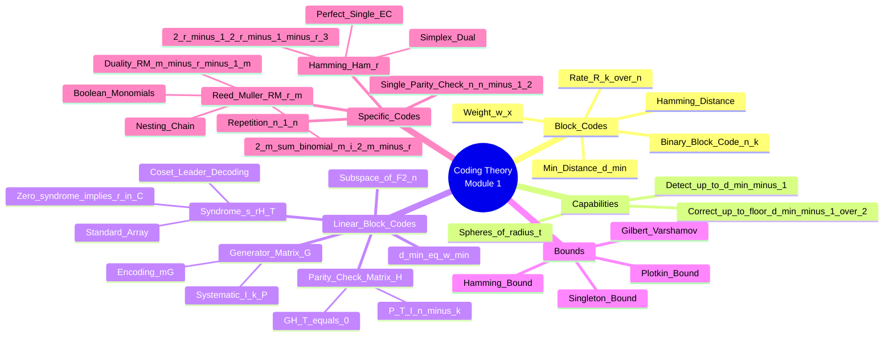

# MODULE CHEAT SHEET: CODING THEORY — MODULE 1 (Binary Block Codes & Linear Codes)

---

## 1. CORE CONCEPT MATRIX

| # | Topic | Core Definition | Cognitive Level (BTL) | Primary Utility |
|---|-------|-----------------|------------------------|-----------------|
| 1.1 | **Binary Block Code** | A code $C \subseteq \{0,1\}^n$ mapping $k$-bit messages to $n$-bit codewords ($n > k$). | Remember (L1) | Foundation of discrete channel coding. |
| 1.2 | **Code Parameters $(n, k, d_{\min})$** | $n$=length, $k$=dimension, $d_{\min}$=min Hamming distance. | Understand (L2) | Compact code specification. |
| 1.3 | **Code Rate $R$** | $R = \tfrac{k}{n}$; efficiency of transmission. | Apply (L3) | Bandwidth vs. reliability trade-off. |
| 1.4 | **Hamming Weight $w(\mathbf{x})$** | Number of nonzero coordinates in $\mathbf{x}$. | Remember (L1) | Distance measure for binary vectors. |
| 1.5 | **Hamming Distance $d(\mathbf{x}, \mathbf{y})$** | Number of coordinate positions where $\mathbf{x}$ and $\mathbf{y}$ differ $= w(\mathbf{x} \oplus \mathbf{y})$. | Apply (L3) | Quantifies error impact. |
| 1.6 | **Minimum Distance $d_{\min}$** | Smallest Hamming distance between any two distinct codewords of $C$. | Analyze (L4) | Determines error capability. |
| 1.7 | **Error Detection** | Ability to detect up to $d_{\min} - 1$ errors. | Understand (L2) | Guarantees detectable corruption. |
| 1.8 | **Error Correction** | Ability to correct up to $\big\lfloor \tfrac{d_{\min}-1}{2} \big\rfloor$ errors. | Analyze (L4) | Enables decoder recovery. |
| 1.9 | **Linear Block Code** | $C$ is a $k$-dimensional subspace of $\mathbb{F}_2^n$ closed under addition. | Understand (L2) | Algebraic structure simplifies decoding. |
| 1.10 | **Generator Matrix $G$** | $k \times n$ matrix whose rows form a basis of $C$; encoding $\mathbf{c} = \mathbf{m}G$. | Apply (L3) | Systematic encoding. |
| 1.11 | **Systematic Form** | $G = [I_k \mid P]$; codeword $\mathbf{c} = (\mathbf{m}, \mathbf{m}P)$. | Apply (L3) | Easy extraction of message bits. |
| 1.12 | **Parity-Check Matrix $H$** | $(n-k) \times n$ matrix with $GH^T = 0$; $H$ rows span null space. | Apply (L3) | Enables syndrome decoding. |
| 1.13 | **Syndrome $\mathbf{s}$** | $\mathbf{s} = \mathbf{r}H^T$; non-zero $\mathbf{s}$ indicates error pattern. | Analyze (L4) | Decoding via syndrome lookup. |
| 1.14 | **Syndrome Decoding** | Match $\mathbf{s}$ to column of $H$ to estimate single-bit error. | Apply (L3) | Optimal decoding for small codes. |
| 1.15 | **Coset Leader Decoding** | Partition $\mathbb{F}_2^n$ into cosets of $C$; each coset = unique syndrome. | Analyze (L4) | General ML decoding. |
| 1.16 | **Single Parity-Check Code (SPC)** | $(n, n-1, 2)$ code: append parity bit $b = \sum m_i \pmod 2$. | Remember (L1) | Detects all odd-weight errors. |
| 1.17 | **Repetition Code** | $(n, 1, n)$: each bit repeated $n$ times. | Remember (L1) | Trivial example of error correction. |
| 1.18 | **Hamming Code** | $\text{Ham}(r) = (2^r-1, 2^r-1-r, 3)$ perfect single-error-correcting code. | Apply (L3) | Most exam-relevant non-trivial code. |
| 1.19 | **Perfect Code** | All spheres of radius $t$ partition $\mathbb{F}_2^n$ exactly. | Analyze (L4) | Hamming codes are perfect. |
| 1.20 | **Reed-Muller Code $R(r, m)$** | $\text{RM}(r,m) = (2^m, \sum_{i=0}^{r}\binom{m}{i}, 2^{m-r})$. | Apply (L3) | Multi-level construction via Boolean functions. |
| 1.21 | **Bose Bound (Hamming Bound)** | Sum of decoding sphere sizes $\leq 2^n \Rightarrow$ constraints on perfect codes. | Analyze (L4) | Proves Hamming codes are optimal. |

---

## 2. THE MASTER FORMULA SHEET

| # | Formula / Identity | Meaning / Parameters | Units / Domain |
|---|-------------------|----------------------|----------------|
| **F1** | $d(\mathbf{x},\mathbf{y}) = w(\mathbf{x} \oplus \mathbf{y})$ | Hamming distance in $\mathbb{F}_2^n$ | Non-negative integer |
| **F2** | $d_{\min} = \min_{\mathbf{x} \neq \mathbf{y} \in C} d(\mathbf{x},\mathbf{y})$ | Minimum distance of code $C$ | Integer $\geq 1$ |
| **F3** | $w_{\min} = \min_{\mathbf{c} \in C, \mathbf{c} \neq \mathbf{0}} w(\mathbf{c})$ | For linear codes, $d_{\min} = w_{\min}$ | Integer $\geq 1$ |
| **F4** | $R = \tfrac{k}{n}$ | Code rate (information bits per transmitted bit) | $0 < R \leq 1$ |
| **F5** | Error detection capability $= d_{\min} - 1$ | Maximum # of errors detected guaranteed | Integer |
| **F6** | Error correction capability $t = \big\lfloor \tfrac{d_{\min}-1}{2} \big\rfloor$ | Maximum # of errors corrected guaranteed | Integer |
| **F7** | $\mathbf{c} = \mathbf{m}G$ | Encoding using generator matrix | $\mathbf{m} \in \mathbb{F}_2^k$ |
| **F8** | $G = [I_k \mid P]$ | Systematic generator; $P$ is $k \times (n-k)$ | $\mathbb{F}_2$ entries |
| **F9** | $H = [P^T \mid I_{n-k}]$ | Parity-check matrix in systematic form | $\mathbb{F}_2$ entries |
| **F10** | $GH^T = 0_{(n-k) \times k}$ | Defining orthogonality of $G, H$ | Mod 2 arithmetic |
| **F11** | $\mathbf{s} = \mathbf{r} H^T$ | Syndrome of received vector $\mathbf{r}$ | $\mathbf{s} \in \mathbb{F}_2^{n-k}$ |
| **F12** | $\mathbf{s} = \mathbf{e} H^T$ | Syndrome depends only on error pattern $\mathbf{e}$ | $\mathbb{F}_2^{n-k}$ |
| **F13** | $\mathbf{s} = \mathbf{0} \iff \mathbf{r} \in C$ | Zero syndrome means (assumed) no error | Decoding test |
| **F14** | $\sum_{i=0}^{t}\binom{n}{i} \leq 2^{n-k}$ | **Hamming (Sphere-Packing) Bound** | Necessary for $t$-EC code |
| **F15** | Code is **perfect** if $\sum_{i=0}^{t}\binom{n}{i} = 2^{n-k}$ | Equality in Hamming bound | Binary only |
| **F16** | Singleton bound: $d_{\min} \leq n - k + 1$ | $n - k$ is max # of parity bits | Equality $\Rightarrow$ MDS code |
| **F17** | Plotkin bound: $d_{\min} \leq \tfrac{n \cdot 2^{k-1}}{2^k - 1}$ | Used for high-distance codes | $d_{\min}$ large |
| **F18** | Gilbert–Varshamov: $\exists$ code with $d_{\min} \geq d$ if $\sum_{i=0}^{d-2}\binom{n-1}{i} < 2^{n-k}$ | Existence bound | Asymptotic use |
| **F19** | $\text{Ham}(r): n = 2^r-1$, $k = n-r$, $d_{\min} = 3$ | Hamming code parameters | Perfect 1-EC code |
| **F20** | $\text{RM}(r,m): n = 2^m$, $k = \sum_{i=0}^{r}\binom{m}{i}$, $d_{\min} = 2^{m-r}$ | Reed-Muller parameters | $0 \leq r \leq m$ |
| **F21** | $\text{RM}(1, m) \subset \text{RM}(2, m) \subset \cdots \subset \text{RM}(m, m)$ | Nesting of RM codes | Boolean hierarchy |
| **F22** | Dual of $\text{RM}(r, m)$ is $\text{RM}(m-r-1, m)$ | Duality (Pless identity) | $\mathbb{F}_2$ |
| **F23** | $A_i = \#\{\mathbf{c} \in C : w(\mathbf{c}) = i\}$ | Weight distribution coefficients | $A_0 = 1$ always |
| **F24** | MacWilliams identity relates $A_i$ to $A_i^\perp$ (dual weight dist.) | Used to verify dual codes | $\mathbb{F}_2$ |
| **F25** | Probability of undetected error (SPC) $= \tfrac{1}{2} - \tfrac{1}{2}(1-2p)^{n-1}$ | $p$ = bit error probability | $0 \leq p \leq \tfrac{1}{2}$ |

---

## 3. HIGH-YIELD EXAM CHECKPOINTS

### ⭐ Section A / 2-Mark Questions
- Define: block code, linear block code, Hamming distance, weight, syndrome, parity-check matrix, generator matrix, perfect code, coset.
- Write parameters of SPC, repetition, and $\text{Ham}(r)$.
- Why is $d_{\min}$ of a linear code equal to the minimum non-zero weight? *(Because distance is translation-invariant and $\mathbf{0} \in C$.)*

### ⭐ Section B / 5-Mark Questions
- **Derive** $t = \big\lfloor \tfrac{d_{\min}-1}{2} \big\rfloor$ via sphere-packing argument (draw concentric spheres around each codeword).
- **Prove** the Hamming bound: $\sum_{i=0}^{t}\binom{n}{i} \leq 2^{n-k}$.
- Show $\text{Ham}(r)$ achieves equality (perfect).
- Construct $G$ and $H$ for given parameters; prove $GH^T = 0$.
- **Prove** $d_{\min} = $ minimum number of linearly dependent columns of $H$ (i.e., smallest set whose sum is $\mathbf{0}$).
- Explain **syndrome decoding** step-by-step with a worked example.

### ⭐ Section C / 10–15 Mark Questions
- Construct a $(7,4)$ Hamming code: $G$, $H$, all 16 codewords, syndrome table for all 1-bit errors, decoding example.
- Derive Reed-Muller code $\text{RM}(1, 3)$: Boolean monomials, generator matrix, dual, parameters.
- Show that $\text{Ham}(r)^\perp$ is the **simplex code** with parameters $(2^r-1, r, 2^{r-1})$.
- Prove the **duality** $G H^T = 0$ for systematic forms; show every linear code has a unique parity-check matrix up to row operations.
- Decode using **coset leader table** for a small linear code (e.g., $(6,3)$).

### ⭐ Critical Theorems to Memorize
1. **Syndrome theorem:** $\mathbf{s}(\mathbf{r}) = \mathbf{0} \iff \mathbf{r} \in C$.
2. **Error detection:** linear code detects all error patterns $\mathbf{e}$ with $\mathbf{e} \notin C$.
3. **Distance ↔ H columns:** $d_{\min} = $ smallest # of columns of $H$ summing to $\mathbf{0}$.
4. **Perfect code property** of $\text{Ham}(r)$.
5. **Reed-Muller duality** and parameter formulas.
6. **Weight distribution of Hamming codes** (compute $A_0, A_3, A_4, A_7$ for $\text{Ham}(3)$).

---

## 4. EXAMINER'S WARNING GUIDE (Valuation Insights)

| ⚠️ | Mistake to Avoid | Correct Approach |
|----|------------------|------------------|
| W1 | Using $d_{\min}$ for error detection instead of $d_{\min}-1$ | $e$-detection $\leq d_{\min}-1$ errors; $e$-correction $\leq \big\lfloor (d_{\min}-1)/2 \big\rfloor$. |
| W2 | Confusing weight of vector vs. length of code | $w(\mathbf{x})$ = # of 1s; $n$ = total positions. |
| W3 | Forgetting that $d_{\min} = w_{\min}$ holds **only for linear codes** | Non-linear codes: must compute pairwise distances. |
| W4 | Writing $G H^T = I$ instead of $G H^T = 0$ | Orthogonality: $G H^T = 0_{(n-k)\times k}$. |
| W5 | Confusing rows vs. columns in parity check ($H$ is $(n-k) \times n$) | Dimension: $H$ has $n-k$ rows. |
| W6 | Syndrome computed as $H \mathbf{r}$ instead of $\mathbf{r} H^T$ | Convention varies; **state convention** clearly. |
| W7 | Assuming Hamming codes correct 2 errors | $d_{\min}=3 \Rightarrow t=1$ only. |
| W8 | Listing parameters incorrectly: $\text{Ham}(r)$ vs. $\text{Ham}(3)$ | $\text{Ham}(3)=(7,4,3)$; $\text{Ham}(4)=(15,11,3)$. |
| W9 | Forgetting dual relationship $\text{RM}(r,m)^\perp = \text{RM}(m-r-1, m)$ | $m=3$: $\text{RM}(1,3)^\perp = \text{RM}(1,3)$ — self-dual! |
| W10 | Arithmetic in $\mathbb{F}_{10}$ instead of $\mathbb{F}_2$ (forgetting mod 2) | All binary-code operations: $1+1=0$. |
| W11 | Writing $\sum$ instead of $\oplus$ for vector addition | Use $\oplus$ to emphasize mod-2. |
| W12 | Mixing up generator row space with column space | Row space of $G$ = code $C$; null space of $H$ = code $C$. |

### 🎯 Presentation Tips
- **Always state** code parameters $(n,k,d_{\min})$ explicitly when introducing any code.
- **Show** modular arithmetic step-by-step (e.g., "$1+1=2 \equiv 0 \pmod 2$").
- **Draw** syndrome decoding tables neatly with all $2^{n-k}$ coset leaders.
- **Mention** whether code is systematic — if not, perform row reduction on $G$.
- **Verify** $GH^T = 0$ explicitly in any construction.

---

## 5. QUICK-REVISION DIAGRAM (Mermaid Mindmap)

---

### 🔥 LAST-MINUTE MEMORY TRICKS
- **"Hamming 3-2-1"**: $d_{\min}=3$, $2^r-1$ length, **1**-error correct.
- **"RM = Reed-Muller m^r"**: $n=2^m$, $d_{\min}=2^{m-r}$ — exponent drops with $r$.
- **"Parity detects odd"**: SPC catches all odd-weight errors, misses half of even-weight.
- **"G rows, H columns, GH$^T$=0"**: $G$ generates the code, $H$ checks the code, they annihilate.
- **"Sphere of radius t"**: each coset leader = center of an error sphere of size $\sum_{i=0}^{t}\binom{n}{i}$.

> **Good Luck on the Exam — Master $G$, $H$, and the syndrome table, and you own Module 1!**
