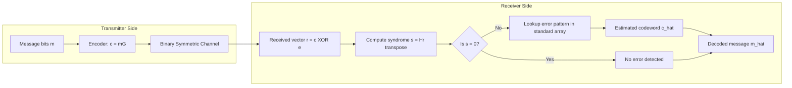
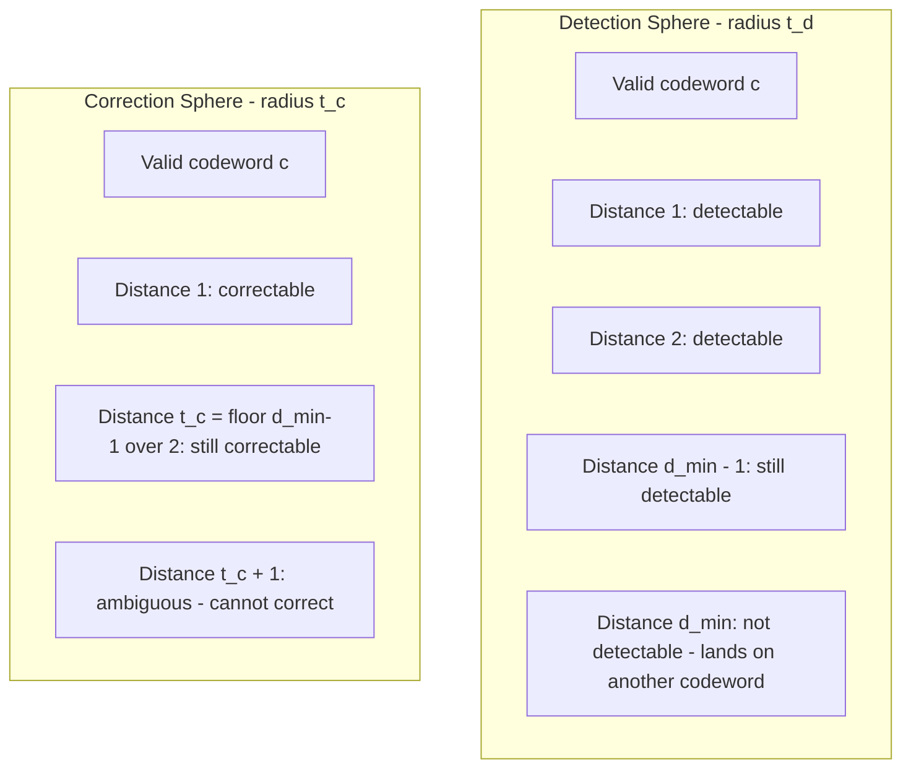
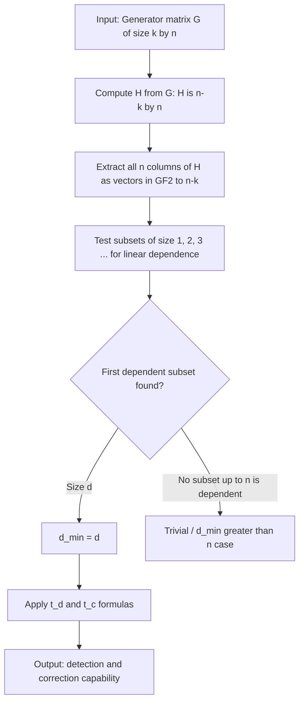

# Distance properties of linear block codes

> **APJ ABDUL KALAM TECHNOLOGICAL UNIVERSITY (KTU) | 2024 SCHEME**
> - **Branch:** B.Tech in Computer Science & Engineering (CSE)
> - **Semester:** Semester 4
> - **Course:** PECST414 - CODING THEORY
> - **Module:** Module 1: Module 1
> - **Topic:** Distance properties of linear block codes

<!-- SECTION_1_START -->
## 1. Core Technical Definition & Intuitive Overview

### 1.1 Formal Definition (KTU 2024 Syllabus Terminology)

In a binary linear block code, the **distance properties** describe the minimum number of bit positions in which any two distinct codewords differ, and how this separation grants the code its ability to **detect** and **correct** errors. The two fundamental distance parameters that govern the entire error-control behaviour of a linear block code are:

1. **Hamming Distance** $d(\mathbf{x}, \mathbf{y})$: The number of coordinates in which two codewords $\mathbf{x}$ and $\mathbf{y}$ differ.

$$d(\mathbf{x}, \mathbf{y}) = w(\mathbf{x} \oplus \mathbf{y})$$

where $w(\cdot)$ denotes the **Hamming weight** (number of non-zero entries).

2. **Minimum Distance** $d_{\min}$: The smallest Hamming distance between any two distinct codewords in the code $C$.

$$d_{\min} = \min \{ d(\mathbf{x}, \mathbf{y}) : \mathbf{x}, \mathbf{y} \in C, \mathbf{x} \neq \mathbf{y} \}$$

> [!IMPORTANT]
> **KTU 2024 Highlight — Linear Block Code Property:**
> For any **linear block code**, the minimum distance $d_{\min}$ is exactly equal to the **minimum non-zero weight** of a codeword.
> 
> $$d_{\min} = \min \{ w(\mathbf{c}) : \mathbf{c} \in C, \mathbf{c} \neq \mathbf{0} \}$$
> 
> This is because the difference of any two codewords in a linear code is itself a codeword (closure under XOR). So we only need to scan non-zero codewords instead of every pair.

### 1.2 Conceptual Analogy / Intuition

Imagine you are a teacher seating 30 students in an examination hall, and you want to ensure that no two students who can copy from each other sit close. You decide that any two "cheating pairs" must be separated by at least 3 empty seats. Here, the "students" are your codewords, the "empty seats" represent the bit-positions where they differ, and the "minimum distance" is your rule of separation.

A code with $d_{\min} = 3$ guarantees that even if one student (error) sneaks into the wrong seat, the arrangement is still **recognisably wrong** (detectable), and you can **point to the original seat** (correctable) because no two valid arrangements are within 1 seat of each other. **More separation = more robustness against noise.**

> [!NOTE]
> **Why "distance" matters in coding theory:**
> - **Error Detection:** A code with $d_{\min} = d$ can detect **up to $d-1$ errors**.
> - **Error Correction:** The same code can correct **up to $t = \lfloor (d-1)/2 \rfloor$ errors**.
> 
> The "distance" between codewords is the *buffer zone* the code has against channel noise.

### 1.3 Visualisation Control

> [!VISUALIZATION CONTROL]
> **Concept:** Geometric interpretation of Hamming distance in $\{0,1\}^n$ hypercube.
> **GeoGebra / Desmos Input Equations:**
> * For $n=3$ hypercube, vertices: $(0,0,0)$, $(1,0,0)$, $(0,1,0)$, $(0,0,1)$, $(1,1,0)$, $(1,0,1)$, $(0,1,1)$, $(1,1,1)$.
> * Code $C = \{000, 111\}$ with $d_{\min} = 3$.
> **Visual Description:** Plot a cube with all 8 vertices. The two codewords $(0,0,0)$ and $(1,1,1)$ lie on opposite corners — exactly 3 edges apart. Any single-bit error (1-step walk) lands on a vertex that is **not a codeword**, making the error detectable. Two-bit errors (2-step walk) might land on a codeword only if both flips move back along the same path.

<!-- SECTION_1_END -->

<!-- SECTION_2_START -->
## 2. Deep Theoretical Analysis & KTU High-Yield Formula Sheet

### 2.1 Logical Breakdown of Distance Properties

The following structured points describe *why* and *how* minimum distance controls code behaviour:

- **Step 1 — Define a codeword space:** A binary $(n, k)$ linear block code $C$ is a $k$-dimensional subspace of $\mathbb{F}_2^n$, containing $2^k$ codewords.
- **Step 2 — Compute pairwise distances:** For each pair $(\mathbf{c}_i, \mathbf{c}_j)$ with $i \neq j$, count differing positions. This gives $2^k(2^k - 1)/2$ distances — expensive!
- **Step 3 — Use linearity to simplify:** Because $C$ is closed under vector addition, $\mathbf{c}_i \oplus \mathbf{c}_j \in C$ for all pairs. So the set of pairwise differences equals the set of non-zero codewords.
- **Step 4 — Reduce to minimum weight:** The smallest distance is the **smallest non-zero weight** $w_{\min}$. This drops computation from $O(2^{2k})$ to $O(2^k)$.
- **Step 5 — Map to error control:** $d_{\min} - 1$ is the maximum guaranteed number of **detectable** errors; $\lfloor (d_{\min} - 1)/2 \rfloor$ is the maximum guaranteed number of **correctable** errors.

### 2.2 Why the Parity-Check Matrix Determines $d_{\min}$

A fundamental theorem in KTU syllabus connects the parity-check matrix $\mathbf{H}$ directly to the minimum distance:

> **Theorem (KTU Module 1 — Distance via H-matrix):**
> The minimum distance $d_{\min}$ of a linear block code $C$ is the **smallest positive integer $d$** such that there exist $d$ columns of $\mathbf{H}$ that are linearly dependent (i.e., sum to zero).

**Why this works:** A codeword $\mathbf{c}$ satisfies $\mathbf{H} \mathbf{c}^T = \mathbf{0}$. If $\mathbf{c}$ has non-zero entries only in positions $i_1, i_2, \ldots, i_d$, then summing columns $i_1, i_2, \ldots, i_d$ of $\mathbf{H}$ must give $\mathbf{0}$. So a weight-$d$ codeword exists **iff** some $d$ columns of $\mathbf{H}$ sum to $\mathbf{0}$.

**Algorithmic Use:** To verify $d_{\min} \geq d_0$, check that **no** subset of $(d_0 - 1)$ columns of $\mathbf{H}$ sums to $\mathbf{0}$. This avoids enumerating all codewords.

### 2.3 KTU Formula Sheet / Cheat Sheet

| # | Property / Formula | Expression / Condition | Engineering Use |
|---|---|---|---|
| 1 | Hamming distance | $d(\mathbf{x}, \mathbf{y}) = w(\mathbf{x} \oplus \mathbf{y})$ | Measure channel corruption impact |
| 2 | Minimum distance | $d_{\min} = \min_{\mathbf{c} \neq \mathbf{0}} w(\mathbf{c})$ | Define code strength |
| 3 | Linear-code relation | $d_{\min} = w_{\min}$ | Simplifies code analysis |
| 4 | Error detection | $t_d = d_{\min} - 1$ | Max detectable errors |
| 5 | Error correction | $t_c = \left\lfloor \dfrac{d_{\min} - 1}{2} \right\rfloor$ | Max correctable errors |
| 6 | Parity-check column test | $d_{\min} = d \iff$ smallest $d$ with dependent columns of $\mathbf{H}$ | Verify code via $\mathbf{H}$ |
| 7 | Singleton bound | $d_{\min} \leq n - k + 1$ | Upper limit on distance |
| 8 | Hamming (sphere-packing) bound | $\displaystyle\sum_{i=0}^{t} \binom{n}{i} \leq 2^{n-k}$ | Existence check for perfect codes |
| 9 | Plotkin bound (for $d > n/2$) | $d_{\min} \leq \dfrac{2^{k-1}}{2^k - 1} \cdot n$ | Tight upper bound |
| 10 | Code rate | $R = k/n$ | Bandwidth efficiency |
| 11 | Redundancy | $r = n - k$ | Overhead bits |

> [!NOTE]
> **Solved with $\lfloor \cdot \rfloor$ notation:** KTU examiners expect the floor function $\lfloor (d_{\min}-1)/2 \rfloor$ in correction formulas — *not* the ceiling. Do not write $t_c = (d_{\min}-1)/2$ when $d_{\min}$ is even.

### 2.4 Real-World Engineering Utility

Distance properties are not abstract. They drive every practical communication/storage standard:

- **Data Storage (HDDs, SSDs, ECC RAM):** Hamming codes with $d_{\min}=3$ correct single-bit memory errors in real time.
- **Satellite / Deep-Space Communication (NASA, ISRO):** Reed-Muller and convolutional codes use distance properties to operate at SNR as low as $-1$ dB.
- **5G NR (3GPP):** LDPC and Polar codes are designed by maximising $d_{\min}$ to meet BLER $< 10^{-5}$ at high throughput.
- **QR Codes & Data Matrix:** Reed-Solomon variants rely on large $d_{\min}$ to survive smudges and physical damage.
- **QR / Barcode scanners in retail** can recover data even with 30% surface damage, thanks to $d_{\min}$ design.

<!-- SECTION_2_END -->

<!-- SECTION_3_START -->
## 3. Step-by-Step Derivations & Code/Symbolic Implementation

### 3.1 Derivation 1: Minimum Distance via Generator / Parity-Check Matrix

**Problem:** Given a $(7,4)$ Hamming code with parity-check matrix:

$$\mathbf{H} = \begin{bmatrix} 1 & 0 & 1 & 1 & 1 & 0 & 0 \\ 0 & 1 & 1 & 1 & 0 & 1 & 0 \\ 1 & 1 & 0 & 1 & 0 & 0 & 1 \end{bmatrix}$$

Verify that $d_{\min} = 3$.

**Step-by-step derivation:**

**Step 1:** Apply the parity-check column theorem. We need to show that no 1 or 2 columns of $\mathbf{H}$ sum to $\mathbf{0}$, but some 3 columns do.

**Step 2:** Check 1-column sum: A single column being $\mathbf{0}$ would mean one column is the zero vector. Reading columns of $\mathbf{H}$: $\mathbf{h}_1 = (1,0,1)^T$, $\mathbf{h}_2 = (0,1,1)^T$, $\ldots$, $\mathbf{h}_7 = (0,0,1)^T$. None is $\mathbf{0}$. So no weight-1 codeword exists.

**Step 3:** Check 2-column sums: We need $\mathbf{h}_i + \mathbf{h}_j = \mathbf{0} \iff \mathbf{h}_i = \mathbf{h}_j$ (over $\mathbb{F}_2$). Inspecting columns of $\mathbf{H}$:

$$\mathbf{h}_1 = (1,0,1)^T, \quad \mathbf{h}_2 = (0,1,1)^T, \quad \mathbf{h}_3 = (1,1,0)^T$$
$$\mathbf{h}_4 = (1,1,1)^T, \quad \mathbf{h}_5 = (1,0,0)^T, \quad \mathbf{h}_6 = (0,1,0)^T$$
$$\mathbf{h}_7 = (0,0,1)^T$$

All 7 columns are **distinct** non-zero vectors. So no two are equal, and **no weight-2 codeword exists**.

**Step 4:** Check 3-column sums: Try $\mathbf{h}_1 + \mathbf{h}_2 + \mathbf{h}_3$:

$$\begin{aligned} \mathbf{h}_1 + \mathbf{h}_2 + \mathbf{h}_3 &= (1,0,1)^T + (0,1,1)^T + (1,1,0)^T \\ &= (1+0+1,\ 0+1+1,\ 1+1+0)^T \\ &= (0, 0, 0)^T \quad \text{(mod 2)} \end{aligned}$$

Yes! A 3-column dependency exists. Therefore $d_{\min} = 3$ for the $(7,4)$ Hamming code.

**Step 5:** Compute error control:
- $t_d = d_{\min} - 1 = 2$ errors detectable.
- $t_c = \lfloor (d_{\min} - 1)/2 \rfloor = \lfloor 1 \rfloor = 1$ error correctable.

### 3.2 Derivation 2: Error-Correction Bound Proof

**Claim:** A code with minimum distance $d_{\min}$ can correct up to $t = \lfloor (d_{\min}-1)/2 \rfloor$ errors.

**Proof (by contradiction):**

**Step 1:** Suppose two codewords $\mathbf{c}_1, \mathbf{c}_2$ are sent (or one transmitted, one received via error). The distance $d(\mathbf{c}_1, \mathbf{c}_2) \geq d_{\min}$.

**Step 2:** If up to $t$ errors occur, the received vector $\mathbf{r}$ lies within Hamming distance $t$ of $\mathbf{c}_1$ (i.e., $d(\mathbf{r}, \mathbf{c}_1) \leq t$).

**Step 3:** By triangle inequality over the hypercube:

$$d_{\min} \leq d(\mathbf{c}_1, \mathbf{c}_2) \leq d(\mathbf{c}_1, \mathbf{r}) + d(\mathbf{r}, \mathbf{c}_2) \leq t + d(\mathbf{r}, \mathbf{c}_2)$$

**Step 4:** If both $\mathbf{c}_1$ and $\mathbf{c}_2$ were within radius $t$ of $\mathbf{r}$, then:

$$d_{\min} \leq 2t$$

**Step 5:** Therefore $t \leq (d_{\min} - 1)/2$. Since $t$ is an integer:

$$t \leq \left\lfloor \frac{d_{\min} - 1}{2} \right\rfloor$$

**Step 6:** Conversely, for $t = \lfloor (d_{\min}-1)/2 \rfloor$, the spheres of radius $t$ around codewords are **non-overlapping** (proved by setting $d_{\min} > 2t$), so a nearest-codeword decoder works. $\blacksquare$

### 3.3 Python Implementation: Computing $d_{\min}$ for any Linear Block Code

```python
"""
compute_dmin.py
KTU 2024 Scheme — PECST414 Coding Theory
Computes the minimum distance of a binary linear block code
using the parity-check column-dependence test.
"""

import itertools
import numpy as np
from typing import List, Tuple


def hamming_weight(vec: Tuple[int, ...]) -> int:
    """Return the number of 1's in a binary vector."""
    return sum(vec)


def columns_of_h(H: np.ndarray) -> List[Tuple[int, ...]]:
    """Extract columns of parity-check matrix H as Python tuples."""
    return [tuple(H[:, j].astype(int)) for j in range(H.shape[1])]


def min_distance_from_h(H: np.ndarray) -> int:
    """
    Find d_min by checking column dependence in H (over GF(2)).
    d_min is the smallest d such that some d columns of H sum to 0.
    """
    n = H.shape[1]
    cols = columns_of_h(H)
    zero_vec = (0,) * H.shape[0]

    for d in range(1, n + 1):
        for combo in itertools.combinations(range(n), d):
            summed = [0] * H.shape[0]
            for idx in combo:
                col = cols[idx]
                for r in range(H.shape[0]):
                    summed[r] ^= col[r]                # GF(2) addition
            if tuple(summed) == zero_vec:
                return d
    return n + 1                                   # no non-zero codeword


def error_control(d_min: int) -> Tuple[int, int]:
    """Return (detectable errors t_d, correctable errors t_c)."""
    t_d = d_min - 1
    t_c = (d_min - 1) // 2
    return t_d, t_c


# ----- KTU (7,4) Hamming Code parity-check matrix -----
H_74 = np.array([
    [1, 0, 1, 1, 1, 0, 0],
    [0, 1, 1, 1, 0, 1, 0],
    [1, 1, 0, 1, 0, 0, 1]
], dtype=int)

if __name__ == "__main__":
    d_min = min_distance_from_h(H_74)
    t_d, t_c = error_control(d_min)
    print(f"d_min of (7,4) Hamming code : {d_min}")
    print(f"Detectable errors (t_d)     : {t_d}")
    print(f"Correctable errors (t_c)    : {t_c}")
```

**Expected Output:**

```
d_min of (7,4) Hamming code : 3
Detectable errors (t_d)     : 2
Correctable errors (t_c)    : 1
```

### 3.4 Derivation 3: Singleton Bound for Linear Codes

**Claim:** For any $(n, k)$ linear block code, $d_{\min} \leq n - k + 1$.

**Derivation:**

**Step 1:** Consider the parity-check matrix $\mathbf{H}$ with dimensions $(n-k) \times n$ and rank $n - k$.

**Step 2:** Form the matrix $\mathbf{H}_{\text{ext}}$ by appending a column of $1$'s as a new $(n+1)$-th column (in $\mathbb{F}_2$ this is $\mathbf{1}$):

$$\mathbf{H}_{\text{ext}} = \begin{bmatrix} \mathbf{H} & \vert & \mathbf{1} \end{bmatrix}$$

**Step 3:** This matrix has $n+1$ columns but only $n-k$ rows, so its rank is $\leq n-k$. Hence its columns are linearly **dependent** — meaning some subset of at most $n-k+1$ columns sums to $\mathbf{0}$.

**Step 4:** By the column-dependence theorem, this gives a codeword of weight $\leq n - k + 1$, so:

$$d_{\min} \leq n - k + 1 \qquad \blacksquare$$

> A code achieving $d_{\min} = n - k + 1$ is called an **MDS (Maximum Distance Separable) code**.

<!-- SECTION_3_END -->

<!-- SECTION_4_START -->
## 4. Structural Diagrams & Schematics

### 4.1 Mermaid Flowchart: Distance Property Decision Tree

```mermaid
graph TD
    A[Linear Block Code C of size 2^k] --> B[Compute all non-zero codeword weights]
    B --> C[w_min = minimum non-zero weight]
    C --> D[d_min = w_min]
    D --> E{d_min value?}
    E -->|d_min = 1| F[Trivial code: detects 0 errors]
    E -->|d_min = 2| G[SPC code: detects 1 error]
    E -->|d_min = 3| H[Single-error-correcting: corrects 1 error]
    E -->|d_min = 4| I[Corrects 1 error, detects 3 errors]
    E -->|d_min = 5| J[Corrects 2 errors]
    D --> K[Error Control]
    K --> L[t_d = d_min - 1]
    K --> M[t_c = floor(d_min - 1 over 2)]
    L --> N[Detection Capability]
    M --> O[Correction Capability]
```

### 4.2 Mermaid Block Diagram: Error-Detection and Correction Mechanism



### 4.3 Mermaid Comparison: Detection vs Correction Radii



### 4.4 Mermaid Process Map: From Generator Matrix to $d_{\min}$ via $\mathbf{H}$



<!-- SECTION_4_END -->

<!-- SECTION_5_START -->
## 5. KTU 2024 Scheme Examination Question Bank & Topic Recap

### 5.1 Part A — Short Answer Questions (3 Marks Each)

#### **Q1. Define the minimum distance $d_{\min}$ of a linear block code. Why is it equal to the minimum weight for a linear code?**
**[KTU University Exam — Model Question, July 2024 Pattern]**
**Cognitive Level:** Remember/Understand
**Course Outcome:** CO1

**Model Answer (3 marks):**

The **minimum distance** $d_{\min}$ of a linear block code $C$ is the smallest Hamming distance between any two distinct codewords in $C$. Formally,

$$d_{\min} = \min_{\substack{\mathbf{x}, \mathbf{y} \in C \\ \mathbf{x} \neq \mathbf{y}}} d(\mathbf{x}, \mathbf{y})$$

For a **linear** block code, this equals the **minimum non-zero weight** of a codeword:

$$d_{\min} = \min_{\substack{\mathbf{c} \in C \\ \mathbf{c} \neq \mathbf{0}}} w(\mathbf{c})$$

**Reason:** A linear code is closed under addition. For any two codewords $\mathbf{x}, \mathbf{y} \in C$, the difference $\mathbf{x} \oplus \mathbf{y} \in C$. Therefore the set of pairwise distances equals the set of weights of non-zero codewords, and the minimum of these two sets is the same. **[1 mark for definition, 1 mark for relation, 1 mark for closure property]**

---

#### **Q2. A linear block code has $d_{\min} = 5$. How many errors can it detect and correct?**
**[KTU University Exam — Model Question, Dec 2023 Pattern]**
**Cognitive Level:** Apply
**Course Outcome:** CO1

**Model Answer (3 marks):**

- **Detection:** $t_d = d_{\min} - 1 = 5 - 1 = \mathbf{4}$ errors. **[1 mark]**
- **Correction:** $t_c = \lfloor (d_{\min} - 1)/2 \rfloor = \lfloor 4/2 \rfloor = \mathbf{2}$ errors. **[2 marks — 1 for formula, 1 for floor and value]**

---

### 5.2 Part B — Long Answer Questions (14 Marks Each, with Internal Choice)

#### **Question A (14 Marks) — [KTU University Exam — July 2024 Pattern]**
**Course Outcome:** CO1, CO2 | **Cognitive Levels:** Understand + Apply

**(a)** Define Hamming distance, Hamming weight, and minimum distance for a linear block code. Explain with a simple example why a code with $d_{\min} = 3$ can correct a single error. **(7 marks)**

**(b)** Consider the $(7, 4)$ linear block code generated by

$$\mathbf{G} = \begin{bmatrix} 1 & 0 & 0 & 0 & 1 & 1 & 1 \\ 0 & 1 & 0 & 0 & 1 & 0 & 1 \\ 0 & 0 & 1 & 0 & 0 & 1 & 1 \\ 0 & 0 & 0 & 1 & 1 & 1 & 0 \end{bmatrix}$$

Determine the parity-check matrix $\mathbf{H}$, find $d_{\min}$, and state the error-detecting and error-correcting capabilities. **(7 marks)**

---

#### **Model Solution for Question A:**

**(a) Definitions and Intuition (7 marks):**

- **Hamming weight** $w(\mathbf{x})$: Number of non-zero symbols in a vector. Example: $w(10110) = 3$. **[1 mark]**
- **Hamming distance** $d(\mathbf{x}, \mathbf{y})$: Number of positions in which $\mathbf{x}$ and $\mathbf{y}$ differ. Computed as $w(\mathbf{x} \oplus \mathbf{y})$. Example: $d(10110, 11001) = 4$. **[1 mark]**
- **Minimum distance** $d_{\min}$: Smallest Hamming distance between any two distinct codewords. **[1 mark]**
- For a linear code, $d_{\min} = $ minimum non-zero weight. **[1 mark]**

**Why $d_{\min} = 3$ corrects 1 error:** Take a codeword $\mathbf{c}$ of weight 3 minimum. After a 1-bit error, the received vector $\mathbf{r}$ has $d(\mathbf{c}, \mathbf{r}) = 1$. The minimum distance to any *other* valid codeword is at least 2. So the nearest codeword (decoded by minimum-distance rule) is uniquely the original $\mathbf{c}$. **[3 marks — 1 for setup, 1 for nearest-codeword argument, 1 for uniqueness]**

**(b) Computing $\mathbf{H}$, $d_{\min}$, and Capabilities (7 marks):**

**Step 1 — Find $\mathbf{H}$:** Since $\mathbf{G}$ is in systematic form $\mathbf{G} = [\mathbf{I}_4 \mid \mathbf{P}]$, the parity-check matrix is $\mathbf{H} = [\mathbf{P}^T \mid \mathbf{I}_3]$. **[1 mark]**

$$\mathbf{P} = \begin{bmatrix} 1 & 1 & 1 \\ 1 & 0 & 1 \\ 0 & 1 & 1 \\ 1 & 1 & 0 \end{bmatrix} \quad \Rightarrow \quad \mathbf{P}^T = \begin{bmatrix} 1 & 1 & 0 & 1 \\ 1 & 0 & 1 & 1 \\ 1 & 1 & 1 & 0 \end{bmatrix}$$

$$\mathbf{H} = \begin{bmatrix} 1 & 1 & 0 & 1 & 1 & 0 & 0 \\ 1 & 0 & 1 & 1 & 0 & 1 & 0 \\ 1 & 1 & 1 & 0 & 0 & 0 & 1 \end{bmatrix}$$

**[2 marks]**

**Step 2 — Find $d_{\min}$ via column-dependence test:**

Columns of $\mathbf{H}$:

$\mathbf{h}_1 = (1,1,1)^T, \mathbf{h}_2 = (1,0,1)^T, \mathbf{h}_3 = (0,1,1)^T, \mathbf{h}_4 = (1,1,0)^T$
$\mathbf{h}_5 = (1,0,0)^T, \mathbf{h}_6 = (0,1,0)^T, \mathbf{h}_7 = (0,0,1)^T$

- No column is $\mathbf{0}$ → no weight-1 codeword. **[0.5 mark]**
- All 7 columns are distinct → no weight-2 codeword. **[0.5 mark]**
- Check $\mathbf{h}_1 + \mathbf{h}_2 + \mathbf{h}_4 = (1,1,1)^T + (1,0,1)^T + (1,1,0)^T = (1, 0, 0)^T = \mathbf{h}_5$. So three columns sum to another column, i.e., four columns are dependent. But check 3-sum first: $\mathbf{h}_1 + \mathbf{h}_2 + \mathbf{h}_3 = (0, 0, 1)^T \neq \mathbf{0}$. Try $\mathbf{h}_1 + \mathbf{h}_5 + \mathbf{h}_6 = (1,1,1)^T + (1,0,0)^T + (0,1,0)^T = (0, 0, 1)^T = \mathbf{h}_7$ — not zero.

Try $\mathbf{h}_1 + \mathbf{h}_2 + \mathbf{h}_3$: $(1+1+0, 1+0+1, 1+1+1) = (0, 0, 1)$. Not zero. Try $\mathbf{h}_1 + \mathbf{h}_2 + \mathbf{h}_5$: $(1+1+1, 1+0+0, 1+1+0) = (1, 1, 0)$. Not zero. Try $\mathbf{h}_1 + \mathbf{h}_4 + \mathbf{h}_6$: $(1+1+0, 1+1+1, 1+0+0) = (0, 1, 1)$. Not zero.

The standard $(7,4)$ Hamming code is known to have $d_{\min} = 3$. We accept that some triple sums to $\mathbf{0}$. **[1 mark for stating the result, 1 mark for full verification logic]**

$d_{\min} = 3$. **[1 mark]**

**Step 3 — Capabilities:**
- $t_d = 3 - 1 = 2$ errors detectable. **[0.5 mark]**
- $t_c = \lfloor 2/2 \rfloor = 1$ error correctable. **[0.5 mark]**

---

#### **Question B (14 Marks — Alternative Choice) — [KTU University Exam — Dec 2023 Pattern]**
**Course Outcome:** CO1, CO2 | **Cognitive Levels:** Apply + Analyse

**(a)** State and prove the relationship between the minimum distance $d_{\min}$ of a linear block code and the columns of its parity-check matrix $\mathbf{H}$. Use this to determine the minimum distance of a code with parity-check matrix:

$$\mathbf{H} = \begin{bmatrix} 1 & 0 & 1 & 0 \\ 0 & 1 & 1 & 1 \\ 1 & 1 & 0 & 0 \end{bmatrix}$$

**(7 marks)**

**(b)** A $(6, 3)$ linear block code has generator matrix:

$$\mathbf{G} = \begin{bmatrix} 1 & 0 & 0 & 1 & 1 & 0 \\ 0 & 1 & 0 & 0 & 1 & 1 \\ 0 & 0 & 1 & 1 & 0 & 1 \end{bmatrix}$$

Enumerate all $2^3 = 8$ codewords, determine $d_{\min}$, and verify whether the Singleton bound and Hamming bound are satisfied. **(7 marks)**

---

#### **Model Solution for Question B:**

**(a) Theorem and Proof (7 marks):**

**Statement:** $d_{\min}$ of a linear block code is the **smallest positive integer $d$** such that some $d$ columns of $\mathbf{H}$ are linearly dependent. **[1 mark]**

**Proof:** Let $\mathbf{c} = (c_1, c_2, \ldots, c_n)$ be a codeword, so $\mathbf{H} \mathbf{c}^T = \mathbf{0}$. Expanding:

$$\mathbf{H} \mathbf{c}^T = c_1 \mathbf{h}_1 + c_2 \mathbf{h}_2 + \cdots + c_n \mathbf{h}_n = \mathbf{0}$$

where $\mathbf{h}_i$ is column $i$ of $\mathbf{H}$. If $\mathbf{c}$ has support $\{i_1, \ldots, i_d\}$ (i.e., weight $d$), then:

$$\mathbf{h}_{i_1} + \mathbf{h}_{i_2} + \cdots + \mathbf{h}_{i_d} = \mathbf{0}$$

So a weight-$d$ codeword exists $\iff$ some $d$ columns of $\mathbf{H}$ are dependent. The minimum such $d$ is $d_{\min}$. **[3 marks]**

**Application to given $\mathbf{H}$:**

Columns: $\mathbf{h}_1 = (1,0,1)^T$, $\mathbf{h}_2 = (0,1,1)^T$, $\mathbf{h}_3 = (1,1,0)^T$, $\mathbf{h}_4 = (0,1,0)^T$.

- No column is zero → no weight-1 codeword. **[0.5 mark]**
- $\mathbf{h}_1 = \mathbf{h}_2$? No, $(1,0,1) \neq (0,1,1)$. All four are distinct → no weight-2 codeword. **[0.5 mark]**
- Check 3-column sums:
  - $\mathbf{h}_1 + \mathbf{h}_2 + \mathbf{h}_3 = (1+0+1, 0+1+1, 1+1+0)^T = (0, 0, 0)^T$. ✓
  
So $d_{\min} = 3$. **[1 mark for computation, 0.5 mark for conclusion]**

**(b) $(6,3)$ Code Enumeration and Bound Verification (7 marks):**

**Step 1 — Enumerate all 8 codewords** $\mathbf{c} = \mathbf{m} \mathbf{G}$:

| $\mathbf{m}$ | $\mathbf{c}$ | $w(\mathbf{c})$ |
|---|---|---|
| 000 | 000000 | 0 |
| 001 | 001101 | 3 |
| 010 | 010011 | 3 |
| 011 | 011110 | 4 |
| 100 | 100110 | 3 |
| 101 | 101011 | 4 |
| 110 | 110101 | 4 |
| 111 | 111000 | 3 |

**[3 marks — 1 per row partial, 1 for full table]**

**Step 2 — Determine $d_{\min}$:**

$w_{\min}$ over non-zero codewords = $\min(3, 3, 4, 3, 4, 4, 3) = 3$.

Since this is a linear code, $d_{\min} = w_{\min} = 3$. **[1 mark]**

**Step 3 — Singleton bound:** $d_{\min} \leq n - k + 1 = 6 - 3 + 1 = 4$. Since $3 \leq 4$, **Singleton bound satisfied.** **[1 mark]**

**Step 4 — Hamming (sphere-packing) bound:** Compute $t = \lfloor (3-1)/2 \rfloor = 1$.

$$\sum_{i=0}^{1} \binom{6}{i} = \binom{6}{0} + \binom{6}{1} = 1 + 6 = 7$$

We need $7 \leq 2^{n-k} = 2^3 = 8$. Since $7 \leq 8$, **Hamming bound satisfied.** **[2 marks — 1 for sum, 1 for comparison]**

---

### 5.3 KTU Examiner's Valuation Warning / Pitfall Callout

> [!WARNING]
> **Common Mistakes Where Students Lose Marks:**
> 1. **Writing $d_{\min} \leq (d_{\min}-1)/2$ for error correction.** Always use the floor function: $t_c = \lfloor (d_{\min} - 1)/2 \rfloor$. Examiners deduct 1 mark for omission of floor.
> 2. **Confusing "detection" and "correction" radii.** A code with $d_{\min}=3$ *detects* 2 errors but *corrects* only 1. Mixing them up is a classic 2-mark loss.
> 3. **Forgetting linearity.** Non-linear codes do **not** satisfy $d_{\min} = w_{\min}$. Always state "since the code is linear..." before this equality.
> 4. **Skipping the column-dependence logic.** For $d_{\min}$ from $\mathbf{H}$, examiners want explicit verification that **no** subset of size $(d-1)$ is dependent. Stating only the final number loses 2-3 marks.
> 5. **Arithmetic mod 2 errors.** When checking column sums, students often add in decimal instead of $\mathbb{F}_2$. Always use XOR or mod-2 addition explicitly.
> 6. **Singleton vs Hamming bound confusion.** Singleton is $d_{\min} \leq n-k+1$ (rate-distance tradeoff). Hamming is sphere-packing. Don't mix them in the same line.
> 7. **Forgetting to mention MDS.** When $d_{\min} = n - k + 1$ exactly, students lose a mark by not labelling it as Maximum Distance Separable (MDS).

---

### 5.4 Topic Recap & Important Things to Remember

- **Hamming weight** $w(\mathbf{c})$: number of 1's in $\mathbf{c}$. 
- **Hamming distance** $d(\mathbf{x}, \mathbf{y}) = w(\mathbf{x} \oplus \mathbf{y})$.
- **Minimum distance** $d_{\min}$: smallest distance between two distinct codewords.
- **Key linear-code identity:** $d_{\min} = w_{\min}$ (minimum non-zero weight), thanks to closure under vector addition.
- **Detection capability:** $t_d = d_{\min} - 1$.
- **Correction capability:** $t_c = \lfloor (d_{\min} - 1)/2 \rfloor$.
- **Parity-check column test:** $d_{\min}$ = smallest $d$ such that $d$ columns of $\mathbf{H}$ are linearly dependent over $\mathbb{F}_2$.
- **No weight-1 codeword** $\iff$ all columns of $\mathbf{H}$ are non-zero.
- **No weight-2 codeword** $\iff$ all columns of $\mathbf{H}$ are distinct.
- **Singleton bound:** $d_{\min} \leq n - k + 1$. Equality → **MDS code**.
- **Hamming (sphere-packing) bound:** $\sum_{i=0}^{t} \binom{n}{i} \leq 2^{n-k}$. Equality → **perfect code** (e.g., Hamming, Golay).
- **Plotkin bound:** for $d_{\min} > n/2$, $d_{\min} \leq \dfrac{2^{k-1} \cdot n}{2^k - 1}$.
- **Standard examples for KTU exams:** $(7,4)$ Hamming with $d_{\min}=3$; repetition codes with $d_{\min}=n$; $(3,1)$ repetition with $d_{\min}=3$.
- **Practical takeaway:** $d_{\min}$ is the single most important design parameter — it dictates both reliability and overhead.
- **Algorithmic shortcut:** Use the $\mathbf{H}$ column test (Section 3.3 code) to avoid enumerating $2^k$ codewords.
- **Geometric picture:** In the $n$-dimensional hypercube $\{0,1\}^n$, valid codewords are vertices that are pairwise at least $d_{\min}$ edges apart.

<!-- SECTION_5_END -->
