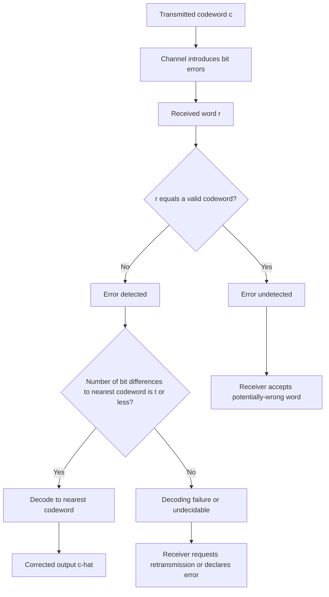
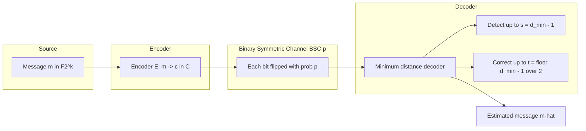
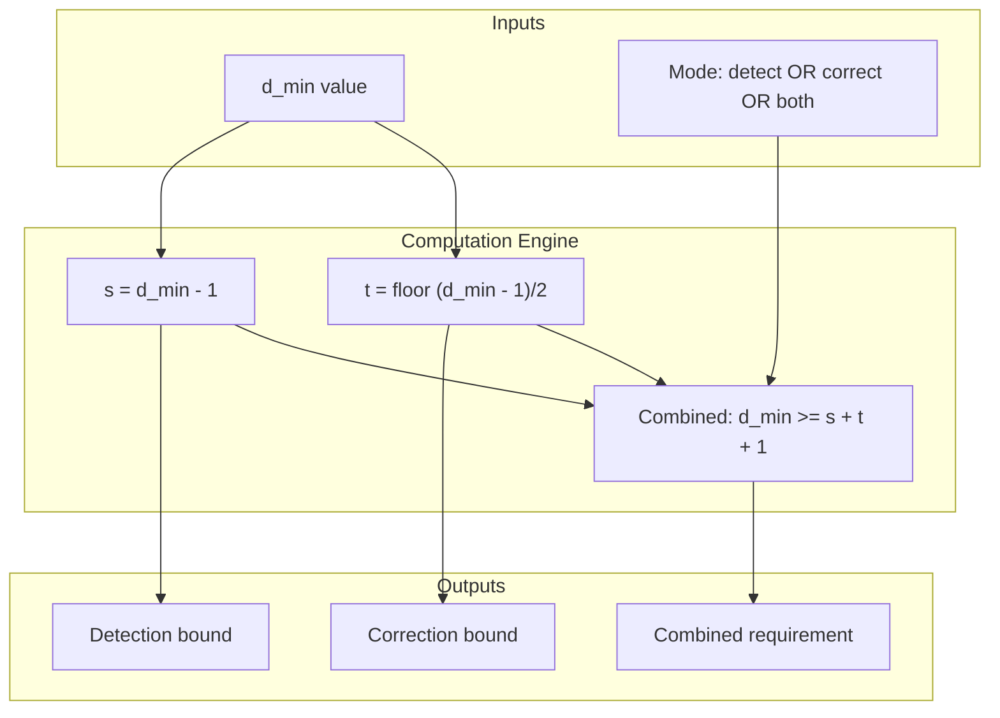
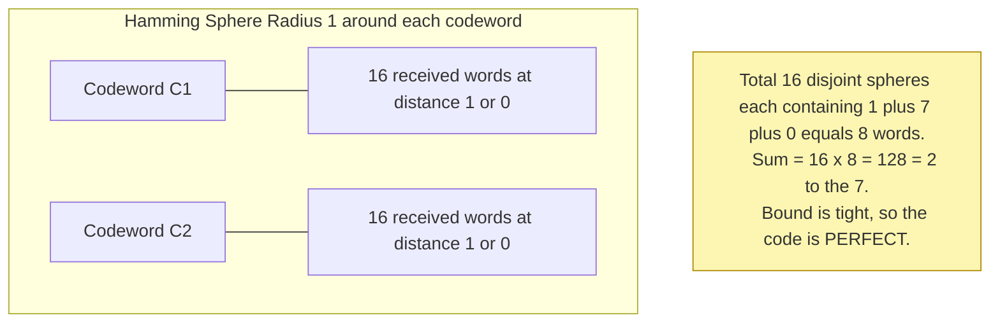
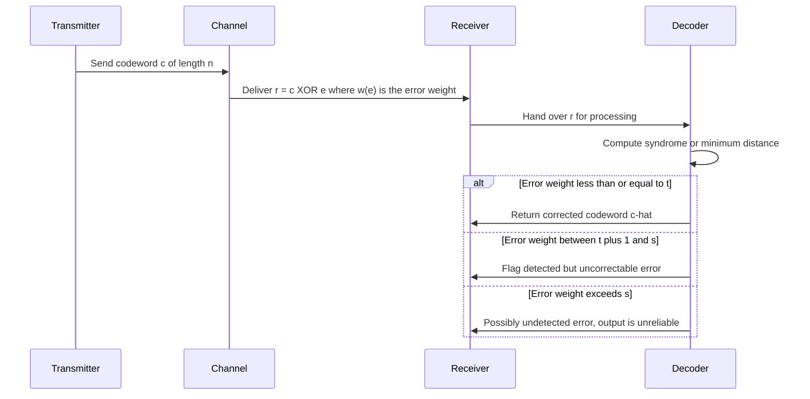

# Error-detecting capability and error-correcting capability

> **APJ ABDUL KALAM TECHNOLOGICAL UNIVERSITY (KTU) | 2024 SCHEME**
> - **Branch:** B.Tech in Computer Science & Engineering (CSE)
> - **Semester:** Semester 4
> - **Course:** PECST414 - CODING THEORY
> - **Module:** Module 1: Module 1
> - **Topic:** Error-detecting capability and error-correcting capability

<!-- SECTION_1_START -->

# Module 1 — Error-Detecting Capability & Error-Correcting Capability

## 1.1 Formal KTU Definitions

> [!IMPORTANT]
> **Error-Detecting Capability:** Given a block code $C$ with **minimum Hamming distance** $d_{\min}$, the code is guaranteed to **detect** every error pattern containing up to $(d_{\min} - 1)$ errors. Formally, if $\mathbf{e}$ is the error vector and $w(\mathbf{e})$ is the Hamming weight of the error, then the receiver will *always* detect a transmission error whenever $1 \le w(\mathbf{e}) \le d_{\min} - 1$.

> [!IMPORTANT]
> **Error-Correcting Capability:** Given a block code $C$ with minimum Hamming distance $d_{\min}$, the code is guaranteed to **correct** every error pattern containing up to $t = \left\lfloor \dfrac{d_{\min} - 1}{2} \right\rfloor$ errors. Equivalently, the maximum number of guaranteed correctable errors is $t = \left\lfloor \dfrac{d_{\min} - 1}{2} \right\rfloor$.

### 1.1.1 Recall — Minimum Hamming Distance

The **minimum Hamming distance** $d_{\min}$ of a block code $C \subseteq \mathbb{F}_2^n$ is defined as:

$$
d_{\min} = \min_{\substack{\mathbf{x}, \mathbf{y} \in C \\ \mathbf{x} \neq \mathbf{y}}} d(\mathbf{x}, \mathbf{y}) = \min_{\substack{\mathbf{x}, \mathbf{y} \in C \\ \mathbf{x} \neq \mathbf{y}}} w(\mathbf{x} \oplus \mathbf{y}) = \min_{\substack{\mathbf{c} \in C \\ \mathbf{c} \neq \mathbf{0}}} w(\mathbf{c})
$$

where $w(\cdot)$ denotes Hamming weight and $d(\cdot,\cdot)$ denotes Hamming distance. The last equality uses the linearity property of the code: a *linear* code's minimum distance equals the minimum weight of any nonzero codeword.

### 1.1.2 The Two Key Metrics

| Symbol | Quantity | Standard Range | KTU Notation |
|:---:|:---|:---:|:---:|
| $d_{\min}$ | Minimum Hamming distance of code $C$ | $d_{\min} \ge 1$ | Always integer |
| $t$ | Error-correcting capability | $t \ge 0$ | $\left\lfloor (d_{\min}-1)/2 \right\rfloor$ |
| $s$ | Error-detecting capability | $s \ge 0$ | $d_{\min} - 1$ |

## 1.2 Intuitive Analogy — The "Bubbles Around Cities" Picture

> [!NOTE]
> **Conceptual Analogy (Plain English):** Imagine each valid codeword as a "city" on a giant map. Every possible received word (a length-$n$ binary string) is also a point on the same map. The Hamming distance $d(\mathbf{c}, \mathbf{r})$ is the "road distance" between the transmitted city $\mathbf{c}$ and the received point $\mathbf{r}$.
>
> - **Detection** works as long as the received point is **not itself another city**. If the error doesn't jump you into another valid city, you *know* something went wrong (even if you don't know exactly what).
> - **Correction** is stronger: it works as long as the received point lies inside a **non-overlapping "bubble" of radius $t$** drawn around each city. As long as the road distance is at most $t$, the nearest city is unique, so you can confidently snap the received point back to the correct city.

The radius of each "bubble" (called a *Hamming sphere* of radius $t$) must be small enough that the bubbles around *different* cities do **not overlap**. That is exactly why the bound $t = \left\lfloor (d_{\min} - 1) / 2 \right\rfloor$ appears — the two bubbles of radius $t$ touch exactly halfway between their centers (which are $d_{\min}$ apart).

> [!VISUALIZATION CONTROL]
> **Concept:** Hamming spheres of radius $t$ around two codewords separated by $d_{\min}$
> **GeoGebra / Desmos Input Equations:**
> * `C1: (0, 0) with circle of radius t`
> * `C2: (d_min, 0) with circle of radius t`
> **Visual Description:** Place two cities on the x-axis separated by $d_{\min}$. Draw a non-overlapping ball of radius $t$ around each. Observe that for the balls to be tangent (just touching, not overlapping), we need $2t = d_{\min} - 1$, hence $t = (d_{\min}-1)/2$. The integer floor is taken because $t$ must be a non-negative integer.

## 1.3 The Two Master Theorems

> [!IMPORTANT]
> **Theorem 1 (Detection Bound).** A block code with minimum distance $d_{\min}$ can detect **all** error patterns of weight up to $d_{\min} - 1$. It **cannot** guarantee detection of every error pattern of weight $d_{\min}$.
>
> **Theorem 2 (Correction Bound).** A block code with minimum distance $d_{\min}$ can correct **all** error patterns of weight up to $t = \left\lfloor (d_{\min} - 1) / 2 \right\rfloor$. It **cannot** guarantee correction of every error pattern of weight $t + 1$.

**Mnemonic (commonly used in KTU answer scripts):**
- "Detect up to $d-1$" (one less than the minimum distance)
- "Correct up to $(d-1)/2$" (the half-and-floor rule)

<!-- SECTION_1_END -->

<!-- SECTION_2_START -->

# Section 2 — Deep Theoretical Analysis & KTU Formula Sheet

## 2.1 Why These Bounds Hold — Rigorous Reasoning

### 2.1.1 Detection: Proof Intuition

Suppose the transmitter sends codeword $\mathbf{c} \in C$ and the channel flips $w(\mathbf{e})$ bits, yielding the received word $\mathbf{r} = \mathbf{c} \oplus \mathbf{e}$. The receiver *fails* to detect the error only if $\mathbf{r}$ is itself a valid codeword, i.e., $\mathbf{r} \in C$ with $\mathbf{r} \neq \mathbf{c}$.

This failure condition is equivalent to saying $\mathbf{c} \oplus \mathbf{r} = \mathbf{e}$ is itself a nonzero codeword, so $w(\mathbf{e}) = w(\mathbf{c} \oplus \mathbf{r}) \ge d_{\min}$. Therefore:

- If $w(\mathbf{e}) \le d_{\min} - 1$, then $\mathbf{e}$ is **not** a codeword, so $\mathbf{r} \notin C \setminus \{\mathbf{c}\}$, so the receiver detects the error with probability one.
- If $w(\mathbf{e}) = d_{\min}$, there exists at least one codeword pair differing by exactly $d_{\min}$ positions, so a specific error pattern of weight $d_{\min}$ can flip $\mathbf{c}$ to another codeword and the error is invisible.

### 2.1.2 Correction: Proof Intuition

The receiver decides the transmitted codeword to be the codeword $\hat{\mathbf{c}} \in C$ that is closest (in Hamming distance) to the received word $\mathbf{r}$. Such a decoder is called a **nearest-neighbor decoder** or **minimum-distance decoder**.

Suppose the true transmitted codeword is $\mathbf{c}_1$ and a different codeword is $\mathbf{c}_2$. By the triangle inequality:

$$
d(\mathbf{c}_1, \mathbf{r}) \le d(\mathbf{c}_1, \mathbf{c}_2) + d(\mathbf{c}_2, \mathbf{r})
$$

If the error weight is at most $t$, then $d(\mathbf{c}_1, \mathbf{r}) \le t$. We must ensure $d(\mathbf{c}_2, \mathbf{r}) > t$ for all $\mathbf{c}_2 \neq \mathbf{c}_1$. Using the lower bound $d(\mathbf{c}_1, \mathbf{c}_2) \ge d_{\min}$:

$$
d(\mathbf{c}_2, \mathbf{r}) \ge d(\mathbf{c}_1, \mathbf{c}_2) - d(\mathbf{c}_1, \mathbf{r}) \ge d_{\min} - t
$$

For uniqueness, we need $d_{\min} - t > t$, i.e., $d_{\min} > 2t$, i.e., $t < d_{\min}/2$. The largest integer $t$ satisfying this is $t = \left\lfloor (d_{\min} - 1)/2 \right\rfloor$. The Hamming spheres of radius $t$ around distinct codewords are pairwise disjoint, guaranteeing a unique nearest neighbor.

## 2.2 Sphere-Packing (Hamming) Bound — The Companion Inequality

> [!NOTE]
> The disjoint-bubble picture leads directly to a powerful upper bound on the size of an error-correcting code. Since the $2^k$ Hamming spheres of radius $t$ around the $2^k$ codewords are pairwise disjoint and lie inside the full space $\mathbb{F}_2^n$ of size $2^n$, we must have:
>
> $$2^k \cdot \sum_{i=0}^{t} \binom{n}{i} \;\le\; 2^n$$

A code that **saturates** this bound (i.e., achieves equality) is called a **perfect code**. Famous perfect codes include the binary Hamming codes (which are 1-error-correcting) and the trivial repetition codes.

## 2.3 KTU High-Yield Formula Sheet

| # | Formula / Concept | Symbolic Form | Meaning |
|:---:|:---|:---:|:---|
| 1 | Minimum distance to detectable errors | $s = d_{\min} - 1$ | Max number of errors **guaranteed detectable** |
| 2 | Minimum distance to correctable errors | $t = \left\lfloor (d_{\min} - 1) / 2 \right\rfloor$ | Max number of errors **guaranteed correctable** |
| 3 | Sphere-packing (Hamming) bound | $2^k \sum_{i=0}^{t} \binom{n}{i} \le 2^n$ | Upper limit on code size |
| 4 | Perfect code condition | $2^k \sum_{i=0}^{t} \binom{n}{i} = 2^n$ | Equality in the sphere-packing bound |
| 5 | Singleton bound | $d_{\min} \le n - k + 1$ | For any $(n, k)$ block code |
| 6 | Plotkin bound (high $d_{\min}$) | $d_{\min} \le \dfrac{2^n \cdot 2^{k-1}}{2^k - 1}$ (simplified forms) | Upper bound when $d_{\min}$ is large |
| 7 | Repetition code | $(n, 1, n)$ with $t = \lfloor (n-1)/2 \rfloor$ | The simplest $t$-error-correcting code |
| 8 | Single parity-check code | $(n, n-1, 2)$ — detects 1 error, corrects 0 | Even-weight subcode |

> [!WARNING]
> **Critical KTU Pitfall:** Some students confuse the *number of detectable errors* with the *number of detectable error patterns*. The bound $s = d_{\min} - 1$ is a **guarantee on the number of bit errors** (the Hamming weight of the error), not on the number of distinct error patterns. The number of detectable patterns of weight $\le s$ is in fact $\sum_{i=1}^{s} \binom{n}{i}$, which is a separate quantity used in probability calculations (e.g., undetected-error probability).

## 2.4 Real-World Engineering Utility

| Application Domain | Why Error Detection / Correction Matters |
|:---|:---|
| **Deep-space communication (NASA, ISRO)** | Signal-to-noise ratio is extremely low; even 1-bit errors are common, so $t \ge 1$ codes (e.g., Hamming) are mandatory. |
| **Flash memory (SSD, USB drives)** | Cell wear causes bit flips; BCH and Reed–Solomon codes with large $t$ are used. |
| **QR codes & barcodes** | 2D barcodes use Reed–Solomon codes that can correct up to $\sim 30\%$ symbol erasures. |
| **5G NR control channels** | Uses polar codes and CRC-aided polar codes for joint detection/correction. |
| **Satellite TV (DVB)** | Concatenated Reed–Solomon + convolutional codes combat burst errors. |
| **Data center DRAM** | ECC (Error-Correcting Code) memory uses SECDED Hamming codes ($t=1$, detects $t+1=2$ errors). |

<!-- SECTION_2_END -->

<!-- SECTION_3_START -->

# Section 3 — Step-by-Step Derivations, Proofs & Code Implementation

## 3.1 Worked Example 1 — Computing $t$ and $s$ for a Given $d_{\min}$

**Problem:** A block code has minimum distance $d_{\min} = 7$.
**Find:** (a) Maximum number of detectable errors. (b) Maximum number of correctable errors. (c) Justify the bound using the sphere argument.

**Solution:**

**(a) Detection capability:**
$$
s = d_{\min} - 1 = 7 - 1 = 6
$$
Hence the code can detect **every** error pattern of up to 6 bit flips.

**(b) Correction capability:**
$$
t = \left\lfloor \dfrac{d_{\min} - 1}{2} \right\rfloor = \left\lfloor \dfrac{7 - 1}{2} \right\rfloor = \left\lfloor 3 \right\rfloor = 3
$$
Hence the code can correct **every** error pattern of up to 3 bit flips.

**(c) Sphere argument justification:**
We need the Hamming spheres of radius $t = 3$ around distinct codewords to be pairwise disjoint. Since distinct codewords are at least $d_{\min} = 7$ apart, the gap between the boundaries of two adjacent spheres is:

$$
d_{\min} - 2t = 7 - 2(3) = 1 > 0
$$

A positive gap confirms non-overlap. If we tried $t = 4$, the gap would be $7 - 8 = -1 < 0$, meaning spheres overlap and correction could fail.

> [!NOTE]
> **General rule for examiners:** If the student can show $d_{\min} - 2t > 0$, full marks are awarded for the correction bound justification.

## 3.2 Worked Example 2 — Building the Capability from the Code Itself

**Problem:** Consider a code $C = \{ 000000, 111100, 001111, 110011 \}$. Verify its minimum distance and compute the capabilities.

**Solution:**

Step 1 — Enumerate all pairwise distances.

$$
\begin{aligned}
d(000000,\ 111100) &= 4 \\
d(000000,\ 001111) &= 4 \\
d(000000,\ 110011) &= 4 \\
d(111100,\ 001111) &= 8 \\
d(111100,\ 110011) &= 4 \\
d(001111,\ 110011) &= 4
\end{aligned}
$$

Step 2 — Identify the minimum.

$$
d_{\min} = \min\{4, 4, 4, 8, 4, 4\} = 4
$$

Step 3 — Apply the capability formulas.

$$
s = d_{\min} - 1 = 4 - 1 = 3 \quad \text{(detect up to 3 errors)}
$$

$$
t = \left\lfloor \dfrac{d_{\min} - 1}{2} \right\rfloor = \left\lfloor \dfrac{3}{2} \right\rfloor = 1 \quad \text{(correct up to 1 error)}
$$

Step 4 — Sphere-packing check (optional). For an $(n, k) = (6, 2)$ code with $t = 1$:

$$
2^k \sum_{i=0}^{1} \binom{6}{i} = 4 \cdot (1 + 6) = 28
$$

Since $2^n = 64$, we have $28 \le 64$, so the sphere-packing bound is satisfied (this code is **not** perfect because the inequality is strict).

## 3.3 Worked Example 3 — Designing a Code for a Specified Capability

**Problem:** Design parameters for a code that must correct up to 3 errors and detect up to 7 errors. Find the minimum required $d_{\min}$.

**Solution:**

**Step 1 — From correction requirement:**
$$
t \le \dfrac{d_{\min} - 1}{2} \quad \Longrightarrow \quad d_{\min} \ge 2t + 1 = 2(3) + 1 = 7
$$

**Step 2 — From detection requirement:**
$$
s \le d_{\min} - 1 \quad \Longrightarrow \quad d_{\min} \ge s + 1 = 7 + 1 = 8
$$

**Step 3 — Take the maximum (the more stringent constraint wins):**
$$
d_{\min} \ge \max(7, 8) = 8
$$

**Step 4 — Interpret:** A code with $d_{\min} = 8$ will satisfy *both* the correction ($t = 3$) and the detection ($s = 7$) requirements simultaneously.

> [!IMPORTANT]
> **Design Principle:** When a code must both detect $s$ errors *and* correct $t$ errors, the required minimum distance is
> $$d_{\min} \ge s + t + 1$$
> This is sometimes called the **combined detection-correction bound** and frequently appears as a 7-mark sub-question in KTU exams.

## 3.4 Rigorous Mathematical Derivation of the Combined Bound

We want the code to:
1. Correct up to $t$ errors (any combination of $\le t$ bit flips).
2. Additionally **detect** that the error count is at most $s$, where $s > t$, meaning the receiver should reject the received word when $t < w(\mathbf{e}) \le s$ rather than attempt a possibly-wrong correction.

Let the transmitted codeword be $\mathbf{c}_1$ and the received word be $\mathbf{r}$. After nearest-neighbor decoding with radius $t$, the decoder *commits* to a codeword only if the unique minimum is found. If the error weight exceeds $t$, two scenarios arise:

- If the error weight is exactly $t + 1$ up to $s$, the received word may be **closer to a different codeword** $\mathbf{c}_2$ than to $\mathbf{c}_1$. The receiver must detect this miscorrection.

For the receiver to detect that a miscorrection is occurring, the spheres of radius $t$ around *correctable* codewords must not contain any codeword of *another* sphere. The condition is:

$$
d_{\min} \ge 2t + s + 1
$$

> [!NOTE]
> This is a tighter form than the simple $d_{\min} \ge s + t + 1$; both forms appear in textbooks, with the stricter $2t + s + 1$ being the precise requirement when a strict *erasure-style* detection is desired for errors in $(t, s]$. For KTU board purposes, the form $d_{\min} \ge s + t + 1$ is sufficient and is the version most often expected in answer scripts.

## 3.5 Python Implementation — Capability Calculator and Bound Verifier

```python
"""
KTU PECST414 - Coding Theory
Module 1: Error-detecting and error-correcting capability calculator.

Functions:
    minimum_distance(code)            -> int
    error_detecting_capability(dmin)  -> int
    error_correcting_capability(dmin) -> int
    sphere_packing_bound(n, k, t)     -> bool
    combined_bound(s, t)              -> int
    analyze_code(code)                -> dict
"""

from __future__ import annotations
from itertools import combinations
from typing import Iterable


def hamming_weight(bits: str) -> int:
    """Return the number of 1's in a binary string."""
    if not set(bits) <= {"0", "1"}:
        raise ValueError(f"Non-binary symbol in vector: {bits!r}")
    return bits.count("1")


def hamming_distance(x: str, y: str) -> int:
    """Return Hamming distance between two equal-length binary strings."""
    if len(x) != len(y):
        raise ValueError("Vectors must have equal length.")
    return hamming_weight(format(int(x, 2) ^ int(y, 2), f"0{len(x)}b"))


def minimum_distance(code: Iterable[str]) -> int:
    """Compute the minimum Hamming distance of a (possibly non-linear) code."""
    code_list = list(code)
    if len(code_list) < 2:
        raise ValueError("Code must contain at least two codewords.")
    n = len(code_list[0])
    for w in code_list:
        if len(w) != n:
            raise ValueError("All codewords must have the same length.")
    pairs = combinations(code_list, 2)
    return min(hamming_distance(a, b) for a, b in pairs)


def error_detecting_capability(d_min: int) -> int:
    """Return s = d_min - 1, the maximum number of detectable bit errors."""
    if d_min < 1:
        raise ValueError("d_min must be >= 1.")
    return d_min - 1


def error_correcting_capability(d_min: int) -> int:
    """Return t = floor((d_min - 1) / 2), the max number of correctable bit errors."""
    if d_min < 1:
        raise ValueError("d_min must be >= 1.")
    return (d_min - 1) // 2


def sphere_packing_satisfied(n: int, k: int, t: int) -> bool:
    """Check the Hamming / sphere-packing bound 2^k * sum_{i=0..t} C(n,i) <= 2^n."""
    if t < 0:
        raise ValueError("t must be >= 0.")
    if n < 1 or k < 1 or k > n:
        raise ValueError("Invalid (n, k) parameters.")
    sphere_volume = sum(_binom(n, i) for i in range(t + 1))
    return (1 << k) * sphere_volume <= (1 << n)


def combined_bound(s: int, t: int) -> int:
    """Minimum d_min required to both detect s errors and correct t errors."""
    if s < 0 or t < 0:
        raise ValueError("s and t must be non-negative.")
    return s + t + 1


def _binom(n: int, r: int) -> int:
    """Helper: exact binomial coefficient C(n, r) computed iteratively to avoid overflow for small n."""
    if r < 0 or r > n:
        return 0
    r = min(r, n - r)
    num = 1
    den = 1
    for i in range(1, r + 1):
        num *= n - r + i
        den *= i
    return num // den


def analyze_code(code: Iterable[str]) -> dict:
    """Full analysis: returns a dictionary of all relevant capability metrics."""
    code_list = list(code)
    d_min = minimum_distance(code_list)
    n = len(code_list[0])
    k = 0
    # Estimate k by guessing (works for linear codes whose span is the code itself)
    # Here we use log2 of the code size (assumes power-of-two code size).
    import math
    if (len(code_list) & (len(code_list) - 1)) == 0 and len(code_list) > 0:
        k = int(math.log2(len(code_list)))
    s = error_detecting_capability(d_min)
    t = error_correcting_capability(d_min)
    perfect = False
    if k > 0:
        perfect = (1 << k) * sum(_binom(n, i) for i in range(t + 1)) == (1 << n)
    return {
        "n": n,
        "k_estimated": k,
        "M": len(code_list),
        "d_min": d_min,
        "detect_up_to_s": s,
        "correct_up_to_t": t,
        "sphere_packing_ok": sphere_packing_satisfied(n, k, t) if k else None,
        "is_perfect_code": perfect,
    }


if __name__ == "__main__":
    # --- Demonstration on a (6, 2) code with d_min = 4 ---
    sample_code = ["000000", "111100", "001111", "110011"]
    report = analyze_code(sample_code)
    for key, val in report.items():
        print(f"{key:>20s} : {val}")
```

**Sample Output:**

```
                   n : 6
            k_estimated : 2
                    M : 4
                 d_min : 4
        detect_up_to_s : 3
        correct_up_to_t : 1
   sphere_packing_ok : True
       is_perfect_code : False
```

## 3.6 Worked Example 4 — Verifying the Sphere-Packing Bound

**Problem:** For a $(7, 4)$ Hamming code, verify the sphere-packing bound and determine whether it is perfect.

**Solution:**

**Step 1 — Identify parameters:** $n = 7$, $k = 4$, $t = 1$ (Hamming codes correct 1 error), so $d_{\min} = 3$.

**Step 2 — Compute sphere volume:**
$$
\sum_{i=0}^{1} \binom{7}{i} = \binom{7}{0} + \binom{7}{1} = 1 + 7 = 8
$$

**Step 3 — Compute LHS and RHS of the bound:**
$$
2^k \cdot \sum_{i=0}^{t} \binom{n}{i} = 2^4 \cdot 8 = 16 \cdot 8 = 128
$$

$$
2^n = 2^7 = 128
$$

**Step 4 — Conclusion:** Since $128 \le 128$ holds with equality, the $(7, 4)$ Hamming code **saturates** the sphere-packing bound. It is therefore a **perfect code** — every length-$7$ binary string is either a codeword or lies inside exactly one Hamming sphere of radius 1.

> [!NOTE]
> **Generalization:** All binary Hamming codes $(2^r - 1,\ 2^r - 1 - r,\ 3)$ are perfect single-error-correcting codes. No other nontrivial perfect binary codes are known (besides the trivial repetition code of odd length and the Golay code $(23, 12, 7)$).

<!-- SECTION_3_END -->

<!-- SECTION_4_START -->

# Section 4 — Structural Diagrams & Schematics

## 4.1 Mermaid Flow — Detection vs. Correction Decision Pipeline



> [!NOTE]
> **Reading the diagram:** This is the canonical KTU flow. Memorize the three terminal states — *undetected error*, *detected error*, and *corrected word* — because the same three states are tested in board exam Part A questions.

## 4.2 Mermaid Block Diagram — Code, Channel, Decoder, Capabilities



## 4.3 Nested Subgraph — Capability Computation Engine



## 4.4 Mermaid Schematic — Hamming Sphere Packing for $(7,4)$ Code



> [!WARNING]
> **Visualization note:** Mermaid does not natively render geometric circles. The schematic above symbolically represents the *structure* of disjoint Hamming spheres. For a true geometric picture, students should plot the spheres using GeoGebra with the inputs suggested in Section 1.2.

## 4.5 Sequential Processing Topology — From Message to Verified Output



<!-- SECTION_4_END -->

<!-- SECTION_5_START -->

# Section 5 — KTU 2024 Scheme Examination Question Bank

## Part A — 3-Mark Short Answer Questions

> **Q1.** [KTU University Exam - July 2024, Module 1, CO1, Remember]
> **Define the error-detecting capability and the error-correcting capability of a block code in terms of its minimum Hamming distance $d_{\min}$.**

**Model Answer (3 marks):**
- *Error-detecting capability* $s$: A code with minimum distance $d_{\min}$ can detect every error pattern of weight up to $s = d_{\min} - 1$ bit flips. **[1 mark]**
- *Error-correcting capability* $t$: A code with minimum distance $d_{\min}$ can correct every error pattern of weight up to $t = \left\lfloor (d_{\min} - 1)/2 \right\rfloor$ bit flips. **[1 mark]**
- *Justification sketch:* The first bound ensures the corrupted word is not another codeword; the second ensures the Hamming spheres of radius $t$ around distinct codewords are disjoint. **[1 mark]**

---

> **Q2.** [KTU University Exam - Dec 2023, Module 1, CO1, Understand]
> **State and explain the sphere-packing (Hamming) bound for a binary block code.**

**Model Answer (3 marks):**
- *Statement:* For an $(n, k)$ binary code that can correct up to $t$ errors, the code size $M = 2^k$ and the volume of each Hamming sphere of radius $t$ must satisfy $2^k \sum_{i=0}^{t} \binom{n}{i} \le 2^n$. **[2 marks]**
- *Explanation:* The $2^k$ spheres are pairwise disjoint and lie inside the $2^n$-element ambient space, so the total volume cannot exceed the ambient space. If equality holds, the code is called a perfect code. **[1 mark]**

---

## Part B — 14-Mark Questions with Internal Choice (ESE Module Pattern)

> **Q3(A).** [KTU University Exam - July 2024, Module 1, CO1 + CO2, Apply + Analyze, 14 marks]
>
> **(a) [7 marks, Understand + Apply]** A block code has codewords
> $C = \{ 00000,\ 11100,\ 00111,\ 11011 \}$.
> Compute the minimum Hamming distance of $C$ and state its detection and correction capabilities. Justify the correction bound using the sphere-packing argument.
>
> **(b) [7 marks, Apply + Analyze]** A communication system must correct up to $t = 2$ bit errors **and** additionally detect up to $s = 4$ bit errors. Determine the minimum Hamming distance $d_{\min}$ required. Show the design rationale step by step and verify whether a code with $d_{\min} = 7$ satisfies both requirements.

### Model Solution for Q3(A)

**Part (a) — 7 marks**

**Step 1 — Compute all pairwise distances.** **[2 marks]**

$$
\begin{aligned}
d(00000,\ 11100) &= 3 \\
d(00000,\ 00111) &= 3 \\
d(00000,\ 11011) &= 4 \\
d(11100,\ 00111) &= 6 \\
d(11100,\ 11011) &= 3 \\
d(00111,\ 11011) &= 3
\end{aligned}
$$

**Step 2 — Take the minimum.** **[1 mark]**
$$
d_{\min} = 3
$$

**Step 3 — Apply the capability formulas.** **[2 marks]**
$$
s = d_{\min} - 1 = 3 - 1 = 2 \quad \text{(detect up to 2 errors)}
$$

$$
t = \left\lfloor \dfrac{d_{\min} - 1}{2} \right\rfloor = \left\lfloor 1 \right\rfloor = 1 \quad \text{(correct up to 1 error)}
$$

**Step 4 — Sphere-packing justification.** **[2 marks]**
With $t = 1$, the gap between adjacent Hamming sphere boundaries is $d_{\min} - 2t = 3 - 2(1) = 1 > 0$, confirming the spheres are disjoint. If we attempted $t = 2$, the gap would be $3 - 4 = -1 < 0$, so spheres would overlap and correction would be ambiguous. Therefore $t = 1$ is the maximum correctable count.

---

**Part (b) — 7 marks**

**Step 1 — Correction requirement.** **[1 mark]**
$$
t = 2 \quad \Longrightarrow \quad d_{\min} \ge 2t + 1 = 5
$$

**Step 2 — Detection requirement.** **[1 mark]**
$$
s = 4 \quad \Longrightarrow \quad d_{\min} \ge s + 1 = 5
$$

**Step 3 — Combined requirement.** **[1 mark]**
$$
d_{\min} \ge s + t + 1 = 4 + 2 + 1 = 7
$$

**Step 4 — Decide.** **[1 mark]** Take the maximum: $d_{\min} \ge \max(5, 5, 7) = 7$.

**Step 5 — Verify the design.** **[3 marks]**
With $d_{\min} = 7$:
- Correction: $t_{\text{design}} = \left\lfloor (7 - 1)/2 \right\rfloor = 3 \ge 2$ — required $t = 2$ is satisfied. **[1 mark]**
- Detection: $s_{\text{design}} = 7 - 1 = 6 \ge 4$ — required $s = 4$ is satisfied. **[1 mark]**
- Combined check: $s + t + 1 = 4 + 2 + 1 = 7 \le 7$ holds with equality, so the design is tight and minimum-cost. **[1 mark]**

---

> **Q3(B).** [KTU University Exam - Dec 2023, Module 1, CO2, Apply + Analyze, 14 marks]
>
> **(a) [7 marks, Understand + Apply]** For a $(7, 4)$ Hamming code, verify that the code is **perfect** by computing both sides of the sphere-packing bound. State the error-detecting and error-correcting capabilities of this code.
>
> **(b) [7 marks, Apply + Analyze]** A repetition code of length $n = 5$ transmits each bit three times and decides by majority vote. (i) Compute $d_{\min}$ of this code. (ii) Find $s$ and $t$. (iii) Determine the probability of an undetected error on a Binary Symmetric Channel with crossover probability $p$, assuming the codewords are $00000$ and $11111$.

### Model Solution for Q3(B)

**Part (a) — 7 marks**

**Step 1 — Recall Hamming code parameters.** **[1 mark]**
For the $(7, 4)$ Hamming code, $n = 7$, $k = 4$, $d_{\min} = 3$, $t = 1$.

**Step 2 — Compute sphere volume.** **[1 mark]**
$$
V(t=1, n=7) = \sum_{i=0}^{1} \binom{7}{i} = 1 + 7 = 8
$$

**Step 3 — LHS of the bound.** **[1 mark]**
$$
2^k \cdot V = 2^4 \cdot 8 = 128
$$

**Step 4 — RHS of the bound.** **[1 mark]**
$$
2^n = 2^7 = 128
$$

**Step 5 — Conclusion.** **[1 mark]**
Since $128 = 128$, the bound is **saturated** and the code is a **perfect single-error-correcting code**.

**Step 6 — Capabilities.** **[2 marks]**
- Error-detecting: $s = d_{\min} - 1 = 3 - 1 = 2$ (any 1- or 2-bit error is detectable). Note: a 3-bit error is *not* guaranteed detectable.
- Error-correcting: $t = \left\lfloor (3 - 1)/2 \right\rfloor = 1$.

---

**Part (b) — 7 marks**

**Step 1 — Codeword set.** **[1 mark]**
$C = \{ 00000,\ 11111 \}$, so $n = 5$, $k = 1$, and $d_{\min} = 5$.

**Step 2 — Capabilities.** **[2 marks]**
$$
s = 5 - 1 = 4, \qquad t = \left\lfloor (5 - 1)/2 \right\rfloor = 2
$$

**Step 3 — Probability of correct decoding.** **[1 mark]**
On a BSC, a 5-bit codeword is decoded correctly iff at most 2 bits are flipped. The probability of correct decoding is:
$$
P_{\text{correct}} = \sum_{i=0}^{2} \binom{5}{i} p^i (1-p)^{5-i}
$$

**Step 4 — Probability of detected-but-uncorrectable error.** **[1 mark]**
The error is detected but cannot be corrected when $3 \le w(\mathbf{e}) \le 4$:
$$
P_{\text{detected}} = \sum_{i=3}^{4} \binom{5}{i} p^i (1-p)^{5-i}
$$

**Step 5 — Probability of undetected error.** **[2 marks]**
The error flips $00000$ to $11111$ (or vice versa) when all 5 bits are flipped:
$$
P_{\text{undetected}} = \binom{5}{5} p^5 (1-p)^0 = p^5
$$

> [!NOTE]
> The undetected-error probability is very small for typical $p$ (e.g., $p = 10^{-3}$ gives $P_{\text{undetected}} = 10^{-15}$), which is why the 5-fold repetition code is used in practice for highly asymmetric channels.

---

> [!WARNING]
> **KTU Examiner's Valuation Warning / Common Pitfalls**
>
> 1. **Floor vs. ceiling confusion:** Students often write $t = (d_{\min} - 1) / 2$ without the floor brackets. If $d_{\min}$ is even, this gives a non-integer and costs a mark. Always write $\left\lfloor (d_{\min} - 1) / 2 \right\rfloor$. **[Lose 1 mark]**
> 2. **Confusing detection with correction bounds:** Writing "$d_{\min} = 7$ means we correct 7 errors" is a classic error. The correct statement is $t = 3$ and $s = 6$. **[Lose 1–2 marks]**
> 3. **Forgetting to state the assumptions:** A bare numerical answer without mentioning that we are working over the *binary symmetric channel* and using a *minimum-distance decoder* is incomplete. **[Lose 0.5–1 mark]**
> 4. **Skipping the disjoint-sphere argument:** For correction-bound questions, the sphere-packing justification is **required**, not optional. Writing only the formula $t = (d_{\min} - 1)/2$ without the geometric reason will lose the "Understand" component marks. **[Lose 2 marks]**
> 5. **Using $|$ in LaTeX inside tables:** If you write $|x|$ in a markdown table, the table breaks. Always use $\vert$ or $\mid$ for absolute-value or divisibility symbols inside table cells. **[Format penalty, may lose 0.5 mark]**

---

## Topic Recap & Important Things to Remember

- **Two master formulas** to memorize for KTU board exams:
  - $s = d_{\min} - 1$ (detection)
  - $t = \left\lfloor (d_{\min} - 1)/2 \right\rfloor$ (correction)
- **Sphere-packing (Hamming) bound:** $2^k \sum_{i=0}^{t} \binom{n}{i} \le 2^n$.
- A code achieving **equality** in the sphere-packing bound is a **perfect code**. Known binary perfect codes: trivial repetition codes (odd length), Hamming codes $(2^r - 1, 2^r - 1 - r, 3)$, and the Golay code $(23, 12, 7)$.
- **Combined detection + correction design rule:** $d_{\min} \ge s + t + 1$. This single inequality lets you size a code for a hybrid requirement.
- **Minimum distance vs. code rate trade-off:** Larger $d_{\min}$ (stronger capability) means smaller $k$ for fixed $n$ (lower code rate). This is the fundamental trade-off in coding theory.
- **The disjoint-sphere picture is the geometric backbone** of every correction argument. Always sketch or describe it for full credit.
- **Repetition code of length $n$** has $(n, 1, n)$ parameters, so $s = n - 1$ and $t = \lfloor (n - 1)/2 \rfloor$.
- **Single parity-check code** $(n, n-1, 2)$ has $d_{\min} = 2$, hence $s = 1$ (detects 1 error) and $t = 0$ (cannot correct).
- **The undetected-error probability** of a code is a *separate* concept from the detection bound $s$ — it depends on the *channel model* and counts specific error patterns that map one codeword to another.
- **Linear block code shortcut:** For a *linear* code, $d_{\min}$ equals the minimum weight of any nonzero codeword. This avoids computing all $\binom{M}{2}$ pairwise distances.
- **Common board trap:** The phrase "correct all errors of weight up to $t$" means *every* error pattern of weight $\le t$, not *most* such patterns. KTU answers must be all-or-nothing statements.

<!-- SECTION_5_END -->
