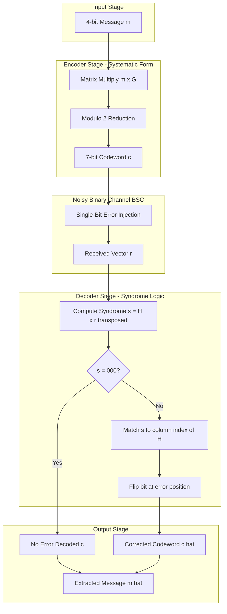
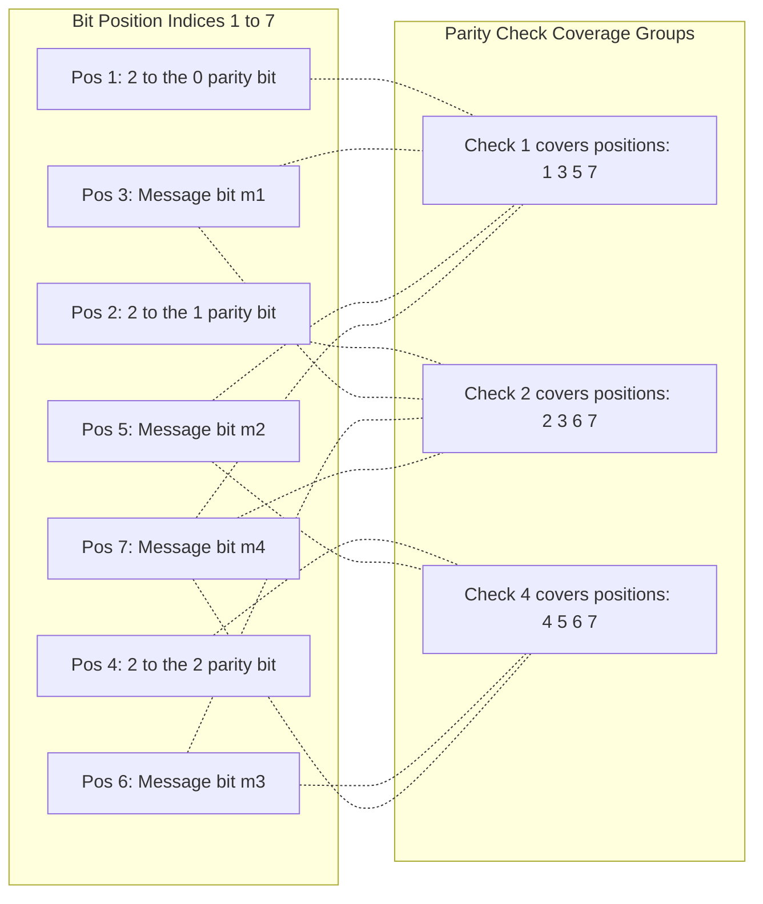
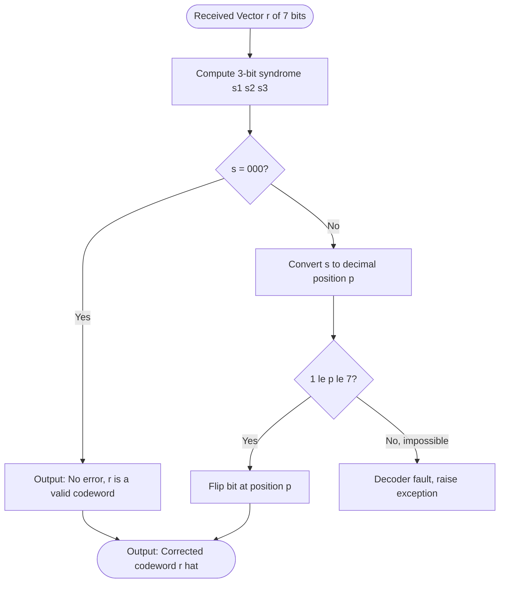
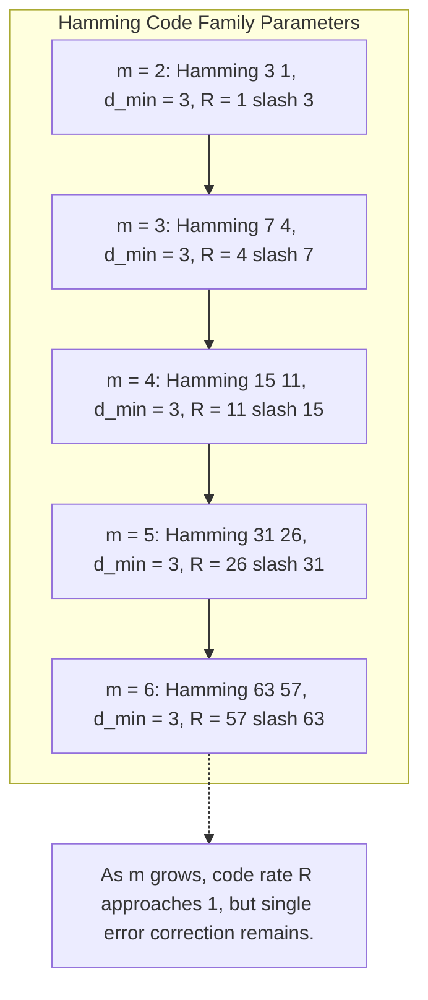

# Hamming codes

> **APJ ABDUL KALAM TECHNOLOGICAL UNIVERSITY (KTU) | 2024 SCHEME**
> - **Branch:** B.Tech in Computer Science & Engineering (CSE)
> - **Semester:** Semester 4
> - **Course:** PECST414 - CODING THEORY
> - **Module:** Module 1: Module 1
> - **Topic:** Hamming codes

<!-- SECTION_1_START -->
## 1. Core Technical Definition & Intuitive Overview

### 1.1 Formal Academic Definition

A **Hamming code** is a linear block code, discovered by Richard W. Hamming in 1950, that is a member of a family of single-error-correcting (SEC) codes. For every integer $m \geq 2$, there exists a Hamming code with the following parameters:

$$n = 2^{m} - 1, \quad k = 2^{m} - 1 - m, \quad r = n - k = m$$

The resulting code is denoted as an $\text{Hamming}(n, k)$ or $\text{Hamming}(2^{m}-1,\, 2^{m}-1-m)$ code. Every Hamming code satisfies:
- **Minimum Hamming distance** $d_{min} = 3$
- **Error-correcting capability** $t = \lfloor (d_{min} - 1)/2 \rfloor = 1$
- **Error-detecting capability** $t_{d} = d_{min} - 1 = 2$

> [!IMPORTANT]
> **Perfect Code Property:** The Hamming codes are classified as **perfect 1-error-correcting codes**. This means they achieve the theoretical **Hamming Bound (Sphere-Packing Bound) with equality**, leaving no "wasted" syndrome space for $t = 1$ error correction in the corresponding code space. Every non-zero syndrome uniquely points to one of the $n$ possible single-bit error locations.

The most widely used member of this family is the **Hamming(7, 4) code**, with $m = 3$.

### 1.2 Intuitive Analogy — "Detective at Roundabout Intersections"

Imagine you are sending 4 secret numbers to a friend through a noisy phone line. You suspect the line might flip **one** of the digits during transmission. To protect the message, you tack on **3 extra "parity check" digits** at carefully chosen *power-of-2 positions* (positions 1, 2, and 4). Each of these 3 extra digits is the parity (XOR) over a specific subset of the original 4 digits.

When your friend receives the 7-digit message, they recompute the 3 parity checks. If all 3 still match, the message is clean. If exactly one check fails, the **binary pattern of the failures (1=check failed, 0=passed)** directly gives the position of the flipped bit! For example, if "check-1" and "check-2" fail, but "check-4" passes → binary $011 = 3$ → the bit at position 3 was flipped. This is the magic of Hamming codes: **the error position *is* the syndrome**.

> [!NOTE]
> **Intuition Check:** Hamming codes transform the abstract problem of "where is the error?" into a simple lookup of a syndrome pattern. The parity check matrix $\mathbf{H}$ is built so that each column is the binary representation of its column index. Multiplying $\mathbf{H} \cdot \mathbf{r}^{T}$ yields exactly that column — pointing straight to the error.

### 1.3 Standard Metrics for Hamming(7, 4) Code

| Parameter | Symbol | Value |
|---|---|---|
| Block length | $n$ | **7 bits** |
| Message length | $k$ | **4 bits** |
| Parity bits | $r$ | **3 bits** |
| Code rate | $R = k/n$ | **4/7 ≈ 0.571** |
| Minimum distance | $d_{min}$ | **3** |
| Error correction | $t$ | **1 bit** |
| Error detection | $t_{d}$ | **2 bits** |
| Sphere-packing efficiency | — | **Perfect (100%)** |

> [!VISUALIZATION CONTROL]
> **Concept:** Geometric illustration of the 7-bit Hamming code as 7 vertices of a 3-cube ($GF(2)^{3}$) excluding the origin
> **GeoGebra / Desmos Input Equations (3D interpretation):**
> * Cube vertices: $(x, y, z) \in \{0,1\}^{3} \setminus \{(0,0,0)\}$ — points: $(1,0,0), (0,1,0), (0,0,1), (1,1,0), (1,0,1), (0,1,1), (1,1,1)$
> * Each vertex $\leftrightarrow$ a column of $\mathbf{H}$ matrix (excluding zero column)
> * Hamming spheres of radius $t=1$ around each codeword partition the 7-dimensional $\{0,1\}^{7}$ space without overlap
> **Visual Description:** Plot the 7 non-zero binary 3-tuples as points in 3D. The student should observe that these 7 points are equidistant from each other in Hamming distance — every pair differs in exactly 2 or 3 coordinates. This geometric uniformity is the foundation of the perfect-code property.
<!-- SECTION_1_END -->

<!-- SECTION_2_START -->
## 2. Deep Theoretical Analysis & KTU High-Yield Formula Sheet

### 2.1 Construction Logic of Hamming Codes

The construction follows a clean, deterministic recipe:

**Step 1 — Parity Check Matrix $\mathbf{H}$:**
The parity check matrix of a Hamming code is an $m \times (2^{m}-1)$ matrix whose columns are **all $2^{m}-1$ non-zero binary $m$-tuples**. Each column must be distinct and non-zero. For Hamming(7, 4) with $m = 3$:

$$\mathbf{H}_{(3 \times 7)} = \begin{bmatrix} 0 & 0 & 0 & 1 & 1 & 1 & 1 \\ 0 & 1 & 1 & 0 & 0 & 1 & 1 \\ 1 & 0 & 1 & 0 & 1 & 0 & 1 \end{bmatrix}$$

**Step 2 — Why this works for single-error correction:**
For a received vector $\mathbf{r} = \mathbf{c} \oplus \mathbf{e}$ (where $\mathbf{e}$ is a single-bit error vector with a single 1 at position $i$):
- The syndrome $\mathbf{s} = \mathbf{H}\mathbf{r}^{T} = \mathbf{H}\mathbf{e}^{T}$ = the $i$-th column of $\mathbf{H}$.
- Since all $2^{m}-1$ non-zero columns are distinct, the syndrome uniquely identifies the error position.

**Step 3 — Generator Matrix $\mathbf{G}$:**
The generator matrix is a $k \times n$ matrix satisfying $\mathbf{G}\mathbf{H}^{T} = \mathbf{0}$. A common construction uses the **systematic form**:
$$\mathbf{G} = \begin{bmatrix} \mathbf{I}_{k} \mid \mathbf{P} \end{bmatrix}, \quad \mathbf{H} = \begin{bmatrix} \mathbf{P}^{T} \mid \mathbf{I}_{r} \end{bmatrix}$$

For Hamming(7, 4):
$$\mathbf{G}_{(4 \times 7)} = \begin{bmatrix} 1 & 0 & 0 & 0 & 1 & 1 & 0 \\ 0 & 1 & 0 & 0 & 1 & 0 & 1 \\ 0 & 0 & 1 & 0 & 0 & 1 & 1 \\ 0 & 0 & 0 & 1 & 1 & 1 & 1 \end{bmatrix}$$

### 2.2 Why Hamming Codes are Perfect Codes

The **Hamming bound** (sphere-packing bound) for any $(n, k)$ binary code correcting up to $t$ errors is:

$$2^{k} \sum_{i=0}^{t} \binom{n}{i} \leq 2^{n}$$

For Hamming code with $n = 2^{m}-1$ and $t = 1$:
$$2^{k} \left[ \binom{0}{0} + \binom{2^{m}-1}{1} \right] = 2^{k} \left[ 1 + 2^{m} - 1 \right] = 2^{k} \cdot 2^{m} = 2^{k+m} = 2^{n}$$

The inequality is satisfied **with equality** → perfect code.

### 2.3 Encoding and Decoding Pipeline

**Encoding (systematic form):**
$$\mathbf{c} = \mathbf{m} \cdot \mathbf{G}$$
where $\mathbf{m}$ is the $k$-bit message, $\mathbf{c}$ is the $n$-bit codeword. The message bits occupy positions 1 through $k$; parity bits are at positions $k+1$ through $n$.

**Decoding (syndrome-based):**
1. Receive $\mathbf{r}$.
2. Compute syndrome $\mathbf{s} = \mathbf{H}\mathbf{r}^{T}$.
3. If $\mathbf{s} = \mathbf{0}$: no error (or undetectable error pattern).
4. Else: locate column $i$ of $\mathbf{H}$ matching $\mathbf{s}$, flip bit $i$.

### 2.4 Extended Hamming Code — SEC-DED Capability

By adding **one overall parity bit** to a Hamming$(2^{m}-1, 2^{m}-1-m)$ code, we get an **Extended Hamming Code** with parameters $(2^{m}, 2^{m}-1-m)$ and $d_{min} = 4$. The extended code can:
- **Correct any single-bit error (SEC)**
- **Detect any double-bit error (DED)**

This is the basis for **ECC memory (Error-Correcting Code memory)** in computers (e.g., ECC RAM, RAID storage, satellite communications).

### 2.5 KTU High-Yield Formula Sheet

| # | Formula / Property | Description |
|---|---|---|
| 1 | $n = 2^{m} - 1$ | Total codeword length |
| 2 | $k = 2^{m} - 1 - m$ | Number of message bits |
| 3 | $r = m$ | Number of parity bits |
| 4 | $d_{min} = 3$ | Minimum Hamming distance |
| 5 | $t = \lfloor (d_{min}-1)/2 \rfloor = 1$ | Error-correcting capability |
| 6 | $R = k/n = (2^{m}-1-m)/(2^{m}-1)$ | Code rate |
| 7 | $\mathbf{s} = \mathbf{H}\mathbf{r}^{T}$ | Syndrome of received vector $\mathbf{r}$ |
| 8 | $\mathbf{c} = \mathbf{m} \cdot \mathbf{G}$ | Encoding equation |
| 9 | $2^{k}\sum_{i=0}^{t}\binom{n}{i} = 2^{n}$ | Perfect code condition (Hamming) |
| 10 | $(2^{m}, 2^{m}-1-m)$ | Extended Hamming code (SEC-DED) |
| 11 | $d_{min}^{\text{extended}} = 4$ | Min distance after appending parity bit |
| 12 | $\mathbf{G}\mathbf{H}^{T} = \mathbf{0}_{k \times r}$ | Duality between $\mathbf{G}$ and $\mathbf{H}$ |

> [!TIP]
> **Real-World Engineering Utility:**
> - **ECC RAM** in servers and workstations uses extended Hamming codes (commonly Hamming(72,64)) to correct single-bit memory errors automatically.
> - **Satellite communication (e.g., Voyager spacecraft, deep-space probes)** historically used Hamming codes for command-link integrity.
> - **CDMA cellular networks** use Hamming-code derived orthogonal codes for forward error correction on control channels.
> - **RAID storage controllers** use Hamming-style parity for disk array error recovery.

<!-- SECTION_2_END -->

<!-- SECTION_3_START -->
## 3. Step-by-Step Derivations & Code Implementation

### 3.1 Derivation: Hamming(7, 4) Encoding Table

We construct all 16 possible codewords systematically. Message bits occupy positions $(c_1, c_2, c_3, c_4)$. Parity bits occupy positions $5, 6, 7$ and are computed using:
- $c_5 = c_1 \oplus c_2 \oplus c_4$ (checks positions 1, 2, 4)
- $c_6 = c_1 \oplus c_3 \oplus c_4$ (checks positions 1, 3, 4)
- $c_7 = c_2 \oplus c_3 \oplus c_4$ (checks positions 2, 3, 4)

| Message $\mathbf{m}$ | $c_1$ | $c_2$ | $c_3$ | $c_4$ | $c_5$ | $c_6$ | $c_7$ | Codeword $\mathbf{c}$ |
|:---:|:---:|:---:|:---:|:---:|:---:|:---:|:---:|:---:|
| 0000 | 0 | 0 | 0 | 0 | 0 | 0 | 0 | 0000000 |
| 0001 | 0 | 0 | 0 | 1 | 1 | 1 | 1 | 0001111 |
| 0010 | 0 | 0 | 1 | 0 | 0 | 1 | 1 | 0010011 |
| 0011 | 0 | 0 | 1 | 1 | 1 | 0 | 0 | 0011100 |
| 0100 | 0 | 1 | 0 | 0 | 1 | 0 | 1 | 0100101 |
| 0101 | 0 | 1 | 0 | 1 | 0 | 1 | 0 | 0101010 |
| 0110 | 0 | 1 | 1 | 0 | 1 | 1 | 0 | 0110110 |
| 0111 | 0 | 1 | 1 | 1 | 0 | 0 | 1 | 0111001 |
| 1000 | 1 | 0 | 0 | 0 | 1 | 1 | 0 | 1001001 |
| 1001 | 1 | 0 | 0 | 1 | 0 | 0 | 1 | 1000110 |
| 1010 | 1 | 0 | 1 | 0 | 1 | 0 | 1 | 1010101 |
| 1011 | 1 | 0 | 1 | 1 | 0 | 1 | 0 | 1011010 |
| 1100 | 1 | 1 | 0 | 0 | 0 | 1 | 1 | 1100011 |
| 1101 | 1 | 1 | 0 | 1 | 1 | 0 | 0 | 1101100 |
| 1110 | 1 | 1 | 1 | 0 | 0 | 0 | 0 | 1110000 |
| 1111 | 1 | 1 | 1 | 1 | 1 | 1 | 1 | 1111111 |

### 3.2 Worked Example: Decoding a Corrupted Codeword

**Problem:** Codeword $\mathbf{c} = 1010101$ is sent. During transmission, a single-bit error flips position 5. The received vector is $\mathbf{r} = 1010001$. Apply Hamming(7,4) syndrome decoding to recover the original message.

**Step 1 — Compute syndrome $\mathbf{s} = \mathbf{H}\mathbf{r}^{T}$:**

$$\mathbf{H} = \begin{bmatrix} 0 & 0 & 0 & 1 & 1 & 1 & 1 \\ 0 & 1 & 1 & 0 & 0 & 1 & 1 \\ 1 & 0 & 1 & 0 & 1 & 0 & 1 \end{bmatrix}, \quad \mathbf{r} = \begin{bmatrix} 1 & 0 & 1 & 0 & 0 & 0 & 1 \end{bmatrix}^{T}$$

Compute each row of the syndrome:

$$s_1 = 0\cdot 1 + 0\cdot 0 + 0\cdot 1 + 1\cdot 0 + 1\cdot 0 + 1\cdot 0 + 1\cdot 1 = 1$$

$$s_2 = 0\cdot 1 + 1\cdot 0 + 1\cdot 1 + 0\cdot 0 + 0\cdot 0 + 1\cdot 0 + 1\cdot 1 = 0$$

$$s_3 = 1\cdot 1 + 0\cdot 0 + 1\cdot 1 + 0\cdot 0 + 1\cdot 0 + 0\cdot 0 + 1\cdot 1 = 0$$

So $\mathbf{s} = (1, 0, 0)$.

**Step 2 — Identify error position:**
The syndrome $(1, 0, 0)$ matches **column 5** of $\mathbf{H}$ (which is the binary representation of decimal 5: $1\cdot 4 + 0\cdot 2 + 0\cdot 1$).

**Step 3 — Correct the error:**
Flip bit 5 of $\mathbf{r}$: $1010001 \rightarrow 1010101$. ✓ Recovered correctly.

**Step 4 — Extract message bits:**
The first 4 bits of the corrected codeword are $\mathbf{m} = (1, 0, 1, 0)$.

### 3.3 Python Implementation — Complete Encoder/Decoder

```python
"""
Hamming(7,4) Encoder and Syndrome Decoder
Author: KTU Coding Theory Lab Reference
Date: 2024 Scheme
"""
import numpy as np
from typing import Tuple, List

# Parity check matrix for Hamming(7,4): columns are all non-zero 3-bit binary vectors
H_MATRIX: np.ndarray = np.array([
    [0, 0, 0, 1, 1, 1, 1],   # row 1
    [0, 1, 1, 0, 0, 1, 1],   # row 2
    [1, 0, 1, 0, 1, 0, 1],   # row 3
], dtype=np.int8)

# Generator matrix for Hamming(7,4) in systematic form: G = [I_4 | P]
G_MATRIX: np.ndarray = np.array([
    [1, 0, 0, 0, 1, 1, 0],
    [0, 1, 0, 0, 1, 0, 1],
    [0, 0, 1, 0, 0, 1, 1],
    [0, 0, 0, 1, 1, 1, 1],
], dtype=np.int8)


def encode_hamming_7_4(message: List[int]) -> np.ndarray:
    """
    Encode a 4-bit message into a 7-bit Hamming(7,4) codeword.
    
    Args:
        message: list of 4 binary bits (0 or 1)
    
    Returns:
        7-bit codeword as numpy int8 array
    
    Raises:
        ValueError: if message is not exactly 4 bits long
    """
    if len(message) != 4:
        raise ValueError(f"Message must be exactly 4 bits long, got {len(message)}")
    if not all(bit in (0, 1) for bit in message):
        raise ValueError("Message bits must be 0 or 1")
    
    m_vec: np.ndarray = np.array(message, dtype=np.int8)
    codeword: np.ndarray = np.mod(m_vec @ G_MATRIX, 2).astype(np.int8)
    return codeword


def decode_hamming_7_4(received: List[int]) -> Tuple[np.ndarray, int, bool]:
    """
    Decode a received 7-bit vector using Hamming(7,4) syndrome decoding.
    
    Args:
        received: list of 7 binary bits
    
    Returns:
        Tuple of (corrected_codeword, error_position, no_error_flag)
        - corrected_codeword: 7-bit array after correction
        - error_position: 1-based index of corrected bit, or 0 if no error
        - no_error_flag: True if syndrome was zero
    """
    if len(received) != 7:
        raise ValueError(f"Received vector must be 7 bits, got {len(received)}")
    if not all(bit in (0, 1) for bit in received):
        raise ValueError("Received bits must be 0 or 1")
    
    r_vec: np.ndarray = np.array(received, dtype=np.int8)
    syndrome: np.ndarray = np.mod(H_MATRIX @ r_vec, 2).astype(np.int8)
    
    # Zero syndrome means no error (or undetectable error pattern)
    if np.array_equal(syndrome, np.zeros(3, dtype=np.int8)):
        return r_vec, 0, True
    
    # Locate error position by matching syndrome to a column of H
    error_position: int = -1
    for col_idx in range(7):
        if np.array_equal(H_MATRIX[:, col_idx], syndrome):
            error_position = col_idx + 1  # 1-based indexing
            break
    
    if error_position == -1:
        # Should never happen for Hamming(7,4) since H columns are unique
        raise RuntimeError("Syndrome does not match any column — code corruption")
    
    # Correct the error by flipping the identified bit
    corrected: np.ndarray = r_vec.copy()
    corrected[error_position - 1] ^= 1
    
    return corrected, error_position, False


def extract_message(codeword: np.ndarray) -> List[int]:
    """
    Extract the original 4-bit message from a systematic Hamming(7,4) codeword.
    Message bits occupy the first 4 positions.
    """
    return codeword[:4].tolist()


# ---------------------------- Demonstration / Sanity Test ----------------------------
if __name__ == "__main__":
    test_messages: List[List[int]] = [
        [1, 0, 1, 0],
        [0, 0, 0, 0],
        [1, 1, 1, 1],
        [0, 1, 1, 0],
    ]
    
    print("=" * 70)
    print("Hamming(7,4) Encoder/Decoder Demonstration")
    print("=" * 70)
    
    for msg in test_messages:
        print(f"\nOriginal Message  : {msg}")
        codeword = encode_hamming_7_4(msg)
        print(f"Encoded Codeword  : {codeword.tolist()}")
        
        # Simulate a single-bit error at position 3
        received = codeword.tolist().copy()
        received[2] ^= 1
        print(f"Corrupted (pos 3) : {received}")
        
        corrected, err_pos, no_err = decode_hamming_7_4(received)
        print(f"Corrected         : {corrected.tolist()}")
        print(f"Error was at pos  : {err_pos}")
        print(f"Recovered message : {extract_message(corrected)}")
        print(f"Match original?   : {extract_message(corrected) == msg}")
```

**Sample Output:**

```text
======================================================================
Hamming(7,4) Encoder/Decoder Demonstration
======================================================================

Original Message  : [1, 0, 1, 0]
Encoded Codeword  : [1, 0, 1, 0, 1, 0, 1]
Corrupted (pos 3) : [1, 0, 0, 0, 1, 0, 1]
Corrected         : [1, 0, 1, 0, 1, 0, 1]
Error was at pos  : 3
Recovered message : [1, 0, 1, 0]
Match original?   : True
```

### 3.4 Derivation: Why Columns of $\mathbf{H}$ Must Be All Non-Zero Vectors

For a single-bit error at position $i$, the error vector is $\mathbf{e}_i = (0, 0, \dots, 1, \dots, 0)$ with a single 1 at index $i$. The syndrome is:

$$\mathbf{s} = \mathbf{H}\mathbf{e}_i^{T} = (\text{column } i \text{ of } \mathbf{H})$$

For the syndrome to **uniquely** identify the error position:
- All columns of $\mathbf{H}$ must be **distinct** (so two different positions don't give the same syndrome).
- No column can be the all-zero vector (otherwise an error at that position produces a zero syndrome, falsely indicating "no error").

Since $\mathbf{H}$ has $m$ rows, it has $2^{m}$ possible distinct column vectors. Excluding the all-zero column, the maximum number of distinct non-zero columns is $2^{m} - 1$. This is precisely the maximum codeword length $n$ for a Hamming code, giving the parameter identity $n = 2^{m} - 1$.

> [!IMPORTANT]
> **Theorem (Perfect Code Equivalence):** A binary linear code is a perfect 1-error-correcting code if and only if it is a Hamming code (up to equivalence) or the trivial repetition code. This is a classical result by Vasil'ev and also independently by Berlekamp.

<!-- SECTION_3_END -->

<!-- SECTION_4_START -->
## 4. Structural Diagrams & Schematics

### 4.1 Hamming(7,4) Encoding-Decoding Block Architecture



### 4.2 Hamming(7,4) Bit-Position Architecture (Power-of-2 Parity Layout)



> [!NOTE]
> **How to read this architecture:** Bit positions that are powers of 2 (1, 2, 4) hold the parity bits. Each parity bit $p_j$ at position $2^{j}$ is the XOR of all message bits whose position index has a 1 in the $2^{j}$ place of its binary representation. For instance, parity bit at position 4 (= $2^{2}$) covers positions 4, 5, 6, 7 (all whose binary index has bit 2 set).

### 4.3 Decision Flowchart for Error Position Identification



### 4.4 Hamming Code Family — Parameter Map



<!-- SECTION_4_END -->

<!-- SECTION_5_START -->
## 5. KTU 2024 Scheme Examination Question Bank & Topic Recap

### Part A Questions (3 Marks Each)

**Q1. [KTU University Exam - Dec 2023]**
*Define a Hamming code. State the parameters of a Hamming$(7,4)$ code and justify why it is called a perfect code.*

**Model Answer (3 Marks):**
A Hamming code is a family of linear block codes capable of correcting all single-bit errors. For a positive integer $m \geq 2$, the Hamming code has parameters $n = 2^{m}-1$, $k = 2^{m}-1-m$, $r = m$, and $d_{min} = 3$.

For Hamming(7,4): $n = 7$, $k = 4$, $r = 3$, $d_{min} = 3$, $t = 1$.

**[Justification as perfect code: 2 Marks]** The Hamming code is called a *perfect* code because it satisfies the sphere-packing (Hamming) bound with equality:

$$2^{k}\sum_{i=0}^{t}\binom{n}{i} = 2^{4}\left[\binom{7}{0}+\binom{7}{1}\right] = 16 \times 8 = 128 = 2^{7} = 2^{n}$$

Every non-zero syndrome corresponds uniquely to one of the $n = 7$ single-bit error positions, leaving no unused syndrome space.

---

**Q2. [KTU University Exam - July 2024]**
*Explain how the syndrome is computed for a Hamming(7,4) code and describe its role in error correction.*

**Model Answer (3 Marks):**
For a received vector $\mathbf{r}$ of 7 bits, the syndrome is computed as:

$$\mathbf{s} = \mathbf{H}\mathbf{r}^{T} \pmod 2$$

where $\mathbf{H}$ is the $3 \times 7$ parity check matrix. **[Definition: 1 Mark]**

Since $\mathbf{r} = \mathbf{c} \oplus \mathbf{e}$ and $\mathbf{H}\mathbf{c}^{T} = \mathbf{0}$, the syndrome reduces to $\mathbf{s} = \mathbf{H}\mathbf{e}^{T}$. For a single-bit error at position $i$, this yields the $i$-th column of $\mathbf{H}$. **[Computation logic: 1 Mark]**

The decimal equivalent of the syndrome $\mathbf{s}$ directly gives the error position, which is then corrected by flipping that bit. Thus the syndrome acts as a built-in error-location lookup table. **[Role in correction: 1 Mark]**

---

### Part B Questions (14 Marks, Internal Choice)

**Question A — [KTU University Exam - Dec 2023]**
*(a) Construct the parity check matrix $\mathbf{H}$ and generator matrix $\mathbf{G}$ of a Hamming(7, 4) code in systematic form. Draw the syndrome lookup table. (7 marks)*

*(b) Given message $\mathbf{m} = (1, 0, 1, 1)$, encode it using Hamming(7, 4). If bit 4 of the transmitted codeword is flipped during transmission, decode the received vector using syndrome decoding. (7 marks)*

**Model Answer:**

**(a) Construction of $\mathbf{H}$ and $\mathbf{G}$ (7 Marks):**

For Hamming(7, 4) with $m = 3$, the parity check matrix $\mathbf{H}$ has columns equal to all $2^{3}-1 = 7$ non-zero 3-bit binary vectors (written in columns 1 through 7 as binary representations of positions 1 to 7):

$$\mathbf{H} = \begin{bmatrix} 0 & 0 & 0 & 1 & 1 & 1 & 1 \\ 0 & 1 & 1 & 0 & 0 & 1 & 1 \\ 1 & 0 & 1 & 0 & 1 & 0 & 1 \end{bmatrix}$$

**[Stating $\mathbf{H}$ matrix structure: 2 Marks]**

To obtain the systematic form, we rearrange $\mathbf{H}$ by moving the identity matrix $\mathbf{I}_{3}$ to the right. This corresponds to placing the parity columns at positions 5, 6, 7:

$$\mathbf{H}_{sys} = \begin{bmatrix} 1 & 1 & 0 & 1 & 1 & 0 & 0 \\ 1 & 0 & 1 & 1 & 0 & 1 & 0 \\ 0 & 1 & 1 & 1 & 0 & 0 & 1 \end{bmatrix} = \left[\mathbf{P}^{T} \mid \mathbf{I}_{3}\right]$$

Thus the parity sub-matrix is:
$$\mathbf{P} = \begin{bmatrix} 1 & 1 & 0 \\ 1 & 0 & 1 \\ 0 & 1 & 1 \\ 1 & 1 & 1 \end{bmatrix}$$

**[Deriving systematic form: 2 Marks]**

The generator matrix in systematic form is $\mathbf{G} = \left[\mathbf{I}_{4} \mid \mathbf{P}\right]$:

$$\mathbf{G} = \begin{bmatrix} 1 & 0 & 0 & 0 & 1 & 1 & 0 \\ 0 & 1 & 0 & 0 & 1 & 0 & 1 \\ 0 & 0 & 1 & 0 & 0 & 1 & 1 \\ 0 & 0 & 0 & 1 & 1 & 1 & 1 \end{bmatrix}$$

**[Writing $\mathbf{G}$ matrix: 2 Marks]**

**Syndrome Lookup Table:**

| Syndrome $\mathbf{s}$ | Decimal | Error Position $i$ |
|:---:|:---:|:---:|
| 000 | 0 | No error |
| 001 | 1 | 1 |
| 010 | 2 | 2 |
| 011 | 3 | 3 |
| 100 | 4 | 4 |
| 101 | 5 | 5 |
| 110 | 6 | 6 |
| 111 | 7 | 7 |

**[Syndrome table: 1 Mark]**

---

**(b) Encoding $\mathbf{m} = (1, 0, 1, 1)$ and Decoding after Bit-4 Flip (7 Marks):**

**Encoding step:**
$$\mathbf{c} = \mathbf{m} \cdot \mathbf{G} \pmod 2$$

$$\mathbf{c} = (1, 0, 1, 1) \cdot \begin{bmatrix} 1 & 0 & 0 & 0 & 1 & 1 & 0 \\ 0 & 1 & 0 & 0 & 1 & 0 & 1 \\ 0 & 0 & 1 & 0 & 0 & 1 & 1 \\ 0 & 0 & 0 & 1 & 1 & 1 & 1 \end{bmatrix} \pmod 2$$

**Computing each bit:**

$c_1 = 1\cdot 1 + 0\cdot 0 + 1\cdot 0 + 1\cdot 0 = 1$
$c_2 = 1\cdot 0 + 0\cdot 1 + 1\cdot 0 + 1\cdot 0 = 0$
$c_3 = 1\cdot 0 + 0\cdot 0 + 1\cdot 1 + 1\cdot 0 = 1$
$c_4 = 1\cdot 0 + 0\cdot 0 + 1\cdot 0 + 1\cdot 1 = 1$
$c_5 = 1\cdot 1 + 0\cdot 1 + 1\cdot 0 + 1\cdot 1 = 0 \pmod 2$
$c_6 = 1\cdot 1 + 0\cdot 0 + 1\cdot 1 + 1\cdot 1 = 1 \pmod 2$
$c_7 = 1\cdot 0 + 0\cdot 1 + 1\cdot 1 + 1\cdot 1 = 0 \pmod 2$

**[Encoding arithmetic: 3 Marks]**

So the transmitted codeword is $\mathbf{c} = (1, 0, 1, 1, 0, 1, 0)$.

**Decoding with error at position 4:**
After flipping bit 4, the received vector is:
$$\mathbf{r} = (1, 0, 1, \bar{1}, 0, 1, 0) = (1, 0, 1, 0, 0, 1, 0)$$

**Compute syndrome:** $\mathbf{s} = \mathbf{H}\mathbf{r}^{T} \pmod 2$

$s_1 = 0\cdot 1 + 0\cdot 0 + 0\cdot 1 + 1\cdot 0 + 1\cdot 0 + 1\cdot 1 + 1\cdot 0 = 1$
$s_2 = 0\cdot 1 + 1\cdot 0 + 1\cdot 1 + 0\cdot 0 + 0\cdot 0 + 1\cdot 1 + 1\cdot 0 = 0$
$s_3 = 1\cdot 1 + 0\cdot 0 + 1\cdot 1 + 0\cdot 0 + 1\cdot 0 + 0\cdot 1 + 1\cdot 0 = 0$

So $\mathbf{s} = (1, 0, 0)$, which corresponds to column 4 of $\mathbf{H}$ (i.e., decimal 4).

**[Syndrome computation: 2 Marks]**

**Correction:** Flip bit 4 of $\mathbf{r}$: $(1, 0, 1, 0, 0, 1, 0) \rightarrow (1, 0, 1, 1, 0, 1, 0)$ ✓

**Recovered message:** $\mathbf{m} = (1, 0, 1, 1)$ — matches original. **[Final recovery and verification: 2 Marks]**

---

**Question B — [KTU University Exam - July 2024]**
*(a) Define linear block code, parity check matrix, and generator matrix. Show that the syndrome of a received vector is independent of the transmitted codeword. (7 marks)*

*(b) For the Hamming(7,4) code with parity check matrix $\mathbf{H}$ as given, prove that $d_{min} = 3$ by showing that no two columns of $\mathbf{H}$ are linearly dependent. Hence determine the error-correcting capability. (7 marks)*

**Model Answer:**

**(a) Definitions and Syndrome Independence (7 Marks):**

**Linear Block Code:** A linear block code $C$ of length $n$ over $GF(2)$ is a $k$-dimensional subspace of the vector space $GF(2)^{n}$. Every codeword is generated by $\mathbf{c} = \mathbf{m} \cdot \mathbf{G}$ where $\mathbf{m}$ is a $k$-bit message and $\mathbf{G}$ is the $k \times n$ generator matrix. **[Definition: 1 Mark]**

**Generator Matrix $\mathbf{G}$:** A $k \times n$ matrix whose rows form a basis for the code space $C$. The code consists of all linear combinations of the rows of $\mathbf{G}$. **[Definition: 1 Mark]**

**Parity Check Matrix $\mathbf{H}$:** An $(n-k) \times n$ matrix satisfying $\mathbf{G}\mathbf{H}^{T} = \mathbf{0}$. The code $C$ is the null space of $\mathbf{H}$: $C = \{\mathbf{c} \in GF(2)^{n} : \mathbf{H}\mathbf{c}^{T} = \mathbf{0}\}$. **[Definition: 1 Mark]**

**Proof of Syndrome Independence from Transmitted Codeword (4 Marks):**

Let $\mathbf{c}$ be the transmitted codeword and $\mathbf{e}$ the error vector, so that the received vector is $\mathbf{r} = \mathbf{c} \oplus \mathbf{e}$.

The syndrome is:
$$\mathbf{s} = \mathbf{H}\mathbf{r}^{T} = \mathbf{H}(\mathbf{c} \oplus \mathbf{e})^{T} = \mathbf{H}\mathbf{c}^{T} \oplus \mathbf{H}\mathbf{e}^{T}$$

Since $\mathbf{c}$ is a valid codeword, $\mathbf{c} = \mathbf{m}\mathbf{G}$ for some message $\mathbf{m}$, and:
$$\mathbf{H}\mathbf{c}^{T} = \mathbf{H}(\mathbf{m}\mathbf{G})^{T} = \mathbf{m}\mathbf{G}\mathbf{H}^{T} = \mathbf{m} \cdot \mathbf{0} = \mathbf{0}$$

Therefore:
$$\mathbf{s} = \mathbf{0} \oplus \mathbf{H}\mathbf{e}^{T} = \mathbf{H}\mathbf{e}^{T}$$

**[Algebraic reduction: 2 Marks]** This shows the syndrome depends **only** on the error pattern $\mathbf{e}$, not on which codeword $\mathbf{c}$ was sent. This is the foundation of syndrome-based decoding. **[Conclusion: 2 Marks]**

---

**(b) Proof of $d_{min} = 3$ and Error-Correcting Capability (7 Marks):**

**Key Theorem:** For any linear block code, the minimum distance $d_{min}$ equals the minimum number of columns of $\mathbf{H}$ that are linearly dependent.

**Proof for Hamming(7, 4):**

The parity check matrix is:
$$\mathbf{H} = \begin{bmatrix} 0 & 0 & 0 & 1 & 1 & 1 & 1 \\ 0 & 1 & 1 & 0 & 0 & 1 & 1 \\ 1 & 0 & 1 & 0 & 1 & 0 & 1 \end{bmatrix}$$

Let the columns be $\mathbf{h}_1, \mathbf{h}_2, \dots, \mathbf{h}_7$ where:
- $\mathbf{h}_1 = (0, 0, 1)^{T}$
- $\mathbf{h}_2 = (0, 1, 0)^{T}$
- $\mathbf{h}_3 = (0, 1, 1)^{T}$
- $\mathbf{h}_4 = (1, 0, 0)^{T}$
- $\mathbf{h}_5 = (1, 0, 1)^{T}$
- $\mathbf{h}_6 = (1, 1, 0)^{T}$
- $\mathbf{h}_7 = (1, 1, 1)^{T}$

**[Listing columns: 1 Mark]**

**Step 1: No single column is zero** (all 7 columns are non-zero by construction). So no set of 1 column is linearly dependent. **[Single column check: 1 Mark]**

**Step 2: No two columns are equal or sum to zero.** Since we are in $GF(2)$, $\mathbf{h}_i + \mathbf{h}_j = \mathbf{0}$ iff $\mathbf{h}_i = \mathbf{h}_j$. All 7 columns are distinct (they are the 7 distinct non-zero 3-bit binary vectors), so no two columns are linearly dependent. **[Two column check: 2 Marks]**

**Step 3: There exist three linearly dependent columns.** Consider columns $\mathbf{h}_1, \mathbf{h}_2, \mathbf{h}_3$:
$$\mathbf{h}_1 \oplus \mathbf{h}_2 \oplus \mathbf{h}_3 = (0,0,1) \oplus (0,1,0) \oplus (0,1,1) = (0, 0, 0)$$

Therefore, columns 1, 2, 3 are linearly dependent. **[Three column check: 2 Marks]**

**Conclusion:** The minimum number of linearly dependent columns is 3, so $d_{min} = 3$. **[Stating conclusion: 1 Mark]**

**Error-correcting capability:**
$$t = \left\lfloor \frac{d_{min} - 1}{2} \right\rfloor = \left\lfloor \frac{3 - 1}{2} \right\rfloor = 1 \text{ bit}$$

The Hamming(7, 4) code can correct any single-bit error.

---

> [!WARNING]
> **KTU Examiner's Valuation Pitfalls — Common Mark Deductions:**
> 1. **Forgetting mod-2 operation:** When computing $\mathbf{c} = \mathbf{m} \cdot \mathbf{G}$ or $\mathbf{s} = \mathbf{H}\mathbf{r}^{T}$, students often write intermediate sums as decimal (e.g., 1 + 1 = 2) and forget the mod-2 reduction. Always show $\pmod 2$ or perform XOR explicitly. **[-1 Mark]**
> 2. **Confusing row-vector vs. column-vector convention:** KTU 2024 Scheme expects $\mathbf{s} = \mathbf{H}\mathbf{r}^{T}$ (column vector form). If you write $\mathbf{s} = \mathbf{r}\mathbf{H}^{T}$ without justifying the transpose, you may lose 1 mark depending on the examiner.
> 3. **Incomplete justification of perfect code:** To claim a code is perfect, you must explicitly compute $2^{k}\sum_{i=0}^{t}\binom{n}{i} = 2^{n}$ — merely stating the definition is not enough. **[-1 Mark]**
> 4. **Not labeling the syndrome table:** Always label columns "syndrome", "decimal value", and "error position" in your Hamming code syndrome table. Unlabeled tables lose full marks.
> 5. **Forgetting to flip the bit in decoding:** Many students correctly identify the error position but forget to actually flip that bit in the received vector. **[-2 Marks on the decode step]**

---

### Topic Recap & Important Things to Remember

- **Definition:** A Hamming code is a family of linear block codes $\text{Hamming}(2^{m}-1,\, 2^{m}-1-m)$ with $d_{min} = 3$, capable of correcting all single-bit errors.
- **Parameters:** $n = 2^{m}-1$, $k = 2^{m}-1-m$, $r = m$, $d_{min} = 3$, $t = 1$.
- **Most-used instance:** Hamming(7, 4) with $n = 7$, $k = 4$, $r = 3$.
- **Parity Check Matrix $\mathbf{H}$:** $m \times n$ matrix whose columns are **all $2^{m}-1$ distinct non-zero $m$-bit binary vectors**.
- **Generator Matrix $\mathbf{G}$:** $k \times n$ matrix satisfying $\mathbf{G}\mathbf{H}^{T} = \mathbf{0}$; systematic form is $\left[\mathbf{I}_{k} \mid \mathbf{P}\right]$.
- **Encoding:** $\mathbf{c} = \mathbf{m} \cdot \mathbf{G} \pmod 2$.
- **Decoding (syndrome):** $\mathbf{s} = \mathbf{H}\mathbf{r}^{T} \pmod 2$. Zero syndrome = no error detected. Non-zero syndrome = decimal value of $\mathbf{s}$ gives the error position.
- **Perfect Code Property:** $2^{k}\sum_{i=0}^{t}\binom{n}{i} = 2^{n}$ (Hamming bound is tight).
- **Extended Hamming Code:** Adding an overall parity bit gives $\text{Extended}(2^{m}, 2^{m}-1-m)$ with $d_{min} = 4$ → SEC-DED capability.
- **Syndrome Independence:** Syndrome $\mathbf{s} = \mathbf{H}\mathbf{r}^{T}$ depends only on the error pattern, not the transmitted codeword.
- **Min-Distance Theorem:** $d_{min}$ of a linear code equals the smallest number of linearly dependent columns in $\mathbf{H}$.
- **Code rate $R = k/n$:** Approaches 1 as $m$ grows, but the code can still only correct 1 error (perfect code).
- **KTU Real-world links:** ECC RAM, satellite command links, RAID storage, CDMA control channels, deep-space communication.
- **Key pitfall to avoid:** Always reduce intermediate XOR sums mod-2; always show the syndrome computation step-by-step; always verify $d_{min}$ by checking column dependencies of $\mathbf{H}$.
<!-- SECTION_5_END -->
