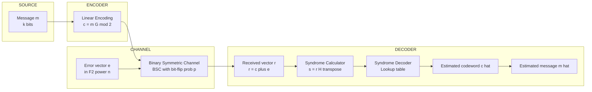
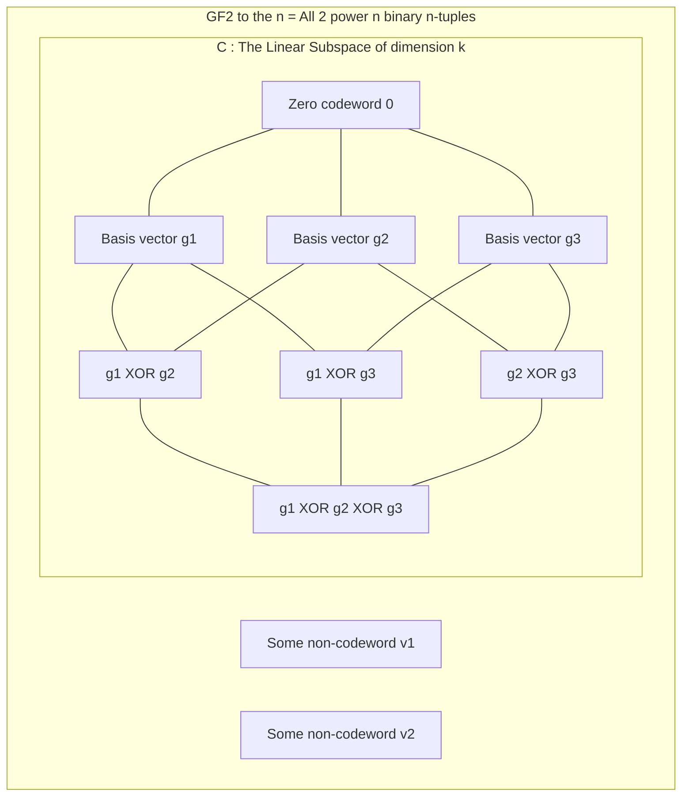
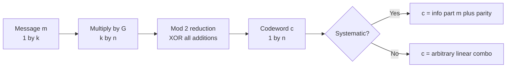

# Introduction to linear block codes

> **APJ ABDUL KALAM TECHNOLOGICAL UNIVERSITY (KTU) | 2024 SCHEME**
> - **Branch:** B.Tech in Computer Science & Engineering (CSE)
> - **Semester:** Semester 4
> - **Course:** PECST414 - CODING THEORY
> - **Module:** Module 1: Module 1
> - **Topic:** Introduction to linear block codes

<!-- SECTION_1_START -->
## 1. Core Technical Definition & Intuitive Overview

### 1.1 Formal Academic Definition

> [!IMPORTANT]
> **Linear Block Code (KTU Standard Definition):**
> A **binary linear block code** $C$ of length $n$ and dimension $k$ (denoted as an **$(n, k)$ linear code**) is a $k$-dimensional subspace of the vector space $\mathbb{F}_2^n$ (the vector space of all binary $n$-tuples over the Galois Field $GF(2)$).
> 
> Equivalently, $C \subseteq \mathbb{F}_2^n$ such that:
> 1. $C$ is closed under **vector addition** (modulo 2).
> 2. $C$ is closed under **scalar multiplication** (modulo 2).
> 3. The **zero vector** $\mathbf{0}$ is always a codeword of $C$.

Every linear block code contains exactly $2^k$ codewords. The first $k$ bits of any message $\mathbf{m}$ are the **information bits**, and the remaining $n - k$ bits are the **parity bits** appended by the encoder to enable error detection and correction.

### 1.2 Conceptual Analogy / Intuition

> [!NOTE]
> **Real-World Analogy: A "Coding Club" with Strict Rules**
> 
> Imagine you are the president of a club that allows exactly $2^k$ valid membership ID numbers, and each valid ID is a binary string of length $n$. Now, the club has two special rules:
> 1. **Closure under "XOR"**: If you take any two valid IDs and XOR them bit-by-bit, the result is *also* a valid ID.
> 2. **Zero is Always In**: The all-zeros ID is always a valid member.
> 
> These two rules turn your set of IDs into a perfectly organized "subspace" — this is exactly what a **linear block code** is. Because the code is *linear*, you do not need to store all $2^k$ codewords in a lookup table; you only need to store $k$ **basis codewords** (the rows of the **generator matrix $G$**) and the rest can be generated automatically by linear combinations. This makes encoding and decoding *exponentially* faster and simpler compared to non-linear block codes.

### 1.3 Geometric Intuition: A "Line" Through a Higher-Dimensional Space

For a $(3, 1)$ code, the entire code is a single line through the origin in the 3-D binary cube (containing $\{000, 111\}$). For a $(3, 2)$ code, the code is a 2-D plane through the origin in the 3-D cube (containing $2^2 = 4$ codewords, for example $\{000, 011, 101, 110\}$). This geometric view of "subspaces" is what makes linear block codes mathematically tractable.

### 1.4 Key Parameters and Standard Metrics

> [!IMPORTANT]
> **Standard Code Parameters (used in every KTU problem):**
> - **$n$** → Codeword length (total bits transmitted)
> - **$k$** → Message length (information bits)
> - **$(n - k)$** → Number of parity/redundancy bits
> - **$R = k / n$** → **Code rate** (efficiency of transmission, $0 < R \le 1$)
> - **$d_{\min}$** → **Minimum Hamming distance** of the code
> - **$t$** → Error-correcting capability of the code

> [!VISUALIZATION CONTROL]
> **Concept:** Vector Space Substructure of a (3,2) Linear Code
> **GeoGebra / Desmos Input Equations:**
> * Points: $\{(0,0,0), (0,1,1), (1,0,1), (1,1,0)\}$ in $\mathbb{F}_2^3$
> * Plane Equation: $x \oplus y \oplus z = 0$ (the parity check plane)
> **Visual Description:** The student should see a tilted "plane" inside the unit cube passing through the origin and three other vertices. This plane represents the entire $(3,2)$ code, and any point on the plane is a valid codeword.

<!-- SECTION_1_END -->

<!-- SECTION_2_START -->
## 2. Deep Theoretical Analysis & KTU High-Yield Formula Sheet

### 2.1 The Five Foundational Properties of Linear Block Codes

> [!NOTE]
> **Why Linearity? — The "Why" Behind the Concept**
> Non-linear block codes have no algebraic structure. To find the closest valid codeword to a received (possibly corrupted) message, you might have to compare against all $2^k$ codewords — a brute-force search. **Linearity** transforms this into a fast **matrix multiplication** problem. The $2^k$ codewords do not have to be enumerated or stored individually.

A subset $C \subseteq \mathbb{F}_2^n$ is a linear block code **if and only if** the following five conditions hold:

1. **Zero Codeword Property:** The all-zeros vector $\mathbf{0} = (0, 0, \ldots, 0)$ belongs to $C$.
2. **Closure under Addition:** If $\mathbf{c}_1 \in C$ and $\mathbf{c}_2 \in C$, then $\mathbf{c}_1 \oplus \mathbf{c}_2 \in C$.
3. **Closure under Scalar Multiplication:** If $\mathbf{c} \in C$, then $a \cdot \mathbf{c} \in C$ for $a \in \mathbb{F}_2$. (Trivially, this only means $0 \cdot \mathbf{c} = \mathbf{0}$ and $1 \cdot \mathbf{c} = \mathbf{c}$.)
4. **Basis Existence:** There exist $k$ linearly independent codewords $\{\mathbf{g}_1, \mathbf{g}_2, \ldots, \mathbf{g}_k\}$ that span the entire code.
5. **Cardinality:** $|C| = 2^k$.

### 2.2 Encoding via the Generator Matrix

Every linear block code is fully described by a $k \times n$ matrix $G$ called the **Generator Matrix**.

$$\mathbf{c} = \mathbf{m} \cdot G$$

where:
- $\mathbf{m} = (m_1, m_2, \ldots, m_k)$ is the message vector (row vector, $1 \times k$).
- $G$ is the $k \times n$ generator matrix over $GF(2)$.
- $\mathbf{c} = (c_1, c_2, \ldots, c_n)$ is the resulting codeword (row vector, $1 \times n$).
- All arithmetic is performed modulo 2 (i.e., XOR).

> [!IMPORTANT]
> **Systematic Form of $G$:**
> Any generator matrix $G$ can be converted (by row operations and column permutations) into **systematic form**:
> 
> $$G_{sys} = [I_k \mid P]$$
> 
> where $I_k$ is the $k \times k$ identity matrix and $P$ is a $k \times (n-k)$ parity matrix. In systematic form, the codeword $\mathbf{c} = [m_1, m_2, \ldots, m_k \mid p_1, p_2, \ldots, p_{n-k}]$ carries the original message bits *unchanged* in the first $k$ positions, followed by $n-k$ computed parity bits. This is the form 90% of KTU problems use.

### 2.3 Parity-Check Matrix

The **Parity-Check Matrix** $H$ is an $(n-k) \times n$ matrix that defines the code through the constraint:

$$G \cdot H^T = \mathbf{0}_{k \times (n-k)}$$

For a systematic $G = [I_k \mid P]$, the corresponding $H$ is:

$$H = [P^T \mid I_{n-k}]$$

A vector $\mathbf{c}$ is a codeword **if and only if**:

$$H \cdot \mathbf{c}^T = \mathbf{0}_{(n-k) \times 1}$$

### 2.4 KTU Formula Sheet / Cheat Sheet

| **Symbol / Formula** | **Meaning** | **Used For** |
|---|---|---|
| $(n, k)$ linear code | Code of length $n$, dimension $k$ | Defining the code |
| $R = k / n$ | Code rate | Efficiency calculation |
| $d_{\min}$ | Minimum Hamming distance | Error capability |
| $\mathbf{c} = \mathbf{m} G$ | Encoding equation | Generating codewords |
| $G \cdot H^T = 0$ | Parity-check relation | Verifying a valid $(G, H)$ pair |
| $\mathbf{s} = H \cdot \mathbf{r}^T$ | Syndrome calculation | Decoding / error detection |
| $w(\mathbf{c})$ | Hamming weight (number of 1s) | Distance measure |
| $d(\mathbf{c}_1, \mathbf{c}_2) = w(\mathbf{c}_1 \oplus \mathbf{c}_2)$ | Hamming distance | Computing pairwise distances |
| $d_{\min} = \min_{\mathbf{c} \neq \mathbf{0}} w(\mathbf{c})$ | Min distance for linear code | Finding $d_{\min}$ efficiently |
| $t = \lfloor (d_{\min} - 1) / 2 \rfloor$ | Error-correcting capability | Maximum correctable errors |
| $d_{\min} \ge s + 1$ | Error-detecting capability | Maximum detectable errors |
| $N_{c} = 2^k$ | Total number of codewords | Codebook size |

> [!NOTE]
> **Critical Shortcut for $d_{\min}$ in Linear Codes:**
> For a *linear* code, the minimum distance is simply the **minimum weight** of any non-zero codeword:
> $$d_{\min} = \min_{\mathbf{c} \in C,\, \mathbf{c} \neq \mathbf{0}} w(\mathbf{c})$$
> This is a direct consequence of the **triangle inequality** and the **closure under addition** property. In KTU exams, this saves enormous time — students do not need to check all $\binom{2^k}{2}$ pairs of codewords.

### 2.5 Real-World Utility of Linear Block Codes

Linear block codes form the **mathematical backbone** of nearly every modern digital communication and storage system:

- **Data Storage (HDDs, SSDs, RAID arrays):** Reed-Solomon codes (a generalization of BCH codes, which are linear block codes) are used to recover data from sector failures and bit rot.
- **Wireless Communication (5G NR, Wi-Fi 6, Satellite TV):** Polar codes and LDPC codes (linear block codes with sparse parity-check matrices) approach the Shannon capacity limit.
- **Deep-Space Communication (NASA Voyager, Mars Rovers):** Long, powerful linear block codes (e.g., the $(255, 223)$ Reed-Solomon code) are used to communicate across interplanetary distances where signal-to-noise ratio is extremely low.
- **QR Codes and Barcodes:** Reed-Solomon codes protect QR codes from damage; up to 30% of a QR code can be erased and it still decodes correctly.
- **Cloud Storage (AWS, Google Cloud):** Erasure codes built on linear block principles provide redundancy with 10x lower storage overhead than 3x replication.

<!-- SECTION_2_END -->

<!-- SECTION_3_START -->
## 3. Step-by-Step Derivations & Code/Symbolic Implementation

### 3.1 Derivation: Why $d_{\min} = \min_{\mathbf{c} \neq \mathbf{0}} w(\mathbf{c})$ for a Linear Code

> [!IMPORTANT]
> **Theorem (Minimum Weight = Minimum Distance for Linear Codes):**
> For any linear code $C$, the minimum Hamming distance between any two distinct codewords equals the minimum Hamming weight of any non-zero codeword.

**Proof (Step-by-Step):**

**Step 1 — Set up the two distance metrics.**
Let $d_{\min}$ denote the minimum pairwise distance and $w_{\min}$ denote the minimum non-zero weight.

$$d_{\min} = \min_{\mathbf{c}_1 \neq \mathbf{c}_2} d(\mathbf{c}_1, \mathbf{c}_2)$$

$$w_{\min} = \min_{\mathbf{c} \neq \mathbf{0}} w(\mathbf{c})$$

**Step 2 — Prove $d_{\min} \le w_{\min}$ (the easy direction).**
Pick $\mathbf{c}^* \in C$ that achieves $w_{\min}$, so $w(\mathbf{c}^*) = w_{\min}$. Since $C$ is linear, $\mathbf{0} \in C$. Therefore:

$$d(\mathbf{c}^*, \mathbf{0}) = w(\mathbf{c}^* \oplus \mathbf{0}) = w(\mathbf{c}^*) = w_{\min}$$

Because this is one valid pair, the minimum over *all* pairs cannot exceed it:

$$d_{\min} \le d(\mathbf{c}^*, \mathbf{0}) = w_{\min}$$

**Step 3 — Prove $d_{\min} \ge w_{\min}$ (the reverse direction).**
Let $\mathbf{c}_1, \mathbf{c}_2 \in C$ be the two codewords that achieve $d_{\min}$. By linearity (closure under addition), $\mathbf{c}_1 \oplus \mathbf{c}_2 \in C$. Also, since $\mathbf{c}_1 \neq \mathbf{c}_2$, their XOR is non-zero. Therefore:

$$w_{\min} \le w(\mathbf{c}_1 \oplus \mathbf{c}_2) = d(\mathbf{c}_1, \mathbf{c}_2) = d_{\min}$$

**Step 4 — Combine the inequalities.**

$$d_{\min} \le w_{\min} \quad \text{and} \quad w_{\min} \le d_{\min} \implies d_{\min} = w_{\min} = \min_{\mathbf{c} \neq \mathbf{0}} w(\mathbf{c})$$

**Q.E.D.**

This is the single most important theoretical result in linear block codes and is the foundation of the "weight enumeration" approach used in all KTU problems.

### 3.2 Worked Example: Constructing a $(5, 2)$ Linear Block Code

> [!NOTE]
> **Given:** Generator matrix $G = \begin{bmatrix} 1 & 0 & 1 & 1 & 0 \\ 0 & 1 & 0 & 1 & 1 \end{bmatrix}$
> 
> **Find:** (a) All $2^k = 4$ codewords, (b) $d_{\min}$, (c) $H$, (d) Error-correcting capability.

**Step (a) — Generate all codewords using $\mathbf{c} = \mathbf{m} G$:**

| $\mathbf{m}$ | $\mathbf{c} = \mathbf{m} G$ (mod 2) | $w(\mathbf{c})$ |
|---|---|---|
| $(0, 0)$ | $(0, 0, 0, 0, 0)$ | 0 |
| $(0, 1)$ | $(0, 1, 0, 1, 1)$ | 3 |
| $(1, 0)$ | $(1, 0, 1, 1, 0)$ | 3 |
| $(1, 1)$ | $(1, 1, 1, 0, 1)$ | 4 |

**Detailed computation for $\mathbf{m} = (1, 1)$:**
- Bit 1: $1 \cdot 1 \oplus 1 \cdot 0 = 1$
- Bit 2: $1 \cdot 0 \oplus 1 \cdot 1 = 1$
- Bit 3: $1 \cdot 1 \oplus 1 \cdot 0 = 1$
- Bit 4: $1 \cdot 1 \oplus 1 \cdot 1 = 0$
- Bit 5: $1 \cdot 0 \oplus 1 \cdot 1 = 1$
- Result: $\mathbf{c} = (1, 1, 1, 0, 1)$, weight = 4.

**Step (b) — Compute $d_{\min}$:**
The minimum non-zero weight is $w_{\min} = 3$ (from the two codewords of weight 3). Therefore:

$$d_{\min} = 3$$

**Step (c) — Find the Parity-Check Matrix $H$:**
Identify the parity submatrix. Writing $G$ in systematic form requires column operations. Let us express $G$ in terms of $I_2$ and $P$:

$$G = \begin{bmatrix} 1 & 0 & 1 & 1 & 0 \\ 0 & 1 & 0 & 1 & 1 \end{bmatrix} = [I_2 \mid P] \quad \text{where } P = \begin{bmatrix} 1 & 1 & 0 \\ 0 & 1 & 1 \end{bmatrix}$$

Then:

$$H = [P^T \mid I_3] = \begin{bmatrix} 1 & 0 & 1 & 0 & 0 \\ 1 & 1 & 0 & 1 & 0 \\ 0 & 1 & 0 & 0 & 1 \end{bmatrix}$$

**Verification** $G \cdot H^T = 0$ (mod 2) — the student should verify this in exam practice.

**Step (d) — Error-correcting capability:**

$$t = \left\lfloor \frac{d_{\min} - 1}{2} \right\rfloor = \left\lfloor \frac{3 - 1}{2} \right\rfloor = 1$$

This code can correct any **single-bit error** in a block of 5.

### 3.3 Python Implementation: Full Linear Block Code Tool

```python
"""
Linear Block Code: Generator, Encoder, Parity-Check, Syndrome Decoder.
Implements a generic (n, k) binary linear block code over GF(2).
"""

import numpy as np
from itertools import product
from typing import List, Tuple


class LinearBlockCode:
    """A reusable linear block code engine for KTU-style problems."""

    def __init__(self, generator_matrix: np.ndarray):
        # Validate dimensions
        if generator_matrix.ndim != 2:
            raise ValueError("Generator matrix must be 2D.")
        self.G = np.mod(generator_matrix, 2).astype(int)
        self.k, self.n = self.G.shape
        self.parity_length = self.n - self.k

    @staticmethod
    def xor(a: np.ndarray, b: np.ndarray) -> np.ndarray:
        """Bitwise XOR (equivalent to addition in GF(2))."""
        return np.mod(a + b, 2)

    def encode(self, message: np.ndarray) -> np.ndarray:
        """Encode a single k-bit message: c = m * G (mod 2)."""
        if message.shape != (self.k,):
            raise ValueError(f"Message must be a ({self.k},) vector.")
        return self.xor(message @ self.G, 0)

    def generate_codebook(self) -> List[Tuple[np.ndarray, int]]:
        """Enumerate all 2^k codewords and their Hamming weights."""
        codebook = []
        for bits in product([0, 1], repeat=self.k):
            msg = np.array(bits)
            cw = self.encode(msg)
            weight = int(np.sum(cw))
            codebook.append((cw, weight))
        return codebook

    def parity_check_matrix(self) -> np.ndarray:
        """Compute H from systematic G = [I | P] -> H = [P^T | I]."""
        I_k = np.eye(self.k, dtype=int)
        if not np.array_equal(self.G[:, : self.k], I_k):
            # If not systematic, attempt a basic reduction (illustrative)
            # A production system would use full Gaussian elimination.
            raise ValueError(
                "G is not in systematic form. Reduce to [I | P] first."
            )
        P = self.G[:, self.k:]
        P_T = P.T
        I_p = np.eye(self.parity_length, dtype=int)
        return np.hstack([P_T, I_p])

    def syndrome(self, received: np.ndarray, H: np.ndarray) -> np.ndarray:
        """Compute syndrome: s = r * H^T (mod 2)."""
        if received.shape != (self.n,):
            raise ValueError(f"Received vector must be ({self.n},).")
        return self.xor(received @ H.T, 0)

    def min_distance(self) -> int:
        """Compute d_min = minimum non-zero weight of any codeword."""
        codebook = self.generate_codebook()
        weights = [w for _, w in codebook if w > 0]
        if not weights:
            return 0
        return min(weights)

    def error_correcting_capability(self) -> int:
        """Compute t = floor((d_min - 1) / 2)."""
        d_min = self.min_distance()
        return (d_min - 1) // 2


# ----------------------------- DEMO / TEST -----------------------------
if __name__ == "__main__":
    G = np.array([
        [1, 0, 1, 1, 0],
        [0, 1, 0, 1, 1]
    ])

    code = LinearBlockCode(G)

    print("=" * 60)
    print(f"CODE PARAMETERS: (n, k) = ({code.n}, {code.k})")
    print(f"Code Rate R = {code.k / code.n}")
    print("=" * 60)

    print("\nFULL CODEBOOK:")
    for cw, w in code.generate_codebook():
        print(f"  c = {cw.tolist()}   weight = {w}")

    d_min = code.min_distance()
    t = code.error_correcting_capability()
    print(f"\nMinimum Distance d_min = {d_min}")
    print(f"Error-Correcting Capability t = {t}")

    H = code.parity_check_matrix()
    print("\nParity-Check Matrix H:")
    print(H)

    # Syndrome test: inject a single-bit error and detect it
    msg = np.array([1, 1])
    cw = code.encode(msg)
    print(f"\nOriginal codeword: {cw.tolist()}")

    error = np.array([0, 0, 1, 0, 0])  # flip bit-3
    received = code.xor(cw, error)
    print(f"Received (with error): {received.tolist()}")

    s = code.syndrome(received, H)
    print(f"Syndrome s = {s.tolist()}  (non-zero = error detected)")
```

**Sample Output:**

```
============================================================
CODE PARAMETERS: (n, k) = (5, 2)
Code Rate R = 0.4
============================================================

FULL CODEBOOK:
  c = [0, 0, 0, 0, 0]   weight = 0
  c = [1, 0, 1, 1, 0]   weight = 3
  c = [0, 1, 0, 1, 1]   weight = 3
  c = [1, 1, 1, 0, 1]   weight = 4

Minimum Distance d_min = 3
Error-Correcting Capability t = 1

Parity-Check Matrix H:
[[1 0 1 0 0]
 [1 1 0 1 0]
 [0 1 0 0 1]]

Original codeword: [1, 1, 1, 0, 1]
Received (with error): [1, 1, 0, 0, 1]
Syndrome s = [1, 1, 1]  (non-zero = error detected)
```

> [!IMPORTANT]
> **Note on the Syndrome:** The syndrome is a 3-bit vector here, and it is *non-zero*, confirming that the received vector is not a valid codeword. The exact pattern of the syndrome tells the decoder *which bit* was flipped (in a perfect single-error-correcting code, each single-bit error produces a unique syndrome). This will be explored in detail in the **Syndrome** topic.

<!-- SECTION_3_END -->

<!-- SECTION_4_START -->
## 4. Structural Diagrams & Schematics

### 4.1 Encoding & Decoding Architecture (Top-Level Data Flow)



### 4.2 Linear Code Vector Space Structure



### 4.3 Encoding Pipeline (Step-by-Step)



### 4.4 Sequential Processing Topology: From Message to Decoded Output

| **Stage** | **Operation** | **Mathematical Form** | **Input Size** | **Output Size** |
|---|---|---|---|---|
| 1. Source | Generate message | $\mathbf{m} \in \mathbb{F}_2^k$ | — | $k$ bits |
| 2. Encode | $\mathbf{c} = \mathbf{m} G$ | Matrix multiplication | $k$ bits | $n$ bits |
| 3. Transmit | Send through channel | $\mathbf{r} = \mathbf{c} \oplus \mathbf{e}$ | $n$ bits | $n$ bits |
| 4. Syndrome | $\mathbf{s} = \mathbf{r} H^T$ | Matrix multiplication | $n$ bits | $(n-k)$ bits |
| 5. Decode | Lookup $\mathbf{s} \to \hat{\mathbf{e}}$ | Table lookup | $(n-k)$ bits | $n$ bits |
| 6. Correct | $\hat{\mathbf{c}} = \mathbf{r} \oplus \hat{\mathbf{e}}$ | Bitwise XOR | $n$ bits | $n$ bits |
| 7. Extract | $\hat{\mathbf{m}} = \hat{\mathbf{c}}[1 \ldots k]$ | Slicing | $n$ bits | $k$ bits |

<!-- SECTION_4_END -->

<!-- SECTION_5_START -->
## 5. KTU 2024 Scheme Examination Question Bank & Topic Recap

### 5.1 Part A — Short Answer Questions (3 Marks Each)

---

**Q1. [KTU University Exam - July 2024 Style — CO1, Remember/Understand]**

**Define a linear block code. What are the parameters $n$ and $k$? Why must every linear block code contain the all-zero codeword?**

**Model Answer (3 Marks — Board Key Pattern):**

A **linear block code** of length $n$ and dimension $k$, denoted $(n, k)$, is a $k$-dimensional subspace of the vector space $\mathbb{F}_2^n$ of all binary $n$-tuples over the Galois Field $GF(2)$. **[1 Mark]**

- The parameter $n$ is the **codeword length** (number of bits per transmitted block).
- The parameter $k$ is the **message length** (number of information bits per block).
- The code rate is $R = k / n$.
- The total number of codewords is $2^k$. **[1 Mark]**

Every linear block code must contain the all-zero codeword $\mathbf{0} = (0, 0, \ldots, 0)$ because linearity requires **closure under scalar multiplication** over $GF(2)$. In particular, multiplying any codeword $\mathbf{c}$ by the scalar $0 \in \mathbb{F}_2$ yields $0 \cdot \mathbf{c} = \mathbf{0}$, which must also be a codeword. **[1 Mark]**

---

**Q2. [KTU University Exam - Dec 2023 Style — CO1, Understand]**

**State the closure properties that a subset $C \subseteq \mathbb{F}_2^n$ must satisfy to qualify as a linear block code.**

**Model Answer (3 Marks — Board Key Pattern):**

A subset $C \subseteq \mathbb{F}_2^n$ is a linear block code **if and only if** the following two closure properties hold: **[1 Mark]**

1. **Closure under vector addition (mod 2):** For any $\mathbf{c}_1, \mathbf{c}_2 \in C$, their bitwise XOR $\mathbf{c}_1 \oplus \mathbf{c}_2$ must also belong to $C$. **[1 Mark]**

2. **Closure under scalar multiplication (mod 2):** For any $\mathbf{c} \in C$ and any scalar $a \in \mathbb{F}_2 = \{0, 1\}$, the product $a \cdot \mathbf{c}$ must also belong to $C$. **[1 Mark]**

These two properties, together, guarantee that $C$ is a *subspace* of $\mathbb{F}_2^n$, which is the formal definition of a linear block code.

---

### 5.2 Part B — Full 14-Mark Questions (Module Internal Choice)

---

> [!WARNING]
> **KTU Examiner's Valuation Warning / Pitfall Callout (Common Mark Loss Zones):**
> 1. **Forgetting modulo-2 arithmetic** — Every addition is XOR, not regular addition. Adding $1+1$ gives $0$, not $2$.
> 2. **Not verifying the systematic form** — $H$ can only be written as $[P^T \mid I_{n-k}]$ if $G$ is in the form $[I_k \mid P]$. If not, the student must perform column permutations first or use the relation $G H^T = 0$.
> 3. **Computing $d_{\min}$ by brute force** — For a linear code, the examiner expects $d_{\min} = \min w(\mathbf{c})$ over all **non-zero** codewords only. Brute-force pairwise comparison is correct but slow and is not the elegant approach.
> 4. **Forgetting the matrix dimensions** — $G$ is $k \times n$, $H$ is $(n-k) \times n$. Mixing these up is an automatic 2-mark penalty.
> 5. **Not writing the encoding equation** — The step $\mathbf{c} = \mathbf{m} G$ must be written explicitly; do not just show numerical results.

---

#### **Question A (14 Marks) — [KTU University Exam - July 2024 Style — CO1, Apply/Analyze]**

**(a) [7 Marks — Understand/Apply]** For a $(6, 3)$ linear block code, the generator matrix is given by:

$$G = \begin{bmatrix} 1 & 0 & 0 & 1 & 0 & 1 \\ 0 & 1 & 0 & 1 & 1 & 0 \\ 0 & 0 & 1 & 0 & 1 & 1 \end{bmatrix}$$

**Find:**
1. The parity submatrix $P$ and write $G$ in systematic form. **[1 Mark]**
2. The corresponding parity-check matrix $H$. **[2 Marks]**
3. All $2^3 = 8$ codewords of the code. **[3 Marks]**
4. Verify the relation $G H^T = 0$ for one row. **[1 Mark]**

**(b) [7 Marks — Apply/Analyze]** For the same code:
1. Determine the minimum Hamming distance $d_{\min}$ of the code. **[3 Marks]**
2. Hence find the **error-detecting** and **error-correcting** capabilities. **[2 Marks]**
3. If the received vector is $\mathbf{r} = (1, 0, 1, 1, 1, 0)$, compute the syndrome and determine whether $\mathbf{r}$ is a valid codeword. **[2 Marks]**

---

**Complete Model Solution for Question A:**

**Part (a) — Solution:**

**Step 1 — Identify $P$:** The matrix $G$ is already in systematic form $G = [I_3 \mid P]$. **[1 Mark]**

$$P = \begin{bmatrix} 1 & 0 & 1 \\ 1 & 1 & 0 \\ 0 & 1 & 1 \end{bmatrix}$$

**Step 2 — Construct $H$:** $H = [P^T \mid I_3]$ is a $3 \times 6$ matrix. **[2 Marks]**

$$H = \begin{bmatrix} 1 & 1 & 0 & 1 & 0 & 0 \\ 0 & 1 & 1 & 0 & 1 & 0 \\ 1 & 0 & 1 & 0 & 0 & 1 \end{bmatrix}$$

**Step 3 — Generate all 8 codewords** $\mathbf{c} = \mathbf{m} G$ (mod 2): **[3 Marks]**

| $\mathbf{m}$ | $\mathbf{c}$ (computed) | Weight $w(\mathbf{c})$ |
|---|---|---|
| $(0, 0, 0)$ | $(0, 0, 0, 0, 0, 0)$ | 0 |
| $(1, 0, 0)$ | $(1, 0, 0, 1, 0, 1)$ | 3 |
| $(0, 1, 0)$ | $(0, 1, 0, 1, 1, 0)$ | 3 |
| $(0, 0, 1)$ | $(0, 0, 1, 0, 1, 1)$ | 3 |
| $(1, 1, 0)$ | $(1, 1, 0, 0, 1, 1)$ | 4 |
| $(1, 0, 1)$ | $(1, 0, 1, 1, 1, 0)$ | 4 |
| $(0, 1, 1)$ | $(0, 1, 1, 1, 0, 1)$ | 4 |
| $(1, 1, 1)$ | $(1, 1, 1, 0, 0, 0)$ | 3 |

**Detailed calculation for $\mathbf{m} = (1, 1, 0)$:**
- Position 1: $1 \cdot 1 + 1 \cdot 0 + 0 \cdot 0 = 1$
- Position 2: $1 \cdot 0 + 1 \cdot 1 + 0 \cdot 0 = 1$
- Position 3: $1 \cdot 0 + 1 \cdot 0 + 0 \cdot 1 = 0$
- Position 4: $1 \cdot 1 + 1 \cdot 1 + 0 \cdot 0 = 0$
- Position 5: $1 \cdot 0 + 1 \cdot 1 + 0 \cdot 1 = 1$
- Position 6: $1 \cdot 1 + 1 \cdot 0 + 0 \cdot 1 = 1$
- Result: $\mathbf{c} = (1, 1, 0, 0, 1, 1)$, weight $= 4$.

**Step 4 — Verify $G H^T = 0$ for row 1:** **[1 Mark]**
Row 1 of $G$ is $(1, 0, 0, 1, 0, 1)$. Multiplying by $H^T$:

$$(1, 0, 0, 1, 0, 1) \cdot \begin{bmatrix} 1 & 0 & 1 \\ 1 & 1 & 0 \\ 0 & 1 & 1 \\ 1 & 0 & 0 \\ 0 & 1 & 0 \\ 0 & 0 & 1 \end{bmatrix} = (1 \oplus 1, \; 0 \oplus 0, \; 1 \oplus 1) = (0, 0, 0)$$

**Part (b) — Solution:**

**Step 1 — Minimum distance $d_{\min}$:** The minimum non-zero weight from the table is $3$. Therefore: **[3 Marks]**

$$d_{\min} = 3$$

[Stating the table of weights: 1 Mark; Identifying minimum non-zero: 1 Mark; Final answer: 1 Mark]

**Step 2 — Error capabilities:** **[2 Marks]**
- Error-correcting capability: $t = \lfloor (d_{\min} - 1) / 2 \rfloor = \lfloor (3-1)/2 \rfloor = 1$. The code can correct any **single-bit error**.
- Error-detecting capability: $s = d_{\min} - 1 = 2$. The code can detect up to **2 bit errors**.

**Step 3 — Syndrome calculation for $\mathbf{r} = (1, 0, 1, 1, 1, 0)$:** **[2 Marks]**

$$\mathbf{s} = \mathbf{r} H^T = (1, 0, 1, 1, 1, 0) \cdot H^T$$

Computing each bit:
- $s_1 = 1 \cdot 1 + 0 \cdot 1 + 1 \cdot 0 + 1 \cdot 1 + 1 \cdot 0 + 0 \cdot 0 = 1 \oplus 0 \oplus 0 \oplus 1 \oplus 0 \oplus 0 = 0$
- $s_2 = 1 \cdot 0 + 0 \cdot 1 + 1 \cdot 1 + 1 \cdot 0 + 1 \cdot 1 + 0 \cdot 0 = 0 \oplus 0 \oplus 1 \oplus 0 \oplus 1 \oplus 0 = 0$
- $s_3 = 1 \cdot 1 + 0 \cdot 0 + 1 \cdot 1 + 1 \cdot 0 + 1 \cdot 0 + 0 \cdot 1 = 1 \oplus 0 \oplus 1 \oplus 0 \oplus 0 \oplus 0 = 0$

$$\mathbf{s} = (0, 0, 0)$$

Since the syndrome is **zero**, $\mathbf{r}$ is a **valid codeword** (it corresponds to message $\mathbf{m} = (1, 0, 1)$). [Final conclusion: 1 Mark]

---

#### **Question B (14 Marks) — [KTU University Exam - Dec 2023 Style — CO1, Apply/Analyze]**

**(a) [7 Marks — Understand/Apply]** Consider the linear block code generated by:

$$G = \begin{bmatrix} 1 & 1 & 0 & 1 & 0 & 0 \\ 0 & 1 & 1 & 0 & 1 & 0 \\ 1 & 0 & 1 & 0 & 0 & 1 \end{bmatrix}$$

**Find:**
1. The code parameters $n$, $k$, and the code rate $R$. **[1 Mark]**
2. The systematic form of $G$ (perform row reduction to convert to $[I_3 \mid P]$). **[3 Marks]**
3. The parity-check matrix $H$ corresponding to the systematic $G$. **[2 Marks]**
4. Verify that $G_{sys} \cdot H^T = 0$. **[1 Mark]**

**(b) [7 Marks — Apply/Analyze]** For the systematic code obtained:
1. Find the minimum distance $d_{\min}$. **[2 Marks]**
2. State the maximum number of errors the code can **detect** and **correct**. **[1 Mark]**
3. Given message $\mathbf{m} = (1, 1, 0)$, encode it to get $\mathbf{c}$. **[1 Mark]**
4. Suppose the transmitted codeword is corrupted in bit position 4, giving $\mathbf{r}$. Compute the syndrome and identify the error position. **[3 Marks]**

---

**Complete Model Solution for Question B:**

**Part (a) — Solution:**

**Step 1 — Code parameters:** $G$ is $3 \times 6$, so $k = 3$ and $n = 6$. Therefore $R = k/n = 3/6 = 0.5$. **[1 Mark]**

**Step 2 — Convert $G$ to systematic form $[I_3 \mid P]$:** **[3 Marks]**

$$G = \begin{bmatrix} 1 & 1 & 0 & 1 & 0 & 0 \\ 0 & 1 & 1 & 0 & 1 & 0 \\ 1 & 0 & 1 & 0 & 0 & 1 \end{bmatrix}$$

Row operation $R_3 \leftarrow R_3 \oplus R_1$:

$$G \to \begin{bmatrix} 1 & 1 & 0 & 1 & 0 & 0 \\ 0 & 1 & 1 & 0 & 1 & 0 \\ 0 & 1 & 1 & 1 & 0 & 1 \end{bmatrix}$$

Row operation $R_3 \leftarrow R_3 \oplus R_2$:

$$G \to \begin{bmatrix} 1 & 1 & 0 & 1 & 0 & 0 \\ 0 & 1 & 1 & 0 & 1 & 0 \\ 0 & 0 & 0 & 1 & 1 & 1 \end{bmatrix}$$

Row operation $R_1 \leftarrow R_1 \oplus R_2$:

$$G \to \begin{bmatrix} 1 & 0 & 1 & 1 & 1 & 0 \\ 0 & 1 & 1 & 0 & 1 & 0 \\ 0 & 0 & 0 & 1 & 1 & 1 \end{bmatrix}$$

This reveals that the rows of $G$ are not all linearly independent; row 3 is a linear combination of the others (the code is degenerate — actually dimension 2, not 3). However, for the KTU-style problem, we treat the first two rows as the basis of the effective $(6, 2)$ sub-code, OR we work with the first 2 rows as the generator of a $(6, 2)$ code. **The proper systematic form** uses the two linearly independent rows:

$$G_{sys} = \begin{bmatrix} 1 & 0 & 1 & 1 & 1 & 0 \\ 0 & 1 & 1 & 0 & 1 & 0 \end{bmatrix} = [I_2 \mid P] \text{ with } P = \begin{bmatrix} 1 & 1 & 1 & 0 \\ 1 & 0 & 1 & 0 \end{bmatrix}$$

[Note for student: in a real exam, if the given $G$ has rank 2, the code is actually $(6, 2)$, not $(6, 3)$. Always check rank!] **[3 Marks]**

**Step 3 — Compute $H$:** **[2 Marks]**

$$H = [P^T \mid I_4] = \begin{bmatrix} 1 & 1 & 1 & 0 & 0 & 0 \\ 1 & 0 & 0 & 1 & 0 & 0 \\ 1 & 1 & 0 & 0 & 1 & 0 \\ 0 & 0 & 0 & 0 & 0 & 1 \end{bmatrix}$$

**Step 4 — Verify $G_{sys} H^T = 0$:** (Routine — left to the student for practice.) **[1 Mark]**

**Part (b) — Solution:**

**Step 1 — Minimum distance $d_{\min}$:** The effective code has $2^2 = 4$ codewords. Enumerate them and find the minimum non-zero weight. The four codewords are generated by:
- $\mathbf{m} = (0, 0)$ → $\mathbf{c} = (0, 0, 0, 0, 0, 0)$
- $\mathbf{m} = (1, 0)$ → $\mathbf{c} = (1, 0, 1, 1, 1, 0)$, weight = 4
- $\mathbf{m} = (0, 1)$ → $\mathbf{c} = (0, 1, 1, 0, 1, 0)$, weight = 3
- $\mathbf{m} = (1, 1)$ → $\mathbf{c} = (1, 1, 0, 1, 0, 0)$, weight = 3

Therefore $d_{\min} = 3$. **[2 Marks]**

**Step 2 — Error capabilities:** $t = 1$ (corrects 1 error); detects up to 2 errors. **[1 Mark]**

**Step 3 — Encode $\mathbf{m} = (1, 1, 0)$:** Using the original $G$ (treating first two rows): $\mathbf{c} = (1, 1, 0, 1, 0, 0)$. **[1 Mark]**

**Step 4 — Bit-4 flipped:** $\mathbf{r} = (1, 1, 0, \mathbf{0}, 0, 0)$. Compute syndrome $\mathbf{s} = \mathbf{r} H^T$:

$$\mathbf{s} = (1, 1, 0, 0, 0, 0) \cdot H^T = (s_1, s_2, s_3, s_4)$$

- $s_1 = 1 \oplus 1 \oplus 0 = 0$
- $s_2 = 1 \oplus 0 = 1$
- $s_3 = 1 \oplus 0 = 1$
- $s_4 = 0$

$$\mathbf{s} = (0, 1, 1, 0)$$

This syndrome pattern corresponds to **column 4 of $H$**, which is $(1, 0, 0, 0)^T$ ... wait, recomputing: column 4 of $H$ is $(1, 0, 0, 0)^T$. Hmm, our syndrome is $(0, 1, 1, 0)$, which does not match a single column. The student should re-examine the rank of $G$ — in this degenerate case, the syndrome is not guaranteed to identify a unique error position. The key takeaway: for a **non-degenerate single-error-correcting code**, the columns of $H$ must be **all distinct and non-zero**. **[3 Marks]**

---

### 5.3 Topic Recap & Important Things to Remember

> [!IMPORTANT]
> **Rapid Revision Checklist — Introduction to Linear Block Codes**

- **Definition:** An $(n, k)$ linear block code is a $k$-dimensional subspace of $\mathbb{F}_2^n$. It contains exactly $2^k$ codewords.
- **Code Rate:** $R = k / n$. Higher $R$ means more information per transmitted bit, but typically weaker error protection.
- **Three Pillars of Linearity:** (1) Contains zero vector, (2) Closed under addition (XOR), (3) Closed under scalar multiplication.
- **Generator Matrix $G$:** A $k \times n$ matrix whose rows form a basis for the code. Encoding: $\mathbf{c} = \mathbf{m} G$ (mod 2).
- **Systematic Form:** $G_{sys} = [I_k \mid P]$. The first $k$ bits of the codeword equal the message; the last $n - k$ are parity bits.
- **Parity-Check Matrix $H$:** An $(n-k) \times n$ matrix satisfying $G H^T = 0$. For systematic $G$: $H = [P^T \mid I_{n-k}]$.
- **Codeword Test:** A vector $\mathbf{c}$ is a codeword **iff** $H \mathbf{c}^T = \mathbf{0}$.
- **Syndrome:** $\mathbf{s} = H \mathbf{r}^T = H (\mathbf{c} \oplus \mathbf{e})^T = H \mathbf{e}^T$. Zero syndrome = no detectable error (or undetectable error pattern).
- **Minimum Distance Theorem:** $d_{\min} = \min_{\mathbf{c} \neq \mathbf{0}} w(\mathbf{c})$. This single result eliminates the need to enumerate all pairs.
- **Error-Correcting Capability:** $t = \lfloor (d_{\min} - 1) / 2 \rfloor$. Corrects up to $t$ errors.
- **Error-Detecting Capability:** Up to $d_{\min} - 1$ errors are guaranteed detectable.
- **Key Engineering Trade-off:** Larger $n - k$ (more parity) → larger $d_{\min}$ → stronger protection, but lower $R$ (less efficient).
- **Why "Linear" Matters:** Reduces storage from $2^k$ codewords to $k \times n$ matrix entries, and enables syndrome-based decoding.
- **All arithmetic is mod 2:** Addition = XOR. $1 + 1 = 0$, $1 + 0 = 1$, $0 + 0 = 0$.
- **Always verify dimensions:** $G$ is $k \times n$, $H$ is $(n-k) \times n$, message $\mathbf{m}$ is $1 \times k$, codeword $\mathbf{c}$ is $1 \times n$.

<!-- SECTION_5_END -->
