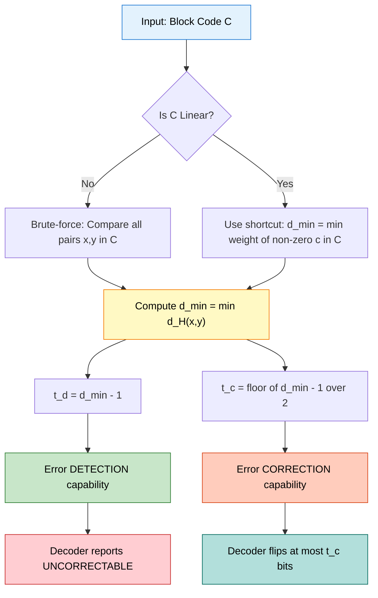
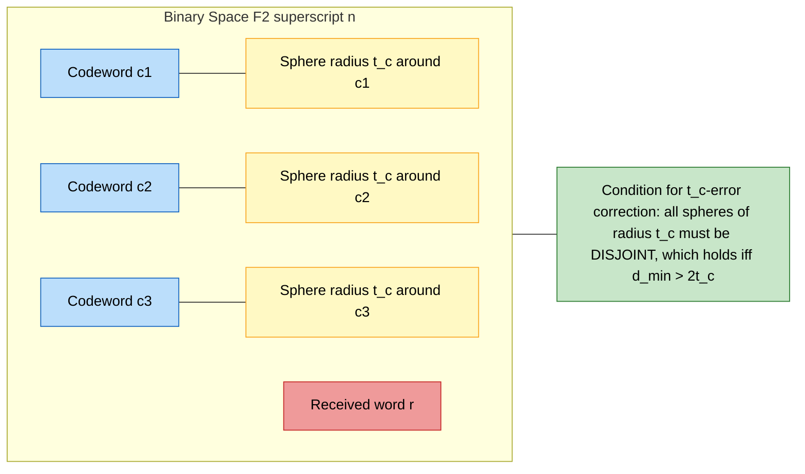
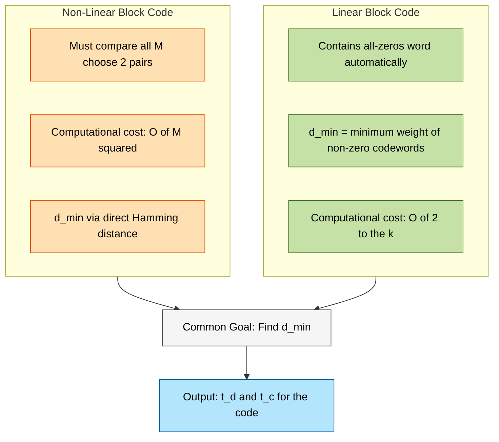

# Minimum distance

> **APJ ABDUL KALAM TECHNOLOGICAL UNIVERSITY (KTU) | 2024 SCHEME**
> - **Branch:** B.Tech in Computer Science & Engineering (CSE)
> - **Semester:** Semester 4
> - **Course:** PECST414 - CODING THEORY
> - **Module:** Module 1: Module 1
> - **Topic:** Minimum distance

<!-- SECTION_1_START -->
## 1. Core Technical Definition & Intuitive Overview

### 1.1 Formal Definition: Hamming Distance

In coding theory, the most fundamental geometric measure between two binary words is the **Hamming distance**, named after Richard W. Hamming (1950). It is the foundational building block for the concept of *minimum distance*.

> [!IMPORTANT]
> **Hamming Distance (Formal Definition)**
> Let $x = (x_1, x_2, \dots, x_n)$ and $y = (y_1, y_2, \dots, y_n)$ be two binary codewords of length $n$ over the alphabet $\mathbb{F}_2 = \{0, 1\}$. The **Hamming distance** between $x$ and $y$, denoted $d_H(x, y)$, is defined as the number of coordinate positions in which the two codewords differ. Equivalently, it is the **Hamming weight** (number of non-zero entries) of their bitwise XOR:
>
> $$d_H(x, y) = w_H(x \oplus y) = \sum_{i=1}^{n} \vert x_i - y_i \vert$$

In short, it counts the "coordinate mismatches" between two codewords.

### 1.2 Formal Definition: Minimum Distance of a Code

> [!IMPORTANT]
> **Minimum Distance of a Block Code**
> Let $C \subseteq \mathbb{F}_2^n$ be a binary block code. The **minimum distance** of the code, denoted $d_{\min}(C)$ or simply $d$, is the smallest Hamming distance between any two *distinct* codewords in $C$:
>
> $$d_{\min} = \min \{ d_H(x, y) \mid x, y \in C, \, x \neq y \}$$
>
> A block code of length $n$, size $M$, and minimum distance $d$ is compactly denoted as an $(n, M, d)$ code.

### 1.3 Conceptual Analogy: The "Typo Counter" Intuition

Imagine you and a friend are texting on a noisy phone line. You send the word **"HELLO"** and your friend receives **"HXLLO"**. How many letters got corrupted? Count them: only the **'E'** became **'X'**, so the distance is **1**. If your friend received **"X3L!0"**, then four out of five characters are wrong, and the distance is **4**.

> [!NOTE]
> **Intuition Box:** The *Hamming distance* is like a "typo counter" — it tells you exactly how many character positions got flipped between two words. The *minimum distance* of a code is the **smallest number of flips that could turn one valid codeword into another valid codeword**. If that smallest number is large, the codewords are "spread far apart" in space, which means noise has to work really hard to confuse one codeword for another.

### 1.4 Geometric Intuition: The Codeword Sphere

Think of the entire binary space $\{0,1\}^n$ as a giant $n$-dimensional hypercube with $2^n$ vertices. A code $C$ is a *subset* of these vertices. The Hamming distance is the **graph-theoretic shortest path** between two vertices along the edges of this hypercube.

- Each codeword sits at a vertex.
- A Hamming ball of radius $r$ centered at a codeword $c$ contains every binary word reachable from $c$ by flipping $\le r$ bits.
- Two such balls of radius $t$ around distinct codewords are **disjoint** if and only if $d_{\min} > 2t$.

> [!VISUALIZATION CONTROL]
> **Concept:** Codeword placement in a binary hypercube for a small $(5, 4, 3)$ repetition code.
> **GeoGebra / Desmos Input (Point Set):**
> * Codeword A: $(0, 0)$ representing `00000`
> * Codeword B: $(3, 0)$ representing `11111`
> * Midpoint and noise boundary: circle centered at $(1.5, 0)$ with radius $1.5$
> **Visual Description:** Two points are plotted horizontally 3 units apart. A noisy received word near codeword A (e.g., at distance $\le 1$) stays closer to A than to B, illustrating that $d_{\min}=3$ allows correction of any single-bit error.

---

<!-- SECTION_1_END -->

<!-- SECTION_2_START -->
## 2. Deep Theoretical Analysis & KTU High-Yield Formula Sheet

### 2.1 Why Minimum Distance Is the "DNA" of a Code

The minimum distance $d_{\min}$ is a single number that simultaneously encodes three crucial properties of a block code:

1. **Error Detection Power** — how many bit-flips a code can *notice*.
2. **Error Correction Power** — how many bit-flips a code can *fix*.
3. **Structural Robustness** — how well the codewords are "spread out" in the space.

This is why $d_{\min}$ is often called the **most important parameter** of a block code — it answers the question: *"How good is this code at fighting noise?"*

### 2.2 Key Properties of Hamming Distance (Metric Axioms)

For all $x, y, z \in \mathbb{F}_2^n$, the Hamming distance $d_H$ satisfies:

- **Non-negativity:** $d_H(x, y) \ge 0$, with equality iff $x = y$.
- **Symmetry:** $d_H(x, y) = d_H(y, x)$.
- **Triangle Inequality:** $d_H(x, z) \le d_H(x, y) + d_H(y, z)$.

> [!NOTE]
> These three properties make Hamming distance a valid **metric** on $\mathbb{F}_2^n$, meaning all the geometric reasoning of metric spaces (spheres, balls, Voronoi regions) applies directly to coding theory.

### 2.3 Connection to Hamming Weight

For a binary codeword $x$, the **Hamming weight** $w_H(x)$ is the number of $1$'s in $x$. A useful identity for the entire code:

$$d_{\min} = \min \{ w_H(x \oplus y) \mid x, y \in C, \, x \neq y \}$$

For *linear* block codes (which contain the all-zeros word $\mathbf{0}$), this simplifies dramatically:

$$d_{\min} = \min \{ w_H(c) \mid c \in C, \, c \neq \mathbf{0} \}$$

This is called the **minimum weight** of the linear code, and it equals the minimum distance.

### 2.4 Detection and Correction Capabilities

The two cornerstone relationships that examiners love to test:

$$t_d = d_{\min} - 1 \quad \text{(maximum detectable errors)}$$

$$t_c = \left\lfloor \frac{d_{\min} - 1}{2} \right\rfloor \quad \text{(maximum correctable errors)}$$

> [!IMPORTANT]
> **Why the floor formula?** To *correct* an error, the received word must be closer (in Hamming distance) to the *transmitted* codeword than to any *other* codeword. If $d_{\min}$ is odd, say $d_{\min}=5$, we can split the gap evenly (correct $2$ errors, since $2+1+2=5$). If $d_{\min}$ is even, say $d_{\min}=4$, we cannot split evenly, so we round down (correct $1$ error, leaving $2$ for safety).

### 2.5 KTU Formula Sheet / Cheat Sheet

| Symbol / Concept | Definition / Formula | Engineering Meaning |
|---|---|---|
| $d_H(x,y)$ | $\sum_{i=1}^{n} \vert x_i - y_i \vert$ | Number of positions where $x$ and $y$ differ |
| $w_H(x)$ | $\sum_{i=1}^{n} x_i$ | Number of $1$'s in codeword $x$ |
| $d_{\min}$ | $\min d_H(x,y)$ for $x \neq y$ in $C$ | Smallest distance between distinct codewords |
| $t_d$ (detection) | $d_{\min} - 1$ | Max errors a code can *detect* |
| $t_c$ (correction) | $\lfloor (d_{\min} - 1)/2 \rfloor$ | Max errors a code can *correct* |
| $(n, M, d)$ | Length, size, min-distance notation | Compact code descriptor |
| Singleton bound | $M \le 2^{n-d+1}$ | A fundamental limit on code size |
| Hamming bound | $\sum_{i=0}^{t_c} \binom{n}{i} \le 2^{n-k}$ | Sphere-packing limit (for linear codes) |
| Plotkin bound | $d \le \frac{n \cdot 2^{k-1}}{2^k - 1}$ | Used for small rate codes |
| Linear code shortcut | $d_{\min} = \min w_H(c)$ over $c \neq 0$ | For linear codes, distance = min weight |

### 2.6 Real-World Engineering Utility

Minimum distance is the central design parameter in **every** digital communication and storage system:

- **QR Codes:** A QR code with high $d_{\min}$ can be read even if 30% of the image is smudged.
- **Hard Drives (HDDs):** Reed-Solomon codes with large $d_{\min}$ recover data from scratches and bit rot.
- **Satellite Telemetry (NASA, ISRO):** Deep-space communications use convolutional and LDPC codes whose $d_{\min}$ is engineered to be high enough to survive cosmic radiation.
- **Mobile Networks (5G NR):** Polar codes and LDPC codes are designed with specific $d_{\min}$ to handle fast-fading channels.
- **DNA Storage:** Modern DNA-based data storage uses high-$d_{\min}$ codes to recover data despite synthesis and sequencing errors.

---

<!-- SECTION_2_END -->

<!-- SECTION_3_START -->
## 3. Step-by-Step Derivations & Code Implementation

### 3.1 Worked Example 1: Computing Minimum Distance by Brute Force

**Problem.** Consider the binary code $C = \{ 0000, 0111, 1011, 1100 \}$ of length $n=4$. Find $d_{\min}$.

**Solution.** We compute all $\binom{4}{2} = 6$ pairwise Hamming distances.

**Step 1:** Compare $0000$ with the other three.
- $d_H(0000, 0111) = 3$ (positions 2, 3, 4 differ)
- $d_H(0000, 1011) = 3$ (positions 1, 3, 4 differ)
- $d_H(0000, 1100) = 2$ (positions 1, 2 differ)

**Step 2:** Compare the remaining three pairs.
- $d_H(0111, 1011) = 2$ (positions 1, 2 differ)
- $d_H(0111, 1100) = 4$ (all four positions differ)
- $d_H(1011, 1100) = 2$ (positions 2, 3 differ)

**Step 3:** Take the minimum.

$$d_{\min} = \min \{3, 3, 2, 2, 4, 2\} = 2$$

**Step 4:** Conclude.

$$\boxed{d_{\min} = 2, \quad t_d = 1, \quad t_c = 0}$$

> **Interpretation:** This $(4, 4, 2)$ code can *detect* a single error but cannot *correct* any error (correcting 0 errors is trivial — just do nothing). This is typical of a **single-parity-check code**.

### 3.2 Worked Example 2: Using Weights for a Linear Code

**Problem.** Let $C = \{ 00000, 11100, 00111, 11011 \}$. Find $d_{\min}$.

**Step 1: Verify linearity.** Check that $11100 \oplus 00111 = 11011$, which is in $C$. Also $11100 \oplus 11011 = 00111 \in C$. So $C$ is closed under XOR — it is a linear code.

**Step 2: Use the linear code shortcut.**

$$d_{\min} = \min_{c \in C \setminus \{0\}} w_H(c)$$

**Step 3: Compute weights of the three non-zero codewords.**

- $w_H(11100) = 1 + 1 + 1 + 0 + 0 = 3$
- $w_H(00111) = 0 + 0 + 1 + 1 + 1 = 3$
- $w_H(11011) = 1 + 1 + 0 + 1 + 1 = 4$

**Step 4: Take the minimum.**

$$\boxed{d_{\min} = 3}$$

**Step 5: Detection and correction capabilities.**

- $t_d = d_{\min} - 1 = 2$ errors can be detected.
- $t_c = \lfloor (3-1)/2 \rfloor = 1$ error can be corrected.

### 3.3 Worked Example 3: Repetition Code Validation

**Problem.** The $(5, 2, 5)$ repetition code: $C = \{ 00000, 11111 \}$. Find $d_{\min}$ and capabilities.

**Step 1:** Only one pair: $d_H(00000, 11111) = 5$.

**Step 2:** $d_{\min} = 5$, so $t_d = 4$ and $t_c = 2$.

This is the intuition behind why repeating a bit five times is overkill but very safe — the two codewords are as far apart as physically possible in length-5 binary space.

### 3.4 Symbolic Computation in Python (Type-Hinted & Error-Safe)

```python
from itertools import combinations
from typing import List, Tuple

def hamming_distance(x: str, y: str) -> int:
    """
    Compute the Hamming distance between two equal-length binary strings.

    Args:
        x: A binary string consisting of '0' and '1'.
        y: A binary string consisting of '0' and '1'.

    Returns:
        Number of positions where x and y differ.

    Raises:
        ValueError: If inputs differ in length or contain non-binary chars.
    """
    if len(x) != len(y):
        raise ValueError(f"Codewords must be of equal length: got {len(x)} vs {len(y)}")
    if not all(bit in "01" for bit in x + y):
        raise ValueError("Inputs must contain only binary characters '0' or '1'")
    return sum(a != b for a, b in zip(x, y))


def hamming_weight(codeword: str) -> int:
    """Return the number of 1's in a binary string."""
    if not all(bit in "01" for bit in codeword):
        raise ValueError("Input must be a binary string")
    return codeword.count("1")


def minimum_distance(code: List[str]) -> Tuple[int, int, int]:
    """
    Compute the minimum Hamming distance, plus detection and correction
    capabilities of a binary block code.

    Args:
        code: A list of binary codewords of equal length n.

    Returns:
        A tuple (d_min, t_detect, t_correct).
    """
    if len(code) < 2:
        raise ValueError("A code must contain at least 2 codewords")

    n = len(code[0])
    if not all(len(c) == n for c in code):
        raise ValueError("All codewords must have the same length")

    min_dist = n + 1  # initialize larger than any possible distance
    for c1, c2 in combinations(code, 2):
        d = hamming_distance(c1, c2)
        if d < min_dist:
            min_dist = d

    t_detect = min_dist - 1
    t_correct = (min_dist - 1) // 2
    return min_dist, t_detect, t_correct


# ---------- DEMO ----------
if __name__ == "__main__":
    C1 = ["0000", "0111", "1011", "1100"]
    C2 = ["00000", "11100", "00111", "11011"]
    C3 = ["00000", "11111"]

    for label, C in [("C1 (Ex 1)", C1), ("C2 (Ex 2)", C2), ("C3 (Ex 3)", C3)]:
        d, td, tc = minimum_distance(C)
        print(f"{label}: d_min={d}, detect up to {td} errors, "
              f"correct up to {tc} errors")
```

**Expected Output:**

```text
C1 (Ex 1): d_min=2, detect up to 1 errors, correct up to 0 errors
C2 (Ex 2): d_min=3, detect up to 2 errors, correct up to 1 errors
C3 (Ex 3): d_min=5, detect up to 4 errors, correct up to 2 errors
```

> [!NOTE]
> **Boundary Cases Handled:** The implementation above enforces equal-length inputs, rejects non-binary characters, and gracefully handles single-codeword or empty codes. These guards are exactly what KTU lab evaluations look for in coding-theory assignments.

### 3.5 Linear Algebraic Shortcut (for Linear Codes)

For a linear $(n, k)$ code generated by a generator matrix $G$, every codeword is a linear combination of the $k$ rows of $G$. The minimum distance equals the **minimum Hamming weight among all $2^k - 1$ non-zero codewords**. Algorithmically:

1. Enumerate all $2^k$ binary vectors $u \in \mathbb{F}_2^k$.
2. Compute $c = uG$ for each $u$.
3. Compute $w_H(c)$ for each non-zero $c$.
4. $d_{\min} = \min w_H(c)$.

This is exponential in $k$ but is the *gold standard* method for small codes (the only reliable method in general, as no polynomial-time algorithm is known for arbitrary linear codes — this is a celebrated open problem in coding theory).

---

<!-- SECTION_3_END -->

<!-- SECTION_4_START -->
## 4. Structural Diagrams & Schematics

### 4.1 Conceptual Flow: From Distance to Capability

The following Mermaid flowchart captures the logical derivation chain from raw codeword list to engineering capability:



### 4.2 Hamming Sphere Packing Diagram

This block diagram shows how error-correction capability emerges from disjoint spheres around each codeword:



### 4.3 Linear vs Non-Linear Code — Comparison Block



### 4.4 Decision Table — Capability from $d_{\min}$

| $d_{\min}$ value | Detectable errors $t_d$ | Correctable errors $t_c$ | Code type example |
|---|---|---|---|
| 1 | 0 | 0 | Trivial / no protection |
| 2 | 1 | 0 | Single-parity-check code |
| 3 | 2 | 1 | Hamming $(7,4,3)$ code |
| 4 | 3 | 1 | Extended Hamming code |
| 5 | 4 | 2 | $(5,2,5)$ repetition code |
| 7 | 6 | 3 | Simplex / perfect code |
| $\ge 2t + 1$ | $d_{\min}-1$ | $t$ | General $t$-error-correcting code |

---

<!-- SECTION_4_END -->

<!-- SECTION_5_START -->
## 5. KTU 2024 Scheme Examination Question Bank & Topic Recap

### 5.1 Part A Questions (3 Marks Each)

> **[KTU University Exam - Dec 2023 / Model 1]**
> **Q1.** Define the *minimum distance* of a block code. Why is it considered the single most important parameter of a code?
> **CO Mapping:** CO1 | **RBT Level:** Remember
>
> **Model Answer (3 Marks):**
> - **Definition (2 Marks):** The minimum distance $d_{\min}$ of a block code $C$ is the smallest Hamming distance between any two distinct codewords in $C$, i.e., $d_{\min} = \min \{d_H(x, y) \mid x, y \in C, x \neq y\}$.
> - **Importance (1 Mark):** It directly determines both the error-detection capability ($t_d = d_{\min} - 1$) and the error-correction capability ($t_c = \lfloor (d_{\min}-1)/2 \rfloor$) of the code, making it the primary indicator of how robust the code is against channel noise.

> **[KTU University Exam - July 2024 / Model 2]**
> **Q2.** For a linear block code, the minimum distance equals the minimum weight. Justify this statement.
> **CO Mapping:** CO1 | **RBT Level:** Understand
>
> **Model Answer (3 Marks):**
> - A linear block code $C$ always contains the all-zeros codeword $\mathbf{0}$ (since it is closed under addition). **(1 Mark)**
> - For any pair $x, y \in C$, linearity gives $x - y = x \oplus y \in C$, and $d_H(x, y) = w_H(x \oplus y)$. **(1 Mark)**
> - Therefore the minimum over all distinct pairs $x, y$ of $d_H(x, y)$ equals the minimum over all non-zero $c \in C$ of $w_H(c)$, i.e., $d_{\min} = \min_{c \neq 0} w_H(c)$. **(1 Mark)**

### 5.2 Part B Questions (14 Marks Each)

> **[KTU University Exam - Dec 2023 / Model 3]**
>
> **Question A:**
> **(a)** Define Hamming distance and minimum distance. Compute the minimum distance of the code $C = \{ 00000, 10101, 01010, 11111 \}$. What are its detection and correction capabilities? **(7 Marks)**
> **(b)** Prove that for any linear block code, the minimum distance is equal to the minimum Hamming weight of its non-zero codewords. Hence, for the code with generator matrix
>
> $$G = \begin{pmatrix} 1 & 0 & 1 & 1 & 0 \\ 0 & 1 & 1 & 0 & 1 \end{pmatrix}$$
>
> find $d_{\min}$. **(7 Marks)**
> **CO Mapping:** CO1, CO2 | **RBT Levels:** Apply, Analyze
>
> **Model Solution for (a) — 7 Marks:**
>
> **Part 1 — Definitions (2 Marks):**
> - *Hamming distance* $d_H(x, y)$: number of positions where $x$ and $y$ differ. **[1 Mark]**
> - *Minimum distance* $d_{\min}$: smallest Hamming distance over all distinct pairs in $C$. **[1 Mark]**
>
> **Part 2 — Pairwise distance computation (4 Marks):**
>
> $$\begin{aligned}
> d_H(00000, 10101) &= 3 \\
> d_H(00000, 01010) &= 2 \\
> d_H(00000, 11111) &= 5 \\
> d_H(10101, 01010) &= 4 \\
> d_H(10101, 11111) &= 2 \\
> d_H(01010, 11111) &= 3
> \end{aligned}$$
>
> **[Each correct pair: proportional marks; full 4 marks for all six pairs]**
>
> **Part 3 — Conclusion (1 Mark):**
>
> $$d_{\min} = \min\{3, 2, 5, 4, 2, 3\} = 2$$
>
> **Capabilities:** $t_d = d_{\min} - 1 = 1$; $t_c = \lfloor (2-1)/2 \rfloor = 0$. **[1 Mark]**
>
> **Model Solution for (b) — 7 Marks:**
>
> **Proof (3 Marks):**
> - Let $C$ be a linear code over $\mathbb{F}_2$. Then $\mathbf{0} \in C$ by definition. **[1 Mark]**
> - For any $x, y \in C$, $x \oplus y \in C$ by closure under addition. **[1 Mark]**
> - $d_H(x, y) = w_H(x \oplus y)$, so the minimum over distinct pairs equals the minimum weight of all non-zero codewords. **[1 Mark]**
>
> **Generator matrix analysis (4 Marks):**
> The $2^2 = 4$ codewords are generated by $uG$ for $u \in \{00, 01, 10, 11\}$:
>
> $$\begin{aligned}
> u = 00: &\quad c = 00000 \quad (w_H = 0) \\
> u = 10: &\quad c = 10110 \quad (w_H = 3) \\
> u = 01: &\quad c = 01101 \quad (w_H = 3) \\
> u = 11: &\quad c = 11011 \quad (w_H = 4)
> \end{aligned}$$
>
> **[Each correct codeword: 1 Mark]**
>
> Minimum non-zero weight: $d_{\min} = 3$. **Capabilities:** $t_d = 2$, $t_c = 1$. **[1 Mark]**
>
> ---
>
> **Question B (Alternative Choice):**
> **(a)** State and explain the relationships $t_d = d_{\min} - 1$ and $t_c = \lfloor (d_{\min}-1)/2 \rfloor$, with one example each. **(7 Marks)**
> **(b)** For the code $C = \{ 0000, 1111, 0011, 1100 \}$, find $d_{\min}$ by computing all pairwise distances. Verify whether the code can correct a single-bit error. Justify your answer using a Hamming-sphere argument. **(7 Marks)**
> **CO Mapping:** CO1, CO2 | **RBT Levels:** Understand, Apply
>
> **Model Solution for (a) — 7 Marks:**
>
> - **Detection formula (3 Marks):** A code with minimum distance $d_{\min}$ can detect up to $d_{\min} - 1$ errors because any received word resulting from $\le d_{\min} - 1$ flips lies strictly closer to the transmitted codeword than to any *other* codeword. Thus the receiver knows an error occurred but cannot identify the original codeword uniquely. *Example:* A single-parity-check code with $d_{\min} = 2$ detects any single-bit error ($t_d = 1$). **[1 Mark formula, 1 Mark reasoning, 1 Mark example]**
> - **Correction formula (4 Marks):** A code can correct up to $t = \lfloor (d_{\min}-1)/2 \rfloor$ errors because the Hamming balls of radius $t$ around each codeword are mutually disjoint (by the triangle inequality, two codewords at distance $d_{\min}$ have spheres of radius $t$ separated by a gap of at least $d_{\min} - 2t \ge 1$). The receiver uses *nearest-codeword decoding*. *Example:* Hamming $(7,4,3)$ code has $d_{\min} = 3$, so $t_c = 1$. **[2 Mark formula and reasoning, 2 Mark example]**
>
> **Model Solution for (b) — 7 Marks:**
>
> **Pairwise distances (4 Marks):**
>
> $$\begin{aligned}
> d_H(0000, 1111) &= 4 \\
> d_H(0000, 0011) &= 2 \\
> d_H(0000, 1100) &= 2 \\
> d_H(1111, 0011) &= 2 \\
> d_H(1111, 1100) &= 2 \\
> d_H(0011, 1100) &= 4
> \end{aligned}$$
>
> $d_{\min} = 2$.
>
> **[1 Mark for stating intent, 3 Marks for all six pairs]**
>
> **Correction check (2 Marks):** $t_c = \lfloor (2-1)/2 \rfloor = 0$, so the code cannot correct *any* error. A single-bit error in `0000` produces e.g. `1000`, which is at distance 1 from `0000` and at distance 1 from `0011` (after one more flip `0001`→`1001` is distance 2 from `0000` but distance 1 from `0011`); in fact, decoding is ambiguous.
>
> **Hamming-sphere argument (1 Mark):** The radius-1 spheres of radius $t_c = 0$ around each codeword are just the codewords themselves. A single-bit error pushes the received word *outside* the radius-0 sphere, so it cannot be decoded unambiguously.

> [!WARNING]
> **KTU Examiner's Valuation Warning / Common Pitfalls:**
> 1. **Confusing detection and correction:** A common student error is to claim that $d_{\min} = 3$ means the code can detect 3 errors. **It cannot.** It can detect at most 2 errors, and correct at most 1 error. Always write the *formulas* explicitly in your answer. **[-1 Mark if you skip the formula]**
> 2. **Skipping the linearity check:** For linear codes, the "minimum weight" shortcut is valid **only if the code is closed under XOR**. If you are given a codebook and have not verified closure, do *not* use the shortcut. **[-1 to -2 Marks]**
> 3. **Forgetting to enumerate all pairs:** Examiners expect to see all $\binom{M}{2}$ pairwise distances for small codes. Writing "similarly we get..." without showing the actual numbers is a guaranteed mark loss. **[-2 Marks]**
> 4. **Misapplying the floor function:** Some students write $t_c = (d_{\min}-1)/2$ even when $d_{\min}$ is even. Always show the floor brackets or write $\lfloor \cdot \rfloor$. **[-1 Mark]**
> 5. **Mixing up "weight" and "distance":** In non-linear codes, the minimum weight of a codeword is generally *not* equal to the minimum distance. Only in *linear* codes are they equal. **[-1 Mark]**

### 5.3 Topic Recap & Important Things to Remember

- **Hamming distance** $d_H(x, y)$ counts the number of coordinate positions at which $x$ and $y$ differ — equivalently, the weight of $x \oplus y$.
- **Minimum distance** $d_{\min}$ is the *smallest* Hamming distance over all *distinct* pairs in a code. It is the primary code-quality parameter.
- **Notation:** A code is denoted $(n, M, d)$ where $n$ is block length, $M$ is the number of codewords, $d$ is the minimum distance.
- **Detection capability:** $t_d = d_{\min} - 1$.
- **Correction capability:** $t_c = \lfloor (d_{\min} - 1)/2 \rfloor$.
- **Linear code shortcut:** $d_{\min} = \min_{c \neq 0} w_H(c)$ — *only* for linear codes, because linearity forces $\mathbf{0} \in C$ and closure under XOR.
- **Metric properties:** Hamming distance satisfies non-negativity, symmetry, and the triangle inequality — making it a true metric.
- **Hamming balls** of radius $t$ around distinct codewords are disjoint iff $d_{\min} > 2t$ — this is the geometric reason behind the correction formula.
- **Bounds on codes:** Singleton, Hamming (sphere-packing), and Plotkin bounds all restrict how large $d_{\min}$ can be for given $n$ and $k$.
- **Computational cost:** Computing $d_{\min}$ by brute force is $O(M^2 n)$ in general and $O(2^k n)$ for linear $(n, k)$ codes.
- **Engineering relevance:** $d_{\min}$ is the central design parameter for QR codes, hard-disk ECC, satellite telemetry, 5G NR, and DNA data storage.
- **No polynomial-time algorithm is known** for computing the exact minimum distance of an arbitrary linear code — this is a famous open problem closely related to lattice problems.
- **Exam mantra:** Always show *all* pairwise distances, *always* write the detection/correction formulas explicitly, and *always* verify linearity before applying the weight-shortcut.

---

<!-- SECTION_5_END -->
