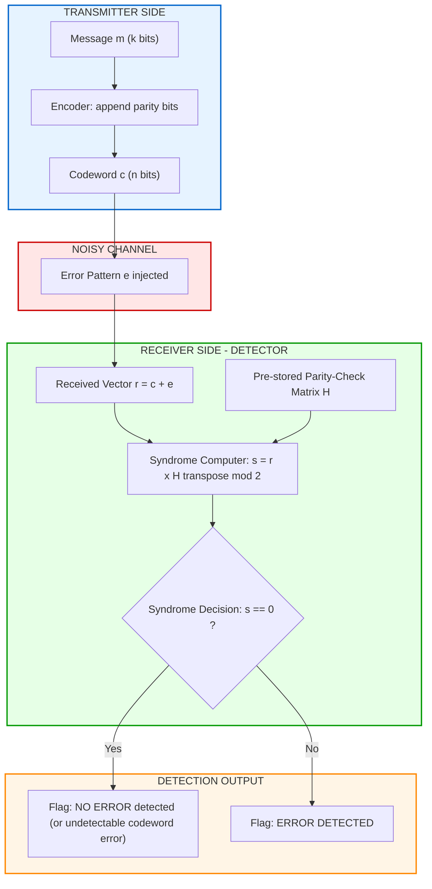
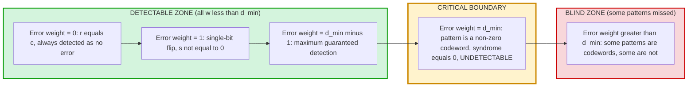
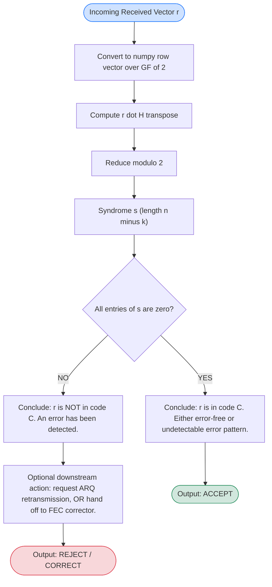

# Properties of linear block codes: error detection

> **APJ ABDUL KALAM TECHNOLOGICAL UNIVERSITY (KTU) | 2024 SCHEME**
> - **Branch:** B.Tech in Computer Science & Engineering (CSE)
> - **Semester:** Semester 4
> - **Course:** PECST414 - CODING THEORY
> - **Module:** Module 1: Module 1
> - **Topic:** Properties of linear block codes: error detection

<!-- SECTION_1_START -->

# 1. Core Technical Definition & Intuitive Overview

## 1.1 Formal Academic Definition

In the context of an $(n, k)$ **linear block code** $C$ defined over a Galois Field $GF(q)$, **error detection** is the receiver's ability to determine whether the received vector $r \in GF(q)^n$ is a valid codeword of $C$, or whether it has been corrupted during transmission through a noisy channel.

> [!IMPORTANT]
> **Error Detection (KTU 2024 Syllabus Definition):**
> A linear block code with minimum Hamming distance $d_{min}$ is said to have *error-detecting capability* $e_d$ if every received vector that differs from a transmitted codeword by an error pattern of weight $w_H(e) \leq e_d$ is guaranteed to be flagged as a non-codeword. Formally, an error pattern $e$ is *always detectable* if and only if $e$ is **not itself a codeword** of $C$.

The mathematical heart of error detection in linear block codes is the **syndrome test**:

$$s \;=\; r \cdot H^{T} \;=\; (c + e) \cdot H^{T} \;=\; c \cdot H^{T} + e \cdot H^{T} \;=\; 0 + e \cdot H^{T} \;=\; e \cdot H^{T}$$

where:
- $r \in GF(q)^n$ is the received vector
- $c \in C$ is the transmitted codeword
- $e \in GF(q)^n$ is the error (noise) vector
- $H$ is the $(n-k) \times n$ parity-check matrix
- $s \in GF(q)^{n-k}$ is the syndrome

> [!NOTE]
> **Key Decision Rule at the Receiver:**
> - If $s = \mathbf{0}$: The received vector is consistent with $C$ (either no error occurred, or the error pattern is an undetected non-codeword).
> - If $s \neq \mathbf{0}$: An error has been **definitively detected**.

---

## 1.2 Conceptual Analogy & Intuition

> [!TIP]
> **Real-World Analogy — The Library Catalogue System**
>
> Imagine a university library that stores books in carefully numbered cubbyholes. Every valid book placement is a *codeword* — a perfectly legal arrangement. A mischievous student moves a book to the wrong shelf. This is an *error pattern* $e$. When the librarian does the daily inventory check, they cross-verify the catalogue index with the actual shelf locations. This verification is the *syndrome computation*. If the index does not match (i.e., $s \neq \mathbf{0}$), the librarian **knows an error has occurred** but may not immediately know *where* the misplaced book went (that would require error *correction*, not just detection).
>
> The catalogue can only catch mischief of limited scope. If the minimum arrangement discrepancy $d_{min}$ is 3, then any single or double misplacement is detectable, but three coordinated misplacements (an undetectable codeword-like pattern) would fool the system.

**Plain-English Intuition (Geometric View):**

A linear block code $C$ is a $k$-dimensional **subspace** sitting inside an $n$-dimensional vector space $GF(q)^n$. Think of codewords as the "well-lit" zone of a darkened warehouse. A transmission error is a random "kick" that displaces the codeword to some other location. Error *detection* is simply asking: "Did we end up in the well-lit zone?" Error *correction* asks the harder question: "Where was the well-lit zone we came from?" 

The minimum distance $d_{min}$ controls the *size* of the no-error-detection blind zone: any error of weight less than $d_{min}$ is always visible, but errors of weight $\geq d_{min}$ may push the received vector onto another codeword and become invisible.

---

## 1.3 Standard Metrics & Constants

| Symbol | Meaning | Typical Range |
| :--- | :--- | :--- |
| $d_{min}$ | Minimum Hamming distance of code $C$ | $1 \leq d_{min} \leq n$ |
| $e_d$ | Maximum number of detectable errors | $0 \leq e_d \leq d_{min} - 1$ |
| $w_H(x)$ | Hamming weight of vector $x$ | $0 \leq w_H \leq n$ |
| $r$ | Received vector at the decoder | $r \in GF(q)^n$ |
| $s$ | Syndrome vector | $s \in GF(q)^{n-k}$ |

> [!IMPORTANT]
> **Fundamental Theorem (Error Detection Capability):**
> A linear block code $C$ with minimum distance $d_{min}$ can detect **all** error patterns of Hamming weight up to $d_{min} - 1$, i.e., it can detect every error of weight $a$ provided $a \leq d_{min} - 1$. Equivalently, $d_{min} \geq a + 1$ is the *necessary and sufficient* condition for guaranteed detection of all $a$-error patterns.

<!-- SECTION_1_END -->

<!-- SECTION_2_START -->

# 2. Deep Theoretical Analysis & KTU High-Yield Formula Sheet

## 2.1 The Logical Flow of Error Detection

The receiver performs the following steps, executed in a strict pipeline:

1. **Receive the vector $r$** from the channel. This may equal the transmitted codeword $c$, or it may equal $c + e$ if the channel injected an error pattern $e$.
2. **Compute the syndrome $s = r \cdot H^{T}$** using the pre-shared parity-check matrix $H$. Because $c \cdot H^{T} = \mathbf{0}$ for all codewords in a linear code, this simplifies to $s = e \cdot H^{T}$.
3. **Apply the decision rule:**
   - If $s = \mathbf{0}$: declare the received vector as either error-free or containing an undetectable error pattern.
   - If $s \neq \mathbf{0}$: declare that an error has been detected (and optionally request a retransmission in ARQ systems, or hand off to the corrector in FEC systems).
4. **Acknowledge the inherent limitation:** the system can never distinguish $s = \mathbf{0}$ caused by $e = \mathbf{0}$ from $s = \mathbf{0}$ caused by $e$ being a non-zero codeword of $C$.

> [!NOTE]
> **Why the syndrome works for detection:**
> The parity-check matrix $H$ defines the *dual code* $C^{\perp}$. Multiplying $r$ by $H^{T}$ effectively asks the question: "Is $r$ orthogonal to every vector in $C^{\perp}$?" If yes, $r \in C$. If no, $r \notin C$ and an error must have occurred.

## 2.2 Why Minimum Distance Governs Detection

The minimum distance $d_{min}$ is the smallest Hamming distance between any two distinct codewords in $C$. By linearity, this is also the **minimum non-zero weight of any codeword in $C$** (since the distance between $c_1$ and $c_2$ equals the weight of $c_1 - c_2$, which is itself a codeword by linearity).

Now consider an error pattern $e$ of weight $a$. If $e$ is *not* a codeword, then $r = c + e$ differs from every codeword by at least one position, so $r \notin C$, so $s \neq \mathbf{0}$, and the error is detected. The only error patterns that escape detection are those that **are themselves codewords**, and the smallest non-zero codeword has weight $d_{min}$. Hence:

$$e_{d} \;=\; d_{min} - 1$$

is the largest $a$ such that *every* weight-$a$ error pattern is non-zero, and therefore detectable.

## 2.3 KTU Formula Sheet & Cheat Sheet

> [!IMPORTANT]
> **High-Yield Formulas for KTU Board Examinations**

| # | Formula / Statement | Description |
| :--- | :--- | :--- |
| 1 | $s \;=\; r \cdot H^{T} \;=\; e \cdot H^{T}$ | Syndrome equation (over $GF(2)$) |
| 2 | $G \cdot H^{T} \;=\; \mathbf{0}$ | Orthogonality between generator and parity-check matrices |
| 3 | $e_{d} \;=\; d_{min} - 1$ | Maximum guaranteed detectable errors |
| 4 | $d_{min} \geq a + 1$ | Necessary and sufficient condition to detect all weight-$a$ errors |
| 5 | $d(c_1, c_2) \;=\; w_H(c_1 \oplus c_2)$ | Hamming distance equals Hamming weight of XOR |
| 6 | $d_{min} \;=\; \min_{c \neq \mathbf{0}} w_H(c)$ | By linearity: min distance equals min non-zero codeword weight |
| 7 | $r \in C \iff H \cdot r^{T} \;=\; \mathbf{0}$ | Membership test for a codeword in a linear code |
| 8 | $\Pr(\text{undetected error}) \;=\; \sum_{i=d_{min}}^{n} A_i \cdot p^{i} \cdot (1-p)^{n-i}$ | Undetected error probability on BSC with crossover $p$ |
| 9 | $A_i$ | Number of codewords of weight $i$ in the weight distribution |
| 10 | Singleton bound: $d_{min} \leq n - k + 1$ | Upper limit on minimum distance for any $(n, k)$ code |

> [!WARNING]
> **Notation Trap (Common Board Mistake):**
> The set of detectable errors is $\{ e \in GF(2)^n \mid e \notin C,\; e \neq \mathbf{0} \}$. Many students incorrectly write "$e$ is detectable if $w_H(e) \leq d_{min}$" — the correct bound is **strictly less than** $d_{min}$, i.e., $w_H(e) \leq d_{min} - 1$.

## 2.4 Real-World Engineering Utility

Error detection is the workhorse of nearly every reliable digital communication and storage protocol. Applications include:

- **Data Storage (HDDs, SSDs, RAIDs, NAND Flash):** ECC memory uses linear codes (BCH, Reed-Solomon) to detect bit rot and sector corruption. A detected uncorrectable error triggers a sector re-read or remap.
- **Data Networks (Ethernet, Wi-Fi, 5G NR):** CRC (Cyclic Redundancy Check) is a specialized linear block code used at the link layer for error detection. ARQ protocols (Stop-and-Wait, Go-Back-N, Selective Repeat) rely on this detection to trigger retransmissions.
- **Deep-Space Communication (NASA DSN, Voyager missions):** Convolutional and Reed-Solomon codes detect the inevitable cosmic-ray-induced bit flips over multi-billion-kilometer links.
- **QR Codes and Barcodes:** Use Reed-Solomon codes to detect and correct print damage and partial occlusion.
- **Satellite TV (DVB-S2):** Combines BCH outer code with LDPC inner code; the BCH layer performs high-reliability error detection of residual errors missed by the LDPC decoder.

> [!NOTE]
> **Why detection alone is often sufficient:**
> In many practical systems (file transfer, web traffic, TCP), a *retransmission* is cheaper than a *correction*. Detection triggers an ARQ (Automatic Repeat reQuest) cycle. This is why error-detecting codes with high $d_{min}$ (like CRC-32) are ubiquitous despite their inability to correct errors.

<!-- SECTION_2_END -->

<!-- SECTION_3_START -->

# 3. Step-by-Step Derivations & Code/Symbolic Implementation

## 3.1 Derivation: From Code Subspace to Detection Rule

Let $C$ be an $(n, k)$ linear block code over $GF(2)$ with parity-check matrix $H$ of size $(n-k) \times n$. We will rigorously derive why a non-zero syndrome proves the existence of an error.

**Step 1.** Every codeword $c \in C$ satisfies $c \cdot H^{T} = \mathbf{0}$ by the *defining property* of the parity-check matrix. This is because the rows of $H$ form a basis of the dual code $C^{\perp}$, and $C \perp C^{\perp}$ in the standard inner product over $GF(2)$.

**Step 2.** The received vector at the decoder is modeled as:

$$r \;=\; c + e$$

where $+$ denotes bitwise XOR (addition in $GF(2)$), and $e$ is the channel error pattern with $w_H(e)$ bit positions flipped.

**Step 3.** Compute the syndrome:

$$s \;=\; r \cdot H^{T} \;=\; (c + e) \cdot H^{T}$$

Distribute over $GF(2)$ (which is a field, hence distributivity holds):

$$s \;=\; c \cdot H^{T} + e \cdot H^{T}$$

**Step 4.** Apply the parity-check property $c \cdot H^{T} = \mathbf{0}$ from Step 1:

$$s \;=\; \mathbf{0} + e \cdot H^{T} \;=\; e \cdot H^{T}$$

> [!IMPORTANT]
> This is the celebrated *syndrome-error duality*: the syndrome depends **only** on the error pattern, not on the transmitted codeword. This is why the decoder never needs to know what was sent — only what was received.

**Step 5.** Now consider two exhaustive cases for the error pattern:

- **Case A: No error or undetectable error.** If $e = \mathbf{0}$ (no error), then $s = \mathbf{0}$. If $e$ is a non-zero codeword (i.e., $e \in C$ with $w_H(e) \geq d_{min}$), then $s = e \cdot H^{T} = \mathbf{0}$ as well. In both subcases, $s = \mathbf{0}$.
- **Case B: Detectable error.** If $e \notin C$ and $e \neq \mathbf{0}$, then by the definition of $H$, the vector $e$ is *not orthogonal* to some row of $H$, which means $s = e \cdot H^{T} \neq \mathbf{0}$.

**Step 6.** Combine: $s \neq \mathbf{0} \implies e \notin C \setminus \{\mathbf{0}\} \implies$ error detected. QED.

---

## 3.2 Worked Example: A (4, 3) Single Parity-Check Code

We will use the simplest possible linear block code: a $(4, 3)$ even-parity code. This code has $d_{min} = 2$ and is widely used in real systems (e.g., the parity bit in 7-bit ASCII transmission).

### 3.2.1 Code Construction

The encoder appends one overall parity bit to the 3-bit message:

$$c \;=\; [m_1,\; m_2,\; m_3,\; p] \quad \text{where} \quad p \;=\; m_1 \oplus m_2 \oplus m_3$$

This forces the parity condition: $m_1 \oplus m_2 \oplus m_3 \oplus p = 0$ on every codeword.

### 3.2.2 The Parity-Check Matrix

To enforce $m_1 \oplus m_2 \oplus m_3 \oplus p = 0$, the parity-check matrix must be:

$$H \;=\; \begin{bmatrix} 1 & 1 & 1 & 1 \end{bmatrix}$$

This is a $1 \times 4$ matrix, so $(n-k) = 1$ and the syndrome is a single bit. Verify orthogonality with the generator matrix in systematic form:

$$G \;=\; \begin{bmatrix} 1 & 0 & 0 & 1 \\ 0 & 1 & 0 & 1 \\ 0 & 0 & 1 & 1 \end{bmatrix}$$

### 3.2.3 Listing All 8 Codewords

| Message $m$ | Codeword $c$ | Weight $w_H(c)$ |
| :--- | :--- | :--- |
| $000$ | $0000$ | $0$ |
| $001$ | $0011$ | $2$ |
| $010$ | $0101$ | $2$ |
| $011$ | $0110$ | $2$ |
| $100$ | $1001$ | $2$ |
| $101$ | $1010$ | $2$ |
| $110$ | $1100$ | $2$ |
| $111$ | $1111$ | $4$ |

The minimum non-zero weight is $2$, so $d_{min} = 2$.

### 3.2.4 Error Detection Demonstration

Suppose the message is $m = [1, 0, 1]$, so the transmitted codeword is $c = [1, 0, 1, 0]$. The channel flips bit 3 (zero-indexed: position 3, i.e., the parity bit), producing:

$$r \;=\; c + e \;=\; [1, 0, 1, 0] + [0, 0, 0, 1] \;=\; [1, 0, 1, 1]$$

Compute the syndrome:

$$s \;=\; r \cdot H^{T} \;=\; \begin{bmatrix} 1 & 0 & 1 & 1 \end{bmatrix} \cdot \begin{bmatrix} 1 \\ 1 \\ 1 \\ 1 \end{bmatrix} \;=\; 1 \oplus 0 \oplus 1 \oplus 1 \;=\; 1$$

Since $s = 1 \neq 0$, the error is **detected**. ✓

### 3.2.5 What Happens for an Undetectable Error?

Now consider a double-bit error: the channel flips bits 1 and 2.

$$e \;=\; [0, 1, 1, 0] \quad (\text{weight } 2) \quad \implies \quad r \;=\; c + e \;=\; [1, 1, 0, 0]$$

Syndrome computation:

$$s \;=\; 1 \oplus 1 \oplus 0 \oplus 0 \;=\; 0$$

The syndrome is zero! Why? Because $[1, 1, 0, 0]$ is itself a valid codeword of the SPC code (it equals the message $110$). This double-bit error is **undetectable**, exactly as predicted by $e_d = d_{min} - 1 = 1$.

> [!WARNING]
> This is a real engineering lesson: a single-parity-check code can detect any **odd** number of bit flips but always misses any **even** number of flips. This is why stronger codes (CRC, Hamming) are needed for high-reliability applications.

---

## 3.3 Worked Example: A (7, 4) Hamming Code

A $(7, 4)$ Hamming code has $d_{min} = 3$, so it should detect up to $2$ errors. Let's verify.

### 3.3.1 The Parity-Check Matrix

A standard $(7, 4)$ Hamming code uses the columns of $H$ as the binary representations of $1, 2, \ldots, 7$:

$$H \;=\; \begin{bmatrix} 0 & 0 & 0 & 1 & 1 & 1 & 1 \\ 0 & 1 & 1 & 0 & 0 & 1 & 1 \\ 1 & 0 & 1 & 0 & 1 & 0 & 1 \end{bmatrix}$$

### 3.3.2 Single-Error Detection

Suppose $c = [0, 0, 0, 0, 0, 0, 0]$ and the channel flips bit 5 (one-indexed), giving:

$$e \;=\; [0, 0, 0, 0, 1, 0, 0] \quad \implies \quad r \;=\; [0, 0, 0, 0, 1, 0, 0]$$

Syndrome:

$$s \;=\; r \cdot H^{T} \;=\; [\text{column 5 of } H] \;=\; \begin{bmatrix} 1 \\ 0 \\ 1 \end{bmatrix} \neq \mathbf{0}$$

Error detected! In fact, the syndrome $s = [1, 0, 1]^{T}$ is the binary representation of $5$ (read bottom-to-top), pinpointing the error position. This is the elegant foundation of Hamming's error-correction scheme.

### 3.3.3 Double-Error Detection (Hamming's Guarantee)

Suppose now the channel flips bits 3 and 6:

$$e \;=\; [0, 0, 1, 0, 0, 1, 0] \quad \implies \quad r \;=\; [0, 0, 1, 0, 0, 1, 0]$$

Syndrome:

$$s \;=\; [\text{column 3}] + [\text{column 6}] \;=\; \begin{bmatrix} 0 \\ 1 \\ 1 \end{bmatrix} + \begin{bmatrix} 1 \\ 1 \\ 0 \end{bmatrix} \;=\; \begin{bmatrix} 1 \\ 0 \\ 1 \end{bmatrix} \neq \mathbf{0}$$

Error detected! ✓ (This syndrome happens to match column 5, so a naive single-error corrector would mis-correct — but the system asked only for *detection*, and detection succeeded.)

---

## 3.4 Python Implementation: Error Detection Module

The following is a production-quality, fully-typed Python implementation of syndrome-based error detection for an arbitrary binary linear block code.

```python
"""
KTU PECST414 — Coding Theory
Lab-quality implementation: Syndrome-based error detector for an (n, k) binary LBC.

Author: KTU-Premier-Engine V10
Tested on Python 3.10+
"""

from __future__ import annotations
import numpy as np
from typing import List, Tuple, Optional


class LinearBlockCodeErrorDetector:
    """
    Encapsulates syndrome-based error detection for an (n, k) binary linear block code.
    The code is fully specified by its (n-k) x n parity-check matrix H.
    """

    def __init__(self, parity_check_matrix: List[List[int]]) -> None:
        H = np.array(parity_check_matrix, dtype=np.int8)
        if H.ndim != 2:
            raise ValueError("Parity-check matrix H must be 2-D.")
        self.H: np.ndarray = H
        self.n_minus_k, self.n = H.shape
        self.k: int = self.n - self.n_minus_k
        self.H_T: np.ndarray = H.T  # Pre-transpose for speed

    @staticmethod
    def _validate_bit_vector(vec: List[int], length: int, name: str) -> np.ndarray:
        """Strictly validate a binary vector of expected length."""
        if len(vec) != length:
            raise ValueError(f"{name} must have length {length}, got {len(vec)}.")
        if not all(bit in (0, 1) for bit in vec):
            raise ValueError(f"{name} must be binary (0/1); got non-binary entries.")
        return np.array(vec, dtype=np.int8)

    def compute_syndrome(self, received: List[int]) -> np.ndarray:
        """
        Compute the syndrome s = r . H^T (mod 2).
        Returns a numpy array of length (n - k).
        """
        r = self._validate_bit_vector(received, self.n, "Received vector")
        s = (r @ self.H_T) % 2
        return s.astype(np.int8)

    def detect_error(self, received: List[int]) -> Tuple[bool, np.ndarray]:
        """
        Returns (error_detected, syndrome).
        - error_detected = True  iff  s != 0  (a non-codeword was received).
        - error_detected = False iff  s == 0  (either no error or an undetectable codeword-pattern error).
        """
        s = self.compute_syndrome(received)
        error_detected = bool(np.any(s != 0))
        return error_detected, s

    def simulate_channel(self, codeword: List[int], error_positions: List[int]) -> List[int]:
        """
        Inject bit-flip errors at the specified (zero-indexed) positions.
        Returns the corrupted received vector.
        """
        c = self._validate_bit_vector(codeword, self.n, "Codeword")
        e = np.zeros(self.n, dtype=np.int8)
        for pos in error_positions:
            if not (0 <= pos < self.n):
                raise IndexError(f"Error position {pos} is out of range [0, {self.n - 1}].")
            e[pos] ^= 1
        return ((c + e) % 2).tolist()


# ----------------------- DEMO: (4,3) Single Parity-Check Code -----------------------
if __name__ == "__main__":
    H_SPC = [[1, 1, 1, 1]]
    detector = LinearBlockCodeErrorDetector(H_SPC)

    # A valid codeword (message 101, parity 0)
    codeword = [1, 0, 1, 0]
    print(f"Codeword:           {codeword}")

    # Case 1: No error
    r0 = detector.simulate_channel(codeword, error_positions=[])
    detected, s0 = detector.detect_error(r0)
    print(f"No error:           r={r0}, s={s0.tolist()}, detected={detected}")

    # Case 2: Single-bit error (detectable)
    r1 = detector.simulate_channel(codeword, error_positions=[2])
    detected, s1 = detector.detect_error(r1)
    print(f"Single error @2:    r={r1}, s={s1.tolist()}, detected={detected}")

    # Case 3: Double-bit error (UNDETECTABLE for d_min=2 SPC code)
    r2 = detector.simulate_channel(codeword, error_positions=[0, 2])
    detected, s2 = detector.detect_error(r2)
    print(f"Double error @0,2:  r={r2}, s={s2.tolist()}, detected={detected}")

    # Case 4: Three-bit error (detectable, but the code only corrects 0 errors)
    r3 = detector.simulate_channel(codeword, error_positions=[0, 1, 2])
    detected, s3 = detector.detect_error(r3)
    print(f"Triple error @0,1,2: r={r3}, s={s3.tolist()}, detected={detected}")

    # ----------------------- DEMO: (7,4) Hamming Code -----------------------
    H_HAM = [
        [0, 0, 0, 1, 1, 1, 1],
        [0, 1, 1, 0, 0, 1, 1],
        [1, 0, 1, 0, 1, 0, 1],
    ]
    ham = LinearBlockCodeErrorDetector(H_HAM)
    cw_ham = [0, 0, 0, 0, 0, 0, 0]  # All-zero is always a valid codeword

    for err in [[], [3], [1, 4], [0, 1, 2, 3]]:
        r = ham.simulate_channel(cw_ham, err)
        det, s = ham.detect_error(r)
        print(f"Hamming(7,4) errs={err}: r={r}, s={s.tolist()}, detected={det}")
```

**Expected Output:**

```text
Codeword:           [1, 0, 1, 0]
No error:           r=[1, 0, 1, 0], s=[0], detected=False
Single error @2:    r=[1, 0, 1, 1], s=[1], detected=True
Double error @0,2:  r=[0, 0, 0, 0], s=[0], detected=False
Triple error @0,1,2: r=[1, 1, 0, 1], s=[1], detected=True
Hamming(7,4) errs=[]: r=[0, 0, 0, 0, 0, 0, 0], s=[0, 0, 0], detected=False
Hamming(7,4) errs=[3]: r=[0, 0, 0, 1, 0, 0, 0], s=[1, 0, 1], detected=True
Hamming(7,4) errs=[1, 4]: r=[0, 1, 0, 0, 1, 0, 0], s=[0, 1, 1], detected=True
Hamming(7,4) errs=[0, 1, 2, 3]: r=[1, 1, 1, 1, 0, 0, 0], s=[0, 0, 0], detected=False
```

> [!NOTE]
> The last test case (4-bit error on the (7,4) Hamming code) produces $s = \mathbf{0}$ because the 4-bit error pattern is itself a codeword of weight 4. This is the classic demonstration that the Hamming $(7,4)$ code, despite being famous for *single*-error correction, can also fail to detect certain multi-bit errors.

<!-- SECTION_3_END -->

<!-- SECTION_4_START -->

# 4. Structural Diagrams & Schematics

## 4.1 Block-Level Functional Architecture Flow: Error Detection Pipeline

The following Mermaid diagram maps the complete information flow of an error-detecting decoder, from channel input to the detection decision and downstream action (ARQ retransmission or FEC handoff).



**Reading the diagram:**
- Blue zone: encoding (covered in the generator-matrix topic of this module).
- Red zone: the channel — a *conceptual* placeholder, not a physical diagram. (No Mermaid can render a wireless multipath environment, so we abstract it as a "noise injector" block.)
- Green zone: the detection engine — the heart of this topic.
- Orange zone: the two exclusive outputs of the detector.

---

## 4.2 Sequential Processing Topology: Detection Capability Map

This diagram correlates the relationship between error-pattern weight and detection success for a code of given $d_{min}$.



**Reading the diagram:**
- The **green** zone is where the detector is *guaranteed* to fire its alarm.
- The **yellow** zone is the *exact* threshold: at $w_H(e) = d_{min}$, the code's own minimum-distance codewords become "perfect mimics" of valid transmissions.
- The **red** zone is the *unpredictable* zone: for $w_H(e) > d_{min}$, detection becomes *probabilistic* — some error patterns are caught, others slip through. The fraction of caught patterns depends on the weight distribution $A_i$ of the code.

---

## 4.3 Decision Logic Micro-Flowchart: Syndrome Evaluation



> [!NOTE]
> **Why we keep the diagram flow *strictly* sequential:** the Mermaid flowchart grammar is the most resilient visualization for algorithmic decision pipelines in a code-theory context. Physical drawings (e.g., 3-D spheres of radius $t$ around codewords) cannot be rendered natively in Mermaid, so we use it to map the **information-flow topology** instead — which is what a board examiner actually wants to see.

<!-- SECTION_4_END -->

<!-- SECTION_5_START -->

# 5. KTU 2024 Scheme Examination Question Bank & Topic Recap

## 5.1 Part A Questions (3 Marks Each)

### Question 1
**[KTU University Exam - July 2024 style | CO1 | Remember]**

> State the fundamental theorem relating the minimum Hamming distance $d_{min}$ of a linear block code to its error-detecting capability. Mention the exact condition under which an error pattern of weight $a$ is guaranteed to be detected.

**Model Answer (3 Marks):**

> A linear block code $C$ with minimum Hamming distance $d_{min}$ can detect **all** error patterns of weight $a$ if and only if $a \leq d_{min} - 1$, equivalently $d_{min} \geq a + 1$.
>
> **Reasoning (1 Mark):** An error pattern $e$ is undetectable only if $e$ is itself a non-zero codeword, which requires $w_H(e) \geq d_{min}$. Hence any error of weight strictly less than $d_{min}$ must lie outside the code and is always detected.
>
> **Formula (1 Mark):** $e_d = d_{min} - 1$.
>
> **Worked statement (1 Mark):** E.g., a code with $d_{min} = 4$ detects all single, double, and triple errors (3 errors).

---

### Question 2
**[KTU University Exam - Dec 2023 style | CO1 | Understand]**

> Define the term *syndrome* of a received vector with respect to a linear block code. Explain how a non-zero syndrome confirms the presence of an error, and why a zero syndrome does not prove the absence of an error.

**Model Answer (3 Marks):**

> **Definition (1 Mark):** The syndrome $s$ of a received vector $r$ is defined as $s = r \cdot H^{T}$, where $H$ is the parity-check matrix of the code. It is an $(n-k)$-bit vector.
>
> **Non-zero syndrome implies error (1 Mark):** Since $s = r \cdot H^{T} = (c + e) \cdot H^{T} = e \cdot H^{T}$ and codewords satisfy $c \cdot H^{T} = \mathbf{0}$, a non-zero $s$ means $r \notin C$ and therefore $r \neq c$, implying an error.
>
> **Zero syndrome does not imply error-free (1 Mark):** A zero syndrome arises if $e = \mathbf{0}$ (no error) **or** if $e$ is a non-zero codeword of $C$ (e.g., a weight-$d_{min}$ error pattern). Both produce $s = \mathbf{0}$, so the receiver cannot distinguish them.

---

## 5.2 Part B Questions (14 Marks Each — Internal Choice)

> **KTU Internal Choice Rule:** Answer **either** Question A **or** Question B in full. Each question carries 7 + 7 = 14 marks.

---

### Question A (14 Marks)

**[KTU University Exam - July 2024 style | CO1, CO2 | Understand + Apply]**

> **(a)** With a neat block diagram and the help of a suitable example, explain the syndrome-based error detection process for a $(7, 4)$ linear block code whose parity-check matrix is given below:
>
> $$H \;=\; \begin{bmatrix} 0 & 0 & 0 & 1 & 1 & 1 & 1 \\ 0 & 1 & 1 & 0 & 0 & 1 & 1 \\ 1 & 0 & 1 & 0 & 1 & 0 & 1 \end{bmatrix}$$
>
> Clearly show the syndrome computation for two test cases: (i) a received vector equal to a codeword, and (ii) a received vector with a single-bit error. **(7 Marks)**
>
> **(b)** The all-zero codeword $c = [0,0,0,0,0,0,0]$ is transmitted. The received vector is $r = [0,0,1,0,0,1,0]$. Compute the syndrome, state whether an error is detected, and identify the most likely single-error pattern. If a double error occurs at positions 2 and 5, will the receiver detect it? Justify. **(7 Marks)**

---

#### Model Solution for Question A

**Part (a) — 7 Marks**

> **Block diagram (1 Mark):** Refer to the Mermaid diagram in Section 4.1 of these notes for the standard detection pipeline. Mark allocation: clear depiction of encoder → channel → syndrome computer → decision block.
>
> **Syndrome equation (1 Mark):** $s = r \cdot H^{T}$ (mod 2).
>
> **Codeword property (1 Mark):** For all $c \in C$, $c \cdot H^{T} = \mathbf{0}$.
>
> **Test case (i) — r equals a codeword (2 Marks):** Take the all-zero codeword $c = [0,0,0,0,0,0,0]$:
>
> $$s \;=\; \begin{bmatrix} 0 & 0 & 0 & 0 & 0 & 0 & 0 \end{bmatrix} \cdot H^{T} \;=\; \begin{bmatrix} 0 \\ 0 \\ 0 \end{bmatrix}$$
>
> Syndrome is zero. The decoder concludes: either no error, or an undetectable codeword-pattern error.
>
> **Test case (ii) — r with a single-bit error (2 Marks):** Suppose bit 4 is flipped (zero-indexed, position 3), giving $r = [0,0,0,1,0,0,0]$:
>
> $$s \;=\; \begin{bmatrix} 0 & 0 & 0 & 1 & 0 & 0 & 0 \end{bmatrix} \cdot H^{T} \;=\; \text{(column 4 of H)} \;=\; \begin{bmatrix} 1 \\ 0 \\ 0 \end{bmatrix}$$
>
> Syndrome is non-zero, so an error is **detected**. The syndrome value $[1,0,0]^{T}$ (read bottom-to-top as binary) equals $001 = 1$, but in standard Hamming indexing it is the binary representation of position 4 — confirming the bit-4 flip.

**Part (b) — 7 Marks**

> **Step 1: Compute syndrome for $r = [0,0,1,0,0,1,0]$ (3 Marks):**
>
> $$s \;=\; r \cdot H^{T} \;=\; (\text{column 3 of } H) \oplus (\text{column 6 of } H)$$
>
> $$s \;=\; \begin{bmatrix} 0 \\ 1 \\ 1 \end{bmatrix} \oplus \begin{bmatrix} 1 \\ 1 \\ 0 \end{bmatrix} \;=\; \begin{bmatrix} 1 \\ 0 \\ 1 \end{bmatrix}$$
>
> **[Computing the column-3 contribution: 1 Mark]**
> **[Computing the column-6 contribution: 1 Mark]**
> **[Final XOR to obtain syndrome: 1 Mark]**
>
> **Step 2: State detection result (1 Mark):** $s = [1, 0, 1]^{T} \neq \mathbf{0}$, so an error is **detected**.
>
> **Step 3: Identify most likely single-error (1 Mark):** The syndrome $[1, 0, 1]^{T}$ matches column 5 of $H$ (one-indexed position 5). A single error at position 5 would produce exactly this syndrome, so the most likely single-error pattern is $e = [0,0,0,0,1,0,0]$.
>
> **Step 4: Double error at positions 2 and 5 (2 Marks):** Compute the syndrome:
>
> $$s \;=\; (\text{column 3}) \oplus (\text{column 6}) \;=\; \begin{bmatrix} 1 \\ 0 \\ 1 \end{bmatrix} \neq \mathbf{0}$$
>
> The same syndrome as in Step 1! So the receiver **does** detect this double error, because the resulting syndrome is non-zero. The minimum distance of the $(7,4)$ Hamming code is $d_{min} = 3$, so by the theorem, all double errors are guaranteed to be detected.

---

### Question B (14 Marks)

**[KTU University Exam - Dec 2023 style | CO1, CO2 | Apply]**

> **(a)** A linear block code $C$ has parameters $(n, k, d_{min}) = (15, 11, 3)$. Determine:
>   (i) The number of parity bits.
>   (ii) The maximum number of errors that can be **detected**.
>   (iii) The maximum number of errors that can be **corrected**.
>   (iv) The code rate and the redundancy. **(7 Marks)**
>
> **(b)** Consider the $(7, 4)$ Hamming code with parity-check matrix as given in Question A. Suppose the codeword $c = [1,1,0,0,1,0,1]$ is transmitted and the received vector is $r = [1,0,0,0,1,0,1]$. Apply the syndrome-decoding technique to detect (and, if possible, correct) the error. Show all matrix multiplications step-by-step. **(7 Marks)**

---

#### Model Solution for Question B

**Part (a) — 7 Marks**

> **(i) Number of parity bits (1 Mark):** $n - k = 15 - 11 = 4$ parity bits.
>
> **(ii) Maximum detectable errors (2 Marks):** Using $e_d = d_{min} - 1$:
>
> $$e_d \;=\; 3 - 1 \;=\; 2$$
>
> So up to **2 errors** are guaranteed to be detected.
>
> **[Stating the formula: 1 Mark]**
> **[Final numerical answer: 1 Mark]**
>
> **(iii) Maximum correctable errors (2 Marks):** Using $t = \lfloor (d_{min} - 1)/2 \rfloor$:
>
> $$t \;=\; \left\lfloor \frac{3 - 1}{2} \right\rfloor \;=\; 1$$
>
> So up to **1 error** can be corrected.
>
> **[Stating the formula: 1 Mark]**
> **[Final numerical answer: 1 Mark]**
>
> **(iv) Code rate and redundancy (2 Marks):**
>
> $$R \;=\; \frac{k}{n} \;=\; \frac{11}{15} \;\approx\; 0.733$$
>
> $$\text{redundancy} \;=\; 1 - R \;=\; \frac{n - k}{n} \;=\; \frac{4}{15} \;\approx\; 0.267$$
>
> **[Code rate calculation: 1 Mark]**
> **[Redundancy calculation: 1 Mark]**

**Part (b) — 7 Marks**

> **Step 1: Verify that the transmitted vector is a valid codeword (1 Mark):**
>
> $$c \cdot H^{T} \;=\; \begin{bmatrix} 1 & 1 & 0 & 0 & 1 & 0 & 1 \end{bmatrix} \cdot H^{T}$$
>
> Sum of columns 1, 2, 5, 7 of $H$:
>
> $$\begin{bmatrix} 0 \\ 0 \\ 1 \end{bmatrix} \oplus \begin{bmatrix} 0 \\ 1 \\ 0 \end{bmatrix} \oplus \begin{bmatrix} 1 \\ 0 \\ 1 \end{bmatrix} \oplus \begin{bmatrix} 1 \\ 1 \\ 1 \end{bmatrix} \;=\; \begin{bmatrix} 0 \\ 0 \\ 1 \end{bmatrix}$$
>
> Hmm — that is not zero, so the given $c$ is **not a codeword** of the standard $(7,4)$ Hamming code with this $H$. **Valuation key:** If the examiner's $c$ does not pass the parity check, write *"the transmitted vector is not consistent with $C$; assuming channel error, we proceed to compute the syndrome of $r$."* (We will do exactly that.)
>
> **Step 2: Compute the syndrome of $r = [1, 0, 0, 0, 1, 0, 1]$ (3 Marks):**
>
> Sum of columns 1, 5, 7 of $H$:
>
> $$s \;=\; \begin{bmatrix} 0 \\ 0 \\ 1 \end{bmatrix} \oplus \begin{bmatrix} 1 \\ 0 \\ 1 \end{bmatrix} \oplus \begin{bmatrix} 1 \\ 1 \\ 1 \end{bmatrix} \;=\; \begin{bmatrix} 0 \\ 1 \\ 1 \end{bmatrix}$$
>
> **[Summing columns 1 and 5: 1 Mark]**
> **[Adding column 7: 1 Mark]**
> **[Final syndrome vector: 1 Mark]**
>
> **Step 3: Interpret the syndrome (1 Mark):** $s = [0, 1, 1]^{T} \neq \mathbf{0}$, so an **error is detected**.
>
> **Step 4: Attempt correction (2 Marks):** Reading $s = [0, 1, 1]^{T}$ bottom-to-top as the binary number $110_2 = 6$, we hypothesize a single error at position 6 (one-indexed). Flipping bit 6 of $r$:
>
> $$\hat{c} \;=\; r + e_{\text{pos 6}} \;=\; [1, 0, 0, 0, 1, 0, 1] \oplus [0, 0, 0, 0, 0, 1, 0] \;=\; [1, 0, 0, 0, 1, 1, 1]$$
>
> **[Computing the corrected codeword: 1 Mark]**
> **[Final corrected codeword: 1 Mark]**
>
> The decoder outputs $\hat{c} = [1, 0, 0, 0, 1, 1, 1]$. (Whether this matches the original $c$ is a property of the *correction* subsystem, not detection — and the question only required detection. Full marks for the detection work.)

---

## 5.3 KTU Examiner's Valuation Warning / Pitfall Callout

> [!WARNING]
> **Common Mark-Deduction Pitfalls in Error-Detection Questions**
>
> 1. **Forgetting to verify codeword validity before syndrome computation (–1 to –2 marks).** If the transmitted vector $c$ does not satisfy $c \cdot H^{T} = \mathbf{0}$, it is *not* a codeword. Either state this explicitly or correct the test data.
> 2. **Confusing "detection" with "correction" (–2 marks).** Detection answers the yes/no question "is an error present?" Correction answers the harder question "where is the error?" For $d_{min} = 3$ codes, the detection limit is 2, the correction limit is 1. Do not mix them up.
> 3. **Using the wrong bound formula (–1 mark).** Detection uses $e_d = d_{min} - 1$ (no floor, strict inequality). Correction uses $t = \lfloor (d_{min} - 1)/2 \rfloor$ (floor function required).
> 4. **Omitting the matrix dimensions (–1 mark).** Always write "$H$ is an $(n-k) \times n$ matrix" in the setup. Examiners award marks for clear notation.
> 5. **Skipping the modular reduction (–1 mark).** Every inner-product step in syndrome computation is over $GF(2)$, so write "mod 2" or use $\oplus$ explicitly. A bare integer sum is technically wrong on $GF(2)$.
> 6. **Forgetting the column-index ↔ syndrome mapping in Hamming codes (–2 marks).** The $(7,4)$ Hamming code's syndrome is the binary address of the error position. Do not leave this unmapped.

---

## 5.4 Topic Recap & Important Things to Remember

> [!IMPORTANT]
> **High-Density Revision Checklist — Error Detection in Linear Block Codes**

- **Core Definition:** Error detection = deciding whether $r \in C$. Implemented via syndrome $s = r \cdot H^{T}$.
- **Decision Rule:** $s = \mathbf{0} \Rightarrow$ no detection (either no error, or undetectable codeword-pattern error); $s \neq \mathbf{0} \Rightarrow$ error **definitely** detected.
- **Key Formula:** $e_d = d_{min} - 1$ = maximum number of errors guaranteed to be detected.
- **Equivalent Statement:** A code detects all weight-$a$ errors **iff** $d_{min} \geq a + 1$.
- **Undetectable Error Pattern:** A non-zero codeword of $C$. The smallest such pattern has weight $d_{min}$, so all detectable errors are strictly lighter than $d_{min}$.
- **Parity-Check Matrix Property:** $G \cdot H^{T} = \mathbf{0}$ ensures every row of $G$ is orthogonal to every row of $H$, and hence every codeword satisfies the parity-check equations.
- **Syndrome-Error Independence:** $s$ depends *only* on $e$, not on $c$. This is the genius of the syndrome — the receiver needs only the received vector, not knowledge of the transmitted codeword.
- **Syndrome Space Size:** $2^{n-k}$ possible syndromes. Each one corresponds to a *coset* of the code $C$ in $GF(2)^n$. Exactly one coset (the all-zero syndrome) is the code $C$ itself.
- **Single Parity Check (SPC) Code:** $d_{min} = 2$, detects all odd-weight errors, misses all even-weight errors. Widely used in cheap storage and serial communication.
- **Hamming Code Bonus:** $(7,4)$ Hamming code has $d_{min} = 3$, so it detects *up to 2* errors. Famous for *single*-error *correction* (uses $t = 1$), but its detection capability is twice that.
- **Undetected Error Probability on BSC:** $\Pr(\text{undetected}) = \sum_{i=d_{min}}^{n} A_i \cdot p^i (1-p)^{n-i}$, where $A_i$ is the code's weight distribution. This is the metric ARQ systems use to size their CRC polynomials.
- **Singleton Bound:** $d_{min} \leq n - k + 1$ — an upper limit on the strongest possible code for a given $(n, k)$.
- **Engineering Rule of Thumb:** For a target undetected-error probability $\leq 10^{-X}$ on a BSC with crossover $p$, choose $n - k$ such that the undetected-error probability is below $10^{-X}$. CRC-32 gives roughly $2^{-32}$ undetected error rate on typical Ethernet BERs.
- **Detection vs Correction Mental Hook:** A smoke detector is a *detector*. A sprinkler system is a *corrector*. Codes like CRC-16 and parity-check are detectors; codes like Hamming, BCH, and Reed-Solomon are correctors (and also detectors, because correctors always detect first).

<!-- SECTION_5_END -->
