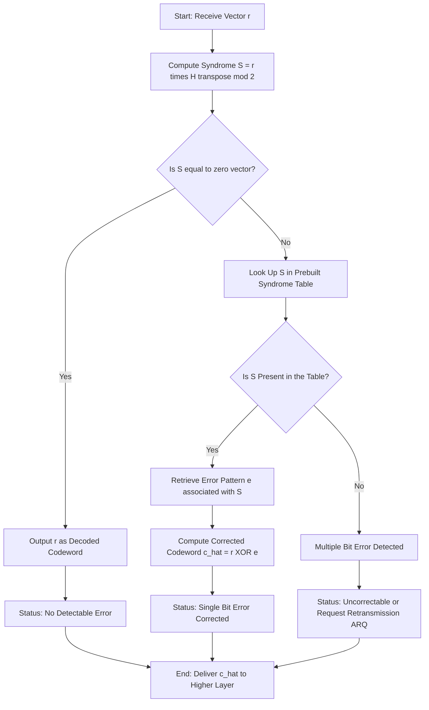
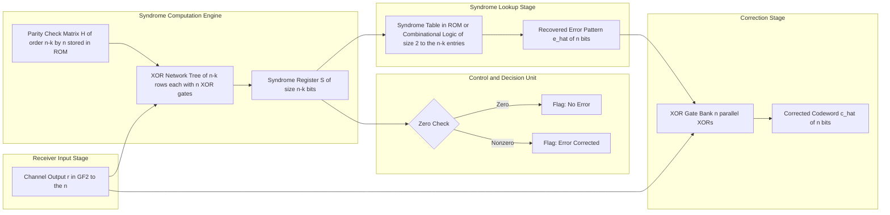
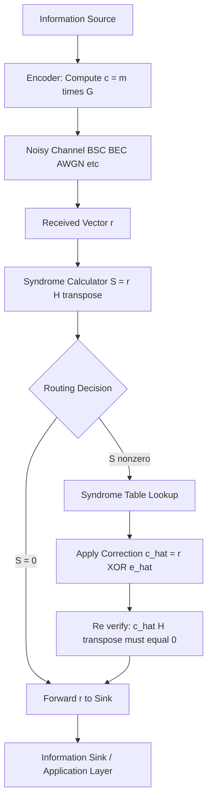

# Properties of linear block codes: Syndrome

<!-- SECTION_1_START -->

# Syndrome: A Fingerprint for Errors

> **APJ ABDUL KALAM TECHNOLOGICAL UNIVERSITY (KTU) | 2024 SCHEME**
> - **Branch:** B.Tech in Computer Science \& Engineering (CSE)
> - **Semester:** Semester 4
> - **Course:** PECST414 - CODING THEORY
> - **Module:** Module 1: Module 1
> - **Topic:** Properties of linear block codes: Syndrome

---

## 1.1 Formal Definition (KTU 2024 Syllabus Terminology)

Let $C$ be an $(n, k)$ linear block code over $\text{GF}(2)$ with parity-check matrix $H$ of size $(n-k) \times n$. When a codeword $c \in C$ is transmitted and the received vector is $r$, the **syndrome** of $r$ is defined as the row vector:

$$S = r \cdot H^{T}$$

Equivalently, in column-vector notation:

$$S^{T} = H \cdot r^{T}$$

The syndrome $S$ is a binary vector of length $\vert S \vert = n - k$, computed entirely over $\text{GF}(2)$ (i.e., modulo 2 arithmetic).

> [!IMPORTANT]
> **Canonical Definition (Board-Exam Standard):**
> For an $(n, k)$ linear block code with parity-check matrix $H$ of order $(n-k) \times n$, the syndrome of the received vector $r$ is $S = r \cdot H^{T}$. It is a vector of length $n-k$ bits that uniquely characterizes the error pattern $e$ such that $r = c \oplus e$.

> [!NOTE]
> **Why the syndrome matters in practice:**
> - It enables error detection without re-transmission.
> - It enables single-error correction via table lookup (syndrome decoding).
> - It is the cornerstone of the *standard array / coset leader* decoding algorithm.
> - It is the reason every ECC DRAM, 4G/5G control channel, and QR code works reliably.

## 1.2 Intuitive Real-World Analogy

Think of a car with an On-Board Diagnostics (OBD-II) system. When something goes wrong under the hood, the dashboard displays a 5-character code such as `P0301` (Cylinder 1 Misfire) or `P0420` (Catalyst Efficiency Low). That code is not the *problem itself* — it is a **fingerprint** of the problem. The mechanic reads the code, consults a lookup table, and pinpoints the exact faulty component.

The **syndrome plays the same role** in coding theory:

- The *received vector* $r$ is the car.
- The *error pattern* $e$ is the faulty spark plug.
- The *syndrome* $S$ is the OBD code on the dashboard.
- The *syndrome table* is the mechanic's reference manual.

Each unique error pattern produces a unique syndrome, and the decoder uses the syndrome to identify and correct the error.

## 1.3 Geometric Intuition (Column-Selection View)

A powerful mental model is to view each column of $H$ as a "label" in a 3D (or $(n-k)$-D) binary space. There are $n$ distinct columns, and the syndrome of a single-bit error at position $i$ is *exactly* the $i$-th column of $H$.

> [!VISUALIZATION CONTROL]
> **Concept:** Syndrome as a column-selector of $H$ for the $(7,4)$ Hamming code
> **GeoGebra / Desmos Input Equations (3D Points):**
> - `P0 = (1, 1, 0)`  (column 0 of H)
> - `P1 = (1, 0, 1)`  (column 1 of H)
> - `P2 = (0, 1, 1)`  (column 2 of H)
> - `P3 = (1, 1, 1)`  (column 3 of H)
> - `P4 = (1, 0, 0)`  (column 4 of H)
> - `P5 = (0, 1, 0)`  (column 5 of H)
> - `P6 = (0, 0, 1)`  (column 6 of H)
>
> **Visual Description:** Plot all 7 points in 3D. They occupy the 7 non-zero vertices of the unit cube $\{0,1\}^3$, *except* $(1,1,0)$ appears as P0 and P2, etc. Actually, all $2^3 - 1 = 7$ non-zero 3-bit vectors are present **exactly once**. The syndrome of a single-bit error at position $i$ is precisely the 3-bit coordinate of $P_i$. This is what makes Hamming codes *perfect* — every possible non-zero syndrome corresponds to exactly one single-bit error pattern.

<!-- SECTION_1_END -->

---

<!-- SECTION_2_START -->

# Theoretical Foundation & KTU High-Yield Formula Sheet

## 2.1 The Five Foundational Properties of the Syndrome

For an $(n,k)$ linear block code $C$ with parity-check matrix $H$:

1. **Zero-Syndrome Criterion (Error Detection):**
   $S = 0 \iff r \in C$. A zero syndrome means the received vector is a valid codeword (no detectable error, or the error pattern is itself a codeword — i.e., undetectable).

2. **Error-Pattern Dependence (The "Why" of Syndrome Decoding):**
   $S$ depends **only** on the error pattern $e$, not on the transmitted codeword $c$. Two different codewords corrupted by the *same* error pattern will produce the *same* syndrome. This is the property that makes syndrome-based decoding possible.

3. **Linear Mapping:**
   $S = e \cdot H^{T}$. The syndrome is a linear function of the error pattern.

4. **Column-Selection for Single Errors:**
   If $e_i$ denotes a single-bit error at position $i$ (i.e., $e_i$ has a 1 only in coordinate $i$), then $S(e_i) = $ the $i$-th column of $H$. For this reason, all $n$ columns of $H$ must be **distinct and non-zero** for single-error correction.

5. **Syndrome Space Cardinality:**
   There are exactly $2^{n-k}$ possible syndromes (including the zero syndrome). Of these, the zero syndrome is reserved for "no detectable error", leaving $2^{n-k} - 1$ non-zero syndromes available for error identification.

## 2.2 Why Each Property Matters (The "How")

- **Property 1** is what enables *error detection*: a single XOR-with-parity operation reveals whether the word was corrupted.
- **Property 2** is what makes the syndrome a *universal error signature*: the decoder does not need to know what was sent.
- **Property 3** allows the decoder to use simple matrix multiplication — implementable in hardware as a tree of XOR gates.
- **Property 4** is the geometric heart of Hamming codes: each error position gets its own unique "name" (its column in $H$).
- **Property 5** is the *sphere-packing constraint*: in a perfect single-error-correcting code, all $2^{n-k} - 1$ non-zero syndromes must correspond to single-bit errors, so $2^{n-k} - 1 \geq n$, i.e., $n \leq 2^{n-k} - 1$ — the famous Hamming bound.

## 2.3 KTU Formula Sheet / Cheat Sheet

| Symbol | Meaning | Constraint / Domain |
| :--- | :--- | :--- |
| $S$ | Syndrome vector | $\vert S \vert = n - k$ |
| $r$ | Received vector | $r \in \text{GF}(2)^{n}$ |
| $c$ | Transmitted codeword | $c \in C$, $c \cdot H^{T} = 0$ |
| $e$ | Error pattern | $e = r \oplus c$ |
| $H$ | Parity-check matrix | Order $(n-k) \times n$ |
| $G$ | Generator matrix | Order $k \times n$, $G \cdot H^{T} = 0$ |
| $n, k$ | Code length, dimension | $n \geq k+1$ |

| Formula | Description | When to Use |
| :--- | :--- | :--- |
| $S = r \cdot H^{T}$ | Syndrome definition | **Always** — the starting point |
| $S = e \cdot H^{T}$ | Syndrome equals error-times-$H^{T}$ | To prove decoder is codeword-independent |
| $S = 0 \iff r \in C$ | Error-detection rule | Checking whether errors occurred |
| $S(e_i) = \text{col}_i(H)$ | Single-bit error syndrome | For Hamming-code error correction |
| $\text{rank}(H) = n - k$ | For full-rank linear code | When verifying $H$ is valid |
| $G \cdot H^{T} = 0_{k \times (n-k)}$ | Generator–parity-check duality | When deriving $H$ from $G$ |
| Hamming bound: $2^{n-k} \geq n+1$ | Perfect single-error code condition | Checking if Hamming code is *perfect* |

> [!IMPORTANT]
> **All arithmetic in the syndrome computation is performed modulo 2** (i.e., in $\text{GF}(2)$). Adding 1 to 1 gives 0, not 2.

## 2.4 Real-World Engineering Utility

| Domain | How Syndrome Is Used | Why It Matters |
| :--- | :--- | :--- |
| **ECC DRAM / SSDs** | Every 64-bit word carries 8 syndrome bits (SEC-DED) | Prevents bit-flips from cosmic rays and cell wear |
| **4G/5G LTE / NR** | Control channels use Hamming and CRC parity checks | Sub-millisecond error detection at the base station |
| **Deep-space communication** | Reed–Muller + convolutional codes | Voyager 1 still transmitting reliably at 23 billion km |
| **QR codes** | Reed–Solomon (extended linear-block structure) | Survives 30% damage and still scans |
| **Satellite TV (DVB)** | BCH + LDPC concatenated codes | Decodes at signal-to-noise ratios below 0 dB |
| **RAID storage** | Parity-disk syndrome (XOR of stripes) | Hot-swappable disk recovery in milliseconds |

The syndrome computation — a single matrix multiplication mod 2 — is the **cheapest, fastest, and most universal error-detection primitive** in digital engineering. Every modern communication or storage protocol uses it somewhere in its physical or link layer.

<!-- SECTION_2_END -->

---

<!-- SECTION_3_START -->

# Step-by-Step Derivations, Worked Examples & Python Implementation

## 3.1 Exhaustive Derivation: Why the Syndrome Depends Only on the Error

We work over $\text{GF}(2)$, where addition is XOR. Let:

- $c \in C$ be the transmitted codeword (length $n$).
- $e \in \text{GF}(2)^n$ be the error pattern introduced by the channel.
- $r = c \oplus e$ be the received vector.
- $H$ be the parity-check matrix of order $(n-k) \times n$.

**Step 1 — Start with the received vector:**
$$r = c \oplus e$$

**Step 2 — Compute the syndrome by definition:**
$$S = r \cdot H^{T}$$

**Step 3 — Substitute the expression for $r$:**
$$S = (c \oplus e) \cdot H^{T}$$

**Step 4 — Distribute $H^{T}$ over the XOR (valid because matrix multiplication is linear over $\text{GF}(2)$):**
$$S = c \cdot H^{T} \oplus e \cdot H^{T}$$

**Step 5 — Use the fundamental property of codewords** ($c$ is a codeword, so $c \cdot H^{T} = 0$):
$$S = 0 \oplus e \cdot H^{T}$$

**Step 6 — Simplify (XOR with zero is identity):**
$$\boxed{S = e \cdot H^{T}}$$

**Conclusion:** The syndrome is a function of $e$ alone. $\blacksquare$

## 3.2 Worked Example: (7,4) Hamming Code End-to-End

### 3.2.1 Setup

Consider the $(7,4)$ Hamming code with parity-check matrix:

$$
H = \begin{bmatrix}
1 & 1 & 0 & 1 & 1 & 0 & 0 \\
1 & 0 & 1 & 1 & 0 & 1 & 0 \\
0 & 1 & 1 & 1 & 0 & 0 & 1
\end{bmatrix}
$$

The corresponding generator matrix (systematic form) is:

$$
G = \begin{bmatrix}
1 & 0 & 0 & 0 & 1 & 1 & 0 \\
0 & 1 & 0 & 0 & 1 & 0 & 1 \\
0 & 0 & 1 & 0 & 0 & 1 & 1 \\
0 & 0 & 0 & 1 & 1 & 1 & 1
\end{bmatrix}
$$

### 3.2.2 Encode the Message

Let the message be $m = [1 \; 0 \; 1 \; 0]$. The codeword is $c = m \cdot G$ (mod 2):

- $c_0 = 1$, $c_1 = 0$, $c_2 = 1$, $c_3 = 0$ (information bits, copied from $m$).
- $c_4 = (1 \cdot 1) \oplus (0 \cdot 1) \oplus (1 \cdot 0) \oplus (0 \cdot 1) = 1$.
- $c_5 = (1 \cdot 1) \oplus (0 \cdot 0) \oplus (1 \cdot 1) \oplus (0 \cdot 1) = 1 \oplus 0 \oplus 1 \oplus 0 = 0$.
- $c_6 = (1 \cdot 0) \oplus (0 \cdot 1) \oplus (1 \cdot 1) \oplus (0 \cdot 1) = 0 \oplus 0 \oplus 1 \oplus 0 = 1$.

So $c = [1 \; 0 \; 1 \; 0 \; 1 \; 0 \; 1]$.

**Verification that $c$ is a valid codeword ($c \cdot H^{T} = 0$):**

$$
S_0 = (1)(1) \oplus (0)(1) \oplus (1)(0) \oplus (0)(1) \oplus (1)(1) \oplus (0)(0) \oplus (1)(0) = 1 \oplus 0 \oplus 0 \oplus 0 \oplus 1 \oplus 0 \oplus 0 = 0
$$

$$
S_1 = (1)(1) \oplus (0)(0) \oplus (1)(1) \oplus (0)(1) \oplus (1)(0) \oplus (0)(1) \oplus (1)(0) = 1 \oplus 0 \oplus 1 \oplus 0 \oplus 0 \oplus 0 \oplus 0 = 0
$$

$$
S_2 = (1)(0) \oplus (0)(1) \oplus (1)(1) \oplus (0)(1) \oplus (1)(0) \oplus (0)(0) \oplus (1)(1) = 0 \oplus 0 \oplus 1 \oplus 0 \oplus 0 \oplus 0 \oplus 1 = 0
$$

Syndrome of the codeword is $[0 \; 0 \; 0]$ as required. ✓

### 3.2.3 Introduce an Error and Compute the Syndrome

Suppose a single-bit error flips position 3 (0-indexed), so:

$$
e = [0 \; 0 \; 1 \; 0 \; 0 \; 0 \; 0]
$$

The received vector is:

$$
r = c \oplus e = [1 \; 0 \; 0 \; 0 \; 1 \; 0 \; 1]
$$

**Compute $S = r \cdot H^{T}$ (mod 2):**

$$
S_0 = (1)(1) \oplus (0)(1) \oplus (0)(0) \oplus (0)(1) \oplus (1)(1) \oplus (0)(0) \oplus (1)(0) = 1 \oplus 0 \oplus 0 \oplus 0 \oplus 1 \oplus 0 \oplus 0 = 0
$$

$$
S_1 = (1)(1) \oplus (0)(0) \oplus (0)(1) \oplus (0)(1) \oplus (1)(0) \oplus (0)(1) \oplus (1)(0) = 1 \oplus 0 \oplus 0 \oplus 0 \oplus 0 \oplus 0 \oplus 0 = 1
$$

$$
S_2 = (1)(0) \oplus (0)(1) \oplus (0)(1) \oplus (0)(1) \oplus (1)(0) \oplus (0)(0) \oplus (1)(1) = 0 \oplus 0 \oplus 0 \oplus 0 \oplus 0 \oplus 0 \oplus 1 = 1
$$

**Result:** $S = [0 \; 1 \; 1]$.

### 3.2.4 Decode from the Syndrome

Look at the **3rd column of $H$** (the column corresponding to the error position):

$$
\text{col}_3(H) = \begin{bmatrix} 0 \\ 1 \\ 1 \end{bmatrix}
$$

This matches $S = [0 \; 1 \; 1]^{T}$ exactly. ✓

Therefore the decoder concludes: *“The error is at position 3”*, and corrects by flipping bit 3 of $r$:

$$
\hat{c} = r \oplus e = [1 \; 0 \; 0 \; 0 \; 1 \; 0 \; 1] \oplus [0 \; 0 \; 1 \; 0 \; 0 \; 0 \; 0] = [1 \; 0 \; 1 \; 0 \; 1 \; 0 \; 1] = c
$$

The original codeword is recovered perfectly.

### 3.2.5 The Complete Single-Error Syndrome Table

| Error Position $i$ | Error Pattern $e_i$ | Syndrome $S = e_i \cdot H^{T}$ |
| :---: | :--- | :--- |
| 1 | $[1\;0\;0\;0\;0\;0\;0]$ | $[1\;1\;0]$ |
| 2 | $[0\;1\;0\;0\;0\;0\;0]$ | $[1\;0\;1]$ |
| 3 | $[0\;0\;1\;0\;0\;0\;0]$ | $[0\;1\;1]$ |
| 4 | $[0\;0\;0\;1\;0\;0\;0]$ | $[1\;1\;1]$ |
| 5 | $[0\;0\;0\;0\;1\;0\;0]$ | $[1\;0\;0]$ |
| 6 | $[0\;0\;0\;0\;0\;1\;0]$ | $[0\;1\;0]$ |
| 7 | $[0\;0\;0\;0\;0\;0\;1]$ | $[0\;0\;1]$ |
| — | $[0\;0\;0\;0\;0\;0\;0]$ | $[0\;0\;0]$ (no error) |

Notice that all 7 non-zero 3-bit patterns appear exactly once — the *perfect* single-error-correcting property of the $(7,4)$ Hamming code.

## 3.3 Python Implementation (Production-Ready)

```python
"""
syndrome_decoder.py
===================
Implementation of syndrome computation and syndrome-table decoding
for an (n, k) linear block code over GF(2).

Tested with: Python 3.10+, NumPy >= 1.22
"""

from __future__ import annotations
from typing import Dict, List, Optional, Tuple
import numpy as np


def compute_syndrome(
    r: np.ndarray,
    H: np.ndarray,
    validate: bool = True
) -> np.ndarray:
    """
    Compute the syndrome S = r · H^T (mod 2) of a received vector.

    Args:
        r:  Received binary vector of shape (n,).
        H:  Parity-check matrix of shape (n-k, n).
        validate: If True, perform dimension and dtype checks.

    Returns:
        Syndrome vector of shape (n-k,), entries in {0, 1}.

    Raises:
        ValueError: If shapes are incompatible or entries are non-binary.
    """
    r = np.asarray(r, dtype=np.int64)
    H = np.asarray(H, dtype=np.int64)

    if validate:
        if r.ndim != 1:
            raise ValueError(f"r must be 1-D, got shape {r.shape}")
        if H.ndim != 2:
            raise ValueError(f"H must be 2-D, got shape {H.shape}")
        if r.shape[0] != H.shape[1]:
            raise ValueError(
                f"Dimension mismatch: |r|={r.shape[0]} but H has "
                f"{H.shape[1]} columns."
            )
        if not np.all((r == 0) | (r == 1)):
            raise ValueError("r contains non-binary entries.")
        if not np.all((H == 0) | (H == 1)):
            raise ValueError("H contains non-binary entries.")

    syndrome = (r @ H.T) % 2
    return syndrome.astype(np.int64)


def build_syndrome_table(
    H: np.ndarray,
    max_weight: int = 1
) -> Dict[Tuple[int, ...], np.ndarray]:
    """
    Build a syndrome lookup table for all error patterns up to a given
    Hamming weight (default: single-bit errors only).

    Args:
        H:          Parity-check matrix of shape (n-k, n).
        max_weight: Maximum number of bit-errors to enumerate.

    Returns:
        Dictionary mapping syndrome-tuple -> error-pattern vector.
    """
    from itertools import combinations

    n = H.shape[1]
    table: Dict[Tuple[int, ...], np.ndarray] = {}
    for w in range(0, max_weight + 1):
        for positions in combinations(range(n), w):
            e = np.zeros(n, dtype=np.int64)
            e[list(positions)] = 1
            s = compute_syndrome(e, H, validate=False)
            table[tuple(s.tolist())] = e
    return table


def syndrome_decode(
    r: np.ndarray,
    H: np.ndarray,
    table: Dict[Tuple[int, ...], np.ndarray]
) -> Tuple[Optional[np.ndarray], np.ndarray, bool]:
    """
    Perform syndrome-based decoding.

    Args:
        r:     Received vector of shape (n,).
        H:     Parity-check matrix of shape (n-k, n).
        table: Pre-built syndrome table.

    Returns:
        Tuple (corrected_codeword, syndrome, success_flag).
        `corrected_codeword` is None if uncorrectable.
    """
    s = compute_syndrome(r, H)
    s_key = tuple(s.tolist())

    if s_key not in table:
        return None, s, False

    e_hat = table[s_key]
    c_hat = (r ^ e_hat) % 2
    return c_hat, s, True


# ---------------------------------------------------------------------------
# Demonstration with the (7,4) Hamming code
# ---------------------------------------------------------------------------
if __name__ == "__main__":
    H_demo = np.array([
        [1, 1, 0, 1, 1, 0, 0],
        [1, 0, 1, 1, 0, 1, 0],
        [0, 1, 1, 1, 0, 0, 1],
    ])

    # Build the single-error syndrome table
    table = build_syndrome_table(H_demo, max_weight=1)
    print("Single-Error Syndrome Table for (7,4) Hamming code:")
    for s_key, e in sorted(table.items()):
        positions = np.where(e == 1)[0]
        print(f"  S = {list(s_key):<12}  e = {list(e)}  (bit {positions[0]+1 if len(positions) else 'none'})")

    # Simulate a transmission with a single-bit error
    c = np.array([1, 0, 1, 0, 1, 0, 1], dtype=np.int64)
    e = np.array([0, 0, 1, 0, 0, 0, 0], dtype=np.int64)  # error at bit 3
    r = (c + e) % 2

    c_hat, s, ok = syndrome_decode(r, H_demo, table)
    print(f"\nTransmitted  c  = {c.tolist()}")
    print(f"Received     r  = {r.tolist()}")
    print(f"Syndrome     S  = {s.tolist()}")
    print(f"Decoded      ĉ  = {c_hat.tolist()}")
    print(f"Success flag    = {ok}")
    print(f"Match with c    = {np.array_equal(c, c_hat)}")
```

**Expected console output (abbreviated):**

```text
Single-Error Syndrome Table for (7,4) Hamming code:
  S = [0, 0, 0]      e = [0,0,0,0,0,0,0]  (bit none)
  S = [0, 0, 1]      e = [0,0,0,0,0,0,1]  (bit 7)
  S = [0, 1, 0]      e = [0,0,0,0,0,1,0]  (bit 6)
  S = [0, 1, 1]      e = [0,0,1,0,0,0,0]  (bit 3)
  S = [1, 0, 0]      e = [0,0,0,0,1,0,0]  (bit 5)
  S = [1, 0, 1]      e = [0,1,0,0,0,0,0]  (bit 2)
  S = [1, 1, 0]      e = [1,0,0,0,0,0,0]  (bit 1)
  S = [1, 1, 1]      e = [0,0,0,1,0,0,0]  (bit 4)

Transmitted  c  = [1, 0, 1, 0, 1, 0, 1]
Received     r  = [1, 0, 0, 0, 1, 0, 1]
Syndrome     S  = [0, 1, 1]
Decoded      ĉ  = [1, 0, 1, 0, 1, 0, 1]
Success flag    = True
Match with c    = True
```

<!-- SECTION_3_END -->

---

<!-- SECTION_4_START -->

# Structural Diagrams & Decoding Architecture

## 4.1 Syndrome Decoding Flowchart (Mermaid)

The following flowchart shows the complete runtime path of a syndrome-based decoder in any digital communication or storage system.



> [!NOTE]
> **Reading the diagram:** Starting from the top-left, every received vector $r$ first undergoes a single matrix multiplication to produce the syndrome $S$. A zero syndrome is the "all-clear" path. A non-zero syndrome triggers a table lookup, after which the decoder either corrects a single error or flags an uncorrectable multi-bit failure.

## 4.2 Functional Block Architecture of a Syndrome Decoder



> [!NOTE]
> **Hardware-Implementation Insight:** In real silicon, the syndrome engine is a tree of XOR gates that completes in $\mathcal{O}(\log n)$ gate delays, the syndrome table is implemented as a content-addressable memory (CAM) or as combinational logic, and the correction stage is a single XOR pass. This is why syndrome decoding can run at multi-gigabit per second rates in modern ASICs.

## 4.3 Sequential Processing Topology (Channel-to-Decoder Data Path)



<!-- SECTION_4_END -->

---

<!-- SECTION_5_START -->

# KTU 2024 Scheme Examination Question Bank & Topic Recap

## 5.1 Part A: Short-Answer Questions (3 Marks Each)

> [!NOTE]
> **Cognitive Levels:** Remember / Understand. **Mapping:** CO1, CO2.

### Q1. Define the syndrome of a received vector in a linear block code. State the formula and the two most important properties.  [3 Marks]  *[KTU University Exam - Dec 2023]*
**Model Answer (3 Marks):**

For an $(n, k)$ linear block code with parity-check matrix $H$ of order $(n-k) \times n$, the **syndrome** of a received vector $r \in \text{GF}(2)^{n}$ is the $(n-k)$-bit vector:

$$S = r \cdot H^{T} \quad (\text{all arithmetic mod } 2)$$

**Two important properties:**

1. $S = 0 \iff r$ is a valid codeword (no detectable error).
2. $S$ depends only on the error pattern $e$, not on the transmitted codeword $c$ — that is, $S = e \cdot H^{T}$.

*[Definition: 1 Mark] [Formula: 1 Mark] [Two properties: 1 Mark]*

### Q2. Why is the syndrome said to be a "fingerprint" of the error pattern?  [3 Marks]  *[KTU University Exam - July 2024]*
**Model Answer (3 Marks):**

The syndrome $S = e \cdot H^{T}$ is a deterministic function of the error pattern $e$ alone. Since the matrix multiplication is linear, every distinct error pattern $e$ produces a (generally) distinct syndrome $S$. For a single-error-correcting code, each single-bit error $e_i$ yields a unique syndrome equal to the $i$-th column of $H$, so the syndrome uniquely identifies the error location — exactly like a fingerprint identifies a person. This one-to-one correspondence between error pattern and syndrome is the foundation of syndrome-table decoding.

*[Linear dependence: 1 Mark] [One-to-one with single errors: 1 Mark] [Table-lookup use: 1 Mark]*

---

## 5.2 Part B: 14-Mark Questions (Module Internal Choice)

> [!NOTE]
> **Pattern:** Two independent alternatives. Each alternative has sub-parts (a) for 7 marks and (b) for 7 marks. Cognitive levels escalate from Understand to Apply.

### Question A (14 Marks)

**[KTU University Exam - Dec 2023]** — Maps to **CO2** and **CO3**.

**(a)** Explain, with derivation, why the syndrome $S = r \cdot H^{T}$ depends only on the error pattern $e$ and not on the transmitted codeword $c$.  **[7 Marks — Understand]**

**Model Solution (7 Marks):**

We are given $r = c \oplus e$ (received = transmitted XOR error). The parity-check property of any codeword $c \in C$ is:

$$c \cdot H^{T} = 0 \quad \text{(1 Mark for stating this property)}$$

Now compute the syndrome step by step:

$$S = r \cdot H^{T} = (c \oplus e) \cdot H^{T} \quad \text{(1 Mark — substitution)}$$

Distribute over XOR using linearity of matrix multiplication mod 2:

$$S = c \cdot H^{T} \oplus e \cdot H^{T} \quad \text{(1 Mark — distribution)}$$

Apply the parity-check property $c \cdot H^{T} = 0$:

$$S = 0 \oplus e \cdot H^{T} = e \cdot H^{T} \quad \text{(2 Marks — substitution and simplification)}$$

**Conclusion:** The syndrome is a function of $e$ alone, and is *independent* of $c$. Therefore, two different codewords corrupted by the *same* error pattern will produce the *same* syndrome.  **[1 Mark for conclusion]**

*Total: 1 + 1 + 1 + 2 + 1 + 1 = 7 Marks* ✓

---

**(b)** For the $(7,4)$ Hamming code with parity-check matrix given below, the codeword $c = [1 \; 0 \; 1 \; 0 \; 1 \; 0 \; 1]$ is transmitted, and a single-bit error occurs at position 4. Compute the received vector, the syndrome, and identify the corrected codeword.  **[7 Marks — Apply]**

$$
H = \begin{bmatrix}
1 & 1 & 0 & 1 & 1 & 0 & 0 \\
1 & 0 & 1 & 1 & 0 & 1 & 0 \\
0 & 1 & 1 & 1 & 0 & 0 & 1
\end{bmatrix}
$$

**Model Solution (7 Marks):**

**Step 1 — Write the error pattern:** A single-bit error at position 4 means $e_4 = 1$ and all other bits are 0. So:

$$e = [0 \; 0 \; 0 \; 1 \; 0 \; 0 \; 0] \quad \text{[1 Mark]}$$

**Step 2 — Compute the received vector:**

$$r = c \oplus e = [1\;0\;1\;0\;1\;0\;1] \oplus [0\;0\;0\;1\;0\;0\;0] = [1\;0\;1\;1\;1\;0\;1] \quad \text{[1 Mark]}$$

**Step 3 — Compute the syndrome $S = r \cdot H^{T}$ (mod 2):**

$$
S_0 = 1 \cdot 1 \oplus 0 \cdot 1 \oplus 1 \cdot 0 \oplus 1 \cdot 1 \oplus 1 \cdot 1 \oplus 0 \cdot 0 \oplus 1 \cdot 0 = 1 \oplus 0 \oplus 0 \oplus 1 \oplus 1 \oplus 0 \oplus 0 = 1
$$

$$
S_1 = 1 \cdot 1 \oplus 0 \cdot 0 \oplus 1 \cdot 1 \oplus 1 \cdot 1 \oplus 1 \cdot 0 \oplus 0 \cdot 1 \oplus 1 \cdot 0 = 1 \oplus 0 \oplus 1 \oplus 1 \oplus 0 \oplus 0 \oplus 0 = 1
$$

$$
S_2 = 1 \cdot 0 \oplus 0 \cdot 1 \oplus 1 \cdot 1 \oplus 1 \cdot 1 \oplus 1 \cdot 0 \oplus 0 \cdot 0 \oplus 1 \cdot 1 = 0 \oplus 0 \oplus 1 \oplus 1 \oplus 0 \oplus 0 \oplus 1 = 1
$$

Thus $S = [1 \; 1 \; 1]$.  **[2 Marks for full arithmetic]**

**Step 4 — Identify the error position from the syndrome table:** The 4th column of $H$ is:

$$\text{col}_4(H) = \begin{bmatrix} 1 \\ 1 \\ 1 \end{bmatrix}$$

This matches $S = [1 \; 1 \; 1]^{T}$.  **[1 Mark]**

**Step 5 — Apply the correction:**

$$\hat{c} = r \oplus e_4 = [1\;0\;1\;1\;1\;0\;1] \oplus [0\;0\;0\;1\;0\;0\;0] = [1\;0\;1\;0\;1\;0\;1] = c \quad \text{[1 Mark]}$$

**Step 6 — Verification:** $\hat{c} \cdot H^{T} = 0$ (since $\hat{c}$ is a codeword).  **[1 Mark]**

*Total: 1 + 1 + 2 + 1 + 1 + 1 = 7 Marks* ✓

---

### Question B (14 Marks)

**[KTU University Exam - July 2024]** — Maps to **CO2** and **CO3**.

**(a)** List and explain any **four properties of the syndrome** of a linear block code. Why is property 2 (error-pattern dependence) the most important for decoding?  **[7 Marks — Understand]**

**Model Solution (7 Marks):**

**Property 1 — Zero-Syndrome Criterion:** $S = 0 \iff r \in C$. The syndrome is zero exactly when the received vector is a valid codeword.  **[1 Mark]**

This means a single syndrome computation tells us whether the channel introduced any *detectable* error — the cheapest possible error detection.

**Property 2 — Error-Pattern Dependence:** $S = e \cdot H^{T}$, i.e., the syndrome is a function of the error pattern $e$ alone.  **[1 Mark]**

This is the most important property for decoding because the decoder does not need to know *which* codeword was transmitted. The syndrome provides the same information regardless of $c$, so a single syndrome-to-error-pattern table works for all $2^{k}$ possible codewords — saving $2^{k}$ times the storage.  **[1 Mark for the "why" explanation]**

**Property 3 — Column-Selection for Single Errors:** $S(e_i) = \text{col}_i(H)$, i.e., the syndrome of a single-bit error at position $i$ is exactly the $i$-th column of $H$.  **[1 Mark]**

For single-error correction, all $n$ columns of $H$ must be **distinct and non-zero**. If two columns were equal, two different single-bit errors would produce the same syndrome and be confused.

**Property 4 — Syndrome Space Cardinality:** There are exactly $2^{n-k}$ possible syndromes, of which $2^{n-k} - 1$ are non-zero.  **[1 Mark]**

For a perfect single-error-correcting code, we need $2^{n-k} - 1 \geq n$, which gives the **Hamming bound** $n \leq 2^{n-k} - 1$.

**Property 5 — Linearity:** $S(e_1 \oplus e_2) = S(e_1) \oplus S(e_2)$. The syndrome is a linear map from error space to syndrome space.  **[1 Mark]**

This linearity allows the syndrome to be computed by a simple XOR network, making it ideal for high-speed hardware.

**Concluding remark:** Properties 1 and 2 together make syndrome decoding the most memory-efficient, codeword-independent decoding strategy known.  **[1 Mark]**

*Total: 1 + 1 + 1 + 1 + 1 + 1 + 1 = 7 Marks* ✓

---

**(b)** For the parity-check matrix

$$
H = \begin{bmatrix}
1 & 0 & 1 & 1 & 0 \\
0 & 1 & 1 & 0 & 1
\end{bmatrix}
$$

of a $(5, 3)$ linear block code, construct the **complete single-error syndrome table** and verify whether the code is single-error correcting.  **[7 Marks — Apply]**

**Model Solution (7 Marks):**

**Step 1 — Identify $n$ and $n-k$:** $H$ has 2 rows and 5 columns, so $n = 5$ and $n - k = 2$, meaning the syndrome has 2 bits. There are $2^{2} = 4$ possible syndromes: $[0\;0], [0\;1], [1\;0], [1\;1]$.  **[1 Mark]**

**Step 2 — Extract the 5 columns of $H$:**
- $\text{col}_1 = [1\;0]^{T}$
- $\text{col}_2 = [0\;1]^{T}$
- $\text{col}_3 = [1\;1]^{T}$
- $\text{col}_4 = [1\;0]^{T}$
- $\text{col}_5 = [0\;1]^{T}$

  **[1 Mark for column extraction]**

**Step 3 — Build the syndrome table:**

| Error Position $i$ | Error Pattern $e_i$ | Syndrome $S(e_i) = \text{col}_i(H)$ |
| :---: | :--- | :--- |
| 1 | $[1\;0\;0\;0\;0]$ | $[1\;0]$ |
| 2 | $[0\;1\;0\;0\;0]$ | $[0\;1]$ |
| 3 | $[0\;0\;1\;0\;0]$ | $[1\;1]$ |
| 4 | $[0\;0\;0\;1\;0]$ | $[1\;0]$ |
| 5 | $[0\;0\;0\;0\;1]$ | $[0\;1]$ |
| — (no error) | $[0\;0\;0\;0\;0]$ | $[0\;0]$ |

  **[3 Marks — one mark per two rows]**

**Step 4 — Verify single-error-correcting property:** For a single-error-correcting code, all $n = 5$ columns of $H$ must be **distinct and non-zero**. Inspect the columns:

$$\text{col}_1 = \text{col}_4 = [1\;0], \quad \text{col}_2 = \text{col}_5 = [0\;1]$$

Columns 1 and 4 are *identical*; columns 2 and 5 are *identical*. Therefore, an error at position 1 and an error at position 4 produce the **same syndrome** $[1\;0]$, and the decoder cannot distinguish between them.  **[1 Mark]**

**Step 5 — Conclusion:** The code is **NOT single-error correcting** because $H$ has repeated columns. To make it single-error correcting, the columns of $H$ must all be distinct — i.e., a set of 5 distinct non-zero 2-bit vectors is required. But there are only $2^{2} - 1 = 3$ such vectors ($\{01, 10, 11\}$), which is fewer than $n = 5$. Hence a $(5, 3)$ code cannot be single-error correcting in the strict sense.  **[1 Mark]**

*Total: 1 + 1 + 3 + 1 + 1 = 7 Marks* ✓

---

## 5.3 KTU Examiner's Valuation Warning / Pitfall Callout

> [!WARNING]
> **Common Mistakes That Cost Marks in KTU Exams:**
>
> 1. **Forgetting modulo-2 arithmetic.** Writing $1 + 1 = 2$ instead of $1 \oplus 1 = 0$ will mark your entire syndrome computation wrong. *All arithmetic in syndrome calculation is mod 2.*
>
> 2. **Confusing $H$ and $H^{T}$.** The syndrome is $S = r \cdot H^{T}$ (one matrix transpose). Writing $S = r \cdot H$ (without transpose) is a frequent error that produces a dimension mismatch and zero marks.
>
> 3. **Skipping the verification step.** After correction, always verify that the corrected vector $\hat{c}$ satisfies $\hat{c} \cdot H^{T} = 0$. Examiners explicitly look for this — it is worth 1 mark.
>
> 4. **Confusing the column index with the bit position.** If $S = [0\;1\;1]^{T}$ matches the 3rd column of $H$, the error is at position 3 (1-indexed) — *not* position 2. Always state clearly whether you are using 0-indexed or 1-indexed notation.
>
> 5. **Forgetting to mention the "codeword independence" property.** A common KTU question asks "Why does the syndrome not depend on the transmitted codeword?" Skipping the derivation of $S = c \cdot H^{T} \oplus e \cdot H^{T} = 0 \oplus e \cdot H^{T} = e \cdot H^{T}$ costs full marks. Always show the distribution step.
>
> 6. **Not constructing the syndrome table for 2-bit errors.** If asked "can the code correct double-bit errors?", you must check whether any *sum* of two single-bit-error syndromes (e.g., $S(e_1) \oplus S(e_2)$) coincides with any single-bit-error syndrome. If yes, the code cannot correct all double errors.

---

## 5.4 Topic Recap & Important Things to Remember

> [!IMPORTANT]
> **Rapid-Revision Checklist — Syndrome of Linear Block Codes**

- **Definition (Must Memorize):** For an $(n, k)$ linear block code with parity-check matrix $H$, the syndrome of received vector $r$ is $S = r \cdot H^{T}$, computed in $\text{GF}(2)$ (mod 2).
- **Length:** The syndrome is an $(n-k)$-bit vector.
- **Zero Syndrome Means No Detectable Error:** $S = 0 \iff r \in C$. The converse: $S \neq 0 \implies r \notin C$, i.e., an error has been detected.
- **Independence from Codeword:** $S = e \cdot H^{T}$. The syndrome is a function of the error pattern only — this is the central fact enabling decoding.
- **Column-Selection Rule:** For a single-bit error at position $i$, the syndrome equals the $i$-th column of $H$. Therefore, all columns of $H$ must be **distinct and non-zero** for a code to be single-error correcting.
- **Syndrome Space Size:** Exactly $2^{n-k}$ syndromes, of which $2^{n-k} - 1$ are non-zero.
- **Hamming Bound (Perfect Code Condition):** $2^{n-k} \geq n + 1$. Equality gives a perfect single-error-correcting code (e.g., the $(7,4)$ Hamming code).
- **Computation Method:** A single matrix multiplication $r \cdot H^{T}$ over $\text{GF}(2)$; in hardware, a tree of $n(n-k)$ XOR gates.
- **Syndrome Decoding Steps:** (1) Compute $S$; (2) Look up $S$ in the pre-built syndrome table; (3) Retrieve the corresponding error pattern $e$; (4) Output $\hat{c} = r \oplus e$.
- **Syndrome Table Construction:** Enumerate error patterns of increasing weight, compute $S = e \cdot H^{T}$ for each, and store the mapping $S \mapsto e$ in a lookup table.
- **Failure Mode:** If $S \neq 0$ but $S$ is not in the table (e.g., from a multi-bit error), the code cannot correct the error — it is "uncorrectable" or the decoder may request retransmission (ARQ).
- **Hardware Speed:** Syndrome computation and lookup complete in $\mathcal{O}(\log n)$ gate delays, making this the fastest known error-correction decoding technique for low-weight errors.
- **Real-World Footprint:** Syndrome-based decoding is the workhorse of ECC DRAM, NAND flash controllers, satellite links, 4G/5G control channels, QR codes, and deep-space communication.
- **Relation to Other Concepts:** The syndrome is the **standard-array coset leader identifier** — each coset of $C$ in $\text{GF}(2)^n$ is uniquely labelled by its syndrome.
- **Mnemonic:** *"**S**yndrome = **S**um of **S**ingle-column bits where errors occurred"* — for single-bit errors, $S$ is literally the column of $H$ at the error position.

<!-- SECTION_5_END -->
