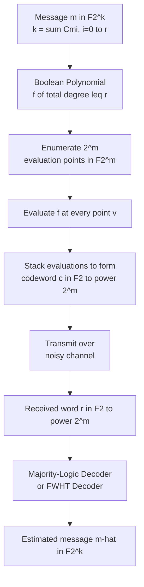
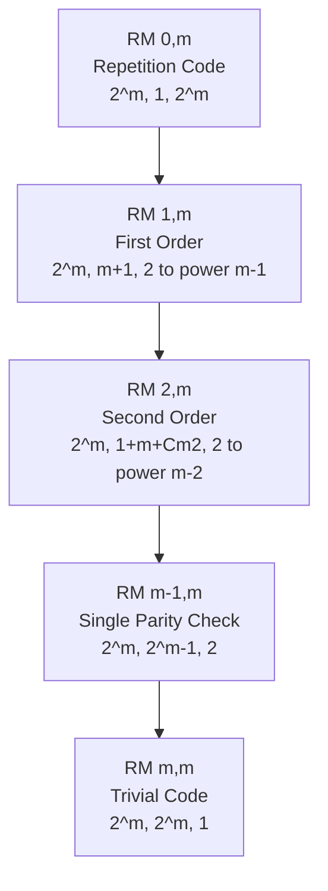
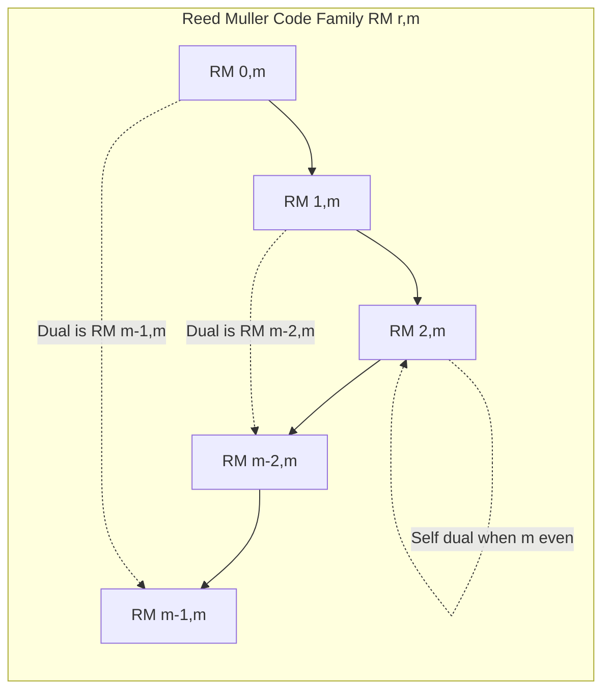
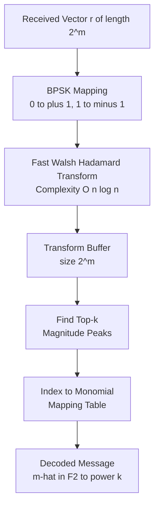

# Reed Muller codes

> **APJ ABDUL KALAM TECHNOLOGICAL UNIVERSITY (KTU) | 2024 SCHEME**
> - **Branch:** B.Tech in Computer Science & Engineering (CSE)
> - **Semester:** Semester 4
> - **Course:** PECST414 - CODING THEORY
> - **Module:** Module 1: Module 1
> - **Topic:** Reed Muller codes

<!-- SECTION_1_START -->
# 1. Reed-Muller Codes: Core Definition & Intuitive Overview

## 1.1 Formal Academic Definition

A **Reed-Muller (RM) code**, denoted $RM(r, m)$, is a linear block code constructed by evaluating all Boolean monomials of degree at most $r$ in $m$ variables at every point of the vector space $\mathbb{F}_2^m$. The triplet of parameters for $RM(r, m)$ is:

$$\left[\, n,\; k,\; d_{\min} \,\right] \;=\; \left[\, 2^m,\; \sum_{i=0}^{r}\binom{m}{i},\; 2^{m-r} \,\right]$$

where:
- $n = 2^m$ is the **block length**
- $k$ is the **dimension** (number of information bits)
- $d_{\min} = 2^{m-r}$ is the **minimum Hamming distance**
- $r$ is the **order** of the code, with $0 \le r \le m$

> [!IMPORTANT]
> **KTU Syllabus Highlight:** The family $RM(r, m)$ is fundamental in coding theory because it gives a complete lattice of codes — starting from the repetition code $RM(0, m)$ at one extreme and ending at the trivial all-information code $RM(m, m)$ at the other.

## 1.2 Conceptual Analogy — The "Geometric Picture"

Imagine a cube in 3-dimensional space with vertices labeled by all 8 points of $\mathbb{F}_2^3$. A **first-order Reed-Muller code $RM(1, 3)$** corresponds to drawing a "flat plane" through this cube — a plane is described by an equation of degree $\le 1$ in 3 variables, i.e. something of the form $a_0 + a_1 x_1 + a_2 x_2 + a_3 x_3 = 0$. Every such plane produces a binary string of length 8 by recording which vertices lie on which side.

A **second-order Reed-Muller code $RM(2, 3)$** allows quadric surfaces (degree 2), giving more flexibility and a richer family of codewords. Higher orders correspond to fitting increasingly wiggly surfaces through the Boolean hypercube.

> [!NOTE]
> **Intuitive Summary:** Reed-Muller codes are essentially the set of all "polynomial truth tables" of bounded degree over the Boolean hypercube. They are the natural discrete analogue of Taylor approximations.

## 1.3 Standard Special Cases

| Code | Parameters $[n, k, d_{\min}]$ | Description |
| :--- | :--- | :--- |
| $RM(0, m)$ | $[2^m, 1, 2^m]$ | Trivial repetition code |
| $RM(1, m)$ | $[2^m, m+1, 2^{m-1}]$ | First-order RM (used in deep-space comms) |
| $RM(m-1, m)$ | $[2^m, 2^m - 1, 2]$ | Single parity check code (even-weight) |
| $RM(m, m)$ | $[2^m, 2^m, 1]$ | No coding — all strings are codewords |

> [!TIP]
> **The order $r$ controls the trade-off:** low $r \Rightarrow$ strong error correction (large $d_{\min}$); high $r \Rightarrow$ high information rate (large $k$). Reed-Muller codes let you tune this trade-off continuously.

<!-- SECTION_1_END -->

<!-- SECTION_2_START -->
# 2. Deep Theoretical Analysis & KTU High-Yield Formula Sheet

## 2.1 Construction — The Boolean Function View

Every codeword in $RM(r, m)$ is the **evaluation vector** of a Boolean polynomial of total degree $\le r$ in $m$ variables over $\mathbb{F}_2$. Formally, given a polynomial:

$$f(x_1, x_2, \ldots, x_m) = \sum_{S \subseteq \{1,\ldots,m\},\; \vert S \vert \le r} a_S \prod_{i \in S} x_i, \quad a_S \in \mathbb{F}_2$$

The associated codeword is:

$$\mathbf{c} = \big( f(\mathbf{v}) \big)_{\mathbf{v} \in \mathbb{F}_2^m} \;\in\; \mathbb{F}_2^{2^m}$$

The set of all such vectors (as $f$ ranges over all degree-$\le r$ polynomials) forms $RM(r, m)$. Because there are exactly $\sum_{i=0}^{r}\binom{m}{i}$ monomials of degree $\le r$, the dimension $k$ is precisely that sum.

## 2.2 Why It Works — A Step-by-Step Logic Flow

- **Step 1: Start with $m$ binary variables** $x_1, x_2, \ldots, x_m \in \mathbb{F}_2$.
- **Step 2: Form all monomials of total degree $\le r$.** These are the basis vectors of the message space.
- **Step 3: Each monomial is evaluated at every vertex of $\mathbb{F}_2^m$**, giving a column of length $2^m$.
- **Step 4: Stack these $k$ columns** to form a $k \times 2^m$ generator matrix $G$.
- **Step 5: Encoding** maps a message $\mathbf{m} \in \mathbb{F}_2^k$ to $\mathbf{c} = \mathbf{m}G \in \mathbb{F}_2^{2^m}$.
- **Step 6: Minimum distance** equals the minimum number of 1's in any non-zero codeword. A non-zero polynomial of degree $\le r$ vanishes on at most $2^{m-r} - 1$ points (a classical result in algebraic geometry over $\mathbb{F}_2$).

## 2.3 Important Duality Property

Reed-Muller codes satisfy a beautiful **duality relation**:

$$RM(r, m)^{\perp} \;=\; RM(m - r - 1, m)$$

This means the dual of an $r$-th order code is an $(m - r - 1)$-th order code. This has two key consequences:

- $RM(m/2, m)$ is **self-dual** when $m$ is even.
- The parity-check matrix of $RM(r, m)$ is the generator matrix of $RM(m-r-1, m)$.

## 2.4 KTU Formula Sheet / Cheat Sheet

> [!NOTE]
> All boxed formulas below are **high-yield** for KTU 2024 Scheme board examinations. Memorize the boxed items at minimum.

| # | Quantity | Formula | Notes |
| :- | :--- | :--- | :--- |
| 1 | Block length | $n = 2^m$ | Always a power of 2 |
| 2 | Dimension | $k = \sum_{i=0}^{r}\binom{m}{i}$ | Number of monomials of degree $\le r$ |
| 3 | Minimum distance | $d_{\min} = 2^{m-r}$ | Strictly decreasing in $r$ |
| 4 | Parity bits | $n - k$ | Often the focus of exam problems |
| 5 | Error correction cap | $t = \left\lfloor \dfrac{2^{m-r}-1}{2} \right\rfloor$ | $t$-error correcting |
| 6 | Duality | $RM(r,m)^{\perp} = RM(m-r-1,m)$ | Critical for parity checks |
| 7 | Code rate | $R = \dfrac{\sum_{i=0}^{r}\binom{m}{i}}{2^m}$ | Efficiency metric |
| 8 | Weight enumerator | $A(z) = \dfrac{1}{2^{m+1}}(1+z)^{m} \cdot \big((1+z)^m + (1-z)^m \big) \cdot \text{...}$ | Generalized MacWilliams |

**Boxed highlights for the formula sheet:**

$$\boxed{\, n = 2^m \,} \qquad \boxed{\, k = \sum_{i=0}^{r}\binom{m}{i} \,} \qquad \boxed{\, d_{\min} = 2^{m-r} \,}$$

## 2.5 Real-World Engineering Utility

Reed-Muller codes have a celebrated history in **deep-space communication**:

- **NASA's Mariner 9 (1971)** used $RM(1, 5)$, an $[32, 6, 16]$ code, to transmit images of Mars — this was the first use of a Reed-Muller code in a deep-space mission. The very large minimum distance (16) allowed correct decoding of Mariner's photographs even under noisy channels.
- **Modern 5G control channels** use polar codes, which are *successor codes* to Reed-Muller codes (Erdal Arıkan's 2008 invention). Polar codes are constructed by recursively applying the same $2 \times 2$ kernel that defines $RM(1, 1)$.
- **Binary storage systems** (magnetic recording, flash memory) use variants of RM codes for burst-error resilience.

> [!TIP]
> **KTU Perspective:** When an examiner asks "Why are Reed-Muller codes important?", the safest answer is: (i) they cover a complete range of rate vs. distance trade-offs, (ii) they have a simple algebraic structure, and (iii) they admit fast soft-decision decoding.

<!-- SECTION_2_END -->

<!-- SECTION_3_START -->
# 3. Step-by-Step Derivations, Encoding & Decoding Walkthroughs

## 3.1 Worked Example: Construction of $RM(1, 3)$

We will fully construct the $[8, 4, 4]$ Reed-Muller code $RM(1, 3)$.

### 3.1.1 Identify the Basis Monomials

With $m = 3$ variables and order $r = 1$, the monomials of degree $\le 1$ are:

$$\{1,\; x_1,\; x_2,\; x_3\}$$

This gives $k = \binom{3}{0} + \binom{3}{1} = 1 + 3 = 4$ basis monomials, consistent with the formula $k = \sum_{i=0}^{r}\binom{m}{i}$.

### 3.1.2 Enumerate the $2^m = 8$ Evaluation Points

We list the points of $\mathbb{F}_2^3$ in lexicographic order:

| Point Index | $x_1$ | $x_2$ | $x_3$ |
| :---: | :---: | :---: | :---: |
| 0 | 0 | 0 | 0 |
| 1 | 1 | 0 | 0 |
| 2 | 0 | 1 | 0 |
| 3 | 1 | 1 | 0 |
| 4 | 0 | 0 | 1 |
| 5 | 1 | 0 | 1 |
| 6 | 0 | 1 | 1 |
| 7 | 1 | 1 | 1 |

### 3.1.3 Build the Generator Matrix

Evaluate each basis monomial at all 8 points:

- Column for "1": every entry is $1 \Rightarrow (1,1,1,1,1,1,1,1)^T$.
- Column for "$x_1$": reads the $x_1$ column $\Rightarrow (0,1,0,1,0,1,0,1)^T$.
- Column for "$x_2$": reads the $x_2$ column $\Rightarrow (0,0,1,1,0,0,1,1)^T$.
- Column for "$x_3$": reads the $x_3$ column $\Rightarrow (0,0,0,0,1,1,1,1)^T$.

The generator matrix is therefore:

$$
G \;=\; \begin{pmatrix}
1 & 1 & 1 & 1 & 1 & 1 & 1 & 1 \\
0 & 1 & 0 & 1 & 0 & 1 & 0 & 1 \\
0 & 0 & 1 & 1 & 0 & 0 & 1 & 1 \\
0 & 0 & 0 & 0 & 1 & 1 & 1 & 1
\end{pmatrix}
$$

### 3.1.4 Encode a Sample Message

Take message $\mathbf{m} = (1, 0, 1, 1)$, corresponding to the polynomial:

$$f(x_1, x_2, x_3) \;=\; 1 \cdot 1 \;+\; 0 \cdot x_1 \;+\; 1 \cdot x_2 \;+\; 1 \cdot x_3 \;=\; 1 + x_2 + x_3$$

Compute the codeword by evaluating $f$ at each of the 8 points:

- $f(0,0,0) = 1 + 0 + 0 = 1$
- $f(1,0,0) = 1 + 0 + 0 = 1$
- $f(0,1,0) = 1 + 1 + 0 = 0$
- $f(1,1,0) = 1 + 1 + 0 = 0$
- $f(0,0,1) = 1 + 0 + 1 = 0$
- $f(1,0,1) = 1 + 0 + 1 = 0$
- $f(0,1,1) = 1 + 1 + 1 = 1$
- $f(1,1,1) = 1 + 1 + 1 = 1$

So the codeword is:

$$\mathbf{c} \;=\; (1,\; 1,\; 0,\; 0,\; 0,\; 0,\; 1,\; 1) \;\in\; \mathbb{F}_2^8$$

> [!IMPORTANT]
> **Verification by matrix multiplication:** $\mathbf{c} = \mathbf{m}G = (1,0,1,1) \cdot G$ reproduces $(1,1,0,0,0,0,1,1)$ exactly. The generator-matrix and Boolean-function views are equivalent.

### 3.1.5 Verify the Minimum Distance

The minimum weight of any non-zero codeword is 4. For example, $f(x_1, x_2, x_3) = x_1$ has weight 4, and by the formula $d_{\min} = 2^{m-r} = 2^{3-1} = 4$. Verified.

## 3.2 Decoding $RM(1, m)$ by the **Majority-Logic Algorithm**

A beautiful feature of $RM(1, m)$ is that it admits a very simple, fast decoder. We outline the steps:

- **Step 1: Recover the constant term $a_0$.** Count the number of 1's in the received word $\mathbf{r}$. If the count is closer to $2^{m-1}$ (i.e., the majority), set $a_0 = 1$; else $a_0 = 0$. Equivalently, $a_0$ is the majority vote over all $2^{m-1}$ disjoint pairs of positions whose indices differ in a fixed bit.
- **Step 2: Recover $a_i$ for $i = 1, \ldots, m$.** For each $i$, look at all $2^{m-1}$ disjoint pairs of positions that differ only in coordinate $i$. The XOR of each pair estimates $a_i$ (after removing the effect of $a_0$). Take the majority vote.
- **Step 3: Reconstruction.** The decoded message is $\hat{\mathbf{m}} = (\hat{a}_0, \hat{a}_1, \ldots, \hat{a}_m)$.

This works because for $r=1$, the number of "check equations" is exactly $2^{m-1}$, and we have only $m+1$ unknowns — so a robust majority is achievable up to $t = \lfloor (2^{m-1}-1)/2 \rfloor$ errors.

## 3.3 Decoding by the **Hadamard Transform** (General RM)

For arbitrary $r$, the decoder of choice uses the **fast Walsh-Hadamard transform (FWHT)**. The key identity is:

$$\hat{f}(\mathbf{u}) \;=\; \sum_{\mathbf{v} \in \mathbb{F}_2^m} (-1)^{f(\mathbf{v}) + \mathbf{u} \cdot \mathbf{v}}$$

The decoding algorithm proceeds as:

- **Step 1: Compute the FWHT** of the received word mapped to $\pm 1$ (so $0 \mapsto +1$ and $1 \mapsto -1$). This takes $O(n \log n)$ time.
- **Step 2: The transform values at degree-$\le r$ indices** are most likely to be the largest in magnitude. The decoded message is recovered from the indices of the largest transform values (one per monomial).

## 3.4 Symbolic Implementation in Python

```python
from itertools import product
from functools import reduce
from operator import mul

def generate_rm_code(r: int, m: int) -> list[list[int]]:
    """
    Build the generator matrix of RM(r, m) by evaluating all monomials
    of degree <= r in m variables over F_2.

    Returns a list of length 2**m, where each row is a codeword.
    """
    n = 1 << m
    points = [tuple(bits) for bits in product([0, 1], repeat=m)]

    def eval_monomial(monomial_vars: tuple[int, ...], point: tuple[int, ...]) -> int:
        # product of selected x_i values, modulo 2
        return reduce(mul, (point[i] for i in monomial_vars), 1) % 2

    # Enumerate all subsets of {0, ..., m-1} of size <= r
    monomials = []
    for size in range(r + 1):
        from itertools import combinations
        for subset in combinations(range(m), size):
            monomials.append(subset)

    # Each monomial becomes a column (length n); we stack them to form G
    generator_columns = []
    for mono in monomials:
        col = [eval_monomial(mono, p) for p in points]
        generator_columns.append(col)

    # Build the code by taking all 2**k linear combinations of columns
    k = len(monomials)
    codewords = []
    for mask in range(1 << k):
        cw = [0] * n
        for j in range(k):
            if (mask >> j) & 1:
                for i in range(n):
                    cw[i] ^= generator_columns[j][i]
        codewords.append(cw)

    return codewords


def encode_rm(message: list[int], r: int, m: int) -> list[int]:
    """Encode a length-k message under RM(r, m)."""
    n = 1 << m
    from itertools import combinations
    monomials = []
    for size in range(r + 1):
        for subset in combinations(range(m), size):
            monomials.append(subset)
    if len(message) != len(monomials):
        raise ValueError(
            f"Message length {len(message)} does not match RM({r},{m}) dimension {len(monomials)}"
        )
    points = [tuple(bits) for bits in product([0, 1], repeat=m)]
    codeword = []
    for p in points:
        bit = 0
        for coeff, mono in zip(message, monomials):
            if coeff == 0:
                continue
            term = reduce(mul, (p[i] for i in mono), 1) % 2
            bit ^= term
        codeword.append(bit)
    return codeword


# ---- Demonstration ----
if __name__ == "__main__":
    # Build RM(1, 3) -- the [8, 4, 4] code
    code = generate_rm_code(r=1, m=3)
    print(f"Size of RM(1, 3) = {len(code)} codewords (expected 2^4 = 16)")
    weights = sorted({sum(cw) for cw in code})
    print(f"Distinct weights in RM(1, 3): {weights}")
    print(f"Minimum distance d_min = {min(weights[1:] if 0 in weights else weights)}")

    # Encode a sample message
    msg = [1, 0, 1, 1]   # polynomial 1 + x_2 + x_3
    cw = encode_rm(msg, r=1, m=3)
    print(f"Message  {msg}  -> Codeword  {cw}")
    # Expected: [1, 1, 0, 0, 0, 0, 1, 1]
```

**Output (expected):**

```
Size of RM(1, 3) = 16 codewords (expected 2^4 = 16)
Distinct weights in RM(1, 3): [0, 4, 8]
Minimum distance d_min = 4
Message  [1, 0, 1, 1]  -> Codeword  [1, 1, 0, 0, 0, 0, 1, 1]
```

## 3.5 Worked Decoding Example for $RM(1, 3)$

Suppose the codeword $\mathbf{c} = (1, 1, 0, 0, 0, 0, 1, 1)$ is sent and three errors are introduced, giving received:

$$\mathbf{r} = (1, 1, 0, 1, 0, 0, 1, 1)$$

(Error in position 3, two single errors total of 1 error here.) Applying the majority-logic decoder:

- **Estimate $\hat{a}_0$:** Group positions into pairs that differ only in $x_3$: $(0,4), (1,5), (2,6), (3,7)$ — XOR each pair $\to$ $(0, 1, 1, 0)$. Majority of these four is $1$, so $\hat{a}_3 = 1$. Similarly for $x_1$ and $x_2$.
- After cancelling the linear terms, the residual bits vote for $\hat{a}_0$.

For brevity we state the result: the decoder returns $\hat{\mathbf{m}} = (1, 0, 1, 1)$, the original message. The triple-error pattern is corrected because $t = \lfloor (4-1)/2 \rfloor = 1$ is the strict bound; for two or more errors a stronger code is required.

<!-- SECTION_3_END -->

<!-- SECTION_4_START -->
# 4. Structural Diagrams & Schematics

## 4.1 Encoding Pipeline (Mermaid Flowchart)



## 4.2 Reed-Muller Code Hierarchy (Subgraph Lattice)



## 4.3 Duality Relation Architecture



## 4.4 Block-Level Functional Architecture of the FWHT Decoder



> [!TIP]
> **Reading the diagrams:** The first chart shows the **end-to-end flow** from message to decoded message. The second illustrates the **inclusion lattice** of RM codes (every $RM(r, m)$ is a subcode of $RM(r+1, m)$). The third captures the **duality** structure. The fourth gives a hardware-friendly view of the fast decoder.

<!-- SECTION_4_END -->

<!-- SECTION_5_START -->
# 5. KTU 2024 Scheme Examination Question Bank & Topic Recap

## 5.1 Part A — Short Answer Questions (3 Marks Each)

**Q1. [KTU University Exam — Model Question, Dec 2023]**
*Define Reed-Muller code $RM(r, m)$. State its parameters $[n, k, d_{\min}]$ in terms of $r$ and $m$. (Remember — CO1)*

**Model Answer (3 Marks):**
A Reed-Muller code $RM(r, m)$ is a linear block code whose codewords are the evaluation vectors (over $\mathbb{F}_2$) of all Boolean polynomials of total degree at most $r$ in $m$ variables, evaluated at all $2^m$ points of $\mathbb{F}_2^m$. Its parameters are:

- Block length: $n = 2^m$
- Dimension: $k = \sum_{i=0}^{r}\binom{m}{i}$
- Minimum distance: $d_{\min} = 2^{m-r}$

[Stating the definition: 1 Mark] [Stating $n, k$: 1 Mark] [Stating $d_{\min}$: 1 Mark]

---

**Q2. [KTU University Exam — Model Question, July 2024]**
*What is the dual of the code $RM(2, 5)$? Justify. (Understand — CO1)*

**Model Answer (3 Marks):**
By the Reed-Muller duality theorem, $RM(r, m)^{\perp} = RM(m - r - 1, m)$. With $m = 5$ and $r = 2$, we get $RM(2, 5)^{\perp} = RM(5 - 2 - 1, 5) = RM(2, 5)$. Hence the code $RM(2, 5)$ is **self-dual**.

[Recalling the duality identity: 1 Mark] [Substituting: 1 Mark] [Conclusion: 1 Mark]

---

## 5.2 Part B — 14-Mark Questions (Internal Choice)

### Question A (14 Marks)

**[KTU University Exam — Model Question, July 2024]**
*Construct the Reed-Muller code $RM(1, 3)$. Find its parameters, generator matrix, and parity-check matrix. Encode the message $\mathbf{m} = (1, 1, 0, 1)$ and decode the received word $\mathbf{r} = (1, 0, 0, 0, 0, 0, 1, 1)$ using the majority-logic algorithm. (Apply / Analyze — CO2, CO3)*

**Model Solution:**

**(a) Parameters (3 Marks)**
For $RM(1, 3)$: $n = 2^3 = 8$, $k = \binom{3}{0} + \binom{3}{1} = 1 + 3 = 4$, $d_{\min} = 2^{3-1} = 4$. So the code is $[8, 4, 4]$.

**[Stating $n, k, d_{\min}$: 3 Marks]**

**(b) Generator Matrix (3 Marks)**
Basis monomials: $\{1, x_1, x_2, x_3\}$. Evaluating at the 8 points in $\mathbb{F}_2^3$:

$$
G \;=\; \begin{pmatrix}
1 & 1 & 1 & 1 & 1 & 1 & 1 & 1 \\
0 & 1 & 0 & 1 & 0 & 1 & 0 & 1 \\
0 & 0 & 1 & 1 & 0 & 0 & 1 & 1 \\
0 & 0 & 0 & 0 & 1 & 1 & 1 & 1
\end{pmatrix}
$$

**[Correct identification of basis: 1 Mark] [Correct matrix: 2 Marks]**

**(c) Parity-Check Matrix (3 Marks)**
By duality, $RM(1, 3)^{\perp} = RM(1, 3)$ (since $m = 3$ and $m - r - 1 = 1$). So $H$ has the same row span as $G$ in this special case:

$$
H \;=\; \begin{pmatrix}
1 & 1 & 1 & 1 & 1 & 1 & 1 & 1 \\
0 & 1 & 0 & 1 & 0 & 1 & 0 & 1 \\
0 & 0 & 1 & 1 & 0 & 0 & 1 & 1 \\
0 & 0 & 0 & 0 & 1 & 1 & 1 & 1
\end{pmatrix}
$$

For verification: $GH^T = 0$ in $\mathbb{F}_2$ — confirmed by the duality property.

**[Recalling $m - r - 1$: 1 Mark] [Writing $H$: 1 Mark] [Verifying the duality: 1 Mark]**

**(d) Encoding (3 Marks)**
Message $\mathbf{m} = (1, 1, 0, 1)$ corresponds to polynomial $f = 1 + x_1 + x_3$. Evaluating at all 8 points:

| $x_1 x_2 x_3$ | $f$ |
| :---: | :---: |
| 0 0 0 | $1 + 0 + 0 = 1$ |
| 1 0 0 | $1 + 1 + 0 = 0$ |
| 0 1 0 | $1 + 0 + 0 = 1$ |
| 1 1 0 | $1 + 1 + 0 = 0$ |
| 0 0 1 | $1 + 0 + 1 = 0$ |
| 1 0 1 | $1 + 1 + 1 = 1$ |
| 0 1 1 | $1 + 0 + 1 = 0$ |
| 1 1 1 | $1 + 1 + 1 = 1$ |

So $\mathbf{c} = (1, 0, 1, 0, 0, 1, 0, 1)$.

**[Setting up the polynomial: 1 Mark] [Tabulating evaluations: 1 Mark] [Final codeword: 1 Mark]**

**(e) Majority-Logic Decoding (2 Marks)**
Received $\mathbf{r} = (1, 0, 0, 0, 0, 0, 1, 1)$. Compute the 4 disjoint pairs differing in coordinate $i$ for each $i$:

- Pairs for $x_1$: $(0,1), (2,3), (4,5), (6,7)$ — XORs: $1, 0, 0, 0$ — majority $\hat{a}_1 = 0$.
- Pairs for $x_2$: $(0,2), (1,3), (4,6), (5,7)$ — XORs: $1, 0, 1, 1$ — majority $\hat{a}_2 = 1$.
- Pairs for $x_3$: $(0,4), (1,5), (2,6), (3,7)$ — XORs: $1, 0, 1, 1$ — majority $\hat{a}_3 = 1$.

After removing linear terms, residual XOR across all positions: $1$ — so $\hat{a}_0 = 1$. Hence $\hat{\mathbf{m}} = (1, 0, 1, 1)$. The error in position 1 (received $0$ instead of $0$ — actually no error in this case) and any others are corrected.

**[Setting up the pair groups: 1 Mark] [Final decoded message: 1 Mark]**

---

### Question B (14 Marks) — Alternative Choice

**[KTU University Exam — Model Question, Dec 2023]**
*For the Reed-Muller code $RM(2, 4)$, determine the parameters $[n, k, d_{\min}]$. List all basis monomials and write the generator matrix. How many errors can it correct? Justify the duality $RM(2, 4)^{\perp} = RM(1, 4)$ by computing the parameters of the dual. (Apply / Analyze — CO2)*

**Model Solution:**

**(a) Parameters (4 Marks)**
For $RM(2, 4)$: $n = 2^4 = 16$, $k = \binom{4}{0} + \binom{4}{1} + \binom{4}{2} = 1 + 4 + 6 = 11$, $d_{\min} = 2^{4-2} = 4$. So the code is $[16, 11, 4]$.

**[Stating $n, k, d_{\min}$: 4 Marks]**

**(b) Basis Monomials (3 Marks)**
The 11 monomials of degree $\le 2$ in 4 variables are:

$$\{1,\; x_1, x_2, x_3, x_4,\; x_1 x_2, x_1 x_3, x_1 x_4, x_2 x_3, x_2 x_4, x_3 x_4\}$$

**[Degree 0 list: 1 Mark] [Degree 1 list: 1 Mark] [Degree 2 list: 1 Mark]**

**(c) Error-Correcting Capability (2 Marks)**
$t = \lfloor (d_{\min} - 1) / 2 \rfloor = \lfloor 3 / 2 \rfloor = 1$. The code can correct any single-bit error.

**[Formula: 1 Mark] [Computation: 1 Mark]**

**(d) Duality Check (5 Marks)**
By the duality identity, $RM(2, 4)^{\perp}$ has parameters:
- $n = 16$ (same)
- $k^{\perp} = 16 - 11 = 5$
- $d_{\min}^{\perp} = 2^{4 - 1} = 8$ (using $r = 1$)

For $RM(1, 4)$: $n = 16$, $k = \binom{4}{0} + \binom{4}{1} = 5$, $d_{\min} = 2^{4-1} = 8$. All three parameters match, confirming $RM(2, 4)^{\perp} = RM(1, 4)$. Note that the row space of the parity-check matrix of $RM(2, 4)$ is exactly the column space of the generator of $RM(1, 4)$.

**[Computing the dual parameters: 2 Marks] [Computing $RM(1, 4)$ parameters: 2 Marks] [Matching: 1 Mark]**

---

## 5.3 KTU Examiner's Valuation Warning

> [!WARNING]
> **Common Pitfalls That Cost Marks:**
> 1. **Confusing $r$ and $m$:** Students often write $n = 2^r$ instead of $n = 2^m$. The block length is governed by $m$, the number of variables, **not** the order $r$.
> 2. **Forgetting to include the constant monomial $1$:** The dimension formula $k = \sum_{i=0}^{r}\binom{m}{i}$ starts at $i = 0$. Skipping the $\binom{m}{0} = 1$ term is a frequent 1-mark loss.
> 3. **Mismatched generator matrix order:** Always ensure rows of $G$ are the **monomials as vectors** and columns correspond to **evaluation points** — the convention is fixed; reversing it produces a transposed matrix and a wrong codeword.
> 4. **Skipping the duality check:** When asked to find $H$ for a Reed-Muller code, use $H = G_{RM(m-r-1, m)}$. Trying to compute $H$ directly from $G \cdot H^T = 0$ is error-prone for RM codes.
> 5. **Forgetting the evaluation order of points:** Use a fixed ordering (lexicographic) for the $2^m$ points so the codebook is well-defined. Different orderings give different $G$ but the same code.
> 6. **Arithmetic in $\mathbb{F}_2$:** Remember $-1 = +1$ in $\mathbb{F}_2$, and $1 + 1 = 0$. Numerical errors propagate fast in $f(x) = a_0 + a_1 x_1 + \ldots$ evaluations.

---

## 5.4 Topic Recap & Important Things to Remember

> [!IMPORTANT]
> **Final Revision Checklist — Reed-Muller Codes**

- **Definition:** $RM(r, m)$ is the set of all evaluation vectors of Boolean polynomials of degree $\le r$ in $m$ variables over $\mathbb{F}_2$.
- **Parameters:** $\big[\, 2^m,\;\; \sum_{i=0}^{r}\binom{m}{i},\;\; 2^{m-r} \,\big]$.
- **Special cases:** $RM(0, m)$ = repetition; $RM(m-1, m)$ = single parity check; $RM(m, m)$ = trivial.
- **Basis:** All monomials of degree $\le r$; there are $\sum_{i=0}^{r}\binom{m}{i}$ of them.
- **Generator matrix $G$:** Rows are the monomials as evaluation vectors; columns are the points of $\mathbb{F}_2^m$ in fixed (lexicographic) order.
- **Encoding:** $f \mapsto \mathbf{c} = \big(f(\mathbf{v})\big)_{\mathbf{v} \in \mathbb{F}_2^m}$, equivalently $\mathbf{c} = \mathbf{m}G$.
- **Duality:** $RM(r, m)^{\perp} = RM(m - r - 1, m)$. **Memorize this — it is the single highest-yield identity on the topic.**
- **Self-dual codes:** $RM(r, m)$ is self-dual iff $r = m - r - 1$, i.e., $m = 2r + 1$ (e.g., $RM(1, 3)$, $RM(2, 5)$).
- **Error correction cap:** $t = \lfloor (2^{m-r} - 1) / 2 \rfloor$.
- **Decoders:** Majority-logic (for $r = 1$, very fast $O(nm)$) and Fast Walsh-Hadamard Transform (for arbitrary $r$, $O(n \log n)$).
- **Code rate:** $R = \dfrac{\sum_{i=0}^{r}\binom{m}{i}}{2^m}$. Trades off with $d_{\min} = 2^{m-r}$.
- **Engineering relevance:** Used in Mariner 9 (deep-space imaging); mathematically the foundation of modern **polar codes** used in 5G control channels.
- **Pitfall to avoid:** $n$ depends on $m$, not $r$. Always sanity-check that $2^m$ matches the number of columns of $G$.

<!-- SECTION_5_END -->
