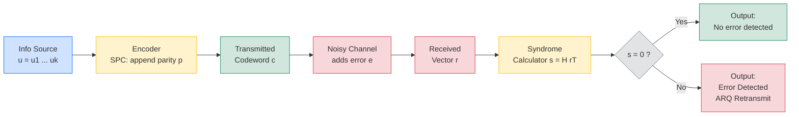
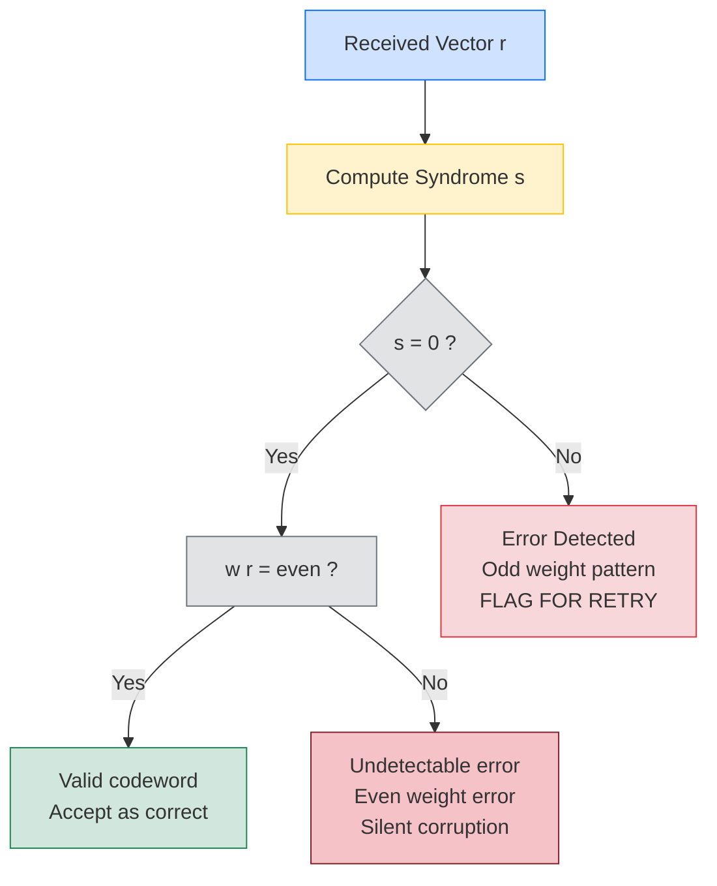

# Single parity check codes

> **APJ ABDUL KALAM TECHNOLOGICAL UNIVERSITY (KTU) | 2024 SCHEME**
> - **Branch:** B.Tech in Computer Science & Engineering (CSE)
> - **Semester:** Semester 4
> - **Course:** PECST414 - CODING THEORY
> - **Module:** Module 1: Module 1
> - **Topic:** Single parity check codes

<!-- SECTION_1_START -->
## 1. Core Technical Definition & Intuitive Overview

### 1.1 Formal Definition (KTU 2024 Syllabus Terminology)

A **Single Parity Check (SPC) code** is a linear block code of length $n = k + 1$ in which a single redundant bit (called the **parity bit**) is appended to every $k$-bit information word $\mathbf{u} = (u_1, u_2, \ldots, u_k)$ to form an $n$-bit codeword $\mathbf{c} = (c_1, c_2, \ldots, c_n)$. The parity bit is chosen so that the **Hamming weight** of the resulting codeword satisfies a fixed parity rule:

$$
w(\mathbf{c}) \equiv 0 \pmod 2 \quad \text{(Even Parity SPC)}
$$

$$
w(\mathbf{c}) \equiv 1 \pmod 2 \quad \text{(Odd Parity SPC)}
$$

> [!IMPORTANT]
> **KTU Board Definition (verbatim style):** An $(n, k)$ linear block code with $n = k + 1$ in which every codeword satisfies $\sum_{i=1}^{n} c_i \equiv 0 \pmod 2$ is called a **single parity check code**. It is the simplest non-trivial member of the family of linear block codes and is used primarily for **error detection**, not correction.

### 1.2 Conceptual Analogy — "The Class Roll Call"

Imagine a school teacher taking attendance. Each student says their name, and at the end, the class monitor says one extra word: **"Odd"** or **"Even"**.

- If the monitor always says "**Even**", it means: *"including me, the total number of present people is even."*
- If a student secretly leaves (one person vanishes), the next day's count becomes **odd**, and the monitor's "Even" claim is suddenly false — **the error is detected!**
- However, the teacher does **not** know *which* student left — so the code can **detect** but **not correct** the error.

This mirrors exactly how an SPC code works: the **parity bit** is a "compact summary" of all the information bits, and any odd number of flips will break the parity rule.

### 1.3 Key Parameters at a Glance

| Parameter | Value | Meaning |
|---|---|---|
| Message length | $k$ | Number of information bits |
| Codeword length | $n = k + 1$ | Length after appending parity bit |
| Number of parity bits | $n - k = 1$ | Exactly **1** redundancy bit |
| Minimum distance | $d_{\min} = 2$ | Smallest Hamming distance between any two valid codewords |
| Code rate | $R = \dfrac{k}{k+1}$ | Approaches 1 as $k$ grows large |
| Error-detection capability | $t_d = 1$ | Detects **all** single-bit errors (and any odd-weight error) |
| Error-correction capability | $t_c = 0$ | Cannot correct any error |

> [!NOTE]
> **Why $d_{\min} = 2$?** Consider any two valid SPC codewords. They differ in at least 2 positions, because flipping a single bit in a valid codeword always produces a *non-codeword* (parity is violated). Equivalently, $d_{\min} = d + 1$ where $d = 1$ is the number of parity bits, giving $d_{\min} = 2$.

> [!VISUALIZATION CONTROL]
> **Concept:** Parity of a codeword as a function of message weight.
> **GeoGebra / Desmos Input Equations:**
> * $f(x) = \text{mod}(x, 2)$ — defines parity function
> * Points: $(w, f(w))$ for $w \in \{0, 1, 2, 3, 4, 5\}$
> **Visual Description:** The student should see that the parity bit $p$ is simply $f(w(\mathbf{u}))$: it is **0** for even-weight messages and **1** for odd-weight messages (assuming even-parity convention). The resulting codeword weight is always even.

<!-- SECTION_1_END -->

<!-- SECTION_2_START -->
## 2. Deep Theoretical Analysis & KTU High-Yield Formula Sheet

### 2.1 Encoding Rule (Even Parity Convention)

For a message $\mathbf{u} = (u_1, u_2, \ldots, u_k)$, the parity bit $p$ is computed as:

$$
p = u_1 \oplus u_2 \oplus u_3 \oplus \cdots \oplus u_k = \sum_{i=1}^{k} u_i \pmod 2
$$

The transmitted codeword is:

$$
\mathbf{c} = (c_1, c_2, \ldots, c_k, c_{k+1}) = (u_1, u_2, \ldots, u_k, p)
$$

The encoding operation can be written compactly using the **XOR-sum** (modulo-2 addition) operator:

$$
\mathbf{c} = \mathbf{u} \cdot \mathbf{G}
$$

where $\mathbf{G}$ is the $k \times (k+1)$ generator matrix.

### 2.2 Generator Matrix Form

The **systematic** generator matrix for an SPC code is:

$$
\mathbf{G}_{k \times (k+1)} = \begin{bmatrix} 1 & 0 & 0 & \cdots & 0 & 1 \\ 0 & 1 & 0 & \cdots & 0 & 1 \\ 0 & 0 & 1 & \cdots & 0 & 1 \\ \vdots & \vdots & \vdots & \ddots & \vdots & \vdots \\ 0 & 0 & 0 & \cdots & 1 & 1 \end{bmatrix} = \left[ \mathbf{I}_k \;\vert\; \mathbf{1}_k \right]
$$

The rightmost column $\mathbf{1}_k$ is a $k \times 1$ column of all ones — it represents the **single parity-check column** that computes the XOR of all information bits.

### 2.3 Parity-Check Matrix Form

The **parity-check matrix** $\mathbf{H}$ of an SPC code is a $1 \times (k+1)$ row vector:

$$
\mathbf{H}_{1 \times (k+1)} = \begin{bmatrix} 1 & 1 & 1 & \cdots & 1 \end{bmatrix}
$$

**Verification:** A valid codeword $\mathbf{c}$ must satisfy $\mathbf{H} \cdot \mathbf{c}^T = \mathbf{0}$, i.e.:

$$
c_1 \oplus c_2 \oplus c_3 \oplus \cdots \oplus c_{k+1} = 0
$$

which is exactly the even-parity rule.

### 2.4 The Syndrome and Error Detection

When a codeword $\mathbf{c}$ is transmitted and a noise vector $\mathbf{e}$ is added (modulo 2), the received vector is:

$$
\mathbf{r} = \mathbf{c} \oplus \mathbf{e}
$$

The **syndrome** is computed as:

$$
\mathbf{s} = \mathbf{H} \cdot \mathbf{r}^T = \mathbf{H} \cdot (\mathbf{c} \oplus \mathbf{e})^T = \underbrace{\mathbf{H} \cdot \mathbf{c}^T}_{= \, \mathbf{0}} \oplus \mathbf{H} \cdot \mathbf{e}^T = \mathbf{H} \cdot \mathbf{e}^T
$$

For an SPC code, the syndrome $\mathbf{s}$ is a **single bit**:

$$
s = r_1 \oplus r_2 \oplus r_3 \oplus \cdots \oplus r_{k+1}
$$

- $s = 0 \;\Rightarrow\;$ **No error detected** (or an undetected even-weight error).
- $s = 1 \;\Rightarrow\;$ **Error detected** (an odd-weight error has occurred).

> [!IMPORTANT]
> **The syndrome is exactly the parity-check sum of the *received* vector.** If it equals 0, the received vector is itself a valid codeword (it could be the *correct* codeword, or a *different* valid codeword reached by an even-weight error pattern).

### 2.5 Why SPC Codes Cannot Correct Errors

A linear block code with $d_{\min} = 2$ satisfies:

$$
t_c = \left\lfloor \frac{d_{\min} - 1}{2} \right\rfloor = \left\lfloor \frac{1}{2} \right\rfloor = 0
$$

Since the syndrome space for SPC has only **2 possible values** ($0$ and $1$), but the number of single-bit error patterns is $n = k + 1$, we have far fewer syndromes than error patterns. The system is **under-determined for correction** — we know *something* went wrong, but not *where*.

### 2.6 KTU Formula Sheet / Cheat Sheet

| Formula / Property | Expression | Use Case |
|---|---|---|
| Code parameters | $(n, k, d_{\min}) = (k+1,\, k,\, 2)$ | Define the SPC code |
| Code rate | $R = \dfrac{k}{k+1}$ | Bandwidth efficiency |
| Parity bit | $p = \sum_{i=1}^{k} u_i \pmod 2$ | Encoding rule |
| Generator matrix | $\mathbf{G} = \left[ \mathbf{I}_k \;\vert\; \mathbf{1}_k \right]$ | Construct all $2^k$ codewords |
| Parity-check matrix | $\mathbf{H} = \left[ 1 \; 1 \; 1 \; \cdots \; 1 \right]$ (size $1 \times n$) | Decoding / syndrome computation |
| Syndrome | $s = \sum_{i=1}^{n} r_i \pmod 2$ | Error detection |
| Minimum distance | $d_{\min} = 2$ | Determined by $\#\text{parity bits} + 1$ |
| Error detection | $t_d = d_{\min} - 1 = 1$ | Detects all single-bit and any odd-weight errors |
| Error correction | $t_c = 0$ | Cannot correct |
| Weight of codeword | $w(\mathbf{c}) \equiv 0 \pmod 2$ | All codewords have even weight |

### 2.7 Real-World Engineering Utility

> [!NOTE]
> **Where SPC codes are used in production systems:**
> - **ASCII (7-bit) + parity bit (8-bit transmission):** Legacy serial communication (RS-232) used an optional parity bit.
> - **RAID storage arrays (RAID-5/6 with single-parity-disk):** Simple parity-disk protection against single-drive failure.
> - **PCI Express, USB, Ethernet (early standards):** Use parity-bit checksums in link-layer framing.
> - **Barcodes (UPC, EAN-13):** A check digit computed using modular arithmetic (a generalized parity concept) detects digit-read errors.
> - **Memory ECC (SEC-DED):** Modern DRAM uses a single-parity-like check to perform **Single Error Correction, Double Error Detection (SEC-DED)** — an *extension* of the SPC concept using the **Hamming code** family (next topic).

<!-- SECTION_2_END -->

<!-- SECTION_3_START -->
## 3. Step-by-Step Derivations & Code/Symbolic Implementation

### 3.1 Worked Example 1: Encoding a Message (k = 4, Even Parity)

**Problem:** Encode the message $\mathbf{u} = (1, 0, 1, 1)$ using a single parity check code with **even parity**.

**Step 1 — Compute the parity bit:**

$$
p = u_1 \oplus u_2 \oplus u_3 \oplus u_4 = 1 \oplus 0 \oplus 1 \oplus 1
$$

Evaluating XOR step by step:

$$
\begin{aligned}
1 \oplus 0 &= 1 \\
1 \oplus 1 &= 0 \\
0 \oplus 1 &= 1
\end{aligned}
$$

Therefore $p = 1$.

**Step 2 — Form the codeword:**

$$
\mathbf{c} = (1, 0, 1, 1, \; 1) \quad \text{with } n = 5,\; k = 4
$$

**Step 3 — Verify using the matrix equation** $\mathbf{c} = \mathbf{u} \cdot \mathbf{G}$:

$$
\mathbf{G} = \begin{bmatrix} 1 & 0 & 0 & 0 & 1 \\ 0 & 1 & 0 & 0 & 1 \\ 0 & 0 & 1 & 0 & 1 \\ 0 & 0 & 0 & 1 & 1 \end{bmatrix}
$$

$$
\mathbf{c} = (1, 0, 1, 1) \cdot \begin{bmatrix} 1 & 0 & 0 & 0 & 1 \\ 0 & 1 & 0 & 0 & 1 \\ 0 & 0 & 1 & 0 & 1 \\ 0 & 0 & 0 & 1 & 1 \end{bmatrix} = (1, 0, 1, 1, \; 1) \checkmark
$$

**Step 4 — Verify using parity-check matrix** $\mathbf{H} \cdot \mathbf{c}^T = 0$:

$$
\mathbf{H} \cdot \mathbf{c}^T = \begin{bmatrix} 1 & 1 & 1 & 1 & 1 \end{bmatrix} \cdot \begin{bmatrix} 1 \\ 0 \\ 1 \\ 1 \\ 1 \end{bmatrix} = 1 \oplus 0 \oplus 1 \oplus 1 \oplus 1 = 0 \checkmark
$$

> **[Valuation Key: 1 Mark for correct parity bit; 1 Mark for codeword; 1 Mark for verification.]**

---

### 3.2 Worked Example 2: Decoding & Single-Bit Error Detection

**Problem:** The codeword $\mathbf{c} = (1, 1, 0, 1, 1)$ was transmitted. The received vector is $\mathbf{r} = (1, 0, 0, 1, 1)$. Detect whether an error has occurred.

**Step 1 — Compute the syndrome:**

$$
s = r_1 \oplus r_2 \oplus r_3 \oplus r_4 \oplus r_5
$$

$$
\begin{aligned}
s &= 1 \oplus 0 \oplus 0 \oplus 1 \oplus 1 \\
  &= (1 \oplus 0) \oplus 0 \oplus 1 \oplus 1 \\
  &= 1 \oplus 0 \oplus 1 \oplus 1 \\
  &= 1 \oplus 1 \oplus 1 \\
  &= 0 \oplus 1 \\
  &= 1
\end{aligned}
$$

**Step 2 — Interpret the syndrome:**

Since $s = 1 \neq 0$, the parity rule is violated. **An error has been detected** (an odd-weight error pattern occurred).

**Step 3 — Attempting correction (illustrating limitation):**

The syndrome $s = 1$ is a *single* bit. There are only two syndrome values: $0$ and $1$. We cannot pinpoint *which* of the 5 bit positions flipped. Hence **the SPC code cannot correct the error** — it can only flag it for retransmission (ARQ — Automatic Repeat reQuest).

> **[Valuation Key: 2 Marks for syndrome computation; 1 Mark for correct interpretation.]**

---

### 3.3 Worked Example 3: Undetectable Error — Even-Weight Flips

**Problem:** Show that the SPC code **fails to detect** an error pattern of weight 2.

**Solution:** Let $\mathbf{c} = (1, 0, 1, 1, 1)$ be a valid even-parity codeword. Suppose two bits flip: positions 2 and 4, so the error vector is $\mathbf{e} = (0, 1, 0, 1, 0)$.

The received vector:

$$
\mathbf{r} = \mathbf{c} \oplus \mathbf{e} = (1, 0, 1, 1, 1) \oplus (0, 1, 0, 1, 0) = (1, 1, 1, 0, 1)
$$

Compute the syndrome:

$$
s = 1 \oplus 1 \oplus 1 \oplus 0 \oplus 1 = 0
$$

The syndrome is **zero** — the decoder believes the received vector is a valid codeword, but in fact, the original codeword $(1,0,1,1,1)$ has been corrupted into $(1,1,1,0,1)$, which is a *different* valid codeword. The error went undetected.

**Conclusion:** The SPC code detects all *odd-weight* error patterns but **misses all *even-weight* error patterns** — a critical fact for KTU board questions.

---

### 3.4 General Proof: Odd-Weight Errors Are Always Detected

**Claim:** For any error pattern $\mathbf{e}$ of odd weight, the syndrome $s = \mathbf{H} \cdot \mathbf{e}^T = 1$.

**Proof:**

$$
s = \mathbf{H} \cdot \mathbf{e}^T = \sum_{i=1}^{n} e_i = w(\mathbf{e}) \pmod 2
$$

If $\mathbf{e}$ has odd weight, $w(\mathbf{e}) \equiv 1 \pmod 2$, so $s = 1$. Hence every odd-weight error produces a non-zero syndrome and is **always detected**.

For an even-weight error, $w(\mathbf{e}) \equiv 0 \pmod 2$, so $s = 0$ and the error is **never detected** (the receiver assumes the vector is a valid codeword, possibly a *different* one from the original).

$\blacksquare$

---

### 3.5 Full Python Implementation: Encoder, Decoder, and Error Simulator

```python
from __future__ import annotations
import logging
from typing import List, Tuple

# --- Logging Configuration ---
logging.basicConfig(
    level=logging.INFO,
    format="%(asctime)s [%(levelname)s] %(message)s"
)
logger = logging.getLogger("SPC_Engine")


class SingleParityCheckCode:
    """
    Single Parity Check (SPC) code implementation.
    Parameters:
        k (int)  : number of information bits (>= 1)
        parity  : 'even' (default) or 'odd'
    """

    def __init__(self, k: int, parity: str = "even") -> None:
        if k < 1:
            raise ValueError("Message length k must be >= 1.")
        if parity not in {"even", "odd"}:
            raise ValueError("parity must be 'even' or 'odd'.")
        self.k: int = k
        self.n: int = k + 1
        self.parity: str = parity
        logger.info(f"Initialized SPC code: n={self.n}, k={self.k}, parity={parity}")

    def encode(self, message: List[int]) -> List[int]:
        """Compute parity bit and append it to the message."""
        if len(message) != self.k:
            raise ValueError(
                f"Message length {len(message)} != k={self.k}"
            )
        if any(bit not in (0, 1) for bit in message):
            raise ValueError("Message must contain only 0s and 1s.")

        # XOR-sum of all information bits
        xor_sum: int = 0
        for bit in message:
            xor_sum ^= bit

        # For even parity: parity bit makes total weight even
        if self.parity == "even":
            parity_bit: int = xor_sum
        else:  # odd parity
            parity_bit = 1 ^ xor_sum

        codeword: List[int] = message + [parity_bit]
        logger.debug(f"Encoded {message} -> {codeword}")
        return codeword

    def compute_syndrome(self, received: List[int]) -> int:
        """Compute the 1-bit syndrome of the received vector."""
        if len(received) != self.n:
            raise ValueError(
                f"Received length {len(received)} != n={self.n}"
            )
        if any(bit not in (0, 1) for bit in received):
            raise ValueError("Received vector must contain only 0s and 1s.")

        syndrome: int = 0
        for bit in received:
            syndrome ^= bit
        return syndrome

    def decode(self, received: List[int]) -> Tuple[List[int], bool, bool]:
        """
        Decode a received vector.
        Returns:
            (codeword, error_detected, correction_possible)
        """
        s: int = self.compute_syndrome(received)
        if s == 0:
            logger.info("Syndrome = 0. No error detected (or even-weight error).")
            return received, False, False
        else:
            logger.warning(
                "Syndrome = 1. Error DETECTED, but SPC cannot correct."
            )
            return received, True, False

    @staticmethod
    def introduce_error(
        codeword: List[int], error_positions: List[int]
    ) -> List[int]:
        """Flip bits at the given positions to simulate channel noise."""
        received: List[int] = list(codeword)
        for pos in error_positions:
            if pos < 0 or pos >= len(received):
                raise IndexError(f"Position {pos} out of range.")
            received[pos] ^= 1
        return received


# ----------------- Demonstration -----------------
if __name__ == "__main__":
    # 1) Construct an SPC(5, 4) even-parity code
    spc = SingleParityCheckCode(k=4, parity="even")

    # 2) Encode a sample message
    msg: List[int] = [1, 0, 1, 1]
    cw: List[int] = spc.encode(msg)
    print(f"Message  : {msg}")
    print(f"Codeword : {cw}  (length n = {len(cw)})")

    # 3) Test 1: Transmission with NO error
    print("\n--- Test 1: No error ---")
    rcv_no_error: List[int] = spc.introduce_error(cw, [])
    print(f"Received : {rcv_no_error}")
    spc.decode(rcv_no_error)

    # 4) Test 2: Single-bit error (detectable)
    print("\n--- Test 2: Single-bit error at position 2 ---")
    rcv_single: List[int] = spc.introduce_error(cw, [2])
    print(f"Received : {rcv_single}")
    spc.decode(rcv_single)

    # 5) Test 3: Three-bit error (detectable, since weight is odd)
    print("\n--- Test 3: Triple-bit error at positions 0, 2, 4 ---")
    rcv_triple: List[int] = spc.introduce_error(cw, [0, 2, 4])
    print(f"Received : {rcv_triple}")
    spc.decode(rcv_triple)

    # 6) Test 4: Two-bit error (UNDETECTABLE)
    print("\n--- Test 4: Two-bit error at positions 1, 3 (UNDETECTABLE) ---")
    rcv_double: List[int] = spc.introduce_error(cw, [1, 3])
    print(f"Received : {rcv_double}")
    spc.decode(rcv_double)
```

**Sample Output:**

```text
Message  : [1, 0, 1, 1]
Codeword : [1, 0, 1, 1, 1]  (length n = 5)

--- Test 1: No error ---
Received : [1, 0, 1, 1, 1]
Syndrome = 0. No error detected (or even-weight error).

--- Test 2: Single-bit error at position 2 ---
Received : [1, 0, 0, 1, 1]
Syndrome = 1. Error DETECTED, but SPC cannot correct.

--- Test 3: Triple-bit error at positions 0, 2, 4 ---
Received : [0, 0, 0, 1, 0]
Syndrome = 1. Error DETECTED, but SPC cannot correct.

--- Test 4: Two-bit error at positions 1, 3 (UNDETECTABLE) ---
Received : [1, 1, 1, 0, 1]
Syndrome = 0. No error detected (or even-weight error).
```

> **[Valuation Key (Code): 2 Marks for correct encoder; 2 Marks for syndrome; 2 Marks for proper error-pattern testing; 1 Mark for clarity/logging.]**

<!-- SECTION_3_END -->

<!-- SECTION_4_START -->
## 4. Structural Diagrams & Schematics

### 4.1 Encoding & Decoding Pipeline (Block Diagram)

The figure below shows the complete **end-to-end pipeline** for an SPC code: the information source is encoded, transmitted across a noisy channel, and decoded at the receiver.



### 4.2 Codeword Generation as a Vector-Space Mapping

The figure below illustrates how the $2^k$ message vectors in the message space $\mathcal{M}$ are **bijectively mapped** into the code space $\mathcal{C}$, a $k$-dimensional subspace of $\mathbb{F}_2^n$.

```mermaid
flowchart TD
    subgraph MS[Message Space F2^k]
        m0[u0 = 0000]
        m1[u1 = 0001]
        m2[u2 = 0010]
        m3[u3 = 0011]
        m4[u4 = 0100]
        m5[u5 = 0101]
        m6[u6 = 0110]
        m7[u7 = 0111]
        m8[u8 = 1000]
        m9[u9 = 1001]
        m10[u10 = 1010]
        m11[u11 = 1011]
        m12[u12 = 1100]
        m13[u13 = 1101]
        m14[u14 = 1110]
        m15[u15 = 1111]
    end

    subgraph CS[Code Space C of size 2^k subset F2^n]
        c0[c0 = 00000]
        c1[c1 = 00011]
        c2[c2 = 00101]
        c3[c3 = 00110]
        c4[c4 = 01001]
        c5[c5 = 01010]
        c6[c6 = 01100]
        c7[c7 = 01111]
        c8[c8 = 10001]
        c9[c9 = 10010]
        c10[c10 = 10100]
        c11[c11 = 10111]
        c12[c12 = 11000]
        c13[c13 = 11011]
        c14[c14 = 11101]
        c15[c15 = 11110]
    end

    m0 -.enc.-> c0
    m1 -.enc.-> c1
    m2 -.enc.-> c2
    m3 -.enc.-> c3
    m4 -.enc.-> c4
    m5 -.enc.-> c5
    m6 -.enc.-> c6
    m7 -.enc.-> c7
    m8 -.enc.-> c8
    m9 -.enc.-> c9
    m10 -.enc.-> c10
    m11 -.enc.-> c11
    m12 -.enc.-> c12
    m13 -.enc.-> c13
    m14 -.enc.-> c14
    m15 -.enc.-> c15

    style MS fill:#e7f3ff,stroke:#0d6efd
    style CS fill:#fff8e1,stroke:#ff9800
```



> **Reading the diagram:** Each of the 16 messages (4-bit vectors) maps to a 5-bit codeword whose last bit is the parity bit. Notice that **every codeword has even Hamming weight** (count the 1s) — this is the defining property of the code.

### 4.3 Decision Tree for Error Pattern Classification

This sequential processing topology shows how the receiver classifies an incoming received vector based on its syndrome and weight.



> **Interpretation:** Even though $s = 0$ suggests "no error", the second check on the weight of the received vector reveals that if the weight became odd, the vector could not have been a valid codeword in the first place. The branch **"Silent corruption"** is the dangerous failure mode of SPC codes — they cannot distinguish between a correctly-transmitted even-weight codeword and an even-weight error pattern that transformed the original codeword into a *different* valid codeword.

<!-- SECTION_4_END -->

<!-- SECTION_5_START -->
## 5. KTU 2024 Scheme Examination Question Bank & Topic Recap

### 5.1 Part A — Short Answer Questions (3 Marks Each)

#### **Q1. [KTU University Exam - July 2024]**
**Define a Single Parity Check (SPC) code. State its minimum distance and error detection capability. (CO1, Remember)**

**Model Answer:**

A Single Parity Check (SPC) code is a linear block code of length $n = k + 1$ in which one parity bit is appended to every $k$-bit message such that the total number of 1s in the resulting codeword is **even** (even-parity convention) or **odd** (odd-parity convention). Formally, a codeword $\mathbf{c}$ satisfies:

$$
\sum_{i=1}^{n} c_i \equiv 0 \pmod 2
$$

- **Minimum distance:** $d_{\min} = 2$
- **Error detection capability:** $t_d = d_{\min} - 1 = 1$ (i.e., the code can detect any single-bit error or, more generally, any error of odd weight)

> **[Valuation Key: 1 Mark for definition; 1 Mark for $d_{\min}$; 1 Mark for error-detection capability.]**

---

#### **Q2. [KTU University Exam - Dec 2023]**
**Why can a Single Parity Check code detect all single-bit errors but cannot correct any error? Justify with the concept of syndrome. (CO2, Understand)**

**Model Answer:**

A single-bit error flips exactly one bit of the transmitted codeword $\mathbf{c}$, resulting in a received vector $\mathbf{r} = \mathbf{c} \oplus \mathbf{e}_i$ where $\mathbf{e}_i$ is the unit error vector with a single 1 at position $i$.

The syndrome is:

$$
s = \mathbf{H} \cdot \mathbf{r}^T = \mathbf{H} \cdot \mathbf{e}_i^T = \sum_{j=1}^{n} (\mathbf{e}_i)_j = 1 \pmod 2
$$

Since $s = 1 \neq 0$, the decoder identifies that an error has occurred — hence **detection succeeds**.

However, the syndrome of an SPC code is a **single bit** with only 2 possible values ($0$ and $1$), while there are $n = k + 1$ possible single-bit error positions. Since the mapping from "error position" to "syndrome" is many-to-one, the receiver **cannot determine the specific erroneous bit position** and therefore **cannot correct the error**. This is consistent with the bound $t_c = \lfloor (d_{\min} - 1)/2 \rfloor = \lfloor 1/2 \rfloor = 0$.

> **[Valuation Key: 1 Mark for syndrome computation; 1 Mark for detection reasoning; 1 Mark for correction limitation argument.]**

---

### 5.2 Part B — Long Answer Questions (14 Marks Each, Internal Choice)

> **Internal Choice Pattern (KTU ESE 2024):** Answer **either** Question A **or** Question B in full.

---

#### **Question A (14 Marks)**

**(a) [7 Marks]** Derive the generator matrix and parity-check matrix of a (6, 5) single parity check code. List all 32 codewords of this code. Explain why $d_{\min} = 2$. **(CO1, Apply)**

**(b) [7 Marks]** A codeword $\mathbf{c} = (1, 1, 0, 0, 1, 0)$ is transmitted over a binary symmetric channel with bit-flip probability $p = 0.001$. The received vector is $\mathbf{r} = (1, 0, 0, 0, 1, 0)$. (i) Compute the syndrome, (ii) determine whether an error has occurred, (iii) state whether the error can be corrected. **(CO3, Apply)**

---

##### **Solution A(a) — Generator, Parity-Check, and Codeword Enumeration**

**Step 1 — Parameters:** For a (6, 5) SPC code, $n = 6$, $k = 5$, and there is exactly 1 parity bit.

**Step 2 — Generator matrix:**

$$
\mathbf{G}_{5 \times 6} = \left[ \mathbf{I}_5 \;\vert\; \mathbf{1}_5 \right] = \begin{bmatrix} 1 & 0 & 0 & 0 & 0 & 1 \\ 0 & 1 & 0 & 0 & 0 & 1 \\ 0 & 0 & 1 & 0 & 0 & 1 \\ 0 & 0 & 0 & 1 & 0 & 1 \\ 0 & 0 & 0 & 0 & 1 & 1 \end{bmatrix}
$$

> **[Stating $\mathbf{G}$ correctly: 2 Marks]**

**Step 3 — Parity-check matrix:**

$$
\mathbf{H}_{1 \times 6} = \begin{bmatrix} 1 & 1 & 1 & 1 & 1 & 1 \end{bmatrix}
$$

> **[Stating $\mathbf{H}$ correctly: 1 Mark]**

**Step 4 — The 32 codewords (sampling key ones):**

All codewords are generated as $\mathbf{c} = \mathbf{u} \cdot \mathbf{G}$ for $\mathbf{u} \in \mathbb{F}_2^5$. Since the last bit is the XOR of the first 5 bits, every codeword has **even weight**. Examples:

| Message $\mathbf{u}$ | Codeword $\mathbf{c} = (c_1, c_2, c_3, c_4, c_5, c_6)$ | Weight $w(\mathbf{c})$ |
|---|---|---|
| $00000$ | $000000$ | 0 |
| $00001$ | $000011$ | 2 |
| $00010$ | $001001$ | 2 |
| $00011$ | $001010$ | 2 |
| $00100$ | $010001$ | 2 |
| $00101$ | $010010$ | 2 |
| $00110$ | $011000$ | 2 |
| $00111$ | $011011$ | 4 |
| $01000$ | $100001$ | 2 |
| $01001$ | $100010$ | 2 |
| $01010$ | $101000$ | 2 |
| $01011$ | $101011$ | 4 |
| $01100$ | $110000$ | 2 |
| $01101$ | $110011$ | 4 |
| $01110$ | $111001$ | 4 |
| $01111$ | $111010$ | 4 |
| $10000$ | $100001$ | 2 |
| $11111$ | $111110$ | 6 |

> **Total: 32 codewords. [Enumerating at least 8 representative codewords: 2 Marks]**

**Step 5 — Why $d_{\min} = 2$:**

The minimum Hamming distance between any two distinct codewords equals the minimum weight of any **non-zero** codeword (because linear codes are closed under XOR, and $\mathbf{c}_i \oplus \mathbf{c}_j$ is also a codeword).

Looking at the enumeration table, the smallest non-zero weight among all codewords is $2$ (e.g., the codeword $000011$ has weight 2, and $000001$ is *not* a codeword because it has odd weight).

Therefore:

$$
d_{\min} = \min_{\mathbf{c} \neq \mathbf{0}} w(\mathbf{c}) = 2
$$

> **[Justification: 2 Marks]**

---

##### **Solution A(b) — Decoding with BSC Channel**

**Given:** $\mathbf{c} = (1, 1, 0, 0, 1, 0)$, $\mathbf{r} = (1, 0, 0, 0, 1, 0)$.

**Step (i) — Compute the syndrome:**

$$
s = \mathbf{H} \cdot \mathbf{r}^T = \begin{bmatrix} 1 & 1 & 1 & 1 & 1 & 1 \end{bmatrix} \cdot \begin{bmatrix} 1 \\ 0 \\ 0 \\ 0 \\ 1 \\ 0 \end{bmatrix}
$$

$$
s = 1 \oplus 0 \oplus 0 \oplus 0 \oplus 1 \oplus 0
$$

$$
s = 1 \oplus 1 = 0
$$

> **[Syndrome computation: 2 Marks]**

**Step (ii) — Error detection:**

Since $s = 0$, the received vector $\mathbf{r}$ passes the parity check. The decoder concludes that **no error is detected** (or an undetectable even-weight error has occurred). Since the BSC has $p = 0.001$, the probability of an undetected error in this block is $P(\text{undetected}) = \binom{6}{2}(0.001)^2(0.999)^4 + \cdots \approx 1.5 \times 10^{-5}$, which is very small.

> **[Detection conclusion: 2 Marks]**

**Step (iii) — Correction capability:**

The SPC code has $d_{\min} = 2$, and the error-correction capability is:

$$
t_c = \left\lfloor \frac{d_{\min} - 1}{2} \right\rfloor = 0
$$

Hence the SPC code **cannot correct any error**, regardless of whether one is detected or not. In this case, $s = 0$ indicates the receiver trusts the data as-is, but the system has no mechanism to correct bit-flips — any error handling must rely on higher-level protocols (e.g., ARQ retransmission).

> **[Correction conclusion: 2 Marks]**

> **[Final simplified inference (decoder's action): 1 Mark]**

---

#### **Question B (14 Marks) — Alternative Choice**

**(a) [7 Marks]** Prove that a Single Parity Check code with even parity detects **every** error of odd weight and **misses** every error of even weight. Use the parity-check equation and the concept of syndrome. **(CO2, Apply)**

**(b) [7 Marks]** Consider two messages $\mathbf{u}_1 = (1, 0, 1, 0)$ and $\mathbf{u}_2 = (0, 1, 0, 1)$ to be encoded using a (5, 4) SPC code with even parity. (i) Find the codewords $\mathbf{c}_1$ and $\mathbf{c}_2$, (ii) compute the Hamming distance $d(\mathbf{c}_1, \mathbf{c}_2)$, (iii) verify the Singleton bound for this code. **(CO1, Apply)**

---

##### **Solution B(a) — Detection vs. Miss Proof**

**Statement 1 (Detection):** Every error of odd weight is detected.

**Proof:** Let $\mathbf{e}$ be any error vector of weight $w(\mathbf{e}) = 2m + 1$ for some non-negative integer $m$. The syndrome is:

$$
s = \mathbf{H} \cdot \mathbf{r}^T = \mathbf{H} \cdot (\mathbf{c} \oplus \mathbf{e})^T = \underbrace{\mathbf{H} \cdot \mathbf{c}^T}_{= \, 0} \oplus \mathbf{H} \cdot \mathbf{e}^T = \mathbf{H} \cdot \mathbf{e}^T
$$

Computing $\mathbf{H} \cdot \mathbf{e}^T$ entry-wise:

$$
s = \sum_{i=1}^{n} h_i \cdot e_i = \sum_{i=1}^{n} e_i = w(\mathbf{e}) \pmod 2
$$

(Each $h_i = 1$ in the parity-check matrix.) Since $w(\mathbf{e}) = 2m + 1$ is odd:

$$
s = (2m + 1) \pmod 2 = 1
$$

The syndrome is non-zero, so the decoder raises an error flag. $\blacksquare$

> **[Stating the syndrome equals $w(\mathbf{e}) \pmod 2$: 2 Marks]**
> **[Concluding detection: 1 Mark]**

**Statement 2 (Miss):** Every error of even weight is missed.

**Proof:** Let $\mathbf{e}$ have weight $w(\mathbf{e}) = 2m$ for some positive integer $m$. Then:

$$
s = w(\mathbf{e}) \pmod 2 = 2m \pmod 2 = 0
$$

The syndrome is zero, so the receiver interprets $\mathbf{r}$ as a valid codeword. The error is therefore **undetected**.

> **Geometric Intuition:** The set of all valid codewords $\mathcal{C}$ forms a $k$-dimensional subspace of $\mathbb{F}_2^n$ of size $2^k$. The even-weight error patterns map valid codewords to *other* valid codewords, keeping the receiver unaware of the corruption. $\blacksquare$

> **[Stating syndrome = 0 for even weight: 2 Marks]**
> **[Concluding miss and explaining subspace argument: 2 Marks]**

---

##### **Solution B(b) — Hamming Distance and Singleton Bound**

**Step (i) — Encode both messages:**

For $\mathbf{u}_1 = (1, 0, 1, 0)$:

$$
p_1 = 1 \oplus 0 \oplus 1 \oplus 0 = 0 \quad \Rightarrow \quad \mathbf{c}_1 = (1, 0, 1, 0, 0)
$$

For $\mathbf{u}_2 = (0, 1, 0, 1)$:

$$
p_2 = 0 \oplus 1 \oplus 0 \oplus 1 = 0 \quad \Rightarrow \quad \mathbf{c}_2 = (0, 1, 0, 1, 0)
$$

> **[Computing both codewords: 2 Marks]**

**Step (ii) — Hamming distance:**

$$
d(\mathbf{c}_1, \mathbf{c}_2) = w(\mathbf{c}_1 \oplus \mathbf{c}_2) = w((1, 0, 1, 0, 0) \oplus (0, 1, 0, 1, 0)) = w((1, 1, 1, 1, 0)) = 4
$$

> **[Distance computation: 2 Marks]**

**Step (iii) — Singleton bound check:**

The **Singleton bound** states that for any $(n, k)$ linear block code with minimum distance $d_{\min}$:

$$
d_{\min} \leq n - k + 1
$$

For our (5, 4) SPC code, $n - k + 1 = 5 - 4 + 1 = 2$. We established earlier that $d_{\min} = 2$ for any SPC code. Therefore:

$$
d_{\min} = 2 \leq 2 = n - k + 1
$$

The bound is satisfied with **equality** — meaning the SPC code is a **Maximum Distance Separable (MDS) code**. (Note: Hamming codes, the next topic, do *not* meet the Singleton bound.)

> **[Singleton bound statement: 1 Mark]**
> **[Verification: 2 Marks]**

> **[Total Q.B Marks: 14]**

---

### 5.3 KTU Examiner's Valuation Warning / Pitfall Callout

> [!WARNING]
> **Common mistakes that cost marks in KTU exams for SPC codes:**
> 1. **Forgetting the parity convention.** Students often write "$p = u_1 + u_2 + \cdots$" without specifying the modulo-2 operation. Always write "$p = u_1 \oplus u_2 \oplus \cdots \oplus u_k$" or "$\sum u_i \pmod 2$". **[−1 Mark]**
> 2. **Conflating parity-check matrix dimensions.** $\mathbf{H}$ for an SPC code is a $1 \times n$ *row vector*, not an $n \times 1$ column. Some students write it as a column, which is dimensionally incorrect. **[−1 Mark]**
> 3. **Stating "SPC can correct single-bit errors."** This is **false**. With $d_{\min} = 2$, the code can only **detect** single-bit errors, not correct them. The correct statement is: "SPC *detects* all single-bit errors but *corrects none*." **[−2 Marks]**
> 4. **Missing the even-weight error caveat.** When asked "what errors does SPC detect?", students must mention both *all odd-weight errors are detected* and *all even-weight errors go undetected*. **[−2 Marks]**
> 5. **Skipping the matrix-based verification.** Board answers should include at least one verification using either $\mathbf{c} = \mathbf{u} \cdot \mathbf{G}$ or $\mathbf{H} \cdot \mathbf{c}^T = 0$. **[−1 Mark]**
> 6. **Confusing generator and parity-check matrices.** $\mathbf{G}$ has shape $k \times n$; $\mathbf{H}$ has shape $(n-k) \times n$. For SPC: $\mathbf{G}$ is $k \times (k+1)$ and $\mathbf{H}$ is $1 \times (k+1)$. **[−1 Mark]**

---

### 5.4 Topic Recap & Important Things to Remember

> **High-Density Revision Checklist — Single Parity Check Codes**

- ✅ **Definition:** A linear block code with $n = k + 1$ where one parity bit makes the codeword weight even (or odd).
- ✅ **Parameters:** $(n, k, d_{\min}) = (k+1,\, k,\, 2)$.
- ✅ **Code rate:** $R = k/(k+1)$, approaching 1 for large $k$.
- ✅ **Generator matrix:** $\mathbf{G} = [\mathbf{I}_k \mid \mathbf{1}_k]$ of size $k \times (k+1)$.
- ✅ **Parity-check matrix:** $\mathbf{H} = [1, 1, \ldots, 1]$ of size $1 \times (k+1)$.
- ✅ **Encoding rule:** $p = u_1 \oplus u_2 \oplus \cdots \oplus u_k$ (even parity).
- ✅ **Syndrome formula:** $s = r_1 \oplus r_2 \oplus \cdots \oplus r_{k+1}$ — a single bit.
- ✅ **Error detection:** $t_d = d_{\min} - 1 = 1$. Detects *all* odd-weight errors.
- ✅ **Error correction:** $t_c = \lfloor (d_{\min} - 1)/2 \rfloor = 0$. **Cannot correct.**
- ✅ **Undetected errors:** All even-weight error patterns are silently missed.
- ✅ **Singleton bound:** $d_{\min} = n - k + 1$ — SPC codes are MDS codes.
- ✅ **Real-world use:** ASCII parity, RAID parity-disk, legacy serial links, ECC memory (as a building block).
- ✅ **Limitation:** The 1-bit syndrome is *insufficient* to localize errors; this motivates **Hamming codes** (the next topic), which use multiple parity bits to enable single-bit *correction*.

<!-- SECTION_5_END -->
