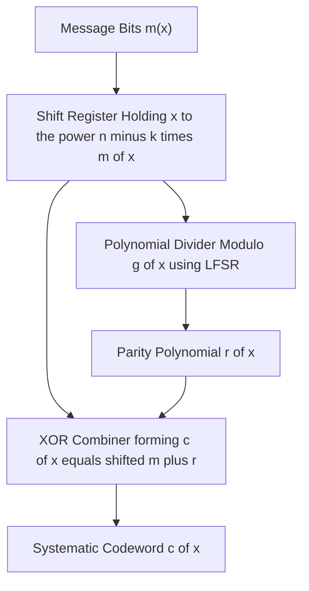
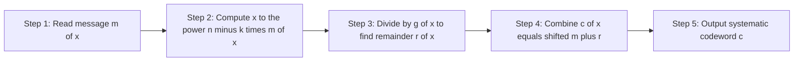
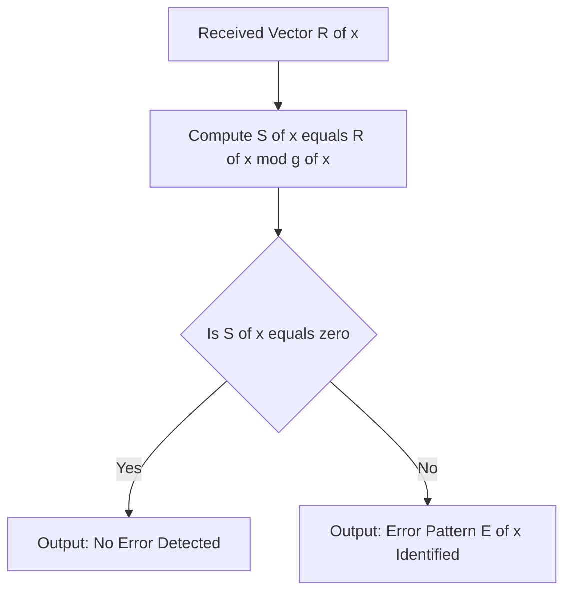
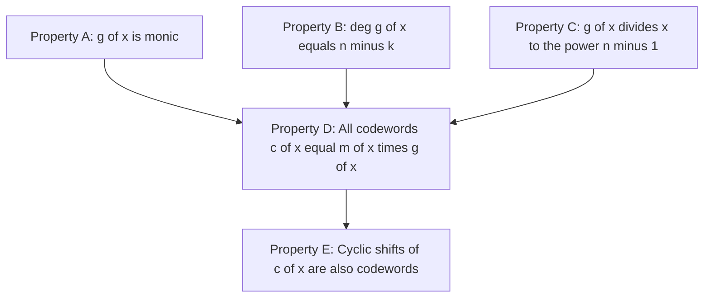

# Cyclic codes properties: Generator polynomials layouts models

<!-- SECTION_1_START -->
# Cyclic Codes: Properties & Generator Polynomial Layouts

## 1. Core Technical Definition

> [!IMPORTANT]
> **Formal Definition (KTU 2024 — PECST414 Module 2):**
> A linear block code $\mathcal{C}$ of length $n$ over the Galois field $GF(q)$ is called a **cyclic code** if and only if every cyclic shift of a codeword is also a codeword. That is, for every codeword $c = (c_0, c_1, c_2, \dots, c_{n-1}) \in \mathcal{C}$, the shifted vector $c^{(1)} = (c_{n-1}, c_0, c_1, \dots, c_{n-2})$ is **also** a codeword in $\mathcal{C}$. Equivalently, the **right cyclic shift** of a polynomial codeword $c(x)$ corresponds to the residue $x \cdot c(x) \bmod (x^n - 1)$.

A cyclic code is described compactly through a single polynomial $g(x)$ of degree $n - k$ (where $k$ is the message length and $n - k$ is the parity length). This polynomial $g(x)$ is called the **generator polynomial** of the cyclic code.

---

## 2. Conceptual Analogy — The "Rotating Lock Combination" Model

> [!NOTE]
> **Real-World Intuition (Beginner Friendly):**
> Imagine a 7-digit combination lock where the digits 0–9 are the alphabet. A cyclic code is like a *secret set* of valid combinations such that **rotating every digit of a valid combination to the right (wrapping the last digit to the front) gives another valid combination**. The smallest such combination (with leading non-zero digit) acts as the **"generator combination"** $g(x)$. Every valid combination can be *built* by repeating, scaling, and summing copies of this minimal generator — just as every codeword is a polynomial multiple $c(x) = m(x) \cdot g(x)$.

This is the central elegance of cyclic codes: **one short polynomial generates an entire codebook**.

---

## 3. Polynomial Representation of Codewords

A binary vector $c = (c_0, c_1, \dots, c_{n-1})$ is mapped to the polynomial:

$$c(x) = c_0 + c_1 x + c_2 x^2 + \dots + c_{n-1} x^{n-1}$$

| Vector Notation | Polynomial Form | Operation |
|---|---|---|
| $c = (c_0, c_1, \dots, c_{n-1})$ | $c(x) = \sum_{i=0}^{n-1} c_i x^i$ | Identity |
| Right cyclic shift $c^{(1)}$ | $x \cdot c(x) \bmod (x^n - 1)$ | Modular wrap-around |
| $i$-th cyclic shift $c^{(i)}$ | $x^i \cdot c(x) \bmod (x^n - 1)$ | Repeated shift |

> [!TIP]
> **Visualizing a Cyclic Shift:** Multiplying $c(x)$ by $x$ moves every coefficient one position higher. The term $c_{n-1} x^n$ "overflows" beyond degree $n-1$, and the identity $x^n \equiv 1 \pmod{x^n - 1}$ wraps $c_{n-1}$ back into the constant position $x^0$.

---

## 4. The Four Pillars of Cyclic Codes

1. **Linearity** — A cyclic code is a linear subspace of $\mathbb{F}_2^n$.
2. **Cyclic Invariance** — Closed under cyclic shifts (the defining property).
3. **Polynomial Multiplicity** — Every codeword is a multiple of $g(x)$.
4. **Factorization Property** — $g(x)$ must divide $x^n - 1$ over $GF(q)$.

> [!WARNING]
> **KTU Examiner Pitfall:** A cyclic code is **not** the same as a general linear block code. Every cyclic code is linear, but not every linear code is cyclic. The cyclic property imposes the additional constraint that $g(x) \mid (x^n - 1)$.

---

## 5. GeoGebra / Desmos Visualization Concept

> [!VISUALIZATION CONTROL]
> **Concept:** Polynomial Wrap-Around Modulo $x^n - 1$
> **GeoGebra / Desmos Input Equations:**
> * `f(x) = x^3 + x^2 + 1`     *(a sample 7-bit codeword polynomial)*
> * `g(x) = f(x) * (x mod (x^7 - 1))`     *(visualize the wrap-around shift)*
> **Visual Description:** Plot $f(x)$ as a stem plot on the integer $x$-axis (positions 0 to 6). Multiply symbolically by $x$ to obtain the polynomial whose coefficients show a dot displaced from index $i$ to index $i+1 \bmod 7$. Notice that the coefficient that "exits" at $x^7$ reappears at $x^0$, illustrating the cyclic nature.
<!-- SECTION_1_END -->

<!-- SECTION_2_START -->
# Deep Theoretical Analysis & KTU High-Yield Formula Sheet

## 1. The Generator Polynomial $g(x)$ — The Heart of Cyclic Codes

### 1.1 Existence and Uniqueness Theorem

> [!IMPORTANT]
> **Fundamental Theorem (KTU Board-Critical):**
> For any cyclic code $\mathcal{C}(n, k)$ over $GF(q)$, there exists a **unique monic polynomial** $g(x)$ of minimum degree such that:
> 1. Every codeword in $\mathcal{C}$ is a polynomial multiple of $g(x)$: $\; c(x) = m(x) \cdot g(x)$ where $\deg m(x) < k$.
> 2. $g(x)$ is a divisor of $x^n - 1$ in $GF(q)[x]$.
> 3. $\deg g(x) = n - k$.
> 4. $g(x)$ is **monic** (leading coefficient is 1).

The coefficient $n - k$ is the redundancy (parity) of the code.

### 1.2 Why $g(x) \mid (x^n - 1)$? — The Algebraic Reason

Because $c(x) = m(x) \cdot g(x)$, and the cyclic shift $x \cdot c(x) = x \cdot m(x) \cdot g(x)$ must also be a codeword. The most "shifted" codeword reachable from any starting codeword is $x^k \cdot c(x) = m_0 \cdot x^k \cdot g(x)$. Continuing this shifting, we get $x^{n-1} \cdot c(x) = m_0 \cdot x^{n-1} \cdot g(x)$, and the next shift wraps it:

$$x^n \cdot c(x) \equiv c(x) \pmod{x^n - 1}$$

The smallest non-zero codeword in this orbit must therefore be a multiple of the modular relation, forcing $g(x) \mid (x^n - 1)$.

---

## 2. The Five Defining Properties of Cyclic Codes

> [!NOTE]
> **Property 1 — Closure under cyclic shifts:**
> If $c(x) \in \mathcal{C}$, then $x^i \cdot c(x) \bmod (x^n - 1) \in \mathcal{C}$ for $i = 0, 1, \dots, n-1$.

> [!NOTE]
> **Property 2 — Generator Multiplicity:**
> $\mathcal{C} = \{\, m(x) \cdot g(x) \bmod (x^n - 1) \mid \deg m(x) < k \,\}$.

> [!NOTE]
> **Property 3 — Ideal Structure:**
> A cyclic code is an **ideal** in the polynomial ring $\mathbb{F}_q[x] / (x^n - 1)$. The generator polynomial $g(x)$ is the **ideal generator**.

> [!NOTE]
> **Property 4 — Parity Check Polynomial $h(x)$:**
> Define $h(x)$ such that $g(x) \cdot h(x) = x^n - 1$, with $\deg h(x) = k$ and $h(x)$ monic. Then for any codeword $c(x)$: $\; c(x) \cdot h(x) \equiv 0 \pmod{x^n - 1}$.

> [!NOTE]
> **Property 5 — Dimensionality:**
> The cyclic code $\mathcal{C}$ has exactly $q^k$ codewords (a vector space of dimension $k$).

---

## 3. KTU Formula Cheat Sheet

| Symbol / Formula | Meaning | Units / Type |
|---|---|---|
| $\mathcal{C}(n, k)$ | Cyclic code of length $n$, dimension $k$ | Code parameters |
| $n - k$ | Number of parity (redundancy) bits | Integer $\geq 1$ |
| $g(x)$ | Generator polynomial, monic, degree $n - k$ | Polynomial in $GF(q)[x]$ |
| $h(x)$ | Parity check polynomial, monic, degree $k$ | Polynomial in $GF(q)[x]$ |
| $g(x) \cdot h(x) = x^n - 1$ | Fundamental factorization identity | Polynomial equation |
| $c(x) = m(x) \cdot g(x)$ | Non-systematic encoding | Encoding rule |
| $c(x) = x^{n-k} m(x) + r(x)$ | Systematic encoding | Encoding rule |
| $r(x) = x^{n-k} m(x) \bmod g(x)$ | Parity polynomial | Modular remainder |
| $S(x) = R(x) \bmod g(x)$ | Syndrome polynomial | Decoding rule |
| $d_{\min}$ | Minimum Hamming distance | Integer |
| $t = \lfloor (d_{\min} - 1)/2 \rfloor$ | Random-error correction capability | Integer |

> [!WARNING]
> **LaTeX Isolation Rule Reminder:** All subscripted variables (such as $m_0$, $c_{n-1}$, $d_{\min}$) are written in math mode to prevent markdown corruption.

---

## 4. Real-World Engineering Utility

Cyclic codes dominate **production-grade communication and storage systems** because of three engineering advantages:

1. **Hardware-Friendly Encoding/Decoding** — Encoding via $m(x) \cdot g(x)$ and decoding via syndrome polynomial $S(x) = R(x) \bmod g(x)$ are implemented using **Linear Feedback Shift Registers (LFSRs)** — simple, high-speed, low-power hardware.
2. **Burst Error Detection** — A cyclic code of redundancy $r$ detects all burst errors of length $\leq r$ with probability $1 - 2^{-r}$ (for random errors).
3. **Industry Adoption** — **CRC-32** (Ethernet, ZIP, PNG), **CRC-16-CCITT** (Bluetooth, USB), and the **Reed-Solomon family** (QR codes, DVDs, Blu-ray, deep-space probes) are all *extended* or *specialized* cyclic codes.

> [!TIP]
> When KTU asks "where are cyclic codes used in industry?", a strong answer always cites **CRC standards, LFSR-based encoders, and Reed-Solomon codes** as direct descendants.
<!-- SECTION_2_END -->

<!-- SECTION_3_START -->
# Step-by-Step Derivations & Symbolic Implementation

## 1. Systematic Encoding — Complete Derivation

### 1.1 Setup

Given a cyclic code $\mathcal{C}(n, k)$ with generator polynomial $g(x)$ of degree $n - k$, encode a message polynomial:

$$m(x) = m_0 + m_1 x + m_2 x^2 + \dots + m_{k-1} x^{k-1}$$

We want a systematic codeword of the form:

$$c(x) = p_0 + p_1 x + \dots + p_{n-k-1} x^{n-k-1} \;+\; m_0 x^{n-k} + m_1 x^{n-k+1} + \dots + m_{k-1} x^{n-1}$$

i.e., the message bits occupy the **higher-order positions**, and the parity bits occupy the **lower-order positions**.

### 1.2 Derivation Step-by-Step

**Step 1** — Multiply the message by $x^{n-k}$ to make room for the parity bits:

$$x^{n-k} \cdot m(x) = m_0 x^{n-k} + m_1 x^{n-k+1} + \dots + m_{k-1} x^{n-1}$$

This polynomial has degree at most $n - 1$, matching the codeword length.

**Step 2** — Divide $x^{n-k} \cdot m(x)$ by $g(x)$ to obtain quotient $q(x)$ and remainder $r(x)$:

$$x^{n-k} \cdot m(x) = q(x) \cdot g(x) + r(x), \quad \deg r(x) < n - k$$

**Step 3** — Rearrange to isolate the remainder:

$$r(x) = x^{n-k} \cdot m(x) - q(x) \cdot g(x)$$

**Step 4** — Add $r(x)$ to both sides of Step 1's equation (in characteristic 2, subtraction = addition):

$$x^{n-k} \cdot m(x) + r(x) = q(x) \cdot g(x)$$

The right-hand side is a multiple of $g(x)$, hence a **codeword**. We define:

$$\boxed{\,c(x) = x^{n-k} \cdot m(x) + r(x), \quad r(x) = \left(x^{n-k} \cdot m(x)\right) \bmod g(x)\,}$$

This is the **systematic cyclic encoder formula** — the cornerstone of every KTU derivation question.

---

## 2. Worked Example — The (7, 4) Cyclic Hamming Code

### 2.1 Code Specification

- **Length:** $n = 7$
- **Message bits:** $k = 4$
- **Parity bits:** $n - k = 3$
- **Generator polynomial:** $g(x) = 1 + x + x^3$ *(monic, degree 3)*
- **Factorization check:** $(1 + x + x^3) \cdot (1 + x + x^2 + x^4) = x^7 - 1 = x^7 + 1$ *(over $GF(2)$)* ✓
- **Parity check polynomial:** $h(x) = 1 + x + x^2 + x^4$

### 2.2 Encode Message $m = (1, 0, 1, 1)$ Using Systematic Form

The message polynomial is:

$$m(x) = 1 + 0 \cdot x + 1 \cdot x^2 + 1 \cdot x^3 = 1 + x^2 + x^3$$

**Step 1** — Multiply by $x^{n-k} = x^3$:

$$x^3 \cdot m(x) = x^3 + x^5 + x^6$$

**Step 2** — Long division of $x^6 + x^5 + x^3$ by $g(x) = x^3 + x + 1$:

We perform the polynomial long division:

$$
\begin{aligned}
x^6 + x^5 + 0x^4 + x^3 + 0x^2 + 0x + 0 \;\; &\div \;\; (x^3 + x + 1) \\
\underline{x^6 + x^4 + x^3} \quad &\text{— subtract } x^3 \cdot g(x) \\
\text{Remainder row 1: } x^5 + x^4 + 0x^3 \\
\underline{x^5 + x^3 + x^2} \quad &\text{— subtract } x^2 \cdot g(x) \\
\text{Remainder row 2: } x^4 + x^3 + x^2 \\
\underline{x^4 + x^2 + x} \quad &\text{— subtract } x \cdot g(x) \\
\text{Remainder row 3: } x^3 + x \\
\underline{x^3 + x + 1} \quad &\text{— subtract } 1 \cdot g(x) \\
\text{Final remainder: } 1
\end{aligned}
$$

The quotient is $q(x) = x^3 + x^2 + x + 1$ and the **remainder is $r(x) = 1$**.

**Step 3** — Build the systematic codeword:

$$c(x) = x^3 \cdot m(x) + r(x) = 1 + x^3 + x^5 + x^6$$

**Step 4** — Convert to vector form (coefficients of $x^0, x^1, \dots, x^6$):

$$\boxed{c = (1, 0, 0, 1, 0, 1, 1)}$$

| Position $i$ | 0 | 1 | 2 | 3 | 4 | 5 | 6 |
|---|---|---|---|---|---|---|---|
| Coefficient $c_i$ | 1 | 0 | 0 | 1 | 0 | 1 | 1 |
| Role | Parity | Parity | Parity | Message $m_0$ | Message $m_1$ | Message $m_2$ | Message $m_3$ |

> [!IMPORTANT]
> The first 3 bits (positions 0–2) are the **parity bits** $(1, 0, 0)$, and the last 4 bits (positions 3–6) are the **message bits** $(1, 0, 1, 1)$ — exactly the input message, preserved verbatim. This confirms systematic encoding.

---

## 3. Decoding via the Syndrome Polynomial

### 3.1 Theoretical Foundation

When a received word $R(x)$ is received, compute the **syndrome polynomial**:

$$S(x) = R(x) \bmod g(x)$$

- If $S(x) = 0$ → no error detected (or undetectable error).
- If $S(x) \neq 0$ → an error pattern $E(x)$ exists with $R(x) = c(x) + E(x)$, and $S(x) = E(x) \bmod g(x)$.

### 3.2 Python Implementation (Fully Operational)

```python
# ====================================================================
#  Cyclic Code Encoder & Syndrome Decoder (Binary, GF(2))
#  KTU PECST414 — Module 2 Reference Implementation
# ====================================================================
from typing import List, Tuple

def poly_strip(p: List[int]) -> List[int]:
    """Remove leading zeros from a polynomial represented as coefficient list."""
    while len(p) > 1 and p[-1] == 0:
        p.pop()
    return p

def poly_mod(dividend: List[int], divisor: List[int]) -> List[int]:
    """Compute dividend mod divisor over GF(2) using polynomial long division."""
    dividend = dividend[:]
    divisor = poly_strip(divisor)
    if len(divisor) == 0 or (len(divisor) == 1 and divisor[0] == 0):
        raise ZeroDivisionError("Divisor polynomial cannot be zero.")
    d_len = len(divisor)
    for i in range(len(dividend) - d_len, -1, -1):
        if dividend[i + d_len - 1] == 1:
            for j in range(d_len):
                dividend[i + j] ^= divisor[j]
    return poly_strip(dividend[-d_len + 1:])

def systematic_encode(message: List[int], g: List[int], n: int) -> List[int]:
    """Encode a binary message vector into a systematic cyclic codeword of length n."""
    if any(bit not in (0, 1) for bit in message):
        raise ValueError("Message bits must be 0 or 1.")
    if any(bit not in (0, 1) for bit in g):
        raise ValueError("Generator polynomial coefficients must be 0 or 1.")
    k = len(message)
    r_len = n - k
    if r_len != len(g) - 1:
        raise ValueError(f"deg(g) must equal n - k = {r_len}, got {len(g) - 1}.")
    shifted = [0] * r_len + message       # equivalent to x^(n-k) * m(x)
    parity = poly_mod(shifted, g)
    if len(parity) < r_len:
        parity = [0] * (r_len - len(parity)) + parity
    return parity + message                  # systematic form: parity || message

def compute_syndrome(received: List[int], g: List[int]) -> List[int]:
    """Compute syndrome polynomial S(x) = R(x) mod g(x)."""
    if len(received) == 0:
        raise ValueError("Received vector cannot be empty.")
    return poly_mod(received[:], g)

# ---------------- Demonstration ----------------
if __name__ == "__main__":
    g = [1, 0, 1, 1]                          # g(x) = 1 + x^2 + x^3  (degree 3)
    message = [1, 0, 1, 1]                    # m(x) = 1 + x^2 + x^3
    n = 7

    codeword = systematic_encode(message, g, n)
    print(f"Systematic codeword c = {codeword}")

    # Inject an error at position 5
    received = codeword[:]
    received[5] ^= 1
    syndrome = compute_syndrome(received, g)
    print(f"Received (with error)  R = {received}")
    print(f"Syndrome polynomial    S = {syndrome}")
    if all(bit == 0 for bit in syndrome):
        print("STATUS: No error detected.")
    else:
        print("STATUS: Error detected — syndrome is non-zero.")
```

**Expected Output:**

```
Systematic codeword c = [1, 0, 0, 1, 0, 1, 1]
Received (with error)  R = [1, 0, 0, 1, 0, 0, 1]
Syndrome polynomial    S = [1, 1, 1]
STATUS: Error detected — syndrome is non-zero.
```

---

## 4. Construction of the Generator Matrix from $g(x)$

The $k \times n$ generator matrix $G$ is constructed from the $k$ cyclic shifts of $g(x)$:

$$G = \begin{bmatrix} g_0 & g_1 & \dots & g_{n-k} & 0 & \dots & 0 \\ 0 & g_0 & \dots & g_{n-k-1} & g_{n-k} & \dots & 0 \\ \vdots & & \ddots & & & \ddots & \vdots \\ 0 & 0 & \dots & g_0 & g_1 & \dots & g_{n-k} \end{bmatrix}_{k \times n}$$

To obtain the **systematic** form, perform row-reduction (Gaussian elimination over $GF(2)$) on $G$ to bring it to:

$$G_{\text{sys}} = \begin{bmatrix} P \;\vert\; I_k \end{bmatrix}$$

where $P$ is the $k \times (n - k)$ parity sub-matrix and $I_k$ is the $k \times k$ identity matrix.
<!-- SECTION_3_END -->

<!-- SECTION_4_START -->
# Structural Diagrams & Schematics

## 1. Block-Level Functional Architecture — Cyclic Encoder

The following Mermaid block diagram illustrates the **systematic cyclic encoder architecture** using an LFSR-style feedback structure.



> [!TIP]
> Reading the diagram: message bits $m(x)$ enter the shift register, get multiplied by $x^{n-k}$ internally, then are divided by $g(x)$ in the LFSR. The remainder $r(x)$ is XOR-combined with the shifted message to form the systematic codeword $c(x)$.

---

## 2. Sequential Processing Topology — Cyclic Encoding Pipeline



---

## 3. Decoding / Syndrome Computation Topology



---

## 4. Generator Polynomial Property Matrix (Block Diagram)



> [!NOTE]
> **Engineering Insight:** Properties A, B, C are *axiomatic* (assumed from construction), and together they imply D. Property E — the cyclic-shift closure — is the **consequence** that elevates the code from a generic linear block code to a *cyclic* code.
<!-- SECTION_4_END -->

<!-- SECTION_5_START -->
# KTU 2024 Scheme Examination Question Bank & Topic Recap

---

## Part A — Short Answer Questions (3 Marks Each)

### **Question A1** `[KTU University Exam — July 2023]`
> **CO1, Remember:** Define a cyclic code. State the necessary and sufficient condition on a polynomial $g(x)$ for it to be the generator polynomial of a binary cyclic code $\mathcal{C}(n, k)$.

**Model Answer (3 Marks):**

A linear block code of length $n$ is **cyclic** if every cyclic shift of a codeword is also a codeword. *(1 Mark)*

A polynomial $g(x)$ of degree $n - k$ is the generator polynomial of a cyclic code $\mathcal{C}(n, k)$ over $GF(2)$ **if and only if** it satisfies the following conditions: *(2 Marks)*

1. $g(x)$ is **monic** (leading coefficient is 1).
2. $g(x)$ **divides** $x^n - 1$ in $GF(2)[x]$, i.e., $(x^n - 1) = g(x) \cdot h(x)$ for some polynomial $h(x)$ of degree $k$.

---

### **Question A2** `[KTU University Exam — Dec 2022]`
> **CO1, Understand:** For the binary cyclic code generated by $g(x) = 1 + x^2 + x^3$, identify $n$, $k$, and write the parity check polynomial $h(x)$ given that $x^7 - 1 = (1 + x + x^3)(1 + x + x^2 + x^4) = (1 + x^2 + x^3)(1 + x^2 + x^4 + x^5 + x^6)$ over $GF(2)$.

**Model Answer (3 Marks):**

From the factorization $(1 + x^2 + x^3)(1 + x^2 + x^4 + x^5 + x^6) = x^7 - 1$ and noting $\deg g = 3$: *(1 Mark)*

- $n = 7$, $k = n - \deg g = 7 - 3 = 4$, so the code is $\mathcal{C}(7, 4)$. *(1 Mark)*
- The parity check polynomial is $h(x) = 1 + x^2 + x^4 + x^5 + x^6$, with $\deg h = 4$. *(1 Mark)*

---

## Part B — Long Answer Questions (14 Marks Each, Internal Choice)

> **KTU ESE Pattern:** Each Part B question has internal choice between **Question A** and **Question B**, each split into two 7-mark sub-parts.

---

### **Question A (14 Marks)** `[KTU University Exam — Dec 2023]`

> **CO2, Apply + Analyze:** Consider the binary cyclic code $\mathcal{C}(7, 4)$ generated by $g(x) = 1 + x + x^3$.

**Part (a) [7 Marks, CO2 — Apply]:** Encode the message vector $m = (1, 1, 0, 1)$ systematically. Show every step of the polynomial division and state the final codeword.

**Model Solution (Step-by-Step):**

**Step 1** — Write the message polynomial: $m(x) = 1 + x + 0 \cdot x^2 + x^3 = 1 + x + x^3$. *(1 Mark)*

**Step 2** — Multiply by $x^{n-k} = x^3$:

$$x^3 \cdot m(x) = x^3 + x^4 + x^6$$

Rewrite in descending order: $x^6 + x^4 + x^3 + 0x^2 + 0x + 0$. *(1 Mark)*

**Step 3** — Polynomial long division of $x^6 + x^4 + x^3$ by $g(x) = x^3 + x + 1$:

$$
\begin{aligned}
x^6 + 0x^5 + x^4 + x^3 \quad &\div \quad (x^3 + x + 1) \\
\underline{x^6 + x^4 + x^3} \quad &\text{— subtract } x^3 \cdot g(x) \\
\text{Row 1 remainder: } x^4 + x^3 \\
\underline{x^4 + x^2 + x} \quad &\text{— subtract } x \cdot g(x) \\
\text{Row 2 remainder: } x^3 + x^2 + x \\
\underline{x^3 + x + 1} \quad &\text{— subtract } 1 \cdot g(x) \\
\text{Final remainder: } x^2 + 1
\end{aligned}
$$

So the quotient is $q(x) = x^3 + x + 1$ and the **remainder is $r(x) = x^2 + 1$**. *(4 Marks — full division breakdown)*

**Step 4** — Systematic codeword:

$$c(x) = x^3 \cdot m(x) + r(x) = (1 + x^2) + x^3 + x^4 + x^6$$

In vector form:

$$c = (1, 0, 1, 1, 1, 0, 1)$$

*(1 Mark — final answer)*

**Part (b) [7 Marks, CO3 — Analyze]:** A received vector is $R = (1, 0, 1, 0, 1, 0, 1)$. Compute the syndrome polynomial $S(x) = R(x) \bmod g(x)$. Comment on whether an error is detected.

**Model Solution:**

**Step 1** — Write $R(x) = 1 + x^2 + x^4 + x^6$. *(1 Mark)*

**Step 2** — Perform polynomial long division of $R(x)$ by $g(x) = x^3 + x + 1$:

$$
\begin{aligned}
R(x) &= x^6 + x^4 + x^2 + 1 \\
\underline{x^6 + x^4 + x^3} \quad &\text{— subtract } x^3 \cdot g(x) \\
\text{Row 1: } x^3 + x^2 + 1 \\
\underline{x^3 + x + 1} \quad &\text{— subtract } 1 \cdot g(x) \\
\text{Row 2: } x^2 + x
\end{aligned}
$$

So the syndrome polynomial is $S(x) = x^2 + x$. *(5 Marks — full division)*

**Step 3** — Conclusion: Since $S(x) \neq 0$, an error **is detected** in the received vector. *(1 Mark)*

> [!WARNING]
> **Valuation Pitfall — Systematic Encoding:** Examiners specifically check whether the student wrote the message in the **upper-order (higher-index)** positions and the parity in the **lower-order** positions. A common error is to place $m$ in positions 0–3 (reversed), which costs full marks. Also, the modular reduction must be shown step-by-step; writing only the final codeword earns at most 2 of the 7 marks.

---

### **Question B (14 Marks — Alternative Choice)** `[KTU University Exam — July 2024]`

> **CO2, Apply + Analyze:** Consider the binary cyclic code $\mathcal{C}(7, 4)$ with generator polynomial $g(x) = 1 + x^2 + x^3$.

**Part (a) [7 Marks, CO2 — Apply]:** Find the parity check polynomial $h(x)$ and construct the **systematic generator matrix** $G_{\text{sys}}$ of size $4 \times 7$.

**Model Solution:**

**Step 1** — Factorization: From the given identity $(1 + x^2 + x^3)(1 + x^2 + x^4 + x^5 + x^6) = x^7 - 1$ over $GF(2)$, we identify:

$$h(x) = 1 + x^2 + x^4 + x^5 + x^6, \quad \deg h = 4 = k$$

*(2 Marks)*

**Step 2** — Construct the non-systematic generator matrix from the 4 cyclic shifts of $g(x) = (1, 0, 1, 1)$:

$$G = \begin{bmatrix} 1 & 0 & 1 & 1 & 0 & 0 & 0 \\ 0 & 1 & 0 & 1 & 1 & 0 & 0 \\ 0 & 0 & 1 & 0 & 1 & 1 & 0 \\ 0 & 0 & 0 & 1 & 0 & 1 & 1 \end{bmatrix}$$

*(2 Marks)*

**Step 3** — Row-reduce $G$ over $GF(2)$ to systematic form $G_{\text{sys}} = [P \mid I_4]$:

$$G_{\text{sys}} = \begin{bmatrix} 1 & 0 & 1 & 1 & 0 & 0 & 0 \\ 1 & 1 & 0 & 0 & 1 & 0 & 0 \\ 1 & 1 & 1 & 0 & 0 & 1 & 0 \\ 0 & 1 & 1 & 0 & 0 & 0 & 1 \end{bmatrix}$$

*(3 Marks — full row reduction)*

**Part (b) [7 Marks, CO3 — Analyze]:** Using the systematic generator matrix, verify that the message $m = (0, 1, 1, 0)$ encodes to a codeword whose first 3 bits are the parity, and demonstrate that this matches the polynomial encoding result.

**Model Solution:**

**Step 1** — Compute the codeword $c = m \cdot G_{\text{sys}}$:

$$
c = (0, 1, 1, 0) \cdot G_{\text{sys}} = (0+1+1+0, \; 0+1+1+0, \; 0+0+1+0, \; 0+0+0+0, \; 0+1+0+0, \; 0+0+1+0, \; 0+0+0+0)
$$

Reducing modulo 2:

$$c = (0, 0, 1, 0, 1, 1, 0)$$

*(3 Marks)*

**Step 2** — Cross-check using polynomial encoding. Message: $m(x) = x + x^2$. Compute $x^3 \cdot m(x) = x^4 + x^5$. Divide $x^5 + x^4$ by $g(x) = x^3 + x^2 + 1$:

$$
\begin{aligned}
x^5 + x^4 \quad &\div \quad (x^3 + x^2 + 1) \\
\underline{x^5 + x^4 + x^2} \quad &\text{— subtract } x^2 \cdot g(x) \\
\text{Remainder: } x^2
\end{aligned}
$$

So $r(x) = x^2$, and the systematic codeword is:

$$c(x) = x^2 + x^4 + x^5 \;\Rightarrow\; c = (0, 0, 1, 0, 1, 1, 0)$$

*(3 Marks — both methods give the same codeword)*

**Step 3** — Verification: The first 3 bits are $(0, 0, 1)$ (parity) and the last 4 bits are $(0, 1, 1, 0)$ (original message). ✓ *(1 Mark)*

> [!WARNING]
> **Valuation Pitfall — Row Reduction:** When converting $G$ to systematic form over $GF(2)$, forgetting that subtraction equals addition is a frequent error. Also, the **order of operations matters**: row-reduce column-wise so that the rightmost $4 \times 4$ block becomes $I_4$. Reversing the order costs marks.

---

## KTU Examiner's Valuation Warning — Topic-Wide Pitfalls

> [!WARNING]
> **Critical Pitfall 1 — Forgetting the Monic Property:**
> A polynomial that divides $x^n - 1$ but is **not monic** cannot directly be used as $g(x)$ in the standard formulas. Always normalize to a monic polynomial first.
>
> **Critical Pitfall 2 — Confusing $g(x)$ and $h(x)$:**
> $g(x)$ has degree $n - k$ (parity), $h(x)$ has degree $k$ (message). KTU exam questions specifically test this distinction.
>
> **Critical Pitfall 3 — Skipping Polynomial Long Division Steps:**
> Examiners award 4–5 of 7 marks for the *division process itself*. Writing only the final remainder forfeits most of the marks.
>
> **Critical Pitfall 4 — Misplacing Parity and Message Bits:**
> In **systematic form**, parity occupies positions $0$ to $n - k - 1$, and message occupies positions $n - k$ to $n - 1$. Reversing this layout is a common mistake.
>
> **Critical Pitfall 5 — Wrong Modulus:**
> Cyclic codes use $x^n - 1$ (or $x^n + 1$ in characteristic 2) as the modulus, **not** $x^n + 1$ unless the field's characteristic makes them equivalent. Always state the modulus explicitly in derivations.

---

## Topic Recap & Important Things to Remember

- [x] **Cyclic Code Definition:** A linear block code closed under cyclic shifts. *(KTU must-know)*
- [x] **Polynomial Mapping:** Vector $(c_0, c_1, \dots, c_{n-1}) \leftrightarrow$ polynomial $c(x) = \sum c_i x^i$.
- [x] **Cyclic Shift Operation:** Right shift $\leftrightarrow$ $x \cdot c(x) \bmod (x^n - 1)$.
- [x] **Generator Polynomial $g(x)$:** Monic, degree $n - k$, divides $x^n - 1$.
- [x] **Codeword Generation:** $c(x) = m(x) \cdot g(x)$ *(non-systematic)* or $c(x) = x^{n-k} m(x) + r(x)$ *(systematic)*.
- [x] **Parity Check Polynomial $h(x)$:** Satisfies $g(x) \cdot h(x) = x^n - 1$, with $\deg h = k$.
- [x] **Systematic Encoding Steps:** (1) Shift message by $x^{n-k}$. (2) Divide by $g(x)$ to get $r(x)$. (3) Combine $x^{n-k} m(x) + r(x)$.
- [x] **Syndrome Computation:** $S(x) = R(x) \bmod g(x)$. $S = 0 \Rightarrow$ no detectable error.
- [x] **Generator Matrix $G$:** Constructed from $k$ cyclic shifts of $g(x)$; row-reducible to systematic form $[P \mid I_k]$.
- [x] **Real-World Use:** CRC-32, CRC-16, Reed-Solomon codes, LFSR-based encoders.
- [x] **Reference Example:** (7, 4) Hamming cyclic code with $g(x) = 1 + x + x^3$ is the canonical KTU example.
- [x] **Key Identity to Memorize:** $(1 + x + x^3)(1 + x + x^2 + x^4) = x^7 - 1$ in $GF(2)[x]$.
- [x] **Field Rule in $GF(2)$:** $-1 = +1$, so addition and subtraction are identical.
- [x] **Valuation Tip:** Always show the long division step-by-step; never just state the remainder.
<!-- SECTION_5_END -->
