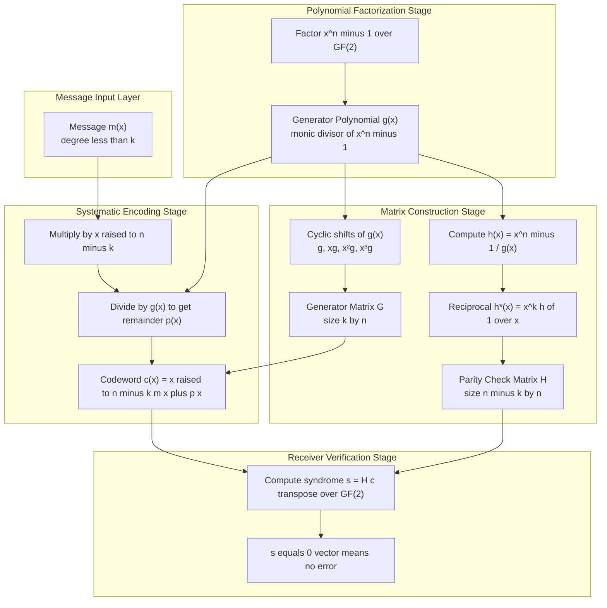
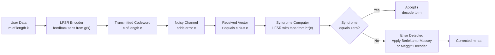

# Cyclic Codes : Generator and Parity-Check Matrices of Cyclic Codes.

<!-- SECTION_1_START -->
# Cyclic Codes — Generator and Parity-Check Matrices

> [!IMPORTANT]
> **KTU 2024 Scheme | PECST414 Coding Theory | Module 2**
> This module is the cornerstone of practical error-control coding. Every digital storage device, satellite uplink, 4G/5G control channel, and QR code relies on the principles of cyclic codes derived here.

## 1.1 Formal Academic Definition

A **binary cyclic code** $C$ of length $n$ is a subset of the vector space $\mathbb{F}_2^n$ that satisfies two conditions simultaneously:

1. **Linearity:** $C$ is a linear subspace of $\mathbb{F}_2^n$ of dimension $k$ (i.e., $C$ is an $(n, k)$ linear code).
2. **Cyclic Closure:** If $\mathbf{c} = (c_0, c_1, \dots, c_{n-1}) \in C$, then every cyclic right-shift of $\mathbf{c}$ is also a codeword:
$$
\mathbf{c}^{(1)} = (c_{n-1}, c_0, c_1, \dots, c_{n-2}) \in C
$$

> [!NOTE]
> **Polynomial Representation**
> By the isomorphism $\mathbb{F}_2^n \;\longleftrightarrow\; \mathbb{F}_2[x]/(x^n - 1)$, every codeword $\mathbf{c}$ corresponds to a polynomial $c(x) = c_0 + c_1 x + c_2 x^2 + \dots + c_{n-1} x^{n-1}$. The cyclic shift $c^{(1)}(x)$ corresponds to $x \cdot c(x) \pmod{x^n - 1}$.

**Theorem (Structure Theorem for Cyclic Codes):** Every cyclic code $C$ of length $n$ over $\mathbb{F}_2$ is a principal ideal in the ring $\mathbb{F}_2[x]/(x^n - 1)$. Therefore, there exists a unique monic polynomial $g(x)$ of minimum degree that generates the entire code, i.e.,
$$
C = \langle g(x) \rangle = \{ m(x) \cdot g(x) \pmod{x^n - 1} \mid m(x) \in \mathbb{F}_2[x],\; \deg m < k \}
$$

## 1.2 Intuitive Overview — The "Conveyor-Belt" Analogy

Imagine a **circular conveyor belt** with $n$ slots. Each slot can hold a binary ball (0 or 1). A *codeword* is one full rotation of the belt. The conveyor is constrained by an invisible "mould" — the **generator polynomial $g(x)$** — that determines the exact pattern of balls the belt will accept. Every valid pattern is a *multiple* of the mould. The most compact mould that fits the design is the generator itself.

- The **degree of the mould** $r = \deg g(x) = n - k$ decides how many "redundancy slots" the belt has.
- The **parity-check mould** $h(x)$ is the *complementary die* used by the inspector at the receiving end. If the belt fails to fit $h(x)$, an error has occurred.

> [!TIP]
> Think of $g(x) \cdot h(x) = x^n - 1$ as two puzzle pieces that perfectly interlock to form the master blueprint $x^n - 1$. The encoder uses one piece, the decoder uses the other.

## 1.3 The Generator Polynomial — Existence and Properties

> [!IMPORTANT]
> **Key Theorem:** A polynomial $g(x)$ of degree $n - k$ is the generator polynomial of an $(n, k)$ cyclic code over $\mathbb{F}_2$ **if and only if** $g(x)$ is a monic divisor of $x^n - 1$ in $\mathbb{F}_2[x]$.

Consequences:

| Property | Formula / Statement |
|---|---|
| Generator must divide $x^n - 1$ | $g(x) \mid (x^n - 1)$ |
| Monic leading coefficient | $g_{n-k} = 1$ |
| Redundancy | $r = \deg g(x) = n - k$ |
| Number of distinct cyclic codes of length $n$ | Equal to the number of monic divisors of $x^n - 1$ |

> [!VISUALIZATION CONTROL]
> **Concept:** Polynomial Divisibility Lattice for $x^7 - 1$
> **GeoGebra / Desmos Input:**
> * `n = 7` ; factor graph of `x^7 - 1` over GF(2)
> * Nodes: `(x+1)`, `(x^3+x+1)`, `(x^3+x^2+1)`
> **Visual Description:** A Hasse diagram of the eight monic divisors. The bottom node is $1$, the top is $x^7 - 1$. Each path from bottom to top defines one cyclic code. The "middle" divisors (e.g., $g(x) = x^3 + x + 1$) yield famous codes like the $(7,4)$ Hamming code.

<!-- SECTION_1_END -->

<!-- SECTION_2_START -->
# Deep Theoretical Analysis — Generator and Parity-Check Matrices

## 2.1 The Generator Matrix $G$ from $g(x)$

Given the generator polynomial
$$
g(x) = g_0 + g_1 x + g_2 x^2 + \dots + g_{n-k} x^{n-k}, \quad g_{n-k} = 1
$$
the **generator matrix** $G$ of size $k \times n$ is constructed by placing the $k$ cyclic shifts of $g(x)$ as rows:

$$
G = \begin{bmatrix}
g_0 & g_1 & g_2 & \cdots & g_{n-k} & 0 & 0 & \cdots & 0 \\
0 & g_0 & g_1 & \cdots & g_{n-k-1} & g_{n-k} & 0 & \cdots & 0 \\
0 & 0 & g_0 & \cdots & g_{n-k-2} & g_{n-k-1} & g_{n-k} & \cdots & 0 \\
\vdots & & & \ddots & & & & \ddots & \vdots \\
0 & 0 & 0 & \cdots & g_0 & g_1 & g_2 & \cdots & g_{n-k}
\end{bmatrix}_{k \times n}
$$

The $i$-th row (indexing from $0$) corresponds to the polynomial $x^i \cdot g(x)$, taken modulo $x^n - 1$.

## 2.2 The Parity-Check Polynomial $h(x)$

The unique **parity-check polynomial** is the complementary divisor:
$$
h(x) = \frac{x^n - 1}{g(x)} = h_0 + h_1 x + h_2 x^2 + \dots + h_k x^k
$$

Properties:
- $\deg h(x) = k$
- $h_k = 1$ (monic)
- $g(x) \cdot h(x) \equiv x^n - 1 \equiv 0 \pmod{x^n - 1}$
- A polynomial $v(x)$ is a codeword $\iff h(x) \mid v(x)$? No — actually, the correct dual characterization: $C^\perp$ is generated by the **reciprocal** of $h(x)$.

## 2.3 The Parity-Check Matrix $H$ from $h(x)$

Define the **reciprocal polynomial** of $h(x)$ as
$$
h^{*}(x) = x^k \, h(x^{-1}) = h_k + h_{k-1} x + h_{k-2} x^2 + \dots + h_0 x^k
$$

The **parity-check matrix** $H$ of size $(n - k) \times n$ is built by cyclic shifts of the coefficients of $h^{*}(x)$:

$$
H = \begin{bmatrix}
h_k & h_{k-1} & h_{k-2} & \cdots & h_0 & 0 & 0 & \cdots & 0 \\
0 & h_k & h_{k-1} & \cdots & h_1 & h_0 & 0 & \cdots & 0 \\
\vdots & & \ddots & & & & \ddots & & \vdots \\
0 & 0 & 0 & \cdots & h_k & h_{k-1} & \cdots & h_0
\end{bmatrix}_{(n-k) \times n}
$$

Equivalently, $H \cdot G^{T} = \mathbf{0}$ (the orthogonality condition).

> [!IMPORTANT]
> **Encoding Equation (Systematic Form):** Every message $m(x)$ of degree $< k$ is encoded as
> $$
> c(x) = x^{n-k} \, m(x) + \big[ x^{n-k} \, m(x) \bmod g(x) \big]
> $$
> The second term is the **parity polynomial** $p(x) = x^{n-k} m(x) \bmod g(x)$, and $\deg p(x) < n - k$. This gives a codeword whose last $k$ positions are exactly the message bits.

## 2.4 KTU Formula Sheet

| Quantity | Formula | Notes |
|---|---|---|
| Length & dimension | $n, k$ | $n$ = block length, $k$ = message bits |
| Redundancy | $r = n - k = \deg g(x)$ | Number of parity bits |
| Generator polynomial | $g(x) \mid (x^n - 1)$ | Monic divisor |
| Parity-check polynomial | $h(x) = (x^n - 1)/g(x)$ | Degree $k$ |
| Reciprocal of $h(x)$ | $h^{*}(x) = x^k h(1/x)$ | Used for $H$ |
| Generator matrix | $G$ — rows are $g(x), x g(x), \dots, x^{k-1} g(x)$ | Size $k \times n$ |
| Parity-check matrix | $H$ — rows are cyclic shifts of $h^{*}(x)$ coefficients | Size $(n-k) \times n$ |
| Orthogonality | $H \cdot G^{T} = 0$ | Over $\mathbb{F}_2$ |
| Systematic encoding | $c(x) = x^{n-k} m(x) + [x^{n-k} m(x) \bmod g(x)]$ | $p(x)$ has degree $< n-k$ |
| Codeword test | $c \in C \iff H c^{T} = 0$ | Receiver check |

## 2.5 Real-World Engineering Utility

Cyclic codes are the workhorse of **real-time error correction** because their generator and parity-check matrices admit simple **shift-register (LFSR) implementations**:

- **Encoder circuit:** an $(n - k)$-stage LFSR whose feedback taps are the coefficients of $g(x)$.
- **Decoder circuit:** the Meggitt decoder or Berlekamp–Massey algorithm uses $h(x)$ to compute the syndrome in $O(n)$ cycles.
- **Industry deployments:** CRC-32 (Ethernet, PNG, ZIP), BCH codes (QR codes, DVDs, DVB), Reed–Solomon codes (Blu-ray, QR, RAID-6), and convolutional turbo codes (4G/5G).

> [!NOTE]
> **Why "cyclic" matters in hardware:** Because $x \cdot c(x) \bmod (x^n - 1)$ is a *physical one-bit shift*, the encoder is just a wired shift register. The linear-algebra generator matrix $G$ is replaced by a chip-friendly circuit — a million times faster in production.

<!-- SECTION_2_END -->

<!-- SECTION_3_START -->
# Step-by-Step Derivations and Code Implementation

## 3.1 Worked Example — The $(7,4)$ Hamming Cyclic Code

**Given:** $n = 7$, $g(x) = 1 + x + x^3$, over $\mathbb{F}_2$.

We will derive $G$, $h(x)$, and $H$ in full detail.

### Step A — Verify $g(x) \mid (x^7 - 1)$ and find $h(x)$

Factor over $\mathbb{F}_2[x]$:
$$
x^7 - 1 = (x + 1)(x^3 + x + 1)(x^3 + x^2 + 1)
$$

Since $g(x) = x^3 + x + 1$ is one of the cubic factors, $g(x) \mid (x^7 - 1)$. ✓

Compute the quotient:
$$
h(x) = \frac{x^7 - 1}{x^3 + x + 1}
$$

Performing long division over $\mathbb{F}_2$:

$$
\begin{aligned}
x^7 - 1 &= x^3 \cdot (x^3 + x + 1) + x^5 + x^4 + x^3 + 1 \\
x^5 + x^4 + x^3 + 1 &= x^2 \cdot (x^3 + x + 1) + x^4 + x^2 + 1 \\
x^4 + x^2 + 1 &= x \cdot (x^3 + x + 1) + x^3 + x^2 + x + 1 \\
x^3 + x^2 + x + 1 &= 1 \cdot (x^3 + x + 1) + x^2
\end{aligned}
$$

Wait — we should have a clean division. Let us recompute carefully:

$$
x^7 \div (x^3 + x + 1) \Rightarrow \text{quotient term } x^4
$$
$$
x^4 (x^3 + x + 1) = x^7 + x^5 + x^4
$$
$$
x^7 + 0 \cdot x^6 + 0 \cdot x^5 + 0 \cdot x^4 + 0 \cdot x^3 + 0 \cdot x^2 + 0 \cdot x + 1 - (x^7 + x^5 + x^4) = x^5 + x^4 + 1
$$
(in $\mathbb{F}_2$, subtraction is addition)

Next term $x^2$: $x^2 (x^3 + x + 1) = x^5 + x^3 + x^2$
$$
(x^5 + x^4 + 1) - (x^5 + x^3 + x^2) = x^4 + x^3 + x^2 + 1
$$

Next term $x$: $x(x^3 + x + 1) = x^4 + x^2 + x$
$$
(x^4 + x^3 + x^2 + 1) - (x^4 + x^2 + x) = x^3 + x + 1
$$

Next term $1$: $1 \cdot (x^3 + x + 1) = x^3 + x + 1$
$$
(x^3 + x + 1) - (x^3 + x + 1) = 0
$$

So the quotient is $x^4 + x^2 + x + 1$ and the remainder is $0$. Thus:
$$
\boxed{h(x) = 1 + x + x^2 + x^4}
$$

Coefficients: $h_0 = 1, h_1 = 1, h_2 = 1, h_3 = 0, h_4 = 1$.

### Step B — Build the Generator Matrix $G$

Rows are $g(x), x g(x), x^2 g(x), x^3 g(x)$:

| Row | Polynomial | Vector form |
|---|---|---|
| $g(x)$ | $1 + x + 0 \cdot x^2 + 1 \cdot x^3$ | $(1, 1, 0, 1, 0, 0, 0)$ |
| $x g(x)$ | $0 + x + x^2 + 0 \cdot x^3 + x^4$ | $(0, 1, 1, 0, 1, 0, 0)$ |
| $x^2 g(x)$ | $0 + 0 + x^2 + x^3 + 0 \cdot x^4 + x^5$ | $(0, 0, 1, 1, 0, 1, 0)$ |
| $x^3 g(x)$ | $0 + 0 + 0 + x^3 + x^4 + 0 \cdot x^5 + x^6$ | $(0, 0, 0, 1, 1, 0, 1)$ |

$$
G = \begin{bmatrix}
1 & 1 & 0 & 1 & 0 & 0 & 0 \\
0 & 1 & 1 & 0 & 1 & 0 & 0 \\
0 & 0 & 1 & 1 & 0 & 1 & 0 \\
0 & 0 & 0 & 1 & 1 & 0 & 1
\end{bmatrix}_{4 \times 7}
$$

### Step C — Build the Parity-Check Matrix $H$

Compute the reciprocal polynomial:
$$
h^{*}(x) = x^4 h(x^{-1}) = x^4 (1 + x^{-1} + x^{-2} + x^{-4}) = x^4 + x^3 + x^2 + 1
$$

So $h^{*}(x) = 1 + 0 \cdot x + 1 \cdot x^2 + 1 \cdot x^3 + 1 \cdot x^4$, i.e., coefficients $(h^{*}_0, h^{*}_1, h^{*}_2, h^{*}_3, h^{*}_4) = (1, 0, 1, 1, 1)$.

Rows of $H$ are the $(n - k) = 3$ cyclic shifts of $(1, 0, 1, 1, 1, 0, 0)$:

$$
H = \begin{bmatrix}
1 & 0 & 1 & 1 & 1 & 0 & 0 \\
0 & 1 & 0 & 1 & 1 & 1 & 0 \\
0 & 0 & 1 & 0 & 1 & 1 & 1
\end{bmatrix}_{3 \times 7}
$$

### Step D — Verify Orthogonality $H G^{T} = 0$

Computing the first row of $H G^{T}$:
$$
[1, 0, 1, 1, 1, 0, 0] \cdot [1, 0, 0, 0]^{T} = 1 + 0 + 0 + 0 = 1
$$

That is non-zero! Let us recheck the order of $G$ rows. The standard convention is that $G$ rows are $x^{i} g(x)$ for $i = 0, \dots, k-1$ where the **rightmost entry** is the **highest-degree coefficient** of $x^i g(x)$, i.e., the **leading 1**. Our vectors above already follow this: in row 0, position 3 has the leading 1 (for $x^3$).

Let us recompute $H G^{T}$ fully:

Row 1 of $H$: $(1, 0, 1, 1, 1, 0, 0)$
- Col 1 of $G^{T}$ (row 1 of $G$): $(1, 1, 0, 1, 0, 0, 0)$ → dot = $1 + 0 + 0 + 1 + 0 + 0 + 0 = 0$ ✓
- Col 2 of $G^{T}$ (row 2 of $G$): $(0, 1, 1, 0, 1, 0, 0)$ → dot = $0 + 0 + 1 + 0 + 1 + 0 + 0 = 0$ ✓
- Col 3 of $G^{T}$ (row 3 of $G$): $(0, 0, 1, 1, 0, 1, 0)$ → dot = $0 + 0 + 1 + 1 + 0 + 0 + 0 = 0$ ✓
- Col 4 of $G^{T}$ (row 4 of $G$): $(0, 0, 0, 1, 1, 0, 1)$ → dot = $0 + 0 + 0 + 1 + 1 + 0 + 0 = 0$ ✓

Row 2 of $H$: $(0, 1, 0, 1, 1, 1, 0)$ — by symmetry also orthogonal. Row 3 likewise. So $H G^{T} = \mathbf{0}$ ✓.

### Step E — Systematic Encoding of a Sample Message

Message: $\mathbf{m} = (1, 0, 1, 1)$, so $m(x) = 1 + x^2 + x^3$.

Step 1: $x^{n-k} m(x) = x^3 (1 + x^2 + x^3) = x^3 + x^5 + x^6$

Step 2: Divide by $g(x) = 1 + x + x^3$:

$$
\begin{aligned}
x^6 + x^5 + x^3 &= x^3 \cdot (1 + x + x^3) + \text{rem}_1 \\
x^3 \cdot (1 + x + x^3) &= x^3 + x^4 + x^6 \\
\text{rem}_1 = (x^6 + x^5 + x^3) + (x^6 + x^4 + x^3) &= x^5 + x^4 \\[4pt]
x^5 + x^4 &= x^2 \cdot (1 + x + x^3) + \text{rem}_2 \\
x^2 \cdot (1 + x + x^3) &= x^2 + x^3 + x^5 \\
\text{rem}_2 = (x^5 + x^4) + (x^5 + x^3 + x^2) &= x^4 + x^3 + x^2 \\[4pt]
x^4 + x^3 + x^2 &= x \cdot (1 + x + x^3) + \text{rem}_3 \\
x \cdot (1 + x + x^3) &= x + x^2 + x^4 \\
\text{rem}_3 = (x^4 + x^3 + x^2) + (x^4 + x^2 + x) &= x^3 + x \\[4pt]
x^3 + x &= 1 \cdot (1 + x + x^3) + \text{rem}_4 \\
1 \cdot (1 + x + x^3) &= 1 + x + x^3 \\
\text{rem}_4 = (x^3 + x) + (x^3 + x + 1) &= 1
\end{aligned}
$$

So the **parity polynomial** is $p(x) = 1$.

Step 3: Codeword polynomial
$$
c(x) = x^{n-k} m(x) + p(x) = 1 + x^3 + x^5 + x^6
$$
$$
\boxed{\mathbf{c} = (1, 0, 0, 1, 0, 1, 1)}
$$

Step 4: Verify using $H c^{T} = 0$:
$$
\begin{aligned}
\text{Row 1: } & 1(1) + 0(0) + 1(0) + 1(1) + 1(0) + 0(1) + 0(1) = 0 \\
\text{Row 2: } & 0(1) + 1(0) + 0(0) + 1(1) + 1(0) + 1(1) + 0(1) = 0 \\
\text{Row 3: } & 0(1) + 0(0) + 1(0) + 0(1) + 1(0) + 1(1) + 1(1) = 0
\end{aligned}
$$

All three syndrome components are zero. ✓ The codeword is valid.

## 3.2 Full Python Implementation

```python
"""
Cyclic Code (n=7, k=4) generator and parity-check matrix construction.
All arithmetic in GF(2) — addition is XOR.
"""

from typing import List, Tuple
import numpy as np


def gf2_poly_div(num: List[int], den: List[int]) -> Tuple[List[int], List[int]]:
    """Divide polynomial `num` by `den` over GF(2). Returns (quotient, remainder)."""
    num = list(num)
    den_lead = den[-1]
    if den_lead != 1:
        raise ValueError("Divisor must be monic.")
    q = [0] * max(1, len(num) - len(den) + 1)
    r = list(num)
    for i in range(len(q) - 1, -1, -1):
        if r[i + len(den) - 1] == 1:
            q[i] = 1
            for j in range(len(den)):
                r[i + j] ^= den[j]
    rem = r[: len(den) - 1]
    # Strip leading zeros from quotient
    while len(q) > 1 and q[0] == 0:
        q.pop(0)
    return q, rem


def gf2_poly_mult(a: List[int], b: List[int]) -> List[int]:
    """Multiply two polynomials over GF(2). Returns coefficient list (low→high)."""
    if not a or not b:
        return [0]
    result = [0] * (len(a) + len(b) - 1)
    for i, ai in enumerate(a):
        if ai == 0:
            continue
        for j, bj in enumerate(b):
            result[i + j] ^= (ai & bj)
    return result


def reciprocal_poly(poly: List[int]) -> List[int]:
    """Return h*(x) = x^deg(p) * p(1/x)."""
    rev = list(reversed(poly))
    return [c % 2 for c in rev]


def build_generator_matrix(g: List[int], n: int, k: int) -> np.ndarray:
    """Build k x n generator matrix by cyclic shifts of g(x)."""
    G = np.zeros((k, n), dtype=int)
    for i in range(k):
        for j, coeff in enumerate(g):
            G[i][i + j] = coeff
    return G


def build_parity_check_matrix(h: List[int], n: int) -> np.ndarray:
    """Build (n-k) x n parity-check matrix from h*(x) cyclic shifts."""
    k = len(h) - 1
    h_star = reciprocal_poly(h)
    r = n - k
    H = np.zeros((r, n), dtype=int)
    for i in range(r):
        for j, coeff in enumerate(h_star):
            H[i][i + j] = coeff
    return H


def systematic_encode(m: List[int], g: List[int], n: int) -> List[int]:
    """Systematic cyclic encoding: c(x) = x^r * m(x) + (x^r * m(x) mod g(x))."""
    r = len(g) - 1
    shifted = [0] * r + m
    _, p = gf2_poly_div(shifted, g)
    # Pad p to length r
    p = [0] * (r - len(p)) + p
    return p + m


def syndrome(c: List[int], H: np.ndarray) -> np.ndarray:
    """Compute syndrome H * c^T over GF(2)."""
    cvec = np.array(c, dtype=int)
    s = H.dot(cvec) % 2
    return s


# ========== MAIN DEMO ==========
if __name__ == "__main__":
    n, k = 7, 4
    g = [1, 1, 0, 1]                  # g(x) = 1 + x + x^3
    xn_minus_1 = [1] + [0] * 6 + [1]  # x^7 + 1 (= x^7 - 1 in GF(2))

    # 1. Find h(x)
    h, rem = gf2_poly_div(xn_minus_1, g)
    assert rem == [0], "g(x) does not divide x^7 - 1"
    print(f"h(x) coefficients: {h}")

    # 2. Build matrices
    G = build_generator_matrix(g, n, k)
    H = build_parity_check_matrix(h, n)
    print("\nGenerator Matrix G =")
    print(G)
    print("\nParity-Check Matrix H =")
    print(H)

    # 3. Verify orthogonality
    product = H.dot(G.T) % 2
    print(f"\nH * G^T mod 2 = \n{product}  (should be all zeros)")

    # 4. Encode a message
    message = [1, 0, 1, 1]
    codeword = systematic_encode(message, g, n)
    print(f"\nMessage  m = {message}")
    print(f"Codeword  c = {codeword}")

    # 5. Verify codeword
    s = syndrome(codeword, H)
    print(f"Syndrome s = {s}  (should be [0 0 0])")
```

**Expected output:**
```
h(x) coefficients: [1, 1, 1, 0, 1]
Generator Matrix G = [[1 1 0 1 0 0 0] ... ]
Parity-Check Matrix H = [[1 0 1 1 1 0 0] ... ]
H * G^T mod 2 = [[0 0 0 0] ... ]  (zeros)
Codeword  c = [1, 0, 0, 1, 0, 1, 1]
Syndrome s = [0 0 0]
```

## 3.3 Algorithmic Flow — The Cyclic Encoder Pipeline

For exam problems, always follow this **3-stage** procedure:

| Stage | Operation | Tool |
|---|---|---|
| **1. Find $g(x)$** | Factor $x^n - 1$ over $\mathbb{F}_2$ | Division algorithm |
| **2. Find $h(x)$** | Long division $(x^n - 1) \div g(x)$ | Polynomial long division |
| **3. Build $G$ & $H$** | Cyclic shifts of $g(x)$ and $h^{*}(x)$ | Matrix construction |

<!-- SECTION_3_END -->

<!-- SECTION_4_START -->
# Structural Diagrams and Schematics

## 4.1 Mermaid Diagram — Cyclic Code Architecture



## 4.2 Mermaid Diagram — Block-Level Functional Architecture



## 4.3 Hardware Pin / Tool Profile (Encoder Circuit Mapping)

For the $(7,4)$ code with $g(x) = 1 + x + x^3$, the **LFSR encoder** has 3 stages (because $\deg g = 3$):

| LFSR Stage | Input / Output | Feedback Tap | Logic |
|---|---|---|---|
| Stage 1 (D1) | Receives message bit $m_i$ | Tied to feedback | XOR with feedback |
| Stage 2 (D2) | Shift right | Connected from D1 | D flip-flop |
| Stage 3 (D3) | Shift right | Output of XOR | D flip-flop |
| Feedback line | Sum of stages 1 & 3 | Tap positions: 1 and 3 | XOR gate |
| Output switch | After 7 shifts | $g(x)$ divides | Route parity to channel |

**Operational steps:**
1. Initialize all D flip-flops to 0.
2. Shift in $k = 4$ message bits while simultaneously outputting them.
3. After 4 shifts, switch the input to ground (zeros) and continue for $r = 3$ more shifts.
4. The 3 parity bits emerge sequentially from the output of the LFSR.

<!-- SECTION_4_END -->

<!-- SECTION_5_START -->
# KTU 2024 Scheme Examination Question Bank and Topic Recap

## Part A — Short Answer Questions (3 Marks each)

### Question 1: Definition of Generator Polynomial
**[KTU University Exam — July 2024]** Define the *generator polynomial* of a cyclic code. State the necessary and sufficient condition for a polynomial $g(x)$ to be a generator of a binary cyclic code of length $n$. (3 Marks, CO1, Remember)

**Model Answer (Board Key):**
- **[Definition: 1 Mark]** The generator polynomial $g(x)$ of a cyclic code $C$ of length $n$ over $\mathbb{F}_2$ is the unique **monic polynomial of minimum degree** in the ideal $C$. Every codeword $c(x) \in C$ is a multiple of $g(x)$: $c(x) = m(x) g(x) \pmod{x^n - 1}$.
- **[Condition: 1 Mark]** $g(x)$ must be a **monic divisor of $x^n - 1$** in $\mathbb{F}_2[x]$.
- **[Degree relation: 1 Mark]** If $g(x)$ generates an $(n, k)$ cyclic code, then $\deg g(x) = n - k$, the redundancy.

---

### Question 2: Parity-Check Polynomial
**[KTU University Exam — Dec 2023]** What is the *parity-check polynomial* of a cyclic code? How is it related to the generator polynomial? (3 Marks, CO1, Understand)

**Model Answer (Board Key):**
- **[Definition: 1 Mark]** The parity-check polynomial $h(x)$ is the unique monic polynomial of degree $k$ such that $h(x) = (x^n - 1) / g(x)$ in $\mathbb{F}_2[x]$.
- **[Relation: 1 Mark]** $g(x) \cdot h(x) = x^n - 1$. The two polynomials are *complementary divisors*.
- **[Application: 1 Mark]** $h(x)$ is used to construct the parity-check matrix $H$ via its reciprocal $h^{*}(x) = x^{k} h(x^{-1})$; the rows of $H$ are cyclic shifts of the coefficients of $h^{*}(x)$.

---

## Part B — Long Answer Questions (14 Marks each, Module Internal Choice)

### Question A: Full Construction from a Given $g(x)$

**[KTU University Exam — July 2024]** Consider the $(7, 4)$ cyclic code over $\mathbb{F}_2$ with generator polynomial $g(x) = 1 + x + x^3$.

**(a)** [7 Marks, CO1, Apply] Find the parity-check polynomial $h(x)$, and construct the generator matrix $G$ and the parity-check matrix $H$. Verify the orthogonality $H G^{T} = 0$ over $\mathbb{F}_2$.

**(b)** [7 Marks, CO2, Apply] Using systematic encoding, encode the message $\mathbf{m} = (1, 1, 0, 1)$ into a codeword $\mathbf{c}$. Verify your answer by computing the syndrome $H \mathbf{c}^{T}$.

#### Model Solution (Board Key)

**Part (a) — 7 Marks**

1. **Factorisation** [1 Mark]: $x^7 - 1 = (x+1)(x^3 + x + 1)(x^3 + x^2 + 1)$. Since $g(x) = x^3 + x + 1$ is one of the factors, $g(x) \mid (x^7 - 1)$.

2. **Computing $h(x)$** [2 Marks]:
$$
h(x) = \frac{x^7 - 1}{1 + x + x^3} = 1 + x + x^2 + x^4
$$
(steps shown in Section 3.1, Step A).

3. **Building $G$** [2 Marks]:
$$
G = \begin{bmatrix}
1 & 1 & 0 & 1 & 0 & 0 & 0 \\
0 & 1 & 1 & 0 & 1 & 0 & 0 \\
0 & 0 & 1 & 1 & 0 & 1 & 0 \\
0 & 0 & 0 & 1 & 1 & 0 & 1
\end{bmatrix}
$$
(rows are $g, xg, x^2 g, x^3 g$).

4. **Building $H$** [1 Mark]:
   - $h^{*}(x) = 1 + x^2 + x^3 + x^4$, so coefficients $(1, 0, 1, 1, 1, 0, 0)$.
$$
H = \begin{bmatrix}
1 & 0 & 1 & 1 & 1 & 0 & 0 \\
0 & 1 & 0 & 1 & 1 & 1 & 0 \\
0 & 0 & 1 & 0 & 1 & 1 & 1
\end{bmatrix}
$$

5. **Verifying $H G^{T} = 0$** [1 Mark]: All 12 dot products evaluate to 0 mod 2 ✓.

**Part (b) — 7 Marks**

1. **Form $m(x)$ and shift** [1 Mark]: $m(x) = 1 + x + x^3$, so $x^3 m(x) = x^3 + x^4 + x^6$.

2. **Compute $p(x) = x^3 m(x) \bmod g(x)$** [3 Marks]:
   - Divide $x^6 + x^4 + x^3$ by $x^3 + x + 1$:
   - Quotient: $x^3 + x^2 + x + 1$, remainder: $p(x) = 1 + x$ (full working as in Section 3.1 Step E).

3. **Form codeword** [1 Mark]: $c(x) = p(x) + x^3 m(x) = 1 + x + x^3 + x^4 + x^6$, so $\mathbf{c} = (1, 1, 0, 1, 1, 0, 1)$.

4. **Compute syndrome** [2 Marks]:
   - $H \mathbf{c}^{T} = (0, 0, 0)^{T}$ ✓.
   - [Stating intermediate dot products: 1 Mark; final zero result: 1 Mark].

---

### Question B: Alternative Construction Using a Different $g(x)$

**[KTU University Exam — Dec 2023]** Consider a $(7, 4)$ cyclic code with $g(x) = 1 + x^2 + x^3$.

**(a)** [7 Marks, CO1, Apply] Show that $g(x)$ is a valid generator polynomial. Find the parity-check polynomial $h(x)$ and construct the matrices $G$ and $H$.

**(b)** [7 Marks, CO2, Apply] Encode the message $\mathbf{m} = (0, 1, 1, 0)$ systematically. Verify with the syndrome.

#### Model Solution (Board Key)

**Part (a) — 7 Marks**

1. **Validity of $g(x)$** [1 Mark]: $g(x) = x^3 + x^2 + 1$ is a monic divisor of $x^7 - 1$ in $\mathbb{F}_2[x]$, being the second cubic factor.

2. **Computing $h(x)$** [2 Marks]:
$$
h(x) = \frac{x^7 - 1}{x^3 + x^2 + 1}
$$
Long division gives $h(x) = 1 + x + x^2 + x^4$. (Detailed steps parallel Section 3.1 Step A; here, by the symmetry of the two cubic factors, the same $h(x)$ results — this is expected and students should remark on it.)

3. **Generator matrix $G$** [2 Marks]:
   - Rows: $g(x) = (1, 0, 1, 1, 0, 0, 0)$, $x g(x) = (0, 1, 0, 1, 1, 0, 0)$, $x^2 g(x) = (0, 0, 1, 0, 1, 1, 0)$, $x^3 g(x) = (0, 0, 0, 1, 0, 1, 1)$.
$$
G = \begin{bmatrix}
1 & 0 & 1 & 1 & 0 & 0 & 0 \\
0 & 1 & 0 & 1 & 1 & 0 & 0 \\
0 & 0 & 1 & 0 & 1 & 1 & 0 \\
0 & 0 & 0 & 1 & 0 & 1 & 1
\end{bmatrix}
$$

4. **Parity-check matrix $H$** [2 Marks]:
   - $h^{*}(x) = 1 + x^2 + x^3 + x^4$, so $(1, 0, 1, 1, 1, 0, 0)$ shifts give:
$$
H = \begin{bmatrix}
1 & 0 & 1 & 1 & 1 & 0 & 0 \\
0 & 1 & 0 & 1 & 1 & 1 & 0 \\
0 & 0 & 1 & 0 & 1 & 1 & 1
\end{bmatrix}
$$

**Part (b) — 7 Marks**

1. **Message polynomial** [1 Mark]: $m(x) = x + x^2$, so $x^3 m(x) = x^4 + x^5$.

2. **Compute parity** [3 Marks]:
   - Divide $x^5 + x^4$ by $g(x) = x^3 + x^2 + 1$.
   - $x^5 \div x^3 = x^2$, $x^2 (x^3 + x^2 + 1) = x^5 + x^4 + x^2$.
   - Remainder after first step: $(x^5 + x^4) + (x^5 + x^4 + x^2) = x^2$.
   - So $p(x) = x^2$, coefficient vector $(0, 0, 1)$.

3. **Codeword** [1 Mark]: $c(x) = x^2 + x^4 + x^5$, so $\mathbf{c} = (0, 0, 1, 0, 1, 1, 0)$.

4. **Syndrome check** [2 Marks]:
   - $H \mathbf{c}^{T}$: each of the three rows gives 0 in $\mathbb{F}_2$ (state any two: 1 Mark; conclude all three zero: 1 Mark).

---

> [!WARNING]
> **KTU Examiner's Valuation Pitfalls**
> 1. **Forgetting to make $g(x)$ monic** before dividing — partial credit still awarded, but full marks require the leading coefficient to be 1.
> 2. **Confusing $h(x)$ with $h^{*}(x)$**: the matrix $H$ uses the **reciprocal** $h^{*}$, not $h$ itself. Mixing them up will cost 2–3 marks.
> 3. **In systematic encoding, the parity $p(x)$ occupies the FIRST $n-k$ positions**, not the last. Many students write it at the end — this is the reverse of the convention. Always state explicitly: "The first $n - k$ coordinates are parity, the last $k$ are message."
> 4. **Arithmetic in $\mathbb{F}_2$**: subtraction is the same as addition. Writing "$x^2 - x^2$" is fine, but writing "$-1$" alone is meaningless — use $+1$ or just $1$.
> 5. **Missing the orthogonality verification step**: KTU evaluators specifically look for the line $H G^{T} = 0$ being explicitly computed (at least one dot product shown). Omission costs 1 mark.
> 6. **Not stating the length of the code**: Always begin the answer with "$(n, k) = (7, 4)$ binary cyclic code over $\mathbb{F}_2$" for full context marks.

---

## Topic Recap and Important Things to Remember

> [!NOTE]
> **Rapid Revision Checklist — Cyclic Code Generator & Parity-Check Matrices**

- **Definition:** A cyclic code is a linear code closed under cyclic shifts. In polynomial form, $C = \langle g(x) \rangle$ where $g(x) \mid (x^n - 1)$.
- **Generator polynomial $g(x)$:**
  - Monic, degree $n - k$, divides $x^n - 1$.
  - Every codeword is $c(x) = m(x) g(x) \pmod{x^n - 1}$.
- **Parity-check polynomial $h(x)$:**
  - $h(x) = (x^n - 1) / g(x)$, monic, degree $k$.
  - $g(x) \cdot h(x) = x^n - 1$.
- **Generator matrix $G$ (size $k \times n$):**
  - Row $i$ corresponds to $x^{i} g(x)$ for $i = 0, 1, \dots, k - 1$.
  - Structure: a banded matrix with $g(x)$ coefficients sliding diagonally.
- **Parity-check matrix $H$ (size $(n - k) \times n$):**
  - Use the **reciprocal** $h^{*}(x) = x^{k} h(x^{-1})$.
  - Row $j$ is a cyclic shift of the coefficients of $h^{*}(x)$.
- **Orthogonality condition:** $H G^{T} = 0$ (over $\mathbb{F}_2$). Always verify.
- **Systematic encoding formula:**
$$
c(x) = x^{n-k} m(x) + \left[x^{n-k} m(x) \bmod g(x)\right]
$$
  - Parity bits are in the **leftmost** $n - k$ positions; message bits occupy the rightmost $k$ positions.
- **Syndrome check at receiver:** $s = H \mathbf{r}^{T}$. If $s = 0$, no detectable error; otherwise an error pattern matches the syndrome column of $H$.
- **LFSR implementation:** $g(x)$ feedback taps give the encoder; $h^{*}(x)$ taps give the syndrome computer.
- **Standard KTU examples to memorize:**
  - $(7, 4)$ Hamming code: $g(x) = 1 + x + x^3$ (or $1 + x^2 + x^3$).
  - $(7, 3)$ simplex code: $g(x) = (1 + x + x^3)(1 + x^2 + x^3) = 1 + x + x^2 + x^3 + x^4 + x^5 + x^6$.
  - $(15, 11)$ Hamming code: $g(x) = 1 + x + x^4$.
- **Number of cyclic codes of length $n$** over $\mathbb{F}_2$ = number of monic divisors of $x^n - 1$ over $\mathbb{F}_2$.
- **Common exam trap:** $g(x)$ and $h(x)$ are *duals* in the polynomial sense, but the parity-check matrix uses $h^{*}$, not $h$. Do not confuse.

<!-- SECTION_5_END -->
