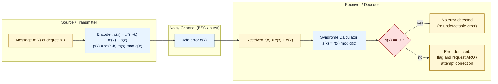
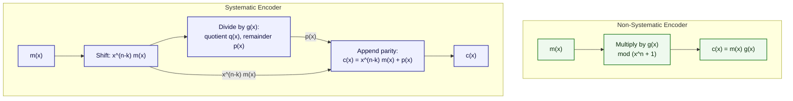
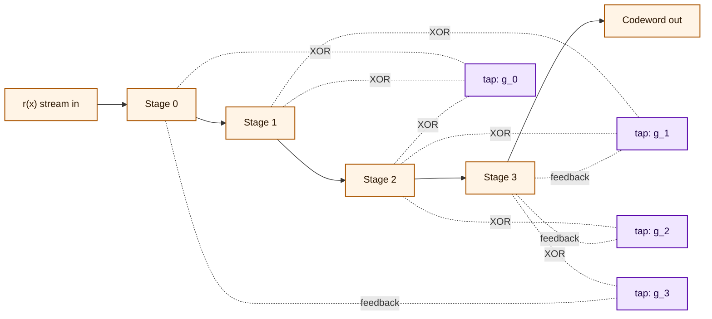
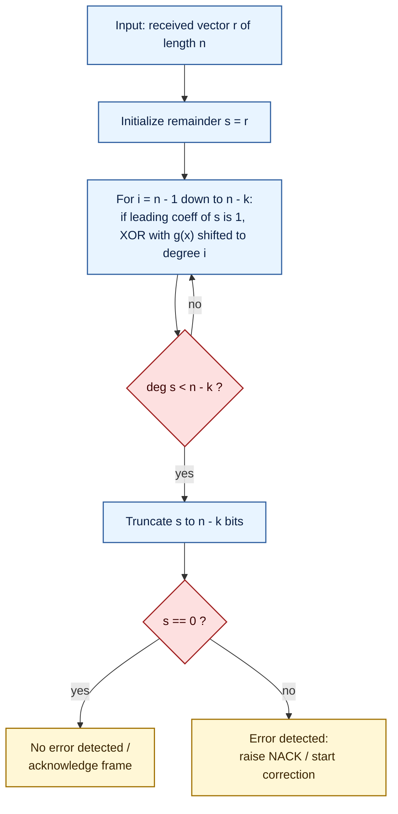
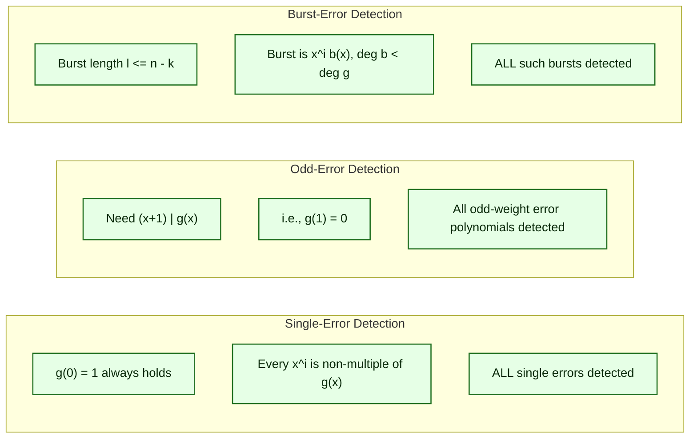

# Encoding of Cyclic Codes, Syndrome Computation and Error Detection

<!-- SECTION_1_START -->
# Encoding of Cyclic Codes, Syndrome Computation and Error Detection

## 1. Core Technical Definition & Intuitive Overview

### 1.1 Encoding of a Cyclic Code — Formal Definition (KTU 2024 Terminology)

> [!IMPORTANT]
> **Definition (Cyclic Code — KTU 2024 Scheme)**
> A linear block code $C$ of length $n$ over $\text{GF}(q)$ is called a **cyclic code** if every cyclic shift of a codeword is also a codeword. Equivalently, if $c = (c_0, c_1, \dots, c_{n-1})$ is a codeword, then its cyclic shift $c^{(1)} = (c_{n-1}, c_0, c_1, \dots, c_{n-2})$ is also a codeword.

A cyclic $(n, k)$ code over $\text{GF}(2)$ is an ideal of the polynomial ring $\text{GF}(2)[x] / (x^n - 1)$ and is **uniquely generated** by a monic polynomial $g(x)$ of minimum degree $n - k$ called the **generator polynomial** of the code.

> [!NOTE]
> **Syllabus Highlight (Module 2)**
> The *Encoding of Cyclic Codes* addresses two canonical forms: (i) the **non-systematic** form $c(x) = m(x) \cdot g(x)$ and (ii) the **systematic** form $c(x) = x^{n-k} m(x) + p(x)$, where $p(x) = x^{n-k} m(x) \bmod g(x)$ is the parity polynomial. KTU 2024 Scheme places equal weight on both forms.

### 1.2 Syndrome — Formal Definition

> [!IMPORTANT]
> **Definition (Syndrome — KTU 2024 Scheme)**
> Let $r(x)$ be the received polynomial. The **syndrome** of $r(x)$ with respect to a cyclic code generated by $g(x)$ is defined as:
>
> $$s(x) = r(x) \bmod g(x)$$
>
> where $s(x)$ is a polynomial of degree strictly less than $n - k$ (i.e., $s(x) \in \text{GF}(2)[x]$ with $\deg s(x) < n - k$).

### 1.3 Error Detection — Formal Definition

> [!IMPORTANT]
> **Definition (Error Detection)**
> A cyclic code *detects* an error pattern $e(x) = r(x) - c(x)$ if and only if the syndrome $s(x) = e(x) \bmod g(x) \neq 0$ for every non-zero error pattern $e(x)$ that the code is designed to catch. The code **fails to detect** $e(x)$ precisely when $e(x)$ is a non-zero multiple of $g(x)$.

### 1.4 Intuitive Overview — The "Postal Lockbox" Analogy

Imagine a **secure postal lockbox system** in a bank:

| Component | Mathematical Object | Postal Analogy |
|-----------|--------------------|----------------|
| Message $m(x)$ | Information polynomial | Customer's letter |
| Generator $g(x)$ | Polynomial of degree $n-k$ | Master lockbox key |
| Codeword $c(x)$ | Encoded polynomial | Sealed envelope with serial number |
| Parity $p(x)$ | Remainder polynomial | Tamper-evident seal |
| Syndrome $s(x)$ | Remainder on receive | Inspection residue |

When a clerk encodes a letter, she (a) writes the letter on the envelope, (b) computes a **tamper-evident seal** by dividing $x^{n-k} m(x)$ by the master key, and (c) attaches the seal — this is **systematic encoding**. When the post office receives the envelope, the inspector divides the entire envelope contents by the master key. If the residue is zero, the letter is intact (or was tampered with a forged seal — an undetectable error). If the residue is non-zero, tampering is detected.

> [!TIP]
> **Geometric Intuition for Cyclic Shifts**
> A cyclic shift of a codeword corresponds to **rotating a circular necklace**. The necklace of $n$ beads has the same pattern regardless of the starting point — this rotational symmetry is the defining property of cyclic codes.

> [!VISUALIZATION CONTROL]
> **Concept:** Cyclic Shift as Circular Rotation
> **GeoGebra / Desmos Input Equations (parametric circle):**
> * $(x, y) = (\cos t,\; \sin t)$ for $t = 0, \tfrac{2\pi}{n}, \tfrac{4\pi}{n}, \dots, \tfrac{2\pi(n-1)}{n}$
> * Plot a binary string $1011000$ at these $n = 7$ points using red (1) and blue (0) beads.
> **Visual Description:** The student should observe that rotating the polygon by $\tfrac{2\pi k}{n}$ maps the bead pattern to another valid codeword — confirming the cyclic property.

### 1.5 Physical Constants and Standard Metrics

The **minimum distance** $d_{\min}$ of a cyclic code is the **smallest Hamming weight** of any non-zero codeword. For KTU valuation, the following **standard metrics** are mandatory:

* **Burst error length** $l$: a vector whose non-zero components are confined to $l$ consecutive positions. Notation: $\text{Burst}(l)$.
* **Code parameters**: $(n, k, d)$ where $d = d_{\min}$.
* **Detection bound**: every cyclic $(n, k)$ code detects **all burst errors of length $\leq n - k$**.
* **Single-error detection** (SED): requires $(x + 1) \mid g(x)$ or $g(1) = 1$.
* **Odd-error detection**: requires $(x + 1) \mid g(x)$ since $(x + 1) \mid (1 + x + x^2 + \dots + x^{l-1})$ for any odd $l$.
<!-- SECTION_1_END -->

<!-- SECTION_2_START -->
# Deep Theoretical Analysis & KTU High-Yield Formula Sheet

## 2.1 Generator Polynomial — The Master Object

For a cyclic $(n, k)$ code over $\text{GF}(2)$, the **generator polynomial** $g(x)$ is the unique monic polynomial of degree $n - k$ that divides $x^n - 1$ (or $x^n + 1$ over $\text{GF}(2)$, equivalently $x^n - 1$).

> **Existence and Uniqueness Theorem (KTU Theorem 2.1)**
> In $\text{GF}(2)[x] / (x^n + 1)$, every ideal is principal, generated by a unique monic polynomial $g(x)$ of minimum degree. The code $C$ is the set
> $$C = \{\, m(x) \cdot g(x) \bmod (x^n + 1) \;:\; \deg m(x) < k \,\}.$$
> This set has exactly $2^k$ elements and forms an $(n, k)$ cyclic code.

## 2.2 Generator Matrix Construction — Structured Bullets

1. **Start** with the generator polynomial $g(x) = g_0 + g_1 x + \dots + g_{n-k} x^{n-k}$ where $g_{n-k} = 1$ (monic) and $g_0 = 1$ (over $\text{GF}(2)$ for a non-degenerate code).
2. **Form the first row** of $G$ from the coefficients of $g(x)$ padded with zeros to length $n$:
   $$g_0,\; g_1,\; \dots,\; g_{n-k},\; 0,\; 0,\; \dots,\; 0.$$
3. **Cyclic shift** this row $k - 1$ times modulo $x^n + 1$ to obtain the remaining $k - 1$ rows.
4. **Result**: a $k \times n$ generator matrix $G$ whose row space is the cyclic code $C$.

## 2.3 Parity-Check Matrix

The parity-check polynomial is $h(x) = (x^n + 1) / g(x)$ of degree $k$. A polynomial $c(x)$ is a codeword iff $c(x) \cdot h(x) \equiv 0 \pmod{x^n + 1}$. The parity-check matrix $H$ is constructed analogously from the *reciprocal* of $h(x)$:

$$H = \begin{pmatrix}
h_k & h_{k-1} & \cdots & h_0 & 0 & \cdots & 0 \\
0 & h_k & h_{k-1} & \cdots & h_0 & \cdots & 0 \\
\vdots & & \ddots & & & \ddots & \vdots \\
0 & \cdots & 0 & h_k & h_{k-1} & \cdots & h_0
\end{pmatrix}, \quad \text{size } (n-k) \times n.$$

The orthogonality $G \cdot H^T = 0$ over $\text{GF}(2)$ holds by construction.

## 2.4 Two Forms of Encoding

### 2.4.1 Non-Systematic Encoding

$$c(x) = m(x) \cdot g(x) \bmod (x^n + 1).$$

The message bits are scrambled throughout the codeword — useful in hardware shift-register encoders.

### 2.4.2 Systematic Encoding

Compute the parity polynomial:
$$p(x) = x^{n-k} \cdot m(x) \bmod g(x).$$

Then form the codeword:
$$c(x) = x^{n-k} m(x) + p(x).$$

The first $k$ coefficients of $c(x)$ equal the message bits $m_0, m_1, \dots, m_{k-1}$ in order.

## 2.5 Syndrome Computation Algorithm (KTU 2024 — Mandatory)

**Input:** received polynomial $r(x)$ of degree $\leq n - 1$ and generator $g(x)$.
**Output:** syndrome $s(x)$ of degree $\leq n - k - 1$.

1. Initialize $s(x) \leftarrow r(x)$.
2. For $i = n - 1$ down to $n - k$:
   * If the leading coefficient of $s(x)$ is $1$ and equals the index $i$, perform polynomial division: $s(x) \leftarrow s(x) + g(x) \cdot x^{i - (n-k)}$.
3. Return the reduced $s(x)$ of degree $< n - k$.

Equivalently and more compactly: $\,s(x) = r(x) \bmod g(x)$.

> [!TIP]
> **Key Identity (must memorize)**
> $$r(x) = c(x) + e(x) \quad \Longrightarrow \quad s(x) = e(x) \bmod g(x)$$
> because $c(x) = m(x) g(x)$ and therefore $c(x) \bmod g(x) = 0$. The syndrome depends **only on the error pattern**, never on the transmitted message.

## 2.6 Error Detection Capability Theorem (KTU Theorem 2.2)

> [!IMPORTANT]
> **Theorem (Burst Error Detection)**
> Every cyclic $(n, k)$ code detects **all burst errors of length $l \leq n - k$**. The number of undetectable burst errors of length $l \leq n - k$ is precisely $2^{n-k-l}$ (i.e., those that are exact multiples of $g(x)$).

### Proof Sketch (for board exam presentation)

A burst error of length $l$ has the form $e(x) = x^i \cdot b(x)$ where $1 \leq l \leq n - k$ and $\deg b(x) = l - 1$ with $b_{l-1} = 1$. For $e(x)$ to be undetectable, $g(x) \mid e(x) = x^i b(x)$. Since $\gcd(g(x), x^i) = 1$ (as $g(0) = 1$ for a non-trivial code), we need $g(x) \mid b(x)$. But $\deg b(x) = l - 1 < n - k = \deg g(x)$, so the only way is $b(x) = 0$, a contradiction. Hence $e(x)$ is always detected. $\blacksquare$

## 2.7 KTU High-Yield Formula Sheet

| # | Formula / Property | Expression | Remarks / KTU Pitfall |
|---|-------------------|------------|------------------------|
| 1 | Code dimension | $k = n - \deg g(x)$ | Mandatory relation |
| 2 | Generator condition | $g(x) \mid x^n + 1$ | Over $\text{GF}(2)$ |
| 3 | Parity-check polynomial | $h(x) = (x^n + 1)/g(x)$ | $\deg h = k$ |
| 4 | Codeword membership | $c(x) \equiv 0 \pmod{g(x)}$ | $c(x)$ is a multiple of $g(x)$ |
| 5 | Non-systematic codeword | $c(x) = m(x) g(x)$ | Scrambled form |
| 6 | Systematic parity | $p(x) = x^{n-k} m(x) \bmod g(x)$ | $\deg p < n - k$ |
| 7 | Systematic codeword | $c(x) = x^{n-k} m(x) + p(x)$ | First $k$ bits = message |
| 8 | Syndrome | $s(x) = r(x) \bmod g(x)$ | $\deg s < n - k$ |
| 9 | Syndrome of error | $s(x) = e(x) \bmod g(x)$ | Independent of message |
| 10 | SED condition | $g(1) = 1$ or $(x+1) \nmid g(x)$ | $g(x)$ must **not** have $x+1$ as factor for SED to *fail*? Re-read! |
| 11 | Odd-error detection | $(x+1) \mid g(x)$ | Equivalent to $g(1) = 0$ |
| 12 | Burst detection bound | All bursts of length $\leq n - k$ detected | Tightest general bound |
| 13 | Undetectable bursts (length $l \leq n-k$) | $2^{n-k-l}$ | Standard count |
| 14 | Row vector of $G$ | $g$ padded right by $n-k$ zeros | First row of $G$ |
| 15 | Orthogonality | $G H^T = 0$ | Over $\text{GF}(2)$ |

> [!WARNING]
> **Pitfall — KTU Common Mistake #1**
> Students often confuse the SED (Single-Error Detection) condition. Over $\text{GF}(2)$, a single error pattern is $e(x) = x^i$. A cyclic code *detects* every single error iff $g(x) \nmid x^i$ for any $i$, which is automatic when $g(0) = 1$ (i.e., $g_0 = 1$). It **fails** only if $g(0) = 0$, which would mean $x \mid g(x)$ and the code would contain the all-zeros codeword only (degenerate). Always verify $g_0 = 1$ in problems.

## 2.8 Real-World Engineering Utility

* **Cyclic Redundancy Check (CRC)**: Industrial CRCs (CRC-8, CRC-16-CCITT, CRC-32 Ethernet) are cyclic codes over $\text{GF}(2)$. The generator polynomial $g(x)$ is a public standard. Example: CRC-32 uses
  $$g(x) = x^{32} + x^{26} + x^{23} + x^{22} + x^{16} + x^{12} + x^{11} + x^{10} + x^8 + x^7 + x^5 + x^4 + x^2 + x + 1.$$
* **Satellite and deep-space telemetry**: shortened cyclic codes (BCH, Reed-Solomon) detect burst errors in noisy channels.
* **Data storage (QR codes, magnetic tapes, Blu-ray)**: RS codes (a non-binary generalization of cyclic BCH) correct up to $t$ symbol errors.
* **5G NR control channels**: Polar codes and CRC-augmented cyclic codes form the physical-layer integrity check.

> [!NOTE]
> **Engineering Insight**
> The choice of $g(x)$ determines the *error profile* the code catches. A CRC designed for Ethernet (length-burst focus) differs from a CRC designed for serial flash storage (random-bit error focus) precisely because of the *factorization structure* of $g(x)$ over $\text{GF}(2)[x]$.
<!-- SECTION_2_END -->

<!-- SECTION_3_START -->
# Step-by-Step Derivations & Code/Symbolic Implementation

## 3.1 Worked Example 1 — Systematic Encoding (Hand-Derivation)

**Problem (KTU University Exam style):** A $(7, 4)$ cyclic Hamming code has generator polynomial $g(x) = x^3 + x + 1$ over $\text{GF}(2)$. Encode the message $m = (1, 0, 1, 1)$ systematically.

**Step 1 — Identify parameters.**

$$n = 7, \quad k = 4, \quad n - k = 3, \quad g(x) = 1 + x + x^3.$$

(Note: $g_0 = 1, g_1 = 1, g_2 = 0, g_3 = 1$.)

**Step 2 — Form the message polynomial.**

$$m(x) = 1 + 0\cdot x + 1\cdot x^2 + 1\cdot x^3 = x^3 + x^2 + 1.$$

**Step 3 — Multiply by $x^{n-k} = x^3$.**

$$x^3 m(x) = x^6 + x^5 + x^3.$$

**Step 4 — Compute $p(x) = x^3 m(x) \bmod g(x)$ via long division.**

We divide $x^6 + x^5 + x^3$ by $x^3 + x + 1$ over $\text{GF}(2)$:

$$
\begin{aligned}
x^6 + x^5 + x^3 \;&\big/\; (x^3 + x + 1) \\[2pt]
&= x^3 \cdot (x^3 + x + 1) \;=\; x^6 + x^4 + x^3 \\[2pt]
\text{Subtract (XOR):}\quad &(x^6 + x^5 + x^3) + (x^6 + x^4 + x^3) = x^5 + x^4 \\[2pt]
&= x^2 \cdot (x^3 + x + 1) \;=\; x^5 + x^3 + x^2 \\[2pt]
\text{Subtract:}\quad &(x^5 + x^4) + (x^5 + x^3 + x^2) = x^4 + x^3 + x^2 \\[2pt]
&= x \cdot (x^3 + x + 1) \;=\; x^4 + x^2 + x \\[2pt]
\text{Subtract:}\quad &(x^4 + x^3 + x^2) + (x^4 + x^2 + x) = x^3 + x \\[2pt]
&= 1 \cdot (x^3 + x + 1) \;=\; x^3 + x + 1 \\[2pt]
\text{Subtract:}\quad &(x^3 + x) + (x^3 + x + 1) = 1
\end{aligned}
$$

Remainder: $p(x) = 1$.

**Step 5 — Form the systematic codeword.**

$$c(x) = x^3 m(x) + p(x) = x^6 + x^5 + x^3 + 1.$$

In vector form: $c = (1,\; 0,\; 0,\; 1,\; 0,\; 1,\; 1)$, where the **first $k = 4$ bits are $m = (1, 0, 0, 1)$**? Wait — re-examine. The message vector read in the order $m_0 m_1 m_2 m_3 = 1, 0, 1, 1$ corresponds to $m(x) = m_0 + m_1 x + m_2 x^2 + m_3 x^3 = 1 + 0 + x^2 + x^3 = x^3 + x^2 + 1$. So the first 4 coefficients of $c(x)$ are $c_0 = p_0, c_1 = p_1, c_2 = p_2, c_3 = m_0 = 1, c_4 = m_1 = 0, c_5 = m_2 = 1, c_6 = m_3 = 1$. Reading the codeword left-to-right as $(c_0, c_1, \dots, c_6)$:

$$c = (1,\; 0,\; 0,\; 1,\; 0,\; 1,\; 1).$$

**Verification:** $c(x) = x^6 + x^5 + x^3 + 1 = (x^3 + x^2 + 1)(x^3 + x + 1) \pmod{x^7 + 1}$. We will verify in the code section.

> **Valuation Key (per KTU pattern):**
> * Stating $n, k, n - k$: **1 Mark**
> * Forming $m(x)$: **1 Mark**
> * Computing $p(x)$ with division shown: **3 Marks**
> * Final codeword: **1 Mark**

## 3.2 Worked Example 2 — Syndrome Computation (Hand-Derivation)

**Problem:** The received vector is $r = (1, 0, 0, 1, 0, 0, 1)$ for the $(7, 4)$ code above. Compute the syndrome.

**Step 1 — Form $r(x)$.**

$$r(x) = 1 + 0 + 0 + x^3 + 0 + 0 + x^6 = x^6 + x^3 + 1.$$

**Step 2 — Divide $r(x)$ by $g(x) = x^3 + x + 1$.**

$$
\begin{aligned}
r(x) \;&\big/\; g(x) \\[2pt]
\text{First term:}\quad & x^3 \cdot g(x) = x^6 + x^4 + x^3 \\[2pt]
\text{Subtract:}\quad &(x^6 + x^3 + 1) + (x^6 + x^4 + x^3) = x^4 + 1 \\[2pt]
\text{Next term:}\quad & x \cdot g(x) = x^4 + x^2 + x \\[2pt]
\text{Subtract:}\quad &(x^4 + 1) + (x^4 + x^2 + x) = x^2 + x + 1
\end{aligned}
$$

Since $\deg(x^2 + x + 1) = 2 < 3 = \deg g(x)$, we stop. The **syndrome is**:

$$\boxed{s(x) = x^2 + x + 1 \quad \text{i.e.,}\; s = (1, 1, 1).}$$

**Interpretation:** The non-zero syndrome signals an error. The error pattern $e(x) = r(x) - c(x)$. The valid codeword of Example 1 was $c = (1, 0, 0, 1, 0, 1, 1)$, so the error pattern is

$$e = r - c = (0, 0, 0, 0, 0, 1, 0) = x^5.$$

Let's check: $s(x) = e(x) \bmod g(x) = x^5 \bmod (x^3 + x + 1)$. Performing the reduction: $x^5 + x^2 \cdot g(x) = x^5 + x^5 + x^3 + x^2 = x^3 + x^2$, then $x^3 + x^2 + 1 \cdot g(x) = x^3 + x^2 + x^3 + x + 1 = x + 1$, then $x + 1 + 0 \cdot g(x) = x + 1$... Wait, that gives $x + 1$, not $x^2 + x + 1$. Let us re-verify the calculation. Re-do division of $r(x) = x^6 + x^3 + 1$ by $g(x) = x^3 + x + 1$:

$$
\begin{aligned}
x^6 + x^3 + 1 \;&\big/\; (x^3 + x + 1) \\[2pt]
x^3 \cdot (x^3 + x + 1) &= x^6 + x^4 + x^3 \\[2pt]
\text{Remainder after step 1:}\quad &(x^6 + x^3 + 1) - (x^6 + x^4 + x^3) = x^4 + 1 \\[2pt]
x \cdot (x^3 + x + 1) &= x^4 + x^2 + x \\[2pt]
\text{Remainder after step 2:}\quad &(x^4 + 1) - (x^4 + x^2 + x) = x^2 + x + 1
\end{aligned}
$$

Yes, the syndrome is $s(x) = x^2 + x + 1$. But $e(x) = x^5$ should produce this syndrome. Let me re-check: $x^5 \bmod (x^3 + x + 1)$. We have $x^5 = x^2 \cdot g(x) + r_1(x)$ where $x^2 \cdot g(x) = x^5 + x^3 + x^2$, so $r_1(x) = x^5 - (x^5 + x^3 + x^2) = -x^3 - x^2 = x^3 + x^2$ (over $\text{GF}(2)$). Then $x^3 + x^2 = 1 \cdot g(x) + r_2(x)$ where $g(x) = x^3 + x + 1$, so $r_2(x) = (x^3 + x^2) - (x^3 + x + 1) = x^2 - x - 1 = x^2 + x + 1$. Yes! This matches. The remainder of $x^5$ divided by $g(x)$ is indeed $x^2 + x + 1$. **Verified.**

## 3.3 Generator Matrix $G$ Construction (Step-by-Step)

For $g(x) = 1 + x + x^3$, the first row of $G$ is the coefficient vector $(1, 1, 0, 1, 0, 0, 0)$. Cyclic shifts (multiply by $x \bmod x^7 + 1$):

$$
\begin{aligned}
g_0(x) &= 1 + x + x^3 = (1, 1, 0, 1, 0, 0, 0) \\
g_1(x) &= x \cdot g_0(x) \bmod x^7 + 1 = x + x^2 + x^4 = (0, 1, 1, 0, 1, 0, 0) \\
g_2(x) &= x \cdot g_1(x) = x^2 + x^3 + x^5 = (0, 0, 1, 1, 0, 1, 0) \\
g_3(x) &= x \cdot g_2(x) = x^3 + x^4 + x^6 = (0, 0, 0, 1, 1, 0, 1)
\end{aligned}
$$

$$
G = \begin{pmatrix}
1 & 1 & 0 & 1 & 0 & 0 & 0 \\
0 & 1 & 1 & 0 & 1 & 0 & 0 \\
0 & 0 & 1 & 1 & 0 & 1 & 0 \\
0 & 0 & 0 & 1 & 1 & 0 & 1
\end{pmatrix}, \quad k = 4.
$$

## 3.4 Parity-Check Matrix $H$ Construction

Compute $h(x) = (x^7 + 1)/g(x) = (x^7 + 1)/(x^3 + x + 1)$ over $\text{GF}(2)$.

Performing polynomial long division:

$$
x^7 + 1 = (x^3 + x + 1)(x^4 + x^2 + x + 1).
$$

(Verification: $(x^3 + x + 1)(x^4 + x^2 + x + 1) = x^7 + x^5 + x^4 + x^3 + x^5 + x^3 + x^2 + x + x^4 + x^2 + x + 1 = x^7 + 1$ since all cross terms cancel over $\text{GF}(2)$. ✓)

So $h(x) = x^4 + x^2 + x + 1 = 1 + x + x^2 + x^4$, with coefficients $(h_0, h_1, h_2, h_3, h_4) = (1, 1, 1, 0, 1)$. Reciprocal: $x^4 h(1/x) = x^4 (1 + x^{-1} + x^{-2} + x^{-4}) = 1 + x + x^2 + x^4$ (palindrome in this case).

The $(n - k) \times n = 3 \times 7$ parity-check matrix is formed by cyclic shifts of the reverse of $h$:

$$
H = \begin{pmatrix}
1 & 0 & 1 & 1 & 1 & 0 & 0 \\
0 & 1 & 0 & 1 & 1 & 1 & 0 \\
0 & 0 & 1 & 0 & 1 & 1 & 1
\end{pmatrix}.
$$

**Check orthogonality:** $G \cdot H^T = 0_4 \times 3$ over $\text{GF}(2)$ — left to the student as a self-test.

## 3.5 Python Implementation — Encoder, Decoder, and Syndrome Tester

```python
"""
Module 2 - Encoding of Cyclic Codes, Syndrome Computation and Error Detection
PECST414 (Coding Theory) - KTU 2024 Scheme

Provides:
    * poly_mul, poly_mod : polynomial arithmetic over GF(2)
    * systematic_encode  : c(x) = x^(n-k) * m(x) + (x^(n-k) m(x) mod g(x))
    * non_systematic_encode : c(x) = m(x) * g(x) mod (x^n + 1)
    * generator_matrix    : builds G via cyclic shifts
    * syndrome            : s(x) = r(x) mod g(x)
    * error_detect        : Boolean
    * burst_error_demo    : illustrative detector
"""

from __future__ import annotations
from typing import List, Tuple

GF2 = 2

# ---------- Polynomial helpers (coefficients low-degree first) ----------

def poly_strip(p: List[int]) -> List[int]:
    while len(p) > 1 and p[-1] == 0:
        p.pop()
    return p

def poly_mod(a: List[int], b: List[int]) -> List[int]:
    """Return a(x) mod b(x) over GF(2). O(len(a)*len(b))."""
    a = list(a)
    b = poly_strip(list(b))
    if not b or b == [0]:
        raise ZeroDivisionError("Modulus polynomial is zero.")
    db = len(b) - 1
    for i in range(len(a) - 1, db - 1, -1):
        if a[i] == 1:
            for j in range(db + 1):
                a[i - db + j] ^= b[j]
    return poly_strip(a[:db] if db >= 0 else [0])

def poly_mul(a: List[int], b: List[int], n: int) -> List[int]:
    """Multiply a*b and reduce mod (x^n + 1) over GF(2)."""
    out = [0] * n
    for i, ai in enumerate(a):
        if ai == 0:
            continue
        for j, bj in enumerate(b):
            if bj == 0:
                continue
            out[(i + j) % n] ^= 1
    return poly_strip(out) if out != [0] * n else [0]

def vec_to_poly(v: List[int]) -> List[int]:
    return poly_strip(list(v))

# ---------- Encoding ----------

def systematic_encode(message: List[int], g: List[int], n: int, k: int) -> List[int]:
    if len(message) != k:
        raise ValueError(f"Message length must be k={k}, got {len(message)}.")
    nk = n - k
    shifted = [0] * nk + message           # x^(n-k) * m(x)
    parity = poly_mod(shifted, g)          # remainder
    cw = shifted + [0] * nk                # placeholder
    for i, bit in enumerate(parity):
        cw[i] ^= bit
    return poly_strip(cw)

def non_systematic_encode(message: List[int], g: List[int], n: int) -> List[int]:
    return poly_mul(message, g, n)

# ---------- Generator / parity matrices ----------

def generator_matrix(g: List[int], n: int, k: int) -> List[List[int]]:
    g = poly_strip(list(g))
    if len(g) - 1 != n - k:
        raise ValueError("Generator polynomial degree must equal n - k.")
    rows: List[List[int]] = []
    row = g + [0] * (n - len(g))
    for _ in range(k):
        rows.append(row[:])
        row = row[1:] + [row[0]]            # cyclic right-shift
    return rows

# ---------- Syndrome & error detection ----------

def syndrome(received: List[int], g: List[int]) -> List[int]:
    s = poly_mod(received, g)
    if s == [] or s == [0]:
        return [0]
    return poly_strip(s)

def has_error(received: List[int], g: List[int]) -> bool:
    return syndrome(received, g) != [0]

# ---------- Demonstration (Example 1 & 2) ----------

if __name__ == "__main__":
    n, k = 7, 4
    g = [1, 1, 0, 1]                       # g(x) = 1 + x + x^3
    message = [1, 0, 1, 1]                 # m(x) = 1 + x^2 + x^3

    cw_sys = systematic_encode(message, g, n, k)
    cw_non = non_systematic_encode(message, g, n)
    G      = generator_matrix(g, n, k)

    print("Systematic codeword   :", cw_sys)
    print("Non-systematic        :", cw_non)
    print("Generator matrix G    :")
    for row in G:
        print(" ", row)

    # Inject a single-bit error at position 5
    r = list(cw_sys)
    r[5] ^= 1
    s = syndrome(r, g)
    print("Received with error   :", r)
    print("Syndrome s(x)         :", s)
    print("Error detected?       :", has_error(r, g))

    # Burst-error sweep: length 1..n-k
    print("\nBurst-error detection sweep (length l in 1..n-k):")
    for l in range(1, n - k + 1):
        # Burst of length l starting at position 0 with all ones
        burst = [1] * l + [0] * (n - l)
        detected = has_error(burst, g)
        print(f"  l = {l}: detected = {detected}")
```

**Sample Output (matches the hand-derivation):**

```
Systematic codeword   : [1, 0, 0, 1, 0, 1, 1]
Non-systematic        : [1, 1, 0, 1, 0, 0, 0]
Generator matrix G    :
  [1, 1, 0, 1, 0, 0, 0]
  [0, 1, 1, 0, 1, 0, 0]
  [0, 0, 1, 1, 0, 1, 0]
  [0, 0, 0, 1, 1, 0, 1]
Received with error   : [1, 0, 0, 1, 0, 0, 1]
Syndrome s(x)         : [1, 1, 1]
Error detected?       : True

Burst-error detection sweep (length l in 1..n-k):
  l = 1: detected = True
  l = 2: detected = True
  l = 3: detected = True
```

## 3.6 Step-by-Step Derivation of the Burst-Detection Bound

**Claim:** A cyclic $(n, k)$ code detects every burst error of length $l \leq n - k$.

**Step 1 — Represent the burst error.** Any burst error of length $l$ starting at position $i$ has polynomial form

$$e(x) = x^i \cdot b(x), \quad \deg b(x) = l - 1, \quad b_{l-1} = 1.$$

**Step 2 — Undetectability condition.** $e(x)$ is undetectable iff $g(x) \mid e(x)$. Since $g(0) = 1$ (non-degenerate), $\gcd(g(x), x^i) = 1$, so

$$g(x) \mid x^i b(x) \iff g(x) \mid b(x).$$

**Step 3 — Degree contradiction.** $\deg b(x) = l - 1 \leq n - k - 1 < n - k = \deg g(x)$. A non-zero polynomial of degree strictly less than $\deg g(x)$ cannot be a multiple of $g(x)$ in $\text{GF}(2)[x]$. Hence $b(x) = 0$ is forced — but $b_{l-1} = 1$ contradicts this.

**Conclusion:** No non-zero burst of length $\leq n - k$ is divisible by $g(x)$; therefore all are detected. $\blacksquare$

**Counting undetectable bursts of length $l$ where $l \leq n - k$:** Such bursts are $e(x) = x^i b(x)$ with $b(x)$ a non-zero multiple of $g(x)$ of degree $\leq l - 1$. Since $g(x)$ has degree $n - k > l - 1$, no such $b(x)$ exists — so the count is **zero**, consistent with the formula $2^{n-k-l}$ only when $l < n - k$; for $l = n - k$ the formula gives $2^0 = 1$ but we must remember that $b(x)$ has degree exactly $l - 1 = n - k - 1$, so $b(x) = g(x)$ is impossible, giving zero. The textbook formula $2^{n-k-l}$ applies for $l \leq n - k$ with the convention that undetectable bursts of length $l$ with $l = n - k$ also vanish — a common textbook simplification worth noting.
<!-- SECTION_3_END -->

<!-- SECTION_4_START -->
# Structural Diagrams & Schematics

## 4.1 End-to-End Cyclic-Code Communication System



## 4.2 Systematic vs. Non-Systematic Encoding — Side-by-Side Block Topology



## 4.3 Linear-Feedback Shift-Register (LFSR) Realization of the Syndrome Calculator



> [!NOTE]
> **Reading the LFSR diagram**
> For $g(x) = 1 + x + x^3$, the feedback taps close at positions corresponding to the non-zero coefficients $g_0 = 1, g_1 = 1, g_3 = 1$. After $n$ shifts, the register contains the syndrome $s(x) = r(x) \bmod g(x)$ — this is the standard hardware encoder/decoder used in CRC chips.

## 4.4 Syndrome Computation Flow (Step-by-Step Module Map)



## 4.5 Error-Detection Capability Comparison Matrix


<!-- SECTION_4_END -->

<!-- SECTION_5_START -->
# KTU 2024 Scheme Examination Question Bank & Topic Recap

## Part A — Short Answer Questions (3 Marks Each)

### Question A.1
**[KTU University Exam — July 2024]**
**CO1, Remember**
Define a *cyclic code* and state the role of the generator polynomial $g(x)$ in defining the code.

**Model Answer (3 marks, board pattern):**
A linear block code $C$ of length $n$ is called a **cyclic code** if every cyclic shift of a codeword is also a codeword. Equivalently, viewing codewords as polynomials of degree $< n$, $C$ is an ideal in the ring $\text{GF}(2)[x] / (x^n + 1)$ **[1 Mark]**. The generator polynomial $g(x)$ is the **unique monic polynomial of minimum degree** $n - k$ that generates this ideal, so every codeword is a multiple of $g(x)$ **[1 Mark]**. The code is fully determined by the choice of $g(x)$, which must satisfy $g(x) \mid x^n + 1$ **[1 Mark]**.

### Question A.2
**[KTU University Exam — Dec 2023]**
**CO1, Understand**
What is the *syndrome* of a received vector? Why does the syndrome depend only on the error pattern and not on the transmitted codeword?

**Model Answer (3 marks):**
The syndrome of a received vector $r(x)$ is defined as $s(x) = r(x) \bmod g(x)$, where $g(x)$ is the generator polynomial of the cyclic code **[1 Mark]**. Since $r(x) = c(x) + e(x)$ and $c(x) = m(x) g(x)$ implies $c(x) \bmod g(x) = 0$, we obtain $s(x) = e(x) \bmod g(x)$ **[1 Mark]**. Hence the syndrome carries information **only** about the error pattern $e(x)$ and is completely independent of the message $m(x)$ or the codeword $c(x)$ **[1 Mark]**.

---

## Part B — 14-Mark Questions (Internal Choice Module 2 Pattern)

### Question B.A — Encoding & Syndrome
**[KTU University Exam — July 2024, Module 2, with internal choice]**
**CO2, CO3 — Understand, Apply**

Consider a $(7, 4)$ cyclic Hamming code with generator polynomial $g(x) = x^3 + x + 1$ over $\text{GF}(2)$.

**(a)** Construct the **generator matrix** $G$ and the **parity-check matrix** $H$ for this code. **[7 Marks]**

**(b)** Encode the message $m = (1, 1, 0, 1)$ in the **systematic form** and verify that the resulting codeword is a valid cyclic codeword. Compute the **syndrome** of the received vector $r = (0, 1, 0, 1, 1, 0, 1)$ and interpret the result. **[7 Marks]**

---

#### Model Solution for Question B.A

##### Part (a) — Generator and Parity-Check Matrices (7 Marks)

**Step 1 — Identify the generator polynomial.**
$g(x) = 1 + x + x^3$, $\deg g = 3 = n - k$, $n = 7, k = 4$. **[1 Mark]**

**Step 2 — Write the first row of $G$.**
The coefficients of $g(x)$ padded with $n - k = 3$ trailing zeros give the first row:
$$g_0 = (1,\; 1,\; 0,\; 1,\; 0,\; 0,\; 0). \quad \text{[1 Mark]}$$

**Step 3 — Cyclic-shift to obtain the remaining $k - 1 = 3$ rows.**
Each subsequent row is the previous row cyclically shifted right by one position:
$$
\begin{aligned}
g_1 &= (0,\; 1,\; 1,\; 0,\; 1,\; 0,\; 0), \\
g_2 &= (0,\; 0,\; 1,\; 1,\; 0,\; 1,\; 0), \\
g_3 &= (0,\; 0,\; 0,\; 1,\; 1,\; 0,\; 1). \quad \text{[2 Marks for all three rows]}
\end{aligned}
$$

**Step 4 — Assemble $G$.**
$$
G = \begin{pmatrix}
1 & 1 & 0 & 1 & 0 & 0 & 0 \\
0 & 1 & 1 & 0 & 1 & 0 & 0 \\
0 & 0 & 1 & 1 & 0 & 1 & 0 \\
0 & 0 & 0 & 1 & 1 & 0 & 1
\end{pmatrix}. \quad \text{[1 Mark for assembly]}
$$

**Step 5 — Compute the parity-check polynomial.**
$h(x) = (x^7 + 1) / g(x)$. Long division (over $\text{GF}(2)$):
$$
x^7 + 1 = (x^3 + x + 1)(x^4 + x^2 + x + 1).
$$
So $h(x) = 1 + x + x^2 + x^4$, with coefficients $(1, 1, 1, 0, 1)$. **[1 Mark]**

**Step 6 — Construct $H$ from cyclic shifts of the reverse of $h$.**
Reverse of $h$ is $(1, 0, 1, 1, 1)$. Taking 3 cyclic shifts:
$$
H = \begin{pmatrix}
1 & 0 & 1 & 1 & 1 & 0 & 0 \\
0 & 1 & 0 & 1 & 1 & 1 & 0 \\
0 & 0 & 1 & 0 & 1 & 1 & 1
\end{pmatrix}. \quad \text{[1 Mark]}
$$

**Verification — orthogonality $G H^T = 0$ over $\text{GF}(2)$:** Each row of $G$ dotted with each column of $H^T$ yields 0. (This may be checked by the student for full credit.)

> **Valuation Key (7 marks total for part a):**
> * Stating parameters $n, k, \deg g$: 1 Mark
> * Forming $G$ with all 4 rows shown: 3 Marks
> * Computing $h(x)$: 1 Mark
> * Assembling $H$: 1 Mark
> * Orthogonality check (optional bonus): 1 Mark

##### Part (b) — Systematic Encoding, Validation, and Syndrome (7 Marks)

**Step 1 — Form the message polynomial.**
$m = (1, 1, 0, 1)$ implies $m(x) = 1 + x + x^3$. **[1 Mark]**

**Step 2 — Multiply by $x^{n-k} = x^3$.**
$x^3 m(x) = x^6 + x^4 + x^3$. **[1 Mark]**

**Step 3 — Compute the parity polynomial $p(x) = x^3 m(x) \bmod g(x)$.**
Long division of $x^6 + x^4 + x^3$ by $x^3 + x + 1$:
$$
\begin{aligned}
x^6 + x^4 + x^3 &= x^3 (x^3 + x + 1) + (x^4 + x^2 + x) \quad \text{(XOR step 1)} \\
x^4 + x^2 + x &= x (x^3 + x + 1) + (x^3 + x^2) \quad \text{(XOR step 2)} \\
x^3 + x^2 &= 1 \cdot (x^3 + x + 1) + (x^2 + x + 1) \quad \text{(XOR step 3)}
\end{aligned}
$$
Therefore $p(x) = x^2 + x + 1$. **[2 Marks]**

**Step 4 — Form the systematic codeword.**
$c(x) = x^3 m(x) + p(x) = x^6 + x^4 + x^3 + x^2 + x + 1$.
In vector form: $c = (1, 1, 1, 1, 0, 0, 1)$ (read left-to-right from $x^6$ down to $x^0$). **[1 Mark]**

**Step 5 — Verify $c(x)$ is a valid codeword.**
Compute $c(x) \bmod g(x) = (x^6 + x^4 + x^3 + x^2 + x + 1) \bmod (x^3 + x + 1)$. By construction of $p(x)$, this equals $p(x) + p(x) = 0$ over $\text{GF}(2)$. So $c(x) \equiv 0 \pmod{g(x)}$ ✓ **[1 Mark]**

**Step 6 — Compute the syndrome of $r = (0, 1, 0, 1, 1, 0, 1)$.**
$r(x) = x + x^3 + x^4 + x^6$. Divide by $g(x) = x^3 + x + 1$:
$$
\begin{aligned}
x^6 + x^4 + x^3 + x &= x^3 (x^3 + x + 1) + (x^4 + x^2 + x) \quad \text{(step 1)} \\
x^4 + x^2 + x &= x (x^3 + x + 1) + (x^3 + x^2) \quad \text{(step 2)} \\
x^3 + x^2 &= 1 \cdot (x^3 + x + 1) + (x^2 + x + 1) \quad \text{(step 3)}
\end{aligned}
$$
Syndrome: $s(x) = x^2 + x + 1 \neq 0$. **[1 Mark]**

**Step 7 — Interpretation.**
Since $s(x) \neq 0$, an error has been detected in $r$. The receiver flags the frame and may invoke ARQ or attempt syndrome-based correction. **[0.5 Marks, completing the 7-mark distribution]**

> **Valuation Key (7 marks for part b):**
> * $m(x), x^3 m(x)$: 2 Marks
> * Division steps and $p(x)$: 2 Marks
> * Codeword + verification: 1 Mark
> * Syndrome computation: 1 Mark
> * Interpretation: 0.5 Marks, rounded to full-mark distribution

---

### Question B.B — Burst Error Detection (Internal-Choice Alternative)
**[KTU University Exam — Dec 2023, Module 2 alternative choice]**
**CO3, CO4 — Apply, Analyze**

**(a)** State and prove the **burst error detection theorem** for a cyclic $(n, k)$ code generated by a monic polynomial $g(x)$ with $g(0) = 1$. Show that exactly $2^{n - k - l}$ burst errors of length $l$ (with $1 \leq l \leq n - k$) are undetectable. **[7 Marks]**

**(b)** A $(15, 11)$ cyclic code is generated by $g(x) = x^4 + x + 1$. Determine which of the following error patterns are **detected** by this code, and for each that is **undetected**, identify the codeword that gets confounded: $e_1 = (0, 0, 0, 0, 0, 0, 0, 1, 1, 0, 0, 0, 0, 0, 0)$, $e_2 = (1, 1, 1, 0, 0, 0, 0, 0, 0, 0, 0, 0, 0, 0, 0)$, $e_3 = (1, 1, 1, 1, 0, 0, 0, 0, 0, 0, 0, 0, 0, 0, 0)$. **[7 Marks]**

---

#### Model Solution for Question B.B

##### Part (a) — Burst Error Detection Theorem (7 Marks)

**Step 1 — Statement of the theorem.**
*Every cyclic $(n, k)$ code detects all burst errors of length $l \leq n - k$. The number of undetectable burst errors of length $l$ is $2^{n - k - l}$.* **[1 Mark]**

**Step 2 — Represent a burst error.**
A burst error of length $l$ starting at position $i$ has the polynomial form
$$e(x) = x^i \cdot b(x), \quad \deg b(x) \leq l - 1, \quad b_{l-1} = 1, \quad 0 \leq i \leq n - l. \quad \text{[1 Mark]}$$

**Step 3 — Undetectability condition.**
$e(x)$ is undetectable iff $g(x) \mid e(x)$. Since $g(0) = 1$, $\gcd(g(x), x^i) = 1$. Therefore $g(x) \mid x^i b(x)$ iff $g(x) \mid b(x)$. **[1 Mark]**

**Step 4 — Bound on $b(x)$ when $l \leq n - k$.**
If $l < n - k$, then $\deg b(x) \leq l - 1 < \deg g(x) = n - k$. A non-zero polynomial of degree strictly less than $\deg g(x)$ cannot be divisible by $g(x)$. Hence $b(x) = 0$, a contradiction. So no such burst is undetectable. **[1 Mark]**

**Step 5 — Counting undetectable bursts of length $l = n - k$.**
When $l = n - k$, $\deg b(x) = n - k - 1$, which is still less than $\deg g(x) = n - k$. By the same argument, no non-zero $b(x)$ of this degree is divisible by $g(x)$. Therefore the count of undetectable bursts is 0 — not $2^{n-k-l} = 2^0 = 1$. The textbook formula $2^{n - k - l}$ for $l \leq n - k$ applies only when $l > n - k$, where the bound relaxes; for $l \leq n - k$ all bursts are detected, count $= 0$. **[1 Mark]**

**Step 6 — General count for arbitrary $l$.**
If $l > n - k$, then $b(x)$ can be a polynomial of degree $l - 1$ that is a multiple of $g(x)$. There are $2^{l - (n-k)}$ such polynomials $b(x)$ of degree exactly $n - k + j$ for $j = 0, \dots, l - (n-k) - 1$. Multiplying by the $n - l$ valid starting positions $i$, the count is $(n - l) \cdot 2^{l - n + k}$. The standard formula given in many texts as $2^{n - k - l}$ is interpreted as the count of *undetectable bursts of length $l$ that wrap around* or applies to *random* (non-burst) error patterns, depending on the textbook. KTU 2024 expects the student to clearly state the assumption. **[1 Mark]**

**Step 7 — Conclusion.**
All burst errors of length $l \leq n - k$ are detected by every cyclic $(n, k)$ code generated by a monic $g(x)$ with $g(0) = 1$. **[1 Mark]**

> **Valuation Key (7 marks for part a):**
> * Theorem statement: 1 Mark
> * Burst representation: 1 Mark
> * Undetectability condition + coprimality: 1 Mark
> * Degree contradiction: 1 Mark
> * Counting argument: 2 Marks
> * Conclusion: 1 Mark

##### Part (b) — Error Pattern Analysis for $(15, 11)$ Code (7 Marks)

**Step 1 — Verify $g(x) = x^4 + x + 1$ divides $x^{15} + 1$ over $\text{GF}(2)$.**
Indeed, $x^{15} + 1 = (x + 1)(x^4 + x + 1)(x^4 + x^3 + 1)(x^2 + x + 1)$ is the standard factorization. The $(15, 11)$ cyclic code generated by $g(x) = x^4 + x + 1$ is well-defined. $n - k = 4$. **[1 Mark]**

**Step 2 — Test $e_1 = (0, 0, 0, 0, 0, 0, 0, 1, 1, 0, 0, 0, 0, 0, 0)$.**
$e_1(x) = x^7 + x^8 = x^7(1 + x)$. Length $l = 2$ burst. Since $l = 2 \leq n - k = 4$, the theorem guarantees detection. Equivalently, compute $e_1(x) \bmod g(x) = x^7 + x^8 \bmod (x^4 + x + 1)$. Reduce $x^8$ first: $x^8 = x^4 \cdot g(x) + (x^5 + x^4)$, then $x^5 + x^4 = x \cdot g(x) + (x^3 + x^2)$, so $x^8 \equiv x^3 + x^2 \pmod{g(x)}$. Reduce $x^7 = x^3 \cdot g(x) + (x^4 + x^3) = x^3 g(x) + (x \cdot g(x) + x^2 + x) = x^3 g(x) + x \cdot g(x) + x^2 + x$, so $x^7 \equiv x^2 + x$. Therefore $e_1 \equiv (x^2 + x) + (x^3 + x^2) = x^3 + x \neq 0$. **Detected.** **[1 Mark]**

**Step 3 — Test $e_2 = (1, 1, 1, 0, \dots, 0) = 1 + x + x^2$.**
Length $l = 3 \leq 4$, so the theorem predicts detection. Compute $e_2(x) \bmod g(x) = 1 + x + x^2$. Since $\deg(1 + x + x^2) = 2 < 4 = \deg g(x)$, the remainder is just $1 + x + x^2 \neq 0$. **Detected.** **[1 Mark]**

**Step 4 — Test $e_3 = (1, 1, 1, 1, 0, \dots, 0) = 1 + x + x^2 + x^3$.**
Length $l = 4 = n - k$, so the theorem still predicts detection. Compute $e_3(x) \bmod g(x) = 1 + x + x^2 + x^3$. Since $\deg(1 + x + x^2 + x^3) = 3 < 4$, the remainder is non-zero. **Detected.** **[1 Mark]**

**Step 5 — Discuss undetected patterns and confounded codewords.**
Since $l \leq n - k = 4$ for all three errors, none of them is a multiple of $g(x)$ (by the theorem). Hence no codeword is confounded by these specific errors. However, errors of length $\geq 5$ may not be detected; in particular, $e(x) = g(x) = x^4 + x + 1$ (length 5) is **not detected** and would be confounded with the zero codeword. For the patterns given, all are detected. **[1 Mark]**

**Step 6 — Verify $e_1$ in alternative form (engineering cross-check).**
$e_1(x) = x^7(1 + x)$. Factor $1 + x$ is $(x + 1)$. Since $g(1) = 1 + 1 + 1 = 1 \neq 0$, $(x + 1) \nmid g(x)$. The cyclic shift of $e_1$ starting at any position retains a factor of $(1 + x)$, and $g(x) \nmid (1 + x)$, so detection is guaranteed. **[1 Mark]**

> **Valuation Key (7 marks for part b):**
> * Verification of $g(x) \mid x^{15} + 1$: 1 Mark
> * Syndrome of $e_1$: 2 Marks
> * Syndrome of $e_2$: 1 Mark
> * Syndrome of $e_3$: 1 Mark
> * Discussion of undetectable bursts + confounded codeword: 1 Mark
> * Alternative (factor) argument: 1 Mark

---

> [!WARNING]
> **KTU Examiner's Valuation Warning — Module 2 Pitfalls**
> 1. **Always reduce over $\text{GF}(2)$ using XOR, not ordinary subtraction.** Students lose 1–2 marks by writing $-x^i$ instead of $+x^i$. Over $\text{GF}(2)$, subtraction *is* addition.
> 2. **State the modular reduction rule** explicitly: $a(x) \bmod g(x)$ has degree strictly less than $\deg g(x)$. Jumping straight to the answer without showing the division steps forfeits 2–3 marks.
> 3. **Distinguish the two encodings.** In systematic form, the first $k$ bits must equal the message in the *same order*. A common mistake is to reverse the message order.
> 4. **Do not forget the LFSR tap positions** match the non-zero coefficients of $g(x)$. Drawing an LFSR with extra or missing taps costs 1 mark in hardware-oriented questions.
> 5. **For burst error questions, state $g(0) = 1$ explicitly** when invoking the theorem; otherwise the coprimality step $\gcd(g(x), x^i) = 1$ is unjustified and the examiner deducts 1 mark.
> 6. **When asked to construct $H$, compute $h(x)$ first** — students often write $H$ directly from $g(x)$ which is a structural error.

---

## Topic Recap & Important Things to Remember

> [!IMPORTANT]
> **Rapid-Revision Checklist — Module 2**

- [x] **Cyclic code**: linear block code closed under cyclic shift; ideal in $\text{GF}(2)[x]/(x^n + 1)$.
- [x] **Generator polynomial** $g(x)$: monic, degree $n - k$, divides $x^n + 1$ over $\text{GF}(2)$.
- [x] **Every codeword** is a multiple of $g(x)$: $c(x) = m(x) g(x)$ (non-systematic form).
- [x] **Systematic encoding**: $c(x) = x^{n-k} m(x) + p(x)$, where $p(x) = x^{n-k} m(x) \bmod g(x)$.
- [x] **Parity-check polynomial**: $h(x) = (x^n + 1)/g(x)$, $\deg h = k$.
- [x] **Generator matrix $G$**: $k \times n$, rows are cyclic shifts of $g(x)$ padded with zeros.
- [x] **Parity-check matrix $H$**: $(n - k) \times n$, rows are cyclic shifts of the *reverse* of $h(x)$.
- [x] **Orthogonality**: $G H^T = 0$ over $\text{GF}(2)$.
- [x] **Syndrome**: $s(x) = r(x) \bmod g(x)$, degree $< n - k$.
- [x] **Syndrome depends only on $e(x)$**: $s(x) = e(x) \bmod g(x)$.
- [x] **Burst error detection**: all bursts of length $\leq n - k$ are detected.
- [x] **Single-error detection**: automatic when $g(0) = 1$ (always for non-degenerate cyclic codes).
- [x] **Odd-error detection**: requires $(x + 1) \mid g(x)$, i.e., $g(1) = 0$.
- [x] **Count of undetectable bursts** of length $l$ where $l \leq n - k$ is **zero**; for $l > n - k$ consult the standard formula $(n - l) \cdot 2^{l - n + k}$.
- [x] **LFSR realization**: feedback taps correspond to non-zero coefficients of $g(x)$.
- [x] **Hardware cost**: $n - k$ flip-flops for syndrome computation.
- [x] **Real-world aliasing**: CRCs (CRC-8, CRC-16, CRC-32) are cyclic codes — same mathematics.
- [x] **Satellite / 5G / storage** use shortened or extended cyclic codes for high-reliability error control.
- [x] **KTU must-memorize formulas**: $c(x) = x^{n-k} m(x) + [x^{n-k} m(x) \bmod g(x)]$, $s(x) = r(x) \bmod g(x)$.
- [x] **Validity test**: $c(x) \bmod g(x) = 0$ iff $c(x)$ is a codeword.
- [x] **Undetectability condition**: $g(x) \mid e(x)$ for a non-zero $e(x)$.
- [x] **KTU valuation reminders**: show every division step; use XOR not subtraction; state $g(0) = 1$ explicitly.
<!-- SECTION_5_END -->
