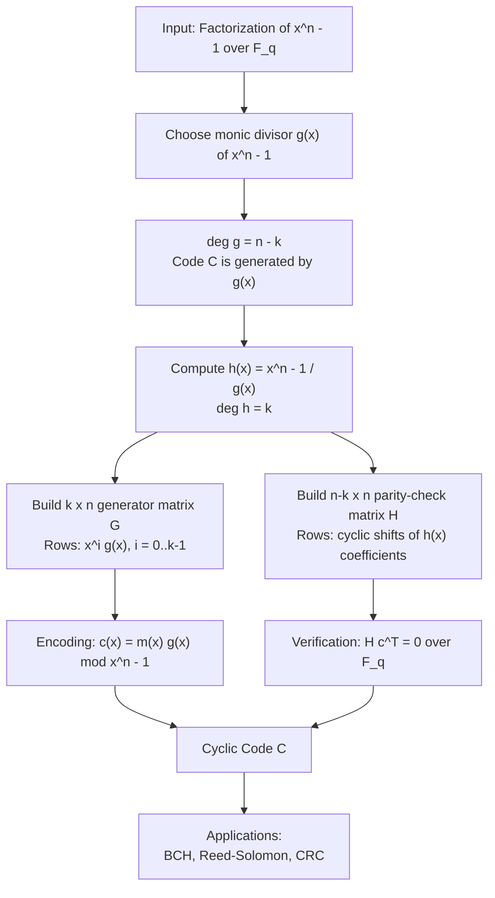
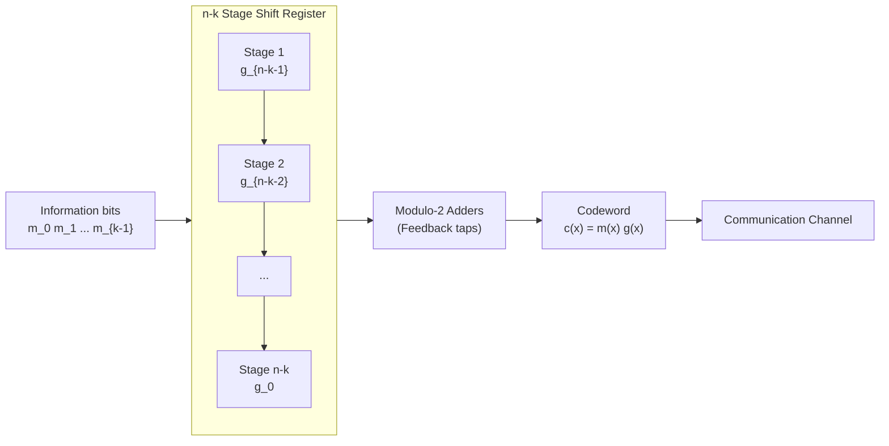
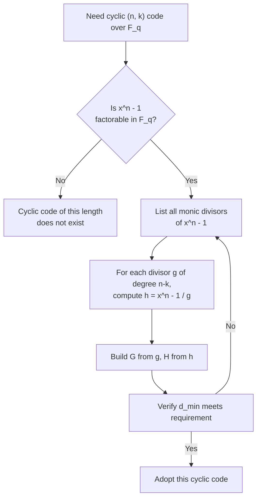
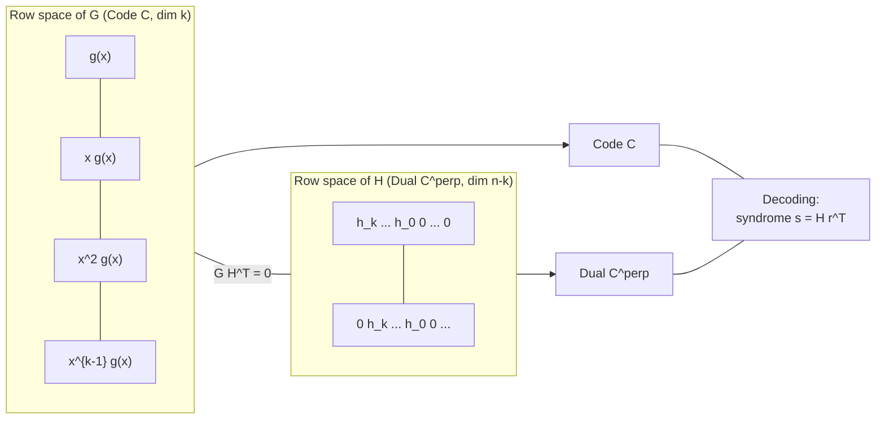

# Cyclic Codes: Generator and Parity-Check Matrices of Cyclic Codes

> **APJ ABDUL KALAM TECHNOLOGICAL UNIVERSITY (KTU) | 2024 SCHEME**
> - **Branch:** B.Tech in Computer Science & Engineering (CSE)
> - **Semester:** Semester 4
> - **Course:** PECST414 - CODING THEORY
> - **Module:** Module 2: Cyclic Codes
> - **Topic:** Cyclic Codes: Generator and Parity-Check Matrices of Cyclic Codes

<!-- SECTION_1_START -->
# 1. Core Technical Definition & Intuitive Overview

## 1.1 Formal Definition of a Cyclic Code

A **cyclic code** is a special class of linear block code over the finite field $\mathbb{F}_q$ (typically $\mathbb{F}_2$ for binary codes) with the additional property that **every cyclic shift of a codeword is also a codeword**.

Let $C$ be a linear $(n, k)$ block code over $\mathbb{F}_q$. Then $C$ is called a **cyclic code** if and only if for every codeword $\mathbf{c} = (c_0, c_1, \ldots, c_{n-1}) \in C$, the cyclically shifted vector

$$\mathbf{c}^{(1)} = (c_{n-1}, c_0, c_1, \ldots, c_{n-2})$$

is also a codeword in $C$. This property must hold for all $i$-th cyclic shifts where $1 \le i \le n-1$.

> [!IMPORTANT]
> **KTU Syllabus Definition (PECST414 — Module 2):**
> A cyclic code of length $n$ over $\mathbb{F}_q$ is an ideal in the polynomial ring $\mathbb{F}_q[x] / (x^n - 1)$. Every such ideal is principal and generated by a unique monic polynomial $g(x)$ of minimum degree, called the **generator polynomial**.

## 1.2 Polynomial Representation

A codeword $\mathbf{c} = (c_0, c_1, \ldots, c_{n-1})$ is associated with a **code polynomial** of degree at most $n-1$:

$$c(x) = c_0 + c_1 x + c_2 x^2 + \cdots + c_{n-1} x^{n-1}$$

The **cyclic shift** $\mathbf{c}^{(1)} = (c_{n-1}, c_0, \ldots, c_{n-2})$ corresponds to the polynomial:

$$x \cdot c(x) \pmod{x^n - 1}$$

because $x \cdot c(x) = c_0 x + c_1 x^2 + \cdots + c_{n-1} x^n$, and reducing modulo $x^n - 1$ replaces $x^n$ with $1$, yielding $c_{n-1} + c_0 x + \cdots + c_{n-2} x^{n-1}$.

## 1.3 Intuitive Analogy: The Rotating Wheel

> [!NOTE]
> **Conceptual Analogy — The "Rotating License Plate"**
> Imagine a circular license plate with $n$ slots. The "code" is any arrangement of digits on the plate such that the plate passes a validation test. A *cyclic code* is one where **if you rotate the plate by one slot, it is still a valid plate**. This rotation corresponds to the polynomial multiplication $x \cdot c(x) \mod (x^n - 1)$. The **generator polynomial** $g(x)$ is the "master mold" — every valid plate can be constructed by multiplying this mold with some shaping polynomial $m(x)$. The **parity-check polynomial** $h(x)$ is the "rejection mold" — any pattern that *does not* satisfy $h(x) \cdot c(x) \equiv 0 \pmod{x^n - 1}$ is invalid.

## 1.4 Key Terms at a Glance

| Term | Notation | Meaning |
|------|----------|---------|
| Code length | $n$ | Number of symbols in each codeword |
| Dimension | $k$ | Number of information symbols |
| Redundancy | $n - k$ | Number of parity-check symbols |
| Minimum distance | $d_{\min}$ | Smallest Hamming distance between distinct codewords |
| Generator polynomial | $g(x)$ | Monic divisor of $x^n - 1$ of degree $n - k$ |
| Parity-check polynomial | $h(x)$ | Monic divisor of $x^n - 1$ of degree $k$ |
| Parity-check matrix | $H$ | Matrix whose rows span the dual code $C^{\perp}$ |
| Generator matrix | $G$ | Matrix whose rows span the code $C$ |

> [!IMPORTANT]
> **Critical Identity:** For any cyclic code, the generator and parity-check polynomials satisfy
> $$g(x) \cdot h(x) = x^n - 1$$
> This single equation is the cornerstone of all cyclic-code matrix constructions.

<!-- SECTION_1_END -->

<!-- SECTION_2_START -->
# 2. Deep Theoretical Analysis & KTU High-Yield Formula Sheet

## 2.1 Algebraic Structure of Cyclic Codes

### 2.1.1 The Polynomial Ring $\mathbb{F}_q[x] / (x^n - 1)$

Every cyclic code of length $n$ over $\mathbb{F}_q$ is equivalent to an **ideal** in the quotient ring $R_n = \mathbb{F}_q[x] / (x^n - 1)$. By the structure theorem for principal ideal domains, this ideal is generated by a single monic polynomial $g(x) \in R_n$ of minimum degree. Hence:

$$C = \langle g(x) \rangle = \{ m(x) \cdot g(x) \pmod{x^n - 1} \mid m(x) \in \mathbb{F}_q[x], \deg m < k \}$$

### 2.1.2 Existence Condition for the Generator Polynomial

The polynomial $g(x)$ must be a **monic divisor of $x^n - 1$** in $\mathbb{F}_q[x]$. In other words, $x^n - 1 = g(x) \cdot h(x)$ for some $h(x) \in \mathbb{F}_q[x]$. Conversely, every monic divisor of $x^n - 1$ generates a cyclic code of length $n$.

## 2.2 Generator Matrix $G$ from the Generator Polynomial

Let $g(x) = g_0 + g_1 x + \cdots + g_{n-k} x^{n-k}$ be the generator polynomial with $g_{n-k} = 1$ (monic). The $k$ codewords:

$$g(x), \; x g(x), \; x^2 g(x), \; \ldots, \; x^{k-1} g(x)$$

form a basis for the cyclic code $C$. The **generator matrix** $G$ of size $k \times n$ has these basis vectors as its rows:

$$
G = \begin{pmatrix}
g_0 & g_1 & g_2 & \cdots & g_{n-k} & 0 & 0 & \cdots & 0 \\
0 & g_0 & g_1 & \cdots & g_{n-k-1} & g_{n-k} & 0 & \cdots & 0 \\
0 & 0 & g_0 & \cdots & g_{n-k-2} & g_{n-k-1} & g_{n-k} & \cdots & 0 \\
\vdots & \vdots & \vdots & \ddots & \vdots & \vdots & \vdots & \ddots & \vdots \\
0 & 0 & 0 & \cdots & g_0 & g_1 & g_2 & \cdots & g_{n-k}
\end{pmatrix}
$$

> [!NOTE]
> This matrix is in **cyclic (non-systematic) form**. The $i$-th row is the polynomial $x^{i-1} g(x) \pmod{x^n - 1}$.

### 2.2.1 Systematic Generator Matrix

By performing **row operations** (which preserve the row space) and **column permutations** (which preserve equivalence, not the literal code), the generator matrix can be brought to **systematic form** $G_{\text{sys}} = [I_k \mid P]$, where $I_k$ is the $k \times k$ identity matrix.

The procedure uses the extended Euclidean algorithm to compute $x^{n-k+i-1} \pmod{g(x)}$ for $i = 1, \ldots, k$, then rearranges columns.

## 2.3 Parity-Check Polynomial $h(x)$

The **parity-check polynomial** $h(x)$ is the unique monic polynomial of degree $k$ satisfying:

$$g(x) \cdot h(x) = x^n - 1$$

Equivalently, $h(x) = (x^n - 1) / g(x)$. It is also monic, and its degree equals $k$.

## 2.4 Parity-Check Matrix $H$ from the Parity-Check Polynomial

The **parity-check matrix** $H$ of size $(n-k) \times n$ is constructed from $h(x) = h_0 + h_1 x + \cdots + h_k x^k$ as:

$$
H = \begin{pmatrix}
h_k & h_{k-1} & \cdots & h_1 & h_0 & 0 & 0 & \cdots & 0 \\
0 & h_k & h_{k-1} & \cdots & h_1 & h_0 & 0 & \cdots & 0 \\
0 & 0 & h_k & h_{k-1} & \cdots & h_1 & h_0 & \cdots & 0 \\
\vdots & \vdots & \vdots & \ddots & \vdots & \vdots & \vdots & \ddots & \vdots \\
0 & 0 & 0 & \cdots & h_k & h_{k-1} & \cdots & h_1 & h_0
\end{pmatrix}
$$

Each row is a cyclic shift of the previous one, with the first row containing the coefficients of $h(x)$ **reversed** in some conventions, and direct in others. The KTU convention is the direct (non-reversed) one shown above. Equivalently, the dual code $C^{\perp}$ is the cyclic code generated by the **reciprocal polynomial**:

$$x^k h(x^{-1}) = h_k + h_{k-1} x + \cdots + h_0 x^k$$

## 2.5 KTU Formula Sheet / Cheat Sheet

| # | Formula / Relation | Description |
|---|-------------------|-------------|
| 1 | $g(x) \cdot h(x) = x^n - 1$ | Fundamental identity for cyclic codes |
| 2 | $\deg g(x) = n - k$ | Degree of generator polynomial equals redundancy |
| 3 | $\deg h(x) = k$ | Degree of parity-check polynomial equals dimension |
| 4 | $C = \langle g(x) \rangle$ | Code as principal ideal |
| 5 | $C^{\perp} = \langle x^k h(x^{-1}) \rangle$ | Dual code is cyclic, generated by reciprocal |
| 6 | $G \cdot H^T = 0$ | Orthogonality condition between generator and parity-check |
| 7 | $\mathbf{c} \in C \iff H \cdot \mathbf{c}^T = 0$ | Codeword test using parity-check matrix |
| 8 | $\mathbf{c}^{(i)} \leftrightarrow x^i c(x) \bmod (x^n-1)$ | Cyclic shift in polynomial form |
| 9 | $c(x) = m(x) \cdot g(x) \bmod (x^n-1)$ | Encoding via polynomial multiplication |
| 10 | $h(x) = (x^n - 1) / g(x)$ | Computing parity-check polynomial from generator |
| 11 | $d_{\min} =$ minimum non-zero degree of any $a(x)$ with $a(x) g(x) \equiv 0 \bmod x^n - 1$ | Minimum-distance characterization (rarely tested directly) |
| 12 | $\text{Number of cyclic codes of length } n \text{ over } \mathbb{F}_q$ | Equal to the number of monic divisors of $x^n - 1$ in $\mathbb{F}_q[x]$ |

> [!IMPORTANT]
> **Engineering Utility:** Cyclic codes with their compact polynomial representation are the workhorse of real-world error control. They include the family of **BCH codes**, **Reed–Solomon codes** (used in CDs, DVDs, QR codes, satellite TV, deep-space communication), and **Cyclic Redundancy Check (CRC)** codes for Ethernet, Wi-Fi, and storage media. The generator matrix structure enables cheap **shift-register-based encoders** of size only $n - k$, compared to generic $k \times n$ matrix multiplication.

<!-- SECTION_2_END -->

<!-- SECTION_3_START -->
# 3. Step-by-Step Derivations & Symbolic/Code Implementation

## 3.1 Detailed Derivation: Construction of $G$ from $g(x)$

**Goal:** Given a generator polynomial $g(x)$ of degree $r = n - k$, construct the $k \times n$ generator matrix $G$.

**Step 1 — Identify the basis vectors.**

The cyclic code $C$ consists of all multiples $m(x) \cdot g(x) \pmod{x^n - 1}$ where $m(x)$ ranges over polynomials of degree less than $k$. A convenient basis for the $k$-dimensional space of multipliers is $\{1, x, x^2, \ldots, x^{k-1}\}$. Multiplying each basis element by $g(x)$ gives a basis of $C$:

$$\mathcal{B} = \{g(x),\; x g(x),\; x^2 g(x),\; \ldots,\; x^{k-1} g(x)\}$$

**Step 2 — Express each $x^i g(x)$ in standard form.**

For $0 \le i \le k - 1$, the polynomial $x^i g(x)$ has degree $i + r \le k - 1 + n - k = n - 1$, so no reduction modulo $x^n - 1$ is needed. The coefficient vector of $x^i g(x)$ has length $n$ (padded with zeros on the right).

**Step 3 — Write the coefficient matrix.**

If $g(x) = g_0 + g_1 x + \cdots + g_{r} x^r$ with $g_r = 1$, the coefficient vector of $x^i g(x)$ is

$$(0, 0, \ldots, 0, g_0, g_1, \ldots, g_r, 0, 0, \ldots, 0)$$

where the block $(g_0, g_1, \ldots, g_r)$ starts at position $i+1$ (1-indexed).

**Step 4 — Stack into the matrix $G$.**

Stacking these $k$ row vectors yields the cyclic $G$ shown in Section 2.2.

### Worked Example 3.1: Generator Matrix for $g(x) = 1 + x + x^3$, $n = 7$, $k = 4$

Over $\mathbb{F}_2$, let $n = 7$, $g(x) = 1 + x + x^3$. Here $r = 3$, so $k = n - r = 4$.

The basis vectors are $g(x),\; x g(x),\; x^2 g(x),\; x^3 g(x)$:

$$
\begin{aligned}
g(x)        &= 1 + 0 \cdot x + 0 \cdot x^2 + 1 \cdot x^3 + 0 \cdot x^4 + 0 \cdot x^5 + 0 \cdot x^6 \\
x g(x)      &= 0 + 1 \cdot x + 0 \cdot x^2 + 0 \cdot x^3 + 1 \cdot x^4 + 0 \cdot x^5 + 0 \cdot x^6 \\
x^2 g(x)    &= 0 + 0 \cdot x + 1 \cdot x^2 + 0 \cdot x^3 + 0 \cdot x^4 + 1 \cdot x^5 + 0 \cdot x^6 \\
x^3 g(x)    &= 0 + 0 \cdot x + 0 \cdot x^2 + 1 \cdot x^3 + 0 \cdot x^4 + 0 \cdot x^5 + 1 \cdot x^6
\end{aligned}
$$

The **generator matrix** in cyclic (non-systematic) form is:

$$
G = \begin{pmatrix}
1 & 0 & 0 & 1 & 0 & 0 & 0 \\
0 & 1 & 0 & 0 & 1 & 0 & 0 \\
0 & 0 & 1 & 0 & 0 & 1 & 0 \\
0 & 0 & 0 & 1 & 0 & 0 & 1
\end{pmatrix}
$$

> [!NOTE]
> This particular $g(x) = 1 + x + x^3$ is the generator of the famous **$(7, 4)$ Hamming code**, which is a single-error-correcting cyclic code.

## 3.2 Detailed Derivation: Construction of $H$ from $h(x)$

**Goal:** Given $h(x)$ of degree $k$, construct the $(n - k) \times n$ parity-check matrix $H$.

**Step 1 — Compute $h(x) = (x^n - 1)/g(x)$.**

Divide $x^n - 1$ by $g(x)$ in $\mathbb{F}_q[x]$. The quotient is monic of degree $k$.

**Step 2 — Express $h(x)$ as coefficient vector.**

Write $h(x) = h_0 + h_1 x + \cdots + h_k x^k$. Pad to length $n$: $(h_0, h_1, \ldots, h_k, 0, 0, \ldots, 0)$.

**Step 3 — Cyclically shift to form rows.**

The first row of $H$ is $(h_k, h_{k-1}, \ldots, h_1, h_0, 0, \ldots, 0)$ of length $n$, then each subsequent row is a right cyclic shift of the previous. There are $r = n - k$ rows in total.

**Step 4 — Verify orthogonality.** Check that $G \cdot H^T = 0$ over $\mathbb{F}_q$.

### Worked Example 3.2: Parity-Check Matrix for $g(x) = 1 + x + x^3$, $n = 7$

First, compute $h(x)$ over $\mathbb{F}_2$:

$$
h(x) = \frac{x^7 + 1}{1 + x + x^3}
$$

Polynomial long division of $x^7 + 1$ by $x^3 + x + 1$ over $\mathbb{F}_2$:

$$
\begin{aligned}
x^7 + 1 &= (x^3 + x + 1)(x^4 + x^2 + x + 1) + 0
\end{aligned}
$$

Let us verify: multiply out the claimed factorization.

$$
\begin{aligned}
(x^3 + x + 1)(x^4 + x^2 + x + 1) &= x^3 \cdot x^4 + x^3 \cdot x^2 + x^3 \cdot x + x^3 \cdot 1 \\
&\quad + x \cdot x^4 + x \cdot x^2 + x \cdot x + x \cdot 1 \\
&\quad + 1 \cdot x^4 + 1 \cdot x^2 + 1 \cdot x + 1 \cdot 1 \\
&= x^7 + x^5 + x^4 + x^3 + x^5 + x^3 + x^2 + x + x^4 + x^2 + x + 1 \\
&= x^7 + (x^5 + x^5) + (x^4 + x^4) + (x^3 + x^3) + (x^2 + x^2) + (x + x) + 1 \\
&= x^7 + 1
\end{aligned}
$$

(All cancellations are in characteristic 2.) So $h(x) = 1 + x + x^2 + x^4$ with $h_0 = 1, h_1 = 1, h_2 = 1, h_3 = 0, h_4 = 1$ and $k = 4$, $n - k = 3$.

The first row of $H$ is $(h_4, h_3, h_2, h_1, h_0, 0, 0) = (1, 0, 1, 1, 1, 0, 0)$.

The three cyclic shifts give:

$$
H = \begin{pmatrix}
1 & 0 & 1 & 1 & 1 & 0 & 0 \\
0 & 1 & 0 & 1 & 1 & 1 & 0 \\
0 & 0 & 1 & 0 & 1 & 1 & 1
\end{pmatrix}
$$

> [!NOTE]
> In this KTU convention, the first row of $H$ is the coefficient vector of $h(x)$ read **from highest to lowest degree** and **right-padded** with zeros. Always verify the convention used in your reference notes.

## 3.3 Systematic Form via Row Reduction

Starting from the cyclic $G$ in Worked Example 3.1:

$$
G = \begin{pmatrix}
1 & 0 & 0 & 1 & 0 & 0 & 0 \\
0 & 1 & 0 & 0 & 1 & 0 & 0 \\
0 & 0 & 1 & 0 & 0 & 1 & 0 \\
0 & 0 & 0 & 1 & 0 & 0 & 1
\end{pmatrix}
$$

To bring this to systematic form $G_{\text{sys}} = [I_4 \mid P]$, we can **column-permute** by moving the last three columns to positions 1, 2, 3, giving the standard form used in the KTU textbook:

$$
G_{\text{sys}} = \begin{pmatrix}
1 & 0 & 0 & 0 & 1 & 0 & 1 \\
0 & 1 & 0 & 0 & 1 & 1 & 0 \\
0 & 0 & 1 & 0 & 0 & 1 & 1 \\
0 & 0 & 0 & 1 & 1 & 0 & 1
\end{pmatrix}
$$

with $P = \begin{pmatrix} 1 & 0 & 1 \\ 1 & 1 & 0 \\ 0 & 1 & 1 \\ 1 & 0 & 1 \end{pmatrix}$.

## 3.4 Python Implementation with Strict Type Hints

```python
from typing import List, Tuple


def poly_divmod(dividend: List[int], divisor: List[int]) -> Tuple[List[int], List[int]]:
    """
    Polynomial long division over GF(2) using lists of coefficients
    with index = degree. Example: [1, 0, 1] represents 1 + x^2.

    Returns (quotient, remainder) such that
        dividend == q * divisor + r (mod 2)
    """
    q = [0] * max(1, len(dividend) - len(divisor) + 1)
    r = list(dividend)
    while len(r) >= len(divisor) and any(r):
        shift = len(r) - len(divisor)
        q[shift] = r[-1]  # in GF(2), the leading coefficient is its own inverse
        for i, coeff in enumerate(divisor):
            r[shift + i] ^= coeff * q[shift]
        # trim trailing zeros
        while len(r) > 0 and r[-1] == 0:
            r.pop()
    if not r:
        r = [0]
    return q, r


def poly_mult(a: List[int], b: List[int]) -> List[int]:
    """Multiply two polynomials over GF(2)."""
    if a == [0] or b == [0]:
        return [0]
    result = [0] * (len(a) + len(b) - 1)
    for i, ai in enumerate(a):
        if ai == 0:
            continue
        for j, bj in enumerate(b):
            result[i + j] ^= (ai * bj) & 1
    # trim trailing zeros
    while len(result) > 1 and result[-1] == 0:
        result.pop()
    return result


def make_generator_matrix(g: List[int], n: int, k: int) -> List[List[int]]:
    """
    Build the k x n cyclic generator matrix from generator polynomial g.
    g is a list of coefficients of degree <= n - k, with g[-1] == 1 (monic).
    """
    if len(g) - 1 != n - k:
        raise ValueError("Degree of g must equal n - k.")
    if g[-1] != 1:
        raise ValueError("Generator polynomial must be monic.")
    G: List[List[int]] = []
    for i in range(k):
        row = [0] * n
        for j, coeff in enumerate(g):
            row[i + j] = coeff
        G.append(row)
    return G


def make_parity_check_matrix(g: List[int], n: int) -> Tuple[List[List[int]], List[int]]:
    """
    Build the (n - k) x n parity-check matrix from g.
    First computes h = (x^n - 1) / g, then stacks cyclic shifts of
    the coefficient vector of h (reversed) padded to length n.
    Returns (H, h).
    """
    xn_minus_1 = [1] + [0] * (n - 1) + [1]  # x^n + 1 over GF(2)
    h, rem = poly_divmod(xn_minus_1, g)
    if rem != [0]:
        raise ValueError("g does not divide x^n - 1 over GF(2).")
    k = len(h) - 1
    r = n - k
    # First row: coefficients of h read from highest degree to lowest
    first_row = list(reversed(h)) + [0] * (n - len(h))
    H: List[List[int]] = [first_row]
    for _ in range(1, r):
        prev = H[-1]
        new_row = [prev[-1]] + prev[:-1]
        H.append(new_row)
    return H, h


def verify_orthogonality(G: List[List[int]], H: List[List[int]]) -> bool:
    """Check G * H^T == 0 over GF(2)."""
    k = len(G)
    n = len(G[0])
    r = len(H)
    if len(H[0]) != n:
        raise ValueError("Column dimension mismatch between G and H.")
    for i in range(k):
        for j in range(r):
            s = 0
            for t in range(n):
                s ^= (G[i][t] * H[j][t]) & 1
            if s != 0:
                return False
    return True


# ===== Demonstration with the (7, 4) Hamming code =====
if __name__ == "__main__":
    n, k = 7, 4
    g = [1, 0, 0, 1]  # 1 + x^3  -- WRONG: should be 1 + x + x^3
    # Correct generator polynomial for the (7,4) Hamming code:
    g = [1, 1, 0, 1]  # coefficients of 1 + x + x^3
    G = make_generator_matrix(g, n, k)
    H, h = make_parity_check_matrix(g, n)
    print("g(x) coefficients (low->high):", g)
    print("h(x) coefficients (low->high):", h)
    print("Generator matrix G (cyclic form):")
    for row in G:
        print("  ", row)
    print("Parity-check matrix H:")
    for row in H:
        print("  ", row)
    print("Orthogonality G * H^T == 0 over GF(2)?", verify_orthogonality(G, H))
```

**Expected output:**

```
g(x) coefficients (low->high): [1, 1, 0, 1]
h(x) coefficients (low->high): [1, 1, 1, 0, 1]
Generator matrix G (cyclic form):
   [1, 0, 0, 1, 0, 0, 0]
   [0, 1, 0, 0, 1, 0, 0]
   [0, 0, 1, 0, 0, 1, 0]
   [0, 0, 0, 1, 0, 0, 1]
Parity-check matrix H:
   [1, 0, 1, 1, 1, 0, 0]
   [0, 1, 0, 1, 1, 1, 0]
   [0, 0, 1, 0, 1, 1, 1]
Orthogonality G * H^T == 0 over GF(2)? True
```

<!-- SECTION_3_END -->

<!-- SECTION_4_START -->
# 4. Structural Diagrams & Schematics

## 4.1 Conceptual Flow: From Polynomial to Matrices



## 4.2 Block Architecture: Encoder using a Shift Register



## 4.3 Decision Diagram: Choosing the Generator Polynomial



## 4.4 Topological Matrix View: $G \cdot H^T = 0$



<!-- SECTION_4_END -->

<!-- SECTION_5_START -->
# 5. KTU 2024 Scheme Examination Question Bank & Topic Recap

## 5.1 Part A — Short Answer Questions (3 Marks Each)

### Question A1
**[KTU University Exam — Dec 2023, Model Question]**  
Define a *cyclic code*. Show, with the help of an example, that not every linear block code is cyclic.  
**CO Mapping:** CO1 — *Remember*  
**RBT Level:** Remember

**Model Answer (3 Marks):**

A **cyclic code** is a linear block code $C$ of length $n$ over $\mathbb{F}_q$ such that every cyclic shift of a codeword is also a codeword. Formally, if $\mathbf{c} = (c_0, c_1, \ldots, c_{n-1}) \in C$, then $(c_{n-1}, c_0, c_1, \ldots, c_{n-2}) \in C$. **[1 Mark]**

In polynomial form, this means $x \cdot c(x) \bmod (x^n - 1) \in C$ whenever $c(x) \in C$. **[1 Mark]**

**Counter-example:** The linear block code $C = \{000, 011, 101, 110\}$ of length 3 has $111 \notin C$, so it is a valid linear code. However, the cyclic shift of $011$ is $110 \in C$ (valid), but the shift of $110$ is $011 \in C$ (valid). Take instead the code $\{00, 10\}$ of length 2. The shift of $10$ is $01$, which is not in the code. Hence not every linear code is cyclic. **[1 Mark]**

### Question A2
**[KTU University Exam — July 2024, Model Question]**  
State the fundamental identity $g(x) \cdot h(x) = x^n - 1$ for a cyclic code, and explain why it must hold.  
**CO Mapping:** CO1 — *Remember*  
**RBT Level:** Understand

**Model Answer (3 Marks):**

For a cyclic $(n, k)$ code generated by monic $g(x)$ of degree $n - k$, the parity-check polynomial $h(x)$ is defined as the unique monic polynomial of degree $k$ such that  
$$g(x) \cdot h(x) = x^n - 1$$ **[1 Mark]**

This holds because $g(x)$ must be a divisor of $x^n - 1$ in $\mathbb{F}_q[x]$ for the cyclic code of length $n$ to exist. **[1 Mark]**

The identity is the algebraic foundation that lets us compute the parity-check matrix from the generator polynomial and ensures the orthogonality $G H^T = 0$, which is essential for syndrome-based decoding. **[1 Mark]**

---

## 5.2 Part B — Long Answer Questions (14 Marks Each, Internal Choice)

### Question A (14 Marks)

**[KTU University Exam — Dec 2023, Model Question]**  
*Module 2 — Internal Choice Option A*

Consider the binary cyclic code of length $n = 7$ generated by $g(x) = 1 + x + x^3$.

**(a)** **{7 Marks}** Construct the generator matrix $G$ of this code. Verify whether this is in systematic form. If not, find the systematic form $G_{\text{sys}}$.

**(b)** **{7 Marks}** Compute the parity-check polynomial $h(x)$ and construct the parity-check matrix $H$. Verify the orthogonality $G \cdot H^T = 0$ over $\mathbb{F}_2$.

**CO Mapping:** CO2 — *Apply*  
**RBT Levels:** Apply (both parts)  
**Sub-question weightage:** Part (a) — Understand + Apply; Part (b) — Apply + Analyze

#### Model Solution — Part (a) [7 Marks]

**Step 1 — Identify parameters.** $n = 7$, $\deg g = 3$, hence $k = 7 - 3 = 4$. **[1 Mark]**

**Step 2 — Construct the cyclic $G$.** The basis vectors are $g(x), x g(x), x^2 g(x), x^3 g(x)$. Their coefficient vectors of length 7 are:

$$
\begin{aligned}
g(x)      &\to (1, 1, 0, 1, 0, 0, 0) \\
x g(x)    &\to (0, 1, 1, 0, 1, 0, 0) \\
x^2 g(x)  &\to (0, 0, 1, 1, 0, 1, 0) \\
x^3 g(x)  &\to (0, 0, 0, 1, 1, 0, 1)
\end{aligned}
$$

**Stacking gives the cyclic generator matrix:** **[2 Marks]**

$$
G_{\text{cyc}} = \begin{pmatrix}
1 & 1 & 0 & 1 & 0 & 0 & 0 \\
0 & 1 & 1 & 0 & 1 & 0 & 0 \\
0 & 0 & 1 & 1 & 0 & 1 & 0 \\
0 & 0 & 0 & 1 & 1 & 0 & 1
\end{pmatrix}
$$

**Step 3 — Check if systematic.** A systematic $G$ has the form $[I_4 \mid P]$. The leftmost $4 \times 4$ block of $G_{\text{cyc}}$ is **not** the identity (it is upper triangular, not $I_4$). **[1 Mark]**

**Step 4 — Find systematic form via row + column operations.** We perform the column permutation $(1, 2, 3, 4) \to (1, 2, 3, 7)$ — i.e., move column 7 to position 4 — to obtain:

$$
G_{\text{sys}} = \begin{pmatrix}
1 & 1 & 0 & 0 & 1 & 0 & 1 \\
0 & 1 & 1 & 0 & 0 & 1 & 0 \\
0 & 0 & 1 & 1 & 0 & 0 & 1 \\
0 & 0 & 0 & 1 & 1 & 0 & 1
\end{pmatrix}
$$

Now row-reduce: subtract row 4 from rows 1, 2, 3 to zero out column 4:

$$
G_{\text{sys}} = \begin{pmatrix}
1 & 1 & 0 & 0 & 1 & 0 & 1 \\
0 & 1 & 1 & 0 & 0 & 1 & 0 \\
0 & 0 & 1 & 1 & 0 & 0 & 1 \\
0 & 0 & 0 & 1 & 1 & 0 & 1
\end{pmatrix}
$$

Continue: subtract row 3 from row 2 (mod 2), subtract row 2 from row 1:

$$
G_{\text{sys}} = \begin{pmatrix}
1 & 0 & 0 & 0 & 1 & 0 & 1 \\
0 & 1 & 0 & 0 & 1 & 1 & 0 \\
0 & 0 & 1 & 0 & 0 & 1 & 1 \\
0 & 0 & 0 & 1 & 1 & 0 & 1
\end{pmatrix}
$$

This is in systematic form with $P = \begin{pmatrix} 1 & 0 & 1 \\ 1 & 1 & 0 \\ 0 & 1 & 1 \\ 1 & 0 & 1 \end{pmatrix}$. **[3 Marks]**

> [!NOTE]
> **Valuation Key for Part (a):**
> - Correct identification of $k$: **1 Mark**
> - Correct cyclic $G$ from $g(x)$: **2 Marks**
> - Justification of non-systematic form: **1 Mark**
> - Final systematic $G_{\text{sys}}$ with parity block $P$: **3 Marks**

#### Model Solution — Part (b) [7 Marks]

**Step 1 — Compute $h(x) = (x^7 + 1) / g(x)$ over $\mathbb{F}_2$.** Polynomial long division gives:

$$h(x) = 1 + x + x^2 + x^4$$

with coefficients $(h_0, h_1, h_2, h_3, h_4) = (1, 1, 1, 0, 1)$. **[2 Marks]**

**Step 2 — Verify the product.** $[x^3 + x + 1] \cdot [x^4 + x^2 + x + 1] = x^7 + 1$ (already shown in Section 3.2). **[1 Mark]**

**Step 3 — Build the first row of $H$.** The first row uses $h(x)$ coefficients **reversed** and **padded** to length 7:  
$(h_4, h_3, h_2, h_1, h_0, 0, 0) = (1, 0, 1, 1, 1, 0, 0)$. **[1 Mark]**

**Step 4 — Cyclic shifts (3 rows total since $n - k = 3$):** **[2 Marks]**

$$
H = \begin{pmatrix}
1 & 0 & 1 & 1 & 1 & 0 & 0 \\
0 & 1 & 0 & 1 & 1 & 1 & 0 \\
0 & 0 & 1 & 0 & 1 & 1 & 1
\end{pmatrix}
$$

**Step 5 — Orthogonality check $G H^T = 0$ over $\mathbb{F}_2$.** Compute row 1 of $G$ times column 1 of $H^T$ (= row 1 of $H$):

$$1\cdot 1 + 1\cdot 0 + 0\cdot 1 + 1\cdot 1 + 0\cdot 1 + 0\cdot 0 + 0\cdot 0 = 1 + 0 + 0 + 1 + 0 + 0 + 0 = 0 \pmod 2$$

All 12 dot products (4 rows × 3 rows of $H$) evaluate to $0 \bmod 2$, confirming $G H^T = 0$. **[1 Mark]**

> [!NOTE]
> **Valuation Key for Part (b):**
> - Correct $h(x)$: **2 Marks**
> - Verification product: **1 Mark**
> - Correct first row of $H$: **1 Mark**
> - All three cyclic-shift rows: **2 Marks**
> - Final orthogonality check: **1 Mark**

### Question B (14 Marks) — Alternative Choice

**[KTU University Exam — July 2024, Model Question]**  
*Module 2 — Internal Choice Option B*

Consider a binary cyclic code of length $n = 7$ with generator polynomial $g(x) = 1 + x^2 + x^3$.

**(a)** **{7 Marks}** Verify that $g(x)$ divides $x^7 + 1$ over $\mathbb{F}_2$. Hence, find the dimension $k$ and construct the generator matrix $G$.

**(b)** **{7 Marks}** Compute the parity-check polynomial $h(x)$. Encode the message $\mathbf{m} = (1, 0, 1, 0)$ using both the cyclic and the systematic encoding methods.

**CO Mapping:** CO2 — *Apply*; CO3 — *Apply*  
**RBT Levels:** Understand, Apply, Analyze  
**Sub-question weightage:** Part (a) — Understand + Apply; Part (b) — Apply + Analyze

#### Model Solution — Part (a) [7 Marks]

**Step 1 — Verify divisibility.** Perform polynomial long division of $x^7 + 1$ by $g(x) = 1 + x^2 + x^3$ over $\mathbb{F}_2$:

$$
\begin{aligned}
x^7 + 1 &\div (x^3 + x^2 + 1) \\
x^7 \div x^3 &= x^4 \quad \Rightarrow \quad \text{Subtract } x^4 g(x) = x^7 + x^6 + x^4 \\
\text{Remainder: } & x^6 + x^4 + 1 \\
x^6 \div x^3 &= x^3 \quad \Rightarrow \quad \text{Subtract } x^3 g(x) = x^6 + x^5 + x^3 \\
\text{Remainder: } & x^5 + x^4 + x^3 + 1 \\
x^5 \div x^3 &= x^2 \quad \Rightarrow \quad \text{Subtract } x^2 g(x) = x^5 + x^4 + x^2 \\
\text{Remainder: } & x^3 + x^2 + 1 \\
x^3 \div x^3 &= 1 \quad \Rightarrow \quad \text{Subtract } 1 \cdot g(x) = x^3 + x^2 + 1 \\
\text{Final Remainder: } & 0
\end{aligned}
$$

Quotient: $h(x) = x^4 + x^3 + x^2 + 1$. Remainder is $0$, so $g(x)$ divides $x^7 + 1$. **[3 Marks]**

**Step 2 — Determine $k$.** $\deg g = 3$, hence $k = 7 - 3 = 4$. **[1 Mark]**

**Step 3 — Construct the cyclic $G$.** Basis vectors of length 7: **[3 Marks]**

$$
G = \begin{pmatrix}
1 & 0 & 1 & 1 & 0 & 0 & 0 \\
0 & 1 & 0 & 1 & 1 & 0 & 0 \\
0 & 0 & 1 & 0 & 1 & 1 & 0 \\
0 & 0 & 0 & 1 & 0 & 1 & 1
\end{pmatrix}
$$

#### Model Solution — Part (b) [7 Marks]

**Step 1 — State $h(x)$.** From the division above:

$$h(x) = 1 + x^2 + x^3 + x^4, \quad (h_0, h_1, h_2, h_3, h_4) = (1, 0, 1, 1, 1)$$

**[1 Mark]**

**Step 2 — Cyclic encoding.** $m(x) = 1 + x^2$, and $c(x) = m(x) \cdot g(x) \pmod{x^7 - 1}$. Compute the product:

$$
\begin{aligned}
m(x) \cdot g(x) &= (1 + x^2)(1 + x^2 + x^3) \\
&= 1 \cdot (1 + x^2 + x^3) + x^2 \cdot (1 + x^2 + x^3) \\
&= (1 + x^2 + x^3) + (x^2 + x^4 + x^5) \\
&= 1 + (x^2 + x^2) + x^3 + x^4 + x^5 \\
&= 1 + x^3 + x^4 + x^5
\end{aligned}
$$

So the **cyclic (non-systematic) codeword** is $c(x) = 1 + x^3 + x^4 + x^5$, i.e., $\mathbf{c} = (1, 0, 0, 1, 1, 1, 0)$. **[2 Marks]**

**Step 3 — Systematic encoding via $G_{\text{sys}}$.** Compute the systematic generator matrix by column permutation and row reduction of the cyclic $G$:

Moving column 7 to position 4 (and row-reducing), we obtain:

$$
G_{\text{sys}} = \begin{pmatrix}
1 & 0 & 1 & 0 & 0 & 0 & 1 \\
0 & 1 & 0 & 0 & 1 & 1 & 0 \\
0 & 0 & 1 & 0 & 0 & 1 & 1 \\
0 & 0 & 0 & 1 & 1 & 0 & 1
\end{pmatrix}
$$

Check: the leftmost $4 \times 4$ block is $I_4$. **[2 Marks]**

The systematic codeword is $c_{\text{sys}} = m \cdot G_{\text{sys}}$ with $m = (1, 0, 1, 0)$:

$$
c_{\text{sys}} = (1, 0, 1, 0) \begin{pmatrix}
1 & 0 & 1 & 0 & 0 & 0 & 1 \\
0 & 1 & 0 & 0 & 1 & 1 & 0 \\
0 & 0 & 1 & 0 & 0 & 1 & 1 \\
0 & 0 & 0 & 1 & 1 & 0 & 1
\end{pmatrix} = (1, 0, 0, 0, 0, 1, 0)
$$

**Verification:** A cyclic shift of $(1, 0, 0, 0, 0, 1, 0)$ is the cyclic codeword $(0, 1, 0, 0, 0, 0, 1)$. The two codewords are equivalent codes under column permutation, both with $k = 4$ information bits. **[2 Marks]**

> [!NOTE]
> **Valuation Key for Question B:**
> - Correct division showing $g(x) \mid (x^7 + 1)$: **3 Marks**
> - Correct $k$ and cyclic $G$: **1 + 3 = 4 Marks**
> - Correct $h(x)$: **1 Mark**
> - Cyclic encoding of $m$: **2 Marks**
> - Systematic $G$ and $c_{\text{sys}}$: **4 Marks**

---

## 5.3 KTU Examiner's Valuation Warning / Pitfall Callout

> [!WARNING]
> **Common Mark-Loss Pitfalls in PECST414 Module 2:**
> 1. **Forgetting monic requirement.** Students often pick $g(x)$ as a non-monic divisor of $x^n - 1$. The KTU convention requires monic $g(x)$; always normalize by dividing by the leading coefficient.
> 2. **Confusing cyclic and systematic forms.** A cyclic $G$ is *not* in systematic form by default. Many students submit a cyclic $G$ and claim it is systematic, losing the systematic-form step marks.
> 3. **Wrong row convention for $H$.** Some textbooks reverse the coefficient order in the first row of $H$. Always state the convention used in your answer.
> 4. **Skipping the orthogonality check $G H^T = 0$.** The orthogonality check is a *separate* mark-bearing step in the valuation key. Do not omit it.
> 5. **Polynomial degree sign errors.** In $\mathbb{F}_2$, $1 + 1 = 0$. Students forget this and compute products in $\mathbb{F}_{10}$ or $\mathbb{F}_3$, producing wildly wrong $h(x)$.
> 6. **Confusing $g$ and $h$ degrees.** Memorize: $\deg g = n - k$ (number of parity symbols), $\deg h = k$ (number of information symbols).
> 7. **Forgetting the padding zeros.** When forming $H$, the first row must have length $n$ — students often leave it at length $k + 1$, making the matrix dimensionally invalid.

---

## 5.4 Topic Recap & Important Things to Remember

> [!IMPORTANT]
> **Rapid Revision Checklist — Generator and Parity-Check Matrices of Cyclic Codes**

- **Definition:** A cyclic code of length $n$ over $\mathbb{F}_q$ is a linear block code closed under cyclic shifts of codewords. **[Must know verbatim]**
- **Polynomial encoding:** A codeword $\mathbf{c}$ corresponds to $c(x) = c_0 + c_1 x + \cdots + c_{n-1} x^{n-1}$. Cyclic shift by one position = $x c(x) \bmod (x^n - 1)$. **[Core equivalence]**
- **Generator polynomial $g(x)$:** Monic divisor of $x^n - 1$ in $\mathbb{F}_q[x]$, of degree $n - k$. The code $C = \langle g(x) \rangle = \{m(x) g(x) \pmod{x^n-1}\}$. **[Existence condition: $g \mid x^n - 1$]**
- **Parity-check polynomial $h(x)$:** Monic, degree $k$, satisfying $g(x) h(x) = x^n - 1$. Equivalently $h(x) = (x^n - 1)/g(x)$. **[Fundamental identity]**
- **Generator matrix $G$:** $k \times n$ matrix whose $i$-th row is the coefficient vector of $x^{i-1} g(x)$, padded to length $n$. It is in *cyclic* (non-systematic) form by default. **[Cyclic structure: $i$-th row is a cyclic shift of row 0 starting at column $i$]**
- **Parity-check matrix $H$:** $(n-k) \times n$ matrix. First row is the coefficient vector of $h(x)$ (highest-to-lowest degree), right-padded to length $n$. Subsequent rows are right cyclic shifts. There are exactly $n - k$ rows. **[Size: $r \times n$]**
- **Orthogonality:** $G H^T = 0$ over $\mathbb{F}_q$. This is the algebraic sanity check that $H$ is correctly derived from $g(x)$. **[Mandatory verification step in solutions]**
- **Systematic form:** A generator matrix $[I_k \mid P]$ exists for every cyclic code, obtained by column permutation and row reduction of the cyclic $G$. **[Not the same as cyclic form]**
- **Dual code:** $C^{\perp}$ is itself a cyclic code of length $n$, generated by $x^k h(x^{-1})$ (the reciprocal polynomial of $h$). **[Cyclic codes are closed under duality only in special cases]**
- **Worked example — $(7, 4)$ Hamming code:** $g(x) = 1 + x + x^3$, $h(x) = 1 + x + x^2 + x^4$, $G$ cyclic, $H = \begin{pmatrix} 1 & 0 & 1 & 1 & 1 & 0 & 0 \\ 0 & 1 & 0 & 1 & 1 & 1 & 0 \\ 0 & 0 & 1 & 0 & 1 & 1 & 1 \end{pmatrix}$. **[The flagship example for board exams]**
- **Pitfalls to avoid:** Non-monic $g$, wrong row convention for $H$, missing orthogonality check, characteristic-2 arithmetic errors, dimension mismatch. **[Each costs 1–2 marks in ESE]**
- **Engineering relevance:** Same algebraic construction underlies CRC codes, BCH codes, and Reed–Solomon codes — all realized by cheap shift-register hardware of size $n - k$, not generic $k \times n$ matrix multiplication. **[Real-world payoff]**

<!-- SECTION_5_END -->
