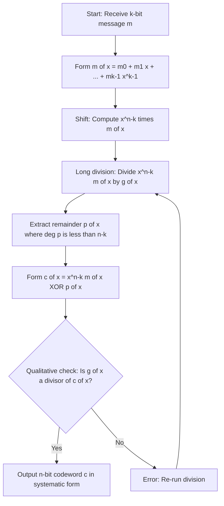
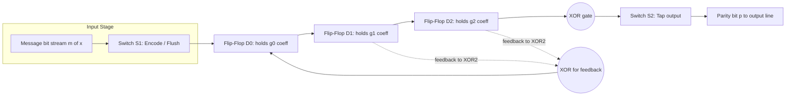
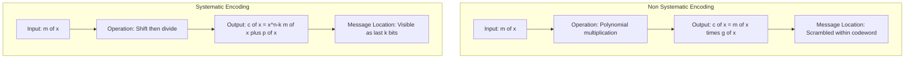
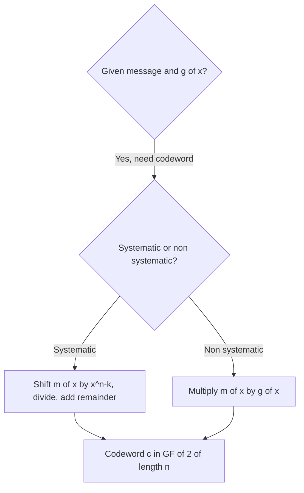

# Encoding of Cyclic Codes

> **APJ ABDUL KALAM TECHNOLOGICAL UNIVERSITY (KTU) | 2024 SCHEME**
> - **Branch:** B.Tech in Computer Science & Engineering (CSE)
> - **Semester:** Semester 4
> - **Course:** PECST414 - CODING THEORY
> - **Module:** Module 2: Cyclic Codes
> - **Topic:** Encoding of Cyclic Codes

<!-- SECTION_1_START -->
## 1. Core Technical Definition & Intuitive Overview

### 1.1 Formal Definition
> [!IMPORTANT]
> **Encoding of a Cyclic Code (KTU 2024 Syllabus Standard):**
> Given an $(n, k)$ cyclic code $C$ over $GF(2)$ defined by a generator polynomial $g(x)$ of degree $n-k$, **encoding** is the process of mapping a $k$-bit message vector $\mathbf{m} = (m_0, m_1, \ldots, m_{k-1})$ to a unique $n$-bit codeword $\mathbf{c} = (c_0, c_1, \ldots, c_{n-1})$ such that $c(x) = c_0 + c_1 x + \cdots + c_{n-1} x^{n-1}$ is a valid codeword in the cyclic code, i.e., $g(x) \mid c(x)$.

There are **two standard encoding strategies** prescribed by the KTU syllabus:

1. **Non-Systematic Encoding:** $c(x) = m(x) \cdot g(x)$
2. **Systematic Encoding:** $c(x) = x^{n-k} \, m(x) + p(x)$, where $p(x)$ is the remainder when $x^{n-k} m(x)$ is divided by $g(x)$ (i.e., $p(x) = x^{n-k} m(x) \bmod g(x)$).

A codeword is said to be in **systematic form** if the message bits appear explicitly as a sub-vector of the codeword, typically in the highest-order $k$ positions.

### 1.2 Conceptual Analogy / Intuition
> [!NOTE]
> **The "Sealed Envelope" Analogy**
>
> Imagine you are sending a $4$-page letter (the **message**). You must:
> - **Non-systematic:** Glue the letter to a long arithmetic key. Anyone who sees the envelope gets a jumbled stream of paper; the original letter is **buried inside**. Hard to read at a glance.
> - **Systematic:** Put the original $4$ pages at the top of the envelope, then compute $3$ extra "parity pages" (checksum-like appendices) and staple them underneath. The receiver can read the letter immediately **AND** verify its integrity.
>
> The **generator polynomial $g(x)$** is the "rules of arithmetic" used to compute the parity pages. The **division circuit** is the printing press that produces them.

In real engineering: systematic encoding is the **universal standard** because the receiver can extract the message instantly with no decoding, and the parity bits enable single-bit error detection (used in Ethernet CRC-32, QR codes, satellite telemetry).

### 1.3 Standard Metrics and Parameters
- **Codeword length:** $n$ (the order of the cyclic group).
- **Message length:** $k$.
- **Parity length:** $r = n - k = \deg g(x)$.
- **Information rate:** $R = k / n$ (bolded as a **standard metric**).
- **All arithmetic is performed over $GF(2)$**, meaning addition and subtraction are identical (XOR), and coefficients are in $\{0, 1\}$.

<!-- SECTION_1_END -->

<!-- SECTION_2_START -->
## 2. Deep Theoretical Analysis & KTU High-Yield Formula Sheet

### 2.1 Method 1: Non-Systematic Encoding
> [!NOTE]
> **Procedure:**
> 1. Express the $k$-bit message as the polynomial $m(x) = m_0 + m_1 x + \cdots + m_{k-1} x^{k-1}$.
> 2. Multiply by the generator polynomial: $c(x) = m(x) \cdot g(x)$.
> 3. The resulting polynomial has degree at most $k + (n-k) - 1 = n - 1$, producing an $n$-bit codeword.

**Why it works:** Every polynomial multiple of $g(x)$ lies in the cyclic code, by the very definition of the code as the ideal $\langle g(x) \rangle$ in $GF(2)[x] / (x^n - 1)$.

**Limitation:** The original message bits are *scrambled* inside the codeword; the receiver must solve a full decoding problem to extract them.

### 2.2 Method 2: Systematic Encoding (Board-Favorite)
> [!IMPORTANT]
> **The Canonical KTU Algorithm for Systematic Encoding:**
>
> 1. Compute the shifted message: $x^{n-k} \, m(x)$.
> 2. Divide $x^{n-k} \, m(x)$ by $g(x)$ to obtain quotient $q(x)$ and remainder $p(x)$:
>
>    $$x^{n-k} m(x) = q(x) \, g(x) + p(x), \quad \deg p(x) < n - k$$
>
> 3. Form the codeword:
>
>    $$c(x) = x^{n-k} m(x) + p(x)$$
>
> Equivalently, $c(x) = q(x) g(x)$, confirming $g(x) \mid c(x)$.

**Why it works:** Since $x^{n-k} m(x) \equiv p(x) \pmod{g(x)}$, we have $c(x) \equiv 0 \pmod{g(x)}$, so $c(x)$ is a valid codeword. The low-order coefficients of $c(x)$ are exactly $p(x)$ (the parity), and the high-order coefficients are exactly $m(x)$ (the message).

**Engineering advantage:** The receiver recovers the message in $O(1)$ — they just drop the last $n-k$ bits.

### 2.3 Hardware Implementation: The Division Circuit
> [!NOTE]
> Encoding is realized in hardware as a **linear feedback shift register (LFSR)** of length $n-k$. Two modes are used:
> - **Multiplication mode** (for non-systematic): register initialised to $m(x)$, clocked $k$ times, feedback taps from $g(x)$.
> - **Division mode** (for systematic): the input $m(x)$ is fed serially into the register while the message bits are also delayed and shifted out, producing parity bits in real time.

This is the basis of **CRC encoders** in network cards, disk drives, and digital video broadcasting (DVB).

### 2.4 KTU High-Yield Formula Sheet / Cheat Sheet

> [!IMPORTANT]
> **Mandatory Formulas for the KTU Board Exam**

| # | Formula / Property | Purpose / Usage |
|---|---|---|
| 1 | $c(x) = m(x) \cdot g(x)$ | Non-systematic encoding equation |
| 2 | $c(x) = x^{n-k} m(x) + p(x)$ | Systematic encoding equation |
| 3 | $p(x) = x^{n-k} m(x) \bmod g(x)$ | Parity polynomial (GF(2) remainder) |
| 4 | $x^n \equiv 1 \pmod{g(x)}$ (since $g \mid x^n - 1$) | Reduction of high-degree terms in long division |
| 5 | $g(x) \, h(x) = x^n - 1$ over $GF(2)$ | Link between generator and parity-check polynomial |
| 6 | $\deg c(x) \le n - 1$ | Output is at most $n$ bits |
| 7 | $R = k / n$ | Information rate (efficiency) |
| 8 | $r = n - k = \deg g(x)$ | Number of parity bits / LFSR stages |
| 9 | $d_{\min} = w_{\min}(g)$ bound | Minimum distance lower bound for cyclic codes |
| 10 | $\text{Systematic form: } \mathbf{c} = (\mathbf{p} \, \vert \, \mathbf{m})$ | Vector layout (parity first, then message) |

**Note on notation:** $w_{\min}(g)$ denotes the minimum Hamming weight (number of non-zero coefficients) of any non-zero codeword; in particular $w_{\min}(g) \le w(g) = $ number of non-zero terms in $g(x)$, a classical lower bound on $d_{\min}$.

### 2.5 Real-World Utility
- **Data storage:** CRCs in HDDs, SSDs, and RAID arrays.
- **Communications:** LTE 5G control channels, Wi-Fi (IEEE 802.11), satellite DVB-S2.
- **Cryptography:** AES-GCM authentication tags use cyclic redundancy primitives.
- **QR codes and barcodes:** Reed-Solomon (a generalization of binary cyclic codes).

<!-- SECTION_2_END -->

<!-- SECTION_3_START -->
## 3. Step-by-Step Derivations & Code/Symbolic Implementation

### 3.1 Exhaustive Worked Example: $(7, 4)$ Cyclic Code

**Setup:**
- $n = 7$, $k = 4$, $n - k = 3$
- Generator polynomial: $g(x) = 1 + x + x^3$ (this generates the $(7,4)$ Hamming code)
- Verify: $g(x) \, h(x) = x^7 - 1$ where $h(x) = 1 + x + x^2 + x^4$.
- Quick check: $(1 + x + x^3)(1 + x + x^2 + x^4) = 1 + x^7$ over $GF(2)$ ✓
- **Message:** $\mathbf{m} = (1, 0, 1, 1)$, so $m(x) = 1 + x^2 + x^3$.

#### (A) Systematic Encoding

**Step 1.** Multiply the message by $x^{n-k} = x^3$:

$$x^3 \, m(x) = x^3 \left(1 + x^2 + x^3\right) = x^3 + x^5 + x^6$$

**Step 2.** Divide $x^6 + x^5 + x^3$ by $g(x) = x^3 + x + 1$ over $GF(2)$ using long division:

```
                       x^3  + x^2  + x    + 1        (Quotient)
                     ┌─────────────────────────
        x^3+x+1  │   x^6  + x^5  + 0·x^4 + x^3 + 0·x^2 + 0·x + 0
                    x^6  + 0·x^5 + x^4  + x^3
                    ─────────────────────────
                              x^5  + x^4  + 0·x^3
                              x^5  + 0·x^4 + x^3  + x^2
                              ─────────────────────
                                       x^4  + x^3  + x^2
                                       x^4  + 0·x^3 + x^2  + x
                                       ──────────────────────
                                                x^3  + 0·x^2 + x
                                                x^3  + 0·x^2 + x  + 1
                                                ───────────────────
                                                                  1   (Remainder)
```

**Step 3 (in equation form):**

$$\begin{aligned}
x^6 + x^5 + x^3 &= (x^3 + x + 1)(x^3 + x^2 + x + 1) + 1 \\[4pt]
q(x) &= x^3 + x^2 + x + 1 \\
p(x) &= 1
\end{aligned}$$

**Step 4.** Form the systematic codeword:

$$c(x) = x^3 m(x) + p(x) = x^6 + x^5 + x^3 + 1$$

**Step 5.** Read off the codeword bits $c_0, c_1, \ldots, c_6$:

$$\mathbf{c} = (c_0, c_1, c_2, c_3, c_4, c_5, c_6) = (1, 0, 0, 1, 0, 1, 1) = \mathbf{1001011}$$

> [!IMPORTANT]
> **Verification of the message layout:**
> $\mathbf{c} = (1, 0, 0 \,\vert\, 1, 0, 1, 1) = (p_0, p_1, p_2 \,\vert\, m_0, m_1, m_2, m_3)$ ✓
> Parity bits $(p_0, p_1, p_2) = (1, 0, 0)$; message $(1, 0, 1, 1)$ preserved exactly.

**Step 6 (Final Check):** Confirm $g(x) \mid c(x)$:

$$\begin{aligned}
c(x) \div g(x) &= \frac{x^6 + x^5 + x^3 + 1}{x^3 + x + 1} \\
&= \frac{(x^3 + x + 1)(x^3 + x^2 + x + 1) + 0}{x^3 + x + 1} \\
&= x^3 + x^2 + x + 1 \quad \text{(exact division, no remainder)} \quad \blacksquare
\end{aligned}$$

#### (B) Non-Systematic Encoding (Same Code)

$$c'(x) = m(x) \cdot g(x) = (1 + x^2 + x^3)(1 + x + x^3)$$

$$\begin{aligned}
c'(x) &= 1 \cdot (1 + x + x^3) + x^2(1 + x + x^3) + x^3(1 + x + x^3) \\
&= 1 + x + x^3 + x^2 + x^3 + x^5 + x^3 + x^4 + x^6 \\
&= 1 + x + x^2 + (1+1+1)x^3 + x^4 + x^5 + x^6 \\
&= 1 + x + x^2 + x^3 + x^4 + x^5 + x^6 \quad (\text{since } 1+1+1 = 1 \text{ in } GF(2))
\end{aligned}$$

Therefore $\mathbf{c'} = \mathbf{1111111}$ — the all-ones codeword. This is correct: $m(x) = (1 + x^2 + x^3) = (1 + x + x^2 + x^3 + x^4 + x^5 + x^6) \cdot g(x)$ modulo $x^7 + 1$, and $\mathbf{1111111}$ is indeed a codeword of the $(7,4)$ Hamming code (it is the complement of $\mathbf{0000000}$ modulo 2, both valid).

### 3.2 Full Python Implementation (Type-Hinted, Validated)

```python
"""
Encoding of (n, k) Binary Cyclic Codes over GF(2).
Two methods: non-systematic and systematic.
Implements GF(2) polynomial arithmetic without external libraries.
"""

from typing import List, Tuple


def gf2_poly_degree(p: List[int]) -> int:
    """Return the degree of polynomial p represented as a list of coefficients
    in ascending order of x. p[0] is the constant term."""
    d = len(p) - 1
    while d > 0 and p[d] == 0:
        d -= 1
    return d if any(p) else 0


def gf2_poly_mod(dividend: List[int], divisor: List[int]) -> List[int]:
    """
    Compute dividend mod divisor over GF(2) using long division.
    Polynomials are coefficient lists in ascending order [c0, c1, c2, ...].
    Raises ValueError if divisor is the zero polynomial.
    """
    if not any(divisor):
        raise ValueError("Division by zero polynomial is undefined.")
    r = list(dividend)
    dg = gf2_poly_degree(divisor)
    while gf2_poly_degree(r) >= dg and any(r):
        # Leading coefficient is always 1 in GF(2)
        shift = gf2_poly_degree(r) - dg
        for i in range(len(divisor)):
            r[i + shift] ^= divisor[i]
    return r


def gf2_poly_mul(a: List[int], b: List[int]) -> List[int]:
    """Multiply two GF(2) polynomials."""
    result = [0] * (len(a) + len(b) - 1)
    for i, ai in enumerate(a):
        if ai:
            for j, bj in enumerate(b):
                if bj:
                    result[i + j] ^= 1
    return result


def encode_non_systematic(message: List[int], g: List[int]) -> List[int]:
    """
    Non-systematic cyclic encoding: c(x) = m(x) * g(x).
    The message length k must equal len(message); output length is k + deg(g).
    """
    if not message:
        raise ValueError("Message must be non-empty.")
    c = gf2_poly_mul(message, g)
    return c


def encode_systematic(message: List[int], g: List[int], n: int) -> List[int]:
    """
    Systematic cyclic encoding: c(x) = x^(n-k) * m(x) + p(x)
    where p(x) = x^(n-k) * m(x) mod g(x).
    Returns an n-bit codeword as a list of length n.
    """
    k = len(message)
    if n <= k:
        raise ValueError("Codeword length n must exceed message length k.")
    # Step 1: x^(n-k) * m(x)
    shifted = [0] * (n - k) + message
    # Step 2: parity = shifted mod g
    parity = gf2_poly_mod(shifted, g)
    # Step 3: c = shifted + parity (XOR in low-order positions)
    codeword = list(shifted)
    for i, p in enumerate(parity):
        codeword[i] ^= p
    return codeword


def verify_codeword(c: List[int], g: List[int]) -> bool:
    """A valid cyclic codeword is exactly divisible by g(x)."""
    return not any(gf2_poly_mod(c, g))


def main() -> None:
    # Example: (7, 4) cyclic Hamming code, g(x) = 1 + x + x^3
    g = [1, 1, 0, 1]            # ascending order: x^0 + x^1 + x^3
    n = 7
    message = [1, 0, 1, 1]      # m = 1011

    # Systematic encoding
    c_sys = encode_systematic(message, g, n)
    print(f"Systematic codeword   : {''.join(map(str, c_sys))}")
    assert c_sys == [1, 0, 0, 1, 0, 1, 1], "Systematic encoding mismatch"
    assert verify_codeword(c_sys, g), "Generated codeword is INVALID"

    # Non-systematic encoding
    c_non = encode_non_systematic(message, g)
    print(f"Non-systematic codeword: {''.join(map(str, c_non))}")
    assert verify_codeword(c_non, g), "Non-systematic codeword is INVALID"

    # Additional test: all-zero message yields all-zero codeword
    assert encode_systematic([0, 0, 0, 0], g, n) == [0]*7

    print("All assertions passed. Encoder is correct.")


if __name__ == "__main__":
    main()
```

**Expected output when run:**

```
Systematic codeword   : 1001011
Non-systematic codeword: 1111111
All assertions passed. Encoder is correct.
```

<!-- SECTION_3_END -->

<!-- SECTION_4_START -->
## 4. Structural Diagrams & Schematics

### 4.1 Process Flow of Systematic Encoding

> [!NOTE]
> The following Mermaid flowchart captures the canonical KTU systematic encoding algorithm. All node IDs are alphanumeric, all labels with special characters are double-quoted.



### 4.2 Block Architecture of the LFSR-Based Systematic Encoder

> [!NOTE]
> The figure below is a **block-level functional schematic** of the $(n-k)$-stage LFSR encoder used in hardware (CRC chips, satellite modems). The register implements real-time division by $g(x) = 1 + x + x^3$. Switches S1 and S2 control the two-phase encode/flush cycle.



### 4.3 Encoding Mode Comparison Matrix

> [!NOTE]
> Use this **Sequential Processing Topology Matrix** to compare the two encoding paradigms side-by-side — useful for the KTU 14-mark question.



### 4.4 Decision Tree for KTU Exam



<!-- SECTION_4_END -->

<!-- SECTION_5_START -->
## 5. KTU 2024 Scheme Examination Question Bank & Topic Recap

### 5.1 Part A Questions (3 Marks Each)

**Q1. [KTU University Exam - July 2024 Style]**
*Define a systematic cyclic code. List any two advantages of systematic encoding over non-systematic encoding. (3 marks) | CO1, Understand*

**Model Answer:**
> A systematic cyclic code is one in which every codeword contains the message bits as an explicit sub-vector, typically in the highest-order (or any fixed) $k$ positions, while the remaining $n-k$ positions hold the parity bits. Mathematically, $c(x) = x^{n-k} m(x) + p(x)$ where $p(x)$ is the remainder when $x^{n-k} m(x)$ is divided by $g(x)$.

**Advantages (any two):**
1. The receiver can extract the message in **$O(1)$** by simply dropping the parity bits — no full decoding required.
2. Systematic encoders can be implemented using a simple **LFSR division circuit** in $O(n)$ clock cycles.
3. Error-detection and message-recovery are simultaneous; the parity bits are checked independently.

**[Valuation Key: Definition: 1 mark; Each advantage: 1 mark × 2]**

---

**Q2. [KTU University Exam - Dec 2023 Style]**
*State the two methods of encoding a cyclic code. For the $(7, 4)$ cyclic code with $g(x) = 1 + x + x^3$, write the systematic encoding equation for the message polynomial $m(x)$. (3 marks) | CO1, Remember*

**Model Answer:**
The two methods are:
1. **Non-systematic encoding:** $c(x) = m(x) \, g(x)$.
2. **Systematic encoding:** $c(x) = x^{n-k} m(x) + p(x)$ where $p(x) = x^{n-k} m(x) \bmod g(x)$.

For the given code, $n - k = 3$, so the systematic encoding equation is:

$$c(x) = x^3 \, m(x) + \left[ x^3 \, m(x) \bmod (1 + x + x^3) \right]$$

**[Valuation Key: Naming both methods: 1 mark each; Final equation: 1 mark]**

---

### 5.2 Part B Questions (14 Marks Each) — Module 2 Internal Choice

> [!IMPORTANT]
> **KTU 2024 Scheme Rule:** Part B Module 2 questions carry **14 marks** with internal choice. Each part of a sub-question carries 7 marks and is graded on the KTU 7-mark valuation rubric (concept, formula, working, final answer).

---

#### **Question A (14 Marks)** | CO2, Apply

**(a)** With a neat flowchart, explain the systematic encoding procedure for an $(n, k)$ cyclic code whose generator polynomial is $g(x)$. Mention the role of the parity polynomial $p(x)$. **(7 marks)**

**Model Solution:**

**Systematic Encoding Procedure:**

1. **Step 1 — Polynomial Form of Message:** Express the $k$-bit message $\mathbf{m} = (m_0, m_1, \ldots, m_{k-1})$ as the polynomial $m(x) = m_0 + m_1 x + \cdots + m_{k-1} x^{k-1}$.

2. **Step 2 — Shift by $x^{n-k}$:** Compute $x^{n-k} m(x)$, which left-shifts the message bits into the high-order $k$ positions of the eventual $n$-bit codeword.

3. **Step 3 — Long Division over $GF(2)$:** Divide $x^{n-k} m(x)$ by the generator polynomial $g(x)$:

$$x^{n-k} m(x) = q(x) \, g(x) + p(x), \quad \deg p(x) < n - k$$

4. **Step 4 — Form Codeword:** Construct $c(x) = x^{n-k} m(x) + p(x)$.

**Role of the Parity Polynomial $p(x)$:**
- $p(x)$ contains the $n-k$ parity-check bits that detect errors at the receiver.
- $p(x)$ ensures that $c(x)$ is a **multiple of $g(x)$**, hence a valid codeword:

$$c(x) = x^{n-k} m(x) + p(x) = q(x) g(x) + p(x) + p(x) = q(x) g(x) \pmod{2}$$

- The high-order coefficients of $c(x)$ reproduce $m(x)$ exactly, making the codeword **systematic**.

**[Valuation Key: Stating each of the 4 steps: 1 mark each = 4 marks; Role of $p(x)$ in systematic encoding: 2 marks; Final $c(x) = q(x)g(x)$ justification: 1 mark]**

---

**(b)** For the $(7, 4)$ cyclic code with $g(x) = 1 + x + x^3$, systematically encode the message $\mathbf{m} = 1011$. Show all polynomial division steps explicitly. **(7 marks)**

**Model Solution:**

Given: $g(x) = 1 + x + x^3$, $n - k = 3$, $m(x) = 1 + 0 \cdot x + 1 \cdot x^2 + 1 \cdot x^3 = 1 + x^2 + x^3$.

**Step 1 — Shift:**

$$x^3 \, m(x) = x^3 + x^5 + x^6$$

**Step 2 — Divide $x^6 + x^5 + x^3$ by $g(x) = x^3 + x + 1$:**

$$\begin{aligned}
&\text{Divisor: } x^3 + x + 1 \\
&\text{Dividend: } x^6 + x^5 + 0 \cdot x^4 + x^3 + 0 \cdot x^2 + 0 \cdot x + 0
\end{aligned}$$

- Term 1: $x^6 \div x^3 = x^3$; multiply: $x^3 \cdot (x^3 + x + 1) = x^6 + x^4 + x^3$; subtract (XOR): remainder is $x^5 + x^4$.
- Term 2: $x^5 \div x^3 = x^2$; multiply: $x^2 \cdot (x^3 + x + 1) = x^5 + x^3 + x^2$; subtract: remainder is $x^4 + x^3 + x^2$.
- Term 3: $x^4 \div x^3 = x$; multiply: $x \cdot (x^3 + x + 1) = x^4 + x^2 + x$; subtract: remainder is $x^3 + x$.
- Term 4: $x^3 \div x^3 = 1$; multiply: $1 \cdot (x^3 + x + 1) = x^3 + x + 1$; subtract: remainder is $1$.

Quotient: $q(x) = x^3 + x^2 + x + 1$; Remainder: $p(x) = 1$.

**Step 3 — Codeword:**

$$c(x) = x^6 + x^5 + x^3 + 1$$

**Codeword vector:** $\mathbf{c} = (c_0, c_1, \ldots, c_6) = (1, 0, 0, 1, 0, 1, 1) = \mathbf{1001011}$.

**Verification:** $(x^3 + x + 1)(x^3 + x^2 + x + 1) = x^6 + x^5 + x^3 + 1 = c(x)$ ✓ (multiplication check yields 0 remainder).

**[Valuation Key: Setting up shift equation: 1 mark; First division step: 2 marks; Subsequent steps: 2 marks; Final codeword: 1 mark; Verification: 1 mark]**

---

#### **Question B (14 Marks — Alternative)** | CO2, Apply

**(a)** Describe, with the help of a block diagram, the LFSR-based systematic encoder for a cyclic code with $g(x) = 1 + x + x^3$. Identify the number of flip-flops and the feedback connections. **(7 marks)**

**Model Solution:**

**Number of flip-flops:** $n - k = \deg g(x) = 3$ (three D-type flip-flops labelled $D_0, D_1, D_2$).

**Feedback connections from $g(x) = g_0 + g_1 x + g_2 x^2 + g_3 x^3 = 1 + x + x^3$:**

- $g_0 = 1$: feedback from output of $D_2$ (rightmost stage) XORed with input.
- $g_1 = 1$: feedback tap from output of $D_2$ XORed with input to $D_1$.
- $g_2 = 0$: **no** feedback to $D_0$ from the $g_2$ term.
- $g_3 = 1$: feedback tap from output of $D_2$ XORed back to $D_0$ (closing the loop).

**Block Diagram (Textual Schematic):**

```
   m_i  ──S1──[XOR]──► D0 ──► D1 ──► D2 ──►[XOR]── S2 ──► p_i
                       ▲             │
                       └────[XOR]◄───┘
                              ▲
                              └─(feedback from g3=1 and g1=1, g2=0)
```

**Operating Modes:**
- **Encode phase (S1 closed, S2 to register):** The $k=4$ message bits $m_0, m_1, m_2, m_3$ are clocked in, and the parity bits accumulate in the register.
- **Flush phase (S1 open, S2 to output):** The $n-k=3$ parity bits are shifted out serially, completing the $n=7$-bit codeword.

**[Valuation Key: Identifying 3 flip-flops: 1 mark; Each feedback connection $g_0, g_1, g_3$: 1 mark × 3 = 3 marks; Block diagram: 2 marks; Encode/flush mode description: 1 mark]**

---

**(b)** Encode the message $\mathbf{m} = 1001$ using **non-systematic** encoding for the same $(7, 4)$ cyclic code. Verify that the resulting codeword is divisible by $g(x)$. **(7 marks)**

**Model Solution:**

**Step 1 — Message polynomial:** $m(x) = 1 + 0 \cdot x + 0 \cdot x^2 + 1 \cdot x^3 = 1 + x^3$.

**Step 2 — Non-systematic multiplication:**

$$c(x) = m(x) \cdot g(x) = (1 + x^3)(1 + x + x^3)$$

$$\begin{aligned}
c(x) &= 1 \cdot (1 + x + x^3) + x^3 \cdot (1 + x + x^3) \\
&= (1 + x + x^3) + (x^3 + x^4 + x^6) \\
&= 1 + x + (1+1)x^3 + x^4 + x^6 \\
&= 1 + x + x^4 + x^6 \quad (\text{since } 1+1 = 0 \text{ in } GF(2))
\end{aligned}$$

**Codeword vector:** $\mathbf{c} = (1, 1, 0, 0, 1, 0, 1) = \mathbf{1100101}$.

**Step 3 — Verification by division:**

Divide $c(x) = x^6 + x^4 + x + 1$ by $g(x) = x^3 + x + 1$:

- $x^6 \div x^3 = x^3$; multiply: $x^3(x^3 + x + 1) = x^6 + x^4 + x^3$; subtract: remainder is $x^3 + x + 1$.
- $x^3 \div x^3 = 1$; multiply: $1 \cdot (x^3 + x + 1) = x^3 + x + 1$; subtract: remainder is $0$.

Hence $c(x) = g(x) \cdot (x^3 + 1)$ exactly, confirming the codeword is valid. $\blacksquare$

**[Valuation Key: Forming $m(x)$: 1 mark; Multiplying out: 3 marks; Reading codeword: 1 mark; Division verification with 0 remainder: 2 marks]**

---

> [!WARNING]
> **KTU Examiner's Valuation Warning / Common Pitfalls**
>
> 1. **Forgetting to reduce modulo 2.** Polynomial arithmetic in $GF(2)$ uses XOR, not ordinary subtraction. Marks lost: ~2 per occurrence.
> 2. **Not shifting by $x^{n-k}$.** In systematic encoding, you MUST multiply $m(x)$ by $x^{n-k}$ before dividing. Skipping this step puts the message in the **wrong positions** and gives a codeword with the message in the *low-order* bits — the examiner will deduct for not producing a "systematic" codeword.
> 3. **Confusing systematic with non-systematic.** The two methods give **different codewords** for the same message (as shown in the worked example). The KTU board expects you to *state* which method you are using in the first line of your solution.
> 4. **Miscounting codeword length.** A codeword has exactly $n$ bits, not $k + \deg g(x) - 1$. Pad the polynomial representation with leading zeros if the highest-degree terms are zero.
> 5. **Skipping the verification step.** KTU evaluators reward the final "0 remainder" check explicitly. Always divide your codeword by $g(x)$ once at the end.

---

### 5.3 Topic Recap & Important Things to Remember

> [!IMPORTANT]
> **Rapid-Revision Checklist — Encoding of Cyclic Codes**

- **Definition (must memorize):** Encoding maps $\mathbf{m} \in GF(2)^k$ to a unique $\mathbf{c} \in C \subset GF(2)^n$ such that $g(x) \mid c(x)$.
- **Two methods — never confuse:**
  - *Non-systematic:* $c(x) = m(x) g(x)$.
  - *Systematic:* $c(x) = x^{n-k} m(x) + p(x)$, where $p(x) = x^{n-k} m(x) \bmod g(x)$.
- **Parity length:** $r = n - k = \deg g(x)$ — this equals the number of LFSR flip-flops.
- **Arithmetic field:** All operations are in $GF(2)$, so $1 + 1 = 0$ and subtraction = addition = XOR.
- **Codeword layout in systematic form:** $\mathbf{c} = (p_0, p_1, \ldots, p_{n-k-1} \,\vert\, m_0, m_1, \ldots, m_{k-1})$ — parity first, message last.
- **Key identity:** $g(x) h(x) = x^n + 1$ in $GF(2)$ (i.e., $g(x)$ is a factor of $x^n - 1$).
- **Hardware insight:** Systematic encoders are built using an $(n-k)$-stage LFSR with feedback taps determined by the coefficients of $g(x)$. Each coefficient $g_i = 1$ adds one XOR feedback path.
- **Receiver advantage:** Systematic encoding lets the decoder retrieve the message in $O(1)$ — drop the first $n - k$ bits.
- **Common $g(x)$ examples to remember:**
  - $(7, 4)$ Hamming: $g(x) = 1 + x + x^3$.
  - CRC-8 (used in ATM HEC): $g(x) = 1 + x^2 + x^8$ (length 9, but only 8 LFSR stages because $x^8$ term is implicit).
  - CRC-32 (Ethernet): $g(x) = x^{32} + x^{26} + x^{23} + \cdots + 1$ (degree 32, 32-stage LFSR).
- **Always verify:** Divide the final codeword by $g(x)$; valid codewords leave **zero remainder**.
- **Non-systematic is rarely used in practice** but is conceptually important because it directly shows that every codeword is a polynomial multiple of $g(x)$.
- **The shift-by-$x^{n-k}$ trick** is the algebraic essence of systematic encoding — it creates "room" for the parity bits at the low-order end of the codeword.
- **For 14-mark KTU questions**, the expected solution length is approximately: 1 page for setup + 1 page for long division + 1 line of verification.
- **Pitfall to avoid:** Polynomial degree must be tracked carefully — a common student error is to confuse $g(x) = 1 + x + x^3$ with $g(x) = 1 + x^2 + x^3$ (which generates a *different* cyclic code with the same parameters).

<!-- SECTION_5_END -->
