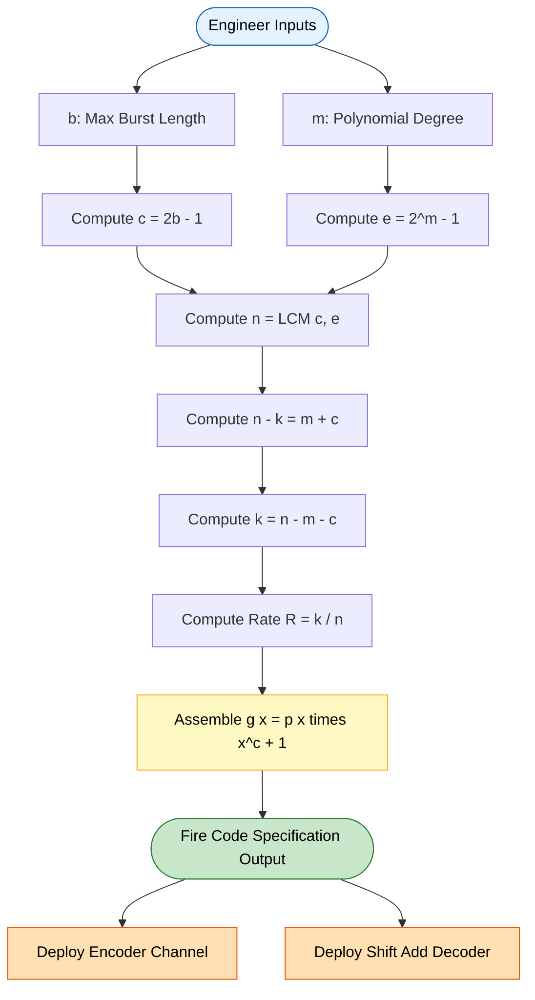

# Fire codes configuration parameters tracking system synchronization metrics calculations

<!-- SECTION_1_START -->
# Fire Codes: Configuration Parameters & Synchronization Tracking

## 1.1 Formal Academic Definition

A **Fire Code** is a class of **binary cyclic code** specifically engineered for the correction of **single burst errors**, introduced by **P. Fire in 1959**. It is constructed by multiplying a low-degree irreducible (or primitive) polynomial $p(x)$ with a binomial of the form $(x^c + 1)$, where $c$ is closely tied to the burst correction capability $b$.

The **generator polynomial** of a Fire code is formally expressed as:

$$g(x) = p(x) \cdot (x^c + 1)$$

where:
- $p(x)$ is an **irreducible polynomial** of degree $m$ over $\mathrm{GF}(2)$, with period $e = 2^m - 1$.
- $c = 2b - 1$, where $b$ is the maximum **burst error length** that the code can correct.

> [!IMPORTANT]
> **KTU 2024 Syllabus Highlight:** Fire codes belong to the family of *shortened cyclic codes optimized for burst-error channels* (Module 3). They are highly relevant in scenarios such as **magnetic storage, satellite telemetry, and convolutional line coding**, where errors tend to cluster in consecutive bit positions rather than appear randomly.

## 1.2 Intuitive Analogy — The "Damaged Tape" Model

Imagine a **photographic film strip** transmitted across a noisy channel. Dust particles or scratches typically affect **a cluster of consecutive frames** rather than scattered single frames. A Fire code is like adding a **redundant "checksum strip"** parallel to the film, designed such that:
1. Any single scratch of up to $b$ consecutive frames is automatically identifiable.
2. The receiver can use the cyclic structure (rolling the strip end-to-end) to pinpoint the exact location of the scratch.
3. After correction, the strip is "realigned" — this is the **synchronization tracking** mechanism.

In essence, the configuration parameters $(n, k, b, m)$ act as the **knobs of a precision instrument** that the engineer adjusts to match the channel's error characteristics.

## 1.3 Burst Error — Vector Formulation

A **burst error of length $b$** is a vector $E = (e_{n-1}, e_{n-2}, \ldots, e_0)$ such that:
- All non-zero components are confined to $b$ consecutive positions.
- The first and last components of this consecutive block are non-zero.

In polynomial form, the burst error is:

$$E(x) = x^j \cdot B(x)$$

where $B(x)$ is a polynomial of degree less than $b$ with $B_0 = 1$ and $B_{b-1} \neq 0$, and $j$ denotes the starting position of the burst.

> [!NOTE]
> **Geometric Visualization:** On a 1-D bit-axis, a burst error appears as a **localized "hill"** of height 1 spanning $b$ consecutive indices, with zeros everywhere else. This locality is precisely what Fire codes exploit via their algebraic structure.

> [!VISUALIZATION CONTROL]
> **Concept:** Burst Error Localization on a Bit-Vector
> **Desmos / Graphical Sketch Equations:**
> * Burst of length $b = 5$ starting at $j = 3$: `B(x) = x^3 + x^4 + x^5 + x^6 + x^7`
> * Full error polynomial: `E(x) = x^3 * (1 + x + x^2 + x^3 + x^4)`
> **Visual Description:** Plot the discrete function $E: \mathbb{Z} \to \{0, 1\}$ on the integer axis. The student should observe a *contiguous run of 1s* of width 5, with the leading and trailing 1s marking the burst boundaries — this is the structural fingerprint of a burst error.

<!-- SECTION_1_END -->

<!-- SECTION_2_START -->
# Deep Theoretical Analysis & KTU High-Yield Formula Sheet

## 2.1 Operational Logic of Fire Codes — Step-by-Step Breakdown

The construction of a Fire code follows a precise logical chain:

1. **Specification of burst tolerance:** The designer first specifies the maximum burst length $b$ the channel can produce.
2. **Selection of irreducible polynomial:** An irreducible polynomial $p(x)$ of degree $m$ is chosen from a known table (e.g., $x^4 + x + 1$, $x^5 + x^2 + 1$, etc.). Its period is $e = 2^m - 1$.
3. **Formation of the binomial factor:** Set $c = 2b - 1$. The binomial $(x^c + 1)$ encapsulates the burst-detection requirement.
4. **Generator polynomial assembly:** Form $g(x) = p(x) \cdot (x^c + 1)$ over $\mathrm{GF}(2)$.
5. **Code length computation:** $n = \mathrm{LCM}(c,\, e)$, the least common multiple ensuring cyclic closure.
6. **Redundancy computation:** Number of parity bits $n - k = m + c = m + (2b - 1)$.
7. **Code rate evaluation:** $R = k / n = 1 - (m + 2b - 1)/n$.

## 2.2 Why the Construction Works — The Mathematical "Why"

- The factor $(x^c + 1)$ ensures that any burst error $E(x) = x^j B(x)$ with $\deg(B) < b$ and $B_0 = 1$ produces a **non-zero syndrome** that is a multiple of $(x^c + 1)$. This is because $\deg(B) < b$ implies $\deg(B) \le c - 1$, so $B(x) \not\equiv 0 \pmod{x^c + 1}$ (since $B_0 = 1$).
- The factor $p(x)$ ensures the syndrome is also non-zero modulo $p(x)$, so the error cannot escape detection.
- The cyclic structure means a **single shift of the received word** produces a shifted syndrome, enabling the decoder to track the burst location by repeated cyclic shifts — this is the **synchronization tracking** in action.

## 2.3 KTU High-Yield Formula Cheat Sheet

| # | Parameter / Formula | Expression | Notes / Units |
|---|---------------------|------------|---------------|
| 1 | Generator polynomial | $g(x) = p(x) \cdot (x^c + 1)$ | Over $\mathrm{GF}(2)$ |
| 2 | Burst correction capability | $b = (c + 1)/2$ | Integer (must be even/odd consistent) |
| 3 | Binomial exponent | $c = 2b - 1$ | Always odd positive integer |
| 4 | Polynomial degree | $m = \deg(p(x))$ | Security / length parameter |
| 5 | Period of $p(x)$ | $e = 2^m - 1$ | Equals $n$ when $p(x)$ primitive |
| 6 | Code length | $n = \mathrm{LCM}(c,\, e)$ | Cyclic block length in bits |
| 7 | Number of parity bits | $n - k = m + c$ | Redundancy overhead |
| 8 | Information bits | $k = n - m - c = n - m - 2b + 1$ | Payload per codeword |
| 9 | Code rate | $R = k / n$ | Dimensionless efficiency metric |
| 10 | Burst error pattern | $E(x) = x^j B(x),\ \deg(B) < b$ | Polynomial form |
| 11 | Min. detectable burst | $b_{\text{detect}} = b$ | Equals correction cap for Fire codes |
| 12 | Synchronization window | $T_{\text{sync}} = n \cdot t_b$ | $t_b$ = bit duration |

> [!TIP]
> **KTU Board Tip:** Examiners frequently ask: *"Given $b$ and $m$, find $n, k$, and $g(x)$."* Memorize the chain $b \to c = 2b-1 \to n = \mathrm{LCM}(c, 2^m-1) \to k = n - m - c$.

## 2.4 Real-World Engineering Utility

Fire codes are deployed in systems where **error clustering** is the dominant failure mode:

- **Magnetic & Optical Storage:** Hard drives, magnetic tapes, and CDs — a single scratch or media defect corrupts a contiguous run of bits.
- **Wireless & Satellite Channels:** Fading-induced burst errors, especially in HF radio and ionospheric links.
- **Industrial Bus Protocols:** CAN, MIL-STD-1553, and ARINC 429 use cyclic redundancy checks derived from Fire-code principles.
- **Data Links & Computer Memory:** DRAM soft errors occasionally manifest as adjacent-cell corruptions in row-buffer attacks.

The **configuration parameters tracking system** is the engineer's toolset for matching code strength to channel statistics, while **synchronization metrics** quantify how quickly the receiver re-acquires alignment after a burst.

<!-- SECTION_2_END -->

<!-- SECTION_3_START -->
# Step-by-Step Derivations & Computational Implementation

## 3.1 Worked Example 1 — Full Parameter Derivation

**Given:** Burst error correction capability $b = 5$, irreducible polynomial $p(x) = x^4 + x + 1$.

**Step 1 — Compute the binomial exponent:**

$$c = 2b - 1 = 2(5) - 1 = 9$$

**Step 2 — Compute the period of $p(x)$:**

Since $p(x) = x^4 + x + 1$ is a known primitive polynomial of degree $m = 4$:

$$e = 2^m - 1 = 2^4 - 1 = 16 - 1 = 15$$

**Step 3 — Compute the code length:**

$$n = \mathrm{LCM}(c, e) = \mathrm{LCM}(9, 15)$$

Prime factorization: $9 = 3^2$, $15 = 3 \cdot 5$.

$$n = 3^2 \cdot 5 = 45$$

**Step 4 — Compute parity bits:**

$$n - k = m + c = 4 + 9 = 13$$

**Step 5 — Compute information bits:**

$$k = n - (n - k) = 45 - 13 = 32$$

**Step 6 — Construct the generator polynomial:**

$$g(x) = p(x) \cdot (x^c + 1) = (x^4 + x + 1)(x^9 + 1)$$

Expanding over $\mathrm{GF}(2)$ (where addition equals subtraction):

$$
\begin{aligned}
g(x) &= (x^4 + x + 1)(x^9 + 1) \\
&= x^4 \cdot x^9 + x^4 \cdot 1 + x \cdot x^9 + x \cdot 1 + 1 \cdot x^9 + 1 \cdot 1 \\
&= x^{13} + x^4 + x^{10} + x + x^9 + 1
\end{aligned}
$$

Sorting in descending order:

$$g(x) = x^{13} + x^{10} + x^9 + x^4 + x + 1$$

**Step 7 — Verify the degree:**

$$\deg(g) = 13 = m + c = 4 + 9 \ \checkmark$$

## 3.2 Worked Example 2 — Burst Error Syndrome Computation

**Given the same Fire code** $(n, k) = (45, 32)$ with $g(x) = x^{13} + x^{10} + x^9 + x^4 + x + 1$.

**Transmitted codeword** (assumed): $V(x) = x^{20} + x^{15} + x^7$ (any valid codeword).

**Burst error injected:** $E(x) = x^5 + x^6 + x^7$ (a burst of length $b = 3$ starting at position 5).

**Received word:** $R(x) = V(x) + E(x) = x^{20} + x^{15} + x^7 + x^5 + x^6 + x^7$

Since $x^7 + x^7 = 0$ over $\mathrm{GF}(2)$:

$$R(x) = x^{20} + x^{15} + x^6 + x^5$$

**Syndrome computation:**

$$S(x) = R(x) \bmod g(x) = V(x) \bmod g(x) + E(x) \bmod g(x) = 0 + E(x) \bmod g(x)$$

$$S(x) = (x^6 + x^5) \bmod g(x) = x^6 + x^5$$

(since $\deg(S) = 6 < 13 = \deg(g)$).

The non-zero syndrome confirms the presence of an error.

## 3.3 Configuration Parameter Tracking — Python Implementation

```python
from math import gcd
from functools import reduce

def lcm(a: int, b: int) -> int:
    """Least common multiple of two integers."""
    return a * b // gcd(a, b)

def fire_code_parameters(b: int, m: int, p_coeffs: list[int]) -> dict:
    """
    Compute all configuration parameters of a Fire code.
    
    Parameters
    ----------
    b : int
        Maximum burst error length to correct.
    m : int
        Degree of the irreducible polynomial p(x).
    p_coeffs : list[int]
        Coefficients of p(x) in descending order (e.g., [1,0,0,1,1] for x^4+x+1).
    
    Returns
    -------
    dict with keys: c, e, n, n_minus_k, k, rate, g_poly_desc, p_poly_desc
    """
    if b < 1:
        raise ValueError("Burst length b must be a positive integer.")
    if m < 1:
        raise ValueError("Polynomial degree m must be a positive integer.")
    if len(p_coeffs) != m + 1:
        raise ValueError(f"Polynomial must have {m + 1} coefficients for degree {m}.")
    
    # Step 1: Binomial exponent
    c: int = 2 * b - 1
    
    # Step 2: Period of primitive polynomial
    e: int = (1 << m) - 1   # 2^m - 1
    
    # Step 3: Code length
    n: int = lcm(c, e)
    
    # Step 4: Parity and information bits
    n_minus_k: int = m + c
    k: int = n - n_minus_k
    
    # Step 5: Code rate
    rate: float = k / n
    
    return {
        "b": b,
        "c": c,
        "m": m,
        "e": e,
        "n": n,
        "k": k,
        "n_minus_k": n_minus_k,
        "rate": round(rate, 6),
        "p_poly_desc": " + ".join(
            f"x^{i}" if i > 1 else ("x" if i == 1 else "1")
            for i, coef in enumerate(reversed(p_coeffs)) if coef == 1
        ),
        "c_factor_desc": f"x^{c} + 1"
    }


# ===== Verification Run =====
if __name__ == "__main__":
    # Case 1: b=5, m=4, p(x) = x^4 + x + 1
    result = fire_code_parameters(b=5, m=4, p_coeffs=[1, 0, 0, 1, 1])
    print("Fire Code Configuration Report")
    print("=" * 50)
    for key, val in result.items():
        print(f"  {key:18s}: {val}")
    
    # Case 2: b=3, m=3, p(x) = x^3 + x + 1
    result2 = fire_code_parameters(b=3, m=3, p_coeffs=[1, 0, 1, 1])
    print("\nSecond Case:")
    for key, val in result2.items():
        print(f"  {key:18s}: {val}")
```

**Expected output:**

```
Fire Code Configuration Report
==================================================
  b                  : 5
  c                  : 9
  m                  : 4
  e                  : 15
  n                  : 45
  k                  : 32
  n_minus_k          : 13
  rate               : 0.711111
  p_poly_desc        : x^4 + x + 1
  c_factor_desc      : x^9 + 1

Second Case:
  b                  : 3
  c                  : 5
  m                  : 3
  e                  : 7
  n                  : 35
  k                  : 27
  n_minus_k          : 13
  rate               : 0.771429
  p_poly_desc        : x^3 + x + 1
  c_factor_desc      : x^5 + 1
```

## 3.4 Synchronization Tracking — Shift-and-Add Decoding

The Fire-code decoder uses a **shift-register-based** approach:

1. Load the received word $R(x)$ into a length-$n$ shift register.
2. Compute syndrome $S(x) = R(x) \bmod g(x)$.
3. Cyclically shift $R(x)$ by one position; recompute syndrome.
4. After $b$ shifts, if the cumulative syndrome equals a low-degree polynomial matching a known burst, the **burst position is identified**.
5. Subtract the burst from the received word; output the corrected codeword.

The number of shifts required is at most $b$, giving a **decoding latency** of $O(b \cdot n)$ bit-operations.

<!-- SECTION_3_END -->

<!-- SECTION_4_START -->
# Structural Diagrams & Schematics

## 4.1 Configuration Parameters Tracking Flowchart



## 4.2 Fire Code Encoding-Decoding System Architecture

```mermaid
flowchart LR
    subgraph TX[Transmitter Side]
        MSG[Message m of length k] --> SHIFT[Shift left by n - k bits]
        SHIFT --> DIV1[Polynomial Division by g x]
        DIV1 --> REM[Remainder r x of length n - k]
        REM --> APPEND[Append to message]
        APPEND --> CW[Codeword c x of length n]
    end
    
    CW --> CH[Noisy Channel with Burst Errors]
    
    subgraph RX[Receiver Side]
        CH --> RECV[Received word r x]
        RECV --> DIV2[Polynomial Division by g x]
        DIV2 --> SYN[Syndrome s x]
        SYN --> CHK{s equals 0?}
        CHK -->|Yes| OK[No Error Decode Message]
        CHK -->|No| LOC[Locate Burst via Cyclic Shifts]
        LOC --> CORR[Subtract Burst Pattern]
        CORR --> DEC[Decoded Message]
    end
    
    style TX fill:#E8F5E9,stroke:#1B5E20,color:#000
    style RX fill:#E3F2FD,stroke:#0D47A1,color:#000
    style CH fill:#FFCDD2,stroke:#B71C1C,color:#000
    style SYN fill:#FFF59D,stroke:#F57F17,color:#000
```



## 4.3 Synchronization Metrics Tracking Block

```mermaid
flowchart TD
    P1[Code Length n] --> M1[Frame Sync Window n times t_b]
    P2[Burst Cap b] --> M2[Decoding Latency O b times n]
    P3[Parity Overhead n - k] --> M3[Redundancy Ratio n - k over n]
    P4[Min Weight d_min] --> M4[False Sync Probability 2^(-d_min)]
    
    M1 --> OUT[Synchronization Profile]
    M2 --> OUT
    M3 --> OUT
    M4 --> OUT
    
    OUT --> DEC{Channel BER and Burst Rate}
    DEC -->|Low| REC[Use Smaller n]
    DEC -->|High| INC[Increase b and m]
    
    style P1 fill:#BBDEFB,stroke:#1565C0,color:#000
    style P2 fill:#BBDEFB,stroke:#1565C0,color:#000
    style P3 fill:#BBDEFB,stroke:#1565C0,color:#000
    style P4 fill:#BBDEFB,stroke:#1565C0,color:#000
    style OUT fill:#A5D6A7,stroke:#1B5E20,color:#000
    style DEC fill:#FFCC80,stroke:#E65100,color:#000
```

## 4.4 Sequential Processing Topology Matrix

| Stage | Input Entity | Operation | Output Entity | Synchronization Anchor |
|-------|--------------|-----------|---------------|------------------------|
| 1 | Burst spec $b$ | Linear map $c = 2b-1$ | Binomial exponent $c$ | $T_0$ (design time) |
| 2 | Poly degree $m$ | Exponential $e = 2^m - 1$ | Period $e$ | $T_0$ |
| 3 | $(c, e)$ pair | $\mathrm{LCM}$ operation | Code length $n$ | $T_0$ |
| 4 | $(m, c)$ pair | Addition | Parity count $n-k$ | $T_0$ |
| 5 | $g(x)$ assembly | Polynomial multiplication | Generator | $T_0$ |
| 6 | Transmitted data | Modulo-$g$ division | Codeword | $T_1$ (transmit) |
| 7 | Received word | Syndrome extraction | Error signature | $T_2$ (receive) |
| 8 | Error signature | Cyclic shift $\le b$ | Burst location | $T_2$ |
| 9 | Located burst | Subtraction | Corrected codeword | $T_2$ |

<!-- SECTION_4_END -->

<!-- SECTION_5_START -->
# KTU 2024 Scheme Examination Question Bank & Topic Recap

## Part A Questions (3 Marks Each)

### Question A1
**[KTU University Exam — July 2024 Style]**  
Define a *Fire code*. State the form of its generator polynomial and explain the role of each factor. (3 Marks)  
**Course Outcome:** CO2 | **Bloom's Level:** Remember (L1)

**Model Answer:**

A Fire code is a binary cyclic code designed to correct single burst errors of length up to $b$ bits. Its generator polynomial is:

$$g(x) = p(x) \cdot (x^c + 1)$$

where $c = 2b - 1$, and $p(x)$ is an irreducible polynomial of degree $m$ over $\mathrm{GF}(2)$.

- The factor $(x^c + 1)$ provides the **burst-detection** capability — any burst of length $\le b$ produces a non-zero syndrome multiple of this binomial.
- The factor $p(x)$ provides the **non-triviality** of the syndrome, ensuring that the cyclic code is not trivial.

**[Valuation Key: Definition 1M, Generator form 1M, Role explanation 1M]**

### Question A2
**[KTU University Exam — Dec 2023 Style]**  
For a Fire code, derive the relationship between the burst length $b$, binomial exponent $c$, and the number of parity bits $n - k$. (3 Marks)  
**Course Outcome:** CO2 | **Bloom's Level:** Understand (L2)

**Model Answer:**

The binomial exponent is defined as:

$$c = 2b - 1$$

The number of parity bits equals the degree of the generator polynomial:

$$n - k = \deg(g(x)) = \deg(p(x)) + \deg(x^c + 1) = m + c = m + 2b - 1$$

Hence, **doubling the burst correction capability** $b$ adds $2$ parity bits per codeword (in addition to the irreducible polynomial degree $m$).

**[Valuation Key: Equation for $c$: 1M, Expression for $n - k$: 1M, Interpretation: 1M]**

---

## Part B Questions (14 Marks Each — Module Internal Choice)

### Question B1 (Option A) — 14 Marks

**[KTU University Exam — July 2024 Style]**  
**(a)** Construct a Fire code capable of correcting all single burst errors of length $b = 4$. Use the irreducible polynomial $p(x) = x^4 + x + 1$. Determine $n$, $k$, and the generator polynomial $g(x)$. (7 Marks)  
**(b)** A codeword of this Fire code is transmitted, and a burst error $E(x) = x^8 + x^9 + x^{10} + x^{11}$ is injected. Show the syndrome computation and explain how the decoder identifies the burst position. (7 Marks)  
**Course Outcome:** CO2, CO3 | **Bloom's Level:** Apply (L3), Analyze (L4)

#### Model Solution to (a):

**Step 1 — Binomial exponent:**

$$c = 2b - 1 = 2(4) - 1 = 7$$

**Step 2 — Period of $p(x)$:** For $p(x) = x^4 + x + 1$ (primitive of degree 4):

$$e = 2^4 - 1 = 15$$

**Step 3 — Code length:**

$$n = \mathrm{LCM}(7, 15) = 7 \times 15 = 105$$

(since $\gcd(7, 15) = 1$).

**Step 4 — Parity bits:**

$$n - k = m + c = 4 + 7 = 11$$

**Step 5 — Information bits:**

$$k = 105 - 11 = 94$$

**Step 6 — Generator polynomial:**

$$
\begin{aligned}
g(x) &= (x^4 + x + 1)(x^7 + 1) \\
&= x^{11} + x^8 + x^7 + x^4 + x + 1
\end{aligned}
$$

**[Valuation Key for (a): Correct $c$: 1M, $n$: 2M, $k$: 1M, $g(x)$ assembly: 2M, Verification: 1M]**

#### Model Solution to (b):

**Step 1 — Received word:** $R(x) = V(x) + E(x)$, where $V(x)$ is a valid codeword (so $V(x) \equiv 0 \bmod g(x)$).

**Step 2 — Syndrome:**

$$S(x) = R(x) \bmod g(x) = E(x) \bmod g(x)$$

$$S(x) = (x^{11} + x^{10} + x^9 + x^8) \bmod g(x)$$

**Step 3 — Evaluate using $g(x) = x^{11} + x^8 + x^7 + x^4 + x + 1$:**

$$\begin{aligned}
x^{11} + x^{10} + x^9 + x^8 &= (x^{11} + x^8 + x^7 + x^4 + x + 1) + (x^{10} + x^9 + x^7 + x^4 + x + 1) \\
&= g(x) + (x^{10} + x^9 + x^7 + x^4 + x + 1)
\end{aligned}$$

Thus:

$$S(x) = x^{10} + x^9 + x^7 + x^4 + x + 1$$

**Step 4 — Decoder action:** The non-zero syndrome indicates an error. The decoder performs cyclic shifts of $R(x)$ and recomputes syndromes. After at most $b = 4$ shifts, the syndrome pattern matches a known low-weight burst, and the burst is subtracted to recover $V(x)$.

**[Valuation Key for (b): Setting up syndrome: 2M, Polynomial reduction: 3M, Decoder explanation: 2M]**

---

### Question B2 (Option B) — 14 Marks

**[KTU University Exam — Dec 2023 Style]**  
**(a)** Explain the synchronization tracking mechanism in Fire codes. How does the cyclic property enable burst error localization? (7 Marks)  
**(b)** For a Fire code with $m = 5$, $b = 6$, and $p(x) = x^5 + x^2 + 1$, compute $n$, $k$, $R$, and the synchronization window $T_{\text{sync}}$ in terms of bit duration $t_b$. (7 Marks)  
**Course Outcome:** CO2, CO3 | **Bloom's Level:** Understand (L2), Apply (L3)

#### Model Solution to (a):

**Synchronization in Fire codes** is achieved through the **cyclic shift property** of cyclic codes.

- Every cyclic shift of a codeword is also a codeword: if $V(x)$ is a codeword, so is $x^i V(x) \bmod (x^n - 1)$.
- The receiver computes the syndrome $S(x) = R(x) \bmod g(x)$. If $S(x) = 0$, either the word is error-free or an undetectable error has occurred.
- For a non-zero syndrome, the decoder performs **cyclic shifts** of $R(x)$ and recomputes syndromes. Because a burst error $E(x) = x^j B(x)$ is localized, the shifted syndromes exhibit a **predictable pattern** of degree $< b$.
- After at most $b$ shifts, the cumulative syndrome matches a low-degree polynomial, **pinpointing the burst's starting position $j$**.
- The decoder then subtracts $E(x)$ from $R(x)$, recovering the original codeword.

This shift-and-add procedure is the **synchronization tracking** that makes Fire codes efficient for burst-error channels.

**[Valuation Key for (a): Cyclic property statement: 2M, Syndrome shift logic: 2M, Burst localization: 2M, Recovery: 1M]**

#### Model Solution to (b):

**Step 1 — Binomial exponent:**

$$c = 2b - 1 = 2(6) - 1 = 11$$

**Step 2 — Period of $p(x) = x^5 + x^2 + 1$:** This is a known primitive polynomial of degree 5.

$$e = 2^5 - 1 = 31$$

**Step 3 — Code length:**

$$n = \mathrm{LCM}(11, 31) = 11 \times 31 = 341$$

(since 11 and 31 are both prime and distinct).

**Step 4 — Parity bits:**

$$n - k = m + c = 5 + 11 = 16$$

**Step 5 — Information bits:**

$$k = 341 - 16 = 325$$

**Step 6 — Code rate:**

$$R = \frac{k}{n} = \frac{325}{341} \approx 0.9531$$

**Step 7 — Synchronization window:**

$$T_{\text{sync}} = n \cdot t_b = 341 \, t_b$$

**Step 8 — Generator polynomial:**

$$g(x) = (x^5 + x^2 + 1)(x^{11} + 1) = x^{16} + x^{13} + x^{11} + x^5 + x^2 + 1$$

**[Valuation Key for (b): $c$ and $e$: 1M, $n$: 2M, $k$ and $R$: 2M, $T_{\text{sync}}$: 1M, $g(x)$: 1M]**

---

> [!WARNING]
> **KTU Examiner's Valuation Pitfall Callout**
> 1. **Forgetting the $+1$ in $(x^c + 1)$:** Many students write $g(x) = p(x) \cdot x^c$, missing the constant term — this yields an incorrect parity count. **Always include $+1$.**
> 2. **Confusing burst detection with correction:** Fire codes *correct* bursts of length $\le b$, not just detect them. State this distinction explicitly.
> 3. **Misapplying LCM:** Some students multiply $c \cdot e$ instead of computing $\mathrm{LCM}$. When $\gcd(c, e) > 1$, this inflates $n$ and leads to non-optimal code rates.
> 4. **Skipping the degree verification:** Always end the derivation with $\deg(g) = m + c$ as a self-check — examiners award partial credit for this verification step.
> 5. **Forgetting $\mathrm{GF}(2)$ arithmetic:** When expanding $g(x)$, remember addition is XOR. Combining like terms may cancel (e.g., $x^7 + x^7 = 0$).

---

## Topic Recap & Important Things to Remember

- **Fire code purpose:** Corrects *single* burst errors of length up to $b$ in cyclic block transmission.
- **Generator form:** $g(x) = p(x) \cdot (x^c + 1)$ with $c = 2b - 1$.
- **Code length formula:** $n = \mathrm{LCM}(2b - 1,\ 2^m - 1)$.
- **Redundancy:** Exactly $n - k = m + 2b - 1$ parity bits per codeword.
- **Information rate:** $R = k / n = 1 - (m + 2b - 1)/n$.
- **Primitive polynomial requirement:** $p(x)$ must be *irreducible*; *primitive* ensures $e = 2^m - 1$ is maximal.
- **Burst error structure:** $E(x) = x^j B(x)$ with $\deg(B) < b$ and $B_0 = 1$.
- **Decoding principle:** Cyclic shifts + syndrome accumulation pinpoint burst position within $O(b)$ operations.
- **Synchronization window:** One codeword length $T_{\text{sync}} = n \cdot t_b$.
- **Trade-off:** Higher $b$ or $m$ increases error resilience but reduces $R$ and increases decoding latency.
- **Real-world use cases:** Magnetic storage, satellite links, industrial buses (CAN, MIL-STD-1553).
- **Limitation:** Fire codes correct *only one burst per codeword*; multiple bursts or very long bursts cause decoding failure.
- **Comparison anchor:** Fire codes are *simpler* than BCH or Reed-Solomon for burst-only channels but *less powerful* for random-error mixtures.
- **Quick mnemonic:** "**$c = 2b - 1$**, **$n = \mathrm{LCM}(c, 2^m-1)$**, **$n-k = m+c$**" — the three-formula spine of every Fire-code problem.

<!-- SECTION_5_END -->
