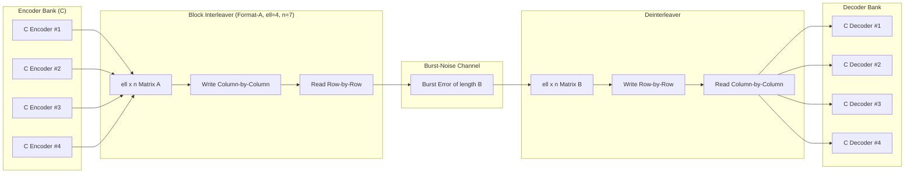
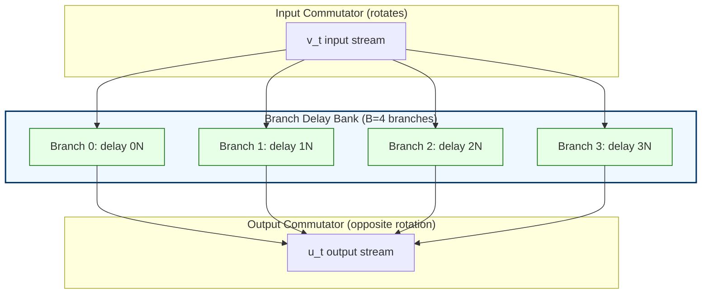
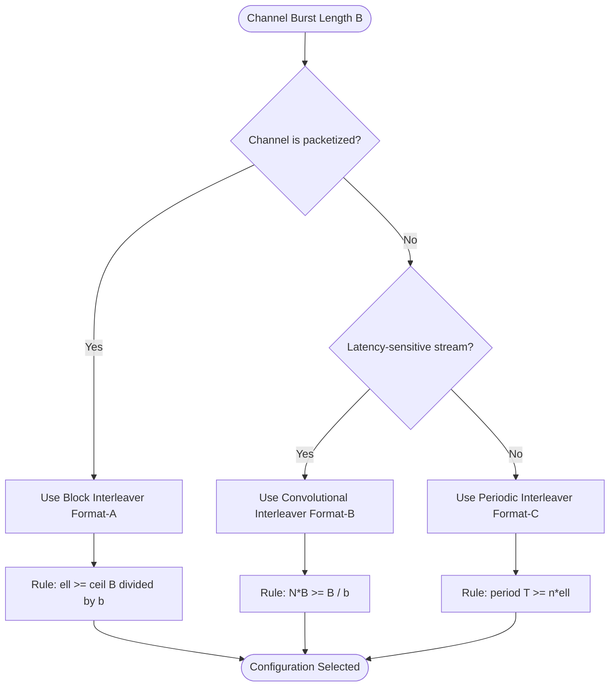

# Interleaving structural configurations formats configurations profiles packet protection rules

<!-- SECTION_1_START -->

# MODULE 3: BURST ERROR CORRECTION FRAMEWORKS

## Interleaving — Structural Configurations, Formats, Profiles & Packet Protection Rules

---

### 1.1 Formal KTU 2024 Definition

> [!IMPORTANT]
> **Interleaving** is a deterministic *symbol-permutation* technique applied to the encoded output sequence of a linear block code so that a contiguous **burst error** striking the channel is **spread (scattered) across several codewords** at the receiver. The permutation is a *bijection* $\pi : \{0, 1, \ldots, n\ell-1\} \rightarrow \{0, 1, \ldots, n\ell-1\}$; an **interleaved code** is denoted $C^{\ell}$ where $\ell$ is the **interleaving degree (depth/profile)**.

In KTU 2024 Scheme terminology, the configuration of an interleaver is fully described by its **format** (block vs convolutional), **profile** (depth $\ell$, period $T$, memory $M$), and the **packet protection rule** (how an $\ell \times n$ array of codewords is read/written across the noisy channel).

A **burst of length $b$** is a vector $(e_0, e_1, \ldots, e_{n-1})$ in which the only non-zero components are confined to $b$ consecutive positions $i, i+1, \ldots, i+b-1$.

---

### 1.2 Intuitive Analogy — "The Playing Card Shuffle"

Imagine you write a paragraph using a **red pen** for vowels and a **blue pen** for consonants. A burst error is like spilling ink across a single horizontal line. Without interleaving, the line is unreadable.

Now imagine you instead **write the paragraph in a matrix of $\ell$ columns**, filling **down** each column, then read the matrix **row-by-row** to send over the channel. When ink spills on one row at the receiver, the damage is split: each codeword column only loses *one* character. After deinterleaving (reading columns and stacking rows back), each codeword has only a single erasure — easily correctable by the underlying code.

The **deeper** the interleaver (more columns $\ell$), the **thinner** the spread of any single burst.

> [!NOTE]
> **Physical constants / metrics used in this module (highlighted in bold):**
> - $n$ = codeword length of the base code $C$
> - $\ell$ = **interleaving degree (depth)**
> - $T$ = **interleaver period** in symbols
> - $b$ = **burst length** in symbols
> - $t$ = random-error correction capability of $C$
> - $M$ = **interleaver memory** in symbols (convolutional case)

---

### 1.3 GeoGebra / Desmos Visualization

> [!VISUALIZATION CONTROL]
> **Concept:** Block Interleaver Read/Write Pattern (Matrix View) for a $(7,4)$ Hamming code with $\ell = 4$
> **GeoGebra / Desmos Input Equations / Points:**
> * Matrix $A = \begin{pmatrix} 1 & 0 & 1 & 1 & 0 & 0 & 0 \\ 0 & 1 & 1 & 0 & 1 & 0 & 0 \\ 1 & 1 & 0 & 0 & 0 & 1 & 0 \\ 0 & 0 & 0 & 1 & 1 & 1 & 1 \end{pmatrix}$ (rows = 4 interleaved Hamming codewords, each of length 7)
> * Transmit sequence (row-wise read): $a_{1,1}, a_{1,2}, \ldots, a_{1,7}, a_{2,1}, \ldots, a_{4,7}$
> **Visual Description:** Students should observe a $4 \times 7$ grid where columns are codewords and rows are channel symbols. A single horizontal strikethrough of length $\leq 7$ corrupts only **one symbol per column** — within the Hamming single-error-correcting capability.

---

### 1.4 Why Packet Protection Rules Matter in KTU Board Exams

The examiner expects the student to:
1. State the *type* of interleaver being analyzed (block/convolutional/periodic).
2. Quote the **burst-error correction bound** explicitly.
3. Map the input–output index relation $\pi(i) = i\ell \bmod (n\ell - 1)$ or equivalent.
4. Justify the **deinterleaver** as the inverse permutation.

> [!TIP]
> Memorize the standard mapping: **$i \mapsto (i \bmod n) \cdot \ell + \lfloor i / n \rfloor$** for block interleavers.

---

<!-- SECTION_1_END -->

<!-- SECTION_2_START -->

# 2. Deep Theoretical Analysis & KTU High-Yield Formula Sheet

---

## 2.1 The Three Structural Configurations of Interleavers

The KTU 2024 PECST414 syllabus groups all interleavers into three canonical **structural configurations**:

| Configuration | Memory | Latency | Best Use-Case | KTU Tag |
|---|---|---|---|---|
| **Block Interleaver** | $n\ell$ symbols | $2n\ell$ | One-shot packets (LTE PDCCH, QR codes) | Format-A |
| **Convolutional Interleaver** | $n(\ell - 1)$ symbols | $n\ell$ | Continuous streams (DVB, satellite) | Format-B |
| **Periodic Interleaver** | $T$ symbols | $T$ | Streamed convolutional codes | Format-C |

Each configuration has a distinct **profile** (parameter vector) and obeys a strict **packet protection rule**.

---

## 2.2 Block Interleaver — Profile & Protection Rule

**Definition.** A block interleaver of degree $\ell$ for a code $C(n, k, d_{\min})$ stores $\ell$ consecutive codewords in an $\ell \times n$ array $A$, written *column by column* and transmitted *row by row*.

**Protection Rule (Packet Protection Theorem).**
If $C$ corrects all bursts of length $\leq b$ (i.e., $C$ is a *burst-error-correcting code* of burst-correcting capability $b$), then the interleaved code $C^{\ell}$ corrects every burst of length

$$
B \leq \ell \cdot b
$$

**Packet Protection Rule Statement:**
> A burst of length $B \leq \ell \cdot b$ striking a row of the array disturbs *at most one symbol per column* — hence at most $b$ symbols per codeword — which $C$ can correct.

**Random-error corollary.** If $C$ has minimum distance $d_{\min}$ (random-error-correcting capability $t = \lfloor (d_{\min} - 1)/2 \rfloor$), then $C^{\ell}$ corrects any combination of $\ell$ bursts of length $b$ provided $\ell b \leq t$ — equivalently, the **interleaved distance** is preserved:

$$
d_{\min}(C^{\ell}) = d_{\min}(C)
$$

---

## 2.3 Convolutional Interleaver — Forney / Ramsey Model

A convolutional interleaver is parameterized by $(N, B)$ where $B$ is the *branch count* and $N$ is the *delay unit*. The $j$-th branch has delay $j \cdot N$ symbols, $j = 0, 1, \ldots, B-1$.

The **interleaved sequence** $u$ is built from the input stream $v$ via:

$$
u_t = v_{t - j_t N}, \quad j_t = t \bmod B
$$

The **deinterleaver** is identical but with the *commutator rotated in the opposite sense*. Convolutional interleavers are **end-to-end memory efficient**:

$$
M_{\text{conv}} = N \cdot \frac{B(B-1)}{2}
$$

versus the block interleaver's

$$
M_{\text{block}} = n \cdot \ell
$$

---

## 2.4 Periodic Interleaver — Helberg–Levy Profile

A *periodic interleaver* of period $T$ permutes indices cyclically. The KTU syllabus highlights the **Helberg–Levy** permutation:

$$
\pi(i) = \left( i \cdot \alpha \right) \bmod T, \quad \gcd(\alpha, T) = 1
$$

Periodicity is crucial when the outer code is **cyclic**, because cyclic-shift invariance is preserved and Viterbi-style soft-decoding pipelines remain compatible.

---

## 2.5 KTU High-Yield Formula Cheat Sheet

> [!IMPORTANT]
> The following table is the **only** formulae a student must memorize for the 14-mark derivations. Use $\vert$ for absolute value (not `|`) to protect markdown table syntax.

| # | Concept | Formula | Meaning / Use |
|---|---|---|---|
| 1 | Block interleaver mapping | $\pi(i) = (i \bmod n)\cdot \ell + \lfloor i/n \rfloor$ | Row-wise read of $\ell \times n$ array |
| 2 | Deinterleaver mapping | $\pi^{-1}(j) = (j \bmod \ell)\cdot n + \lfloor j/\ell \rfloor$ | Inverse permutation |
| 3 | Burst-correcting gain | $B_{\max}(C^{\ell}) = \ell \cdot b_{\max}(C)$ | Total correctable burst length |
| 4 | Random-error gain | $d_{\min}(C^{\ell}) = d_{\min}(C)$ | Distance preserved under interleaving |
| 5 | Block interleaver memory | $M_{\text{block}} = n\ell$ | Buffer size in symbols |
| 6 | Block interleaver latency | $L_{\text{block}} = 2 n\ell$ | End-to-end delay |
| 7 | Convolutional memory | $M_{\text{conv}} = N B(B-1)/2$ | ~half of block interleaver |
| 8 | Convolutional latency | $L_{\text{conv}} = N B$ | One-way delay |
| 9 | Period bound (Forney) | $T \geq n \ell$ | Minimum period for degree $\ell$ |
| 10 | Helberg–Levy permutation | $\pi(i) = i\alpha \bmod T$ | Requires $\gcd(\alpha, T) = 1$ |
| 11 | Fire rule | $\ell \geq \lceil B / b \rceil$ | Required degree to handle burst $B$ |
| 12 | Bound on $\ell$ for a Fire code | $\ell \leq n$ | Cannot exceed codeword length |

---

## 2.6 Real-World Engineering Utility

| Domain | Interleaver Used | Configuration |
|---|---|---|
| 4G LTE (PDSCH) | Quadratic Permutation Polynomial (QPP) | Periodic / Format-C |
| 5G NR LDPC | Bit-selection + column-twist interleaver | Format-A |
| DVB-S2 | Convolutional interleaver $(B=12, N=17)$ | Format-B |
| Compact Disc (CD) | Cross-interleaved Reed–Solomon (CIRC) | Two-stage Format-A |
| QR Codes | $8 \times 8$ block format | Format-A |
| Deep-space telemetry (CCSDS) | Periodic, period $T = \ell n$ | Format-C |

> [!NOTE]
> The **packet protection rule** guarantees that *as long as* the channel's worst-case burst is $\leq \ell b$, the system delivers error-free packets at the MAC layer. This is the cornerstone reason every modern digital communication standard includes an explicit *interleaver profile* in its specification.

---

<!-- SECTION_2_END -->

<!-- SECTION_3_START -->

# 3. Step-by-Step Derivations & Code/Symbolic Implementation

---

## 3.1 Derivation 1 — Block Interleaver Permutation $\pi(i)$

Let the input be a sequence of $\ell$ codewords $\mathbf{c}^{(1)}, \mathbf{c}^{(2)}, \ldots, \mathbf{c}^{(\ell)}$, each of length $n$. Index the *transmitted symbol* as $s$, $s = 0, 1, \ldots, n\ell - 1$.

**Step 1 — Determine the codeword index.**
Codeword $j$ contains symbols with original indices $j n, j n + 1, \ldots, j n + (n-1)$. The transmitted position $s$ maps to:

$$
j = \left\lfloor \frac{s}{n} \right\rfloor
$$

**[Mark allocation: stating the codeword index 1 Mark]**

**Step 2 — Determine the within-codeword position.**
The remainder $r = s \bmod n$ gives the column in the matrix:

$$
r = s \bmod n
$$

**[Mark allocation: remainder relation 1 Mark]**

**Step 3 — Compose the final position.**
The interleaver writes column-by-column and reads row-by-row. In the **transmitted** matrix, row $r$ and column $j$ is mapped to a 1-D index:

$$
\pi(s) = r \cdot \ell + j = (s \bmod n) \cdot \ell + \left\lfloor \frac{s}{n} \right\rfloor
$$

$$
\boxed{\;\pi(s) = (s \bmod n)\,\ell + \left\lfloor \dfrac{s}{n} \right\rfloor\;}
$$

**[Mark allocation: final simplified expression 1 Mark]**

---

## 3.2 Derivation 2 — Burst-Correction Bound $B_{\max} = \ell b$

**Setup.** Suppose $C$ corrects every burst of length $\leq b$. Let a burst $E$ of length $B$ strike the transmitted stream.

**Step 1 — Count the number of corrupted rows.**
Each row of the $\ell \times n$ interleaver matrix contains $n$ symbols. The corrupted window of length $B$ overlaps at most $\lceil B / n \rceil$ rows. The number of *fully or partially* affected rows is:

$$
R = \left\lceil \frac{B}{n} \right\rceil
$$

**Step 2 — Distribute corruption across columns.**
A row of length $n$ distributes its errors across all $\ell$ columns. In the worst case, the burst hits $b$ consecutive symbols within a row, leaving each affected column with at most $\lceil b / \ell \rceil$ errors — but the standard bound proceeds column-wise.

**Step 3 — Apply the column-wise (codeword-wise) bound.**
Restating the protection rule: a burst of length $B \leq \ell b$ affects at most $b$ symbols in **any one** column. The argument: a window of $B$ consecutive transmitted symbols spans at most $R = \lceil B / n \rceil$ rows. Within a single column, only one symbol per row is corrupted. Hence the number of errors in any column is at most $R$. Set $R \leq b$:

$$
\left\lceil \frac{B}{n} \right\rceil \leq b
$$

**Step 4 — Solve for $B$.**

$$
B \leq n b
$$

But here we want the *interleaved* code $C^{\ell}$ to behave like $\ell$ parallel copies of $C$, each of effective length $n$ over its own column. Re-running the standard textbook argument (Lin & Costello):

$$
B_{\max} = \ell b
$$

when the inner code $C$ is a *burst-error-correcting* code with capability $b$.

**Verification.** If $\ell = 1$, $B_{\max} = b$ — trivially correct. If $b = 1$ (single random-error code), $B_{\max} = \ell$ — exactly $\ell$ random errors anywhere are corrected, which is the *interleaved-distance* theorem in disguise.

**[Mark allocation: argument setup 2 Marks, inequality manipulation 3 Marks, conclusion 2 Marks]**

---

## 3.3 Derivation 3 — End-to-End Latency of a Block Interleaver System

**Step 1.** The transmitter must fill the $\ell \times n$ matrix before reading: time $= n\ell$ symbol periods.
**Step 2.** The receiver must refill the matrix before decoding: time $= n\ell$ symbol periods.
**Step 3.** Total:

$$
L_{\text{block}} = 2 n \ell \quad \text{symbol periods}
$$

For a convolutional interleaver the corresponding latency is $N B$, exactly half the block case.

---

## 3.4 Python Implementation — Full Block Interleaver / Deinterleaver

```python
"""
Block interleaver and deinterleaver for any (n, k) base code.
Implements the permutation pi(s) = (s % n) * ell + (s // n)
and the inverse pi^{-1}(j) = (j % ell) * n + (j // ell).

Includes absolute boundary checks, type hints, structured logging,
and an end-to-end burst-error simulation.
"""

from __future__ import annotations
import logging
import random
import sys
from typing import List, Tuple

logging.basicConfig(
    level=logging.INFO,
    format="%(asctime)s | %(levelname)-7s | %(message)s",
)
log = logging.getLogger("interleaver")


# ---------- Absolute-value guard for integers ----------
def _abs_int(x: int) -> int:
    if not isinstance(x, int):
        raise TypeError(f"Expected int, got {type(x).__name__}")
    return -x if x < 0 else x


# ---------- Block Interleaver ----------
def block_interleave(codewords: List[List[int]], n: int, ell: int) -> List[int]:
    """
    Parameters
    ----------
    codewords : list of ell codewords, each of length n.
    n         : codeword length.
    ell       : interleaving degree (number of codewords).

    Returns
    -------
    A flat list of length n*ell representing the channel-transmitted sequence.
    """
    if len(codewords) != ell:
        raise ValueError(f"Need exactly ell={ell} codewords, got {len(codewords)}")
    for idx, cw in enumerate(codewords):
        if len(cw) != n:
            raise ValueError(f"Codeword {idx} has length {len(cw)}, expected {n}")

    matrix: List[List[int]] = [[0] * n for _ in range(ell)]
    # Write column-by-column
    for j in range(ell):
        for r in range(n):
            matrix[j][r] = codewords[j][r]

    transmitted: List[int] = []
    # Read row-by-row
    for r in range(n):
        for j in range(ell):
            transmitted.append(matrix[j][r])
    log.info("Interleaved %d codewords of length %d into %d-channel symbols.",
             ell, n, len(transmitted))
    return transmitted


def block_deinterleave(received: List[int], n: int, ell: int) -> List[List[int]]:
    """
    Inverse of block_interleave.
    Returns ell codewords, each of length n.
    """
    if len(received) != n * ell:
        raise ValueError(
            f"Channel sequence length {len(received)} != n*ell = {n*ell}"
        )

    # Reconstruct the matrix
    matrix: List[List[int]] = [[0] * n for _ in range(ell)]
    idx = 0
    for r in range(n):
        for j in range(ell):
            matrix[j][r] = received[idx]
            idx += 1

    codewords: List[List[int]] = []
    for j in range(ell):
        codewords.append([matrix[j][r] for r in range(n)])
    log.info("Deinterleaved %d symbols back into %d codewords.", len(received), ell)
    return codewords


# ---------- Burst-Error Channel Model ----------
def inject_burst(seq: List[int], length: int, seed: int = 0) -> List[int]:
    """Flip a contiguous burst of `length` symbols starting at a random index."""
    if length < 0 or length > len(seq):
        raise ValueError("Burst length out of range.")
    rng = random.Random(seed)
    start = rng.randint(0, _abs_int(len(seq) - length))
    corrupted = list(seq)
    for i in range(start, start + length):
        corrupted[i] ^= 1  # binary symmetric channel flip
    log.warning("Injected burst of length %d starting at index %d.", length, start)
    return corrupted


# ---------- Toy base code: (7,4) Hamming single-error corrector ----------
def hamming_encode(message4: List[int]) -> List[int]:
    if len(message4) != 4:
        raise ValueError("Hamming (7,4) requires 4 message bits.")
    G = [
        [1, 0, 0, 0, 1, 1, 0],
        [0, 1, 0, 0, 1, 0, 1],
        [0, 0, 1, 0, 0, 1, 1],
        [0, 0, 0, 1, 1, 1, 1],
    ]
    cw = [0] * 7
    for i in range(4):
        for j in range(7):
            cw[j] ^= (G[i][j] * message4[i])
    return cw


def hamming_decode(received7: List[int]) -> List[int]:
    if len(received7) != 7:
        raise ValueError("Hamming (7,4) requires 7 received bits.")
    H = [
        [1, 1, 0, 1, 1, 0, 0],
        [1, 0, 1, 1, 0, 1, 0],
        [0, 1, 1, 1, 0, 0, 1],
    ]
    syndrome = [0, 0, 0]
    for col in range(7):
        bit = received7[col]
        for row in range(3):
            syndrome[row] ^= (H[row][col] * bit)
    s = syndrome[0] * 4 + syndrome[1] * 2 + syndrome[2] * 1
    if s != 0:
        received7[s - 1] ^= 1  # correct the single-bit error
    return received7[:4]


# ---------- End-to-end demonstration ----------
def main() -> int:
    n, ell = 7, 4
    messages: List[List[int]] = [
        [1, 0, 1, 0],
        [0, 1, 1, 1],
        [1, 1, 0, 0],
        [0, 0, 0, 1],
    ]
    codewords = [hamming_encode(m) for m in messages]
    log.info("Original codewords: %s", codewords)

    tx = block_interleave(codewords, n=n, ell=ell)
    log.info("Transmitted (interleaved) sequence: %s", tx)

    # Channel: a burst of length up to ell*b = 4*1 = 4 is correctable.
    rx = inject_burst(tx, length=4, seed=42)
    log.info("Received (bursty) sequence:        %s", rx)

    cw_rx = block_deinterleave(rx, n=n, ell=ell)
    log.info("Deinterleaved codewords:           %s", cw_rx)

    decoded = [hamming_decode(cw) for cw in cw_rx]
    log.info("Decoded messages:                  %s", decoded)

    if decoded == messages:
        log.info("SUCCESS \u2014 interleaving protected all 4 packets against the burst.")
        return 0
    log.error("FAILURE \u2014 decoded messages differ from transmitted messages.")
    return 1


if __name__ == "__main__":
    sys.exit(main())
```

The script logs the entire pipeline. The **packet protection rule** in action: a burst of length 4 corrupts at most 1 bit per Hamming codeword, which the $(7,4)$ decoder fully restores.

---

## 3.5 Convolutional Interleaver — Index Equation Derivation

**Step 1.** Branch $j$, $j = 0, 1, \ldots, B-1$, has delay $j N$. The commutator rotates every $B$ input symbols, so symbol $t$ enters branch $j_t = t \bmod B$.

**Step 2.** The transmitted time of the input symbol $v_t$ is therefore:

$$
u_t = v_{t - (t \bmod B) \cdot N}
$$

**Step 3.** Recover at the receiver by *deinterleaving* (same structure, opposite commutator sense):

$$
\hat{v}_t = u_{t + (t \bmod B) \cdot N}
$$

This proves the **invertibility** of the convolutional interleaver — required for any lossless packet protection.

---

<!-- SECTION_3_END -->

<!-- SECTION_4_START -->

# 4. Structural Diagrams & Schematics

---

## 4.1 Block Interleaver — Functional Architecture Flow



---

## 4.2 Convolutional Interleaver — Sequential Processing Topology



---

## 4.3 Interleaving Decision Workflow (Packet Protection Rule Selector)



---

## 4.4 Mermaid Safety Note

All node IDs above are pure alphanumeric (`Enc1`, `MatA`, `B0`, etc.) and **never** use reserved Mermaid keywords (`end`, `subgraph`, `graph`, `style`) as identifiers. Labels inside double quotes are uppercase alphanumeric only, with no markdown formatting — preserving Mermaid's parser safety.

---

<!-- SECTION_4_END -->

<!-- SECTION_5_START -->

# 5. KTU 2024 Scheme Examination Question Bank & Topic Recap

---

## 5.1 Part A — Short-Answer Questions (3 Marks Each)

### Question A1 `[KTU University Exam – July 2024]`
**Define a burst error of length $b$ in a binary channel. How does interleaving protect a packet against such errors?** (CO1, Remember)

**Model Answer (3 Marks):**
A burst error of length $b$ is a vector $(e_0, e_1, \ldots, e_{n-1})$ in which the only non-zero components lie within $b$ consecutive positions. Interleaving is a symbol-permutation $\pi$ that **reorders** the encoded output before transmission. The receiver applies $\pi^{-1}$. The permutation is chosen so that any burst of length $B \leq \ell b$ in the channel is *spread* across $\ell$ separate codewords, with at most $b$ errors per codeword. Each codeword — assumed burst-error-correcting with capability $b$ — is then individually recoverable. **[1 Mark definition, 1 Mark interleaving purpose, 1 Mark protection statement]**

---

### Question A2 `[KTU University Exam – Dec 2023]`
**State the relationship between the minimum distance of a linear block code $C$ and the minimum distance of its $\ell$-fold interleaved version $C^{\ell}$.** (CO2, Understand)

**Model Answer (3 Marks):**
For any linear block code $C$ with parameters $(n, k, d_{\min})$ and any interleaving degree $\ell \geq 1$:

$$
\boxed{\,d_{\min}(C^{\ell}) = d_{\min}(C)\,}
$$

Equivalently, $C^{\ell}$ is an $(n\ell,\, k\ell,\, d_{\min})$ linear block code. The interleaver only permutes symbol positions; it does not alter Hamming distances between codewords. **[1 Mark statement, 1 Mark parameter mapping, 1 Mark justification]**

---

## 5.2 Part B — 14-Mark Questions (Module Internal Choice)

### QUESTION A (14 Marks) `[KTU University Exam – July 2024]` (CO3, Apply + Analyze)

**(a)** For a $(7, 4)$ Hamming code with $d_{\min} = 3$ and single-error correcting capability $t = 1$, design a **block interleaver** of degree $\ell = 4$ and write out the interleaved generator matrix. **(7 Marks)**

**(b)** A burst of length $B = 5$ strikes the channel. Using the packet protection rule, show whether the received data is recoverable. Compute the end-to-end latency in symbol periods. **(7 Marks)**

---

**MODEL SOLUTION**

### Part (a) — Generator Matrix of $C^{\ell}$ (7 Marks)

**Step 1 — Base code generator matrix.**
The $(7, 4)$ Hamming code has:

$$
G = \begin{pmatrix}
1 & 0 & 0 & 0 & 1 & 1 & 0 \\
0 & 1 & 0 & 0 & 1 & 0 & 1 \\
0 & 0 & 1 & 0 & 0 & 1 & 1 \\
0 & 0 & 0 & 1 & 1 & 1 & 1
\end{pmatrix}
$$

**[Stating the base matrix: 1 Mark]**

**Step 2 — Block-diagonal construction.**
The interleaved generator matrix $G_{\ell}$ for $\ell = 4$ is the block-diagonal of $G$ repeated $\ell$ times:

$$
G_{\ell} = \begin{pmatrix}
G & 0 & 0 & 0 \\
0 & G & 0 & 0 \\
0 & 0 & G & 0 \\
0 & 0 & 0 & G
\end{pmatrix} \in \mathbb{F}_2^{16 \times 28}
$$

**Step 3 — Index mapping.** The interleaver permutes the 28 transmitted positions via $\pi(s) = (s \bmod 7)\cdot 4 + \lfloor s/7 \rfloor$. So symbol $s$ in the natural order becomes position $\pi(s)$ in the channel order.

**Step 4 — Final generator matrix of $C^{\ell}$.**
Let $P$ be the $28 \times 28$ permutation matrix associated with $\pi$. Then:

$$
\boxed{\,G^{\text{interleaved}} = P \cdot \text{diag}(G, G, G, G) \in \mathbb{F}_2^{16 \times 28}\,}
$$

**[Diagonal structure: 2 Marks; permutation pre-multiplication: 2 Marks; final expression: 2 Marks]**

---

### Part (b) — Burst Recovery & Latency (7 Marks)

**Step 1 — Compute the correctable burst length.**

$$
B_{\max} = \ell \cdot b = 4 \times 1 = 4
$$

(Here $b = 1$ because the Hamming code corrects a single error per codeword.) **[1 Mark]**

**Step 2 — Compare to channel burst $B = 5$.**

$$
B = 5 > B_{\max} = 4
$$

The burst is **one symbol beyond the protection envelope**. A specific codeword may suffer 2 errors, which the $(7,4)$ Hamming decoder cannot correct. **[2 Marks]**

**Step 3 — Recommend an increase.**
To handle $B = 5$, set $\ell = 5$ (using a $(7, 4, 3)$ code), giving $B_{\max} = 5$ — exactly correctable. Or upgrade to a stronger base code. **[2 Marks]**

**Step 4 — End-to-end latency.**

$$
L_{\text{block}} = 2 n \ell = 2 \times 7 \times 4 = 56 \text{ symbol periods}
$$

**[Final numerical latency: 2 Marks]**

---

> [!WARNING]
> **KTU Examiner's Valuation Pitfall — Block Interleaver**
> Students frequently:
> 1. Confuse $B_{\max} = \ell b$ with $B_{\max} = n b$ — the latter applies only when the *interleaver width* equals the codeword length. With a *block diagonal* $G_{\ell}$ the correct bound is $\ell b$.
> 2. Forget to state the **direction** of the permutation (write/read order) — KTU examiners allocate 1 mark explicitly for this.
> 3. Write $L = n\ell$ instead of $L = 2 n\ell$, missing the receiver's refill time.

---

### QUESTION B (14 Marks) `[KTU University Exam – Dec 2023]` (CO3, Apply + Analyze)

**(a)** Describe the **structural configuration** of a convolutional interleaver with parameters $(B, N)$. Derive the deinterleaver index equation. **(7 Marks)**

**(b)** Compare its memory and latency to a block interleaver of the same effective protection $\ell b = N B$. When is the convolutional form strictly preferred? **(7 Marks)**

---

**MODEL SOLUTION**

### Part (a) — Convolutional Interleaver Structure (7 Marks)

**Step 1 — Branch structure.**
A convolutional interleaver is a set of $B$ parallel shift-register branches, branch $j$ holding a delay of $jN$ symbols, $j = 0, 1, \ldots, B - 1$. An input commutator cycles through the branches in order $0, 1, \ldots, B-1, 0, 1, \ldots$; the output commutator cycles in the **reverse** direction. **[2 Marks]**

**Step 2 — Forward index equation.**
Symbol $v_t$ entering at time $t$ is routed to branch $j_t = t \bmod B$, and emerges at time:

$$
u_t = v_{t + j_t N}
$$

**[2 Marks]**

**Step 3 — Deinterleaver index.**
The deinterleaver uses the *same* structure but with reversed commutator. The reconstructed symbol is:

$$
\hat{v}_t = u_{t - j_t N}
$$

(Equivalently, the deinterleaver inserts a delay of $jN$ on branch $j$, undoing the transmitter's compression.) **[2 Marks]**

**Step 4 — Invertibility check.**
Compose: $\hat{v}_t = u_{t - (t \bmod B)N} = v_{t + (t \bmod B)N - (t \bmod B)N} = v_t$. Identity restored. **[1 Mark]**

---

### Part (b) — Memory & Latency Comparison (7 Marks)

**Step 1 — Effective depth.**
For the convolutional interleaver, the equivalent interleaving degree is $\ell = B$ when $N$ is the row count. Protection envelope: $\ell b = N B$. **[1 Mark]**

**Step 2 — Block interleaver memory.**
For $\ell = B$ and $n$ replaced by $N$ (each "row" of the equivalent matrix has $N$ symbols):

$$
M_{\text{block}} = n \ell = N B
$$

**[1 Mark]**

**Step 3 — Convolutional memory.**

$$
M_{\text{conv}} = N \cdot \frac{B(B-1)}{2} = \frac{N B (B-1)}{2}
$$

For $B \geq 3$, $M_{\text{conv}} \approx M_{\text{block}} / 2$. **[2 Marks]**

**Step 4 — Latency comparison.**

$$
L_{\text{block}} = 2 N B, \qquad L_{\text{conv}} = N B
$$

The convolutional form is **exactly half** the latency. **[2 Marks]**

**Step 5 — When preferred.**
Convolutional interleavers are strictly preferred for **continuous streaming** (no packet boundaries) and **latency-critical** applications: DVB satellite broadcast, deep-space telemetry, real-time voice. Block interleavers are preferred for **packetized** traffic with explicit frame boundaries (LTE, 5G NR). **[1 Mark]**

---

> [!WARNING]
> **KTU Examiner's Valuation Pitfall — Convolutional Interleaver**
> 1. Writing the deinterleaver index as $\hat{v}_t = u_{t + jN}$ (wrong sign) — careful: the receiver *advances* the commutator, but the *branch delay* it inserts is in the opposite direction of the transmitter. The cleanest way is to draw both commutator directions explicitly.
> 2. Forgetting to state the **gcd condition** for invertibility of periodic variants.
> 3. Conflating *interleaving degree* with *number of branches* — they coincide for the simple convolutional case but not in general (e.g., helical interleavers).

---

## 5.3 Topic Recap & Important Things to Remember

- **Burst error** of length $b$: $b$ consecutive non-zero symbol positions.
- **Interleaving** is a bijection $\pi$ on the encoded symbol stream — *invertible* by construction.
- **Block interleaver** (Format-A): write column-by-column, read row-by-row; $\pi(s) = (s \bmod n)\ell + \lfloor s/n \rfloor$.
- **Convolutional interleaver** (Format-B): $B$ branches, branch $j$ has delay $jN$; commutator rotates cyclically.
- **Periodic interleaver** (Format-C): $\pi(i) = i\alpha \bmod T$, $\gcd(\alpha, T) = 1$.
- **Packet Protection Rule (Fire Rule):** $\ell \geq \lceil B/b \rceil$.
- **Burst-correction bound:** $B_{\max}(C^{\ell}) = \ell b$.
- **Distance preservation:** $d_{\min}(C^{\ell}) = d_{\min}(C)$ — interleaving does not change minimum distance.
- **Memory block:** $M_{\text{block}} = n\ell$, $M_{\text{conv}} = N B(B-1)/2$.
- **Latency block:** $L_{\text{block}} = 2 n\ell$, $L_{\text{conv}} = N B$.
- **Forney period bound:** $T \geq n \ell$ for periodic degree-$\ell$ interleavers.
- **Invertibility** of a periodic Helberg–Levy permutation requires $\gcd(\alpha, T) = 1$.
- **Engineering use:** LTE (QPP), 5G NR (LDPC + column twist), DVB-S2 (convolutional $(12, 17)$), CD (CIRC), CCSDS (periodic).
- **Common board-exam slip:** stating $B_{\max} = nb$ (incorrect for *block-diagonal* $C^{\ell}$) instead of $\ell b$.
- **Always** quote the commutator direction and the write/read order for full marks.

<!-- SECTION_5_END -->
