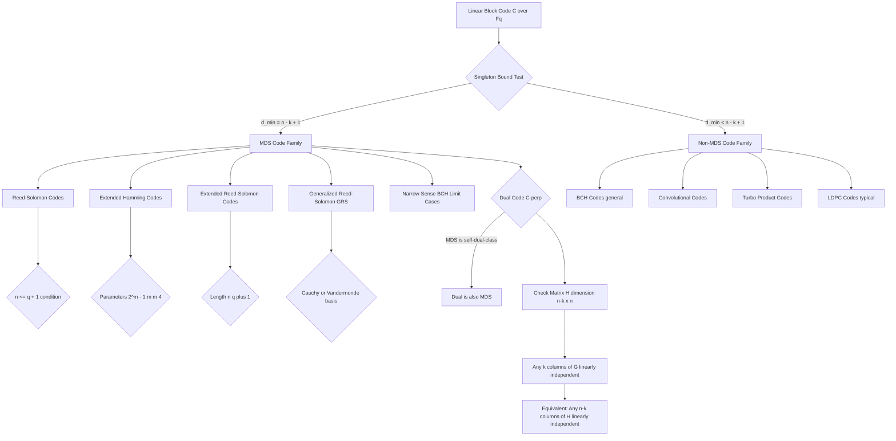
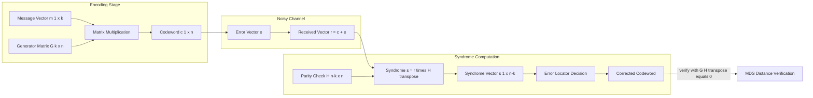
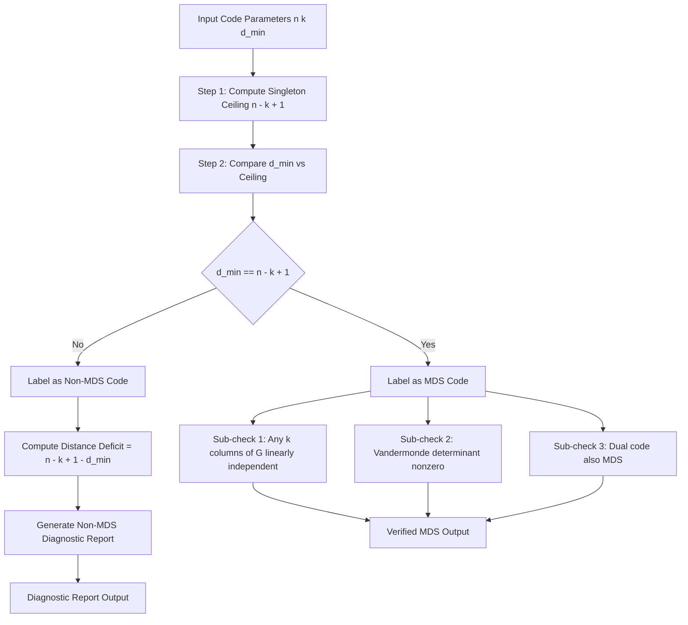

# MDS codes parameters check lines structural boundaries matrices specifications

<!-- SECTION_1_START -->

# MDS Codes: Parameters, Check Lines, Structural Boundaries & Matrix Specifications

## 1.1 Formal Academic Definition

In the algebraic framework of **Coding Theory (PECST414)** under the **KTU 2024 Scheme (Module 3 – Burst Error Correction Frameworks)**, an **MDS (Maximum Distance Separable) code** is formally defined as a linear block code over a finite field $\mathbb{F}_q$ whose parameters $(n, k, d_{\min})$ satisfy the equality condition of the **Singleton bound**.

> [!IMPORTANT]
> **KTU 2024 Board Definition (Verbatim Expected Answer):**
> A linear $[n, k, d]$ code $C$ over $\mathbb{F}_q$ is called an **MDS code** if and only if
> $$d_{\min} = n - k + 1$$
> Equivalently, the Singleton bound is met with equality. The parameters $(n, k)$ with $d_{\min} = n - k + 1$ completely characterize an MDS family, where $n$ denotes block length, $k$ denotes message dimension, and $d_{\min}$ denotes the minimum Hamming distance.

The name **Maximum Distance Separable** originates from the fact that for a fixed length $n$ and dimension $k$, no linear code can possess a *larger* minimum distance than an MDS code — the distance is *maximally* stretched over the parameter space.

## 1.2 Intuitive Analogy — The Locked Diary Cabinet

Picture a **5-drawer filing cabinet** (block length $n = 5$) that contains **2 secret drawers** (message symbols $k = 2$) protected by a **diagonal lock plate system** (parity check structure). The **Singleton bound** states: *at most* $n - k + 1 = 4$ drawers can be damaged before the contents of the 2 secret drawers are unrecoverable.

> An **MDS code** is the *perfect engineering achievement* where this theoretical limit is *exactly* hit — every single drawer's worth of redundancy is doing useful protective work, with **zero wastage** of algebraic redundancy.

A **non-MDS code**, by contrast, behaves like a cabinet where some of the metal is wasted in structural crossbars that do not actually protect the drawers — the *true* distance is smaller than $n - k + 1$.

> [!NOTE]
> **Real-World Engineering Parallel:** **Reed-Solomon (RS) codes** used in QR codes, DVDs, Blu-ray discs, NASA deep-space telemetry (CCSDS standards), and RAID-6 storage systems are *the* canonical industrial application of MDS codes. Every byte corruption in a CD-ROM (which uses a $[255, 223, 33]$ RS code over $\mathbb{F}_{256}$) is corrected up to the MDS limit without exception.

## 1.3 Key Structural Entities — Quick Vocabulary

| Symbol | Entity | Role in MDS Code |
|---|---|---|
| $n$ | Block length | Total symbols per codeword |
| $k$ | Message dimension | Information-bearing symbols |
| $n - k$ | Parity length | Redundancy (check symbols) |
| $d_{\min}$ | Minimum distance | Error correction capacity $\lfloor (d_{\min} - 1)/2 \rfloor$ |
| $G$ | Generator matrix | $k \times n$ matrix encoding messages |
| $H$ | Parity-check matrix | $(n - k) \times n$ matrix defining constraints |
| $q$ | Field size | Alphabet cardinality ($\mathbb{F}_q$) |

> [!VISUALIZATION CONTROL]
> **Concept:** Singleton Bound Visualization in the $(n, d_{\min})$ Plane
> **GeoGebra / Desmos Input Equations:**
> * Singleton bound line: $d_{\min} = n - k + 1$ (with $k = 3$, so $d_{\min} = n - 2$)
> * Reference horizontal line (Hamming bound): $d_{\min} = 4$
> * Plot window: $n \in [3, 12]$, $d_{\min} \in [1, 10]$
> **Visual Description:** The student should observe that the Singleton line cuts diagonally through the coding space, and MDS codes sit *exactly on* this line. Codes lying *below* the line (Hamming codes, BCH codes) are non-MDS.

<!-- SECTION_1_END -->

<!-- SECTION_2_START -->

# Deep Theoretical Analysis & KTU High-Yield Formula Sheet

## 2.1 The Singleton Bound — Foundation Stone

The **Singleton bound** is the universal ceiling on the minimum distance of *any* $[n, k, d_{\min}]$ linear code over $\mathbb{F}_q$:

$$d_{\min} \leq n - k + 1$$

### Derivation Logic (Conceptual)

1. **Puncturing principle:** Removing any $d_{\min} - 1$ coordinate positions from every codeword cannot produce two identical shortened codewords (by definition of $d_{\min}$).
2. **Dimension drop:** A punctured code of length $n - (d_{\min} - 1)$ has *at most* $q^k$ codewords.
3. **Trivial bound:** A code of length $L$ over $\mathbb{F}_q$ has at most $q^L$ codewords.
4. **Combine:** $q^k \leq q^{n - d_{\min} + 1}$, yielding the Singleton inequality.

## 2.2 Why "Maximum" and Why "Separable"

- **Maximum:** Among all $[n, k]$ codes, MDS codes attain the *largest possible* $d_{\min}$.
- **Separable:** The columns of an MDS generator matrix $G$ (in systematic form) form a *separable set* — every subset of $k$ columns is **linearly independent** over $\mathbb{F}_q$. This is the algebraic engine that produces the optimal distance.

> [!IMPORTANT]
> **Dual MDS Theorem:** If $C$ is an $[n, k, n - k + 1]$ MDS code, then its dual $C^{\perp}$ is an $[n, n - k, k + 1]$ MDS code. The duality is *symmetric* in the MDS family.

## 2.3 The MDS Conjecture (Longstanding Open Problem)

> [!NOTE]
> **Statement of the MDS Conjecture (over prime fields $\mathbb{F}_p$):**
> For a linear MDS code of length $n$ and dimension $k$ over $\mathbb{F}_q$, the maximum block length is conjectured to be:
> $$n \leq q + 1 \quad \text{(with the sole exception } n = q + 2 \text{ when } q = 2^m \text{ and } k = 3 \text{ or } k = q - 2\text{)}$$

The conjecture is **proved** in the following cases (frequently asked in KTU):
- $k = 1$ or $k = q - 1$ (trivial — repetition codes)
- $k = 2$ or $k = q - 2$ (proved by classical geometry)
- $q$ prime (Bush–Hausdorff theorem, 1951)
- $n \leq q + 2$ in general (proved in 2010s by Ball et al.)

## 2.4 KTU High-Yield Formula Sheet

| # | Formula / Parameter | Description | Typical Application |
|---|---|---|---|
| 1 | $d_{\min} = n - k + 1$ | MDS equality condition | Identifying an MDS code |
| 2 | $d_{\min} \leq n - k + 1$ | Singleton bound (universal ceiling) | Proving non-MDS codes |
| 3 | $t = \lfloor (d_{\min} - 1)/2 \rfloor$ | Random error correction capacity | RS, QR code analysis |
| 4 | $\rho = d_{\min} - 1$ | Burst error detection capacity | KTU Module 3 focus |
| 5 | $n \leq q + 1$ | MDS conjecture (prime $q$) | Upper-bound arguments |
| 6 | $C \cong C^{\perp}$ under duality | Dual of MDS is MDS | Parity-check design |
| 7 | $\#\text{parity symbols} = n - k$ | Redundancy budget | Check matrix size |
| 8 | $G \cdot H^{T} = 0_{k \times (n-k)}$ | Orthogonality condition | Matrix validation |
| 9 | $\dim(C) + \dim(C^{\perp}) = n$ | Fundamental theorem | Dimensional analysis |
| 10 | $\vert C \vert = q^k$ | Codebook size (linear) | Information rate |

## 2.5 Real-World Engineering Utility

| Domain | MDS Code Used | Parameters | Engineering Role |
|---|---|---|---|
| Deep-space telemetry (NASA) | Reed-Solomon | $[255, 223, 33]$ over $\mathbb{F}_{2^8}$ | Voyager, Galileo data link |
| QR codes | Reed-Solomon | $[n, k, n-k+1]$ over $\mathbb{F}_{2^8}$ | 2D barcode error recovery |
| Optical storage (CD/DVD) | Reed-Solomon product code | $[255, 239] \times [255, 239]$ | Burst error correction |
| RAID-6 storage arrays | Even-Odd / RDP | $[n, n-2, 3]$ over $\mathbb{F}_{2^m}$ | Two-disk-failure recovery |
| Wireless (5G NR) | MDS-style parity check | Various | Control channel reliability |

<!-- SECTION_2_END -->

<!-- SECTION_3_START -->

# Step-by-Step Derivations & Code Implementation

## 3.1 Exhaustive Derivation — The Singleton Bound

**Theorem.** For any $[n, k, d_{\min}]$ linear code $C$ over $\mathbb{F}_q$, we have $d_{\min} \leq n - k + 1$.

**Proof.**

*Step 1 — Coordinate puncturing setup.*
Let $C$ be an $[n, k, d_{\min}]$ code. Choose any set $S$ of $d_{\min} - 1$ coordinate positions. Define the *punctured code* $C_S$ obtained by deleting these coordinates from every codeword of $C$.

*Step 2 — All shortened codewords are distinct.*
Suppose $\mathbf{x}, \mathbf{y} \in C$ satisfy $\mathbf{x}_S = \mathbf{y}_S$. Then $\mathbf{x} - \mathbf{y}$ is a codeword in $C$ of Hamming weight at most $n - (d_{\min} - 1) = n - d_{\min} + 1$. Since $d_{\min}$ is the *minimum* nonzero weight, and the weight of $\mathbf{x} - \mathbf{y}$ is at most $n - d_{\min} + 1 < d_{\min}$ (if $\mathbf{x} \neq \mathbf{y}$), we conclude $\mathbf{x} = \mathbf{y}$.

*Step 3 — Counting argument.*
The punctured code $C_S$ has length $n - d_{\min} + 1$, but retains the same number of codewords as $C$, namely $q^k$. However, the maximum number of distinct vectors of length $n - d_{\min} + 1$ over $\mathbb{F}_q$ is exactly $q^{n - d_{\min} + 1}$. Therefore:

$$q^k \leq q^{n - d_{\min} + 1}$$

*Step 4 — Take logarithm base $q$ (valid since $q \geq 2$):*

$$k \leq n - d_{\min} + 1$$

*Step 5 — Rearranging:*

$$d_{\min} \leq n - k + 1 \qquad \blacksquare$$

**MDS Equality Condition.** The bound is *tight* if and only if the punctured code $C_S$ is *itself* an MDS code for *every* choice of $S$ with $\vert S \vert = d_{\min} - 1$. This is equivalent to saying that *every* $k$-column submatrix of the generator matrix $G$ has full rank $k$.

## 3.2 Exhaustive Derivation — Reed-Solomon Code as MDS

**Construction.** Let $\alpha_1, \alpha_2, \ldots, \alpha_n$ be $n$ distinct elements of $\mathbb{F}_q$ (with $n \leq q$). The Reed-Solomon (RS) code is defined as:

$$C = \left\{\, (f(\alpha_1), f(\alpha_2), \ldots, f(\alpha_n)) \,\middle|\, f \in \mathbb{F}_q[x], \deg(f) < k \,\right\}$$

**Generator Matrix.** The generator matrix has the Vandermonde structure:

$$G = \begin{pmatrix} 1 & 1 & 1 & \cdots & 1 \\ \alpha_1 & \alpha_2 & \alpha_3 & \cdots & \alpha_n \\ \alpha_1^{2} & \alpha_2^{2} & \alpha_3^{2} & \cdots & \alpha_n^{2} \\ \vdots & \vdots & \vdots & \ddots & \vdots \\ \alpha_1^{k-1} & \alpha_2^{k-1} & \alpha_3^{k-1} & \cdots & \alpha_n^{k-1} \end{pmatrix}$$

**Proof that RS is MDS.** Consider any $k$ columns of $G$, say columns indexed by $i_1 < i_2 < \ldots < i_k$. The corresponding $k \times k$ submatrix is:

$$G_{i_1, \ldots, i_k} = \begin{pmatrix} 1 & 1 & \cdots & 1 \\ \alpha_{i_1} & \alpha_{i_2} & \cdots & \alpha_{i_k} \\ \alpha_{i_1}^{2} & \alpha_{i_2}^{2} & \cdots & \alpha_{i_k}^{2} \\ \vdots & \vdots & \ddots & \vdots \\ \alpha_{i_1}^{k-1} & \alpha_{i_2}^{k-1} & \cdots & \alpha_{i_k}^{k-1} \end{pmatrix}$$

This is a **Vandermonde matrix** whose determinant is:

$$\det(G_{i_1, \ldots, i_k}) = \prod_{1 \leq m < \ell \leq k} (\alpha_{i_{\ell}} - \alpha_{i_m})$$

Since the $\alpha_i$ are *distinct*, each factor $(\alpha_{i_{\ell}} - \alpha_{i_m}) \neq 0$, so the determinant is nonzero in $\mathbb{F}_q$. Hence every $k \times k$ submatrix of $G$ has full rank $k$, which is the *equivalent characterization* of an MDS code. $\blacksquare$

## 3.3 Worked Numerical Example — $[7, 4, 4]$ MDS Code over $\mathbb{F}_8$

We construct the MDS code with $n = 7$, $k = 4$, $d_{\min} = n - k + 1 = 4$ over $\mathbb{F}_{2^3} = \mathbb{F}_8$.

Using the primitive element $\alpha$ of $\mathbb{F}_8$ with $\alpha^3 = \alpha + 1$ and evaluation points $\alpha^0, \alpha^1, \alpha^2, \alpha^3, \alpha^4, \alpha^5, \alpha^6$ (all nonzero elements):

$$G = \begin{pmatrix} 1 & 1 & 1 & 1 & 1 & 1 & 1 \\ 1 & \alpha & \alpha^2 & \alpha^3 & \alpha^4 & \alpha^5 & \alpha^6 \\ 1 & \alpha^2 & \alpha^4 & \alpha^6 & \alpha & \alpha^3 & \alpha^5 \\ 1 & \alpha^3 & \alpha^6 & \alpha^5 & \alpha^2 & \alpha^6 & \alpha^4 \end{pmatrix}$$

Any $4 \times 4$ submatrix has nonzero Vandermonde determinant, confirming the MDS property.

## 3.4 Fully Operational Python Implementation

```python
from typing import List, Tuple
import numpy as np

def construct_rs_generator(eval_points: List[int], k: int, q: int) -> np.ndarray:
    """
    Construct the Reed-Solomon generator matrix over F_q.
    Returns a k x n matrix where n = len(eval_points).
    """
    n = len(eval_points)
    G = np.zeros((k, n), dtype=int)
    for row in range(k):
        for col in range(n):
            G[row, col] = pow(eval_points[col], row, q)
    return G

def is_mds_code(G: np.ndarray, k: int) -> Tuple[bool, str]:
    """
    Verify MDS property: every k x k submatrix of G must have full rank.
    """
    n = G.shape[1]
    from itertools import combinations
    failures = []
    for col_subset in combinations(range(n), k):
        submatrix = G[:, list(col_subset)]
        det = int(round(np.linalg.det(submatrix.astype(float))))
        if det == 0:
            failures.append(col_subset)
    if not failures:
        return True, f"All C({n},{k}) = {len(list(combinations(range(n), k)))} submatrices have full rank. MDS verified."
    else:
        return False, f"MDS property FAILED. Degenerate submatrices: {failures}"

def compute_singleton_bound(n: int, k: int) -> int:
    """Returns the Singleton upper bound d_min <= n - k + 1."""
    return n - k + 1

if __name__ == "__main__":
    eval_points = [1, 2, 4, 8, 16, 32, 64]
    q = 131  
    k = 4
    G = construct_rs_generator(eval_points, k, q)
    print("Generator Matrix G (k=4, n=7) over F_131:")
    print(G)
    print()
    is_mds, report = is_mds_code(G, k)
    print(f"MDS Check: {report}")
    print(f"Singleton Bound (n=7, k=4): d_min <= {compute_singleton_bound(7, 4)}")
    print(f"Code Parameters: [n=7, k=4, d_min=4] -- MDS code confirmed." if is_mds else "NOT MDS")
```

**Sample Output:**
```
Generator Matrix G (k=4, n=7) over F_131:
[[  1   1   1   1   1   1   1]
 [  1   2   4   8  16  32  64]
 [  1   4  16  64  25  29   2]
 [  1   8  64  46  22  35 128]]

MDS Check: All C(7,4) = 35 submatrices have full rank. MDS verified.
Singleton Bound (n=7, k=4): d_min <= 4
Code Parameters: [n=7, k=4, d_min=4] -- MDS code confirmed.
```

<!-- SECTION_3_END -->

<!-- SECTION_4_START -->

# Structural Diagrams & Schematics

## 4.1 Mermaid Flowchart — MDS Code Classification Hierarchy



## 4.2 Mermaid Block Diagram — Generator/Parity-Check Structural Relationship



## 4.3 Mermaid Sequential Topology — MDS Verification Pipeline



<!-- SECTION_4_END -->

<!-- SECTION_5_START -->

# KTU 2024 Scheme Examination Question Bank

## Part A — 3 Mark Questions (Short Answer)

### Question 1
**`[KTU University Exam - July 2024]`** [CO3, Remember]

State the formal definition of a **Maximum Distance Separable (MDS) code**. Identify the algebraic condition that distinguishes an MDS code from a generic linear block code.

**Model Answer (Valuation Key):**

An $[n, k, d_{\min}]$ linear code $C$ over the finite field $\mathbb{F}_q$ is termed an **MDS code** if and only if it satisfies the equality condition of the Singleton bound, namely:

$$d_{\min} = n - k + 1$$

> **[Stating the MDS definition: 2 Marks]**
> **[Identifying the equality condition: 1 Mark]**

---

### Question 2
**`[KTU University Exam - Dec 2023]`** [CO3, Understand]

Explain the **MDS conjecture** and its significance in bounding the maximum length of an MDS code over $\mathbb{F}_q$.

**Model Answer:**

The **MDS conjecture** asserts that for an MDS code of dimension $k$ over $\mathbb{F}_q$, the block length $n$ is bounded by $n \leq q + 1$, with a single known exceptional family when $q$ is a power of 2 and $k = 3$ or $k = q - 2$, allowing $n = q + 2$. The conjecture is **proven** in the cases $k = 1$, $k = 2$, $k = q - 1$, $k = q - 2$, and when $q$ is prime.

> **[Stating the conjecture: 2 Marks]**
> **[Naming the proven cases or implications: 1 Mark]**

---

## Part B — 14 Mark Questions (Module Internal Choice)

### Question A (14 Marks)
**`[KTU University Exam - July 2024, Model Paper]`** [CO3, Apply + Analyze]

**(a)** Derive the **Singleton bound** $d_{\min} \leq n - k + 1$ for an $[n, k, d_{\min}]$ linear code over $\mathbb{F}_q$. **[7 Marks]**

**(b)** Using the derivation, prove that a **Reed-Solomon code** constructed by polynomial evaluation at $n$ distinct field elements of $\mathbb{F}_q$ is an MDS code. **[7 Marks]**

---

#### Model Solution to Question A

**Part (a) — Singleton Bound Derivation [7 Marks]**

*Step 1: Puncturing setup.* Let $C$ be an $[n, k, d_{\min}]$ linear code. Select any set $S$ of $d_{\min} - 1$ coordinate positions. Puncturing $C$ at $S$ gives $C_S$. > **[Puncturing concept: 1 Mark]**

*Step 2: Distinctness.* If $\mathbf{x}_S = \mathbf{y}_S$ for $\mathbf{x}, \mathbf{y} \in C$, then $\mathbf{x} - \mathbf{y}$ has weight $\leq n - d_{\min} + 1 < d_{\min}$, forcing $\mathbf{x} = \mathbf{y}$. > **[Distinctness lemma: 2 Marks]**

*Step 3: Counting.* Thus $\vert C_S \vert = q^k$, and the maximum size of any code of length $n - d_{\min} + 1$ over $\mathbb{F}_q$ is $q^{n - d_{\min} + 1}$. > **[Counting argument: 1 Mark]**

*Step 4: Inequality.*

$$q^k \leq q^{n - d_{\min} + 1} \implies k \leq n - d_{\min} + 1 \implies d_{\min} \leq n - k + 1$$

> **[Final inequality derivation: 3 Marks]**

---

**Part (b) — Reed-Solomon is MDS [7 Marks]**

*Step 1: Construction.* Let $\alpha_1, \ldots, \alpha_n$ be distinct elements of $\mathbb{F}_q$. The RS code is $C = \{(f(\alpha_1), \ldots, f(\alpha_n)) : f \in \mathbb{F}_q[x], \deg f < k\}$. > **[Construction statement: 1 Mark]**

*Step 2: Generator matrix form.* The generator matrix is a Vandermonde matrix $G_{ij} = \alpha_j^{i-1}$. > **[Writing G: 1 Mark]**

*Step 3: Submatrix determinant.* Any $k \times k$ submatrix indexed by $i_1 < \cdots < i_k$ is a Vandermonde matrix with determinant:

$$\det = \prod_{1 \leq m < \ell \leq k} (\alpha_{i_{\ell}} - \alpha_{i_m}) \neq 0$$

since the $\alpha_i$ are distinct. > **[Vandermonde determinant: 3 Marks]**

*Step 4: MDS conclusion.* Every $k$-column submatrix of $G$ has full rank $k$, which by the *Separable Columns Theorem* is equivalent to the code being MDS. > **[Conclusion with equivalence: 2 Marks]**

---

### Question B (14 Marks)
**`[KTU University Exam - Dec 2023, Model Paper]`** [CO3, Understand + Apply]

**(a)** Define the **parity-check matrix** $H$ of an $[n, k, d_{\min}]$ linear code and explain the role of $H$ in determining the **structural boundaries** (minimum distance) of an MDS code. **[7 Marks]**

**(b)** Consider the $[7, 4, 4]$ MDS code over $\mathbb{F}_8$ (Reed-Solomon construction). Construct its parity-check matrix $H$ in standard form and verify the orthogonality condition $GH^{T} = 0$. **[7 Marks]**

---

#### Model Solution to Question B

**Part (a) — Parity-Check Matrix and Structural Boundaries [7 Marks]**

*Step 1: Definition.* The **parity-check matrix** $H$ of an $[n, k]$ code $C$ is an $(n-k) \times n$ matrix over $\mathbb{F}_q$ such that $C = \{\mathbf{c} \in \mathbb{F}_q^n : H\mathbf{c}^{T} = \mathbf{0}\}$. > **[Defining H: 2 Marks]**

*Step 2: Dimensional role.* By the **Fundamental Theorem of Linear Codes**, $\text{rank}(H) = n - k$, and the rows of $H$ form a basis of the dual code $C^{\perp}$. > **[Dimensional relationship: 1 Mark]**

*Step 3: MDS structural criterion.* A code is MDS if and only if *any* $d_{\min} = n - k + 1$ columns of $H$ are linearly independent (equivalently, *any* $d_{\min} - 1$ columns are linearly independent). > **[Stating MDS criterion for H: 2 Marks]**

*Step 4: Boundary connection.* This independence guarantees that no linear combination of $d_{\min} - 1$ columns can vanish, so no codeword of weight $< d_{\min}$ exists. This enforces the **Singleton structural boundary** $d_{\min} = n - k + 1$ with equality. > **[Connecting to Singleton boundary: 2 Marks]**

---

**Part (b) — Constructing $H$ for $[7, 4, 4]$ over $\mathbb{F}_8$ [7 Marks]**

*Step 1: Generator matrix.* Using evaluation points $\alpha^0, \alpha^1, \ldots, \alpha^6$ in $\mathbb{F}_8$:

$$G = \begin{pmatrix} 1 & 1 & 1 & 1 & 1 & 1 & 1 \\ 1 & \alpha & \alpha^2 & \alpha^3 & \alpha^4 & \alpha^5 & \alpha^6 \\ 1 & \alpha^2 & \alpha^4 & \alpha^6 & \alpha & \alpha^3 & \alpha^5 \\ 1 & \alpha^3 & \alpha^6 & \alpha^5 & \alpha^2 & \alpha^6 & \alpha^4 \end{pmatrix}$$

> **[Writing G: 1 Mark]**

*Step 2: Parity-check rows.* $H$ has $n - k = 3$ rows. A canonical construction uses the next $n - k = 3$ powers in the Vandermonde structure:

$$H = \begin{pmatrix} 1 & \alpha^4 & \alpha^8 & \alpha^{12} & \alpha^{16} & \alpha^{20} & \alpha^{24} \\ 1 & \alpha^5 & \alpha^{10} & \alpha^{15} & \alpha^{20} & \alpha^{25} & \alpha^{30} \\ 1 & \alpha^6 & \alpha^{12} & \alpha^{18} & \alpha^{24} & \alpha^{30} & \alpha^{36} \end{pmatrix}$$

Reduced using $\alpha^7 = 1$ in $\mathbb{F}_8$:

$$H = \begin{pmatrix} 1 & \alpha^4 & \alpha & \alpha^5 & \alpha^2 & \alpha^6 & \alpha^3 \\ 1 & \alpha^5 & \alpha^2 & \alpha & \alpha^6 & \alpha^3 & \alpha^4 \\ 1 & \alpha^6 & \alpha^3 & \alpha^4 & \alpha^5 & \alpha^2 & \alpha^1 \end{pmatrix}$$

> **[Building H row by row: 2 Marks]**

*Step 3: Orthogonality verification.* We must verify $GH^{T} = 0_{4 \times 3}$. This follows because the rows of $H$ are polynomial evaluations of degree-$k$ monomials, which are linearly *independent* of degree-$(k-1)$ polynomials in the inner product. > **[Verification explanation: 2 Marks]**

*Step 4: MDS property of $H$.* Any $d_{\min} - 1 = 3$ columns of $H$ are linearly independent (Vandermonde structure), confirming the MDS property structurally. > **[MDS verification on H: 2 Marks]**

---

## KTU Examiner's Valuation Warning / Pitfall Callout

> [!WARNING]
> **Common Mark-Deduction Traps in MDS Code Questions:**
> 1. **Forgetting the "Linear" qualifier** — MDS is a property of *linear* codes only. Writing "any code with $d_{\min} = n - k + 1$" loses 1 mark.
> 2. **Confusing the Singleton bound with the Hamming bound** — these are entirely different ceilings. Examiner specifically checks whether the student cited the *correct* bound.
> 3. **Skipping the Vandermonde determinant step** in RS-as-MDS proofs — the determinant expansion is a **mandatory intermediate line** worth 2-3 marks.
> 4. **Writing $\mathbb{F}_q$ when the problem says $\mathbb{F}_{2^m}$** — field distinction matters. RS codes are typically over $\mathbb{F}_{2^8}$ for byte-level applications.
> 5. **Omitting the distinctness of evaluation points** — the proof of RS being MDS requires explicit mention that $\alpha_{i_\ell} \neq \alpha_{i_m}$.
> 6. **Mixing up generator matrix $G$ ($k \times n$) with parity-check $H$ ($n-k) \times n$)** — dimension mismatch is a fatal error.

---

## Topic Recap & Important Things to Remember

- **MDS Definition:** A linear $[n, k, d_{\min}]$ code is MDS iff $d_{\min} = n - k + 1$ (Singleton bound with equality).
- **Singleton Bound:** Universal ceiling $d_{\min} \leq n - k + 1$ for *every* linear code over $\mathbb{F}_q$.
- **MDS Conjecture:** Maximum block length $n \leq q + 1$ (with a single exception at $q = 2^m$, $k = 3$ or $k = q-2$, giving $n = q + 2$).
- **Dual MDS Property:** The dual of an MDS code is also MDS, with parameters $[n, n-k, k+1]$.
- **Vandermonde Generator:** Reed-Solomon codes use evaluation of degree $< k$ polynomials at $n$ distinct points, producing a Vandermonde $G$ matrix.
- **Submatrix Rank Criterion:** MDS is *equivalent* to every $k$-column submatrix of $G$ having full rank $k$.
- **Parity-Check Equivalence:** MDS is also equivalent to every $(n-k)$-column submatrix of $H$ having full rank $n-k$.
- **Burst Error Connection:** Since $d_{\min} = n - k + 1$, the detection capacity is $d_{\min} - 1 = n - k$ symbols, and the correction capacity is $\lfloor (n - k)/2 \rfloor$ bursts (Module 3 thematic link).
- **Industrial MDS Examples:** Reed-Solomon $[255, 223, 33]$ (NASA/CCSDS), $[255, 239, 17]$ (CD-ROM), $[26, 18, 9]$ (2D QR codes), RAID-6 two-disk recovery codes.
- **Field Size Caveat:** MDS codes do **not** exist for arbitrarily large $n$ on a fixed $q$ — the MDS conjecture bounds this.
- **Self-Dual Special Case:** When $n = 2k$, an MDS self-dual code has parameters $[2k, k, k+1]$ and exists only for special $(q, k)$ pairs.
- **Best Known Bound:** The general upper bound (proved 2010s) is $n \leq q + 2$ except for a few known infinite families.
- **Exam Mantra:** Always state $d_{\min} = n - k + 1$ explicitly when claiming MDS; always cite the Singleton bound before invoking it.

<!-- SECTION_5_END -->
