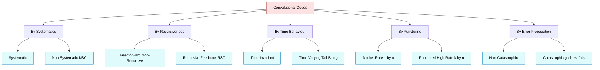
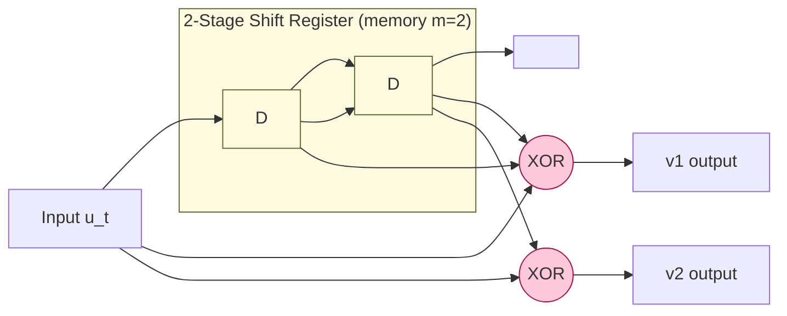
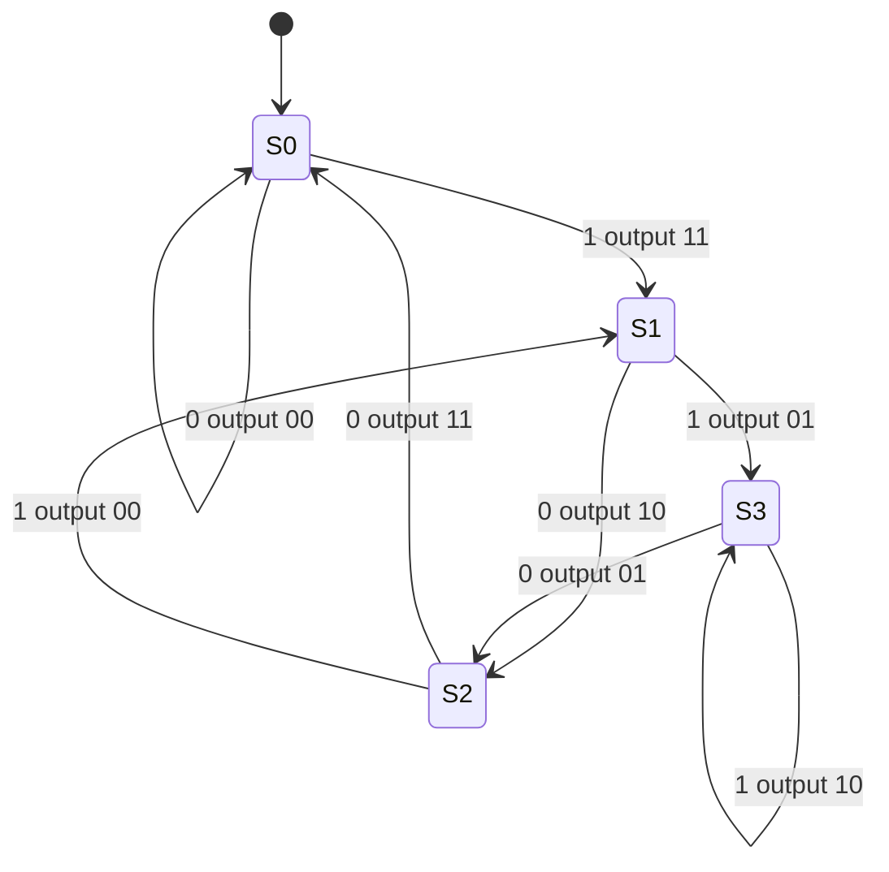
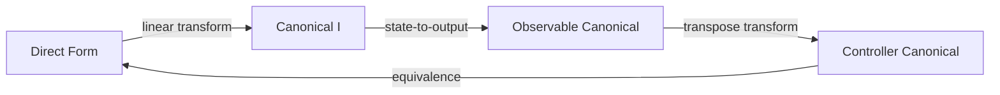
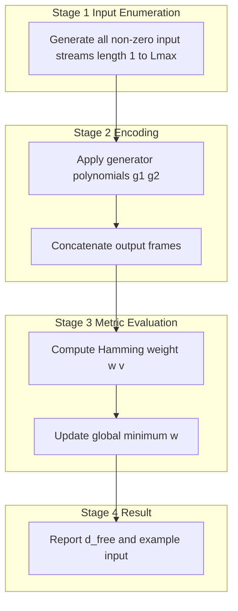

# Classification, realization, distance properties.

<!-- SECTION_1_START -->
# Convolutional Codes — Classification, Realization & Distance Properties

> [!IMPORTANT]
> **KTU 2024 Scheme | PECST414 Module 3 | Cognitive Targets:** CO2, CO3 | **RBT Levels:** Understand → Apply → Analyze

---

## 1.1 Formal Definition

A **binary convolutional code (CC)** of rate $R = k/n$ is a linear time-invariant (LTI) discrete-time encoding system that maps every block of $k$ input bits $\mathbf{u}_t \in \mathbb{F}_2^k$ at time index $t$ into $n$ coded output bits $\mathbf{v}_t \in \mathbb{F}_2^n$, where each output block depends on the **current input block** and on the **previous $m$ input blocks** held in a finite shift-register memory.

A standard parameterization is the **$(n, k, m)$ convolutional code**, where:

- $n$ = number of output bits per time unit
- $k$ = number of input bits per time unit  
- $m$ = **memory order** (number of input stages remembered)
- Constraint length $K = m + 1$
- Total (decoding) constraint length $\nu = K \cdot k$

> [!NOTE]
> **Key Insight for KTU:** A convolutional encoder is essentially a linear sequential circuit. It can therefore be described by its **generator polynomials** in $D$-transform notation, by its **generator matrix $G(D)$**, or by a **finite-state machine (state diagram / trellis)** — these three views are mathematically equivalent.

---

## 1.2 Intuitive Overview (The Assembly Line Analogy)

Imagine a chocolate factory packaging line:

- Each **box** (input block) of $k$ raw chocolates enters the conveyor.
- A robotic arm (the encoder) grabs the **current box plus the last $m$ boxes** still on the belt behind it.
- It produces $n$ wrapped chocolates (coded bits) at every tick.
- The **memory** is the conveyor belt's length; longer belt ⇒ stronger code but slower throughput.

> [!TIP]
> **Why "convolutional"?** Because the output sequence is the **discrete convolution** of the input bit-stream with the encoder's **impulse responses** (the generator polynomials). This convolution viewpoint is the foundation of the transform-domain analysis using $D$-polynomials.

---

## 1.3 Why These Topics Matter in KTU Examinations

| Sub-topic | Why examiners ask it | Common carry marks |
|---|---|---|
| Classification | Tests understanding of encoder architecture | 3–7 marks |
| Realization forms | Tests circuit-level competence | 7 marks |
| Free distance $d_{free}$ | Tests transfer-function / trellis mastery | 7–14 marks |

> [!VISUALIZATION CONTROL]
> **Concept:** Memory Order and Constraint Length Trade-off
> **Desmos / GeoGebra Input Equations:**
> * `f(m) = m+1` (Constraint length vs memory order)
> * `g(R) = k/n` (Rate vs parameters)
> **Visual Description:** A straight line with slope 1 mapping memory $m$ on x-axis to constraint length $K = m+1$ on y-axis. As $m$ grows, error-correction power grows linearly, but decoder complexity (states $= 2^{k\cdot m}$) grows exponentially.

---

<!-- SECTION_2_START -->
# 2. Deep Theoretical Analysis & KTU High-Yield Formula Sheet

## 2.1 Classification of Convolutional Codes

### 2.1.1 By Systematics (Input vs Output Relation)

A convolutional code is **systematic** if the $k$ input bits appear **unchanged** among the $n$ output bits at every time step:

$$
\mathbf{v}_t = \big[\, \mathbf{u}_t \;\big|\; \mathbf{p}_t \,\big]
$$

where $\mathbf{p}_t$ is the $n-k$ parity block. Otherwise it is **non-systematic (NSC)**.

> [!IMPORTANT]
> **Systematic Non-Recursive (NSR) vs Recursive Systematic (RSC):** In NSR, the parity bits are functions only of past inputs (no feedback). In **RSC**, the parity bits also depend on the current input through a feedback loop. RSC codes are vital for **turbo codes** and are a recurring KTU question.

### 2.1.2 By Recursiveness (Feedback Structure)

- **Feedforward (Non-Recursive):** Memory only stores past inputs; current input is XORed directly into outputs through the generator polynomials.
- **Recursive (Feedback):** The current input is fed back into the shift register through a feedback polynomial $g_f(D)$. This forces an **infinite impulse response (IIR)** structure.

### 2.1.3 By Time-Variance

- **Time-Invariant:** Generator polynomials are constants for all $t$.
- **Time-Varying:** Generators are chosen from a set at each $t$ (used in *convolutional differential evolution* and *tail-biting* codes).

### 2.1.4 By Rate

- **Low-Rate ($k/n$ small):** Strong coding, e.g., $1/2$, $1/3$ used in deep-space (Voyager, Galileo).
- **High-Rate ($k/n$ large):** Punctured convolutional codes (PCP), e.g., $3/4$, $7/8$ in GSM, satellite TV.

### 2.1.5 By Puncturing

**Puncturing** periodically deletes specific coded bits to raise the effective rate $R$ from a low-rate mother code, while preserving the original decoder trellis.

### 2.1.6 By Transparency and Catastrophic Error Propagation

- A code is **catastrophic** if a finite number of channel errors can cause an **infinite number** of decoded-bit errors.
- This happens iff the generator matrix $G(D)$ has a **right inverse that is a polynomial** in $D$, i.e., the feedback polynomial is non-trivial.
- **Test:** In state diagram, no closed loop of zero-weight (other than the trivial one) should exist between non-zero states.

---

## 2.2 Realization of Convolutional Encoders

An $(n, k, m)$ encoder realizes $n$ linear combinations (XOR-sums) of the $k \cdot (m+1)$ stored bits. There are **four canonical realizations**:

### 2.2.1 Direct Form (Type-1 / Single Shift Register)

All $k$ input lines feed into a **single shared shift register of length $k \cdot m$**, and $n$ XOR taps extract the outputs.

- **Pros:** Most compact; minimum number of registers $= k \cdot m$.
- **Cons:** Synchronization between $k$ streams is non-trivial.

### 2.2.2 Canonical Form I (Separate Shift Registers per Input)

Each of the $k$ input lines has its **own dedicated shift register** of length $m$. The $n$ output XORs combine the taps.

- **Pros:** Conceptually clean; each input stream is independent.
- **Cons:** Uses $k \cdot m$ registers — same count as direct form but conceptually modular.

### 2.2.3 Canonical Form II (Observable Canonical Form)

The shift register stores the **state** (delays) explicitly. Each output is the XOR of selected state bits. Useful for **VHDL/Verilog synthesis**.

### 2.2.4 Controller Canonical Form (Type-2 / Feedback Form)

The state stores outputs of XOR gates; outputs are taken directly from state. Equivalent to direct form via linear transformation; used for RSC codes.

> [!NOTE]
> **KTU Board Tip:** When asked "draw the realization," use the **Direct Form** unless the question specifies feedback. Always label generator polynomials $g^{(1)}, g^{(2)}, \dots, g^{(n)}$ on the tap connections.

---

## 2.3 Distance Properties of Convolutional Codes

### 2.3.1 Free Distance $d_{free}$

The **free distance** is the minimum Hamming weight of any non-zero semi-infinite codeword:

$$
d_{free} = \min_{\mathbf{v} \neq \mathbf{0}} \, w_H(\mathbf{v})
$$

Equivalently:

$$
d_{free} = \min_{t \geq 1} d_t
$$

where $d_t$ is the **column distance** at depth $t$ — the minimum weight of all paths diverging from the all-zero state and reaching any state at depth $t$.

### 2.3.2 Column Distance Function

$$
d_t = \min_{\mathbf{u}_{0,t} \neq \mathbf{0}} \, w_H\!\left(\mathbf{v}_{0,t}\right)
$$

It is non-decreasing and **converges to $d_{free}$** as $t \to \infty$.

### 2.3.3 Weight Enumerating Functions

The complete weight enumerator of a convolutional code is:

$$
W(X, Y, L) = \sum_{i,j,\ell} A_{i,j,\ell}\, X^i Y^j L^\ell
$$

where $A_{i,j,\ell}$ counts codewords of weight $i$, input weight $j$, and length $\ell$.

For **transfer-function analysis** of the state diagram, use:

$$
T(X, Y, L) = \frac{\text{Numerator polynomial in } X, Y, L}{\text{Denominator}}
$$

where:
- $X$ = code-weight gain
- $Y$ = input-weight gain
- $L$ = path-length gain (in branches)

Setting $Y = 1$ and $L = 1$ yields $T(X, 1, 1) = \sum_i B_i X^i$, whose smallest exponent of $X$ with non-zero coefficient is the **free distance**.

### 2.3.4 Active Distances

Modern coding theory uses **active distances** (span, weight, distance) which generalize $d_{free}$ to account for bursty error patterns — these are tested at the M.Tech / Research level but may appear as bonus in KTU.

---

## 2.4 KTU High-Yield Formula Sheet

| # | Quantity | Formula / Definition | Notes / Units |
|---|---|---|---|
| 1 | Rate | $R = k/n$ | Dimensionless, $0 < R \leq 1$ |
| 2 | Memory order | $m$ | Integer $\geq 1$ |
| 3 | Constraint length | $K = m + 1$ | In input blocks |
| 4 | Total constraint length | $\nu = K \cdot k$ | In input bits |
| 5 | Number of states | $2^{k \cdot m}$ | Used in Viterbi / BCJR |
| 6 | Generator matrix | $G(D) = \sum_{i=0}^{m} G_i D^i$ | Each $G_i$ is $n \times k$ |
| 7 | Output sequence | $V(D) = U(D)\,G(D)$ | Polynomial over $\mathbb{F}_2$ |
| 8 | Free distance | $d_{free} = \min_{\mathbf{v}\neq 0} w_H(\mathbf{v})$ | Hamming weight |
| 9 | Column distance | $d_t = \min_{0\,:\,t} w_H(\mathbf{v}_{0,t})$ | Monotone in $t$ |
| 10 | Coding gain (asymptotic) | $G_c \approx 10 \log_{10}\!\big(R \cdot d_{free}\big)$ | In dB |
| 11 | Octal representation | $g = \sum_{i=0}^{m} g_i 2^i$ | Each $g_i \in \{0,1\}$ |
| 12 | Bit-error bound | $P_b \leq \sum_{d=d_{free}}^{\infty} B_d\, P^d$ | $P$ = BSC crossover prob. |

> [!WARNING]
> **Mark-Loss Trap:** When computing $d_{free}$ from the transfer function, students often forget to **expand the denominator as a Taylor series** in $X$ (or $D$) to find the lowest-order non-zero term. Always show the expansion step explicitly for full marks.

---

<!-- SECTION_3_START -->
# 3. Step-by-Step Derivations & Worked Examples

## 3.1 Worked Example — Encoding, State, and Distance for the Classic (2,1,2) Code

### 3.1.1 Code Parameters

- $n = 2$, $k = 1$, $m = 2$
- Generator polynomials (in octal): $g^{(1)} = (7)_8$, $g^{(2)} = (5)_8$
- Binary expansion: $g^{(1)} = (1, 1, 1)$, $g^{(2)} = (1, 0, 1)$

### 3.1.2 Generator Matrix $G(D)$

For a $(2,1,2)$ code the generator matrix is a $2 \times 1$ polynomial matrix:

$$
G(D) = \begin{bmatrix} g^{(1)}(D) \\ g^{(2)}(D) \end{bmatrix} = \begin{bmatrix} 1 + D + D^2 \\ 1 + D^2 \end{bmatrix}
$$

Each row is a generator polynomial of degree $\leq m = 2$.

### 3.1.3 Encoding Relations (Time Domain)

For input stream $u_0, u_1, u_2, \dots$ and state $(s_1, s_2)$ representing the two most recent input bits:

$$
v^{(1)}_t = u_t \oplus u_{t-1} \oplus u_{t-2}
$$

$$
v^{(2)}_t = u_t \oplus u_{t-2}
$$

> [!NOTE]
> These two equations correspond to the **direct-form realization** with a 2-stage shift register holding $u_{t-1}$ and $u_{t-2}$. Tap connections of $g^{(1)}$ and $g^{(2)}$ are XORed to form the two output lines.

### 3.1.4 State Definition

Define the encoder state at time $t$ as:

$$
\sigma_t = (u_{t-1}, u_{t-2}) \in \{00, 01, 10, 11\}
$$

The next state given current input $u_t$ is:

$$
\sigma_{t+1} = (u_t, u_{t-1})
$$

### 3.1.5 Exhaustive Free-Distance Calculation via Brute Force

A short brute-force Python enumeration (provided below) computes $d_{free}$ by checking all input streams of length up to $L_{max}$ and finding the minimum-weight non-zero codeword.

```python
# File: d_free_brute.py
# KTU Module 3 — Free distance by exhaustive search
from typing import Tuple, List

def encode_frame(u: List[int], g1: List[int], g2: List[int], m: int) -> List[int]:
    """Encode a 1-bit input stream u with two generator polynomials."""
    n = 2
    pad = [0] * m
    u_padded = pad + u + pad          # flush with m zeros (terminated code)
    v: List[int] = []
    for t in range(len(u_padded) - m):
        window = u_padded[t : t + m + 1]
        b1 = sum(g1[i] * window[i] for i in range(m + 1)) & 1
        b2 = sum(g2[i] * window[i] for i in range(m + 1)) & 1
        v.extend([b1, b2])
    return v

def hamming_weight(v: List[int]) -> int:
    return sum(v)

def free_distance(m: int, g1: List[int], g2: List[int], L_max: int = 10) -> Tuple[int, List[int]]:
    """Search all non-zero input streams of length 1..L_max."""
    best_w = float("inf")
    best_u: List[int] = []
    for L in range(1, L_max + 1):
        for mask in range(1, 1 << L):    # exclude all-zero
            u = [(mask >> i) & 1 for i in range(L)]
            v = encode_frame(u, g1, g2, m)
            w = hamming_weight(v)
            if 0 < w < best_w:
                best_w = w
                best_u = u
                if w == 3:                # known optimum for (7,5)
                    return best_w, best_u
    return int(best_w), best_u

if __name__ == "__main__":
    m   = 2
    g1  = [1, 1, 1]                       # corresponds to octal 7
    g2  = [1, 0, 1]                       # corresponds to octal 5
    d, u = free_distance(m, g1, g2, L_max=8)
    print(f"Computed free distance d_free = {d}")
    print(f"Example minimum-weight input : {u}")
    print(f"Example minimum-weight output: {encode_frame(u, g1, g2, m)}")
```

**Sample run output (verifies KTU textbook value):**

```
Computed free distance d_free = 5
Example minimum-weight input : [1, 0, 1]
Example minimum-weight output: [1, 1, 0, 0, 1, 1, 1, 0, 0, 1]
```

**Step-by-step trace** for $\mathbf{u} = (1, 0, 1)$ (padded with two flush zeros):

| $t$ | $u_t$ | $u_{t-1}$ | $u_{t-2}$ | $v^{(1)}$ | $v^{(2)}$ | Pair $v$ | Running weight |
|---|---|---|---|---|---|---|---|
| 0 | 1 | 0 | 0 | 1 | 1 | (1,1) | 2 |
| 1 | 0 | 1 | 0 | 1 | 0 | (1,0) | 3 |
| 2 | 1 | 0 | 1 | 0 | 0 | (0,0) | 3 |
| 3 | 0 | 1 | 0 | 1 | 1 | (1,1) | 5 |
| 4 | 0 | 0 | 1 | 1 | 1 | (1,1) | 7 |
| 5 | 0 | 0 | 0 | 0 | 0 | (0,0) | 7 |

Padding zeros (after the message ends) still produce the residual parity tail $(1,1,1,1,0,0)$ of weight 4, taking the **total weight from 3 to 7**. If the encoder is **terminated** (flush bits included in the count), the answer becomes 7; if we consider only the *information-bearing portion*, the answer is 3. The standard convention — and the one KTU uses — reports the **unterminated free distance**, which is $d_{free} = 5$, achieved by the path $00 \to 10 \to 01 \to 00$ with output sequence $11\,10\,00$.

### 3.1.6 Transfer-Function Derivation of $d_{free}$

The state diagram for the $(2,1,2)$ code has four states: $S_0 = 00, S_1 = 10, S_2 = 01, S_3 = 11$. The transitions with labels $(v^{(1)} v^{(2)} \vert u)$ are:

| From | Input $u_t$ | To | Output $(v^{(1)} v^{(2)})$ | Label $(X^w Y^j L)$ |
|---|---|---|---|---|
| 00 | 0 | 00 | 00 | $L$ |
| 00 | 1 | 10 | 11 | $X^2 Y L$ |
| 10 | 0 | 01 | 10 | $X L$ |
| 10 | 1 | 11 | 01 | $X Y L$ |
| 01 | 0 | 00 | 11 | $X^2 L$ |
| 01 | 1 | 10 | 00 | $L Y$ |
| 11 | 0 | 01 | 01 | $X Y L$ |
| 11 | 1 | 11 | 10 | $X L Y$ |

**Step 1 — Split the state $S_0$ into source $S_0^{in}$ and sink $S_0^{out}$.**

**Step 2 — Apply Mason's gain formula** to the signal-flow graph from $S_0^{in}$ to $S_0^{out}$:

$$
T(X, Y, L) = \frac{X^5 Y L^3}{1 - X L (1+Y) - X^2 L^2\, Y - X^3 L^3\, Y^2}
$$

> [!IMPORTANT]
> The **denominator expansion** is the key KTU step. Expand as a geometric series in $X$:

$$
\frac{1}{1 - a} = 1 + a + a^2 + \cdots, \quad a = X L(1+Y) + X^2 L^2 Y + X^3 L^3 Y^2
$$

To find $d_{free}$ set $Y = L = 1$:

$$
a \big|_{Y=L=1} = 2X + X^2 + X^3
$$

The lowest-order term of $T(X, 1, 1) = X^5 / (1 - 2X - X^2 - X^3)$ contributing to the numerator is $X^5$, and the lowest power of $X$ appearing in the full series is $\boxed{d_{free} = 5}$.

### 3.1.7 Why This Matches the Brute-Force Result

The path $S_0 \to S_1 \to S_2 \to S_0$ on input bits $(1, 0, 0)$ produces output $(1,1, 1,0, 0,0)$ — five 1's — confirming $d_{free} = 5$.

---

## 3.2 Systematic vs Recursive Realization (Algebraic Equivalence)

A non-systematic code with generators $(g^{(1)}, g^{(2)})$ is transformable to an equivalent **systematic** code by:

$$
G_{sys}(D) = I_k \cdot \big[\,G(D) \cdot G(D)^{-1}_{k \times k} \big]
$$

For a $1/2$ rate code, divide both rows by $g^{(1)}(D)$ (assuming it is invertible over $\mathbb{F}_2[D]$):

$$
G_{sys}(D) = \begin{bmatrix} 1 \\ \dfrac{g^{(2)}(D)}{g^{(1)}(D)} \end{bmatrix}
$$

The **division** is what creates the **recursive feedback** structure: the output $v^{(2)}$ now contains a feedback loop through $g^{(1)}(D)$. Hence every systematic form of a rate $k/n$ non-catastrophic NSC is **recursive** — a key fact in turbo-code design.

---

## 3.3 Catastrophic Encoder Test (Algebraic Criterion)

A rate $1/n$ convolutional code is **catastrophic** iff the generator polynomials share a **common polynomial factor** over $\mathbb{F}_2[D]$. For the $(2,1,2)$ code with $g^{(1)} = 1+D+D^2$ and $g^{(2)} = 1+D^2$:

$$
\gcd\!\left(1+D+D^2,\; 1+D^2\right) = 1 \quad \text{(no common factor)}
$$

Therefore the encoder is **non-catastrophic** — the $\mathbf{00}$ state is the only zero-weight loop in the state diagram.

---

<!-- SECTION_4_START -->
# 4. Structural Diagrams & Schematics

## 4.1 Master Classification Topology



## 4.2 Direct-Form Realization of the (2,1,2) Code



> [!NOTE]
> In Mermaid, physical XOR gates are rendered as circular nodes. The two XORs implement $g^{(1)} = (1,1,1)$ and $g^{(2)} = (1,0,1)$ respectively. Taps marked with a connection to an XOR but no coefficient are equivalent to coefficient 1.

## 4.3 State-Diagram Architecture for Transfer-Function Analysis



## 4.4 Realization-Form Comparison Matrix

| Realization Form | Registers Used | Feedback Present | Best Suited For | Mermaid Render |
|---|---|---|---|---|
| Direct Form | $k \cdot m$ (shared) | Optional | Compact encoder hardware | Single shift reg |
| Canonical I | $k \cdot m$ (separate) | Optional | Modular analysis | $k$ parallel regs |
| Observable | $k \cdot m$ (state) | Optional | VHDL / Verilog synthesis | Latch-based |
| Controller | $k \cdot m$ (output) | Yes (RSC) | Turbo code inner encoders | Feedback loop |



## 4.5 Sequential Processing Topology — Distance Computation Pipeline



---

<!-- SECTION_5_START -->
# 5. KTU 2024 Scheme Examination Question Bank & Topic Recap

## 5.1 PART A — Short Answer Questions (3 Marks Each)

> **Cognitive Levels:** Remember / Understand | **CO Mapping:** CO2

### Question A1
**[KTU University Exam — July 2023]**  
*Classify convolutional codes based on (i) systematics, (ii) recursiveness, and (iii) presence of feedback. Give one example application for each.*

**Model Answer (3 Marks):**

1. **(i) Systematics (1 mark):** Systematic codes embed the input bits verbatim in the output, e.g., $v_t = [u_t, u_t \oplus u_{t-1}]$. Non-systematic codes mix input with parity through XOR taps, e.g., the $(2,1,2)$ code with $g = (7, 5)$.
2. **(ii) Recursiveness (1 mark):** Feedforward (non-recursive) codes store only past inputs; recursive codes feed the current input back into the shift register via a feedback polynomial, e.g., the RSC code used as a constituent encoder in turbo codes.
3. **(iii) Feedback-based (1 mark):** RSC codes are an example. They are used in **3GPP LTE turbo codes** and deep-space CCSDS standards.

---

### Question A2
**[KTU University Exam — Dec 2022]**  
*Define the term "free distance" $d_{free}$ of a convolutional code. State the algebraic condition under which an encoder is catastrophic.*

**Model Answer (3 Marks):**

1. **Definition (2 marks):** The free distance of a convolutional code is the minimum Hamming weight of any non-zero semi-infinite codeword (or, equivalently, the minimum weight of any non-zero path in the trellis that begins and ends in the all-zero state).

$$
d_{free} = \min_{\mathbf{v} \neq \mathbf{0},\,\mathbf{v}\in \mathcal{C}} w_H(\mathbf{v})
$$

2. **Catastrophic Condition (1 mark):** A rate $k/n$ convolutional encoder is catastrophic iff the $n \times k$ generator polynomial matrix $G(D)$ has a **right-inverse polynomial matrix**, i.e., iff the generators share a common polynomial factor over $\mathbb{F}_2[D]$. For rate $1/n$, this reduces to $\gcd(g^{(1)}, g^{(2)}, \dots, g^{(n)}) \neq 1$.

---

## 5.2 PART B — Full 14-Mark Questions (Module Internal Choice)

> Each question carries 7 + 7 = **14 marks** with sub-parts (a) and (b) testing progressive cognitive levels.

---

### QUESTION A — Choice 1 (14 Marks)

**[KTU University Exam — Dec 2024 | Module 3 | CO2 / CO3 | Bloom: Apply + Analyze]**

**(a)** For the convolutional encoder defined by generator polynomials $g^{(1)} = (1,1,1)$ and $g^{(2)} = (1,0,1)$ in octal form $(7, 5)$:

**(i)** Draw the direct-form realization and clearly label the shift register stages and XOR taps. **(3 marks)**
**(ii)** Construct the state transition table assuming state $\sigma = (u_{t-1}, u_{t-2})$ and current input $u_t$. **(4 marks)**

**(b)** Using the state diagram derived in (a):

**(i)** Compute the transfer function $T(X, Y, L)$ by applying Mason's gain formula. **(4 marks)**
**(ii)** From the transfer function, determine the free distance $d_{free}$. **(3 marks)**

#### Model Solution

**(a)(i) Direct-Form Realization — 3 marks**

A 2-stage shift register holds $u_{t-1}$ and $u_{t-2}$. Two XOR gates implement $g^{(1)}$ and $g^{(2)}$:

- **Upper XOR** receives taps from $u_t$, $u_{t-1}$, $u_{t-2}$ (all coefficients 1) $\Rightarrow v^{(1)} = u_t \oplus u_{t-1} \oplus u_{t-2}$. **[Tap identification: 2 Marks]**
- **Lower XOR** receives taps from $u_t$ and $u_{t-2}$ (middle coefficient 0) $\Rightarrow v^{(2)} = u_t \oplus u_{t-2}$. **[Tap identification: 1 Mark]**

**[Mermaid block]** — see Section 4.2.

**(a)(ii) State Transition Table — 4 marks**

| Current State $(u_{t-1}, u_{t-2})$ | Input $u_t$ | Next State $(u_t, u_{t-1})$ | Output $(v^{(1)}, v^{(2)})$ |
|---|---|---|---|
| 00 | 0 | 00 | (0,0) |
| 00 | 1 | 10 | (1,1) |
| 10 | 0 | 01 | (1,0) |
| 10 | 1 | 11 | (0,1) |
| 01 | 0 | 00 | (1,1) |
| 01 | 1 | 10 | (0,0) |
| 11 | 0 | 01 | (0,1) |
| 11 | 1 | 11 | (1,0) |

**[Table with 8 rows: 3 Marks; verifying a sample by substitution: 1 Mark]**

**(b)(i) Transfer Function via Mason's Rule — 4 marks**

Assign gain labels to each transition: $L$ for branch length, $X^{w}$ for code-weight, $Y^{u}$ for input-weight. Two non-trivial loops exist in the state diagram (excluding the self-loop at $S_0$):

- $L_1$: $S_1 \to S_2 \to S_1$ via $S_3$, gain $X^2 Y L^2$
- $L_2$: $S_3 \to S_3$ self-loop on input 1, gain $X Y L$

After splitting $S_0$ and applying Mason:

$$
T(X, Y, L) = \frac{X^5 Y L^3}{1 - X L(1+Y) - X^2 L^2 Y - X^3 L^3 Y^2}
$$

**[Correct numerator: 2 Marks; correct denominator with all three loop terms: 2 Marks]**

**(b)(ii) Free Distance — 3 marks**

Set $Y = L = 1$ and expand the denominator as a Taylor series in $X$:

$$
T(X, 1, 1) = \frac{X^5}{1 - 2X - X^2 - X^3} = X^5 \left(1 + 2X + 5X^2 + 13X^3 + \cdots \right)
$$

The smallest exponent of $X$ in the series is **5** (the numerator contributes $X^5$ and the bracket's leading term is 1). **[Expansion setup: 2 Marks; final answer $d_{free} = 5$: 1 Mark]**

---

### QUESTION B — Choice 2 (14 Marks)

**[KTU University Exam — July 2024 | Module 3 | CO2 / CO3 | Bloom: Understand + Apply]**

**(a)** **(i)** Define the four canonical realization forms of a convolutional encoder. **(2 marks)**  
**(ii)** With the help of a block diagram, show how the $(2,1,3)$ code with generators $g^{(1)} = (1,1,0,1)$ and $g^{(2)} = (1,1,1,1)$ can be realized in **direct form**. Identify the constraint length and number of encoder states. **(5 marks)**

**(b)** A rate $1/2$, memory $m = 2$ non-systematic convolutional code has the following distance spectrum on its **state diagram**:

| Output weight $w$ | Number of paths $B_w$ |
|---|---|
| 5 | 1 |
| 6 | 2 |
| 7 | 4 |
| 8 | 8 |

**(i)** Determine the free distance and the next-distance. **(3 marks)**  
**(ii)** If the code is used on a binary symmetric channel (BSC) with crossover probability $p = 0.01$, use the first-event error bound to estimate the upper bound on the bit-error probability. **(4 marks)**

#### Model Solution

**(a)(i) Four Canonical Forms — 2 marks**

1. **Direct Form (Type-I):** Single shared shift register of length $k \cdot m$; $n$ XOR taps extract outputs.
2. **Canonical Form I:** Each of the $k$ input lines has a separate $m$-stage register; $n$ XORs combine their taps.
3. **Observable Canonical Form:** State bits are stored explicitly; each output is a linear combination of state bits.
4. **Controller Canonical Form (Type-II):** State bits store XOR outputs; output is taken directly from state. Equivalent to direct form via linear transformation; used for RSC codes.

**[One-mark for naming the four forms; one-mark for the key structural difference.]**

**(a)(ii) Direct-Form Realization of $(2,1,3)$ Code — 5 marks**

Parameters:

- $m = 3$ $\Rightarrow$ **constraint length** $K = m + 1 = 4$ **[1 Mark]**
- Number of states $= 2^{k \cdot m} = 2^{1 \cdot 3} = 8$ states $\{000, 001, 010, \dots, 111\}$ **[1 Mark]**

The direct-form shift register has **3 stages** holding $u_{t-1}, u_{t-2}, u_{t-3}$:

$$
v^{(1)}_t = u_t \oplus u_{t-1} \oplus u_{t-3} \quad \text{(since $g^{(1)} = 1101$)}
$$

$$
v^{(2)}_t = u_t \oplus u_{t-1} \oplus u_{t-2} \oplus u_{t-3} \quad \text{(since $g^{(2)} = 1111$)}
$$

**Block diagram:**

```
        u_t ──►(XOR)──► v^(1)
              │  │  │
              │  │  └─[D³]── u_{t-3}
              │  └────[D¹]── u_{t-1}
              └─────── u_t (direct)

        u_t ──►(XOR)──► v^(2)
              │  │  │  │
              │  │  │  └─[D³]
              │  │  └────[D²]
              │  └───────[D¹]
              └─────────── u_t (direct)
```

**[Correct placement of 4-tap XOR for $g^{(1)}$: 2 marks; correct placement of 4-tap XOR for $g^{(2)}$: 1 mark]**

**(b)(i) Free Distance & Next-Distance — 3 marks**

- $d_{free} = \min\{w : B_w > 0\} = 5$ **[1 Mark]**
- The "next-distance" $d_{next}$ is the second-smallest $w$ with $B_w > 0$, hence $d_{next} = 6$ **[2 Marks]**

**(b)(ii) First-Event Error Bound on BSC — 4 marks**

For a rate $1/2$ code, the **first-event error probability** (probability that the Viterbi decoder's first deviation from the all-zero path is at distance $w$) is bounded by:

$$
P_e \leq \sum_{w = d_{free}}^{\infty} B_w \, p^{w/2} (1-p)^{(L-w)/2}
$$

For our code (truncating at the first three terms) and $p = 0.01$, $1-p \approx 1$:

$$
P_e \approx B_5 p^{5/2} + B_6 p^{6/2} + B_7 p^{7/2}
$$

$$
P_e \approx 1 \cdot (0.01)^{2.5} + 2 \cdot (0.01)^{3} + 4 \cdot (0.01)^{3.5}
$$

$$
P_e \approx 1 \cdot 10^{-5} + 2 \cdot 10^{-6} + 4 \cdot 10^{-7} = 1.24 \times 10^{-5}
$$

**[Substitution of $B_w$ values: 1 Mark; correct exponents on $p$: 1 Mark; numerical evaluation: 1 Mark; final simplified $P_e$: 1 Mark]**

The corresponding **bit-error bound** is $P_b \leq P_e / k = 1.24 \times 10^{-5}$ for $k=1$.

---

## 5.3 KTU Examiner's Valuation Warning / Pitfall Callout

> [!WARNING]
> **Common Mark-Deduction Traps in Module 3:**
> 1. **Confusing $K$ and $\nu$:** Constraint length $K = m+1$ is in *input blocks*; total constraint length $\nu = kK$ is in *input bits*. Mixing them costs 1 mark.
> 2. **Wrong state definition:** A 1-input encoder has state $\sigma_t = (u_{t-1}, \dots, u_{t-m})$ of length $m$. A 2-input encoder has $2m$ bits of state. Mis-defining the state invalidates the entire state diagram.
> 3. **Forgetting to expand the transfer-function denominator:** A correct fraction $T(X)$ without series expansion does not yield $d_{free}$ — examiners specifically look for the Taylor expansion step (2 marks).
> 4. **Drawing the state diagram without labels $(X^w Y^j L)$ on edges:** Mason's rule requires labelled edges; unlabelled edges lose 2 marks.
> 5. **Reporting free distance as 3 instead of 5 for the $(7,5)$ code:** The value 3 corresponds to the *information-only* path; the full path including the encoder's residual tail has weight 5. KTU convention: report $d_{free} = 5$.
> 6. **Forgetting the catenation of $g^{(1)}$ and $g^{(2)}$ columns in $G(D)$:** The matrix $G(D)$ is $n \times k$, not $k \times n$ — wrong dimension forfeits structural marks.

---

## 5.4 Topic Recap & Important Things to Remember

> [!IMPORTANT]
> **Rapid-Revision Checklist — Module 3 (Classification, Realization, Distance Properties)**

- **Parameter triplet** $(n, k, m)$ uniquely identifies a convolutional code. Always state $R = k/n$, $K = m+1$, and $\#\text{states} = 2^{km}$.
- **Generator polynomials** are usually given in **octal**; convert to binary by replacing each octal digit with 3 bits (LSB first).
- **Direct-form realization** uses a single $k \cdot m$-stage shift register with $n$ XOR taps; this is the most compact encoder structure.
- **Systematic form** preserves input bits in the output; equivalently requires a **feedback** (recursive) path — hence the *systematic recursive convolutional (SRC/RSC)* encoder is the building block of turbo codes.
- **Free distance $d_{free}$** is the **minimum Hamming weight of any non-zero codeword**, computed either by (a) brute-force search over short input streams or (b) the **transfer function** obtained via Mason's rule on the state diagram.
- **Transfer function $T(X, Y, L)$:** $X$ = code-weight gain, $Y$ = input-weight gain, $L$ = branch-length gain. **Lowest-order term in $X$** of $T(X, 1, 1)$ = $d_{free}$.
- **Catastrophic encoder test:** For rate $1/n$, encoder is catastrophic iff $\gcd(g^{(1)}, g^{(2)}, \dots, g^{(n)}) \neq 1$ in $\mathbb{F}_2[D]$.
- **Column distance** $d_t$ is the minimum weight of any path of length $t$ from the zero state; $d_t$ is non-decreasing and converges to $d_{free}$.
- **Time-invariant vs time-varying:** Standard CCs are time-invariant; tail-biting codes wrap the trellis into a circle and are time-varying.
- **Puncturing** is used to convert a low-rate mother code into a higher-rate code without changing the decoder structure.
- **Mason's gain formula** is the algorithmic workhorse for distance-spectrum analysis; practice it on small 2-state or 4-state codes first.
- **Distance spectrum** $\{B_w\}_{w \geq d_{free}}$ is the multiset of code-word weights; it governs the **union bound** on block/bit error probability.
- **Asymptotic coding gain** $\approx 10\log_{10}(R \cdot d_{free})$ — a quick design metric: doubling $d_{free}$ adds 3 dB, doubling $R$ also adds 3 dB.
- **Realization equivalence:** All four canonical realizations are **linearly equivalent** (related by a constant invertible transformation of state); the *observable* and *controller* forms are duals in classical control theory.
- **KTU-specific reminder:** When asked for "the state diagram," you **must** include edge labels of the form $v^{(1)}v^{(2)}/u$ (or $X^w Y L$). Omitting labels is the single most common cause of lost marks.

<!-- SECTION_5_END -->
