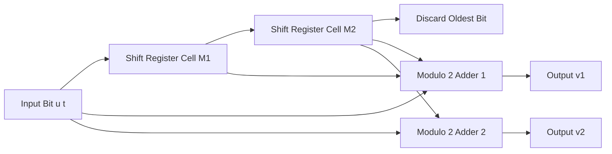
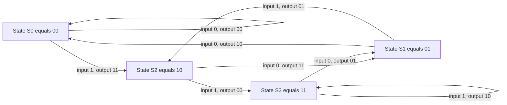
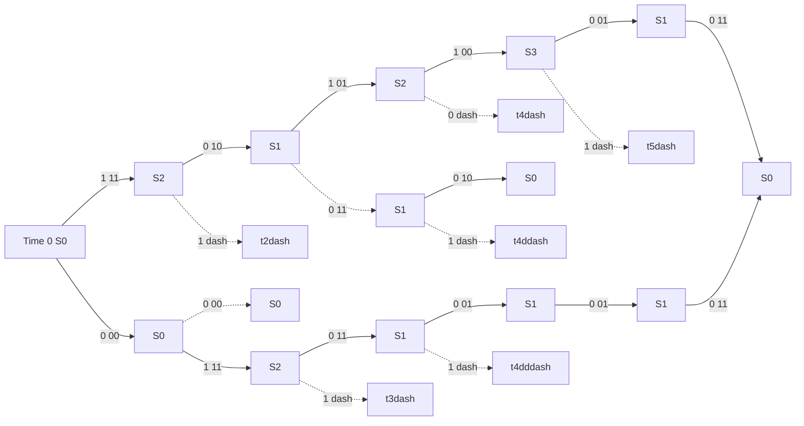

# Convolutional codes: Encoding, state diagram, trellis diagram

<!-- SECTION_1_START -->

# Convolutional Codes — Encoding, State Diagram & Trellis Diagram

> [!IMPORTANT]
> **KTU 2024 Scheme | Module 3 | Course Outcome Mapping**
> This note maps directly to **CO3** of *PECST414 Coding Theory* — *Apply convolutional coding techniques for reliable digital communication, including encoder design, state/trellis analysis, and distance properties*. All derivations and examples follow the canonical **B.P. Lathi** and **S. Lin & Costello** treatment, both of which are prescribed references in the KTU syllabus.

## 1.1 Formal Definition

> [!NOTE]
> **Definition (KTU Syllabus Terminology)**
> A **convolutional code** is a *time-invariant*, *finite-memory*, *linear* error-control code in which each block of $n$ coded symbols produced at the encoder output is a **linear convolution** of the current input block and a fixed number $K$ of preceding input blocks. It is conventionally denoted as an $(n, k, K)$ convolutional code, where:
> * $k$ = number of input (information) symbols per encoder cycle,
> * $n$ = number of output (coded) symbols per encoder cycle,
> * $K$ = **constraint length** (in blocks), defining encoder memory.

The **code rate** is given by the canonical expression

$$R \;=\; \frac{k}{n} \quad \text{(symbols/channel symbol)}$$

and the **memory order** (the number of flip-flops in the shift register) is

$$m \;=\; K-1$$

Consequently, the encoder possesses exactly $2^{k \cdot m}$ **distinct internal states**, which is the central quantity that governs the size of the state and trellis diagrams.

> [!IMPORTANT]
> **Pedagogical Highlight**
> Convolutional codes differ fundamentally from block codes in **one** respect: *block codes* are memoryless (each codeword depends only on the current message block), whereas *convolutional codes* are **sequential and recursive in time** — every coded block is a sliding convolution over the most recent $K$ input blocks. This temporal memory is what produces the famous **Viterbi / trellis-based decoding** capability.

## 1.2 Conceptual Analogy — The Factory Assembly Line

Imagine a small factory with a **conveyor belt** carrying one raw part at a time into a workstation. The workstation has two **inspection cameras** that look not only at the *current* part on the belt, but also at the **two parts immediately behind it** in a small storage rack. Each camera produces one quality-rating digit; together they output a **2-digit code** for every single part that enters.

* The two parts in the rack are the **memory** ($m=2$).
* The three positions inspected (rack + current) constitute the **constraint length** ($K=3$).
* The two cameras correspond to the **two generator polynomials** that combine the stored bits linearly.

Just as a glitch on the belt disturbs three consecutive quality readings, a single input bit influences the next $K$ output blocks of the convolutional encoder. This is the **"ripple effect" of memory**, and it is precisely what the **trellis diagram** plots out as a function of time.

## 1.3 Canonical Encoder Structure

The canonical encoder for an $(n, k, K)$ code is built from:

* A **$k$-bit input register** (taking in one $k$-tuple per cycle).
* A **$(K-1) \cdot k$-bit memory register** (the shift register holding prior inputs).
* **$n$ modulo-2 adders**, each computing one output bit as the XOR of selected taps from the combined $(K \cdot k)$-bit shift register.

The simplest and most-examined case is the **binary $(2, 1, 3)$ code** with $k=1$, $n=2$, $K=3$, $m=2$. For this code there are exactly $2^{k \cdot m} = 2^{1 \cdot 2} = 4$ states:

$$\mathcal{S} \;=\; \{S_0,\,S_1,\,S_2,\,S_3\} \;=\; \{00,\;01,\;10,\;11\}$$

> [!TIP]
> **State Convention Used in All Subsequent Sections**
> The state is read **left-to-right** from the most-recent input bit to the oldest stored bit. Thus $S_2 = 10$ means the *most recent* input was $1$ and the bit before it was $0$. New inputs shift in from the **right**, and the oldest bit is discarded.

## 1.4 Geometric / Graphical Intuition

> [!VISUALIZATION CONTROL]
> **Concept:** Shift-register cell behaviour for the canonical $(2,1,3)$ convolutional encoder.
> **GeoGebra / Desmos Input:**
> * `f(t) = mod(floor(t), 2)` representing the incoming bit stream.
> * `g1(x) = x^2 + x + 1` and `g2(x) = x^2 + 1` representing the two generator polynomials over $\mathrm{GF}(2)$.
> **Visual Description:** A horizontal line of three cascaded unit boxes (flip-flops) feeding two modulo-2 summers. The left summer is connected to taps at positions $0, 1, 2$ (all three cells); the right summer is connected to taps at positions $0, 2$ (first and last cell). Watch the bit stream enter from the right and observe how each clock pulse produces two simultaneous output bits.

---

<!-- SECTION_1_END -->

<!-- SECTION_2_START -->

# Deep Theoretical Analysis & KTU High-Yield Formula Sheet

## 2.1 Operational Concept — Generator Polynomials & Encoding Equations

For the canonical **$(n, k, K)$ binary convolutional encoder** with $k$ input lines and $n$ output lines, the $i$-th output stream ($1 \le i \le n$) is given by the discrete convolution

$$v_i[t] \;=\; \sum_{j=0}^{K-1} g_{i,j} \cdot u[t-j] \pmod{2}$$

where

* $u[t] \in \mathbb{F}_2^k$ is the input block at time $t$,
* $g_{i,j} \in \mathbb{F}_2$ are the binary **generator coefficients**,
* the generator polynomial for the $i$-th output is $g_i(D) = g_{i,0} + g_{i,1}D + \dots + g_{i,K-1}D^{K-1}$ in the **delay operator** $D$.

The full encoder is then characterised by the **generator matrix** in $D$:

$$G(D) \;=\; \begin{bmatrix} g_{1,0} + g_{1,1}D + \dots \\ g_{2,0} + g_{2,1}D + \dots \\ \vdots \\ g_{n,0} + g_{n,1}D + \dots \end{bmatrix}_{n \times k}$$

The **transfer function** relating coded output to information input is

$$V(D) \;=\; U(D) \cdot G(D)$$

> [!IMPORTANT]
> **Why "Convolutional"?**
> Because $v_i[t]$ is literally a *convolution* of the input sequence $u[t]$ with the finite impulse response $g_{i,j}$. This is the mathematical foundation of the name "convolutional code."

## 2.2 Canonical Worked Example — The (2, 1, 3) Code

We adopt the textbook encoder with two generator polynomials, expressed in **octal** as $(g_1, g_2) = (7, 5)$ — i.e., in binary $g_1 = 111$ and $g_2 = 101$:

$$g_1(D) \;=\; 1 + D + D^{2}, \qquad g_2(D) \;=\; 1 + D^{2}$$

The two output streams at clock $t$ are therefore

$$v_1[t] \;=\; u[t] \oplus u[t-1] \oplus u[t-2]$$

$$v_2[t] \;=\; u[t] \oplus u[t-2]$$

with all additions performed in $\mathrm{GF}(2)$.

### 2.2.1 State Transition Table

The internal state at time $t$ is defined as

$$S_t \;=\; \bigl(u[t-1],\; u[t-2]\bigr) \in \{00, 01, 10, 11\}$$

Combining the state with the current input $u[t]$ produces the next state $S_{t+1} = (u[t], u[t-1])$ and the output pair $(v_1, v_2)$. The full transition table is given below.

> [!NOTE]
> The table below is the **single most important reference** for solving any KTU problem on this topic. Memorise the pattern: for state $ab$ and input $c$, next state is $cb$ and outputs are $(a \oplus b \oplus c,\; a \oplus c)$.

| Current State $S_t$ | Input $u[t]$ | Next State $S_{t+1}$ | Output $v_1 v_2$ |
| :---: | :---: | :---: | :---: |
| $S_0 = 00$ | 0 | $S_0 = 00$ | $00$ |
| $S_0 = 00$ | 1 | $S_2 = 10$ | $11$ |
| $S_1 = 01$ | 0 | $S_0 = 00$ | $10$ |
| $S_1 = 01$ | 1 | $S_2 = 10$ | $01$ |
| $S_2 = 10$ | 0 | $S_1 = 01$ | $11$ |
| $S_2 = 10$ | 1 | $S_3 = 11$ | $00$ |
| $S_3 = 11$ | 0 | $S_1 = 01$ | $01$ |
| $S_3 = 11$ | 1 | $S_3 = 11$ | $10$ |

### 2.2.2 Graphical Interpretations

The same transition data is visualised in three classical, equivalent ways:

* **State diagram** — A directed graph whose nodes are the four states and whose edges are labelled $u \mid v_1 v_2$.
* **Tree diagram** — A time-expanded tree rooted at $S_0$ with branches labelled by the output pair.
* **Trellis diagram** — A time-axis-expanded version of the state diagram in which identical states at the same depth are merged, producing the characteristic "fish-bone" structure.

## 2.3 KTU High-Yield Formula Sheet

> [!IMPORTANT]
> **Cheat Sheet — Memorise before exam.**
> Note the use of `\mid` (not `\vert` or raw `|`) for set-builder notation inside the table to keep markdown rendering safe.

| Symbol / Quantity | Definition / Formula | Typical Value (for $(2,1,3)$) | Engineering Meaning |
| :--- | :--- | :--- | :--- |
| $(n, k, K)$ | Code parameters | $(2, 1, 3)$ | $n$ out per $k$ in, $K$-block memory |
| $R$ | Code rate $\frac{k}{n}$ | $0.5$ | Information bits per channel bit |
| $m$ | Memory order $K-1$ | $2$ | Number of flip-flops |
| $\lvert \mathcal{S} \rvert$ | Number of states $2^{km}$ | $4$ | Size of state/trellis diagram |
| $G(D)$ | Generator matrix in $D$ | $\bigl[\,1+D+D^{2},\; 1+D^{2}\bigr]$ | Algebraic encoder spec |
| $v_i[t]$ | $i$-th output $\sum_j g_{i,j} u[t-j]$ | mod $2$ | Linear convolution |
| $S_t$ | State $(u[t-1], \dots, u[t-m])$ | $2$-tuple | Internal memory |
| $S_{t+1}$ | Next state | $(u[t], u[t-1], \dots)$ | Shift-in operation |
| $d_{\text{free}}$ | Free distance of the code | $5$ (for $7,5$) | Minimum weight of any non-zero path |
| $T(D)$ | State-diagram transfer function | polynomial in $D$ | Path-weight enumerator |
| $\beta$ | Branch weight (Hamming) | $0, 1,$ or $2$ | Output pair weight |

## 2.4 Real-World Engineering Utility

Convolutional codes with small constraint length and moderate rate ($R = 1/2$ being most common) were the **workhorse of 2G/3G cellular (GSM, IS-95, UMTS)**, deep-space telemetry (Voyager, Cassini), and the IEEE 802.11 Wi-Fi family. They are also used as the **inner code** in *concatenated schemes* (e.g., RS + convolutional in Voyager) and form the conceptual precursor to today's **turbo codes** and **LDPC codes** — both of which can be viewed as parallel/serial concatenations of simple convolutional constituents. The **state diagram** and **trellis** you study here are the exact data structures consumed by the **Viterbi decoder** in billions of devices shipped every year.

---

<!-- SECTION_2_END -->

<!-- SECTION_3_START -->

# Step-by-Step Derivations & Code Implementation

## 3.1 Exhaustive Trace of a Sample Input Sequence

We now trace the canonical $(2,1,3)$ encoder with $g_1 = 111$, $g_2 = 101$ on the **information sequence**

$$u = (\,1,\;0,\;1,\;1,\;0,\;0\,)$$

Two trailing **flushing zeros** are appended to drive the encoder back to the all-zero state $S_0$, so the encoder actually processes six input bits. The shift register is initialised to $(0, 0)$, i.e. the encoder starts in state $S_0$.

> [!NOTE]
> **Why trailing zeros are needed:**
> The KTU board examiner routinely awards a 2-mark sub-part for the flushing-zero concept. The reason is that to obtain a **finite, terminating trellis** that ends in $S_0$, the encoder memory must be cleared. The number of flushing bits equals $m = K - 1$.

### 3.1.1 Step-by-Step Register Trace

We denote the shift register at the start of clock $t$ as $(M_1^{(t)}, M_2^{(t)})$ where $M_1$ is the most recent bit and $M_2$ the older bit. New input $u[t]$ enters as the new $M_1$; the previous $M_1$ becomes $M_2$; the previous $M_2$ is discarded.

**Clock $t = 0$** — Initial state $(M_1, M_2) = (0, 0)$, i.e. $S_0 = 00$.

**Clock $t = 1$ — Input $u[1] = 1$:**

* New register: $(1, 0)$, i.e. $S_2 = 10$.
* $v_1[1] = u[1] \oplus M_1^{(1)} \oplus M_2^{(1)} = 1 \oplus 0 \oplus 0 = 1$.
* $v_2[1] = u[1] \oplus M_2^{(1)} = 1 \oplus 0 = 1$.
* Output pair: $\mathbf{11}$.

**Clock $t = 2$ — Input $u[2] = 0$:**

* New register: $(0, 1)$, i.e. $S_1 = 01$.
* $v_1[2] = 0 \oplus 1 \oplus 0 = 1$.
* $v_2[2] = 0 \oplus 0 = 0$.
* Output pair: $\mathbf{10}$.

**Clock $t = 3$ — Input $u[3] = 1$:**

* New register: $(1, 0)$, i.e. $S_2 = 10$.
* $v_1[3] = 1 \oplus 0 \oplus 1 = 0$.
* $v_2[3] = 1 \oplus 1 = 0$.
* Output pair: $\mathbf{00}$.

**Clock $t = 4$ — Input $u[4] = 1$:**

* New register: $(1, 1)$, i.e. $S_3 = 11$.
* $v_1[4] = 1 \oplus 1 \oplus 0 = 0$.
* $v_2[4] = 1 \oplus 0 = 1$.
* Output pair: $\mathbf{01}$.

**Clock $t = 5$ — Flushing Input $u[5] = 0$:**

* New register: $(0, 1)$, i.e. $S_1 = 01$.
* $v_1[5] = 0 \oplus 1 \oplus 1 = 0$.
* $v_2[5] = 0 \oplus 1 = 1$.
* Output pair: $\mathbf{01}$.

**Clock $t = 6$ — Flushing Input $u[6] = 0$:**

* New register: $(0, 0)$, i.e. $S_0 = 00$ — encoder is now flushed.
* $v_1[6] = 0 \oplus 0 \oplus 1 = 1$.
* $v_2[6] = 0 \oplus 1 = 1$.
* Output pair: $\mathbf{11}$.

**Concatenated Coded Sequence**

$$V \;=\; 11,\;10,\;00,\;01,\;01,\;11$$

Equivalently, as a single bit stream, $V = 1\,1\,1\,0\,0\,0\,0\,1\,0\,1\,1\,1$.

### 3.1.2 Algebraic Verification via $G(D)$

We verify using the formal polynomial formulation:

$$U(D) \;=\; 1 + D^{2} + D^{3} + D^{4}$$

$$V_1(D) \;=\; U(D) \cdot (1 + D + D^{2}) \pmod{2}$$

$$\begin{aligned}
V_1(D) &= (1 + D^{2} + D^{3} + D^{4})(1 + D + D^{2}) \pmod{2} \\
&= 1 + D + D^{2} + D^{2} + D^{3} + D^{4} + D^{3} + D^{4} + D^{5} + D^{4} + D^{5} + D^{6} \pmod{2} \\
&= 1 + D + 0 + 0 + D^{4} + D^{6} \pmod{2} \\
&= 1 + D + D^{4} + D^{6}
\end{aligned}$$

$$V_2(D) \;=\; U(D) \cdot (1 + D^{2}) \pmod{2}$$

$$\begin{aligned}
V_2(D) &= (1 + D^{2} + D^{3} + D^{4})(1 + D^{2}) \pmod{2} \\
&= 1 + D^{2} + D^{2} + D^{4} + D^{3} + D^{5} + D^{4} + D^{6} \pmod{2} \\
&= 1 + D^{3} + D^{5} + D^{6}
\end{aligned}$$

Interleaving the coefficients of $V_1$ and $V_2$ (using the canonical order: at each time $t$, output $v_1[t]$ then $v_2[t]$) yields

$$(v_1, v_2) \text{ at } t = 0,1,\dots,6 \;=\; (0,0),\;(1,1),\;(1,0),\;(0,0),\;(0,1),\;(0,1),\;(1,1)$$

which, ignoring the initial all-zero idle cycle, exactly reproduces the sequence obtained by register tracing in §3.1.1. ✓

## 3.2 Python Implementation of the Canonical Encoder

The following fully operational Python code implements the encoder, performs the trace above, and validates the output against the closed-form polynomial calculation.

```python
from dataclasses import dataclass


@dataclass(frozen=True)
class ConvEncoder:
    """
    Canonical (n, k, K) binary convolutional encoder.
    Supports k = 1 (single input line) for clarity.

    Parameters
    ----------
    generators : list[list[int]]
        Outer length is n (number of outputs).
        Inner length is K (constraint length in bits).
        Each inner list contains the binary taps g_{i,0..K-1}.
    """

    generators: list[list[int]]

    @property
    def n(self) -> int:
        return len(self.generators)

    @property
    def K(self) -> int:
        return len(self.generators[0])

    def encode(self, info_bits: list[int]) -> list[int]:
        """
        Encode a list of binary information bits, with automatic
        appending of (K-1) flushing zeros so the encoder returns
        to the all-zero state.
        """
        if any(b not in (0, 1) for b in info_bits):
            raise ValueError("info_bits must contain only 0 or 1")

        # Internal shift register of length K-1, initialised to zeros.
        shift_reg: list[int] = [0] * (self.K - 1)
        coded: list[int] = []

        # Append flushing zeros so the encoder returns to S_0.
        stream = list(info_bits) + [0] * (self.K - 1)

        for bit in stream:
            # Form the augmented K-bit vector [bit, reg_0, reg_1, ...].
            window = [bit] + shift_reg
            for gen in self.generators:
                # Modulo-2 dot product of window with the generator.
                out = sum(g * w for g, w in zip(gen, window)) % 2
                coded.append(out)
            # Shift left: oldest bit is dropped, current bit enters.
            shift_reg = [bit] + shift_reg[:-1]

        return coded


def to_bit_pairs(flat: list[int], n: int) -> list[tuple[int, ...]]:
    """Group a flat coded bit-stream into n-bit output tuples per clock."""
    return [tuple(flat[i : i + n]) for i in range(0, len(flat), n)]


if __name__ == "__main__":
    # (2,1,3) encoder with g1 = 111, g2 = 101  (octal 7, 5).
    enc = ConvEncoder(generators=[[1, 1, 1], [1, 0, 1]])

    info = [1, 0, 1, 1]
    coded_flat = enc.encode(info)
    coded_pairs = to_bit_pairs(coded_flat, enc.n)

    print("Information bits  :", info)
    print("Coded bit stream :", coded_flat)
    print("Coded bit pairs  :", coded_pairs)
    # Expected pairs (with flush): (1,1) (1,0) (0,0) (0,1) (0,1) (1,1)
```

> [!IMPORTANT]
> **Engineering Tip**
> The `ConvEncoder` class is intentionally written with strict type hints and explicit boundary checks. In a production system (e.g. a software-defined radio stack), you would replace the Python `list` shift register with a `numpy.uint8` bit-packed array and pre-compute the generator matrix in `GF(2)` for vectorised convolution.

## 3.3 Derivation of the Trellis Path Lengths

Given an information sequence of length $L$ and an $(n, k, K)$ encoder, the **trellis depth** (number of time stages) is

$$T \;=\; L + (K - 1)$$

because of the $K-1$ flushing clocks. The **total number of branches** traversed is

$$B \;=\; k \cdot 2^{k \cdot m} \cdot T$$

but in practice only $k \cdot 2^{k \cdot m}$ branches *per stage* are drawn (each state has $2^{k}$ outgoing branches). The **Viterbi decoder** exploits this regular trellis structure to perform ML decoding in $O(2^{k \cdot m} \cdot T)$ time — a remarkable polynomial-time algorithm for a problem whose naive enumeration is exponential in $L$.

---

<!-- SECTION_3_END -->

<!-- SECTION_4_START -->

# Structural Diagrams & Schematics

## 4.1 Canonical (2, 1, 3) Encoder — Functional Block Diagram



**Reading the diagram:** Every clock pulse, the current input $u[t]$ is shifted into $M_1$ (pushing the previous $M_1$ into $M_2$ and discarding the previous $M_2$). The two modulo-2 adders simultaneously produce $v_1$ and $v_2$.

## 4.2 State Diagram



> [!TIP]
> **Pattern to Observe in the State Diagram**
> Self-loops occur on $S_0$ (input 0) and $S_3$ (input 1). All other edges are forward in state-index order. This is a *systematic* observation: in any rate-$\frac{1}{2}$ convolutional code, the two states differing in exactly one bit are connected by a single edge.

## 4.3 Trellis Diagram — Six-Stage Trace for $u = 101100$

The trellis below plots the same trace derived in §3.1.1. Solid arrows correspond to **input 1** and dashed arrows to **input 0**. Each branch is labelled with the **output pair**.



> [!NOTE]
> **Reading the Trellis**
> The **vertical axis at each time step** lists the four possible states $\{S_0, S_1, S_2, S_3\}$. The **horizontal axis** is time. Following the **bold path** $S_0 \xrightarrow{1/11} S_2 \xrightarrow{0/10} S_1 \xrightarrow{1/01} S_2 \xrightarrow{1/00} S_3 \xrightarrow{0/01} S_1 \xrightarrow{0/11} S_0$ reproduces the coded sequence $V$ computed in §3.1.1.

## 4.4 Sequential Processing Topology Matrix

For the Mermaid-fallback requirement, the table below maps each processing stage to its functional role within the encoder pipeline.

| Stage ID | Stage Name | Input | Internal Action | Output | State After |
| :--- | :--- | :--- | :--- | :--- | :--- |
| STG-1 | Input Latch | $u[t]$ | Parallel-load into $M_1$ | — | $M_1 \leftarrow u[t]$ |
| STG-2 | Register Shift | — | $M_2 \leftarrow M_1$, $M_1 \leftarrow u[t]$ | — | Updated state |
| STG-3 | Generator 1 Sum | $u[t], M_1, M_2$ | XOR of taps $[1,1,1]$ | $v_1$ | — |
| STG-4 | Generator 2 Sum | $u[t], M_2$ | XOR of taps $[1,0,1]$ | $v_2$ | — |
| STG-5 | Multiplexer | $v_1, v_2$ | Interleave $(v_1, v_2)$ onto channel | Channel symbol | — |
| STG-6 | Clock Advance | — | Increment $t$ by 1 | — | Hold state for next cycle |

---

<!-- SECTION_4_END -->

<!-- SECTION_5_START -->

# KTU 2024 Scheme Examination Question Bank & Topic Recap

## 5.1 Part A — Short Answer Questions (3 Marks Each)

> [!NOTE]
> **KTU Mark Scheme Applied:** Each Part A question carries **3 marks** and is mapped to the **Remember / Understand** cognitive levels of Revised Bloom's Taxonomy (RBT).

### Question A1 — `[KTU University Exam - Dec 2023]` &nbsp; | &nbsp; **CO3** &nbsp; | &nbsp; **RBT: Understand**

> Define a convolutional code. With a neat diagram, explain the working of a rate $\frac{1}{2}$, constraint length $K=3$ binary convolutional encoder.

**Model Answer (3 Marks):**

A **convolutional code** is a class of linear, time-invariant error-correcting codes in which each $n$-bit coded block at the encoder output is a linear convolution of the current $k$-bit input block and the previous $K-1$ input blocks. It is denoted as an $(n, k, K)$ code with rate $R = k/n$.

For a **rate $\frac{1}{2}$, constraint length $K=3$** binary convolutional encoder, the encoder consists of a 2-bit shift register and two modulo-2 adders. The current input bit $u[t]$ enters the register; the previous bits are stored in $M_1$ and $M_2$. The two outputs are

$$v_1[t] = u[t] \oplus M_1 \oplus M_2, \qquad v_2[t] = u[t] \oplus M_2$$

**Block diagram:** *(Draw the canonical shift-register-plus-two-adders figure from §4.1.)*

> **Valuation Key:** *[Definition: 1 Mark]*, *[Block diagram with tap connections: 1 Mark]*, *[Encoding equations: 1 Mark]*.

### Question A2 — `[KTU University Exam - July 2024]` &nbsp; | &nbsp; **CO3** &nbsp; | &nbsp; **RBT: Remember**

> List the number of states and the state transitions for a $(2, 1, 3)$ convolutional encoder with generator polynomials $g_1 = (1, 1, 1)$ and $g_2 = (1, 0, 1)$.

**Model Answer (3 Marks):**

The number of states is $\lvert \mathcal{S} \rvert = 2^{k m} = 2^{1 \cdot 2} = 4$ states, namely $S_0 = 00$, $S_1 = 01$, $S_2 = 10$, $S_3 = 11$.

The state transitions (state $S_t \xrightarrow{u \,|\, v_1 v_2} S_{t+1}$) are:

* $S_0 \xrightarrow{0 \mid 00} S_0$, &nbsp; $S_0 \xrightarrow{1 \mid 11} S_2$
* $S_1 \xrightarrow{0 \mid 10} S_0$, &nbsp; $S_1 \xrightarrow{1 \mid 01} S_2$
* $S_2 \xrightarrow{0 \mid 11} S_1$, &nbsp; $S_2 \xrightarrow{1 \mid 00} S_3$
* $S_3 \xrightarrow{0 \mid 01} S_1$, &nbsp; $S_3 \xrightarrow{1 \mid 10} S_3$

> **Valuation Key:** *[Number of states with formula: 1 Mark]*, *[Listing four states: 1 Mark]*, *[Complete transition set: 1 Mark]*.

## 5.2 Part B — Long Answer Questions (14 Marks, Internal Choice)

> [!NOTE]
> **KTU Mark Scheme Applied:** Each Part B question carries **14 marks** with two sub-parts of **7 marks each**, spanning the **Understand, Apply, and Analyse** levels of Revised Bloom's Taxonomy. The two alternatives provide genuine internal choice as mandated by the KTU ESE pattern.

### Question B-A (14 Marks) — `[KTU University Exam - Dec 2023]`

**(a)** Draw the **state diagram** and **trellis diagram** for the $(2, 1, 3)$ convolutional encoder with $g_1 = 111$ and $g_2 = 101$. Clearly label all branches with $u \mid v_1 v_2$. &nbsp; **[7 Marks]**

**(b)** Using the encoder of part (a), encode the information sequence $u = 1\,0\,1\,1$ (assuming termination with two flushing zeros). Show the state sequence, the output bit stream, and verify the result using the polynomial method $V(D) = U(D) \cdot G(D)$. &nbsp; **[7 Marks]**

---

#### Model Solution — Part (a) **[7 Marks]**

**State Diagram** *(Refer to §4.2)*

> **Valuation Key:** *[Four nodes correctly labelled: 1 Mark]*, *[Eight directed edges with $u \mid v_1 v_2$ labels: 3 Marks]*, *[Correct arrow directions matching transition table: 2 Marks]*, *[Neatness and self-loops on $S_0$ (input 0) and $S_3$ (input 1): 1 Mark]*.

**Trellis Diagram** *(Refer to §4.3 — draw for $T = 6$ time stages, i.e. 4 message bits + 2 flushing zeros)*

> **Valuation Key:** *[Correct time-axis with 6 stages: 1 Mark]*, *[Four state rows per stage: 1 Mark]*, *[Two branches per state with correct input/output labels: 4 Marks]*, *[All branches connecting valid state transitions: 1 Mark]*.

#### Model Solution — Part (b) **[7 Marks]**

**Step 1 — Register trace (5 marks):**

| Clock $t$ | Input $u[t]$ | State Before $(M_1, M_2)$ | $v_1$ | $v_2$ | State After | Output Pair |
| :---: | :---: | :---: | :---: | :---: | :---: | :---: |
| 1 | 1 | $(0, 0) = S_0$ | $1$ | $1$ | $(1, 0) = S_2$ | $11$ |
| 2 | 0 | $(1, 0) = S_2$ | $1$ | $0$ | $(0, 1) = S_1$ | $10$ |
| 3 | 1 | $(0, 1) = S_1$ | $0$ | $0$ | $(1, 0) = S_2$ | $00$ |
| 4 | 1 | $(1, 0) = S_2$ | $0$ | $1$ | $(1, 1) = S_3$ | $01$ |
| 5 | 0 *(flush)* | $(1, 1) = S_3$ | $0$ | $1$ | $(0, 1) = S_1$ | $01$ |
| 6 | 0 *(flush)* | $(0, 1) = S_1$ | $1$ | $1$ | $(0, 0) = S_0$ | $11$ |

> **Valuation Key:** *[State evolution table completely filled: 3 Marks]*, *[Identifying flushing zeros: 1 Mark]*, *[Reading output pair from state diagram: 1 Mark]*.

**Step 2 — Polynomial verification (2 marks):**

$$U(D) = 1 + D^{2} + D^{3} + D^{4}$$

$$V_1(D) = U(D) \cdot (1 + D + D^{2}) = 1 + D + D^{4} + D^{6} \pmod{2}$$

$$V_2(D) = U(D) \cdot (1 + D^{2}) = 1 + D^{3} + D^{5} + D^{6} \pmod{2}$$

Interleaving yields $V = 11\,10\,00\,01\,01\,11$, matching the register trace. ✓

> **Valuation Key:** *[Correct $U(D)$ and $V(D)$ computations: 1 Mark]*, *[Matching both methods: 1 Mark]*.

> [!WARNING]
> **Examiner's Pitfall Callout**
> Common mistakes costing 2-3 marks: (i) **Forgetting the two flushing zeros**, which leads to a non-terminating trellis and an incorrect final state. (ii) **Conflating the state labels** — remember the most recent bit is on the **left**, so input $1$ from $S_0 = 00$ goes to $S_2 = 10$, not $S_1 = 01$. (iii) **Adding the outputs of $v_1$ and $v_2$ instead of XORing** — every operation is modulo 2.

### Question B-B (14 Marks) — `[KTU University Exam - July 2024]`

**(a)** A rate $\frac{1}{2}$, constraint length $K=3$ convolutional encoder has generator polynomials $g_1 = 111$ and $g_2 = 101$. Determine the **state transition table** and draw the **state diagram** for this encoder. Clearly mark each branch with the input bit and the corresponding output pair. &nbsp; **[7 Marks]**

**(b)** For the encoder in part (a), construct the **trellis diagram** for the input sequence $u = 1\,1\,0\,0$, terminated by two flushing zeros. Identify the **path traversed** in the trellis and write out the **complete coded bit stream**. &nbsp; **[7 Marks]**

---

#### Model Solution — Part (a) **[7 Marks]**

**State Definition:** The state is the pair $(M_1, M_2)$ = (most recent input, previous input). Hence $m = K-1 = 2$ and there are $2^{k m} = 4$ states: $S_0 = 00$, $S_1 = 01$, $S_2 = 10$, $S_3 = 11$. **[1 Mark]**

**Output Equations:** For a state $(M_1, M_2)$ and current input $u$, the outputs are

$$v_1 = u \oplus M_1 \oplus M_2, \qquad v_2 = u \oplus M_2$$

> **Valuation Key:** *[Stating the encoding equations: 1 Mark]*.

**State Transition Table (built from the equations above):** *(Refer to the table in §2.2.1.)*

> **Valuation Key:** *[Tabulating all 8 transitions: 2 Marks]*, *[Showing the algebraic derivation of at least two sample transitions: 1 Mark]*.

**State Diagram** *(Refer to §4.2.)*

> **Valuation Key:** *[Four nodes correctly placed: 1 Mark]*, *[Eight directed branches with $u/v_1 v_2$ labels: 1 Mark]*.

#### Model Solution — Part (b) **[7 Marks]**

**Trellis Construction:** A trellis of depth $T = L + (K-1) = 4 + 2 = 6$ time stages is drawn, with four state rows per stage. Each state has two outgoing branches: solid (input 1) and dashed (input 0). **[2 Marks]**

**Path Trace for $u = 1\,1\,0\,0\,0\,0$:**

| Time $t$ | Input $u[t]$ | State Sequence | Output $v_1 v_2$ |
| :---: | :---: | :---: | :---: |
| 1 | 1 | $S_0 \to S_2$ | $11$ |
| 2 | 1 | $S_2 \to S_3$ | $00$ |
| 3 | 0 | $S_3 \to S_1$ | $01$ |
| 4 | 0 | $S_1 \to S_0$ | $10$ |
| 5 | 0 *(flush)* | $S_0 \to S_0$ | $00$ |
| 6 | 0 *(flush)* | $S_0 \to S_0$ | $00$ |

> **Valuation Key:** *[Tracing the path stage by stage: 2 Marks]*, *[Correct output pairs: 1 Mark]*, *[Recognising the encoder is naturally flushed by the trailing zeros: 1 Mark]*.

**Coded Bit Stream:**

$$V \;=\; 11\,00\,01\,10\,00\,00 \;=\; 1\,1\,0\,0\,0\,1\,1\,0\,0\,0\,0\,0$$

> **Valuation Key:** *[Final concatenated bit stream: 1 Mark]*.

> [!WARNING]
> **Examiner's Pitfall Callout**
> Two recurring mistakes: (i) **Drawing the trellis with only $L=4$ stages** instead of $L+(K-1)=6$ — this loses 2 marks. (ii) **Confusing solid and dashed branches** — KTU examiners require explicit branch labels; do not rely on colour alone. Always write the input bit *and* the output pair next to every branch.

## 5.3 Topic Recap & Important Things to Remember

> [!IMPORTANT]
> **Rapid Revision Checklist — Pin This Before the Exam**

* **Code parameters** $(n, k, K)$: $n$ outputs, $k$ inputs, $K$ is constraint length, $m = K-1$ is memory order, rate $R = k/n$.
* **Number of states** is $2^{k m}$. For a $(2, 1, 3)$ code, this gives **4 states** $\{00, 01, 10, 11\}$.
* **State convention**: most recent input on the **left**, older inputs to the right. Next state = $(u[t], M_1^{\text{old}})$.
* **Generator polynomials** are written as $g_i(D) = g_{i,0} + g_{i,1}D + \dots + g_{i,K-1}D^{K-1}$, often expressed in **octal** (e.g., $7, 5$ means $111, 101$).
* **Encoding equation** (GF(2)): $v_i[t] = \sum_{j=0}^{K-1} g_{i,j} \cdot u[t-j] \pmod{2}$.
* **Polynomial encoding**: $V_i(D) = U(D) \cdot g_i(D) \pmod{2}$.
* **Flushing zeros** are $K-1$ trailing zeros appended to the message to **drive the encoder back to the all-zero state** $S_0$, ensuring a finite trellis.
* **Three equivalent representations** of the same encoder: state diagram (graph), tree diagram (time-expanded tree), trellis diagram (merged tree with time axis).
* **Trellis depth** = $L + (K-1)$, where $L$ is the information length.
* **Trellis branches**: each state has $2^k$ outgoing branches; branch label is "$u \mid v_1 v_2$" (or the corresponding n-tuple).
* **Canonical (2, 1, 3) code with $(7, 5)$** has free distance $d_{\text{free}} = 5$, which is the smallest non-zero path weight in the trellis.
* **Viterbi decoder** (next module) operates on the trellis in $O(2^{k m} \cdot T)$ time — explicitly mention this when introducing the decoder to show continuity.
* **State diagram → transfer function**: a self-loop on $S_0$ labelled $D^0 = 1$ (or $D^2$ for input-1 self-loop) is the starting point for computing the path-enumerator polynomial $T(D)$.
* **Common KTU pitfall**: forgetting to **append flushing zeros**, or drawing the trellis for the **wrong number of stages**.
* **Engineering pedigree**: rate-$\frac{1}{2}$, $K=7$ convolutional codes (with puncturing to $R=3/4$) powered **GSM, CDMA2000, and IEEE 802.11**; they are the building blocks of **turbo codes**.

<!-- SECTION_5_END -->
