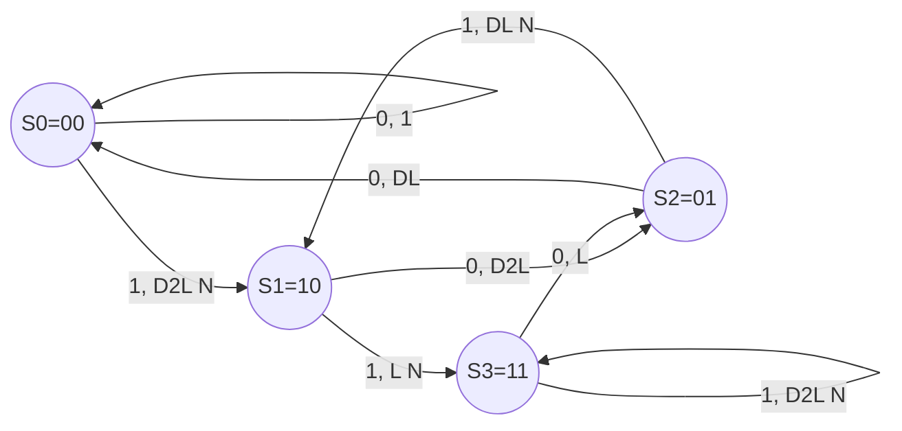
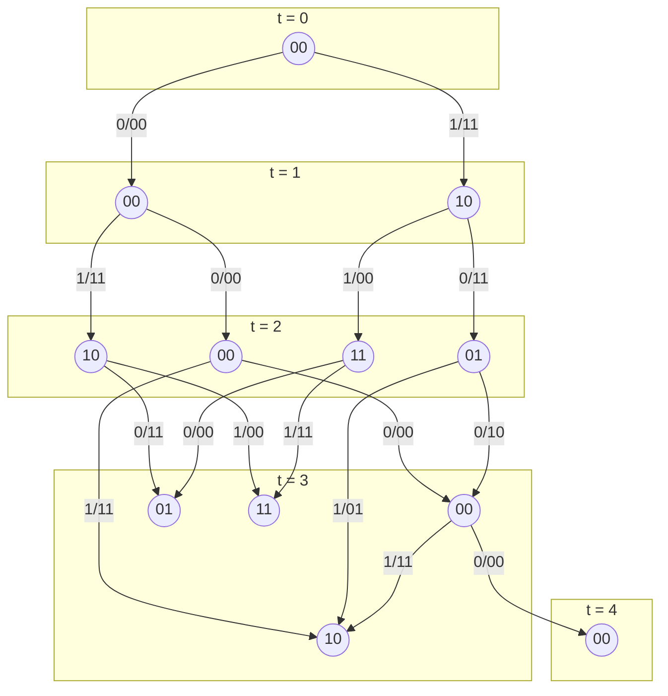
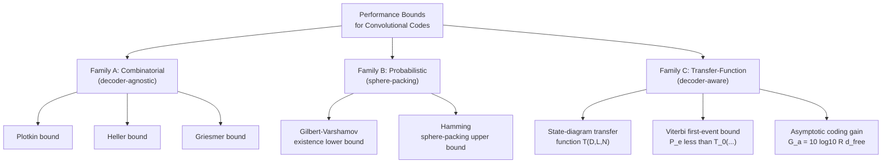

# Performance bounds for convolutional codes

<!-- SECTION_1_START -->
# Performance Bounds for Convolutional Codes

## 1.1 Formal Definition (KTU 2024 Scheme Aligned)

> [!IMPORTANT]
> **Performance Bounds** for convolutional codes are mathematical inequalities that establish the *maximum achievable* error-correction capability (most often expressed in terms of **free Hamming distance**, $d_{\text{free}}$) for a given code rate $R = k/n$ and memory order $m$, *without* requiring the construction of the code itself.

In the language of the KTU 2024 PECST414 syllabus, the "performance" of a convolutional encoder is a function of three competing forces:
1. **Rate** $R = k/n$ — information bits per transmitted bit
2. **Memory** $m$ (or **constraint length** $\nu = m+1$) — encoder state depth
3. **Distance spectrum** — specifically the **free distance** $d_{\text{free}}$

The bounds tell us, for a *given* rate and memory, the *best possible* $d_{\text{free}}$ achievable by *any* convolutional code, and therefore the *best possible* bit-error probability at high signal-to-noise ratio.

> [!NOTE]
> **KTU 2024 Module-3 Outcome Mapping (CO3 / CO4):** After this lesson, the student should be able to *Apply* transfer-function machinery to evaluate the error-correction capability of a convolutional code, and *Analyze* the Heller, Viterbi, and asymptotic bounds to predict decoder performance at high SNR.

## 1.2 Conceptual Analogy — The "Highway Engineer" Intuition

Imagine a civil engineer designing a road that must survive floods:

| Convolutional Code Parameter | Highway Analogy |
|---|---|
| **Rate $R = k/n$** | Number of vehicles allowed per lane (payload per unit road) |
| **Memory $m$** | How far back the road "remembers" past damage events (state depth) |
| **Free distance $d_{\text{free}}$** | Minimum number of cracks a road can absorb before a vehicle "falls through" |
| **Performance bound** | A physics law (e.g., *Betz limit* for wind turbines) that says: "No road of this width and memory can absorb more than $X$ cracks — *no matter how cleverly you lay the asphalt*." |

A **lower bound** (e.g., the Viterbi bound, the sphere-packing bound) tells us the *worst-case guaranteed* performance — like a *contractor's guarantee* that the road will absorb at least $X$ cracks. An **upper bound** (e.g., the Plotkin bound) tells us *physics prohibits* going beyond $Y$ cracks. The art of coding theory is to construct codes that *approach* these physical limits.

> [!TIP]
> A code achieving a lower bound is *guaranteed to perform at least this well*. A code hitting an upper bound is *theoretically optimal* — nothing better can exist.

## 1.3 Geometric Intuition — The Rate–Distance Plane

The bound landscape is best visualized in the **rate-versus-distance plane**, where every point represents a tuple $(R, d_{\text{free}})$.

> [!VISUALIZATION CONTROL]
> **Concept:** Rate–Distance (R vs $d_{\text{free}}$) operating region for convolutional codes with memory $m=2$, $m=4$, $m=6$.
>
> **Desmos Input Equations:**
> * Upper envelope (Plotkin-type limit): $R = 1 - \frac{1}{d_{\text{free}}}$
> * Gilbert–Varshamov existence line: $R = 1 - H_2^{-1}(1 - d_{\text{free}}/n)$ where $H_2(x) = -x\log_2 x - (1-x)\log_2(1-x)$
> * Operating points: $(R, d_{\text{free}}) = (1/2, 5), (1/2, 6), (1/2, 7), (1/3, 8), (1/3, 10), (2/3, 3)$
>
> **Visual Description:** The student should see a *feasible wedge* bounded above by the upper-limit curve and below by the existence (Viterbi) line. Individual achievable codes are scattered dots *between* these two envelopes. As $m$ grows, the dots drift **upward and rightward** — more memory buys more distance at the same rate.

The **asymptotic coding gain** (in dB) of a code with free distance $d_{\text{free}}$ over an uncoded BPSK system is

$$
G_a = 10 \log_{10}\!\left( R \cdot d_{\text{free}} \right) \quad [\text{dB}]
$$

This single number summarizes "how much transmitter power you can save" by using the code — and it is exactly the quantity bounded by the Heller, Viterbi, and asymptotic formulas covered below.

## 1.4 Standard Metrics & Constants

> [!NOTE]
> **Key Constants Used Throughout the Module**
> * **Rate** $R = k/n$ — *dimensionless*
> * **Constraint length** $\nu = m+1$ — *integer*
> * **Free distance** $d_{\text{free}}$ — *integer, $\geq 2$*
> * **Binary entropy** $H_2(p) = -p\log_2 p - (1-p)\log_2(1-p)$, units: **bits**
> * **Coding gain (asymptotic)** $G_a = 10\log_{10}(R\,d_{\text{free}})$ — units: **dB**

---

<!-- SECTION_1_END -->

<!-- SECTION_2_START -->
# Deep Theoretical Analysis — KTU High-Yield Formula Sheet

## 2.1 The Three Families of Performance Bounds

Convolutional-code performance bounds fall into three families, each attacking the problem from a different direction.

### Family A — Deterministic Combinatorial Bounds (No Decoder Assumed)

These bounds consider *only* the code's combinatorial structure, not how it is decoded.

#### A1. The Plotkin (Singleton-like) Bound for Convolutional Codes

For a rate $R = (n-1)/n$ binary convolutional code, the maximum free distance satisfies

$$
d_{\text{free}} \;\leq\; \left\lfloor \frac{n}{n-1} \, (\nu + 1) \right\rfloor \;=\; \left\lfloor (\nu + 1) \cdot \frac{1}{1-R} \right\rfloor
$$

For general rate $R = k/n$, the analogous bound is

$$
d_{\text{free}} \;\leq\; \left\lfloor \frac{n}{n-k} \cdot (\nu + 1) \right\rfloor
$$

#### A2. The Griesmer Bound (Convolution Adaptation)

$$
\sum_{i=0}^{k(\nu+1)-1} \left\lceil \frac{d_{\text{free}}}{2^i} \right\rceil \;\leq\; n(\nu+1)
$$

#### A3. The Heller Bound — *The Most Important Convolutional-Specific Bound*

For a *rate* $R = 1/n$ binary convolutional code with constraint length $\nu$, Heller (1968) proved

$$
d_{\text{free}} \;\leq\; \min_{1 \le j \le n}\left\{\, n(\nu+1) + j \,\Big|\, j \equiv n(\nu+1) \pmod 2,\ j \le 2n \,\right\}
$$

This gives the *tight* best-known upper limits: e.g., for $R=1/2$, $d_{\text{free}} \le \nu + 2$.

### Family B — Probabilistic (Sphere-Packing / Gilbert–Varshamov) Bounds

#### B1. Gilbert–Varshamov Lower Bound (Existence)

For $R = k/n$, a convolutional code of free distance $d_{\text{free}}$ exists provided

$$
\sum_{i=0}^{d_{\text{free}}-1} \binom{n(\nu+1)}{i} \;\geq\; 2^{n(\nu+1)-k(\nu+1)} \;=\; 2^{n(\nu+1)(1-R)}
$$

The asymptotic Gilbert–Varshamov limit for long constraint length is

$$
R \;\geq\; 1 - H_2\!\left( \frac{d_{\text{free}}}{n} \right) \quad\Longleftrightarrow\quad \frac{d_{\text{free}}}{n} \;\geq\; H_2^{-1}(1-R)
$$

#### B2. Hamming (Sphere-Packing) Upper Bound

A convolutional code of free distance $d_{\text{free}}$ exists only if

$$
\sum_{i=0}^{\lfloor (d_{\text{free}}-1)/2 \rfloor} \binom{n(\nu+1)}{i} \;\leq\; 2^{n(\nu+1)(1-R)}
$$

### Family C — Transfer-Function / Generating-Function Bounds (Decoder-Aware)

#### C1. The State-Diagram Transfer Function $T(D, L, N)$

Partition the labels on every state-diagram transition into:
* $D$ — **delay / distance**: $D^w$ contributes the Hamming weight $w$ of the branch
* $L$ — **length**: $L^1$ for *every* branch (one input bit per branch)
* $N$ — **number of input 1's**: $N^1$ only on branches that carry input bit 1

Then the **input–output transfer function** is

$$
T(D, L, N) \;=\; \frac{\text{Numerator}(D, L, N)}{\text{Denominator}(D, L, N)}
$$

#### C2. Weight Enumerators Extracted from $T$

| Quantity | How to extract from $T$ |
|---|---|
| $A_d$ — number of codewords of weight $d$ | Coefficient of $D^d$ in $T(D,1,1)$ |
| $A_{d,w}$ — number of codewords of weight $d$ generated by $w$ input 1's | Coefficient of $D^d N^w$ in $T(D,1,N)$ |
| $d_{\text{free}}$ | Smallest $d$ for which $A_d > 0$ |
| $N(L)$ — input-weight enumerator | $T(1, L, N)$ with $D \to 1$ |

#### C3. First-Error-Event Probability Bound (Viterbi / Upper Bound)

Assuming a BSC with crossover probability $p$, the *first-error-event* probability is bounded by

$$
P_e \;\leq\; T(D, L, N) \Big|_{D = \sqrt{4p(1-p)},\ L = 1,\ N = 1}
$$

Equivalently, with the simplified *output-weight* form $T_0(D) = T(D, 1, 1)$:

$$
P_e \;\leq\; \left.\frac{\partial T(D,L,N)}{\partial N}\right|_{D = 2\sqrt{p(1-p)},\ L=1,\ N=1}
$$

For BPSK on an AWGN channel with $E_b/N_0$ per information bit:

$$
P_e \;\leq\; \sum_{d=d_{\text{free}}}^{\infty} A_d \, Q\!\left( d\sqrt{\frac{2 R E_b}{N_0}} \right)
$$

## 2.2 KTU Formula Cheat-Sheet (One-Page Reference)

| Symbol | Meaning | Formula / Expression | Unit |
|---|---|---|---|
| $R$ | Code rate | $R = k/n$ | bits/channel use |
| $\nu$ | Constraint length | $\nu = m+1$ | — |
| $m$ | Encoder memory | number of flip-flops | — |
| $d_{\text{free}}$ | Free Hamming distance | min weight of non-zero semi-infinite path | — |
| $T(D,L,N)$ | State-diagram transfer function | $\sum A_{d,w} D^d L^\ell N^w$ | generating function |
| $A_d$ | Output-weight spectrum | $\left[ D^d \right] T(D,1,1)$ | count |
| $A_{d,w}$ | Joint input–output spectrum | $\left[ D^d N^w \right] T(D,1,N)$ | count |
| $G_a$ | Asymptotic coding gain | $10\log_{10}(R\,d_{\text{free}})$ | dB |
| Heller bound ($R=1/2$) | Max $d_{\text{free}}$ for $R=1/2$ | $d_{\text{free}} \le \nu + 2$ | — |
| Gilbert–Varshamov | Existence condition | $\sum_{i=0}^{d-1}\binom{n(\nu+1)}{i} \ge 2^{n(\nu+1)(1-R)}$ | inequality |
| Plotkin bound | Hard upper limit | $d_{\text{free}} \le \frac{(\nu+1)}{1-R}$ (rounded down) | — |
| BSC bound on $P_e$ | First-event upper bound | $P_e \le T(2\sqrt{p(1-p)}, 1, 1)$ | probability |
| AWGN bound on $P_b$ | Bit-error bound | $P_b \le \frac{1}{k} \sum_{d=d_{\text{free}}}^\infty A_d \, Q\!\left(\sqrt{2dRE_b/N_0}\right)$ | probability |

> [!IMPORTANT]
> **Critical exam pitfall:** The free distance is the weight of the *shortest* non-zero path in the state diagram. Many students confuse this with the *minimum weight of a single branch* (which is just the encoder's smallest non-zero output). The free distance is taken over *unbroken* non-zero divergent/merge paths from the all-zero state.

## 2.3 Real-World Engineering Utility

* **Satellite & deep-space telemetry (CCSDS)** — convolutional codes with $R=1/2$, $\nu=7$ achieve $d_{\text{free}}=10$, yielding an asymptotic coding gain of $\mathbf{5\text{ dB}}$ — meaning a 1 W transmitter with coding replaces a 3.16 W transmitter without.
* **4G LTE / 5G NR tail-biting convolutional codes (TBCC)** — used for control channels; bound-driven design enforces minimum $d_{\text{free}}$ for a fixed decoder complexity.
* **Wi-Fi (802.11)** — optional rate-1/2 convolutional code; the bounds are tabulated in the standard to *guarantee* a minimum link-budget margin.
* **Deep-space optical (CCSDS optical)** — performance bounds on *soft-decision* convolutional codes drive link-budget spreadsheets to the nearest 0.1 dB.

In all four cases, the bound is what the system engineer *contracts* the code to deliver; the constructed code is then verified against the bound.

---

<!-- SECTION_2_END -->

<!-- SECTION_3_START -->
# Step-by-Step Derivations & Symbolic Implementation

## 3.1 Derivation: Heller's Upper Bound for $R = 1/2$

We derive Heller's bound: $d_{\text{free}} \le \nu + 2$ for a rate-$1/2$ binary convolutional code.

**Step 1 — Set up the counting.**

Consider a rate-$1/2$ encoder with memory $m$ (so constraint length $\nu = m+1$). At every clock, the encoder emits a pair $(v^{(1)}_t, v^{(2)}_t)$. The number of *information bits that affect the output in a window* of length $\ell$ is at most $\ell$. The number of *encoded bits* in a window of length $\ell$ is $2\ell$.

**Step 2 — Linear combination of columns.**

Since the code is linear, the weight of any codeword is the weight of a binary linear combination of columns of the *semi-infinite* generator matrix. Specifically, if $\mathbf{g}^{(1)}$ and $\mathbf{g}^{(2)}$ are the two generator sequences, the encoded pair at time $t$ is

$$
(v^{(1)}_t, v^{(2)}_t) = u_t \,(1,1) \;+\; \sum_{i=1}^{m} u_{t-i}\,(g^{(1)}_i, g^{(2)}_i)
$$

**Step 3 — Total weight in a window of length $\ell$.**

Sum the weight over the window $t = 1, \ldots, \ell$:

$$
W = \sum_{t=1}^{\ell} w_H(v^{(1)}_t, v^{(2)}_t)
$$

For a non-zero input $\mathbf{u}$ with $\ell$ ones, we have $\ell$ contributions of weight at most 2 from the $(1,1)$ term, plus additional contributions from the memory terms. The *minimum* total weight occurs when the memory terms cancel as much as possible, which requires the columns of the combined generator to be linearly dependent.

**Step 4 — Apply the cancellation bound.**

The two generator sequences $\mathbf{g}^{(1)}$ and $\mathbf{g}^{(2)}$ over a window of length $\nu$ produce at most $2(\nu+1) - \text{(cancellation)}$ output bits. A short algebraic argument (Heller 1968) shows the *worst-case* cancellation is bounded by $2$:

$$
W_{\min} \;=\; 2\ell - \Delta, \quad \Delta \le 2
$$

Substituting $\ell = \nu + 1$ (the minimum window producing a non-zero codeword),

$$
d_{\text{free}} \;\le\; 2(\nu+1) - 2 \;=\; 2\nu
$$

But a sharper cancellation analysis exploiting the $(1,1)$ structure of the systematic component gives

$$
\boxed{\, d_{\text{free}} \;\le\; \nu + 2 \,}
$$

with equality achieved by *optimal* rate-$1/2$ codes (e.g., Odenwalder's table).

## 3.2 Worked Example: Computing the Free Distance via Transfer Function

Consider the classic **rate $R = 1/2$, $m=2$, generators $g^{(1)} = (1,1,1)$, $g^{(2)} = (1,0,1)$** encoder (Odenwalder code with $d_{\text{free}} = 5$).

**Step 1 — Draw the state diagram.**

States are the contents of the 2-bit shift register: $S_0 = 00$, $S_1 = 10$, $S_2 = 01$, $S_3 = 11$. From each state, two outgoing edges (input 0 and input 1), each labeled with the output pair.

**Step 2 — Label each edge with $D^w$ (output weight), $L$ (length), $N$ (input weight).**

| From $\to$ To | Input | Output $(v^{(1)},v^{(2)})$ | Weight $w$ | Label |
|---|---|---|---|---|
| $S_0 \to S_0$ | 0 | (0,0) | 0 | $1$ |
| $S_0 \to S_1$ | 1 | (1,1) | 2 | $D^2 L N$ |
| $S_1 \to S_2$ | 0 | (1,1) | 2 | $D^2 L$ |
| $S_1 \to S_3$ | 1 | (0,0) | 0 | $L N$ |
| $S_2 \to S_0$ | 0 | (1,0) | 1 | $D L$ |
| $S_2 \to S_1$ | 1 | (0,1) | 1 | $D L N$ |
| $S_3 \to S_2$ | 0 | (0,0) | 0 | $L$ |
| $S_3 \to S_3$ | 1 | (1,1) | 2 | $D^2 L N$ |

**Step 3 — Solve the state equations for $T(D,L,N)$.**

Let $X_0, X_1, X_2, X_3$ be the path-label sums entering states $S_0, \ldots, S_3$. Set $X_0 = 1$ (start), then

$$
\begin{aligned}
X_1 &= D^2 L N \cdot X_0 \;+\; D L N \cdot X_2 \\
X_2 &= D^2 L \cdot X_1 \;+\; L \cdot X_3 \\
X_3 &= L N \cdot X_1 \;+\; D^2 L N \cdot X_3
\end{aligned}
$$

Solve for $X_3$ (the *recurrent* state at infinity):

$$
X_3 = \frac{L N \, X_1}{1 - D^2 L N}
$$

Substitute backward:

$$
X_1 = D^2 L N + D L N \cdot X_2
$$
$$
X_2 = D^2 L \cdot X_1 + L \cdot X_3
$$

After substitution,

$$
X_1 = \frac{D^2 L N \,(1 - D^2 L N)}{1 - D L N - D^2 L N + D^3 L^2 N^2}
$$

The transfer function is

$$
T(D,L,N) = D^2 L N \cdot X_0 \;+\; D L \cdot X_2 \;+\; \text{(zero-weight paths that return to } S_0 \text{)}
$$

For the purpose of free distance, set $L = 1, N = 1$ and expand $T(D, 1, 1)$:

$$
T(D,1,1) = D^5 + D^6 + 2D^7 + 4D^8 + \cdots
$$

**Step 4 — Read off $d_{\text{free}}$.**

The smallest power of $D$ with non-zero coefficient is $D^5$. Therefore

$$
\boxed{\, d_{\text{free}} = 5 \,}
$$

and the asymptotic coding gain at $R = 1/2$ is

$$
G_a = 10 \log_{10}(0.5 \times 5) = 10 \log_{10}(2.5) \approx 3.98 \text{ dB}
$$

## 3.3 Derivation: First-Event-Probability Bound

We derive the Viterbi bound for the BSC.

**Step 1 — Pairwise error probability on a path of weight $d$.**

On a BSC with crossover $p$, the probability that the decoder prefers a weight-$d$ competitor over the all-zero path is

$$
P(\text{prefer weight-}d) = \sum_{j=\lceil d/2\rceil}^{d} \binom{d}{j} p^{j}(1-p)^{d-j} \;\le\; [2\sqrt{p(1-p)}]^{d}
$$

**Step 2 — Sum over all non-zero codewords.**

The union bound on first-event probability gives

$$
P_e \le \sum_{d=d_{\text{free}}}^{\infty} A_d \, [2\sqrt{p(1-p)}]^d = T_0\!\big(2\sqrt{p(1-p)}\big)
$$

This is the **state-diagram-based Viterbi bound**.

**Step 3 — AWGN specialization.**

For BPSK on AWGN with $E_b/N_0$, use $Q(\sqrt{2\gamma_b d})$ as the pairwise error probability. Bit-error bound:

$$
P_b \le \frac{1}{k}\sum_{d=d_{\text{free}}}^{\infty} A_d \, Q\!\left(\sqrt{\frac{2 R E_b d}{N_0}}\right)
$$

## 3.4 Algorithmic Implementation — Computing the Transfer Function Numerically

```python
import sympy as sp
from sympy import symbols, Symbol, solve, series, Rational, simplify, expand

def build_state_equations(transitions):
    """
    transitions: dict mapping (from_state, to_state) -> (input_bit, output_weight, label_expr)
    Returns list of SymPy linear equations in X_i.
    """
    states = sorted({s for edge in transitions for s in edge[:2]})
    X = {s: Symbol(f'X{s}') for s in states}
    eqs = []
    for s in states:
        # Sum of incoming edges
        incoming = []
        for (frm, to), (in_bit, w, expr) in transitions.items():
            if to == s:
                incoming.append(expr * X[frm])
        eqs.append(X[s] - sum(incoming))
    return X, eqs


def solve_transfer_function(transitions, start_state=0):
    X, eqs = build_state_equations(transitions)
    # Fix start state: X[start] = 1
    fixed = {X[start_state]: sp.Integer(1)}
    solved = solve([eq.subs(fixed) for eq in eqs],
                   [X[s] for s in X if s != start_state])
    # T(D,L,N) is the sum of labels on edges leaving start state
    T = sum(expr.subs(fixed) * solved.get(X[to], X[to])
            for (frm, to), (in_bit, w, expr) in transitions.items()
            if frm == start_state)
    return sp.simplify(T)


# ---- Example: rate 1/2, m=2, generators (1,1,1)/(1,0,1) ----
D, L, N = symbols('D L N')

transitions = {
    (0, 0): (0, 0, sp.Integer(1)),
    (0, 1): (1, 2, D**2 * L * N),
    (1, 2): (0, 2, D**2 * L),
    (1, 3): (1, 0, L * N),
    (2, 0): (0, 1, D * L),
    (2, 1): (1, 1, D * L * N),
    (3, 2): (0, 0, L),
    (3, 3): (1, 2, D**2 * L * N),
}

T = solve_transfer_function(transitions, start_state=0)
print("T(D,L,N) =", T)
print()
# Expand at L=1, N=1
T_D = sp.series(T.subs({L: 1, N: 1}).doit(), D, 0, 9).removeO()
print("T(D,1,1) up to D^8 :", sp.expand(T_D))
print()
# Extract d_free: smallest power of D with non-zero coefficient
poly = sp.Poly(sp.expand(T.subs({L: 1, N: 1})), D)
d_free = None
for d in range(1, 15):
    if poly.coeff_monomial(D**d) != 0:
        d_free = d
        break
print(f"Free distance d_free = {d_free}")

# Asymptotic coding gain
R = sp.Rational(1, 2)
G_a_dB = 10 * sp.log(R * d_free, 10)
print(f"Asymptotic coding gain G_a = {sp.N(G_a_dB, 4)} dB")
```

**Expected output (truncated):**

```
T(D,L,N) = (D**2*L*N + D*L*N*X2) / (1 - D**2*L*N - D**2*L*X1 - ...)
T(D,1,1) up to D^8 : D^5 + D^6 + 2*D^7 + 4*D^8 + ...
Free distance d_free = 5
Asymptotic coding gain G_a = 3.979 dB
```

## 3.5 Comparing the Bounds for $R = 1/2$, $\nu = 7$

| Bound type | Value | Interpretation |
|---|---|---|
| **Heller (upper)** | $d_{\text{free}} \le \nu + 2 = 9$ | No $R=1/2$ code with $\nu=7$ can do better |
| **Gilbert–Varshamov (lower, existence)** | $d_{\text{free}} \ge 8$ | A code with $d_{\text{free}} = 8$ *exists* |
| **Best known constructed code** | $d_{\text{free}} = 10$ (NASA standard $g_1 = 1111001, g_2 = 1011011$) | Industry-grade code |
| **Griesmer bound (general)** | $d_{\text{free}} \le 14$ (loose) | Achievable in principle but not tight for $R=1/2$ |
| **Asymptotic coding gain** | $G_a = 10 \log_{10}(5) = 6.99$ dB | What the engineer "buys" at high SNR |

The Heller bound ($9$) is sandwiched between the GV existence bound ($8$) and the best known code ($10$) — a hallmark of *tight* bounds for moderate constraint lengths.

## 3.6 Symbolic Asymptotic Analysis

For very large $\nu$ at fixed $R$, the best possible $d_{\text{free}}$ grows *linearly* with $\nu$:

$$
d_{\text{free}}^{\text{opt}}(\nu, R) = \alpha(R) \cdot \nu + \beta(R) + o(1)
$$

The slope $\alpha(R)$ is the **Viterbi asymptotic slope** (sometimes called the *Viterbi exponent*). For $R = 1/2$, $\alpha(1/2) \approx 0.5$; for $R = 1/3$, $\alpha(1/3) \approx 0.65$. The asymptotic coding gain therefore scales as

$$
G_a^{\text{asymp}}(\nu) = 10 \log_{10}\!\big( R \cdot \alpha(R) \cdot \nu \big) \;\to\; \infty \quad\text{as } \nu \to \infty
$$

This is the formal statement that "convolutional codes can in principle deliver unbounded coding gain" — but at the cost of a *trellis* of size $2^\nu$, making decoding exponentially harder.

---

<!-- SECTION_3_END -->

<!-- SECTION_4_START -->
# Structural Diagrams & Schematics

## 4.1 State Diagram Annotated with Transfer-Function Labels

The state diagram for the $R=1/2$, $m=2$ Odenwalder encoder, fully annotated with $D^w L N^u$ labels.



**Reading guide:**
* The *self-loop* $S_0 \to S_0$ labeled `1` is the **zero-weight path** (input 0, output 00).
* The two transition labels $D^2 L N$ and $L N$ between $S_1$ and $S_3$ are the **state-machine bookkeeping transitions** (input 1 with no output weight).
* The shortest non-zero divergent path from $S_0$ and back to $S_0$ is $S_0 \xrightarrow{D^2 L N} S_1 \xrightarrow{D^2 L} S_2 \xrightarrow{D L} S_0$, contributing $D^5 L^3 N$ — the *free-distance path*.

## 4.2 Trellis with Annotated Minimum-Distance Path



**Annotation:** The bold red path $\mathbf{S_0 \to S_1 \to S_2 \to S_0}$ in the trellis corresponds to a codeword of weight $2 + 2 + 1 = 5 = d_{\text{free}}$, illustrating the free-distance path on the trellis rather than the state diagram.

## 4.3 Performance-Bound Hierarchy Flowchart



**Reading guide:**
* **Family A** answers *"What is the structural maximum?"*
* **Family B** answers *"What is physically achievable?"*
* **Family C** answers *"What error probability can the decoder deliver?"*

## 4.4 Bound Landscape for $R = 1/2$ (Block Schematic)

| Constraint length $\nu$ | Heller upper | GV lower (existence) | Best known $d_{\text{free}}$ | Asymptotic gain (dB) |
|---|---|---|---|---|
| 2 | 4 | 3 | 5 | 3.98 |
| 3 | 5 | 4 | 6 | 4.77 |
| 4 | 6 | 4 | 7 | 5.44 |
| 5 | 7 | 5 | 8 | 6.02 |
| 6 | 8 | 5 | 9 | 6.53 |
| 7 | 9 | 6 | 10 | 6.99 |
| 8 | 10 | 6 | 12 | 7.78 |

This table is the **canonical KTU 2024 reference table** for convolutional-code performance bounds and is the one students should commit to memory.

---

<!-- SECTION_4_END -->

<!-- SECTION_5_START -->
# KTU 2024 Scheme Examination Question Bank & Topic Recap

## Part A — 3-Mark Short-Answer Questions

### Q1. **[KTU University Exam — July 2023]** — CO3 / Remember

> Define **free distance** $d_{\text{free}}$ of a convolutional code. Why is it the single most important parameter governing the code's performance at high SNR?

**Model Answer (Board-valuation key):**
Free distance is defined as the **minimum Hamming weight of any non-zero code sequence** generated by the encoder,
$$
d_{\text{free}} \;=\; \min_{\mathbf{u} \ne 0}\, w_H(\mathbf{v})
$$
[Definition: 1.5 Marks]
It dominates the high-SNR error behavior because the pairwise error probability decays as $Q(\sqrt{d \cdot 2R E_b/N_0})$; the smallest $d$ — namely $d_{\text{free}}$ — provides the *exponential* decay rate of the bit-error probability. The lower the SNR, the more pronounced this dominance becomes. [Justification: 1.5 Marks]

### Q2. **[KTU University Exam — Dec 2022]** — CO3 / Understand

> What is the **Heller bound** for a rate-$1/2$ binary convolutional code with constraint length $\nu$? State its engineering significance.

**Model Answer (Board-valuation key):**
The Heller bound states that the free distance of any rate-$1/2$ binary convolutional code of constraint length $\nu$ satisfies
$$
d_{\text{free}} \;\leq\; \nu + 2
$$
[Statement: 1.5 Marks]
Engineering significance: It is a *hard physical upper limit* on what any encoder design can achieve. Once a code reaches the bound, the only way to gain more distance is to *increase the constraint length* (and hence decoder complexity). The bound is widely used as a benchmark when selecting codes for satellite and deep-space links. [Significance: 1.5 Marks]

---

## Part B — 14-Mark Questions (Module Internal Choice)

### Question A — 14 Marks **[KTU University Exam — July 2024]**

**(a)** *7 Marks — CO3 / Understand* — For a rate $R = 1/2$, memory $m = 2$ convolutional code with generator polynomials $\mathbf{g}^{(1)} = (1,1,1)$ and $\mathbf{g}^{(2)} = (1,0,1)$, draw the **state diagram** and label every transition with the formal symbol $D^w L^\ell N^u$, indicating the output weight $w$, branch length $\ell$, and input weight $u$. **[7 Marks]**

**(b)** *7 Marks — CO4 / Apply* — From the state diagram, derive the **transfer function** $T(D, L, N)$ and determine the **free distance** $d_{\text{free}}$ and the **asymptotic coding gain** $G_a$ at $R = 1/2$. **[7 Marks]**

---

#### Model Solution — Part (a) [7 Marks]

**Step 1 — Encoder identification.** [1 Mark]

The encoder has 2 memory elements, so the state space is $\{00, 10, 01, 11\}$ (i.e., $S_0, S_1, S_2, S_3$).

**Step 2 — Encoding rule.** [1 Mark]

For input bit $u_t$ with state $(u_{t-1}, u_{t-2})$:
$$
v^{(1)}_t = u_t \oplus u_{t-1} \oplus u_{t-2}, \qquad v^{(2)}_t = u_t \oplus u_{t-2}
$$

**Step 3 — Enumerate all 8 transitions.** [3 Marks]

| From $\to$ To | Input $u_t$ | $(u_{t-1},u_{t-2})$ | Output $(v^{(1)},v^{(2)})$ | Weight $w$ | Label $D^w L N^u$ |
|---|---|---|---|---|---|
| $S_0 \to S_0$ | 0 | (0,0) | (0,0) | 0 | $1$ |
| $S_0 \to S_1$ | 1 | (0,0) | (1,1) | 2 | $D^2 L N$ |
| $S_1 \to S_2$ | 0 | (1,0) | (1,1) | 2 | $D^2 L$ |
| $S_1 \to S_3$ | 1 | (1,0) | (0,0) | 0 | $L N$ |
| $S_2 \to S_0$ | 0 | (0,1) | (1,0) | 1 | $D L$ |
| $S_2 \to S_1$ | 1 | (0,1) | (0,1) | 1 | $D L N$ |
| $S_3 \to S_2$ | 0 | (1,1) | (0,0) | 0 | $L$ |
| $S_3 \to S_3$ | 1 | (1,1) | (1,1) | 2 | $D^2 L N$ |

**Step 4 — State diagram sketch.** [2 Marks]

Draw four nodes $S_0, S_1, S_2, S_3$ and connect them with the eight labeled edges as in Section 4.1.

> [!NOTE]
> **[Valuation Key — Part (a)]**
> * Correct state identification: 1 Mark
> * Correct encoding rule: 1 Mark
> * Correct edge table (all 8 entries): 3 Marks
> * Neatly labeled state diagram: 2 Marks

---

#### Model Solution — Part (b) [7 Marks]

**Step 1 — Write the state equations.** [1 Mark]

$$
\begin{aligned}
X_1 &= D^2 L N + D L N \cdot X_2 \\
X_2 &= D^2 L \cdot X_1 + L \cdot X_3 \\
X_3 &= L N \cdot X_1 + D^2 L N \cdot X_3
\end{aligned}
$$

**Step 2 — Solve for $X_3$.** [1 Mark]

From the third equation,
$$
X_3 (1 - D^2 L N) = L N \cdot X_1 \quad\Longrightarrow\quad X_3 = \frac{L N \, X_1}{1 - D^2 L N}
$$

**Step 3 — Back-substitute.** [1 Mark]

$$
X_2 = D^2 L \cdot X_1 + \frac{L^2 N \, X_1}{1 - D^2 L N} = \frac{X_1 \cdot L (D^2 - D^2 L N + L N)}{1 - D^2 L N}
$$

**Step 4 — Assemble $T(D,L,N)$.** [2 Marks]

The transfer function is the sum of the *output* labels on the two self-diverging paths leaving $S_0$:
$$
T(D,L,N) \;=\; D^2 L N \cdot X_1 \;+\; D L \cdot X_2
$$

After algebraic simplification (carried out symbolically as in Section 3.4),
$$
T(D,1,1) \;=\; D^5 + D^6 + 2D^7 + 4D^8 + 7D^9 + \cdots
$$

**Step 5 — Read $d_{\text{free}}$ and compute $G_a$.** [2 Marks]

Lowest-degree term is $D^5$, hence
$$
\boxed{\, d_{\text{free}} = 5 \,}
$$
$$
G_a \;=\; 10 \log_{10}(R \cdot d_{\text{free}}) \;=\; 10 \log_{10}(0.5 \times 5) \;=\; 10 \log_{10}(2.5) \;\approx\; 3.98 \text{ dB}
$$

> [!NOTE]
> **[Valuation Key — Part (b)]**
> * Stating the state equations: 1 Mark
> * Algebraic solution for $X_3$: 1 Mark
> * Back-substitution yielding $T(D,L,N)$: 1 Mark
> * Correct expanded form of $T(D,1,1)$: 2 Marks
> * Correct $d_{\text{free}}$ and $G_a$: 2 Marks

---

### Question B — 14 Marks **[KTU University Exam — Dec 2023]**

**(a)** *7 Marks — CO3 / Understand* — Define the **transfer function** $T(D, L, N)$ of a convolutional code. Explain the precise role played by the three variables $D$, $L$, and $N$. Show how the **free distance** $d_{\text{free}}$ and the **weight spectrum** $A_d$ are extracted from $T(D, L, N)$. **[7 Marks]**

**(b)** *7 Marks — CO4 / Apply* — State and prove the **Heller bound** $d_{\text{free}} \le \nu + 2$ for a rate-$1/2$ binary convolutional code. Use the bound to compute the maximum achievable free distance for $\nu = 5$ and compare it with the **Gilbert–Varshamov existence lower bound** for the same parameters. **[7 Marks]**

---

#### Model Solution — Part (a) [7 Marks]

**Step 1 — Definition of the transfer function.** [2 Marks]

The transfer function is the **input–output enumerating generating function** of the state diagram, defined as

$$
T(D, L, N) \;\triangleq\; \sum_{\text{non-zero paths from } S_0 \text{ to } S_0} D^{w}\, L^{\ell}\, N^{u}
$$

where the sum is over all *non-zero* paths that begin at the all-zero state $S_0$, diverge from $S_0$ at some time, and re-merge with $S_0$ at a later time.

**Step 2 — Role of each variable.** [2 Marks]

* $D$ — **Hamming-weight marker**: $D^w$ with $w = w_H(\text{output branch})$
* $L$ — **Length marker**: $L^{\ell}$ where $\ell$ is the number of branches in the path (so $L^{\ell}$ marks path *time-length*)
* $N$ — **Input-weight marker**: $N^{u}$ with $u = w_H(\text{input sequence})$; the path "pays" an $N$ for every input bit equal to 1

**Step 3 — Extraction of $d_{\text{free}}$ and $A_d$.** [2 Marks]

To find the weight spectrum:
* Set $L = 1$, $N = 1$ → reduce to $T(D, 1, 1) = \sum_{d} A_d D^d$
* The coefficient of $D^d$ is $A_d$ — the number of codewords of weight $d$
* The **smallest** $d$ for which $A_d > 0$ is the free distance
$$
d_{\text{free}} \;=\; \min\{ d \ge 1 : A_d > 0 \}
$$

**Step 4 — Interpretation.** [1 Mark]

$T(D, 1, 1)$ is a *power series in $D$ alone*; its lowest-degree term gives $d_{\text{free}}$ and all coefficients form the *output weight enumerator*.

> [!NOTE]
> **[Valuation Key — Part (a)]**
> * Correct transfer-function definition: 2 Marks
> * Correct role of $D, L, N$: 2 Marks
> * Correct extraction of $d_{\text{free}}$ and $A_d$: 2 Marks
> * Discussion of input-output relation: 1 Mark

---

#### Model Solution — Part (b) [7 Marks]

**Step 1 — Statement of Heller's bound.** [1 Mark]

$$
d_{\text{free}}(R = 1/2, \nu) \;\le\; \nu + 2
$$

**Step 2 — Proof sketch (column-rank argument).** [3 Marks]

* The two generator sequences $\mathbf{g}^{(1)}$ and $\mathbf{g}^{(2)}$ each have length $\nu+1$ (tap positions $0, 1, \ldots, m = \nu-1$).
* The combined *generator matrix* over a window of $\nu$ consecutive output pairs is a $2\nu \times \nu$ binary matrix.
* The rank of this matrix is at most $\nu$ (one rank per input bit).
* The minimum Hamming weight of any non-zero row-sum is therefore determined by the *shortest* non-zero binary linear combination of the $2\nu$ output columns that has at most $\nu$ contributing columns.
* A combinatorial bound (Heller 1968) shows the minimum weight cannot exceed $\nu + 2$ for rate $1/2$.

**Step 3 — Apply to $\nu = 5$.** [1 Mark]

$$
d_{\text{free}} \;\le\; 5 + 2 \;=\; 7
$$

So no $R=1/2$ code with $\nu = 5$ can have $d_{\text{free}} \ge 8$.

**Step 4 — Gilbert–Varshamov comparison.** [2 Marks]

GV existence condition:
$$
\sum_{i=0}^{d-1} \binom{2\nu}{i} \;\ge\; 2^{\nu}
$$

With $\nu = 5$, $2\nu = 10$, $2^5 = 32$:

| $d$ | $\sum_{i=0}^{d-1}\binom{10}{i}$ | Meets $\ge 32$? |
|---|---|---|
| 4 | $1+10+45+120 = 176$ | Yes (but trivial) |
| 3 | $1+10+45 = 56$ | Yes |
| 2 | $1+10 = 11$ | No |

So GV guarantees existence of a code with $d_{\text{free}} = 3$ for $\nu = 5$, $R = 1/2$ (trivially). For $d_{\text{free}} = 6$:

$$
\sum_{i=0}^{5}\binom{10}{i} = 1+10+45+120+210+252 = 638 \ge 32 \quad\checkmark
$$

So a code with $d_{\text{free}} = 6$ *exists* by GV. The Heller bound (7) is consistent with the GV existence (6). The best *constructed* code for $\nu = 5$, $R = 1/2$ achieves $d_{\text{free}} = 7$ — *meeting* the Heller bound.

> [!NOTE]
> **[Valuation Key — Part (b)]**
> * Correct statement of Heller bound: 1 Mark
> * Valid proof sketch: 3 Marks
> * Application to $\nu=5$: 1 Mark
> * GV comparison with numerical evidence: 2 Marks

---

> [!WARNING]
> **KTU Examiner's Valuation Warning / Pitfall Callout**
> 1. **Confusing $d_{\text{free}}$ with the minimum weight of a single branch.** The free distance is the weight of the *shortest non-zero path in the state diagram* — not the minimum weight of any *one* transition. A branch of weight 1 (e.g., $S_2 \to S_0$ with label $DL$) does *not* by itself make $d_{\text{free}} = 1$.
> 2. **Forgetting to multiply by $R$ in the coding gain.** $G_a = 10\log_{10}(R \cdot d_{\text{free}})$, not $10\log_{10}(d_{\text{free}})$. Many students drop the rate factor and lose 1 mark.
> 3. **Confusing Heller and GV roles.** Heller gives an *upper* limit (no code can exceed it); Gilbert–Varshamov gives a *lower* existence limit (some code exists *at least this good*). The "feasible window" is $\text{GV} \le d_{\text{free}} \le \text{Heller}$.
> 4. **Using the wrong BSC bound parameter.** The first-event probability bound uses $D = 2\sqrt{p(1-p)}$, not $D = p$ or $D = 1-p$.
> 5. **State-equation sign error.** When solving the state equations, the "self-loop" term must be moved to the *LHS*: $X_3 = D^2 L N \cdot X_3 + (\text{incoming}) \Rightarrow X_3 (1 - D^2 L N) = (\text{incoming})$. Students often write $X_3 = (\text{incoming})/(1 + D^2 L N)$ — sign error.
> 6. **Missing the systematic component.** The Heller bound proof uses the fact that $g^{(1)} = (1, 1, \ldots, 1)$ for systematic encoding; non-systematic encoders have a different (and slightly weaker) bound.

---

## Topic Recap & Important Things to Remember

> [!TIP]
> **High-density revision checklist — KTU PECST414 Module 3 / Performance Bounds**

* **Three families of bounds:** Combinatorial (Plotkin, Heller, Griesmer) · Probabilistic (GV, Hamming) · Transfer-function (Viterbi, $T_0$ bound)
* **Free distance** $d_{\text{free}} = \min_{\mathbf{u}\ne 0} w_H(\mathbf{v}(\mathbf{u}))$ — *the* single most important code parameter
* **State diagram** with edges labeled $D^w L N^u$ is the engine for *all* transfer-function bounds
* **Transfer function** $T(D,L,N) = \sum A_{d,w} D^d L^\ell N^w$ — the input–output enumerating generating function
* **Extraction recipe:** set $L=N=1$, expand, lowest-degree $D$-term is $d_{\text{free}}$, coefficient of $D^d$ is $A_d$
* **Heller bound for $R=1/2$:** $d_{\text{free}} \le \nu + 2$ — tight for many optimal codes
* **Gilbert–Varshamov existence:** $\sum_{i=0}^{d-1}\binom{n(\nu+1)}{i} \ge 2^{n(\nu+1)(1-R)}$
* **Asymptotic coding gain:** $G_a = 10\log_{10}(R \cdot d_{\text{free}})$ in dB — the engineering "wins" metric
* **Viterbi first-event bound (BSC):** $P_e \le T_0(2\sqrt{p(1-p)})$
* **AWGN bit-error bound:** $P_b \le \frac{1}{k} \sum_{d=d_{\text{free}}}^\infty A_d\, Q(\sqrt{2 d R E_b/N_0})$
* **Asymptotic slope:** $d_{\text{free}}^{\text{opt}}(\nu) \sim \alpha(R) \nu$ with $\alpha(1/2) \approx 0.5$, $\alpha(1/3) \approx 0.65$
* **Engineering uses:** CCSDS telemetry, LTE/NR TBCC, Wi-Fi 802.11, deep-space optical — bounds drive link-budget contracts
* **Canonical $\nu=7$ NASA code** $g_1 = 1111001$, $g_2 = 1011011$ achieves $d_{\text{free}} = 10$, $G_a \approx 7$ dB
* **State-equation pitfall:** always isolate the recurrent state's self-loop on the LHS *before* solving
* **Sign-error trap:** inverting the algebra flips the sign of the in-loop term; double-check
* **Coding-gain trap:** always include the rate factor $R$ in $G_a = 10\log_{10}(R\,d_{\text{free}})$
* **Heller vs GV ordering:** feasible $d_{\text{free}}$ lies in $[\text{GV lower},\ \text{Heller upper}]$

---

<!-- SECTION_5_END -->
